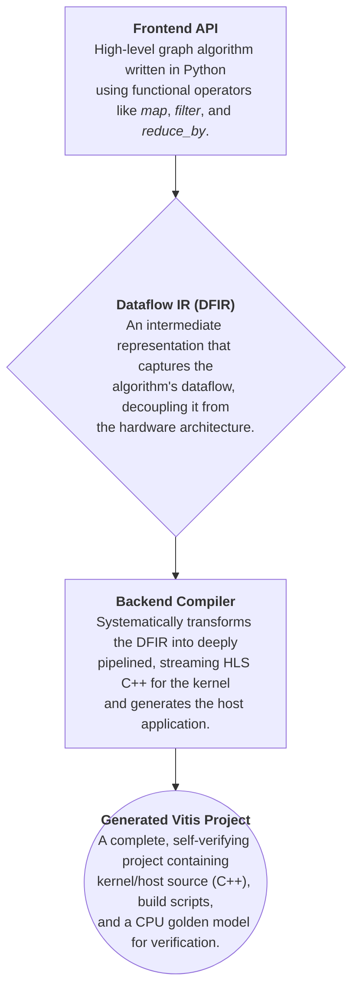

Project Path: test_GraphyFlow

Source Tree:

```txt
test_GraphyFlow
├── GraphyFlow
│   ├── README.md
│   ├── docs
│   │   ├── backend_host.md
│   │   ├── backend_kernel.md
│   │   ├── frontend.md
│   │   ├── graphyflow_big copy.cpp
│   │   └── ir.md
│   ├── graphyflow
│   │   ├── __init__.py
│   │   ├── backend_defines.py
│   │   ├── backend_manager.py
│   │   ├── backend_mem_manager.py
│   │   ├── backend_utils.py
│   │   ├── dataflow_ir.py
│   │   ├── dataflow_ir_datatype.py
│   │   ├── dataflow_ir_utils.py
│   │   ├── global_graph.py
│   │   ├── graph_types.py
│   │   ├── lambda_func.py
│   │   ├── passes.py
│   │   ├── project_generator.py
│   │   ├── project_template
│   │   │   ├── Makefile
│   │   │   ├── gen_random_graph.py
│   │   │   ├── global_para.mk
│   │   │   ├── run.sh
│   │   │   └── scripts
│   │   │       ├── clean.mk
│   │   │       ├── help.mk
│   │   │       ├── host
│   │   │       │   ├── acc_setup
│   │   │       │   │   ├── acc_setup.cpp
│   │   │       │   │   └── acc_setup.h
│   │   │       │   ├── fpga_executor.cpp
│   │   │       │   ├── fpga_executor.h
│   │   │       │   ├── graph_loader.cpp
│   │   │       │   ├── graph_loader.h
│   │   │       │   ├── graph_preprocess
│   │   │       │   │   ├── graph_preprocess.cpp
│   │   │       │   │   └── graph_preprocess.h
│   │   │       │   ├── host.cpp
│   │   │       │   ├── host.mk
│   │   │       │   ├── host_bellman_ford.cpp
│   │   │       │   ├── host_bellman_ford.h
│   │   │       │   ├── host_config.h
│   │   │       │   ├── host_verifier.cpp
│   │   │       │   ├── host_verifier.h
│   │   │       │   ├── xcl2.cpp
│   │   │       │   └── xcl2.h
│   │   │       ├── kernel
│   │   │       │   └── kernel.mk
│   │   │       ├── main.mk
│   │   │       └── utils.mk
│   │   ├── reduce_analysis.py
│   │   ├── simulate.py
│   │   └── visualize_ir.py
│   ├── implement_tests
│   │   ├── __init__.py
│   │   ├── task_1_1
│   │   │   └── test_logic_generation.py
│   │   ├── task_1_2
│   │   │   └── test_axi_kernel_generation.py
│   │   ├── task_1_3
│   │   │   └── test_common_header_generation.py
│   │   ├── task_1_4
│   │   │   └── test_m2s_generation.py
│   │   ├── task_1_5
│   │   │   └── test_s2m_generation.py
│   │   ├── task_1_6
│   │   │   └── test_final_kernel_generation.py
│   │   ├── task_2_2
│   │   │   └── test_host_code_generation.py
│   │   ├── task_3_1
│   │   │   └── test_project_generator.py
│   │   ├── task_3_2
│   │   │   └── test_script_generation.py
│   │   ├── task_4_1_reduce_refactor
│   │   │   ├── __init__.py
│   │   │   ├── test_multi_output_refactor.py
│   │   │   ├── test_refactor_v3.py
│   │   │   ├── test_subgraph_extraction.py
│   │   │   └── test_subgraph_refactoring.py
│   │   ├── task_4_2_simulator_enhancements
│   │   │   ├── __init__.py
│   │   │   ├── test_optimize_reduce.py
│   │   │   ├── test_reduce_analysis_pass.py
│   │   │   ├── test_simulate_fusedop.py
│   │   │   └── test_simulate_memread.py
│   │   └── task_5_1_memory
│   │       └── test_memory_manager.py
│   ├── others
│   │   ├── gen_pic.py
│   │   └── pic2.py
│   ├── tests
│   │   ├── dist.py
│   │   ├── gnn.py
│   │   ├── new_dist.py
│   │   ├── pr.py
│   │   ├── simple_example.py
│   │   ├── test.py
│   │   ├── test_new_dist_refactor.py
│   │   └── tmp.py
│   └── tmp_work
│       ├── Makefile
│       ├── gen_random_graph.py
│       ├── global_para.mk
│       ├── run.sh
│       ├── scripts
│       │   ├── clean.mk
│       │   ├── help.mk
│       │   ├── host
│       │   │   ├── acc_setup
│       │   │   │   ├── acc_setup.cpp
│       │   │   │   └── acc_setup.h
│       │   │   ├── common.h
│       │   │   ├── fpga_executor.cpp
│       │   │   ├── fpga_executor.h
│       │   │   ├── generated_host.cpp
│       │   │   ├── generated_host.h
│       │   │   ├── graph_loader.cpp
│       │   │   ├── graph_loader.h
│       │   │   ├── graph_preprocess
│       │   │   │   ├── graph_preprocess.cpp
│       │   │   │   └── graph_preprocess.h
│       │   │   ├── host.cpp
│       │   │   ├── host.mk
│       │   │   ├── host_bellman_ford.cpp
│       │   │   ├── host_bellman_ford.h
│       │   │   ├── host_config.h
│       │   │   ├── host_verifier.cpp
│       │   │   ├── host_verifier.h
│       │   │   ├── xcl2.cpp
│       │   │   └── xcl2.h
│       │   ├── kernel
│       │   │   ├── graphyflow_big.cpp
│       │   │   ├── graphyflow_big.h
│       │   │   ├── graphyflow_little.cpp
│       │   │   ├── graphyflow_little.h
│       │   │   ├── hbm_writer_big.cpp
│       │   │   ├── hbm_writer_little.cpp
│       │   │   ├── kernel.mk
│       │   │   └── shared_kernel_params.h
│       │   ├── main.mk
│       │   └── utils.mk
│       └── system.cfg
├── README.md
├── docs
│   ├── backend_host.md
│   ├── backend_kernel.md
│   ├── frontend.md
│   ├── graphyflow_big copy.cpp
│   └── ir.md
├── graphyflow
│   ├── __init__.py
│   ├── backend_defines.py
│   ├── backend_manager.py
│   ├── backend_mem_manager.py
│   ├── backend_utils.py
│   ├── dataflow_ir.py
│   ├── dataflow_ir_datatype.py
│   ├── dataflow_ir_utils.py
│   ├── global_graph.py
│   ├── graph_types.py
│   ├── lambda_func.py
│   ├── passes.py
│   ├── project_generator.py
│   ├── project_template
│   │   ├── Makefile
│   │   ├── gen_random_graph.py
│   │   ├── global_para.mk
│   │   ├── run.sh
│   │   └── scripts
│   │       ├── clean.mk
│   │       ├── help.mk
│   │       ├── host
│   │       │   ├── acc_setup
│   │       │   │   ├── acc_setup.cpp
│   │       │   │   └── acc_setup.h
│   │       │   ├── fpga_executor.cpp
│   │       │   ├── fpga_executor.h
│   │       │   ├── graph_loader.cpp
│   │       │   ├── graph_loader.h
│   │       │   ├── graph_preprocess
│   │       │   │   ├── graph_preprocess.cpp
│   │       │   │   └── graph_preprocess.h
│   │       │   ├── host.cpp
│   │       │   ├── host.mk
│   │       │   ├── host_bellman_ford.cpp
│   │       │   ├── host_bellman_ford.h
│   │       │   ├── host_config.h
│   │       │   ├── host_verifier.cpp
│   │       │   ├── host_verifier.h
│   │       │   ├── xcl2.cpp
│   │       │   └── xcl2.h
│   │       ├── kernel
│   │       │   └── kernel.mk
│   │       ├── main.mk
│   │       └── utils.mk
│   ├── reduce_analysis.py
│   ├── simulate.py
│   └── visualize_ir.py
├── implement_tests
│   ├── __init__.py
│   ├── task_1_1
│   │   └── test_logic_generation.py
│   ├── task_1_2
│   │   └── test_axi_kernel_generation.py
│   ├── task_1_3
│   │   └── test_common_header_generation.py
│   ├── task_1_4
│   │   └── test_m2s_generation.py
│   ├── task_1_5
│   │   └── test_s2m_generation.py
│   ├── task_1_6
│   │   └── test_final_kernel_generation.py
│   ├── task_2_2
│   │   └── test_host_code_generation.py
│   ├── task_3_1
│   │   └── test_project_generator.py
│   ├── task_3_2
│   │   └── test_script_generation.py
│   ├── task_4_1_reduce_refactor
│   │   ├── __init__.py
│   │   ├── test_multi_output_refactor.py
│   │   ├── test_refactor_v3.py
│   │   ├── test_subgraph_extraction.py
│   │   └── test_subgraph_refactoring.py
│   ├── task_4_2_simulator_enhancements
│   │   ├── __init__.py
│   │   ├── test_optimize_reduce.py
│   │   ├── test_reduce_analysis_pass.py
│   │   ├── test_simulate_fusedop.py
│   │   └── test_simulate_memread.py
│   └── task_5_1_memory
│       └── test_memory_manager.py
├── others
│   ├── gen_pic.py
│   └── pic2.py
├── tests
│   ├── dist.py
│   ├── gnn.py
│   ├── new_dist.py
│   ├── pr.py
│   ├── simple_example.py
│   ├── test.py
│   ├── test_new_dist_refactor.py
│   └── tmp.py
└── tmp_work
    ├── Makefile
    ├── gen_random_graph.py
    ├── global_para.mk
    ├── run.sh
    ├── scripts
    │   ├── clean.mk
    │   ├── help.mk
    │   ├── host
    │   │   ├── acc_setup
    │   │   │   ├── acc_setup.cpp
    │   │   │   └── acc_setup.h
    │   │   ├── common.h
    │   │   ├── fpga_executor.cpp
    │   │   ├── fpga_executor.h
    │   │   ├── generated_host.cpp
    │   │   ├── generated_host.h
    │   │   ├── graph_loader.cpp
    │   │   ├── graph_loader.h
    │   │   ├── graph_preprocess
    │   │   │   ├── graph_preprocess.cpp
    │   │   │   └── graph_preprocess.h
    │   │   ├── host.cpp
    │   │   ├── host.mk
    │   │   ├── host_bellman_ford.cpp
    │   │   ├── host_bellman_ford.h
    │   │   ├── host_config.h
    │   │   ├── host_verifier.cpp
    │   │   ├── host_verifier.h
    │   │   ├── xcl2.cpp
    │   │   └── xcl2.h
    │   ├── kernel
    │   │   ├── apply_kernel.cpp
    │   │   ├── big_merger.cpp
    │   │   ├── graphyflow_big.cpp
    │   │   ├── graphyflow_big.h
    │   │   ├── graphyflow_little.cpp
    │   │   ├── graphyflow_little.h
    │   │   ├── hbm_writer.cpp
    │   │   ├── kernel.mk
    │   │   ├── little_merger.cpp
    │   │   └── shared_kernel_params.h
    │   ├── main.mk
    │   └── utils.mk
    └── system.cfg

```

`test_GraphyFlow/GraphyFlow/README.md`:

```md
# GraphyFlow: A Flexible High-Level Synthesis Framework for Efficient Graph Computing on FPGAs

## 1\. Overview

GraphyFlow is a Python-based framework designed to simplify the development of graph algorithms for hardware acceleration on FPGAs. It provides a high-level, functional API for developers to express complex graph computations. The framework then automatically translates this high-level description into a Dataflow-Graph Intermediate Representation (DFG-IR), which is subsequently compiled into a complete, runnable Vitis HLS project, including HLS C++ for the kernel and C++ for the host application.

The primary goal of GraphyFlow is to abstract away the complexities of HLS and FPGA project management, allowing domain experts to focus on the algorithm's logic while still leveraging the performance of hardware acceleration.

## 2\. Core Concepts & Architecture

GraphyFlow employs a multi-stage compilation architecture to transform a high-level Python definition into a low-level hardware implementation.



## 3\. Prerequisites

To use GraphyFlow and build the generated projects, you will need the following software installed and configured on your system:

  * **Python 3.x**: For running the GraphyFlow framework itself.
  * **Xilinx Vitis**: The core toolchain for HLS and building the FPGA binaries. The project files seem to be configured for **Vitis 2022.2**, so using this version is recommended for compatibility.
  * **Xilinx Runtime (XRT)**: Required for communication between the host and the FPGA. This is typically installed with Vitis.
  * **Environment Variables**: Before building the project, ensure that the Vitis and XRT environment setup scripts have been sourced. Execute the following commands, adjusting the paths to match your installation:
  ```shell
    # Source Vitis environment
    source /path/to/Xilinx/Vitis/2022.2/settings64.sh

    # Source XRT environment
    source /opt/xilinx/xrt/setup.sh
  ```

## 4\. Directory Structure

The GraphyFlow repository is organized as follows:

```
CCFSys2025_GraphyFlow/
├── README.md                # This README file
├── graphyflow/              # Core framework source code
│   ├── backend_manager.py     # The main backend compiler for C++/HLS generation
│   ├── dataflow_ir.py         # Defines the Intermediate Representation (IR)
│   ├── global_graph.py        # The user-facing Python API for algorithm definition
│   ├── project_generator.py   # Assembles the final Vitis project
│   └── project_template/      # Static template files for a Vitis project
└── tests/                   # Example scripts demonstrating how to use GraphyFlow
    └── bellman_ford.py        # The primary example for generating a project
```

## 5\. How to Run the Example

The following steps guide you through generating, building, and running the provided Bellman-Ford project.

### 5\.1 Input Data Format (`graph.txt`)

The generated host application expects an input graph file named graph.txt to be present in the execution directory (generated_project/). This file should be a simple text file representing the graph as an edge list.

Each line should represent a directed edge with the format source_node destination_node [weight].

Node IDs are 0-indexed integers.

If the weight is omitted, it defaults to 1.

The project template also includes a Python script gen_random_graph.py to generate sample graph files.

An example graph.txt could look like this:

```
1 5
5 1
6 2
1 3
2 6
4 0
3 1
7 6
5 6
3 5
0 2
2 0
5 3
6 5
6 7
0 4
```

### 5\.2 Step 1: Generate the Vitis Project
The framework uses the pre-defined algorithm in tests/bellman_ford.py to generate a complete Vitis project. To start the process, execute the following command from the root of the CCFSys2025_GraphyFlow directory:

```shell
PYTHONPATH=$(pwd) python3 tests/bellman_ford.py
```

This command temporarily adds the project root to your Python path and runs the generation script. After it completes, a new directory named generated_project/ will be created, containing the full Vitis project.

### 5\.3 Step 2: Build the FPGA Kernel and Host Executable
Navigate into the generated project directory and use the provided Makefile to build the project. Before running make, ensure you have sourced the Vitis and XRT environment scripts as described in the "Prerequisites" section.

```python
# Navigate to the generated project
cd generated_project/

# Build and run for software emulation
make check TARGET=sw_emu
```

- The `make check` command builds the project and runs the simulation afterwards.
- `TARGET` can be one of the following:
    - `sw_emu`: Software emulation (fastest build).
    - `hw_emu`: Hardware emulation (more accurate, slower build).
    - `hw`: Full hardware synthesis (for running on the actual FPGA).

### 5\.4 Step 3: Run the Project
If you built the project using `make all` instead of `make check`, you can run the emulation manually with the `run.sh` script:

```shell
./run.sh sw_emu
```

The script will execute the host program, which loads the FPGA binary (`.xclbin`), runs the computation on the `graph.txt` file, verifies the result against a CPU implementation, and prints a success or failure message.

## 6\. Detailed Documentation

For a deeper understanding of the framework's architecture and components, please refer to the detailed documentation:

- docs/frontend.md: Describes the user-facing Python API for defining graph algorithms.
- docs/ir.md: Explains the structure of the Dataflow-Graph Intermediate Representation (DFG-IR).
- docs/backend_kernel.md: Details the process of translating the IR into HLS C++ for the FPGA kernel.
- docs/backend_host.md: Covers the generation of the host application, build system, and other supporting files.

```

`test_GraphyFlow/GraphyFlow/docs/backend_host.md`:

```md
# GraphyFlow Backend Documentation: Host & Build System

## 1. Introduction

Besides generating the synthesizable FPGA kernel, the GraphyFlow backend is also responsible for creating all the supporting software and scripts required to compile, run, and verify the complete application. This automated process ensures that the user receives a fully standalone and runnable Vitis project. The main components responsible for this are the `BackendManager` class and the `project_generator.py` script [cite: CCFSys2025_GraphyFlow/graphyflow/backend_manager.py, CCFSys2025_GraphyFlow/graphyflow/project_generator.py].

## 2. Host Code Generation

The host application is the C++ program that runs on the CPU. It is responsible for managing the FPGA, preparing data, transferring it to and from the device's global memory, and verifying the results. This code is dynamically generated by the `generate_host_codes` method within the `BackendManager` to match the specific data types and interfaces of the compiled kernel [cite: CCFSys2025_GraphyFlow/graphyflow/backend_manager.py].

The generation process uses a templating approach, filling in placeholders in files located in `graphyflow/project_template/scripts/host/` [cite: CCFSys2025_GraphyFlow/graphyflow/project_template/].

### Key Generated Files and Their Responsibilities:

* **`common.h`**: This crucial header file is generated by `generate_common_header` [cite: CCFSys2025_GraphyFlow/graphyflow/backend_manager.py]. It contains all the C++ `struct` definitions derived from the Type Analysis phase. By having both the host and kernel include this file, it guarantees that the data layout in memory is identical, preventing data corruption during transfers.

* **`generated_host.cpp / .h`**: These files contain the algorithm-specific logic for the host application. The `BackendManager` populates these templates with code that handles:
    * **Buffer Management**: It declares `std::vector` containers for host-side data and corresponding `cl::Buffer` objects for the FPGA device memory.
    * **Data Packing**: It implements the logic to read the input graph (loaded by `graph_loader.cpp`) and pack it into the batched `struct` format expected by the kernel's AXI interface. For iterative algorithms like Bellman-Ford, it also includes logic to update the node `distance` values in these buffers between iterations [cite: CCFSys2025_GraphyFlow/graphyflow/backend_manager.py].
    * **Kernel Execution**: It generates the code to set the correct kernel arguments (`m_kernel.setArg(...)`) and enqueue the kernel for execution on the FPGA.
    * **Convergence Check**: For iterative algorithms, it implements the logic to migrate results back from the FPGA, unpack the reduced data, update the global distance array, and check for convergence (i.e., if any distance values changed in the last iteration) [cite: CCFSys2025_GraphyFlow/graphyflow/backend_manager.py].

## 3. Project Assembly and Build System

The final assembly of the Vitis project is orchestrated by the `generate_project` function in `graphyflow/project_generator.py` [cite: CCFSys2025_GraphyFlow/graphyflow/project_generator.py]. It combines the dynamically generated code with static template files to create a complete project directory.

### Process Steps:

1.  **Create Directory Structure**: It creates the output directory (e.g., `generated_project/`) with the standard Vitis project subdirectories like `scripts/host/`, `scripts/kernel/`, and `xclbin/` [cite: CCFSys2025_GraphyFlow/graphyflow/project_generator.py].

2.  **Copy Static Files**: It copies the generic, non-changing parts of the host application and build system from `graphyflow/project_template/`. These include:
    * `host.cpp`: The main entry point (`main` function) of the host application, which orchestrates loading the graph, running the FPGA kernel, and verifying the result [cite: CCFSys2025_GraphyFlow/graphyflow/project_template/scripts/host/host.cpp].
    * `graph_loader.cpp`: A utility to parse the input `graph.txt` file into a C++ object [cite: CCFSys2025_GraphyFlow/graphyflow/project_template/scripts/host/graph_loader.cpp].
    * `fpga_executor.cpp`: Manages the overall FPGA execution flow, including the iteration loop for algorithms like Bellman-Ford [cite: CCFSys2025_GraphyFlow/graphyflow/project_template/scripts/host/fpga_executor.cpp].
    * `host_verifier.cpp`: Contains the CPU-based implementation of the algorithm used to verify the correctness of the FPGA results [cite: CCFSys2025_GraphyFlow/graphyflow/project_template/scripts/host/host_verifier.cpp].
    * `xcl2.h / .cpp`: Standard Xilinx utilities for simplifying OpenCL API calls [cite: CCFSys2025_GraphyFlow/graphyflow/project_template/scripts/host/xcl2.h, CCFSys2025_GraphyFlow/graphyflow/project_template/scripts/host/xcl2.cpp].

3.  **Generate Dynamic Build Scripts**: It generates the final build and execution scripts by replacing placeholders (like `{{KERNEL_NAME}}`) in the templates:
    * **`Makefile`**: A top-level Makefile that defines the kernel and executable names and provides simple targets like `all`, `clean`, and `check` for easy building and testing [cite: CCFSys2025_GraphyFlow/graphyflow/project_template/Makefile].
    * **`run.sh`**: A shell script that correctly sets up the `XCL_EMULATION_MODE` environment variable and executes the compiled host binary with the appropriate `.xclbin` file for the specified target (`sw_emu`, `hw_emu`, or `hw`) [cite: CCFSys2025_GraphyFlow/graphyflow/project_template/run.sh].
    * **`system.cfg`**: A Vitis linker configuration file that specifies the connectivity between the kernel's memory interfaces and the FPGA's global memory banks [cite: CCFSys2025_GraphyFlow/graphyflow/project_template/system.cfg].

```

`test_GraphyFlow/GraphyFlow/docs/backend_kernel.md`:

```md
# GraphyFlow Backend Documentation: Kernel Generation

## 1. Introduction

The kernel generation portion of the backend is responsible for the most critical task in the GraphyFlow framework: translating the abstract DFG-IR into high-performance, synthesizable HLS C++ code that will run on the FPGA. This process is orchestrated by the `BackendManager` class, the core of the compiler, located in `graphyflow/backend_manager.py` [cite: CCFSys2025_GraphyFlow/graphyflow/backend_manager.py].

## 2. The `BackendManager` and Its Compilation Phases

The `BackendManager` is a stateful class that takes a `ComponentCollection` (the DFG-IR) as input and manages a multi-phase process to produce the final kernel source files (`.h` and `.cpp`). The main entry point is its `generate_backend` method.

### Phase 1: Type Analysis (`_analyze_and_map_types`)

This initial phase traverses the entire DFG-IR graph to understand and map all data types.

* **Type Mapping**: It maps abstract `DfirType`s (e.g., `FloatType`, `SpecialType("node")`) from the IR to concrete HLS C++ types (`HLSType`), which are defined in `graphyflow/backend_defines.py` [cite: CCFSys2025_GraphyFlow/graphyflow/backend_defines.py]. For instance, `FloatType` is mapped to `ap_fixed<32, 16>` for computation and a `int32_t` Plain Old Data (POD) type for memory interfaces to ensure correct bit-level representation [cite: CCFSys2025_GraphyFlow/graphyflow/backend_manager.py].
* **Struct Generation**: It dynamically generates C++ `struct` definitions for all tuple types and graph element types (nodes/edges) discovered in the IR [cite: CCFSys2025_GraphyFlow/graphyflow/backend_manager.py].
* **Batching**: This is a key concept for parallelism. To process multiple data elements simultaneously, the backend wraps the base data type into a "batch" struct. This batch struct contains an array of `PE_NUM` (Processing Element Number) data elements, along with control flags like `end_flag` and `end_pos`. Data flows between hardware components in these batches [cite: CCFSys2025_GraphyFlow/graphyflow/backend_manager.py].

### Phase 2: Function & Stream Definition (`_define_functions_and_streams`)

Once types are understood, this phase outlines the hardware architecture.

* **Function Scaffolding**: It creates an `HLSFunction` object for each `Component` in the DFG-IR. An `HLSFunction` is a Python representation of a future C++ function [cite: CCFSys2025_GraphyFlow/graphyflow/backend_defines.py].
* **Signature Definition**: It defines the function signature for each `HLSFunction`. In a dataflow design, parameters are typically `hls::stream` references that pass the batched data from one component to the next [cite: CCFSys2025_GraphyFlow/graphyflow/backend_manager.py].
* **Stream Instantiation**: It identifies all the connections between components in the DFG-IR and declares the necessary intermediate `hls::stream` objects that will connect these functions in the top-level dataflow region [cite: CCFSys2025_GraphyFlow/graphyflow/backend_manager.py].

### Phase 3: Code Body Translation (`_translate_functions`)

This is where the actual C++ logic for each component is generated. The manager iterates through each `HLSFunction` and, based on its corresponding `Component` type, generates the C++ code for its body.

* **Standard Streaming Boilerplate**: Most components are translated into a function with a standard `while(true)` loop that continuously reads from input streams, processes one batch of data, writes to output streams, and breaks when an `end_flag` is detected [cite: CCFSys2025_GraphyFlow/graphyflow/backend_manager.py].
* **Component-Specific Logic**: Inside this loop, specific logic is generated. For example, a `BinOpComponent` with the `ADD` operation is translated into a `for` loop (unrolled with `#pragma HLS UNROLL`) that iterates `PE_NUM` times, performing an addition on each element of the input batches and storing the result in the output batch [cite: CCFSys2025_GraphyFlow/graphyflow/backend_manager.py].

### Phase 4: AXI Wrapper and Top-Level Generation

The final phase constructs the top-level kernel file that Vitis will compile.

* **Data Movers**: Helper functions (`mem_to_stream_func`, `stream_to_mem_func`) are generated to handle the movement of data between the off-chip global memory (accessed via AXI) and the on-chip streams used by the processing pipeline [cite: CCFSys2025_GraphyFlow/graphyflow/backend_manager.py].
* **Dataflow Core**: A function (`dataflow_core_func`) is created to encapsulate the main processing pipeline. Inside this function, all the component functions and intermediate streams from Phase 2 and 3 are instantiated and connected [cite: CCFSys2025_GraphyFlow/graphyflow/backend_manager.py].
* **Top-Level Kernel (`_generate_axi_kernel_wrapper`)**: The final, top-level function is generated with `extern "C"`. This function signature includes pointers for AXI memory access. Inside, it calls the data mover and dataflow core functions and is marked with `#pragma HLS DATAFLOW` to instruct the HLS compiler to build a streaming pipeline [cite: CCFSys2025_GraphyFlow/graphyflow/backend_manager.py].

## 3. Special Handling for `ReduceComponent`

The `ReduceComponent` is the most complex component and is handled specially. It is decomposed into a super-block of multiple functions and streams rather than a single function [cite: CCFSys2025_GraphyFlow/graphyflow/backend_manager.py].

1.  **`pre_process` Function**: This function inlines the user's `reduce_key` and `reduce_transform` lambda logic. It reads the main input stream and produces two output streams: one for keys and one for transformed values.
2.  **Interconnection Network**: A series of utility functions (Stream Zipper, Demux, and an Omega Network) are instantiated. These work together to shuffle and route the transformed data to the correct processing element based on its key. This hardware network essentially performs a parallel sort/group-by operation.
3.  **`unit_reduce` Function**: This is the stateful core of the reduction. It contains on-chip memories (BRAMs/URAMs) to store the aggregated value for each key. It reads shuffled data from the interconnection network, performs the user's `reduce_method` logic (which is inlined), and updates the appropriate memory location [cite: CCFSys2025_GraphyFlow/graphyflow/backend_manager.py].

## 4. Utility Hardware Generators (`backend_utils.py`)

To promote modularity, the `BackendManager` does not contain hardcoded logic for complex, reusable hardware structures. Instead, it calls generator functions from `graphyflow/backend_utils.py` [cite: CCFSys2025_GraphyFlow/graphyflow/backend_utils.py]. This file contains functions that return fully formed `HLSFunction` objects for hardware modules like:

* **Omega Network (`generate_omega_network`)**: A multi-stage interconnection network used for efficient, conflict-free parallel data shuffling. It's built from smaller 2x2 switch elements and is fundamental to the performance of the `reduce_by` operation [cite: CCFSys2025_GraphyFlow/graphyflow/backend_utils.py].
* **Stream Demux/Zipper**: Utility functions to split a batched stream into multiple parallel streams (`generate_demux`) or combine multiple streams into one (`generate_stream_zipper`) [cite: CCFSys2025_GraphyFlow/graphyflow/backend_utils.py].

```

`test_GraphyFlow/GraphyFlow/docs/frontend.md`:

```md
# GraphyFlow Frontend Documentation

## 1\. Introduction

The GraphyFlow frontend is the user-facing Python API that allows developers to define complex graph algorithms in a high-level, functional style. The core idea is to represent the data as a stream that flows through a series of processing nodes (operators), each performing a specific transformation. This API abstracts away the underlying hardware details, enabling developers to focus purely on the algorithm's logic. The primary source file for this API is `graphyflow/global_graph.py`.

## 2\. Core Concepts

### The `GlobalGraph` Class

This class is the main container and the starting point for any algorithm definition. When you instantiate it, you must define the data schema for your graph's nodes and edges via the `properties` dictionary. This schema is critical as it informs the compiler about the data structures and types it will be working with.

**Initialization Example:**
The following example from `tests/bellman_ford.py` defines a graph where each node has a `distance` property and each edge has a `weight` property. GraphyFlow automatically adds standard properties like `id` for nodes and `src`/`dst` for edges.

```python
import graphyflow.dataflow_ir as dfir
from graphyflow.global_graph import GlobalGraph

# Instantiate the main graph object
g = GlobalGraph(
    properties={
        "node": {"distance": dfir.FloatType()},
        "edge": {"weight": dfir.FloatType()},
    }
)
```

### The `PseudoElement` Object

This object represents the stream of data flowing through your graph's processing steps. You do not create it directly. Instead, you obtain the initial stream by calling `g.add_graph_input()`. Each subsequent operator call (like `.map_` or `.filter`) returns a new `PseudoElement` instance, representing the transformed stream. This allows for a fluent, chainable API style.

## 3\. Algorithm Construction Workflow

Defining an algorithm in GraphyFlow follows a clear, sequential pattern:

1.  **Initialize `GlobalGraph`**: Define the data schema for your nodes and edges.
2.  **Create Initial Stream**: Use `g.add_graph_input()` to create the initial `PseudoElement` data stream from the graph's edges or nodes.
3.  **Chain Operators**: Call a series of operator methods on the `PseudoElement` object to build the dataflow pipeline. Each call transforms the stream and passes it to the next operator.

## 4\. Detailed Operator Reference

Operators are methods of the `PseudoElement` object that transform the data stream. They are the core building blocks of an algorithm.

### `add_graph_input(type_)`

This is the starting point of any algorithm. It creates an initial data stream from the graph's nodes or edges.

  * `type_`: A string, either `"edge"` or `"node"`.

**Example:**

```python
# Creates a stream of all edges in the graph
edges = g.add_graph_input("edge")
```

### `map_(map_func)`

Performs an element-wise transformation on a data stream. It applies the `map_func` lambda to each element in the input stream and produces a new stream with the results.

  * `map_func`: A Python lambda function.
      * **Input**: It receives arguments that are unpacked from the elements of the input stream. For example, if the stream contains tuples `(a, b)`, the lambda should be written as `lambda a, b: ...`. If the stream contains `edge` objects, it should be `lambda edge: ...`.
      * **Output**: The value returned by the lambda defines the structure and content of the elements in the *new*, transformed stream. Returning a tuple is common for creating multi-part data elements.

**Example from `tests/bellman_ford.py`**:
This `map_` call takes a stream of `edge` objects and transforms it into a stream of tuples, each containing the source node's distance, the destination node object, and the edge's weight.

```python
# Input stream 'edges' contains 'edge' objects
# Output stream 'pdu' will contain (float, node, float) tuples
pdu = edges.map_(map_func=lambda edge: (edge.src.distance, edge.dst, edge.weight))
```

### `filter(filter_func)`

Selectively keeps or discards elements from a data stream based on a predicate.

  * `filter_func`: A Python lambda function.
      * **Input**: It receives arguments unpacked from the elements of the input stream.
      * **Output**: It **must** return a boolean (`True` or `False`). If `True`, the element is kept in the stream; if `False`, it is discarded.

**Example from `tests/bellman_ford.py`**:
This `filter` call takes a stream of `(src_dist, dst, edge_w)` tuples and keeps only those where the edge weight is non-negative.

```python
# Input stream 'pdu' contains (float, node, float) tuples
pdu = pdu.filter(filter_func=lambda src_dist, dst, edge_w: edge_w >= 0.0)
```

### `reduce_by(reduce_key, reduce_transform, reduce_method)`

A powerful and highly parallelizable operator for performing grouped reductions, analogous to the combine/reduce phase in MapReduce. It groups elements by a key and then aggregates the elements within each group.

  * `reduce_key`: A lambda that computes a key for each element. All elements that produce the same key will be processed together in a single reduction group.
  * `reduce_transform`: A lambda that is applied to each element *before* it enters the reduction phase. It prepares or transforms the data into the format expected by `reduce_method`.
  * `reduce_method`: A lambda that defines the core aggregation logic. It must be a binary function (taking two arguments) that is **commutative and associative** (e.g., addition, minimum, maximum). It takes two transformed elements from the same group and combines them into a single element of the same format.

**Example from `tests/bellman_ford.py`**:
This is the core of the Bellman-Ford relaxation step.

```python
from graphyflow.lambda_func import lambda_min

min_dist = pdu.reduce_by(
    # 1. Group by the destination node's ID. All updates for the same node go to the same group.
    reduce_key=lambda src_dist, dst, edge_w: dst.id,

    # 2. Before reduction, transform the input tuple into a (new_potential_distance, destination_node) tuple.
    reduce_transform=lambda src_dist, dst, edge_w: (src_dist + edge_w, dst),

    # 3. For each group, repeatedly apply this method. It takes two (dist, node) tuples and
    #    returns a new one with the minimum distance, effectively finding the minimum distance for that destination node.
    reduce_method=lambda x, y: (lambda_min(x[0], y[0]), x[1]),
)
```

## 5\. Lambda Functions and Tracing

It is important to understand that GraphyFlow does not execute the Python lambdas directly during compilation. Instead, it uses a **tracing mechanism** defined in `graphyflow/lambda_func.py` to analyze the operations within the lambda.

When you write `edge.src.distance + edge.weight`, the `+` operation is intercepted by the tracer, which records that an addition operation occurred. This sequence of traced operations is then converted into the DFG-IR components.

This has one important implication: standard Python functions that cannot be traced (like the built-in `min()`) may not work as expected in all contexts, especially within `reduce_method`. For this reason, GraphyFlow provides traceable equivalents like `lambda_min` to ensure the compiler can correctly interpret the intended operation. Basic arithmetic (`+`, `*`, `<`, `==`, etc.) and attribute access (`.`) are automatically traced.

```

`test_GraphyFlow/GraphyFlow/docs/graphyflow_big copy.cpp`:

```cpp
#include "graphyflow_big.h"

// --- 1. Memory Helper Functions ---
static void node_property_loader(
    const int32_t *node_distances_ddr,
    hls::stream<node_distance_burst_t> &node_distance_burst_stream_0,
    hls::stream<node_distance_burst_t> &node_distance_burst_stream_1,
    int32_t num_nodes) {
    const ap_uint<AXI_BUS_WIDTH> *wide_bus_ptr =
        reinterpret_cast<const ap_uint<AXI_BUS_WIDTH> *>(node_distances_ddr);
    int32_t num_wide_reads =
        (num_nodes + NUM_WORDS_PER_BUS - 1) / NUM_WORDS_PER_BUS;
    int32_t sent_pack_cnt = 0;
    int32_t total_pack_cnt = (num_nodes + PE_NUM - 1) / PE_NUM;
    sent_pack_cnt = 0;
LOOP_FOR_2:
    for (uint32_t i = 0; i < num_wide_reads; i++) {
#pragma HLS PIPELINE II = 1
        ap_uint<AXI_BUS_WIDTH> wide_word;
        wide_word = wide_bus_ptr[i];
        node_distance_burst_t burst;
    LOOP_FOR_1:
        for (uint32_t j = 0; j < NUM_WORDS_PER_BUS; j += PE_NUM) {
#pragma HLS UNROLL
        LOOP_FOR_0:
            for (uint32_t pe = 0; pe < PE_NUM; pe++) {
#pragma HLS UNROLL
                if (i * NUM_WORDS_PER_BUS + j + pe < num_nodes) {
                    burst.data[pe] =
                        wide_word.range((j + pe + 1) * DATA_TYPE_WIDTH - 1,
                                        (j + pe) * DATA_TYPE_WIDTH);
                }
            }
            if (sent_pack_cnt < total_pack_cnt) {
                node_distance_burst_stream_0.write(burst);
                sent_pack_cnt = sent_pack_cnt + 1;
            }
        }
    }
    sent_pack_cnt = 0;
LOOP_FOR_5:
    for (uint32_t i = 0; i < num_wide_reads; i++) {
#pragma HLS PIPELINE II = 1
        ap_uint<AXI_BUS_WIDTH> wide_word;
        wide_word = wide_bus_ptr[i];
        node_distance_burst_t burst;
    LOOP_FOR_4:
        for (uint32_t j = 0; j < NUM_WORDS_PER_BUS; j += PE_NUM) {
#pragma HLS UNROLL
        LOOP_FOR_3:
            for (uint32_t pe = 0; pe < PE_NUM; pe++) {
#pragma HLS UNROLL
                if (i * NUM_WORDS_PER_BUS + j + pe < num_nodes) {
                    burst.data[pe] =
                        wide_word.range((j + pe + 1) * DATA_TYPE_WIDTH - 1,
                                        (j + pe) * DATA_TYPE_WIDTH);
                }
            }
            if (sent_pack_cnt < total_pack_cnt) {
                node_distance_burst_stream_1.write(burst);
                sent_pack_cnt = sent_pack_cnt + 1;
            }
        }
    }
}

static void
edge_descriptor_loader(const edge_des_burst_t *edge_des_bursts,
                       hls::stream<edge_descriptor_batch_t> &edge_stream,
                       int32_t num_edges) {
#pragma HLS dependence variable = edge_des_bursts inter false
    const int32_t num_batches = (num_edges + PE_NUM - 1) / PE_NUM;
LOOP_FOR_7:
    for (uint32_t i = 0; i < num_batches; i++) {
#pragma HLS PIPELINE II = 1
        edge_descriptor_batch_t edge_batch;
#pragma HLS ARRAY_PARTITION variable = edge_batch.edges complete dim = 0
#pragma HLS dependence variable = edge_batch inter false direction = WAW
        edge_des_burst_t burst;
        burst = edge_des_bursts[i];
        edge_batch.end_pos = 0;
    LOOP_FOR_6:
        for (uint32_t j = 0; j < PE_NUM; j++) {
#pragma HLS UNROLL
            if (i * PE_NUM + j < num_edges) {
                edge_batch.edges[edge_batch.end_pos] = burst.edges[j];
                edge_batch.end_pos = edge_batch.end_pos + 1;
            }
        }
        edge_stream.write(edge_batch);
    }
}

static void src_offset_loader(const int32_t *src_offsets_ddr,
                              hls::stream<int32_t> &src_offsets_stream,
                              int32_t num_nodes) {
    const ap_uint<AXI_BUS_WIDTH> *wide_bus_ptr =
        reinterpret_cast<const ap_uint<AXI_BUS_WIDTH> *>(src_offsets_ddr);
#pragma HLS dependence variable = wide_bus_ptr inter false
    const int32_t num_wide_reads =
        (num_nodes + 1 + NUM_WORDS_PER_BUS - 1) / NUM_WORDS_PER_BUS;
LOOP_FOR_9:
    for (uint32_t i = 0; i <= num_wide_reads; i++) {
#pragma HLS PIPELINE II = 1
        ap_uint<AXI_BUS_WIDTH> wide_word;
        wide_word = wide_bus_ptr[i];
    LOOP_FOR_8:
        for (uint32_t j = 0; j < NUM_WORDS_PER_BUS; j++) {
#pragma HLS UNROLL
            if (i * NUM_WORDS_PER_BUS + j <= num_nodes) {
                int32_t cur_data = wide_word.range(
                    (j + 1) * DATA_TYPE_WIDTH - 1, j * DATA_TYPE_WIDTH);
                src_offsets_stream.write(cur_data);
            }
        }
    }
}

static void edge_property_loader_and_dispatcher(
    hls::stream<int32_t> &src_offsets_cache_stream,
    hls::stream<edge_descriptor_batch_t> &edge_stream,
    hls::stream<node_distance_burst_t> &node_distance_burst_stream,
    int32_t num_nodes, hls::stream<edge_batch_t> &response_stream) {
    edge_batch_t current_batch;
#pragma HLS ARRAY_PARTITION variable = current_batch.weights complete dim = 0
#pragma HLS ARRAY_PARTITION variable =                                         \
    current_batch.src_distances complete dim = 0
#pragma HLS ARRAY_PARTITION variable = current_batch.dsts complete dim = 0
#pragma HLS dependence variable = current_batch inter false direction = WAW
    current_batch.end_pos = 0;
    current_batch.end_flag = false;
    edge_descriptor_batch_t edge_batch;
    edge_batch.end_pos = 0;
#pragma HLS ARRAY_PARTITION variable = edge_batch.edges complete dim = 0
#pragma HLS dependence variable = edge_batch inter false direction = WAW
    int32_t edge_batch_pos = 0;
    node_distance_burst_t node_distance_burst;
#pragma HLS ARRAY_PARTITION variable = node_distance_burst.data complete dim = 0
#pragma HLS dependence variable = node_distance_burst inter false
    int32_t start_edge_idx;
    int32_t end_edge_idx;
    start_edge_idx = src_offsets_cache_stream.read();
    const int32_t max_node_burst_idx = (num_nodes + PE_NUM - 1) / PE_NUM;
LOOP_FOR_12:
    for (uint32_t node_burst_idx = 0; node_burst_idx < max_node_burst_idx;
         node_burst_idx++) {
        node_distance_burst = node_distance_burst_stream.read();
        const int32_t base_idx = (node_burst_idx << LOG_PE_NUM);
    LOOP_FOR_11:
        for (uint32_t pe_idx = 0; pe_idx < PE_NUM; pe_idx++) {
            if (base_idx + pe_idx >= num_nodes) {
                break;
            }
            int32_t src_dist;
            src_dist = node_distance_burst.data[pe_idx];
            end_edge_idx = src_offsets_cache_stream.read();
        LOOP_FOR_10:
            for (uint32_t e_idx = start_edge_idx; e_idx < end_edge_idx;
                 e_idx++) {
#pragma HLS PIPELINE II = 1
                if (edge_batch_pos == edge_batch.end_pos) {
                    edge_batch = edge_stream.read();
                    edge_batch_pos = 0;
                }
                node_with_prop_t edge;
                edge = edge_batch.edges[edge_batch_pos++];
                current_batch.weights[current_batch.end_pos] = edge.prop;
                current_batch.src_distances[current_batch.end_pos] = src_dist;
                current_batch.dsts[current_batch.end_pos] = edge.node_id;
                current_batch.end_pos = current_batch.end_pos + 1;
                if (current_batch.end_pos == PE_NUM) {
                    response_stream.write(current_batch);
                    current_batch.end_pos = 0;
                }
            }
            start_edge_idx = end_edge_idx;
        }
    }
    current_batch.end_flag = true;
    response_stream.write(current_batch);
}

static void node_property_responder(
    hls::stream<node_distance_burst_t> &node_distance_burst_stream,
    int32_t num_nodes, hls::stream<node_dist_batch_t> &all_distances_stream) {
    node_dist_batch_t dist_batch;
    dist_batch.end_flag = false;
    const int32_t max_node_burst_idx = (num_nodes + PE_NUM - 1) / PE_NUM;
LOOP_FOR_14:
    for (uint32_t node_burst_idx = 0; node_burst_idx < max_node_burst_idx;
         node_burst_idx++) {
#pragma HLS PIPELINE II = 1
        node_distance_burst_t node_distance_burst;
        node_distance_burst = node_distance_burst_stream.read();
        const int32_t base_idx = (node_burst_idx << LOG_PE_NUM);
    LOOP_FOR_13:
        for (uint32_t pe_idx = 0; pe_idx < PE_NUM; pe_idx++) {
#pragma HLS UNROLL
            // Direct indexing with pe_idx to avoid race conditions in UNROLL
            dist_batch.data[pe_idx] = node_distance_burst.data[pe_idx];
        }
        // Calculate end_pos as the number of valid nodes in this burst
        const int32_t remaining_nodes = num_nodes - base_idx;
        dist_batch.end_pos =
            (remaining_nodes < PE_NUM) ? remaining_nodes : PE_NUM;
        all_distances_stream.write(dist_batch);
    }
    dist_batch.end_flag = true;
    dist_batch.end_pos = 0;
    all_distances_stream.write(dist_batch);
}

static void final_convert(hls::stream<internal_end_data_batch_t> &in_stream,
                          hls::stream<KernelOutputBatch> &converted_stream) {
LOOP_WHILE_16:
    while (true) {
#pragma HLS PIPELINE II = 1
        internal_end_data_batch_t in_batch;
        in_batch = in_stream.read();
        KernelOutputBatch out_batch;
        out_batch.end_flag = in_batch.end_flag;
        out_batch.end_pos = in_batch.end_pos;
    LOOP_FOR_15:
        for (uint32_t i = 0; i < PE_NUM; i++) {
#pragma HLS UNROLL
            ap_fixed<32, 16> dist_fp =
                *reinterpret_cast<ap_fixed<32, 16> *>(&in_batch.data[i].prop);
            out_batch.data[i].distance = (float)dist_fp;
            out_batch.data[i].id = in_batch.data[i].node_id;
        }
        converted_stream.write(out_batch);
        if (in_batch.end_flag) {
            break;
        }
    }
}

static void final_write(hls::stream<KernelOutputBatch> &converted_stream,
                        KernelOutputBatch *out_o_0_342) {
#pragma HLS dependence variable = out_o_0_342 inter false
    int32_t i = 0;
LOOP_WHILE_17:
    while (true) {
#pragma HLS PIPELINE II = 1
        KernelOutputBatch out_batch;
        out_batch = converted_stream.read();
        out_o_0_342[i] = out_batch;
        if (out_batch.end_flag) {
            break;
        }
        i = (i + 1);
    }
}

// --- 2. Utility Network Functions ---
static void stream_zipper_0(
    hls::stream<struct_ibu_16_t> &in_key_batch_stream,
    hls::stream<internal_end_data_batch_t> &in_transform_batch_stream,
    hls::stream<struct_kbu_49_t> &out_pair_batch_stream) {
    struct_ibu_16_t key_batch;
    internal_end_data_batch_t transform_batch;
    struct_kbu_49_t out_batch;
LOOP_WHILE_19:
    while (true) {
#pragma HLS PIPELINE
        key_batch = in_key_batch_stream.read();
        transform_batch = in_transform_batch_stream.read();
    LOOP_FOR_18:
        for (uint32_t i = 0; i < PE_NUM; i++) {
#pragma HLS UNROLL
            out_batch.data[i].key = key_batch.data[i];
            out_batch.data[i].transform = transform_batch.data[i];
        }
        out_batch.end_flag = key_batch.end_flag;
        out_batch.end_pos = key_batch.end_pos;
        out_pair_batch_stream.write(out_batch);
        if (key_batch.end_flag) {
            break;
        }
    }
}

static void
demux_1(hls::stream<struct_kbu_49_t> &in_batch_stream,
        hls::stream<net_wrapper_kt_pair_105_t_t> (&out_streams)[8]) {
    struct_kbu_49_t in_batch;
LOOP_WHILE_22:
    while (true) {
#pragma HLS PIPELINE
        in_batch = in_batch_stream.read();
        net_wrapper_kt_pair_105_t_t wrapper_data;
    LOOP_FOR_20:
        for (uint32_t i = 0; i < PE_NUM; i++) {
#pragma HLS UNROLL
            if ((i < in_batch.end_pos)) {
                wrapper_data.data = in_batch.data[i];
                wrapper_data.end_flag = false;
                out_streams[i].write(wrapper_data);
            }
        }
        if (in_batch.end_flag) {
            break;
        }
    }
    // Propagate end_flag to all output streams
    net_wrapper_kt_pair_105_t_t end_wrapper;
    end_wrapper.end_flag = true;
LOOP_FOR_21:
    for (uint32_t i = 0; i < 8; i++) {
#pragma HLS UNROLL
        out_streams[i].write(end_wrapper);
    }
}

static void sender_2(int32_t i, hls::stream<net_wrapper_kt_pair_105_t_t> &in1,
                     hls::stream<net_wrapper_kt_pair_105_t_t> &in2,
                     hls::stream<net_wrapper_kt_pair_105_t_t> &out1,
                     hls::stream<net_wrapper_kt_pair_105_t_t> &out2,
                     hls::stream<net_wrapper_kt_pair_105_t_t> &out3,
                     hls::stream<net_wrapper_kt_pair_105_t_t> &out4) {
#pragma HLS function_instantiate variable = i
    bool in1_end_flag = false;
    bool in2_end_flag = false;
LOOP_WHILE_23:
    while (true) {
#pragma HLS PIPELINE II = 1
        if ((!in1.empty())) {
            net_wrapper_kt_pair_105_t_t data1;
            data1 = in1.read();
            if ((!data1.end_flag)) {
                if (((data1.data.key >> i) & 1)) {
                    out2.write(data1);
                } else {
                    out1.write(data1);
                }
            } else {
                in1_end_flag = true;
            }
        }
        if ((!in2.empty())) {
            net_wrapper_kt_pair_105_t_t data2;
            data2 = in2.read();
            if ((!data2.end_flag)) {
                if (((data2.data.key >> i) & 1)) {
                    out4.write(data2);
                } else {
                    out3.write(data2);
                }
            } else {
                in2_end_flag = true;
            }
        }
        if ((in1_end_flag & in2_end_flag)) {
            net_wrapper_kt_pair_105_t_t data;
            data.end_flag = true;
            out1.write(data);
            out2.write(data);
            out3.write(data);
            out4.write(data);
            in1_end_flag = false;
            in2_end_flag = false;
            break;
        }
    }
}

static void receiver_2(int32_t i,
                       hls::stream<net_wrapper_kt_pair_105_t_t> &out1,
                       hls::stream<net_wrapper_kt_pair_105_t_t> &out2,
                       hls::stream<net_wrapper_kt_pair_105_t_t> &in1,
                       hls::stream<net_wrapper_kt_pair_105_t_t> &in2,
                       hls::stream<net_wrapper_kt_pair_105_t_t> &in3,
                       hls::stream<net_wrapper_kt_pair_105_t_t> &in4) {
#pragma HLS function_instantiate variable = i
    bool in1_end_flag = false;
    bool in2_end_flag = false;
    bool in3_end_flag = false;
    bool in4_end_flag = false;
LOOP_WHILE_24:
    while (true) {
#pragma HLS PIPELINE II = 1
        if ((!in1.empty())) {
            net_wrapper_kt_pair_105_t_t data;
            data = in1.read();
            if ((!data.end_flag)) {
                out1.write(data);
            } else {
                in1_end_flag = true;
            }
        } else if ((!in3.empty())) {
            net_wrapper_kt_pair_105_t_t data;
            data = in3.read();
            if ((!data.end_flag)) {
                out1.write(data);
            } else {
                in3_end_flag = true;
            }
        }
        if ((!in2.empty())) {
            net_wrapper_kt_pair_105_t_t data;
            data = in2.read();
            if ((!data.end_flag)) {
                out2.write(data);
            } else {
                in2_end_flag = true;
            }
        } else if ((!in4.empty())) {
            net_wrapper_kt_pair_105_t_t data;
            data = in4.read();
            if ((!data.end_flag)) {
                out2.write(data);
            } else {
                in4_end_flag = true;
            }
        }
        if ((((in1_end_flag & in2_end_flag) & in3_end_flag) & in4_end_flag)) {
            net_wrapper_kt_pair_105_t_t data;
            data.end_flag = true;
            out1.write(data);
            out2.write(data);
            break;
        }
    }
}

static void switch2x2_2(int32_t i,
                        hls::stream<net_wrapper_kt_pair_105_t_t> &in1,
                        hls::stream<net_wrapper_kt_pair_105_t_t> &in2,
                        hls::stream<net_wrapper_kt_pair_105_t_t> &out1,
                        hls::stream<net_wrapper_kt_pair_105_t_t> &out2) {
#pragma HLS DATAFLOW
    hls::stream<net_wrapper_kt_pair_105_t_t> l1_1;
#pragma HLS STREAM variable = l1_1 depth = 2
    hls::stream<net_wrapper_kt_pair_105_t_t> l1_2;
#pragma HLS STREAM variable = l1_2 depth = 2
    hls::stream<net_wrapper_kt_pair_105_t_t> l1_3;
#pragma HLS STREAM variable = l1_3 depth = 2
    hls::stream<net_wrapper_kt_pair_105_t_t> l1_4;
#pragma HLS STREAM variable = l1_4 depth = 2
    sender_2(i, in1, in2, l1_1, l1_2, l1_3, l1_4);
    receiver_2(i, out1, out2, l1_1, l1_2, l1_3, l1_4);
}

static void
omega_switch_2(hls::stream<net_wrapper_kt_pair_105_t_t> (&in_streams)[8],
               hls::stream<net_wrapper_kt_pair_105_t_t> (&out_streams)[8]) {
#pragma HLS DATAFLOW
    hls::stream<net_wrapper_kt_pair_105_t_t> stream_stage_0[8];
#pragma HLS STREAM variable = stream_stage_0 depth = 2
    hls::stream<net_wrapper_kt_pair_105_t_t> stream_stage_1[8];
#pragma HLS STREAM variable = stream_stage_1 depth = 2
    switch2x2_2(2, in_streams[0], in_streams[1], stream_stage_0[0],
                stream_stage_0[1]);
    switch2x2_2(2, in_streams[2], in_streams[3], stream_stage_0[2],
                stream_stage_0[3]);
    switch2x2_2(2, in_streams[4], in_streams[5], stream_stage_0[4],
                stream_stage_0[5]);
    switch2x2_2(2, in_streams[6], in_streams[7], stream_stage_0[6],
                stream_stage_0[7]);
    switch2x2_2(1, stream_stage_0[0], stream_stage_0[4], stream_stage_1[0],
                stream_stage_1[1]);
    switch2x2_2(1, stream_stage_0[1], stream_stage_0[5], stream_stage_1[2],
                stream_stage_1[3]);
    switch2x2_2(1, stream_stage_0[2], stream_stage_0[6], stream_stage_1[4],
                stream_stage_1[5]);
    switch2x2_2(1, stream_stage_0[3], stream_stage_0[7], stream_stage_1[6],
                stream_stage_1[7]);
    switch2x2_2(0, stream_stage_1[0], stream_stage_1[4], out_streams[0],
                out_streams[1]);
    switch2x2_2(0, stream_stage_1[1], stream_stage_1[5], out_streams[2],
                out_streams[3]);
    switch2x2_2(0, stream_stage_1[2], stream_stage_1[6], out_streams[4],
                out_streams[5]);
    switch2x2_2(0, stream_stage_1[3], stream_stage_1[7], out_streams[6],
                out_streams[7]);
}

// --- 3. DFIR Component Functions ---
static void Reduc_105_pre_process(
    hls::stream<struct_ibu_16_t> &i_global_data_0,
    hls::stream<struct_nbu_13_t> &i_global_data_1,
    hls::stream<struct_abu_11_t> &i_global_data_2,
    hls::stream<struct_abu_11_t> &i_global_data_3,
    hls::stream<struct_ibu_16_t> &intermediate_key,
    hls::stream<internal_end_data_batch_t> &intermediate_transform) {
    struct_ibu_16_t in_batch_i_global_data_0;
    struct_nbu_13_t in_batch_i_global_data_1;
    struct_abu_11_t in_batch_i_global_data_2;
    struct_abu_11_t in_batch_i_global_data_3;
    struct_ibu_16_t out_batch_intermediate_key;
    internal_end_data_batch_t out_batch_intermediate_transform;
    bool end_flag;
LOOP_WHILE_26:
    while (true) {
#pragma HLS PIPELINE
        in_batch_i_global_data_0 = i_global_data_0.read();
        in_batch_i_global_data_1 = i_global_data_1.read();
        in_batch_i_global_data_2 = i_global_data_2.read();
        in_batch_i_global_data_3 = i_global_data_3.read();
    LOOP_FOR_25:
        for (uint32_t i = 0; i < PE_NUM; i++) {
#pragma HLS UNROLL
            int32_t key_out_elem;
            node_with_prop_t transform_out_elem;
            // -- Inline sub graph --
            // Inlining fused_op_155
            // -- Begin Nested Inline for FusedOp fused_op_155 --
            // Inlining Place_151
            key_out_elem = in_batch_i_global_data_0.data[i];
            // -- End Nested Inline for FusedOp fused_op_155 --
            // -- Inline sub graph end --
            // -- Inline sub graph --
            // Inlining fused_op_185
            // -- Begin Nested Inline for FusedOp fused_op_185 --
            // Inlining BinOp_68
            ap_fixed_pod_t fused_temp_BinOp_68_o_0;
            ap_fixed<32, 16> lhs_68 = *reinterpret_cast<ap_fixed<32, 16> *>(
                &in_batch_i_global_data_2.data[i]);
            ap_fixed<32, 16> rhs_68 = *reinterpret_cast<ap_fixed<32, 16> *>(
                &in_batch_i_global_data_3.data[i]);
            ap_fixed<32, 16> temp_BinOp_68_o_0_ap_result;
            temp_BinOp_68_o_0_ap_result = (lhs_68 + rhs_68);
            fused_temp_BinOp_68_o_0 =
                *reinterpret_cast<int32_t *>(&temp_BinOp_68_o_0_ap_result);
            // Inlining Gathe_179
            transform_out_elem.prop = fused_temp_BinOp_68_o_0;
            transform_out_elem.node_id = in_batch_i_global_data_1.data[i];
            // -- End Nested Inline for FusedOp fused_op_185 --
            // -- Inline sub graph end --
            out_batch_intermediate_key.data[i] = key_out_elem;
            out_batch_intermediate_transform.data[i] = transform_out_elem;
        }
        out_batch_intermediate_key.end_flag = in_batch_i_global_data_0.end_flag;
        out_batch_intermediate_key.end_pos = in_batch_i_global_data_0.end_pos;
        out_batch_intermediate_transform.end_flag =
            in_batch_i_global_data_0.end_flag;
        out_batch_intermediate_transform.end_pos =
            in_batch_i_global_data_0.end_pos;
        intermediate_key.write(out_batch_intermediate_key);
        intermediate_transform.write(out_batch_intermediate_transform);
        end_flag = in_batch_i_global_data_0.end_flag;
        if (end_flag) {
            break;
        }
    }
}

static void Reduc_105_unit_reduce(
    hls::stream<net_wrapper_kt_pair_105_t_t> (&kt_wrap_item)[PE_NUM],
    hls::stream<internal_end_data_batch_t> &o_0) {

    // **KEY OPTIMIZATION**: Split struct into separate arrays
    // Valid flags use BRAM (lower latency)
    bool key_mem_valid[PE_NUM][MAX_NUM >> LOG_PE_NUM];
#pragma HLS dependence variable = key_mem_valid inter false direction = WAW
#pragma HLS dependence variable = key_mem_valid inter false direction = RAW
#pragma HLS BIND_STORAGE variable = key_mem_valid type = RAM_2P impl =         \
    BRAM latency = 1
#pragma HLS ARRAY_PARTITION variable = key_mem_valid complete dim = 1

    // Data uses URAM (large capacity)
    node_with_prop_t key_mem_data[PE_NUM][MAX_NUM >> LOG_PE_NUM];
#pragma HLS dependence variable = key_mem_data inter false direction = WAW
#pragma HLS dependence variable = key_mem_data inter false direction = RAW
#pragma HLS BIND_STORAGE variable = key_mem_data type = RAM_2P impl = URAM
#pragma HLS ARRAY_PARTITION variable = key_mem_data complete dim = 1

    // Buffers for latency hiding and data forwarding
    struct_nb_58_t key_buffer[PE_NUM][L + 1];
#pragma HLS ARRAY_PARTITION variable = key_buffer complete dim = 0
    uint32_t i_buffer[PE_NUM][L + 1];
#pragma HLS ARRAY_PARTITION variable = i_buffer complete dim = 0
    struct_nb_58_t tmp_key_buffer[PE_NUM][L];
#pragma HLS ARRAY_PARTITION variable = tmp_key_buffer complete dim = 0
    uint32_t tmp_i_buffer[PE_NUM][L];
#pragma HLS ARRAY_PARTITION variable = tmp_i_buffer complete dim = 0

    // 2. Memory initialization
LOOP_REDUC_UNIT_INIT_PE_361:
    for (uint32_t pe = 0; pe < PE_NUM; pe++) {
#pragma HLS UNROLL
        for (uint32_t i = 0; i < L + 1; i++) {
#pragma HLS UNROLL
            i_buffer[pe][i] = (MAX_NUM + 1);
        }
    }

    // Initialize separated memories
LOOP_REDUC_UNIT_INIT_MEM:
    for (uint32_t pe = 0; pe < PE_NUM; pe++) {
        for (uint32_t i = 0; i < (MAX_NUM >> LOG_PE_NUM); i++) {
#pragma HLS PIPELINE II = 1
            key_mem_valid[pe][i] = false;
            key_mem_data[pe][i].prop = 0;
            key_mem_data[pe][i].node_id = 0;
        }
    }

    // 3. Main processing loop
    bool end_flag;
    bool all_end_flags[PE_NUM];
#pragma HLS ARRAY_PARTITION variable = all_end_flags complete dim = 0
LOOP_REDUC_UNIT_INIT_FLAGS_373:
    for (uint32_t i = 0; i < PE_NUM; i++) {
#pragma HLS UNROLL
        all_end_flags[i] = false;
    }

LOOP_REDUC_UNIT_AGGREGATE_377:
    while (true) {
#pragma HLS PIPELINE II = 1
        net_wrapper_kt_pair_105_t_t kt_elem;
        int32_t key_elem;
        node_with_prop_t transform_elem;

    LOOP_REDUC_UNIT_AGGREGATE_PES_382:
        for (uint32_t i = 0; i < PE_NUM; i++) {
#pragma HLS UNROLL
            if (((!all_end_flags[i]) & (!kt_wrap_item[i].empty()))) {
                kt_elem = kt_wrap_item[i].read();
                if (kt_elem.end_flag) {
                    all_end_flags[i] = kt_elem.end_flag;
                } else {
                    // Apply key partitioning
                    key_elem = kt_elem.data.key >> LOG_PE_NUM;
                    transform_elem = kt_elem.data.transform;

                    // **OPTIMIZED**: Separate reads from BRAM and URAM
                    bool old_valid = key_mem_valid[i][key_elem];
                    node_with_prop_t old_data = key_mem_data[i][key_elem];

                LOOP_REDUC_UNIT_SEARCH_BUFFER_401:
                    for (int32_t i_search = L; i_search >= 0; i_search--) {
#pragma HLS UNROLL
                        if ((key_elem == i_buffer[i][i_search])) {
                            old_valid = key_buffer[i][i_search].ele_1;
                            old_data = key_buffer[i][i_search].ele_0;
                            break;
                        }
                    }

                LOOP_REDUC_UNIT_MOVE_BUFFER_407:
                    for (uint32_t i_move = 0; i_move < L; i_move++) {
#pragma HLS UNROLL
                        tmp_i_buffer[i][i_move] = i_buffer[i][i_move + 1];
                        tmp_key_buffer[i][i_move] = key_buffer[i][i_move + 1];
                    }

                LOOP_REDUC_UNIT_UPDATE_BUFFER_412:
                    for (uint32_t i_update = 0; i_update < L; i_update++) {
#pragma HLS UNROLL
                        i_buffer[i][i_update] = tmp_i_buffer[i][i_update];
                        key_buffer[i][i_update] = tmp_key_buffer[i][i_update];
                    }

                    // **OPTIMIZED**: Compute new value
                    node_with_prop_t new_data;
                    bool new_valid = true;

                    if (old_valid) {
                        // Min reduction logic from original function
                        ap_fixed<32, 16> lhs =
                            *reinterpret_cast<ap_fixed<32, 16> *>(
                                &old_data.prop);
                        ap_fixed<32, 16> rhs =
                            *reinterpret_cast<ap_fixed<32, 16> *>(
                                &transform_elem.prop);
                        ap_fixed<32, 16> temp_result_ap;
                        temp_result_ap = (((lhs) < (rhs) ? lhs : rhs));

                        new_data.prop = *reinterpret_cast<ap_fixed_pod_t *>(
                            &temp_result_ap);
                        // Original logic takes the node_id from the new data
                        new_data.node_id = transform_elem.node_id;
                    } else {
                        new_data = transform_elem;
                    }

                    // **OPTIMIZED**: Separate writes to BRAM and URAM
                    key_mem_valid[i][key_elem] = new_valid;
                    key_mem_data[i][key_elem] = new_data;

                    // Update buffer
                    key_buffer[i][L].ele_1 = new_valid;
                    key_buffer[i][L].ele_0 = new_data;
                    i_buffer[i][L] = key_elem;
                }
            }
        }

        end_flag = true;
    LOOP_REDUC_UNIT_CHECK_END_450:
        for (uint32_t i = 0; i < PE_NUM; i++) {
#pragma HLS UNROLL
            end_flag = (end_flag & all_end_flags[i]);
        }
        if (end_flag) {
            break;
        }
    }

    // 4. Final drain loop (using optimized parallel drain logic)
    internal_end_data_batch_t data_pack;
#pragma HLS ARRAY_PARTITION variable = data_pack.data complete dim = 0
    uint32_t write_positions[PE_NUM];
#pragma HLS ARRAY_PARTITION variable = write_positions complete dim = 0
    node_with_prop_t tmp_data[PE_NUM];
#pragma HLS ARRAY_PARTITION variable = tmp_data complete dim = 0
    bool tmp_data_valid[PE_NUM];
#pragma HLS ARRAY_PARTITION variable = tmp_data_valid complete dim = 0

    data_pack.end_flag = false;
    uint32_t k = 0;

LOOP_REDUC_UNIT_FINAL_DRAIN_481:
    while ((k < (MAX_NUM >> LOG_PE_NUM))) {
#pragma HLS PIPELINE II = 1

        // Load from separated arrays
        for (uint32_t pe = 0; pe < PE_NUM; pe++) {
#pragma HLS UNROLL
            tmp_data[pe] = key_mem_data[pe][k];
            tmp_data_valid[pe] = key_mem_valid[pe][k];
        }

        // Parallel prefix sum to find write positions for valid data
        uint32_t prefix_sum = 0;
        for (uint32_t pe = 0; pe < PE_NUM; pe++) {
#pragma HLS UNROLL
            write_positions[pe] = prefix_sum;
            prefix_sum += (tmp_data_valid[pe] ? 1 : 0);
        }
        uint32_t data_cnt = prefix_sum;

        if (data_cnt == 0) {
            k = k + 1;
            continue;
        }

        // Parallel write to pack the data
        for (uint32_t pe = 0; pe < PE_NUM; pe++) {
#pragma HLS UNROLL
            if (tmp_data_valid[pe]) {
                data_pack.data[write_positions[pe]] = tmp_data[pe];
            }
        }

        k = (k + 1);

        data_pack.end_pos = data_cnt;
        o_0.write(data_pack);
    }

    // 5. Final batch to signal end of stream
    data_pack.end_flag = true;
    data_pack.end_pos = 0;
    o_0.write(data_pack);
}

static void Scatt_234(hls::stream<struct_sbu_9_t> &i_0,
                      hls::stream<struct_abu_11_t> &o_0,
                      hls::stream<struct_nbu_13_t> &o_1,
                      hls::stream<struct_abu_11_t> &o_2) {
    struct_sbu_9_t in_batch_i_0;
    struct_abu_11_t out_batch_o_0;
    struct_nbu_13_t out_batch_o_1;
    struct_abu_11_t out_batch_o_2;
    bool end_flag;
    uint8_t end_pos;
LOOP_WHILE_40:
    while (true) {
#pragma HLS PIPELINE
        in_batch_i_0 = i_0.read();
    LOOP_FOR_39:
        for (uint32_t i = 0; i < PE_NUM; i++) {
#pragma HLS UNROLL
            out_batch_o_0.data[i] = in_batch_i_0.data[i].ele_0;
            out_batch_o_1.data[i] = in_batch_i_0.data[i].ele_1;
            out_batch_o_2.data[i] = in_batch_i_0.data[i].ele_2;
        }
        end_flag = in_batch_i_0.end_flag;
        end_pos = in_batch_i_0.end_pos;
        out_batch_o_0.end_flag = end_flag;
        out_batch_o_0.end_pos = end_pos;
        o_0.write(out_batch_o_0);
        out_batch_o_1.end_flag = end_flag;
        out_batch_o_1.end_pos = end_pos;
        o_1.write(out_batch_o_1);
        out_batch_o_2.end_flag = end_flag;
        out_batch_o_2.end_pos = end_pos;
        o_2.write(out_batch_o_2);
        if (end_flag) {
            break;
        }
    }
}

static void Memor_231(hls::stream<struct_ibu_16_t> &o_0_node_id,
                      hls::stream<struct_nbu_13_t> &i_0_node_id) {
    struct_nbu_13_t in_batch_i_0_node_id;
    struct_ibu_16_t out_batch_o_0_node_id;
    bool end_flag;
    uint8_t end_pos;
LOOP_WHILE_42:
    while (true) {
#pragma HLS PIPELINE
        in_batch_i_0_node_id = i_0_node_id.read();
    LOOP_FOR_41:
        for (uint32_t i = 0; i < PE_NUM; i++) {
#pragma HLS UNROLL
            out_batch_o_0_node_id.data[i] = in_batch_i_0_node_id.data[i];
        }
        end_flag = in_batch_i_0_node_id.end_flag;
        end_pos = in_batch_i_0_node_id.end_pos;
        out_batch_o_0_node_id.end_flag = end_flag;
        out_batch_o_0_node_id.end_pos = end_pos;
        o_0_node_id.write(out_batch_o_0_node_id);
        if (end_flag) {
            break;
        }
    }
}

static void CopyC_247(hls::stream<struct_nbu_13_t> &i_0,
                      hls::stream<struct_nbu_13_t> &o_0,
                      hls::stream<struct_nbu_13_t> &o_1) {
    struct_nbu_13_t in_batch_i_0;
    struct_nbu_13_t out_batch_o_0;
    struct_nbu_13_t out_batch_o_1;
    bool end_flag;
    uint8_t end_pos;
LOOP_WHILE_44:
    while (true) {
#pragma HLS PIPELINE
        in_batch_i_0 = i_0.read();
    LOOP_FOR_43:
        for (uint32_t i = 0; i < PE_NUM; i++) {
#pragma HLS UNROLL
            out_batch_o_0.data[i] = in_batch_i_0.data[i];
            out_batch_o_1.data[i] = in_batch_i_0.data[i];
        }
        end_flag = in_batch_i_0.end_flag;
        end_pos = in_batch_i_0.end_pos;
        out_batch_o_0.end_flag = end_flag;
        out_batch_o_0.end_pos = end_pos;
        o_0.write(out_batch_o_0);
        out_batch_o_1.end_flag = end_flag;
        out_batch_o_1.end_pos = end_pos;
        o_1.write(out_batch_o_1);
        if (end_flag) {
            break;
        }
    }
}

static void fused_op_269(hls::stream<struct_abu_11_t> &i_0,
                         hls::stream<struct_nbu_13_t> &i_1,
                         hls::stream<struct_abu_11_t> &i_2,
                         hls::stream<struct_sbu_9_t> &o_0) {
    struct_abu_11_t in_batch_i_0;
    struct_nbu_13_t in_batch_i_1;
    struct_abu_11_t in_batch_i_2;
    struct_sbu_9_t out_batch_o_0;
    bool end_flag;
    uint8_t end_pos;
LOOP_WHILE_46:
    while (true) {
#pragma HLS PIPELINE
        in_batch_i_0 = i_0.read();
        in_batch_i_1 = i_1.read();
        in_batch_i_2 = i_2.read();
    LOOP_FOR_45:
        for (uint32_t i = 0; i < PE_NUM; i++) {
#pragma HLS UNROLL
            // -- Inlining FusedOp fused_op_269 --
            // Inlining Gathe_262
            out_batch_o_0.data[i].ele_0 = in_batch_i_0.data[i];
            out_batch_o_0.data[i].ele_1 = in_batch_i_1.data[i];
            out_batch_o_0.data[i].ele_2 = in_batch_i_2.data[i];
            // -- End Inlining FusedOp fused_op_269 --
        }
        end_flag = in_batch_i_0.end_flag;
        end_pos = in_batch_i_0.end_pos;
        out_batch_o_0.end_flag = end_flag;
        out_batch_o_0.end_pos = end_pos;
        o_0.write(out_batch_o_0);
        if (end_flag) {
            break;
        }
    }
}

static void Memor_274(hls::stream<edge_batch_t> &i_0_edge_id,
                      hls::stream<struct_abu_11_t> &o_0_edge_src_distance,
                      hls::stream<struct_nbu_13_t> &o_0_edge_dst,
                      hls::stream<struct_abu_11_t> &o_0_edge_weight) {
    edge_batch_t in_batch_i_0_edge_id;
    struct_abu_11_t out_batch_o_0_edge_src_distance;
    struct_nbu_13_t out_batch_o_0_edge_dst;
    struct_abu_11_t out_batch_o_0_edge_weight;
    bool end_flag;
    uint8_t end_pos;
LOOP_WHILE_48:
    while (true) {
#pragma HLS PIPELINE
        in_batch_i_0_edge_id = i_0_edge_id.read();
    LOOP_FOR_47:
        for (uint32_t i = 0; i < PE_NUM; i++) {
#pragma HLS UNROLL
            out_batch_o_0_edge_src_distance.data[i] =
                in_batch_i_0_edge_id.src_distances[i];
            out_batch_o_0_edge_dst.data[i] = in_batch_i_0_edge_id.dsts[i];
            out_batch_o_0_edge_weight.data[i] = in_batch_i_0_edge_id.weights[i];
        }
        end_flag = in_batch_i_0_edge_id.end_flag;
        end_pos = in_batch_i_0_edge_id.end_pos;
        out_batch_o_0_edge_src_distance.end_flag = end_flag;
        out_batch_o_0_edge_src_distance.end_pos = end_pos;
        o_0_edge_src_distance.write(out_batch_o_0_edge_src_distance);
        out_batch_o_0_edge_dst.end_flag = end_flag;
        out_batch_o_0_edge_dst.end_pos = end_pos;
        o_0_edge_dst.write(out_batch_o_0_edge_dst);
        out_batch_o_0_edge_weight.end_flag = end_flag;
        out_batch_o_0_edge_weight.end_pos = end_pos;
        o_0_edge_weight.write(out_batch_o_0_edge_weight);
        if (end_flag) {
            break;
        }
    }
}

static void fused_op_294(hls::stream<struct_nbu_13_t> &i_0,
                         hls::stream<struct_abu_11_t> &i_1,
                         hls::stream<struct_abu_11_t> &i_2,
                         hls::stream<internal_end_data_batch_t> &o_0) {
    struct_nbu_13_t in_batch_i_0;
    struct_abu_11_t in_batch_i_1;
    struct_abu_11_t in_batch_i_2;
    internal_end_data_batch_t out_batch_o_0;
    bool end_flag;
    uint8_t end_pos;
LOOP_WHILE_50:
    while (true) {
#pragma HLS PIPELINE
        in_batch_i_0 = i_0.read();
        in_batch_i_1 = i_1.read();
        in_batch_i_2 = i_2.read();
    LOOP_FOR_49:
        for (uint32_t i = 0; i < PE_NUM; i++) {
#pragma HLS UNROLL
            // -- Inlining FusedOp fused_op_294 --
            // Inlining BinOp_128
            ap_fixed_pod_t fused_temp_BinOp_128_o_0;
            ap_fixed<32, 16> lhs_128 =
                *reinterpret_cast<ap_fixed<32, 16> *>(&in_batch_i_1.data[i]);
            ap_fixed<32, 16> rhs_128 =
                *reinterpret_cast<ap_fixed<32, 16> *>(&in_batch_i_2.data[i]);
            ap_fixed<32, 16> temp_BinOp_128_o_0_ap_result;
            temp_BinOp_128_o_0_ap_result =
                (((lhs_128) < (rhs_128) ? lhs_128 : rhs_128));
            fused_temp_BinOp_128_o_0 =
                *reinterpret_cast<int32_t *>(&temp_BinOp_128_o_0_ap_result);
            // Inlining Gathe_288
            out_batch_o_0.data[i].prop = fused_temp_BinOp_128_o_0;
            out_batch_o_0.data[i].node_id = in_batch_i_0.data[i];
            // -- End Inlining FusedOp fused_op_294 --
        }
        end_flag = in_batch_i_0.end_flag;
        end_pos = in_batch_i_0.end_pos;
        out_batch_o_0.end_flag = end_flag;
        out_batch_o_0.end_pos = end_pos;
        o_0.write(out_batch_o_0);
        if (end_flag) {
            break;
        }
    }
}

static void Memor_299(hls::stream<node_dist_batch_t> &i_all_node_distances,
                      hls::stream<struct_abu_11_t> &o_0_node_distance,
                      hls::stream<struct_nbu_13_t> &i_0_node_id) {
    // Efficiently filters a stream of all node distances against a stream of
    // requested node IDs.
    struct_nbu_13_t in_node_id_batch;
    node_dist_batch_t in_dist_batch;
    struct_abu_11_t out_dist_batch;
#pragma HLS ARRAY_PARTITION variable = in_node_id_batch.data complete dim = 0
#pragma HLS ARRAY_PARTITION variable = in_dist_batch.data complete dim = 0
#pragma HLS ARRAY_PARTITION variable = out_dist_batch.data complete dim = 0
    out_dist_batch.end_flag = false;
    // Initial reads to prime the pipeline
    in_node_id_batch = i_0_node_id.read();
    in_dist_batch = i_all_node_distances.read();
    uint32_t in_node_base_id = 0;
    uint32_t id_idx = 0;
    uint32_t in_node_end_id;
    in_node_end_id = in_dist_batch.end_pos;
#pragma HLS BIND_STORAGE variable = in_node_end_id type = register impl = srl
LOOP_WHILE_51:
    while (true) {
#pragma HLS PIPELINE II = 1
#pragma HLS expression_balance
        uint32_t current_batch_len = in_node_id_batch.end_pos;
        if (((current_batch_len == 0) | (id_idx >= current_batch_len))) {
            if ((id_idx > 0)) {
                out_dist_batch.end_pos = id_idx;
                o_0_node_distance.write(out_dist_batch);
            }
            if (in_node_id_batch.end_flag) {
                break;
            }
            in_node_id_batch = i_0_node_id.read();
            id_idx = 0;
            continue;
        }
        node_id_t target_node_id = in_node_id_batch.data[id_idx];
        if ((target_node_id >= in_node_end_id)) {
            // Target is in a future batch, load the next distance batch
            in_node_base_id = in_node_end_id;
            in_dist_batch = i_all_node_distances.read();
            uint32_t batch_len = in_dist_batch.end_pos;
            in_node_end_id = (in_node_base_id + batch_len);
#pragma HLS BIND_OP variable = in_node_end_id op = add impl = fabric latency = 0
            continue;
        }
        // Target found, calculate index and copy distance
        out_dist_batch.data[id_idx] =
            in_dist_batch.data[target_node_id - in_node_base_id];
        id_idx = (id_idx + 1);
    }
    // Send the final (empty) output batch with the end flag
    struct_abu_11_t final_batch;
    final_batch.end_flag = true;
    final_batch.end_pos = 0;
    o_0_node_distance.write(final_batch);
// Drain any remaining batches from the all_distances stream to prevent deadlock
LOOP_WHILE_52:
    while ((!in_dist_batch.end_flag)) {
        in_dist_batch = i_all_node_distances.read();
    }
}

static void Scatt_302(hls::stream<internal_end_data_batch_t> &i_0,
                      hls::stream<struct_abu_11_t> &o_0,
                      hls::stream<struct_nbu_13_t> &o_1) {
    internal_end_data_batch_t in_batch_i_0;
    struct_abu_11_t out_batch_o_0;
    struct_nbu_13_t out_batch_o_1;
    bool end_flag;
    uint8_t end_pos;
LOOP_WHILE_54:
    while (true) {
#pragma HLS PIPELINE
        in_batch_i_0 = i_0.read();
    LOOP_FOR_53:
        for (uint32_t i = 0; i < PE_NUM; i++) {
#pragma HLS UNROLL
            out_batch_o_0.data[i] = in_batch_i_0.data[i].prop;
            out_batch_o_1.data[i] = in_batch_i_0.data[i].node_id;
        }
        end_flag = in_batch_i_0.end_flag;
        end_pos = in_batch_i_0.end_pos;
        out_batch_o_0.end_flag = end_flag;
        out_batch_o_0.end_pos = end_pos;
        o_0.write(out_batch_o_0);
        out_batch_o_1.end_flag = end_flag;
        out_batch_o_1.end_pos = end_pos;
        o_1.write(out_batch_o_1);
        if (end_flag) {
            break;
        }
    }
}

static void CopyC_306(hls::stream<struct_nbu_13_t> &i_0,
                      hls::stream<struct_nbu_13_t> &o_0,
                      hls::stream<struct_nbu_13_t> &o_1) {
    struct_nbu_13_t in_batch_i_0;
    struct_nbu_13_t out_batch_o_0;
    struct_nbu_13_t out_batch_o_1;
    bool end_flag;
    uint8_t end_pos;
LOOP_WHILE_56:
    while (true) {
#pragma HLS PIPELINE
        in_batch_i_0 = i_0.read();
    LOOP_FOR_55:
        for (uint32_t i = 0; i < PE_NUM; i++) {
#pragma HLS UNROLL
            out_batch_o_0.data[i] = in_batch_i_0.data[i];
            out_batch_o_1.data[i] = in_batch_i_0.data[i];
        }
        end_flag = in_batch_i_0.end_flag;
        end_pos = in_batch_i_0.end_pos;
        out_batch_o_0.end_flag = end_flag;
        out_batch_o_0.end_pos = end_pos;
        o_0.write(out_batch_o_0);
        out_batch_o_1.end_flag = end_flag;
        out_batch_o_1.end_pos = end_pos;
        o_1.write(out_batch_o_1);
        if (end_flag) {
            break;
        }
    }
}

// --- 4. Top-level Memory/Dataflow Functions ---
static void
memory_loader(int32_t instantiate_idx, const int32_t *src_offsets,
              const edge_des_burst_t *edge_des_bursts,
              const int32_t *node_distances, int32_t num_nodes,
              int32_t num_edges, hls::stream<edge_batch_t> &response_to_318,
              hls::stream<node_dist_batch_t> &all_node_distances_to_343) {
#pragma HLS function_instantiate variable = instantiate_idx
#pragma HLS DATAFLOW
    hls::stream<node_distance_burst_t> node_distance_burst_stream_0;
#pragma HLS STREAM variable = node_distance_burst_stream_0 depth = 12
    hls::stream<node_distance_burst_t> node_distance_burst_stream_1;
#pragma HLS STREAM variable = node_distance_burst_stream_1 depth = 12
    hls::stream<edge_descriptor_batch_t> edge_stream;
#pragma HLS STREAM variable = edge_stream depth = 12
    hls::stream<int32_t> src_offsets_cache_stream;
#pragma HLS STREAM variable = src_offsets_cache_stream depth = 32
    src_offset_loader(src_offsets, src_offsets_cache_stream, num_nodes);
    node_property_loader(node_distances, node_distance_burst_stream_0,
                         node_distance_burst_stream_1, num_nodes);
    edge_descriptor_loader(edge_des_bursts, edge_stream, num_edges);
    edge_property_loader_and_dispatcher(src_offsets_cache_stream, edge_stream,
                                        node_distance_burst_stream_0, num_nodes,
                                        response_to_318);
    node_property_responder(node_distance_burst_stream_1, num_nodes,
                            all_node_distances_to_343);
}

static void graphyflow_big_dataflow(
    hls::stream<edge_batch_t> &response_to_318,
    hls::stream<node_dist_batch_t> &all_node_distances_to_343,
    hls::stream<internal_end_data_batch_t> &internal_end_stream) {
#pragma HLS DATAFLOW
    hls::stream<struct_kbu_49_t> reduce_105_z2d_pair;
#pragma HLS STREAM variable = reduce_105_z2d_pair depth = 4
    hls::stream<net_wrapper_kt_pair_105_t_t> reduce_105_d2o_pair[8];
#pragma HLS STREAM variable = reduce_105_d2o_pair depth = 4
    hls::stream<net_wrapper_kt_pair_105_t_t> reduce_105_o2u_pair[8];
#pragma HLS STREAM variable = reduce_105_o2u_pair depth = 4
    hls::stream<struct_ibu_16_t> intermediate_key;
#pragma HLS STREAM variable = intermediate_key depth = 4
    hls::stream<internal_end_data_batch_t> intermediate_transform;
#pragma HLS STREAM variable = intermediate_transform depth = 4
    hls::stream<struct_sbu_9_t> stream_o_0_273;
#pragma HLS STREAM variable = stream_o_0_273 depth = 4
    hls::stream<struct_abu_11_t> stream_o_0_236;
#pragma HLS STREAM variable = stream_o_0_236 depth = 4
    hls::stream<struct_nbu_13_t> stream_o_1_237;
#pragma HLS STREAM variable = stream_o_1_237 depth = 4
    hls::stream<struct_abu_11_t> stream_o_2_238;
#pragma HLS STREAM variable = stream_o_2_238 depth = 4
    hls::stream<struct_ibu_16_t> stream_o_0_node_id_232;
#pragma HLS STREAM variable = stream_o_0_node_id_232 depth = 4
    hls::stream<struct_nbu_13_t> stream_o_1_250;
#pragma HLS STREAM variable = stream_o_1_250 depth = 4
    hls::stream<internal_end_data_batch_t> stream_o_0_107;
#pragma HLS STREAM variable = stream_o_0_107 depth = 4
    hls::stream<struct_nbu_13_t> stream_o_0_249;
#pragma HLS STREAM variable = stream_o_0_249 depth = 4
    hls::stream<struct_abu_11_t> stream_o_0_edge_src_distance_275;
#pragma HLS STREAM variable = stream_o_0_edge_src_distance_275 depth = 4
    hls::stream<struct_nbu_13_t> stream_o_0_edge_dst_277;
#pragma HLS STREAM variable = stream_o_0_edge_dst_277 depth = 4
    hls::stream<struct_abu_11_t> stream_o_0_edge_weight_278;
#pragma HLS STREAM variable = stream_o_0_edge_weight_278 depth = 4
    hls::stream<struct_nbu_13_t> stream_o_0_308;
#pragma HLS STREAM variable = stream_o_0_308 depth = 4
    hls::stream<struct_abu_11_t> stream_o_0_304;
#pragma HLS STREAM variable = stream_o_0_304 depth = 4
    hls::stream<struct_abu_11_t> stream_o_0_node_distance_300;
#pragma HLS STREAM variable = stream_o_0_node_distance_300 depth = 4
    hls::stream<struct_nbu_13_t> stream_o_1_309;
#pragma HLS STREAM variable = stream_o_1_309 depth = 4
    hls::stream<struct_nbu_13_t> stream_o_1_305;
#pragma HLS STREAM variable = stream_o_1_305 depth = 4
    // --- Function Calls (in topological order) ---
    Memor_274(response_to_318, stream_o_0_edge_src_distance_275,
              stream_o_0_edge_dst_277, stream_o_0_edge_weight_278);
    fused_op_269(stream_o_0_edge_src_distance_275, stream_o_0_edge_dst_277,
                 stream_o_0_edge_weight_278, stream_o_0_273);
    Scatt_234(stream_o_0_273, stream_o_0_236, stream_o_1_237, stream_o_2_238);
    CopyC_247(stream_o_1_237, stream_o_0_249, stream_o_1_250);
    Memor_231(stream_o_0_node_id_232, stream_o_1_250);
    // --- Start of Reduce Super-Block for Reduc_105 ---
    Reduc_105_pre_process(stream_o_0_node_id_232, stream_o_0_249,
                          stream_o_0_236, stream_o_2_238, intermediate_key,
                          intermediate_transform);
    stream_zipper_0(intermediate_key, intermediate_transform,
                    reduce_105_z2d_pair);
    demux_1(reduce_105_z2d_pair, reduce_105_d2o_pair);
    omega_switch_2(reduce_105_d2o_pair, reduce_105_o2u_pair);
    Reduc_105_unit_reduce(reduce_105_o2u_pair, stream_o_0_107);
    // --- End of Reduce Super-Block for Reduc_105 ---
    Scatt_302(stream_o_0_107, stream_o_0_304, stream_o_1_305);
    CopyC_306(stream_o_1_305, stream_o_0_308, stream_o_1_309);
    Memor_299(all_node_distances_to_343, stream_o_0_node_distance_300,
              stream_o_1_309);
    fused_op_294(stream_o_0_308, stream_o_0_304, stream_o_0_node_distance_300,
                 internal_end_stream);
}

static void
final_writeback(int32_t instantiate_idx,
                hls::stream<internal_end_data_batch_t> &internal_end_stream,
                KernelOutputBatch *out_o_0_342) {
#pragma HLS function_instantiate variable = instantiate_idx
#pragma HLS DATAFLOW
    hls::stream<KernelOutputBatch> converted_stream;
#pragma HLS STREAM variable = converted_stream depth = 12
    final_convert(internal_end_stream, converted_stream);
    final_write(converted_stream, out_o_0_342);
}

// --- 5. Top-level AXI Kernel Wrapper ---
extern "C" void graphyflow_big(const int32_t *src_offsets,
                               const edge_des_burst_t *edge_des_bursts,
                               const int32_t *node_distances,
                               KernelOutputBatch *o_0_342, int32_t num_nodes,
                               int32_t num_edges) {
#pragma HLS INTERFACE m_axi port = src_offsets offset = slave bundle = gmem0
#pragma HLS INTERFACE m_axi port = edge_des_bursts offset = slave bundle = gmem1
#pragma HLS INTERFACE m_axi port = node_distances offset = slave bundle = gmem2
#pragma HLS INTERFACE m_axi port = o_0_342 offset = slave bundle = gmem3
#pragma HLS INTERFACE s_axilite port = src_offsets
#pragma HLS INTERFACE s_axilite port = edge_des_bursts
#pragma HLS INTERFACE s_axilite port = node_distances
#pragma HLS INTERFACE s_axilite port = o_0_342
#pragma HLS INTERFACE s_axilite port = num_nodes
#pragma HLS INTERFACE s_axilite port = num_edges
#pragma HLS INTERFACE s_axilite port = return
#pragma HLS DATAFLOW
    hls::stream<edge_batch_t> stream_edge_data;
#pragma HLS STREAM variable = stream_edge_data depth = 4
    hls::stream<node_dist_batch_t> stream_node_dist_data;
#pragma HLS STREAM variable = stream_node_dist_data depth = 4
    hls::stream<internal_end_data_batch_t> stream_result_data;
#pragma HLS STREAM variable = stream_result_data depth = 4
    memory_loader(0, src_offsets, edge_des_bursts, node_distances, num_nodes,
                  num_edges, stream_edge_data, stream_node_dist_data);
    graphyflow_big_dataflow(stream_edge_data, stream_node_dist_data,
                            stream_result_data);
    final_writeback(0, stream_result_data, o_0_342);
}

```

`test_GraphyFlow/GraphyFlow/docs/ir.md`:

```md
# GraphyFlow Intermediate Representation (IR) Documentation

## 1. Introduction

The GraphyFlow Intermediate Representation, referred to as DFG-IR (Dataflow-Graph IR), serves as the "middle-end" of the compiler. It is a structured, language-agnostic representation of the graph algorithm, acting as the crucial bridge between the high-level Python frontend and the low-level C++/HLS backend. After the Python frontend parses the user's algorithm, it generates a DFG-IR graph, which the backend then consumes to produce C++ code.

The core definitions for the DFG-IR are located in `graphyflow/dataflow_ir.py` and `graphyflow/dataflow_ir_datatype.py`.

## 2. Key Concepts and Data Structures

The DFG-IR models the algorithm as a directed graph where nodes are computational units (`Component`) and edges, represented by `Port` connections, signify the flow of data streams.

### 2.1. DfirType: The Type System

Before data flows, its type must be defined. The DFG-IR has its own abstract type system, defined in `graphyflow/dataflow_ir_datatype.py`.

* **`DfirType`**: The base class for all types in the IR.
* **Basic Types**: Includes `IntType`, `FloatType`, and `BoolType` for scalar values.
* **`SpecialType`**: Represents graph-specific concepts, namely `"node"` and `"edge"`.
* **`ArrayType`**: A container type representing a stream or array of elements of another `DfirType`. Most data flows through the graph as `ArrayType`.
* **`TupleType`**: Represents a collection of other types, used when multiple values are grouped together, for example, as the output of a `map_` operation.
* **`OptionalType`**: A special container that holds a value and a validity flag. This is crucial for implementing the `filter` operation.

### 2.2. `Component`
A `Component` is the fundamental node in the DFG-IR graph. Each component represents a single, elementary operation, such as an addition, a data copy, or an attribute access. The high-level frontend operators (`map_`, `filter`, etc.) are decomposed into a graph of these fine-grained components during the conversion from Python lambda functions.

### 2.3. `Port`
Each `Component` has a set of input (`i_...`) and output (`o_...`) `Port`s. These are the connection points for the data streams. An output `Port` of one component connects to an input `Port` of another, defining the exact path of the dataflow. Each port has a specific `DfirType` associated with it.

### 2.4. `ComponentCollection`
This class acts as a container for the entire DFG-IR graph. It holds the list of all `Component` instances and tracks the overall `inputs` and `outputs` of the graph (i.e., ports that are not connected internally). This is the final object that the frontend produces and the backend consumes.

## 3. Component Reference

The DFG-IR consists of various component types, each mapping to a specific, simple operation.

* **`IOComponent`**: Represents the entry or exit point of the entire dataflow graph (e.g., reading the initial stream of edges from global memory).
* **`ConstantComponent`**: Injects a constant value (e.g., `2.0`, `True`) into the dataflow graph for use in operations.
* **`BinOpComponent`**: Represents a binary operation (e.g., `+`, `-`, `==`, `<`). It has two input ports (`i_0`, `i_1`) and one output port (`o_0`). Its specific operation is defined by an enum value from `dfir.BinOp`.
* **`UnaryOpComponent`**: Represents a unary operation (e.g., negation, type casting, or attribute access like `edge.src`). It has one input port (`i_0`) and one output port (`o_0`). Its operation is defined by an enum value from `dfir.UnaryOp` and may include a `select_index` for attribute/tuple access.
* **`GatherComponent` / `ScatterComponent`**: These are used to manage tuples. `GatherComponent` combines multiple input streams into a single output stream of tuples. `ScatterComponent` does the opposite, taking a stream of tuples and splitting it into multiple output streams, one for each element of the tuple. They are essential for handling lambdas with multiple arguments.
* **`ConditionalComponent` / `CollectComponent`**: This pair of components work together to implement the `filter` logic.
    1.  `ConditionalComponent` takes a data stream (`i_data`) and a boolean stream (`i_cond`). It outputs a stream of `OptionalType`, where each element is valid only if its corresponding boolean condition was `True`.
    2.  `CollectComponent` takes the stream of `OptionalType` and filters out all invalid elements, producing a dense, continuous output stream of the original data type.
* **`ReduceComponent`**: This is a special, complex component that encapsulates the control flow and stateful logic for a grouped reduction. It does not contain the user's logic itself. Instead, it has special ports (e.g., `o_reduce_key_in`, `i_reduce_key_out`, `o_reduce_unit_start_0`) that connect to sub-graphs. These sub-graphs, composed of simpler components like `BinOpComponent`, implement the user-defined logic for the `reduce_key`, `reduce_transform`, and `reduce_method` lambdas.

## 4. IR Passes

The DFG-IR is not merely a static representation; it can be transformed and optimized by "passes". A pass is a function that takes a `ComponentCollection` and returns a modified version.

An example is the `delete_placeholder_components_pass` found in `graphyflow/passes.py`. During the initial IR construction from the frontend's lambda tracing, temporary `PlaceholderComponent` nodes are created. This pass traverses the graph, finds these placeholders, and stitches their upstream and downstream components directly together, effectively removing the redundant placeholder. This simplifies the graph, making it cleaner and easier for the backend to process.

```

`test_GraphyFlow/GraphyFlow/graphyflow/backend_defines.py`:

```py
# This is a new backend 'cause the old backend's code is too messy
from __future__ import annotations
from enum import Enum
from typing import List, Optional, Union, Dict, Any, Tuple
import graphyflow.dataflow_ir_datatype as dftype
import graphyflow.dataflow_ir as dfir
import re
import copy


INDENT_UNIT = "    "


class HLSBasicType(Enum):
    UINT = "uint32_t"
    UINT8 = "uint8_t"
    UINT16 = "uint16_t"
    INT = "int32_t"
    FLOAT = "ap_fixed<32, 16>"
    NODE_ID = "node_id_t"
    EDGE_ID = "edge_id_t"
    AP_FIXED_POD = "ap_fixed_pod_t"
    REAL_FLOAT = "float"
    AP_UINT = "ap_uint"
    BOOL = "bool"
    STRUCT = "struct"
    STREAM = "stream"
    ARRAY = "array"
    POINTER = "pointer"

    def __repr__(self) -> str:
        return self.value

    @property
    def is_simple(self) -> bool:
        return self not in [
            HLSBasicType.STRUCT,
            HLSBasicType.STREAM,
            HLSBasicType.ARRAY,
            HLSBasicType.POINTER,
        ]


class HLSType:
    _all_full_names = set()
    _all_names = set()
    _full_to_type = {}
    _name_to_full = {}
    _id_cnt = 0

    def __init__(
        self,
        basic_type: HLSBasicType,
        sub_types: Optional[List[HLSType]] = None,
        struct_name: Optional[str] = None,
        struct_prop_names: Optional[List[str]] = None,
        array_dims: Optional[List[Union[str, int]]] = None,
        is_const_ptr: bool = False,
        width: Optional[int] = None,
    ) -> None:
        self.type = basic_type
        self.sub_types = sub_types
        self.readable_id = HLSType._id_cnt
        self.struct_prop_names = None
        self.array_dims = array_dims
        self.is_const_ptr = is_const_ptr

        self.width = width  # --- 新增 ---

        if basic_type == HLSBasicType.AP_UINT:  # --- 新增 ---
            assert width is not None
            self.name = f"ap_uint<{width}>"
            self.full_name = self.name
        elif basic_type.is_simple:
            self.name = basic_type.value
            self.full_name = self.name
        elif basic_type == HLSBasicType.STREAM:
            assert sub_types and len(sub_types) == 1
            self.name = f"hls::stream<{sub_types[0].name}>"
            self.full_name = f"hls::stream<{sub_types[0].full_name}>"
        elif basic_type == HLSBasicType.ARRAY:
            assert sub_types and len(sub_types) == 1 and array_dims and len(array_dims) > 0
            dims_str = "".join(f"[{d}]" for d in self.array_dims)
            self.name = f"{sub_types[0].name}{dims_str}"
            self.full_name = f"{sub_types[0].full_name}{dims_str}"
        elif basic_type == HLSBasicType.POINTER:
            assert sub_types and len(sub_types) == 1
            const_str = "const " if self.is_const_ptr else ""
            self.name = f"{const_str}{sub_types[0].name}*"
            self.full_name = f"{const_str}{sub_types[0].full_name}*"
        elif basic_type == HLSBasicType.STRUCT:
            assert sub_types and len(sub_types) > 0
            self.full_name = self._generate_canonical_name(sub_types, explicit_name=struct_name)

            if self.full_name in HLSType._all_full_names:
                existing_type = HLSType._full_to_type[self.full_name]
                self.__dict__.update(existing_type.__dict__)
                return

            self.name = struct_name if struct_name else self._generate_readable_name(sub_types)

            if struct_prop_names:
                assert len(struct_prop_names) == len(sub_types)
                self.struct_prop_names = struct_prop_names
        else:
            assert False, f"Basic type {basic_type} not supported"

        # Caching for truly new types
        if self.full_name in HLSType._all_full_names:
            existing_type = HLSType._full_to_type[self.full_name]
            self.__dict__.update(existing_type.__dict__)
            return

        HLSType._all_full_names.add(self.full_name)

        # Only check for name collisions for non-simple types
        if not self.type.is_simple:
            if self.name in HLSType._all_names:
                if struct_name is not None:
                    assert False, f"Struct name collision detected: {self.name}"
                else:
                    self.name = f"{self.name}_{self.readable_id}"

        HLSType._all_names.add(self.name)
        HLSType._full_to_type[self.full_name] = self
        HLSType._name_to_full[self.name] = self.full_name
        HLSType._id_cnt += 1

    @classmethod
    def get_type(cls, type_name):
        assert type_name in cls._all_names
        return cls._full_to_type[cls._name_to_full[type_name]]

    def _generate_canonical_name(self, sub_types: List[HLSType], explicit_name: Optional[str] = None) -> str:
        name_parts = [t.full_name.replace(" ", "_").replace("*", "_ptr") for t in sub_types]
        if explicit_name:
            name_parts.insert(0, explicit_name)
        return f"struct_{'_'.join(name_parts)}_t"

    def _generate_readable_name(self, sub_types: List[HLSType]) -> str:
        name_parts = [t.name[:1] for t in sub_types]
        return f"struct_{''.join(name_parts)}_{self.readable_id}_t"

    def get_nth_subname(self, n: int):
        assert self.sub_types
        if not self.struct_prop_names:
            member_names = [f"ele_{i}" for i in range(len(self.sub_types))]
        else:
            member_names = self.struct_prop_names
        assert n < len(member_names)
        return member_names[n]

    def get_upper_decl(self, var_name: str):
        """Get decl for upper struct"""
        if self.type == HLSBasicType.ARRAY:
            match = re.search(r"\[", self.name)
            if match:
                base_type_str = self.name[: match.start()]
                dims_str = self.name[match.start() :]
                return f"{base_type_str} {var_name}{dims_str}"
            else:
                assert False
                # return f"{self.name} {var_name};"
        return f"{self.name} {var_name}"

    def get_upper_param(self, var_name: str, ref: bool):
        if self.type == HLSBasicType.ARRAY:
            match = re.search(r"\[", self.name)
            if match:
                base_type_str = self.name[: match.start()]
                dims_str = self.name[match.start() :]
                if ref:
                    return f"{base_type_str} (&{var_name}){dims_str}"
                return f"{base_type_str} {var_name}{dims_str}"
            else:
                assert False
        if ref and self.type != HLSBasicType.POINTER:
            return f"{self.name} &{var_name}"
        return f"{self.name} {var_name}"

    def gen_decl(self, member_names: Optional[List[str]] = None) -> str:
        # Generate C++ typedef struct declaration
        assert self.type == HLSBasicType.STRUCT
        if member_names is None:
            if self.struct_prop_names:
                member_names = self.struct_prop_names
            else:
                member_names = [f"ele_{i}" for i in range(len(self.sub_types))]

        assert len(member_names) == len(self.sub_types)
        if self.struct_prop_names:
            assert self.struct_prop_names == member_names
        decls = [st.get_upper_decl(m_name) + ";" for st, m_name in zip(self.sub_types, member_names)]

        return (
            f"struct __attribute__((packed)) {self.name} {{\n"
            + f"\n".join([INDENT_UNIT + d for d in decls])
            + f"\n}};\n"
        )

    def compare_struct(self, other: HLSType) -> bool:
        assert self.type == HLSBasicType.STRUCT and other.type == HLSBasicType.STRUCT
        if len(self.sub_types) != len(other.sub_types):
            return False
        other = copy.deepcopy(other)
        for st1, st2 in zip(self.sub_types, other.sub_types):
            # struct, use full comparison
            if st1.type == HLSBasicType.STRUCT and st2.type == HLSBasicType.STRUCT:
                if not st1.compare_struct(st2):
                    return False
            # others, use name comparison
            elif st1 != st2:
                return False
        return True

    def __eq__(self, other: object) -> bool:
        if not isinstance(other, HLSType):
            return NotImplemented
        return self.name == other.name and self.full_name == other.full_name

    def __hash__(self) -> int:
        return hash(self.full_name)

    def __repr__(self) -> str:
        return self.name


class HLSVar:
    def __init__(self, var_name: str, var_type: HLSType) -> None:
        self.name = var_name
        self.type = var_type

    def __repr__(self) -> str:
        return f"HLSVar({self.name}, {self.type}({self.type.type}))"


class HLSCodeLine:
    def __init__(self) -> None:
        pass

    def gen_code(self, indent_lvl: int = 0) -> str:
        assert False, "This function shouldn't be called"


class CodeVarDecl(HLSCodeLine):
    def __init__(self, var_name, var_type, init_val=None, const=False) -> None:
        super().__init__()
        self.var = HLSVar(var_name, var_type)
        self.init_val = init_val
        self.const = const

    def gen_code(self, indent_lvl: int = 0):
        init_code = f" = {self.init_val}" if self.init_val is not None else ""
        const_code = "const " if self.const else ""
        return (
            indent_lvl * INDENT_UNIT
            + const_code
            + self.var.type.get_upper_decl(self.var.name)
            + init_code
            + ";\n"
        )


class CodeIf(HLSCodeLine):
    def __init__(
        self,
        expr: HLSExpr,
        if_codes: List[HLSCodeLine],
        else_codes: List[HLSCodeLine] = None,
        elifs: List[Tuple[HLSExpr, List[HLSCodeLine]]] = None,
    ) -> None:
        super().__init__()
        if type(expr) == HLSVar:
            expr = HLSExpr(HLSExprT.VAR, expr)
        self.expr = expr
        self.if_codes = if_codes
        self.elifs = elifs if elifs else []
        self.else_codes = else_codes if else_codes else []

    def gen_code(self, indent_lvl: int = 0) -> str:
        oind = indent_lvl * INDENT_UNIT
        if_part = (
            oind
            + "if ("
            + self.expr.code
            + ") {\n"
            + "".join(c.gen_code(indent_lvl + 1) for c in self.if_codes)
            + oind
            + "}"
        )
        elif_part = ""
        for expr, codes in self.elifs:
            elif_part += (
                f" else if ({expr.code}) "
                + "{\n"
                + "".join(c.gen_code(indent_lvl + 1) for c in codes)
                + oind
                + "}"
            )
        else_part = ""
        if self.else_codes:
            else_part = (
                " else {\n" + "".join(c.gen_code(indent_lvl + 1) for c in self.else_codes) + oind + "}"
            )
        return if_part + elif_part + else_part + "\n"


GLOBAL_LOOP_CNT = 0


class CodeWhile(HLSCodeLine):
    def __init__(
        self,
        codes: List[HLSCodeLine],
        iter_expr: HLSExpr,
    ) -> None:
        super().__init__()
        self.i_expr = iter_expr
        self.codes = codes
        global GLOBAL_LOOP_CNT
        self.loop_id = GLOBAL_LOOP_CNT
        GLOBAL_LOOP_CNT += 1

    def gen_code(self, indent_lvl: int = 0) -> str:
        oind = indent_lvl * INDENT_UNIT
        return (
            f"{oind}LOOP_WHILE_{self.loop_id}:\n"
            + f"{oind}while ({self.i_expr.code}) "
            + "{\n"
            + "".join(c.gen_code(indent_lvl + 1) for c in self.codes)
            + oind
            + "}\n"
        )


class CodeFor(HLSCodeLine):
    def __init__(
        self,
        codes: List[HLSCodeLine],
        iter_limit: Union[str, HLSVar],
        iter_cmp="<",
        iter_name="i",
        iter_start="0",
        iter_step=None,
        iter_val_type: HLSType = HLSType(HLSBasicType.UINT),
    ) -> None:
        super().__init__()
        self.i_name = iter_name
        self.i_start = iter_start
        self.i_cmp = iter_cmp
        self.i_lim = iter_limit.name if isinstance(iter_limit, HLSVar) else iter_limit
        self.codes = codes
        self.i_step = iter_step if iter_step else f"{self.i_name}++"
        self.i_type = iter_val_type
        global GLOBAL_LOOP_CNT
        self.loop_id = GLOBAL_LOOP_CNT
        GLOBAL_LOOP_CNT += 1

    def gen_code(self, indent_lvl: int = 0) -> str:
        oind = indent_lvl * INDENT_UNIT
        return (
            f"{oind}LOOP_FOR_{self.loop_id}:\n"
            + f"{oind}for ({self.i_type.name} {self.i_name} = {self.i_start}; {self.i_name} {self.i_cmp} {self.i_lim}; {self.i_step}) "
            + "{\n"
            + "".join(c.gen_code(indent_lvl + 1) for c in self.codes)
            + oind
            + "}\n"
        )


class CodeBreak(HLSCodeLine):
    def __init__(self) -> None:
        super().__init__()

    def gen_code(self, indent_lvl: int = 0) -> str:
        return indent_lvl * INDENT_UNIT + "break;\n"


class HLSExprT(Enum):
    CONST = "const"
    VAR = "var"
    UOP = "uop"
    BINOP = "binop"
    STREAM_READ = "stream_read"
    STREAM_EMPTY = "stream_empty"


class HLSExpr:
    def __init__(
        self,
        expr_type: HLSExprT,
        expr_val: Any,
        operands: Optional[List[HLSExpr]] = None,
    ) -> None:
        if expr_type == HLSExprT.CONST:
            assert type(expr_val) in [int, float, bool, str]
            assert operands is None
        elif expr_type == HLSExprT.VAR:
            assert type(expr_val) == HLSVar
            assert operands is None
        elif expr_type == HLSExprT.STREAM_READ:
            assert expr_val is None
            assert type(operands) == list and len(operands) == 1
            assert operands[0].type == HLSExprT.VAR
        elif expr_type == HLSExprT.STREAM_EMPTY:
            assert expr_val is None
            assert type(operands) == list and len(operands) == 1
            assert operands[0].type == HLSExprT.VAR
        elif expr_type == HLSExprT.UOP:
            if type(expr_val) == tuple:
                assert type(expr_val[0]) == dfir.UnaryOp
            else:
                assert type(expr_val) == dfir.UnaryOp
            assert type(operands) == list and len(operands) == 1
        elif expr_type == HLSExprT.BINOP:
            assert type(expr_val) == dfir.BinOp
            assert type(operands) == list and len(operands) == 2
        else:
            assert False, f"Type {expr_type} and val {expr_val} not supported"
        self.type = expr_type
        self.val = expr_val
        self.operands = operands

    @classmethod
    def check_const(cls, hls_expr: HLSExpr, port: dfir.Port):
        if port.from_const:
            return HLSExpr(HLSExprT.CONST, port.from_const_val)
        return hls_expr

    @property
    def contain_s_read(self) -> bool:
        if self.type in [HLSExprT.CONST, HLSExprT.VAR]:
            return False
        elif self.type in [HLSExprT.STREAM_READ, HLSExprT.STREAM_EMPTY]:
            return True
        elif self.type in [HLSExprT.UOP, HLSExprT.BINOP]:
            return any(opr.contain_s_read for opr in self.operands)
        else:
            assert False, f"Type {self.type} not supported"

    @property
    def code(self) -> str:
        if self.type == HLSExprT.CONST:
            if type(self.val) == float:
                return f"(({HLSBasicType.FLOAT.value}){self.val})"
            elif type(self.val) == bool:
                return "true" if self.val else "false"
            return str(self.val)
        elif self.type == HLSExprT.VAR:
            return self.val.name
        elif self.type == HLSExprT.STREAM_READ:
            return f"{self.operands[0].val.name}.read()"
        elif self.type == HLSExprT.STREAM_EMPTY:
            return f"{self.operands[0].val.name}.empty()"
        elif self.type == HLSExprT.UOP:
            trans_dict = {
                dfir.UnaryOp.NOT: "(!operand)",
                dfir.UnaryOp.NEG: "(-operand)",
                dfir.UnaryOp.CAST_BOOL: f"(({HLSBasicType.BOOL.value})(operand))",
                dfir.UnaryOp.CAST_INT: f"(({HLSBasicType.INT.value})(operand))",
                dfir.UnaryOp.CAST_FLOAT: f"(({HLSBasicType.FLOAT.value})(operand))",
                dfir.UnaryOp.SELECT: f"operand.ele_{self.val[1] if type(self.val) == tuple else '0'}",
                dfir.UnaryOp.GET_ATTR: f"operand.{self.val[1] if type(self.val) == tuple else 'ele_0'}",
            }
            if type(self.val) == tuple:
                expr_val_val = self.val[0]
            else:
                expr_val_val = self.val
            return trans_dict[expr_val_val].replace("operand", self.operands[0].code)
        elif self.type == HLSExprT.BINOP:
            if self.val in [dfir.BinOp.MAX, dfir.BinOp.MIN]:
                assert not self.contain_s_read
            return self.val.gen_repr_forbkd(self.operands[0].code, self.operands[1].code)
        else:
            assert False, f"Type {self.type} not supported"


class CodeAssign(HLSCodeLine):
    def __init__(self, var: HLSVar, expr: HLSExpr) -> None:
        super().__init__()
        assert type(var) == HLSVar
        if type(expr) == HLSVar:
            expr = HLSExpr(HLSExprT.VAR, expr)
        self.var = var
        self.expr = expr

    def gen_code(self, indent_lvl: int = 0) -> str:
        return INDENT_UNIT * indent_lvl + f"{self.var.name} = {self.expr.code};\n"


class CodeCall(HLSCodeLine):
    def __init__(self, func: HLSFunction, params: List[HLSVar]) -> None:
        super().__init__()
        self.func = func
        assert type(params) == list
        self.params = params
        assert len(func.params) == len(params), f"{func.params} != {params}"

    def gen_code(self, indent_lvl: int = 0) -> str:
        def get_name(param):
            if isinstance(param, HLSVar):
                return param.name
            elif isinstance(param, HLSExpr):
                return param.code
            else:
                assert False

        return (
            INDENT_UNIT * indent_lvl
            + f"{self.func.name}("
            + ", ".join(get_name(var) for var in self.params)
            + ");\n"
        )


class CodeWriteStream(HLSCodeLine):
    def __init__(self, stream_var: HLSVar, in_expr: Union[HLSVar, HLSExpr]) -> None:
        super().__init__()
        self.stream_var = stream_var
        if type(in_expr) == HLSVar:
            in_expr = HLSExpr(HLSExprT.VAR, in_expr)
        self.in_expr = in_expr

    def gen_code(self, indent_lvl: int = 0) -> str:
        return INDENT_UNIT * indent_lvl + f"{self.stream_var.name}.write({self.in_expr.code});\n"


class CodePragma(HLSCodeLine):
    def __init__(self, content: str) -> None:
        super().__init__()
        self.content = content

    def gen_code(self, indent_lvl: int = 0) -> str:
        return f"#pragma HLS {self.content}\n"


class CodeBlock(HLSCodeLine):
    """Represents a simple code block enclosed in braces."""

    def __init__(self, codes: List[HLSCodeLine]) -> None:
        super().__init__()
        self.codes = codes

    def gen_code(self, indent_lvl: int = 0) -> str:
        oind = indent_lvl * INDENT_UNIT
        return oind + "{\n" + "".join(c.gen_code(indent_lvl + 1) for c in self.codes) + oind + "}\n"


class CodeComment(HLSCodeLine):
    def __init__(self, text: str) -> None:
        super().__init__()
        assert "\n" not in text
        self.text = text

    def gen_code(self, indent_lvl: int = 0) -> str:
        return indent_lvl * INDENT_UNIT + "// " + self.text.strip() + "\n"


class CodeOther(HLSCodeLine):
    def __init__(self, text: str) -> None:
        super().__init__()
        self.text = text

    def gen_code(self, indent_lvl: int = 0) -> str:
        return indent_lvl * INDENT_UNIT + self.text + "\n"


class HLSFunction:
    _readable_id_cnt = 0

    def __init__(
        self,
        name: str,
        comp: dfir.Component,
    ) -> None:
        self.name = name
        self.readable_id = HLSFunction._readable_id_cnt
        HLSFunction._readable_id_cnt += 1
        self.dfir_comp = comp
        self.params: List[HLSVar] = []
        self.codes: List[HLSCodeLine] = []
        # By default, a function is a standard streaming dataflow block.
        # This will be set to False for reduce sub-functions.
        self.streamed = True

    def __repr__(self) -> str:
        return f"HLSFunction({self.name}, {self.dfir_comp.name}, {self.dfir_comp.in_ports}, {self.params})"

```

`test_GraphyFlow/GraphyFlow/graphyflow/backend_manager.py`:

```py
from __future__ import annotations
from enum import Enum
from pathlib import Path
from typing import List, Optional, Union, Dict, Any, Tuple
import graphyflow.dataflow_ir_datatype as dftype
import graphyflow.dataflow_ir as dfir
import re


from graphyflow.dataflow_ir import BinOp, UnaryOp
from graphyflow.backend_defines import (
    INDENT_UNIT,
    HLSType,
    HLSBasicType,
    HLSFunction,
    HLSCodeLine,
    HLSExpr,
    HLSExprT,
    HLSVar,
    CodeAssign,
    CodeBlock,
    CodeBreak,
    CodeCall,
    CodeComment,
    CodeFor,
    CodeIf,
    CodePragma,
    CodeVarDecl,
    CodeWhile,
    CodeWriteStream,
    CodeOther,
)
from graphyflow.backend_utils import generate_demux, generate_omega_network, generate_stream_zipper
from graphyflow.backend_mem_manager import MemoryAndGraphManager


class BackendManager:
    """Manages the entire HLS code generation process from a ComponentCollection."""

    def __init__(self):
        self.PE_NUM = 8
        assert self.PE_NUM & (self.PE_NUM - 1) == 0, "PE_NUM must be a power of 2"
        self.LOG_PE_NUM = self.PE_NUM.bit_length() - 1
        self.STREAM_DEPTH = 4
        self.MAX_NUM = 32768  # For ReduceComponent key_mem size
        self.L = 4  # For ReduceComponent buffer size
        # Mappings to store results of type analysis
        self.type_map: Dict[dftype.DfirType, HLSType] = {}
        self.batch_type_map: Dict[HLSType, HLSType] = {}
        self.struct_definitions: Dict[str, Tuple[HLSType, List[str]]] = {}
        self.unstreamed_funcs: set[str] = set()

        # State for code generation
        self.hls_functions: Dict[int, HLSFunction] = {}
        self.top_level_stream_decls: List[Tuple[CodeVarDecl, CodePragma]] = []

        self.reduce_internal_streams: Dict[int, Dict[str, HLSVar]] = {}
        self.utility_functions: List[HLSFunction] = []
        self.reduce_helpers: Dict[int, Dict[str, Any]] = {}

        self.global_graph_store = None
        self.comp_col_store = None

        # New manager for memory and specific graph structures
        self.mem_manager: Optional[MemoryAndGraphManager] = None
        self.dataflow_core_func: Optional[HLSFunction] = None

        # reduce_mode
        self.REDUCE_MODE = "big_pipeline"

    def generate_backend(
        self, comp_col: dfir.ComponentCollection, global_graph: Any, top_func_name: str
    ) -> Tuple[str, str]:
        """
        Main entry point to generate HLS header and source files.
        Type analysis is now expected to be called separately before this.
        """
        print("--- Starting Backend Generation (with Memory Manager) ---")
        self.global_graph_store = global_graph
        self.comp_col_store = comp_col

        # --- Phase 1: Graph Validation and Memory Module Preparation ---
        self.mem_manager = MemoryAndGraphManager(comp_col, global_graph)

        # --- Phase 2: Type Analysis (REMOVED FROM HERE) ---
        # self._analyze_and_map_types(comp_col) is no longer called here.
        self.correct_mem_manager_types()

        # --- Phase 3: Define HLSFunctions for the Computational Core ---
        self._define_functions_and_streams(comp_col, top_func_name)

        # --- Phase 4: Translate DFIR to HLS for the Computational Core ---
        self._translate_functions()

        # --- Phase 5: Assemble the final Kernel ---
        self.dataflow_core_func = self._generate_dataflow_core_func(f"{top_func_name}_dataflow")
        axi_wrapper_func_str, top_func_sig = self._generate_axi_kernel_wrapper(top_func_name)

        # --- Phase 6: Generate file contents ---
        header_name = f"{top_func_name}.h"
        header_code = self._generate_header_file(top_func_name, top_func_sig)
        source_code = self._generate_source_file(header_name, axi_wrapper_func_str)

        print("--- Backend Generation Complete ---")
        return header_code, source_code

    def analyze_graph_types(self, comp_col: dfir.ComponentCollection, global_graph: Any):
        """
        Public method to run type analysis once.
        This version correctly receives and stores the global_graph.
        """
        # Check if analysis has already run.
        if self.type_map:
            print("[Backend Manager] Type analysis already performed, skipping.")
            return

        # Store the component collection and global graph for use in helper methods.
        self.comp_col_store = comp_col
        self.global_graph_store = global_graph

        print("[Backend Manager] Running Graph Type Analysis...")
        self.unstreamed_funcs.clear()
        self._find_unstreamed_funcs(comp_col)

        for comp in comp_col.components:
            for port in comp.ports:
                dfir_type = port.data_type
                is_array_type = False
                if isinstance(dfir_type, dftype.ArrayType):
                    dfir_type = dfir_type.type_
                    is_array_type = True

                if dfir_type:
                    base_hls_type = self._to_hls_type(dfir_type, is_array_type)
                    is_stream_port = comp.name not in self.unstreamed_funcs
                    if is_stream_port:
                        self._get_batch_type(base_hls_type)

    def generate_host_codes(self, top_func_name: str, template_path: Path) -> Tuple[str, str]:
        """
        Generates host C++ files by filling in a new, more detailed template.
        This version is adapted for iterative algorithms like Bellman-Ford and
        implements correct graph-to-batch packing logic.
        """
        # This function requires significant changes to inject the helper
        # and modify the buffer packing logic.
        h_template_path = template_path / "generated_host.h.template"
        cpp_template_path = template_path / "generated_host.cpp.template"

        with open(h_template_path, "r") as f:
            h_template = f.read()
        with open(cpp_template_path, "r") as f:
            cpp_template = f.read()

        # --- MODIFICATION START ---
        # Get logical input/output ports from the new sources
        assert self.mem_manager.io_comp is not None, "Memory manager must identify an IO component"
        logical_input_port = self.mem_manager.io_comp.get_port("o_0")

        assert (
            self.comp_col_store.outputs is not None and len(self.comp_col_store.outputs) == 1
        ), "The component collection must have exactly one final output port."
        logical_output_port = self.comp_col_store.outputs[0]

        input_var_name = logical_input_port.unique_name
        output_var_name = logical_output_port.unique_name

        # Determine batch type from the base DFIR type of the input
        dfir_input_base_type = logical_input_port.data_type.type_
        input_batch_type = self.batch_type_map[self.type_map[dfir_input_base_type]]
        output_host_type = self._get_host_output_type()
        # --- MODIFICATION END ---

        # --- Generate CPP Implementation Strings ---
        helper_func = """
// Helper function to convert ap_fixed to int32_t by reinterpreting its bits
static int32_t ap_fixed_to_int32(const ap_fixed<32, 16>& val) {
    return *reinterpret_cast<const int32_t*>(&val);
}
"""

        #         convergence_impl = f"""
        # bool AlgorithmHost::check_convergence_and_update() {{
        #     bool changed = false;
        #     std::map<int, ap_fixed<32, 16>> min_distances;

        #     for (const auto& batch : h_{output_var_name}) {{
        #         for (int i = 0; i < batch.end_pos; ++i) {{
        #             int node_id = batch.data[i].id;
        #             ap_fixed<32, 16> dist = batch.data[i].distance;
        #             if (min_distances.find(node_id) == min_distances.end() || dist < min_distances[node_id]) {{
        #                 min_distances[node_id] = dist;
        #             }}
        #         }}
        #     }}

        #     for (auto const &[node_id, new_dist] : min_distances) {{
        #         if (new_dist < h_distances[node_id]) {{
        #             h_distances[node_id] = new_dist;
        #             changed = true;
        #         }}
        #     }}

        #     if (changed) {{
        #         for (auto& batch : h_{input_var_name}) {{
        #             for (int i = 0; i < batch.end_pos; ++i) {{
        #                 batch.data[i].src.distance = ap_fixed_to_int32(h_distances[batch.data[i].src.id]);
        #                 batch.data[i].dst.distance = ap_fixed_to_int32(h_distances[batch.data[i].dst.id]);
        #             }}
        #         }}
        #     }}

        #     return !changed;
        # }}

        # const std::vector<int> &AlgorithmHost::get_results() const {{
        #     static std::vector<int> final_distances;
        #     final_distances.clear();
        #     final_distances.reserve(h_distances.size());
        #     for (const auto &dist : h_distances) {{
        #         if (dist > std::numeric_limits<int>::max()) {{
        #             final_distances.push_back(std::numeric_limits<int>::max());
        #         }} else {{
        #             final_distances.push_back(dist.to_int());
        #         }}
        #     }}
        #     return final_distances;
        # }}
        # """

        # --- Replace Placeholders in Templates ---
        cpp_final = cpp_template
        cpp_final = cpp_final.replace("// {{GRAPHYFLOW_HELPER_FUNCTIONS}}", helper_func)

        # start_str = "bool AlgorithmHost::check_convergence_and_update() {"
        # end_str = "return final_distances;\n}"
        # cpp_final_start = cpp_final.find(start_str)
        # cpp_final_end = cpp_final.find(end_str) + len(end_str)

        # if cpp_final_start != -1 and cpp_final_end != -1:
        #     cpp_final = cpp_final[:cpp_final_start] + convergence_impl + cpp_final[cpp_final_end:]

        h_final = h_template
        h_final = h_final.replace(
            "// {{GRAPHYFLOW_HOST_STATE_DECLARATIONS}}",
            "// This can remain as ap_fixed since it's only used for host-side logic.\n    "
            "std::vector<ap_fixed<32, 16>> h_distances;",
        )

        return h_final, cpp_final.strip()

    def generate_build_system_files(self, kernel_name: str, executable_name: str) -> Dict[str, str]:
        """
        Generates all necessary build and execution files.
        This version is updated based on the more complete `tmp_work` example.
        """
        files = {}

        # Makefile
        files[
            "Makefile"
        ] = f"""
# This file is auto-generated by GraphyFlow.
KERNEL_NAME := {kernel_name}
EXECUTABLE := {executable_name}

TARGET ?= sw_emu
DEVICE := /opt/xilinx/platforms/xilinx_u55c_gen3x16_xdma_3_202210_1/xilinx_u55c_gen3x16_xdma_3_202210_1.xpfm

.PHONY: all clean cleanall exe check

include scripts/main.mk

check: all
	./run.sh $(TARGET)
"""

        # run.sh
        files[
            "run.sh"
        ] = f"""
#!/bin/bash
# This file is auto-generated by GraphyFlow.
TARGET=${{1:-sw_emu}} # Default to sw_emu if no argument is given
EXECUTABLE="{executable_name}"
KERNEL="{kernel_name}"

echo "--- Running for target: $TARGET ---"

# 1. Setup Environment
source /opt/xilinx/xrt/setup.sh
source /opt/Xilinx/Vitis/2022.2/settings64.sh # Adjust to your Vitis version

if [ "$TARGET" = "sw_emu" ] || [ "$TARGET" = "hw_emu" ]; then
    export XCL_EMULATION_MODE=$TARGET
else
    unset XCL_EMULATION_MODE
fi

# 2. Find xclbin
XCLBIN_FILE="./xclbin/${{KERNEL}}.${{TARGET}}.xclbin"
if [ ! -f "$XCLBIN_FILE" ]; then
    echo "Error: XCLBIN file not found at '$XCLBIN_FILE'"
    echo "Please build for the target '$TARGET' first using: make all TARGET=$TARGET"
    exit 1
fi

# 3. Run Host Executable
DATASET="./graph.txt"
./${{EXECUTABLE}} ${{XCLBIN_FILE}} $DATASET
"""
        (files["run.sh"])  # Make it executable - this is a comment, actual chmod happens in project_generator

        # 修改：system.cfg 支持多核
        files[
            "system.cfg"
        ] = f"""
# This file is auto-generated by GraphyFlow.
[connectivity]
nk={kernel_name}:1:{kernel_name}_1
"""
        # scripts/kernel/kernel.mk
        files[
            "scripts/kernel/kernel.mk"
        ] = f"""
# Makefile for the Vitis Kernel
VPP := v++
# KERNEL_NAME is passed from the top Makefile
KERNEL_SRC := scripts/kernel/$(KERNEL_NAME).cpp
XCLBIN_DIR := ./xclbin
XCLBIN_FILE := $(XCLBIN_DIR)/$(KERNEL_NAME).$(TARGET).xclbin
KERNEL_XO := $(XCLBIN_DIR)/$(KERNEL_NAME).$(TARGET).xo
EMCONFIG_FILE := ./emconfig.json

# Include host directory for common.h
CLFLAGS += --kernel $(KERNEL_NAME) -Iscripts/kernel -Iscripts/host

LDFLAGS_VPP += --config ./system.cfg

$(KERNEL_XO): $(KERNEL_SRC)
	@mkdir -p $(XCLBIN_DIR)
	$(VPP) -c -t $(TARGET) --platform $(DEVICE) $(CLFLAGS) -o $@ $<

$(XCLBIN_FILE): $(KERNEL_XO)
	$(VPP) -l -t $(TARGET) --platform $(DEVICE) $(LDFLAGS_VPP) -o $@ $<

emconfig:
	emconfigutil --platform $(DEVICE) --od .

.PHONY: emconfig
"""
        return files

    def debug_msgs(self, phases=[1, 2, 3]):
        if 1 in phases:
            # For demonstration, print discovered types
            print("--- Discovered Struct Definitions ---")
            for name, (hls_type, members) in self.struct_definitions.items():
                print(f"Struct: {name}")
                print(hls_type.gen_decl(members))

            print("\n--- Discovered Batch Type Mappings ---")
            for base, batch in self.batch_type_map.items():
                print(f"Base Type: {base.name} -> Batch Type: {batch.name}")
        if 2 in phases:
            # For demonstration, print discovered functions and streams
            print("\n--- Discovered HLS Functions and Signatures ---")
            for func in self.hls_functions.values():
                param_str = ", ".join([f"{p.type.name}& {p.name}" for p in func.params])
                stream_status = "Streamed" if func.streamed else "Unstreamed (by-ref)"
                print(f"Function: {func.name} ({stream_status})")
                print(f"  Signature: void {func.name}({param_str});")

            print("\n--- Intermediate Streams for Top-Level Function ---")
            for decl in self.top_level_stream_decls:
                print(decl.gen_code(indent_lvl=1).strip())
        if 3 in phases:
            print("\n--- Generated HLS Code Bodies (Phase 3) ---")
            for func in self.hls_functions.values():
                print(f"// ======== Code for function: {func.name} ========")
                for code_line in func.codes:
                    # The gen_code method of each HLSCodeLine object produces the C++ string
                    print(code_line.gen_code(indent_lvl=1), end="")
                print(f"// ======== End of function: {func.name} ========\n")

    def _find_unstreamed_funcs(self, comp_col: dfir.ComponentCollection):
        """
        Identifies all components that are part of a ReduceComponent's sub-graph.
        Their function signatures will use pass-by-reference instead of streams.
        """
        self.unstreamed_funcs.clear()
        q = []
        for comp in comp_col.components:
            if isinstance(comp, dfir.ReduceComponent):
                for subg_port in comp.subg_input_ports:
                    assert subg_port.connected
                    q.append(subg_port.connection.parent)

        visited = set()
        while q:
            comp: dfir.Component = q.pop(0)
            if comp.readable_id in visited:
                continue
            visited.add(comp.readable_id)

            if isinstance(comp, dfir.ReduceComponent):
                continue

            self.unstreamed_funcs.add(comp.name)
            for port in comp.out_ports:
                if port.connected:
                    q.append(port.connection.parent)

    # def _analyze_and_map_types(self, comp_col: dfir.ComponentCollection):
    #     """
    #     Phase 2: Traverse all components and ports to analyze and map DFIR types
    #     to HLS types. This version is non-destructive to support manager reuse.
    #     """
    #     # --- MODIFICATION: Add a guard clause to run the analysis only once. ---
    #     # This makes the method idempotent and safe for multiple calls on the same manager instance.
    #     if self.type_map:
    #         print("[Backend Manager] Type analysis already performed, skipping.")
    #         return

    #     self.unstreamed_funcs.clear()

    #     # First, identify all functions that are part of a reduce operation
    #     self._find_unstreamed_funcs(comp_col)

    #     # Iterate all ports of all components to discover all necessary types
    #     for comp in comp_col.components:
    #         for port in comp.ports:
    #             dfir_type = port.data_type
    #             is_array_type = False
    #             if isinstance(dfir_type, dftype.ArrayType):
    #                 dfir_type = dfir_type.type_
    #                 is_array_type = True

    #             if dfir_type:
    #                 # Get the base HLS type (e.g., a struct without batching wrappers)
    #                 base_hls_type = self._to_hls_type(dfir_type, is_array_type)

    #                 # If it's a stream port (default case) and not for a reduce sub-function,
    #                 # create a corresponding batch type.
    #                 is_stream_port = comp.name not in self.unstreamed_funcs
    #                 if is_stream_port:
    #                     self._get_batch_type(base_hls_type)

    def generate_common_header(self, top_func_name: str) -> str:
        """
        Generates the full content of the common.h header file.
        This version directly defines BATCH_TYPE for the CSR architecture.
        """
        assert self.mem_manager is not None
        # Ensure host output types are defined and registered
        self._get_host_output_type()

        header_guard = "__COMMON_H__"
        code = f"#ifndef {header_guard}\n#define {header_guard}\n\n"

        code += "#include <limits>\n"
        code += "#include <string>\n"
        code += "#include <vector>\n"
        # The user's reference host code uses std::unordered_map
        code += "#include <unordered_map>\n\n"
        code += '#ifndef __SYNTHESIS__\n#include "xcl2.h"\n#endif\n\n'

        code += "// A constant representing infinity for distance initialization\n"
        code += "const int INFINITY_DIST = 16384;\n\n"

        code += "// --- Graph Type Definitions ---\n"
        code += "typedef uint32_t edge_id_t;\n"
        code += "typedef uint32_t node_id_t;\n"
        code += "typedef uint32_t ap_fixed_pod_t;\n\n"

        # Add vtx_map and vtx_map_rev for vertex ID mapping
        code += "// Structure to hold the graph in Compressed Sparse Row (CSR) format\n"
        code += "struct GraphCSR {\n"
        code += "    int num_vertices;\n"
        code += "    int num_edges;\n"
        code += "    std::vector<int> offsets;\n"
        code += "    std::vector<int> columns;\n"
        code += "    std::vector<int> weights;\n"
        code += "    // Map from original global vertex ID to compressed local ID\n"
        code += "    std::unordered_map<int, int> vtx_map;\n"
        code += "    // Map from compressed local ID to original global vertex ID\n"
        code += "    std::unordered_map<int, int> vtx_map_rev;\n"
        code += "};\n\n"

        # Directly define the BATCH_TYPE macro based on the target architecture's
        # host-side data structure, instead of dynamic inference.
        code += f"#define KERNEL_OUTPUT_BATCH_TYPE {self._get_host_output_type().name}\n"
        code += f"#define BATCH_TYPE edge_des_burst_t\n"

        # NOTE: EDGE_TYPE and NODE_TYPE are defined by the structs from _to_hls_type,
        # which will be generated below. We can remove these defines if they cause confusion.
        code += f"#define EDGE_TYPE edge_t\n"
        code += f"#define NODE_TYPE node_t\n\n"

        code += "#include <ap_fixed.h>\n#include <stdint.h>\n\n"
        code += f"#define PE_NUM {self.PE_NUM}\n\n"

        code += "// --- Struct Type Definitions ---\n"
        sorted_defs = self._topologically_sort_structs()
        for hls_type, members in sorted_defs:
            code += hls_type.gen_decl(members) + "\n"

        code += f"#endif // {header_guard}\n"
        return code

    def _define_functions_and_streams(self, comp_col: dfir.ComponentCollection, top_func_name: str):
        """
        Phase 3: Creates HLSFunction objects for computational components and
        identifies intermediate streams for the dataflow core.
        This version explicitly ignores IO and substantive MemoryRead components.
        """
        assert self.mem_manager is not None
        self.hls_functions.clear()
        self.top_level_stream_decls.clear()
        self.reduce_helpers.clear()
        self.utility_functions.clear()

        processed_sub_comp_ids = set()

        for comp in comp_col.components:
            if isinstance(comp, dfir.ReduceComponent):
                pre_process_func = HLSFunction(name=f"{comp.name}_pre_process", comp=comp)
                unit_reduce_func = HLSFunction(name=f"{comp.name}_unit_reduce", comp=comp)
                global_in_ports = comp.get_port_group("global", "in")
                key_out_type = self.type_map[comp.get_port("i_reduce_key_out").data_type]
                transform_out_type = self.type_map[comp.get_port("i_reduce_transform_out").data_type]
                inter_key_var = HLSVar(
                    "intermediate_key", HLSType(HLSBasicType.STREAM, [self.batch_type_map[key_out_type]])
                )
                inter_transform_var = HLSVar(
                    "intermediate_transform",
                    HLSType(HLSBasicType.STREAM, [self.batch_type_map[transform_out_type]]),
                )

                pre_process_func.params = [
                    HLSVar(
                        port.name,
                        HLSType(HLSBasicType.STREAM, [self.batch_type_map[self.type_map[port.data_type]]]),
                    )
                    for port in global_in_ports
                ] + [inter_key_var, inter_transform_var]
                kt_pair_type = HLSType(
                    HLSBasicType.STRUCT,
                    [key_out_type, transform_out_type],
                    struct_name=f"kt_pair_{comp.readable_id}_t",
                    struct_prop_names=["key", "transform"],
                )
                self.struct_definitions[kt_pair_type.name] = (kt_pair_type, ["key", "transform"])

                key_batch_type = self.batch_type_map[key_out_type]
                transform_batch_type = self.batch_type_map[transform_out_type]
                kt_pair_batch_type = self._get_batch_type(kt_pair_type)
                zipper_func = generate_stream_zipper(key_batch_type, transform_batch_type, kt_pair_batch_type)

                out_dfir_type = comp.get_port("o_0").data_type
                base_out_batch_type = self._get_batch_type(self.type_map[out_dfir_type])

                if self.REDUCE_MODE == "little_pipeline":
                    unit_reduce_func.params = [
                        HLSVar("in_kt_pair_stream", HLSType(HLSBasicType.STREAM, [kt_pair_batch_type])),
                        HLSVar("o_0", HLSType(HLSBasicType.STREAM, [base_out_batch_type])),
                    ]
                    self.hls_functions[pre_process_func.readable_id] = pre_process_func
                    self.hls_functions[unit_reduce_func.readable_id] = unit_reduce_func
                    self.utility_functions.append(zipper_func)
                    helpers = {
                        "pre_process": pre_process_func,
                        "unit_reduce": unit_reduce_func,
                        "zipper": zipper_func,
                    }
                    streams_to_declare = {
                        "zipper_to_unit_reduce": HLSVar(
                            f"reduce_{comp.readable_id}_z2u_pair",
                            HLSType(HLSBasicType.STREAM, [kt_pair_batch_type]),
                        ),
                        "intermediate_key": inter_key_var,
                        "intermediate_transform": inter_transform_var,
                    }
                elif self.REDUCE_MODE == "big_pipeline":
                    net_wrapper_type = HLSType(
                        HLSBasicType.STRUCT,
                        [kt_pair_type, HLSType(HLSBasicType.BOOL)],
                        struct_name=f"net_wrapper_{kt_pair_type.name}_t",
                        struct_prop_names=["data", "end_flag"],
                    )
                    self.struct_definitions[net_wrapper_type.name] = (net_wrapper_type, ["data", "end_flag"])
                    unit_reduce_func.params = [
                        HLSVar(
                            "kt_wrap_item",
                            HLSType(
                                HLSBasicType.ARRAY,
                                [HLSType(HLSBasicType.STREAM, [net_wrapper_type])],
                                array_dims=["PE_NUM"],
                            ),
                        ),
                        HLSVar("o_0", HLSType(HLSBasicType.STREAM, [base_out_batch_type])),
                    ]
                    self.hls_functions[pre_process_func.readable_id] = pre_process_func
                    self.hls_functions[unit_reduce_func.readable_id] = unit_reduce_func
                    demux_func = generate_demux(self.PE_NUM, kt_pair_batch_type, net_wrapper_type)
                    omega_funcs = generate_omega_network(
                        self.PE_NUM, net_wrapper_type, routing_key_member="key"
                    )
                    omega_func = next(f for f in omega_funcs if "omega_switch" in f.name)
                    self.utility_functions.extend([zipper_func, demux_func] + omega_funcs)
                    helpers = {
                        "pre_process": pre_process_func,
                        "unit_reduce": unit_reduce_func,
                        "zipper": zipper_func,
                        "demux": demux_func,
                        "omega": omega_func,
                    }
                    streams_to_declare = {
                        "zipper_to_demux": HLSVar(
                            f"reduce_{comp.readable_id}_z2d_pair",
                            HLSType(HLSBasicType.STREAM, [kt_pair_batch_type]),
                        ),
                        "demux_to_omega": HLSVar(
                            f"reduce_{comp.readable_id}_d2o_pair", demux_func.params[1].type
                        ),
                        "omega_to_unit": HLSVar(
                            f"reduce_{comp.readable_id}_o2u_pair", omega_func.params[1].type
                        ),
                        "intermediate_key": inter_key_var,
                        "intermediate_transform": inter_transform_var,
                    }
                for stream_var in streams_to_declare.values():
                    decl = CodeVarDecl(stream_var.name, stream_var.type)
                    pragma = CodePragma(f"STREAM variable={stream_var.name} depth={self.STREAM_DEPTH}")
                    self.top_level_stream_decls.append((decl, pragma))

                helpers["streams"] = streams_to_declare
                self.reduce_helpers[comp.readable_id] = helpers
                for port in comp.subg_input_ports:
                    port_name = port.name
                    if comp.get_port(port_name).connected:
                        q = [comp.get_port(port_name).connection.parent]
                        visited_sub = set()
                        while q:
                            sub_comp = q.pop(0)
                            if sub_comp.readable_id in visited_sub:
                                continue
                            visited_sub.add(sub_comp.readable_id)
                            processed_sub_comp_ids.add(sub_comp.readable_id)
                            for p in sub_comp.out_ports:
                                if p.connected and not isinstance(p.connection.parent, dfir.ReduceComponent):
                                    q.append(p.connection.parent)

        # Define the set of components to be excluded from the computational graph
        boundary_comps = {
            self.mem_manager.io_comp,
        }

        for comp in comp_col.components:
            # Check if the component is a boundary, has been processed, or is a utility type
            if (
                comp in boundary_comps
                or comp.readable_id in processed_sub_comp_ids
                or isinstance(
                    comp,
                    (
                        dfir.IOComponent,  # Still exclude IOComponent just in case
                        dfir.ConstantComponent,
                        dfir.UnusedEndMarkerComponent,
                        dfir.ReduceComponent,
                    ),
                )
            ):
                continue
            elif isinstance(comp, dfir.MemoryReadComponent):
                self.hls_functions[comp.readable_id] = self.mem_manager.gen_mem_read_func(
                    comp, self.type_map, self.batch_type_map
                )
                continue

            hls_func = HLSFunction(name=comp.name, comp=comp)
            for port in comp.ports:
                if port.connection and isinstance(
                    port.connection.parent, (dfir.UnusedEndMarkerComponent, dfir.ConstantComponent)
                ):
                    continue
                dfir_type = (
                    port.data_type.type_ if isinstance(port.data_type, dftype.ArrayType) else port.data_type
                )
                base_hls_type = self.type_map[dfir_type]
                batch_type = self.batch_type_map[base_hls_type]
                param_type = HLSType(HLSBasicType.STREAM, sub_types=[batch_type])
                hls_func.params.append(HLSVar(var_name=port.name, var_type=param_type))
            self.hls_functions[comp.readable_id] = hls_func

        # Declare intermediate streams for the computational core
        all_stream_comp_ids = {f.dfir_comp.readable_id for f in self.hls_functions.values()}
        visited_ports = set()

        for port in comp_col.all_connected_ports:
            if port.readable_id in visited_ports:
                continue

            conn = port.connection
            is_intermediate = (
                port.parent.readable_id in all_stream_comp_ids
                and conn.parent.readable_id in all_stream_comp_ids
            )

            if is_intermediate:
                dfir_type = (
                    port.data_type.type_ if isinstance(port.data_type, dftype.ArrayType) else port.data_type
                )
                base_hls_type = self.type_map[dfir_type]
                batch_type = self.batch_type_map[base_hls_type]
                stream_type = HLSType(HLSBasicType.STREAM, sub_types=[batch_type])
                out_port = port if port.port_type == dfir.PortType.OUT else conn
                stream_name = f"stream_{out_port.unique_name}"
                decl = CodeVarDecl(stream_name, stream_type)
                pragma = CodePragma(f"STREAM variable={stream_name} depth={self.STREAM_DEPTH}")
                self.top_level_stream_decls.append((decl, pragma))

            visited_ports.add(port.readable_id)
            visited_ports.add(conn.readable_id)

    def _translate_functions(self):
        """Phase 3 Entry Point: Populates the .codes for all HLSFunctions."""
        visited_reduce_ids = set()
        reduce_comps = []
        for func in self.hls_functions.values():
            if isinstance(func.dfir_comp, dfir.ReduceComponent):
                if func.dfir_comp.readable_id not in visited_reduce_ids:
                    reduce_comps.append(func.dfir_comp)
                    visited_reduce_ids.add(func.dfir_comp.readable_id)
        for comp in reduce_comps:
            pre_process_func = next(
                f for f in self.hls_functions.values() if f.name == f"{comp.name}_pre_process"
            )
            unit_reduce_func = next(
                f for f in self.hls_functions.values() if f.name == f"{comp.name}_unit_reduce"
            )

            pre_process_func.codes = self._translate_reduce_preprocess(pre_process_func)
            unit_reduce_func.codes = self._translate_reduce_unit_reduce(unit_reduce_func)

        # --- Translate other functions ---
        for func in self.hls_functions.values():
            if not isinstance(func.dfir_comp, dfir.ReduceComponent):
                if func.streamed:
                    self._translate_streamed_component(func)
                else:  # Should not happen with the new logic
                    assert False
                    self._translate_unstreamed_component(func)

    def _generate_mem_to_stream_func(self) -> HLSFunction:
        """Generates the function that reads from AXI pointers into streams."""
        func = HLSFunction("mem_to_stream_func", comp=None)

        params = []
        body = []

        for port in self.axi_input_ports:
            batch_type = self.batch_type_map[self.type_map[port.data_type]]

            axi_ptr_type = HLSType(HLSBasicType.POINTER, sub_types=[batch_type], is_const_ptr=True)
            axi_param = HLSVar(f"in_{port.unique_name}", axi_ptr_type)
            params.append(axi_param)

            stream_type = HLSType(HLSBasicType.STREAM, [batch_type])
            stream_param = HLSVar(f"out_{port.unique_name}_stream", stream_type)
            params.append(stream_param)

            loop = CodeFor(
                codes=[
                    CodePragma("PIPELINE"),
                    CodeWriteStream(
                        stream_param, HLSExpr(HLSExprT.VAR, HLSVar(f"{axi_param.name}[i]", batch_type))
                    ),
                ],
                iter_limit="num_batches",
                iter_name="i",
            )
            body.append(loop)

        num_batches_type = HLSType(HLSBasicType.UINT16)
        params.append(HLSVar("num_batches", num_batches_type))

        func.params = params
        func.codes = body
        return func

    def _generate_stream_to_mem_func(self) -> HLSFunction:
        """Generates the function that writes from streams to AXI pointers."""
        func = HLSFunction("stream_to_mem_func", comp=None)

        params = []
        body = []

        for port in self.axi_output_ports:
            internal_batch_type = self.batch_type_map[self.type_map[port.data_type]]
            stream_param = HLSVar(
                f"in_{port.unique_name}_stream", HLSType(HLSBasicType.STREAM, [internal_batch_type])
            )
            params.append(stream_param)
            host_output_type = self._get_host_output_type()
            axi_ptr_type = HLSType(HLSBasicType.POINTER, sub_types=[host_output_type], is_const_ptr=False)
            axi_param = HLSVar(f"out_{port.unique_name}", axi_ptr_type)
            params.append(axi_param)

            i_var = HLSVar("i", HLSType(HLSBasicType.INT))
            internal_batch_var = HLSVar("internal_batch", internal_batch_type)
            output_batch_var = HLSVar("output_batch", host_output_type)

            # New variables for casting
            final_dist_fp_var = HLSVar("final_dist_fp", HLSType(HLSBasicType.FLOAT))
            internal_ele_0_var = HLSVar(f"internal_batch.data[k].ele_0", HLSType(HLSBasicType.AP_FIXED_POD))

            conversion_loop = CodeFor(
                [
                    CodePragma("UNROLL"),
                    CodeVarDecl(final_dist_fp_var.name, final_dist_fp_var.type),
                    CodeAssign(
                        final_dist_fp_var,
                        HLSExpr(
                            HLSExprT.VAR,
                            HLSVar(
                                f"*reinterpret_cast<ap_fixed<32, 16>*>(&{internal_ele_0_var.name})",
                                HLSType(HLSBasicType.FLOAT),
                            ),
                        ),
                    ),
                    CodeAssign(
                        HLSVar(
                            f"{output_batch_var.name}.data[k].distance",
                            HLSType(HLSBasicType.REAL_FLOAT),
                        ),
                        HLSExpr(
                            HLSExprT.VAR,
                            HLSVar(f"(float){final_dist_fp_var.name}", HLSType(HLSBasicType.REAL_FLOAT)),
                        ),
                    ),
                    CodeAssign(
                        HLSVar(f"{output_batch_var.name}.data[k].id", HLSType(HLSBasicType.INT)),
                        HLSExpr(
                            HLSExprT.VAR,
                            HLSVar(f"{internal_batch_var.name}.data[k].ele_1.id", HLSType(HLSBasicType.INT)),
                        ),
                    ),
                ],
                "PE_NUM",
                iter_name="k",
            )

            while_body = [
                CodePragma("PIPELINE"),
                CodeVarDecl(internal_batch_var.name, internal_batch_var.type),
                CodeAssign(
                    internal_batch_var,
                    HLSExpr(HLSExprT.STREAM_READ, None, [HLSExpr(HLSExprT.VAR, stream_param)]),
                ),
                CodeVarDecl(output_batch_var.name, output_batch_var.type),
                conversion_loop,
                CodeAssign(
                    HLSVar(f"{output_batch_var.name}.end_flag", HLSType(HLSBasicType.BOOL)),
                    HLSExpr(
                        HLSExprT.UOP,
                        (UnaryOp.GET_ATTR, "end_flag"),
                        [HLSExpr(HLSExprT.VAR, internal_batch_var)],
                    ),
                ),
                CodeAssign(
                    HLSVar(f"{output_batch_var.name}.end_pos", HLSType(HLSBasicType.UINT8)),
                    HLSExpr(
                        HLSExprT.UOP,
                        (UnaryOp.GET_ATTR, "end_pos"),
                        [HLSExpr(HLSExprT.VAR, internal_batch_var)],
                    ),
                ),
                CodeAssign(
                    HLSVar(f"{axi_param.name}[i]", host_output_type), HLSExpr(HLSExprT.VAR, output_batch_var)
                ),
                CodeIf(
                    HLSExpr(
                        HLSExprT.VAR, HLSVar(f"{axi_param.name}[i].end_flag", HLSType(HLSBasicType.BOOL))
                    ),
                    [CodeBreak()],
                ),
                CodeAssign(
                    i_var,
                    HLSExpr(
                        HLSExprT.BINOP, BinOp.ADD, [HLSExpr(HLSExprT.VAR, i_var), HLSExpr(HLSExprT.CONST, 1)]
                    ),
                ),
            ]

            body.extend(
                [
                    CodeVarDecl(i_var.name, i_var.type, init_val=0),
                    CodeWhile(while_body, HLSExpr(HLSExprT.CONST, True)),
                ]
            )

        func.params = params
        func.codes = body
        return func

    def _generate_dataflow_core_func(self, core_func_name: str) -> HLSFunction:
        """
        Phase 5.1: Generates the HLSFunction for the core dataflow block.
        This function is a wrapper around the translated DFIR components.
        """
        assert self.mem_manager is not None
        func = HLSFunction(core_func_name, comp=None)

        func.params = [
            self.mem_manager.kernel_params["edge_batches"],
            self.mem_manager.kernel_params["node_distances"],
            self.mem_manager.kernel_params["writeback_stream"],
        ]

        # The body contains the instantiation of the computational DFIR components
        func.codes = self._generate_top_level_function_body(func.params)  # <-- MODIFIED LINE
        return func

    def _generate_axi_kernel_wrapper(self, top_func_name: str) -> Tuple[str, str]:
        """
        Phase 5.2: Generates the final extern "C" kernel with AXI pragmas.
        This function orchestrates the memory_loader, dataflow_core, and final_writeback.
        """
        assert self.mem_manager is not None and self.dataflow_core_func is not None

        # --- Phase 1: Define kernel signature with CSR-style AXI pointers ---
        params_str_list = []
        param_vars = []

        # Get types from mem_manager's function definitions
        loader_params = self.mem_manager.memory_loader_func.params
        writer_params = self.mem_manager.final_writeback_func.params

        # Input pointers from memory_loader
        p_src_offsets = HLSVar("src_offsets", loader_params[1].type)
        p_edge_bursts = HLSVar("edge_des_bursts", loader_params[2].type)
        p_node_dists = HLSVar("node_distances", loader_params[3].type)

        # Output pointer from final_writeback
        p_output = HLSVar("o_0_342", writer_params[2].type)

        # Metadata
        p_num_nodes = HLSVar("num_nodes", loader_params[4].type)
        p_num_edges = HLSVar("num_edges", loader_params[5].type)

        param_vars.extend([p_src_offsets, p_edge_bursts, p_node_dists, p_output, p_num_nodes, p_num_edges])

        for p in param_vars:
            params_str_list.append(p.type.get_upper_decl(p.name))

        top_func_sig = (
            f'extern "C" void {top_func_name}(\n{INDENT_UNIT}'
            + f",\n{INDENT_UNIT}".join(params_str_list)
            + "\n)"
        )

        # --- Phase 2: Prepare Pragmas for AXI interfaces ---
        body: List[HLSCodeLine] = []
        axi_pointers = [p_src_offsets, p_edge_bursts, p_node_dists, p_output]
        for i, var in enumerate(axi_pointers):
            body.append(CodePragma(f"INTERFACE m_axi port={var.name} offset=slave bundle=gmem{i}"))

        for var in param_vars:
            body.append(CodePragma(f"INTERFACE s_axilite port={var.name}"))
        body.append(CodePragma("INTERFACE s_axilite port=return"))

        # --- Phase 3: Build the DATAFLOW body ---
        body.append(CodePragma("DATAFLOW"))

        # 3.1 Declare streams to connect the three stages
        stream_edge_batch = CodeVarDecl("stream_edge_data", self.dataflow_core_func.params[0].type)
        stream_node_dist = CodeVarDecl("stream_node_dist_data", self.dataflow_core_func.params[1].type)
        stream_result = CodeVarDecl("stream_result_data", self.dataflow_core_func.params[2].type)
        body.extend(
            [
                stream_edge_batch,
                CodePragma(f"STREAM variable={stream_edge_batch.var.name} depth={self.STREAM_DEPTH}"),
                stream_node_dist,
                CodePragma(f"STREAM variable={stream_node_dist.var.name} depth={self.STREAM_DEPTH}"),
                stream_result,
                CodePragma(f"STREAM variable={stream_result.var.name} depth={self.STREAM_DEPTH}"),
            ]
        )

        # 3.2 Generate calls to the three stages
        # Call memory_loader
        loader_call_params = [
            HLSExpr(HLSExprT.CONST, 0),  # instantiate_idx
            p_src_offsets,
            p_edge_bursts,
            p_node_dists,
            p_num_nodes,
            p_num_edges,
            stream_edge_batch.var,
            stream_node_dist.var,
        ]
        body.append(CodeCall(self.mem_manager.memory_loader_func, loader_call_params))

        # Call dataflow_core_func
        core_call_params = [stream_edge_batch.var, stream_node_dist.var, stream_result.var]
        body.append(CodeCall(self.dataflow_core_func, core_call_params))

        # Call final_writeback
        writer_call_params = [HLSExpr(HLSExprT.CONST, 0), stream_result.var, p_output]
        body.append(CodeCall(self.mem_manager.final_writeback_func, writer_call_params))

        # --- Phase 4: Assemble final C++ string ---
        code = f"{top_func_sig} " + "{\n"
        for line in body:
            code += line.gen_code(1)
        code += "}\n"

        return code, top_func_sig

    # ======================================================================== #
    #                            PHASE 1                                       #
    # ======================================================================== #

    def _get_batch_type(self, base_type: HLSType) -> HLSType:
        """
        Creates (or retrieves from cache) a batched version of a base HLSType.
        The batched type is a struct containing an array of the base type and control flags.
        """
        if base_type in self.batch_type_map:
            return self.batch_type_map[base_type]

        data_array_type = HLSType(HLSBasicType.ARRAY, sub_types=[base_type], array_dims=["PE_NUM"])
        end_flag_type = HLSType(HLSBasicType.BOOL)
        end_pos_type = HLSType(HLSBasicType.UINT8)

        member_types = [data_array_type, end_flag_type, end_pos_type]
        member_names = ["data", "end_flag", "end_pos"]

        batch_type = HLSType(HLSBasicType.STRUCT, member_types, struct_prop_names=member_names)

        # check if mem_manager has a matching type
        if self.mem_manager is not None:
            mem_type = self.mem_manager.check_type_exists(batch_type)
            if mem_type:
                member_names = mem_type.struct_prop_names if mem_type.struct_prop_names else member_names
                batch_type = mem_type
                print(
                    f"In _get_batch_type, replaced batch type {batch_type.name} with mem_manager type {mem_type.name}"
                )

        self.batch_type_map[base_type] = batch_type
        if batch_type.name not in self.struct_definitions:
            self.struct_definitions[batch_type.name] = (batch_type, member_names)

        return batch_type

    def _to_hls_type(self, dfir_type: dftype.DfirType, is_array_type: bool = False) -> HLSType:
        """
        Recursively converts a DfirType to a base HLSType, using memoization.
        This handles basic types, tuples, optionals, and special graph types.
        """
        global_graph = self.global_graph_store
        assert global_graph is not None, "global_graph_store must be set before type analysis."

        if dfir_type in self.type_map:
            if is_array_type and dftype.ArrayType(dfir_type) not in self.type_map:
                self.type_map[dftype.ArrayType(dfir_type)] = self.type_map[dfir_type]
            return self.type_map[dfir_type]

        hls_type: HLSType

        if isinstance(dfir_type, dftype.IntType):
            hls_type = HLSType(HLSBasicType.INT)
        elif isinstance(dfir_type, dftype.FloatType):
            hls_type = HLSType(HLSBasicType.AP_FIXED_POD)
        elif isinstance(dfir_type, dftype.BoolType):
            hls_type = HLSType(HLSBasicType.BOOL)
        elif isinstance(dfir_type, dftype.TupleType):
            sub_types = [self._to_hls_type(t) for t in dfir_type.types]
            member_names = [f"ele_{i}" for i in range(len(sub_types))]
            hls_type = HLSType(HLSBasicType.STRUCT, sub_types, struct_prop_names=member_names)
            if self.mem_manager is not None:
                mem_type = self.mem_manager.check_type_exists(hls_type)
                if mem_type:
                    member_names = mem_type.struct_prop_names if mem_type.struct_prop_names else member_names
                    hls_type = mem_type
                    print(
                        f"In _to_hls_type, replaced type {hls_type.name} with mem_manager type {mem_type.name}"
                    )
            if hls_type.name not in self.struct_definitions:
                self.struct_definitions[hls_type.name] = (hls_type, member_names)
        elif isinstance(dfir_type, dftype.OptionalType):
            data_type = self._to_hls_type(dfir_type.type_)
            valid_type = HLSType(HLSBasicType.BOOL)
            hls_type = HLSType(
                HLSBasicType.STRUCT,
                sub_types=[data_type, valid_type],
                struct_name=f"opt_{data_type.name}_t",
                struct_prop_names=["data", "valid"],
            )
            if hls_type.name not in self.struct_definitions:
                self.struct_definitions[hls_type.name] = (hls_type, ["data", "valid"])
        elif isinstance(dfir_type, dftype.SpecialType):
            props = (
                global_graph.node_properties
                if dfir_type.type_name == "node"
                else global_graph.edge_properties
            )
            prop_names = list(props.keys())
            prop_types = [self._to_hls_type(t) for t in props.values()]
            struct_name = f"{dfir_type.type_name}_t"
            hls_type = HLSType(HLSBasicType.STRUCT, prop_types, struct_name, prop_names)
            if hls_type.name not in self.struct_definitions:
                self.struct_definitions[hls_type.name] = (hls_type, prop_names)
        elif isinstance(dfir_type, dftype.SpecialIdType):
            hls_type = HLSType(
                HLSBasicType.NODE_ID if dfir_type.type_name == "node_id" else HLSBasicType.EDGE_ID
            )
        else:
            raise NotImplementedError(f"DFIR type conversion not implemented for {type(dfir_type)}")

        self.type_map[dfir_type] = hls_type
        if is_array_type:
            self.type_map[dftype.ArrayType(dfir_type)] = hls_type
        return hls_type

    def correct_mem_manager_types(self):
        """Iterate through current type defines & struct defines, redirect to mem_manager types."""
        assert self.mem_manager is not None
        new_maps = {}
        for dfir_type, hls_type in self.type_map.items():
            if hls_type.type == HLSBasicType.STRUCT:
                print(f"Checking type mapping for {dfir_type} mapped to {hls_type}")
                mem_type = self.mem_manager.check_type_exists(hls_type)
                if mem_type and mem_type != hls_type:
                    new_maps[dfir_type] = mem_type
                    print(f"Corrected type mapping for {dfir_type} from {hls_type.name} to {mem_type.name}")
                    # correct batch_type_map as well
                    if hls_type in self.batch_type_map:
                        self.batch_type_map[mem_type] = self._get_batch_type(mem_type)
                        print(f"Corrected batch type mapping for {hls_type.name} to {mem_type.name}")
                        del self.batch_type_map[hls_type]
        self.type_map.update(new_maps)
        new_maps = {}
        for hls_type, member_names in self.struct_definitions.values():
            mem_type = self.mem_manager.check_type_exists(hls_type)
            if mem_type:
                member_names = mem_type.struct_prop_names
                if member_names is None:
                    member_names = [f"ele_{i}" for i in range(len(mem_type.sub_types))]
                new_maps[mem_type.name] = (mem_type, member_names)
        self.struct_definitions.update(new_maps)

    # ======================================================================== #
    #                            PHASE 3                                       #
    # ======================================================================== #

    def _translate_streamed_component(self, hls_func: HLSFunction):
        """Translates a DFIR component into a standard streamed HLS function body."""
        comp = hls_func.dfir_comp

        # Dispatcher to select the correct translation logic
        if isinstance(comp, dfir.BinOpComponent):
            inner_logic = self._translate_binop_op(comp, "i")
        elif isinstance(comp, dfir.UnaryOpComponent):
            inner_logic = self._translate_unary_op(comp, "i")
        elif isinstance(comp, dfir.CopyComponent):
            inner_logic = self._translate_copy_op(comp, "i")
        elif isinstance(comp, dfir.GatherComponent):
            inner_logic = self._translate_gather_op(comp, "i")
        elif isinstance(comp, dfir.ScatterComponent):
            inner_logic = self._translate_scatter_op(comp, "i")
        elif isinstance(comp, dfir.FusedOpComponent):
            inner_logic = self._translate_fused_op(comp, "i")
        elif isinstance(comp, dfir.MemoryReadComponent):
            check_result = self.mem_manager.check_post_reduce_mem_read(
                hls_func, comp, self.type_map, self.batch_type_map
            )
            if check_result is not None:
                hls_func.codes = check_result
                return
            inner_logic = self._translate_memory_read_op(comp, "i")
        elif isinstance(comp, dfir.ConditionalComponent):
            inner_logic = self._translate_conditional_op(comp, "i")
        elif isinstance(comp, dfir.CollectComponent):
            # Collect has a different boilerplate, handle it separately
            hls_func.codes = self._translate_collect_op(hls_func)
            return
        else:
            inner_logic = [
                CodePragma(f"WARNING: Component {type(comp).__name__} translation not implemented.")
            ]

        # Wrap the core logic in the standard streaming boilerplate
        hls_func.codes = self._generate_streamed_function_boilerplate(hls_func, inner_logic)

    def _translate_unstreamed_component(self, hls_func: HLSFunction):
        """Translates a DFIR component for an unstreamed (pass-by-reference) function."""
        # This is a placeholder for now, as it's mainly for reduce sub-functions (key, transform, unit)
        hls_func.codes = [
            CodePragma("INLINE"),
            CodePragma(f"WARNING: Unstreamed func translation not fully implemented for {hls_func.name}"),
        ]

    def _generate_streamed_function_boilerplate(
        self, hls_func: HLSFunction, inner_loop_logic: List[HLSCodeLine]
    ) -> List[HLSCodeLine]:
        """Creates the standard while/for loop structure for a streamed function."""
        body: List[HLSCodeLine] = []
        in_ports = hls_func.dfir_comp.in_ports.copy()
        out_ports = hls_func.dfir_comp.out_ports.copy()

        # 1. Declare local batch variables for inputs and outputs
        in_batch_vars: Dict[str, HLSVar] = {
            p.name: HLSVar(f"in_batch_{p.name}", p.type.sub_types[0])
            for p in hls_func.params
            if p.name in [ip.name for ip in in_ports]
        }
        out_batch_vars: Dict[str, HLSVar] = {
            p.name: HLSVar(f"out_batch_{p.name}", p.type.sub_types[0])
            for p in hls_func.params
            if p.name in [op.name for op in out_ports]
        }
        for var in list(in_batch_vars.values()) + list(out_batch_vars.values()):
            body.append(CodeVarDecl(var.name, var.type))
        end_flag_var_decl = CodeVarDecl("end_flag", HLSType(HLSBasicType.BOOL))
        end_flag_var = end_flag_var_decl.var
        body.append(end_flag_var_decl)
        end_pos_var_decl = CodeVarDecl("end_pos", HLSType(HLSBasicType.UINT8))
        end_pos_var = end_pos_var_decl.var
        body.append(end_pos_var_decl)

        # 2. Create the main while(true) loop
        while_loop_body: List[HLSCodeLine] = [CodePragma("PIPELINE")]

        # 3. Read from all input streams
        for p in hls_func.params:
            if p.name in in_batch_vars:
                read_expr = HLSExpr(HLSExprT.STREAM_READ, None, [HLSExpr(HLSExprT.VAR, p)])
                while_loop_body.append(CodeAssign(in_batch_vars[p.name], read_expr))

        # 4. Create the inner for loop
        for_loop = CodeFor(
            codes=[CodePragma("UNROLL")] + inner_loop_logic,
            iter_limit="PE_NUM",
            iter_name="i",
        )
        while_loop_body.append(for_loop)

        # 5. Get end flag value.
        assert in_batch_vars
        # Combine end flags from all inputs
        # For simplicity, we use the first input's end_flag. A real implementation might OR them.
        first_in_batch = list(in_batch_vars.values())[0]
        end_check_expr = HLSExpr(
            HLSExprT.VAR,
            HLSVar(f"{first_in_batch.name}.end_flag", end_flag_var.type),
        )
        assign_end_flag = CodeAssign(end_flag_var, end_check_expr)
        end_check_pos_expr = HLSExpr(
            HLSExprT.VAR,
            HLSVar(f"{first_in_batch.name}.end_pos", end_pos_var.type),
        )
        assign_end_pos = CodeAssign(end_pos_var, end_check_pos_expr)
        while_loop_body.extend([assign_end_flag, assign_end_pos])

        # 6. Write to all output streams
        for p in hls_func.params:
            if p.name in out_batch_vars:
                # assign end_flag & end pos
                while_loop_body.append(
                    CodeAssign(
                        HLSVar(f"{out_batch_vars[p.name].name}.end_flag", end_flag_var.type),
                        HLSExpr(HLSExprT.VAR, end_flag_var),
                    )
                )
                while_loop_body.append(
                    CodeAssign(
                        HLSVar(f"{out_batch_vars[p.name].name}.end_pos", end_pos_var.type),
                        HLSExpr(HLSExprT.VAR, end_pos_var),
                    )
                )
                while_loop_body.append(CodeWriteStream(p, out_batch_vars[p.name]))

        # 7. Check for end condition and break
        if in_batch_vars:
            break_if = CodeIf(HLSExpr(HLSExprT.VAR, end_flag_var), [CodeBreak()])
            while_loop_body.extend([break_if])

        body.append(CodeWhile(codes=while_loop_body, iter_expr=HLSExpr(HLSExprT.CONST, True)))
        return body

    def _add_pod_to_float_cast(
        self, pod_expr: HLSExpr, code_list: List[HLSCodeLine], base_name: str
    ) -> HLSExpr:
        """
        Generates code to cast a POD type (int32_t) to a computational float (ap_fixed).
        Handles both variables and constants correctly by returning an HLSExpr.
        Appends prerequisite declarations to code_list for variables.
        """
        # If the expression is a constant, return a direct C++ cast expression.
        # This will generate "((ap_fixed<32, 16>)0.0)" which is legal C++.
        if pod_expr.type == HLSExprT.CONST:
            return HLSExpr(HLSExprT.UOP, UnaryOp.CAST_FLOAT, [pod_expr])

        # If the expression is a variable, generate the reinterpret_cast logic.
        elif pod_expr.type == HLSExprT.VAR:
            ap_fixed_type = HLSType(HLSBasicType.FLOAT)
            float_var = HLSVar(base_name, ap_fixed_type)

            # 1. Declare a new ap_fixed variable.
            # 2. Initialize it by reinterpreting the bits of the input POD variable.
            cast_str = f"*reinterpret_cast<ap_fixed<32, 16>*>(&{pod_expr.code})"
            code_list.append(CodeVarDecl(float_var.name, float_var.type, init_val=cast_str))

            # 3. Return an expression that refers to this new temporary variable.
            return HLSExpr(HLSExprT.VAR, float_var)

        else:
            raise TypeError(f"Unsupported HLSExpr type for casting: {pod_expr.type}")

    def _add_float_to_pod_cast(self, float_var: HLSVar, code_list: List[HLSCodeLine], target_pod_var: HLSVar):
        """
        Generates code to cast a computational float (ap_fixed) back to a POD type (int32_t).
        (This function remains unchanged as its input is always a variable)
        """
        cast_str = f"*reinterpret_cast<int32_t*>(&{float_var.name})"
        assign_expr = HLSExpr(HLSExprT.VAR, HLSVar(cast_str, target_pod_var.type))
        code_list.append(CodeAssign(target_pod_var, assign_expr))

    # --- Component-Specific Translators for Inner Loop Logic ---

    def _translate_binop_op(self, comp: dfir.BinOpComponent, iterator: str) -> List[HLSCodeLine]:
        """
        Generates the core logic for a BinOpComponent.
        This version uses the robust _add_pod_to_float_cast helper.
        """
        in0_type = self.batch_type_map[self.type_map[comp.input_type]].sub_types[0].sub_types[0]
        out_type = self.batch_type_map[self.type_map[comp.output_type]].sub_types[0].sub_types[0]

        op1_expr = HLSExpr(HLSExprT.VAR, HLSVar(f"in_batch_i_0.data[{iterator}]", in0_type))
        op1_expr = HLSExpr.check_const(op1_expr, comp.in_ports[0])
        op2_expr = HLSExpr(HLSExprT.VAR, HLSVar(f"in_batch_i_1.data[{iterator}]", in0_type))
        op2_expr = HLSExpr.check_const(op2_expr, comp.in_ports[1])
        target_var = HLSVar(f"out_batch_o_0.data[{iterator}]", out_type)

        if in0_type.type == HLSBasicType.AP_FIXED_POD:
            code = []
            is_comparison = comp.op in [BinOp.EQ, BinOp.NE, BinOp.LT, BinOp.GT, BinOp.LE, BinOp.GE]

            # Unified handling for both constants and variables
            final_op1_expr = self._add_pod_to_float_cast(op1_expr, code, f"val1_{comp.readable_id}")
            final_op2_expr = self._add_pod_to_float_cast(op2_expr, code, f"val2_{comp.readable_id}")

            bin_expr = HLSExpr(HLSExprT.BINOP, comp.op, [final_op1_expr, final_op2_expr])

            if is_comparison:
                code.append(CodeAssign(target_var, bin_expr))
            else:  # Arithmetic or MIN/MAX
                ap_fixed_type = HLSType(HLSBasicType.FLOAT)
                result_var = HLSVar(f"result_{comp.readable_id}", ap_fixed_type)
                code.append(CodeVarDecl(result_var.name, result_var.type))
                code.append(CodeAssign(result_var, bin_expr))
                self._add_float_to_pod_cast(result_var, code, target_var)

            return code
        else:
            bin_expr = HLSExpr(HLSExprT.BINOP, comp.op, [op1_expr, op2_expr])
            return [CodeAssign(target_var, bin_expr)]

    def _translate_unary_op(self, comp: dfir.UnaryOpComponent, iterator: str) -> List[HLSCodeLine]:
        """Generates the core logic for a UnaryOpComponent."""
        in_type = self.batch_type_map[self.type_map[comp.input_type]].sub_types[0].sub_types[0]
        out_type = self.batch_type_map[self.type_map[comp.output_type]].sub_types[0].sub_types[0]

        operand = HLSExpr(HLSExprT.VAR, HLSVar(f"in_batch_i_0.data[{iterator}]", in_type))
        operand = HLSExpr.check_const(operand, comp.in_ports[0])
        comp_op_var = comp.op
        if comp.op == UnaryOp.GET_ATTR:
            assert operand.val.type.type == HLSBasicType.STRUCT
            comp_op_var = (comp_op_var, comp.select_index)
        unary_expr = HLSExpr(HLSExprT.UOP, comp_op_var, [operand])
        target_var = HLSVar(f"out_batch_o_0.data[{iterator}]", out_type)

        return [CodeAssign(target_var, unary_expr)]

    def _translate_copy_op(self, comp: dfir.CopyComponent, iterator: str) -> List[HLSCodeLine]:
        """Generates the core logic for a CopyComponent."""
        in_type = self.type_map[comp.get_port("i_0").data_type]

        in_var_expr = HLSExpr(HLSExprT.VAR, HLSVar(f"in_batch_i_0.data[{iterator}]", in_type))
        in_var_expr = HLSExpr.check_const(in_var_expr, comp.in_ports[0])

        target_o0 = HLSVar(f"out_batch_o_0.data[{iterator}]", in_type)
        target_o1 = HLSVar(f"out_batch_o_1.data[{iterator}]", in_type)

        return [CodeAssign(target_o0, in_var_expr), CodeAssign(target_o1, in_var_expr)]

    def _translate_gather_op(self, comp: dfir.GatherComponent, iterator: str) -> List[HLSCodeLine]:
        """Generates the core logic for a GatherComponent."""
        out_port = comp.get_port("o_0")
        out_type = self.type_map[out_port.data_type]

        assignments = []
        for i, in_port in enumerate(comp.in_ports):
            in_type = self.type_map[in_port.data_type]
            in_var_expr = HLSExpr(
                HLSExprT.VAR,
                HLSVar(f"in_batch_{in_port.name}.data[{iterator}]", in_type),
            )
            in_var_expr = HLSExpr.check_const(in_var_expr, comp.in_ports[i])

            # Target is a member of the output struct
            target_member = HLSVar(f"out_batch_o_0.data[{iterator}].{out_type.get_nth_subname(i)}", in_type)
            assignments.append(CodeAssign(target_member, in_var_expr))

        return assignments

    def _translate_scatter_op(self, comp: dfir.ScatterComponent, iterator: str) -> List[HLSCodeLine]:
        """Generates the core logic for a ScatterComponent."""
        in_port = comp.get_port("i_0")
        in_type = self.type_map[in_port.data_type]

        assignments = []
        for i, out_port in enumerate(comp.out_ports):
            if isinstance(out_port.connection.parent, dfir.UnusedEndMarkerComponent):
                continue
            out_type = self.type_map[out_port.data_type]

            ga_op = UnaryOp.GET_ATTR
            sub_name = in_type.get_nth_subname(i)
            # Source is a member of the input struct
            in_member_expr = HLSExpr(
                HLSExprT.UOP,
                (ga_op, sub_name),
                [
                    HLSExpr(
                        HLSExprT.VAR,
                        HLSVar(f"in_batch_i_0.data[{iterator}]", in_type),
                    )
                ],
            )

            target_var = HLSVar(f"out_batch_{out_port.name}.data[{iterator}]", out_type)
            assignments.append(CodeAssign(target_var, in_member_expr))

        return assignments

    # def _inline_stateless_sub_graph(
    #     self, sub_graph: dfir.ComponentCollection, io_var_map: Dict[dfir.Port, HLSVar]
    # ) -> List[HLSCodeLine]:
    #     """
    #     Traverses a stateless sub-graph (from a FusedOpComponent) and generates inlined HLS logic.

    #     This function is designed for pure computational graphs. It relies on a pre-computed
    #     topological sort of the components and uses a provided map for the subgraph's
    #     main inputs and outputs.

    #     Args:
    #         sub_graph: The ComponentCollection representing the subgraph to inline.
    #         io_var_map: A dictionary mapping the subgraph's I/O ports (or placeholders for inputs)
    #                     to their corresponding HLSVar representations in the parent scope.

    #     Returns:
    #         A list of HLSCodeLine objects representing the inlined C++ code.
    #     """
    #     code_lines: List[HLSCodeLine] = []
    #     # This map will track the HLSVar for every port within the subgraph.
    #     p2var_map = io_var_map.copy()

    #     # --- Perform topological sort to process components in order ---
    #     try:
    #         sorted_components = sub_graph.topo_sort()
    #     except (RuntimeError, ConnectionError) as e:
    #         raise RuntimeError(f"Failed to topologically sort FusedOpComponent subgraph: {e}")

    #     # --- Iterate through sorted components and generate code ---
    #     for comp in sorted_components:
    #         # print(f"Processing component: {comp.name}\n{comp}\n")
    #         code_lines.append(CodeComment(f"Starting for comp {comp.name}"))
    #         # --- PHASE 1 (REVISED): Proactively define output variables ---
    #         # For each output of the current component, decide if it's an intermediate
    #         # value or a final output, and declare a variable accordingly.
    #         for out_port in comp.out_ports:
    #             if out_port in p2var_map:
    #                 # This is a final output of the subgraph, its HLSVar is already in the map.
    #                 continue
    #             else:
    #                 # This is an intermediate value that needs a temporary variable.
    #                 temp_var = HLSVar(
    #                     f"fused_temp_{out_port.parent.name}_{out_port.name}",
    #                     self.type_map[out_port.data_type],
    #                 )
    #                 code_lines.append(CodeVarDecl(temp_var.name, temp_var.type))
    #                 p2var_map[out_port] = temp_var

    #         # --- PHASE 2: Generate logic for the current component ---
    #         if isinstance(comp, dfir.BinOpComponent):
    #             op1_expr = HLSExpr.check_const(
    #                 HLSExpr(HLSExprT.VAR, p2var_map[comp.get_port("i_0").connection]), comp.get_port("i_0")
    #             )
    #             op2_expr = HLSExpr.check_const(
    #                 HLSExpr(HLSExprT.VAR, p2var_map[comp.get_port("i_1").connection]), comp.get_port("i_1")
    #             )
    #             target_var = p2var_map[comp.get_port("o_0")]

    #             # Handle floating point casting
    #             if op1_expr.val.type.type == HLSBasicType.AP_FIXED_POD:
    #                 is_comparison = comp.op in [BinOp.EQ, BinOp.NE, BinOp.LT, BinOp.GT, BinOp.LE, BinOp.GE]
    #                 final_op1 = self._add_pod_to_float_cast(op1_expr, code_lines, f"lhs_{comp.readable_id}")
    #                 final_op2 = self._add_pod_to_float_cast(op2_expr, code_lines, f"rhs_{comp.readable_id}")
    #                 op_expr = HLSExpr(HLSExprT.BINOP, comp.op, [final_op1, final_op2])

    #                 if is_comparison:
    #                     code_lines.append(CodeAssign(target_var, op_expr))
    #                 else:
    #                     result_var = HLSVar(f"temp_{comp.name}_ap_result", HLSType(HLSBasicType.FLOAT))
    #                     code_lines.append(CodeVarDecl(result_var.name, result_var.type))
    #                     code_lines.append(CodeAssign(result_var, op_expr))
    #                     self._add_float_to_pod_cast(result_var, code_lines, target_var)
    #             else:
    #                 expr = HLSExpr(HLSExprT.BINOP, comp.op, [op1_expr, op2_expr])
    #                 code_lines.append(CodeAssign(target_var, expr))

    #         elif isinstance(comp, dfir.UnaryOpComponent):
    #             op1 = HLSExpr.check_const(
    #                 HLSExpr(HLSExprT.VAR, p2var_map[comp.get_port("i_0").connection]), comp.get_port("i_0")
    #             )
    #             # Note: FusedOp validation prevents disallowed UnaryOps like GET_ATTR
    #             expr = HLSExpr(HLSExprT.UOP, comp.op, [op1])
    #             code_lines.append(CodeAssign(p2var_map[comp.get_port("o_0")], expr))

    #         elif isinstance(comp, dfir.CopyComponent):
    #             in_expr = HLSExpr.check_const(
    #                 HLSExpr(HLSExprT.VAR, p2var_map[comp.get_port("i_0").connection]), comp.get_port("i_0")
    #             )
    #             code_lines.append(CodeAssign(p2var_map[comp.get_port("o_0")], in_expr))
    #             code_lines.append(CodeAssign(p2var_map[comp.get_port("o_1")], in_expr))

    #         elif isinstance(comp, dfir.GatherComponent):
    #             target_var = p2var_map[comp.get_port("o_0")]
    #             for i, in_port in enumerate(comp.in_ports):
    #                 in_expr = HLSExpr.check_const(
    #                     HLSExpr(HLSExprT.VAR, p2var_map[in_port.connection]), in_port
    #                 )
    #                 member_var = HLSVar(f"{target_var.name}.ele_{i}", in_expr.val.type)
    #                 code_lines.append(CodeAssign(member_var, in_expr))

    #         elif isinstance(comp, dfir.ScatterComponent):
    #             in_var = p2var_map[comp.get_port("i_0").connection]
    #             for i, out_port in enumerate(comp.out_ports):
    #                 if isinstance(out_port.connection.parent, dfir.UnusedEndMarkerComponent):
    #                     continue
    #                 ga_op = UnaryOp.GET_ATTR
    #                 sub_name = in_var.type.get_nth_subname(i)
    #                 expr = HLSExpr(HLSExprT.UOP, (ga_op, sub_name), [HLSExpr(HLSExprT.VAR, in_var)])
    #                 code_lines.append(CodeAssign(p2var_map[out_port], expr))

    #         elif isinstance(
    #             comp, (dfir.UnusedEndMarkerComponent, dfir.ConstantComponent, dfir.PlaceholderComponent)
    #         ):
    #             code_lines.append(CodeComment(f"Skipping {comp.name} of type {type(comp).__name__}"))
    #             continue

    #         else:
    #             raise NotImplementedError(
    #                 f"FusedOpComponent subgraph translation not implemented for {type(comp)}"
    #             )

    #     return code_lines

    def _translate_fused_op(self, comp: dfir.FusedOpComponent, iterator: str) -> List[HLSCodeLine]:
        """
        Generates the core logic for a FusedOpComponent by inlining its subgraph.
        """
        code_lines: List[HLSCodeLine] = []
        io_var_map: Dict[dfir.Port, HLSVar] = {}

        # --- PHASE 1: Map subgraph I/O ports to parent-scope HLS variables ---
        code_lines.append(CodeComment(f" -- Inlining FusedOp {comp.name} -- "))

        # (REVISED) For each subgraph input, create a temporary placeholder component.
        # This provides a valid `.connection` for downstream components to look up.
        for sub_in_port in comp.sub_graph.inputs:
            # Create a placeholder with the correct data type.
            placeholder = dfir.PlaceholderComponent(sub_in_port.data_type)
            # Connect the placeholder's output to the subgraph's input port.
            sub_in_port.connect(placeholder.get_port("o_0"))

            # Find the corresponding external port on the FusedOpComponent itself
            fused_op_port = comp.port_mapping.get(sub_in_port.readable_id)
            assert fused_op_port, f"Subgraph input port {sub_in_port.readable_id} not in port_mapping"

            hls_type = self.type_map[sub_in_port.data_type]

            # The HLSVar points to the element in the input batch array, e.g., `in_batch_i_0.data[i]`
            parent_scope_var = HLSVar(f"in_batch_{fused_op_port.name}.data[{iterator}]", hls_type)

            # The map key is now the placeholder's *output port*, which is what downstream
            # components see as their connection.
            io_var_map[placeholder.get_port("o_0")] = parent_scope_var

        # Map subgraph outputs to the outgoing batch data elements (logic unchanged)
        for sub_out_port in comp.sub_graph.outputs:
            fused_op_port = comp.port_mapping.get(sub_out_port.readable_id)
            assert fused_op_port, f"Subgraph output port {sub_out_port.readable_id} not in port_mapping"

            hls_type = self.type_map[sub_out_port.data_type]

            # The HLSVar points to the element in the output batch array, e.g., `out_batch_o_0.data[i]`
            parent_scope_var = HLSVar(f"out_batch_{fused_op_port.name}.data[{iterator}]", hls_type)

            # The map key is the *output* port of the subgraph component
            io_var_map[sub_out_port] = parent_scope_var

        # --- PHASE 2: Call the helper to generate the inlined logic ---
        inlined_code = self._inline_stateless_sub_graph(comp.sub_graph, io_var_map)
        code_lines.extend(inlined_code)
        code_lines.append(CodeComment(f" -- End Inlining FusedOp {comp.name} -- "))

        # --- PHASE 3: Clean up temporary connections ---
        # Disconnect the placeholders to leave the graph in its original state.
        for sub_in_port in comp.sub_graph.inputs:
            if sub_in_port.connected:
                sub_in_port.disconnect()

        return code_lines

    def _translate_memory_read_op(self, comp: dfir.MemoryReadComponent, iterator: str) -> List[HLSCodeLine]:
        return self.mem_manager.gen_mem_read_op(comp, iterator, self.type_map)

    def _translate_conditional_op(self, comp: dfir.ConditionalComponent, iterator: str) -> List[HLSCodeLine]:
        """Generates the core logic for a ConditionalComponent."""
        data_port = comp.get_port("i_data")
        cond_port = comp.get_port("i_cond")
        out_port = comp.get_port("o_0")

        data_type = self.type_map[data_port.data_type]
        cond_type = self.type_map[cond_port.data_type]
        out_type = self.type_map[out_port.data_type]  # This is an Optional/Struct type

        # Source expressions
        data_expr = HLSExpr(HLSExprT.VAR, HLSVar(f"in_batch_i_data.data[{iterator}]", data_type))
        data_expr = HLSExpr.check_const(data_expr, data_port)
        cond_expr = HLSExpr(HLSExprT.VAR, HLSVar(f"in_batch_i_cond.data[{iterator}]", cond_type))
        cond_expr = HLSExpr.check_const(cond_expr, cond_port)

        # Target members of the output Optional struct
        target_data_member = HLSVar(f"out_batch_o_0.data[{iterator}].data", data_type)
        target_valid_member = HLSVar(f"out_batch_o_0.data[{iterator}].valid", cond_type)

        return [
            CodeAssign(target_data_member, data_expr),
            CodeAssign(target_valid_member, cond_expr),
        ]

    def _translate_collect_op(self, hls_func: HLSFunction) -> List[HLSCodeLine]:
        """Generates a custom function body for CollectComponent due to its filtering nature."""
        body: List[HLSCodeLine] = []
        comp = hls_func.dfir_comp
        in_port = comp.get_port("i_0")
        out_port = comp.get_port("o_0")

        # 1. Declare local batch variables
        in_batch_var = HLSVar("in_batch_i_0", self.batch_type_map[self.type_map[in_port.data_type]])
        out_batch_var = HLSVar("out_batch_o_0", self.batch_type_map[self.type_map[out_port.data_type]])
        body.extend(
            [
                CodeVarDecl(in_batch_var.name, in_batch_var.type),
                CodeVarDecl(out_batch_var.name, out_batch_var.type),
            ]
        )

        # 2. Main while(true) loop
        while_loop_body: List[HLSCodeLine] = [CodePragma("PIPELINE")]

        # 3. Read input batch and declare output index
        in_stream_param = hls_func.params[0]  # Assume i_0 is the first param
        read_expr = HLSExpr(HLSExprT.STREAM_READ, None, [HLSExpr(HLSExprT.VAR, in_stream_param)])
        while_loop_body.append(CodeAssign(in_batch_var, read_expr))

        out_idx_type = HLSType(HLSBasicType.UINT8)
        out_idx_var_decl = CodeVarDecl("out_idx", out_idx_type, init_val=0)  # Initialize to 0
        while_loop_body.append(out_idx_var_decl)
        out_idx_var = out_idx_var_decl.var
        # The initialization is now part of the declaration

        # 4. Inner for loop for filtering
        in_elem_type = self.type_map[in_port.data_type]  # This is an Optional type
        out_elem_type = self.type_map[out_port.data_type]

        ga_op = UnaryOp.GET_ATTR
        # Part 1: in_batch_i_0.data[i].valid
        valid_check_expr = HLSExpr(
            HLSExprT.UOP,
            (ga_op, "valid"),
            [HLSExpr(HLSExprT.VAR, HLSVar(f"in_batch_i_0.data[i]", in_elem_type))],
        )

        # Part 2: i < in_batch_i_0.end_pos
        end_pos_check_expr = HLSExpr(
            HLSExprT.BINOP,
            BinOp.LT,
            [
                HLSExpr(HLSExprT.VAR, HLSVar("i", HLSType(HLSBasicType.UINT))),
                HLSExpr(HLSExprT.UOP, (ga_op, "end_pos"), [HLSExpr(HLSExprT.VAR, in_batch_var)]),
            ],
        )

        # Combined Condition: data.valid && i < end_pos
        cond_expr = HLSExpr(HLSExprT.BINOP, BinOp.AND, [valid_check_expr, end_pos_check_expr])

        # Assignment if valid: out_batch_o_0.data[out_idx++] = in_batch_i_0.data[i].data
        assign_data = CodeAssign(
            HLSVar(f"out_batch_o_0.data[{out_idx_var.name}]", out_elem_type),
            HLSExpr(
                HLSExprT.UOP,
                (ga_op, "data"),
                [HLSExpr(HLSExprT.VAR, HLSVar(f"in_batch_i_0.data[i]", in_elem_type))],
            ),
        )
        increment_idx = CodeAssign(
            out_idx_var,
            HLSExpr(
                HLSExprT.BINOP,
                BinOp.ADD,
                [HLSExpr(HLSExprT.VAR, out_idx_var), HLSExpr(HLSExprT.CONST, 1)],
            ),
        )

        if_block = CodeIf(cond_expr, [assign_data, increment_idx])
        for_loop = CodeFor(codes=[CodePragma("UNROLL"), if_block], iter_limit="PE_NUM", iter_name="i")
        while_loop_body.append(for_loop)

        # 5. Set output batch metadata and write to stream
        while_loop_body.append(
            CodeAssign(
                HLSVar(f"{out_batch_var.name}.end_pos", out_idx_type),
                HLSExpr(HLSExprT.VAR, out_idx_var),
            )
        )
        ga_op = UnaryOp.GET_ATTR
        end_flag_expr = HLSExpr(HLSExprT.UOP, (ga_op, "end_flag"), [HLSExpr(HLSExprT.VAR, in_batch_var)])
        while_loop_body.append(
            CodeAssign(
                HLSVar(f"{out_batch_var.name}.end_flag", HLSType(HLSBasicType.BOOL)),
                end_flag_expr,
            )
        )

        out_stream_param = hls_func.params[1]  # Assume o_0 is the second param
        while_loop_body.append(CodeWriteStream(out_stream_param, out_batch_var))

        # 6. Break condition
        while_loop_body.append(CodeIf(end_flag_expr, [CodeBreak()]))

        body.append(CodeWhile(codes=while_loop_body, iter_expr=HLSExpr(HLSExprT.CONST, True)))
        return body

    # --- Translate Inline Sub-Graph Logic ---

    def _translate_inline_component(
        self, comp: dfir.Component, p2var_map: Dict[dfir.Port, HLSVar], code_lines: List[HLSCodeLine]
    ):
        """
        Generates HLS code for a single DFIR component within an inlining context.
        This is a shared helper function to eliminate code duplication.

        Args:
            comp: The DFIR component to translate.
            p2var_map: The map from dfir.Port objects to their corresponding HLSVar.
            code_lines: The list of HLSCodeLine objects to append generated code to.
        """
        if isinstance(comp, dfir.BinOpComponent):
            op1_expr = HLSExpr.check_const(
                HLSExpr(HLSExprT.VAR, p2var_map[comp.get_port("i_0").connection]), comp.get_port("i_0")
            )
            op2_expr = HLSExpr.check_const(
                HLSExpr(HLSExprT.VAR, p2var_map[comp.get_port("i_1").connection]), comp.get_port("i_1")
            )
            target_var = p2var_map[comp.get_port("o_0")]
            # code_lines.append(CodeComment(f"Translating BinOp {comp.name} data type {op1_expr.val.type.type}"))

            if op1_expr.val.type.type == HLSBasicType.AP_FIXED_POD:
                is_comparison = comp.op in [BinOp.EQ, BinOp.NE, BinOp.LT, BinOp.GT, BinOp.LE, BinOp.GE]
                final_op1_expr = self._add_pod_to_float_cast(op1_expr, code_lines, f"lhs_{comp.readable_id}")
                final_op2_expr = self._add_pod_to_float_cast(op2_expr, code_lines, f"rhs_{comp.readable_id}")
                op_expr = HLSExpr(HLSExprT.BINOP, comp.op, [final_op1_expr, final_op2_expr])

                if is_comparison:
                    code_lines.append(CodeAssign(target_var, op_expr))
                else:
                    result_var = HLSVar(f"temp_{comp.name}_o_0_ap_result", HLSType(HLSBasicType.FLOAT))
                    code_lines.append(CodeVarDecl(result_var.name, result_var.type))
                    code_lines.append(CodeAssign(result_var, op_expr))
                    self._add_float_to_pod_cast(result_var, code_lines, target_var)
            else:
                expr = HLSExpr(HLSExprT.BINOP, comp.op, [op1_expr, op2_expr])
                code_lines.append(CodeAssign(target_var, expr))

        elif isinstance(comp, dfir.UnaryOpComponent):
            op1 = HLSExpr.check_const(
                HLSExpr(HLSExprT.VAR, p2var_map[comp.get_port("i_0").connection]), comp.get_port("i_0")
            )
            comp_op_var = comp.op
            if comp.op in [UnaryOp.GET_ATTR, UnaryOp.SELECT]:
                assert op1.val.type.type == HLSBasicType.STRUCT
                comp_op_var = (comp_op_var, comp.select_index)
            expr = HLSExpr(HLSExprT.UOP, comp_op_var, [op1])
            code_lines.append(CodeAssign(p2var_map[comp.get_port("o_0")], expr))

        elif isinstance(comp, dfir.CopyComponent):
            in_var_expr = HLSExpr.check_const(
                HLSExpr(HLSExprT.VAR, p2var_map[comp.get_port("i_0").connection]), comp.get_port("i_0")
            )
            target_o0 = p2var_map[comp.get_port("o_0")]
            target_o1 = p2var_map[comp.get_port("o_1")]
            code_lines.append(CodeAssign(target_o0, in_var_expr))
            code_lines.append(CodeAssign(target_o1, in_var_expr))

        elif isinstance(comp, dfir.GatherComponent):
            target_struct_var = p2var_map[comp.get_port("o_0")]
            output_type = target_struct_var.type
            for i, in_port in enumerate(comp.in_ports):
                in_var_expr = HLSExpr.check_const(
                    HLSExpr(HLSExprT.VAR, p2var_map[in_port.connection]), in_port
                )
                member_var = HLSVar(
                    f"{target_struct_var.name}.{output_type.get_nth_subname(i)}", in_var_expr.val.type
                )
                code_lines.append(CodeAssign(member_var, in_var_expr))

        elif isinstance(comp, dfir.ScatterComponent):
            in_var = p2var_map[comp.get_port("i_0").connection]
            for i, out_port in enumerate(comp.out_ports):
                if isinstance(out_port.connection.parent, dfir.UnusedEndMarkerComponent):
                    continue
                ga_op = UnaryOp.GET_ATTR
                sub_name = in_var.type.get_nth_subname(i)
                expr = HLSExpr(HLSExprT.UOP, (ga_op, sub_name), [HLSExpr(HLSExprT.VAR, in_var)])
                code_lines.append(CodeAssign(p2var_map[out_port], expr))

        elif isinstance(comp, dfir.FusedOpComponent):
            # Handle nested FusedOpComponent by recursively calling the inliner.
            code_lines.append(CodeComment(f" -- Begin Nested Inline for FusedOp {comp.name} -- "))

            # 1. Prepare the I/O variable map for the recursive call.
            nested_io_var_map: Dict[dfir.Port, HLSVar] = {}

            # 2. Map the inner subgraph's inputs to the current scope's variables.
            # We use the same placeholder technique as in `_translate_fused_op`.
            for sub_in_port in comp.sub_graph.inputs:
                placeholder = dfir.PlaceholderComponent(sub_in_port.data_type)
                sub_in_port.connect(placeholder.get_port("o_0"))

                # Find the corresponding external port on the FusedOp itself.
                fused_op_port = comp.port_mapping.get(sub_in_port.readable_id)

                # The variable for this input is already in the current p2var_map,
                # indexed by the port connected to the FusedOp's input.
                input_var = p2var_map[fused_op_port.connection]
                nested_io_var_map[placeholder.get_port("o_0")] = input_var

            # 3. Map the inner subgraph's outputs to the variables already created for them.
            for sub_out_port in comp.sub_graph.outputs:
                fused_op_port = comp.port_mapping.get(sub_out_port.readable_id)

                # The variable for this output was created before we started processing this comp.
                output_var = p2var_map[fused_op_port]
                nested_io_var_map[sub_out_port] = output_var

            # 4. Recursively call the inliner for the nested subgraph.
            try:
                inlined_fused_code = self._inline_stateless_sub_graph(comp.sub_graph, nested_io_var_map)
                code_lines.extend(inlined_fused_code)
            finally:
                # 5. IMPORTANT: Clean up the temporary connections to restore graph state.
                for sub_in_port in comp.sub_graph.inputs:
                    if sub_in_port.connected:
                        sub_in_port.disconnect()

            code_lines.append(CodeComment(f" -- End Nested Inline for FusedOp {comp.name} -- "))

        elif isinstance(comp, dfir.ConditionalComponent):
            data_expr = HLSExpr.check_const(
                HLSExpr(HLSExprT.VAR, p2var_map[comp.get_port("i_data").connection]),
                comp.get_port("i_data"),
            )
            cond_expr = HLSExpr.check_const(
                HLSExpr(HLSExprT.VAR, p2var_map[comp.get_port("i_cond").connection]),
                comp.get_port("i_cond"),
            )
            target_struct_var = p2var_map[comp.get_port("o_0")]
            assign_data = CodeAssign(HLSVar(f"{target_struct_var.name}.data", data_expr.val.type), data_expr)
            assign_valid = CodeAssign(
                HLSVar(f"{target_struct_var.name}.valid", cond_expr.val.type), cond_expr
            )
            code_lines.extend([assign_data, assign_valid])

        elif isinstance(comp, dfir.CollectComponent):
            in_opt_var = p2var_map[comp.get_port("i_0").connection]
            out_var = p2var_map[comp.get_port("o_0")]
            cond_expr = HLSExpr(
                HLSExprT.UOP, (UnaryOp.GET_ATTR, "valid"), [HLSExpr(HLSExprT.VAR, in_opt_var)]
            )
            assign_expr = HLSExpr(
                HLSExprT.UOP, (UnaryOp.GET_ATTR, "data"), [HLSExpr(HLSExprT.VAR, in_opt_var)]
            )
            if_block = CodeIf(cond_expr, [CodeAssign(out_var, assign_expr)])
            code_lines.append(if_block)

        elif isinstance(comp, dfir.PlaceholderComponent):
            in_var_expr = HLSExpr.check_const(
                HLSExpr(HLSExprT.VAR, p2var_map[comp.get_port("i_0").connection]), comp.get_port("i_0")
            )
            target_var = p2var_map[comp.get_port("o_0")]
            code_lines.append(CodeAssign(target_var, in_var_expr))

        elif isinstance(comp, (dfir.UnusedEndMarkerComponent, dfir.ConstantComponent)):
            # These components generate no executable code in this context.
            pass

        else:
            # Stricter policy: fail if we don't know how to translate a component.
            # raise NotImplementedError(f"Inlining logic not implemented for component type: {type(comp).__name__}")
            code_lines.append(CodeComment(f"Unknown {comp.name} of type {type(comp).__name__}"))

    def _inline_stateless_sub_graph(
        self, sub_graph: dfir.ComponentCollection, io_var_map: Dict[dfir.Port, HLSVar]
    ) -> List[HLSCodeLine]:
        """
        Traverses a stateless sub-graph (from a FusedOpComponent) and generates inlined HLS logic.
        (Refactored to use the _translate_inline_component helper).
        """
        code_lines: List[HLSCodeLine] = []
        p2var_map = io_var_map.copy()

        try:
            sorted_components = sub_graph.topo_sort()
        except (RuntimeError, ConnectionError) as e:
            raise RuntimeError(f"Failed to topologically sort FusedOpComponent subgraph: {e}")

        for comp in sorted_components:
            code_lines.append(CodeComment(f"Inlining {comp.name}"))

            # Proactively define HLS variables for all intermediate outputs of this component.
            for out_port in comp.out_ports:
                if out_port not in p2var_map:
                    temp_var = HLSVar(
                        f"fused_temp_{out_port.parent.name}_{out_port.name}",
                        self.type_map[out_port.data_type],
                    )
                    code_lines.append(CodeVarDecl(temp_var.name, temp_var.type))
                    p2var_map[out_port] = temp_var

            # Delegate the actual code generation to the shared helper function.
            self._translate_inline_component(comp, p2var_map, code_lines)

        return code_lines

    def _inline_sub_graph_logic(
        self,
        start_ports: List[dfir.Port],
        end_port: dfir.Port,
        io_var_map: Dict[dfir.Port, HLSVar],
    ) -> List[HLSCodeLine]:
        """
        Traverses a sub-graph from start to end ports and generates the inlined logic.
        (Refactored to use the _translate_inline_component helper).
        """
        code_lines: List[HLSCodeLine] = []
        p2var_map = io_var_map.copy()
        code_lines.append(CodeComment(" -- Inline sub graph --"))

        q = []
        visited_ids = set()
        for p in start_ports:
            assert p.connected
            comp = p.connection.parent
            if comp.readable_id not in visited_ids:
                q.append(comp)
                visited_ids.add(comp.readable_id)
        head = 0
        while head < len(q):
            comp = q[head]
            head += 1

            inputs_ready = all(p.connection in p2var_map for p in comp.in_ports)
            if not inputs_ready:
                q.append(comp)
                if head > len(q) * 2 + len(start_ports) * 2:
                    raise RuntimeError(f"Deadlock in sub-graph topological sort at component {comp.name}")
                continue

            code_lines.append(CodeComment(f"Inlining {comp.name}"))

            # Proactively define HLS variables for intermediate and final outputs.
            for out_port in comp.out_ports:
                if out_port.connected:
                    if out_port.connection == end_port:
                        # This is the final output, use the variable provided in the initial map.
                        p2var_map[out_port] = p2var_map[end_port]
                    else:
                        # This is an intermediate output, create a temporary variable.
                        temp_var = HLSVar(
                            f"temp_{out_port.parent.name}_{out_port.name}", self.type_map[out_port.data_type]
                        )
                        code_lines.append(CodeVarDecl(temp_var.name, temp_var.type))
                        p2var_map[out_port] = temp_var

            # Delegate the actual code generation to the shared helper function.
            self._translate_inline_component(comp, p2var_map, code_lines)

            # Discover next components for on-the-fly traversal.
            for p in comp.out_ports:
                if p.connected and not isinstance(
                    p.connection.parent,
                    (dfir.ReduceComponent, dfir.UnusedEndMarkerComponent),
                ):
                    successor_comp = p.connection.parent
                    if successor_comp.readable_id not in visited_ids:
                        q.append(successor_comp)
                        visited_ids.add(successor_comp.readable_id)

        code_lines.append(CodeComment(" -- Inline sub graph end --"))
        return code_lines

    # --- Reduce Component Translation Logic ---

    # In graphyflow/backend_manager.py, replace the existing _inline_sub_graph_logic function

    # def _inline_sub_graph_logic(
    #     self,
    #     start_ports: List[dfir.Port],
    #     end_port: dfir.Port,
    #     io_var_map: Dict[dfir.Port, HLSVar],
    # ) -> List[HLSCodeLine]:
    #     """
    #     Traverses a sub-graph from start to end ports and generates the inlined logic.
    #     This version uses the robust _add_pod_to_float_cast helper.
    #     """
    #     code_lines: List[HLSCodeLine] = []
    #     p2var_map = io_var_map.copy()
    #     code_lines.append(CodeComment(" -- Inline sub graph --"))

    #     q = [p.connection.parent for p in start_ports if p.connected]
    #     visited_ids = set([c.readable_id for c in q])
    #     head = 0
    #     while head < len(q):
    #         comp = q[head]
    #         head += 1
    #         code_lines.append(CodeComment(f"Starting for comp {comp.name}"))
    #         inputs_ready = all(p.connection in p2var_map for p in comp.in_ports)
    #         if not inputs_ready:
    #             q.append(comp)
    #             if head > len(q) * 2 + len(start_ports) * 2:
    #                 raise RuntimeError(f"Deadlock in sub-graph topological sort at component {comp.name}")
    #             continue

    #         for out_port in comp.out_ports:
    #             if out_port.connected:
    #                 if out_port.connection == end_port:
    #                     p2var_map[out_port] = p2var_map[end_port]
    #                 else:
    #                     temp_var = HLSVar(
    #                         f"temp_{out_port.parent.name}_{out_port.name}", self.type_map[out_port.data_type]
    #                     )
    #                     code_lines.append(CodeVarDecl(temp_var.name, temp_var.type))
    #                     p2var_map[out_port] = temp_var

    #         if isinstance(comp, dfir.BinOpComponent):
    #             op1_expr = HLSExpr(HLSExprT.VAR, p2var_map[comp.get_port("i_0").connection])
    #             op1_expr = HLSExpr.check_const(op1_expr, comp.get_port("i_0"))
    #             op2_expr = HLSExpr(HLSExprT.VAR, p2var_map[comp.get_port("i_1").connection])
    #             op2_expr = HLSExpr.check_const(op2_expr, comp.get_port("i_1"))
    #             target_var = p2var_map[comp.get_port("o_0")]

    #             if op1_expr.val.type.type == HLSBasicType.AP_FIXED_POD:
    #                 is_comparison = comp.op in [BinOp.EQ, BinOp.NE, BinOp.LT, BinOp.GT, BinOp.LE, BinOp.GE]

    #                 final_op1_expr = self._add_pod_to_float_cast(
    #                     op1_expr, code_lines, f"lhs_{comp.readable_id}"
    #                 )
    #                 final_op2_expr = self._add_pod_to_float_cast(
    #                     op2_expr, code_lines, f"rhs_{comp.readable_id}"
    #                 )

    #                 op_expr = HLSExpr(HLSExprT.BINOP, comp.op, [final_op1_expr, final_op2_expr])

    #                 if is_comparison:
    #                     code_lines.append(CodeAssign(target_var, op_expr))
    #                 else:
    #                     ap_fixed_type = HLSType(HLSBasicType.FLOAT)
    #                     # Your fix for variable naming is integrated here
    #                     result_var = HLSVar(f"temp_{comp.name}_o_0_ap_result", ap_fixed_type)
    #                     code_lines.append(CodeVarDecl(result_var.name, result_var.type))
    #                     code_lines.append(CodeAssign(result_var, op_expr))
    #                     self._add_float_to_pod_cast(result_var, code_lines, target_var)
    #             else:
    #                 expr = HLSExpr(HLSExprT.BINOP, comp.op, [op1_expr, op2_expr])
    #                 code_lines.append(CodeAssign(target_var, expr))

    #         elif isinstance(comp, dfir.UnaryOpComponent):
    #             op1 = HLSExpr(HLSExprT.VAR, p2var_map[comp.get_port("i_0").connection])
    #             op1 = HLSExpr.check_const(op1, comp.get_port("i_0"))
    #             comp_op_var = comp.op
    #             if comp.op in [UnaryOp.GET_ATTR, UnaryOp.SELECT]:
    #                 assert op1.val.type.type == HLSBasicType.STRUCT
    #                 comp_op_var = (comp_op_var, comp.select_index)
    #             expr = HLSExpr(HLSExprT.UOP, comp_op_var, [op1])
    #             code_lines.append(CodeAssign(p2var_map[comp.get_port("o_0")], expr))
    #         elif isinstance(comp, dfir.CopyComponent):
    #             in_var_expr = HLSExpr(HLSExprT.VAR, p2var_map[comp.get_port("i_0").connection])
    #             in_var_expr = HLSExpr.check_const(in_var_expr, comp.get_port("i_0"))
    #             target_o0 = p2var_map[comp.get_port("o_0")]
    #             target_o1 = p2var_map[comp.get_port("o_1")]
    #             code_lines.append(CodeAssign(target_o0, in_var_expr))
    #             code_lines.append(CodeAssign(target_o1, in_var_expr))
    #         elif isinstance(comp, dfir.GatherComponent):
    #             target_struct_var = p2var_map[comp.get_port("o_0")]
    #             for i, in_port in enumerate(comp.in_ports):
    #                 in_var_expr = HLSExpr(HLSExprT.VAR, p2var_map[in_port.connection])
    #                 in_var_expr = HLSExpr.check_const(in_var_expr, in_port)
    #                 member_var = HLSVar(f"{target_struct_var.name}.ele_{i}", in_var_expr.val.type)
    #                 code_lines.append(CodeAssign(member_var, in_var_expr))
    #         elif isinstance(comp, dfir.ScatterComponent):
    #             in_var = p2var_map[comp.get_port("i_0").connection]
    #             for i, out_port in enumerate(comp.out_ports):
    #                 if isinstance(out_port.connection.parent, dfir.UnusedEndMarkerComponent):
    #                     continue
    #                 ga_op = UnaryOp.GET_ATTR
    #                 sub_name = in_var.type.get_nth_subname(i)
    #                 expr = HLSExpr(HLSExprT.UOP, (ga_op, sub_name), [HLSExpr(HLSExprT.VAR, in_var)])
    #                 code_lines.append(CodeAssign(p2var_map[out_port], expr))

    #         elif isinstance(comp, dfir.ConditionalComponent):
    #             data_expr = HLSExpr(HLSExprT.VAR, p2var_map[comp.get_port("i_data").connection])
    #             data_expr = HLSExpr.check_const(data_expr, comp.get_port("i_data"))
    #             cond_expr = HLSExpr(HLSExprT.VAR, p2var_map[comp.get_port("i_cond").connection])
    #             cond_expr = HLSExpr.check_const(cond_expr, comp.get_port("i_cond"))
    #             target_struct_var = p2var_map[comp.get_port("o_0")]
    #             assign_data = CodeAssign(
    #                 HLSVar(f"{target_struct_var.name}.data", data_expr.val.type), data_expr
    #             )
    #             assign_valid = CodeAssign(
    #                 HLSVar(f"{target_struct_var.name}.valid", cond_expr.val.type), cond_expr
    #             )
    #             code_lines.extend([assign_data, assign_valid])

    #         elif isinstance(comp, dfir.CollectComponent):
    #             in_opt_var = p2var_map[comp.get_port("i_0").connection]
    #             out_var = p2var_map[comp.get_port("o_0")]
    #             valid_op = UnaryOp.GET_ATTR
    #             cond_expr = HLSExpr(HLSExprT.UOP, (valid_op, "valid"), [HLSExpr(HLSExprT.VAR, in_opt_var)])
    #             data_op = UnaryOp.GET_ATTR
    #             assign_expr = HLSExpr(HLSExprT.UOP, (data_op, "data"), [HLSExpr(HLSExprT.VAR, in_opt_var)])
    #             if_block = CodeIf(cond_expr, [CodeAssign(out_var, assign_expr)])
    #             code_lines.append(if_block)
    #         elif isinstance(comp, dfir.UnusedEndMarkerComponent):
    #             pass
    #         else:
    #             code_lines.append(CodeComment(f"Inlined logic for {comp.__class__} ({comp.name})"))

    #         for p in comp.out_ports:
    #             if p.connected and not isinstance(
    #                 p.connection.parent,
    #                 (dfir.ReduceComponent, dfir.UnusedEndMarkerComponent),
    #             ):
    #                 successor_comp = p.connection.parent
    #                 if successor_comp.readable_id not in visited_ids:
    #                     q.append(successor_comp)
    #                     visited_ids.add(successor_comp.readable_id)

    #     code_lines.append(CodeComment(" -- Inline sub graph end --"))
    #     return code_lines

    def _translate_reduce_preprocess_op(self, comp: dfir.ReduceComponent, iterator: str) -> List[HLSCodeLine]:
        """
        Generates the inner-loop logic for ReduceComponent's pre_process stage.
        """
        # in_type = self.type_map[comp.get_port("i_0").data_type]
        in_types = [self.type_map[p.data_type] for p in comp.get_port_group("global", "in")]
        in_names = [f"in_batch_{p.name}" for p in comp.get_port_group("global", "in")]
        key_out_type = self.type_map[comp.get_port("i_reduce_key_out").data_type]
        transform_out_type = self.type_map[comp.get_port("i_reduce_transform_out").data_type]

        in_vars = [HLSVar(f"{in_n}.data[{iterator}]", in_t) for in_t, in_n in zip(in_types, in_names)]
        key_in_vars = [
            var
            for var, in_p in zip(in_vars, comp.get_port_group("global", "in"))
            if comp.glb_grp(in_p) == "key"
        ]
        transform_in_vars = [
            var
            for var, in_p in zip(in_vars, comp.get_port_group("global", "in"))
            if comp.glb_grp(in_p) == "transform"
        ]
        key_out_elem_var = HLSVar("key_out_elem", key_out_type)
        transform_out_elem_var = HLSVar("transform_out_elem", transform_out_type)
        code_lines = [
            CodeVarDecl(key_out_elem_var.name, key_out_elem_var.type),
            CodeVarDecl(transform_out_elem_var.name, transform_out_elem_var.type),
        ]

        key_sub_graph_starts = comp.get_port_group("key", "out")
        key_sub_graph_end = comp.get_port("i_reduce_key_out")
        key_io_map = {p: v for p, v in zip(key_sub_graph_starts, key_in_vars)}
        key_io_map[key_sub_graph_end] = key_out_elem_var
        code_lines.extend(self._inline_sub_graph_logic(key_sub_graph_starts, key_sub_graph_end, key_io_map))

        transform_sub_graph_starts = comp.get_port_group("transform", "out")
        transform_sub_graph_end = comp.get_port("i_reduce_transform_out")
        transform_io_map = {p: v for p, v in zip(transform_sub_graph_starts, transform_in_vars)}
        transform_io_map[transform_sub_graph_end] = transform_out_elem_var
        code_lines.extend(
            self._inline_sub_graph_logic(
                transform_sub_graph_starts, transform_sub_graph_end, transform_io_map
            )
        )

        assign_key = CodeAssign(
            HLSVar(f"out_batch_intermediate_key.data[{iterator}]", key_out_type),
            HLSExpr(HLSExprT.VAR, key_out_elem_var),
        )
        assign_transform = CodeAssign(
            HLSVar(f"out_batch_intermediate_transform.data[{iterator}]", transform_out_type),
            HLSExpr(HLSExprT.VAR, transform_out_elem_var),
        )
        code_lines.extend([assign_key, assign_transform])

        return code_lines

    def _translate_reduce_preprocess(self, hls_func: HLSFunction) -> List[HLSCodeLine]:
        """
        Generates a custom body for the pre_process stage, correctly handling its unique I/O.
        """
        body: List[HLSCodeLine] = []
        comp = hls_func.dfir_comp

        # 1. Get HLSVar for each parameter from the function signature
        input_streams = hls_func.params[:-2]  # All but last two params
        key_out_stream = hls_func.params[-2]  # Second last param
        transform_out_stream = hls_func.params[-1]  # Last param

        # 2. Declare local batch variables for I/O
        # in_batch_var = HLSVar("in_batch_i_0", in_stream.type.sub_types[0])
        in_batch_vars = [HLSVar(f"in_batch_{s.name}", s.type.sub_types[0]) for s in input_streams]
        key_out_batch_var = HLSVar("out_batch_intermediate_key", key_out_stream.type.sub_types[0])
        transform_out_batch_var = HLSVar(
            "out_batch_intermediate_transform", transform_out_stream.type.sub_types[0]
        )

        body.extend(
            [CodeVarDecl(in_batch_var.name, in_batch_var.type) for in_batch_var in in_batch_vars]
            + [
                CodeVarDecl(key_out_batch_var.name, key_out_batch_var.type),
                CodeVarDecl(transform_out_batch_var.name, transform_out_batch_var.type),
            ]
        )

        end_flag_var = HLSVar("end_flag", HLSType(HLSBasicType.BOOL))
        body.append(CodeVarDecl(end_flag_var.name, end_flag_var.type))

        # 3. Build the main while(true) loop
        while_loop_body: List[HLSCodeLine] = [CodePragma("PIPELINE")]

        # 4. Read input batch
        while_loop_body.extend(
            CodeAssign(
                in_batch_var,
                HLSExpr(HLSExprT.STREAM_READ, None, [HLSExpr(HLSExprT.VAR, in_stream)]),
            )
            for in_batch_var, in_stream in zip(in_batch_vars, input_streams)
        )

        # 5. Build the inner for-loop with the core logic
        inner_logic = self._translate_reduce_preprocess_op(comp, "i")
        for_loop = CodeFor(codes=[CodePragma("UNROLL")] + inner_logic, iter_limit="PE_NUM", iter_name="i")
        while_loop_body.append(for_loop)

        # 6. Copy metadata (end_flag, end_pos) from input batch to both output batches
        # There're multiple input streams, so we take metadata from the first one
        ga_op = UnaryOp.GET_ATTR
        end_flag_expr = HLSExpr(HLSExprT.UOP, (ga_op, "end_flag"), [HLSExpr(HLSExprT.VAR, in_batch_vars[0])])
        end_pos_expr = HLSExpr(HLSExprT.UOP, (ga_op, "end_pos"), [HLSExpr(HLSExprT.VAR, in_batch_vars[0])])

        # Assign metadata to key_out_batch
        while_loop_body.append(
            CodeAssign(
                HLSVar(f"{key_out_batch_var.name}.end_flag", HLSType(HLSBasicType.BOOL)),
                end_flag_expr,
            )
        )
        while_loop_body.append(
            CodeAssign(
                HLSVar(f"{key_out_batch_var.name}.end_pos", HLSType(HLSBasicType.UINT8)),
                end_pos_expr,
            )
        )

        # Assign metadata to transform_out_batch
        while_loop_body.append(
            CodeAssign(
                HLSVar(f"{transform_out_batch_var.name}.end_flag", HLSType(HLSBasicType.BOOL)),
                end_flag_expr,
            )
        )
        while_loop_body.append(
            CodeAssign(
                HLSVar(f"{transform_out_batch_var.name}.end_pos", HLSType(HLSBasicType.UINT8)),
                end_pos_expr,
            )
        )

        # 7. Write both output batches to their streams
        while_loop_body.append(CodeWriteStream(key_out_stream, key_out_batch_var))
        while_loop_body.append(CodeWriteStream(transform_out_stream, transform_out_batch_var))

        # 8. Check for break condition
        while_loop_body.append(CodeAssign(end_flag_var, end_flag_expr))
        while_loop_body.append(CodeIf(HLSExpr(HLSExprT.VAR, end_flag_var), [CodeBreak()]))

        # 9. Finalize the function body
        body.append(CodeWhile(codes=while_loop_body, iter_expr=HLSExpr(HLSExprT.CONST, True)))
        return body

    def _translate_reduce_unit_reduce(self, hls_func: HLSFunction) -> List[HLSCodeLine]:
        if self.REDUCE_MODE == "little_pipeline":
            return self._translate_reduce_unit_reduce_little(hls_func)
        else:
            return self._translate_reduce_unit_reduce_big(hls_func)

    def _translate_reduce_unit_reduce_big(self, hls_func: HLSFunction) -> List[HLSCodeLine]:  ## modified
        """
        Generates the body for the second stage of Reduce (stateful accumulation).
        This version uses split memory structure (BRAM for valid flags, URAM for data)
        with partitioned key addressing for better performance.
        """
        body: List[HLSCodeLine] = []
        comp = hls_func.dfir_comp

        # 1. Get types and variables from the new function signature
        kt_streams, out_streams = hls_func.params
        kt_type = kt_streams.type.sub_types[0].sub_types[0]
        key_type = kt_streams.type.sub_types[0].sub_types[0].sub_types[0].sub_types[0]
        transform_type = kt_streams.type.sub_types[0].sub_types[0].sub_types[0].sub_types[1]
        single_out_stream_type = out_streams.type
        # The output from this unit is a batched stream
        out_batch_type = single_out_stream_type.sub_types[0]
        out_data_type = out_batch_type.sub_types[0].sub_types[0]

        # Split struct type into components
        bram_elem_type = self._to_hls_type(
            dftype.TupleType([comp.get_port("i_reduce_transform_out").data_type, dftype.BoolType()])
        )

        body.append(CodeComment("**KEY OPTIMIZATION**: Split struct into separate arrays"))
        body.append(CodeComment("Valid flags use BRAM (lower latency)"))

        # Separate boolean array for valid flags (BRAM)
        key_mem_valid_type = HLSType(
            HLSBasicType.ARRAY,
            sub_types=[HLSType(HLSBasicType.BOOL)],
            array_dims=["PE_NUM", "MAX_NUM >> LOG_PE_NUM"],
        )
        body.append(CodeVarDecl("key_mem_valid", key_mem_valid_type))
        body.append(CodePragma("dependence variable=key_mem_valid inter false direction=WAW"))
        body.append(CodePragma("dependence variable=key_mem_valid inter false direction=RAW"))
        body.append(CodePragma("BIND_STORAGE variable=key_mem_valid type=RAM_2P impl=BRAM latency=1"))
        body.append(CodePragma("ARRAY_PARTITION variable=key_mem_valid complete dim=1"))

        body.append(CodeComment("Data uses URAM (large capacity)"))
        # Separate data array (URAM)
        key_mem_data_type = HLSType(
            HLSBasicType.ARRAY, sub_types=[out_data_type], array_dims=["PE_NUM", "MAX_NUM >> LOG_PE_NUM"]
        )
        body.append(CodeVarDecl("key_mem_data", key_mem_data_type))
        body.append(CodePragma("dependence variable=key_mem_data inter false direction=WAW"))
        body.append(CodePragma("dependence variable=key_mem_data inter false direction=RAW"))
        body.append(CodePragma("BIND_STORAGE variable=key_mem_data type=RAM_2P impl=URAM"))
        body.append(CodePragma("ARRAY_PARTITION variable=key_mem_data complete dim=1"))

        body.append(CodeComment("Buffers for latency hiding and data forwarding"))

        # Buffers now store split data structure
        key_buffer_type = HLSType(
            HLSBasicType.ARRAY, sub_types=[bram_elem_type], array_dims=["PE_NUM", "L + 1"]
        )
        body.append(CodeVarDecl("key_buffer", key_buffer_type))
        body.append(CodePragma("ARRAY_PARTITION variable=key_buffer complete dim=0"))

        tmp_key_buffer_type = HLSType(
            HLSBasicType.ARRAY, sub_types=[bram_elem_type], array_dims=["PE_NUM", "L"]
        )
        body.append(CodeVarDecl("tmp_key_buffer", tmp_key_buffer_type))
        body.append(CodePragma("ARRAY_PARTITION variable=tmp_key_buffer complete dim=0"))

        i_buffer_base_type = HLSType(HLSBasicType.UINT)
        i_buffer_type = HLSType(
            HLSBasicType.ARRAY, sub_types=[i_buffer_base_type], array_dims=["PE_NUM", "L + 1"]
        )
        body.append(CodeVarDecl("i_buffer", i_buffer_type))
        body.append(CodePragma("ARRAY_PARTITION variable=i_buffer complete dim=0"))

        tmp_i_buffer_type = HLSType(
            HLSBasicType.ARRAY, sub_types=[i_buffer_base_type], array_dims=["PE_NUM", "L"]
        )
        body.append(CodeVarDecl("tmp_i_buffer", tmp_i_buffer_type))
        body.append(CodePragma("ARRAY_PARTITION variable=tmp_i_buffer complete dim=0"))

        body.append(CodeComment("2. Memory initialization"))
        uint_type = HLSType(HLSBasicType.UINT)
        max_num_var = HLSVar("MAX_NUM", uint_type)
        assign_val_expr = HLSExpr(
            HLSExprT.BINOP,
            BinOp.ADD,
            [HLSExpr(HLSExprT.VAR, max_num_var), HLSExpr(HLSExprT.CONST, 1)],
        )
        assign_ibuf = CodeAssign(HLSVar("i_buffer[pe][i]", uint_type), assign_val_expr)
        clear_ibuf_inner_loop = CodeFor([CodePragma("UNROLL"), assign_ibuf], "L + 1", iter_name="i")
        clear_ibuf_outer_loop = CodeFor(
            [CodePragma("UNROLL"), clear_ibuf_inner_loop], "PE_NUM", iter_name="pe"
        )
        body.append(clear_ibuf_outer_loop)

        body.append(CodeComment("Initialize separated memories"))
        # Initialize both valid and data arrays
        init_mem_inner = []
        init_mem_inner.append(CodePragma("PIPELINE II=1"))
        init_mem_inner.append(
            CodeAssign(
                HLSVar("key_mem_valid[pe][i]", HLSType(HLSBasicType.BOOL)), HLSExpr(HLSExprT.CONST, False)
            )
        )
        init_mem_inner.append(
            CodeAssign(
                HLSVar(f"key_mem_data[pe][i].prop", HLSType(HLSBasicType.INT)), HLSExpr(HLSExprT.CONST, 0)
            )
        )
        init_mem_inner.append(
            CodeAssign(
                HLSVar(f"key_mem_data[pe][i].node_id", HLSType(HLSBasicType.INT)), HLSExpr(HLSExprT.CONST, 0)
            )
        )

        init_mem_inner_loop = CodeFor(init_mem_inner, "(MAX_NUM >> LOG_PE_NUM)", iter_name="i")
        init_mem_outer_loop = CodeFor([init_mem_inner_loop], "PE_NUM", iter_name="pe")
        body.append(init_mem_outer_loop)

        body.append(CodeComment("3. Main processing loop for aggregation across PEs"))
        end_flag_var = HLSVar("end_flag", HLSType(HLSBasicType.BOOL))
        body.append(CodeVarDecl(end_flag_var.name, end_flag_var.type))
        all_end_flag_var = HLSVar(
            "all_end_flags",
            HLSType(HLSBasicType.ARRAY, [end_flag_var.type], array_dims=["PE_NUM"]),
        )
        body.append(CodeVarDecl(all_end_flag_var.name, all_end_flag_var.type))
        body.append(CodePragma("ARRAY_PARTITION variable=all_end_flags complete dim=0"))
        assign_end_flag = CodeAssign(
            HLSVar(f"{all_end_flag_var.name}[i]", end_flag_var.type),
            HLSExpr(HLSExprT.CONST, False),
        )
        reset_end_loop = CodeFor(
            codes=[CodePragma("UNROLL"), assign_end_flag],
            iter_limit="PE_NUM",
            iter_name="i",
        )
        body.append(reset_end_loop)

        while_loop_body = [CodePragma("PIPELINE")]
        kt_elem_var = HLSVar("kt_elem", kt_type)
        key_elem_var = HLSVar("key_elem", key_type)
        transform_elem_var = HLSVar("transform_elem", transform_type)
        while_loop_body.extend(
            [
                CodeVarDecl(kt_elem_var.name, kt_elem_var.type),
                CodeVarDecl(key_elem_var.name, key_elem_var.type),
                CodeVarDecl(transform_elem_var.name, transform_elem_var.type),
            ]
        )
        inner_loop_logic = self._translate_reduce_unit_inner_loop_big(
            comp, bram_elem_type, "i", key_elem_var, transform_elem_var
        )

        kt_stream_expr = HLSExpr(HLSExprT.VAR, HLSVar(f"{kt_streams.name}[i]", kt_type))
        read_kt = CodeAssign(kt_elem_var, HLSExpr(HLSExprT.STREAM_READ, None, [kt_stream_expr]))
        key_from_wrapper = HLSExpr(
            HLSExprT.UOP,
            (UnaryOp.GET_ATTR, "data.key"),
            [HLSExpr(HLSExprT.VAR, kt_elem_var)],
        )
        transform_from_wrapper = HLSExpr(
            HLSExprT.UOP,
            (UnaryOp.GET_ATTR, "data.transform"),
            [HLSExpr(HLSExprT.VAR, kt_elem_var)],
        )
        read_key = CodeAssign(key_elem_var, key_from_wrapper)
        read_transform = CodeAssign(transform_elem_var, transform_from_wrapper)
        end_flag_from_wrapper = HLSExpr(
            HLSExprT.UOP,
            (UnaryOp.GET_ATTR, "end_flag"),
            [HLSExpr(HLSExprT.VAR, kt_elem_var)],
        )
        end_flag_in_array = HLSVar(f"{all_end_flag_var.name}[i]", end_flag_var.type)

        process_logic = CodeIf(
            expr=end_flag_from_wrapper,
            if_codes=[CodeAssign(end_flag_in_array, end_flag_from_wrapper)],
            else_codes=[read_key, read_transform] + inner_loop_logic,
        )
        read_and_process_block = CodeIf(
            expr=HLSExpr(
                HLSExprT.BINOP,
                BinOp.AND,
                [
                    HLSExpr(HLSExprT.UOP, UnaryOp.NOT, [HLSExpr(HLSExprT.VAR, end_flag_in_array)]),
                    HLSExpr(
                        HLSExprT.UOP, UnaryOp.NOT, [HLSExpr(HLSExprT.STREAM_EMPTY, None, [kt_stream_expr])]
                    ),
                ],
            ),
            if_codes=[read_kt, process_logic],
        )
        pe_processing_loop = CodeFor(
            codes=[CodePragma("UNROLL"), read_and_process_block],
            iter_limit="PE_NUM",
            iter_name="i",
        )
        while_loop_body.append(pe_processing_loop)

        # Check for end condition (all PEs must have seen an end flag)
        check_end_flag_logic = [CodeAssign(end_flag_var, HLSExpr(HLSExprT.CONST, True))]
        and_comp_vars = [
            HLSExpr(HLSExprT.VAR, end_flag_var),
            HLSExpr(HLSExprT.VAR, end_flag_in_array),
        ]
        end_flag_agg_loop = CodeFor(
            codes=[
                CodePragma("UNROLL"),
                CodeAssign(
                    end_flag_var,
                    HLSExpr(HLSExprT.BINOP, BinOp.AND, and_comp_vars),
                ),
            ],
            iter_limit="PE_NUM",
            iter_name="i",
        )
        check_end_flag_logic.append(end_flag_agg_loop)
        check_end_flag_logic.append(CodeIf(HLSExpr(HLSExprT.VAR, end_flag_var), [CodeBreak()]))
        while_loop_body.extend(check_end_flag_logic)

        body.append(CodeWhile(codes=while_loop_body, iter_expr=HLSExpr(HLSExprT.CONST, True)))

        body.append(CodeComment("4. Final drain loop (using optimized parallel drain logic)"))

        # Variable declarations for parallel packing
        data_pack_var = HLSVar("data_pack", out_batch_type)
        body.append(CodeVarDecl(data_pack_var.name, data_pack_var.type))
        body.append(CodePragma(f"ARRAY_PARTITION variable={data_pack_var.name}.data complete dim=0"))

        write_positions_type = HLSType(
            HLSBasicType.ARRAY, sub_types=[HLSType(HLSBasicType.UINT)], array_dims=["PE_NUM"]
        )
        write_positions_var = HLSVar("write_positions", write_positions_type)
        body.append(CodeVarDecl(write_positions_var.name, write_positions_var.type))
        body.append(CodePragma(f"ARRAY_PARTITION variable={write_positions_var.name} complete dim=0"))

        tmp_data_type = HLSType(HLSBasicType.ARRAY, sub_types=[out_data_type], array_dims=["PE_NUM"])
        tmp_data_var = HLSVar("tmp_data", tmp_data_type)
        body.append(CodeVarDecl(tmp_data_var.name, tmp_data_var.type))
        body.append(CodePragma(f"ARRAY_PARTITION variable={tmp_data_var.name} complete dim=0"))

        tmp_data_valid_type = HLSType(
            HLSBasicType.ARRAY, sub_types=[HLSType(HLSBasicType.BOOL)], array_dims=["PE_NUM"]
        )
        tmp_data_valid_var = HLSVar("tmp_data_valid", tmp_data_valid_type)
        body.append(CodeVarDecl(tmp_data_valid_var.name, tmp_data_valid_var.type))
        body.append(CodePragma(f"ARRAY_PARTITION variable={tmp_data_valid_var.name} complete dim=0"))

        body.append(
            CodeAssign(
                HLSVar(f"{data_pack_var.name}.end_flag", HLSType(HLSBasicType.BOOL)),
                HLSExpr(HLSExprT.CONST, False),
            )
        )

        # Initialize loop counter
        k_var = HLSVar("k", HLSType(HLSBasicType.UINT))
        body.append(CodeVarDecl(k_var.name, k_var.type, init_val=0))
        body.append(CodeAssign(k_var, HLSExpr(HLSExprT.CONST, 0)))

        # Main drain while loop with parallel processing
        drain_while_body = []
        drain_while_body.append(CodePragma("PIPELINE II=1"))

        # Load from separated arrays
        load_loop_body = [
            CodePragma("UNROLL"),
            CodeAssign(
                HLSVar(f"{tmp_data_var.name}[pe]", out_data_type),
                HLSExpr(HLSExprT.VAR, HLSVar(f"key_mem_data[pe][{k_var.name}]", out_data_type)),
            ),
            CodeAssign(
                HLSVar(f"{tmp_data_valid_var.name}[pe]", HLSType(HLSBasicType.BOOL)),
                HLSExpr(HLSExprT.VAR, HLSVar(f"key_mem_valid[pe][{k_var.name}]", HLSType(HLSBasicType.BOOL))),
            ),
        ]
        load_loop = CodeFor(load_loop_body, "PE_NUM", iter_name="pe")
        drain_while_body.append(load_loop)

        # Parallel prefix sum to find write positions for valid data
        drain_while_body.append(CodeComment("Parallel prefix sum to find write positions for valid data"))
        prefix_sum_var = HLSVar("prefix_sum", HLSType(HLSBasicType.UINT))
        drain_while_body.append(CodeVarDecl(prefix_sum_var.name, prefix_sum_var.type, init_val=0))
        drain_while_body.append(CodeAssign(prefix_sum_var, HLSExpr(HLSExprT.CONST, 0)))

        prefix_sum_loop_body = [
            CodePragma("UNROLL"),
            CodeAssign(
                HLSVar(f"{write_positions_var.name}[pe]", HLSType(HLSBasicType.UINT)),
                HLSExpr(HLSExprT.VAR, prefix_sum_var),
            ),
            CodeAssign(
                prefix_sum_var,
                HLSExpr(
                    HLSExprT.BINOP,
                    BinOp.ADD,
                    [
                        HLSExpr(HLSExprT.VAR, prefix_sum_var),
                        HLSExpr(
                            HLSExprT.VAR,
                            HLSVar(f"({tmp_data_valid_var.name}[pe] ? 1 : 0)", HLSType(HLSBasicType.UINT)),
                        ),
                    ],
                ),
            ),
        ]
        prefix_sum_loop = CodeFor(prefix_sum_loop_body, "PE_NUM", iter_name="pe")
        drain_while_body.append(prefix_sum_loop)

        cnt_var = HLSVar("data_cnt", HLSType(HLSBasicType.UINT))
        drain_while_body.append(CodeVarDecl(cnt_var.name, cnt_var.type))
        drain_while_body.append(CodeAssign(cnt_var, HLSExpr(HLSExprT.VAR, prefix_sum_var)))

        # Skip if no valid data
        skip_if_body = [
            CodeAssign(
                k_var,
                HLSExpr(
                    HLSExprT.BINOP, BinOp.ADD, [HLSExpr(HLSExprT.VAR, k_var), HLSExpr(HLSExprT.CONST, 1)]
                ),
            ),
            CodeOther("continue;"),
        ]
        drain_while_body.append(
            CodeIf(
                HLSExpr(
                    HLSExprT.BINOP, BinOp.EQ, [HLSExpr(HLSExprT.VAR, cnt_var), HLSExpr(HLSExprT.CONST, 0)]
                ),
                skip_if_body,
            )
        )

        # Parallel write to pack the data
        drain_while_body.append(CodeComment("Parallel write to pack the data"))
        pack_loop_body = [
            CodePragma("UNROLL"),
            CodeIf(
                HLSExpr(HLSExprT.VAR, HLSVar(f"{tmp_data_valid_var.name}[pe]", HLSType(HLSBasicType.BOOL))),
                [
                    CodeAssign(
                        HLSVar(f"{data_pack_var.name}.data[{write_positions_var.name}[pe]]", out_data_type),
                        HLSExpr(HLSExprT.VAR, HLSVar(f"{tmp_data_var.name}[pe]", out_data_type)),
                    )
                ],
            ),
        ]
        pack_loop = CodeFor(pack_loop_body, "PE_NUM", iter_name="pe")
        drain_while_body.append(pack_loop)

        # Increment k and write output
        drain_while_body.append(
            CodeAssign(
                k_var,
                HLSExpr(
                    HLSExprT.BINOP, BinOp.ADD, [HLSExpr(HLSExprT.VAR, k_var), HLSExpr(HLSExprT.CONST, 1)]
                ),
            )
        )

        drain_while_body.append(
            CodeAssign(
                HLSVar(f"{data_pack_var.name}.end_pos", HLSType(HLSBasicType.UINT8)),
                HLSExpr(HLSExprT.VAR, cnt_var),
            )
        )
        drain_while_body.append(CodeWriteStream(out_streams, data_pack_var))

        body.append(
            CodeWhile(
                codes=drain_while_body,
                iter_expr=HLSExpr(
                    HLSExprT.BINOP,
                    BinOp.LT,
                    [HLSExpr(HLSExprT.VAR, k_var), HLSExpr(HLSExprT.CONST, "(MAX_NUM >> LOG_PE_NUM)")],
                ),
            )
        )

        body.append(CodeComment("5. Final batch to signal end of stream"))
        body.append(
            CodeAssign(
                HLSVar(f"{data_pack_var.name}.end_flag", HLSType(HLSBasicType.BOOL)),
                HLSExpr(HLSExprT.CONST, True),
            )
        )
        body.append(
            CodeAssign(
                HLSVar(f"{data_pack_var.name}.end_pos", HLSType(HLSBasicType.UINT8)),
                HLSExpr(HLSExprT.CONST, 0),
            )
        )
        body.append(CodeWriteStream(out_streams, data_pack_var))

        return body

    def _translate_reduce_unit_reduce_little(self, hls_func: HLSFunction) -> List[HLSCodeLine]:
        """
        Generates the body for the second stage of Reduce (stateful accumulation).
        (REWRITTEN FOR LITTLE PIPELINE ARCHITECTURE)
        This version implements a two-phase process:
        1. Parallel Partial Reduction into partitioned URAMs.
        2. Final Merge and Draining of results from all PE memories.
        """
        body: List[HLSCodeLine] = []
        comp = hls_func.dfir_comp

        # 1. Get types and variables from the new function signature
        in_kt_stream, out_stream = hls_func.params
        in_batch_type = in_kt_stream.type.sub_types[0]
        key_type = in_batch_type.sub_types[0].sub_types[0].sub_types[0]
        transform_type = in_batch_type.sub_types[0].sub_types[0].sub_types[1]

        out_batch_type = out_stream.type.sub_types[0]
        out_data_type = out_batch_type.sub_types[0].sub_types[0]

        bram_elem_type = self._to_hls_type(
            dftype.TupleType([comp.get_port("i_reduce_transform_out").data_type, dftype.BoolType()])
        )

        # --- PHASE 1: PARALLEL PARTIAL REDUCTION ---
        body.append(CodeComment("--- Phase 1: Parallel Partial Reduction ---"))
        body.append(CodeComment("1a. Partitioned stateful memories for PE_NUM parallel reduction units"))

        key_mem_type = HLSType(
            HLSBasicType.ARRAY, sub_types=[bram_elem_type], array_dims=["PE_NUM", "MAX_NUM"]
        )
        body.append(CodeVarDecl("key_mem", key_mem_type))
        body.append(CodePragma("BIND_STORAGE variable=key_mem type=RAM_2P impl=URAM"))
        body.append(CodePragma("ARRAY_PARTITION variable=key_mem complete dim=1"))

        key_buffer_type = HLSType(
            HLSBasicType.ARRAY, sub_types=[bram_elem_type], array_dims=["PE_NUM", "L + 1"]
        )
        body.append(CodeVarDecl("key_buffer", key_buffer_type))
        body.append(CodePragma("ARRAY_PARTITION variable=key_buffer complete dim=0"))

        i_buffer_base_type = HLSType(HLSBasicType.UINT)
        i_buffer_type = HLSType(
            HLSBasicType.ARRAY, sub_types=[i_buffer_base_type], array_dims=["PE_NUM", "L + 1"]
        )
        body.append(CodeVarDecl("i_buffer", i_buffer_type))
        body.append(CodePragma("ARRAY_PARTITION variable=i_buffer complete dim=0"))

        body.append(CodeComment("1b. Memory initialization for all PEs"))
        uint_type = HLSType(HLSBasicType.UINT)
        max_num_var = HLSVar("MAX_NUM", uint_type)
        assign_val_expr = HLSExpr(
            HLSExprT.BINOP, BinOp.ADD, [HLSExpr(HLSExprT.VAR, max_num_var), HLSExpr(HLSExprT.CONST, 1)]
        )
        assign_ibuf = CodeAssign(HLSVar("i_buffer[pe][i]", uint_type), assign_val_expr)
        clear_ibuf_inner_loop = CodeFor([CodePragma("UNROLL"), assign_ibuf], "L + 1", iter_name="i")
        clear_ibuf_outer_loop = CodeFor(
            [CodePragma("UNROLL"), clear_ibuf_inner_loop], "PE_NUM", iter_name="pe"
        )
        body.append(clear_ibuf_outer_loop)
        body.append(CodeOther("memset(key_mem, 0, sizeof(key_mem));"))

        body.append(CodeComment("1c. Main processing loop reading batches and processing in parallel"))
        in_batch_var = HLSVar("in_batch", in_batch_type)
        body.append(CodeVarDecl(in_batch_var.name, in_batch_var.type))

        while_loop_body = [CodePragma("PIPELINE")]
        while_loop_body.append(
            CodeAssign(
                in_batch_var, HLSExpr(HLSExprT.STREAM_READ, None, [HLSExpr(HLSExprT.VAR, in_kt_stream)])
            )
        )

        pe_key_var = HLSVar("pe_key", key_type)
        pe_val_var = HLSVar("pe_val", transform_type)
        inner_pe_logic = [
            CodeVarDecl(pe_key_var.name, pe_key_var.type),
            CodeVarDecl(pe_val_var.name, pe_val_var.type),
            CodeAssign(pe_key_var, HLSExpr(HLSExprT.VAR, HLSVar(f"in_batch.data[i].key", key_type))),
            CodeAssign(
                pe_val_var, HLSExpr(HLSExprT.VAR, HLSVar(f"in_batch.data[i].transform", transform_type))
            ),
            CodeIf(
                HLSExpr(
                    HLSExprT.BINOP,
                    BinOp.LT,
                    [
                        HLSExpr(HLSExprT.VAR, HLSVar("i", uint_type)),
                        HLSExpr(
                            HLSExprT.UOP, (UnaryOp.GET_ATTR, "end_pos"), [HLSExpr(HLSExprT.VAR, in_batch_var)]
                        ),
                    ],
                ),
                self._translate_reduce_unit_inner_loop_little(
                    comp, bram_elem_type, "i", pe_key_var, pe_val_var
                ),
            ),
        ]
        pe_processing_loop = CodeFor(
            codes=[CodePragma("UNROLL")] + inner_pe_logic, iter_limit="PE_NUM", iter_name="i"
        )
        while_loop_body.append(pe_processing_loop)

        end_flag_expr = HLSExpr(
            HLSExprT.UOP, (UnaryOp.GET_ATTR, "end_flag"), [HLSExpr(HLSExprT.VAR, in_batch_var)]
        )
        while_loop_body.append(CodeIf(end_flag_expr, [CodeBreak()]))
        body.append(CodeWhile(codes=while_loop_body, iter_expr=HLSExpr(HLSExprT.CONST, True)))

        # --- PHASE 2: FINAL MERGE AND DRAINING ---
        body.append(CodeComment("--- Phase 2: Final Merge and Draining ---"))
        body.append(CodeComment("2a. Prepare for batching the final results"))
        out_idx_var = HLSVar("out_idx", HLSType(HLSBasicType.UINT8))
        body.append(CodeVarDecl(out_idx_var.name, out_idx_var.type, init_val=0))
        data_pack_var = HLSVar("data_pack", out_batch_type)
        body.append(CodeVarDecl(data_pack_var.name, data_pack_var.type))

        body.append(CodeComment("2b. Iterate through all keys, merge results from all PEs, and stream out"))

        # Variables for the final merge logic
        final_val_var = HLSVar("final_value", out_data_type)
        is_valid_var = HLSVar("is_valid_addr", HLSType(HLSBasicType.BOOL))
        partial_res_var = HLSVar("partial_result", bram_elem_type)

        # Inlined reduce logic for merging partial results
        unit_starts = [comp.get_port("o_reduce_unit_start_0"), comp.get_port("o_reduce_unit_start_1")]
        unit_end = comp.get_port("i_reduce_unit_end")
        # We use final_val_var for the accumulator and a new temp var for the partial result's data
        partial_data_var = HLSVar("partial_data", out_data_type)
        io_map = {unit_starts[0]: final_val_var, unit_starts[1]: partial_data_var, unit_end: final_val_var}
        merge_logic = [
            CodeVarDecl(partial_data_var.name, partial_data_var.type),
            CodeAssign(
                partial_data_var,
                HLSExpr(HLSExprT.UOP, (UnaryOp.GET_ATTR, "ele_0"), [HLSExpr(HLSExprT.VAR, partial_res_var)]),
            ),
            *self._inline_sub_graph_logic(unit_starts, unit_end, io_map),
        ]

        # Inner loop to merge across PEs for a single address
        inner_merge_loop = CodeFor(
            [
                CodePragma("UNROLL"),
                CodeVarDecl(partial_res_var.name, partial_res_var.type),
                CodeAssign(
                    partial_res_var, HLSExpr(HLSExprT.VAR, HLSVar("key_mem[pe][addr]", bram_elem_type))
                ),
                CodeIf(
                    HLSExpr(
                        HLSExprT.UOP, (UnaryOp.GET_ATTR, "ele_1"), [HLSExpr(HLSExprT.VAR, partial_res_var)]
                    ),
                    [  # If this PE has a valid partial result for this address
                        CodeIf(  # If this is the first valid result found for this address
                            HLSExpr(HLSExprT.UOP, UnaryOp.NOT, [HLSExpr(HLSExprT.VAR, is_valid_var)]),
                            if_codes=[
                                CodeAssign(is_valid_var, HLSExpr(HLSExprT.CONST, True)),
                                CodeAssign(
                                    final_val_var,
                                    HLSExpr(
                                        HLSExprT.UOP,
                                        (UnaryOp.GET_ATTR, "ele_0"),
                                        [HLSExpr(HLSExprT.VAR, partial_res_var)],
                                    ),
                                ),
                            ],
                            else_codes=merge_logic,
                        )
                    ],
                ),
            ],
            "PE_NUM",
            iter_name="pe",
        )

        # Logic to pack and stream out the final result
        pack_and_stream_logic = CodeIf(
            HLSExpr(HLSExprT.VAR, is_valid_var),
            [
                CodeAssign(
                    HLSVar(f"data_pack.data[{out_idx_var.name}]", out_data_type),
                    HLSExpr(HLSExprT.VAR, final_val_var),
                ),
                CodeAssign(
                    out_idx_var,
                    HLSExpr(
                        HLSExprT.BINOP,
                        BinOp.ADD,
                        [HLSExpr(HLSExprT.VAR, out_idx_var), HLSExpr(HLSExprT.CONST, 1)],
                    ),
                ),
                CodeIf(
                    HLSExpr(
                        HLSExprT.BINOP,
                        BinOp.EQ,
                        [HLSExpr(HLSExprT.VAR, out_idx_var), HLSExpr(HLSExprT.CONST, "PE_NUM")],
                    ),
                    [
                        CodeAssign(
                            HLSVar(f"{data_pack_var.name}.end_pos", out_idx_var.type),
                            HLSExpr(HLSExprT.VAR, out_idx_var),
                        ),
                        CodeAssign(
                            HLSVar(f"{data_pack_var.name}.end_flag", HLSType(HLSBasicType.BOOL)),
                            HLSExpr(HLSExprT.CONST, False),
                        ),
                        CodeWriteStream(out_stream, data_pack_var),
                        CodeAssign(out_idx_var, HLSExpr(HLSExprT.CONST, 0)),
                    ],
                ),
            ],
        )

        # Outer loop iterating through address space
        outer_addr_loop = CodeFor(
            [
                CodePragma("PIPELINE"),
                CodeVarDecl(final_val_var.name, final_val_var.type),
                CodeVarDecl(is_valid_var.name, is_valid_var.type, init_val="false"),
                inner_merge_loop,
                pack_and_stream_logic,
            ],
            "MAX_NUM",
            iter_name="addr",
        )
        body.append(outer_addr_loop)

        body.append(CodeComment("2c. Drain any remaining data and send final batch with end_flag"))
        body.append(
            CodeIf(
                HLSExpr(
                    HLSExprT.BINOP, BinOp.GT, [HLSExpr(HLSExprT.VAR, out_idx_var), HLSExpr(HLSExprT.CONST, 0)]
                ),
                [
                    CodeAssign(
                        HLSVar(f"{data_pack_var.name}.end_pos", out_idx_var.type),
                        HLSExpr(HLSExprT.VAR, out_idx_var),
                    ),
                    CodeAssign(
                        HLSVar(f"{data_pack_var.name}.end_flag", HLSType(HLSBasicType.BOOL)),
                        HLSExpr(HLSExprT.CONST, False),
                    ),
                    CodeWriteStream(out_stream, data_pack_var),
                ],
            )
        )
        body.append(
            CodeAssign(HLSVar(f"{data_pack_var.name}.end_pos", out_idx_var.type), HLSExpr(HLSExprT.CONST, 0))
        )
        body.append(
            CodeAssign(
                HLSVar(f"{data_pack_var.name}.end_flag", HLSType(HLSBasicType.BOOL)),
                HLSExpr(HLSExprT.CONST, True),
            )
        )
        body.append(CodeWriteStream(out_stream, data_pack_var))

        return body

    def _translate_reduce_unit_inner_loop_big(
        self,
        comp: dfir.ReduceComponent,
        bram_elem_type: HLSType,
        pe_idx: str,
        key_var,
        val_var,
    ) -> List[HLSCodeLine]:
        """
        Helper to generate the complex logic inside unit_reduce's PE_NUM loop.
        Uses split memory structure (separate valid and data arrays) with partitioned keys.
        """
        key_type = self.type_map[comp.get_port("i_reduce_key_out").data_type]
        accum_type = self.type_map[comp.get_port("i_reduce_transform_out").data_type]
        bool_type = HLSType(HLSBasicType.BOOL)

        logic = []

        # Apply key partitioning: key_elem = key >> LOG_PE_NUM
        logic.append(CodeComment("Apply key partitioning"))
        partitioned_key_var = HLSVar("key_elem", key_type)
        logic.append(
            CodeAssign(
                partitioned_key_var,
                HLSExpr(
                    HLSExprT.BINOP,
                    BinOp.SR,
                    [HLSExpr(HLSExprT.VAR, key_var), HLSExpr(HLSExprT.CONST, "LOG_PE_NUM")],
                ),
            )
        )

        # Use the partitioned key for all memory accesses
        key_for_mem = partitioned_key_var.name

        # **OPTIMIZED**: Separate reads from BRAM and URAM
        logic.append(CodeComment("**OPTIMIZED**: Separate reads from BRAM and URAM"))
        old_valid_var = HLSVar("old_valid", bool_type)
        old_data_var = HLSVar("old_data", accum_type)
        logic.append(CodeVarDecl(old_valid_var.name, old_valid_var.type))
        logic.append(CodeVarDecl(old_data_var.name, old_data_var.type))
        logic.append(
            CodeAssign(
                old_valid_var,
                HLSExpr(HLSExprT.VAR, HLSVar(f"key_mem_valid[{pe_idx}][{key_for_mem}]", bool_type)),
            )
        )
        logic.append(
            CodeAssign(
                old_data_var,
                HLSExpr(HLSExprT.VAR, HLSVar(f"key_mem_data[{pe_idx}][{key_for_mem}]", accum_type)),
            )
        )

        # Buffer search for forwarding (using partitioned key)
        buffer_elem_expr = HLSExpr(
            HLSExprT.VAR, HLSVar(f"i_buffer[{pe_idx}][i_search]", HLSType(HLSBasicType.UINT))
        )
        if_condition = HLSExpr(
            HLSExprT.BINOP, BinOp.EQ, [HLSExpr(HLSExprT.VAR, partitioned_key_var), buffer_elem_expr]
        )

        buffer_valid_assign = CodeAssign(
            old_valid_var, HLSExpr(HLSExprT.VAR, HLSVar(f"key_buffer[{pe_idx}][i_search].ele_1", bool_type))
        )
        buffer_data_assign = CodeAssign(
            old_data_var, HLSExpr(HLSExprT.VAR, HLSVar(f"key_buffer[{pe_idx}][i_search].ele_0", accum_type))
        )

        search_loop = CodeFor(
            [
                CodePragma("UNROLL"),
                CodeIf(if_condition, [buffer_valid_assign, buffer_data_assign, CodeBreak()]),
            ],
            iter_start="L",
            iter_cmp=">=",
            iter_limit="0",
            iter_name="i_search",
            iter_step="i_search--",
            iter_val_type=HLSType(HLSBasicType.INT),
        )
        logic.append(search_loop)

        # Buffer shift logic - move data through temporary arrays
        tmp_i_assign = CodeAssign(
            HLSVar(f"tmp_i_buffer[{pe_idx}][i_move]", HLSType(HLSBasicType.UINT)),
            HLSExpr(HLSExprT.VAR, HLSVar(f"i_buffer[{pe_idx}][i_move + 1]", HLSType(HLSBasicType.UINT))),
        )
        tmp_key_assign = CodeAssign(
            HLSVar(f"tmp_key_buffer[{pe_idx}][i_move]", bram_elem_type),
            HLSExpr(HLSExprT.VAR, HLSVar(f"key_buffer[{pe_idx}][i_move + 1]", bram_elem_type)),
        )
        move_loop = CodeFor(
            [CodePragma("UNROLL"), tmp_i_assign, tmp_key_assign],
            "L",
            iter_name="i_move",
        )
        logic.append(move_loop)

        # Copy back from temporary to actual buffers
        i_update_assign = CodeAssign(
            HLSVar(f"i_buffer[{pe_idx}][i_update]", HLSType(HLSBasicType.UINT)),
            HLSExpr(HLSExprT.VAR, HLSVar(f"tmp_i_buffer[{pe_idx}][i_update]", HLSType(HLSBasicType.UINT))),
        )
        key_update_assign = CodeAssign(
            HLSVar(f"key_buffer[{pe_idx}][i_update]", bram_elem_type),
            HLSExpr(HLSExprT.VAR, HLSVar(f"tmp_key_buffer[{pe_idx}][i_update]", bram_elem_type)),
        )
        update_loop = CodeFor(
            [CodePragma("UNROLL"), i_update_assign, key_update_assign],
            "L",
            iter_name="i_update",
        )
        logic.append(update_loop)

        # **OPTIMIZED**: Compute new value
        logic.append(CodeComment("**OPTIMIZED**: Compute new value"))
        new_data_var = HLSVar("new_data", accum_type)
        new_valid_var = HLSVar("new_valid", bool_type)
        logic.append(CodeVarDecl(new_data_var.name, new_data_var.type))
        logic.append(CodeVarDecl(new_valid_var.name, new_valid_var.type))
        logic.append(CodeAssign(new_valid_var, HLSExpr(HLSExprT.CONST, True)))

        # If valid, perform reduction operation
        unit_starts = [
            comp.get_port("o_reduce_unit_start_0"),
            comp.get_port("o_reduce_unit_start_1"),
        ]
        unit_end = comp.get_port("i_reduce_unit_end")
        io_map = {unit_starts[0]: old_data_var, unit_starts[1]: val_var, unit_end: new_data_var}

        if_valid_codes = self._inline_sub_graph_logic(unit_starts, unit_end, io_map)
        else_codes = [CodeAssign(new_data_var, HLSExpr(HLSExprT.VAR, val_var))]

        logic.append(
            CodeIf(HLSExpr(HLSExprT.VAR, old_valid_var), if_codes=if_valid_codes, else_codes=else_codes)
        )

        # **OPTIMIZED**: Separate writes to BRAM and URAM
        logic.append(CodeComment("**OPTIMIZED**: Separate writes to BRAM and URAM"))
        logic.append(
            CodeAssign(
                HLSVar(f"key_mem_valid[{pe_idx}][{key_for_mem}]", bool_type),
                HLSExpr(HLSExprT.VAR, new_valid_var),
            )
        )
        logic.append(
            CodeAssign(
                HLSVar(f"key_mem_data[{pe_idx}][{key_for_mem}]", accum_type),
                HLSExpr(HLSExprT.VAR, new_data_var),
            )
        )

        # Update buffer with new element (stored as tuple)
        logic.append(CodeComment("Update buffer"))
        logic.append(
            CodeAssign(
                HLSVar(f"key_buffer[{pe_idx}][L].ele_1", bool_type),
                HLSExpr(HLSExprT.VAR, new_valid_var),
            )
        )
        logic.append(
            CodeAssign(
                HLSVar(f"key_buffer[{pe_idx}][L].ele_0", accum_type),
                HLSExpr(HLSExprT.VAR, new_data_var),
            )
        )
        logic.append(
            CodeAssign(
                HLSVar(f"i_buffer[{pe_idx}][L]", HLSType(HLSBasicType.UINT)),
                HLSExpr(HLSExprT.VAR, partitioned_key_var),
            )
        )

        return logic

    def _translate_reduce_unit_inner_loop_little(
        self,
        comp: dfir.ReduceComponent,
        bram_elem_type: HLSType,
        pe_idx: str,
        key_var: HLSVar,
        val_var: HLSVar,
    ) -> List[HLSCodeLine]:
        """
        Helper to generate the complex logic inside unit_reduce's PE loop.
        (MODIFIED FOR LITTLE PIPELINE to access partitioned memory)
        """
        accum_type = self.type_map[comp.get_port("i_reduce_transform_out").data_type]
        bool_type = HLSType(HLSBasicType.BOOL)
        logic = []

        # --- MODIFICATION: All memory accesses are now indexed by pe_idx ---
        old_ele_var = HLSVar("old_ele", bram_elem_type)
        logic.append(CodeVarDecl(old_ele_var.name, old_ele_var.type))
        logic.append(
            CodeAssign(
                old_ele_var,
                HLSExpr(HLSExprT.VAR, HLSVar(f"key_mem[{pe_idx}][{key_var.name}]", bram_elem_type)),
            )
        )

        buffer_elem_expr = HLSExpr(
            HLSExprT.VAR, HLSVar(f"i_buffer[{pe_idx}][i_search]", HLSType(HLSBasicType.UINT))
        )
        if_condition = HLSExpr(HLSExprT.BINOP, BinOp.EQ, [HLSExpr(HLSExprT.VAR, key_var), buffer_elem_expr])
        value_to_assign = HLSExpr(HLSExprT.VAR, HLSVar(f"key_buffer[{pe_idx}][i_search]", bram_elem_type))
        search_loop = CodeFor(
            [
                CodePragma("UNROLL"),
                CodeIf(if_condition, [CodeAssign(old_ele_var, value_to_assign)]),
            ],
            "L + 1",
            iter_name="i_search",
        )
        logic.append(search_loop)

        i_buffer_dest = HLSVar(f"i_buffer[{pe_idx}][i_move]", HLSType(HLSBasicType.UINT))
        i_buffer_src = HLSExpr(
            HLSExprT.VAR, HLSVar(f"i_buffer[{pe_idx}][i_move + 1]", HLSType(HLSBasicType.UINT))
        )
        key_buffer_dest = HLSVar(f"key_buffer[{pe_idx}][i_move]", bram_elem_type)
        key_buffer_src = HLSExpr(HLSExprT.VAR, HLSVar(f"key_buffer[{pe_idx}][i_move + 1]", bram_elem_type))
        shift_loop = CodeFor(
            [
                CodePragma("UNROLL"),
                CodeBlock(
                    [
                        CodeAssign(i_buffer_dest, i_buffer_src),
                        CodeAssign(key_buffer_dest, key_buffer_src),
                    ]
                ),
            ],
            "L",
            iter_name="i_move",
        )
        logic.append(shift_loop)

        new_ele_var = HLSVar("new_ele", bram_elem_type)
        logic.append(CodeVarDecl(new_ele_var.name, new_ele_var.type))
        is_valid_expr = HLSExpr(
            HLSExprT.UOP, (UnaryOp.GET_ATTR, "ele_1"), [HLSExpr(HLSExprT.VAR, old_ele_var)]
        )
        if_codes = [
            CodeAssign(HLSVar(f"{new_ele_var.name}.ele_1", bool_type), HLSExpr(HLSExprT.CONST, True)),
            CodeAssign(HLSVar(f"{new_ele_var.name}.ele_0", accum_type), HLSExpr(HLSExprT.VAR, val_var)),
        ]
        old_data_var = HLSVar("old_data", accum_type)
        unit_res_var = HLSVar(f"{new_ele_var.name}.ele_0", accum_type)
        unit_starts = [
            comp.get_port("o_reduce_unit_start_0"),
            comp.get_port("o_reduce_unit_start_1"),
        ]
        unit_end = comp.get_port("i_reduce_unit_end")
        io_map = {unit_starts[0]: old_data_var, unit_starts[1]: val_var, unit_end: unit_res_var}
        else_codes = [
            CodeVarDecl(old_data_var.name, old_data_var.type),
            CodeAssign(
                old_data_var,
                HLSExpr(HLSExprT.UOP, (UnaryOp.GET_ATTR, "ele_0"), [HLSExpr(HLSExprT.VAR, old_ele_var)]),
            ),
            *self._inline_sub_graph_logic(unit_starts, unit_end, io_map),
            CodeAssign(HLSVar(f"{new_ele_var.name}.ele_1", bool_type), HLSExpr(HLSExprT.CONST, True)),
        ]
        logic.append(CodeIf(is_valid_expr, if_codes=else_codes, else_codes=if_codes))

        logic.append(
            CodeAssign(
                HLSVar(f"key_mem[{pe_idx}][{key_var.name}]", bram_elem_type),
                HLSExpr(HLSExprT.VAR, new_ele_var),
            )
        )
        logic.append(
            CodeAssign(
                HLSVar(f"key_buffer[{pe_idx}][L]", bram_elem_type),
                HLSExpr(HLSExprT.VAR, new_ele_var),
            )
        )
        logic.append(
            CodeAssign(
                HLSVar(f"i_buffer[{pe_idx}][L]", HLSType(HLSBasicType.UINT)),
                HLSExpr(HLSExprT.VAR, key_var),
            )
        )
        return logic

    # ======================================================================== #
    #                            PHASE 4: Final Assembly                       #
    # ======================================================================== #

    def _get_host_output_type(self) -> HLSType:
        """
        A helper function to define and return the host-friendly output batch type.
        This centralizes the definition of KernelOutputBatch and registers the types.
        """
        kernel_output_data_type = HLSType(
            HLSBasicType.STRUCT,
            # --- MODIFICATION START ---
            sub_types=[
                HLSType(HLSBasicType.REAL_FLOAT),
                HLSType(HLSBasicType.NODE_ID),
            ],  # Correctly use NODE_ID
            # --- MODIFICATION END ---
            struct_prop_names=["distance", "id"],
            struct_name="KernelOutputData",
        )
        if kernel_output_data_type.name not in self.struct_definitions:
            self.struct_definitions[kernel_output_data_type.name] = (
                kernel_output_data_type,
                ["distance", "id"],
            )

        output_data_array_type = HLSType(
            HLSBasicType.ARRAY, sub_types=[kernel_output_data_type], array_dims=["PE_NUM"]
        )
        host_output_type = HLSType(
            HLSBasicType.STRUCT,
            sub_types=[output_data_array_type, HLSType(HLSBasicType.BOOL), HLSType(HLSBasicType.UINT8)],
            struct_prop_names=["data", "end_flag", "end_pos"],
            struct_name="KernelOutputBatch",
        )
        if host_output_type.name not in self.struct_definitions:
            self.struct_definitions[host_output_type.name] = (
                host_output_type,
                ["data", "end_flag", "end_pos"],
            )

        return host_output_type

    def _topologically_sort_structs(self) -> List[Tuple[HLSType, List[str]]]:
        """Sorts struct definitions based on their member dependencies."""
        from collections import defaultdict

        adj = defaultdict(list)
        in_degree = defaultdict(int)

        all_struct_names = self.struct_definitions.keys()

        # Build dependency graph
        for dependent_struct_name, (hls_type, _) in self.struct_definitions.items():
            if dependent_struct_name not in in_degree:
                in_degree[dependent_struct_name] = 0

            if not hls_type.sub_types:
                continue

            for member_type in hls_type.sub_types:

                base_member_type = member_type
                if base_member_type.type == HLSBasicType.ARRAY:
                    base_member_type = base_member_type.sub_types[0]

                if base_member_type.type == HLSBasicType.STRUCT:
                    dependency_struct_name = base_member_type.name

                    if dependency_struct_name in all_struct_names:
                        # --- *** 关键修正：修复依赖关系 *** ---
                        # The dependent_struct depends on the dependency_struct.
                        # The edge is: dependency_struct -> dependent_struct.
                        adj[dependency_struct_name].append(dependent_struct_name)
                        in_degree[dependent_struct_name] += 1

        # Kahn's algorithm for topological sort
        queue = [name for name in self.struct_definitions if in_degree[name] == 0]
        sorted_structs = []

        while queue:
            u = queue.pop(0)
            if u in self.struct_definitions:
                sorted_structs.append(self.struct_definitions[u])
                for v in adj[u]:
                    in_degree[v] -= 1
                    if in_degree[v] == 0:
                        queue.append(v)

        if len(sorted_structs) != len(self.struct_definitions):
            print("--- DEBUG: Cycle detected in struct dependencies ---")
            print("Total structs:", len(self.struct_definitions))
            print("Sorted structs:", len(sorted_structs))
            print("Remaining in_degrees:", {k: v for k, v in in_degree.items() if v > 0})
            raise RuntimeError("A cycle was detected in the struct definitions.")

        return sorted_structs

    def _generate_header_file(self, top_func_name: str, top_func_sig: str) -> str:
        """Generates the full content of the .h header file."""
        assert self.mem_manager is not None

        header_guard = f"__GRAPHYFLOW_{top_func_name.upper()}_H__"
        code = f"#ifndef {header_guard}\n#define {header_guard}\n\n"
        code += "#include <hls_stream.h>\n#include <ap_fixed.h>\n#include <ap_int.h>\n"
        code += "#include <stdint.h>\n#include <ap_axi_sdata.h>\n"
        code += "#include <string.h>\n\n"
        code += f"#define PE_NUM {self.PE_NUM}\n"
        code += f"#define LOG_PE_NUM {self.LOG_PE_NUM}\n"
        code += f"#define MAX_NUM {self.MAX_NUM}\n"
        code += f"#define L {self.L}\n\n"
        code += "#define AXI_BUS_WIDTH 512\n"
        code += "#define DATA_TYPE_WIDTH 32\n"
        code += "#define NUM_WORDS_PER_BUS (AXI_BUS_WIDTH / DATA_TYPE_WIDTH)\n"

        code += "// --- Graph Type Definitions ---\n"
        code += "typedef uint32_t edge_id_t;\n"
        code += "typedef uint32_t node_id_t;\n"
        code += "typedef uint32_t ap_fixed_pod_t;\n\n"

        code += "// --- Struct Type Definitions ---\n"
        # Combine structs from both managers
        all_struct_defs = self.struct_definitions.copy()
        all_struct_defs.update(
            {
                s.name: (s, s.struct_prop_names)
                for s in self.mem_manager.mem_types.values()
                if s.type == HLSBasicType.STRUCT
            }
        )
        self.struct_definitions = all_struct_defs  # Update self for _topologically_sort_structs

        sorted_defs = self._topologically_sort_structs()
        for hls_type, members in sorted_defs:
            code += hls_type.gen_decl(members) + "\n"

        code += "// --- Function Prototypes ---\n"
        # Add prototypes for memory helper functions
        for func in self.mem_manager.helper_funcs:
            params_str = ", ".join(
                [p.type.get_upper_param(p.name, p.type.type != HLSBasicType.INT) for p in func.params]
            )
            code += f"static void {func.name}({params_str});\n"

        # Add prototypes for computational functions
        for func in self.hls_functions.values():
            params_str = ", ".join([p.type.get_upper_param(p.name, True) for p in func.params])
            code += f"static void {func.name}({params_str});\n"

        # Add prototypes for top-level memory and dataflow functions
        for func in [
            self.mem_manager.memory_loader_func,
            self.dataflow_core_func,
            self.mem_manager.final_writeback_func,
        ]:
            params_str = ", ".join(
                [p.type.get_upper_param(p.name, p.type.type != HLSBasicType.INT) for p in func.params]
            )
            code += f"static void {func.name}({params_str});\n"

        code += f"\n// --- Top-Level Function Prototype ---\n"
        code += f"{top_func_sig};\n\n"

        code += f"#endif // {header_guard}\n"
        return code

    def _generate_top_level_function_body(self, core_func_params: List[HLSVar]) -> List[HLSCodeLine]:
        """
        Generates the implementation of the dataflow core function body.
        This version correctly identifies boundary I/O streams for the compute core.
        """
        from collections import defaultdict

        assert self.mem_manager is not None

        body: List[HLSCodeLine] = [CodePragma("DATAFLOW")]

        stream_funcs = [f for f in self.hls_functions.values() if f.streamed]
        all_stream_comp_ids = {f.dfir_comp.readable_id for f in stream_funcs}

        for decl, pragma in self.top_level_stream_decls:
            body.append(decl)
            if pragma:
                body.append(pragma)

        stream_map = {decl.var.name: decl.var for decl, _ in self.top_level_stream_decls}
        top_io_map: Dict[int, HLSVar] = {}

        top_level_inputs = []
        for comp in self.comp_col_store.components:
            if isinstance(comp, dfir.IOComponent) and comp.io_type == dfir.IOComponent.IOType.INPUT:
                if comp.get_port("o_0").connected:
                    top_level_inputs.append(comp.get_port("o_0").connection)
        top_level_outputs = self.comp_col_store.outputs

        current_top_level_io_ports = top_level_inputs + top_level_outputs

        updated_out_port = False
        for p in current_top_level_io_ports:
            # dfir_type = p.data_type.type_ if isinstance(p.data_type, dftype.ArrayType) else p.data_type
            # batch_type = self.batch_type_map[self.type_map[dfir_type]]
            # top_io_map[p.readable_id] = HLSVar(
            #     f"{p.unique_name}_stream", HLSType(HLSBasicType.STREAM, [batch_type])
            # )
            if p.port_type == dfir.PortType.OUT:
                assert not updated_out_port
                updated_out_port = True
                top_io_map[p.readable_id] = self.mem_manager.kernel_params["writeback_stream"]

        top_io_map.update(self.mem_manager.mem_top_io_map)

        # 3. Topologically sort functions (logic is unchanged)
        id_to_func = {f.readable_id: f for f in stream_funcs}
        comp_to_func = {f.dfir_comp: f for f in stream_funcs}
        reduce_comp_to_pre = {}
        adj = defaultdict(list)
        in_degree = {f.readable_id: 0 for f in stream_funcs}

        for func in stream_funcs:
            if isinstance(func.dfir_comp, dfir.ReduceComponent) and "pre_process" in func.name:
                in_ports = func.dfir_comp.get_port_group("global", "in")
                for in_port in in_ports:
                    if in_port.connected and in_port.connection.parent in comp_to_func:
                        adj[comp_to_func[in_port.connection.parent].readable_id].append(func.readable_id)
                        in_degree[func.readable_id] += 1
                reduce_comp_to_pre[func.dfir_comp] = func

        for func in stream_funcs:
            comp = func.dfir_comp
            if isinstance(comp, dfir.ReduceComponent):
                if "pre_process" in func.name:
                    continue
                else:
                    adj[reduce_comp_to_pre[comp].readable_id].append(func.readable_id)
                    in_degree[func.readable_id] += 1
                    continue
            for port in comp.in_ports:
                if port.connected and port.connection.parent in comp_to_func:
                    adj[comp_to_func[port.connection.parent].readable_id].append(func.readable_id)
                    in_degree[func.readable_id] += 1

        queue = [fid for fid, degree in in_degree.items() if degree == 0]
        sorted_funcs = []
        while queue:
            func_id = queue.pop(0)
            sorted_funcs.append(id_to_func[func_id])
            for successor_id in adj[func_id]:
                in_degree[successor_id] -= 1
                if in_degree[successor_id] == 0:
                    queue.append(successor_id)

        if len(sorted_funcs) != len(stream_funcs):
            raise RuntimeError("A cycle was detected in the top-level dataflow graph.")

        body.append(CodeComment("--- Function Calls (in topological order) ---"))
        handled_unit_reduce_ids = set()
        for func in sorted_funcs:
            comp = func.dfir_comp
            if "unit_reduce" in func.name and comp.readable_id in handled_unit_reduce_ids:
                continue

            if "pre_process" in func.name and isinstance(comp, dfir.ReduceComponent):
                comp_id = comp.readable_id
                helpers = self.reduce_helpers[comp_id]
                streams = helpers["streams"]
                unit_reduce_func = helpers["unit_reduce"]
                body.append(CodeComment(f"--- Start of Reduce Super-Block for {comp.name} ---"))
                in_ports = comp.get_port_group("global", "in")
                in_stream_vars = []
                for in_port in in_ports:
                    pred_port = in_port.connection
                    if pred_port.parent.readable_id in all_stream_comp_ids:
                        in_stream_vars.append(stream_map[f"stream_{pred_port.unique_name}"])
                    else:
                        in_stream_vars.append(top_io_map[in_port.readable_id])

                pre_process_call_params = in_stream_vars + [
                    streams["intermediate_key"],
                    streams["intermediate_transform"],
                ]
                body.append(CodeCall(func, pre_process_call_params))

                out_port = unit_reduce_func.dfir_comp.get_port("o_0")
                if out_port.connected and out_port.connection.readable_id in top_io_map:
                    out_stream_var = top_io_map[out_port.connection.readable_id]
                else:
                    out_stream_var = stream_map[f"stream_{out_port.unique_name}"]

                if self.REDUCE_MODE == "little_pipeline":
                    body.append(
                        CodeCall(
                            helpers["zipper"],
                            [
                                streams["intermediate_key"],
                                streams["intermediate_transform"],
                                streams["zipper_to_unit_reduce"],
                            ],
                        )
                    )
                    body.append(
                        CodeCall(unit_reduce_func, [streams["zipper_to_unit_reduce"], out_stream_var])
                    )
                elif self.REDUCE_MODE == "big_pipeline":
                    body.append(
                        CodeCall(
                            helpers["zipper"],
                            [
                                streams["intermediate_key"],
                                streams["intermediate_transform"],
                                streams["zipper_to_demux"],
                            ],
                        )
                    )
                    body.append(
                        CodeCall(helpers["demux"], [streams["zipper_to_demux"], streams["demux_to_omega"]])
                    )
                    body.append(
                        CodeCall(helpers["omega"], [streams["demux_to_omega"], streams["omega_to_unit"]])
                    )
                    body.append(CodeCall(unit_reduce_func, [streams["omega_to_unit"], out_stream_var]))

                body.append(CodeComment(f"--- End of Reduce Super-Block for {comp.name} ---"))
                handled_unit_reduce_ids.add(comp_id)

            elif not isinstance(comp, dfir.ReduceComponent):
                call_params: List[HLSVar] = []
                for func_param in func.params:
                    port = comp.get_port(func_param.name)
                    if port.port_type == dfir.PortType.IN:
                        if port.readable_id in top_io_map:
                            call_params.append(top_io_map[port.readable_id])
                        else:
                            pred_port = port.connection
                            call_params.append(stream_map[f"stream_{pred_port.unique_name}"])
                    else:  # OUT port
                        if port.readable_id in top_io_map:
                            # Case 1: This port is the final output of the compute core.
                            call_params.append(top_io_map[port.readable_id])
                        # elif port.connected and port.connection.readable_id in top_io_map:
                        #     # Case 2: This port connects to an input of a boundary component. (This case is now less likely but kept for robustness)
                        #     call_params.append(top_io_map[port.connection.readable_id])
                        else:
                            # Case 3: This is a standard internal stream connecting to another compute component.
                            call_params.append(stream_map[f"stream_{port.unique_name}"])
                body.append(CodeCall(func, call_params))
        return body

    def _generate_source_file(self, header_name: str, axi_wrapper_func_str: str) -> str:
        """Generates the full content of the .cpp source file with correct function order."""
        assert self.mem_manager is not None and self.dataflow_core_func is not None

        code = f'#include "{header_name}"\n\n'

        # --- Function Definition Order ---
        # 1. Memory helper functions (lowest level)
        # 2. Utility Network Functions (zipper, demux, etc.)
        # 3. DFIR Component Functions (computational logic)
        # 4. Top-level Memory/Dataflow functions (callers)
        # 5. Top-level AXI Kernel Wrapper (final orchestrator)

        def write_func_body(func: HLSFunction):
            nonlocal code
            params_str = ", ".join(
                [p.type.get_upper_param(p.name, p.type.type != HLSBasicType.INT) for p in func.params]
            )
            code += f"static void {func.name}({params_str}) " + "{\n"
            code += "".join([line.gen_code(1) for line in func.codes])
            code += "}\n\n"

        if self.mem_manager.helper_funcs:
            code += "// --- 1. Memory Helper Functions ---\n"
            for func in self.mem_manager.helper_funcs:
                write_func_body(func)

        if self.utility_functions:
            code += "// --- 2. Utility Network Functions ---\n"
            for func in self.utility_functions:
                write_func_body(func)

        if self.hls_functions:
            code += "// --- 3. DFIR Component Functions ---\n"
            for func in self.hls_functions.values():
                params_str_val = ", ".join([p.type.get_upper_param(p.name, True) for p in func.params])
                code += f"static void {func.name}({params_str_val}) " + "{\n"
                code += "".join([line.gen_code(1) for line in func.codes])
                code += "}\n\n"

        code += "// --- 4. Top-level Memory/Dataflow Functions ---\n"
        write_func_body(self.mem_manager.memory_loader_func)
        write_func_body(self.dataflow_core_func)
        write_func_body(self.mem_manager.final_writeback_func)

        code += "// --- 5. Top-level AXI Kernel Wrapper ---\n"
        code += axi_wrapper_func_str

        return code

```

`test_GraphyFlow/GraphyFlow/graphyflow/backend_mem_manager.py`:

```py
from __future__ import annotations
from typing import List, Optional, Tuple, Dict, Any
import copy

import graphyflow.dataflow_ir as dfir
from graphyflow.global_graph import GlobalGraph
from graphyflow.backend_defines import (
    HLSBasicType,
    HLSType,
    HLSVar,
    HLSFunction,
    CodeVarDecl,
    CodePragma,
    CodeFor,
    CodeAssign,
    CodeIf,
    CodeWriteStream,
    CodeCall,
    CodeOther,
    HLSExpr,
    HLSExprT,
    CodeBreak,
    CodeWhile,
    HLSCodeLine,
    CodeComment,
)
from graphyflow.dataflow_ir_datatype import ArrayType, SpecialType


class MemoryAndGraphManager:
    """
    Manages validation of graph structure and programmatic generation of memory modules.
    """

    def __init__(self, comp_col: dfir.ComponentCollection, g: GlobalGraph):
        self.comp_col = comp_col
        self.g = g

        self.io_comp: Optional[dfir.IOComponent] = None
        self.reduce_comp: Optional[dfir.ReduceComponent] = None
        self.pre_reduce_mem_read: Optional[dfir.MemoryReadComponent] = None
        self.post_reduce_mem_read: Optional[dfir.MemoryReadComponent] = None
        self.go_through_mem_reads: List[dfir.MemoryReadComponent] = []
        self.mem_top_io_map: Dict[int, HLSVar] = {}

        self.mem_types: Dict[str, HLSType] = {}
        self.helper_funcs: List[HLSFunction] = []
        self.memory_loader_func: Optional[HLSFunction] = None
        self.final_writeback_func: Optional[HLSFunction] = None

        print("--- Initializing MemoryAndGraphManager ---")
        self.validate_and_analyze()
        self._build_all_memory_functions()

        self.kernel_params: Dict[str, HLSVar] = {
            "edge_batches": self.memory_loader_func.params[6],
            "node_distances": self.memory_loader_func.params[7],
            "writeback_stream": self.final_writeback_func.params[1],
        }

    def validate_and_analyze(self):
        """
        Validates the graph structure against specific architectural requirements
        and extracts key components for code generation. This version defines
        substantive MemRead components as those directly connected to the graph's IO source.
        """
        print("[M&G Manager] Phase 1: Finding Key Components...")
        # --- Phase 1: Find all component instances ---
        io_components = [c for c in self.comp_col.components if isinstance(c, dfir.IOComponent)]
        reduce_components = [c for c in self.comp_col.components if isinstance(c, dfir.ReduceComponent)]
        all_mem_read_components = [
            c for c in self.comp_col.components if isinstance(c, dfir.MemoryReadComponent)
        ]

        print(
            f"[M&G Manager] Found {len(io_components)} IO, {len(reduce_components)} Reduce, {len(all_mem_read_components)} total MemRead components."
        )

        # --- Phase 2: Graph Structure Validation (Part 1) ---
        print("[M&G Manager] Phase 2: Validating Graph Structure...")

        # 2.1: Check for a single 'edge' input
        assert len(io_components) == 1, "Graph must have exactly one IOComponent as input."
        io_comp = io_components[0]
        assert io_comp.io_type == dfir.IOComponent.IOType.INPUT, "The IOComponent must be of type INPUT."
        assert (
            isinstance(io_comp.output_type, ArrayType)
            and isinstance(io_comp.output_type.type_, SpecialType)
            and io_comp.output_type.type_.type_name == "edge"
        ), "The single graph input must be of type Array<SpecialType('edge')>."
        self.io_comp = io_comp
        print("[M&G Manager] -> Input validation successful.")

        # 2.2: Check for a single ReduceComponent
        assert len(reduce_components) == 1, "Graph must have exactly one ReduceComponent."
        self.reduce_comp = reduce_components[0]
        print("[M&G Manager] -> Reduce component validation successful.")

        # --- Phase 2.1: Redefine and Filter Substantive Memory Readers ---
        substantive_mem_reads = []
        io_comp_id = self.io_comp.readable_id
        for mem_read in all_mem_read_components:
            # If a mem reader only read node and output node_id, then is not a substantive memory reader
            is_substantive = True
            # check for mem_access_pattern
            if len(mem_read.access_pattern) == 1:
                _, base_type, access_path = mem_read.access_pattern[0]
                if base_type == "node" and len(access_path) == 1 and access_path[0] == "id":
                    is_substantive = False
                    self.go_through_mem_reads.append(mem_read)

            if is_substantive:
                print(
                    f"[M&G Manager] -> Identified Substantive MemoryRead (ID: {mem_read.readable_id}) connected to IO."
                )
                substantive_mem_reads.append(mem_read)
            else:
                print(
                    f"[M&G Manager] -> Classifying MemoryRead (ID: {mem_read.readable_id}) as computational component."
                )

        # 2.3: Check substantive MemoryReadComponent constraints
        assert (
            len(substantive_mem_reads) <= 2
        ), "Graph must have at most two substantive (IO-connected) MemoryReadComponents."

        # --- Phase 3: Classify Substantive MemoryRead Components ---
        print("[M&G Manager] Phase 3: Classifying substantive MemoryRead Components...")
        for mem_read in substantive_mem_reads:
            base_types = {pattern[1] for pattern in mem_read.access_pattern}
            assert (
                len(base_types) == 1
            ), f"Substantive MemoryReadComponent {mem_read.readable_id} must read from a single base type, but it reads from {base_types}."

            base_type = base_types.pop()
            if base_type == "edge":
                assert (
                    self.pre_reduce_mem_read is None
                ), "Multiple substantive MemoryReadComponents read from 'edge'. Only one is allowed."
                self.pre_reduce_mem_read = mem_read
            elif base_type == "node":
                assert (
                    self.post_reduce_mem_read is None
                ), "Multiple substantive MemoryReadComponents read from 'node'. Only one is allowed."
                self.post_reduce_mem_read = mem_read
            else:
                raise ValueError(f"Invalid base type '{base_type}' in a substantive MemoryReadComponent.")

        print("[M&G Manager] -> MemoryRead component validation successful.")

        # --- Phase 4: Final Analysis Summary ---
        print("[M&G Manager] Analysis complete and validation passed.")
        print(f"  - Input IO: {'Found' if self.io_comp else 'None'}")
        print(f"  - Reduce Comp: {'Found' if self.reduce_comp else 'None'}")
        print(f"  - Pre-Reduce MemRead: {'Found' if self.pre_reduce_mem_read else 'None'}")
        print(f"  - Post-Reduce MemRead: {'Found' if self.post_reduce_mem_read else 'None'}")
        if self.post_reduce_mem_read:
            print(f"    - Access Pattern: {self.post_reduce_mem_read.access_pattern}")

    def _build_all_memory_functions(self):
        print("[M&G Manager] Phase 4: Building HLSFunction representations for memory modules...")
        self._define_memory_types()

        helpers = [
            self._build_node_property_loader_func(),
            self._build_edge_descriptor_loader_func(),
            self._build_src_offset_loader_func(),
            self._build_edge_property_loader_and_dispatcher_func(),
            self._build_node_property_responder_func(),
            self._build_final_convert_func(),
            self._build_final_write_func(),
        ]
        self.helper_funcs.extend(helpers)

        self.memory_loader_func = self._build_memory_loader_func()
        self.final_writeback_func = self._build_final_writeback_func()
        print("[M&G Manager] -> HLSFunction objects built successfully.")

    def _define_memory_types(self):
        int_t = HLSType(HLSBasicType.INT)
        ap_fixed_pod_t = HLSType(HLSBasicType.AP_FIXED_POD)
        bool_t = HLSType(HLSBasicType.BOOL)
        uint8_t = HLSType(HLSBasicType.UINT8)
        float_t = HLSType(HLSBasicType.REAL_FLOAT)
        node_id_t = HLSType(HLSBasicType.NODE_ID)  # Use the correct type for node IDs

        # --- Type Correction: Use node_id_t for ID fields ---
        node_with_prop_t = HLSType(
            HLSBasicType.STRUCT, [ap_fixed_pod_t, node_id_t], "node_with_prop_t", ["prop", "node_id"]
        )

        edge_desc_arr_t = HLSType(HLSBasicType.ARRAY, [node_with_prop_t], array_dims=["PE_NUM"])
        edge_des_burst_t = HLSType(HLSBasicType.STRUCT, [edge_desc_arr_t], "edge_des_burst_t", ["edges"])

        apf_arr_t = HLSType(HLSBasicType.ARRAY, [ap_fixed_pod_t], array_dims=["PE_NUM"])
        node_dist_burst_t = HLSType(HLSBasicType.STRUCT, [apf_arr_t], "node_distance_burst_t", ["data"])

        edge_desc_batch_t = HLSType(
            HLSBasicType.STRUCT, [edge_desc_arr_t, int_t], "edge_descriptor_batch_t", ["edges", "end_pos"]
        )

        node_id_arr_t = HLSType(HLSBasicType.ARRAY, [node_id_t], array_dims=["PE_NUM"])
        edge_batch_t = HLSType(
            HLSBasicType.STRUCT,
            [apf_arr_t, apf_arr_t, node_id_arr_t, int_t, bool_t],
            "edge_batch_t",
            ["weights", "src_distances", "dsts", "end_pos", "end_flag"],
        )

        node_dist_batch_t = HLSType(
            HLSBasicType.STRUCT,
            [apf_arr_t, uint8_t, bool_t],
            "node_dist_batch_t",
            ["data", "end_pos", "end_flag"],
        )

        # --- Type Correction: Use node_id_t for ID fields ---
        kernel_out_data_t = HLSType(
            HLSBasicType.STRUCT, [float_t, node_id_t], "KernelOutputData", ["distance", "id"]
        )

        kernel_out_data_arr_t = HLSType(HLSBasicType.ARRAY, [kernel_out_data_t], array_dims=["PE_NUM"])
        kernel_out_batch_t = HLSType(
            HLSBasicType.STRUCT,
            [kernel_out_data_arr_t, bool_t, uint8_t],
            "KernelOutputBatch",
            ["data", "end_flag", "end_pos"],
        )

        # --- Type Correction: Use node_id_t for ID fields ---
        internal_end_data_arr_t = HLSType(HLSBasicType.ARRAY, [node_with_prop_t], array_dims=["PE_NUM"])
        internal_end_data_batch_t = HLSType(
            HLSBasicType.STRUCT,
            [internal_end_data_arr_t, bool_t, uint8_t],
            "internal_end_data_batch_t",
            ["data", "end_flag", "end_pos"],
        )

        self.mem_types = {
            "node_with_prop_t": node_with_prop_t,
            "edge_des_burst_t": edge_des_burst_t,
            "node_distance_burst_t": node_dist_burst_t,
            "edge_descriptor_batch_t": edge_desc_batch_t,
            "edge_batch_t": edge_batch_t,
            "node_dist_batch_t": node_dist_batch_t,
            "KernelOutputData": kernel_out_data_t,
            "KernelOutputBatch": kernel_out_batch_t,
            "internal_end_data_batch_t": internal_end_data_batch_t,
        }

    def check_type_exists(self, hls_type: HLSType) -> Optional[HLSType]:
        for defined_type in self.mem_types.values():
            if hls_type.compare_struct(defined_type):
                return defined_type
        return None

    # --- Functions to build HLSFunction objects programmatically ---

    def _build_node_property_loader_func(self) -> HLSFunction:
        T = self.mem_types
        int_ptr_const = HLSType(HLSBasicType.POINTER, [HLSType(HLSBasicType.INT)], is_const_ptr=True)
        stream_t = HLSType(HLSBasicType.STREAM, [T["node_distance_burst_t"]])
        int_t = HLSType(HLSBasicType.INT)
        bool_t = HLSType(HLSBasicType.BOOL)

        func = HLSFunction("node_property_loader", comp=None)
        func.params = [
            HLSVar("node_distances_ddr", int_ptr_const),
            HLSVar("node_distance_burst_stream_0", stream_t),
            HLSVar("node_distance_burst_stream_1", stream_t),
            HLSVar("num_nodes", int_t),
        ]

        body: List[HLSCodeLine] = [
            CodeOther(
                "const ap_uint<AXI_BUS_WIDTH> *wide_bus_ptr = reinterpret_cast<const ap_uint<AXI_BUS_WIDTH> *>(node_distances_ddr);"
            ),
            CodeVarDecl(
                "num_wide_reads", int_t, init_val="(num_nodes + NUM_WORDS_PER_BUS - 1) / NUM_WORDS_PER_BUS"
            ),
        ]
        body.extend(
            [
                CodeVarDecl("sent_pack_cnt", int_t, init_val="0"),
                CodeVarDecl("total_pack_cnt", int_t, init_val="(num_nodes + PE_NUM - 1) / PE_NUM"),
            ]
        )

        for stream_idx in range(2):
            body.append(CodeAssign(HLSVar("sent_pack_cnt", int_t), HLSExpr(HLSExprT.CONST, 0)))
            pe_loop_body = [
                CodePragma("UNROLL"),
                CodeIf(
                    HLSExpr(HLSExprT.VAR, HLSVar("i * NUM_WORDS_PER_BUS + j + pe < num_nodes", bool_t)),
                    [
                        CodeAssign(
                            HLSVar("burst.data[pe]", int_t),
                            HLSExpr(
                                HLSExprT.VAR,
                                HLSVar(
                                    "wide_word.range((j + pe + 1) * DATA_TYPE_WIDTH - 1, (j + pe) * DATA_TYPE_WIDTH)",
                                    int_t,
                                ),
                            ),
                        ),
                    ],
                ),
            ]
            pe_loop = CodeFor(pe_loop_body, "PE_NUM", iter_name="pe")

            middle_if = CodeIf(
                HLSExpr(HLSExprT.VAR, HLSVar("sent_pack_cnt < total_pack_cnt", bool_t)),
                [
                    CodeWriteStream(
                        HLSVar(f"node_distance_burst_stream_{stream_idx}", stream_t),
                        HLSVar("burst", T["node_distance_burst_t"]),
                    ),
                    CodeAssign(
                        HLSVar("sent_pack_cnt", int_t),
                        HLSExpr(HLSExprT.VAR, HLSVar("sent_pack_cnt + 1", int_t)),
                    ),
                ],
            )

            inner_loop_body = [
                CodePragma("UNROLL"),
                pe_loop,
                middle_if,
            ]

            # Use CodeFor with a custom step for the middle loop
            inner_loop = CodeFor(inner_loop_body, "NUM_WORDS_PER_BUS", iter_name="j", iter_step="j += PE_NUM")

            main_loop_body = [
                CodePragma("PIPELINE II=1"),
                CodeVarDecl("wide_word", HLSType(HLSBasicType.AP_UINT, width="AXI_BUS_WIDTH")),
                CodeAssign(
                    HLSVar("wide_word", HLSType(HLSBasicType.AP_UINT, width="AXI_BUS_WIDTH")),
                    HLSExpr(
                        HLSExprT.VAR,
                        HLSVar("wide_bus_ptr[i]", HLSType(HLSBasicType.AP_UINT, width="AXI_BUS_WIDTH")),
                    ),
                ),
                CodeVarDecl("burst", T["node_distance_burst_t"]),
                inner_loop,
            ]
            body.append(CodeFor(main_loop_body, "num_wide_reads", iter_name="i"))

        func.codes = body
        return func

    def _build_edge_descriptor_loader_func(self) -> HLSFunction:
        T = self.mem_types
        func = HLSFunction("edge_descriptor_loader", comp=None)
        func.params = [
            HLSVar(
                "edge_des_bursts", HLSType(HLSBasicType.POINTER, [T["edge_des_burst_t"]], is_const_ptr=True)
            ),
            HLSVar("edge_stream", HLSType(HLSBasicType.STREAM, [T["edge_descriptor_batch_t"]])),
            HLSVar("num_edges", HLSType(HLSBasicType.INT)),
        ]

        num_batches_decl = CodeVarDecl(
            "num_batches",
            HLSType(HLSBasicType.INT),
            init_val="(num_edges + PE_NUM - 1) / PE_NUM",
            const=True,
        )
        num_batches_var = num_batches_decl.var

        inner_loop = CodeFor(
            [
                CodePragma("UNROLL"),
                CodeIf(
                    HLSExpr(HLSExprT.VAR, HLSVar("i * PE_NUM + j < num_edges", bool)),
                    [
                        CodeAssign(
                            HLSVar("edge_batch.edges[edge_batch.end_pos]", T["node_with_prop_t"]),
                            HLSExpr(HLSExprT.VAR, HLSVar("burst.edges[j]", T["node_with_prop_t"])),
                        ),
                        CodeAssign(
                            HLSVar("edge_batch.end_pos", HLSType(HLSBasicType.INT)),
                            HLSExpr(
                                HLSExprT.VAR, HLSVar("edge_batch.end_pos + 1", HLSType(HLSBasicType.INT))
                            ),
                        ),
                    ],
                ),
            ],
            "PE_NUM",
            iter_name="j",
        )

        main_loop = CodeFor(
            [
                CodePragma("PIPELINE II=1"),
                CodeVarDecl("edge_batch", T["edge_descriptor_batch_t"]),
                CodePragma("ARRAY_PARTITION variable=edge_batch.edges complete dim=0"),
                CodePragma("dependence variable = edge_batch inter false direction = WAW"),
                CodeVarDecl("burst", T["edge_des_burst_t"]),
                CodeAssign(
                    HLSVar("burst", T["edge_des_burst_t"]),
                    HLSExpr(HLSExprT.VAR, HLSVar("edge_des_bursts[i]", T["edge_des_burst_t"])),
                ),
                CodeAssign(
                    HLSVar("edge_batch.end_pos", HLSType(HLSBasicType.INT)), HLSExpr(HLSExprT.CONST, 0)
                ),
                inner_loop,
                CodeWriteStream(func.params[1], HLSVar("edge_batch", T["edge_descriptor_batch_t"])),
            ],
            num_batches_var,
            iter_name="i",
        )

        func.codes = [
            CodePragma("dependence variable=edge_des_bursts inter false"),
            num_batches_decl,
            main_loop,
        ]
        return func

    def _build_src_offset_loader_func(self) -> HLSFunction:
        func = HLSFunction("src_offset_loader", comp=None)
        int_t = HLSType(HLSBasicType.INT)
        func.params = [
            HLSVar("src_offsets_ddr", HLSType(HLSBasicType.POINTER, [int_t], is_const_ptr=True)),
            HLSVar("src_offsets_stream", HLSType(HLSBasicType.STREAM, [int_t])),
            HLSVar("num_nodes", int_t),
        ]

        inner_if = CodeIf(
            HLSExpr(HLSExprT.VAR, HLSVar("i * NUM_WORDS_PER_BUS + j <= num_nodes", bool)),
            [
                CodeVarDecl(
                    "cur_data",
                    int_t,
                    init_val="wide_word.range((j + 1) * DATA_TYPE_WIDTH - 1, j * DATA_TYPE_WIDTH)",
                ),
                CodeWriteStream(func.params[1], HLSVar("cur_data", int_t)),
            ],
        )
        inner_loop = CodeFor([CodePragma("UNROLL"), inner_if], "NUM_WORDS_PER_BUS", iter_name="j")

        num_wide_reads_decl = CodeVarDecl(
            "num_wide_reads",
            int_t,
            init_val="(num_nodes + 1 + NUM_WORDS_PER_BUS - 1) / NUM_WORDS_PER_BUS",
            const=True,
        )
        num_wide_reads_var = num_wide_reads_decl.var

        main_loop = CodeFor(
            [
                CodePragma("PIPELINE II=1"),
                CodeVarDecl("wide_word", HLSType(HLSBasicType.AP_UINT, width="AXI_BUS_WIDTH")),
                CodeAssign(
                    HLSVar("wide_word", HLSType(HLSBasicType.AP_UINT, width="AXI_BUS_WIDTH")),
                    HLSExpr(
                        HLSExprT.VAR,
                        HLSVar("wide_bus_ptr[i]", HLSType(HLSBasicType.AP_UINT, width="AXI_BUS_WIDTH")),
                    ),
                ),
                inner_loop,
            ],
            num_wide_reads_var,
            iter_cmp="<=",
            iter_name="i",
        )

        func.codes = [
            CodeOther(
                "const ap_uint<AXI_BUS_WIDTH> *wide_bus_ptr = reinterpret_cast<const ap_uint<AXI_BUS_WIDTH> *>(src_offsets_ddr);"
            ),
            CodePragma("dependence variable=wide_bus_ptr inter false"),
            num_wide_reads_decl,
            main_loop,
        ]
        return func

    def _build_edge_property_loader_and_dispatcher_func(self) -> HLSFunction:
        # This is a complex function, translated faithfully
        T = self.mem_types
        int_t = HLSType(HLSBasicType.INT)
        func = HLSFunction("edge_property_loader_and_dispatcher", comp=None)
        func.params = [
            HLSVar("src_offsets_cache_stream", HLSType(HLSBasicType.STREAM, [int_t])),
            HLSVar("edge_stream", HLSType(HLSBasicType.STREAM, [T["edge_descriptor_batch_t"]])),
            HLSVar("node_distance_burst_stream", HLSType(HLSBasicType.STREAM, [T["node_distance_burst_t"]])),
            HLSVar("num_nodes", int_t),
            HLSVar("response_stream", HLSType(HLSBasicType.STREAM, [T["edge_batch_t"]])),
        ]

        edge_loop = CodeFor(
            [
                CodePragma("PIPELINE II=1"),
                CodeIf(
                    HLSExpr(HLSExprT.VAR, HLSVar("edge_batch_pos == edge_batch.end_pos", bool)),
                    [
                        CodeAssign(
                            HLSVar("edge_batch", T["edge_descriptor_batch_t"]),
                            HLSExpr(HLSExprT.STREAM_READ, None, [HLSExpr(HLSExprT.VAR, func.params[1])]),
                        ),
                        CodeAssign(HLSVar("edge_batch_pos", int_t), HLSExpr(HLSExprT.CONST, 0)),
                    ],
                ),
                CodeVarDecl("edge", T["node_with_prop_t"]),
                CodeAssign(
                    HLSVar("edge", T["node_with_prop_t"]),
                    HLSExpr(
                        HLSExprT.VAR, HLSVar("edge_batch.edges[edge_batch_pos++]", T["node_with_prop_t"])
                    ),
                ),
                CodeAssign(
                    HLSVar("current_batch.weights[current_batch.end_pos]", int_t),
                    HLSExpr(HLSExprT.VAR, HLSVar("edge.prop", int_t)),
                ),
                CodeAssign(
                    HLSVar("current_batch.src_distances[current_batch.end_pos]", int_t),
                    HLSExpr(HLSExprT.VAR, HLSVar("src_dist", int_t)),
                ),
                CodeAssign(
                    HLSVar("current_batch.dsts[current_batch.end_pos]", HLSType(HLSBasicType.NODE_ID)),
                    HLSExpr(HLSExprT.VAR, HLSVar("edge.node_id", HLSType(HLSBasicType.NODE_ID))),
                ),
                CodeAssign(
                    HLSVar("current_batch.end_pos", int_t),
                    HLSExpr(HLSExprT.VAR, HLSVar("current_batch.end_pos + 1", int_t)),
                ),
                CodeIf(
                    HLSExpr(HLSExprT.VAR, HLSVar("current_batch.end_pos == PE_NUM", bool)),
                    [
                        CodeWriteStream(func.params[4], HLSVar("current_batch", T["edge_batch_t"])),
                        CodeAssign(HLSVar("current_batch.end_pos", int_t), HLSExpr(HLSExprT.CONST, 0)),
                    ],
                ),
            ],
            "end_edge_idx",
            iter_name="e_idx",
            iter_cmp="<",
            iter_start="start_edge_idx",
        )

        base_idx_decl = CodeVarDecl(
            "base_idx",
            int_t,
            init_val="(node_burst_idx << LOG_PE_NUM)",
            const=True,
        )

        pe_loop = CodeFor(
            [
                CodeIf(HLSExpr(HLSExprT.VAR, HLSVar("base_idx + pe_idx >= num_nodes", bool)), [CodeBreak()]),
                CodeVarDecl("src_dist", int_t),
                CodeAssign(
                    HLSVar("src_dist", int_t),
                    HLSExpr(HLSExprT.VAR, HLSVar("node_distance_burst.data[pe_idx]", int_t)),
                ),
                CodeAssign(
                    HLSVar("end_edge_idx", int_t),
                    HLSExpr(HLSExprT.STREAM_READ, None, [HLSExpr(HLSExprT.VAR, func.params[0])]),
                ),
                edge_loop,
                CodeAssign(
                    HLSVar("start_edge_idx", int_t), HLSExpr(HLSExprT.VAR, HLSVar("end_edge_idx", int_t))
                ),
            ],
            "PE_NUM",
            iter_name="pe_idx",
        )

        max_node_burst_idx_decl = CodeVarDecl(
            "max_node_burst_idx",
            int_t,
            init_val="(num_nodes + PE_NUM - 1) / PE_NUM",
            const=True,
        )
        max_node_burst_idx_var = max_node_burst_idx_decl.var

        main_loop = CodeFor(
            [
                CodeAssign(
                    HLSVar("node_distance_burst", T["node_distance_burst_t"]),
                    HLSExpr(HLSExprT.STREAM_READ, None, [HLSExpr(HLSExprT.VAR, func.params[2])]),
                ),
                base_idx_decl,
                pe_loop,
            ],
            max_node_burst_idx_var,
            iter_name="node_burst_idx",
        )

        func.codes = [
            CodeVarDecl("current_batch", T["edge_batch_t"]),
            CodePragma("ARRAY_PARTITION variable=current_batch.weights complete dim=0"),
            CodePragma("ARRAY_PARTITION variable=current_batch.src_distances complete dim=0"),
            CodePragma("ARRAY_PARTITION variable=current_batch.dsts complete dim=0"),
            CodePragma("dependence variable=current_batch inter false direction=WAW"),
            CodeAssign(HLSVar("current_batch.end_pos", int_t), HLSExpr(HLSExprT.CONST, 0)),
            CodeAssign(HLSVar("current_batch.end_flag", bool), HLSExpr(HLSExprT.CONST, False)),
            CodeVarDecl("edge_batch", T["edge_descriptor_batch_t"]),
            CodeAssign(HLSVar("edge_batch.end_pos", int_t), HLSExpr(HLSExprT.CONST, 0)),
            CodePragma("ARRAY_PARTITION variable=edge_batch.edges complete dim=0"),
            CodePragma("dependence variable=edge_batch inter false direction=WAW"),
            CodeVarDecl("edge_batch_pos", int_t, init_val=0),
            CodeVarDecl("node_distance_burst", T["node_distance_burst_t"]),
            CodePragma("ARRAY_PARTITION variable=node_distance_burst.data complete dim=0"),
            CodePragma("dependence variable=node_distance_burst inter false"),
            CodeVarDecl("start_edge_idx", int_t),
            CodeVarDecl("end_edge_idx", int_t),
            CodeAssign(
                HLSVar("start_edge_idx", int_t),
                HLSExpr(HLSExprT.STREAM_READ, None, [HLSExpr(HLSExprT.VAR, func.params[0])]),
            ),
            max_node_burst_idx_decl,
            main_loop,
            CodeAssign(HLSVar("current_batch.end_flag", bool), HLSExpr(HLSExprT.CONST, True)),
            CodeWriteStream(func.params[4], HLSVar("current_batch", T["edge_batch_t"])),
        ]
        return func

    def _build_node_property_responder_func(self) -> HLSFunction:
        T = self.mem_types
        func = HLSFunction("node_property_responder", comp=None)
        func.params = [
            HLSVar("node_distance_burst_stream", HLSType(HLSBasicType.STREAM, [T["node_distance_burst_t"]])),
            HLSVar("num_nodes", HLSType(HLSBasicType.INT)),
            HLSVar(
                "all_distances_stream", HLSType(HLSBasicType.STREAM, [T["node_dist_batch_t"]])
            ),  # TODO: make this dynamic
        ]

        pe_loop = CodeFor(
            [
                CodePragma("UNROLL"),
                CodeComment("Direct indexing with pe_idx to avoid race conditions in UNROLL"),
                CodeAssign(
                    HLSVar("dist_batch.data[pe_idx]", HLSType(HLSBasicType.INT)),
                    HLSExpr(
                        HLSExprT.VAR, HLSVar("node_distance_burst.data[pe_idx]", HLSType(HLSBasicType.INT))
                    ),
                ),
            ],
            "PE_NUM",
            iter_name="pe_idx",
        )

        max_node_burst_idx_decl = CodeVarDecl(
            "max_node_burst_idx",
            HLSType(HLSBasicType.INT),
            init_val="(num_nodes + PE_NUM - 1) / PE_NUM",
            const=True,
        )
        max_node_burst_idx_var = max_node_burst_idx_decl.var

        main_loop = CodeFor(
            [
                CodePragma("PIPELINE II=1"),
                CodeVarDecl("node_distance_burst", T["node_distance_burst_t"]),
                CodeAssign(
                    HLSVar("node_distance_burst", T["node_distance_burst_t"]),
                    HLSExpr(HLSExprT.STREAM_READ, None, [HLSExpr(HLSExprT.VAR, func.params[0])]),
                ),
                CodeVarDecl(
                    "base_idx",
                    HLSType(HLSBasicType.INT),
                    init_val="(node_burst_idx << LOG_PE_NUM)",
                    const=True,
                ),
                pe_loop,
                CodeComment("Calculate end_pos as the number of valid nodes in this burst"),
                CodeVarDecl(
                    "remaining_nodes",
                    HLSType(HLSBasicType.INT),
                    init_val="num_nodes - base_idx",
                    const=True,
                ),
                CodeAssign(
                    HLSVar("dist_batch.end_pos", HLSType(HLSBasicType.INT)),
                    HLSExpr(
                        HLSExprT.VAR,
                        HLSVar(
                            "(remaining_nodes < PE_NUM) ? remaining_nodes : PE_NUM", HLSType(HLSBasicType.INT)
                        ),
                    ),
                ),
                CodeWriteStream(func.params[2], HLSVar("dist_batch", T["node_dist_batch_t"])),
            ],
            max_node_burst_idx_var,
            iter_name="node_burst_idx",
        )

        func.codes = [
            CodeVarDecl("dist_batch", T["node_dist_batch_t"]),
            CodeAssign(HLSVar("dist_batch.end_flag", bool), HLSExpr(HLSExprT.CONST, False)),
            max_node_burst_idx_decl,
            main_loop,
            CodeAssign(HLSVar("dist_batch.end_flag", bool), HLSExpr(HLSExprT.CONST, True)),
            CodeAssign(HLSVar("dist_batch.end_pos", HLSType(HLSBasicType.INT)), HLSExpr(HLSExprT.CONST, 0)),
            CodeWriteStream(func.params[2], HLSVar("dist_batch", T["node_dist_batch_t"])),
        ]
        return func

    def _build_final_convert_func(self) -> HLSFunction:
        T = self.mem_types
        func = HLSFunction("final_convert", comp=None)
        func.params = [
            HLSVar("in_stream", HLSType(HLSBasicType.STREAM, [T["internal_end_data_batch_t"]])),
            HLSVar("converted_stream", HLSType(HLSBasicType.STREAM, [T["KernelOutputBatch"]])),
        ]

        loop = CodeFor(
            [
                CodePragma("UNROLL"),
                CodeOther(
                    "ap_fixed<32, 16> dist_fp = *reinterpret_cast<ap_fixed<32, 16> *>(&in_batch.data[i].prop);"
                ),
                CodeAssign(
                    HLSVar("out_batch.data[i].distance", HLSType(HLSBasicType.REAL_FLOAT)),
                    HLSExpr(HLSExprT.VAR, HLSVar("(float)dist_fp", HLSType(HLSBasicType.REAL_FLOAT))),
                ),
                CodeAssign(
                    HLSVar("out_batch.data[i].id", HLSType(HLSBasicType.NODE_ID)),
                    HLSExpr(HLSExprT.VAR, HLSVar("in_batch.data[i].node_id", HLSType(HLSBasicType.NODE_ID))),
                ),
            ],
            "PE_NUM",
            iter_name="i",
        )

        func.codes = [
            CodeWhile(
                codes=[
                    CodePragma("PIPELINE II=1"),
                    CodeVarDecl("in_batch", T["internal_end_data_batch_t"]),
                    CodeAssign(
                        HLSVar("in_batch", T["internal_end_data_batch_t"]),
                        HLSExpr(HLSExprT.STREAM_READ, None, [HLSExpr(HLSExprT.VAR, func.params[0])]),
                    ),
                    CodeVarDecl("out_batch", T["KernelOutputBatch"]),
                    CodeAssign(
                        HLSVar("out_batch.end_flag", bool),
                        HLSExpr(HLSExprT.VAR, HLSVar("in_batch.end_flag", bool)),
                    ),
                    CodeAssign(
                        HLSVar("out_batch.end_pos", int),
                        HLSExpr(HLSExprT.VAR, HLSVar("in_batch.end_pos", int)),
                    ),
                    loop,
                    CodeWriteStream(func.params[1], HLSVar("out_batch", T["KernelOutputBatch"])),
                    CodeIf(HLSExpr(HLSExprT.VAR, HLSVar("in_batch.end_flag", bool)), [CodeBreak()]),
                ],
                iter_expr=HLSExpr(HLSExprT.CONST, True),
            )
        ]
        return func

    def _build_final_write_func(self) -> HLSFunction:
        T = self.mem_types
        func = HLSFunction("final_write", comp=None)
        func.params = [
            HLSVar("converted_stream", HLSType(HLSBasicType.STREAM, [T["KernelOutputBatch"]])),
            HLSVar("out_o_0_342", HLSType(HLSBasicType.POINTER, [T["KernelOutputBatch"]])),
        ]
        func.codes = [
            CodePragma("dependence variable=out_o_0_342 inter false"),
            CodeVarDecl("i", HLSType(HLSBasicType.INT), init_val=0),
            CodeWhile(
                codes=[
                    CodePragma("PIPELINE II=1"),
                    CodeVarDecl("out_batch", T["KernelOutputBatch"]),
                    CodeAssign(
                        HLSVar("out_batch", T["KernelOutputBatch"]),
                        HLSExpr(HLSExprT.STREAM_READ, None, [HLSExpr(HLSExprT.VAR, func.params[0])]),
                    ),
                    CodeAssign(
                        HLSVar("out_o_0_342[i]", T["KernelOutputBatch"]),
                        HLSExpr(HLSExprT.VAR, HLSVar("out_batch", T["KernelOutputBatch"])),
                    ),
                    CodeIf(HLSExpr(HLSExprT.VAR, HLSVar("out_batch.end_flag", bool)), [CodeBreak()]),
                    CodeAssign(HLSVar("i", int), HLSExpr(HLSExprT.VAR, HLSVar("(i + 1)", int))),
                ],
                iter_expr=HLSExpr(HLSExprT.CONST, True),
            ),
        ]
        return func

    def _build_memory_loader_func(self) -> HLSFunction:
        T = self.mem_types
        func = HLSFunction("memory_loader", comp=None)

        params = [
            HLSVar("instantiate_idx", HLSType(HLSBasicType.INT)),
            HLSVar(
                "src_offsets", HLSType(HLSBasicType.POINTER, [HLSType(HLSBasicType.INT)], is_const_ptr=True)
            ),
            HLSVar(
                "edge_des_bursts", HLSType(HLSBasicType.POINTER, [T["edge_des_burst_t"]], is_const_ptr=True)
            ),
            HLSVar(
                "node_distances",
                HLSType(HLSBasicType.POINTER, [HLSType(HLSBasicType.INT)], is_const_ptr=True),
            ),
            HLSVar("num_nodes", HLSType(HLSBasicType.INT)),
            HLSVar("num_edges", HLSType(HLSBasicType.INT)),
            HLSVar("response_to_318", HLSType(HLSBasicType.STREAM, [T["edge_batch_t"]])),
            HLSVar("all_node_distances_to_343", HLSType(HLSBasicType.STREAM, [T["node_dist_batch_t"]])),
        ]
        func.params = params

        body = [CodePragma("function_instantiate variable=instantiate_idx"), CodePragma("DATAFLOW")]

        stream_decls = [
            ("node_distance_burst_stream_0", HLSType(HLSBasicType.STREAM, [T["node_distance_burst_t"]]), 12),
            ("node_distance_burst_stream_1", HLSType(HLSBasicType.STREAM, [T["node_distance_burst_t"]]), 12),
            ("edge_stream", HLSType(HLSBasicType.STREAM, [T["edge_descriptor_batch_t"]]), 12),
            ("src_offsets_cache_stream", HLSType(HLSBasicType.STREAM, [HLSType(HLSBasicType.INT)]), 32),
        ]
        for name, type, depth in stream_decls:
            body.append(CodeVarDecl(name, type))
            body.append(CodePragma(f"STREAM variable={name} depth={depth}"))

        # Get HLSFunction objects for helpers
        (
            node_prop_loader,
            edge_desc_loader,
            src_offset_loader,
            edge_prop_dispatcher,
            node_prop_responder,
            _,
            _,
        ) = self.helper_funcs

        body.extend(
            [
                CodeCall(
                    src_offset_loader,
                    [params[1], HLSVar("src_offsets_cache_stream", stream_decls[3][1]), params[4]],
                ),
                CodeCall(
                    node_prop_loader,
                    [
                        params[3],
                        HLSVar("node_distance_burst_stream_0", stream_decls[0][1]),
                        HLSVar("node_distance_burst_stream_1", stream_decls[1][1]),
                        params[4],
                    ],
                ),
                CodeCall(edge_desc_loader, [params[2], HLSVar("edge_stream", stream_decls[2][1]), params[5]]),
                CodeCall(
                    edge_prop_dispatcher,
                    [
                        HLSVar("src_offsets_cache_stream", stream_decls[3][1]),
                        HLSVar("edge_stream", stream_decls[2][1]),
                        HLSVar("node_distance_burst_stream_0", stream_decls[0][1]),
                        params[4],
                        params[6],
                    ],
                ),
                CodeCall(
                    node_prop_responder,
                    [HLSVar("node_distance_burst_stream_1", stream_decls[1][1]), params[4], params[7]],
                ),
            ]
        )

        func.codes = body
        return func

    def _build_final_writeback_func(self) -> HLSFunction:
        T = self.mem_types
        func = HLSFunction("final_writeback", comp=None)

        func.params = [
            HLSVar("instantiate_idx", HLSType(HLSBasicType.INT)),
            HLSVar("internal_end_stream", HLSType(HLSBasicType.STREAM, [T["internal_end_data_batch_t"]])),
            HLSVar("out_o_0_342", HLSType(HLSBasicType.POINTER, [T["KernelOutputBatch"]])),
        ]

        converted_stream_t = HLSType(HLSBasicType.STREAM, [T["KernelOutputBatch"]])
        converted_stream_v = HLSVar("converted_stream", converted_stream_t)

        final_convert_func, final_write_func = self.helper_funcs[5], self.helper_funcs[6]

        func.codes = [
            CodePragma("function_instantiate variable=instantiate_idx"),
            CodePragma("DATAFLOW"),
            CodeVarDecl(converted_stream_v.name, converted_stream_v.type),
            CodePragma(f"STREAM variable={converted_stream_v.name} depth=12"),
            CodeCall(final_convert_func, [func.params[1], converted_stream_v]),
            CodeCall(final_write_func, [converted_stream_v, func.params[2]]),
        ]
        return func

    def gen_mem_read_func(
        self,
        comp: dfir.MemoryReadComponent,
        type_map: Dict[dfir.DfirType, HLSType],
        batch_type_map: Dict[HLSType, HLSType],
    ) -> HLSFunction:
        func = HLSFunction(name=comp.name, comp=comp)
        remain_ports = copy.deepcopy(comp.ports)
        if comp == self.pre_reduce_mem_read:
            assert len(comp.in_ports) == 1
            in_port = comp.in_ports[0]
            remain_ports.remove(in_port)
            # for pre_reduce read, input type is edge_batch_t
            func.params.append(
                HLSVar(
                    in_port.name,
                    HLSType(HLSBasicType.STREAM, [self.mem_types["edge_batch_t"]]),
                )
            )
            self.mem_top_io_map[in_port.readable_id] = self.kernel_params["edge_batches"]
        elif comp == self.post_reduce_mem_read:
            new_port = dfir.Port("i_all_node_distances", comp)
            comp.ports.append(new_port)
            comp.in_ports.append(new_port)
            # for post_reduce read, input type is node_dist_batch_t
            func.params.append(
                HLSVar(
                    new_port.name,
                    HLSType(HLSBasicType.STREAM, [self.mem_types["node_dist_batch_t"]]),
                )
            )
            self.mem_top_io_map[new_port.readable_id] = self.kernel_params["node_distances"]
        for port in remain_ports:
            if port.connection and isinstance(
                port.connection.parent, (dfir.UnusedEndMarkerComponent, dfir.ConstantComponent)
            ):
                continue
            dfir_type = port.data_type.type_ if isinstance(port.data_type, dfir.ArrayType) else port.data_type
            base_hls_type = type_map[dfir_type]
            batch_type = batch_type_map[base_hls_type]
            param_type = HLSType(HLSBasicType.STREAM, sub_types=[batch_type])
            func.params.append(HLSVar(var_name=port.name, var_type=param_type))
        return func

    def gen_mem_read_op(
        self, comp: dfir.Component, iterator: str, type_map: Dict[dfir.DfirType, HLSType]
    ) -> List[HLSCodeLine]:
        print("[M&G Manager] Generating mem read op for", comp.name)
        assert isinstance(comp, dfir.MemoryReadComponent)
        assert self.pre_reduce_mem_read is not None
        assert self.post_reduce_mem_read is not None

        if comp in self.go_through_mem_reads:
            assert (
                len(comp.in_ports) == 1
            ), "Go-through memory read components should have exactly one input port."
            assert (
                len(comp.out_ports) == 1
            ), "Go-through memory read components should have exactly one output port."
            codelines = []
            in_port = comp.in_ports[0]
            out_port = comp.out_ports[0]
            in_var = HLSVar(f"in_batch_{in_port.name}.data[{iterator}]", type_map[in_port.data_type])
            in_var_expr = HLSExpr(HLSExprT.VAR, in_var)
            out_var = HLSVar(f"out_batch_{out_port.name}.data[{iterator}]", type_map[out_port.data_type])
            codelines.append(CodeAssign(out_var, in_var_expr))
            return codelines
        if comp == self.pre_reduce_mem_read:
            # iterate over output ports, each port looks like "o_X_edge_a_b" where a_b_... is access path
            # extract access path and add "s" at the end, assert edge_batch_t have corresponding field
            port2field = {port: "_".join(port.name.split("_")[3:]) + "s" for port in comp.out_ports}
            codes = []
            for port, field in port2field.items():
                if field in self.mem_types["edge_batch_t"].struct_prop_names:
                    out_var = HLSVar(f"out_batch_{port.name}.data[{iterator}]", type_map[port.data_type])
                    out_var_expr = HLSExpr(HLSExprT.VAR, out_var)
                    field_var = HLSVar(
                        f"in_batch_{comp.in_ports[0].name}.{field}[{iterator}]", type_map[port.data_type]
                    )
                    field_var_expr = HLSExpr(HLSExprT.VAR, field_var)
                    codes.append(CodeAssign(out_var, field_var_expr))
                else:
                    raise ValueError(f"Field {field} not found in edge_batch_t")
            return codes
        assert False, "Only go-through and pre-reduce memory read components are supported."

    def check_post_reduce_mem_read(
        self,
        func: HLSFunction,
        comp: dfir.Component,
        type_map: Dict[dfir.DfirType, HLSType],
        batch_type_map: Dict[HLSType, HLSType],
    ) -> Optional[List[HLSCodeLine]]:
        if comp != self.post_reduce_mem_read:
            return None
        """
        Generates the HLSCodeLine list for the body of the Memor_343 C++ function.
        This version uses a flatter, more readable Python structure for generation.
        """

        type_map = copy.deepcopy(type_map)
        # --- Phase 1: Type and Variable Definitions ---
        # Define the necessary HLSType objects based on their usage in the C++ code.
        int_t = HLSType(HLSBasicType.INT)
        uint_t = HLSType(HLSBasicType.UINT)
        bool_t = HLSType(HLSBasicType.BOOL)
        node_id_t = HLSType(HLSBasicType.NODE_ID)

        assert len(comp.in_ports) == 2, "Post-reduce memory read should have exactly two input ports."
        assert len(comp.out_ports) == 1, "Post-reduce memory read should have exactly one output port."
        i_all_node_distances_port = None
        i_node_id_port = None
        o_node_distance_port = None
        for port in comp.ports:
            if port.name == "i_all_node_distances":
                i_all_node_distances_port = port
            elif port.name == "i_0_node_id":
                i_node_id_port = port
            elif port.name == "o_0_node_distance":
                o_node_distance_port = port
        assert i_all_node_distances_port is not None, "Input port 'i_all_node_distances' not found."
        assert i_node_id_port is not None, "Input port 'i_node_id' not found."
        assert o_node_distance_port is not None, "Output port 'o_node_distance' not found."

        # get the corresponding function param HLSVar for each port by comparing names
        param_map = {param.name: param for param in func.params}
        i_all_node_dist_param = param_map[i_all_node_distances_port.name]
        i_node_id_param = param_map[i_node_id_port.name]
        o_node_distance_param = param_map[o_node_distance_port.name]

        node_dist_batch_t = self.mem_types["node_dist_batch_t"]
        out_node_dist_t = type_map[o_node_distance_port.data_type]
        out_node_dist_batch_t = batch_type_map[out_node_dist_t]
        in_node_id_t = type_map[i_node_id_port.data_type]
        in_node_id_batch_t = batch_type_map[in_node_id_t]

        # Define local variables
        in_node_id_batch_v = HLSVar("in_node_id_batch", in_node_id_batch_t)
        in_dist_batch_v = HLSVar("in_dist_batch", node_dist_batch_t)
        out_dist_batch_v = HLSVar("out_dist_batch", out_node_dist_batch_t)
        id_idx_v = HLSVar("id_idx", uint_t)
        in_node_base_id_v = HLSVar("in_node_base_id", uint_t)
        in_node_end_id_v = HLSVar("in_node_end_id", uint_t)
        current_batch_len_v = HLSVar("current_batch_len", uint_t)
        target_node_id_v = HLSVar("target_node_id", node_id_t)
        final_batch_v = HLSVar("final_batch", out_node_dist_batch_t)

        # --- Phase 2: Code Generation (Flatter Structure) ---

        body: List[HLSCodeLine] = []

        # --- Initial declarations and setup ---
        body.extend(
            [
                CodeComment(
                    "Efficiently filters a stream of all node distances against a stream of requested node IDs."
                ),
                CodeVarDecl(in_node_id_batch_v.name, in_node_id_batch_v.type),
                CodeVarDecl(in_dist_batch_v.name, in_dist_batch_v.type),
                CodeVarDecl(out_dist_batch_v.name, out_dist_batch_v.type),
                CodePragma("ARRAY_PARTITION variable=in_node_id_batch.data complete dim=0"),
                CodePragma("ARRAY_PARTITION variable=in_dist_batch.data complete dim=0"),
                CodePragma("ARRAY_PARTITION variable=out_dist_batch.data complete dim=0"),
                CodeAssign(
                    HLSVar(f"{out_dist_batch_v.name}.end_flag", bool_t), HLSExpr(HLSExprT.CONST, False)
                ),
                CodeComment("Initial reads to prime the pipeline"),
                CodeAssign(
                    in_node_id_batch_v,
                    HLSExpr(HLSExprT.STREAM_READ, None, [HLSExpr(HLSExprT.VAR, i_node_id_param)]),
                ),
                CodeAssign(
                    in_dist_batch_v,
                    HLSExpr(HLSExprT.STREAM_READ, None, [HLSExpr(HLSExprT.VAR, i_all_node_dist_param)]),
                ),
                CodeVarDecl(in_node_base_id_v.name, in_node_base_id_v.type, init_val=0),
                CodeVarDecl(id_idx_v.name, id_idx_v.type, init_val=0),
                CodeVarDecl(in_node_end_id_v.name, in_node_end_id_v.type),
                CodeAssign(
                    in_node_end_id_v,
                    HLSExpr(
                        HLSExprT.UOP,
                        (dfir.UnaryOp.GET_ATTR, "end_pos"),
                        [HLSExpr(HLSExprT.VAR, in_dist_batch_v)],
                    ),
                ),
                CodePragma("BIND_STORAGE variable=in_node_end_id type=register impl=srl"),
            ]
        )

        # --- Build the main `while(true)` loop body from the inside out ---

        # Logic to handle finishing a batch of requested IDs
        handle_id_batch_finish_codes = [
            CodeIf(
                expr=HLSExpr(
                    HLSExprT.BINOP,
                    dfir.BinOp.GT,
                    [HLSExpr(HLSExprT.VAR, id_idx_v), HLSExpr(HLSExprT.CONST, 0)],
                ),
                if_codes=[
                    CodeAssign(
                        HLSVar(f"{out_dist_batch_v.name}.end_pos", uint_t), HLSExpr(HLSExprT.VAR, id_idx_v)
                    ),
                    CodeWriteStream(o_node_distance_param, out_dist_batch_v),
                ],
            ),
            CodeIf(
                expr=HLSExpr(
                    HLSExprT.UOP,
                    (dfir.UnaryOp.GET_ATTR, "end_flag"),
                    [HLSExpr(HLSExprT.VAR, in_node_id_batch_v)],
                ),
                if_codes=[CodeBreak()],
            ),
            CodeAssign(
                in_node_id_batch_v,
                HLSExpr(HLSExprT.STREAM_READ, None, [HLSExpr(HLSExprT.VAR, i_node_id_param)]),
            ),
            CodeAssign(id_idx_v, HLSExpr(HLSExprT.CONST, 0)),
            CodeOther("continue;"),
        ]

        # Logic to fetch the next batch of distances if the target ID is out of range
        fetch_dist_batch_codes = [
            CodeComment("Target is in a future batch, load the next distance batch"),
            CodeAssign(in_node_base_id_v, HLSExpr(HLSExprT.VAR, in_node_end_id_v)),
            CodeAssign(
                in_dist_batch_v,
                HLSExpr(HLSExprT.STREAM_READ, None, [HLSExpr(HLSExprT.VAR, i_all_node_dist_param)]),
            ),
            CodeVarDecl("batch_len", uint_t, init_val=f"{in_dist_batch_v.name}.end_pos"),
            CodeAssign(
                in_node_end_id_v,
                HLSExpr(
                    HLSExprT.BINOP,
                    dfir.BinOp.ADD,
                    [
                        HLSExpr(HLSExprT.VAR, in_node_base_id_v),
                        HLSExpr(HLSExprT.VAR, HLSVar("batch_len", uint_t)),
                    ],
                ),
            ),
            CodePragma("BIND_OP variable=in_node_end_id op=add impl=fabric latency=0"),
            CodeOther("continue;"),
        ]

        # Assemble the main while loop's body
        while_loop_codes = [
            CodePragma("PIPELINE II=1"),
            CodePragma("expression_balance"),
            CodeVarDecl(
                current_batch_len_v.name,
                current_batch_len_v.type,
                init_val=f"{in_node_id_batch_v.name}.end_pos",
            ),
            CodeIf(
                expr=HLSExpr(
                    HLSExprT.BINOP,
                    dfir.BinOp.OR,
                    [
                        HLSExpr(
                            HLSExprT.BINOP,
                            dfir.BinOp.EQ,
                            [HLSExpr(HLSExprT.VAR, current_batch_len_v), HLSExpr(HLSExprT.CONST, 0)],
                        ),
                        HLSExpr(
                            HLSExprT.BINOP,
                            dfir.BinOp.GE,
                            [HLSExpr(HLSExprT.VAR, id_idx_v), HLSExpr(HLSExprT.VAR, current_batch_len_v)],
                        ),
                    ],
                ),
                if_codes=handle_id_batch_finish_codes,
            ),
            CodeVarDecl(
                target_node_id_v.name,
                target_node_id_v.type,
                init_val=f"{in_node_id_batch_v.name}.data[{id_idx_v.name}]",
            ),
            CodeIf(
                expr=HLSExpr(
                    HLSExprT.BINOP,
                    dfir.BinOp.GE,
                    [HLSExpr(HLSExprT.VAR, target_node_id_v), HLSExpr(HLSExprT.VAR, in_node_end_id_v)],
                ),
                if_codes=fetch_dist_batch_codes,
            ),
            CodeComment("Target found, calculate index and copy distance"),
            CodeAssign(
                var=HLSVar(f"{out_dist_batch_v.name}.data[{id_idx_v.name}]", int_t),
                expr=HLSExpr(
                    HLSExprT.VAR,
                    HLSVar(
                        f"{in_dist_batch_v.name}.data[{target_node_id_v.name} - {in_node_base_id_v.name}]",
                        int_t,
                    ),
                ),
            ),
            CodeAssign(
                id_idx_v,
                HLSExpr(
                    HLSExprT.BINOP,
                    dfir.BinOp.ADD,
                    [HLSExpr(HLSExprT.VAR, id_idx_v), HLSExpr(HLSExprT.CONST, 1)],
                ),
            ),
        ]

        body.append(CodeWhile(codes=while_loop_codes, iter_expr=HLSExpr(HLSExprT.CONST, True)))

        # --- Finalization and Stream Draining ---
        body.extend(
            [
                CodeComment("Send the final (empty) output batch with the end flag"),
                CodeVarDecl(final_batch_v.name, final_batch_v.type),
                CodeAssign(HLSVar(f"{final_batch_v.name}.end_flag", bool_t), HLSExpr(HLSExprT.CONST, True)),
                CodeAssign(HLSVar(f"{final_batch_v.name}.end_pos", uint_t), HLSExpr(HLSExprT.CONST, 0)),
                CodeWriteStream(o_node_distance_param, final_batch_v),
                CodeComment("Drain any remaining batches from the all_distances stream to prevent deadlock"),
                CodeWhile(
                    iter_expr=HLSExpr(
                        HLSExprT.UOP,
                        dfir.UnaryOp.NOT,
                        [
                            HLSExpr(
                                HLSExprT.UOP,
                                (dfir.UnaryOp.GET_ATTR, "end_flag"),
                                [HLSExpr(HLSExprT.VAR, in_dist_batch_v)],
                            )
                        ],
                    ),
                    codes=[
                        CodeAssign(
                            in_dist_batch_v,
                            HLSExpr(
                                HLSExprT.STREAM_READ, None, [HLSExpr(HLSExprT.VAR, i_all_node_dist_param)]
                            ),
                        )
                    ],
                ),
            ]
        )
        return body

```

`test_GraphyFlow/GraphyFlow/graphyflow/backend_utils.py`:

```py
# backend_utils.py
from __future__ import annotations
import math
from typing import List

# 从您现有的后端和IR文件中导入必要的类
# 注意：我们现在从 backend_defines 导入基础类
import graphyflow.backend_defines as hls
import graphyflow.dataflow_ir as dfir

# 全局计数器，确保每次生成的函数名都唯一
_generator_id_counter = 0


def _get_unique_id() -> int:
    """获取一个唯一的ID用于函数命名。"""
    global _generator_id_counter
    id = _generator_id_counter
    _generator_id_counter += 1
    return id


def create_non_blocking_read(stream_var: hls.HLSVar, body_if_not_empty: List[hls.HLSCodeLine]) -> hls.CodeIf:
    """
    一个辅助函数，用于快速生成非阻塞读数据流的代码块。
    """
    empty_expr = hls.HLSExpr(hls.HLSExprT.STREAM_EMPTY, None, [hls.HLSExpr(hls.HLSExprT.VAR, stream_var)])
    not_empty_expr = hls.HLSExpr(hls.HLSExprT.UOP, dfir.UnaryOp.NOT, [empty_expr])
    # 修复了构造函数调用，确保默认参数安全
    return hls.CodeIf(expr=not_empty_expr, if_codes=body_if_not_empty)


# ======================================================================== #
#                      第二步：新增函数生成器                                #
# ======================================================================== #


def generate_merge_stream_2x1(data_type: hls.HLSType) -> hls.HLSFunction:
    """
    生成一个2合1数据流合并单元 (mergeStream2x1) 的 HLSFunction 对象。
    这个函数是构成归约树的基础。
    """
    gen_id = _get_unique_id()
    func_name = f"mergeStream2x1_{gen_id}"

    stream_type = hls.HLSType(hls.HLSBasicType.STREAM, sub_types=[data_type])
    bool_type = hls.HLSType(hls.HLSBasicType.BOOL)
    int_type = hls.HLSType(hls.HLSBasicType.INT)

    # 定义函数参数
    params = [
        hls.HLSVar("i", int_type),
        hls.HLSVar("in1", stream_type),
        hls.HLSVar("in2", stream_type),
        hls.HLSVar("out", stream_type),
    ]

    # 定义函数体内的变量
    in1_end_flag_var = hls.HLSVar("in1_end_flag", bool_type)
    in2_end_flag_var = hls.HLSVar("in2_end_flag", bool_type)
    data1_var = hls.HLSVar("data1", data_type)
    data2_var = hls.HLSVar("data2", data_type)

    # 为了模拟 read_from_stream_nb，我们需要一个辅助函数来生成读取和检查的逻辑
    def create_nb_read_logic(in_stream_var, data_var, process_flag_var, end_flag_var):
        end_check_expr = hls.HLSExpr(
            hls.HLSExprT.UOP,
            (dfir.UnaryOp.GET_ATTR, "end_flag"),
            [hls.HLSExpr(hls.HLSExprT.VAR, data_var)],
        )

        # if (data.end_flag) inX_end_flag = 1;
        set_end_flag = hls.CodeIf(
            end_check_expr, [hls.CodeAssign(end_flag_var, hls.HLSExpr(hls.HLSExprT.CONST, True))]
        )

        read_body = [
            hls.CodeAssign(process_flag_var, hls.HLSExpr(hls.HLSExprT.CONST, True)),
            hls.CodeVarDecl(data_var.name, data_var.type),
            hls.CodeAssign(
                data_var,
                hls.HLSExpr(hls.HLSExprT.STREAM_READ, None, [hls.HLSExpr(hls.HLSExprT.VAR, in_stream_var)]),
            ),
            set_end_flag,
        ]

        return create_non_blocking_read(in_stream_var, read_body)

    # 构建主循环体
    p1_flag = hls.HLSVar("in1_process_flag", bool_type)
    p2_flag = hls.HLSVar("in2_process_flag", bool_type)

    # if(in1_process_flag && (!in1_end_flag)) write_to_stream(out, data1);
    write_cond1 = hls.HLSExpr(
        hls.HLSExprT.BINOP,
        dfir.BinOp.AND,
        [
            hls.HLSExpr(hls.HLSExprT.VAR, p1_flag),
            hls.HLSExpr(
                hls.HLSExprT.UOP,
                dfir.UnaryOp.NOT,
                [hls.HLSExpr(hls.HLSExprT.VAR, in1_end_flag_var)],
            ),
        ],
    )
    write_block1 = hls.CodeIf(write_cond1, [hls.CodeWriteStream(params[3], data1_var)])

    write_cond2 = hls.HLSExpr(
        hls.HLSExprT.BINOP,
        dfir.BinOp.AND,
        [
            hls.HLSExpr(hls.HLSExprT.VAR, p2_flag),
            hls.HLSExpr(
                hls.HLSExprT.UOP,
                dfir.UnaryOp.NOT,
                [hls.HLSExpr(hls.HLSExprT.VAR, in2_end_flag_var)],
            ),
        ],
    )
    write_block2 = hls.CodeIf(write_cond2, [hls.CodeWriteStream(params[3], data2_var)])

    # 退出逻辑
    exit_cond = hls.HLSExpr(
        hls.HLSExprT.BINOP,
        dfir.BinOp.AND,
        [
            hls.HLSExpr(hls.HLSExprT.VAR, in1_end_flag_var),
            hls.HLSExpr(hls.HLSExprT.VAR, in2_end_flag_var),
        ],
    )
    end_data_var = hls.HLSVar("data", data_type)
    exit_block = hls.CodeIf(
        exit_cond,
        [
            hls.CodeVarDecl(end_data_var.name, end_data_var.type),
            hls.CodeAssign(
                hls.HLSVar(f"{end_data_var.name}.end_flag", bool_type),
                hls.HLSExpr(hls.HLSExprT.CONST, True),
            ),
            hls.CodeWriteStream(params[3], end_data_var),
            hls.CodeAssign(in1_end_flag_var, hls.HLSExpr(hls.HLSExprT.CONST, False)),
            hls.CodeAssign(in2_end_flag_var, hls.HLSExpr(hls.HLSExprT.CONST, False)),
            hls.CodeBreak(),
        ],
    )

    while_body = [
        hls.CodePragma("PIPELINE II=2"),
        # 初始化 process flags
        hls.CodeAssign(p1_flag, hls.HLSExpr(hls.HLSExprT.CONST, False)),
        hls.CodeAssign(p2_flag, hls.HLSExpr(hls.HLSExprT.CONST, False)),
        # 读取
        create_nb_read_logic(params[1], data1_var, p1_flag, in1_end_flag_var),
        create_nb_read_logic(params[2], data2_var, p2_flag, in2_end_flag_var),
        # 写入
        write_block1,
        write_block2,
        # 退出
        exit_block,
    ]

    func_body = [
        hls.CodePragma("function_instantiate variable=i"),
        hls.CodeVarDecl(in1_end_flag_var.name, in1_end_flag_var.type),
        hls.CodeVarDecl(in2_end_flag_var.name, in2_end_flag_var.type),
        hls.CodeVarDecl(p1_flag.name, p1_flag.type),
        hls.CodeVarDecl(p2_flag.name, p2_flag.type),
        hls.CodeWhile(codes=while_body, iter_expr=hls.HLSExpr(hls.HLSExprT.CONST, True)),
    ]

    merge_func = hls.HLSFunction(name=func_name, comp=None)
    merge_func.params = params
    merge_func.codes = func_body
    return merge_func


def generate_reduction_tree(n: int, data_type: hls.HLSType, merge_func: hls.HLSFunction) -> hls.HLSFunction:
    """
    生成一个 N->1 的归约树。
    """
    if not (n > 0 and (n & (n - 1) == 0)):
        raise ValueError("归约树的输入数量 'n' 必须是2的幂。")

    gen_id = _get_unique_id()
    func_name = f"reductionTree_{gen_id}"
    log_n = int(math.log2(n))

    # 定义函数参数
    stream_type = hls.HLSType(hls.HLSBasicType.STREAM, sub_types=[data_type])
    stream_array_type = hls.HLSType(hls.HLSBasicType.ARRAY, sub_types=[stream_type], array_dims=[n])

    params = [
        hls.HLSVar("i", hls.HLSType(hls.HLSBasicType.INT)),
        # *** 接口统一：使用流数组 ***
        hls.HLSVar("update_set_stm", stream_array_type),
        hls.HLSVar("reduced_update_tuple_stm", stream_type),
    ]

    # 定义函数体
    body = [hls.CodePragma("DATAFLOW")]

    # 声明所有中间流
    streams_by_level = {}
    num_streams = n
    for level in range(log_n - 1):  # Only need log_n - 1 levels of intermediate streams
        num_streams //= 2
        if num_streams == 0:
            break
        level_stream_type = hls.HLSType(
            hls.HLSBasicType.ARRAY, sub_types=[stream_type], array_dims=[num_streams]
        )
        level_stream_var = hls.HLSVar(f"l{level+1}_update_tuples", level_stream_type)
        streams_by_level[level + 1] = level_stream_var
        body.append(hls.CodeVarDecl(level_stream_var.name, level_stream_var.type))
        body.append(hls.CodePragma(f"STREAM variable={level_stream_var.name} depth=2"))

    # 生成 mergeStream2x1 调用
    num_mergers_at_level = n // 2
    input_streams = params[1]  # The initial array of streams
    for level in range(log_n):
        output_streams = streams_by_level.get(level + 1, params[2])  # Final output is the function param
        for i in range(num_mergers_at_level):
            in1_var = hls.HLSVar(f"{input_streams.name}[{i*2}]", stream_type)
            in2_var = hls.HLSVar(f"{input_streams.name}[{i*2 + 1}]", stream_type)

            # 如果是最后一级，输出是单个流，否则是数组中的一个元素
            if level == log_n - 1:
                out_var = output_streams
            else:
                out_var = hls.HLSVar(f"{output_streams.name}[{i}]", stream_type)

            call = hls.CodeCall(
                merge_func,
                [
                    hls.HLSExpr(hls.HLSExprT.CONST, i),  # 'i' for instantiation
                    in1_var,
                    in2_var,
                    out_var,
                ],
            )
            body.append(call)

        input_streams = output_streams
        num_mergers_at_level //= 2

    tree_func = hls.HLSFunction(name=func_name, comp=None)
    tree_func.params = params
    tree_func.codes = body
    return tree_func


def generate_demux(n: int, batch_type: hls.HLSType, wrapper_type: hls.HLSType) -> hls.HLSFunction:
    """
    生成一个 1->N 的数据流拆分器 (Demux/Unbatcher)。
    它接收批处理流，输出N个独立流。
    """
    gen_id = _get_unique_id()
    func_name = f"demux_{gen_id}"

    in_stream_type = hls.HLSType(hls.HLSBasicType.STREAM, sub_types=[batch_type])
    out_stream_type = hls.HLSType(hls.HLSBasicType.STREAM, sub_types=[wrapper_type])
    out_stream_array_type = hls.HLSType(hls.HLSBasicType.ARRAY, sub_types=[out_stream_type], array_dims=[n])

    params = [
        hls.HLSVar("in_batch_stream", in_stream_type),
        hls.HLSVar("out_streams", out_stream_array_type),
    ]

    in_batch_var = hls.HLSVar("in_batch", batch_type)
    wrapper_var = hls.HLSVar("wrapper_data", wrapper_type)

    # --- 修正后的内部循环逻辑 ---
    # 仅当 `i < in_batch.end_pos` 时才分发数据
    inner_loop_body_if = [
        hls.CodeAssign(
            hls.HLSVar(f"{wrapper_var.name}.data", wrapper_type.sub_types[0]),
            hls.HLSExpr(
                hls.HLSExprT.VAR, hls.HLSVar(f"{in_batch_var.name}.data[i]", wrapper_type.sub_types[0])
            ),
        ),
        hls.CodeAssign(
            hls.HLSVar(f"{wrapper_var.name}.end_flag", hls.HLSType(hls.HLSBasicType.BOOL)),
            hls.HLSExpr(hls.HLSExprT.CONST, False),
        ),
        hls.CodeWriteStream(hls.HLSVar(f"out_streams[i]", out_stream_type), wrapper_var),
    ]

    cond_expr = hls.HLSExpr(
        hls.HLSExprT.BINOP,
        dfir.BinOp.LT,
        [
            hls.HLSExpr(hls.HLSExprT.VAR, hls.HLSVar("i", hls.HLSType(hls.HLSBasicType.UINT))),
            hls.HLSExpr(
                hls.HLSExprT.UOP,
                (dfir.UnaryOp.GET_ATTR, "end_pos"),
                [hls.HLSExpr(hls.HLSExprT.VAR, in_batch_var)],
            ),
        ],
    )

    inner_for_loop = hls.CodeFor(
        [hls.CodePragma("UNROLL"), hls.CodeIf(cond_expr, inner_loop_body_if)],
        iter_limit="PE_NUM",
        iter_name="i",
    )

    # While 循环体
    while_body = [
        hls.CodePragma("PIPELINE"),
        hls.CodeAssign(
            in_batch_var,
            hls.HLSExpr(hls.HLSExprT.STREAM_READ, None, [hls.HLSExpr(hls.HLSExprT.VAR, params[0])]),
        ),
        hls.CodeVarDecl(wrapper_var.name, wrapper_type),
        inner_for_loop,
        hls.CodeIf(
            hls.HLSExpr(
                hls.HLSExprT.UOP,
                (dfir.UnaryOp.GET_ATTR, "end_flag"),
                [hls.HLSExpr(hls.HLSExprT.VAR, in_batch_var)],
            ),
            [hls.CodeBreak()],
        ),
    ]

    # 结束标志传播逻辑
    end_wrapper_var = hls.HLSVar("end_wrapper", wrapper_type)
    final_loop = hls.CodeFor(
        [
            hls.CodePragma("UNROLL"),
            hls.CodeWriteStream(hls.HLSVar(f"out_streams[i]", out_stream_type), end_wrapper_var),
        ],
        iter_limit=n,
        iter_name="i",
    )

    body = [
        hls.CodeVarDecl(in_batch_var.name, in_batch_var.type),
        hls.CodeWhile(codes=while_body, iter_expr=hls.HLSExpr(hls.HLSExprT.CONST, True)),
        hls.CodeComment("Propagate end_flag to all output streams"),
        hls.CodeVarDecl(end_wrapper_var.name, end_wrapper_var.type),
        hls.CodeAssign(
            hls.HLSVar(f"{end_wrapper_var.name}.end_flag", hls.HLSType(hls.HLSBasicType.BOOL)),
            hls.HLSExpr(hls.HLSExprT.CONST, True),
        ),
        final_loop,
    ]

    demux_func = hls.HLSFunction(name=func_name, comp=None)
    demux_func.params = params
    demux_func.codes = body
    return demux_func


# ======================================================================== #
#                      OMEGA NETWORK GENERATOR (FULL)                      #
# ======================================================================== #


def generate_omega_network(n: int, wrapper_type, routing_key_member: str) -> List[hls.HLSFunction]:
    """
    生成一个 N x N Omega 网络的完整HLS C++代码，包括所有子模块。
    """
    if not (n > 0 and (n & (n - 1) == 0)):
        raise ValueError("网络大小 'n' 必须是2的正整数次幂。")

    log_n = int(math.log2(n))
    switches_per_stage = n // 2
    gen_id = _get_unique_id()

    # --- HLS类型定义 ---

    # b. 其他类型现在基于 wrapper_type
    stream_type = hls.HLSType(hls.HLSBasicType.STREAM, sub_types=[wrapper_type])
    bool_type = hls.HLSType(hls.HLSBasicType.BOOL)
    int_type = hls.HLSType(hls.HLSBasicType.INT)
    stream_array_type = hls.HLSType(hls.HLSBasicType.ARRAY, sub_types=[stream_type], array_dims=[n])

    # --- 调用子模块生成器 ---
    sender_function = generate_omega_sender(
        gen_id, wrapper_type, stream_type, int_type, bool_type, routing_key_member
    )
    receiver_function = generate_omega_receiver(gen_id, wrapper_type, stream_type, int_type, bool_type)
    switch2x2_function = generate_omega_switch2x2(
        gen_id, stream_type, int_type, sender_function, receiver_function
    )
    omega_switch_function = generate_omega_top(
        gen_id, n, log_n, n // 2, stream_array_type, stream_type, switch2x2_function
    )

    return [sender_function, receiver_function, switch2x2_function, omega_switch_function]


# Helper functions to keep generate_omega_network clean
def generate_omega_sender(gen_id, data_tuple_type, stream_type, int_type, bool_type, routing_key_member: str):
    func_name = f"sender_{gen_id}"
    params = [
        hls.HLSVar("i", int_type),
        hls.HLSVar("in1", stream_type),
        hls.HLSVar("in2", stream_type),
        hls.HLSVar("out1", stream_type),
        hls.HLSVar("out2", stream_type),
        hls.HLSVar("out3", stream_type),
        hls.HLSVar("out4", stream_type),
    ]
    in1_end_flag_var = hls.HLSVar("in1_end_flag", bool_type)
    in2_end_flag_var = hls.HLSVar("in2_end_flag", bool_type)
    data1_var, data2_var = hls.HLSVar("data1", data_tuple_type), hls.HLSVar("data2", data_tuple_type)

    def create_routing_expr(data_var):
        inner_data_expr = hls.HLSExpr(
            hls.HLSExprT.UOP,
            (dfir.UnaryOp.GET_ATTR, "data"),
            [hls.HLSExpr(hls.HLSExprT.VAR, data_var)],
        )
        key_expr = hls.HLSExpr(
            hls.HLSExprT.UOP, (dfir.UnaryOp.GET_ATTR, routing_key_member), [inner_data_expr]
        )

        i_var_expr = hls.HLSExpr(hls.HLSExprT.VAR, hls.HLSVar("i", int_type))
        shifted_expr = hls.HLSExpr(hls.HLSExprT.BINOP, dfir.BinOp.SR, [key_expr, i_var_expr])
        return hls.HLSExpr(
            hls.HLSExprT.BINOP, dfir.BinOp.AND, [shifted_expr, hls.HLSExpr(hls.HLSExprT.CONST, 1)]
        )

    # Logic for in1
    end_check1 = hls.HLSExpr(
        hls.HLSExprT.UOP,
        (dfir.UnaryOp.GET_ATTR, "end_flag"),
        [hls.HLSExpr(hls.HLSExprT.VAR, data1_var)],
    )
    route_if1 = hls.CodeIf(
        create_routing_expr(data1_var),
        if_codes=[hls.CodeWriteStream(params[4], data1_var)],
        else_codes=[hls.CodeWriteStream(params[3], data1_var)],
    )
    process_if1 = hls.CodeIf(
        hls.HLSExpr(hls.HLSExprT.UOP, dfir.UnaryOp.NOT, [end_check1]),
        if_codes=[route_if1],
        else_codes=[hls.CodeAssign(in1_end_flag_var, hls.HLSExpr(hls.HLSExprT.CONST, True))],
    )
    nb_read1 = create_non_blocking_read(
        params[1],
        [
            hls.CodeVarDecl(data1_var.name, data1_var.type),
            hls.CodeAssign(
                data1_var,
                hls.HLSExpr(hls.HLSExprT.STREAM_READ, None, [hls.HLSExpr(hls.HLSExprT.VAR, params[1])]),
            ),
            process_if1,
        ],
    )

    # Logic for in2
    end_check2 = hls.HLSExpr(
        hls.HLSExprT.UOP,
        (dfir.UnaryOp.GET_ATTR, "end_flag"),
        [hls.HLSExpr(hls.HLSExprT.VAR, data2_var)],
    )
    route_if2 = hls.CodeIf(
        create_routing_expr(data2_var),
        if_codes=[hls.CodeWriteStream(params[6], data2_var)],
        else_codes=[hls.CodeWriteStream(params[5], data2_var)],
    )
    process_if2 = hls.CodeIf(
        hls.HLSExpr(hls.HLSExprT.UOP, dfir.UnaryOp.NOT, [end_check2]),
        if_codes=[route_if2],
        else_codes=[hls.CodeAssign(in2_end_flag_var, hls.HLSExpr(hls.HLSExprT.CONST, True))],
    )
    nb_read2 = create_non_blocking_read(
        params[2],
        [
            hls.CodeVarDecl(data2_var.name, data2_var.type),
            hls.CodeAssign(
                data2_var,
                hls.HLSExpr(hls.HLSExprT.STREAM_READ, None, [hls.HLSExpr(hls.HLSExprT.VAR, params[2])]),
            ),
            process_if2,
        ],
    )

    # Exit logic
    exit_cond = hls.HLSExpr(
        hls.HLSExprT.BINOP,
        dfir.BinOp.AND,
        [
            hls.HLSExpr(hls.HLSExprT.VAR, in1_end_flag_var),
            hls.HLSExpr(hls.HLSExprT.VAR, in2_end_flag_var),
        ],
    )
    end_data_var = hls.HLSVar("data", data_tuple_type)
    exit_block = hls.CodeIf(
        exit_cond,
        [
            hls.CodeVarDecl(end_data_var.name, end_data_var.type),
            hls.CodeAssign(
                hls.HLSVar(f"{end_data_var.name}.end_flag", bool_type),
                hls.HLSExpr(hls.HLSExprT.CONST, True),
            ),
            hls.CodeWriteStream(params[3], end_data_var),
            hls.CodeWriteStream(params[4], end_data_var),
            hls.CodeWriteStream(params[5], end_data_var),
            hls.CodeWriteStream(params[6], end_data_var),
            hls.CodeAssign(in1_end_flag_var, hls.HLSExpr(hls.HLSExprT.CONST, False)),
            hls.CodeAssign(in2_end_flag_var, hls.HLSExpr(hls.HLSExprT.CONST, False)),
            hls.CodeBreak(),
        ],
    )

    body = [
        hls.CodePragma("function_instantiate variable=i"),
        hls.CodeVarDecl(in1_end_flag_var.name, in1_end_flag_var.type, init_val="false"),
        hls.CodeVarDecl(in2_end_flag_var.name, in2_end_flag_var.type, init_val="false"),
        hls.CodeWhile(
            [hls.CodePragma("PIPELINE II=1"), nb_read1, nb_read2, exit_block],
            hls.HLSExpr(hls.HLSExprT.CONST, True),
        ),
    ]
    func = hls.HLSFunction(name=func_name, comp=None)
    func.params, func.codes = params, body
    return func


def generate_omega_receiver(gen_id, data_tuple_type, stream_type, int_type, bool_type):
    func_name = f"receiver_{gen_id}"
    params = [
        hls.HLSVar("i", int_type),
        hls.HLSVar("out1", stream_type),
        hls.HLSVar("out2", stream_type),
        hls.HLSVar("in1", stream_type),
        hls.HLSVar("in2", stream_type),
        hls.HLSVar("in3", stream_type),
        hls.HLSVar("in4", stream_type),
    ]
    end_flags = [hls.HLSVar(f"in{i+1}_end_flag", bool_type) for i in range(4)]

    def get_read_body(in_stream, out_stream, flag_var):
        data_var = hls.HLSVar("data", data_tuple_type)
        end_check = hls.HLSExpr(
            hls.HLSExprT.UOP,
            (dfir.UnaryOp.GET_ATTR, "end_flag"),
            [hls.HLSExpr(hls.HLSExprT.VAR, data_var)],
        )
        process_if = hls.CodeIf(
            hls.HLSExpr(hls.HLSExprT.UOP, dfir.UnaryOp.NOT, [end_check]),
            if_codes=[hls.CodeWriteStream(out_stream, data_var)],
            else_codes=[hls.CodeAssign(flag_var, hls.HLSExpr(hls.HLSExprT.CONST, True))],
        )
        return [
            hls.CodeVarDecl(data_var.name, data_var.type),
            hls.CodeAssign(
                data_var,
                hls.HLSExpr(hls.HLSExprT.STREAM_READ, None, [hls.HLSExpr(hls.HLSExprT.VAR, in_stream)]),
            ),
            process_if,
        ]

    # Merge logic
    cond1 = hls.HLSExpr(
        hls.HLSExprT.UOP,
        dfir.UnaryOp.NOT,
        [hls.HLSExpr(hls.HLSExprT.STREAM_EMPTY, None, [hls.HLSExpr(hls.HLSExprT.VAR, params[3])])],
    )
    cond3 = hls.HLSExpr(
        hls.HLSExprT.UOP,
        dfir.UnaryOp.NOT,
        [hls.HLSExpr(hls.HLSExprT.STREAM_EMPTY, None, [hls.HLSExpr(hls.HLSExprT.VAR, params[5])])],
    )
    merge13 = hls.CodeIf(
        cond1,
        get_read_body(params[3], params[1], end_flags[0]),
        elifs=[(cond3, get_read_body(params[5], params[1], end_flags[2]))],
    )

    cond2 = hls.HLSExpr(
        hls.HLSExprT.UOP,
        dfir.UnaryOp.NOT,
        [hls.HLSExpr(hls.HLSExprT.STREAM_EMPTY, None, [hls.HLSExpr(hls.HLSExprT.VAR, params[4])])],
    )
    cond4 = hls.HLSExpr(
        hls.HLSExprT.UOP,
        dfir.UnaryOp.NOT,
        [hls.HLSExpr(hls.HLSExprT.STREAM_EMPTY, None, [hls.HLSExpr(hls.HLSExprT.VAR, params[6])])],
    )
    merge24 = hls.CodeIf(
        cond2,
        get_read_body(params[4], params[2], end_flags[1]),
        elifs=[(cond4, get_read_body(params[6], params[2], end_flags[3]))],
    )

    # Exit logic
    exit_cond = hls.HLSExpr(hls.HLSExprT.VAR, end_flags[0])
    for i in range(1, 4):
        exit_cond = hls.HLSExpr(
            hls.HLSExprT.BINOP,
            dfir.BinOp.AND,
            [exit_cond, hls.HLSExpr(hls.HLSExprT.VAR, end_flags[i])],
        )
    end_data_var = hls.HLSVar("data", data_tuple_type)
    exit_block = hls.CodeIf(
        exit_cond,
        [
            hls.CodeVarDecl(end_data_var.name, end_data_var.type),
            hls.CodeAssign(
                hls.HLSVar(f"{end_data_var.name}.end_flag", bool_type),
                hls.HLSExpr(hls.HLSExprT.CONST, True),
            ),
            hls.CodeWriteStream(params[1], end_data_var),
            hls.CodeWriteStream(params[2], end_data_var),
            hls.CodeBreak(),
        ],
    )

    body = [hls.CodePragma("function_instantiate variable=i")]
    body.extend([hls.CodeVarDecl(v.name, v.type, init_val="false") for v in end_flags])
    body.append(
        hls.CodeWhile(
            iter_expr=hls.HLSExpr(hls.HLSExprT.CONST, True),
            codes=[hls.CodePragma("PIPELINE II=1"), merge13, merge24, exit_block],
        )
    )

    func = hls.HLSFunction(name=func_name, comp=None)
    func.params, func.codes = params, body
    return func


def generate_omega_switch2x2(gen_id, stream_type, int_type, sender_func, receiver_func):
    func_name = f"switch2x2_{gen_id}"
    params = [
        hls.HLSVar("i", int_type),
        hls.HLSVar("in1", stream_type),
        hls.HLSVar("in2", stream_type),
        hls.HLSVar("out1", stream_type),
        hls.HLSVar("out2", stream_type),
    ]
    local_streams = [hls.HLSVar(f"l1_{i+1}", stream_type) for i in range(4)]
    body = [hls.CodePragma("DATAFLOW")]
    for stream_var in local_streams:
        body.append(hls.CodeVarDecl(stream_var.name, stream_var.type))
        body.append(hls.CodePragma(f"STREAM variable={stream_var.name} depth=2"))

    sender_call = hls.CodeCall(
        sender_func,
        [
            params[0],
            params[1],
            params[2],
            local_streams[0],
            local_streams[1],
            local_streams[2],
            local_streams[3],
        ],
    )
    receiver_call = hls.CodeCall(
        receiver_func,
        [
            params[0],
            params[3],
            params[4],
            local_streams[0],
            local_streams[1],
            local_streams[2],
            local_streams[3],
        ],
    )
    body.extend([sender_call, receiver_call])

    func = hls.HLSFunction(name=func_name, comp=None)
    func.params, func.codes = params, body
    return func


def generate_omega_top(gen_id, n, log_n, switches_per_stage, stream_array_type, stream_type, switch2x2_func):
    func_name = f"omega_switch_{gen_id}"
    params = [
        hls.HLSVar("in_streams", stream_array_type),
        hls.HLSVar("out_streams", stream_array_type),
    ]
    body = [hls.CodePragma("DATAFLOW")]

    intermediate_streams = []
    for s in range(log_n - 1):
        stage_array_type = hls.HLSType(hls.HLSBasicType.ARRAY, sub_types=[stream_type], array_dims=[n])
        stage_var = hls.HLSVar(f"stream_stage_{s}", stage_array_type)
        intermediate_streams.append(stage_var)
        body.append(hls.CodeVarDecl(stage_var.name, stage_var.type))
        body.append(hls.CodePragma(f"STREAM variable={stage_var.name} depth=2"))

    def unshuffle(p, num_bits):
        return ((p & 1) << (num_bits - 1)) | (p >> 1)

    for s in range(log_n):
        for j in range(switches_per_stage):
            idx1, idx2 = 2 * j, 2 * j + 1
            if s == 0:
                in1_var, in2_var = hls.HLSVar(f"in_streams[{idx1}]", stream_type), hls.HLSVar(
                    f"in_streams[{idx2}]", stream_type
                )
            else:
                uidx1, uidx2 = unshuffle(idx1, log_n), unshuffle(idx2, log_n)
                in_array = intermediate_streams[s - 1]
                in1_var, in2_var = hls.HLSVar(f"{in_array.name}[{uidx1}]", stream_type), hls.HLSVar(
                    f"{in_array.name}[{uidx2}]", stream_type
                )

            if s == log_n - 1:
                out1_var, out2_var = hls.HLSVar(f"out_streams[{idx1}]", stream_type), hls.HLSVar(
                    f"out_streams[{idx2}]", stream_type
                )
            else:
                out_array = intermediate_streams[s]
                out1_var, out2_var = hls.HLSVar(f"{out_array.name}[{idx1}]", stream_type), hls.HLSVar(
                    f"{out_array.name}[{idx2}]", stream_type
                )

            call = hls.CodeCall(
                switch2x2_func,
                [
                    hls.HLSExpr(hls.HLSExprT.CONST, log_n - s - 1),
                    in1_var,
                    in2_var,
                    out1_var,
                    out2_var,
                ],
            )
            body.append(call)

    func = hls.HLSFunction(name=func_name, comp=None)
    func.params, func.codes = params, body
    return func


def generate_stream_zipper(
    key_batch_type: hls.HLSType,
    transform_batch_type: hls.HLSType,
    out_kt_pair_batch_type: hls.HLSType,
) -> hls.HLSFunction:
    """
    生成一个流合并器 (Stream Zipper)。
    输入: 两个批处理流 (key, transform)
    输出: 一个合并了key和transform的批处理流 (kt_pair)
    """
    gen_id = _get_unique_id()
    func_name = f"stream_zipper_{gen_id}"

    params = [
        hls.HLSVar("in_key_batch_stream", hls.HLSType(hls.HLSBasicType.STREAM, sub_types=[key_batch_type])),
        hls.HLSVar(
            "in_transform_batch_stream",
            hls.HLSType(hls.HLSBasicType.STREAM, sub_types=[transform_batch_type]),
        ),
        hls.HLSVar(
            "out_pair_batch_stream",
            hls.HLSType(hls.HLSBasicType.STREAM, sub_types=[out_kt_pair_batch_type]),
        ),
    ]

    key_batch_var = hls.HLSVar("key_batch", key_batch_type)
    transform_batch_var = hls.HLSVar("transform_batch", transform_batch_type)
    out_batch_var = hls.HLSVar("out_batch", out_kt_pair_batch_type)

    # 内部循环: out.data[i].key = key.data[i]; out.data[i].transform = transform.data[i];
    kt_pair_type = out_kt_pair_batch_type.sub_types[0].sub_types[0]
    assign_key = hls.CodeAssign(
        hls.HLSVar(f"{out_batch_var.name}.data[i].key", kt_pair_type.sub_types[0]),
        hls.HLSVar(f"{key_batch_var.name}.data[i]", key_batch_type.sub_types[0].sub_types[0]),
    )
    assign_transform = hls.CodeAssign(
        hls.HLSVar(f"{out_batch_var.name}.data[i].transform", kt_pair_type.sub_types[1]),
        hls.HLSVar(f"{transform_batch_var.name}.data[i]", transform_batch_type.sub_types[0].sub_types[0]),
    )
    for_loop = hls.CodeFor(
        [hls.CodePragma("UNROLL"), assign_key, assign_transform],
        iter_limit="PE_NUM",
        iter_name="i",
    )

    # while循环体
    end_flag_expr = hls.HLSExpr(
        hls.HLSExprT.UOP,
        (dfir.UnaryOp.GET_ATTR, "end_flag"),
        [hls.HLSExpr(hls.HLSExprT.VAR, key_batch_var)],
    )
    end_pos_expr = hls.HLSExpr(
        hls.HLSExprT.UOP,
        (dfir.UnaryOp.GET_ATTR, "end_pos"),
        [hls.HLSExpr(hls.HLSExprT.VAR, key_batch_var)],
    )

    while_body = [
        hls.CodePragma("PIPELINE"),
        hls.CodeAssign(
            key_batch_var,
            hls.HLSExpr(hls.HLSExprT.STREAM_READ, None, [hls.HLSExpr(hls.HLSExprT.VAR, params[0])]),
        ),
        hls.CodeAssign(
            transform_batch_var,
            hls.HLSExpr(hls.HLSExprT.STREAM_READ, None, [hls.HLSExpr(hls.HLSExprT.VAR, params[1])]),
        ),
        for_loop,
        hls.CodeAssign(
            hls.HLSVar(f"{out_batch_var.name}.end_flag", hls.HLSType(hls.HLSBasicType.BOOL)),
            end_flag_expr,
        ),
        hls.CodeAssign(
            hls.HLSVar(f"{out_batch_var.name}.end_pos", hls.HLSType(hls.HLSBasicType.UINT8)),
            end_pos_expr,
        ),
        hls.CodeWriteStream(params[2], out_batch_var),
        hls.CodeIf(end_flag_expr, [hls.CodeBreak()]),
    ]

    body = [
        hls.CodeVarDecl(key_batch_var.name, key_batch_var.type),
        hls.CodeVarDecl(transform_batch_var.name, transform_batch_var.type),
        hls.CodeVarDecl(out_batch_var.name, out_batch_var.type),
        hls.CodeWhile(iter_expr=hls.HLSExpr(hls.HLSExprT.CONST, True), codes=while_body),
    ]

    zipper_func = hls.HLSFunction(name=func_name, comp=None)
    zipper_func.params = params
    zipper_func.codes = body
    return zipper_func


def generate_stream_unzipper(
    n: int,
    wrapped_kt_pair_type: hls.HLSType,
    out_key_stream_array_type: hls.HLSType,
    out_transform_stream_array_type: hls.HLSType,
) -> hls.HLSFunction:
    """
    生成一个流拆分器 (Stream Unzipper)。
    输入: 一个流数组 (承载 wrapper<kt_pair>)
    输出: 两个流数组 (key, transform)
    """
    gen_id = _get_unique_id()
    func_name = f"stream_unzipper_{gen_id}"

    in_stream_type = hls.HLSType(hls.HLSBasicType.STREAM, sub_types=[wrapped_kt_pair_type])
    in_stream_array_type = hls.HLSType(hls.HLSBasicType.ARRAY, sub_types=[in_stream_type], array_dims=[n])

    params = [
        hls.HLSVar("in_streams", in_stream_array_type),
        hls.HLSVar("out_key_streams", out_key_stream_array_type),
        hls.HLSVar("out_transform_streams", out_transform_stream_array_type),
    ]

    wrapper_var = hls.HLSVar("wrapper", wrapped_kt_pair_type)
    end_flag_var = hls.HLSVar(
        "end_flag_local",
        hls.HLSType(hls.HLSBasicType.BOOL),
    )

    # 内部循环体
    end_check_expr = hls.HLSExpr(
        hls.HLSExprT.UOP,
        (dfir.UnaryOp.GET_ATTR, "end_flag"),
        [hls.HLSExpr(hls.HLSExprT.VAR, wrapper_var)],
    )

    # 表达式: wrapper.data.key
    key_expr = hls.HLSExpr(
        hls.HLSExprT.UOP,
        (dfir.UnaryOp.GET_ATTR, "key"),
        [
            hls.HLSExpr(
                hls.HLSExprT.UOP,
                (dfir.UnaryOp.GET_ATTR, "data"),
                [hls.HLSExpr(hls.HLSExprT.VAR, wrapper_var)],
            )
        ],
    )
    # 表达式: wrapper.data.transform
    transform_expr = hls.HLSExpr(
        hls.HLSExprT.UOP,
        (dfir.UnaryOp.GET_ATTR, "transform"),
        [
            hls.HLSExpr(
                hls.HLSExprT.UOP,
                (dfir.UnaryOp.GET_ATTR, "data"),
                [hls.HLSExpr(hls.HLSExprT.VAR, wrapper_var)],
            )
        ],
    )

    write_key = hls.CodeWriteStream(
        hls.HLSVar(f"out_key_streams[i]", out_key_stream_array_type.sub_types[0]), key_expr
    )
    write_transform = hls.CodeWriteStream(
        hls.HLSVar(f"out_transform_streams[i]", out_transform_stream_array_type.sub_types[0]),
        transform_expr,
    )

    unzip_if_block = hls.CodeIf(
        hls.HLSExpr(hls.HLSExprT.UOP, dfir.UnaryOp.NOT, [end_check_expr]),
        if_codes=[write_key, write_transform],
        else_codes=[hls.CodeAssign(end_flag_var, hls.HLSExpr(hls.HLSExprT.CONST, True))],
    )

    # For循环
    for_loop_body = [
        hls.CodePragma("UNROLL"),
        hls.CodeAssign(
            wrapper_var,
            hls.HLSExpr(
                hls.HLSExprT.STREAM_READ,
                None,
                [hls.HLSExpr(hls.HLSExprT.VAR, hls.HLSVar(f"in_streams[i]", in_stream_type))],
            ),
        ),
        unzip_if_block,
    ]
    for_loop = hls.CodeFor(for_loop_body, iter_limit=n, iter_name="i")

    # While循环
    while_body = [
        hls.CodePragma("PIPELINE"),
        hls.CodeAssign(end_flag_var, hls.HLSExpr(hls.HLSExprT.CONST, False)),
        hls.CodeVarDecl(wrapper_var.name, wrapper_var.type),
        for_loop,
        hls.CodeIf(end_flag_var, [hls.CodeBreak()]),
    ]

    body = [
        hls.CodeVarDecl(end_flag_var.name, end_flag_var.type, init_val="false"),
        hls.CodeWhile(iter_expr=hls.HLSExpr(hls.HLSExprT.CONST, True), codes=while_body),
    ]

    unzipper_func = hls.HLSFunction(name=func_name, comp=None)
    unzipper_func.params = params
    unzipper_func.codes = body
    return unzipper_func


# ======================================================================== #
#                      测试代码入口                                        #
# ======================================================================== #
if __name__ == "__main__":

    def print_hls_function(func: hls.HLSFunction):
        """辅助函数，用于打印单个HLSFunction对象的C++代码。"""
        # 修正函数签名的生成，以正确处理流数组
        params_list = []
        for p in func.params:
            if p.type.type == hls.HLSBasicType.ARRAY and p.type.sub_types[0].type == hls.HLSBasicType.STREAM:
                # C++ 数组参数语法: type name[]
                base_type_str = p.type.sub_types[0].name
                params_list.append(f"{base_type_str} {p.name}[]")
            else:
                # 普通参数语法: type& name
                params_list.append(f"{p.type.name}& {p.name}")

        params_str = ", ".join(params_list)

        print(f"// --- Function: {func.name} ---")
        print(f"void {func.name}({params_str}) {{")
        code_body = "".join([line.gen_code(indent_lvl=1) for line in func.codes])
        print(code_body, end="")
        print("}\n")

    print("=" * 50)
    print("      Running backend_utils.py Test Suite")
    print("=" * 50)

    # --- 1. 定义测试用的数据类型 ---
    N = 8
    DATA_TYPE_NAME = "update_tuple_dt"

    print(f"\n[INFO] Using N={N} and data_type='{DATA_TYPE_NAME}' for tests.\n")

    # a. 基础数据类型
    data_type = hls.HLSType(
        hls.HLSBasicType.STRUCT,
        sub_types=[hls.HLSType(hls.HLSBasicType.UINT), hls.HLSType(hls.HLSBasicType.BOOL)],
        struct_name=DATA_TYPE_NAME,
        struct_prop_names=["dst", "end_flag"],
    )
    # b. 批处理类型 (用于 Demux 测试)
    batch_data_array_type = hls.HLSType(hls.HLSBasicType.ARRAY, sub_types=[data_type], array_dims=[N])
    batch_type = hls.HLSType(
        hls.HLSBasicType.STRUCT,
        sub_types=[
            batch_data_array_type,
            hls.HLSType(hls.HLSBasicType.BOOL),
            hls.HLSType(hls.HLSBasicType.UINT8),
        ],
        struct_prop_names=["data", "end_flag", "end_pos"],
    )

    # --- 2. 测试 generate_merge_stream_2x1 ---
    print("=" * 20, "Test: generate_merge_stream_2x1", "=" * 20)
    merge_func = generate_merge_stream_2x1(data_type)
    print_hls_function(merge_func)

    # --- 3. 测试 generate_reduction_tree ---
    print("=" * 20, "Test: generate_reduction_tree", "=" * 22)
    tree_func = generate_reduction_tree(n=N, data_type=data_type, merge_func=merge_func)
    print_hls_function(tree_func)

    # --- 4. 测试 generate_demux ---
    print("=" * 20, "Test: generate_demux", "=" * 28)
    demux_func = generate_demux(n=N, batch_type=batch_type)
    print_hls_function(demux_func)

    # --- 5. 测试 generate_omega_network ---
    print("=" * 20, "Test: generate_omega_network", "=" * 22)
    omega_functions = generate_omega_network(n=N, data_type_name=DATA_TYPE_NAME)
    for func in omega_functions:
        print_hls_function(func)

    print("=" * 50)
    print("            Test Suite Finished")
    print("=" * 50)

```

`test_GraphyFlow/GraphyFlow/graphyflow/dataflow_ir.py`:

```py
from __future__ import annotations
import uuid as uuid_lib
import copy
from enum import Enum
from typing import List, Optional, Union, Dict, Any, Tuple
from graphyflow.dataflow_ir_datatype import *


class DfirNode:
    _readable_id = 0

    def __init__(self) -> None:
        self.uuid = uuid_lib.uuid4()
        self.readable_id = DfirNode._readable_id
        DfirNode._readable_id += 1


class EmptyNode(DfirNode):
    def __init__(self, **kwargs: Any) -> None:
        super().__init__()
        for key, value in kwargs.items():
            setattr(self, key, value)


class PortType(Enum):
    IN = "in"
    OUT = "out"

    def pluggable(self, other: PortType) -> bool:
        return self != other

    def __eq__(self, other: object) -> bool:
        if not isinstance(other, PortType):
            return NotImplemented
        return self.value == other.value


class Port(DfirNode):
    def __init__(self, name: str, parent: Component) -> None:
        super().__init__()
        self.name = name
        self.unique_name = f"{self.name}_{self.readable_id}"
        self.port_type = PortType.OUT if name.startswith("o_") else PortType.IN
        self.data_type = parent.input_type if self.port_type == PortType.IN else parent.output_type
        self.parent = parent
        self.connection = None

    def __eq__(self, other: object):
        if not isinstance(other, Port):
            return NotImplemented
        return self.unique_name == other.unique_name and str(self.parent) == str(other.parent)

    def __hash__(self) -> int:
        return hash(str(self) + self.unique_name)

    @property
    def connected(self) -> bool:
        return self.connection is not None

    @property
    def from_const(self) -> bool:
        assert self.port_type == PortType.IN
        assert self.connection is not None
        return isinstance(self.connection.parent, ConstantComponent)

    @property
    def from_const_val(self):
        assert self.from_const
        assert self.connection is not None
        assert isinstance(self.connection.parent, ConstantComponent)
        return self.connection.parent.value

    def copy(self, copy_comp: CopyComponent) -> Port:
        assert self.port_type == PortType.OUT
        assert self.connection is not None
        assert self.data_type == copy_comp.input_type
        assert all(not p.connected for p in copy_comp.ports)
        original_connection = self.connection
        self.disconnect()
        copy_comp.connect({"i_0": self, "o_0": original_connection})
        return copy_comp.out_ports[1]

    def connect(self, other: Port) -> None:
        assert not self.connected and not other.connected
        assert self.port_type.pluggable(other.port_type)
        self.connection = other
        other.connection = self

    def disconnect(self) -> None:
        assert self.connection is not None
        self.connection.connection = None
        self.connection = None

    def __repr__(self) -> str:
        my_repr = f"Port[{self.readable_id}] {self.name} ({self.data_type})"
        direction = "=>" if self.port_type == PortType.OUT else "<="
        tgt = self.connection
        if tgt is None:
            return my_repr
        else:
            return f"{my_repr} {direction} [{tgt.readable_id}] {tgt.name} ({tgt.data_type})"


class ComponentCollection(DfirNode):
    def __init__(self, components: List[Component], inputs: List[Port], outputs: List[Port]) -> None:
        super().__init__()
        self.components = components
        self.inputs = inputs
        self.outputs = outputs
        in_and_out = inputs + outputs
        for c in self.components:
            for p in c.ports:
                if not p.connected:
                    assert p in in_and_out, f"Port {p} of component {c} is not connected"
                else:
                    assert (
                        p.connection.parent in self.components
                    ), f"Port {p} of component {c} is connected to an external port"
        assert all(all(p.connected or p in in_and_out for p in c.ports) for c in self.components)

    def __repr__(self) -> str:
        return f"ComponentCollection(\n  components: {self.components},\n  inputs: {self.inputs},\n  outputs: {self.outputs}\n)"

    @property
    def all_connected_ports(self) -> List[Port]:
        return [p for p in sum([comp.ports for comp in self.components], []) if p.connected]

    @property
    def output_types(self) -> List[DfirType]:
        assert all(p.data_type is not None for p in self.outputs)
        return [p.data_type for p in self.outputs if p.data_type is not None]

    def added(self, component: Component) -> bool:
        return component.readable_id in [c.readable_id for c in self.components]

    def update_ports(self) -> None:
        def remove_dup(ls: List[Port]) -> List[Port]:
            ls2 = []
            for p in ls:
                if p not in ls2:
                    ls2.append(p)
            return ls2

        # delete all connected ports in inputs and outputs, and delete replaced ports
        self.inputs = remove_dup([p for p in self.inputs if not p.connected])
        self.outputs = remove_dup([p for p in self.outputs if not p.connected])

    def add_front(self, component: Component, ports: Dict[str, Port]) -> None:
        assert all(p in self.inputs for p in ports.values())
        assert all(not p.connected or p in self.all_connected_ports for p in component.in_ports)
        component.connect(ports)
        if not self.added(component):
            self.components.insert(0, component)
        self.inputs = [p for p in self.inputs if p not in ports.values()]
        self.inputs.extend([p for p in component.in_ports])
        self.outputs.extend([p for p in component.out_ports])
        self.update_ports()

    def add_back(self, component: Component, ports: Dict[str, Port]) -> None:
        assert all(p in self.outputs for p in ports.values())
        assert all(not p.connected or p in self.all_connected_ports for p in component.out_ports)
        component.connect(ports)
        if not self.added(component):
            self.components.append(component)
        self.outputs = [p for p in self.outputs if p not in ports.values()]
        self.outputs.extend([p for p in component.out_ports])
        self.inputs.extend([p for p in component.in_ports])
        self.update_ports()

    def concat(
        self, other: ComponentCollection, port_connections: List[Tuple[Port, Port]]
    ) -> ComponentCollection:
        assert all(p in (self.inputs + self.outputs) for p, _ in port_connections)
        assert all(p in (other.inputs + other.outputs) for _, p in port_connections)
        for p, q in port_connections:
            p.connect(q)
        self.components.extend(other.components)
        for p in other.inputs:
            if p not in self.inputs:
                self.inputs.append(p)
        for p in other.outputs:
            if p not in self.outputs:
                self.outputs.append(p)
        for p, q in port_connections:
            for port in [p, q]:
                while port in self.inputs:
                    self.inputs.remove(port)
                while port in self.outputs:
                    self.outputs.remove(port)
        self.update_ports()
        return self

    def topo_sort(self) -> List[Component]:
        def port_solved(port: Port) -> bool:
            # A port is "solved" if it's an official input to this specific collection.
            if port in self.inputs:
                return True
            # If it's not a collection input, it must be connected internally.
            if not port.connected:
                raise ConnectionError(f"Found unconnected internal port during topo_sort: {port}")
            return port.connection.parent in result

        def check_reduce(comp: Component) -> bool:
            if not isinstance(comp, ReduceComponent):
                return False
            return all(port_solved(p) for p in comp.get_port_group("global", "in"))

        result = []
        # waitings = copy.deepcopy(self.components)
        waitings = self.components[:]
        last_waitings_len = len(waitings) + 1

        while waitings:
            if len(waitings) >= last_waitings_len:
                raise RuntimeError(
                    f"Infinite loop detected in topo_sort. Possible cycle or unconnected internal graph. Waiting on: {[c.name for c in waitings]}"
                )
            last_waitings_len = len(waitings)
            new_ones = []
            for comp in waitings:
                if all(port_solved(p) for p in comp.in_ports) or check_reduce(comp):
                    new_ones.append(comp)
            if not new_ones:
                continue
            waitings = [w for w in waitings if w not in new_ones]
            result.extend(new_ones)
        return result


class Component(DfirNode):
    def __init__(
        self,
        input_type: Optional[DfirType],
        output_type: Optional[DfirType],
        ports: List[str],
        parallel: bool = False,
        specific_port_types: Optional[Dict[str, DfirType]] = None,
    ) -> None:
        super().__init__()
        self.input_type = input_type
        self.output_type = output_type
        self.ports = [Port(port, self) for port in ports]
        self.in_ports = [p for p in self.ports if p.port_type == PortType.IN]
        self.out_ports = [p for p in self.ports if p.port_type == PortType.OUT]
        self.parallel = parallel
        if specific_port_types is not None:
            for port_name, data_type in specific_port_types.items():
                for port in self.ports:
                    if port.name == port_name:
                        port.data_type = data_type
                        break
                else:
                    raise ValueError(f"Port {port_name} not found in {self.ports}")

    def get_port(self, name: str) -> Port:
        for port in self.ports:
            if port.name == name:
                return port
        raise ValueError(f"Port {name} not found in {self.ports}")

    def connect(self, ports: Union[List[Port], Dict[str, Port]]) -> None:
        if isinstance(ports, list):
            for i, port in enumerate(ports):
                assert port.data_type == self.ports[i].data_type
                self.ports[i].connect(port)
        elif isinstance(ports, dict):
            for port_name, port in ports.items():
                idx = None
                for i, p in enumerate(self.ports):
                    if p.name == port_name:
                        idx = i
                        break
                assert idx is not None
                assert (
                    port.data_type == self.ports[idx].data_type
                ), f"{port.data_type} != {self.ports[idx].data_type}"
                self.ports[idx].connect(port)

    def additional_info(self) -> List[str]:
        return [""]

    @property
    def name(self) -> str:
        return f"{self.__class__.__name__[:5]}_{self.readable_id}"

    def __repr__(self) -> str:
        add_info = self.additional_info()
        add_info = "\n  ".join(add_info)
        add_info = "\n  " + add_info if add_info else ""
        return (
            f"{self.__class__.__name__}(\n  input: {self.input_type},\n"
            + f"  output: {self.output_type},\n  ports:\n    "
            + "\n    ".join([str(p) for p in self.ports])
            + add_info
            + "\n)"
        )


class IOComponent(Component):
    class IOType(Enum):
        INPUT = "input"
        OUTPUT = "output"

    def __init__(self, io_type: IOType, data_type: DfirType) -> None:
        self.io_type = io_type
        if self.io_type == self.IOType.INPUT:
            super().__init__(None, data_type, ["o_0"])
        else:
            super().__init__(data_type, None, ["i_0"])


class ConstantComponent(Component):
    def __init__(self, data_type: DfirType, value: Any) -> None:
        super().__init__(None, data_type, ["o_0"], parallel=isinstance(data_type, ArrayType))
        self.value = value

    def additional_info(self) -> List[str]:
        return [f"value: {self.value}"]


class CopyComponent(Component):
    def __init__(self, input_type: DfirType) -> None:
        super().__init__(input_type, input_type, ["i_0", "o_0", "o_1"])


class GatherComponent(Component):
    def __init__(self, input_types: List[DfirType]) -> None:
        parallel = all(isinstance(t, ArrayType) for t in input_types)
        ports = []
        specific_port_types = {}
        output_types = []
        for i in range(len(input_types)):
            ports.append(f"i_{i}")
            specific_port_types[f"i_{i}"] = input_types[i]
            if parallel:
                cur_input_type = input_types[i]
                assert isinstance(cur_input_type, ArrayType)
                output_types.append(cur_input_type.type_)
            else:
                output_types.append(input_types[i])
        output_type = TupleType(output_types)
        if parallel:
            output_type = ArrayType(output_type)
        ports.append("o_0")
        super().__init__(output_type, output_type, ports, parallel, specific_port_types)


class ScatterComponent(Component):
    def __init__(self, input_type: DfirType) -> None:
        assert isinstance(input_type, (TupleType, ArrayType))
        real_input_type = input_type
        parallel = False
        if isinstance(input_type, ArrayType):
            assert isinstance(input_type.type_, TupleType)
            real_input_type = input_type.type_
            parallel = True
        ports = ["i_0"]
        assert isinstance(real_input_type, TupleType)
        for i in range(len(real_input_type.types)):
            ports.append(f"o_{i}")
        # output_type = input_type just for assign
        super().__init__(
            input_type,
            input_type,
            ports,
            parallel,
            specific_port_types={
                f"o_{i}": ArrayType(type_) if parallel else type_
                for i, type_ in enumerate(real_input_type.types)
            },
        )


class BinOp(Enum):
    ADD = "+"
    SUB = "-"
    MUL = "*"
    DIV = "/"
    MOD = "%"
    AND = "&"
    OR = "|"
    EQ = "=="
    NE = "!="
    LT = "<"
    GT = ">"
    LE = "<="
    GE = ">="
    SL = "<<"
    SR = ">>"
    MIN = "min"
    MAX = "max"

    def __repr__(self) -> str:
        return self.value

    def gen_repr(self, part_a, part_b):
        if self.value in ["min", "max"]:
            translate_dict = {"min": "<", "max": ">"}
            repr = f"(({part_a}) {translate_dict[self.value]} ({part_b}) ? {part_a} : {part_b})"
        else:
            repr = f"{part_a} {self.value} {part_b}"
        return "{ " + repr + " }"

    def gen_repr_forbkd(self, part_a, part_b):
        if self.value in ["min", "max"]:
            translate_dict = {"min": "<", "max": ">"}
            repr = f"(({part_a}) {translate_dict[self.value]} ({part_b}) ? {part_a} : {part_b})"
        else:
            repr = f"{part_a} {self.value} {part_b}"
        return "(" + repr + ")"

    def output_type(self, input_type: DfirType) -> DfirType:
        if self in [
            BinOp.ADD,
            BinOp.SUB,
            BinOp.MUL,
            BinOp.DIV,
            BinOp.AND,
            BinOp.OR,
            BinOp.MIN,
            BinOp.MAX,
            BinOp.SL,
            BinOp.SR,
        ]:
            return input_type
        elif self in [BinOp.EQ, BinOp.NE, BinOp.LT, BinOp.GT, BinOp.LE, BinOp.GE]:
            return BoolType()
        else:
            raise ValueError(f"Unsupported binary operation: {self}")


class BinOpComponent(Component):
    def __init__(self, op: BinOp, input_type: DfirType) -> None:
        if isinstance(input_type, ArrayType):
            parallel = True
            output_type = ArrayType(op.output_type(input_type.type_))
        else:
            parallel = False
            output_type = op.output_type(input_type)
        assert not isinstance(output_type, OptionalType) and not isinstance(output_type, TupleType)
        super().__init__(input_type, output_type, ["i_0", "i_1", "o_0"], parallel)
        self.op = op

    def additional_info(self) -> List[str]:
        return [f"op: {self.op}"]


class UnaryOp(Enum):
    NOT = "!"
    NEG = "-"
    CAST_BOOL = "to_bool"
    CAST_INT = "to_int"
    CAST_FLOAT = "to_float"
    SELECT = "select"
    GET_LENGTH = "length"
    GET_ATTR = "get_attr"

    def __repr__(self) -> str:
        return self.value

    def output_type(self, input_type: DfirType) -> DfirType:
        input_available_dict = {
            UnaryOp.NOT: BoolType,
            UnaryOp.NEG: [IntType, FloatType],
            UnaryOp.CAST_BOOL: [IntType, FloatType, BoolType],
            UnaryOp.CAST_INT: [IntType, FloatType, BoolType],
            UnaryOp.CAST_FLOAT: [IntType, FloatType, BoolType],
            UnaryOp.SELECT: TupleType,
            UnaryOp.GET_LENGTH: ArrayType,
            UnaryOp.GET_ATTR: SpecialType,
        }
        assert isinstance(
            input_type, input_available_dict[self]
        ), f"{self}: input type {input_type} should be one of {input_available_dict[self]}"
        if self in [UnaryOp.NOT, UnaryOp.NEG]:
            return input_type
        elif self == UnaryOp.CAST_BOOL:
            return BoolType()
        elif self == UnaryOp.CAST_INT:
            return IntType()
        elif self == UnaryOp.CAST_FLOAT:
            return FloatType()
        elif self == UnaryOp.GET_LENGTH:
            return IntType()
        elif self == UnaryOp.GET_ATTR:
            # get node id from node or get src/dst node id from edge
            return IntType() if input_type.type_name == "node" else SpecialType("node")
        elif self == UnaryOp.SELECT:
            raise RuntimeError("Output type for select operation should be decided outside of UnaryOp")
        else:
            raise ValueError(f"Unsupported unary operation: {self}")


class UnaryOpComponent(Component):
    def __init__(
        self,
        op: UnaryOp,
        input_type: DfirType,
        select_index: Optional[int] = None,
        attr_type: Optional[DfirType] = None,
    ) -> None:
        if isinstance(input_type, ArrayType):
            parallel = True
            real_input_type = input_type.type_
        else:
            parallel = False
            real_input_type = input_type
        if op == UnaryOp.SELECT:
            assert isinstance(
                real_input_type, TupleType
            ), f"input type {real_input_type} is not a tuple type for {op}"
            assert select_index is not None
            inside_output_type = real_input_type.types[select_index]
        elif op == UnaryOp.GET_ATTR:
            assert attr_type is not None
            assert select_index is not None
            inside_output_type = attr_type
        else:
            assert not isinstance(
                real_input_type, TupleType
            ), f"input type {real_input_type} is a tuple type for {op}"
            inside_output_type = op.output_type(real_input_type)
        output_type = ArrayType(inside_output_type) if parallel else inside_output_type
        super().__init__(input_type, output_type, ["i_0", "o_0"], parallel)
        self.op = op
        self.select_index = select_index

    def additional_info(self) -> List[str]:
        if self.op == UnaryOp.SELECT:
            return [f"op: {self.op}", f"select_index: {self.select_index}"]
        else:
            return [f"op: {self.op}"]


class ConditionalComponent(Component):
    def __init__(self, input_type: DfirType) -> None:
        if isinstance(input_type, ArrayType):
            parallel = True
            output_type = ArrayType(OptionalType(input_type.type_))
            cond_type = ArrayType(BoolType())
        else:
            parallel = False
            output_type = OptionalType(input_type)
            cond_type = BoolType()
        super().__init__(
            input_type,
            output_type,
            ["i_data", "i_cond", "o_0"],
            parallel,
            {"i_cond": cond_type},
        )


class CollectComponent(Component):
    def __init__(self, input_type: DfirType) -> None:
        assert isinstance(input_type, ArrayType)
        assert isinstance(input_type.type_, OptionalType)
        output_type = ArrayType(input_type.type_.type_)
        super().__init__(input_type, output_type, ["i_0", "o_0"], parallel=True)


class ReduceComponent(Component):
    def __init__(
        self,
        input_type: DfirType,
        accumulated_type: DfirType,
        reduce_key_out_type: DfirType,
    ) -> None:
        assert isinstance(input_type, ArrayType)
        real_input_type = input_type
        super().__init__(
            input_type,
            accumulated_type,
            [
                "i_0",
                "o_0",
                "i_reduce_key_out",
                "i_reduce_transform_out",
                "i_reduce_unit_end",
                "o_reduce_key_in",
                "o_reduce_transform_in",
                "o_reduce_unit_start_0",
                "o_reduce_unit_start_1",
            ],
            parallel=False,
            specific_port_types={
                "i_reduce_key_out": reduce_key_out_type,
                "i_reduce_transform_out": accumulated_type,
                "i_reduce_unit_end": accumulated_type,
                "o_reduce_key_in": real_input_type,
                "o_reduce_transform_in": real_input_type,
                "o_reduce_unit_start_0": accumulated_type,
                "o_reduce_unit_start_1": accumulated_type,
            },
        )
        self._port_groups: Dict[str, List[Port]] = {
            "global": [],
            "key": [],
            "transform": [],
            "unit": [],
        }
        self.harness_map: Dict[int, Port] = {}
        # Categorize initial ports
        for p in self.ports:
            if p.name in ["i_0", "o_0"]:
                self._port_groups["global"].append(p)
            elif "key" in p.name:
                self._port_groups["key"].append(p)
            elif "transform" in p.name:
                self._port_groups["transform"].append(p)
            elif "unit" in p.name:
                self._port_groups["unit"].append(p)

    @property
    def subg_input_ports(self) -> List[Port]:
        """
        Get all out ports that connect to internal components.
        """
        sub_graph_ports = (
            self._port_groups["key"] + self._port_groups["transform"] + self._port_groups["unit"]
        )
        sub_graph_out_ports = [p for p in sub_graph_ports if p.port_type == PortType.OUT]
        return sub_graph_out_ports

    def get_port_group(self, group: str, io_type: Optional[str] = None) -> List[Port]:
        """
        Get all ports in a specific functional group.
        This is a ReduceComponent-specific method for its reconstruction.

        Args:
            group: The functional group, e.g., 'key', 'transform', 'unit', 'global'.
            io_type: Optional; 'in' for input ports, 'out' for output ports, None for all ports.
        Returns:
            A list of ports in the specified group and type.
        """
        assert group in self._port_groups, f"Invalid port group: {group}"
        if io_type is None:
            return self._port_groups[group]
        elif io_type == "in":
            return [p for p in self._port_groups[group] if p.port_type == PortType.IN]
        elif io_type == "out":
            return [p for p in self._port_groups[group] if p.port_type == PortType.OUT]
        else:
            raise ValueError(f"Invalid io_type: {io_type}. Must be 'in', 'out', or None.")

    def _add_io_port_pair(
        self, in_group: str, out_group: str, name_base: str, data_type: DfirType
    ) -> Tuple[Port, Port]:
        """
        Adds a pair of external input and internal output ports to the component.
        This is a ReduceComponent-specific method for its reconstruction.

        Args:
            group: The functional group, e.g., 'key', 'transform'.
            name_base: A descriptive name for the data, e.g., 'passthrough_0'.
            data_type: The DfirType of the data stream.

        Returns:
            A tuple of (external_input_port, internal_output_port).
        """
        assert in_group in self._port_groups, f"Invalid input port group: {in_group}"
        assert out_group in self._port_groups, f"Invalid output port group: {out_group}"

        # Create the external-facing input port
        p_in_name = f"i_{in_group}_{name_base}"
        p_in = Port(p_in_name, self)
        p_in.data_type = data_type

        # Create the internal-facing output port
        p_out_name = f"o_{out_group}_{name_base}"
        p_out = Port(p_out_name, self)
        p_out.data_type = data_type

        # assert no same name ports exist
        assert all(p.name != p_in_name for p in self.ports), f"Port name {p_in_name} already exists."
        assert all(p.name != p_out_name for p in self.ports), f"Port name {p_out_name} already exists."

        # Add ports to all internal lists for consistency
        self.ports.extend([p_in, p_out])
        self.in_ports.append(p_in)
        self.out_ports.append(p_out)
        self._port_groups[in_group].append(p_in)
        self._port_groups[out_group].append(p_out)
        self.harness_map[p_in.readable_id] = p_out

        return p_in, p_out

    def glb_grp(self, port: Port) -> str:
        """Get the functional group of a global port."""
        assert port in self._port_groups["global"], f"Port {port.name} is not in global group"
        assert port.readable_id in self.harness_map, f"Port {port.name} is not in harness_map"
        harness_port = self.harness_map[port.readable_id]
        if harness_port in self._port_groups["key"]:
            return "key"
        elif harness_port in self._port_groups["transform"]:
            return "transform"
        else:
            raise ValueError(f"Port {harness_port.name} is not in key or transform group")

    def _remove_port_by_name(self, name: str) -> None:
        """
        Removes a port from the component by its name.
        This is a ReduceComponent-specific method for its reconstruction.

        Args:
            name: The exact name of the port to remove (e.g., 'i_0').
        """
        port_to_remove = self.get_port(name)
        assert not port_to_remove.connected, f"Cannot remove port '{name}' because it is connected."

        # Remove from primary lists
        self.ports.remove(port_to_remove)
        if port_to_remove.port_type == PortType.IN:
            self.in_ports.remove(port_to_remove)
        else:
            self.out_ports.remove(port_to_remove)

        # Remove from any group it might be in
        for group in self._port_groups.values():
            if port_to_remove in group:
                group.remove(port_to_remove)


class FusedOpComponent(Component):
    """
    A container that wraps a complex subgraph (ComponentCollection) into a single component.
    It exposes the inputs and outputs of the subgraph as its own ports.
    The subgraph is restricted to contain only pure computational components.
    """

    def __init__(self, name: str, sub_graph: ComponentCollection) -> None:
        self.sub_graph = sub_graph
        self.port_mapping = {}

        # --- Validation Step ---
        # Before creating the component, validate the types of components within the subgraph.
        # This ensures that a FusedOpComponent only contains pure, stateless computational logic.
        allowed_base_types = (
            ScatterComponent,
            GatherComponent,
            ConstantComponent,
            CopyComponent,
            BinOpComponent,
            UnusedEndMarkerComponent,
        )
        disallowed_unary_ops = (UnaryOp.SELECT, UnaryOp.GET_ATTR, UnaryOp.GET_LENGTH)
        placeholder_only = False
        if any(isinstance(comp, PlaceholderComponent) for comp in self.sub_graph.components):
            # assert there's only PlaceholderComponent (for holding places, or there will be no ops)
            assert all(isinstance(comp, PlaceholderComponent) for comp in self.sub_graph.components)
            placeholder_only = True
        for comp in self.sub_graph.components:
            if isinstance(comp, UnaryOpComponent):
                if comp.op in disallowed_unary_ops:
                    raise TypeError(
                        f"FusedOpComponent cannot contain a UnaryOpComponent with the operation '{comp.op.name}'. "
                        "Only pure arithmetic or casting operations are allowed."
                    )
            elif not isinstance(comp, allowed_base_types):
                if not placeholder_only:
                    raise TypeError(
                        f"Component type '{type(comp).__name__}' is not allowed inside a FusedOpComponent. "
                        "Allowed types are: Scatter, Gather, Constant, Copy, BinOp, UnusedEndMarker, and specific UnaryOps."
                    )

        # --- Port Generation Step ---
        ports = []
        specific_port_types = {}
        tmp_port_mapping = {}

        for i, in_port in enumerate(sub_graph.inputs):
            port_name = f"i_{i}"
            ports.append(port_name)
            specific_port_types[port_name] = in_port.data_type
            tmp_port_mapping[in_port.readable_id] = port_name

        for i, out_port in enumerate(sub_graph.outputs):
            port_name = f"o_{i}"
            ports.append(port_name)
            specific_port_types[port_name] = out_port.data_type
            tmp_port_mapping[out_port.readable_id] = port_name

        super().__init__(
            input_type=None,
            output_type=None,
            ports=ports,
            parallel=False,
            specific_port_types=specific_port_types,
        )
        self._custom_name = name
        for id, port_name in tmp_port_mapping.items():
            self.port_mapping[id] = self.get_port(port_name)

    @property
    def name(self) -> str:
        return f"{self._custom_name}_{self.readable_id}"

    def additional_info(self) -> List[str]:
        return [f"sub_graph_components: {[c.name for c in self.sub_graph.components]}"]


class MemoryReadComponent(Component):
    """
    Represents a specialized memory read interface.
    It takes a list of access patterns to read sub-elements from a base 'node' or 'edge' object,
    retrieved via a base ID. It builds an internal access tree and exposes each requested
    sub-element as a dedicated output port. This component does not validate the access
    paths against any schema; it assumes the provided paths and output types are correct.
    """

    def __init__(
        self,
        access_pattern: List[Tuple[str, List[Union[str, int]]]],
        output_types: Dict[str, DfirType],
        parallel: bool = False,
    ) -> None:
        """
        Initializes the MemoryReadComponent.

        Args:
            access_pattern: A list describing the data to be read. Each element is a tuple
                            containing the base type ('node' or 'edge') and a list
                            representing the access path (attributes or indices).
                            Example: [("node", ["id"]), ("edge", ["src", "pr"])]
            output_types: A dictionary mapping generated output port names to their DfirTypes.
                          The key must match the port name generated from the access_pattern.
                          Example: {"o_node_id": IntType(), "o_edge_src_pr": FloatType()}
            base_id_type: The DFIR type of the input base ID. Defaults to IntType.
            parallel: Boolean indicating if this is a parallel (batch) read operation.
        """
        self.access_pattern = access_pattern
        self.access_tree = self._build_access_tree()
        self.output_types = output_types
        self.pattern_to_pname = {}

        ports = []
        specific_port_types = {}

        # Dynamically generate an output port for each item in the access pattern.
        for in_idx, base_type, path in self.access_pattern:
            # Create a sanitized, unique name for the output port.
            # e.g., ("edge", ["weight_tuple", 1]) -> "o_edge_weight_tuple_1"
            path_str = "_".join(map(str, path))
            port_name = f"o_{in_idx}_{base_type}_{path_str}"
            ports.append(port_name)
            self.pattern_to_pname[(in_idx, (base_type, tuple(path)))] = port_name

            assert base_type in ["node", "edge"], f"Base type must be 'node' or 'edge', got '{base_type}'"
            if f"i_{in_idx}_{base_type}_id" not in ports:
                ports.append(f"i_{in_idx}_{base_type}_id")
                base_id_type = SpecialIdType(f"{base_type}_id")
                specific_port_types[f"i_{in_idx}_{base_type}_id"] = (
                    ArrayType(base_id_type) if parallel else base_id_type
                )

            # Check if the user provided a type for this generated port.
            if port_name not in output_types:
                raise ValueError(
                    f"The 'output_types' dictionary is missing an entry for the generated port '{port_name}'. "
                    f"Please provide a DfirType for every access pattern."
                )

            # Assign the specified type, wrapping in ArrayType if parallel.
            data_type = output_types[port_name]
            # assert if parallel, must be arraytype
            assert not (
                parallel and not isinstance(data_type, ArrayType)
            ), f"Output type for port '{port_name}' must be an ArrayType since 'parallel' is True."
            specific_port_types[port_name] = data_type

        super().__init__(
            input_type=None,
            output_type=None,
            ports=ports,
            parallel=parallel,
            specific_port_types=specific_port_types,
        )

    def _build_access_tree(self) -> Dict:
        """
        Processes the flat access_pattern list into a nested dictionary (tree)
        to represent the hierarchical access structure.
        """
        tree = {}
        print("Building access tree from pattern:", self.access_pattern)
        for in_idx, base_type, path in self.access_pattern:
            if base_type not in ["node", "edge"]:
                raise ValueError(
                    f"Base type in access pattern must be 'node' or 'edge', but got '{base_type}'."
                )
            current_level = tree.setdefault(in_idx, {})
            current_level = current_level.setdefault(base_type, {})
            for key in path:
                current_level = current_level.setdefault(key, {})
        return tree

    def visualize_access_tree(self) -> None:
        """
        Prints a human-readable visualization of the internal access tree to the console.
        """
        print("--- MemoryReadComponent Access Tree ---")

        def _print_recursive(node: Dict, prefix: str):
            sorted_items = sorted(node.items(), key=lambda x: str(x[0]))
            for i, (key, sub_node) in enumerate(sorted_items):
                connector = "└── " if i == len(sorted_items) - 1 else "├── "
                print(f"{prefix}{connector}{key}")
                new_prefix = prefix + ("    " if i == len(sorted_items) - 1 else "│   ")
                _print_recursive(sub_node, new_prefix)

        _print_recursive(self.access_tree, "")
        print("-------------------------------------")

    def additional_info(self) -> str:
        return [f"read_paths: {self.access_pattern}"]


class PlaceholderComponent(Component):
    def __init__(self, data_type: DfirType) -> None:
        super().__init__(data_type, data_type, ["i_0", "o_0"])


class UnusedEndMarkerComponent(Component):
    def __init__(self, input_type: DfirType) -> None:
        super().__init__(input_type, None, ["i_0"])


if __name__ == "__main__":
    print("--- Running Tests for Custom DFIR Components ---")

    # --- Test Case 1: MemoryReadComponent ---
    # This test focuses on the access tree generation and visualization.
    print("\n[1] Testing MemoryReadComponent...")

    # Define a sample access pattern as per your specification.
    mem_access_pattern = [
        ("node", ["id"]),
        ("edge", ["src", "pr"]),
        ("edge", ["weight_tuple", 1]),
        ("edge", ["src", "id"]),  # Add another nested access for a richer tree
    ]

    # Define the necessary output types for the ports that will be generated.
    # The names must match the auto-generated port names.
    mem_output_types = {
        "o_node_id": IntType(),
        "o_edge_src_pr": FloatType(),
        "o_edge_weight_tuple_1": FloatType(),
        "o_edge_src_id": IntType(),
    }

    try:
        # Create an instance of the component.
        mem_read_comp = MemoryReadComponent(access_pattern=mem_access_pattern, output_types=mem_output_types)

        print("Successfully created MemoryReadComponent instance:")
        print(mem_read_comp)

        # Call the visualization method to test the tree printing.
        mem_read_comp.visualize_access_tree()

    except Exception as e:
        print(f"An error occurred during MemoryReadComponent test: {e}")

    # --- Test Case 2: FusedOpComponent ---
    # This test verifies the creation and validation of the FusedOpComponent.
    print("\n[2] Testing FusedOpComponent...")

    try:
        # 1. Create a simple valid subgraph: const1 + const2
        const1 = ConstantComponent(IntType(), 10)
        const2 = ConstantComponent(IntType(), 20)
        binop = BinOpComponent(BinOp.ADD, IntType())

        # Connect the components
        const1.get_port("o_0").connect(binop.get_port("i_0"))
        const2.get_port("o_0").connect(binop.get_port("i_1"))

        # Define the subgraph collection
        sub_graph = ComponentCollection(
            components=[const1, const2, binop],
            inputs=[],  # No external inputs for this subgraph
            outputs=[binop.get_port("o_0")],
        )

        # 2. Create the FusedOpComponent
        fused_comp = FusedOpComponent(name="my_fused_adder", sub_graph=sub_graph)
        print("Successfully created FusedOpComponent instance with a valid subgraph:")
        print(fused_comp)

        # 3. Test the validation by creating an invalid subgraph
        print("\n--- Intentionally triggering FusedOpComponent validation error... ---")
        # GET_ATTR is a disallowed UnaryOp
        invalid_unary_op = UnaryOpComponent(
            UnaryOp.GET_ATTR, SpecialType("node"), select_index="id", attr_type=IntType()
        )
        invalid_sub_graph = ComponentCollection(
            components=[invalid_unary_op],
            inputs=[invalid_unary_op.get_port("i_0")],
            outputs=[invalid_unary_op.get_port("o_0")],
        )
        # This line is expected to raise a TypeError
        fused_comp_invalid = FusedOpComponent(name="invalid_op", sub_graph=invalid_sub_graph)

    except TypeError as te:
        print(f"Successfully caught expected validation error: {te}")
    except Exception as e:
        print(f"An unexpected error occurred during FusedOpComponent test: {e}")

    print("\n--- All Tests Finished ---")

```

`test_GraphyFlow/GraphyFlow/graphyflow/dataflow_ir_datatype.py`:

```py
from __future__ import annotations
from typing import List


class DfirType:
    def __init__(self, type_name, is_optional: bool = False, is_basic_type=True) -> None:
        self.type_name = type_name
        self.is_optional = is_optional
        self.is_basic_type = is_basic_type

    def __eq__(self, other: DfirType) -> bool:
        return self.type_name == other.type_name

    def __hash__(self) -> int:
        return hash(self.type_name)

    def __repr__(self) -> str:
        return self.type_name


class SpecialType(DfirType):
    """Node or Edge"""

    def __init__(self, type_name: str) -> None:
        assert type_name in ["node", "edge"]
        super().__init__(type_name, is_basic_type=False)


class IntType(DfirType):
    def __init__(self) -> None:
        super().__init__("Int")


class SpecialIdType(DfirType):
    """Id of node or edge"""

    def __init__(self, type_name: str) -> None:
        assert type_name in ["node_id", "edge_id"]
        super().__init__(type_name, is_basic_type=True)

    @classmethod
    def from_spe(cls, spe: SpecialType) -> SpecialIdType:
        assert spe.type_name in ["node", "edge"]
        return cls(f"{spe.type_name}_id")


class FloatType(DfirType):
    def __init__(self) -> None:
        super().__init__("Float")


class BoolType(DfirType):
    def __init__(self) -> None:
        super().__init__("Bool")


class OptionalType(DfirType):
    def __init__(self, type_: DfirType) -> None:
        assert not isinstance(type_, OptionalType)
        super().__init__(f"Optional<{type_.type_name}>", is_optional=True, is_basic_type=False)
        self.type_ = type_


class TensorType(DfirType):
    def __init__(self, type_: DfirType) -> None:
        assert not isinstance(type_, TensorType)
        super().__init__(f"Tensor<{type_.type_name}>", is_basic_type=False)
        self.type_ = type_


class TupleType(DfirType):
    def __init__(self, types: List[DfirType]) -> None:
        super().__init__(f"Tuple<{', '.join([t.type_name for t in types])}>", is_basic_type=False)
        self.types = types


class ArrayType(DfirType):
    def __init__(self, type_: DfirType) -> None:
        super().__init__(f"Array<{type_.type_name}>", is_basic_type=False)
        self.type_ = type_

```

`test_GraphyFlow/GraphyFlow/graphyflow/dataflow_ir_utils.py`:

```py
from __future__ import annotations
import copy
import collections
from enum import Enum
from typing import List, Optional, Union, Dict, Any, Tuple, Set

from torch import scatter
from graphyflow.dataflow_ir_datatype import *
from graphyflow.dataflow_ir import *
from graphyflow.global_graph import GlobalGraph
from graphyflow.visualize_ir import visualize_components
from dataclasses import dataclass, field


@dataclass(frozen=True)
class DataOrigin:
    """Stores the origin of a data stream for analysis."""

    # The ultimate source: either a primary input port or a computed port.
    source_port: Port
    # The accumulated memory access path from the source.
    access_path: Tuple[Union[str, int], ...] = field(default_factory=tuple)


@dataclass
class RefactorResult:
    """Holds the result of refactoring a ComponentCollection."""

    comp_col: ComponentCollection
    output_mapping: Dict[Port, Port]


def _extract_subgraph_from_reduce(reduce_comp: ReduceComponent, subgraph_type: str) -> ComponentCollection:
    """
    Extracts a subgraph (key, transform, or unit_reduce) from a ReduceComponent
    and returns it as a new, self-contained ComponentCollection where external
    inputs are replaced by PlaceholderComponents, disconnect the i/o ports.
    """
    if subgraph_type == "key":
        start_ports = [reduce_comp.get_port("o_reduce_key_in")]
        end_port = reduce_comp.get_port("i_reduce_key_out")
    elif subgraph_type == "transform":
        start_ports = [reduce_comp.get_port("o_reduce_transform_in")]
        end_port = reduce_comp.get_port("i_reduce_transform_out")
    elif subgraph_type == "unit_reduce":
        start_ports = [
            reduce_comp.get_port("o_reduce_unit_start_0"),
            reduce_comp.get_port("o_reduce_unit_start_1"),
        ]
        end_port = reduce_comp.get_port("i_reduce_unit_end")
    else:
        raise ValueError(f"Unknown subgraph_type: {subgraph_type}")

    subgraph_comps_set = set()
    q = collections.deque()
    visited_ids = set()
    actual_input_ports = []

    # The end component is the one connected to the end_port
    end_comp = end_port.connection.parent

    # Start forward traversal from the components connected to the entry ports
    for port in start_ports:
        assert port.connected
        actual_input_ports.append(port.connection)
        comp = port.connection.parent
        if comp.readable_id not in visited_ids:
            q.append(comp)
            visited_ids.add(comp.readable_id)

    while q:
        comp = q.popleft()
        subgraph_comps_set.add(comp)
        if comp == end_comp:
            continue
        for p_out in comp.out_ports:
            if p_out.connected:
                downstream_comp = p_out.connection.parent
                if isinstance(downstream_comp, ReduceComponent):
                    continue
                if downstream_comp.readable_id not in visited_ids:
                    q.append(downstream_comp)
                    visited_ids.add(downstream_comp.readable_id)

    subgraph_comps = list(subgraph_comps_set)
    actual_subgraph_outputs = [end_port.connection]

    # Make the subgraph self-contained by replacing external inputs with placeholders
    subgraph_inputs = []
    subgraph_outputs = []

    # Replace each external connection with a placeholder
    for p_in in actual_input_ports:
        p_in.disconnect()
        placeholder = PlaceholderComponent(p_in.data_type)
        subgraph_comps.append(placeholder)
        placeholder.get_port("o_0").connect(p_in)
        subgraph_inputs.append(placeholder.get_port("i_0"))

    for p_out in actual_subgraph_outputs:
        p_out.disconnect()
        placeholder = PlaceholderComponent(p_out.data_type)
        subgraph_comps.append(placeholder)
        p_out.connect(placeholder.get_port("i_0"))
        subgraph_outputs.append(placeholder.get_port("o_0"))

    return ComponentCollection(components=subgraph_comps, inputs=subgraph_inputs, outputs=subgraph_outputs)


def _refactor_and_consolidate_reduce_subgraphs(
    reduce_comp: ReduceComponent, global_graph: GlobalGraph
) -> Dict[str, Any]:
    """
    Extracts, refactors, and consolidates the subgraphs of a ReduceComponent.

    This function performs the core refactoring on each of the three subgraphs
    ('key', 'transform', 'unit_reduce'), separates their memory access from
    computation, and returns the consolidated access patterns along with the
    new pure-computation FusedOpComponents.

    Returns:
        A dictionary containing the three FusedOpComponents and the unified
        set of memory access patterns required by all of them.
    """
    results = {}
    all_access_patterns = set()

    # 1. Refactor 'key' and 'transform' subgraphs
    for subgraph_type in ["key", "transform", "unit_reduce"]:
        subgraph_cc = _extract_subgraph_from_reduce(reduce_comp, subgraph_type)

        print(f"\n--- Refactoring '{subgraph_type}' subgraph ---")
        # print(subgraph_cc)

        # Refactor the subgraph to separate memory access from computation
        refactor_result = refactor_to_memread_fusedop(subgraph_cc, global_graph)
        refactored_cc = refactor_result.comp_col
        assert len(refactor_result.output_mapping) == 1

        # The refactored graph should contain a MemoryRead and a FusedOp component
        mem_read_comp = next(
            (c for c in refactored_cc.components if isinstance(c, MemoryReadComponent)), None
        )
        fused_op_comp = next((c for c in refactored_cc.components if isinstance(c, FusedOpComponent)), None)
        assert fused_op_comp is not None, f"FusedOpComponent not found after refactoring {subgraph_type}"

        # Store the pure-computation part
        results[f"fused_op_{subgraph_type}"] = fused_op_comp

        # Consolidate the memory access patterns
        if mem_read_comp:
            assert subgraph_type != "unit_reduce", "unit_reduce should not have memory access"
            if subgraph_type != "unit_reduce":
                for in_idx, base_type, path in mem_read_comp.access_pattern:
                    # Convert path list to tuple to make it hashable for the set
                    all_access_patterns.add((in_idx, base_type, tuple(path)))

        print(f"\n--- Refactored '{subgraph_type}' subgraph ---")
        print(refactored_cc)
        dot_refactored = visualize_components(str(refactored_cc))
        dot_refactored.render(f"output/{subgraph_type}_graph", view=False, format="png")
        print(f"Refactored subgraph visualized to output/{subgraph_type}_graph.png")

    # Convert set of tuples back to a list of lists for the MemoryReadComponent constructor
    results["unified_access_pattern"] = [
        (in_idx, base, list(path)) for in_idx, base, path in all_access_patterns
    ]

    return results


def _dead_code_elimination(
    components: List[Component], outputs: List[Port]
) -> Tuple[List[Component], List[Port]]:
    """
    Performs dead code elimination on a list of components via backward traversal.
    """
    live_components = set()
    q = collections.deque([p.parent for p in outputs])
    visited = {p.parent.readable_id for p in outputs}

    while q:
        comp = q.popleft()
        live_components.add(comp)
        for p_in in comp.in_ports:
            if p_in.connected:
                upstream_comp = p_in.connection.parent
                if upstream_comp.readable_id not in visited:
                    visited.add(upstream_comp.readable_id)
                    q.append(upstream_comp)

    # add a unused end marker to each unconnected scatter port that's not one of outputs
    new_components = set()
    for comp in live_components:
        if isinstance(comp, ScatterComponent):
            for p_out in comp.out_ports:
                if not p_out.connected and p_out not in outputs:
                    unused_end = UnusedEndMarkerComponent(p_out.data_type)
                    p_out.connect(unused_end.get_port("i_0"))
                    new_components.add(unused_end)
    live_components.update(new_components)

    # Filter the component list and find the new set of necessary inputs
    final_components = list(live_components)
    final_inputs = []
    for comp in final_components:
        for p_in in comp.in_ports:
            if not p_in.connected:
                final_inputs.append(p_in)

    return final_components, final_inputs


def _simplify_redundant_copies(components: List[Component]) -> List[Component]:
    """
    Finds CopyComponents with only one used output and replaces them with a direct connection.
    """
    # This process might need to run multiple times if copies are chained.
    made_change = True
    while made_change:
        made_change = False
        simplified_comps = []
        comps_to_remove = set()

        for comp in components:
            if comp in comps_to_remove:
                continue

            if isinstance(comp, CopyComponent):
                used_outputs = [p for p in comp.out_ports if p.connected]
                if len(used_outputs) == 1:
                    made_change = True
                    comps_to_remove.add(comp)

                    source_port = comp.get_port("i_0").connection
                    dest_port = used_outputs[0].connection

                    # Disconnect all parties from the copy component
                    if source_port:
                        source_port.disconnect()
                    used_outputs[0].disconnect()

                    # Bypass the copy component
                    if source_port and dest_port:
                        source_port.connect(dest_port)
                    continue  # Skip adding this comp to the list

            simplified_comps.append(comp)

        components = simplified_comps

    return components


def refactor_to_memread_fusedop(
    original_cc: ComponentCollection, global_graph: GlobalGraph
) -> RefactorResult:
    """
    Refactors a ComponentCollection into a MemoryReadComponent and a FusedOpComponent.
    This is the final, robust implementation that handles complex Tuple inputs
    by normalizing access paths and restructuring the input data flow.
    """
    # print("Original ComponentCollection to Refactor:")
    # print(original_cc)
    # ======================================================================== #
    #               PHASE 0: CHECKING                                          #
    # ======================================================================== #
    # check if all in & out ports are not connected
    for p_in in original_cc.inputs:
        assert not p_in.connected, f"Input port {p_in} should not be connected."
    for p_out in original_cc.outputs:
        assert not p_out.connected, f"Output port {p_out} should not be connected."

    # ======================================================================== #
    #               PHASE 1: DATA-FLOW ANALYSIS & ORIGIN TRACING               #
    # ======================================================================== #
    port_origins: Dict[Port, DataOrigin] = {}
    compute_ops: List[Component] = []
    for p_in in original_cc.inputs:
        port_origins[p_in] = DataOrigin(source_port=p_in)

    def shrink_scatter_gather(access_path: Tuple[Union[str, int], ...]) -> Tuple[Union[str, int], ...]:
        """
        Simplifies access paths by removing redundant Scatter/Gather patterns.
        e.g., (0, 'g1', 1) -> (0,)
        """
        simplified_path = []
        skip_next = False
        while True:
            skipped_len = 0
            for i, elem in enumerate(access_path):
                if skip_next:
                    skip_next = False
                    continue
                if isinstance(elem, str) and elem.startswith("_g"):
                    if i + 1 < len(access_path) and isinstance(access_path[i + 1], int):
                        if access_path[i + 1] == int(elem[2:]):
                            skip_next = True
                            skipped_len += 2
                            continue
                simplified_path.append(elem)
            if skipped_len == 0:
                break
            access_path = tuple(simplified_path)
            simplified_path = []
        return access_path

    def get_origin(port: Port, access_index: Optional[int] = None) -> DataOrigin:
        if port.connected:
            origin = port_origins.get(port.connection)
        else:
            origin = port_origins.get(port)
        assert origin is not None, f"Missing origin for port {port}"
        if access_index is None or type(origin) is DataOrigin:
            assert type(origin) in [DataOrigin, list]
            return origin
        else:
            assert type(origin) is list, f"Expected list of origins for port {port}, got {origin}"
            assert isinstance(access_index, int), "Access index must be an integer"
            assert (
                0 <= access_index < len(origin)
            ), f"Access index {access_index} out of range for port {port}"
            assert origin[access_index] is not None, f"Missing origin for port {port} at index {access_index}"
            return origin[access_index]

    for comp in original_cc.topo_sort():
        origin = None
        if isinstance(comp, ConstantComponent):
            compute_ops.append(comp)
            for p_out in comp.out_ports:
                port_origins[p_out] = DataOrigin(source_port=p_out)
            continue
        assert comp.in_ports, f"Component {comp} has no input ports"
        p_in = comp.in_ports[0]

        if isinstance(comp, UnaryOpComponent) and comp.op in (UnaryOp.GET_ATTR, UnaryOp.SELECT):
            origin = get_origin(p_in, comp.select_index)
            assert origin is not None
            new_path = origin.access_path + (comp.select_index,)
            new_path = shrink_scatter_gather(new_path)
            new_origin = DataOrigin(source_port=origin.source_port, access_path=new_path)
            port_origins[comp.out_ports[0]] = new_origin
            continue
        elif isinstance(comp, ScatterComponent):
            for i, p_out in enumerate(comp.out_ports):
                origin = get_origin(p_in, i)
                assert origin is not None
                new_path = origin.access_path + (i,)
                new_path = shrink_scatter_gather(new_path)
                new_origin = DataOrigin(source_port=origin.source_port, access_path=new_path)
                port_origins[p_out] = new_origin
            continue
        elif isinstance(comp, GatherComponent):
            assert comp.out_ports[0] not in port_origins
            port_origins[comp.out_ports[0]] = [None for _ in comp.in_ports]
            for i, p_in in enumerate(comp.in_ports):
                assert p_in.connection is not None, f"Gather port {p_in} shouldn't be input."
                origin = get_origin(p_in)
                assert origin is not None
                new_path = origin.access_path + (f"_g{i}",)
                new_origin = DataOrigin(source_port=origin.source_port, access_path=new_path)
                port_origins[comp.out_ports[0]][i] = new_origin
            assert all(origin is not None for origin in port_origins[comp.out_ports[0]])
            continue
        elif isinstance(comp, (PlaceholderComponent, CopyComponent)):
            origin = get_origin(p_in)
            assert origin is not None
            for p_out in comp.out_ports:
                port_origins[p_out] = origin
            continue
        elif isinstance(comp, UnusedEndMarkerComponent):
            origin = get_origin(p_in)
            assert origin is not None
            continue

        assert isinstance(comp, (UnaryOpComponent, BinOpComponent))

        compute_ops.append(comp)
        for p_out in comp.out_ports:
            port_origins[p_out] = DataOrigin(source_port=p_out)

    # ======================================================================== #
    #         PHASE 2: IDENTIFYING MEMORY & SCATTER ACCESS PATTERNS            #
    # ======================================================================== #

    scatter_paths = {}
    mem_paths = {}
    mem_patterns = set()

    for comp in compute_ops:
        # print(f"Compute Component: {comp})")
        for p_in in comp.in_ports:
            origin = port_origins.get(p_in.connection) if p_in.connection else port_origins.get(p_in)
            assert origin is not None, f"Missing origin for port {p_in} in component {comp}"
            # print(f"  Input Port: {p_in}, Origin: {origin}")
            if origin.source_port not in original_cc.inputs:
                assert len(origin.access_path) == 0
                continue
            if len(origin.access_path) == 0:
                continue
            # get the in_idx
            in_idx = original_cc.inputs.index(origin.source_port)
            current_type = origin.source_port.data_type
            if isinstance(current_type, ArrayType):
                current_type = current_type.type_
            cur_scatter_path = []
            cur_access_path = list(origin.access_path)
            is_simple_access = False
            while not isinstance(current_type, SpecialType):
                if isinstance(current_type, TupleType):
                    index = origin.access_path[0] if origin.access_path else 0
                    cur_access_path = cur_access_path[1:]
                    current_type = current_type.types[index]
                    cur_scatter_path.append(index)
                else:
                    is_simple_access = True
                    break
            scatter_paths[p_in] = (in_idx, origin.source_port, cur_scatter_path)
            # print(f"    Scatter Path: {cur_scatter_path}")
            # print(f"    Access Path: {cur_access_path}")
            # print(f"    Scatter Path: {cur_scatter_path}")
            if not is_simple_access and len(cur_access_path) > 0:
                mem_patterns.add((current_type.type_name, tuple(cur_access_path)))
                mem_paths[p_in] = (current_type.type_name, tuple(cur_access_path))
                # print(
                #     f"    Memory Access Pattern: Base={current_type.type_name}, Path={tuple(cur_access_path)}"
                # )

    # print(f"Port origins: {port_origins}")
    temp_out_subports = {}
    # print("Analyzing Output Ports:")
    analyze_out_datas = []
    # assert len(original_cc.outputs) == 1, "Only single output is supported now."
    for out_idx, p_out in enumerate(original_cc.outputs):
        sub_type = p_out.data_type
        assert isinstance(sub_type, ArrayType)
        origin = port_origins.get(p_out.connection) if p_out.connection else port_origins.get(p_out)
        if type(origin) is not list:
            sub_type = sub_type.type_
            for in_idx, ori_in_port in enumerate(original_cc.inputs):
                if origin.source_port == ori_in_port:
                    analyze_out_datas.append((out_idx, in_idx, 0, origin, sub_type))
        else:
            origins = origin
            assert isinstance(sub_type.type_, TupleType)
            sub_type = sub_type.type_.types[i]
            for i, origin in enumerate(origins):
                # print(f"Output Port: {p_out}, Origin: {origin}")
                assert origin is not None, f"Missing origin for output port {p_out}"
                for in_idx, ori_in_port in enumerate(original_cc.inputs):
                    if origin.source_port == ori_in_port:
                        analyze_out_datas.append((out_idx, in_idx, i, origin, sub_type))

    for analyze_out_data in analyze_out_datas:
        out_idx, in_idx, i, origin, sub_type = analyze_out_data
        p_out = original_cc.outputs[out_idx]
        temp_out_subports[(out_idx, i)] = Port(f"o_final_out_{i}", p_out.parent)
        temp_out_subports[(out_idx, i)].data_type = sub_type
        assert len(origin.access_path) > 0, f"Straight passing through is not allowed now."
        current_type = origin.source_port.data_type
        if isinstance(current_type, ArrayType):
            current_type = current_type.type_
        cur_scatter_path = []
        cur_access_path = list(origin.access_path)
        is_simple_access = False
        while not isinstance(current_type, SpecialType):
            if isinstance(current_type, TupleType):
                index = origin.access_path[0] if origin.access_path else 0
                cur_access_path = cur_access_path[1:]
                current_type = current_type.types[index]
                cur_scatter_path.append(index)
            else:
                is_simple_access = True
                break
        scatter_paths[temp_out_subports[(out_idx, i)]] = (in_idx, origin.source_port, cur_scatter_path)
        # print(f"    in_idx: {in_idx}, subport idx: {i}")
        # print(f"    Scatter Path: {cur_scatter_path}")
        # print(f"    Access Path: {cur_access_path}")
        access_len_without_g = len(cur_access_path)
        for path_idx, p in enumerate(cur_access_path):
            if isinstance(p, str) and p.startswith("_g"):
                access_len_without_g = path_idx
                break
        if not is_simple_access and access_len_without_g > 0:
            mem_patterns.add((current_type.type_name, tuple(cur_access_path)))
            mem_paths[temp_out_subports[(out_idx, i)]] = (current_type.type_name, tuple(cur_access_path))
            # print(
            #     f"    Memory Access Pattern: Base={current_type.type_name}, Path={tuple(cur_access_path)}"
            # )

    # ======================================================================== #
    #             PHASE 3: BUILDING THE FUSED OPERATION COMPONENT              #
    # ======================================================================== #

    # print(f"Identified Memory Access Paths: {mem_paths}")
    # print(f"Scatter Paths: {scatter_paths}")

    mem_targeting_ports = {}
    mem_source = {}
    mem_targeting_scatter_paths = {}
    scatter_targeting_ports = {}
    scatter_source = {}
    waiting_out_ports = []

    def copy_in_port(old_port: Port, new_port: Port) -> CopyComponent:
        # print(f"Copying port {old_port} to new port {new_port}")
        copy_comp = CopyComponent(old_port.data_type)
        copy_comp.get_port("o_0").connect(old_port)
        copy_comp.get_port("o_1").connect(new_port)
        return copy_comp, copy_comp.get_port("i_0")

    added_comps = []
    for comp in compute_ops:
        waiting_out_ports.extend(comp.out_ports)
        if isinstance(comp, ConstantComponent):
            continue
        for p_in in comp.in_ports:
            # print(f"Processing input port {p_in} of component {comp}")
            origin = get_origin(p_in)
            assert origin is not None, f"Missing origin for port {p_in} in component {comp}"
            # source is directly from input port and need memory access
            if p_in in mem_paths:
                mem_path = mem_paths[p_in]
                assert p_in in scatter_paths, f"Missing scatter path for port {p_in} in component {comp}"
                in_idx = scatter_paths[p_in][0]
                cur_scatter_path = tuple(scatter_paths[p_in][2])
                p_in.disconnect()
                if (in_idx, mem_path) not in mem_targeting_ports:
                    mem_targeting_ports[(in_idx, mem_path)] = p_in
                    mem_source[(in_idx, mem_path)] = origin.source_port
                else:
                    copy_comp, new_in_port = copy_in_port(p_in, mem_targeting_ports[(in_idx, mem_path)])
                    added_comps.append(copy_comp)
                    mem_targeting_ports[(in_idx, mem_path)] = new_in_port
                if (in_idx, mem_path) in mem_targeting_scatter_paths:
                    assert (
                        mem_targeting_scatter_paths[(in_idx, mem_path)] == cur_scatter_path
                    ), f"Conflict scatter paths for memory access pattern {mem_path}"
                mem_targeting_scatter_paths[(in_idx, mem_path)] = cur_scatter_path
                assert origin.source_port in original_cc.inputs
                continue
            # source is directly from input port but need scatter
            if p_in in scatter_paths:
                assert origin.source_port in original_cc.inputs
                in_idx = scatter_paths[p_in][0]
                cur_scatter_path = tuple(scatter_paths[p_in][2])
                p_in.disconnect()
                if (in_idx, cur_scatter_path) not in scatter_targeting_ports:
                    scatter_targeting_ports[(in_idx, cur_scatter_path)] = p_in
                    scatter_source[(in_idx, cur_scatter_path)] = origin.source_port
                else:
                    copy_comp, new_in_port = copy_in_port(
                        p_in, scatter_targeting_ports[(in_idx, cur_scatter_path)]
                    )
                    added_comps.append(copy_comp)
                    scatter_targeting_ports[(in_idx, cur_scatter_path)] = new_in_port
                continue
            # source is directly from input port but no need memory or scatter
            if origin.source_port in original_cc.inputs:
                if p_in != origin.source_port:
                    p_in.disconnect()
                continue
            # source is output of other comps
            if origin.source_port.connected and origin.source_port in waiting_out_ports:
                waiting_out_ports.remove(origin.source_port)
                if p_in.connection != origin.source_port:
                    p_in.disconnect()
                    origin.source_port.disconnect()
                    origin.source_port.connect(p_in)
                continue
            assert False, f"Port {p_in} in component {comp} should have been handled."
    compute_ops.extend(added_comps)

    # print(f"waiting out ports before gather: {waiting_out_ports}")

    def trans_spe(t: DfirType) -> DfirType:
        if isinstance(t, SpecialType):
            return SpecialIdType.from_spe(t)
        return t

    def manage_paths(query_port: Port, target_port: Port):
        nonlocal mem_paths, scatter_paths, mem_targeting_ports, mem_targeting_scatter_paths, scatter_targeting_ports, waiting_out_ports, compute_ops
        if query_port in mem_paths:
            mem_path = mem_paths[query_port]
            assert query_port in scatter_paths, f"Missing scatter path for port {query_port}."
            in_idx = scatter_paths[query_port][0]
            cur_scatter_path = tuple(scatter_paths[query_port][2])
            origin_port = scatter_paths[query_port][1]
            if (in_idx, mem_path) not in mem_targeting_ports:
                mem_targeting_ports[(in_idx, mem_path)] = target_port
                mem_source[(in_idx, mem_path)] = origin_port
            else:
                copy_comp, new_in_port = copy_in_port(target_port, mem_targeting_ports[(in_idx, mem_path)])
                compute_ops.append(copy_comp)
                mem_targeting_ports[(in_idx, mem_path)] = new_in_port
            if (in_idx, mem_path) in mem_targeting_scatter_paths:
                assert (
                    mem_targeting_scatter_paths[(in_idx, mem_path)] == cur_scatter_path
                ), f"Conflict scatter paths for memory access pattern {mem_path}"
            mem_targeting_scatter_paths[(in_idx, mem_path)] = cur_scatter_path
            assert origin.source_port in original_cc.inputs
        else:
            assert query_port in scatter_paths, f"Missing scatter path for port {query_port} in gather."
            cur_scatter_path = tuple(scatter_paths[query_port][2])
            origin_port = scatter_paths[query_port][1]
            in_idx = scatter_paths[query_port][0]
            if (in_idx, cur_scatter_path) not in scatter_targeting_ports:
                scatter_targeting_ports[(in_idx, cur_scatter_path)] = target_port
                scatter_source[(in_idx, cur_scatter_path)] = origin_port
            else:
                copy_comp, new_in_port = copy_in_port(
                    target_port, scatter_targeting_ports[(in_idx, cur_scatter_path)]
                )
                compute_ops.append(copy_comp)
                scatter_targeting_ports[(in_idx, cur_scatter_path)] = new_in_port

    output_port_map = {}
    # assert len(original_cc.outputs) == 1
    for out_idx, p_out in enumerate(original_cc.outputs):
        # print(f"Getting origin for output port {p_out}")
        out_origins = get_origin(p_out)
        if type(out_origins) is list:
            resorted_origins = [None for _ in out_origins]
            for origin in out_origins:
                index = int(origin.access_path[-1][2:])
                resorted_origins[index] = origin
            out_origins = resorted_origins
            gather_types = [ArrayType(trans_spe(g_type)) for g_type in p_out.data_type.type_.types]
            gather_comp = GatherComponent(gather_types)
            for i, origin in enumerate(out_origins):
                gather_port = gather_comp.get_port(f"i_{i}")
                if origin.source_port in waiting_out_ports:
                    waiting_out_ports.remove(origin.source_port)
                    origin.source_port.disconnect()
                    origin.source_port.connect(gather_port)
                else:
                    assert origin.source_port in original_cc.inputs
                    manage_paths(temp_out_subports[(out_idx, i)], gather_port)
            waiting_out_ports.append(gather_comp.get_port("o_0"))
            output_port_map[p_out] = gather_comp.get_port("o_0")
            compute_ops.append(gather_comp)
        else:
            origin = out_origins
            if origin.source_port not in waiting_out_ports:
                assert origin.source_port in original_cc.inputs
                placeholder = PlaceholderComponent(original_cc.outputs[0].data_type)
                target_port = placeholder.get_port("i_0")
                manage_paths(temp_out_subports[(out_idx, 0)], target_port)
                waiting_out_ports.append(placeholder.get_port("o_0"))
                compute_ops.append(placeholder)
                output_port_map[p_out] = placeholder.get_port("o_0")
            elif origin.source_port != p_out:
                origin.source_port.disconnect()
                output_port_map[p_out] = origin.source_port
            else:
                output_port_map[p_out] = p_out

    # print("Scatter Targeting Ports:")
    # for scatter_path, port in scatter_targeting_ports.items():
    #     print(f"  Scatter Path: {scatter_path}, Port: {port}")
    # print("Memory Targeting Ports:")
    # for mem_path, port in mem_targeting_ports.items():
    #     print(f"  Memory Path: {mem_path}, Port: {port}")

    # extract "_g" from mem_paths
    port_to_gather_paths = {}
    new_mem_targeting_ports = {}
    new_mem_targeting_scatter_paths = {}
    for fused_access_pattern, port in mem_targeting_ports.items():
        base_type, path = fused_access_pattern[1]
        in_idx = fused_access_pattern[0]
        gather_path = ()
        old_scatter_path = mem_targeting_scatter_paths[fused_access_pattern]
        # everything after "_g" is useless for memory accesss
        for i, p in enumerate(path):
            if isinstance(p, str) and p.startswith("_g"):
                gather_path = path[i:]
                path = path[:i]
                break
        if (in_idx, (base_type, path)) in new_mem_targeting_ports:
            copy_comp, new_in_port = copy_in_port(port, new_mem_targeting_ports[(in_idx, (base_type, path))])
            compute_ops.append(copy_comp)
            new_mem_targeting_ports[(in_idx, (base_type, path))] = new_in_port
        else:
            new_mem_targeting_ports[(in_idx, (base_type, path))] = port
        new_mem_targeting_scatter_paths[(in_idx, (base_type, path))] = old_scatter_path
        port_to_gather_paths[port] = gather_path
    mem_targeting_ports = new_mem_targeting_ports
    mem_targeting_scatter_paths = new_mem_targeting_scatter_paths

    compute_ops, input_ports = _dead_code_elimination(compute_ops, waiting_out_ports)
    compute_ops = _simplify_redundant_copies(compute_ops)

    # print(compute_ops, input_ports, waiting_out_ports)

    fused_comp_col = ComponentCollection(
        components=compute_ops,
        inputs=input_ports,
        outputs=waiting_out_ports,
    )
    # print(f"input ports: {input_ports}")
    from graphyflow.passes import delete_placeholder_components_pass

    fused_comp_col = delete_placeholder_components_pass(fused_comp_col)

    assert compute_ops, "No compute operations remain after dead code elimination."

    from pathlib import Path

    output_dir = Path("output")
    dot_orig = visualize_components(str(fused_comp_col))
    dot_orig.render(output_dir / "fused_comp_col", view=False, format="png")
    print("Generated graph for FusedOpComponent as fused_comp_col.png.")

    fused_comp = FusedOpComponent("fused_op", fused_comp_col)

    # update the actual output port map
    for orig_out_port in output_port_map:
        fused_out_port = output_port_map[orig_out_port]
        output_port_map[orig_out_port] = fused_comp.port_mapping[fused_out_port.readable_id]

    # update port to fused outer ports
    for fused_access_pattern, ori_port in mem_targeting_ports.items():
        new_port = fused_comp.port_mapping[ori_port.readable_id]
        mem_targeting_ports[fused_access_pattern] = new_port
    for fused_scatter_path, ori_port in scatter_targeting_ports.items():
        new_port = fused_comp.port_mapping[ori_port.readable_id]
        scatter_targeting_ports[fused_scatter_path] = new_port

    access_patterns = []
    output_types = {}
    for access_pattern, port in mem_targeting_ports.items():
        in_idx, type_and_path = access_pattern
        base_type, path = type_and_path
        # e.g., ("edge", ["weight_tuple", 1]) -> "o_edge_weight_tuple_1"
        path_str = "_".join(map(str, path))
        port_name = f"o_{in_idx}_{base_type}_{path_str}"
        access_patterns.append((in_idx, base_type, path))
        assert isinstance(port.data_type, ArrayType)
        output_types[port_name] = port.data_type

    mem_read_comp = MemoryReadComponent(
        access_pattern=access_patterns,
        output_types=output_types,
        parallel=True,
    )

    mem_read_comp.visualize_access_tree()

    # print(f"port_to_gather_paths: {port_to_gather_paths}")
    # print(f"mem_targeting_ports: {mem_targeting_ports}")
    # print(f"mem_targeting_scatter_paths: {mem_targeting_scatter_paths}")
    # print(f"scatter_targeting_ports: {scatter_targeting_ports}")

    # ======================================================================== #
    #             PHASE 4: ASSEMBLING THE FINAL REFACTORED GRAPH               #
    # ======================================================================== #

    def copy_out_port(out_port: Port, new_in_port: Port):
        original_connection = out_port.connection
        out_port.disconnect()
        copy_comp = CopyComponent(out_port.data_type)
        copy_comp.get_port("i_0").connect(out_port)
        new_in_port.connect(copy_comp.get_port("o_1"))
        original_connection.connect(copy_comp.get_port("o_0"))
        return copy_comp

    # print(f"Memory Read Component: {mem_read_comp}")
    # print(f"Fused Operation Component: {fused_comp}")

    # connect mem out ports to fused in ports
    for access_pattern, fused_in_port in mem_targeting_ports.items():
        in_idx, type_and_path = access_pattern
        base_type, path = type_and_path
        mem_out_pname = mem_read_comp.pattern_to_pname[access_pattern]
        mem_out_port = mem_read_comp.get_port(mem_out_pname)
        fused_in_port.connect(mem_out_port)

    mem_scatter_paths = set((fused[0], path) for fused, path in mem_targeting_scatter_paths.items())
    scatter_only_paths = set((in_idx, path) for in_idx, path in scatter_targeting_ports.keys())
    scatter_paths = mem_scatter_paths.union(scatter_only_paths)
    # print(scatter_paths, len(scatter_paths))
    # print(f"All required scatter paths: {scatter_paths}")
    components = [mem_read_comp, fused_comp]
    if len(scatter_paths) == 0 or (len(scatter_paths) == 1 and list(scatter_paths)[0] == (0, ())):
        assert all(
            len(p) == 0 for p in scatter_targeting_ports.keys()
        ), "No scatter_only ports should be present for empty scatter path."
        assert (
            len(mem_read_comp.in_ports) <= 1
        ), "Only one or no input should be present for empty scatter path."
        if len(mem_read_comp.in_ports) == 1:
            base_type = list(mem_targeting_ports.keys())[0][0]
            assert all(
                base_type == p[0] for p in mem_targeting_ports.keys()
            ), "All memory access patterns should share the same base type for empty scatter path."
    else:
        # assert all scatter paths depth=1
        assert all(len(p[1]) == 1 for p in scatter_paths), "Currently only support depth=1 scatter paths."
        # assert only one input of original_cc
        # assert len(original_cc.inputs) == 1, "Currently only support one input."
        scatter_comps_for_input = []
        for i, ori_in_port in enumerate(original_cc.inputs):
            input_datatype = ori_in_port.data_type
            assert isinstance(input_datatype, ArrayType)
            assert isinstance(input_datatype.type_, TupleType)
            input_datatype = input_datatype.type_.types
            input_datatype = [
                t if not isinstance(t, SpecialType) else SpecialIdType.from_spe(t) for t in input_datatype
            ]
            input_datatype = ArrayType(TupleType(input_datatype))
            scatter_comp = ScatterComponent(input_datatype)
            components.append(scatter_comp)
            scatter_comps_for_input.append(scatter_comp)

        # handle the scatter_only ports
        for fused_scatter_path, scatter_port in scatter_targeting_ports.items():
            in_idx, scatter_path = fused_scatter_path
            index = scatter_path[0]
            scatter_comp = scatter_comps_for_input[in_idx]
            scatter_out_port = scatter_comp.get_port(f"o_{index}")
            if scatter_out_port.connected:
                copy_comp = copy_out_port(scatter_out_port, scatter_port)
                components.append(copy_comp)
            else:
                scatter_port.connect(scatter_out_port)

        # handle the mem_targeting_ports
        connected_base_types = set()
        for fused_access_pattern, scatter_path in mem_targeting_scatter_paths.items():
            # print(f"Handling mem targeting scatter path: {fused_access_pattern} -> {scatter_path}")
            in_idx, access_pattern = fused_access_pattern
            base_type = access_pattern[0]
            if (in_idx, base_type) in connected_base_types:
                continue
            index = scatter_path[0]
            scatter_comp = scatter_comps_for_input[in_idx]
            scatter_out_port = scatter_comp.get_port(f"o_{index}")
            connected_base_types.add((in_idx, base_type))
            mem_port = mem_read_comp.get_port(f"i_{in_idx}_{base_type}_id")
            if scatter_out_port.connected:
                copy_comp = copy_out_port(scatter_out_port, mem_port)
                components.append(copy_comp)
            else:
                mem_port.connect(scatter_out_port)

    # print(scatter_comp)
    # print(fused_comp)
    # print(mem_read_comp)

    if len(mem_read_comp.in_ports) == 0:
        assert len(mem_read_comp.out_ports) == 0, "If no memory access, no output should be present."
        # no memory access, remove the mem_read_comp
        components.remove(mem_read_comp)

    out_ports = fused_comp.out_ports

    components, in_ports = _dead_code_elimination(components, out_ports)
    components = _simplify_redundant_copies(components)
    # print(components, in_ports, out_ports)

    final_cc = ComponentCollection(
        components=components,
        inputs=in_ports,
        outputs=out_ports,
    )
    return RefactorResult(comp_col=final_cc, output_mapping=output_port_map)

```

`test_GraphyFlow/GraphyFlow/graphyflow/global_graph.py`:

```py
from __future__ import annotations
from abc import abstractmethod
from typing import Callable, List, Optional, Dict
from uuid import UUID
import uuid as uuid_lib
from graphyflow.graph_types import *
from graphyflow.lambda_func import parse_lambda, Tracer, format_lambda, lambda_to_dfir
import graphyflow.dataflow_ir as dfir


class Node:
    """每个计算图的节点可以单或多输入，但是只有一样输出。任何将该节点作为pred_nodes的节点都将接受到该节点的输出的一份复制"""

    def __init__(
        self,
    ) -> None:
        self.uuid = uuid_lib.uuid4()
        self.is_simple = False
        self._pred_nodes = []
        self._lambda_funcs = []

    def set_pred_nodes(self, pred_nodes: List[Node]) -> None:
        self._pred_nodes = pred_nodes

    @property
    def class_name(self) -> str:
        return self.__class__.__name__

    @property
    def preds(self) -> List[Node]:
        return self._pred_nodes

    @property
    def lambdas(self) -> List[Dict]:
        return self._lambda_funcs

    @abstractmethod
    def to_dfir(
        self, input_type: dfir.DfirType, props: Tuple[Dict[str, Any], Dict[str, Any]]
    ) -> dfir.ComponentCollection:
        pass

    def __repr__(self) -> str:
        formatted_lambdas = "\n".join(format_lambda(lambda_func) for lambda_func in self._lambda_funcs)
        return f"Node(name={self.class_name}, preds={[node.class_name for node in self._pred_nodes]}, lambdas = {formatted_lambdas})"


class Inputer(Node):
    def __init__(self, input_type: Union[BasicNode, BasicEdge]):
        self.input_type = input_type
        super().__init__()

    def to_dfir(
        self,
        input_type: dfir.DfirType,
        props: Tuple[Dict[str, Any], Dict[str, Any]],
    ) -> dfir.ComponentCollection:
        if isinstance(self.input_type, BasicNode):
            input_type = dfir.SpecialType("node")
        elif isinstance(self.input_type, BasicEdge):
            input_type = dfir.SpecialType("edge")
        else:
            raise RuntimeError("Input type must be BasicNode or BasicEdge")
        input_type = dfir.ArrayType(input_type)
        io_comp = dfir.IOComponent(dfir.IOComponent.IOType.INPUT, input_type)
        return dfir.ComponentCollection([io_comp], [], [io_comp.ports[0]])


class Updater(Node):
    def __init__(self, type_: str, attrs: List[str]):
        assert type_ in ["node", "edge"]
        self.type_ = type_
        self.attrs = attrs
        super().__init__()


class GetLength(Node):
    def __init__(self) -> None:
        super().__init__()
        self.is_simple = True

    # def to_dfir(self, input_type: dfir.DfirType) -> dfir.DfirNode:
    #     u_comp = dfir.UnaryOpComponent(dfir.UnaryOp.GET_LENGTH, input_type)
    #     return dfir.ComponentCollection([u_comp], [u_comp.in_ports[0]], [u_comp.out_ports[0]])


class Filter(Node):
    def __init__(self, filter_func: Callable[[List[DataElement]], DataElement]):
        self.filter_func = parse_lambda(filter_func)
        super().__init__()
        self._lambda_funcs.append(self.filter_func)

    def to_dfir(
        self, input_type: dfir.DfirType, props: Tuple[Dict[str, Any], Dict[str, Any]]
    ) -> dfir.ComponentCollection:
        assert isinstance(input_type, dfir.ArrayType)
        assert len(self._lambda_funcs) == 1
        if len(self._lambda_funcs[0]["input_ids"]) == 1:
            dfirs = lambda_to_dfir(self._lambda_funcs[0], [input_type], props[0], props[1])
            assert len(dfirs.outputs) == 1
            assert dfirs.outputs[0].data_type == dfir.ArrayType(dfir.BoolType())

            copy_comp = dfir.CopyComponent(input_type)
            cond_comp = dfir.ConditionalComponent(input_type)
            collect_comp = dfir.CollectComponent(cond_comp.output_type)

            assert len(dfirs.inputs) == 1
            copy_ports = {"o_0": dfirs.inputs[0]}
            dfirs.add_front(copy_comp, copy_ports)

            cond_ports = {"i_data": copy_comp.ports[2], "i_cond": dfirs.outputs[0]}
            dfirs.add_back(cond_comp, cond_ports)

            collect_ports = {"i_0": cond_comp.ports[2]}
            dfirs.add_back(collect_comp, collect_ports)

            return dfirs
        else:
            scatter_comp = dfir.ScatterComponent(input_type)
            scatter_out_types = [p.data_type for p in scatter_comp.ports[1:]]
            dfirs = lambda_to_dfir(self._lambda_funcs[0], scatter_out_types, props[0], props[1])
            assert len(dfirs.outputs) == 1
            assert dfirs.outputs[0].data_type == dfir.ArrayType(dfir.BoolType())

            copy_comp = dfir.CopyComponent(input_type)
            cond_comp = dfir.ConditionalComponent(input_type)
            collect_comp = dfir.CollectComponent(cond_comp.output_type)

            dfirs.add_front(
                scatter_comp,
                {f"o_{i}": dfirs.inputs[i] for i in range(len(scatter_out_types))},
            )

            copy_ports = {"o_0": scatter_comp.ports[0]}
            dfirs.add_front(copy_comp, copy_ports)

            cond_ports = {"i_data": copy_comp.ports[2], "i_cond": dfirs.outputs[0]}
            dfirs.add_back(cond_comp, cond_ports)

            collect_ports = {"i_0": cond_comp.ports[2]}
            dfirs.add_back(collect_comp, collect_ports)

            return dfirs


class Map_(Node):
    def __init__(self, map_func: Callable[[List[DataElement]], DataElement]):
        self.map_func = parse_lambda(map_func)
        super().__init__()
        self.lambdas.append(self.map_func)

    def to_dfir(
        self, input_type: dfir.DfirType, props: Tuple[Dict[str, Any], Dict[str, Any]]
    ) -> dfir.ComponentCollection:
        assert isinstance(input_type, dfir.ArrayType), f"{input_type} is not an array type"
        assert len(self._lambda_funcs) == 1
        if len(self._lambda_funcs[0]["input_ids"]) == 1:
            dfirs = lambda_to_dfir(self._lambda_funcs[0], [input_type], props[0], props[1])
        else:
            scatter_comp = dfir.ScatterComponent(input_type)
            scatter_out_types = [p.data_type for p in scatter_comp.ports[1:]]
            dfirs = lambda_to_dfir(self._lambda_funcs[0], scatter_out_types, props[0], props[1])
            dfirs.add_front(
                scatter_comp,
                {f"o_{i}": dfirs.inputs[i] for i in range(len(scatter_out_types))},
            )
        if len(dfirs.outputs) > 1:
            gather_comp = dfir.GatherComponent(dfirs.output_types)
            dfirs.add_back(
                gather_comp,
                {f"i_{i}": dfirs.outputs[i] for i in range(len(dfirs.outputs))},
            )
        return dfirs


class ReduceBy(Node):
    """
    reduce_key: x -> y, determine according to which element (is same) to group by and reduce, if want to reduce all, give lambda x: 1
    reduce_transform: x -> y, determine which element should be reduced
    reduce_method: a, b -> c, reduce two elements, should be commutative and associative
    """

    def __init__(
        self,
        reduce_key: Callable[[List[DataElement]], DataElement],
        reduce_transform: Callable[[List[DataElement]], DataElement],
        reduce_method: Callable[[List[DataElement]], DataElement],
    ):
        self.reduce_key = parse_lambda(reduce_key)
        self.reduce_transform = parse_lambda(reduce_transform)
        self.reduce_method = parse_lambda(reduce_method)
        super().__init__()
        self.lambdas.extend([self.reduce_key, self.reduce_transform, self.reduce_method])

    def to_dfir(
        self, input_type: dfir.DfirType, props: Tuple[Dict[str, Any], Dict[str, Any]]
    ) -> dfir.ComponentCollection:
        assert isinstance(input_type, dfir.ArrayType)
        assert len(self._lambda_funcs) == 3

        element_type = input_type
        if len(self.reduce_key["input_ids"]) == 1:
            reduce_key_dfirs = lambda_to_dfir(self.reduce_key, [element_type], props[0], props[1])
        else:
            scatter_comp = dfir.ScatterComponent(element_type)
            scatter_out_types = [p.data_type for p in scatter_comp.ports[1:]]
            reduce_key_dfirs = lambda_to_dfir(self.reduce_key, scatter_out_types, props[0], props[1])
            reduce_key_dfirs.add_front(
                scatter_comp,
                {f"o_{i}": reduce_key_dfirs.inputs[i] for i in range(len(scatter_out_types))},
            )
        assert len(reduce_key_dfirs.inputs) == 1
        assert len(reduce_key_dfirs.outputs) == 1
        reduce_key_in_port = reduce_key_dfirs.inputs[0]
        reduce_key_out_port = reduce_key_dfirs.outputs[0]
        reduce_key_out_type = reduce_key_dfirs.output_types[0]

        if len(self.reduce_transform["input_ids"]) == 1:
            reduce_transform_dfirs = lambda_to_dfir(
                self.reduce_transform,
                [element_type],
                props[0],
                props[1],
                scatter_outputs=False,
            )
        else:
            scatter_comp = dfir.ScatterComponent(element_type)
            scatter_out_types = [p.data_type for p in scatter_comp.ports[1:]]
            reduce_transform_dfirs = lambda_to_dfir(
                self.reduce_transform,
                scatter_out_types,
                props[0],
                props[1],
                scatter_outputs=False,
            )
            reduce_transform_dfirs.add_front(
                scatter_comp,
                {f"o_{i}": reduce_transform_dfirs.inputs[i] for i in range(len(scatter_out_types))},
            )
        assert len(reduce_transform_dfirs.inputs) == 1
        assert len(reduce_transform_dfirs.outputs) == 1
        transform_input_port = reduce_transform_dfirs.inputs[0]
        transform_output_port = reduce_transform_dfirs.outputs[0]
        transform_type = transform_output_port.data_type

        assert len(self.reduce_method["input_ids"]) == 2
        reduce_method_dfirs = lambda_to_dfir(
            self.reduce_method,
            [transform_type, transform_type],
            props[0],
            props[1],
            scatter_outputs=False,
        )
        assert len(reduce_method_dfirs.inputs) == 2
        assert len(reduce_method_dfirs.outputs) == 1
        accumulate_input_port_0 = reduce_method_dfirs.inputs[0]
        accumulate_input_port_1 = reduce_method_dfirs.inputs[1]
        accumulate_output_port = reduce_method_dfirs.outputs[0]

        dfirs = reduce_transform_dfirs
        dfirs = dfirs.concat(reduce_method_dfirs, [])
        dfirs = dfirs.concat(reduce_key_dfirs, [])
        reduce_comp = dfir.ReduceComponent(input_type, transform_type, reduce_key_out_type)
        dfirs.add_front(
            reduce_comp,
            {
                "o_reduce_key_in": reduce_key_in_port,
                "o_reduce_transform_in": transform_input_port,
                "o_reduce_unit_start_0": accumulate_input_port_0,
                "o_reduce_unit_start_1": accumulate_input_port_1,
            },
        )
        dfirs.add_back(
            reduce_comp,
            {
                "i_reduce_key_out": reduce_key_out_port,
                "i_reduce_transform_out": transform_output_port,
                "i_reduce_unit_end": accumulate_output_port,
            },
        )
        return dfirs


# class Merge(Node):
#     def __init__(self):
#         super().__init__()

#     def to_dfir(
#         self, input_type: dfir.DfirType, props: Tuple[Dict[str, Any], Dict[str, Any]]
#     ) -> dfir.ComponentCollection:
#         pass


# class Append(Node):
#     def __init__(self):
#         super().__init__()

#     def to_dfir(
#         self, input_type: dfir.DfirType, props: Tuple[Dict[str, Any], Dict[str, Any]]
#     ) -> dfir.ComponentCollection:
#         pass


class GlobalGraph:
    def __init__(self, properties: Optional[Dict[str, Dict[str, Any]]] = None):
        self.input_nodes = []  # by UUID
        self.nodes = {}  # Each node represents a method, nodes = {uuid: node}
        self.node_properties = {}
        self.edge_properties = {}
        self.added_input = False
        self.input_names = ["edge", "node"]
        if properties:
            self.handle_properties(properties)

    def handle_properties(self, properties: Dict[str, Dict[str, Any]]):
        assert not self.added_input, "Properties must be set before adding any input"
        if "edge" not in properties.keys():
            properties["edge"] = {}
        if "node" not in properties.keys():
            properties["node"] = {}
        properties["edge"]["src"] = dfir.SpecialType("node")
        properties["edge"]["dst"] = dfir.SpecialType("node")
        properties["node"]["id"] = dfir.IntType()
        for prop_name, prop_info in properties.items():
            assert prop_name in ["node", "edge"]
            if prop_name == "node":
                self.node_properties = prop_info
            else:
                self.edge_properties = prop_info

    def pseudo_element(self, **kwargs) -> PseudoElement:
        return PseudoElement(graph=self, **kwargs)

    def add_graph_input(self, type_: str, **kwargs) -> PseudoElement:
        assert type_ in ["edge", "node"]
        self.added_input = True
        property_infos = self.node_properties if type_ == "node" else self.edge_properties
        data_types = [BasicData(prop_type) for _, prop_type in property_infos.items()]
        return self.pseudo_element(
            cur_node=Inputer(input_type=(BasicNode(data_types) if type_ == "node" else BasicEdge(data_types)))
        )

    # def add_input(self, name: str, type_: str):
    #     assert name not in self.input_names
    #     self.input_names.append(name)
    #     self.input_types[name] = type_
    #     return self.pseudo_element(cur_node=Inputer(input_type=type_))

    def assign_node(self, node: Node):
        assert node.uuid not in self.nodes
        self.nodes[node.uuid] = node

    def finish_init(self, datas: PseudoElement, attrs: Dict[str, List[str]]):
        for attr_name, attr_types in attrs.items():
            datas._assign_successor(Updater(attr_name, attr_types))

    def finish_iter(
        self,
        datas: PseudoElement,
        attrs: Dict[str, List[str]],
        end_marker: PseudoElement,
    ):
        for attr_name, attr_types in attrs.items():
            datas._assign_successor(Updater(attr_name, attr_types))

    def topo_sort_nodes(self) -> List[Tuple[UUID, Node]]:
        result = []
        waitings = list(self.nodes.items())
        while waitings:
            new_ones = []
            for nid, n in waitings:
                if all((pred.uuid, pred) in result for pred in n.preds):
                    new_ones.append((nid, n))
            waitings = [w for w in waitings if w not in new_ones]
            result.extend(new_ones)
        return result

    def to_dfir(self) -> List[dfir.ComponentCollection]:
        nodes = self.topo_sort_nodes()
        node_dfirs = {}
        added_nodes = []
        for nid, n in nodes:
            input_type = dfir.DfirType("Placeholder")
            if len(n.preds) > 0:
                input_types: List[dfir.DfirType] = []
                assert len(n.preds) == 1
                input_types.extend(node_dfirs[n.preds[0].uuid].output_types)
                assert len(input_types) == 1, f"{n.class_name} {input_types}"
                input_type = input_types[0]
            node_dfirs[nid] = n.to_dfir(input_type, (self.node_properties, self.edge_properties))
            if len(n.preds) > 0:
                node_dfirs[nid] = node_dfirs[n.preds[0].uuid].concat(
                    node_dfirs[nid],
                    [
                        (
                            node_dfirs[n.preds[0].uuid].outputs[0],
                            node_dfirs[nid].inputs[0],
                        )
                    ],
                )
                added_nodes.append(n.preds[0].uuid)
        result_dfirs = [d for nid, d in node_dfirs.items() if nid not in added_nodes]
        return result_dfirs

    def __repr__(self) -> str:
        return f"GlobalGraph(nodes={self.nodes})"


class PseudoElement:
    def __init__(
        self,
        graph: GlobalGraph,
        cur_node: Optional[Node] = None,
    ):
        self.graph = graph
        self.cur_node = cur_node
        if cur_node:
            self.graph.assign_node(cur_node)

    def __repr__(self) -> str:
        return f"PseudoElement(cur_node={self.cur_node.class_name if self.cur_node else None})"

    def _assign_cur_node(self, cur_node: Node):
        assert self.cur_node is None
        self.graph.assign_node(cur_node)
        self.cur_node = cur_node

    def _assign_successor(self, succ_node: Node):
        if self.cur_node:
            succ_node.set_pred_nodes([self.cur_node])
        return self.graph.pseudo_element(cur_node=succ_node)

    def length(self) -> PseudoElement:
        return self._assign_successor(GetLength())

    def filter(self, **kvargs) -> PseudoElement:
        return self._assign_successor(Filter(**kvargs))

    def map_(self, **kvargs) -> PseudoElement:
        return self._assign_successor(Map_(**kvargs))

    def reduce_by(self, **kvargs) -> PseudoElement:
        return self._assign_successor(ReduceBy(**kvargs))

    # def merge(self, other: PseudoElement) -> PseudoElement:
    #     assert self.cur_node is not None and other.cur_node is not None
    #     self.cur_node.set_pred_nodes([other.cur_node])
    #     return self.graph.pseudo_element(cur_node=Merge())

    # def append(self, other: PseudoElement) -> PseudoElement:
    #     assert self.cur_node is not None and other.cur_node is not None
    #     self.cur_node.set_pred_nodes([other.cur_node])
    #     return self.graph.pseudo_element(cur_node=Append())

    def to_tracer(self) -> Tracer:
        return Tracer(node_type="pseudo", pseudo_element=self)

```

`test_GraphyFlow/GraphyFlow/graphyflow/graph_types.py`:

```py
from typing import Any, Tuple, Union, Type, Optional, List
from uuid import UUID
import uuid as uuid_lib
from abc import ABC
import graphyflow.dataflow_ir as dfir


class TransportType(ABC):
    def __init__(self):
        self.data = None


class BasicData(TransportType):
    """最基础的数据单元, 可以是int/float"""

    def __init__(self, data_type: dfir.DfirType):
        self._data_type = data_type

    @property
    def data_type(self):
        return self._data_type

    def to_dfir(self) -> dfir.DfirType:
        assert self.data_type in [dfir.IntType(), dfir.FloatType(), dfir.BoolType()]
        return self.data_type

    def __repr__(self):
        return f"BasicData({self._data_type})"


class BasicNode(TransportType):
    """图节点单元，代表某个节点，也包括若干个 BasicData"""

    def __init__(self, data_types: Optional[List[BasicData]] = None):
        if data_types is None:
            data_types = []
        assert all(isinstance(d, BasicData) for d in data_types)
        self.data_types = data_types

    def __repr__(self):
        return f"BasicNode({self.data_types})"


class BasicEdge(TransportType):
    """图边单元，代表某个边，也包括若干个 BasicData"""

    def __init__(self, data_types: Optional[List[BasicData]] = None):
        if data_types is None:
            data_types = []
        assert all(isinstance(d, BasicData) for d in data_types)
        self.data_types = data_types

    def __repr__(self):
        return f"BasicEdge({self.data_types})"


class DataElement:
    """每条边和每个节点传输的单位是 DataElement 对象, 内部可能包括若干个 BasicData"""

    def __init__(self, element_types: Tuple[Union[Any, Any]]):
        self.element_types = element_types
        assert all([isinstance(e, (BasicData, BasicNode, BasicEdge)) for e in element_types])

    def __repr__(self):
        return f"DataElement({self.element_types})"

```

`test_GraphyFlow/GraphyFlow/graphyflow/lambda_func.py`:

```py
import inspect
from warnings import warn
import graphyflow.dataflow_ir as dfir
from typing import Dict, List, Tuple, Any, Callable, Optional


def lambda_min(tracer1, tracer2):
    return _lambda_binop(tracer1, tracer2, "min", min)


def lambda_max(tracer1, tracer2):
    return _lambda_binop(tracer1, tracer2, "max", max)


def _lambda_binop(tracer1, tracer2, op, default_func: Callable):
    if isinstance(tracer1, Tracer) and isinstance(tracer2, Tracer):
        return Tracer(node_type="operation", operator=op, parents=[tracer1, tracer2])
    elif isinstance(tracer1, Tracer):
        constant_tracer = Tracer(node_type="constant", value=tracer2)
        return Tracer(node_type="operation", operator=op, parents=[tracer1, constant_tracer])
    elif isinstance(tracer2, Tracer):
        constant_tracer = Tracer(node_type="constant", value=tracer1)
        return Tracer(node_type="operation", operator=op, parents=[constant_tracer, tracer2])
    else:
        return default_func(tracer1, tracer2)


class Tracer:
    _tracer_id = 0  # for generating unique id

    def __init__(
        self,
        name=None,
        node_type="input",
        attr_name=None,
        operator=None,
        parents=None,
        value=None,
        pseudo_element=None,
    ):
        self._id = Tracer._tracer_id
        Tracer._tracer_id += 1
        self._name = name
        self._node_type = node_type
        self._attr_name = attr_name
        self._operator = operator
        self._parents = parents or []
        self._value = value
        self._pseudo_element = pseudo_element

    def __getattr__(self, name):
        if name.startswith("__"):
            raise AttributeError(name)
        return Tracer(node_type="attr", attr_name=name, parents=[self])

    def __getitem__(self, index):
        assert type(index) == int
        return Tracer(node_type="idx", attr_name=index, parents=[self])

    def _bin_op(self, other, op, reverse=False):
        # Non-Tracer -> Constant
        if not isinstance(other, Tracer):
            other = Tracer(node_type="constant", value=other)
        return Tracer(
            node_type="operation",
            operator=op,
            parents=[other, self] if reverse else [self, other],
        )

    def __add__(self, other):
        return self._bin_op(other, "+")

    def __radd__(self, other):
        return self._bin_op(other, "+", reverse=True)

    def __sub__(self, other):
        return self._bin_op(other, "-")

    def __rsub__(self, other):
        return self._bin_op(other, "-", reverse=True)

    def __mul__(self, other):
        return self._bin_op(other, "*")

    def __rmul__(self, other):
        return self._bin_op(other, "*", reverse=True)

    def __truediv__(self, other):
        return self._bin_op(other, "/")

    def __rtruediv__(self, other):
        return self._bin_op(other, "/", reverse=True)

    def __lt__(self, other):
        return self._bin_op(other, "<")

    def __gt__(self, other):
        return self._bin_op(other, ">")

    def __le__(self, other):
        return self._bin_op(other, "<=")

    def __ge__(self, other):
        return self._bin_op(other, ">=")

    def __eq__(self, other):
        return self._bin_op(other, "==")

    def __ne__(self, other):
        return self._bin_op(other, "!=")

    def to_dict(self):
        return {
            k: v
            for k, v in [
                ("id", self._id),
                ("parents", [p._id for p in self._parents]),
                ("type", self._node_type),
                ("name", self._name),
                ("attr", self._attr_name),
                ("operator", self._operator),
                ("value", self._value),
                ("pseudo_element", self._pseudo_element),
            ]
            if v is not None
        }


def parse_lambda(lambda_func):
    try:
        sig = inspect.signature(lambda_func)
        num_params = len(sig.parameters)
    except:
        raise RuntimeError("Lambda function analyze failed.")

    inputs = [Tracer(name=f"arg{i}", node_type="input") for i in range(num_params)]

    try:
        result = lambda_func(*inputs)
    except Exception as e:
        raise RuntimeError(f" {str(e)}")

    outputs = result if isinstance(result, (tuple, list)) else [result]
    if isinstance(outputs, tuple):
        outputs = list(outputs)

    all_nodes = []
    visited = set()

    def traverse(node):
        if node._id in visited:
            return
        visited.add(node._id)
        all_nodes.append(node)
        for parent in node._parents:
            traverse(parent)

    for i in range(len(outputs)):
        if not isinstance(outputs[i], Tracer):
            outputs[i] = Tracer(value=outputs[i], node_type="constant")
        traverse(outputs[i])

    for node in inputs:
        if node._id not in visited:
            all_nodes.append(node)

    edges = [(p._id, node._id) for node in all_nodes for p in node._parents]

    return {
        "nodes": {n._id: n.to_dict() for n in all_nodes},
        "edges": edges,
        "input_ids": [n._id for n in inputs],
        "output_ids": [n._id for n in outputs],
    }


def format_lambda(lambda_dict):
    nodes = lambda_dict["nodes"]
    node_strs = {}

    node_type_formats = {
        "input": lambda info: f"Input ({info.get('name', 'unnamed')})",
        "operation": lambda info: f"Operation ({info.get('operator', '?')})",
        "attr": lambda info: f"Attribute (.{info.get('attr', '?')})",
        "idx": lambda info: f"Index ([{info.get('attr', '?')}])",
        "constant": lambda info: f"Constant ({info.get('value', '?')})",
        "pseudo": lambda info: f"{info.get('pseudo_element', '?')}",
    }

    for node_id, node_info in sorted(nodes.items()):
        node_str = f"Node {node_id}: "
        node_type = node_info.get("type", "unknown")
        if node_type in node_type_formats:
            node_str += node_type_formats[node_type](node_info)
        else:
            node_str += str(node_info)
        if node_id in lambda_dict["input_ids"]:
            node_str += " [INPUT]"
        if node_id in lambda_dict["output_ids"]:
            node_str += " [OUTPUT]"
        node_strs[node_id] = node_str

    result = ["Lambda Repr: "]

    visited = set()

    if len(lambda_dict["edges"]) == 0:
        result.extend(f"  {node_str}" for node_str in node_strs.values())
    else:
        max_src_len = max(len(node_strs[src]) for src, _ in lambda_dict["edges"])
        for src, dst in sorted(lambda_dict["edges"]):
            padding = " " * (max_src_len - len(node_strs[src]) + 2)
            result.append(f"  {node_strs[src]}{padding}→ {node_strs[dst]}")
            visited.add(src)
            visited.add(dst)
    result.append("Unconnected Nodes: {")
    for node_id in sorted(node_strs.keys()):
        if node_id not in visited:
            result.append(f"  {node_strs[node_id]}")
    result.append("}")

    result.append(f"Input Nodes: {', '.join(map(str, lambda_dict['input_ids']))}")
    result.append(f"Output Nodes: {', '.join(map(str, lambda_dict['output_ids']))}")

    return "\n".join(result)


def lambda_to_dfir(
    lambda_dict: Dict[str, Any],
    input_types: List[dfir.DfirType],
    node_prop: Optional[Dict[str, Any]],
    edge_prop: Optional[Dict[str, Any]],
    scatter_outputs: bool = True,
) -> dfir.ComponentCollection:
    assert len(input_types) == len(lambda_dict["input_ids"])
    assert all(isinstance(t, dfir.DfirType) for t in input_types)
    is_parallel = all(isinstance(t, dfir.ArrayType) for t in input_types)

    def translate_constant_val(node, pre_o_types):
        assert node["value"] is not None and type(node["value"]) in [bool, int, float]
        value_dfir_dict = {
            int: dfir.IntType(),
            bool: dfir.BoolType(),
            float: dfir.FloatType(),
        }
        dfir_type = value_dfir_dict[type(node["value"])]
        if is_parallel:
            dfir_type = dfir.ArrayType(dfir_type)
        return dfir.ConstantComponent(dfir_type, node["value"])

    def translate_bin_op(node, pre_o_types):
        assert node["operator"] in [
            "+",
            "-",
            "*",
            "/",
            "<",
            "<=",
            ">",
            ">=",
            "==",
            "!=",
            "min",
            "max",
        ]
        assert (
            len(pre_o_types) == 2 and pre_o_types[0] == pre_o_types[1]
        ), f"{pre_o_types} should be 2 equal types"
        op_dfir_dict = {
            "+": dfir.BinOp.ADD,
            "-": dfir.BinOp.SUB,
            "*": dfir.BinOp.MUL,
            "/": dfir.BinOp.DIV,
            "<": dfir.BinOp.LT,
            "<=": dfir.BinOp.LE,
            ">": dfir.BinOp.GT,
            ">=": dfir.BinOp.GE,
            "==": dfir.BinOp.EQ,
            "!=": dfir.BinOp.NE,
            "min": dfir.BinOp.MIN,
            "max": dfir.BinOp.MAX,
        }
        return dfir.BinOpComponent(op_dfir_dict[node["operator"]], pre_o_types[0])

    def translate_attr(node, pre_o_types):
        assert pre_o_types[0] in [
            dfir.SpecialType("node"),
            dfir.SpecialType("edge"),
        ] or (
            isinstance(pre_o_types[0], dfir.ArrayType)
            and pre_o_types[0].type_ in [dfir.SpecialType("node"), dfir.SpecialType("edge")]
        )
        if pre_o_types[0] == dfir.SpecialType("node") or (
            isinstance(pre_o_types[0], dfir.ArrayType) and pre_o_types[0].type_ == dfir.SpecialType("node")
        ):
            assert node["attr"] in node_prop, f"{node['attr']} not in {node_prop}"
            return dfir.UnaryOpComponent(
                dfir.UnaryOp.GET_ATTR,
                pre_o_types[0],
                select_index=node["attr"],
                attr_type=node_prop[node["attr"]],
            )
        else:
            assert node["attr"] in edge_prop, f"{node['attr']} not in {edge_prop}"
            return dfir.UnaryOpComponent(
                dfir.UnaryOp.GET_ATTR,
                pre_o_types[0],
                select_index=node["attr"],
                attr_type=edge_prop[node["attr"]],
            )

    translate_dict = {
        "input": lambda node, pre_o_types: dfir.PlaceholderComponent(pre_o_types[0]),
        "attr": translate_attr,
        "idx": lambda node, pre_o_types: dfir.UnaryOpComponent(
            dfir.UnaryOp.SELECT, pre_o_types[0], node["attr"]
        ),
        "constant": translate_constant_val,
        "operation": translate_bin_op,
    }
    nodes, edges = lambda_dict["nodes"], lambda_dict["edges"]
    dfir_nodes = {}
    max_nid = max(nodes.keys())
    in_degree = {nid: len(list(dst for _, dst in edges if dst == nid)) for nid in nodes}
    start_queue = [nid for nid, deg in in_degree.items() if deg == 0]
    # delete the deg==0 nodes from in_degree
    for nid in start_queue:
        if nid in in_degree:
            del in_degree[nid]
    constants = [nid for nid in start_queue if nodes[nid]["type"] == "constant"]
    assert len(input_types) == len(start_queue) - len(constants)
    start_queue = [nid for nid in start_queue if nid not in constants]
    queue = []
    node_tmp_datas = {nid: [nid, [], {}] for nid in nodes.keys()}
    for nid in constants:
        queue.append([nid, [], {}])
    for name_id in range(len(input_types)):
        arg_name = f"arg{name_id}"
        target = [nid for nid in start_queue if nodes[nid]["name"] == arg_name]
        assert len(target) == 1
        queue.append([target[0], [input_types[name_id]], {}])  # node, prev_type, parent_ports
    both_in_out_nids = [nid for nid in lambda_dict["input_ids"] if nid in lambda_dict["output_ids"]]
    both_in_out_ports = []
    both_in_out_ports_waitlist = {}
    while queue:
        nid, pre_o_types, p_ports = queue.pop(0)
        node_type = nodes[nid]["type"]
        dfir_nodes[nid] = translate_dict[node_type](nodes[nid], pre_o_types)
        if nid in both_in_out_nids:
            for p in dfir_nodes[nid].ports:
                both_in_out_ports.append(p)
                both_in_out_ports_waitlist[p] = []

        for my_port_name, p_port in p_ports.items():
            if p_port in both_in_out_ports:
                both_in_out_ports_waitlist[p_port].append((nid, my_port_name))
            elif p_port.connected:
                copy_comp = dfir.CopyComponent(p_port.data_type)
                dfir_nodes[max_nid + 1] = copy_comp
                max_nid += 1
                new_port = p_port.copy(copy_comp)
                p_ports[my_port_name] = new_port
        p_ports = {mp_name: p_port for mp_name, p_port in p_ports.items() if not p_port in both_in_out_ports}
        dfir_nodes[nid].connect(p_ports)
        out_type = dfir_nodes[nid].output_type
        succ_node_ids = [dst for src, dst in edges if src == nid]
        for succ_nid in succ_node_ids:
            node_tmp_datas[succ_nid][1].append(out_type)
            for p in dfir_nodes[nid].out_ports:
                succ_parent_list = nodes[succ_nid]["parents"]
                for in_id, succ_parent_id in enumerate(succ_parent_list):
                    if succ_parent_id == nid:
                        node_tmp_datas[succ_nid][2][f"i_{in_id}"] = p
            in_degree[succ_nid] -= 1
            if in_degree[succ_nid] == 0:
                queue.append(node_tmp_datas[succ_nid])
                del in_degree[succ_nid]
    port_trans_dict = {}
    for p_port, waitings in both_in_out_ports_waitlist.items():
        while len(waitings) > 0:
            nid, my_port_name = waitings.pop()
            copy_comp = dfir.CopyComponent(p_port.data_type)
            dfir_nodes[max_nid + 1] = copy_comp
            max_nid += 1
            target_port = port_trans_dict[p_port] if p_port in port_trans_dict else p_port
            dfir_nodes[nid].connect({my_port_name: target_port})
            new_target_port = target_port.copy(copy_comp)
            port_trans_dict[p_port] = new_target_port
    inputs = sum([dfir_nodes[nid].in_ports for nid in lambda_dict["input_ids"]], [])
    outputs = sum([dfir_nodes[nid].out_ports for nid in lambda_dict["output_ids"]], [])
    for i in range(len(outputs)):
        if outputs[i] in port_trans_dict:
            outputs[i] = port_trans_dict[outputs[i]]
    assert all(not p.connected for p in (inputs + outputs))
    # handle unused input
    all_ports = sum((node.ports for node in dfir_nodes.values()), [])
    all_hanged_ports = [p for p in all_ports if (not p.connected and not p in inputs + outputs)]
    all_hanged_nodes = [
        nid for nid in dfir_nodes if any(p in all_hanged_ports for p in dfir_nodes[nid].ports)
    ]
    all_input_dfir_nodes = [nid for nid in lambda_dict["input_ids"]]
    # only input dfir nodes can be hanged
    assert all(n in all_input_dfir_nodes for n in all_hanged_nodes)
    # add a unused end marker to the hanged nodes
    for nid in all_hanged_nodes:
        dfir_nodes[max_nid + 1] = dfir.UnusedEndMarkerComponent(dfir_nodes[nid].output_type)
        assert len(dfir_nodes[nid].out_ports) == 1
        dfir_nodes[max_nid + 1].connect({"i_0": dfir_nodes[nid].out_ports[0]})
        max_nid += 1
    # handle scatter outputs
    if not scatter_outputs and len(outputs) > 1:
        gather_comp = dfir.GatherComponent(list(map(lambda port: port.data_type, outputs)))
        for i, p in enumerate(outputs):
            gather_comp.ports[i].connect(p)
        dfir_nodes[max_nid + 1] = gather_comp
        max_nid += 1
        outputs = gather_comp.out_ports.copy()
    return dfir.ComponentCollection(list(dfir_nodes.values()), inputs, outputs)


if __name__ == "__main__":
    func = lambda a, b: a.x * a.y + 2 / b
    graph = parse_lambda(func)
    the_dfir = lambda_to_dfir(graph, [dfir.SpecialType("node"), dfir.IntType()])

    if graph:
        print("Nodes:")
        for nid, info in graph["nodes"].items():
            print(f"Node {nid}: {info}")

        print("\nEdges:")
        for src, dst in graph["edges"]:
            print(f"{src} -> {dst}")

        print("\nInput Node(s):", graph["input_ids"])
        print("Output Node(s)", graph["output_ids"])

    print(the_dfir)

```

`test_GraphyFlow/GraphyFlow/graphyflow/passes.py`:

```py
import graphyflow.dataflow_ir as dfir
from typing import List, Tuple, Set, Dict, Any, Union, Optional
from dataclasses import dataclass
import collections
import copy
from graphyflow.dataflow_ir_utils import _extract_subgraph_from_reduce, refactor_to_memread_fusedop
from graphyflow.reduce_analysis import MemoryAccessInfo, SubgraphAnalysisResult, ReduceAnalysisResult
from graphyflow.global_graph import GlobalGraph
from graphyflow.visualize_ir import visualize_components


def delete_placeholder_components_pass(
    comp_col: dfir.ComponentCollection,
) -> dfir.ComponentCollection:
    # if all comp in comp_col are PlaceholderComponent, just return it
    # because we can't create an empty ComponentCollection
    if all(isinstance(comp, dfir.PlaceholderComponent) for comp in comp_col.components):
        print("Warning: All components are PlaceholderComponents. Returning the original collection.")
        return comp_col
    components_to_keep: List[dfir.Component] = []

    for comp in comp_col.components:
        if isinstance(comp, dfir.PlaceholderComponent):
            ph_input_port = comp.get_port("i_0")
            ph_output_port = comp.get_port("o_0")

            upstream_connected_port = ph_input_port.connection
            downstream_connected_port = ph_output_port.connection

            if upstream_connected_port is not None:
                upstream_connected_port.disconnect()
            else:
                assert ph_input_port in comp_col.inputs
                assert downstream_connected_port is not None, "Empty collection found."
                comp_col.inputs.remove(ph_input_port)
                comp_col.inputs.append(downstream_connected_port)

            if downstream_connected_port is not None:
                downstream_connected_port.disconnect()
            else:
                assert ph_output_port in comp_col.outputs
                assert upstream_connected_port is not None, "Empty collection found."
                comp_col.outputs.remove(ph_output_port)
                comp_col.outputs.append(upstream_connected_port)

            if upstream_connected_port is not None and downstream_connected_port is not None:
                upstream_connected_port.connect(downstream_connected_port)

        else:
            components_to_keep.append(comp)

    comp_col = dfir.ComponentCollection(components_to_keep, comp_col.inputs, comp_col.outputs)
    comp_col.update_ports()

    return comp_col


def remove_io_comp_pass(comp_col: dfir.ComponentCollection) -> dfir.ComponentCollection:
    """Remove IOComponents, and make corresponding ports inputs ports of the collection."""
    components_to_keep: List[dfir.Component] = []

    for comp in comp_col.components:
        if isinstance(comp, dfir.IOComponent):
            assert len(comp.in_ports) == 0 or len(comp.out_ports) == 1
            p_out = comp.out_ports[0]
            assert p_out not in comp_col.outputs
            comp_col.inputs.append(p_out.connection)
            p_out.disconnect()
        else:
            components_to_keep.append(comp)

    comp_col = dfir.ComponentCollection(components_to_keep, comp_col.inputs, comp_col.outputs)
    comp_col.update_ports()

    return comp_col


def _build_context_for_reduce_analysis(reduce_comp: dfir.ReduceComponent) -> dfir.ComponentCollection:
    """
    Constructs a temporary, minimal, and valid ComponentCollection containing
    a ReduceComponent and its subgraph, suitable for analysis passes.
    """
    # Deepcopy to avoid modifying the original component
    rc_copy = copy.deepcopy(reduce_comp)

    components = [rc_copy]
    q = collections.deque()

    # Find all connected subgraph components
    for port_name in [
        "o_reduce_key_in",
        "o_reduce_transform_in",
        "o_reduce_unit_start_0",
        "o_reduce_unit_start_1",
    ]:
        port = rc_copy.get_port(port_name)
        if port.connected:
            q.append(port.connection.parent)

    visited_ids = {c.readable_id for c in q}
    head = 0
    while head < len(q):
        comp = q[head]
        head += 1
        if comp not in components:
            components.append(comp)
        for p_out in comp.out_ports:
            if p_out.connected and p_out.connection.parent.readable_id not in visited_ids:
                if not isinstance(p_out.connection.parent, dfir.ReduceComponent):
                    q.append(p_out.connection.parent)
                    visited_ids.add(p_out.connection.parent.readable_id)

    # The collection's I/O are the main I/O of the ReduceComponent
    return dfir.ComponentCollection(
        components=components, inputs=[rc_copy.get_port("i_0")], outputs=[rc_copy.get_port("o_0")]
    )


def _analyze_refactored_cc(
    refactored_cc: dfir.ComponentCollection,
) -> Tuple[List[MemoryAccessInfo], SubgraphAnalysisResult]:
    """
    Analyzes a ComponentCollection that has already been processed by
    refactor_to_memread_fusedop to extract all necessary pathing information.
    This version correctly handles multiple ScatterComponents.
    """
    # --- PHASE 1: Find all key components in the refactored graph ---
    fused_op = next((c for c in refactored_cc.components if isinstance(c, dfir.FusedOpComponent)), None)
    mem_read_op = next((c for c in refactored_cc.components if isinstance(c, dfir.MemoryReadComponent)), None)
    # Find all scatter components, not just the first one.
    scatter_ops = [c for c in refactored_cc.components if isinstance(c, dfir.ScatterComponent)]
    assert fused_op is not None, "Refactored graph must contain a FusedOpComponent."

    mem_accesses: List[MemoryAccessInfo] = []
    provenance: Dict[dfir.Port, Union[MemoryAccessInfo, Tuple[int, tuple], str]] = {}

    # Map each scatter component to the index of the subgraph input that feeds it.
    scatter_to_input_idx_map = {
        sc: refactored_cc.inputs.index(sc.in_ports[0])
        for sc in scatter_ops
        if sc.in_ports[0] in refactored_cc.inputs
    }

    # --- PHASE 2: Analyze memory accesses by tracing from MemoryRead to Scatter ---
    if mem_read_op:
        for in_idx_mem, base_type, mem_path in mem_read_op.access_pattern:
            p_in_mem = mem_read_op.get_port(f"i_{in_idx_mem}_{base_type}_id")

            scatter_path_to_base = tuple()
            # The `in_idx` for the MemoryAccessInfo should be the *subgraph's* input index,
            # not the MemoryReadComponent's relative input index.
            origin_subgraph_in_idx = -1

            if p_in_mem.connected:
                upstream_scatter = p_in_mem.connection.parent
                if isinstance(upstream_scatter, dfir.ScatterComponent):
                    p_out_scatter = p_in_mem.connection
                    # The scatter path is the index of the output port on its Scatter component.
                    scatter_path_to_base = (upstream_scatter.out_ports.index(p_out_scatter),)
                    # Find the original subgraph input index that feeds this scatter.
                    origin_subgraph_in_idx = scatter_to_input_idx_map.get(upstream_scatter, -1)

            # Determine output type for this specific access
            p_out_name = mem_read_op.pattern_to_pname[(in_idx_mem, (base_type, tuple(mem_path)))]
            output_type = mem_read_op.get_port(p_out_name).data_type

            info = MemoryAccessInfo(
                in_idx=origin_subgraph_in_idx,
                base_type=base_type,
                mem_path=tuple(mem_path),
                scatter_path_to_base=scatter_path_to_base,
                output_type=output_type,
            )
            mem_accesses.append(info)

    # --- PHASE 3: Determine the provenance of each FusedOp input ---
    for p_in_fused in fused_op.in_ports:
        if not p_in_fused.connected:
            # Case: The FusedOp input is a main input of the refactored graph.
            in_idx = refactored_cc.inputs.index(p_in_fused)
            provenance[p_in_fused] = (in_idx, tuple())
            continue

        upstream_comp = p_in_fused.connection.parent

        if upstream_comp == mem_read_op:
            # Input comes from memory. Find the matching MemoryAccessInfo object.
            p_out_mem = p_in_fused.connection
            pattern_key = next(k for k, v in mem_read_op.pattern_to_pname.items() if v == p_out_mem.name)
            mem_info = next(info for info in mem_accesses if info.mem_path == tuple(pattern_key[1][1]))
            provenance[p_in_fused] = mem_info

        elif isinstance(upstream_comp, dfir.ScatterComponent):
            # Input is a direct passthrough from a scatter.
            p_out_scatter = p_in_fused.connection
            in_idx = scatter_to_input_idx_map.get(upstream_comp, -1)
            scatter_path = (upstream_comp.out_ports.index(p_out_scatter),)
            provenance[p_in_fused] = (in_idx, scatter_path)

        elif isinstance(upstream_comp, dfir.ConstantComponent):
            provenance[p_in_fused] = "constant"

        else:
            raise ValueError(f"Unhandled FusedOp input source: {type(upstream_comp)}")

    analysis = SubgraphAnalysisResult(
        refactored_fused_op=fused_op, input_provenance=provenance, full_subgraph=refactored_cc
    )
    return mem_accesses, analysis


def analyze_reduce_comp(
    comp_col: dfir.ComponentCollection, g: GlobalGraph
) -> Dict[str, ReduceAnalysisResult]:
    """
    Analyzes all ReduceComponents within a ComponentCollection and produces a
    detailed refactoring plan for each, without modifying the graph.

    This implementation analyzes the graph *after* it has been refactored
    to deduce all required pathing and memory access information.
    """
    comp_col_copy = copy.deepcopy(comp_col)
    analysis_results: Dict[str, ReduceAnalysisResult] = {}
    reduce_components = [c for c in comp_col_copy.components if isinstance(c, dfir.ReduceComponent)]

    for reduce_comp in reduce_components:
        # --- PHASE 1: Refactor each subgraph individually ---
        key_subgraph_orig = _extract_subgraph_from_reduce(reduce_comp, "key")
        key_refactored_cc = refactor_to_memread_fusedop(key_subgraph_orig, g).comp_col

        transform_subgraph_orig = _extract_subgraph_from_reduce(reduce_comp, "transform")
        transform_refactored_cc = refactor_to_memread_fusedop(transform_subgraph_orig, g).comp_col

        unit_subgraph_orig = _extract_subgraph_from_reduce(reduce_comp, "unit_reduce")
        unit_refactored_cc = refactor_to_memread_fusedop(unit_subgraph_orig, g).comp_col
        assert not any(isinstance(c, dfir.MemoryReadComponent) for c in unit_refactored_cc.components)

        for subgraph_type, refactored_cc in [
            ("key", key_refactored_cc),
            ("transform", transform_refactored_cc),
            ("unit_reduce", unit_refactored_cc),
        ]:
            print(f"\n--- Refactored '{subgraph_type}' subgraph ---")
            # print(refactored_cc)
            dot_refactored = visualize_components(str(refactored_cc))
            dot_refactored.render(f"output/{subgraph_type}_graph", view=False, format="png")
            print(f"Refactored subgraph visualized to output/{subgraph_type}_graph.png")

        # --- PHASE 2: Analyze the refactored subgraphs to get paths and provenance ---
        key_mem_accesses, key_analysis = _analyze_refactored_cc(key_refactored_cc)
        transform_mem_accesses, transform_analysis = _analyze_refactored_cc(transform_refactored_cc)
        unit_mem_accesses, unit_analysis = _analyze_refactored_cc(unit_refactored_cc)
        assert not unit_mem_accesses, "unit_reduce subgraph should not perform memory access."

        # --- PHASE 3: Consolidate results and formulate final plan ---
        # Create a unique set of all memory accesses required
        consolidated_mem_access = list({info for info in key_mem_accesses + transform_mem_accesses})

        # The restructuring plan describes what the new, unified input stream should look like
        restructured_plan = {}
        for info in consolidated_mem_access:
            # Key describes the data, value describes its origin
            plan_key = f"mem_{info.base_type}_{'_'.join(map(str, info.mem_path))}"
            restructured_plan[plan_key] = info

        # A full implementation would also add passthrough paths to the plan
        # For now, this is sufficient to verify the memory analysis.

        analysis_results[reduce_comp.readable_id] = ReduceAnalysisResult(
            key_analysis=key_analysis,
            transform_analysis=transform_analysis,
            unit_analysis=unit_analysis,
            consolidated_mem_access=consolidated_mem_access,
            restructured_input_plan=restructured_plan,
        )

    print(f"Reduce analysis complete. Found and analyzed {len(analysis_results)} ReduceComponents.")
    return analysis_results


def optimize_reduce_comp(reduce_comp: dfir.ReduceComponent, g: GlobalGraph) -> dfir.ComponentCollection:
    """
    Takes a single ReduceComponent and returns a new, self-contained, and
    optimized ComponentCollection where memory accesses have been hoisted out.

    Args:
        reduce_comp: The specific ReduceComponent instance to optimize. Its i_0
                     and o_0 ports must be disconnected.
        g: The GlobalGraph context for type information.

    Returns:
        A new, fully-connected ComponentCollection representing the optimized logic.
    """
    # --- PHASE 0: Pre-condition check ---
    assert not reduce_comp.get_port("i_0").connected, "Input `reduce_comp` i_0 port must be disconnected."
    assert not reduce_comp.get_port("o_0").connected, "Input `reduce_comp` o_0 port must be disconnected."

    # --- PHASE 1: Analyze the ReduceComponent to get an optimization plan ---
    temp_analysis_context = _build_context_for_reduce_analysis(reduce_comp)
    analysis_results = analyze_reduce_comp(temp_analysis_context, g)
    analysis = analysis_results[reduce_comp.readable_id]

    final_components = []
    provenance_to_ext_port_map: Dict[Any, dfir.Port] = {}

    # --- PHASE 2: Create external MemoryRead and Scatter components ---
    mem_read_comp = None
    if analysis.consolidated_mem_access:
        mem_access_list = analysis.consolidated_mem_access
        access_pattern = [(info.in_idx, info.base_type, list(info.mem_path)) for info in mem_access_list]
        output_types = {}
        for info in mem_access_list:
            path_str = "_".join(map(str, info.mem_path))
            port_name = f"o_{info.in_idx}_{info.base_type}_{path_str}"
            output_types[port_name] = info.output_type

        mem_read_comp = dfir.MemoryReadComponent(
            access_pattern=access_pattern, output_types=output_types, parallel=True
        )
        final_components.append(mem_read_comp)

    scatter_comp = None
    needs_scatter = any(info.scatter_path_to_base for info in analysis.consolidated_mem_access)
    all_provenances = list(analysis.key_analysis.input_provenance.values()) + list(
        analysis.transform_analysis.input_provenance.values()
    )
    if not needs_scatter:
        for prov in all_provenances:
            if isinstance(prov, tuple) and prov[1]:
                needs_scatter = True
                break

    if needs_scatter:
        original_input_type = reduce_comp.get_port("i_0").data_type
        scatter_comp = dfir.ScatterComponent(original_input_type)
        final_components.insert(0, scatter_comp)

    # --- PHASE 3: Reconstruct the ReduceComponent and its subgraphs ---
    modified_reduce = copy.deepcopy(reduce_comp)
    final_components.append(modified_reduce)

    # 3a. Add and wire Key/Transform FusedOps
    key_fused_op = analysis.key_analysis.refactored_fused_op
    transform_fused_op = analysis.transform_analysis.refactored_fused_op
    final_components.extend([key_fused_op, transform_fused_op])

    for port in [
        modified_reduce.get_port("i_reduce_key_out"),
        modified_reduce.get_port("i_reduce_transform_out"),
        modified_reduce.get_port("o_reduce_key_in"),
        modified_reduce.get_port("o_reduce_transform_in"),
    ]:
        if port.connected:
            port.disconnect()

    if key_fused_op.get_port("o_0").connected:
        key_fused_op.get_port("o_0").disconnect()
    key_fused_op.get_port("o_0").connect(modified_reduce.get_port("i_reduce_key_out"))
    if transform_fused_op.get_port("o_0").connected:
        transform_fused_op.get_port("o_0").disconnect()
    transform_fused_op.get_port("o_0").connect(modified_reduce.get_port("i_reduce_transform_out"))

    data_requirements = collections.defaultdict(list)
    for p_in, prov in analysis.key_analysis.input_provenance.items():
        if prov != "constant":
            data_requirements[prov].append(p_in)
    for p_in, prov in analysis.transform_analysis.input_provenance.items():
        if prov != "constant":
            data_requirements[prov].append(p_in)

    for i, (provenance, dest_ports) in enumerate(data_requirements.items()):
        port_name_base = f"data_{i}"
        data_type = dest_ports[0].data_type

        # Determine the correct group for the internal output port based on
        # the FusedOp it connects to.
        first_dest_parent = dest_ports[0].parent
        if first_dest_parent == key_fused_op:
            out_port_group = "key"
        elif first_dest_parent == transform_fused_op:
            out_port_group = "transform"
        else:
            # This case should not be reached in this logic.
            raise ValueError("Destination of new port is not key or transform FusedOp.")

        ext_in_port, int_out_port = modified_reduce._add_io_port_pair(
            in_group="global", out_group=out_port_group, name_base=port_name_base, data_type=data_type
        )
        provenance_to_ext_port_map[provenance] = ext_in_port

        current_source_port = int_out_port
        for i_dest, dest_port in enumerate(dest_ports):
            if dest_port.connected:
                dest_port.disconnect()
            if i_dest < len(dest_ports) - 1:
                copy_comp = dfir.CopyComponent(data_type)
                final_components.append(copy_comp)
                current_source_port.connect(copy_comp.get_port("i_0"))
                copy_comp.get_port("o_0").connect(dest_port)
                current_source_port = copy_comp.get_port("o_1")
            else:
                current_source_port.connect(dest_port)

    # 3b. Inline and wire the Unit Reduce subgraph
    unit_refactored_cc = analysis.unit_analysis.full_subgraph
    assert len(unit_refactored_cc.inputs) == 2, "Unit reduce subgraph must have 2 inputs"
    assert len(unit_refactored_cc.outputs) == 1, "Unit reduce subgraph must have 1 output"
    final_components.extend(unit_refactored_cc.components)

    if modified_reduce.get_port("o_reduce_unit_start_0").connected:
        modified_reduce.get_port("o_reduce_unit_start_0").disconnect()
    modified_reduce.get_port("o_reduce_unit_start_0").connect(unit_refactored_cc.inputs[0])

    if modified_reduce.get_port("o_reduce_unit_start_1").connected:
        modified_reduce.get_port("o_reduce_unit_start_1").disconnect()
    modified_reduce.get_port("o_reduce_unit_start_1").connect(unit_refactored_cc.inputs[1])

    if modified_reduce.get_port("i_reduce_unit_end").connected:
        modified_reduce.get_port("i_reduce_unit_end").disconnect()
    unit_refactored_cc.outputs[0].connect(modified_reduce.get_port("i_reduce_unit_end"))

    # 3c. Clean up obsolete ports from ReduceComponent
    modified_reduce._remove_port_by_name("i_0")
    modified_reduce._remove_port_by_name("o_reduce_key_in")
    modified_reduce._remove_port_by_name("o_reduce_transform_in")

    # --- PHASE 4: Final External Wiring ---
    source_to_consumers_map = collections.defaultdict(list)

    for provenance, reduce_in_port in provenance_to_ext_port_map.items():
        if isinstance(provenance, MemoryAccessInfo):
            info = provenance
            path_str = "_".join(map(str, info.mem_path))
            port_name = f"o_{info.in_idx}_{info.base_type}_{path_str}"
            source_port = mem_read_comp.get_port(port_name)
            source_to_consumers_map[source_port].append(reduce_in_port)
        elif isinstance(provenance, tuple):
            in_idx, scatter_path = provenance
            source_port = scatter_comp.get_port(f"o_{scatter_path[0]}")
            source_to_consumers_map[source_port].append(reduce_in_port)

    if mem_read_comp:
        for info in analysis.consolidated_mem_access:
            if info.scatter_path_to_base:
                scatter_out_port_idx = info.scatter_path_to_base[0]
                source_port = scatter_comp.get_port(f"o_{scatter_out_port_idx}")
                dest_port_name = f"i_{info.in_idx}_{info.base_type}_id"
                dest_port = mem_read_comp.get_port(dest_port_name)
                if dest_port not in source_to_consumers_map[source_port]:
                    source_to_consumers_map[source_port].append(dest_port)

    # print("Final wiring plan:")
    # for source_port, consumer_ports in source_to_consumers_map.items():
    #     print(f"  Source Port: {source_port} from Component {source_port.parent.__class__.__name__}")
    #     for consumer_port in consumer_ports:
    #         print(
    #             f"    -> Consumer Port: {consumer_port} from Component {consumer_port.parent.__class__.__name__}"
    #         )

    for source_port, consumer_ports in source_to_consumers_map.items():
        current_source = source_port
        for i, consumer_port in enumerate(consumer_ports):
            assert not consumer_port.connected, f"Consumer port {consumer_port} is already connected."
            if i < len(consumer_ports) - 1:
                copy_comp = dfir.CopyComponent(source_port.data_type)
                final_components.append(copy_comp)
                assert not current_source.connected
                current_source.connect(copy_comp.get_port("i_0"))
                copy_comp.get_port("o_0").connect(consumer_port)
                current_source = copy_comp.get_port("o_1")
            else:
                assert not current_source.connected
                current_source.connect(consumer_port)

    # --- PHASE 5: Define final Collection I/O and construct it ---
    final_inputs = []
    if scatter_comp:
        final_inputs.append(scatter_comp.get_port("i_0"))
    elif mem_read_comp:
        final_inputs.extend(mem_read_comp.in_ports)

    final_outputs = [modified_reduce.get_port("o_0")]

    # print(f"final_inputs: {final_inputs}")
    # print(f"final_outputs: {final_outputs}")
    # print(f"final_components: {final_components}")

    return dfir.ComponentCollection(components=final_components, inputs=final_inputs, outputs=final_outputs)


def refactor_extract_all_comps(comp_col: dfir.ComponentCollection, g: GlobalGraph) -> dfir.ComponentCollection:
    """
    Refactors a component collection by partitioning it into "boundary" components
    (like Reduce, Collect, Conditional) and "compute islands" (pure computation subgraphs).

    It then optimizes each partition individually:
    - ReduceComponents are optimized to hoist out memory accesses.
    - Compute islands are refactored into MemoryRead and FusedOp components.
    Finally, it reassembles the optimized partitions into a new, more efficient graph.

    Args:
        comp_col: The original ComponentCollection to refactor.
        g: The GlobalGraph context for type information.

    Returns:
        A new, fully refactored and optimized ComponentCollection.
    """
    global_block_cnt = 0

    @dataclass
    class Block:
        """A block is either a boundary component or a compute island."""

        is_island: bool
        comps: List[dfir.Component]
        is_input: bool = False
        is_output: bool = False
        input_ports: List[int] = None
        output_ports: List[int] = None

        def __post_init__(self):
            nonlocal global_block_cnt
            self.id = global_block_cnt
            global_block_cnt += 1

        def __hash__(self):
            return hash(self.id)

        def __repr__(self):
            type_str = "Island" if self.is_island else "Boundary"
            comp_ids = [f"[{c.readable_id}]{c.__class__.__name__}" for c in self.comps]
            return f"<{type_str} Block id={self.id}, is_input={self.is_input}, is_output={self.is_output}, comps={comp_ids}>"

    @dataclass
    class Connection:
        out: bool
        other: Block
        src_p: dfir.Port
        dst_p: dfir.Port

    # --- PHASE 0: PRE-CHECKS AND DEFINITIONS ---
    # io_components = [c for c in comp_col.components if isinstance(c, dfir.IOComponent)]
    assert all(
        not p.connected for p in comp_col.inputs + comp_col.outputs
    ), "All graph I/O ports must be disconnected."
    # We will enforce at most one IO INPUT component in the final graph.

    def is_boundary(c: dfir.Component) -> bool:
        """Helper to identify components that act as partition boundaries."""
        return isinstance(
            c, (dfir.ReduceComponent, dfir.CollectComponent, dfir.ConditionalComponent, dfir.IOComponent)
        )

    def convert_spe_to_id_type(t: dfir.DfirType) -> dfir.DfirType:
        """Recursively convert SpecialType(node/edge) to SpecialIdType(node_id/edge_id)."""
        from graphyflow.dataflow_ir_datatype import (
            ArrayType,
            TupleType,
            OptionalType,
            SpecialType,
            SpecialIdType,
        )

        if isinstance(t, SpecialType):
            return SpecialIdType.from_spe(t)
        if isinstance(t, ArrayType):
            return ArrayType(convert_spe_to_id_type(t.type_))
        if isinstance(t, OptionalType):
            return OptionalType(convert_spe_to_id_type(t.type_))
        if isinstance(t, TupleType):
            return TupleType([convert_spe_to_id_type(tt) for tt in t.types])
        return t

    # --- PHASE 1: GRAPH PARTITIONING ---
    # Partition the graph into boundary components and compute islands once.
    boundary_components = {c for c in comp_col.components if is_boundary(c)}
    compute_components = {c for c in comp_col.components if not is_boundary(c)}

    compute_islands: List[Set[dfir.Component]] = []
    visited_compute_ids = set()

    reduce_comps = [c for c in boundary_components if isinstance(c, dfir.ReduceComponent)]
    number_of_reduce = len(reduce_comps)
    number_of_re_subg = {name: number_of_reduce for name in ["key", "transform", "unit_reduce"]}
    victim_ports = []
    reduce_sub_out_names = {
        "o_reduce_key_in": "key",
        "o_reduce_transform_in": "transform",
        "o_reduce_unit_start_0": "unit_reduce",
        "o_reduce_unit_start_1": "unit_reduce",
    }
    ignored_reduce_sub_comps = []

    for reduce_comp in reduce_comps:
        for port_name, subgraph_name in reduce_sub_out_names.items():
            port = reduce_comp.get_port(port_name)
            assert (
                port.connected
            ), f"ReduceComponent {reduce_comp.readable_id} port {port_name} must be connected."
            victim_ports.append((port.connection, subgraph_name))

    for comp in compute_components:
        if comp.readable_id in visited_compute_ids:
            continue

        # Start a new traversal to find a connected island
        new_island = set()
        q = collections.deque([comp])
        visited_compute_ids.add(comp.readable_id)

        while q:
            current_comp = q.popleft()
            new_island.add(current_comp)

            # Traverse to all connected compute components
            for port in current_comp.ports:
                if not port.connected:
                    continue
                neighbor = port.connection.parent
                if neighbor in compute_components and neighbor.readable_id not in visited_compute_ids:
                    visited_compute_ids.add(neighbor.readable_id)
                    q.append(neighbor)

        # detect if any of the victim ports is in the island
        found_subgraph_name = None
        for vp, subgraph_name in victim_ports:
            if vp.parent in new_island:
                assert found_subgraph_name is None or found_subgraph_name == subgraph_name
                found_subgraph_name = subgraph_name
        if found_subgraph_name is not None:
            # This island is connected to a ReduceComponent subgraph
            # Mark it as part of that ReduceComponent's subgraph
            number_of_re_subg[found_subgraph_name] -= 1
            ignored_reduce_sub_comps.extend(new_island)
            if number_of_re_subg[found_subgraph_name] < 0:
                raise ValueError(
                    f"More than one ReduceComponent connected to the same {found_subgraph_name} subgraph."
                )
        else:
            compute_islands.append(new_island)

    print(
        f"Identified {len(boundary_components)} boundary components and {len(compute_islands)} compute islands."
    )
    # print("compute_islands:")
    # for i, island in enumerate(compute_islands):
    #     print(f"  Island {i}: {'\n'.join(str(c) for c in island)}\n\n")

    # --- PHASE 2: RECORD INTER-BLOCK CONNECTIONS ---
    # Record all connections between the identified blocks (boundaries and islands).

    boundary_blocks = [Block(is_island=False, comps=[bc]) for bc in boundary_components]
    island_blocks = [Block(is_island=True, comps=list(island)) for island in compute_islands]
    boundary_parent_block = {bc.readable_id: blk for blk in boundary_blocks for bc in blk.comps}
    island_parent_block = {comp.readable_id: blk for blk in island_blocks for comp in blk.comps}
    parent_block = {**boundary_parent_block, **island_parent_block}
    all_blocks = boundary_blocks + island_blocks
    connections = {blk: [] for blk in all_blocks}
    input_blocks = []
    output_blocks = []

    have_io = any(isinstance(c, dfir.IOComponent) for c in comp_col.components)
    assert (
        have_io or len(comp_col.inputs) == 1
    ), "Graphs without IOComponents must have exactly one input port."
    if have_io:
        assert len(comp_col.inputs) == 0
        # IO blk is input
        for blk in all_blocks:
            for c in blk.comps:
                if isinstance(c, dfir.IOComponent):
                    assert (
                        c.io_type == dfir.IOComponent.IOType.INPUT
                    ), "Only one IO INPUT component allowed in the graph."
                    blk.is_input = True
                    if blk.input_ports is None:
                        blk.input_ports = []
                    input_blocks.append(blk)
                    break
    else:
        # Connections originating from graph inputs
        for p_in in comp_col.inputs:
            found_target = False
            for blk in all_blocks:
                if p_in.parent in blk.comps:
                    assert not found_target, "Input port connected to multiple blocks, invalid graph."
                    blk.is_input = True
                    if blk.input_ports is None:
                        blk.input_ports = []
                    blk.input_ports.append(p_in.readable_id)
                    input_blocks.append(blk)
                    found_target = True

    # Connections terminating at graph outputs
    for p_out in comp_col.outputs:
        found_target = False
        for blk in all_blocks:
            if p_out.parent in blk.comps:
                assert not found_target, "Output port connected to multiple blocks, invalid graph."
                blk.is_output = True
                if blk.output_ports is None:
                    blk.output_ports = []
                blk.output_ports.append(p_out.readable_id)
                output_blocks.append(blk)
                found_target = True

    # Connections between internal blocks
    for comp in comp_col.components:
        if comp in ignored_reduce_sub_comps:
            continue
        # print(f"Analyzing connections for component {comp.readable_id} ({comp.__class__.__name__})")
        src_block = parent_block.get(comp.readable_id)
        assert src_block is not None, "Component not assigned to any block."
        for p_out in comp.out_ports:
            assert p_out.connected or p_out in comp_col.outputs, "All non-output ports must be connected."
            if p_out.connected:
                dst_comp = p_out.connection.parent
                if dst_comp in ignored_reduce_sub_comps:
                    continue
                dst_block = parent_block.get(dst_comp.readable_id)
                assert dst_block is not None, "Destination component not assigned to any block."
                if src_block != dst_block:
                    connections[src_block].append(
                        Connection(out=True, other=dst_block, src_p=p_out, dst_p=p_out.connection)
                    )
                    connections[dst_block].append(
                        Connection(out=False, other=src_block, src_p=p_out, dst_p=p_out.connection)
                    )

    # print("Block connections:")
    # for blk, conns in connections.items():
    #     print(f"  Block {blk}:")
    #     for conn in conns:
    #         direction = "->" if conn.out else "<-"
    #         print(f"    {direction} Block {conn.other} via {conn.src_p} to {conn.dst_p}")

    # --- PHASE 3: OPTIMIZE ALL BLOCKS INDIVIDUALLY ---

    # Phase 3.1: Optimize ReduceComponents
    print("Optimizing ReduceComponents...")
    reduce_opt_blocks: Dict[int, dfir.ComponentCollection] = {}
    reduce_port_map: Dict[int, dfir.Port] = {}

    for rc in [c for c in boundary_components if isinstance(c, dfir.ReduceComponent)]:
        # Temporarily disconnect main I/O for optimization call
        p_in = rc.get_port("i_0")
        p_in_conn = p_in.connection
        p_out = rc.get_port("o_0")
        p_out_conn = p_out.connection
        if p_in.connected:
            p_in.disconnect()
        if p_out.connected:
            p_out.disconnect()

        opt_cc = optimize_reduce_comp(copy.deepcopy(rc), g)
        reduce_opt_blocks[rc.readable_id] = opt_cc
        assert len(opt_cc.inputs) == 1, "Optimized ReduceComponent must have at most one input."
        assert len(opt_cc.outputs) == 1, "Optimized ReduceComponent must have at most one output."

        # Map original i_0/o_0 ports to new optimized block's I/O
        if opt_cc.inputs:
            reduce_port_map[p_in.readable_id] = opt_cc.inputs[0]
        if opt_cc.outputs:
            reduce_port_map[p_out.readable_id] = opt_cc.outputs[0]

        # Reconnect for safety, though original comp_col is discarded
        if p_in_conn:
            p_in.connect(p_in_conn)
        if p_out_conn:
            p_out.connect(p_out_conn)

    print("Optimizing Compute Islands...")
    # Phase 3.2: Optimize Compute Islands
    island_opt_blocks: Dict[int, dfir.ComponentCollection] = {}
    island_port_map: Dict[int, dfir.Port] = {}

    for i, island_blk in enumerate(island_blocks):
        island_comps = island_blk.comps
        print(f"Optimizing Island Block {i}")
        # --- Create a robust copy of the island for refactoring ---
        # 1. Create clean copies of all components, stored in a map.
        copied_island_comps = copy.deepcopy(island_comps)
        orig_to_copy_map = {c.readable_id: c for c in copied_island_comps}

        # 2. Disconnect all ports on the copies to prevent invalid, stale connections from deepcopy.
        for comp_copy in orig_to_copy_map.values():
            _disconnect_all_ports(comp_copy)

        temp_inputs, temp_outputs = [], []
        newly_added_comps = []

        # 3. Re-wire the copies based on the original island's topology.
        for original_comp in island_comps:
            comp_copy = orig_to_copy_map[original_comp.readable_id]

            # Re-wire internal connections and create placeholders for external ones.
            # We only process from the OUT port side to avoid creating connections twice.
            for p_out in original_comp.out_ports:
                if not p_out.connected:
                    continue

                dest_comp_orig = p_out.connection.parent
                p_in_orig = p_out.connection

                p_out_copy = comp_copy.get_port(p_out.name)

                if dest_comp_orig.readable_id in orig_to_copy_map:
                    # INTERNAL connection: Reconnect the copies.
                    dest_comp_copy = orig_to_copy_map[dest_comp_orig.readable_id]
                    p_in_copy = dest_comp_copy.get_port(p_in_orig.name)
                    p_out_copy.connect(p_in_copy)
                else:
                    # EXTERNAL connection: This is an island output. Use a placeholder.
                    ph = dfir.PlaceholderComponent(p_out.data_type)
                    p_out_copy.connect(ph.get_port("i_0"))
                    temp_outputs.append(ph.get_port("o_0"))
                    island_port_map[p_out.readable_id] = ph.get_port("o_0")
                    newly_added_comps.append(ph)

        # 4. Identify island inputs by finding unconnected input ports on the copies.
        for original_comp in island_comps:
            comp_copy = orig_to_copy_map[original_comp.readable_id]
            for p_in_orig in original_comp.in_ports:
                p_in_copy = comp_copy.get_port(p_in_orig.name)
                if not p_in_copy.connected:
                    # This must be an input from outside the island.
                    ph = dfir.PlaceholderComponent(p_in_orig.data_type)
                    ph.get_port("o_0").connect(p_in_copy)
                    temp_inputs.append(ph.get_port("i_0"))
                    island_port_map[p_in_orig.readable_id] = ph.get_port("i_0")
                    newly_added_comps.append(ph)
                    if p_in_orig.connected:
                        # assert an incoming block connection is recorded
                        assert any(
                            (not conn.out and conn.dst_p == p_in_orig)
                            for conn in connections[parent_block[original_comp.readable_id]]
                        ), f"Island input port {p_in_orig} must have a recorded incoming connection."
                    else:
                        assert island_blk.is_input, "Unconnected input port must belong to an input block."
                        assert p_in_orig in comp_col.inputs, "Unconnected input port must be a graph input."

        # 5. Identify the output ports that are not connected internally.
        for original_comp in island_comps:
            comp_copy = orig_to_copy_map[original_comp.readable_id]
            for p_out_orig in original_comp.out_ports:
                p_out_copy = comp_copy.get_port(p_out_orig.name)
                if not p_out_copy.connected:
                    # This must be an output to outside the island.
                    ph = dfir.PlaceholderComponent(p_out_orig.data_type)
                    p_out_copy.connect(ph.get_port("i_0"))
                    temp_outputs.append(ph.get_port("o_0"))
                    island_port_map[p_out_orig.readable_id] = ph.get_port("o_0")
                    newly_added_comps.append(ph)
                    if p_out_orig.connected:
                        # assert an outgoing block connection is recorded
                        assert any(
                            (conn.out and conn.src_p == p_out_orig)
                            for conn in connections[parent_block[original_comp.readable_id]]
                        ), f"Island output port {p_out_orig} must have a recorded outgoing connection."
                    else:
                        assert island_blk.is_output, "Unconnected output port must belong to an output block."
                        assert (
                            p_out_orig in comp_col.outputs
                        ), "Unconnected output port must be a graph output."

        # 6. Create the temporary ComponentCollection with a valid, self-contained graph.
        final_island_components = list(orig_to_copy_map.values()) + newly_added_comps
        # print(f"Creating cc with {final_island_components}, inputs={temp_inputs}, outputs={temp_outputs}")
        temp_cc = dfir.ComponentCollection(final_island_components, temp_inputs, temp_outputs)
        # print(f"Temporary island ComponentCollection:\n{temp_cc}")
        from graphyflow.visualize_ir import visualize_components

        dot_temp = visualize_components(str(temp_cc))
        dot_temp.render(f"output/island_{i}_temp_graph", view=False, format="png")
        print(f"Temporary island graph visualized to output/island_{i}_temp_graph.png")

        # Call the updated refactoring function which returns a result object
        refactor_result = refactor_to_memread_fusedop(temp_cc, g)
        refactored_cc = refactor_result.comp_col
        refactored_mapping = refactor_result.output_mapping
        # print(f"{temp_inputs=}, {refactored_cc.inputs=}")
        # print(f"{refactored_cc=}")
        assert (
            len(temp_inputs) == 1 and len(refactored_cc.inputs) == 1
        ), "Islands must have exactly one input."
        refactored_mapping[temp_inputs[0]] = refactored_cc.inputs[0]
        island_opt_blocks[i] = refactored_cc

        island_port_ids = [p.readable_id for p in island_port_map.values()]
        for old_port, new_port in refactored_mapping.items():
            # print(f"Mapping old port ID {old_port} to new port {new_port}")
            old_port_id = old_port.readable_id
            assert old_port_id in island_port_ids, "Mapped port must be from the island ports."
            found_one = False
            for k, v in island_port_map.items():
                if v.readable_id == old_port_id:
                    assert not found_one, "Each old port ID should map to exactly one new port."
                    island_port_map[k] = new_port
                    # print(f"Mapped old port ID {k} to new port {new_port} through {old_port_id}")
                    found_one = True
            assert found_one, "Old port ID must be found in island_port_map."

    # --- PHASE 4: REASSEMBLE THE GRAPH ---
    final_components: List[dfir.Component] = []
    final_component_ids = set()

    # Helper to add components without duplicates
    def add_components_from_cc(cc: dfir.ComponentCollection):
        for comp in cc.components:
            if comp.readable_id not in final_component_ids:
                final_components.append(comp)
                final_component_ids.add(comp.readable_id)
            else:
                print(f"Skipping duplicate component {comp} during reassembly.")

    other_bc_port_map: Dict[int, dfir.Port] = {}

    # Phase 4.1: Add all new optimized blocks and remaining boundaries
    for bc in boundary_components:
        if isinstance(bc, dfir.ReduceComponent):
            add_components_from_cc(reduce_opt_blocks[bc.readable_id])
        else:
            bc_copy = copy.deepcopy(bc)  # Use copies to ensure clean state
            _disconnect_all_ports(bc_copy)
            assert bc_copy.readable_id not in final_component_ids, "Component IDs must be unique."
            final_components.append(bc_copy)
            final_component_ids.add(bc_copy.readable_id)
            for p in bc_copy.ports:
                other_bc_port_map[p.readable_id] = p

    for i, island_cc in island_opt_blocks.items():
        add_components_from_cc(island_cc)

    # Phase 4.2: Rewire the graph based on the recorded connections
    # Group consumers by source port to handle fan-out correctly
    source_to_consumers_map = collections.defaultdict(list)

    final_outputs = []
    pending_inputs = []  # Inputs not connected to another block, likely from IO

    def get_block_port(block: Block, port_id: int) -> dfir.Port:
        """Helper to get the corresponding port in the refactored graph."""
        if block.is_island:
            assert port_id in island_port_map, "Island port must be mapped."
            return island_port_map[port_id]
        else:
            if isinstance(block.comps[0], dfir.ReduceComponent):
                assert port_id in reduce_port_map
                return reduce_port_map[port_id]
            else:
                # For other boundary components, ports remain unchanged
                assert port_id in other_bc_port_map, "Boundary component port must be mapped."
                return other_bc_port_map[port_id]

    for block, conns in connections.items():
        for conn in conns:
            if conn.out:
                # Outgoing connection from this block to another
                src_port = get_block_port(block, conn.src_p.readable_id)
                dst_port = get_block_port(conn.other, conn.dst_p.readable_id)
                # print(f"Connecting {src_port} to {dst_port}")
                source_to_consumers_map[src_port].append(dst_port)

        if block.is_input:
            # This block has inputs from outside the graph
            for p_in_id in block.input_ports:
                pending_inputs.append(get_block_port(block, p_in_id))

        if block.is_output:
            # This block has outputs to outside the graph
            for p_out_id in block.output_ports:
                final_outputs.append(get_block_port(block, p_out_id))

    # Execute connections using fanout for 1-to-many
    def fanout(source_out: dfir.Port, consumers: List[dfir.Port]):
        """Helper to fan-out a single source to multiple consumers using CopyComponents."""
        if not consumers:
            return
        current_src = source_out
        for i, dest in enumerate(consumers):
            if i < len(consumers) - 1:
                cp = dfir.CopyComponent(source_out.data_type)
                if cp.readable_id not in final_component_ids:
                    final_components.append(cp)
                    final_component_ids.add(cp.readable_id)
                current_src.connect(cp.get_port("i_0"))
                cp.get_port("o_0").connect(dest)
                current_src = cp.get_port("o_1")
            else:
                current_src.connect(dest)

    for src_port, consumers in source_to_consumers_map.items():
        fanout(src_port, consumers)

    # --- PHASE 5: FINALIZATION AND CLEANUP ---

    # Phase 5.1: Handle IO Component
    io_comps = [c for c in comp_col.components if isinstance(c, dfir.IOComponent)]
    assert len(io_comps) <= 1, "At most one IOComponent allowed in the original graph."
    io_comp = io_comps[0] if io_comps else None
    if io_comp is None:
        assert len(comp_col.inputs) == 1, "Graph must have exactly one input if no IOComponent is present."
        io_comp = dfir.IOComponent(dfir.IOComponent.IOType.INPUT, comp_col.inputs[0].data_type)
        final_components.insert(0, io_comp)
        assert len(pending_inputs) == 1, "There must be exactly one pending input to connect to IOComponent."
        fanout(io_comp.get_port("o_0"), pending_inputs)
    else:
        assert len(pending_inputs) == 0, "All inputs must be connected if IOComponent is present."

    # Phase 5.2: Type Conversion
    for comp in final_components:
        for p in comp.ports:
            p.data_type = convert_spe_to_id_type(p.data_type)

    # Phase 5.3: Terminate genuinely unused outputs
    for comp in list(final_components):
        for p_out in comp.out_ports:
            if not p_out.connected and p_out not in final_outputs:
                raise ValueError(f"Output port {p_out} of component {comp} is unused and not a graph output.")
                # uem = dfir.UnusedEndMarkerComponent(p_out.data_type)
                # final_components.append(uem)
                # p_out.connect(uem.get_port("i_0"))

    # print(f"\n\nfinal_components: {final_components}")

    # Phase 5.4: Validate if all port connections' type is matched
    for comp in final_components:
        for p in comp.ports:
            if p.connected:
                assert p.data_type == p.connection.data_type, (
                    f"Type mismatch on connection from {p.connection} to {p}: "
                    f"{p.connection.data_type} -> {p.data_type}"
                )

    # Phase 5.5: Construct final ComponentCollection
    final_cc = dfir.ComponentCollection(
        components=final_components,
        inputs=[],  # Inputs are handled by the IOComponent
        outputs=final_outputs,
    )
    final_cc.update_ports()
    return final_cc


# Helper function that was part of the original code, needed by the new implementation
def _disconnect_all_ports(comp: dfir.Component):
    for p in list(comp.ports):
        if p.connected:
            p.disconnect()

```

`test_GraphyFlow/GraphyFlow/graphyflow/project_generator.py`:

```py
import shutil
from pathlib import Path
from typing import Any, Dict, Optional
import copy

from .global_graph import GlobalGraph
from .dataflow_ir import ComponentCollection
from .backend_manager import BackendManager


# --- CONFIGURATION SECTION ---
# You can change the number of kernels and their HBM mapping here.
NUM_BIG_KERNELS = 8
NUM_LITTLE_KERNELS = 0

# HBM channel IDs for Big Kernels. The list length must match NUM_BIG_KERNELS.
big_kernel_hbm_input_id = [0, 2, 4, 6, 8, 10, 12, 14]
big_kernel_hbm_output_id = [1, 3, 5, 7, 9, 11, 13, 15]

# HBM channel IDs for Little Kernels. The list length must match NUM_LITTLE_KERNELS.
little_kernel_hbm_input_id = []
little_kernel_hbm_output_id = []
# --- END CONFIGURATION SECTION ---


def _copy_and_template(src: Path, dest: Path, replacements: Dict[str, str]):
    """Reads a file, replaces placeholders, and writes to a new location."""
    content = src.read_text()
    for placeholder, value in replacements.items():
        content = content.replace(placeholder, value)
    dest.write_text(content)


def _create_cfg(dest: Path, kernel_name: str):
    """
    Programmatically generates the system.cfg file based on the
    kernel configuration defined at the top of this file.
    """
    # --- PHASE 1: Validation ---
    # Ensure the number of HBM IDs matches the number of kernel instances.
    assert (
        len(big_kernel_hbm_input_id) == NUM_BIG_KERNELS
    ), "Mismatch between NUM_BIG_KERNELS and the length of big_kernel_hbm_input_id list."
    assert (
        len(big_kernel_hbm_output_id) == NUM_BIG_KERNELS
    ), "Mismatch between NUM_BIG_KERNELS and the length of big_kernel_hbm_output_id list."
    assert (
        len(little_kernel_hbm_input_id) == NUM_LITTLE_KERNELS
    ), "Mismatch between NUM_LITTLE_KERNELS and the length of little_kernel_hbm_input_id list."
    assert (
        len(little_kernel_hbm_output_id) == NUM_LITTLE_KERNELS
    ), "Mismatch between NUM_LITTLE_KERNELS and the length of little_kernel_hbm_output_id list."

    print(
        f"[INFO] Generating system.cfg for {NUM_BIG_KERNELS} big kernel(s) and {NUM_LITTLE_KERNELS} little kernel(s)."
    )

    # --- PHASE 2: Content Generation ---
    big_kernel_base_name = f"{kernel_name}_big"
    little_kernel_base_name = f"{kernel_name}_little"

    big_instance_names = [f"{big_kernel_base_name}_{i+1}" for i in range(NUM_BIG_KERNELS)]
    little_instance_names = [f"{little_kernel_base_name}_{i+1}" for i in range(NUM_LITTLE_KERNELS)]

    content = ["[connectivity]"]
    content.append("# --- 1. Kernel Instantiation (nk) ---")

    # Define number of compute units (nk) for each kernel type
    if NUM_BIG_KERNELS > 0:
        content.append(f"nk={big_kernel_base_name}:{NUM_BIG_KERNELS}:{'.'.join(big_instance_names)}")
    if NUM_LITTLE_KERNELS > 0:
        content.append(f"nk={little_kernel_base_name}:{NUM_LITTLE_KERNELS}:{'.'.join(little_instance_names)}")

    content.append("\n# --- 2. HBM Port Mapping (sp) ---")

    # Generate port mappings for all Big Kernel instances
    for i, instance_name in enumerate(big_instance_names):
        input_hbm = big_kernel_hbm_input_id[i]
        output_hbm = big_kernel_hbm_output_id[i]
        content.append(f"\n# -- Mapping for instance: {instance_name} --")
        content.append(f"# All 3 input ports (gmem0, gmem1, gmem2) connect to HBM[{input_hbm}]")
        content.append(f"sp={instance_name}.m_axi_gmem0:HBM[{input_hbm}]")
        content.append(f"sp={instance_name}.m_axi_gmem1:HBM[{input_hbm}]")
        content.append(f"sp={instance_name}.m_axi_gmem2:HBM[{input_hbm}]")
        content.append(f"# Output port (gmem3) connects to HBM[{output_hbm}]")
        content.append(f"sp={instance_name}.m_axi_gmem3:HBM[{output_hbm}]")

    # Generate port mappings for all Little Kernel instances
    for i, instance_name in enumerate(little_instance_names):
        input_hbm = little_kernel_hbm_input_id[i]
        output_hbm = little_kernel_hbm_output_id[i]
        content.append(f"\n# -- Mapping for instance: {instance_name} --")
        content.append(f"# All 3 input ports (gmem0, gmem1, gmem2) connect to HBM[{input_hbm}]")
        content.append(f"sp={instance_name}.m_axi_gmem0:HBM[{input_hbm}]")
        content.append(f"sp={instance_name}.m_axi_gmem1:HBM[{input_hbm}]")
        content.append(f"sp={instance_name}.m_axi_gmem2:HBM[{input_hbm}]")
        content.append(f"# Output port (gmem3) connects to HBM[{output_hbm}]")
        content.append(f"sp={instance_name}.m_axi_gmem3:HBM[{output_hbm}]")

    # --- PHASE 3: File Writing ---
    output_file = dest / "system.cfg"
    file_content = "\n".join(content)

    output_file.write_text(file_content)
    print(f"[SUCCESS] Successfully generated dynamic system.cfg at '{output_file}'")


# --- MODIFICATION END ---


def fill_host_config(file_to_modify: Path):
    """
    Reads the specified file, replaces placeholders with the content of global variables,
    and writes the modified content back to the original file.
    """
    try:
        if not file_to_modify.is_file():
            print(f"Error: File not found '{file_to_modify}'")
            return

        replacements = {
            "{{BIG_KERNEL_NUM}}": NUM_BIG_KERNELS,
            "{{LITTLE_KERNEL_NUM}}": NUM_LITTLE_KERNELS,
            "{{BIG_KERNEL_HBM_INPUT_ID}}": big_kernel_hbm_input_id,
            "{{BIG_KERNEL_HBM_OUTPUT_ID}}": big_kernel_hbm_output_id,
            "{{LITTLE_KERNEL_HBM_INPUT_ID}}": little_kernel_hbm_input_id,
            "{{LITTLE_KERNEL_HBM_OUTPUT_ID}}": little_kernel_hbm_output_id,
        }

        original_content = file_to_modify.read_text(encoding="utf-8")
        modified_content = original_content

        for placeholder, value in replacements.items():
            replacement_string = ""
            if isinstance(value, list):
                replacement_string = f"{{{', '.join(map(str, value))}}}"
            elif isinstance(value, int):
                replacement_string = str(value)

            if replacement_string:
                modified_content = modified_content.replace(placeholder, replacement_string)

        file_to_modify.write_text(modified_content, encoding="utf-8")

    except Exception as e:
        print(f"An error occurred while processing file '{file_to_modify}': {e}")


def generate_project(
    comp_col: ComponentCollection,
    global_graph: Any,
    kernel_name: str,
    output_dir: Path,
    executable_name: str = "host",
    template_dir_override: Optional[Path] = None,
):
    """
    Generates a complete Vitis project directory from a DFG-IR.
    This version includes templating for build and run scripts.
    """
    print(f"--- Starting Project Generation for Kernel '{kernel_name}' ---")

    # 1. Define paths
    if template_dir_override:
        template_dir = template_dir_override
    else:
        # Assuming this script is in graphyflow/
        template_dir = Path(__file__).parent / "project_template"

    if not template_dir.exists():
        raise FileNotFoundError(f"Project template directory not found at: {template_dir}")

    # 2. Create output directory structure
    print(f"[1/6] Setting up Output Directory: '{output_dir}'")
    if output_dir.exists():
        shutil.rmtree(output_dir)

    scripts_dir = output_dir / "scripts"
    host_script_dir = scripts_dir / "host"
    kernel_script_dir = scripts_dir / "kernel"

    # Copy the entire template directory first
    shutil.copytree(template_dir, output_dir, dirs_exist_ok=True)

    # Ensure specific directories exist after copy
    host_script_dir.mkdir(parents=True, exist_ok=True)
    kernel_script_dir.mkdir(parents=True, exist_ok=True)
    (output_dir / "xclbin").mkdir(exist_ok=True)

    # 3. Fill dynamic configurations
    print("[2/6] Filling Dynamic Configuration Files...")
    fill_host_config(host_script_dir / "host_config.h")

    # Call the new dynamic system.cfg generator
    _create_cfg(output_dir, kernel_name)

    # Template the Makefile and run.sh (placeholders might be simple)
    replacements = {
        "{{EXECUTABLE_NAME}}": executable_name,
    }
    _copy_and_template(template_dir / "Makefile", output_dir / "Makefile", replacements)
    _copy_and_template(template_dir / "run.sh", output_dir / "run.sh", replacements)
    (output_dir / "run.sh").chmod(0o755)

    # 4. Instantiate backend and generate all dynamic code
    print("[3/6] Generating Dynamic Source Code via BackendManager...")
    bkd_mng = BackendManager()

    # Perform type analysis once
    bkd_mng.analyze_graph_types(comp_col, global_graph)

    # Generate Big Kernel
    bkd_mng.REDUCE_MODE = "big_pipeline"
    kernel_h_big, kernel_cpp_big = bkd_mng.generate_backend(
        copy.deepcopy(comp_col), global_graph, f"{kernel_name}_big"
    )

    # Generate Little Kernel
    bkd_mng.REDUCE_MODE = "little_pipeline"
    kernel_h_little, kernel_cpp_little = bkd_mng.generate_backend(
        copy.deepcopy(comp_col), global_graph, f"{kernel_name}_little"
    )

    common_h = bkd_mng.generate_common_header(kernel_name)
    host_h, host_cpp = bkd_mng.generate_host_codes(kernel_name, template_dir / "scripts" / "host")

    # 5. Deploy all dynamically generated files
    print(f"[4/6] Deploying Generated Kernel Files to '{kernel_script_dir}'")
    (kernel_script_dir / f"{kernel_name}_big.h").write_text(kernel_h_big)
    (kernel_script_dir / f"{kernel_name}_big.cpp").write_text(kernel_cpp_big)
    (kernel_script_dir / f"{kernel_name}_little.h").write_text(kernel_h_little)
    (kernel_script_dir / f"{kernel_name}_little.cpp").write_text(kernel_cpp_little)

    print(f"[5/6] Deploying Generated Host Files to '{host_script_dir}'")
    (host_script_dir / "common.h").write_text(common_h)
    (host_script_dir / "generated_host.h").write_text(host_h)
    (host_script_dir / "generated_host.cpp").write_text(host_cpp)

    # 6. Clean up template files that were replaced by generated ones
    (host_script_dir / "generated_host.h.template").unlink()
    (host_script_dir / "generated_host.cpp.template").unlink()

    print("[6/6] Project Generation Complete!")

```

`test_GraphyFlow/GraphyFlow/graphyflow/project_template/Makefile`:

```
# This file is auto-generated by the GraphyFlow backend.
#KERNEL_NAME := {{KERNEL_NAME}}
EXECUTABLE := {{EXECUTABLE_NAME}}

TARGET ?= sw_emu
DEVICE := /opt/xilinx/platforms/xilinx_u55c_gen3x16_xdma_3_202210_1/xilinx_u55c_gen3x16_xdma_3_202210_1.xpfm

.PHONY: all clean cleanall exe check

include scripts/main.mk

# The 'check' target now runs the script with the TARGET variable
check: all
	./run.sh $(TARGET)

```

`test_GraphyFlow/GraphyFlow/graphyflow/project_template/gen_random_graph.py`:

```py
#!/usr/bin/env python3
# -*- coding: utf-8 -*-

import sys
import random
import argparse


def generate_random_connected_graph(num_nodes, num_edges, has_weight, undirected=1):
    """
    生成一个随机的有向连通图。

    Args:
        num_nodes (int): 图中的节点数。
        num_edges (int): 图中的边数。
        has_weight (bool): 边是否应该有权重。

    Returns:
        list: 一个表示图的元组列表。
              如果无权重，格式为 [(u, v), ...]。
              如果有权重，格式为 [(u, v, w), ...]。
    """
    if num_nodes <= 0:
        return []

    # 节点编号从 0 到 num_nodes - 1
    nodes = list(range(num_nodes))
    edges = set()

    # --- 步骤 1: 确保图是连通的 ---
    # 我们通过创建一个随机生成树来保证弱连通性。
    # 从一个随机节点开始，然后逐渐将其他节点添加到树中。

    # 跟踪已在树中的节点和尚未在树中的节点
    in_tree = {random.choice(nodes)}
    not_in_tree = list(set(nodes) - in_tree)
    random.shuffle(not_in_tree)

    # 遍历所有尚未在树中的节点
    for node_to_add in not_in_tree:
        # 从已经在树中的节点中随机选择一个连接点
        connect_to = random.choice(list(in_tree))

        # 随机决定边的方向
        u, v = (node_to_add, connect_to) if random.random() < 0.5 else (connect_to, node_to_add)

        edges.add((u, v))
        in_tree.add(node_to_add)

    # --- 步骤 2: 添加剩余的边以达到指定的边数 ---
    # 我们现在已经有了 num_nodes - 1 条边，构成了一个连通的骨架。
    while len(edges) < num_edges:
        u = random.choice(nodes)
        v = random.choice(nodes)

        # 避免自环和重复的边
        if u != v and (u, v) not in edges:
            edges.add((u, v))

    # --- 步骤 3: 如果需要，为每条边分配随机权重 ---
    final_graph = []
    if has_weight:
        # 权重范围可以根据需要调整
        min_weight, max_weight = 1, 100
        for u, v in edges:
            weight = random.randint(min_weight, max_weight)
            final_graph.append((u, v, weight))
            if undirected:
                final_graph.append((v, u, weight))
    else:
        final_graph = list(edges)
        if undirected:
            final_graph = [(u, v) for u, v in edges] + [(v, u) for u, v in edges]

    # 最后打乱顺序，使输出看起来更随机
    random.shuffle(final_graph)

    return final_graph


def main():
    """主函数，用于解析命令行参数并打印生成的图。"""
    parser = argparse.ArgumentParser(
        description="生成一个随机的有向连通图。",
        epilog="例如: python gen_random_graph.py 10 15 --have_weight",
    )
    parser.add_argument("nodes", type=int, help="图中的节点数 (一个正整数)")
    parser.add_argument("edges", type=int, help="图中的边数")
    parser.add_argument("--have_weight", action="store_true", help="如果指定此标志，则为边生成随机权重")

    args = parser.parse_args()

    # --- 参数验证 ---
    num_nodes = args.nodes
    num_edges = args.edges

    if num_nodes <= 0:
        print(f"错误: 节点数必须是正数。", file=sys.stderr)
        sys.exit(1)

    min_required_edges = num_nodes - 1
    # 对于有向图，不考虑自环时，最大边数为 N * (N - 1)
    max_possible_edges = num_nodes * (num_nodes - 1)

    if num_edges < min_required_edges:
        print(f"错误: 对于 {num_nodes} 个节点的连通图, 至少需要 {min_required_edges} 条边。", file=sys.stderr)
        sys.exit(1)

    if num_edges > max_possible_edges:
        print(
            f"错误: 对于 {num_nodes} 个节点, 最多只能有 {max_possible_edges} 条边 (无自环)。", file=sys.stderr
        )
        sys.exit(1)

    # --- 生成并打印图 ---
    graph = generate_random_connected_graph(num_nodes, num_edges, args.have_weight)

    for edge_info in graph:
        # 使用 ' '.join() 可以优雅地处理元组中的所有元素
        print(" ".join(map(str, edge_info)))


if __name__ == "__main__":
    main()

```

`test_GraphyFlow/GraphyFlow/graphyflow/project_template/run.sh`:

```sh
#!/bin/bash
# This file is auto-generated by the GraphyFlow backend.

# --- *** 关键修正：使其能够处理不同的目标 *** ---
TARGET=$1
EXECUTABLE="{{EXECUTABLE_NAME}}"
XCLBIN_NAME="graphyflow_kernels"

# 默认目标为 sw_emu
if [ -z "$TARGET" ]; then
    TARGET="sw_emu"
fi

echo "--- Running for target: $TARGET ---"

# 1. 设置环境变量
source /home/feiyang/set_env.sh

if [ "$TARGET" = "sw_emu" ] || [ "$TARGET" = "hw_emu" ]; then
    export XCL_EMULATION_MODE=$TARGET
    echo "XCL_EMULATION_MODE set to: $XCL_EMULATION_MODE"
else
    # 对于 'hw'，取消设置 XCL_EMULATION_MODE
    unset XCL_EMULATION_MODE
    echo "Running on hardware, XCL_EMULATION_MODE is unset."
fi

# 确保 LD_PRELOAD 仍然生效
export LD_PRELOAD=/lib/x86_64-linux-gnu/libOpenCL.so.1

# 2. 动态构建 .xclbin 文件路径
XCLBIN_FILE="./xclbin/${XCLBIN_NAME}.${TARGET}.xclbin"
if [ ! -f "$XCLBIN_FILE" ]; then
    echo "Error: XCLBIN file not found at '$XCLBIN_FILE'"
    echo "Please make sure the project is built for the target '$TARGET' by running 'make all TARGET=$TARGET'"
    exit 1
fi

# 3. 运行 host 程序
DATASET="./graph.txt"
./${EXECUTABLE} ${XCLBIN_FILE} $DATASET

```

`test_GraphyFlow/GraphyFlow/graphyflow/project_template/scripts/clean.mk`:

```mk
cleanexe:
	-$(RMDIR) $(EXECUTABLE)

clean:
	-$(RMDIR) sdaccel_* TempConfig system_estimate.xtxt *.rpt
	-$(RMDIR) src/*.ll _xocc_* .Xil dltmp* xmltmp* *.log *.jou *.wcfg *.wdb
	-$(RMDIR) .Xil
	-$(RMDIR) *.zip
	-$(RMDIR) *.str
	-$(RMDIR) ./_x
	-$(RMDIR) ./membership.out
	-$(RMDIR) .run
	-$(RMDIR) makefile_gen
	-$(RMDIR) .ipcache

cleanall:
	-$(RMDIR) $(EXECUTABLE) $(XCLBIN)/{*sw_emu*,*hw_emu*,*hw*} 
	-$(RMDIR) sdaccel_* TempConfig system_estimate.xtxt *.rpt
	-$(RMDIR) src/*.ll _xocc_* .Xil dltmp* xmltmp* *.log *.jou *.wcfg *.wdb
	-$(RMDIR) .Xil
	-$(RMDIR) *.zip
	-$(RMDIR) *.str
	-$(RMDIR) $(XCLBIN)
	-$(RMDIR) ./_x
	-$(RMDIR) ./membership.out
	-$(RMDIR) xclbin*
	-$(RMDIR) .run
	-$(RMDIR) makefile_gen
	-$(RMDIR) .ipcache
	-$(RMDIR) *.csv
	-$(RMDIR) *.protoinst

```

`test_GraphyFlow/GraphyFlow/graphyflow/project_template/scripts/help.mk`:

```mk
.PHONY: help

help::
	$(ECHO) "Makefile Usage:"
	$(ECHO) "  make all TARGET=<sw_emu/hw_emu/hw> DEVICE=<FPGA platform>"
	$(ECHO) "      Command to generate the design for specified Target and Device."
	$(ECHO) ""
	$(ECHO) "  make clean "
	$(ECHO) "      Command to remove the generated non-hardware files."
	$(ECHO) ""
	$(ECHO) "  make cleanall"
	$(ECHO) "      Command to remove all the generated files."
	$(ECHO) ""
	$(ECHO) "  make check TARGET=<sw_emu/hw_emu/hw> DEVICE=<FPGA platform>"
	$(ECHO) "      Command to run application in emulation."
	$(ECHO) ""

```

`test_GraphyFlow/GraphyFlow/graphyflow/project_template/scripts/host/acc_setup/acc_setup.cpp`:

```cpp
#include "acc_setup.h"

AccDescriptor initAccelerator(const std::string xclbin_path) {
    cl_int err;
    AccDescriptor acc;

    auto devices = xcl::get_xil_devices();
    auto device = devices[0];

    auto fileBuf = xcl::read_binary_file(xclbin_path);
    cl::Program::Binaries bins{{fileBuf.data(), fileBuf.size()}};

    // 设置使用的HBM BANK：
    // acc.big_kernel_hbm_input_id = {0};
    // acc.big_kernel_hbm_output_id = {1};
    // acc. big_kernel_hbm_stop_flag_id = {2};

    // acc.little_kernel_hbm_input_id = {4,8};
    // acc.little_kernel_hbm_output_id = {5,9};
    // acc.little_kernel_hbm_stop_flag_id = {6,10};
    //  为选定的设备创建上下文和主命令队列
    OCL_CHECK(err, acc.context =
                       cl::Context(device, nullptr, nullptr, nullptr, &err));
    OCL_CHECK(err, acc.q = cl::CommandQueue(acc.context, device,
                                            CL_QUEUE_PROFILING_ENABLE, &err));

    // 为每个 "big" 内核实例创建一个专用的命令队列 ---
    acc.big_gs_queue.resize(acc.num_big_krnl);
    for (int k = 0; k < acc.num_big_krnl; k++) {
        cl::CommandQueue tmp_q;
        OCL_CHECK(err,
                  tmp_q = cl::CommandQueue(acc.context, device,
                                           CL_QUEUE_PROFILING_ENABLE, &err));
        acc.big_gs_queue[k] = tmp_q;
    }

    // 为每个 "little" 内核实例创建一个专用的命令队列 ---
    acc.little_gs_queue.resize(acc.num_little_krnl);
    for (int k = 0; k < acc.num_little_krnl; k++) {
        cl::CommandQueue tmp_q;
        OCL_CHECK(err,
                  tmp_q = cl::CommandQueue(acc.context, device,
                                           CL_QUEUE_PROFILING_ENABLE, &err));
        acc.little_gs_queue[k] = tmp_q;
    }

    std::cout << "Attempting to program device: "
              << device.getInfo<CL_DEVICE_NAME>() << std::endl;
    cl::Program program(acc.context, {device}, bins, nullptr, &err);

    if (err != CL_SUCCESS) {
        std::cout << "Failed to program device with xclbin file!\n";
        exit(EXIT_FAILURE);
    } else {
        std::cout << "Device program successful!\n";

        // 创建 acc.num_big_krnl 个 "graphyflow_big" 内核实例 ---
        for (int i = 0; i < acc.num_big_krnl; i++) {
            std::string cu_id = std::to_string(i + 1);
            // 构造内核名称，格式为 "kernel_name:{instance_name_ID}"
            std::string krnl_name_full = std::string("graphyflow_big:{") +
                                         "graphyflow_big_" + cu_id + "}";

            cl::Kernel tmp_gs_krnl;
            printf("Creating a big kernel [%s] for CU(%d)\n",
                   krnl_name_full.c_str(), i + 1);
            OCL_CHECK(err, tmp_gs_krnl = cl::Kernel(
                               program, krnl_name_full.c_str(), &err));
            acc.big_gs_krnls.push_back(tmp_gs_krnl);
        }

        // 创建 acc.num_little_krnl 个 "graphyflow_little" 内核实例 ---
        for (int i = 0; i < acc.num_little_krnl; i++) {
            std::string cu_id = std::to_string(i + 1);
            std::string krnl_name_full = std::string("graphyflow_little:{") +
                                         "graphyflow_little_" + cu_id + "}";

            cl::Kernel tmp_gs_krnl;
            printf("Creating a little kernel [%s] for CU(%d)\n",
                   krnl_name_full.c_str(), i + 1);
            OCL_CHECK(err, tmp_gs_krnl = cl::Kernel(
                               program, krnl_name_full.c_str(), &err));
            acc.little_gs_krnls.push_back(tmp_gs_krnl);
        }
    }

    return acc;
}
```

`test_GraphyFlow/GraphyFlow/graphyflow/project_template/scripts/host/acc_setup/acc_setup.h`:

```h
#ifndef __ACC_SETUP_H__
#define __ACC_SETUP_H__

#include "common.h"
#include "host_config.h"
#include "xcl2.h"

typedef struct AccDescriptor {
    cl::CommandQueue q;

    std::vector<cl::CommandQueue> big_gs_queue;
    std::vector<cl::CommandQueue> little_gs_queue;

    int num_big_krnl = BIG_KERNEL_NUM;
    int num_little_krnl = LITTLE_KERNEL_NUM;

    std::string big_gs_kernel_name = "bigKernel";
    std::string little_gs_kernel_name = "littleKernel";

    std::vector<cl::Kernel> big_gs_krnls;
    std::vector<cl::Kernel> little_gs_krnls;

    cl::Context context;

    // 新增
    std::vector<int> big_kernel_hbm_input_id = BIG_KERNEL_HBM_INPUT_ID;
    std::vector<int> big_kernel_hbm_output_id = BIG_KERNEL_HBM_OUTPUT_ID;

    std::vector<int> little_kernel_hbm_input_id = LITTLE_KERNEL_HBM_INPUT_ID;
    std::vector<int> little_kernel_hbm_output_id = LITTLE_KERNEL_HBM_OUTPUT_ID;

    //
    // std::vector<int> big_kernel_hbm_stop_flag_id =
    // BIG_KERNEL_HBM_STOP_FLAG_ID; std::vector<int>
    // little_kernel_hbm_stop_flag_id = LITTLE_KERNEL_HBM_STOP_FLAG_ID;

} AccDescriptor;

AccDescriptor initAccelerator(std::string xcl_file);

#endif

```

`test_GraphyFlow/GraphyFlow/graphyflow/project_template/scripts/host/fpga_executor.cpp`:

```cpp

#include "fpga_executor.h"
#include "acc_setup/acc_setup.h"
#include "generated_host.h"
#include "graph_preprocess/graph_preprocess.h"
#include <iostream>

#define KERNEL_NAME "graphyflow"

std::vector<int> run_fpga_kernel(const std::string &xclbin_path,
                                 const GraphCSR &graph, int start_node,
                                 double &total_kernel_time_sec,
                                 int &iter_count) {

    // GraphPartiton
    PartitionContainer partition_container = partitionGraph(&graph);

    // init accelerator
    AccDescriptor acc = initAccelerator(xclbin_path);

    AlgorithmHost algo_host(acc);
    algo_host.setup_buffers(partition_container, start_node);
    total_kernel_time_sec = 0;
    int max_iterations = graph.num_vertices;
    int iter = 0;
    std::cout << "\nStarting FPGA execution..." << std::endl;

    for (iter = 0; iter < max_iterations; ++iter) {

        double current_kernel_time_sec = 0;
        algo_host.transfer_data_to_fpga(partition_container);
        std::vector<cl::Event> big_kernel_events(acc.num_big_krnl),
            little_kernel_events(acc.num_little_krnl);
        algo_host.execute_kernel_iteration(
            partition_container, big_kernel_events, little_kernel_events);
        for (auto &q : acc.big_gs_queue)
            q.finish();
        for (auto &q : acc.little_gs_queue)
            q.finish();
        algo_host.transfer_data_from_fpga();

        // iv. 性能统计
        for (auto &event : big_kernel_events)
            event.wait();
        for (auto &event : little_kernel_events)
            event.wait();

        int cnt = 0;
        for (auto &event : big_kernel_events) {
            unsigned long start = 0, end = 0;
            event.getProfilingInfo(CL_PROFILING_COMMAND_START, &start);
            event.getProfilingInfo(CL_PROFILING_COMMAND_END, &end);
            double iteration_time_ns = end - start;
            current_kernel_time_sec =
                std::max(current_kernel_time_sec, iteration_time_ns * 1.0e-9);
            double mteps = (double)partition_container.SPs[cnt].num_edges /
                           (iteration_time_ns * 1.0e-9) / 1.0e6;

            std::cout << "FPGA Iteration " << iter << ": "
                      << "Big Kernel " << cnt++ << ", "
                      << "Time = " << (iteration_time_ns * 1.0e-6) << " ms, "
                      << "Throughput = " << mteps << " MTEPS" << std::endl;
        }
        cnt = 0;
        for (auto &event : little_kernel_events) {
            unsigned long start = 0, end = 0;
            event.getProfilingInfo(CL_PROFILING_COMMAND_START, &start);
            event.getProfilingInfo(CL_PROFILING_COMMAND_END, &end);
            double iteration_time_ns = end - start;
            current_kernel_time_sec =
                std::max(current_kernel_time_sec, iteration_time_ns * 1.0e-9);
            double mteps = (double)partition_container.DPs[cnt].num_edges /
                           (iteration_time_ns * 1.0e-9) / 1.0e6;

            std::cout << "FPGA Iteration " << iter << ": "
                      << "Little Kernel " << cnt++ << ", "
                      << "Time = " << (iteration_time_ns * 1.0e-6) << " ms, "
                      << "Throughput = " << mteps << " MTEPS" << std::endl;
        }

        double iteration_time_ns = current_kernel_time_sec * 1.0e9;
        total_kernel_time_sec += current_kernel_time_sec;
        double mteps =
            (double)graph.num_edges / (iteration_time_ns * 1.0e-9) / 1.0e6;

        std::cout << "FPGA Iteration " << iter << ": "
                  << "Time = " << (iteration_time_ns * 1.0e-6) << " ms, "
                  << "Throughput = " << mteps << " MTEPS" << std::endl;

        // v. 检查是否收敛。如果未收敛，此函数会更新 partition_container
        // 为下次迭代做准备
        if (algo_host.check_convergence_and_update(partition_container)) {
            std::cout << "FPGA computation converged after " << iter + 1
                      << " iteration(s)." << std::endl;
            break;
        }
    }

    iter_count = iter + 1;

    const std::vector<int> &final_results_ref = algo_host.get_results();
    std::vector<int> final_results = final_results_ref;

    return final_results;
}

```

`test_GraphyFlow/GraphyFlow/graphyflow/project_template/scripts/host/fpga_executor.h`:

```h
#ifndef __FPGA_EXECUTOR_H__
#define __FPGA_EXECUTOR_H__

#include "common.h"
#include <vector>

// 通用的 FPGA 执行函数。
// 它通过 AlgorithmHost 类来处理所有与具体算法相关的操作。
std::vector<int> run_fpga_kernel(const std::string &xclbin_path,
                                 const GraphCSR &graph, int start_node,
                                 double &total_kernel_time_sec,
                                 int &iter_count);

#endif // __FPGA_EXECUTOR_H__

```

`test_GraphyFlow/GraphyFlow/graphyflow/project_template/scripts/host/graph_loader.cpp`:

```cpp
#include "graph_loader.h"
#include <algorithm>
#include <fstream>
#include <iostream>
#include <sstream>
#include <stdexcept>
#include <vector>

// 边结构体，用于临时存储从文件中读取的边
struct Edge {
    int src, dest, weight;
};

// 主函数，从文件中加载图并转换为 CSR 格式
GraphCSR load_graph_from_file(const std::string &file_path) {
    // ---- 1. 根据文件扩展名判断图的格式 ----
    bool is_one_based = false; // 默认为 0-indexed
    char comment_char = '#';   // 默认注释符

    if (file_path.size() > 4 &&
        file_path.substr(file_path.size() - 4) == ".mtx") {
        is_one_based = true; // .mtx 文件通常是 1-indexed
        comment_char = '%';  // .mtx 文件使用 '%' 作为注释
        std::cout << "Detected .mtx format (1-based indexing)." << std::endl;
    } else {
        std::cout << "Detected .txt format (0-based indexing)." << std::endl;
    }

    // ---- 2. 打开文件并逐行解析 ----
    std::ifstream file(file_path);
    if (!file.is_open()) {
        std::cerr << "Error: Could not open graph file: " << file_path
                  << std::endl;
        exit(EXIT_FAILURE);
    }

    std::vector<Edge> edges;
    int max_vertex_id = -1;
    std::string line;
    long line_num = 0;

    while (std::getline(file, line)) {
        line_num++;
        // 跳过空行和注释行
        if (line.empty() || line[0] == comment_char) {
            continue;
        }

        std::istringstream iss(line);
        Edge edge;

        // 尝试读取 src, dest, weight
        if (iss >> edge.src >> edge.dest >> edge.weight) {
            // 成功读取三个值
        } else {
            // 如果失败，重置流并尝试只读取 src, dest
            iss.clear();
            iss.seekg(0);
            if (iss >> edge.src >> edge.dest) {
                edge.weight = 1; // 赋予默认权重 1
            } else {
                std::cerr << "Warning: Skipping malformed line " << line_num
                          << ": " << line << std::endl;
                continue;
            }
        }

        // 如果是 1-based 格式，转换为 0-based
        if (is_one_based) {
            edge.src--;
            edge.dest--;
        }

        // 检查顶点ID是否有效
        if (edge.src < 0 || edge.dest < 0) {
            std::cerr
                << "Warning: Skipping edge with negative vertex ID on line "
                << line_num << std::endl;
            continue;
        }

        edges.push_back(edge);
        max_vertex_id = std::max({max_vertex_id, edge.src, edge.dest});
    }
    file.close();

    // ---- 3. 将边列表转换为 CSR 格式 ----
    GraphCSR graph;
    if (max_vertex_id == -1) { // 如果文件为空或无效
        graph.num_vertices = 0;
        graph.num_edges = 0;
        std::cout << "Graph is empty." << std::endl;
        return graph;
    }

    graph.num_vertices = max_vertex_id + 1;
    graph.num_edges = edges.size();

    std::cout << "Graph loaded: " << graph.num_vertices << " vertices, "
              << graph.num_edges << " edges." << std::endl;

    // 为了进行 CSR 转换，按源顶点 ID 对边进行排序
    std::sort(edges.begin(), edges.end(), [](const Edge &a, const Edge &b) {
        if (a.src != b.src) {
            return a.src < b.src;
        }
        return a.dest < b.dest;
    });

    // 分配 CSR 数组内存
    graph.offsets.resize(graph.num_vertices + 1);
    graph.columns.resize(graph.num_edges);
    graph.weights.resize(graph.num_edges);

    // 填充 columns 和 weights 数组，并计算每个顶点的出度
    std::vector<int> out_degree(graph.num_vertices, 0);
    for (int i = 0; i < graph.num_edges; ++i) {
        graph.columns[i] = edges[i].dest;
        graph.weights[i] = edges[i].weight;
        out_degree[edges[i].src]++;
    }

    // 通过出度的前缀和计算 offsets 数组
    graph.offsets[0] = 0;
    for (int i = 0; i < graph.num_vertices; ++i) {
        graph.offsets[i + 1] = graph.offsets[i] + out_degree[i];
    }

    return graph;
}
```

`test_GraphyFlow/GraphyFlow/graphyflow/project_template/scripts/host/graph_loader.h`:

```h
#ifndef __GRAPH_LOADER_H__
#define __GRAPH_LOADER_H__

#include "common.h"

// Loads a graph from a text file (edge list format: src dst weight)
// and converts it into a GraphCSR object.
GraphCSR load_graph_from_file(const std::string &file_path);

#endif // __GRAPH_LOADER_H__
```

`test_GraphyFlow/GraphyFlow/graphyflow/project_template/scripts/host/graph_preprocess/graph_preprocess.cpp`:

```cpp
#include "graph_preprocess.h"
#include <algorithm>
#include <iostream>
#include <numeric>
#include <set>
#include <vector>

// A local helper struct to temporarily hold edge information with global vertex
// IDs.
struct Edge {
    int src, dest, weight;
};

/**
 * @brief Partitions a global graph and preprocesses each partition into a local
 * CSR format.
 *
 * This function implements a partitioning strategy based on destination
 * vertices.
 * 1.  It identifies all unique destination vertices in the graph.
 * 2.  It distributes these destination vertices disjointly and as evenly as
 * possible among all available partitions (for both big and little kernels).
 * 3.  It assigns each edge from the global graph to the partition that is
 * responsible for its destination vertex.
 * 4.  For each partition, it collects all unique vertices involved (both
 * sources and destinations).
 * 5.  It performs vertex ID compression for each partition, creating a local ID
 * space. Destination vertices are mapped first to ensure they occupy the lower
 * ID range.
 * 6.  It rewrites the partition's edges using these new local IDs.
 * 7.  Finally, it converts the rewritten edges into a local CSR format.
 *
 * @param graph The input global graph in CSR format.
 * @return A PartitionContainer object containing all processed partitions.
 */
PartitionContainer partitionGraph(const GraphCSR *graph) {
    std::cout << "--- Starting Graph Partitioning and Preprocessing ---"
              << std::endl;
    PartitionContainer container;
    container.num_graph_vertices = graph->num_vertices;
    container.num_graph_edges = graph->num_edges;

    const int num_partitions = BIG_KERNEL_NUM + LITTLE_KERNEL_NUM;
    if (num_partitions == 0) {
        std::cerr << "Error: No kernels defined (BIG_KERNEL_NUM and "
                     "LITTLE_KERNEL_NUM are both 0)."
                  << std::endl;
        return container;
    }
    std::cout << "[INFO] Total partitions to create: " << num_partitions
              << std::endl;

    // --- PHASE 1: Identify and Collect All Unique Destination Vertices ---
    std::set<int> unique_dst_vertices_set;
    for (int i = 0; i < graph->num_edges; ++i) {
        unique_dst_vertices_set.insert(graph->columns[i]);
    }
    std::vector<int> unique_dst_vertices(unique_dst_vertices_set.begin(),
                                         unique_dst_vertices_set.end());
    std::cout << "[PHASE 1] Found " << unique_dst_vertices.size()
              << " unique destination vertices." << std::endl;

    // --- PHASE 2: Distribute Destination Vertices to Partitions ---
    std::vector<std::set<int>> dst_vertices_per_partition(num_partitions);
    std::unordered_map<int, int> dst_vertex_to_partition_map;

    size_t base_dst_per_part = unique_dst_vertices.size() / num_partitions;
    size_t remainder_dst = unique_dst_vertices.size() % num_partitions;
    size_t current_dst_idx = 0;

    for (int i = 0; i < num_partitions; ++i) {
        size_t num_dst_in_part =
            base_dst_per_part + (i < remainder_dst ? 1 : 0);
        for (size_t j = 0; j < num_dst_in_part; ++j) {
            if (current_dst_idx < unique_dst_vertices.size()) {
                int vertex_id = unique_dst_vertices[current_dst_idx];
                dst_vertices_per_partition[i].insert(vertex_id);
                dst_vertex_to_partition_map[vertex_id] = i;
                current_dst_idx++;
            }
        }
        std::cout << "[PHASE 2] Partition " << i << " assigned "
                  << dst_vertices_per_partition[i].size()
                  << " destination vertices." << std::endl;
    }

    // --- PHASE 3: Assign Edges to Partitions Based on Destination Vertex ---
    std::vector<std::vector<Edge>> edges_per_partition(num_partitions);
    for (int u = 0; u < graph->num_vertices; ++u) {
        for (int i = graph->offsets[u]; i < graph->offsets[u + 1]; ++i) {
            int v = graph->columns[i];
            int w = graph->weights[i];

            // Find which partition this edge belongs to
            auto it = dst_vertex_to_partition_map.find(v);
            if (it != dst_vertex_to_partition_map.end()) {
                int partition_id = it->second;
                edges_per_partition[partition_id].push_back({u, v, w});
            } else {
                // This case should not happen if all dst vertices are mapped.
                // It might occur for sink nodes with no incoming edges, which
                // is fine.
            }
        }
    }
    std::cout << "[PHASE 3] All edges have been assigned to their respective "
                 "partitions."
              << std::endl;

    // --- PHASE 4: Process Each Partition (Compress IDs and Convert to CSR) ---
    std::cout << "[PHASE 4] Processing each partition..." << std::endl;
    for (int i = 0; i < num_partitions; ++i) {
        PartitionDescriptor pd;
        GraphCSR &p_graph = pd.partitioned_graph;
        const auto &partition_edges = edges_per_partition[i];
        const auto &partition_dst_nodes = dst_vertices_per_partition[i];

        if (partition_edges.empty()) {
            std::cout << "  - Partition " << i << " has no edges. Skipping."
                      << std::endl;
            // Still create a valid (but empty) partition descriptor
            pd.num_edges = 0;
            pd.num_vertices = 0;
            p_graph.num_edges = 0;
            p_graph.num_vertices = 0;
            p_graph.offsets.push_back(0);

        } else {
            // --- 4.1: Collect unique vertices and build ID mappings ---
            std::set<int> local_vertices_set;
            for (const auto &edge : partition_edges) {
                local_vertices_set.insert(edge.src);
                local_vertices_set.insert(edge.dest);
            }

            int local_id_counter = 0;
            // First, map destination vertices to guarantee they have
            // lower-range IDs
            for (int global_id : partition_dst_nodes) {
                p_graph.vtx_map[global_id] = local_id_counter;
                p_graph.vtx_map_rev[local_id_counter] = global_id;
                local_id_counter++;
            }
            // Then, map the remaining source vertices
            for (int global_id : local_vertices_set) {
                if (p_graph.vtx_map.find(global_id) == p_graph.vtx_map.end()) {
                    p_graph.vtx_map[global_id] = local_id_counter;
                    p_graph.vtx_map_rev[local_id_counter] = global_id;
                    local_id_counter++;
                }
            }
            p_graph.num_vertices = local_vertices_set.size();
            p_graph.num_edges = partition_edges.size();

            // --- 4.2: Rewrite edges with local, compressed IDs ---
            std::vector<Edge> local_edges;
            local_edges.reserve(p_graph.num_edges);
            for (const auto &global_edge : partition_edges) {
                local_edges.push_back({p_graph.vtx_map[global_edge.src],
                                       p_graph.vtx_map[global_edge.dest],
                                       global_edge.weight});
            }

            // --- 4.3: Convert local edges to CSR format ---
            std::sort(
                local_edges.begin(), local_edges.end(),
                [](const Edge &a, const Edge &b) { return a.src < b.src; });

            p_graph.offsets.resize(p_graph.num_vertices + 1, 0);
            p_graph.columns.resize(p_graph.num_edges);
            p_graph.weights.resize(p_graph.num_edges);

            std::vector<int> out_degree(p_graph.num_vertices, 0);
            for (int j = 0; j < p_graph.num_edges; ++j) {
                p_graph.columns[j] = local_edges[j].dest;
                p_graph.weights[j] = local_edges[j].weight;
                out_degree[local_edges[j].src]++;
            }

            p_graph.offsets[0] = 0;
            for (int j = 0; j < p_graph.num_vertices; ++j) {
                p_graph.offsets[j + 1] = p_graph.offsets[j] + out_degree[j];
            }

            // --- 4.4: Finalize partition descriptor metadata ---
            pd.num_edges = p_graph.num_edges;
            pd.num_vertices = p_graph.num_vertices;
        }

        pd.kernel_id = i;
        if (i < LITTLE_KERNEL_NUM) {
            pd.is_dense =
                true; // This is a Dense Partition (DP) for a little kernel
            container.DPs.push_back(pd);
        } else {
            pd.is_dense =
                false; // This is a Sparse Partition (SP) for a big kernel
            container.SPs.push_back(pd);
        }
        std::cout << "  - Processed Partition " << i << ": " << pd.num_vertices
                  << " local vertices, " << pd.num_edges << " edges."
                  << std::endl;
    }

    container.num_dense_partitions = container.DPs.size();
    container.num_sparse_partitions = container.SPs.size();

    std::cout << "[SUCCESS] Graph partitioning and preprocessing complete."
              << std::endl;
    return container;
}

```

`test_GraphyFlow/GraphyFlow/graphyflow/project_template/scripts/host/graph_preprocess/graph_preprocess.h`:

```h
#ifndef GRAPH_PREPROCESS_H
#define GRAPH_PREPROCESS_H

#include "common.h"
#include "host_config.h"

#include <algorithm> // std::swap
#include <iomanip>
#include <numeric> // std::iota
#include <vector>

/**
 * @struct PartitionDescriptor
 * @brief Describes a single graph partition for one kernel.
 * * This structure holds a self-contained CSR representation of a graph
 * partition, including the mapping between its local, compressed vertex IDs and
 * the original global vertex IDs.
 */
typedef struct PartitionDescriptor {
    // Metadata about the partition
    unsigned int num_edges;
    unsigned int num_vertices; // Number of vertices *within this partition*
    bool is_dense;             // True for little kernel, false for big kernel
    unsigned int kernel_id; // The kernel instance this partition is assigned to

    // The core graph data for this partition in CSR format
    // It includes the compressed graph topology and vertex ID mappings.
    GraphCSR partitioned_graph;

} PartitionDescriptor;

/**
 * @struct PartitionContainer
 * @brief A container holding all graph partitions.
 * * This top-level structure contains metadata for the entire graph and holds
 * separate vectors for partitions assigned to sparse (big) and dense (little)
 * kernels.
 */
typedef struct PartitionContainer {
    // Global graph metadata
    unsigned int num_graph_vertices;
    unsigned int num_graph_edges;

    // Partition collections
    unsigned int num_dense_partitions;
    unsigned int num_sparse_partitions;

    std::vector<PartitionDescriptor>
        DPs; // Partitions for Dense (little) kernels
    std::vector<PartitionDescriptor> SPs; // Partitions for Sparse (big) kernels

} PartitionContainer;

/**
 * @brief Partitions the global graph and preprocesses each partition into a CSR
 * format.
 * * This function implements the new partitioning strategy based on destination
 * vertices and creates a container with all the partitioned graph data.
 * @param graph The input global graph in CSR format.
 * @return A PartitionContainer object containing all processed partitions.
 */
PartitionContainer partitionGraph(const GraphCSR *graph);

#endif
```

`test_GraphyFlow/GraphyFlow/graphyflow/project_template/scripts/host/host.cpp`:

```cpp
#include "common.h"
#include "fpga_executor.h" // <-- 修改: 包含新的执行器
#include "graph_loader.h"
#include "host_verifier.h"
#include <iostream>
#include <string>
#include <vector>

int main(int argc, char **argv) {
    if (argc != 3) {
        std::cout << "Usage: " << argv[0] << " <xclbin_file> <graph_data_file>"
                  << std::endl;
        return EXIT_FAILURE;
    }

    std::string xclbin_file = argv[1];
    std::string graph_file = argv[2];
    int start_node = 0;

    // 1. 加载图数据 (不变)
    std::cout << "--- Step 1: Loading Graph Data ---" << std::endl;
    GraphCSR graph = load_graph_from_file(graph_file);
    if (graph.num_vertices == 0) {
        return EXIT_FAILURE;
    }

    // 2. 在 FPGA 上运行 (调用新的通用执行器)
    std::cout << "\n--- Step 2: Running on FPGA ---" << std::endl;
    double total_kernel_time_sec = 0;
    int iter_count = 0;
    std::vector<int> fpga_distances = run_fpga_kernel(
        xclbin_file, graph, start_node, total_kernel_time_sec, iter_count);

    // 3. 在 Host CPU 上验证 (不变, 按你的要求保留)
    std::cout << "\n--- Step 3: Verifying on Host CPU ---" << std::endl;
    std::vector<int> host_distances = verify_on_host(graph, start_node);

    // 4. 比较结果 (不变)
    std::cout << "\n--- Step 4: Comparing Results ---" << std::endl;
    int error_count = 0;
    for (int i = 0; i < graph.num_vertices; ++i) {
        if (fpga_distances[i] != host_distances[i]) {
            if (error_count < 10) {
                std::cout << "Mismatch at vertex " << i << ": "
                          << "FPGA_Result = " << fpga_distances[i] << ", "
                          << "Host_Result = " << host_distances[i] << std::endl;
            }
            error_count++;
        }
    }

    // 5. 最终报告 (不变)
    std::cout << "\n--- Final Report ---" << std::endl;
    if (error_count == 0) {
        std::cout << "SUCCESS: Results match!" << std::endl;
    } else {
        std::cout << "FAILURE: Found " << error_count << " mismatches."
                  << std::endl;
    }

    std::cout << "Total FPGA Kernel Execution Time: "
              << total_kernel_time_sec * 1000.0 << " ms" << std::endl;
    std::cout << "Total MTEPS (Edges / Total Time): "
              << ((double)graph.num_edges * iter_count) /
                     total_kernel_time_sec / 1.0e6
              << " MTEPS" << std::endl;

    return (error_count == 0) ? EXIT_SUCCESS : EXIT_FAILURE;

    std::cout << " finish\n";
}

```

`test_GraphyFlow/GraphyFlow/graphyflow/project_template/scripts/host/host.mk`:

```mk

# Compiler
CXX := g++

# --- Configuration ---

# Executable name (can be passed from a top-level Makefile)
EXECUTABLE ?= graphyflow_host

# Top-level directory for host source code
HOST_DIR := scripts/host

# --- Automatic File Discovery ---

# Use the shell's 'find' command to recursively find all .cpp files
# This automatically includes files in subdirectories like 'acc_setup'.
HOST_SRCS := $(shell find $(HOST_DIR) -name '*.cpp')

# Generate a list of object files (.o) from the source files list
# e.g., "scripts/host/host.cpp" becomes "scripts/host/host.o"
OBJECTS := $(HOST_SRCS:.cpp=.o)


# --- Compiler and Linker Flags ---

# Include directories
# We now add the top-level host directory. The compiler will handle subdirectories.
CXXFLAGS := -I$(HOST_DIR)
CXXFLAGS += -Iscripts/kernel
CXXFLAGS += -I$(XILINX_XRT)/include
CXXFLAGS += -I$(XILINX_VITIS)/include
CXXFLAGS += -I$(XILINX_HLS)/include

# Compiler flags
CXXFLAGS += -std=c++17 -Wall -g # Added -g for easier debugging

# Linker flags (no changes needed here)
LDFLAGS := -L$(XILINX_XRT)/lib
LDFLAGS += -lOpenCL -lxrt_coreutil -lstdc++ -lrt -pthread -Wl,--export-dynamic


# --- Build Rules ---

# The "all" rule is the default target. It depends on the final executable.
all: $(EXECUTABLE)

# Rule to link the final executable from all the object files.
# This rule runs only if any of the object files (.o) have changed.
$(EXECUTABLE): $(OBJECTS)
	@echo "==> Linking executable: $@"
	$(CXX) $(OBJECTS) -o $(EXECUTABLE) $(LDFLAGS)

# Pattern rule to compile any .cpp file into its corresponding .o file.
# This rule runs for each .cpp file that has been modified.
%.o: %.cpp
	@echo "==> Compiling: $<"
	$(CXX) $(CXXFLAGS) -c $< -o $@

# Rule to clean up the build artifacts.
# Call with "make clean".
clean:
	@echo "==> Cleaning up generated files"
	rm -f $(EXECUTABLE) $(OBJECTS)

# Phony targets are not files. 'all' and 'clean' are actions.
.PHONY: all clean
```

`test_GraphyFlow/GraphyFlow/graphyflow/project_template/scripts/host/host_bellman_ford.cpp`:

```cpp
#include "host_bellman_ford.h"

bool host_bellman_ford_iteration(const GraphCSR &graph,
                                 std::vector<int> &distances) {
    bool changed = false;

    // --- USER MODIFIABLE SECTION: Host Computation Logic ---
    // For each vertex, relax all outgoing edges
    for (int u = 0; u < graph.num_vertices; ++u) {
        if (distances[u] != INFINITY_DIST) {
            for (int i = graph.offsets[u]; i < graph.offsets[u + 1]; ++i) {
                int v = graph.columns[i];
                int weight = graph.weights[i];

                // Relaxation step
                if (distances[u] + weight < distances[v]) {
                    distances[v] = distances[u] + weight;
                    changed = true;
                }
            }
        }
    }
    // --- END USER MODIFIABLE SECTION ---

    return changed;
}
```

`test_GraphyFlow/GraphyFlow/graphyflow/project_template/scripts/host/host_bellman_ford.h`:

```h
#ifndef __HOST_BELLMAN_FORD_H__
#define __HOST_BELLMAN_FORD_H__

#include "common.h"

// This function performs a single iteration of the Bellman-Ford algorithm on
// the host CPU. It returns true if any distance value was updated, false
// otherwise.
bool host_bellman_ford_iteration(const GraphCSR &graph,
                                 std::vector<int> &distances);

#endif // __HOST_BELLMAN_FORD_H__
```

`test_GraphyFlow/GraphyFlow/graphyflow/project_template/scripts/host/host_config.h`:

```h
#ifndef __HOST_CONFIG_H__
#define __HOST_CONFIG_H__

#include <stdint.h>

#define BIG_KERNEL_NUM                                                         \
    {                                                                          \
        {                                                                      \
            BIG_KERNEL_NUM                                                     \
        }                                                                      \
    }
#define LITTLE_KERNEL_NUM                                                      \
    {                                                                          \
        {                                                                      \
            LITTLE_KERNEL_NUM                                                  \
        }                                                                      \
    }

#define NUM_KERNEL (BIG_KERNEL_NUM + LITTLE_KERNEL_NUM)

#define BIG_KERNEL_HBM_INPUT_ID                                                \
    {                                                                          \
        {                                                                      \
            BIG_KERNEL_HBM_INPUT_ID                                            \
        }                                                                      \
    }
#define BIG_KERNEL_HBM_OUTPUT_ID                                               \
    {                                                                          \
        {                                                                      \
            BIG_KERNEL_HBM_OUTPUT_ID                                           \
        }                                                                      \
    }
#define LITTLE_KERNEL_HBM_INPUT_ID                                             \
    {                                                                          \
        {                                                                      \
            LITTLE_KERNEL_HBM_INPUT_ID                                         \
        }                                                                      \
    }
#define LITTLE_KERNEL_HBM_OUTPUT_ID                                            \
    {                                                                          \
        {                                                                      \
            LITTLE_KERNEL_HBM_OUTPUT_ID                                        \
        }                                                                      \
    }

#endif /* __HOST_CONFIG_H__ */

```

`test_GraphyFlow/GraphyFlow/graphyflow/project_template/scripts/host/host_verifier.cpp`:

```cpp
#include "host_verifier.h"
#include "host_bellman_ford.h"
#include <iostream>

std::vector<int> verify_on_host(const GraphCSR &graph, int start_node) {
    std::vector<int> distances(graph.num_vertices, INFINITY_DIST);
    distances[start_node] = 0;

    int max_iterations = graph.num_vertices;
    int iter = 0;
    bool changed = true;

    std::cout << "\nStarting Host verification..." << std::endl;

    while (changed && iter < max_iterations) {
        // Run one iteration of the algorithm
        changed = host_bellman_ford_iteration(graph, distances);
        iter++;
    }

    std::cout << "Host computation converged after " << iter << " iterations."
              << std::endl;

    // Check for negative weight cycles (optional but good practice)
    if (iter == max_iterations &&
        host_bellman_ford_iteration(graph, distances)) {
        std::cout << "Warning: Negative weight cycle detected by host verifier."
                  << std::endl;
    }

    return distances;
}
```

`test_GraphyFlow/GraphyFlow/graphyflow/project_template/scripts/host/host_verifier.h`:

```h
#ifndef __HOST_VERIFIER_H__
#define __HOST_VERIFIER_H__

#include "common.h"

// Main function to run the Bellman-Ford algorithm on the host CPU for
// verification.
std::vector<int> verify_on_host(const GraphCSR &graph, int start_node);

#endif // __HOST_VERIFIER_H__
```

`test_GraphyFlow/GraphyFlow/graphyflow/project_template/scripts/host/xcl2.cpp`:

```cpp
/**
 * Copyright (C) 2019-2021 Xilinx, Inc
 *
 * Licensed under the Apache License, Version 2.0 (the "License"). You may
 * not use this file except in compliance with the License. A copy of the
 * License is located at
 *
 *     http://www.apache.org/licenses/LICENSE-2.0
 *
 * Unless required by applicable law or agreed to in writing, software
 * distributed under the License is distributed on an "AS IS" BASIS, WITHOUT
 * WARRANTIES OR CONDITIONS OF ANY KIND, either express or implied. See the
 * License for the specific language governing permissions and limitations
 * under the License.
 */

#include "xcl2.h"
#include <climits>
#include <iomanip>
#include <sstream>
#include <string>
#include <sys/stat.h>
#if defined(_WINDOWS)
#include <io.h>
#else
#include <unistd.h>
#endif

namespace xcl {
std::vector<cl::Device> get_devices(const std::string &vendor_name) {
    size_t i;
    cl_int err;
    std::vector<cl::Platform> platforms;
    OCL_CHECK(err, err = cl::Platform::get(&platforms));
    cl::Platform platform;
    for (i = 0; i < platforms.size(); i++) {
        platform = platforms[i];
        OCL_CHECK(err, std::string platformName =
                           platform.getInfo<CL_PLATFORM_NAME>(&err));
        if (!(platformName.compare(vendor_name))) {
            std::cout << "Found Platform" << std::endl;
            std::cout << "Platform Name: " << platformName.c_str() << std::endl;
            break;
        }
    }
    if (i == platforms.size()) {
        std::cout << "Error: Failed to find Xilinx platform" << std::endl;
        std::cout << "Found the following platforms : " << std::endl;
        for (size_t j = 0; j < platforms.size(); j++) {
            platform = platforms[j];
            OCL_CHECK(err, std::string platformName =
                               platform.getInfo<CL_PLATFORM_NAME>(&err));
            std::cout << "Platform Name: " << platformName.c_str() << std::endl;
        }
        exit(EXIT_FAILURE);
    }
    // Getting ACCELERATOR Devices and selecting 1st such device
    std::vector<cl::Device> devices;
    OCL_CHECK(err,
              err = platform.getDevices(CL_DEVICE_TYPE_ACCELERATOR, &devices));
    return devices;
}

std::vector<cl::Device> get_xil_devices() { return get_devices("Xilinx"); }

cl::Device find_device_bdf(const std::vector<cl::Device> &devices,
                           const std::string &bdf) {
    char device_bdf[20];
    cl_int err;
    cl::Device device;
    int cnt = 0;
    for (uint32_t i = 0; i < devices.size(); i++) {
        OCL_CHECK(err,
                  err = devices[i].getInfo(CL_DEVICE_PCIE_BDF, &device_bdf));
        if (bdf == device_bdf) {
            device = devices[i];
            cnt++;
            break;
        }
    }
    if (cnt == 0) {
        std::cout << "Invalid device bdf. Please check and provide valid bdf\n";
        exit(EXIT_FAILURE);
    }
    return device;
}
cl_device_id find_device_bdf_c(cl_device_id *devices, const std::string &bdf,
                               cl_uint device_count) {
    char device_bdf[20];
    cl_int err;
    cl_device_id device;
    int cnt = 0;
    for (uint32_t i = 0; i < device_count; i++) {
        err = clGetDeviceInfo(devices[i], CL_DEVICE_PCIE_BDF,
                              sizeof(device_bdf), device_bdf, 0);
        if (err != CL_SUCCESS) {
            std::cout << "Unable to extract the device BDF details\n";
            exit(EXIT_FAILURE);
        }
        if (bdf == device_bdf) {
            device = devices[i];
            cnt++;
            break;
        }
    }
    if (cnt == 0) {
        std::cout << "Invalid device bdf. Please check and provide valid bdf\n";
        exit(EXIT_FAILURE);
    }
    return device;
}
std::vector<unsigned char>
read_binary_file(const std::string &xclbin_file_name) {
    std::cout << "INFO: Reading " << xclbin_file_name << std::endl;
    FILE *fp;
    if ((fp = fopen(xclbin_file_name.c_str(), "r")) == nullptr) {
        printf("ERROR: %s xclbin not available please build\n",
               xclbin_file_name.c_str());
        exit(EXIT_FAILURE);
    }
    // Loading XCL Bin into char buffer
    std::cout << "Loading: '" << xclbin_file_name.c_str() << "'\n";
    std::ifstream bin_file(xclbin_file_name.c_str(), std::ifstream::binary);
    bin_file.seekg(0, bin_file.end);
    auto nb = bin_file.tellg();
    bin_file.seekg(0, bin_file.beg);
    std::vector<unsigned char> buf;
    buf.resize(nb);
    bin_file.read(reinterpret_cast<char *>(buf.data()), nb);
    return buf;
}

bool is_emulation() {
    bool ret = false;
    char *xcl_mode = getenv("XCL_EMULATION_MODE");
    if (xcl_mode != nullptr) {
        ret = true;
    }
    return ret;
}

bool is_hw_emulation() {
    bool ret = false;
    char *xcl_mode = getenv("XCL_EMULATION_MODE");
    if ((xcl_mode != nullptr) && !strcmp(xcl_mode, "hw_emu")) {
        ret = true;
    }
    return ret;
}
double round_off(double n) {
    double d = n * 100.0;
    int i = d + 0.5;
    d = i / 100.0;
    return d;
}

std::string convert_size(size_t size) {
    static const char *SIZES[] = {"B", "KB", "MB", "GB"};
    uint32_t div = 0;
    size_t rem = 0;

    while (size >= 1024 && div < (sizeof SIZES / sizeof *SIZES)) {
        rem = (size % 1024);
        div++;
        size /= 1024;
    }

    double size_d = (float)size + (float)rem / 1024.0;
    double size_val = round_off(size_d);

    std::stringstream stream;
    stream << std::fixed << std::setprecision(2) << size_val;
    std::string size_str = stream.str();
    std::string result = size_str + " " + SIZES[div];
    return result;
}

bool is_xpr_device(const char *device_name) {
    const char *output = strstr(device_name, "xpr");

    if (output == nullptr) {
        return false;
    } else {
        return true;
    }
}
}; // namespace xcl

```

`test_GraphyFlow/GraphyFlow/graphyflow/project_template/scripts/host/xcl2.h`:

```h
/**
 * Copyright (C) 2019-2021 Xilinx, Inc
 *
 * Licensed under the Apache License, Version 2.0 (the "License"). You may
 * not use this file except in compliance with the License. A copy of the
 * License is located at
 *
 *     http://www.apache.org/licenses/LICENSE-2.0
 *
 * Unless required by applicable law or agreed to in writing, software
 * distributed under the License is distributed on an "AS IS" BASIS, WITHOUT
 * WARRANTIES OR CONDITIONS OF ANY KIND, either express or implied. See the
 * License for the specific language governing permissions and limitations
 * under the License.
 */

#pragma once

#define CL_HPP_CL_1_2_DEFAULT_BUILD
#define CL_HPP_TARGET_OPENCL_VERSION 120
#define CL_HPP_MINIMUM_OPENCL_VERSION 120
#define CL_HPP_ENABLE_PROGRAM_CONSTRUCTION_FROM_ARRAY_COMPATIBILITY 1
#define CL_USE_DEPRECATED_OPENCL_1_2_APIS

// OCL_CHECK doesn't work if call has templatized function call
#define OCL_CHECK(error, call)                                                 \
    call;                                                                      \
    if (error != CL_SUCCESS) {                                                 \
        printf("%s:%d Error calling " #call ", error code is: %d\n", __FILE__, \
               __LINE__, error);                                               \
        exit(EXIT_FAILURE);                                                    \
    }

#include <CL/cl2.hpp>
#include <CL/cl_ext_xilinx.h>
#include <fstream>
#include <iostream>
// When creating a buffer with user pointer (CL_MEM_USE_HOST_PTR), under the
// hood
// User ptr is used if and only if it is properly aligned (page aligned). When
// not
// aligned, runtime has no choice but to create its own host side buffer that
// backs
// user ptr. This in turn implies that all operations that move data to and from
// device incur an extra memcpy to move data to/from runtime's own host buffer
// from/to user pointer. So it is recommended to use this allocator if user wish
// to
// Create Buffer/Memory Object with CL_MEM_USE_HOST_PTR to align user buffer to
// the
// page boundary. It will ensure that user buffer will be used when user create
// Buffer/Mem Object with CL_MEM_USE_HOST_PTR.
template <typename T> struct aligned_allocator {
    using value_type = T;

    aligned_allocator() {}

    aligned_allocator(const aligned_allocator &) {}

    template <typename U> aligned_allocator(const aligned_allocator<U> &) {}

    T *allocate(std::size_t num) {
        void *ptr = nullptr;

#if defined(_WINDOWS)
        {
            ptr = _aligned_malloc(num * sizeof(T), 4096);
            if (ptr == nullptr) {
                std::cout << "Failed to allocate memory" << std::endl;
                exit(EXIT_FAILURE);
            }
        }
#else
        {
            if (posix_memalign(&ptr, 4096, num * sizeof(T)))
                throw std::bad_alloc();
        }
#endif
        return reinterpret_cast<T *>(ptr);
    }
    void deallocate(T *p, std::size_t num) {
#if defined(_WINDOWS)
        _aligned_free(p);
#else
        free(p);
#endif
    }
};

namespace xcl {
std::vector<cl::Device> get_xil_devices();
std::vector<cl::Device> get_devices(const std::string &vendor_name);
cl::Device find_device_bdf(const std::vector<cl::Device> &devices,
                           const std::string &bdf);
cl_device_id find_device_bdf_c(cl_device_id *devices, const std::string &bdf,
                               cl_uint dev_count);
std::string convert_size(size_t size);
std::vector<unsigned char>
read_binary_file(const std::string &xclbin_file_name);
bool is_emulation();
bool is_hw_emulation();
bool is_xpr_device(const char *device_name);
class P2P {
  public:
    static decltype(&xclGetMemObjectFd) getMemObjectFd;
    static decltype(&xclGetMemObjectFromFd) getMemObjectFromFd;
    static void init(const cl_platform_id &platform) {
        void *bar = clGetExtensionFunctionAddressForPlatform(
            platform, "xclGetMemObjectFd");
        getMemObjectFd = (decltype(&xclGetMemObjectFd))bar;
        bar = clGetExtensionFunctionAddressForPlatform(platform,
                                                       "xclGetMemObjectFromFd");
        getMemObjectFromFd = (decltype(&xclGetMemObjectFromFd))bar;
    }
};
class Ext {
  public:
    static decltype(&xclGetComputeUnitInfo) getComputeUnitInfo;
    static void init(const cl_platform_id &platform) {
        void *bar = clGetExtensionFunctionAddressForPlatform(
            platform, "xclGetComputeUnitInfo");
        getComputeUnitInfo = (decltype(&xclGetComputeUnitInfo))bar;
    }
};
} // namespace xcl

```

`test_GraphyFlow/GraphyFlow/graphyflow/project_template/scripts/kernel/kernel.mk`:

```mk
#
# Vitis 内核的 Makefile (多内核版本)
#

# --- 配置项 ---
VPP := v++
XCLBIN_DIR := ./xclbin
EMCONFIG_FILE := ./emconfig.json

# 1. 在这里定义您所有的内核名称。
#    这是将来您唯一需要修改的变量。
KERNEL_NAMES := graphyflow_big graphyflow_little

# 2. 定义最终输出的二进制文件的名称。
XCLBIN_NAME := graphyflow_kernels

# --- 文件名自动生成 ---

# 根据 KERNEL_NAMES 列表，自动生成所有内核对象 (.xo) 文件的列表。
# 例如: "graphyflow_big" -> "./xclbin/graphyflow_big.hw.xo"
KERNEL_XOS := $(patsubst %,$(XCLBIN_DIR)/%.$(TARGET).xo,$(KERNEL_NAMES))

# 定义最终 .xclbin 文件的完整路径。
XCLBIN_FILE := $(XCLBIN_DIR)/$(XCLBIN_NAME).$(TARGET).xclbin


# --- 编译器和链接器参数 ---

# VPP 在编译 .xo 文件时使用的参数。
# 注意：特定的 "--kernel <名称>" 参数现在被移到了编译规则内部。
CLFLAGS += -Iscripts/kernel
CLFLAGS += -Iscripts/host
CLFLAGS += -I$(XILINX_XRT)/include
CLFLAGS += -I$(XILINX_VITIS)/include

# VPP 在链接 .xclbin 文件时使用的参数。
LDFLAGS_VPP += --config ./system.cfg
LDFLAGS_VPP += -Iscripts/kernel
LDFLAGS_VPP += -Iscripts/host
LDFLAGS_VPP += -I$(XILINX_XRT)/include
LDFLAGS_VPP += -I$(XILINX_VITIS)/include


# --- 构建规则 ---

# 默认目标
all: $(XCLBIN_FILE)

# 3. 链接规则：将所有内核对象 (.xo) 文件链接成一个二进制容器 (.xclbin)。
#    此规则依赖于 KERNEL_XOS 变量中定义的所有 .xo 文件。
$(XCLBIN_FILE): $(KERNEL_XOS)
	@echo "==> 正在将所有内核链接到 xclbin 文件: $@"
	$(VPP) -l -t $(TARGET) --platform $(DEVICE) $(LDFLAGS_VPP) -o $@ $^

# 4. 模式规则：将任何内核源文件 (.cpp) 编译成对应的内核对象文件 (.xo)。
#    这一个规则就能同时处理 graphyflow_big.cpp 和 graphyflow_little.cpp。
#    '$*' 是一个特殊变量，代表文件名中的“主干”部分 (例如 "graphyflow_big")。
$(XCLBIN_DIR)/%.$(TARGET).xo: scripts/kernel/%.cpp
	@echo "==> 正在编译内核: $<"
	@mkdir -p $(XCLBIN_DIR)
	$(VPP) -c -t $(TARGET) --platform $(DEVICE) $(CLFLAGS) --kernel $* -o $@ $<

# 用于生成硬件仿真配置的规则。
emconfig:
	emconfigutil --platform $(DEVICE) --od .

# 用于清理所有生成文件的规则。
clean:
	@echo "==> 正在清理构建生成的文件"
	rm -rf $(XCLBIN_DIR) $(EMCONFIG_FILE)

# 声明伪目标 (这些目标不是实际的文件名，而是操作名称)。
.PHONY: all emconfig clean
```

`test_GraphyFlow/GraphyFlow/graphyflow/project_template/scripts/main.mk`:

```mk
SHELL           := /bin/bash

COMMON_REPO     = ./
ABS_COMMON_REPO = $(shell readlink -f $(COMMON_REPO))
SCRIPTS_PATH    = ./scripts

# Remove unused targets from .PHONY
.PHONY: all clean cleanall exe emconfig

include $(SCRIPTS_PATH)/help.mk
include $(SCRIPTS_PATH)/utils.mk

include global_para.mk

# Use SCRIPTS_PATH for consistency
include $(SCRIPTS_PATH)/host/host.mk 
# Remove non-existent makefiles
# include autogen/autogen.mk
# include acc_template/acc.mk

# Include our new kernel makefile
include $(SCRIPTS_PATH)/kernel/kernel.mk

# This include seems to be for Vitis 1.0 examples, not needed here
# include $(SCRIPTS_PATH)/bitstream.mk
include $(SCRIPTS_PATH)/clean.mk

# Update the 'all' rule to depend on the .xclbin file, the host executable, and emconfig
all: $(XCLBIN_FILE) $(EXECUTABLE) emconfig

exe: $(EXECUTABLE)
```

`test_GraphyFlow/GraphyFlow/graphyflow/project_template/scripts/utils.mk`:

```mk
#+-------------------------------------------------------------------------------
# The following parameters are assigned with default values. These parameters can
# be overridden through the make command line
#+-------------------------------------------------------------------------------

PROFILE := no

#Generates profile summary report
ifeq ($(PROFILE), yes)
LDCLFLAGS += --profile_kernel data:all:all:all
endif

DEBUG := no

#Generates debug summary report
ifeq ($(DEBUG), yes)
CLFLAGS += --dk protocol:all:all:all
endif

#Generates debug summary report
ifeq ($(DEBUG), yes)
LDCLFLAGS += --dk list_ports
endif

#Checks for XILINX_VITIS
ifndef XILINX_VITIS
$(error XILINX_VITIS variable is not set, please set correctly and rerun)
endif

#Checks for XILINX_XRT
check-xrt:
ifndef XILINX_XRT
	$(error XILINX_XRT variable is not set, please set correctly and rerun)
endif

check-devices:
ifndef DEVICE
	$(error DEVICE not set. Please set the DEVICE properly and rerun. Run "make help" for more details.)
endif

check-aws_repo:
ifndef SDACCEL_DIR
	$(error SDACCEL_DIR not set. Please set it properly and rerun. Run "make help" for more details.)
endif

#   sanitize_dsa - create a filesystem friendly name from dsa name
#   $(1) - name of dsa
COLON=:
PERIOD=.
UNDERSCORE=_
sanitize_dsa = $(strip $(subst $(PERIOD),$(UNDERSCORE),$(subst $(COLON),$(UNDERSCORE),$(1))))

device2dsa = $(if $(filter $(suffix $(1)),.xpfm),$(shell $(COMMON_REPO)/utility/parsexpmf.py $(1) dsa 2>/dev/null),$(1))
device2sandsa = $(call sanitize_dsa,$(call device2dsa,$(1)))
device2dep = $(if $(filter $(suffix $(1)),.xpfm),$(dir $(1))/$(shell $(COMMON_REPO)/utility/parsexpmf.py $(1) hw 2>/dev/null) $(1),)

# Cleaning stuff
RM = rm -f
RMDIR = rm -rf

ECHO:= @echo

```

`test_GraphyFlow/GraphyFlow/graphyflow/reduce_analysis.py`:

```py
"""
Data structures for holding the analysis results of a ReduceComponent refactoring pass.
These structures describe a plan for how to modify the dataflow graph, rather
than representing the modified graph itself.
"""

from __future__ import annotations
from dataclasses import dataclass, field
from typing import List, Dict, Tuple, Union
import graphyflow.dataflow_ir as dfir


@dataclass(frozen=True)
class MemoryAccessInfo:
    """Describes a single, unique memory access required by the subgraph."""

    in_idx: int
    base_type: str
    mem_path: Tuple[Union[str, int], ...]

    # The path taken from the initial tuple to get to the base object for memory access.
    # e.g., in `lambda (a, (b, c)): ... c.prop`, the scatter path for `c` is (1, 1)
    scatter_path_to_base: Tuple[int, ...]

    # The data type of the final value after access.
    output_type: dfir.DfirType


@dataclass
class SubgraphAnalysisResult:
    """Holds the analysis results for a single subgraph (key or transform)."""

    refactored_fused_op: dfir.FusedOpComponent
    full_subgraph: dfir.ComponentCollection

    # Maps each input port of the FusedOp to its original data source.
    # The source is either a direct passthrough (described by its scatter path)
    # or a memory access (described by MemoryAccessInfo).
    input_provenance: Dict[dfir.Port, Union[MemoryAccessInfo, Tuple[int, ...]]] = field(default_factory=dict)


@dataclass
class ReduceAnalysisResult:
    """
    The final, consolidated analysis result for a single ReduceComponent.
    This serves as a complete "blueprint" for refactoring.
    """

    key_analysis: SubgraphAnalysisResult
    transform_analysis: SubgraphAnalysisResult
    unit_analysis: SubgraphAnalysisResult

    # A unique list of all memory accesses required by both key and transform subgraphs.
    consolidated_mem_access: List[MemoryAccessInfo]

    # A description of how the data stream entering the Reduce operation
    # should be restructured. It details which original tuple elements are
    # passed through directly and which new data streams are created via memory access.
    restructured_input_plan: Dict[str, Union[Tuple[int, ...], MemoryAccessInfo]]

```

`test_GraphyFlow/GraphyFlow/graphyflow/simulate.py`:

```py
import graphyflow.dataflow_ir as dfir
from graphyflow.global_graph import GlobalGraph
from typing import Dict, List, Tuple, Any, Callable, Optional, Set, Union
import collections


class UncertainArray:
    def __init__(self, value: Any):
        self.value = value

    def __repr__(self):
        return f"UncertainArray({self.value})"


class DfirSimulator:
    def __init__(self, dfirs: dfir.ComponentCollection, g: GlobalGraph) -> None:
        self.dfirs = dfirs
        self.node_properties_schema = g.node_properties
        self.edge_properties_schema = g.edge_properties
        self.node_data = {}
        self.edge_data = {}

    def add_nodes(self, nodes: List[int], props: Dict[int, Dict[str, Any]]):
        assert len(set(nodes)) == len(nodes)
        self.node_data = {i: {} for i in nodes}
        for i in self.node_data.keys():
            assert i in props.keys()
            for prop_name in self.node_properties_schema:
                if prop_name == "id":
                    self.node_data[i][prop_name] = i
                    continue
                assert prop_name in props[i].keys(), f"Node {i} missing property '{prop_name}'"
                self.node_data[i][prop_name] = props[i][prop_name]

    def add_edges(self, edges: Dict[int, Tuple[int, int]], props: Dict[int, Dict[str, Any]]):
        assert len(set(edges.keys())) == len(edges.keys())
        self.edge_data = {i: {"src": v[0], "dst": v[1]} for i, v in edges.items()}
        for i in self.edge_data.keys():
            assert i in props.keys()
            for prop_name in self.edge_properties_schema:
                if prop_name in ["src", "dst"]:
                    continue
                assert prop_name in props[i].keys(), f"Edge {i} missing property '{prop_name}'"
                self.edge_data[i][prop_name] = props[i][prop_name]

    def run(self, initial_graph_inputs: Dict[str, Any]) -> Dict[str, Any]:
        """
        Runs the simulation for the entire dataflow graph.

        Args:
            initial_graph_inputs: A dictionary mapping the names of the graph's
                                  input ports to their initial values.

        Returns:
            A dictionary mapping the names of the graph's output ports to
            their final computed values.
        """
        graph_input_ports: List[dfir.Port] = self.dfirs.inputs
        graph_output_ports: List[dfir.Port] = self.dfirs.outputs

        from_ports_values: Dict[dfir.Port, Any] = {}
        provided_input_names = set(initial_graph_inputs.keys())
        used_input_names = set()

        for port in graph_input_ports:
            assert port.port_type == dfir.PortType.IN, f"Graph input port {port} is not an IN port."
            if port.name in initial_graph_inputs:
                from_ports_values[port] = initial_graph_inputs[port.name]
                used_input_names.add(port.name)
            else:
                raise ValueError(f"Initial value for graph input port '{port.name}' not provided.")

        unused_input_names = provided_input_names - used_input_names
        if unused_input_names:
            raise ValueError(
                f"Provided initial inputs do not correspond to graph input ports: {unused_input_names}"
            )

        to_ports: List[dfir.Port] = graph_output_ports
        for port in to_ports:
            assert (
                port.port_type == dfir.PortType.OUT
            ), f"Graph output port {port} expected to be an OUT port, but got {port.port_type}"

        no_input_components = []
        for component in self.dfirs.components:
            if len(component.in_ports) == 0:
                no_input_components.append(component)

        final_port_values: Dict[dfir.Port, Any] = self.run_flow(
            from_ports_values=from_ports_values,
            to_ports=to_ports,
            run_no_input_components=no_input_components,
            data_for_io_comp={
                "node": [node_id for node_id in self.node_data.keys()],
                "edge": [edge_id for edge_id in self.edge_data.keys()],
            },
        )

        final_results_by_name: Dict[str, Any] = {
            port.name: final_port_values[port] for port in to_ports if port in final_port_values
        }

        if len(final_results_by_name) != len(to_ports):
            computed_port_names = set(final_results_by_name.keys())
            requested_port_names = set(p.name for p in to_ports)
            missing_names = requested_port_names - computed_port_names
            print(
                f"Warning: Simulation finished, but some graph output ports were not computed by run_flow: {missing_names}"
            )

        return final_results_by_name

    def run_flow(
        self,
        from_ports_values: Dict[dfir.Port, Any],
        to_ports: List[dfir.Port],
        run_no_input_components: List[dfir.Component] = [],
        data_for_io_comp=None,
    ) -> Dict[dfir.Port, Any]:
        """
        Runs a data flow simulation from a set of starting ports/values
        to a set of target output ports.

        Args:
            from_ports_values: Dict mapping starting input ports to their initial values.
                            Ports must be input ports.
            to_ports: List of target output ports. The simulation stops when all
                    these ports have computed values.
            node_props: Dictionary of node properties.
            edge_props: Dictionary of edge properties.

        Returns:
            A dictionary mapping the target output ports (from to_ports) to their
            computed values.
        """
        print(f"Starting run_flow with {from_ports_values} to {to_ports}")
        computed_values: Dict[dfir.Port, Any] = from_ports_values.copy()
        target_ports_set = set(to_ports)
        computed_target_ports: Set[dfir.Port] = set()
        final_results: Dict[dfir.Port, Any] = {}
        # Check if any target ports are already provided as inputs
        for port in from_ports_values:
            # Input ports shouldn't be target ports (which are outputs)
            assert port not in target_ports_set, f"Target port {port} cannot be an input port."

        ready_queue = collections.deque()
        processed_components = set()
        for start_port, _ in from_ports_values.items():
            assert (
                start_port.port_type == dfir.PortType.IN
            ), f"Port {start_port} in from_ports_values must be an input port."
            component = start_port.parent
            if component.uuid not in processed_components:
                # assert all(
                #     in_port in computed_values for in_port in component.in_ports
                # ), f"Component {component.uuid} with {component.in_ports} has inputs not in {computed_values=}"
                if all(in_port in computed_values for in_port in component.in_ports) or (
                    isinstance(component, dfir.ReduceComponent)
                    and component.get_port("i_0") in computed_values
                ):
                    ready_queue.append(component)
                    processed_components.add(component.uuid)

        for component in list(set(run_no_input_components) - set(ready_queue)):
            assert len(component.in_ports) == 0, f"Component {component.uuid} has input ports"
            ready_queue.append(component)

        # --- Simulation Loop ---
        executed_component_ids = set()  # Track executed components to prevent cycles in simple cases

        while ready_queue and computed_target_ports != target_ports_set:
            component_to_run = ready_queue.popleft()

            # Prevent re-execution in this flow (basic cycle detection)
            assert (
                component_to_run.uuid not in executed_component_ids
            ), f"Component {component_to_run.uuid} already executed"
            executed_component_ids.add(component_to_run.uuid)

            # Gather inputs for this component
            current_inputs = {}
            if isinstance(component_to_run, dfir.ReduceComponent):
                # get the "i_0" port and assert it is in computed_values
                input_ports = component_to_run.get_port_group("global", "in")
                assert all(
                    port in computed_values for port in input_ports
                ), f"ReduceComponent {component_to_run.uuid} missing global inputs"
                current_inputs = {port.name: computed_values[port] for port in input_ports}
            else:
                assert all(
                    in_port in computed_values for in_port in component_to_run.in_ports
                ), f"Component {component_to_run.uuid} has inputs not in {computed_values=}"
                current_inputs = {
                    in_port.name: computed_values[in_port] for in_port in component_to_run.in_ports
                }

            if isinstance(component_to_run, dfir.IOComponent):
                assert (
                    data_for_io_comp is not None
                ), f"Data for IO component {component_to_run.uuid} is not provided"
                assert (
                    component_to_run.io_type == dfir.IOComponent.IOType.INPUT
                ), f"IO component {component_to_run.uuid} is not an input component"
                outputs = {"o_0": data_for_io_comp[component_to_run.output_type.type_.type_name]}
            else:
                outputs = self._simulate_component(component_to_run, current_inputs)
            # print(f"Finished running component {component_to_run}, outputs: {outputs}")

            # --- Process outputs and update state ---
            for out_port_name, value in outputs.items():
                out_port = component_to_run.get_port(out_port_name)
                if out_port in target_ports_set:
                    computed_target_ports.add(out_port)
                    final_results[out_port] = value
                    continue
                connected_in_port = out_port.connection
                assert (
                    connected_in_port is not None
                ), f"Output port {out_port} is not connected to any input port"
                computed_values[connected_in_port] = value

                # Find downstream components and check readiness
                downstream_comp = connected_in_port.parent

                # Check if downstream component is now ready
                if isinstance(downstream_comp, dfir.ReduceComponent):
                    # For a ReduceComponent, it's ready if all its global inputs are available.
                    global_input_ports = downstream_comp.get_port_group("global", "in")
                    is_ready = all(p in computed_values for p in global_input_ports)
                else:
                    # For all other components, they are ready if all their inputs are available.
                    is_ready = all(p in computed_values for p in downstream_comp.in_ports)

                if (
                    is_ready
                    and downstream_comp not in ready_queue
                    and downstream_comp.uuid not in executed_component_ids
                ):
                    ready_queue.append(downstream_comp)

        # --- Final Check and Return ---
        if computed_target_ports != target_ports_set:
            missing = target_ports_set - computed_target_ports
            raise RuntimeError(f"run_flow failed to compute all target ports. Missing: {missing}")

        return final_results

    def _simulate_component(
        self,
        comp: dfir.Component,
        inputs: Dict[str, Any],
    ) -> Dict[str, Any]:
        """
        Simulates a single DFIR component based on its type and inputs.
        Handles parallel (array) operations where applicable.
        """
        node_props = self.node_data
        edge_props = self.edge_data
        node_prop_types = self.node_properties_schema
        edge_prop_types = self.edge_properties_schema
        # Remove TODO for Array<> Inputs as we are addressing it now
        support_components = (
            dfir.BinOpComponent,
            dfir.UnaryOpComponent,
            dfir.ConstantComponent,
            dfir.CopyComponent,
            dfir.GatherComponent,
            dfir.ScatterComponent,
            dfir.ConditionalComponent,
            dfir.CollectComponent,
            dfir.PlaceholderComponent,
            dfir.ReduceComponent,
            dfir.MemoryReadComponent,
            dfir.FusedOpComponent,
            dfir.UnusedEndMarkerComponent,
        )
        # Check if comp is one of the base supported types or ReduceComponent
        assert isinstance(
            comp, support_components
        ), f"Component type {type(comp).__name__} is not directly supported by _simulate_component base logic or ReduceComponent logic."

        # --- Input Port Check (Moved earlier for clarity) ---
        # For ReduceComponent, only 'i_0' might be directly available when called *by* run_flow's loop.
        # Other components expect all their inputs.
        if not isinstance(comp, dfir.ReduceComponent):
            assert all(
                p.name in inputs.keys() for p in comp.in_ports
            ), f"Component {comp.uuid} ({type(comp).__name__}) is missing inputs. Got: {list(inputs.keys())}, Expected: {[p.name for p in comp.in_ports]}"

        # --- Component Simulation Logic ---
        if isinstance(comp, dfir.PlaceholderComponent):
            # Handles scalar or array pass-through
            return {"o_0": inputs["i_0"]}

        if isinstance(comp, dfir.UnusedEndMarkerComponent):
            return {}

        if isinstance(comp, dfir.ConstantComponent):
            # Handles scalar or array constant
            return {"o_0": comp.value if not comp.parallel else UncertainArray(comp.value)}

        if isinstance(comp, dfir.CopyComponent):
            # Handles scalar or array copy (by reference for arrays)
            return {"o_0": inputs["i_0"], "o_1": inputs["i_0"]}

        if isinstance(comp, dfir.GatherComponent):
            # Input ports are i_0, i_1, ...
            # Output port is o_0
            input_values = [inputs[p.name] for p in comp.in_ports]

            if comp.parallel:
                # Ensure all input lists have the same length
                first_len = len(input_values[0])
                assert all(
                    len(val) == first_len for val in input_values
                ), "Parallel GatherComponent requires all input arrays to have the same length"
                # Zip the lists element-wise: [[a1, b1], [a2, b2], ...] -> [(a1, a2), (b1, b2)]
                output_list = list(zip(*input_values, strict=True))  # Result is Array<Tuple<...>>
                return {"o_0": output_list}
            else:
                # Scalar inputs: gather into a single tuple
                output_tuple = tuple(input_values)  # Result is Tuple<...>
                return {"o_0": output_tuple}

        if isinstance(comp, dfir.ScatterComponent):
            # Input port is i_0
            # Output ports are o_0, o_1, ...
            input_val = inputs["i_0"]

            if comp.parallel:
                # Input is Array<Tuple<T...>>
                # Each element of input_val is a tuple to be scattered
                num_outputs = len(comp.out_ports)
                # Check if tuples have the correct size
                if input_val:  # Check if list is not empty
                    assert all(
                        isinstance(item, (list, tuple)) and len(item) == num_outputs for item in input_val
                    ), f"Parallel ScatterComponent input elements must be tuples/lists of length {num_outputs}"

                # Unzip the list of tuples: [(a1, b1), (a2, b2), ...] -> ([a1, a2], [b1, b2])
                scattered_outputs = list(zip(*input_val))

                return {p.name: list(scattered_outputs[i]) for i, p in enumerate(comp.out_ports)}
            else:
                # Input is Tuple<T...>
                assert isinstance(
                    input_val, (list, tuple)
                ), "Non-parallel ScatterComponent expects tuple/list input"
                assert len(input_val) == len(
                    comp.out_ports
                ), f"Non-parallel ScatterComponent input length mismatch: expected {len(comp.out_ports)}, got {len(input_val)}"
                # Scatter elements of the tuple to corresponding output ports
                return {p.name: input_val[i] for i, p in enumerate(comp.out_ports)}

        if isinstance(comp, dfir.BinOpComponent):
            op_func = {  # Keep original scalar functions
                dfir.BinOp.ADD: lambda x, y: x + y,
                dfir.BinOp.SUB: lambda x, y: x - y,
                dfir.BinOp.MUL: lambda x, y: x * y,
                dfir.BinOp.DIV: lambda x, y: x / y,
                dfir.BinOp.AND: lambda x, y: x & y,
                dfir.BinOp.OR: lambda x, y: x | y,
                dfir.BinOp.EQ: lambda x, y: x == y,
                dfir.BinOp.NE: lambda x, y: x != y,
                dfir.BinOp.LT: lambda x, y: x < y,
                dfir.BinOp.GT: lambda x, y: x > y,
                dfir.BinOp.LE: lambda x, y: x <= y,
                dfir.BinOp.GE: lambda x, y: x >= y,
                dfir.BinOp.MIN: lambda x, y: min(x, y),
                dfir.BinOp.MAX: lambda x, y: max(x, y),
            }[comp.op]
            in1 = inputs["i_0"]
            in2 = inputs["i_1"]

            if isinstance(in1, UncertainArray):
                assert not isinstance(in2, UncertainArray)
                in1 = [in1.value] * len(in2)
            if isinstance(in2, UncertainArray):
                assert not isinstance(in1, UncertainArray)
                in2 = [in2.value] * len(in1)

            # Assume comp has a 'parallel' attribute based on dfir definition
            if getattr(comp, "parallel", False):  # Check if parallel attribute exists and is True
                assert isinstance(in1, list) and isinstance(
                    in2, list
                ), f"Parallel BinOp requires list inputs, got {in1=}, {in2=}"
                # Handle potential broadcast if lengths differ? For now, assume same length.
                assert len(in1) == len(in2), "Parallel BinOp requires inputs of same length"
                result = [op_func(x, y) for x, y in zip(in1, in2)]
            else:
                # Scalar operation
                result = op_func(in1, in2)
            return {"o_0": result}

        if isinstance(comp, dfir.UnaryOpComponent):
            input_val = inputs["i_0"]
            input_port_type = comp.in_ports[0].data_type

            op_func = {  # Keep original scalar functions
                dfir.UnaryOp.NOT: lambda x: not x,
                dfir.UnaryOp.NEG: lambda x: -x,
                dfir.UnaryOp.CAST_BOOL: lambda x: bool(x),
                dfir.UnaryOp.CAST_INT: lambda x: int(x),
                dfir.UnaryOp.CAST_FLOAT: lambda x: float(x),
                dfir.UnaryOp.SELECT: lambda x: x[comp.select_index],  # Array handling?
                dfir.UnaryOp.GET_LENGTH: lambda x: len(x),  # Array handling?
                dfir.UnaryOp.GET_ATTR: lambda x: (  # Scalar Node/Edge ID expected here
                    node_props[x][comp.select_index]
                    if isinstance(input_port_type.type_, dfir.SpecialType)
                    and input_port_type.type_.type_name == "node"
                    else (
                        edge_props[x][comp.select_index]
                        if isinstance(input_port_type.type_, dfir.SpecialType)
                        and input_port_type.type_.type_name == "edge"
                        else (_ for _ in ()).throw(
                            AssertionError(
                                f"GET_ATTR expects input type 'node' or 'edge', got {input_port_type}"
                            )
                        )
                    )
                ),
            }[comp.op]

            if isinstance(input_val, UncertainArray):
                assert comp.parallel, "UncertainArray input is only supported for parallel UnaryOp"
                result_val = op_func(input_val.value)
                return {"o_0": UncertainArray(result_val)}

            # Assume comp has a 'parallel' attribute
            if getattr(comp, "parallel", False):
                assert isinstance(
                    input_val, (list, tuple)
                ), f"Parallel UnaryOp requires list input, got {type(input_val)}"
                print(
                    f"UnaryOpComponent {comp.op} operating in parallel mode on input: {input_val}"
                )  # Debug print
                result = [op_func(item) for item in input_val]
            else:
                result = op_func(input_val)
            return {"o_0": result}

        if isinstance(comp, dfir.ConditionalComponent):
            # This already handles the 'parallel' case correctly. No changes needed.
            data_in = inputs["i_data"]
            cond_in = inputs["i_cond"]
            if comp.parallel:
                assert isinstance(
                    data_in, list
                ), "Parallel ConditionalComponent expects 'i_data' to be a list"
                assert isinstance(
                    cond_in, list
                ), "Parallel ConditionalComponent expects 'i_cond' to be a list"
                assert len(data_in) == len(
                    cond_in
                ), "Parallel ConditionalComponent requires 'i_data' and 'i_cond' lists to have the same length"
                output_list = [
                    data_item if bool(cond_item) else None for data_item, cond_item in zip(data_in, cond_in)
                ]
                return {"o_0": output_list}
            else:
                return {"o_0": data_in if bool(cond_in) else None}

        if isinstance(comp, dfir.CollectComponent):
            # This operates on Array<Optional<T>> -> Array<T>. Handles arrays correctly. No changes needed.
            optional_data_in = inputs["i_0"]
            assert isinstance(optional_data_in, list), "CollectComponent expects 'i_0' to be a list"
            output_list = [item for item in optional_data_in if item is not None]
            return {"o_0": output_list}

        if isinstance(comp, dfir.ReduceComponent):
            # This simulation logic is for the NEW, optimized ReduceComponent.
            # It acts as an orchestrator for its attached FusedOp subgraphs.

            # --- PHASE 1: Prepare inputs for Key and Transform FusedOps ---
            global_input_ports = comp.get_port_group("global", "in")

            comp_ext_int_map = []

            if len(comp.harness_map) == 0:
                # not optimized reduce component
                comp_ext_int_map = [
                    (comp.get_port("i_0").readable_id, comp.get_port("o_reduce_key_in")),
                    (comp.get_port("i_0").readable_id, comp.get_port("o_reduce_transform_in")),
                ]
            else:
                # Sanity check: The harness map must exactly match the global inputs.
                assert set(comp.harness_map.keys()) == set(
                    p.readable_id for p in global_input_ports
                ), f"{set(comp.harness_map.keys())} vs {set(global_input_ports)}"
                comp_ext_int_map = list(comp.harness_map.items())

            key_fused_op_inputs = {}
            transform_fused_op_inputs = {}

            for ext_in_port_id, int_out_port in comp_ext_int_map:
                ext_in_port = None
                for p in comp.ports:
                    if p.readable_id == ext_in_port_id:
                        ext_in_port = p
                        break
                assert (
                    ext_in_port is not None
                ), f"External input port ID {ext_in_port_id} not found in component ports"
                assert ext_in_port.name in inputs, f"External input port {ext_in_port} not found in inputs"
                # Get the corresponding internal port that feeds a FusedOp
                assert int_out_port.connected, "Internal harness port must be connected to a FusedOp."

                fused_op_in_port = int_out_port.connection
                data = inputs[ext_in_port.name]

                # Determine if this data is for the key or transform subgraph
                group_found = False
                for group_name, port_list in comp._port_groups.items():
                    if int_out_port in port_list:
                        if group_name == "key":
                            key_fused_op_inputs[fused_op_in_port] = data
                        elif group_name == "transform":
                            transform_fused_op_inputs[fused_op_in_port] = data
                        group_found = True
                        break
                assert group_found

            # --- PHASE 2: Simulate Key and Transform FusedOps to get results ---
            key_fused_op_out_port = comp.get_port("i_reduce_key_out").connection

            transform_fused_op_out_port = comp.get_port("i_reduce_transform_out").connection

            key_results_dict = self.run_flow(
                from_ports_values=key_fused_op_inputs, to_ports=[key_fused_op_out_port]
            )
            all_keys = key_results_dict[key_fused_op_out_port]

            transform_results_dict = self.run_flow(
                from_ports_values=transform_fused_op_inputs, to_ports=[transform_fused_op_out_port]
            )
            all_transforms = transform_results_dict[transform_fused_op_out_port]

            # --- PHASE 3: Group transformed values by key ---
            assert len(all_keys) == len(all_transforms)
            groups = collections.defaultdict(list)
            for key, value in zip(all_keys, all_transforms):
                groups[key].append(value)

            # --- PHASE 4: Accumulate values within each group using the unit subgraph ---
            final_results = []

            accum_entry_0 = comp.get_port("o_reduce_unit_start_0").connection
            accum_entry_1 = comp.get_port("o_reduce_unit_start_1").connection
            reduce_exit = comp.get_port("i_reduce_unit_end").connection

            for key, elements_in_group in groups.items():
                if not elements_in_group:
                    continue

                print(f"Reducing group with key {key} and elements {elements_in_group}")
                accumulated_value = elements_in_group[0]

                for i in range(1, len(elements_in_group)):
                    current_element = elements_in_group[i]

                    reduction_result_dict = self.run_flow(
                        from_ports_values={
                            accum_entry_0: [accumulated_value],
                            accum_entry_1: [current_element],
                        },
                        to_ports=[reduce_exit],
                    )
                    assert len(reduction_result_dict) == 1
                    assert len(reduction_result_dict[reduce_exit]) == 1
                    accumulated_value = reduction_result_dict[reduce_exit][0]

                final_results.append(accumulated_value)

            return {"o_0": final_results}
        if isinstance(comp, dfir.MemoryReadComponent):
            outputs = {}

            # --- Helper function for traversing properties ---
            def _get_prop_from_path(base_id: int, base_type: str, path: List[Union[str, int]]):
                """Traverses node/edge props to get a final value."""
                current_val = base_id
                current_type = base_type

                # print(f"Traversing path {path} starting from {base_type} ID {base_id}")

                for i, key in enumerate(path):
                    if current_type == "node":
                        assert current_val in node_props, f"Node ID {current_val} not found in node_props."
                        current_val = node_props[current_val][key]
                        current_type = node_prop_types[key].type_name
                    elif current_type == "edge":
                        assert current_val in edge_props, f"Edge ID {current_val} not found in edge_props."
                        prop = edge_props[current_val][key]
                        current_type = edge_prop_types[key].type_name
                        current_val = prop
                        # If we get a special type (like 'src' or 'dst'), update type for next iteration
                        if current_type not in ("node", "edge"):
                            # Ensure we are at the end of the path if we hit a non-special type value
                            assert (
                                i == len(path) - 1
                            ), f"Path traversal for {path} ended prematurely at key '{key}'."
                    else:
                        raise TypeError(f"Unsupported base type for property access: {current_type}")
                return current_val

            # --- PHASE 1: Initialize output lists ---
            for port in comp.out_ports:
                outputs[port.name] = [] if comp.parallel else None

            # --- PHASE 2: Group patterns by their input source ---
            # This is more efficient than iterating all patterns for each input ID.
            patterns_by_input = collections.defaultdict(list)
            for in_idx, base_type, path in comp.access_pattern:
                p_in_name = f"i_{in_idx}_{base_type}_id"
                patterns_by_input[p_in_name].append((in_idx, base_type, path))

            # --- PHASE 3: Process each input and its associated patterns ---
            for p_in_name, patterns in patterns_by_input.items():
                base_ids = inputs[p_in_name]

                if not comp.parallel:
                    # Ensure scalar input for non-parallel mode
                    assert not isinstance(base_ids, list), "MemoryRead in scalar mode received a list of IDs."
                    base_ids = [base_ids]  # Wrap for uniform processing

                for base_id in base_ids:
                    for in_idx, base_type, path in patterns:
                        # Get the corresponding output port name for this pattern
                        p_out_name = comp.pattern_to_pname.get((in_idx, (base_type, tuple(path))))
                        assert (
                            p_out_name is not None
                        ), f"Could not find output port for pattern {(in_idx, base_type, path)}"

                        # Fetch the data
                        value = _get_prop_from_path(base_id, base_type, path)

                        if comp.parallel:
                            outputs[p_out_name].append(value)
                        else:
                            # For scalar mode, ensure we only assign once
                            assert (
                                outputs[p_out_name] is None
                            ), f"Output port {p_out_name} already has a value in scalar mode."
                            outputs[p_out_name] = value

            return outputs
        if isinstance(comp, dfir.FusedOpComponent):
            # A FusedOpComponent encapsulates a subgraph. Simulating it requires
            # running the internal subgraph via a recursive call to run_flow.

            # --- PHASE 1: Map FusedOp's inputs to the subgraph's internal input ports ---
            subgraph_inputs = {}
            internal_port_by_id = {p.readable_id: p for p in comp.sub_graph.inputs}

            for internal_port_id, external_port in comp.port_mapping.items():
                if external_port.port_type == dfir.PortType.IN:
                    # This is an input to the FusedOp, so its value is in `inputs`.
                    # We need to find the corresponding internal port in the subgraph.
                    assert internal_port_id in internal_port_by_id
                    internal_port = internal_port_by_id[internal_port_id]
                    subgraph_inputs[internal_port] = inputs[external_port.name]

            # --- PHASE 2: Identify subgraph's target outputs and entry components ---
            subgraph_target_ports = comp.sub_graph.outputs
            subgraph_no_input_comps = [c for c in comp.sub_graph.components if not c.in_ports]

            # --- PHASE 3: Execute the subgraph simulation ---
            internal_results = self.run_flow(
                from_ports_values=subgraph_inputs,
                to_ports=subgraph_target_ports,
                run_no_input_components=subgraph_no_input_comps,
            )

            # --- PHASE 4: Map the subgraph's internal results to FusedOp's outputs ---
            outputs = {}
            # Create a reverse mapping from internal port object to its mapped external port name
            external_pname_by_internal_port = {}
            for internal_id, external_port in comp.port_mapping.items():
                if external_port.port_type == dfir.PortType.OUT:
                    for p in comp.sub_graph.outputs:
                        if p.readable_id == internal_id:
                            external_pname_by_internal_port[p] = external_port.name
                            break

            for internal_out_port, value in internal_results.items():
                ext_port_name = external_pname_by_internal_port.get(internal_out_port)
                assert (
                    ext_port_name is not None
                ), f"Internal port {internal_out_port} not found in FusedOp port mapping."
                outputs[ext_port_name] = value

            return outputs
        else:
            # Handle unsupported components
            raise NotImplementedError(
                f"Simulation logic not implemented in _simulate_component for: {type(comp).__name__}"
            )


if __name__ == "__main__":
    print("Running Simulation Test...")

    g = GlobalGraph(properties={"node": {"weight": dfir.IntType()}, "edge": {}})
    edges = g.add_graph_input("edge")
    src_dst_weight = edges.map_(map_func=lambda edge: (edge.src.weight, edge.dst, edge))
    test = src_dst_weight.reduce_by(
        reduce_key=lambda data: data[1],
        reduce_transform=lambda data: data,
        reduce_method=lambda data1, data2: (data1[0] + data2[0], data1[1], data1[2]),
    )
    test2 = test.filter(filter_func=lambda data: data[0] > 10)
    # test2 = test.filter(filter_func=lambda data: 10 > data[0])
    # print(g)
    my_dfir = g.to_dfir()[0]
    # print(my_dfir)
    from graphyflow.visualize_ir import visualize_components

    dot = visualize_components(str(my_dfir))
    dot.render("component_graph", view=False, format="png")

    simulator = DfirSimulator(my_dfir, g)

    node_num = 20
    simulator.add_nodes(nodes=list(range(node_num)), props={i: {"weight": i} for i in range(node_num)})
    edges = []
    edges.extend([(i, i + 1) for i in range(node_num - 1)])
    edges.extend([(i, i + 2) for i in range(node_num - 2)])
    simulator.add_edges(
        edges={i * 10: edges[i] for i in range(len(edges))},
        props={i * 10: {} for i in range(len(edges))},
    )

    print(f"Running simulation")
    results = simulator.run({})
    print(f"Simulation results: {results}")

```

`test_GraphyFlow/GraphyFlow/graphyflow/visualize_ir.py`:

```py
import re
from graphviz import Digraph


def parse_components(text):
    # print(text)
    components = []
    port_to_component = {}

    # 首先提取组件列表部分
    components_match = re.search(r"components:\s*\[(.*?)\],\s*inputs:", text, re.DOTALL)
    if not components_match:
        return [], {}, [], []

    components_text = components_match.group(1)

    # 基于括号匹配来拆分组件
    def split_components_by_brackets(text):
        components = []
        current = ""
        bracket_level = 0
        in_component = False
        comp_st = 0

        for i, char in enumerate(text):
            if not in_component and "Component(" in text[max(0, i - 15) : i + 1]:
                in_component = True
                comp_st = i - 1
                while comp_st >= 0 and (text[comp_st] == "_" or text[comp_st].isalpha()):
                    comp_st -= 1
                comp_st += 1

            if in_component:
                if char == "(":
                    bracket_level += 1
                elif char == ")":
                    bracket_level -= 1
                    if bracket_level == 0:
                        components.append(text[comp_st : i + 1])
                        in_component = False

        return components

    component_texts = split_components_by_brackets(components_text)
    # print(("="*100 + "\n").join(component_texts))
    get_group_1 = lambda m: m.group(1) if m else None
    component_matches = [
        (get_group_1(re.match(r"(\w+)Component", comp)), comp)
        for comp in component_texts
        if re.match(r"(\w+)Component", comp)
    ]

    for idx, (comp_type, comp_content) in enumerate(component_matches):
        # print(comp_type, comp_content)
        comp_id = f"comp_{idx}"
        assert comp_type is not None

        component = {
            "id": comp_id,
            "type": comp_type + "Component",
            "label": comp_type,
            "ports": {},
            "connections": [],
        }

        # Extract value for ConstantComponent
        if comp_type == "Constant":
            value_match = re.search(r"value: (\d+)", comp_content)
            if value_match:
                component["label"] += f"\nValue: {value_match.group(1)}"

        # Extract BinOp type
        if comp_type == "BinOp" or comp_type == "UnaryOp":
            op_match = re.search(r"op: (\w+)\.(\w+)", comp_content)
            if op_match:
                component["label"] += f"\nOp: {op_match.group(2)}"

        # Parse ports
        ports = re.findall(
            r"Port\[(\d+)\] (\w+) \((.*?)\)(?: => | <= )?\[?(\d+)?\]? (\w+)?",
            comp_content,
        )
        for port in ports:
            port_num, port_name, port_type, target_port, target_name = port
            if port_num in port_to_component:
                continue
            # print(port_num, port_name)
            component["ports"][port_num] = {
                "name": port_name,
                "type": port_type,
                "direction": "in" if port_name.startswith("i_") else "out",
            }
            port_to_component[port_num] = comp_id

            if target_port and port_name.startswith("o_"):
                component["connections"].append((port_num, target_port))

        unconnected_ports = re.findall(r"Port\[(\d+)\] (\w+) \((.*?)\)", comp_content)
        for port in unconnected_ports:
            port_num, port_name, port_type = port
            if port_num in port_to_component:
                continue
            # print(port_num, port_name)
            component["ports"][port_num] = {
                "name": port_name,
                "type": port_type,
                "direction": "in" if port_name.startswith("i_") else "out",
            }
            port_to_component[port_num] = comp_id
        components.append(component)

    # 解析 inputs 和 outputs
    inputs = []
    outputs = []

    inputs_match = re.search(r"inputs:\s*\[(.*)\]", text)
    if inputs_match:
        inputs_text = inputs_match.group(1)
        inputs = re.findall(r"Port\[(\d+)\] (\w+) \((.*?)\)", inputs_text)

    outputs_match = re.search(r"outputs:\s*\[(.*)\]", text)
    if outputs_match:
        outputs_text = outputs_match.group(1)
        outputs = re.findall(r"Port\[(\d+)\] (\w+) \((.*?)\)", outputs_text)

    return components, port_to_component, inputs, outputs


def visualize_components(text):
    components, port_to_component, inputs, outputs = parse_components(text)
    # print(inputs, outputs)
    dot = Digraph(comment="Component Visualization")

    # 添加输入节点
    if inputs:
        dot.node(
            "input_node",
            "Input",
            shape="ellipse",
            style="filled",
            fillcolor="lightblue",
        )

    # 添加输出节点
    if outputs:
        dot.node(
            "output_node",
            "Output",
            shape="ellipse",
            style="filled",
            fillcolor="lightgreen",
        )

    # Add nodes
    for comp in components:
        shape = "ellipse"
        if "Constant" in comp["type"]:
            shape = "box3d"
        elif "BinOp" in comp["type"]:
            shape = "diamond"
        elif "Scatter" in comp["type"]:
            shape = "trapezium"
        # --- 追加：为 FusedOpComponent 和 MemoryReadComponent 设置特殊形状 ---
        elif "FusedOp" in comp["type"]:
            shape = "Mrecord"
        elif "MemoryRead" in comp["type"]:
            shape = "cylinder"
        dot.node(comp["id"], comp["label"], shape=shape)

    # Add edges for component-to-component connections
    # We remove the `connections` set to allow multiple edges between the same two components.
    for comp in components:
        # Each tuple in comp["connections"] is a (source_port_id, target_port_id)
        for src_port_id, tgt_port_id in comp["connections"]:
            # Ensure both ports exist in our mapping
            if src_port_id in port_to_component and tgt_port_id in port_to_component:
                # Get the component IDs for the source and target
                src_comp_id = port_to_component[src_port_id]
                tgt_comp_id = port_to_component[tgt_port_id]

                # Create a descriptive label for the edge from the source port's info
                label = f'{comp["ports"][src_port_id]["name"]}: {comp["ports"][src_port_id]["type"]}'

                # Create an edge for every connection found.
                dot.edge(src_comp_id, tgt_comp_id, label=label)

    for port_num, port_name, port_type in inputs:
        # print(port_num, port_name, port_type)
        if port_num in port_to_component:
            comp_id = port_to_component[port_num]
            dot.edge(
                "input_node",
                comp_id,
                label=f"{port_type}",
                color="blue",
                penwidth="2.0",
            )

    for port_num, port_name, port_type in outputs:
        # print(port_num, port_name, port_type)
        for comp in components:
            for p_num, p_info in comp["ports"].items():
                if p_num == port_num and p_info["direction"] == "out":
                    dot.edge(
                        comp["id"],
                        "output_node",
                        label=f"{port_type}",
                        color="green",
                        penwidth="2.0",
                    )

    return dot


if __name__ == "__main__":
    from argparse import ArgumentParser

    parser = ArgumentParser()
    parser.add_argument("--component_def", type=str)
    parser.add_argument("--file_path", type=str)
    args = parser.parse_args()
    if args.component_def:
        dot = visualize_components(args.component_def)
        dot.render("component_graph", view=False, format="png")
    elif args.file_path:
        with open(args.file_path, "r") as f:
            text = f.read()
        dot = visualize_components(text)
        dot.render("component_graph", view=False, format="png")
    else:
        print("Please provide either a component definition or a file path.")

```

`test_GraphyFlow/GraphyFlow/implement_tests/task_1_1/test_logic_generation.py`:

```py
# tests/task_1_1/test_logic_generation.py

import os
import sys
from pathlib import Path

# 将项目根目录添加到 Python 路径中，以便导入 GraphyFlow 模块
project_root = Path(__file__).parent.parent.parent
sys.path.insert(0, str(project_root))

import graphyflow.dataflow_ir as dfir
import graphyflow.dataflow_ir_datatype as dftype
from graphyflow.dataflow_ir import UnaryOp, BinOp
from graphyflow.backend_defines import HLSBasicType, HLSType, HLSFunction, HLSVar, CodePragma, CodeIf
from graphyflow.backend_manager import BackendManager
from graphyflow.backend_utils import generate_demux


def strip_whitespace(text):
    """一个辅助函数，用于移除代码中的所有空格和换行符，以便进行比较。"""
    lines = text.strip().split("\n")
    clean_lines = [line for line in lines if not line.strip().startswith(("#", "//"))]
    return "".join("".join(line.split()) for line in clean_lines)


def test_demux_generation():
    print("--- Testing Demux Generation ---")

    # 1. 定义 demux 需要的类型
    PE_NUM = 8
    base_type = HLSType(HLSBasicType.INT)
    batch_array_type = HLSType(HLSBasicType.ARRAY, sub_types=[base_type], array_dims=[PE_NUM])
    batch_type = HLSType(
        HLSBasicType.STRUCT,
        [batch_array_type, HLSType(HLSBasicType.BOOL), HLSType(HLSBasicType.UINT8)],
        struct_prop_names=["data", "end_flag", "end_pos"],
    )
    wrapper_type = HLSType(
        HLSBasicType.STRUCT,
        [base_type, HLSType(HLSBasicType.BOOL)],
        struct_prop_names=["data", "end_flag"],
    )

    # 2. 调用 demux 生成器
    demux_func = generate_demux(PE_NUM, batch_type, wrapper_type)
    generated_code = "".join([code.gen_code() for code in demux_func.codes])

    # *** 修正2：动态构建期望字符串，使其不受生成名称变化的影响 ***
    # 3. 定义期望生成的 C++ "黄金"代码
    expected_code = f"""
    {batch_type.name} in_batch;
    while (true) {{
        in_batch = in_batch_stream.read();
        {wrapper_type.name} wrapper_data;
        for (uint32_t i = 0; i < PE_NUM; i++) {{
            #pragma HLS UNROLL
            if ((i < in_batch.end_pos)) {{
                wrapper_data.data = in_batch.data[i];
                wrapper_data.end_flag = false;
                out_streams[i].write(wrapper_data);
            }}
        }}
        if (in_batch.end_flag) {{
            break;
        }}
    }}
    // Propagate end_flag to all output streams
    {wrapper_type.name} end_wrapper;
    end_wrapper.end_flag = true;
    for (uint32_t i = 0; i < 8; i++) {{
        #pragma HLS UNROLL
        out_streams[i].write(end_wrapper);
    }}
    """

    # 4. 比较并报告结果 (移除 pragma 和注释后比较)
    if strip_whitespace(generated_code) == strip_whitespace(expected_code):
        print("Demux Generation Test: SUCCESS")
        return True
    else:
        print("Demux Generation Test: FAILED")
        print("\n--- EXPECTED (logic only) ---")
        print(strip_whitespace(expected_code))
        print("\n--- GENERATED (logic only) ---")
        print(strip_whitespace(generated_code))
        return False


def test_collect_generation():
    print("\n--- Testing CollectComponent Generation ---")

    # 1. 设置测试环境
    bkd_mng = BackendManager()

    int_type = dftype.IntType()
    opt_int_type = dftype.OptionalType(int_type)
    array_opt_int_type = dftype.ArrayType(opt_int_type)

    collect_comp = dfir.CollectComponent(input_type=array_opt_int_type)

    comp_col = dfir.ComponentCollection([collect_comp], collect_comp.in_ports, collect_comp.out_ports)

    hls_func = HLSFunction("Colle_Test", collect_comp)
    bkd_mng.hls_functions[collect_comp.readable_id] = hls_func

    bkd_mng._analyze_and_map_types(comp_col)

    in_hls_type = bkd_mng.type_map[opt_int_type]  # Corrected: base type for batching
    out_hls_type = bkd_mng.type_map[collect_comp.output_type.type_]  # Corrected: base type for batching
    in_batch_type = bkd_mng.batch_type_map[in_hls_type]
    out_batch_type = bkd_mng.batch_type_map[out_hls_type]

    hls_func.params = [
        HLSVar("i_0", HLSType(HLSBasicType.STREAM, [in_batch_type])),
        HLSVar("o_0", HLSType(HLSBasicType.STREAM, [out_batch_type])),
    ]

    # 2. 调用 _translate_collect_op
    generated_codes = bkd_mng._translate_collect_op(hls_func)
    generated_code = "".join([code.gen_code() for code in generated_codes])

    # 3. 定义期望生成的 C++ "黄金"代码
    expected_code = f"""
    {in_batch_type.name} in_batch_i_0;
    {out_batch_type.name} out_batch_o_0;
    while (true) {{
        in_batch_i_0 = i_0.read();
        uint8_t out_idx = 0;
        for (uint32_t i = 0; i < PE_NUM; i++) {{
            if ((in_batch_i_0.data[i].valid & (i < in_batch_i_0.end_pos))) {{
                out_batch_o_0.data[out_idx] = in_batch_i_0.data[i].data;
                out_idx = (out_idx + 1);
            }}
        }}
        out_batch_o_0.end_pos = out_idx;
        out_batch_o_0.end_flag = in_batch_i_0.end_flag;
        o_0.write(out_batch_o_0);
        if (in_batch_i_0.end_flag) {{
            break;
        }}
    }}
    """

    # 4. 比较并报告结果
    if strip_whitespace(generated_code) == strip_whitespace(expected_code):
        print("Collect Generation Test: SUCCESS")
        return True
    else:
        print("Collect Generation Test: FAILED")
        print("\n--- EXPECTED (logic only) ---")
        print(strip_whitespace(expected_code))
        print("\n--- GENERATED (logic only) ---")
        print(strip_whitespace(generated_code))
        return False


if __name__ == "__main__":
    test_dir = project_root / "implement_tests" / "task_1_1"
    test_dir.mkdir(exist_ok=True)

    print(f"Running tests for Task 1.1. Test script location: {test_dir}")

    demux_ok = test_demux_generation()
    collect_ok = test_collect_generation()

    if demux_ok and collect_ok:
        print("\nAll tests for Task 1.1 PASSED.")
        with open(test_dir / "SUCCESS", "w") as f:
            f.write("Task 1.1 completed and verified.")
        sys.exit(0)
    else:
        print("\nSome tests for Task 1.1 FAILED.")
        sys.exit(1)

```

`test_GraphyFlow/GraphyFlow/implement_tests/task_1_2/test_axi_kernel_generation.py`:

```py
import os
import sys
from pathlib import Path

# Add project root to Python path
project_root = Path(__file__).parent.parent.parent
sys.path.insert(0, str(project_root))

from graphyflow.global_graph import *
import graphyflow.dataflow_ir as dfir
from graphyflow.passes import delete_placeholder_components_pass
from graphyflow.backend_manager import BackendManager
from graphyflow.lambda_func import lambda_min


def test_axi_kernel_generation():
    print("--- Testing Task 1.2: AXI Kernel Generation ---")

    # 1. Define a simple graph algorithm (similar to dist.py)
    g = GlobalGraph(
        properties={
            "node": {"distance": dfir.FloatType()},
            "edge": {"weight": dfir.FloatType()},
        }
    )
    edges = g.add_graph_input("edge")
    pdu = edges.map_(map_func=lambda edge: (edge.src.distance, edge.dst, edge.weight))
    min_dist = pdu.reduce_by(
        reduce_key=lambda src_dist, dst, edge_w: dst.id,
        reduce_transform=lambda src_dist, dst, edge_w: (src_dist + edge_w, dst),
        reduce_method=lambda x, y: (lambda_min(x[0], y[0]), x[1]),
    )

    # 2. Run frontend and passes
    dfirs = g.to_dfir()
    comp_col = delete_placeholder_components_pass(dfirs[0])

    # 3. Instantiate BackendManager and generate code
    bkd_mng = BackendManager()
    kernel_name = "graphyflow_test_kernel"
    header_code, source_code = bkd_mng.generate_backend(comp_col, g, kernel_name)

    # 4. Perform checks on the generated source code
    errors = []

    # Check 1: Presence of the extern "C" AXI wrapper
    if f'extern "C" void {kernel_name}(' not in source_code:
        errors.append("FAIL: extern 'C' AXI wrapper function not found.")

    # Check 2: Presence of AXI interface pragmas
    if "#pragma HLS INTERFACE m_axi" not in source_code:
        errors.append("FAIL: #pragma HLS INTERFACE m_axi not found.")
    if "#pragma HLS INTERFACE s_axilite" not in source_code:
        errors.append("FAIL: #pragma HLS INTERFACE s_axilite not found.")

    # Check 3: Presence of the DATAFLOW pragma in the AXI wrapper
    if "#pragma HLS DATAFLOW" not in source_code:
        # A bit more specific check to ensure it's in the right place
        try:
            axi_wrapper_part = source_code.split(f'extern "C" void {kernel_name}(')[1]
            if "#pragma HLS DATAFLOW" not in axi_wrapper_part:
                errors.append("FAIL: #pragma HLS DATAFLOW not found inside the AXI wrapper.")
        except IndexError:
            pass  # The wrapper itself is missing, already caught by check 1

    # Check 4: Presence of the three key static functions
    if "static void mem_to_stream_func(" not in source_code:
        errors.append("FAIL: mem_to_stream_func not found.")
    if f"static void {kernel_name}_dataflow(" not in source_code:
        errors.append("FAIL: dataflow core function not found.")
    if "static void stream_to_mem_func(" not in source_code:
        errors.append("FAIL: stream_to_mem_func not found.")

    # Check 5: Calls to the three key functions inside the AXI wrapper
    try:
        axi_wrapper_part = source_code.split(f'extern "C" void {kernel_name}(')[1]
        if "mem_to_stream_func(" not in axi_wrapper_part:
            errors.append("FAIL: Call to mem_to_stream_func not found in AXI wrapper.")
        if f"{kernel_name}_dataflow(" not in axi_wrapper_part:
            errors.append("FAIL: Call to dataflow core function not found in AXI wrapper.")
        if "stream_to_mem_func(" not in axi_wrapper_part:
            errors.append("FAIL: Call to stream_to_mem_func not found in AXI wrapper.")
    except IndexError:
        pass

    # 5. Report results
    if not errors:
        print("AXI Kernel Generation Test: SUCCESS")
        return True
    else:
        print("AXI Kernel Generation Test: FAILED")
        for error in errors:
            print(f"  - {error}")
        print("\n--- Generated Source Code for Debugging ---")
        print(source_code)
        return False


if __name__ == "__main__":
    test_dir = project_root / "implement_tests" / "task_1_2"
    test_dir.mkdir(exist_ok=True)

    print(f"Running tests for Task 1.2. Test script location: {test_dir}")

    success = test_axi_kernel_generation()

    if success:
        print("\nAll tests for Task 1.2 PASSED.")
        with open(test_dir / "SUCCESS", "w") as f:
            f.write("Task 1.2 completed and verified.")
        sys.exit(0)
    else:
        print("\nSome tests for Task 1.2 FAILED.")
        sys.exit(1)

```

`test_GraphyFlow/GraphyFlow/implement_tests/task_1_3/test_common_header_generation.py`:

```py
import os
import sys
from pathlib import Path
import re  # Import re at the top level

# Add project root to Python path
project_root = Path(__file__).parent.parent.parent
sys.path.insert(0, str(project_root))

from graphyflow.global_graph import *
import graphyflow.dataflow_ir as dfir
from graphyflow.passes import delete_placeholder_components_pass
from graphyflow.backend_manager import BackendManager
from graphyflow.lambda_func import lambda_min


def test_common_header_generation():
    print("--- Testing Task 1.3: common.h Generation ---")

    # 1. Define a graph to force creation of various types
    g = GlobalGraph(
        properties={
            "node": {"distance": dfir.FloatType()},
            "edge": {"weight": dfir.FloatType()},
        }
    )
    edges = g.add_graph_input("edge")
    pdu = edges.map_(map_func=lambda edge: (edge.src.distance, edge.dst, edge.weight))
    min_dist = pdu.reduce_by(
        reduce_key=lambda src_dist, dst, edge_w: dst.id,
        reduce_transform=lambda src_dist, dst, edge_w: (src_dist + edge_w, dst),
        reduce_method=lambda x, y: (lambda_min(x[0], y[0]), x[1]),
    )

    # 2. Run frontend and passes
    dfirs = g.to_dfir()
    comp_col = delete_placeholder_components_pass(dfirs[0])

    # 3. Instantiate BackendManager and run type analysis
    bkd_mng = BackendManager()
    bkd_mng.comp_col_store = comp_col
    bkd_mng.global_graph_store = g
    bkd_mng._analyze_and_map_types(comp_col)

    # 4. Call the common.h generator
    header_content = bkd_mng.generate_common_header("graphyflow_test")

    # 5. Perform checks on the generated header content
    errors = []

    # --- *** 关键修正：使用更健壮的测试函数 *** ---
    def check_struct(struct_name, members):
        """A more robust function to check for struct definitions."""
        # 1. Find the struct block using a flexible regex for whitespace
        struct_pattern = re.compile(
            f"struct\\s+__attribute__\\s*\\(\\s*\\(packed\\)\\s*\\)\\s+{struct_name}\\s*{{(.*?)}};", re.DOTALL
        )
        match = struct_pattern.search(header_content)
        if not match:
            errors.append(f"FAIL: Struct '{struct_name}' definition not found or is malformed.")
            return

        struct_body = match.group(1)

        # 2. Check for the presence of each member within the body individually
        for member in members:
            # Prepare member string for regex, allowing flexible whitespace
            # e.g., "bool end_flag" becomes "bool\s+end_flag"
            member_pattern_str = r"\s+".join(re.escape(part) for part in member.split())
            # Allow for array brackets with flexible spacing, e.g., data [ PE_NUM ]
            member_pattern_str = member_pattern_str.replace(r"\[", r"\s*\[\s*").replace(r"\]", r"\s*\]\s*")

            member_pattern = re.compile(member_pattern_str + r"\s*;")

            if not member_pattern.search(struct_body):
                errors.append(
                    f"FAIL: Struct '{struct_name}' is missing or has an incorrect member: '{member}'."
                )

    check_struct("node_t", ["ap_fixed<32, 16> distance", "int32_t id"])
    check_struct("edge_t", ["ap_fixed<32, 16> weight", "node_t src", "node_t dst"])
    check_struct("KernelOutputData", ["float distance", "int32_t id"])
    check_struct("KernelOutputBatch", ["KernelOutputData data[PE_NUM]", "bool end_flag", "uint8_t end_pos"])

    # 6. Report results
    if not errors:
        print("common.h Generation Test: SUCCESS")
        return True
    else:
        print("common.h Generation Test: FAILED")
        for error in errors:
            print(f"  - {error}")
        print("\n--- Generated Header for Debugging ---")
        print(header_content)
        return False


if __name__ == "__main__":
    test_dir = project_root / "implement_tests" / "task_1_3"
    test_dir.mkdir(exist_ok=True)

    print(f"Running tests for Task 1.3. Test script location: {test_dir}")

    success = test_common_header_generation()

    if success:
        print("\nAll tests for Task 1.3 PASSED.")
        with open(test_dir / "SUCCESS", "w") as f:
            f.write("Task 1.3 completed and verified.")
        sys.exit(0)
    else:
        print("\nSome tests for Task 1.3 FAILED.")
        sys.exit(1)

```

`test_GraphyFlow/GraphyFlow/implement_tests/task_1_4/test_m2s_generation.py`:

```py
import os
import sys
from pathlib import Path

# Add project root to Python path
project_root = Path(__file__).parent.parent.parent
sys.path.insert(0, str(project_root))

from graphyflow.global_graph import *
import graphyflow.dataflow_ir as dfir
from graphyflow.backend_defines import HLSBasicType, HLSType, HLSVar, HLSFunction
from graphyflow.passes import delete_placeholder_components_pass
from graphyflow.backend_manager import BackendManager


def strip_whitespace(text):
    """A helper function to remove all whitespace and newlines for comparison."""
    return "".join(text.split())


def render_hls_function(func: HLSFunction) -> str:
    """A helper to render a complete C++ function from an HLSFunction object."""
    params_str_list = []
    for p in func.params:
        if p.type.type == HLSBasicType.POINTER:
            params_str_list.append(p.type.get_upper_decl(p.name))
        elif "uint16_t" in p.type.name:
            params_str_list.append(f"uint16_t {p.name}")
        else:
            params_str_list.append(p.type.get_upper_param(p.name, True))

    params_str = ", ".join(params_str_list)
    body_str = "".join([line.gen_code(1) for line in func.codes])

    return f"static void {func.name}({params_str}) {{\n{body_str}}}\n"


def test_mem_to_stream_generation():
    print("--- Testing Task 1.4: mem_to_stream Generation ---")

    # 1. Define a simple graph to provide context for types and I/O
    g = GlobalGraph(
        properties={
            "node": {"distance": dfir.FloatType()},
            "edge": {"weight": dfir.FloatType()},
        }
    )
    edges = g.add_graph_input("edge")
    _ = edges.map_(map_func=lambda edge: edge.weight)

    # 2. Run frontend and passes
    dfirs = g.to_dfir()
    comp_col = delete_placeholder_components_pass(dfirs[0])

    # 3. Instantiate BackendManager and run prerequisite methods
    bkd_mng = BackendManager()
    bkd_mng.comp_col_store = comp_col
    bkd_mng.global_graph_store = g

    # --- *** 关键修正：使用正确的逻辑来查找顶层输入端口 *** ---
    top_level_inputs = []
    for comp in comp_col.components:
        if isinstance(comp, dfir.IOComponent) and comp.io_type == dfir.IOComponent.IOType.INPUT:
            if comp.get_port("o_0").connected:
                top_level_inputs.append(comp.get_port("o_0").connection)

    bkd_mng.axi_input_ports = top_level_inputs
    # -----------------------------------------------------------

    bkd_mng.axi_output_ports = comp_col.outputs
    bkd_mng._analyze_and_map_types(comp_col)

    # 4. Call the target function to generate the mem_to_stream logic
    m2s_func = bkd_mng._generate_mem_to_stream_func()

    # 5. Render the generated code to a string
    generated_code = render_hls_function(m2s_func)

    # 6. Define the expected "golden" code
    input_port = bkd_mng.axi_input_ports[0]
    batch_type = bkd_mng.batch_type_map[bkd_mng.type_map[input_port.data_type]]

    expected_code = f"""
    static void mem_to_stream_func(const {batch_type.name}* in_{input_port.unique_name}, hls::stream<{batch_type.name}> &out_{input_port.unique_name}_stream, uint16_t num_batches) {{
        for (uint32_t i = 0; i < num_batches; i++) {{
            #pragma HLS PIPELINE
            out_{input_port.unique_name}_stream.write(in_{input_port.unique_name}[i]);
        }}
    }}
    """

    # 7. Compare and report results
    if strip_whitespace(generated_code) == strip_whitespace(expected_code):
        print("mem_to_stream Generation Test: SUCCESS")
        return True
    else:
        print("mem_to_stream Generation Test: FAILED")
        print("\n--- EXPECTED ---")
        print(expected_code.strip())
        print("\n--- GENERATED ---")
        print(generated_code.strip())
        return False


if __name__ == "__main__":
    test_dir = project_root / "implement_tests" / "task_1_4"
    test_dir.mkdir(exist_ok=True)

    print(f"Running tests for Task 1.4. Test script location: {test_dir}")

    success = test_mem_to_stream_generation()

    if success:
        print("\nAll tests for Task 1.4 PASSED.")
        with open(test_dir / "SUCCESS", "w") as f:
            f.write("Task 1.4 completed and verified.")
        sys.exit(0)
    else:
        print("\nSome tests for Task 1.4 FAILED.")
        sys.exit(1)

```

`test_GraphyFlow/GraphyFlow/implement_tests/task_1_5/test_s2m_generation.py`:

```py
import os
import sys
from pathlib import Path

# Add project root to Python path
project_root = Path(__file__).parent.parent.parent
sys.path.insert(0, str(project_root))

from graphyflow.global_graph import *
import graphyflow.dataflow_ir as dfir
from graphyflow.backend_defines import HLSBasicType, HLSType, HLSVar, HLSFunction
from graphyflow.passes import delete_placeholder_components_pass
from graphyflow.backend_manager import BackendManager
from graphyflow.lambda_func import lambda_min


def strip_whitespace(text):
    """A helper function to remove all whitespace and newlines for comparison."""
    return "".join(text.split())


def render_hls_function(func: HLSFunction) -> str:
    """A helper to render a complete C++ function from an HLSFunction object."""
    params_str_list = []
    for p in func.params:
        if p.type.type == HLSBasicType.POINTER:
            params_str_list.append(p.type.get_upper_decl(p.name))
        else:
            params_str_list.append(p.type.get_upper_param(p.name, True))

    params_str = ", ".join(params_str_list)
    body_str = "".join([line.gen_code(1) for line in func.codes])

    return f"static void {func.name}({params_str}) {{\n{body_str}}}\n"


def test_stream_to_mem_generation():
    print("--- Testing Task 1.5: stream_to_mem Generation ---")

    # 1. Define a graph with a clear output type
    g = GlobalGraph(
        properties={
            "node": {"distance": dfir.FloatType()},
            "edge": {"weight": dfir.FloatType()},
        }
    )
    edges = g.add_graph_input("edge")
    pdu = edges.map_(map_func=lambda edge: (edge.src.distance, edge.dst, edge.weight))
    min_dist = pdu.reduce_by(
        reduce_key=lambda src_dist, dst, edge_w: dst.id,
        reduce_transform=lambda src_dist, dst, edge_w: (src_dist + edge_w, dst),
        reduce_method=lambda x, y: (lambda_min(x[0], y[0]), x[1]),
    )

    # 2. Run frontend and passes
    dfirs = g.to_dfir()
    comp_col = delete_placeholder_components_pass(dfirs[0])

    # 3. Instantiate BackendManager and run prerequisite methods
    bkd_mng = BackendManager()
    bkd_mng.comp_col_store = comp_col
    bkd_mng.global_graph_store = g
    bkd_mng.axi_output_ports = comp_col.outputs
    bkd_mng._analyze_and_map_types(comp_col)

    # 4. Call the target function
    s2m_func = bkd_mng._generate_stream_to_mem_func()

    # 5. Render generated code to string
    generated_code = render_hls_function(s2m_func)

    # 6. Define the expected "golden" code
    output_port = bkd_mng.axi_output_ports[0]
    internal_batch_type = bkd_mng.batch_type_map[bkd_mng.type_map[output_port.data_type]]

    expected_code = f"""
    static void stream_to_mem_func(hls::stream<{internal_batch_type.name}> &in_{output_port.unique_name}_stream, KernelOutputBatch* out_{output_port.unique_name}) {{
        int32_t i = 0;
        while (true) {{
            #pragma HLS PIPELINE
            {internal_batch_type.name} internal_batch;
            internal_batch = in_{output_port.unique_name}_stream.read();
            KernelOutputBatch output_batch;
            for (uint32_t k = 0; k < PE_NUM; k++) {{
                #pragma HLS UNROLL
                output_batch.data[k].distance = (float)internal_batch.data[k].ele_0;
                output_batch.data[k].id = internal_batch.data[k].ele_1.id;
            }}
            output_batch.end_flag = internal_batch.end_flag;
            output_batch.end_pos = internal_batch.end_pos;
            out_{output_port.unique_name}[i] = output_batch;
            if (out_{output_port.unique_name}[i].end_flag) {{
                break;
            }}
            i = (i + 1);
        }}
    }}
    """

    # 7. Compare and report results
    if strip_whitespace(generated_code) == strip_whitespace(expected_code):
        print("stream_to_mem Generation Test: SUCCESS")
        return True
    else:
        print("stream_to_mem Generation Test: FAILED")
        print("\n--- EXPECTED ---")
        print(expected_code.strip())
        print("\n--- GENERATED ---")
        print(generated_code.strip())
        return False


if __name__ == "__main__":
    test_dir = project_root / "implement_tests" / "task_1_5"
    test_dir.mkdir(exist_ok=True)

    print(f"Running tests for Task 1.5. Test script location: {test_dir}")

    success = test_stream_to_mem_generation()

    if success:
        print("\nAll tests for Task 1.5 PASSED.")
        with open(test_dir / "SUCCESS", "w") as f:
            f.write("Task 1.5 completed and verified.")
        sys.exit(0)
    else:
        print("\nSome tests for Task 1.5 FAILED.")
        sys.exit(1)

```

`test_GraphyFlow/GraphyFlow/implement_tests/task_1_6/test_final_kernel_generation.py`:

```py
import os
import sys
from pathlib import Path

# Add project root to Python path
project_root = Path(__file__).parent.parent.parent
sys.path.insert(0, str(project_root))

from graphyflow.global_graph import *
import graphyflow.dataflow_ir as dfir
from graphyflow.passes import delete_placeholder_components_pass
from graphyflow.backend_manager import BackendManager
from graphyflow.lambda_func import lambda_min


def strip_whitespace(text):
    """A helper function to remove all whitespace and newlines for comparison."""
    return "".join(text.split())


def test_final_axi_kernel_generation():
    print("--- Testing Task 1.6: Final AXI Kernel Generation ---")

    # 1. Define the standard test graph
    g = GlobalGraph(
        properties={
            "node": {"distance": dfir.FloatType()},
            "edge": {"weight": dfir.FloatType()},
        }
    )
    edges = g.add_graph_input("edge")
    pdu = edges.map_(map_func=lambda edge: (edge.src.distance, edge.dst, edge.weight))
    min_dist = pdu.reduce_by(
        reduce_key=lambda src_dist, dst, edge_w: dst.id,
        reduce_transform=lambda src_dist, dst, edge_w: (src_dist + edge_w, dst),
        reduce_method=lambda x, y: (lambda_min(x[0], y[0]), x[1]),
    )

    # 2. Run frontend and passes
    dfirs = g.to_dfir()
    comp_col = delete_placeholder_components_pass(dfirs[0])

    # 3. Instantiate BackendManager and run the full backend generation
    bkd_mng = BackendManager()
    kernel_name = "graphyflow"
    header_code, source_code = bkd_mng.generate_backend(comp_col, g, kernel_name)

    # 4. Perform a series of checks on the generated source code
    errors = []

    # Get names for checking
    input_port = bkd_mng.axi_input_ports[0]
    output_port = bkd_mng.axi_output_ports[0]
    input_batch_type = bkd_mng.batch_type_map[bkd_mng.type_map[input_port.data_type]]

    # Check 1: Complete and correct extern "C" function signature
    expected_signature_pattern = f'extern"C"void{kernel_name}(const{input_batch_type.name}*{input_port.unique_name},KernelOutputBatch*{output_port.unique_name},int*stop_flag,uint16_tinput_length_in_batches)'
    if strip_whitespace(expected_signature_pattern) not in strip_whitespace(source_code):
        errors.append(f"FAIL: Top-level AXI wrapper signature is incorrect.")
        print(f"DEBUG: Expected signature pattern: {expected_signature_pattern}")

    # Check 2: Correct call to mem_to_stream_func
    expected_m2s_call = f"mem_to_stream_func({input_port.unique_name},{input_port.unique_name}_internal_stream,input_length_in_batches);"
    if strip_whitespace(expected_m2s_call) not in strip_whitespace(source_code):
        errors.append(f"FAIL: Call to mem_to_stream_func is incorrect.")

    # Check 3: Correct call to graphyflow_dataflow
    expected_df_call = f"{kernel_name}_dataflow({input_port.unique_name}_internal_stream,{output_port.unique_name}_internal_stream);"
    if strip_whitespace(expected_df_call) not in strip_whitespace(source_code):
        errors.append(f"FAIL: Call to {kernel_name}_dataflow is incorrect.")

    # Check 4: Correct call to stream_to_mem_func
    expected_s2m_call = (
        f"stream_to_mem_func({output_port.unique_name}_internal_stream,{output_port.unique_name});"
    )
    if strip_whitespace(expected_s2m_call) not in strip_whitespace(source_code):
        errors.append(f"FAIL: Call to stream_to_mem_func is incorrect.")

    # 5. Report results
    if not errors:
        print("Final AXI Kernel Generation Test: SUCCESS")
        return True
    else:
        print("Final AXI Kernel Generation Test: FAILED")
        for error in errors:
            print(f"  - {error}")
        print("\n--- Generated Source Code for Debugging ---")
        print(source_code)
        return False


if __name__ == "__main__":
    test_dir = project_root / "implement_tests" / "task_1_6"
    test_dir.mkdir(exist_ok=True)

    print(f"Running tests for Task 1.6. Test script location: {test_dir}")

    success = test_final_axi_kernel_generation()

    if success:
        print("\nAll tests for Task 1.6 PASSED.")
        print("\n==============================================")
        print("      PHASE 1 HAS BEEN SUCCESSFULLY COMPLETED!      ")
        print("==============================================")
        with open(test_dir / "SUCCESS", "w") as f:
            f.write("Task 1.6 and all of Phase 1 completed and verified.")
        sys.exit(0)
    else:
        print("\nSome tests for Task 1.6 FAILED.")
        sys.exit(1)

```

`test_GraphyFlow/GraphyFlow/implement_tests/task_2_2/test_host_code_generation.py`:

```py
import os
import sys
from pathlib import Path
import tempfile

# Add project root to Python path
project_root = Path(__file__).parent.parent.parent
sys.path.insert(0, str(project_root))

from graphyflow.global_graph import *
import graphyflow.dataflow_ir as dfir
from graphyflow.passes import delete_placeholder_components_pass
from graphyflow.backend_manager import BackendManager
from graphyflow.lambda_func import lambda_min


def test_host_code_generation():
    print("--- Testing Task 2.2: Host Code Generation from Template ---")

    # 1. Create a temporary directory for our templates
    with tempfile.TemporaryDirectory() as temp_dir:
        template_path = Path(temp_dir)

        # 2. Create dummy template files inside the temp directory
        with open(template_path / "generated_host.h.template", "w") as f:
            f.write(
                """#ifndef __GENERATED_HOST_H__
#define __GENERATED_HOST_H__
// {{GRAPHYFLOW_HOST_BUFFER_DECLARATIONS}}
// {{GRAPHYFLOW_DEVICE_BUFFER_DECLARATIONS}}
#endif"""
            )

        with open(template_path / "generated_host.cpp.template", "w") as f:
            f.write(
                """#include "generated_host.h"
void AlgorithmHost::setup_buffers() {
// {{GRAPHYFLOW_BUFFER_INITIALIZATION}}
}
void AlgorithmHost::execute_kernel_iteration() {
// {{GRAPHYFLOW_SET_KERNEL_ARGS}}
}"""
            )

        # 3. Setup the BackendManager with a standard graph
        g = GlobalGraph(properties={"node": {"d": dfir.FloatType()}, "edge": {"w": dfir.FloatType()}})
        edges = g.add_graph_input("edge")
        min_dist = edges.reduce_by(
            reduce_key=lambda e: e.dst.id,
            reduce_transform=lambda e: e.src.d + e.w,
            reduce_method=lambda x, y: lambda_min(x, y),
        )
        dfirs = g.to_dfir()
        comp_col = delete_placeholder_components_pass(dfirs[0])

        bkd_mng = BackendManager()
        # Run full backend to populate all necessary internal states (like axi_input_ports)
        bkd_mng.generate_backend(comp_col, g, "graphyflow_test")

        # 4. Call the generate_host_codes function
        host_h, host_cpp = bkd_mng.generate_host_codes("graphyflow_test", template_path)

        # 5. Perform robust checks
        errors = []

        # --- *** 关键修正：动态获取端口名称用于测试 *** ---
        # Get the dynamically generated names from the backend manager
        input_port_name = bkd_mng.axi_input_ports[0].unique_name
        output_port_name = bkd_mng.axi_output_ports[0].unique_name

        # Build expected strings using the dynamic names
        expected_h_decl = (
            f"std::vector<struct_ebu_7_t, aligned_allocator<struct_ebu_7_t>> h_{input_port_name};"
        )
        expected_d_decl = f"cl::Buffer d_{output_port_name};"
        expected_set_arg = f"m_kernel.setArg(arg_idx++, d_{input_port_name})"
        # -----------------------------------------------------------

        if "// {{GRAPHYFLOW_HOST_BUFFER_DECLARATIONS}}" in host_h:
            errors.append("FAIL: Placeholder for host buffers was not replaced in .h file.")

        if "".join(expected_h_decl.split()) not in "".join(host_h.split()):
            errors.append("FAIL: Input host buffer declaration is missing or incorrect in .h file.")

        if "".join(expected_d_decl.split()) not in "".join(host_h.split()):
            errors.append("FAIL: Output device buffer declaration is missing or incorrect in .h file.")

        if "// {{GRAPHYFLOW_BUFFER_INITIALIZATION}}" in host_cpp:
            errors.append("FAIL: Placeholder for buffer initialization was not replaced in .cpp file.")

        if "".join(expected_set_arg.split()) not in "".join(host_cpp.split()):
            errors.append("FAIL: setArg for input buffer is missing or incorrect in .cpp file.")

        # 6. Report results
        if not errors:
            print("Host Code Generation Test: SUCCESS")
            return True
        else:
            print("Host Code Generation Test: FAILED")
            for error in errors:
                print(f"  - {error}")
            print("\n--- Generated host.h ---\n", host_h)
            print("\n--- Generated host.cpp ---\n", host_cpp)
            return False


if __name__ == "__main__":
    test_dir = project_root / "implement_tests" / "task_2_2"
    test_dir.mkdir(exist_ok=True)

    print(f"Running tests for Task 2.2. Test script location: {test_dir}")

    success = test_host_code_generation()

    if success:
        print("\nAll tests for Task 2.2 PASSED.")
        with open(test_dir / "SUCCESS", "w") as f:
            f.write("Task 2.2 completed and verified.")
        sys.exit(0)
    else:
        print("\nSome tests for Task 2.2 FAILED.")
        sys.exit(1)

```

`test_GraphyFlow/GraphyFlow/implement_tests/task_3_1/test_project_generator.py`:

```py
import os
import sys
from pathlib import Path
import tempfile
import shutil

# Add project root to Python path
project_root = Path(__file__).parent.parent.parent
sys.path.insert(0, str(project_root))

from graphyflow.global_graph import *
import graphyflow.dataflow_ir as dfir
from graphyflow.passes import delete_placeholder_components_pass
from graphyflow.lambda_func import lambda_min

# *** 关键：导入新的顶层函数 ***
from graphyflow.project_generator import generate_project


def test_full_project_generation():
    print("--- Testing Task 3.1: Full Project Generation API ---")

    # 1. Setup a temporary directory for the generated project
    with tempfile.TemporaryDirectory() as temp_dir:
        output_path = Path(temp_dir) / "my_generated_project"

        # 2. Define a standard test graph
        g = GlobalGraph(properties={"node": {"d": dfir.FloatType()}, "edge": {"w": dfir.FloatType()}})
        edges = g.add_graph_input("edge")
        min_dist = edges.reduce_by(
            reduce_key=lambda e: e.dst.id,
            reduce_transform=lambda e: e.src.d + e.w,
            reduce_method=lambda x, y: lambda_min(x, y),
        )
        dfirs = g.to_dfir()
        comp_col = delete_placeholder_components_pass(dfirs[0])

        kernel_name = "my_kernel"

        # 3. Call the new high-level generate_project function
        try:
            generate_project(comp_col, g, kernel_name, output_path)
        except Exception as e:
            assert False, f"generate_project raised an unexpected exception: {e}"

        # 4. Verify that the project structure and key files were created
        errors = []

        # Check directories
        if not (output_path / "scripts" / "host").exists():
            errors.append("FAIL: scripts/host directory was not created.")
        if not (output_path / "scripts" / "kernel").exists():
            errors.append("FAIL: scripts/kernel directory was not created.")

        # Check static copied files
        if not (output_path / "Makefile").exists():
            errors.append("FAIL: Static file 'Makefile' was not copied.")
        if not (output_path / "scripts" / "host" / "fpga_executor.cpp").exists():
            errors.append("FAIL: Static file 'fpga_executor.cpp' was not copied.")

        # Check dynamically generated files
        if not (output_path / "scripts" / "kernel" / f"{kernel_name}.cpp").exists():
            errors.append(f"FAIL: Dynamic kernel file '{kernel_name}.cpp' was not created.")
        if not (output_path / "scripts" / "host" / "common.h").exists():
            errors.append("FAIL: Dynamic file 'common.h' was not created.")
        if not (output_path / "scripts" / "host" / "generated_host.cpp").exists():
            errors.append("FAIL: Dynamic file 'generated_host.cpp' was not created.")

        # Quick check on generated host code to see if placeholder was replaced
        with open(output_path / "scripts" / "host" / "generated_host.h", "r") as f:
            host_h_content = f.read()
        if "{{GRAPHYFLOW_HOST_BUFFER_DECLARATIONS}}" in host_h_content:
            errors.append("FAIL: Placeholder was not replaced in generated_host.h.")

        # 5. Report results
        if not errors:
            print("Full Project Generation Test: SUCCESS")
            return True
        else:
            print("Full Project Generation Test: FAILED")
            for error in errors:
                print(f"  - {error}")
            return False


if __name__ == "__main__":
    test_dir = project_root / "implement_tests" / "task_3_1"
    test_dir.mkdir(exist_ok=True)

    print(f"Running tests for Task 3.1. Test script location: {test_dir}")

    success = test_full_project_generation()

    if success:
        print("\nAll tests for Task 3.1 PASSED.")
        with open(test_dir / "SUCCESS", "w") as f:
            f.write("Task 3.1 completed and verified.")
        sys.exit(0)
    else:
        print("\nSome tests for Task 3.1 FAILED.")
        sys.exit(1)

```

`test_GraphyFlow/GraphyFlow/implement_tests/task_3_2/test_script_generation.py`:

```py
import os
import sys
from pathlib import Path
import tempfile

# Add project root to Python path
project_root = Path(__file__).parent.parent.parent
sys.path.insert(0, str(project_root))

from graphyflow.global_graph import *
import graphyflow.dataflow_ir as dfir
from graphyflow.passes import delete_placeholder_components_pass
from graphyflow.project_generator import generate_project


def test_script_templating():
    print("--- Testing Task 3.2: Build Script Templating ---")

    # 1. Create a temporary directory for the project and a mock template
    with tempfile.TemporaryDirectory() as temp_dir:
        output_path = Path(temp_dir) / "my_templated_project"
        mock_template_dir = Path(temp_dir) / "mock_template"
        (mock_template_dir / "scripts" / "host").mkdir(parents=True, exist_ok=True)
        (mock_template_dir / "scripts" / "kernel").mkdir(exist_ok=True)  # Ensure kernel dir exists

        # Create mock template files with placeholders
        with open(mock_template_dir / "Makefile", "w") as f:
            f.write("KERNEL_NAME := {{KERNEL_NAME}}\nEXECUTABLE := {{EXECUTABLE_NAME}}")
        with open(mock_template_dir / "run.sh", "w") as f:
            f.write("./{{EXECUTABLE_NAME}} ./xclbin/{{KERNEL_NAME}}.sw_emu.xclbin")
        with open(mock_template_dir / "system.cfg", "w") as f:
            f.write("nk={{KERNEL_NAME}}:1:{{KERNEL_NAME}}_1")
        (mock_template_dir / "scripts" / "host" / "generated_host.h.template").touch()
        (mock_template_dir / "scripts" / "host" / "generated_host.cpp.template").touch()

        # 2. Define a dummy graph
        g = GlobalGraph(properties={"node": {"d": dfir.FloatType()}})
        edges = g.add_graph_input("edge")
        dfirs = g.to_dfir()
        comp_col = delete_placeholder_components_pass(dfirs[0])

        kernel_name = "my_custom_kernel"
        executable_name = "my_custom_host"

        # 3. Call generate_project, passing the mock template directory
        generate_project(
            comp_col, g, kernel_name, output_path, executable_name, template_dir_override=mock_template_dir
        )

        # 4. Verify the contents of the generated files
        errors = []

        makefile_content = (output_path / "Makefile").read_text()
        run_sh_content = (output_path / "run.sh").read_text()
        system_cfg_content = (output_path / "system.cfg").read_text()

        if f"KERNEL_NAME := {kernel_name}" not in makefile_content:
            errors.append("FAIL: KERNEL_NAME was not replaced in Makefile.")
        if f"EXECUTABLE := {executable_name}" not in makefile_content:
            errors.append("FAIL: EXECUTABLE_NAME was not replaced in Makefile.")

        if f"./{executable_name}" not in run_sh_content:
            errors.append("FAIL: EXECUTABLE_NAME was not replaced in run.sh.")

        # --- *** 关键修正：检查正确的文件名 *** ---
        if f"{kernel_name}.sw_emu.xclbin" not in run_sh_content:
            errors.append("FAIL: KERNEL_NAME was not correctly replaced in run.sh's xclbin path.")

        if f"nk={kernel_name}:1:{kernel_name}_1" not in system_cfg_content:
            errors.append("FAIL: KERNEL_NAME was not replaced in system.cfg.")

        # 5. Report results
        if not errors:
            print("Build Script Templating Test: SUCCESS")
            return True
        else:
            print("Build Script Templating Test: FAILED")
            for error in errors:
                print(f"  - {error}")
            return False


if __name__ == "__main__":
    test_dir = project_root / "implement_tests" / "task_3_2"
    test_dir.mkdir(exist_ok=True)

    print(f"Running tests for Task 3.2. Test script location: {test_dir}")

    success = test_script_templating()

    if success:
        print("\nAll tests for Task 3.2 PASSED.")
        with open(test_dir / "SUCCESS", "w") as f:
            f.write("Task 3.2 completed and verified.")
        sys.exit(0)
    else:
        print("\nSome tests for Task 3.2 FAILED.")
        sys.exit(1)

```

`test_GraphyFlow/GraphyFlow/implement_tests/task_4_1_reduce_refactor/test_multi_output_refactor.py`:

```py
import pytest
from pathlib import Path
import graphyflow.dataflow_ir as dfir
from graphyflow.global_graph import GlobalGraph
from graphyflow.dataflow_ir_utils import refactor_to_memread_fusedop
from graphyflow.visualize_ir import visualize_components
from graphyflow.simulate import DfirSimulator


@pytest.fixture(scope="module")
def manual_multi_io_subgraph() -> tuple[dfir.ComponentCollection, GlobalGraph]:
    """
    Manually builds a complex ComponentCollection with multiple inputs and outputs.
    This serves as the input for the refactoring function.

    Inputs:
    - In_0: Array<edge>
    - In_1: Array<Float>

    Logic:
    - Out_0 = edge.src.id + edge.dst.id
    - Out_1 = edge.weight * In_1
    """
    # --- 1. Define the Global Graph Schema ---
    g = GlobalGraph(
        properties={
            "node": {"id": dfir.DfirType("Int")},
            "edge": {
                "src": dfir.DfirType("node"),
                "dst": dfir.DfirType("node"),
                "weight": dfir.DfirType("Float"),
            },
        }
    )

    # --- 2. Define data types for streams ---
    edge_t = dfir.SpecialType("edge")
    node_t = dfir.SpecialType("node")
    edge_array_t = dfir.ArrayType(edge_t)
    node_array_t = dfir.ArrayType(node_t)
    int_array_t = dfir.ArrayType(dfir.IntType())
    float_array_t = dfir.ArrayType(dfir.FloatType())

    # --- 3. Create Components for the subgraph logic ---

    # Placeholders for the two inputs of the collection
    p_edge = dfir.PlaceholderComponent(edge_array_t)  # Input 0
    p_float = dfir.PlaceholderComponent(float_array_t)  # Input 1

    # To use the edge stream 3 times, we chain two CopyComponents for a 3-way split.
    copy1_edge = dfir.CopyComponent(edge_array_t)
    copy2_edge = dfir.CopyComponent(edge_array_t)

    # Path 1: edge.src.id
    get_src = dfir.UnaryOpComponent(dfir.UnaryOp.GET_ATTR, edge_array_t, select_index="src", attr_type=node_t)
    get_src_id = dfir.UnaryOpComponent(
        dfir.UnaryOp.GET_ATTR, node_array_t, select_index="id", attr_type=dfir.IntType()
    )

    # Path 2: edge.dst.id
    get_dst = dfir.UnaryOpComponent(dfir.UnaryOp.GET_ATTR, edge_array_t, select_index="dst", attr_type=node_t)
    get_dst_id = dfir.UnaryOpComponent(
        dfir.UnaryOp.GET_ATTR, node_array_t, select_index="id", attr_type=dfir.IntType()
    )

    # Path 3: edge.weight
    get_weight = dfir.UnaryOpComponent(
        dfir.UnaryOp.GET_ATTR, edge_array_t, select_index="weight", attr_type=dfir.FloatType()
    )

    # Computation Ops
    add_ids = dfir.BinOpComponent(dfir.BinOp.ADD, int_array_t)  # For Out_0
    mul_w = dfir.BinOpComponent(dfir.BinOp.MUL, float_array_t)  # For Out_1

    # --- 4. Connect the components ---
    p_edge.get_port("o_0").connect(copy1_edge.get_port("i_0"))

    # Chain the copies to create 3 outputs from the original edge stream
    copy1_edge.get_port("o_1").connect(copy2_edge.get_port("i_0"))

    # Output 1 from copy chain -> Path 1 (src.id)
    copy1_edge.get_port("o_0").connect(get_src.get_port("i_0"))
    get_src.get_port("o_0").connect(get_src_id.get_port("i_0"))

    # Output 2 from copy chain -> Path 2 (dst.id)
    copy2_edge.get_port("o_0").connect(get_dst.get_port("i_0"))
    get_dst.get_port("o_0").connect(get_dst_id.get_port("i_0"))

    # Output 3 from copy chain -> Path 3 (weight)
    copy2_edge.get_port("o_1").connect(get_weight.get_port("i_0"))

    # Connect to computation components
    get_src_id.get_port("o_0").connect(add_ids.get_port("i_0"))
    get_dst_id.get_port("o_0").connect(add_ids.get_port("i_1"))

    get_weight.get_port("o_0").connect(mul_w.get_port("i_0"))
    p_float.get_port("o_0").connect(mul_w.get_port("i_1"))

    # --- 5. Define the Component Collection ---
    subgraph_comps = [
        p_edge,
        p_float,
        copy1_edge,
        copy2_edge,
        get_src,
        get_src_id,
        get_dst,
        get_dst_id,
        get_weight,
        add_ids,
        mul_w,
    ]

    original_subgraph = dfir.ComponentCollection(
        components=subgraph_comps,
        inputs=[p_edge.get_port("i_0"), p_float.get_port("i_0")],
        outputs=[add_ids.get_port("o_0"), mul_w.get_port("o_0")],
    )

    node_data = {
        10: {"id": 10, "value": 100.1, "group": 1},
        20: {"id": 20, "value": 200.2, "group": 1},
        30: {"id": 30, "value": 300.3, "group": 2},
    }
    edge_data = {
        101: {"src": 10, "dst": 20, "weight": 1.5, "type": 0},
        102: {"src": 20, "dst": 30, "weight": 2.5, "type": 1},
        103: {"src": 30, "dst": 10, "weight": 3.5, "type": 0},
        105: {"src": 10, "dst": 30, "weight": 4.5, "type": 1},
    }

    return (
        original_subgraph,
        g,
        node_data,
        edge_data,
        {"o_0": add_ids.get_port("o_0"), "o_1": mul_w.get_port("o_0")},
    )


def test_refactor_and_simulate_multi_output(manual_multi_io_subgraph):
    """
    Tests that the refactored multi-output graph produces correct results
    when run through the simulator.
    """
    original_subgraph, g, node_data, edge_data, ori_out_map = manual_multi_io_subgraph
    output_dir = Path("output")
    output_dir.mkdir(exist_ok=True)

    # --- Visualize the original, manually-built graph ---
    print("\n--- Original Manually-Built Subgraph ---")
    dot_orig = visualize_components(str(original_subgraph))
    dot_orig.render(output_dir / "original_manual_subgraph", view=False, format="png")
    print("Original subgraph visualized to output/original_manual_subgraph.png")

    # print(f"\nOriginal Subgraph Details:\n{original_subgraph}")

    # --- PHASE 1: Refactor the graph (This is what we are testing) ---
    refactored_result = refactor_to_memread_fusedop(original_subgraph, g)
    refactored_cc, output_port_map = refactored_result.comp_col, refactored_result.output_mapping

    # --- Visualize the refactored graph ---
    print("\n--- Refactored Subgraph ---")
    dot_refactored = visualize_components(str(refactored_cc))
    dot_refactored.render(output_dir / "refactored_manual_subgraph", view=False, format="png")
    print("Refactored subgraph visualized to output/refactored_manual_subgraph.png")

    # --- PHASE 2: Simulate the refactored graph and verify results ---

    simulator = DfirSimulator(refactored_cc, g)
    simulator.add_nodes(nodes=list(node_data.keys()), props=node_data)
    simulator.add_edges(
        edges={i: (d["src"], d["dst"]) for i, d in edge_data.items()},
        props=edge_data,
    )

    # In the refactored graph, inputs are normalized. The first input will be
    # the edge IDs for MemoryRead, and the second will be the float array passthrough.
    input_names = sorted([p.name for p in refactored_cc.inputs])
    sim_inputs = {
        input_names[0]: [101, 103, 105],  # edge IDs
        input_names[1]: [10.0, -2.0, 3.0],  # float array
    }
    print(f"\nSimulation Inputs:\n{sim_inputs}")

    results = simulator.run(sim_inputs)

    # --- PHASE 3: Assert correctness ---
    expected_o0 = [30, 40, 40]  # edge.src.id + edge.dst.id for edges 101, 103, 105
    expected_o1 = [15.0, -7.0, 13.5]  # edge.weight * input float array

    # The refactored graph will have outputs named o_0, o_1
    assert all(
        p.name in results for p in output_port_map.values()
    ), "Not all expected output ports are present in results."
    assert results[output_port_map[ori_out_map["o_0"]].name] == expected_o0
    assert results[output_port_map[ori_out_map["o_1"]].name] == expected_o1

    print("\nSimulation successful. Refactored graph produced correct multi-output results.")

```

`test_GraphyFlow/GraphyFlow/implement_tests/task_4_1_reduce_refactor/test_refactor_v3.py`:

```py
import pytest
from pathlib import Path
from graphyflow.global_graph import GlobalGraph
from graphyflow.dataflow_ir import (
    DfirType,
    MemoryReadComponent,
    FusedOpComponent,
    ComponentCollection,
    ScatterComponent,
    UnaryOpComponent,
)
from graphyflow.visualize_ir import visualize_components
from graphyflow.dataflow_ir_utils import refactor_to_memread_fusedop
from .test_subgraph_extraction import complex_reduce_graph  # Reuse fixture


@pytest.fixture(scope="module")
def subgraph_to_refactor() -> tuple[ComponentCollection, GlobalGraph]:
    """
    Builds a self-contained ComponentCollection that mimics a complex subgraph
    with tuple inputs, fan-out, and memory accesses that are also outputs.
    """
    g = GlobalGraph(
        properties={
            "node": {"id": DfirType("Int"), "distance": DfirType("Float")},
            "edge": {"weight": DfirType("Float")},
        }
    )
    # This graph creates a complex input for the target subgraph (map2):
    # map1's output is Array<Tuple<edge, Float>>
    edges = g.add_graph_input("edge")
    map0 = edges.map_(map_func=lambda e: (e, 5.0))
    map1 = map0.map_(map_func=lambda e, weight: (e, e.weight + 1.0 + e.dst.distance, weight))
    # map0 = edges.map_(map_func=lambda e: e)
    # map1 = map0.map_(map_func=lambda e: (e, e.weight + 1.0 + e.dst.distance, 1.0))
    # map2 is the target subgraph for our refactoring test.
    map2 = map1.map_(map_func=lambda e, const_w, const_p: (e.src.id, e.weight + const_w + const_p, e))

    # map1 = edges.map_(map_func = lambda x: x)
    # map2 = map1.map_(map_func=lambda e: (e, 2.0, 2.0))

    # dfirs = g.to_dfir()
    # full_graph = remove_io_comp_pass(dfirs[0])
    # full_graph = delete_placeholder_components_pass(dfirs[0])

    # Manually extract the "map2" subgraph to test refactor_to_memread_fusedop in isolation.
    map0_node = g.nodes[map0.cur_node.uuid]
    map0_dfir = map0_node.to_dfir(
        g.nodes[edges.cur_node.uuid].to_dfir(None, (g.node_properties, g.edge_properties)).output_types[0],
        (g.node_properties, g.edge_properties),
    )
    map1_input_type = map0_dfir.output_types[0]
    map1_node = g.nodes[map1.cur_node.uuid]
    map1_dfir = map1_node.to_dfir(map1_input_type, (g.node_properties, g.edge_properties))
    map2_input_type = map1_dfir.output_types[0]
    map2_node = g.nodes[map2.cur_node.uuid]
    map2_dfir = map2_node.to_dfir(map2_input_type, (g.node_properties, g.edge_properties))

    map1_dfir.concat(
        map2_dfir,
        [(map1_dfir.outputs[0], map2_dfir.inputs[0])],
    )

    return map1_dfir, g


def test_final_refactor_with_scatter_handling(subgraph_to_refactor):
    """
    Tests the final, robust implementation of refactor_to_memread_fusedop
    that correctly handles Tuple inputs by inserting a Scatter component.
    """
    original_subgraph, g = subgraph_to_refactor
    # print(original_subgraph)
    output_dir = Path("output")
    output_dir.mkdir(exist_ok=True)

    print("\n--- Original Subgraph to Refactor (V3 Test) ---")
    dot_orig = visualize_components(str(original_subgraph))
    dot_orig.render(output_dir / "v3_original_subgraph", view=False, format="png")
    print("Original subgraph visualized to output/v3_original_subgraph.png")

    # --- Run the new refactoring function ---
    refactored_cc = refactor_to_memread_fusedop(original_subgraph, g).comp_col
    print(refactored_cc)

    print("\n--- Refactored Component Collection (V3 Test) ---")
    print(refactored_cc)
    dot_refactored = visualize_components(str(refactored_cc))
    dot_refactored.render(output_dir / "v3_refactored_subgraph", view=False, format="png")
    print("Refactored subgraph visualized to output/v3_refactored_subgraph.png")

    # assert False

    # --- Assertions ---
    # 1. Final structure is Scatter -> [MemRead | Passthrough] -> FusedOp
    # assert len(refactored_cc.components) == 3
    # scatter_comp = next((c for c in refactored_cc.components if isinstance(c, ScatterComponent)), None)
    # mem_read_comp = next((c for c in refactored_cc.components if isinstance(c, MemoryReadComponent)), None)
    # fused_op_comp = next((c for c in refactored_cc.components if isinstance(c, FusedOpComponent)), None)
    # assert scatter_comp is not None, "A new ScatterComponent at the front is missing."
    # assert mem_read_comp is not None
    # assert fused_op_comp is not None

    # # 2. MemoryReadComponent has correctly NORMALIZED access patterns
    # access_patterns = {(base, tuple(path)) for base, path in mem_read_comp.access_pattern}
    # # The paths should now start from 'edge', not 'Tuple'.
    # expected_patterns = {
    #     ("edge", ("src",)),
    #     (
    #         "edge",
    #         (
    #             "src",
    #             "id",
    #         ),
    #     ),
    #     ("edge", ("weight",)),
    # }
    # assert access_patterns == expected_patterns, "Normalized access pattern is incorrect."

    # # 3. FusedOp has the correct number of inputs
    # # It should receive inputs from all memory reads + all passthrough tuple elements.
    # num_mem_reads = len(mem_read_comp.out_ports)
    # # In the fixture `lambda e, const_w`, the input tuple is (e, const_w).
    # # 'e' (index 0) is used for memory. 'const_w' (index 1) is passthrough.
    # num_passthrough = 1
    # assert len(fused_op_comp.in_ports) == num_mem_reads + num_passthrough

    # # 4. Final graph is correctly connected
    # assert (
    #     scatter_comp.in_ports[0] in refactored_cc.inputs
    # ), "Scatter's input should be the collection's main input."
    # assert (
    #     fused_op_comp.out_ports[0] in refactored_cc.outputs
    # ), "FusedOp's output should be the collection's main output."
    # assert (
    #     scatter_comp.out_ports[0].connection.parent == mem_read_comp
    # ), "Scatter's edge output should feed MemoryRead."
    # assert (
    #     scatter_comp.out_ports[1].connection.parent == fused_op_comp
    # ), "Scatter's float output should feed FusedOp."

    # print("\nAll assertions passed for the final refactoring implementation.")

```

`test_GraphyFlow/GraphyFlow/implement_tests/task_4_1_reduce_refactor/test_subgraph_extraction.py`:

```py
# implement_tests/task_4_1_reduce_refactor/test_subgraph_extraction.py
import pytest
from pathlib import Path
from graphyflow.global_graph import GlobalGraph

# Import lambda_min for a more robust test case
from graphyflow.lambda_func import lambda_min
from graphyflow.dataflow_ir import (
    ReduceComponent,
    UnaryOp,
    UnaryOpComponent,
    BinOpComponent,
    BinOp,
    DfirType,
    ScatterComponent,
    ComponentCollection,
)
from graphyflow.passes import delete_placeholder_components_pass
from graphyflow.visualize_ir import visualize_components
from graphyflow.dataflow_ir_utils import _extract_subgraph_from_reduce


# Fixture to build a complex graph containing a ReduceComponent
@pytest.fixture(scope="module")
def complex_reduce_graph() -> ComponentCollection:
    """
    Builds a graph with a complex ReduceBy operation for testing.
    - Key: Accesses a nested attribute (edge.src.id)
    - Transform: Performs a calculation with memory access (dist + e.weight)
    - Reduce: A standard MIN operation using lambda_min helper
    """
    g = GlobalGraph(
        properties={
            "node": {"id": DfirType("Int"), "distance": DfirType("Float")},
            "edge": {"weight": DfirType("Float")},
        }
    )
    edges = g.add_graph_input("edge")

    # A map operation to create a tuple stream
    tuple_stream = edges.map_(map_func=lambda e: (e.src.distance, e))

    # The ReduceBy operation to be tested
    reduced_stream = tuple_stream.reduce_by(
        reduce_key=lambda dist, e: e.src.id,
        reduce_transform=lambda dist, e: (e.src.distance, dist + e.weight),
        # MODIFICATION: Using lambda_min for a more robust test that maps to a single BinOp
        reduce_method=lambda x1, x2: (x1[0], lambda_min(lambda_min(x1[0], x2[1] + x1[1]), x2[0])),
    )

    # Convert to DFIR and clean it up
    dfirs = g.to_dfir()
    # Find the collection that contains the Reduce operation
    for collection in dfirs:
        if any(isinstance(c, ReduceComponent) for c in collection.components):
            final_collection = delete_placeholder_components_pass(collection)
            final_collection.global_graph_store = g  # <-- 请添加这一行
            return final_collection

    raise RuntimeError("Failed to find a ComponentCollection with a ReduceComponent")


# The main test function
def test_subgraph_extraction(complex_reduce_graph: ComponentCollection):
    """
    Tests the _extract_subgraph_from_reduce helper function to ensure it
    correctly isolates the key, transform, and unit_reduce subgraphs.
    """
    # Ensure the output directory exists
    output_dir = Path("output")
    output_dir.mkdir(exist_ok=True)

    # Find the ReduceComponent in the graph
    reduce_comp = next((c for c in complex_reduce_graph.components if isinstance(c, ReduceComponent)), None)
    assert reduce_comp is not None, "ReduceComponent not found in the test graph"

    # --- 1. Test Key Subgraph Extraction ---
    print("\n--- Testing 'key' subgraph extraction ---")
    key_subgraph = _extract_subgraph_from_reduce(reduce_comp, "key")
    print(key_subgraph)

    # MODIFICATION: Assertions are now more flexible. We check for the presence
    # of essential components rather than an exact count.
    assert any(
        isinstance(c, ScatterComponent) for c in key_subgraph.components
    ), "Key subgraph should contain a ScatterComponent to unpack the input tuple"
    assert any(
        isinstance(c, UnaryOpComponent) and c.op == UnaryOp.GET_ATTR and c.select_index == "src"
        for c in key_subgraph.components
    ), "Key subgraph must contain GET_ATTR 'src'"
    assert any(
        isinstance(c, UnaryOpComponent) and c.op == UnaryOp.GET_ATTR and c.select_index == "id"
        for c in key_subgraph.components
    ), "Key subgraph must contain GET_ATTR 'id'"

    # Visualize
    dot_key = visualize_components(str(key_subgraph))
    key_graph_path = output_dir / "reduce_key_subgraph"
    dot_key.render(key_graph_path, view=False, format="png")
    print(f"Key subgraph visualized to {key_graph_path}.png")

    # --- 2. Test Transform Subgraph Extraction ---
    print("\n--- Testing 'transform' subgraph extraction ---")
    transform_subgraph = _extract_subgraph_from_reduce(reduce_comp, "transform")
    print(transform_subgraph)

    # MODIFICATION: Updated assertions for transform subgraph
    assert any(
        isinstance(c, ScatterComponent) for c in transform_subgraph.components
    ), "Transform subgraph should contain a ScatterComponent"
    assert any(
        isinstance(c, UnaryOpComponent) and c.op == UnaryOp.GET_ATTR and c.select_index == "weight"
        for c in transform_subgraph.components
    ), "Transform subgraph must contain GET_ATTR 'weight'"
    assert any(
        isinstance(c, BinOpComponent) and c.op == BinOp.ADD for c in transform_subgraph.components
    ), "Transform subgraph must contain a BinOp ADD"

    # Visualize
    dot_transform = visualize_components(str(transform_subgraph))
    transform_graph_path = output_dir / "reduce_transform_subgraph"
    dot_transform.render(transform_graph_path, view=False, format="png")
    print(f"Transform subgraph visualized to {transform_graph_path}.png")

    # --- 3. Test Unit Reduce Subgraph Extraction ---
    print("\n--- Testing 'unit_reduce' subgraph extraction ---")
    unit_reduce_subgraph = _extract_subgraph_from_reduce(reduce_comp, "unit_reduce")
    print(unit_reduce_subgraph)

    # MODIFICATION: Assertions now check for BinOp.MIN as defined in the fixture
    assert any(
        isinstance(c, BinOpComponent) and c.op == BinOp.MIN for c in unit_reduce_subgraph.components
    ), "A BinOp MIN should be present for the reduce_method"

    # Visualize
    dot_unit = visualize_components(str(unit_reduce_subgraph))
    unit_graph_path = output_dir / "reduce_unit_subgraph"
    dot_unit.render(unit_graph_path, view=False, format="png")
    print(f"Unit reduce subgraph visualized to {unit_graph_path}.png")

```

`test_GraphyFlow/GraphyFlow/implement_tests/task_4_1_reduce_refactor/test_subgraph_refactoring.py`:

```py
# implement_tests/task_4_1_reduce_refactor/test_subgraph_refactoring.py
import pytest
from pathlib import Path
from graphyflow.global_graph import GlobalGraph
from graphyflow.dataflow_ir import ReduceComponent, FusedOpComponent, UnaryOp, UnaryOpComponent
from graphyflow.passes import delete_placeholder_components_pass
from graphyflow.visualize_ir import visualize_components
from graphyflow.dataflow_ir_utils import _refactor_and_consolidate_reduce_subgraphs

# We reuse the same complex graph fixture from the previous test
from .test_subgraph_extraction import complex_reduce_graph


def test_subgraph_refactoring_and_consolidation(complex_reduce_graph: GlobalGraph):
    """
    Tests the refactoring of subgraphs and consolidation of their memory accesses.
    """
    output_dir = Path("output")
    output_dir.mkdir(exist_ok=True)

    # We need the GlobalGraph object to resolve types during refactoring
    # The fixture provides the ComponentCollection, so we need to rebuild the GlobalGraph
    # For simplicity in this test, we'll re-instantiate it.
    g = complex_reduce_graph.global_graph_store  # Assuming the fixture is modified to store this

    # Find the ReduceComponent in the graph
    reduce_comp = next((c for c in complex_reduce_graph.components if isinstance(c, ReduceComponent)), None)
    assert reduce_comp is not None, "ReduceComponent not found in the test graph"

    # --- Run the consolidation function ---
    print("\n--- Testing subgraph refactoring and consolidation ---")
    results = _refactor_and_consolidate_reduce_subgraphs(reduce_comp, g)

    # --- 1. Assert FusedOp Components ---
    fused_op_key = results["fused_op_key"]
    fused_op_transform = results["fused_op_transform"]
    fused_op_unit = results["fused_op_unit_reduce"]

    assert isinstance(fused_op_key, FusedOpComponent)
    assert isinstance(fused_op_transform, FusedOpComponent)
    assert isinstance(fused_op_unit, FusedOpComponent)

    # Check that memory access ops are gone from the fused components' subgraphs
    for comp in fused_op_key.sub_graph.components:
        if isinstance(comp, UnaryOpComponent):
            assert comp.op != UnaryOp.GET_ATTR, "GET_ATTR op found in fused_op_key"

    for comp in fused_op_transform.sub_graph.components:
        if isinstance(comp, UnaryOpComponent):
            assert comp.op != UnaryOp.GET_ATTR, "GET_ATTR op found in fused_op_transform"

    print("Verified: FusedOpComponents contain no memory access operations.")

    # Visualize the internal logic of the new FusedOp components
    dot_fused_key = visualize_components(str(fused_op_key.sub_graph))
    dot_fused_key.render(output_dir / "fused_op_key_subgraph", view=False, format="png")

    dot_fused_transform = visualize_components(str(fused_op_transform.sub_graph))
    dot_fused_transform.render(output_dir / "fused_op_transform_subgraph", view=False, format="png")

    dot_fused_unit = visualize_components(str(fused_op_unit.sub_graph))
    dot_fused_unit.render(output_dir / "fused_op_unit_subgraph", view=False, format="png")
    print("Visualized internal subgraphs of FusedOpComponents.")

    # --- 2. Assert Unified Access Pattern ---
    unified_pattern = results["unified_access_pattern"]
    print("\n--- Unified Access Pattern ---")
    print(unified_pattern)

    # Convert to a set of tuples for easy comparison
    pattern_set = {(in_idx, base, tuple(path)) for in_idx, base, path in unified_pattern}

    # Define the expected memory accesses from the test case
    expected_patterns = {
        (0, "edge", ("src", "distance")),
        (0, "edge", ("src", "id")),
        (0, "edge", ("weight",)),
    }

    print("Expected Patterns:", expected_patterns)
    print("Actual Patterns:", pattern_set)

    assert (
        pattern_set == expected_patterns
    ), "The consolidated access pattern does not match the expected one."
    print("Verified: Unified access pattern is correct.")

```

`test_GraphyFlow/GraphyFlow/implement_tests/task_4_2_simulator_enhancements/test_optimize_reduce.py`:

```py
import pytest
import copy
import random
import graphyflow.dataflow_ir as dfir
from graphyflow.passes import optimize_reduce_comp
from graphyflow.simulate import DfirSimulator

# Reuse the complex graph fixture as it provides a perfect, fully-connected test case
from ..task_4_1_reduce_refactor.test_subgraph_extraction import complex_reduce_graph

# --- Global variables to control the size of the randomly generated graph ---
NUM_NODES = 500
NUM_EDGES = 2000


def _generate_random_test_data(num_nodes: int, num_edges: int):
    """
    Generates a random, connected graph with properties for simulation.
    """
    # --- 1. Generate a connected graph structure ---
    nodes = list(range(num_nodes))
    edges = set()

    # Ensure connectivity by creating a spanning tree first
    in_tree = {random.choice(nodes)}
    not_in_tree = list(set(nodes) - in_tree)
    random.shuffle(not_in_tree)

    for node_to_add in not_in_tree:
        connect_to = random.choice(list(in_tree))
        # Randomize edge direction
        u, v = (node_to_add, connect_to) if random.random() < 0.5 else (connect_to, node_to_add)
        edges.add((u, v))
        in_tree.add(node_to_add)

    # Add remaining edges randomly to reach the desired count
    while len(edges) < num_edges:
        u = random.choice(nodes)
        v = random.choice(nodes)
        if u != v and (u, v) not in edges:
            edges.add((u, v))

    # --- 2. Create node and edge property dictionaries ---
    node_data = {i: {"id": i, "distance": round(random.uniform(0.0, 1000.0), 2)} for i in nodes}

    edge_list = sorted(list(edges))  # Sort for consistent edge IDs
    edge_data = {
        i
        + 101: {  # Use an offset for edge IDs
            "src": u,
            "dst": v,
            "weight": round(random.uniform(1.0, 20.0), 2),
        }
        for i, (u, v) in enumerate(edge_list)
    }

    # --- 3. Create the initial input data for the simulation ---
    # The format is (e.src.distance, e_id)
    initial_input_data = [(node_data[props["src"]]["distance"], eid) for eid, props in edge_data.items()]

    return node_data, edge_data, initial_input_data


@pytest.fixture
def test_data():
    """Provides consistent simulation data for tests by generating a random graph."""
    # Ensure the number of edges is valid for a connected graph
    if NUM_EDGES < NUM_NODES - 1:
        raise ValueError(
            f"NUM_EDGES ({NUM_EDGES}) must be at least NUM_NODES - 1 ({NUM_NODES - 1}) for a connected graph."
        )

    return _generate_random_test_data(NUM_NODES, NUM_EDGES)


def test_full_reduce_optimization_and_functional_equivalence(complex_reduce_graph, test_data):
    """
    Tests the final, complete reduce optimization pass.
    1. Verifies the final graph structure.
    2. Verifies functional equivalence by comparing simulation results.
    """
    # --- 1. Setup ---
    original_collection = complex_reduce_graph
    g = original_collection.global_graph_store
    reduce_comp_orig = next(c for c in original_collection.components if isinstance(c, dfir.ReduceComponent))
    node_data, edge_data, initial_input_data = test_data

    # --- 2. Get baseline result by simulating the ORIGINAL logic ---
    original_collection_isolated = copy.deepcopy(original_collection)
    reduce_comp_isolated = next(
        c for c in original_collection_isolated.components if c.readable_id == reduce_comp_orig.readable_id
    )

    if reduce_comp_isolated.get_port("i_0").connected:
        reduce_comp_isolated.get_port("i_0").connection.disconnect()

    original_collection_isolated.outputs = [reduce_comp_isolated.get_port("o_0")]
    original_collection_isolated.update_ports()

    sim_orig = DfirSimulator(original_collection_isolated, g)
    sim_orig.add_nodes(list(node_data.keys()), node_data)
    sim_orig.add_edges(
        edges={i: (d["src"], d["dst"]) for i, d in edge_data.items()},
        props=edge_data,
    )

    original_results = sim_orig.run_flow(
        from_ports_values={reduce_comp_isolated.get_port("i_0"): initial_input_data},
        to_ports=[reduce_comp_isolated.get_port("o_0")],
    )
    original_output = original_results[reduce_comp_isolated.get_port("o_0")]

    # --- 3. Execute the full optimization pass ---
    reduce_comp_disconnected = copy.deepcopy(reduce_comp_orig)
    if reduce_comp_disconnected.get_port("i_0").connected:
        reduce_comp_disconnected.get_port("i_0").connection.disconnect()
    if reduce_comp_disconnected.get_port("o_0").connected:
        reduce_comp_disconnected.get_port("o_0").connection.disconnect()

    optimized_cc = optimize_reduce_comp(reduce_comp_disconnected, g)

    # --- 4. Verify the structure of the optimized graph ---
    assert len(optimized_cc.inputs) == 1, "Optimized graph should have one main input"
    assert len(optimized_cc.outputs) == 1, "Optimized graph should have one main output"

    scatter_comp = next((c for c in optimized_cc.components if isinstance(c, dfir.ScatterComponent)), None)
    mem_read_comp = next(
        (c for c in optimized_cc.components if isinstance(c, dfir.MemoryReadComponent)), None
    )
    modified_reduce = next((c for c in optimized_cc.components if isinstance(c, dfir.ReduceComponent)), None)

    assert scatter_comp is not None
    assert mem_read_comp is not None
    assert modified_reduce is not None

    assert scatter_comp.get_port("i_0") == optimized_cc.inputs[0]
    assert mem_read_comp.in_ports[0].connection.parent == scatter_comp
    assert modified_reduce.get_port("o_0") == optimized_cc.outputs[0]

    # --- 5. Verify functional equivalence by simulating the OPTIMIZED graph ---
    sim_opt = DfirSimulator(optimized_cc, g)
    sim_opt.add_nodes(list(node_data.keys()), node_data)
    sim_opt.add_edges(
        edges={i: (d["src"], d["dst"]) for i, d in edge_data.items()},
        props=edge_data,
    )

    optimized_results = sim_opt.run({optimized_cc.inputs[0].name: initial_input_data})
    optimized_output = optimized_results[optimized_cc.outputs[0].name]

    # --- 6. Compare results ---
    # The order of reduce results is not guaranteed, so sort them for comparison.
    sorted_original = sorted(original_output, key=lambda x: str(x))
    sorted_optimized = sorted(optimized_output, key=lambda x: str(x))

    print(f"Original Result (sorted): {sorted_original}")
    print(f"Optimized Result (sorted): {sorted_optimized}")

    assert sorted_original == sorted_optimized, "Optimized graph output does not match original"

```

`test_GraphyFlow/GraphyFlow/implement_tests/task_4_2_simulator_enhancements/test_reduce_analysis_pass.py`:

```py
import pytest
from graphyflow.dataflow_ir import ReduceComponent
from graphyflow.passes import analyze_reduce_comp

# Reuse the complex graph fixture from a previous test file
# This requires pytest to find it. Make sure __init__.py files are present.
# Assuming this file is in the same directory as test_subgraph_extraction.py
# from ..test_subgraph_extraction import complex_reduce_graph
from ..task_4_1_reduce_refactor.test_subgraph_extraction import complex_reduce_graph


def test_simplify_reduce_pass_analysis(complex_reduce_graph):
    """
    Tests the simplify_reduce_comp_pass to ensure it correctly analyzes
    a complex ReduceComponent and returns an accurate refactoring plan.
    """
    # The fixture provides a ComponentCollection. The pass also needs the GlobalGraph.
    # The fixture was modified in the test file to attach the graph object.
    collection = complex_reduce_graph
    g = collection.global_graph_store

    # --- 1. Run the analysis pass ---
    results = analyze_reduce_comp(collection, g)

    # log results to file out.txt formatted tab=2
    with open("out.txt", "w") as f:
        for key, result in results.items():
            import pprint

            f.write(f"ReduceComponent ID: {key}\n")
            f.write(pprint.pformat(result.__dict__, indent=2))
            f.write("\n\n")

    # --- 2. Validate the results ---
    assert len(results) == 1, "The pass should have found exactly one ReduceComponent"

    reduce_comp = next(c for c in collection.components if isinstance(c, ReduceComponent))
    analysis_result = results[reduce_comp.readable_id]

    # --- 2a. Validate Consolidated Memory Accesses ---
    mem_accesses = analysis_result.consolidated_mem_access

    # For `complex_reduce_graph`, the inputs to reduce_by are (dist, e)
    # Key: `e.src.id` -> base is `e`, at input index 1.
    # Transform: `(e.src.distance, dist + e.weight)` -> uses `e` and `dist`

    # Convert to a set of tuples for easier comparison
    access_set = {(info.base_type, info.mem_path, info.scatter_path_to_base) for info in mem_accesses}

    # The original lambda `lambda dist, e: ...` means the input tuple is (dist, e).
    # To get to the base object `e` for all memory accesses, the scatter path is `(1,)`.
    expected_accesses = {
        # from key: e.src.id
        ("edge", ("src", "id"), (1,)),
        # from transform: e.src.distance
        ("edge", ("src", "distance"), (1,)),
        # from transform: e.weight
        ("edge", ("weight",), (1,)),
    }

    assert len(access_set) == 3
    # This assertion is very strict and is the core of the test
    assert access_set == expected_accesses, "Consolidated memory access plan is incorrect"

    # --- 2b. Validate FusedOp components ---
    assert analysis_result.key_analysis.refactored_fused_op is not None
    assert analysis_result.transform_analysis.refactored_fused_op is not None
    # Check the new unit_analysis field
    assert analysis_result.unit_analysis.refactored_fused_op is not None

    # --- 2c. Validate Unit Subgraph Provenance ---
    unit_provenance = analysis_result.unit_analysis.input_provenance
    # The unit_reduce subgraph has two inputs.
    assert len(unit_provenance) == 4

    unit_fused_op = analysis_result.unit_analysis.refactored_fused_op
    # assert (0, (0,)), (0, (1,)), (1, (0, )), (1, (1,)) in unit_provenance.values()
    assert (0, (1,)) in unit_provenance.values()  # dist
    assert (0, (0,)) in unit_provenance.values()  # e
    assert (1, (1,)) in unit_provenance.values()  # dist
    assert (1, (0,)) in unit_provenance.values()  # e

    print("\nSimplify Reduce Pass Analysis Verified:")
    print(f"Found {len(mem_accesses)} unique memory accesses.")
    for access in mem_accesses:
        print(f"  - {access}")
    print("  - Verified unit_reduce input provenance.")

```

`test_GraphyFlow/GraphyFlow/implement_tests/task_4_2_simulator_enhancements/test_simulate_fusedop.py`:

```py
import pytest
import graphyflow.dataflow_ir as dfir
from graphyflow.global_graph import GlobalGraph
from graphyflow.simulate import DfirSimulator, UncertainArray


@pytest.fixture(scope="module")
def fused_op_test_setup():
    """
    Provides a setup for testing FusedOpComponent simulation.
    The internal subgraph uses only allowed component types to calculate:
    (Input_A * Internal_Constant) + (Input_A + Input_B)
    """
    # --- 1. Define data types ---
    int_array = dfir.ArrayType(dfir.IntType())

    # --- 2. Build the internal subgraph using only allowed components ---

    # Input A is used twice, so we need a CopyComponent
    copy_a = dfir.CopyComponent(int_array)

    # Internal constant for multiplication
    const_c = dfir.ConstantComponent(
        dfir.ArrayType(dfir.IntType()), 3
    )  # Note: scalar IntType for broadcasting

    # Operation: A * C
    mul_op = dfir.BinOpComponent(dfir.BinOp.MUL, int_array)

    # Operation: A + B
    add_op_1 = dfir.BinOpComponent(dfir.BinOp.ADD, int_array)

    # Final Operation: (A*C) + (A+B)
    add_op_2 = dfir.BinOpComponent(dfir.BinOp.ADD, int_array)

    # --- 3. Connect the subgraph logic ---
    # Connect inputs of the subgraph to the operators
    # copy_a receives Input A and splits it
    copy_a.get_port("o_0").connect(mul_op.get_port("i_0"))
    copy_a.get_port("o_1").connect(add_op_1.get_port("i_0"))
    # add_op_1 also needs Input B, which will be the second input of the subgraph

    # Connect the internal constant
    const_c.get_port("o_0").connect(mul_op.get_port("i_1"))

    # Connect the outputs of the first-level operations to the final adder
    mul_op.get_port("o_0").connect(add_op_2.get_port("i_0"))
    add_op_1.get_port("o_0").connect(add_op_2.get_port("i_1"))

    subgraph_comps = [copy_a, const_c, mul_op, add_op_1, add_op_2]

    # Define the subgraph collection. It has 2 inputs and 1 output.
    subgraph = dfir.ComponentCollection(
        components=subgraph_comps,
        inputs=[copy_a.get_port("i_0"), add_op_1.get_port("i_1")],  # Input A, Input B
        outputs=[add_op_2.get_port("o_0")],
    )

    # --- 4. Wrap subgraph in a FusedOpComponent ---
    fused_op = dfir.FusedOpComponent(name="my_fused_op", sub_graph=subgraph)

    # --- 5. Build the main graph to drive the test ---
    # Provide constant arrays as inputs to the FusedOp
    # const_in_a = dfir.ConstantComponent(int_array, [1, 6, 3, 8])
    # const_in_b = dfir.ConstantComponent(int_array, [2, 2, 8, 1])

    # const_in_a.get_port("o_0").connect(fused_op.get_port("i_0"))
    # const_in_b.get_port("o_0").connect(fused_op.get_port("i_1"))

    main_cc = dfir.ComponentCollection(
        components=[fused_op],
        inputs=[fused_op.get_port("i_0"), fused_op.get_port("i_1")],
        outputs=[fused_op.get_port("o_0")],
    )

    return {"collection": main_cc, "graph": GlobalGraph()}


def test_simulate_fused_op_parallel_valid_components(fused_op_test_setup):
    """
    Tests the FusedOpComponent simulation using a subgraph that contains
    only valid component types as per the FusedOpComponent's validation rules.
    """
    # --- 1. Setup simulator ---
    g = fused_op_test_setup["graph"]
    collection = fused_op_test_setup["collection"]

    simulator = DfirSimulator(collection, g)

    # --- 2. Run simulation (no inputs needed as they are constants) ---
    results = simulator.run(
        {
            "i_0": [1, 6, 3, 8],  # Input A
            "i_1": [2, 2, 8, 1],  # Input B
        }
    )

    # --- 3. Assert correctness of the final result ---
    # Manual calculation of the expected result:
    # Input A = [1, 6, 3, 8]
    # Input B = [2, 2, 8, 1]
    # Internal Constant C = 3
    #
    # A * C   = [1*3, 6*3, 3*3, 8*3]      = [3, 18, 9, 24]
    # A + B   = [1+2, 6+2, 3+8, 8+1]      = [3, 8, 11, 9]
    # Result  = [3+3, 18+8, 9+11, 24+9]   = [6, 26, 20, 33]
    expected_output = [6, 26, 20, 33]

    # The output port of the FusedOp is 'o_0' by default
    assert "o_0" in results
    assert results["o_0"] == expected_output

```

`test_GraphyFlow/GraphyFlow/implement_tests/task_4_2_simulator_enhancements/test_simulate_memread.py`:

```py
import pytest
import graphyflow.dataflow_ir as dfir
from graphyflow.global_graph import GlobalGraph
from graphyflow.simulate import DfirSimulator


@pytest.fixture(scope="module")
def mem_read_test_setup():
    """
    Provides a complex setup for testing MemoryReadComponent simulation.
    Includes a graph, component, and nested property data.
    """
    # --- 1. Define a global graph schema ---
    g = GlobalGraph(
        properties={
            "node": {
                "id": dfir.IntType(),
                "value": dfir.FloatType(),
                "group": dfir.IntType(),
            },
            "edge": {
                "weight": dfir.FloatType(),
                "type": dfir.IntType(),
            },
        }
    )

    # --- 2. Define a complex access pattern ---
    # This pattern reads:
    # - from input 0, base 'edge': the edge's weight
    # - from input 0, base 'edge': the src node's value property
    # - from input 1, base 'node': the node's group property
    access_pattern = [
        (0, "edge", ["weight"]),
        (0, "edge", ["src", "value"]),
        (1, "node", ["group"]),
    ]

    output_types = {
        "o_0_edge_weight": dfir.ArrayType(dfir.FloatType()),
        "o_0_edge_src_value": dfir.ArrayType(dfir.FloatType()),
        "o_1_node_group": dfir.ArrayType(dfir.IntType()),
    }

    # --- 3. Manually build the MemoryReadComponent and its wrapper ---
    mem_read_comp = dfir.MemoryReadComponent(
        access_pattern=access_pattern,
        output_types=output_types,
        parallel=True,
    )

    # The component collection represents the full graph to be simulated
    main_cc = dfir.ComponentCollection(
        components=[mem_read_comp],
        inputs=mem_read_comp.in_ports,
        outputs=mem_read_comp.out_ports,
    )

    # --- 4. Define mock graph data ---
    node_data = {
        10: {"id": 10, "value": 100.1, "group": 1},
        20: {"id": 20, "value": 200.2, "group": 1},
        30: {"id": 30, "value": 300.3, "group": 2},
    }
    edge_data = {
        101: {"src": 10, "dst": 20, "weight": 1.5, "type": 0},
        102: {"src": 20, "dst": 30, "weight": 2.5, "type": 1},
        103: {"src": 30, "dst": 10, "weight": 3.5, "type": 0},
        105: {"src": 10, "dst": 30, "weight": 4.5, "type": 1},
    }

    return {
        "graph": g,
        "collection": main_cc,
        "node_data": node_data,
        "edge_data": edge_data,
    }


def test_simulate_mem_read_parallel(mem_read_test_setup):
    """
    Tests the MemoryReadComponent simulation in parallel (batch) mode.
    """
    # --- 1. Setup simulator ---
    g = mem_read_test_setup["graph"]
    collection = mem_read_test_setup["collection"]
    node_data = mem_read_test_setup["node_data"]
    edge_data = mem_read_test_setup["edge_data"]

    simulator = DfirSimulator(collection, g)
    simulator.add_nodes(nodes=list(node_data.keys()), props=node_data)
    simulator.add_edges(
        edges={i: (d["src"], d["dst"]) for i, d in edge_data.items()},
        props=edge_data,
    )

    # --- 2. Define inputs for the simulation run ---
    # These names must match the input port names of the MemoryReadComponent
    sim_inputs = {
        "i_0_edge_id": [101, 102, 105, 103],
        "i_1_node_id": [10, 30],
    }

    # --- 3. Run simulation ---
    results = simulator.run(sim_inputs)

    # --- 4. Assert correctness of results ---
    assert len(results) == 3  # We expect 3 output ports

    # Expected values derived from mock data and access pattern
    expected_weights = [
        1.5,
        2.5,
        4.5,
        3.5,
    ]  # edge[101].weight, edge[102].weight, edge[105].weight, edge[103].weight
    expected_src_values = [100.1, 200.2, 100.1, 300.3]  # node[edge[101].src].value, node[edge[102].src].value
    expected_groups = [1, 2]  # node[10].group, node[30].group

    assert "o_0_edge_weight" in results
    assert results["o_0_edge_weight"] == expected_weights

    assert "o_0_edge_src_value" in results
    assert results["o_0_edge_src_value"] == expected_src_values

    assert "o_1_node_group" in results
    assert results["o_1_node_group"] == expected_groups

```

`test_GraphyFlow/GraphyFlow/implement_tests/task_5_1_memory/test_memory_manager.py`:

```py
# implement_tests/task_5_1_memory/test_memory_manager.py

import pytest
from graphyflow.dataflow_ir import (
    ComponentCollection, IOComponent, ReduceComponent, MemoryReadComponent,
    UnusedEndMarkerComponent
)
from graphyflow.dataflow_ir_datatype import (
    ArrayType, SpecialType, IntType, FloatType, TupleType, SpecialIdType
)
from graphyflow.global_graph import GlobalGraph
from graphyflow.backend_mem_manager import MemoryAndGraphManager
from graphyflow.backend_defines import HLSBasicType, HLSType, HLSVar

@pytest.fixture
def mock_global_graph() -> GlobalGraph:
    return GlobalGraph(properties={
        "node": {"prop1": IntType()},
        "edge": {"weight": FloatType()}
    })

@pytest.fixture
def valid_cc(mock_global_graph: GlobalGraph) -> ComponentCollection:
    """
    Creates a structurally valid ComponentCollection for testing.
    All ports are either connected internally or listed as collection I/O.
    """
    # --- Components ---
    io_in = IOComponent(IOComponent.IOType.INPUT, ArrayType(SpecialType('edge')))
    mem_read_pre = MemoryReadComponent(
        access_pattern=[(0, 'edge', ['weight'])],
        output_types={'o_0_edge_weight': ArrayType(FloatType())},
        parallel=True
    )
    reduce_comp = ReduceComponent(
        input_type=ArrayType(FloatType()),
        accumulated_type=ArrayType(TupleType([IntType()])),
        reduce_key_out_type=ArrayType(IntType())
    )
    # The output type of reduce is Array<Tuple<Int>>, but mem_read_post needs Array<node_id>.
    # For this test fixture, we modify mem_read_post to accept the correct input type.
    mem_read_post = MemoryReadComponent(
        access_pattern=[(0, 'node', ['prop1'])],
        output_types={'o_0_node_prop1': ArrayType(IntType())},
        parallel=True
    )
    # Modify the input port type to match the output of the reduce component for a valid connection
    mem_read_post.get_port('i_0_node_id').data_type = reduce_comp.output_type

    # --- Connections ---
    io_in.get_port('o_0').connect(mem_read_pre.get_port('i_0_edge_id'))
    mem_read_pre.get_port('o_0_edge_weight').connect(reduce_comp.get_port('i_0'))
    reduce_comp.get_port('o_0').connect(mem_read_post.get_port('i_0_node_id'))
    
    # --- Handle unconnected internal ReduceComponent ports to make the CC valid ---
    components = [io_in, mem_read_pre, reduce_comp, mem_read_post]
    graph_inputs = []

    # Unconnected internal IN-ports of Reduce must be graph inputs
    for p in reduce_comp.get_port_group("key", "in") + \
               reduce_comp.get_port_group("transform", "in") + \
               reduce_comp.get_port_group("unit", "in"):
        if not p.connected:
            graph_inputs.append(p)
            
    # Unconnected internal OUT-ports of Reduce must be terminated
    for p in reduce_comp.get_port_group("key", "out") + \
               reduce_comp.get_port_group("transform", "out") + \
               reduce_comp.get_port_group("unit", "out"):
        if not p.connected:
            uem = UnusedEndMarkerComponent(p.data_type)
            p.connect(uem.get_port('i_0'))
            components.append(uem)
    
    final_output_port = mem_read_post.get_port('o_0_node_prop1')

    return ComponentCollection(components, graph_inputs, [final_output_port])

# --- Test Cases ---

def test_validation_success(valid_cc: ComponentCollection, mock_global_graph: GlobalGraph):
    try:
        manager = MemoryAndGraphManager(valid_cc, mock_global_graph)
        assert manager.io_comp is not None
        assert manager.reduce_comp is not None
        assert manager.pre_reduce_mem_read is not None
        assert manager.post_reduce_mem_read is not None
    except AssertionError as e:
        pytest.fail(f"Validation failed unexpectedly on a valid graph: {e}")

def test_fail_multiple_reduce(valid_cc: ComponentCollection, mock_global_graph: GlobalGraph):
    extra_reduce = ReduceComponent(ArrayType(IntType()), ArrayType(IntType()), ArrayType(IntType()))
    # To make the CC valid, its ports must be handled. For this test, we can just add it.
    # The validation should fail before the CC constructor is even an issue in the main logic.
    valid_cc.components.append(extra_reduce)
    with pytest.raises(AssertionError, match="Graph must have exactly one ReduceComponent"):
        MemoryAndGraphManager(valid_cc, mock_global_graph)

def test_fail_wrong_input_type(valid_cc: ComponentCollection, mock_global_graph: GlobalGraph):
    """Tests that validation fails if the input IOComponent is not of type 'edge'."""
    # Find and modify the IOComponent
    for comp in valid_cc.components:
        if isinstance(comp, IOComponent):
            comp.output_type = ArrayType(SpecialType('node')) # Change to 'node'
            break
            
    with pytest.raises(AssertionError, match="The single graph input must be of type Array<SpecialType"):
        MemoryAndGraphManager(valid_cc, mock_global_graph)

def test_fail_mixed_memread_source(valid_cc: ComponentCollection, mock_global_graph: GlobalGraph):
    """Tests that validation fails if a MemoryReadComponent reads from both node and edge."""
    for comp in valid_cc.components:
        if isinstance(comp, MemoryReadComponent) and comp.access_pattern[0][1] == 'edge':
            # Add a 'node' access pattern to the 'edge' reader
            comp.access_pattern.append((0, 'node', ['prop1']))
            # Also update output types to avoid unrelated errors
            comp.output_types['o_0_node_prop1'] = ArrayType(IntType())
            break
            
    with pytest.raises(AssertionError, match="must read from a single base type"):
        MemoryAndGraphManager(valid_cc, mock_global_graph)

def test_code_generation_snapshot(valid_cc: ComponentCollection, mock_global_graph: GlobalGraph):
    """Performs a snapshot test for the programmatically generated memory_loader."""
    manager = MemoryAndGraphManager(valid_cc, mock_global_graph)
    memory_loader_func = manager.memory_loader_func
    assert memory_loader_func is not None, "memory_loader_func was not generated"
    
    # Generate code for the function signature and body
    params_str = ", ".join([p.type.get_upper_param(p.name, p.type.type != HLSBasicType.INT) for p in memory_loader_func.params])
    signature = f"void memory_loader({params_str})"
    # We must also generate the code for all helper functions that memory_loader calls
    all_funcs_code = ""
    for helper in manager.helper_funcs:
        if helper: # Check if helper is implemented
            h_params = ", ".join([p.type.get_upper_param(p.name, p.type.type != HLSBasicType.INT) for p in helper.params])
            h_sig = f"static void {helper.name}({h_params})"
            h_body = "".join([line.gen_code(1) for line in helper.codes])
            all_funcs_code += f"{h_sig} {{\n{h_body}}}\n\n"
            
    body = "".join([line.gen_code(1) for line in memory_loader_func.codes])
    generated_code = f"{all_funcs_code}\n{signature} {{\n{body}}}"

    # Because the full implementation is now very long, we will test for key structural elements
    # instead of a full string match, which would be brittle.
    assert "#pragma HLS DATAFLOW" in generated_code
    assert "hls::stream<node_distance_burst_t> node_distance_burst_stream_0;" in generated_code
    assert "hls::stream<edge_descriptor_batch_t> edge_stream;" in generated_code
    assert "src_offset_loader(src_offsets, src_offsets_cache_stream, num_nodes);" in generated_code
    assert "node_property_loader(node_distances, node_distance_burst_stream_0, node_distance_burst_stream_1, num_nodes);" in generated_code
    assert "edge_property_loader_and_dispatcher(src_offsets_cache_stream, edge_stream, node_distance_burst_stream_0, num_nodes, response_to_318);" in generated_code
    assert "node_property_responder(node_distance_burst_stream_1, num_nodes, all_node_distances_to_343);" in generated_code

    print("\nSnapshot test passed: Key structural elements found in generated code.")

```

`test_GraphyFlow/GraphyFlow/others/gen_pic.py`:

```py
from graphviz import Digraph

# 创建Digraph对象
dot = Digraph(comment="硬件描述级代码生成路径")
dot.attr(rankdir="LR")  # 从左到右的方向
dot.attr("node", shape="box", style="filled", color="lightblue")

# 添加节点
dot.node("GraphyFlow", "GraphyFlow")
dot.node("DFG_IR", "DFG-IR")
# dot.node('Optimized_DFG_IR', '优化后的DFG-IR')
dot.node("HW_Units", "硬件功能\n单元映射")
dot.node("Resource_Scheduling", "资源分配\n与时序调度")
dot.node("Calyx_IR", "Calyx IR")
dot.node("Verilog", "Verilog\nHDL")

# 添加配置文件节点
dot.node("Config", "目标平台约束配置文件", shape="note", color="lightyellow")

# 添加边
dot.edge("GraphyFlow", "DFG_IR", label="转换")
dot.edge("DFG_IR", "HW_Units", label="优化后映射")
# dot.edge('Optimized_DFG_IR', 'HW_Units', label='模块化映射')
dot.edge("HW_Units", "Resource_Scheduling", label="分配调度")
dot.edge("Config", "Resource_Scheduling", label="提供约束", style="dashed")
dot.edge("Resource_Scheduling", "Calyx_IR", label="生成")
dot.edge("Calyx_IR", "Verilog", label="转换")

# 保存图片
dot.render("hardware_code_generation_path", format="png", cleanup=True)
print("图片已保存为: hardware_code_generation_path.png")

```

`test_GraphyFlow/GraphyFlow/others/pic2.py`:

```py
from graphviz import Digraph

# 创建主图
g = Digraph("DFG_IR_Optimization", format="png")
g.attr(fontname="SimHei", fontsize="16", nodesep="0.6", ranksep="0.6", splines="spline")

# 添加主标题节点
g.node(
    "DFGIR",
    label="DFG-IR优化策略体系",
    shape="doubleoctagon",
    color="gold",
    fontsize="18",
    style="filled",
    width="2",
    height="1",
)

# 添加三大类优化策略节点
g.node(
    "Basic",
    label="基础编译优化策略\n(通用优化)",
    shape="box3d",
    color="lightgreen",
    style="filled",
    fontsize="14",
)
g.node(
    "Differential",
    label="差分优化策略\n(动态图计算优化)",
    shape="box3d",
    color="lightpink",
    style="filled",
    fontsize="14",
)
g.node(
    "Parallel",
    label="并行优化策略\n(硬件友好优化)",
    shape="box3d",
    color="lightskyblue",
    style="filled",
    fontsize="14",
)

# 连接主节点到三大类
g.edge("DFGIR", "Basic", label="第一阶段")
g.edge("DFGIR", "Differential", label="第二阶段")
g.edge("DFGIR", "Parallel", label="第三阶段")

# 添加优化目标节点
g.node(
    "Target",
    label="优化目标：提高动态图算法执行效率，降低硬件资源消耗",
    shape="note",
    color="lightyellow",
    fontsize="14",
    style="filled",
)
g.edge("DFGIR", "Target", style="dotted")

# 添加策略流程连接
g.edge("Basic", "Differential", label="通用→专用", style="dashed")
g.edge("Differential", "Parallel", label="软件→硬件", style="dashed")

# 设置三大类策略节点的同级排列
with g.subgraph() as s:
    s.attr(rank="same")
    s.node("Basic")
    s.node("Differential")
    s.node("Parallel")

# 创建子图1：基础编译优化策略（竖向排列）
with g.subgraph(name="cluster_basic") as c:
    c.attr(
        label="基础编译优化策略",
        style="rounded,filled",
        color="lightgreen",
        fontsize="16",
    )
    c.attr(rankdir="TB")

    c.node("B1", label="常量传播", style="filled", color="lightblue")
    c.node("B2", label="死代码消除", style="filled", color="lightblue")
    c.node("B3", label="算子融合", style="filled", color="lightblue")
    c.node("B4", label="代数优化", style="filled", color="lightblue")
    c.node("B5", label="条件分支提升", style="filled", color="lightblue")
    c.node("B6", label="公共子表达式消除", style="filled", color="lightblue")

    c.edge("Basic", "B1")
    c.edge("Basic", "B2")
    c.edge("Basic", "B3")
    c.edge("Basic", "B4")
    c.edge("Basic", "B5")
    c.edge("Basic", "B6")

# 创建子图2：差分优化策略（横向排列）
with g.subgraph(name="cluster_differential") as c:
    c.attr(label="差分优化策略", style="rounded,filled", color="lightpink", fontsize="16")
    c.attr(rankdir="LR")

    c.node("D1", label="增量计算识别", style="filled", color="lightblue")
    c.node("D2", label="差分传播路径优化", style="filled", color="lightblue")
    c.node("D3", label="变化量阈值过滤", style="filled", color="lightblue")
    c.node("D4", label="缓存感知差分处理", style="filled", color="lightblue")
    c.node("D5", label="差分计算结果重用", style="filled", color="lightblue")

    c.edge("Differential", "D1")
    c.edge("Differential", "D2")
    c.edge("Differential", "D3")
    c.edge("Differential", "D4")
    c.edge("Differential", "D5")

    # 设置横向排列
    with c.subgraph() as s:
        s.attr(rank="same")
        s.node("D1")
        s.node("D2")
        s.node("D3")
        s.node("D4")
        s.node("D5")

# 创建子图3：并行优化策略（竖向排列）
with g.subgraph(name="cluster_parallel") as c:
    c.attr(
        label="并行优化策略",
        style="rounded,filled",
        color="lightskyblue",
        fontsize="16",
    )
    c.attr(rankdir="TB")

    c.node("P1", label="元组分解并行", style="filled", color="lightblue")
    c.node("P2", label="归约操作优化\nO(n)→O(log n)", style="filled", color="lightblue")
    c.node("P3", label="数据划分与负载均衡", style="filled", color="lightblue")
    c.node("P4", label="流水线并行", style="filled", color="lightblue")
    c.node("P5", label="数据块大小自适应", style="filled", color="lightblue")
    c.node("P6", label="依赖感知任务调度", style="filled", color="lightblue")

    c.edge("Parallel", "P1")
    c.edge("Parallel", "P2")
    c.edge("Parallel", "P3")
    c.edge("Parallel", "P4")
    c.edge("Parallel", "P5")
    c.edge("Parallel", "P6")

# 保存图像
g.render("optimization_for_ppt", format="png", cleanup=True)

```

`test_GraphyFlow/GraphyFlow/tests/dist.py`:

```py
# tests/dist.py

import os
import shutil
from pathlib import Path

# 确保所有需要的模块都被导入
from graphyflow.global_graph import *
import graphyflow.dataflow_ir as dfir
from graphyflow.visualize_ir import visualize_components
from graphyflow.lambda_func import lambda_min
from graphyflow.passes import delete_placeholder_components_pass
from graphyflow.backend_manager import BackendManager

# ==================== 配置 =======================
# 定义内核和可执行文件的基础名称
KERNEL_NAME = "graphyflow"
EXECUTABLE_NAME = "graphyflow_host"

# 定义项目路径
PROJECT_ROOT = Path(__file__).parent.parent.resolve()
# 定义最终生成项目的目录
OUTPUT_DIR = PROJECT_ROOT / "generated_project"
# 将 tmp_work 作为静态文件的模板源
TEMPLATE_DIR = PROJECT_ROOT / "tmp_work"

# ==================== 1. 定义图算法 (与之前相同) =======================
print("--- Step 1: Defining Graph Algorithm using GraphyFlow ---")
g = GlobalGraph(
    properties={
        "node": {"distance": dfir.FloatType()},
        "edge": {"weight": dfir.FloatType()},
    }
)
edges = g.add_graph_input("edge")
potential_dst_updates = edges.map_(map_func=lambda edge: (edge.src.distance, edge.dst, edge.weight))
potential_dst_updates = potential_dst_updates.filter(filter_func=lambda x, y, z: z >= 0.0)
min_potential_distances = potential_dst_updates.reduce_by(
    reduce_key=lambda src_dist, dst, edge_w: dst.id,
    reduce_transform=lambda src_dist, dst, edge_w: (src_dist + edge_w, dst),
    reduce_method=lambda x, y: (lambda_min(x[0], y[0]), x[1]),
)
updated_node_distances = min_potential_distances.map_(
    map_func=lambda dist, node: (lambda_min(dist, node.distance), node)
)

# ==================== 2. 前端处理和IR优化 (与之前相同) =======================
print("\n--- Step 2: Frontend Processing & IR Optimization ---")
dfirs = g.to_dfir()
comp_col = delete_placeholder_components_pass(dfirs[0])
print("DFG-IR generated and optimized.")


# ==================== 3. 创建输出目录结构 =======================
print(f"\n--- Step 3: Setting up Output Directory: '{OUTPUT_DIR}' ---")
if OUTPUT_DIR.exists():
    shutil.rmtree(OUTPUT_DIR)
    print(f"Removed existing directory: {OUTPUT_DIR}")

HOST_SCRIPT_DIR = OUTPUT_DIR / "scripts" / "host"
KERNEL_SCRIPT_DIR = OUTPUT_DIR / "scripts" / "kernel"
XCLBIN_DIR = OUTPUT_DIR / "xclbin"

HOST_SCRIPT_DIR.mkdir(parents=True, exist_ok=True)
KERNEL_SCRIPT_DIR.mkdir(parents=True, exist_ok=True)
XCLBIN_DIR.mkdir(exist_ok=True)
print("Created project directory structure.")


# ==================== 4. 后端代码生成 =======================
print("\n--- Step 4: Backend C++/Build System Code Generation ---")
bkd_mng = BackendManager()

# 生成内核代码 (graphyflow.h, graphyflow.cpp)
kernel_h, kernel_cpp = bkd_mng.generate_backend(comp_col, g, KERNEL_NAME)
print(f"Generated kernel HLS code for '{KERNEL_NAME}'.")

# 生成共享头文件 (common.h)
common_h = bkd_mng.generate_common_header(KERNEL_NAME)
print("Generated shared header file 'common.h'.")

# 注意：主机代码和构建文件生成将在后续阶段完善，目前可能只是占位符
host_h, host_cpp = bkd_mng.generate_host_codes(KERNEL_NAME)
print("Generated host-side interface code (placeholders for now).")
build_files = bkd_mng.generate_build_system_files(KERNEL_NAME, EXECUTABLE_NAME)
print("Generated build system files (Makefiles, etc.).")


# ==================== 5. 部署生成的文件 =======================
print(f"\n--- Step 5: Deploying Generated Files to '{OUTPUT_DIR}' ---")

# 写入动态生成的内核文件
with open(KERNEL_SCRIPT_DIR / f"{KERNEL_NAME}.h", "w") as f:
    f.write(kernel_h)
with open(KERNEL_SCRIPT_DIR / f"{KERNEL_NAME}.cpp", "w") as f:
    f.write(kernel_cpp)
print(f"Deployed: {KERNEL_NAME}.h, {KERNEL_NAME}.cpp")

# 写入动态生成的共享头文件
with open(HOST_SCRIPT_DIR / "common.h", "w") as f:
    f.write(common_h)
print(f"Deployed: common.h")

# 写入动态生成的主机文件 (当前为占位符)
# with open(HOST_SCRIPT_DIR / "generated_host.h", "w") as f: f.write(host_h)
# with open(HOST_SCRIPT_DIR / "generated_host.cpp", "w") as f: f.write(host_cpp)
# print(f"Deployed: generated_host.h, generated_host.cpp (placeholders)")


# ==================== 6. 复制所有静态文件 =======================
print(f"\n--- Step 6: Copying Static Files from '{TEMPLATE_DIR}' ---")

# 定义需要复制的静态文件列表
static_root_files = ["Makefile", "run.sh", "system.cfg", "global_para.mk", "gen_random_graph.py"]
static_script_files = ["clean.mk", "help.mk", "main.mk", "utils.mk"]
static_host_files = [
    "fpga_executor.cpp",
    "fpga_executor.h",
    "graph_loader.cpp",
    "graph_loader.h",
    "host.cpp",
    "host.mk",
    "host_verifier.cpp",
    "host_verifier.h",
    "xcl2.cpp",
    "xcl2.h",
    # 注意: 我们暂时从模板复制这些文件，后续会动态生成
    "generated_host.cpp",
    "generated_host.h",
]
static_kernel_files = ["kernel.mk"]

# 执行复制
try:
    for f in static_root_files:
        shutil.copy(TEMPLATE_DIR / f, OUTPUT_DIR / f)

    for f in static_script_files:
        shutil.copy(TEMPLATE_DIR / "scripts" / f, OUTPUT_DIR / "scripts" / f)

    for f in static_host_files:
        shutil.copy(TEMPLATE_DIR / "scripts" / "host" / f, HOST_SCRIPT_DIR / f)

    for f in static_kernel_files:
        shutil.copy(TEMPLATE_DIR / "scripts" / "kernel" / f, KERNEL_SCRIPT_DIR / f)

    print("All static files copied successfully.")

except FileNotFoundError as e:
    print(f"\n[ERROR] Could not copy static files. Make sure the '{TEMPLATE_DIR}' directory is complete.")
    print(f"File not found: {e.filename}")
    exit(1)


print("\n========================================================")
print("Generation process completed successfully!")
print(f"Project files are located in: {OUTPUT_DIR}")
print("========================================================")

```

`test_GraphyFlow/GraphyFlow/tests/gnn.py`:

```py
from graphyflow.global_graph import *
import graphyflow.dataflow_ir as dfir
from graphyflow.lambda_func import lambda_abs
from graphyflow.visualize_ir import visualize_components

# ================图初始化================
g = GlobalGraph(
    properties={
        "node": {
            "features": dfir.TensorType(dfir.FloatType()),  # 节点特征向量
            "hidden": dfir.TensorType(dfir.FloatType()),  # 隐藏状态向量
        },
        "edge": {"weight": dfir.FloatType()},  # 边权重
    }
)

# ================节点特征初始化================
# 添加初始节点特征输入
node_features = g.add_input(
    "node_features",
    dfir.TupleType(dfir.TensorType(dfir.FloatType()), dfir.SpecialType("node")),
)
# 初始化节点的隐藏状态，初始时与特征相同
initial_hidden = node_features.map_(map_func=lambda node_feat: node_feat)

# 完成节点属性初始化
g.finish_init(node_features, {"node": ["features"]})
g.finish_init(initial_hidden, {"node": ["hidden"]})

# ================边权重初始化================
# 添加边权重输入
edge_weights = g.add_input(
    "edge_weights",
    dfir.TupleType(dfir.TensorType(dfir.FloatType()), dfir.SpecialType("edge")),
)
# 完成边权重初始化
g.finish_init(edge_weights, {"edge": ["weight"]})

# ================消息传递和聚合================
# 获取所有节点和边
nodes = g.add_graph_input("node")
edges = g.add_graph_input("edge")

# 消息传递：每个节点向邻居发送其隐藏状态
messages = edges.map_(map_func=lambda edge: (edge.dst, edge.src.hidden * edge.weight))

# 按目标节点聚合所有收到的消息
aggregated_messages = messages.reduce_by(
    reduce_key=lambda dst_node, msg: dst_node,
    reduce_transform=lambda dst_node, msg: (msg, dst_node),
    reduce_method=lambda x, y: (x[0] + y[0], x[1]),  # 简单相加聚合
)

# 更新节点隐藏状态：结合当前隐藏状态和聚合消息
# 简化实现：新隐藏状态 = 0.5 * 当前隐藏状态 + 0.5 * 聚合消息
updated_hidden = aggregated_messages.map_(
    map_func=lambda agg_msg, node: (node, 0.5 * node.hidden + 0.5 * agg_msg)
)

# ================迭代终止条件================
# 计算新旧隐藏状态的差异（简单实现为差的绝对值）
state_diff = updated_hidden.map_(
    map_func=lambda node, new_hidden: lambda_abs(new_hidden - node.hidden).tensor_sum()
)

# 检查是否所有节点的状态变化都小于阈值
EPSILON = 1e-4  # 收敛阈值
not_converged = state_diff.filter(filter_func=lambda diff: diff > EPSILON).length()

# 如果没有节点变化超过阈值，则迭代结束
end_marker = not_converged.map_(map_func=lambda count: count == 0)

# 完成迭代定义：更新节点的隐藏状态，并提供终止条件
g.finish_iter(updated_hidden, {"node": ["hidden"]}, end_marker)

```

`test_GraphyFlow/GraphyFlow/tests/new_dist.py`:

```py
# tests/dist.py
from pathlib import Path
from graphyflow.global_graph import GlobalGraph
import graphyflow.dataflow_ir as dfir
from graphyflow.lambda_func import lambda_min
from graphyflow.passes import delete_placeholder_components_pass, refactor_extract_all_comps
from graphyflow.visualize_ir import visualize_components

# 导入我们最终的生成器 API
from graphyflow.project_generator import generate_project

# ==================== 配置 =======================
KERNEL_NAME = "graphyflow"
EXECUTABLE_NAME = "graphyflow_host"
PROJECT_ROOT = Path(__file__).parent.parent.resolve()
OUTPUT_DIR = PROJECT_ROOT / "generated_project"

# ==================== 1. 定义图算法 =======================
print("--- Defining Graph Algorithm using GraphyFlow ---")
g = GlobalGraph(
    properties={
        "node": {"distance": dfir.FloatType()},
        "edge": {"weight": dfir.FloatType()},
    }
)
edges = g.add_graph_input("edge")
pdu = edges.map_(map_func=lambda edge: (edge.src.distance, edge.dst, edge.weight))
# pdu = pdu.filter(filter_func=lambda x, y, z: z >= 0.0)
min_dist = pdu.reduce_by(
    reduce_key=lambda src_dist, dst, edge_w: dst.id,
    reduce_transform=lambda src_dist, dst, edge_w: (src_dist + edge_w, dst),
    reduce_method=lambda x, y: (lambda_min(x[0], y[0]), x[1]),
)
updated_nodes = min_dist.map_(map_func=lambda dist, node: (lambda_min(dist, node.distance), node))

# ==================== 2. 前端处理 =======================
print("\n--- Frontend Processing ---")
dfirs = g.to_dfir()
comp_col = delete_placeholder_components_pass(dfirs[0])
comp_col = refactor_extract_all_comps(comp_col, g)
dot = visualize_components(str(comp_col))
dot.render("output/new_dist_ori", view=False, format="png")
print("DFG-IR generated and optimized.")

# ==================== 3. 一键生成项目！ =======================
print("\n--- Generating Full Vitis Project ---")
generate_project(
    comp_col=comp_col,
    global_graph=g,
    kernel_name=KERNEL_NAME,
    output_dir=OUTPUT_DIR,
    executable_name=EXECUTABLE_NAME,
)

print("\n========================================================")
print("     Final Showcase Completed Successfully!     ")
print(f"   Project files are located in: {OUTPUT_DIR}   ")
print("========================================================")

```

`test_GraphyFlow/GraphyFlow/tests/pr.py`:

```py
from graphyflow.global_graph import *
import graphyflow.dataflow_ir as dfir
from graphyflow.lambda_func import lambda_abs

# ================ 图初始化 ================
# 定义超参数
DAMPING_FACTOR = 0.85
EPSILON = 1e-6  # 收敛阈值

g_pr = GlobalGraph(
    properties={
        # 节点属性：pagerank 分数，out_degree 出度
        "node": {"pagerank": dfir.FloatType(), "out_degree": dfir.IntType()},
        "edge": {},  # 边不需要额外属性
    }
)

# ================ 节点属性初始化 ================
nodes_pr = g_pr.add_graph_input("node")  # 获取所有节点
total_nodes_flow = nodes_pr.length()  # 获取节点总数 (假设 length() 返回一个可用的流)

# 初始化 PageRank: 通常为 1/N，这里先设为 1.0 (后续迭代公式处理)
# 初始化 Out-degree: 需要计算每个节点的出度

# ================ 迭代计算 PageRank ================
edges_pr = g_pr.add_graph_input("edge")  # 获取图的边
total_nodes_val = g_pr.add_graph_input("node").length()

# 准备 PageRank贡献 消息：
# 对于每条边，源节点将其当前的 pagerank / out_degree 传递给目标节点
# 简化：假设出度不为 0
pr_contributions = edges_pr.filter(filter_func=lambda edge: edge.src.out_degree > 0).map_(
    map_func=lambda edge: (edge.dst, edge.src.pagerank / edge.src.out_degree)
)

# 按目标节点聚合，累加收到的所有 PageRank 贡献
summed_contributions = pr_contributions.reduce_by(
    reduce_key=lambda dst_node, contrib: dst_node,
    reduce_transform=lambda dst_node, contrib: (contrib, dst_node),
    reduce_method=lambda x, y: (x[0] + y[0], x[1]),  # (累加的贡献, 节点)
)

# 应用 PageRank 公式计算新得分: new_pr = (1 - DAMPING_FACTOR) / TOTAL_NODES + DAMPING_FACTOR * summed_contrib
updated_pagerank_data = summed_contributions.map_(
    map_func=lambda summed_contrib, node: (
        node,
        (1.0 - DAMPING_FACTOR) / total_nodes_val + DAMPING_FACTOR * summed_contrib,
    )
)

# 检查收敛性：计算新旧 PageRank 的差值绝对值是否小于阈值
# 这可能需要将 updated_pagerank_data 与节点的当前 pagerank 结合比较
# 概念：假设 filter 可以访问 node.pagerank
converged_check = updated_pagerank_data.filter(
    # 使用假设的 lambda_abs_diff_gt 比较差值绝对值是否 > EPSILON
    filter_func=lambda node, new_rank: lambda_abs(new_rank - node.pagerank)
    > EPSILON
)

# 计算未收敛的节点数量
not_converged_count = converged_check.length()
# 如果没有节点变化超过阈值，则 end_marker 为 True
end_marker_pr = not_converged_count.map_(map_func=lambda length: length == 0)

# 完成迭代：更新节点的 pagerank 属性
g_pr.finish_iter(updated_pagerank_data, {"node": ["pagerank"]}, end_marker_pr)

```

`test_GraphyFlow/GraphyFlow/tests/simple_example.py`:

```py
from graphyflow.global_graph import *
import graphyflow.dataflow_ir as dfir
from graphyflow.visualize_ir import visualize_components
from graphyflow.lambda_func import lambda_min, lambda_max

g = GlobalGraph(
    properties={
        "node": {"weight": dfir.IntType()},
        "edge": {"e_id": dfir.IntType()},
    }
)
nodes = g.add_graph_input("edge")
src_dst_weight = nodes.map_(map_func=lambda edge: (edge.src.weight, edge.dst.weight, edge))
# filtered = src_dst_weight.filter(filter_func=lambda sw, dw, e: sw > dw)
# result = filtered.map_(map_func=lambda sw, dw, e: e.e_id)

dfir = g.to_dfir()
dot = visualize_components(str(dfir[0]))
dot.render("component_graph", view=False, format="png")

```

`test_GraphyFlow/GraphyFlow/tests/test.py`:

```py
from graphyflow.global_graph import *
import graphyflow.dataflow_ir as dfir
from graphyflow.visualize_ir import visualize_components
from graphyflow.lambda_func import lambda_min, lambda_max

# g = GlobalGraph(
#     properties={
#         "node": {"out_degree": (int, "out_degree")},
#         "edge": {"pr": (float, "1.0f / node_num / edge.src.out_degree")},
#     }
# )
# g = GlobalGraph(
#     properties={
#         "node": {"out_degree": int},
#         "edge": {"pr": float},
#     }
# )
g = GlobalGraph(
    properties={
        "node": {"weight": dfir.IntType()},
        "edge": {"e_id": dfir.IntType()},
    }
)
nodes = g.add_graph_input("edge")
# apply = nodes.filter(filter_func=lambda node: node.id + 5 > 10)
src_dst_weight = nodes.map_(map_func=lambda edge: (edge.src.weight, edge.dst.weight, edge))
test = src_dst_weight.reduce_by(
    reduce_key=lambda data: data[2].dst,
    reduce_transform=lambda data: (data[0], data[1], data[2].dst),
    reduce_method=lambda data1, data2: (
        data1[0] + data2[0],
        data1[1] + data2[1],
        data1[2],
    ),
)
# filtered = src_dst_weight.filter(filter_func=lambda sw, dw, e: sw > dw)
# result = filtered.map_(map_func=lambda sw, dw, e: e.e_id)

# node: node {out_degree: int}
# edge: edge {src: node, dst: node, pr: float}
# nodes = g.add_input("node")
# edges = g.add_input("edge")
# # scatter
# scattered = edges.map_(map_func=lambda edge: (edge.pr, edge.dst))
# # gather
# gathered_node_property = scattered.reduce_by(
#     reduce_transform=lambda src_pr, dst: dst,
#     reduce_method=lambda ori, update: (ori[0] + update[0], ori[1]),
# )
# # apply
# apply = gathered_node_property.map_(
#     map_func=lambda pr, node: (
#         (0.15 / nodes.length().to_tracer() + 0.85 * pr) / node.out_degree,
#         node,
#     )
# )
# g.apply_all_edges(apply, "pr")
# print(g)
# print(g.to_dfir())
dfir = g.to_dfir()
dot = visualize_components(str(dfir[0]))
dot.render("component_graph", view=False, format="png")
# i = 0
# for node in g.nodes.values():
#     print("=" * 20)
#     i += 1
# if i == 2:
#     print(node.to_dfir(dfir.ArrayType(dfir.SpecialType("node"))))
# elif i == 3:
#     print(
#         node.to_dfir(
#             dfir.ArrayType(
#                 dfir.TupleType(
#                     [dfir.IntType(), dfir.IntType(), dfir.SpecialType("node")]
#                 )
#             )
#         )
#     )
# elif i == 4:
#     print(
#         node.to_dfir(
#             dfir.ArrayType(
#                 dfir.TupleType(
#                     [dfir.IntType(), dfir.IntType(), dfir.SpecialType("node")]
#                 )
#             )
#         )
#     )
# if i == 5:
#     print(
#         node.to_dfir(
#             dfir.ArrayType(
#                 dfir.TupleType(
#                     [dfir.IntType(), dfir.IntType(), dfir.SpecialType("node")]
#                 )
#             )
#         )
#     )
# if i == 6:
#     print(
#         node.to_dfir(
#             dfir.ArrayType(
#                 dfir.TupleType(
#                     [dfir.IntType(), dfir.IntType(), dfir.SpecialType("node")]
#                 )
#             )
#         )
#     )

```

`test_GraphyFlow/GraphyFlow/tests/test_new_dist_refactor.py`:

```py
import random
from pathlib import Path

import graphyflow.dataflow_ir as dfir
from graphyflow.global_graph import GlobalGraph
from graphyflow.lambda_func import lambda_min
from graphyflow.passes import delete_placeholder_components_pass, refactor_extract_all_comps, remove_io_comp_pass
from graphyflow.simulate import DfirSimulator
from graphyflow.visualize_ir import visualize_components

# ==================== Config =======================
PROJECT_ROOT = Path(__file__).parent.parent.resolve()
OUTPUT_DIR = PROJECT_ROOT / "output"

# --- Global variables to control the size of the randomly generated graph ---
NUM_NODES = 50
NUM_EDGES = 150


# ==================== Test Data Generation =======================
def _generate_random_test_data(num_nodes: int, num_edges: int):
    """
    Generates a random, connected graph with properties for simulation.
    This function is adapted from the provided test example.
    """
    # --- 1. Generate a connected graph structure ---
    nodes = list(range(num_nodes))
    edges = set()

    # Ensure connectivity by creating a spanning tree first
    in_tree = {random.choice(nodes)}
    not_in_tree = list(set(nodes) - in_tree)
    random.shuffle(not_in_tree)

    for node_to_add in not_in_tree:
        connect_to = random.choice(list(in_tree))
        # Randomize edge direction
        u, v = (node_to_add, connect_to) if random.random() < 0.5 else (connect_to, node_to_add)
        edges.add((u, v))
        in_tree.add(node_to_add)

    # Add remaining edges randomly to reach the desired count
    while len(edges) < num_edges:
        u = random.choice(nodes)
        v = random.choice(nodes)
        if u != v and (u, v) not in edges:
            edges.add((u, v))

    # --- 2. Create node and edge property dictionaries ---
    node_data = {i: {"id": i, "distance": round(random.uniform(0.0, 1000.0), 2)} for i in nodes}

    edge_list = sorted(list(edges))  # Sort for consistent edge IDs
    edge_data = {
        i
        + 101: {  # Use an offset for edge IDs
            "src": u,
            "dst": v,
            "weight": round(random.uniform(1.0, 20.0), 2),
        }
        for i, (u, v) in enumerate(edge_list)
    }

    # --- 3. Create the initial input data for the simulation ---
    # The graph input is the collection of edges, so we provide their IDs.
    initial_input_data = list(edge_data.keys())

    return node_data, edge_data, initial_input_data


# ==================== Graph Definition =======================
def build_graph() -> GlobalGraph:
    """
    Defines the computation graph logic.
    """
    g = GlobalGraph(
        properties={
            "node": {"distance": dfir.FloatType()},
            "edge": {"weight": dfir.FloatType()},
        }
    )
    edges = g.add_graph_input("edge")
    pdu = edges.map_(map_func=lambda edge: (edge.src.distance, edge.dst, edge.weight))
    pdu = pdu.filter(filter_func=lambda x, y, z: z >= 0.0)
    min_dist = pdu.reduce_by(
        reduce_key=lambda src_dist, dst, edge_w: dst.id,
        reduce_transform=lambda src_dist, dst, edge_w: (src_dist + edge_w, dst),
        reduce_method=lambda x, y: (lambda_min(x[0], y[0]), x[1]),
    )
    _updated_nodes = min_dist.map_(map_func=lambda dist, node: (lambda_min(dist, node.distance), node))
    return g


def save_graph_png(comp_col: dfir.ComponentCollection, stem: str) -> None:
    """
    Visualizes and saves a component collection to a PNG file.
    """
    dot = visualize_components(str(comp_col))
    OUT = OUTPUT_DIR / stem
    dot.render(str(OUT), view=False, format="png")


if __name__ == "__main__":
    # Ensure the output directory exists
    OUTPUT_DIR.mkdir(exist_ok=True)

    # 1. Generate random graph data for the simulation
    print("--- Generating Random Test Data ---")
    if NUM_EDGES < NUM_NODES - 1:
        raise ValueError(
            f"NUM_EDGES ({NUM_EDGES}) must be at least NUM_NODES - 1 ({NUM_NODES - 1}) for a connected graph."
        )
    node_data, edge_data, initial_input_data = _generate_random_test_data(NUM_NODES, NUM_EDGES)
    print(f"Generated a graph with {len(node_data)} nodes and {len(edge_data)} edges.")

    # 2. Build the abstract graph representation
    print("\n--- Building Graph ---")
    g = build_graph()

    # 3. Generate the initial, unoptimized DFIR
    print("\n--- Generating DFIR ---")
    dfirs = g.to_dfir()
    comp_col = delete_placeholder_components_pass(dfirs[0])
    comp_col = remove_io_comp_pass(comp_col)
    save_graph_png(comp_col, "new_dist_ori")
    print("Saved original DFIR graph to output/new_dist_ori.png")

    # 4. Simulate the original DFIR to get a baseline result
    print("\n--- Simulating Original DFIR ---")
    sim_orig = DfirSimulator(comp_col, g)
    sim_orig.add_nodes(list(node_data.keys()), node_data)
    sim_orig.add_edges(
        edges={i: (d["src"], d["dst"]) for i, d in edge_data.items()},
        props=edge_data,
    )
    original_results = sim_orig.run({comp_col.inputs[0].name: initial_input_data})
    original_output = original_results[comp_col.outputs[0].name]
    print("Simulation of original graph complete.")

    # 5. Apply the refactoring/optimization pass
    print("\n--- Refactoring DFIR (partition + memread/fused islands) ---")
    refactored = refactor_extract_all_comps(comp_col, g)
    refactored = remove_io_comp_pass(refactored)
    save_graph_png(refactored, "new_dist_refactored")
    print("Saved refactored DFIR graph to output/new_dist_refactored.png")

    # 6. Simulate the refactored DFIR
    print("\n--- Simulating Refactored DFIR ---")
    sim_refactored = DfirSimulator(refactored, g)
    sim_refactored.add_nodes(list(node_data.keys()), node_data)
    sim_refactored.add_edges(
        edges={i: (d["src"], d["dst"]) for i, d in edge_data.items()},
        props=edge_data,
    )
    refactored_results = sim_refactored.run({refactored.inputs[0].name: initial_input_data})
    refactored_output = refactored_results[refactored.outputs[0].name]
    print("Simulation of refactored graph complete.")

    # 7. Compare the results to ensure functional equivalence
    print("\n--- Comparing Results ---")
    # The order of results is not guaranteed, so sort them for a stable comparison.
    # Using str(x) as the key is a robust way to sort complex tuples.
    sorted_original = sorted(original_output, key=lambda x: str(x))
    sorted_refactored = sorted(refactored_output, key=lambda x: str(x))

    assert sorted_original == sorted_refactored, "Functional equivalence check FAILED: Outputs do not match."

    print("✅ Functional equivalence CONFIRMED: Original and refactored graphs produce the same output.")

    print("\nDone.")

```

`test_GraphyFlow/GraphyFlow/tests/tmp.py`:

```py
edges = g.add_graph_input("edge")
potential_dst_updates = edges.map(map_func=lambda edge: (edge.src.distance, edge.dst, edge.weight))
min_potential_distances = potential_dst_updates.reduce(
    key_func=lambda src_dist, dst, edge_w: dst,
    transform_func=lambda src_dist, dst, edge_w: (src_dist + edge_w, dst),
    reduce_func=lambda x, y: (min(x[0], y[0]), x[1]),
)
update_len = min_potential_distances.filter(filter_func=lambda dist, node: dist < node.distance).length()
end_marker = update_len.map(map_func=lambda length: length == 0)
updated_node_distances = min_potential_distances.map(
    map_func=lambda dist, node: (min(dist, node.distance), node)
)
g.finish_iter(updated_node_distances, {"node": ["distance"]}, end_marker)

```

`test_GraphyFlow/GraphyFlow/tmp_work/Makefile`:

```
# This file is auto-generated by the GraphyFlow backend.
#KERNEL_NAME := {{KERNEL_NAME}}
EXECUTABLE := graphyflow_host

TARGET ?= hw_emu
DEVICE := /opt/xilinx/platforms/xilinx_u55c_gen3x16_xdma_3_202210_1/xilinx_u55c_gen3x16_xdma_3_202210_1.xpfm

.PHONY: all clean cleanall exe check

include scripts/main.mk

# The 'check' target now runs the script with the TARGET variable
check: all
	./run.sh $(TARGET)

```

`test_GraphyFlow/GraphyFlow/tmp_work/gen_random_graph.py`:

```py
#!/usr/bin/env python3
# -*- coding: utf-8 -*-

import sys
import random
import argparse

SEED = 42
random.seed(SEED)


def generate_random_connected_graph(num_nodes, num_edges, has_weight, undirected=1):
    """
    生成一个随机的有向连通图。

    Args:
        num_nodes (int): 图中的节点数。
        num_edges (int): 图中的边数。
        has_weight (bool): 边是否应该有权重。

    Returns:
        list: 一个表示图的元组列表。
              如果无权重，格式为 [(u, v), ...]。
              如果有权重，格式为 [(u, v, w), ...]。
    """
    if num_nodes <= 0:
        return []

    # 节点编号从 0 到 num_nodes - 1
    nodes = list(range(num_nodes))
    edges = set()

    # --- 步骤 1: 确保图是连通的 ---
    # 我们通过创建一个随机生成树来保证弱连通性。
    # 从一个随机节点开始，然后逐渐将其他节点添加到树中。

    # 跟踪已在树中的节点和尚未在树中的节点
    in_tree = {random.choice(nodes)}
    not_in_tree = list(set(nodes) - in_tree)
    random.shuffle(not_in_tree)

    # 遍历所有尚未在树中的节点
    for node_to_add in not_in_tree:
        # 从已经在树中的节点中随机选择一个连接点
        connect_to = random.choice(list(in_tree))

        # 随机决定边的方向
        u, v = (node_to_add, connect_to) if random.random() < 0.5 else (connect_to, node_to_add)

        edges.add((u, v))
        in_tree.add(node_to_add)

    # --- 步骤 2: 添加剩余的边以达到指定的边数 ---
    # 我们现在已经有了 num_nodes - 1 条边，构成了一个连通的骨架。
    while len(edges) < num_edges:
        u = random.choice(nodes)
        v = random.choice(nodes)

        # 避免自环和重复的边
        if u != v and (u, v) not in edges:
            edges.add((u, v))

    # --- 步骤 3: 如果需要，为每条边分配随机权重 ---
    final_graph = []
    if has_weight:
        # 权重范围可以根据需要调整
        min_weight, max_weight = 1, 100
        for u, v in edges:
            weight = random.randint(min_weight, max_weight)
            final_graph.append((u, v, weight))
            if undirected:
                final_graph.append((v, u, weight))
    else:
        final_graph = list(edges)
        if undirected:
            final_graph = [(u, v) for u, v in edges] + [(v, u) for u, v in edges]

    # 最后打乱顺序，使输出看起来更随机
    random.shuffle(final_graph)

    return final_graph


def main():
    """主函数，用于解析命令行参数并打印生成的图。"""
    parser = argparse.ArgumentParser(
        description="生成一个随机的有向连通图。",
        epilog="例如: python gen_random_graph.py 10 15 --have_weight",
    )
    parser.add_argument("nodes", type=int, help="图中的节点数 (一个正整数)")
    parser.add_argument("edges", type=int, help="图中的边数")
    parser.add_argument("--have_weight", action="store_true", help="如果指定此标志，则为边生成随机权重")

    args = parser.parse_args()

    # --- 参数验证 ---
    num_nodes = args.nodes
    num_edges = args.edges

    if num_nodes <= 0:
        print(f"错误: 节点数必须是正数。", file=sys.stderr)
        sys.exit(1)

    min_required_edges = num_nodes - 1
    # 对于有向图，不考虑自环时，最大边数为 N * (N - 1)
    max_possible_edges = num_nodes * (num_nodes - 1)

    if num_edges < min_required_edges:
        print(f"错误: 对于 {num_nodes} 个节点的连通图, 至少需要 {min_required_edges} 条边。", file=sys.stderr)
        sys.exit(1)

    if num_edges > max_possible_edges:
        print(
            f"错误: 对于 {num_nodes} 个节点, 最多只能有 {max_possible_edges} 条边 (无自环)。", file=sys.stderr
        )
        sys.exit(1)

    # --- 生成并打印图 ---
    graph = generate_random_connected_graph(num_nodes, num_edges, args.have_weight)

    # for edge_info in graph:
    #     # 使用 ' '.join() 可以优雅地处理元组中的所有元素
    #     print(" ".join(map(str, edge_info)))
    
    # write to graph.txt
    with open("graph.txt", "w") as f:
        for edge_info in graph:
            f.write(" ".join(map(str, edge_info)) + "\n")

    # generate a "1 -> 2;" graphviz representation to a file 524289 vertices, 15483988 edges.
    with open("graph.dot", "w") as f:
        f.write("digraph G {\n")
        for edge_info in graph:
            if args.have_weight:
                u, v, w = edge_info
                f.write(f"    {u} -> {v} [label={w}];\n")
            else:
                u, v = edge_info
                f.write(f"    {u} -> {v};\n")
        f.write("}\n")


if __name__ == "__main__":
    main()

```

`test_GraphyFlow/GraphyFlow/tmp_work/run.sh`:

```sh
#!/bin/bash
# This file is auto-generated by the GraphyFlow backend.

# --- *** 关键修正：使其能够处理不同的目标 *** ---
TARGET=$1
EXECUTABLE="graphyflow_host"
XCLBIN_NAME="graphyflow_kernels"

# 默认目标为 sw_emu
if [ -z "$TARGET" ]; then
    TARGET="sw_emu"
fi

echo "--- Running for target: $TARGET ---"

export XRT_INI_PATH="./xrt.ini"

# 1. 设置环境变量
source /home/feiyang/set_env.sh

if [ "$TARGET" = "sw_emu" ] || [ "$TARGET" = "hw_emu" ]; then
    export XCL_EMULATION_MODE=$TARGET
    echo "XCL_EMULATION_MODE set to: $XCL_EMULATION_MODE"
else
    # 对于 'hw'，取消设置 XCL_EMULATION_MODE
    unset XCL_EMULATION_MODE
    echo "Running on hardware, XCL_EMULATION_MODE is unset."
fi

# 确保 LD_PRELOAD 仍然生效
export LD_PRELOAD=/lib/x86_64-linux-gnu/libOpenCL.so.1

# 2. 动态构建 .xclbin 文件路径
XCLBIN_FILE="./xclbin/${XCLBIN_NAME}.${TARGET}.xclbin"
if [ ! -f "$XCLBIN_FILE" ]; then
    echo "Error: XCLBIN file not found at '$XCLBIN_FILE'"
    echo "Please make sure the project is built for the target '$TARGET' by running 'make all TARGET=$TARGET'"
    exit 1
fi

# 3. 运行 host 程序
DATASET="./graph.txt"
# DATASET="./rmat-19-32.txt"
./${EXECUTABLE} ${XCLBIN_FILE} $DATASET

```

`test_GraphyFlow/GraphyFlow/tmp_work/scripts/clean.mk`:

```mk
cleanexe:
	-$(RMDIR) $(EXECUTABLE)

clean:
	-$(RMDIR) sdaccel_* TempConfig system_estimate.xtxt *.rpt
	-$(RMDIR) src/*.ll _xocc_* .Xil dltmp* xmltmp* *.log *.jou *.wcfg *.wdb
	-$(RMDIR) .Xil
	-$(RMDIR) *.zip
	-$(RMDIR) *.str
	-$(RMDIR) ./_x
	-$(RMDIR) ./membership.out
	-$(RMDIR) .run
	-$(RMDIR) makefile_gen
	-$(RMDIR) .ipcache
	-$(RMDIR) ./scripts/host/*.o
	-$(RMDIR) ./scripts/host/acc_setup/acc_setup.o
	-$(RMDIR) ./scripts/host/graph_preprocess/graph_preprocess.o

cleanall:
	-$(RMDIR) $(EXECUTABLE) $(XCLBIN)/{*sw_emu*,*hw_emu*,*hw*} 
	-$(RMDIR) sdaccel_* TempConfig system_estimate.xtxt *.rpt
	-$(RMDIR) src/*.ll _xocc_* .Xil dltmp* xmltmp* *.log *.jou *.wcfg *.wdb
	-$(RMDIR) .Xil
	-$(RMDIR) *.zip
	-$(RMDIR) *.str
	-$(RMDIR) $(XCLBIN)
	-$(RMDIR) ./_x
	-$(RMDIR) ./membership.out
	-$(RMDIR) xclbin*
	-$(RMDIR) .run
	-$(RMDIR) makefile_gen
	-$(RMDIR) .ipcache
	-$(RMDIR) *.csv
	-$(RMDIR) *.protoinst
	-$(RMDIR) ./scripts/host/*.o
	-$(RMDIR) ./scripts/host/acc_setup/acc_setup.o
	-$(RMDIR) ./scripts/host/graph_preprocess/graph_preprocess.o

```

`test_GraphyFlow/GraphyFlow/tmp_work/scripts/help.mk`:

```mk
.PHONY: help

help::
	$(ECHO) "Makefile Usage:"
	$(ECHO) "  make all TARGET=<sw_emu/hw_emu/hw> DEVICE=<FPGA platform>"
	$(ECHO) "      Command to generate the design for specified Target and Device."
	$(ECHO) ""
	$(ECHO) "  make clean "
	$(ECHO) "      Command to remove the generated non-hardware files."
	$(ECHO) ""
	$(ECHO) "  make cleanall"
	$(ECHO) "      Command to remove all the generated files."
	$(ECHO) ""
	$(ECHO) "  make check TARGET=<sw_emu/hw_emu/hw> DEVICE=<FPGA platform>"
	$(ECHO) "      Command to run application in emulation."
	$(ECHO) ""

```

`test_GraphyFlow/GraphyFlow/tmp_work/scripts/host/acc_setup/acc_setup.cpp`:

```cpp
#include "acc_setup.h"

AccDescriptor initAccelerator(const std::string xclbin_path) {
    cl_int err;
    AccDescriptor acc;

    auto devices = xcl::get_xil_devices();
    auto device = devices[0];

    auto fileBuf = xcl::read_binary_file(xclbin_path);
    cl::Program::Binaries bins{{fileBuf.data(), fileBuf.size()}};

    //  为选定的设备创建上下文和主命令队列
    OCL_CHECK(err, acc.context =
                       cl::Context(device, nullptr, nullptr, nullptr, &err));
    OCL_CHECK(err, acc.q = cl::CommandQueue(acc.context, device,
                                            CL_QUEUE_PROFILING_ENABLE, &err));

    // 为每个 "big" 内核实例创建一个专用的命令队列 ---
    acc.big_gs_queue.resize(acc.num_big_krnl);
    for (int k = 0; k < acc.num_big_krnl; k++) {
        cl::CommandQueue tmp_q;
        OCL_CHECK(err,
                  tmp_q = cl::CommandQueue(acc.context, device,
                                           CL_QUEUE_PROFILING_ENABLE, &err));
        acc.big_gs_queue[k] = tmp_q;
    }

    // 为每个 "little" 内核实例创建一个专用的命令队列 ---
    acc.little_gs_queue.resize(acc.num_little_krnl);
    for (int k = 0; k < acc.num_little_krnl; k++) {
        cl::CommandQueue tmp_q;
        OCL_CHECK(err,
                  tmp_q = cl::CommandQueue(acc.context, device,
                                           CL_QUEUE_PROFILING_ENABLE, &err));
        acc.little_gs_queue[k] = tmp_q;
    }

    // 为 little/big writer 内核创建专用的命令队列 ---
    acc.hbm_writer_little_queue.resize(acc.num_little_krnl);
    for (int k = 0; k < acc.num_little_krnl; k++) {
        cl::CommandQueue tmp_q;
        OCL_CHECK(err,
                  tmp_q = cl::CommandQueue(acc.context, device,
                                           CL_QUEUE_PROFILING_ENABLE, &err));
        acc.hbm_writer_little_queue[k] = tmp_q;
    }

    acc.hbm_writer_big_queue.resize(acc.num_big_krnl);
    for (int k = 0; k < acc.num_big_krnl; k++) {
        cl::CommandQueue tmp_q;
        OCL_CHECK(err,
                  tmp_q = cl::CommandQueue(acc.context, device,
                                           CL_QUEUE_PROFILING_ENABLE, &err));
        acc.hbm_writer_big_queue[k] = tmp_q;
    }

    std::cout << "Attempting to program device: "
              << device.getInfo<CL_DEVICE_NAME>() << std::endl;
    cl::Program program(acc.context, {device}, bins, nullptr, &err);

    if (err != CL_SUCCESS) {
        std::cout << "Failed to program device with xclbin file!\n";
        exit(EXIT_FAILURE);
    } else {
        std::cout << "Device program successful!\n";

        // 创建 acc.num_big_krnl 个 "graphyflow_big" 内核实例 ---
        for (int i = 0; i < acc.num_big_krnl; i++) {
            std::string cu_id = std::to_string(i + 1);
            // 构造内核名称，格式为 "kernel_name:{instance_name_ID}"
            std::string krnl_name_full = std::string("graphyflow_big:{") +
                                         "graphyflow_big_" + cu_id + "}";

            cl::Kernel tmp_gs_krnl;
            printf("Creating a big kernel [%s] for CU(%d)\n",
                   krnl_name_full.c_str(), i + 1);
            OCL_CHECK(err, tmp_gs_krnl = cl::Kernel(
                               program, krnl_name_full.c_str(), &err));
            acc.big_gs_krnls.push_back(tmp_gs_krnl);
        }

        // 创建 acc.num_little_krnl 个 "graphyflow_little" 内核实例 ---
        for (int i = 0; i < acc.num_little_krnl; i++) {
            std::string cu_id = std::to_string(i + 1);
            std::string krnl_name_full = std::string("graphyflow_little:{") +
                                         "graphyflow_little_" + cu_id + "}";

            cl::Kernel tmp_gs_krnl;
            printf("Creating a little kernel [%s] for CU(%d)\n",
                   krnl_name_full.c_str(), i + 1);
            OCL_CHECK(err, tmp_gs_krnl = cl::Kernel(
                               program, krnl_name_full.c_str(), &err));
            acc.little_gs_krnls.push_back(tmp_gs_krnl);
        }

        // 创建 hbm_writer_little 内核实例 ---
        for (int i = 0; i < acc.num_little_krnl; i++) {
            std::string cu_id = std::to_string(i + 1);
            std::string krnl_name_full = std::string("hbm_writer_little:{") +
                                         "hbm_writer_little_" + cu_id + "}";

            cl::Kernel tmp_writer_krnl;
            printf("Creating a little writer kernel [%s] for CU(%d)\n",
                   krnl_name_full.c_str(), i + 1);
            OCL_CHECK(err, tmp_writer_krnl = cl::Kernel(
                               program, krnl_name_full.c_str(), &err));
            acc.hbm_writer_little_krnls.push_back(tmp_writer_krnl);
        }

        // 创建 hbm_writer_big 内核实例 ---
        for (int i = 0; i < acc.num_big_krnl; i++) {
            std::string cu_id = std::to_string(i + 1);
            std::string krnl_name_full = std::string("hbm_writer_big:{") +
                                         "hbm_writer_big_" + cu_id + "}";

            cl::Kernel tmp_writer_krnl;
            printf("Creating a big writer kernel [%s] for CU(%d)\n",
                   krnl_name_full.c_str(), i + 1);
            OCL_CHECK(err, tmp_writer_krnl = cl::Kernel(
                               program, krnl_name_full.c_str(), &err));
            acc.hbm_writer_big_krnls.push_back(tmp_writer_krnl);
        }
    }

    return acc;
}
```

`test_GraphyFlow/GraphyFlow/tmp_work/scripts/host/acc_setup/acc_setup.h`:

```h
#ifndef __ACC_SETUP_H__
#define __ACC_SETUP_H__

#include "common.h"
#include "host_config.h"
#include "xcl2.h"

typedef struct AccDescriptor {
    cl::CommandQueue q;

    std::vector<cl::CommandQueue> big_gs_queue;
    std::vector<cl::CommandQueue> little_gs_queue;
    std::vector<cl::CommandQueue> hbm_writer_little_queue;
    std::vector<cl::CommandQueue> hbm_writer_big_queue;

    int num_big_krnl = BIG_KERNEL_NUM;
    int num_little_krnl = LITTLE_KERNEL_NUM;

    std::vector<cl::Kernel> big_gs_krnls;
    std::vector<cl::Kernel> little_gs_krnls;
    std::vector<cl::Kernel> hbm_writer_little_krnls;
    std::vector<cl::Kernel> hbm_writer_big_krnls;

    cl::Context context;

    // 新增
    std::vector<int> big_kernel_hbm_edge_id = BIG_KERNEL_HBM_EDGE_ID;
    std::vector<int> big_kernel_hbm_node_id = BIG_KERNEL_HBM_NODE_ID;

    std::vector<int> little_kernel_hbm_edge_id = LITTLE_KERNEL_HBM_EDGE_ID;
    std::vector<int> little_kernel_hbm_node_id = LITTLE_KERNEL_HBM_NODE_ID;

} AccDescriptor;

AccDescriptor initAccelerator(std::string xcl_file);

#endif

```

`test_GraphyFlow/GraphyFlow/tmp_work/scripts/host/common.h`:

```h
#ifndef __COMMON_H__
#define __COMMON_H__

#include <limits>
#include <string>
#include <unordered_map>
#include <vector>

#include <ap_fixed.h>
#include <ap_int.h>
#include <stdint.h>

#ifndef __SYNTHESIS__
#include "xcl2.h"
#endif

// --- Customizable Bitwidth Macros ---
// These macros define the bitwidths for core data types.
// They are used by the host for data packing and by the kernel for synthesis.
#define NODE_ID_BITWIDTH 32
#define DISTANCE_BITWIDTH 32
#define DISTANCE_INTEGER_PART                                                  \
    16 // Number of bits for the integer part of distance
#define WEIGHT_BITWIDTH DISTANCE_BITWIDTH
#define WEIGHT_INTEGER_PART                                                    \
    DISTANCE_INTEGER_PART // Number of bits for the integer part of weight
#define OUT_END_MARKER_BITWIDTH 4
#define SRC_BUFFER_SIZE 4096

// --- Host-side definition for the AXI bus word ---
#define AXI_BUS_WIDTH 512
typedef ap_uint<AXI_BUS_WIDTH> bus_word_t;
typedef ap_uint<DISTANCE_BITWIDTH> ap_fixed_pod_t;
typedef ap_fixed<DISTANCE_BITWIDTH, DISTANCE_INTEGER_PART> distance_t;
typedef ap_fixed<WEIGHT_BITWIDTH, WEIGHT_INTEGER_PART> weight_t;
typedef ap_uint<OUT_END_MARKER_BITWIDTH> out_end_marker_t;

// A constant representing infinity for distance initialization
const int INFINITY_DIST = 16384;

// --- Graph Type Definitions ---
typedef uint32_t edge_id_t;
typedef uint32_t node_id_t;
// typedef uint32_t ap_fixed_pod_t;

// Structure to hold the graph in Compressed Sparse Row (CSR) format
struct GraphCSR {
    int num_vertices;
    int num_edges;
    int num_dsts;
    std::vector<int> offsets;
    std::vector<int> columns;
    std::vector<int> weights;
    // Map from original global vertex ID to compressed local ID
    std::unordered_map<int, int> vtx_map;
    // Map from compressed local ID to original global vertex ID
    std::unordered_map<int, int> vtx_map_rev;
};

#define KERNEL_OUTPUT_BATCH_TYPE KernelOutputBatch
#define BATCH_TYPE edge_des_burst_t
#define EDGE_TYPE edge_t
#define NODE_TYPE node_t

#define PE_NUM 8

#endif // __COMMON_H__
```

`test_GraphyFlow/GraphyFlow/tmp_work/scripts/host/fpga_executor.cpp`:

```cpp

#include "fpga_executor.h"
#include "acc_setup/acc_setup.h"
#include "generated_host.h"
#include "graph_preprocess/graph_preprocess.h"
#include <chrono>
#include <iostream>

#define KERNEL_NAME "graphyflow"

std::vector<int> run_fpga_kernel(const std::string &xclbin_path,
                                 const GraphCSR &graph, int start_node,
                                 double &total_kernel_time_sec,
                                 int &iter_count) {

    // GraphPartiton
    PartitionContainer partition_container = partitionGraph(&graph);

    // init accelerator
    AccDescriptor acc = initAccelerator(xclbin_path);

    AlgorithmHost algo_host(acc);
    algo_host.prepare_data(partition_container, start_node);
    algo_host.setup_buffers(partition_container);
    total_kernel_time_sec = 0;
    double current_kernel_time_sec = 0;
    int max_iterations = graph.num_vertices;
    int iter = 0;
    std::cout << "\nStarting FPGA execution..." << std::endl;

    for (iter = 0; iter < max_iterations; ++iter) {
        auto iteration_start = std::chrono::high_resolution_clock::now();

        algo_host.update_data(partition_container);
        algo_host.transfer_data_to_fpga(partition_container);
        std::vector<cl::Event> big_kernel_events(acc.num_big_krnl),
            little_kernel_events(acc.num_little_krnl),
            little_writer_events(acc.num_little_krnl),
            big_writer_events(acc.num_big_krnl);

        std::cout << "--- [Host] Phase 3: Enqueuing kernel tasks ---"
                  << std::endl;

        algo_host.execute_kernel_iteration(
            partition_container, big_kernel_events, little_kernel_events,
            little_writer_events, big_writer_events);
        auto kernel_enqueue_start = std::chrono::high_resolution_clock::now();

        // Wait for all kernels to finish
        for (auto &q : acc.big_gs_queue)
            q.finish();
        // auto big_finish = std::chrono::high_resolution_clock::now();
        for (auto &q : acc.little_gs_queue)
            q.finish();
        // auto apply_finish = std::chrono::high_resolution_clock::now();
        for (auto &q : acc.hbm_writer_little_queue)
            q.finish();
        for (auto &q : acc.hbm_writer_big_queue)
            q.finish();

        auto kernel_finish = std::chrono::high_resolution_clock::now();
        std::chrono::duration<double> end_to_end_time =
            kernel_finish - kernel_enqueue_start;

        algo_host.transfer_data_from_fpga();

        // iv. 性能统计
        int cnt = 0;
        for (auto &event : big_kernel_events) {
            unsigned long start = 0, end = 0;
            event.getProfilingInfo(CL_PROFILING_COMMAND_START, &start);
            event.getProfilingInfo(CL_PROFILING_COMMAND_END, &end);
            double iteration_time_ns = end - start;
            current_kernel_time_sec =
                std::max(current_kernel_time_sec, iteration_time_ns * 1.0e-9);
            double mteps = (double)partition_container.SPs[cnt].num_edges /
                           (iteration_time_ns * 1.0e-9) / 1.0e6;

            std::cout << "FPGA Iteration " << iter << ": "
                      << "Big Kernel " << cnt++ << ", "
                      << "Time = " << (iteration_time_ns * 1.0e-6) << " ms, "
                      << "Throughput = " << mteps << " MTEPS" << std::endl;
        }
        cnt = 0;
        for (auto &event : little_kernel_events) {
            unsigned long start = 0, end = 0;
            event.getProfilingInfo(CL_PROFILING_COMMAND_START, &start);
            event.getProfilingInfo(CL_PROFILING_COMMAND_END, &end);
            double iteration_time_ns = end - start;
            current_kernel_time_sec =
                std::max(current_kernel_time_sec, iteration_time_ns * 1.0e-9);
            double mteps = (double)partition_container.DPs[cnt].num_edges /
                           (iteration_time_ns * 1.0e-9) / 1.0e6;

            std::cout << "FPGA Iteration " << iter << ": "
                      << "Little Kernel " << cnt++ << ", "
                      << "Time = " << (iteration_time_ns * 1.0e-6) << " ms, "
                      << "Throughput = " << mteps << " MTEPS" << std::endl;
        }

        for (size_t idx = 0; idx < little_writer_events.size(); ++idx) {
            unsigned long start = 0, end = 0;
            little_writer_events[idx].getProfilingInfo(
                CL_PROFILING_COMMAND_START, &start);
            little_writer_events[idx].getProfilingInfo(CL_PROFILING_COMMAND_END,
                                                       &end);
            double iteration_time_ns = end - start;
            current_kernel_time_sec =
                std::max(current_kernel_time_sec, iteration_time_ns * 1.0e-9);

            std::cout << "FPGA Iteration " << iter << ": "
                      << "HBM Writer Little Kernel " << idx << ", "
                      << "Time = " << (iteration_time_ns * 1.0e-6) << " ms"
                      << std::endl;
        }

        for (size_t idx = 0; idx < big_writer_events.size(); ++idx) {
            unsigned long start = 0, end = 0;
            big_writer_events[idx].getProfilingInfo(CL_PROFILING_COMMAND_START,
                                                    &start);
            big_writer_events[idx].getProfilingInfo(CL_PROFILING_COMMAND_END,
                                                    &end);
            double iteration_time_ns = end - start;
            current_kernel_time_sec =
                std::max(current_kernel_time_sec, iteration_time_ns * 1.0e-9);

            std::cout << "FPGA Iteration " << iter << ": "
                      << "HBM Writer Big Kernel " << idx << ", "
                      << "Time = " << (iteration_time_ns * 1.0e-6) << " ms"
                      << std::endl;
        }

        double iteration_time_ns = current_kernel_time_sec * 1.0e9;
        total_kernel_time_sec += end_to_end_time.count();
        current_kernel_time_sec = 0;
        double mteps =
            (double)graph.num_edges / (iteration_time_ns * 1.0e-9) / 1.0e6;

        std::cout << "FPGA Iteration " << iter << ": "
                  << "Time = " << (iteration_time_ns * 1.0e-6) << " ms, "
                  << "Throughput = " << mteps << " MTEPS" << std::endl;

        // Print end-to-end timing for the iteration
        std::cout << "FPGA Iteration " << iter
                  << " End-to-End Time: " << (end_to_end_time.count() * 1000.0)
                  << " ms" << " Throughput = "
                  << (double)graph.num_edges / end_to_end_time.count() / 1.0e6
                  << " MTEPS" << std::endl;

        // v. 检查是否收敛。如果未收敛，此函数会更新 partition_container
        // 为下次迭代做准备
        if (algo_host.check_convergence_and_update(partition_container)) {
            std::cout << "FPGA computation converged after " << iter + 1
                      << " iteration(s)." << std::endl;
            break;
        }
    }

    iter_count = iter + 1;

    const std::vector<int> &final_results_ref = algo_host.get_results();
    std::vector<int> final_results = final_results_ref;

    return final_results;
}

```

`test_GraphyFlow/GraphyFlow/tmp_work/scripts/host/fpga_executor.h`:

```h
#ifndef __FPGA_EXECUTOR_H__
#define __FPGA_EXECUTOR_H__

#include "common.h"
#include <vector>

// 通用的 FPGA 执行函数。
// 它通过 AlgorithmHost 类来处理所有与具体算法相关的操作。
std::vector<int> run_fpga_kernel(const std::string &xclbin_path,
                                 const GraphCSR &graph, int start_node,
                                 double &total_kernel_time_sec,
                                 int &iter_count);

#endif // __FPGA_EXECUTOR_H__

```

`test_GraphyFlow/GraphyFlow/tmp_work/scripts/host/generated_host.cpp`:

```cpp
#include "generated_host.h"
#include <chrono>
#include <cstring>
#include <iostream>
#include <limits>
#include <map>
#include <vector>

AlgorithmHost::AlgorithmHost(AccDescriptor &acc) : acc(acc) {}

void AlgorithmHost::prepare_data(const PartitionContainer &container,
                                 int start_node) {
    std::cout << "--- [Host] Phase 0: Preparing data structures ---"
              << std::endl;

    // 1. Initialize algorithm state
    m_num_vertices = container.num_graph_vertices;
    h_distances.assign(m_num_vertices, distance_t(INFINITY_DIST));
    if (start_node < m_num_vertices) {
        h_distances[start_node] = 0;
    }

    // 2. Prepare host-side input buffers for each kernel
    const size_t bytes_per_word = AXI_BUS_WIDTH / 8;
    big_kernel_input_buffers.resize(container.SPs.size());
    little_kernel_input_buffers.resize(container.DPs.size());

    auto start_time = std::chrono::system_clock::now();
    auto current_time = start_time;

    // --- 2.1: 为 BIG kernels 手动序列化数据 (带 Padding) ---
    for (size_t i = 0; i < big_kernel_input_buffers.size(); ++i) {
        const auto &p_graph = container.SPs[i].partitioned_graph;

        // --- Pack node distances ---
        {
            const size_t bytes_per_dist = DISTANCE_BITWIDTH / 8;
            const size_t dist_per_word = bytes_per_word / bytes_per_dist;
            const size_t word_number =
                (p_graph.num_vertices + dist_per_word - 1) / dist_per_word;
            std::vector<char> temp_byte_buffer;
            temp_byte_buffer.reserve(word_number * bytes_per_word);

            for (int j = 0; j < p_graph.num_vertices; ++j) {
                // **Padding Logic**: 检查加上新数据后是否会跨越 64 字节边界
                if ((temp_byte_buffer.size() % bytes_per_word) +
                        bytes_per_dist >
                    bytes_per_word) {
                    size_t padding_needed =
                        bytes_per_word -
                        (temp_byte_buffer.size() % bytes_per_word);
                    temp_byte_buffer.insert(temp_byte_buffer.end(),
                                            padding_needed,
                                            0); // 插入0作为 padding
                }

                int global_id = p_graph.vtx_map_rev.at(j);
                distance_t dist_val = h_distances[global_id];

                const char *data_ptr =
                    reinterpret_cast<const char *>(&dist_val);
                temp_byte_buffer.insert(temp_byte_buffer.end(), data_ptr,
                                        data_ptr + bytes_per_dist);
            }
            big_kernel_input_buffers[i].packed_node_props.resize(
                (temp_byte_buffer.size() + bytes_per_word - 1) / bytes_per_word,
                0);
            std::memcpy(big_kernel_input_buffers[i].packed_node_props.data(),
                        temp_byte_buffer.data(), temp_byte_buffer.size());
        }

        current_time = std::chrono::system_clock::now();
        std::cout
            << "--- [Host] Phase 0: Preparing data structures big node dist ("
            << std::chrono::duration<double>(current_time - start_time).count()
            << " sec) ---" << std::endl;
        start_time = current_time;

        // --- Pack edge properties ---
        {
            const size_t bytes_per_edge =
                (NODE_ID_BITWIDTH + NODE_ID_BITWIDTH) / 8;
            const size_t edges_per_word = bytes_per_word / bytes_per_edge;
            const size_t word_number =
                (p_graph.num_edges + edges_per_word - 1) / edges_per_word;
            std::vector<char> temp_byte_buffer;
            temp_byte_buffer.reserve(word_number * bytes_per_word);

            // Iterate through vertices, then their edges
            for (int v = 0; v < p_graph.num_vertices; ++v) {
                node_id_t src_id = v;
                for (int edge_idx = p_graph.offsets[v];
                     edge_idx < p_graph.offsets[v + 1]; ++edge_idx) {
                    // **Padding Logic**
                    if ((temp_byte_buffer.size() % bytes_per_word) +
                            bytes_per_edge >
                        bytes_per_word) {
                        size_t padding_needed =
                            bytes_per_word -
                            (temp_byte_buffer.size() % bytes_per_word);
                        temp_byte_buffer.insert(temp_byte_buffer.end(),
                                                padding_needed, 0);
                    }

                    char edge_bytes[bytes_per_edge];
                    uint32_t dest_id = p_graph.columns[edge_idx];

                    // Pack dst_id (first NODE_ID_BITWIDTH bits)
                    for (int b = 0; b < NODE_ID_BITWIDTH / 8; ++b) {
                        edge_bytes[b] = (dest_id >> (8 * b)) & 0xFF;
                    }

                    // Pack src_id (next NODE_ID_BITWIDTH bits)
                    for (int b = 0; b < NODE_ID_BITWIDTH / 8; ++b) {
                        edge_bytes[(NODE_ID_BITWIDTH / 8) + b] =
                            (src_id >> (8 * b)) & 0xFF;
                    }

                    temp_byte_buffer.insert(temp_byte_buffer.end(), edge_bytes,
                                            edge_bytes + bytes_per_edge);
                }
            }
            big_kernel_input_buffers[i].packed_edge_props.resize(
                (temp_byte_buffer.size() + bytes_per_word - 1) / bytes_per_word,
                0);
            std::memcpy(big_kernel_input_buffers[i].packed_edge_props.data(),
                        temp_byte_buffer.data(), temp_byte_buffer.size());
        }

        current_time = std::chrono::system_clock::now();
        std::cout
            << "--- [Host] Phase 0: Preparing data structures edge props ("
            << std::chrono::duration<double>(current_time - start_time).count()
            << " sec) ---" << std::endl;
        start_time = current_time;
    }

    // --- 2.2: 为 LITTLE kernels 手动序列化数据 (带 Padding) ---
    for (size_t i = 0; i < little_kernel_input_buffers.size(); ++i) {
        const auto &p_graph = container.DPs[i].partitioned_graph;

        // --- Pack node distances ---
        {
            const size_t bytes_per_dist = DISTANCE_BITWIDTH / 8;
            const size_t dist_per_word = bytes_per_word / bytes_per_dist;
            const size_t word_number =
                (p_graph.num_vertices + dist_per_word - 1) / dist_per_word;
            std::vector<char> temp_byte_buffer;
            temp_byte_buffer.reserve(word_number * bytes_per_word);

            for (int j = 0; j < p_graph.num_vertices; ++j) {
                if ((temp_byte_buffer.size() % bytes_per_word) +
                        bytes_per_dist >
                    bytes_per_word) {
                    size_t padding_needed =
                        bytes_per_word -
                        (temp_byte_buffer.size() % bytes_per_word);
                    temp_byte_buffer.insert(temp_byte_buffer.end(),
                                            padding_needed, 0);
                }
                int global_id = p_graph.vtx_map_rev.at(j);
                distance_t dist_val = h_distances[global_id];
                const char *data_ptr =
                    reinterpret_cast<const char *>(&dist_val);
                temp_byte_buffer.insert(temp_byte_buffer.end(), data_ptr,
                                        data_ptr + bytes_per_dist);
            }
            little_kernel_input_buffers[i].packed_node_props.resize(
                (temp_byte_buffer.size() + bytes_per_word - 1) / bytes_per_word,
                0);
            std::memcpy(little_kernel_input_buffers[i].packed_node_props.data(),
                        temp_byte_buffer.data(), temp_byte_buffer.size());
        }

        current_time = std::chrono::system_clock::now();
        std::cout
            << "--- [Host] Phase 0: Preparing data structures little node dist "
               "("
            << std::chrono::duration<double>(current_time - start_time).count()
            << " sec) ---" << std::endl;
        start_time = current_time;

        // --- Pack edge properties ---
        {
            const size_t bytes_per_edge =
                (NODE_ID_BITWIDTH + NODE_ID_BITWIDTH) / 8;
            const size_t edges_per_word = bytes_per_word / bytes_per_edge;
            const size_t word_number =
                (p_graph.num_edges + edges_per_word - 1) / edges_per_word;
            std::vector<char> temp_byte_buffer;
            temp_byte_buffer.reserve(word_number * bytes_per_word);

            // Iterate through vertices, then their edges
            for (int v = 0; v < p_graph.num_vertices; ++v) {
                node_id_t src_id = v;
                for (int edge_idx = p_graph.offsets[v];
                     edge_idx < p_graph.offsets[v + 1]; ++edge_idx) {
                    if ((temp_byte_buffer.size() % bytes_per_word) +
                            bytes_per_edge >
                        bytes_per_word) {
                        size_t padding_needed =
                            bytes_per_word -
                            (temp_byte_buffer.size() % bytes_per_word);
                        temp_byte_buffer.insert(temp_byte_buffer.end(),
                                                padding_needed, 0);
                    }

                    char edge_bytes[bytes_per_edge];
                    uint32_t dest_id = p_graph.columns[edge_idx];

                    // Pack dst_id (first NODE_ID_BITWIDTH bits)
                    for (int b = 0; b < NODE_ID_BITWIDTH / 8; ++b) {
                        edge_bytes[b] = (dest_id >> (8 * b)) & 0xFF;
                    }

                    // Pack src_id (next NODE_ID_BITWIDTH bits)
                    for (int b = 0; b < NODE_ID_BITWIDTH / 8; ++b) {
                        edge_bytes[(NODE_ID_BITWIDTH / 8) + b] =
                            (src_id >> (8 * b)) & 0xFF;
                    }

                    temp_byte_buffer.insert(temp_byte_buffer.end(), edge_bytes,
                                            edge_bytes + bytes_per_edge);
                }
            }
            little_kernel_input_buffers[i].packed_edge_props.resize(
                (temp_byte_buffer.size() + bytes_per_word - 1) / bytes_per_word,
                0);
            std::memcpy(little_kernel_input_buffers[i].packed_edge_props.data(),
                        temp_byte_buffer.data(), temp_byte_buffer.size());
        }

        current_time = std::chrono::system_clock::now();
        std::cout
            << "--- [Host] Phase 0: Preparing data structures little edge "
               "props ("
            << std::chrono::duration<double>(current_time - start_time).count()
            << " sec) ---" << std::endl;
        start_time = current_time;
    }
}

// --- PHASE 1: BUFFER SETUP ---
// MODIFIED: Buffer sizes are now calculated based on the number of 512-bit
// words required.
void AlgorithmHost::setup_buffers(const PartitionContainer &container) {
    cl_int err;
    std::cout
        << "--- [Host] Phase 1: Setting up HBM buffers for all kernels ---"
        << std::endl;

    // 1.1: Initialize global distance vector on the host

    // 1.2: Clear old buffer handles and resize host-side result vectors
    big_kernel_buffers.clear();
    little_kernel_buffers.clear();
    little_writer_kernel_buffers.clear();
    big_writer_kernel_buffers.clear();
    little_writer_host_outputs.resize(acc.num_little_krnl);
    big_writer_host_outputs.resize(acc.num_big_krnl);

    const size_t bytes_per_word = AXI_BUS_WIDTH / 8;

    // --- 1.3: Setup buffers for LITTLE kernels (Dense Partitions) ---
    for (size_t i = 0; i < container.DPs.size(); ++i) {
        printf("Setting up LITTLE kernel %zu buffers...\n", i);
        const auto &p_graph = container.DPs[i].partitioned_graph;
        KernelBuffers buffers;

        cl_mem_ext_ptr_t hbm_ext_edge;
        hbm_ext_edge.flags =
            XCL_MEM_TOPOLOGY | acc.little_kernel_hbm_edge_id[i];
        hbm_ext_edge.obj =
            little_kernel_input_buffers[i].packed_edge_props.data();
        hbm_ext_edge.param = 0;

        // use pre-calculated sizes from Phase 0
        size_t num_edge_words =
            (little_kernel_input_buffers[i].packed_edge_props.size());
        if (num_edge_words == 0) {
            continue; // Skip empty partitions
        }
        OCL_CHECK(err, buffers.edge_props_buf =
                           cl::Buffer(acc.context,
                                      CL_MEM_READ_ONLY | CL_MEM_EXT_PTR_XILINX |
                                          CL_MEM_USE_HOST_PTR,
                                      num_edge_words * bytes_per_word,
                                      &hbm_ext_edge, &err));

        // Calculate output buffer size: only distances (no node IDs or end
        // markers) Output is num_dst_vertices * DISTANCE_BITWIDTH
        size_t max_dst_local_id = 0;
        for (size_t e = 0; e < p_graph.num_edges; ++e) {
            int dst = p_graph.columns[e];
            if (((dst & 0x40000000) == 0) && dst > max_dst_local_id) {
                max_dst_local_id = dst;
            }
        }
        size_t num_dst_vertices = max_dst_local_id + 1;
        // Calculate how many distances fit in one 512-bit word
        size_t dists_per_word = AXI_BUS_WIDTH / DISTANCE_BITWIDTH;
        size_t num_output_words =
            (num_dst_vertices + dists_per_word - 1) / dists_per_word;

        little_kernel_buffers.push_back(buffers);

        // Create buffers for corresponding hbm_writer kernel
        WriterKernelBuffers writer_buffers;

        // Setup HBM extension for writer kernel input (node distances)
        cl_mem_ext_ptr_t hbm_ext_writer_node;
        hbm_ext_writer_node.flags =
            XCL_MEM_TOPOLOGY | acc.little_kernel_hbm_node_id[i];
        hbm_ext_writer_node.obj =
            little_kernel_input_buffers[i].packed_node_props.data();
        hbm_ext_writer_node.param = 0;
        cl_mem_ext_ptr_t hbm_ext_writer_out;
        hbm_ext_writer_out.flags =
            XCL_MEM_TOPOLOGY | acc.little_kernel_hbm_node_id[i];
        hbm_ext_writer_out.obj = nullptr;
        hbm_ext_writer_out.param = 0;
        // Create node_props_buf for writer kernel (same size as node_props)
        size_t num_dist_words =
            (little_kernel_input_buffers[i].packed_node_props.size());
        OCL_CHECK(err, writer_buffers.node_props_buf =
                           cl::Buffer(acc.context,
                                      CL_MEM_READ_ONLY | CL_MEM_EXT_PTR_XILINX |
                                          CL_MEM_USE_HOST_PTR,
                                      num_dist_words * bytes_per_word,
                                      &hbm_ext_writer_node, &err));
        // Create output buffer for writer kernel
        little_writer_host_outputs[i].resize(num_output_words);
        OCL_CHECK(err, writer_buffers.output_buf =
                           cl::Buffer(acc.context,
                                      CL_MEM_WRITE_ONLY | CL_MEM_EXT_PTR_XILINX,
                                      num_output_words * bytes_per_word,
                                      &hbm_ext_writer_out, &err));
        little_writer_kernel_buffers.push_back(writer_buffers);
    }

    // --- 1.4: Setup buffers for BIG kernels (Sparse Partitions) ---
    for (size_t i = 0; i < container.SPs.size(); ++i) {
        const auto &p_graph = container.SPs[i].partitioned_graph;
        KernelBuffers buffers;

        cl_mem_ext_ptr_t hbm_ext_edge;
        hbm_ext_edge.flags = XCL_MEM_TOPOLOGY | acc.big_kernel_hbm_edge_id[i];
        hbm_ext_edge.obj = big_kernel_input_buffers[i].packed_edge_props.data();
        hbm_ext_edge.param = 0;

        // use pre-calculated sizes from Phase 0
        size_t num_edge_words =
            (big_kernel_input_buffers[i].packed_edge_props.size());
        if (num_edge_words == 0) {
            continue; // Skip empty partitions
        }
        OCL_CHECK(err, buffers.edge_props_buf =
                           cl::Buffer(acc.context,
                                      CL_MEM_READ_ONLY | CL_MEM_EXT_PTR_XILINX |
                                          CL_MEM_USE_HOST_PTR,
                                      num_edge_words * bytes_per_word,
                                      &hbm_ext_edge, &err));

        // Calculate output buffer size: only distances (no node IDs or end
        // markers) Output is num_dst_vertices * DISTANCE_BITWIDTH
        size_t max_dst_local_id = 0;
        for (size_t e = 0; e < p_graph.num_edges; ++e) {
            int dst = p_graph.columns[e];
            if (((dst & 0x40000000) == 0) && dst > max_dst_local_id) {
                max_dst_local_id = dst;
            }
        }
        size_t num_dst_vertices = max_dst_local_id + 1;
        // Calculate how many distances fit in one 512-bit word
        size_t dists_per_word = AXI_BUS_WIDTH / DISTANCE_BITWIDTH;
        size_t num_output_words =
            (num_dst_vertices + dists_per_word - 1) / dists_per_word;

        big_kernel_buffers.push_back(buffers);

        // Create buffers for corresponding hbm_writer kernel
        WriterKernelBuffers writer_buffers;

        // Setup HBM extension for writer kernel input (node distances)
        cl_mem_ext_ptr_t hbm_ext_writer_node;
        hbm_ext_writer_node.flags =
            XCL_MEM_TOPOLOGY | acc.big_kernel_hbm_node_id[i];
        hbm_ext_writer_node.obj =
            big_kernel_input_buffers[i].packed_node_props.data();
        hbm_ext_writer_node.param = 0;
        cl_mem_ext_ptr_t hbm_ext_writer_out;
        hbm_ext_writer_out.flags =
            XCL_MEM_TOPOLOGY | acc.big_kernel_hbm_node_id[i];
        hbm_ext_writer_out.obj = nullptr;
        hbm_ext_writer_out.param = 0;
        // Create node_props_buf for writer kernel (same size as node_props)
        size_t num_dist_words =
            (big_kernel_input_buffers[i].packed_node_props.size());
        OCL_CHECK(err, writer_buffers.node_props_buf =
                           cl::Buffer(acc.context,
                                      CL_MEM_READ_ONLY | CL_MEM_EXT_PTR_XILINX |
                                          CL_MEM_USE_HOST_PTR,
                                      num_dist_words * bytes_per_word,
                                      &hbm_ext_writer_node, &err));
        // Create output buffer for writer kernel
        big_writer_host_outputs[i].resize(num_output_words);
        OCL_CHECK(err, writer_buffers.output_buf =
                           cl::Buffer(acc.context,
                                      CL_MEM_WRITE_ONLY | CL_MEM_EXT_PTR_XILINX,
                                      num_output_words * bytes_per_word,
                                      &hbm_ext_writer_out, &err));
        big_writer_kernel_buffers.push_back(writer_buffers);
    }

    std::cout << "[SUCCESS] HBM buffers created for " << container.SPs.size()
              << " big and " << container.DPs.size() << " little kernels."
              << std::endl;
}

void AlgorithmHost::update_data(const PartitionContainer &container) {
    std::cout
        << "--- [Host] Phase 2.1: Updating host-side data for new iteration ---"
        << std::endl;

    const size_t bytes_per_word = AXI_BUS_WIDTH / 8;

    for (size_t i = 0; i < big_kernel_buffers.size(); ++i) {
        const auto &p_graph = container.SPs[i].partitioned_graph;

        // --- Pack node distances ---
        {
            const size_t bytes_per_dist = DISTANCE_BITWIDTH / 8;
            std::vector<char> temp_byte_buffer;

            for (int j = 0; j < p_graph.num_vertices; ++j) {
                // **Padding Logic**: 检查加上新数据后是否会跨越 64 字节边界
                if ((temp_byte_buffer.size() % bytes_per_word) +
                        bytes_per_dist >
                    bytes_per_word) {
                    size_t padding_needed =
                        bytes_per_word -
                        (temp_byte_buffer.size() % bytes_per_word);
                    temp_byte_buffer.insert(temp_byte_buffer.end(),
                                            padding_needed,
                                            0); // 插入0作为 padding
                }

                int global_id = p_graph.vtx_map_rev.at(j);
                distance_t dist_val = h_distances[global_id];

                const char *data_ptr =
                    reinterpret_cast<const char *>(&dist_val);
                temp_byte_buffer.insert(temp_byte_buffer.end(), data_ptr,
                                        data_ptr + bytes_per_dist);
            }
            big_kernel_input_buffers[i].packed_node_props.resize(
                (temp_byte_buffer.size() + bytes_per_word - 1) / bytes_per_word,
                0);
            std::memcpy(big_kernel_input_buffers[i].packed_node_props.data(),
                        temp_byte_buffer.data(), temp_byte_buffer.size());
        }
    }

    for (size_t i = 0; i < little_kernel_buffers.size(); ++i) {
        const auto &p_graph = container.DPs[i].partitioned_graph;

        // --- Pack node distances ---
        {
            const size_t bytes_per_dist = DISTANCE_BITWIDTH / 8;
            std::vector<char> temp_byte_buffer;

            for (int j = 0; j < p_graph.num_vertices; ++j) {
                if ((temp_byte_buffer.size() % bytes_per_word) +
                        bytes_per_dist >
                    bytes_per_word) {
                    size_t padding_needed =
                        bytes_per_word -
                        (temp_byte_buffer.size() % bytes_per_word);
                    temp_byte_buffer.insert(temp_byte_buffer.end(),
                                            padding_needed, 0);
                }
                int global_id = p_graph.vtx_map_rev.at(j);
                distance_t dist_val = h_distances[global_id];
                const char *data_ptr =
                    reinterpret_cast<const char *>(&dist_val);
                temp_byte_buffer.insert(temp_byte_buffer.end(), data_ptr,
                                        data_ptr + bytes_per_dist);
            }
            little_kernel_input_buffers[i].packed_node_props.resize(
                (temp_byte_buffer.size() + bytes_per_word - 1) / bytes_per_word,
                0);
            std::memcpy(little_kernel_input_buffers[i].packed_node_props.data(),
                        temp_byte_buffer.data(), temp_byte_buffer.size());
        }
    }

    std::cout << "[SUCCESS] Host-side data updated for new iteration."
              << std::endl;
}

void AlgorithmHost::transfer_data_to_fpga(const PartitionContainer &container) {
    cl_int err;
    std::cout << "--- [Host] Phase 2: Packing and transferring data to HBM ---"
              << std::endl;

    // --- 2.3: Transfer all packed data using enqueueMigrateMemObjects ---
    for (size_t i = 0; i < big_kernel_buffers.size(); ++i) {
        OCL_CHECK(err, err = acc.big_gs_queue[i].enqueueMigrateMemObjects(
                           {big_kernel_buffers[i].edge_props_buf},
                           0 /* 0 means from host*/));
        OCL_CHECK(err,
                  err = acc.hbm_writer_big_queue[i].enqueueMigrateMemObjects(
                      {big_writer_kernel_buffers[i].node_props_buf},
                      0 /* 0 means from host*/));
    }

    for (size_t i = 0; i < little_kernel_buffers.size(); ++i) {
        OCL_CHECK(err, err = acc.little_gs_queue[i].enqueueMigrateMemObjects(
                           {little_kernel_buffers[i].edge_props_buf},
                           0 /* 0 means from host*/));
        OCL_CHECK(err,
                  err = acc.hbm_writer_little_queue[i].enqueueMigrateMemObjects(
                      {little_writer_kernel_buffers[i].node_props_buf},
                      0 /* 0 means from host*/));
    }

    // --- 2.6: Wait for all transfers to complete ---
    for (auto &q : acc.big_gs_queue)
        q.finish();
    for (auto &q : acc.little_gs_queue)
        q.finish();
    for (auto &q : acc.hbm_writer_big_queue)
        q.finish();
    for (auto &q : acc.hbm_writer_little_queue)
        q.finish();

    std::cout
        << "[SUCCESS] All data packed and transferred for current iteration."
        << std::endl;
}

// --- PHASE 3: KERNEL EXECUTION ---
// MODIFIED: Kernel arguments are updated to match the new kernel signature.
void AlgorithmHost::execute_kernel_iteration(
    const PartitionContainer &container,
    std::vector<cl::Event> &big_kernel_events,
    std::vector<cl::Event> &little_kernel_events,
    std::vector<cl::Event> &little_writer_events,
    std::vector<cl::Event> &big_writer_events) {
    cl_int err;
    // std::cout << "--- [Host] Phase 3: Enqueuing kernel tasks ---" <<
    // std::endl;

    auto enqueue_start = std::chrono::high_resolution_clock::now();

    // 3.2: Enqueue LITTLE HBM writer kernels
    for (size_t i = 0; i < little_writer_kernel_buffers.size(); ++i) {
        auto &writer_kernel = acc.hbm_writer_little_krnls[i];
        const auto &p_graph = container.DPs[i].partitioned_graph;

        int arg_idx = 0;
        OCL_CHECK(err, err = writer_kernel.setArg(
                           arg_idx++,
                           little_writer_kernel_buffers[i].node_props_buf));
        OCL_CHECK(err,
                  err = writer_kernel.setArg(
                      arg_idx++, little_writer_kernel_buffers[i].output_buf));
        OCL_CHECK(err, err = writer_kernel.setArg(arg_idx++, p_graph.num_dsts));
        OCL_CHECK(err, err = acc.hbm_writer_little_queue[i].enqueueTask(
                           writer_kernel, nullptr, &little_writer_events[i]));
    }

    // 3.3: Enqueue BIG HBM writer kernels
    for (size_t i = 0; i < big_writer_kernel_buffers.size(); ++i) {
        auto &writer_kernel = acc.hbm_writer_big_krnls[i];
        const auto &p_graph = container.SPs[i].partitioned_graph;

        int arg_idx = 0;
        OCL_CHECK(err,
                  err = writer_kernel.setArg(
                      arg_idx++, big_writer_kernel_buffers[i].node_props_buf));
        OCL_CHECK(err, err = writer_kernel.setArg(
                           arg_idx++, big_writer_kernel_buffers[i].output_buf));
        OCL_CHECK(err, err = writer_kernel.setArg(arg_idx++, p_graph.num_dsts));
        OCL_CHECK(err, err = acc.hbm_writer_big_queue[i].enqueueTask(
                           writer_kernel, nullptr, &big_writer_events[i]));
    }

    // 3.1: Enqueue BIG kernels (no output parameter, streams to hbm_writer)
    for (size_t i = 0; i < big_kernel_buffers.size(); ++i) {
        auto &kernel = acc.big_gs_krnls[i];
        auto &buffers = big_kernel_buffers[i];
        const auto &p_graph = container.SPs[i].partitioned_graph;

        if (p_graph.num_vertices == 0) {
            continue; // Skip empty partitions
        }

        int arg_idx = 0;
        OCL_CHECK(err, err = kernel.setArg(arg_idx++, buffers.edge_props_buf));
        OCL_CHECK(err, err = kernel.setArg(arg_idx++, p_graph.num_vertices));
        OCL_CHECK(err, err = kernel.setArg(arg_idx++, p_graph.num_edges));
        OCL_CHECK(err, err = kernel.setArg(arg_idx++, p_graph.num_dsts));

        cl::Event *event_ptr = &big_kernel_events[i];
        OCL_CHECK(err, err = acc.big_gs_queue[i].enqueueTask(kernel, nullptr,
                                                             event_ptr));
    }

    // 3.3: Enqueue LITTLE kernels
    for (size_t i = 0; i < little_kernel_buffers.size(); ++i) {
        auto &kernel = acc.little_gs_krnls[i];
        auto &buffers = little_kernel_buffers[i];
        const auto &p_graph = container.DPs[i].partitioned_graph;

        if (p_graph.num_vertices == 0) {
            continue; // Skip empty partitions
        }

        int arg_idx = 0;
        OCL_CHECK(err, err = kernel.setArg(arg_idx++, buffers.edge_props_buf));
        OCL_CHECK(err, err = kernel.setArg(arg_idx++, p_graph.num_vertices));
        OCL_CHECK(err, err = kernel.setArg(arg_idx++, p_graph.num_edges));
        OCL_CHECK(err, err = kernel.setArg(arg_idx++, p_graph.num_dsts));

        cl::Event *event_ptr = &little_kernel_events[i];
        OCL_CHECK(err, err = acc.little_gs_queue[i].enqueueTask(kernel, nullptr,
                                                                event_ptr));
    }

    auto enqueue_end = std::chrono::high_resolution_clock::now();
    std::chrono::duration<double> enqueue_time = enqueue_end - enqueue_start;
    std::cout << "[SUCCESS] All kernel tasks enqueued for one iteration (Time: "
              << enqueue_time.count() << " seconds)" << std::endl;
}

// --- PHASE 4: DATA TRANSFER FROM FPGA ---
void AlgorithmHost::transfer_data_from_fpga() {
    cl_int err;
    std::cout << "--- [Host] Phase 4: Transferring results from HBM ---"
              << std::endl;

    auto transfer_start = std::chrono::high_resolution_clock::now();

    // Read from hbm_writer kernel output buffers instead of big kernel buffers
    for (size_t i = 0; i < little_writer_kernel_buffers.size(); ++i) {
        OCL_CHECK(err,
                  err = acc.hbm_writer_little_queue[i].enqueueReadBuffer(
                      little_writer_kernel_buffers[i].output_buf, CL_FALSE, 0,
                      little_writer_host_outputs[i].size() * sizeof(bus_word_t),
                      little_writer_host_outputs[i].data()));
    }
    for (size_t i = 0; i < big_writer_kernel_buffers.size(); ++i) {
        OCL_CHECK(err,
                  err = acc.hbm_writer_big_queue[i].enqueueReadBuffer(
                      big_writer_kernel_buffers[i].output_buf, CL_FALSE, 0,
                      big_writer_host_outputs[i].size() * sizeof(bus_word_t),
                      big_writer_host_outputs[i].data()));
    }

    // Wait for all transfers to complete
    for (auto &q : acc.hbm_writer_little_queue)
        q.finish();
    for (auto &q : acc.hbm_writer_big_queue)
        q.finish();

    auto transfer_end = std::chrono::high_resolution_clock::now();
    std::chrono::duration<double> transfer_time = transfer_end - transfer_start;
    std::cout << "[SUCCESS] All results transferred from HBM (Time: "
              << transfer_time.count() << " seconds)" << std::endl;
}

// --- PHASE 5: CONVERGENCE CHECK AND GLOBAL STATE UPDATE ---
// REWRITTEN: Implements unpacking logic to parse results from 512-bit words.
bool AlgorithmHost::check_convergence_and_update(
    const PartitionContainer &container) {
    bool changed = false;
    std::cout << "--- [Host] Phase 5: Unpacking results and checking for "
                 "convergence ---"
              << std::endl;

    std::map<int, distance_t> min_distances;
    const int dists_per_word = AXI_BUS_WIDTH / DISTANCE_BITWIDTH;

    // 5.1: Unpack and gather results from writer kernels
    // Node IDs are implicit: they are sequential from 0 to num_dsts-1
    auto process_outputs = [&](const auto &p_graph, const auto &words) {
        int local_id = 0; // Implicit node ID counter

        for (const auto &word : words) {
            for (int k = 0; k < dists_per_word && local_id < p_graph.num_dsts;
                 ++k, ++local_id) {
                int bit_offset = k * DISTANCE_BITWIDTH;
                ap_fixed_pod_t dist_pod =
                    word.range(bit_offset + DISTANCE_BITWIDTH - 1, bit_offset);

                if (p_graph.vtx_map_rev.count(local_id) == 0) {
                    continue; // Invalid local ID
                }

                int global_id = p_graph.vtx_map_rev.at(local_id);
                if (global_id >= m_num_vertices) {
                    continue; // Skip if ID is out of bounds
                }

                distance_t new_dist =
                    *reinterpret_cast<distance_t *>(&dist_pod);

                if (min_distances.find(global_id) == min_distances.end() ||
                    new_dist < min_distances[global_id]) {
                    min_distances[global_id] = new_dist;
                }
            }

            if (local_id >= p_graph.num_dsts) {
                break; // All outputs processed
            }
        }
    };

    for (size_t i = 0; i < little_writer_host_outputs.size(); ++i) {
        process_outputs(container.DPs[i].partitioned_graph,
                        little_writer_host_outputs[i]);
    }

    for (size_t i = 0; i < big_writer_host_outputs.size(); ++i) {
        process_outputs(container.SPs[i].partitioned_graph,
                        big_writer_host_outputs[i]);
    }

    // 5.2: Update global distance vector and check for changes
    for (auto const &[global_id, new_dist] : min_distances) {
        if (global_id < m_num_vertices && new_dist < h_distances[global_id]) {
            h_distances[global_id] = new_dist;
            changed = true;
        }
    }

    if (changed) {
        std::cout << "[INFO] Distances updated. Preparing for next iteration."
                  << std::endl;
    } else {
        std::cout << "[INFO] No distance updates. Algorithm has converged."
                  << std::endl;
    }

    return !changed;
}

// --- FINALIZATION ---
const std::vector<int> &AlgorithmHost::get_results() const {
    static std::vector<int> final_distances;
    final_distances.clear();
    final_distances.reserve(h_distances.size());

    for (const auto &dist : h_distances) {
        if (dist >= INFINITY_DIST) {
            final_distances.push_back(INFINITY_DIST);
        } else {
            final_distances.push_back(dist.to_int());
        }
    }
    return final_distances;
}
```

`test_GraphyFlow/GraphyFlow/tmp_work/scripts/host/generated_host.h`:

```h
#ifndef __GENERATED_HOST_H__
#define __GENERATED_HOST_H__

#include "acc_setup/acc_setup.h"
#include "common.h"
#include "graph_preprocess/graph_preprocess.h"
#include <vector>

// Define a structure to hold all OpenCL buffers for a single kernel instance.
// This improves code organization and simplifies buffer management.
struct KernelBuffers {
    cl::Buffer edge_props_buf; // Buffer for edge properties (destination ID and
                               // source ID)
};

// Structure to hold buffers for HBM writer kernel
struct WriterKernelBuffers {
    cl::Buffer node_props_buf; // Buffer for node properties (distances)
    cl::Buffer output_buf;     // Buffer for final output
};

struct HostInputBuffers {
    std::vector<bus_word_t, aligned_allocator<bus_word_t>> packed_edge_props;
    std::vector<bus_word_t, aligned_allocator<bus_word_t>> packed_node_props;
};

class AlgorithmHost {
  public:
    AlgorithmHost(AccDescriptor &acc);

    // --- MODIFICATION: Updated function signatures to use new data structures
    // ---
    void prepare_data(const PartitionContainer &container, int start_node);
    void setup_buffers(const PartitionContainer &container);
    void update_data(const PartitionContainer &container);
    void transfer_data_to_fpga(const PartitionContainer &container);
    void execute_kernel_iteration(const PartitionContainer &container,
                                  std::vector<cl::Event> &big_kernel_events,
                                  std::vector<cl::Event> &little_kernel_events,
                                  std::vector<cl::Event> &little_writer_events,
                                  std::vector<cl::Event> &big_writer_events);
    void transfer_data_from_fpga();
    bool check_convergence_and_update(const PartitionContainer &container);
    const std::vector<int> &get_results() const;

  private:
    AccDescriptor &acc;

    // Algorithm state
    int m_num_vertices;

    // Host-side master distance vector using original (global) vertex IDs
    std::vector<distance_t> h_distances;

    // Buffer containers for big kernels (one entry per kernel instance)
    std::vector<HostInputBuffers> big_kernel_input_buffers,
        little_kernel_input_buffers;
    std::vector<KernelBuffers> big_kernel_buffers, little_kernel_buffers;

    // Buffer containers for HBM writer kernels (one entry per writer kernel
    // instance)
    std::vector<WriterKernelBuffers> little_writer_kernel_buffers,
        big_writer_kernel_buffers;
    std::vector<std::vector<bus_word_t, aligned_allocator<bus_word_t>>>
        little_writer_host_outputs, big_writer_host_outputs;
};

#endif // __GENERATED_HOST_H__
```

`test_GraphyFlow/GraphyFlow/tmp_work/scripts/host/graph_loader.cpp`:

```cpp
#include "graph_loader.h"
#include <algorithm>
#include <fstream>
#include <iostream>
#include <sstream>
#include <stdexcept>
#include <vector>

// 边结构体，用于临时存储从文件中读取的边
struct Edge {
    int src, dest, weight;
};

// 主函数，从文件中加载图并转换为 CSR 格式
GraphCSR load_graph_from_file(const std::string &file_path) {
    // ---- 1. 根据文件扩展名判断图的格式 ----
    bool is_one_based = false; // 默认为 0-indexed
    char comment_char = '#';   // 默认注释符

    if (file_path.size() > 4 &&
        file_path.substr(file_path.size() - 4) == ".mtx") {
        is_one_based = true; // .mtx 文件通常是 1-indexed
        comment_char = '%';  // .mtx 文件使用 '%' 作为注释
        std::cout << "Detected .mtx format (1-based indexing)." << std::endl;
    } else {
        std::cout << "Detected .txt format (0-based indexing)." << std::endl;
    }

    // ---- 2. 打开文件并逐行解析 ----
    std::ifstream file(file_path);
    if (!file.is_open()) {
        std::cerr << "Error: Could not open graph file: " << file_path
                  << std::endl;
        exit(EXIT_FAILURE);
    }

    std::vector<Edge> edges;
    int max_vertex_id = -1;
    int min_vertex_id = 1;
    std::string line;
    long line_num = 0;

    while (std::getline(file, line)) {
        line_num++;
        // 跳过空行和注释行
        if (line.empty() || line[0] == comment_char) {
            continue;
        }

        std::istringstream iss(line);
        Edge edge;

        // 尝试读取 src, dest, weight
        if (iss >> edge.src >> edge.dest >> edge.weight) {
            // 成功读取三个值
        } else {
            // 如果失败，重置流并尝试只读取 src, dest
            iss.clear();
            iss.seekg(0);
            if (iss >> edge.src >> edge.dest) {
                edge.weight = 1; // 赋予默认权重 1
            } else {
                std::cerr << "Warning: Skipping malformed line " << line_num
                          << ": " << line << std::endl;
                continue;
            }
        }

        // 如果是 1-based 格式，转换为 0-based
        if (is_one_based) {
            edge.src--;
            edge.dest--;
        }

        // 检查顶点ID是否有效
        if (edge.src < 0 || edge.dest < 0) {
            std::cerr
                << "Warning: Skipping edge with negative vertex ID on line "
                << line_num << std::endl;
            continue;
        }

        edges.push_back(edge);
        max_vertex_id = std::max({max_vertex_id, edge.src, edge.dest});
        min_vertex_id = std::min({min_vertex_id, edge.src, edge.dest});
    }
    file.close();

    if (min_vertex_id == 1 && !is_one_based) {
        // modify to 0-based
        std::cout << "Converting graph from 1-based to 0-based indexing."
                  << std::endl;
        for (auto &edge : edges) {
            edge.src--;
            edge.dest--;
        }
    }

    // ---- 3. 将边列表转换为 CSR 格式 ----
    GraphCSR graph;
    if (max_vertex_id == -1) { // 如果文件为空或无效
        graph.num_vertices = 0;
        graph.num_edges = 0;
        std::cout << "Graph is empty." << std::endl;
        return graph;
    }

    graph.num_vertices = max_vertex_id + 1;
    graph.num_edges = edges.size();

    std::cout << "Graph loaded: " << graph.num_vertices << " vertices, "
              << graph.num_edges << " edges." << std::endl;

    // 为了进行 CSR 转换，按源顶点 ID 对边进行排序
    std::sort(edges.begin(), edges.end(), [](const Edge &a, const Edge &b) {
        if (a.src != b.src) {
            return a.src < b.src;
        }
        return a.dest < b.dest;
    });

    // 分配 CSR 数组内存
    graph.offsets.resize(graph.num_vertices + 1);
    graph.columns.resize(graph.num_edges);
    graph.weights.resize(graph.num_edges);

    // 填充 columns 和 weights 数组，并计算每个顶点的出度
    std::vector<int> out_degree(graph.num_vertices, 0);
    for (int i = 0; i < graph.num_edges; ++i) {
        graph.columns[i] = edges[i].dest;
        graph.weights[i] = edges[i].weight;
        out_degree[edges[i].src]++;
    }

    // 通过出度的前缀和计算 offsets 数组
    graph.offsets[0] = 0;
    for (int i = 0; i < graph.num_vertices; ++i) {
        graph.offsets[i + 1] = graph.offsets[i] + out_degree[i];
    }

    return graph;
}
```

`test_GraphyFlow/GraphyFlow/tmp_work/scripts/host/graph_loader.h`:

```h
#ifndef __GRAPH_LOADER_H__
#define __GRAPH_LOADER_H__

#include "common.h"

// Loads a graph from a text file (edge list format: src dst weight)
// and converts it into a GraphCSR object.
GraphCSR load_graph_from_file(const std::string &file_path);

#endif // __GRAPH_LOADER_H__
```

`test_GraphyFlow/GraphyFlow/tmp_work/scripts/host/graph_preprocess/graph_preprocess.cpp`:

```cpp
#include "graph_preprocess.h"
#include <algorithm>
#include <iostream>
#include <numeric>
#include <set>
#include <vector>

// A local helper struct to temporarily hold edge information with global vertex
// IDs.
struct Edge {
    int src, dest, weight;
};

/**
 * @brief Partitions a global graph and preprocesses each partition into a local
 * CSR format.
 *
 * This function implements a partitioning strategy based on destination
 * vertices.
 * 1.  It identifies all unique destination vertices in the graph.
 * 2.  It distributes these destination vertices disjointly and as evenly as
 * possible among all available partitions (for both big and little kernels).
 * 3.  It assigns each edge from the global graph to the partition that is
 * responsible for its destination vertex.
 * 4.  For each partition, it collects all unique vertices involved (both
 * sources and destinations).
 * 5.  It performs vertex ID compression for each partition, creating a local ID
 * space. Destination vertices are mapped first to ensure they occupy the lower
 * ID range.
 * 6.  It rewrites the partition's edges using these new local IDs.
 * 7.  Finally, it converts the rewritten edges into a local CSR format.
 *
 * @param graph The input global graph in CSR format.
 * @return A PartitionContainer object containing all processed partitions.
 */
PartitionContainer partitionGraph(const GraphCSR *graph) {
    std::cout << "--- Starting Graph Partitioning and Preprocessing ---"
              << std::endl;
    PartitionContainer container;
    container.num_graph_vertices = graph->num_vertices;
    container.num_graph_edges = graph->num_edges;
    printf("Global graph has %d vertices and %d edges.\n", graph->num_vertices,
           graph->num_edges);
    const int num_partitions = BIG_KERNEL_NUM + LITTLE_KERNEL_NUM;
    if (num_partitions == 0) {
        std::cerr << "Error: No kernels defined (BIG_KERNEL_NUM and "
                     "LITTLE_KERNEL_NUM are both 0)."
                  << std::endl;
        return container;
    }
    std::cout << "[INFO] Total partitions to create: " << num_partitions
              << std::endl;

    // --- PHASE 1: Identify and Collect All Unique Destination Vertices ---
    std::set<int> unique_dst_vertices_set;
    std::unordered_map<int, int> node_indegrees;
    for (int i = 0; i < graph->num_edges; ++i) {
        int dst = graph->columns[i];
        unique_dst_vertices_set.insert(dst);
        // if dst not in map, initialize indegree to 0
        if (node_indegrees.find(dst) == node_indegrees.end()) {
            node_indegrees[dst] = 0;
        }
        node_indegrees[dst]++;
    }
    std::vector<int> unique_dst_vertices(unique_dst_vertices_set.begin(),
                                         unique_dst_vertices_set.end());

    // Sort unique_dst_vertices by indegree (descending order)
    std::sort(unique_dst_vertices.begin(), unique_dst_vertices.end(),
              [&node_indegrees](int a, int b) {
                  return node_indegrees[a] > node_indegrees[b];
              });

    std::cout << "[PHASE 1] Found " << unique_dst_vertices.size()
              << " unique destination vertices (sorted by indegree)."
              << std::endl;

    // --- PHASE 2: Distribute Destination Vertices to Partitions ---
    std::vector<std::set<int>> dst_vertices_per_partition(num_partitions);
    std::unordered_map<int, int> dst_vertex_to_partition_map;

    const size_t DENSE_BLOCK_SIZE =
        std::min(40000, (int)(unique_dst_vertices.size() / (LITTLE_KERNEL_NUM + BIG_KERNEL_NUM)));
    size_t num_dense_dst = LITTLE_KERNEL_NUM * DENSE_BLOCK_SIZE;

    size_t dense_assignment_count =
        std::min(num_dense_dst, unique_dst_vertices.size());
    for (size_t i = 0; i < dense_assignment_count; ++i) {
        int partition_id = i % LITTLE_KERNEL_NUM;
        int vertex_id = unique_dst_vertices[i];
        dst_vertices_per_partition[partition_id].insert(vertex_id);
        dst_vertex_to_partition_map[vertex_id] = partition_id;
    }

    std::cout << "[PHASE 2] Assigned first " << dense_assignment_count
              << " high-degree vertices to " << LITTLE_KERNEL_NUM
              << " dense partitions." << std::endl;

    for (size_t i = dense_assignment_count; i < unique_dst_vertices.size();
         ++i) {
        int partition_id =
            LITTLE_KERNEL_NUM + ((i - dense_assignment_count) % BIG_KERNEL_NUM);
        int vertex_id = unique_dst_vertices[i];
        dst_vertices_per_partition[partition_id].insert(vertex_id);
        dst_vertex_to_partition_map[vertex_id] = partition_id;
    }

    if (unique_dst_vertices.size() > dense_assignment_count) {
        std::cout << "[PHASE 2] Assigned remaining "
                  << (unique_dst_vertices.size() - dense_assignment_count)
                  << " vertices to " << BIG_KERNEL_NUM << " sparse partitions."
                  << std::endl;
    }

    // Print distribution statistics
    for (int i = 0; i < num_partitions; ++i) {
        std::string partition_type =
            (i < LITTLE_KERNEL_NUM) ? "Dense" : "Sparse";
        std::cout << "[PHASE 2] Partition " << i << " (" << partition_type
                  << ") assigned " << dst_vertices_per_partition[i].size()
                  << " destination vertices." << std::endl;
    }

    // --- PHASE 3: Assign Edges to Partitions Based on Destination Vertex ---
    std::vector<std::vector<Edge>> edges_per_partition(num_partitions);
    for (int u = 0; u < graph->num_vertices; ++u) {
        for (int i = graph->offsets[u]; i < graph->offsets[u + 1]; ++i) {
            int v = graph->columns[i];
            int w = graph->weights[i];

            // Find which partition this edge belongs to
            auto it = dst_vertex_to_partition_map.find(v);
            if (it != dst_vertex_to_partition_map.end()) {
                int partition_id = it->second;
                edges_per_partition[partition_id].push_back({u, v, w});
            } else {
                // This case should not happen if all dst vertices are mapped.
                // It might occur for sink nodes with no incoming edges, which
                // is fine.
            }
        }
    }
    std::cout << "[PHASE 3] All edges have been assigned to their respective "
                 "partitions."
              << std::endl;

    // --- PHASE 4: Process Each Partition (Compress IDs and Convert to CSR) ---
    std::cout << "[PHASE 4] Processing each partition..." << std::endl;
    for (int i = 0; i < num_partitions; ++i) {
        PartitionDescriptor pd;
        GraphCSR &p_graph = pd.partitioned_graph;
        const auto &partition_edges = edges_per_partition[i];
        const auto &partition_dst_nodes = dst_vertices_per_partition[i];

        if (partition_edges.empty()) {
            std::cout << "  - Partition " << i << " has no edges. Skipping."
                      << std::endl;
            // Still create a valid (but empty) partition descriptor
            pd.num_edges = 0;
            pd.num_vertices = 0;
            p_graph.num_edges = 0;
            p_graph.num_vertices = 0;
            p_graph.offsets.push_back(0);

        } else {
            // --- 4.1: Collect unique vertices and build ID mappings ---
            std::set<int> local_vertices_set;
            for (const auto &edge : partition_edges) {
                local_vertices_set.insert(edge.src);
                local_vertices_set.insert(edge.dest);
            }

            // --- 4.1.1: Calculate indegree for destination vertices ---
            std::unordered_map<int, int> dst_indegree;
            for (int global_id : partition_dst_nodes) {
                dst_indegree[global_id] = 0;
            }
            for (const auto &edge : partition_edges) {
                if (partition_dst_nodes.count(edge.dest)) {
                    dst_indegree[edge.dest]++;
                }
            }

            // --- 4.1.2: Sort destination vertices by indegree (descending) ---
            std::vector<int> sorted_dst_vertices(partition_dst_nodes.begin(),
                                                 partition_dst_nodes.end());
            std::sort(sorted_dst_vertices.begin(), sorted_dst_vertices.end(),
                      [&dst_indegree](int a, int b) {
                          return dst_indegree[a] > dst_indegree[b];
                      });

            // --- 4.1.3: Shuffle within each 65536-sized block ---
            const int BLOCK_SIZE = 65536;
            for (size_t block_start = 0;
                 block_start < sorted_dst_vertices.size();
                 block_start += BLOCK_SIZE) {
                size_t block_end = std::min(block_start + BLOCK_SIZE,
                                            sorted_dst_vertices.size());
                std::random_shuffle(sorted_dst_vertices.begin() + block_start,
                                    sorted_dst_vertices.begin() + block_end);
            }

            int local_id_counter = 0;
            // First, map destination vertices to guarantee they have
            // lower-range IDs (sorted by indegree descending, then shuffled per
            // block)
            for (int global_id : sorted_dst_vertices) {
                p_graph.vtx_map[global_id] = local_id_counter;
                p_graph.vtx_map_rev[local_id_counter] = global_id;
                local_id_counter++;
            }
            p_graph.num_dsts = partition_dst_nodes.size();
            // Then, map the remaining source vertices
            for (int global_id : local_vertices_set) {
                if (p_graph.vtx_map.find(global_id) == p_graph.vtx_map.end()) {
                    p_graph.vtx_map[global_id] = local_id_counter;
                    p_graph.vtx_map_rev[local_id_counter] = global_id;
                    local_id_counter++;
                }
            }
            p_graph.num_vertices = local_vertices_set.size();

            // --- 4.2: Rewrite edges with local, compressed IDs ---
            std::vector<Edge> local_edges;
            local_edges.reserve(p_graph.num_edges);
            uint32_t last_src_buffer = 0;
            uint32_t last_src_id = 0;
            for (const auto &global_edge : partition_edges) {
                uint32_t src_id = p_graph.vtx_map[global_edge.src];
                uint32_t dest_id = p_graph.vtx_map[global_edge.dest];
                uint32_t weight = global_edge.weight;

                uint32_t cur_src_buffer = floor(src_id / SRC_BUFFER_SIZE);
                if (i < LITTLE_KERNEL_NUM &&
                    cur_src_buffer != last_src_buffer) {
                    uint32_t mod8 = local_edges.size() % 8;
                    if (mod8 != 0) {
                        // Pad with dummy edges to align to 8-edge boundary
                        for (uint32_t pad = 0; pad < (8 - mod8); pad++) {
                            local_edges.push_back({last_src_id, 0x7FFFFFFF, 1});
                        }
                    }
                    last_src_buffer = cur_src_buffer;
                }
                last_src_id = src_id;
                local_edges.push_back({src_id, dest_id, weight});
            }

            p_graph.num_edges = local_edges.size();

            // --- 4.3: Convert local edges to CSR format ---
            std::sort(
                local_edges.begin(), local_edges.end(),
                [](const Edge &a, const Edge &b) { return a.src < b.src; });

            p_graph.offsets.resize(p_graph.num_vertices + 1, 0);
            p_graph.columns.resize(p_graph.num_edges);
            p_graph.weights.resize(p_graph.num_edges);

            std::vector<int> out_degree(p_graph.num_vertices, 0);
            for (int j = 0; j < p_graph.num_edges; ++j) {
                p_graph.columns[j] = local_edges[j].dest;
                p_graph.weights[j] = local_edges[j].weight;
                out_degree[local_edges[j].src]++;
            }

            p_graph.offsets[0] = 0;
            for (int j = 0; j < p_graph.num_vertices; ++j) {
                p_graph.offsets[j + 1] = p_graph.offsets[j] + out_degree[j];
            }

            // --- 4.4: Finalize partition descriptor metadata ---
            pd.num_edges = p_graph.num_edges;
            pd.num_vertices = p_graph.num_vertices;
        }

        pd.kernel_id = i;
        if (i < LITTLE_KERNEL_NUM) {
            pd.is_dense =
                true; // This is a Dense Partition (DP) for a little kernel
            container.DPs.push_back(pd);
        } else {
            pd.is_dense =
                false; // This is a Sparse Partition (SP) for a big kernel
            container.SPs.push_back(pd);
        }
        std::cout << "  - Processed Partition " << i << ": " << pd.num_vertices
                  << " local vertices, " << pd.num_edges << " edges."
                  << std::endl;
    }

    container.num_dense_partitions = container.DPs.size();
    container.num_sparse_partitions = container.SPs.size();

    std::cout << "[SUCCESS] Graph partitioning and preprocessing complete."
              << std::endl;
    return container;
}

```

`test_GraphyFlow/GraphyFlow/tmp_work/scripts/host/graph_preprocess/graph_preprocess.h`:

```h
#ifndef GRAPH_PREPROCESS_H
#define GRAPH_PREPROCESS_H

#include "common.h"
#include "host_config.h"

#include <algorithm> // std::swap
#include <iomanip>
#include <numeric> // std::iota
#include <vector>

/**
 * @struct PartitionDescriptor
 * @brief Describes a single graph partition for one kernel.
 * * This structure holds a self-contained CSR representation of a graph
 * partition, including the mapping between its local, compressed vertex IDs and
 * the original global vertex IDs.
 */
typedef struct PartitionDescriptor {
    // Metadata about the partition
    unsigned int num_edges;
    unsigned int num_vertices; // Number of vertices *within this partition*
    bool is_dense;             // True for little kernel, false for big kernel
    unsigned int kernel_id; // The kernel instance this partition is assigned to

    // The core graph data for this partition in CSR format
    // It includes the compressed graph topology and vertex ID mappings.
    GraphCSR partitioned_graph;

} PartitionDescriptor;

/**
 * @struct PartitionContainer
 * @brief A container holding all graph partitions.
 * * This top-level structure contains metadata for the entire graph and holds
 * separate vectors for partitions assigned to sparse (big) and dense (little)
 * kernels.
 */
typedef struct PartitionContainer {
    // Global graph metadata
    unsigned int num_graph_vertices;
    unsigned int num_graph_edges;

    // Partition collections
    unsigned int num_dense_partitions;
    unsigned int num_sparse_partitions;

    std::vector<PartitionDescriptor>
        DPs; // Partitions for Dense (little) kernels
    std::vector<PartitionDescriptor> SPs; // Partitions for Sparse (big) kernels

} PartitionContainer;

/**
 * @brief Partitions the global graph and preprocesses each partition into a CSR
 * format.
 * * This function implements the new partitioning strategy based on destination
 * vertices and creates a container with all the partitioned graph data.
 * @param graph The input global graph in CSR format.
 * @return A PartitionContainer object containing all processed partitions.
 */
PartitionContainer partitionGraph(const GraphCSR *graph);

#endif
```

`test_GraphyFlow/GraphyFlow/tmp_work/scripts/host/host.cpp`:

```cpp
#include "common.h"
#include "fpga_executor.h" // <-- 修改: 包含新的执行器
#include "graph_loader.h"
#include "host_verifier.h"
#include <iostream>
#include <string>
#include <vector>

int main(int argc, char **argv) {
    if (argc != 3) {
        std::cout << "Usage: " << argv[0] << " <xclbin_file> <graph_data_file>"
                  << std::endl;
        return EXIT_FAILURE;
    }

    std::string xclbin_file = argv[1];
    std::string graph_file = argv[2];
    int start_node = 0;

    // 1. 加载图数据 (不变)
    std::cout << "--- Step 1: Loading Graph Data ---" << std::endl;
    GraphCSR graph = load_graph_from_file(graph_file);
    if (graph.num_vertices == 0) {
        return EXIT_FAILURE;
    }

    // 2. 在 FPGA 上运行 (调用新的通用执行器)
    std::cout << "\n--- Step 2: Running on FPGA ---" << std::endl;
    double total_kernel_time_sec = 0;
    int iter_count = 0;
    std::vector<int> fpga_distances = run_fpga_kernel(
        xclbin_file, graph, start_node, total_kernel_time_sec, iter_count);

    // 3. 在 Host CPU 上验证 (不变, 按你的要求保留)
    std::cout << "\n--- Step 3: Verifying on Host CPU ---" << std::endl;
    std::vector<int> host_distances = verify_on_host(graph, start_node);

    // 4. 比较结果 (不变)
    std::cout << "\n--- Step 4: Comparing Results ---" << std::endl;
    int error_count = 0;
    for (int i = 0; i < graph.num_vertices; ++i) {
        if (fpga_distances[i] != host_distances[i]) {
            if (error_count < 10) {
                std::cout << "Mismatch at vertex " << i << ": "
                          << "FPGA_Result = " << fpga_distances[i] << ", "
                          << "Host_Result = " << host_distances[i] << std::endl;
            }
            error_count++;
        }
    }

    // 5. 最终报告 (不变)
    std::cout << "\n--- Final Report ---" << std::endl;
    if (error_count == 0) {
        std::cout << "SUCCESS: Results match!" << std::endl;
    } else {
        std::cout << "FAILURE: Found " << error_count << " mismatches."
                  << std::endl;
    }

    std::cout << "Total FPGA Kernel Execution Time: "
              << total_kernel_time_sec * 1000.0 << " ms" << std::endl;
    std::cout << "Total MTEPS (Edges / Total Time): "
              << ((double)graph.num_edges * iter_count) /
                     total_kernel_time_sec / 1.0e6
              << " MTEPS" << std::endl;

    return (error_count == 0) ? EXIT_SUCCESS : EXIT_FAILURE;

    std::cout << " finish\n";
}

```

`test_GraphyFlow/GraphyFlow/tmp_work/scripts/host/host.mk`:

```mk

# Compiler
CXX := g++

# --- Configuration ---

# Executable name (can be passed from a top-level Makefile)
EXECUTABLE ?= graphyflow_host

# Top-level directory for host source code
HOST_DIR := scripts/host

# --- Automatic File Discovery ---

# Use the shell's 'find' command to recursively find all .cpp files
# This automatically includes files in subdirectories like 'acc_setup'.
HOST_SRCS := $(shell find $(HOST_DIR) -name '*.cpp')

# Generate a list of object files (.o) from the source files list
# e.g., "scripts/host/host.cpp" becomes "scripts/host/host.o"
OBJECTS := $(HOST_SRCS:.cpp=.o)


# --- Compiler and Linker Flags ---

# Include directories
# We now add the top-level host directory. The compiler will handle subdirectories.
CXXFLAGS := -I$(HOST_DIR)
CXXFLAGS += -Iscripts/kernel
CXXFLAGS += -I$(XILINX_XRT)/include
CXXFLAGS += -I$(XILINX_VITIS)/include
CXXFLAGS += -I$(XILINX_HLS)/include

# Compiler flags
CXXFLAGS += -std=c++17 -O3 -Wall -g # Added -g for easier debugging

# Linker flags (no changes needed here)
LDFLAGS := -L$(XILINX_XRT)/lib
LDFLAGS += -lOpenCL -lxrt_coreutil -lstdc++ -lrt -pthread -Wl,--export-dynamic


# --- Build Rules ---

# The "all" rule is the default target. It depends on the final executable.
all: $(EXECUTABLE)

# Rule to link the final executable from all the object files.
# This rule runs only if any of the object files (.o) have changed.
$(EXECUTABLE): $(OBJECTS)
	@echo "==> Linking executable: $@"
	$(CXX) $(OBJECTS) -o $(EXECUTABLE) $(LDFLAGS)

# Pattern rule to compile any .cpp file into its corresponding .o file.
# This rule runs for each .cpp file that has been modified.
%.o: %.cpp
	@echo "==> Compiling: $<"
	$(CXX) $(CXXFLAGS) -c $< -o $@

# Rule to clean up the build artifacts.
# Call with "make clean".
clean:
	@echo "==> Cleaning up generated files"
	rm -f $(EXECUTABLE) $(OBJECTS)

# Phony targets are not files. 'all' and 'clean' are actions.
.PHONY: all clean
```

`test_GraphyFlow/GraphyFlow/tmp_work/scripts/host/host_bellman_ford.cpp`:

```cpp
#include "host_bellman_ford.h"

bool host_bellman_ford_iteration(const GraphCSR &graph,
                                 std::vector<int> &distances) {
    bool changed = false;

    // --- USER MODIFIABLE SECTION: Host Computation Logic ---
    // For each vertex, relax all outgoing edges
    for (int u = 0; u < graph.num_vertices; ++u) {
        if (distances[u] != INFINITY_DIST) {
            for (int i = graph.offsets[u]; i < graph.offsets[u + 1]; ++i) {
                int v = graph.columns[i];
                if ((v & 0x40000000) != 0) {
                    continue; // Skip dummy edges
                }
                int weight = graph.weights[i];

                // Relaxation step
                if (distances[u] + weight < distances[v]) {
                    distances[v] = distances[u] + weight;
                    changed = true;
                }
            }
        }
    }
    // --- END USER MODIFIABLE SECTION ---

    return changed;
}
```

`test_GraphyFlow/GraphyFlow/tmp_work/scripts/host/host_bellman_ford.h`:

```h
#ifndef __HOST_BELLMAN_FORD_H__
#define __HOST_BELLMAN_FORD_H__

#include "common.h"

// This function performs a single iteration of the Bellman-Ford algorithm on
// the host CPU. It returns true if any distance value was updated, false
// otherwise.
bool host_bellman_ford_iteration(const GraphCSR &graph,
                                 std::vector<int> &distances);

#endif // __HOST_BELLMAN_FORD_H__
```

`test_GraphyFlow/GraphyFlow/tmp_work/scripts/host/host_config.h`:

```h
#ifndef __HOST_CONFIG_H__
#define __HOST_CONFIG_H__

#include <stdint.h>

#define BIG_KERNEL_NUM 3
#define LITTLE_KERNEL_NUM 11

#define NUM_KERNEL (BIG_KERNEL_NUM + LITTLE_KERNEL_NUM)

#define LITTLE_KERNEL_HBM_EDGE_ID {13, 14, 15, 16, 17, 18, 19, 20, 21, 22, 23}
#define LITTLE_KERNEL_HBM_NODE_ID {0, 1, 2, 3, 4, 5, 6, 7, 8, 9, 10}
#define BIG_KERNEL_HBM_EDGE_ID {24, 25, 26}
#define BIG_KERNEL_HBM_NODE_ID {29, 30, 31}

#endif /* __HOST_CONFIG_H__ */

```

`test_GraphyFlow/GraphyFlow/tmp_work/scripts/host/host_verifier.cpp`:

```cpp
#include "host_verifier.h"
#include "host_bellman_ford.h"
#include <iostream>

std::vector<int> verify_on_host(const GraphCSR &graph, int start_node) {
    std::vector<int> distances(graph.num_vertices, INFINITY_DIST);
    distances[start_node] = 0;

    int max_iterations = graph.num_vertices;
    int iter = 0;
    bool changed = true;

    std::cout << "\nStarting Host verification..." << std::endl;

    while (changed && iter < max_iterations) {
        // Run one iteration of the algorithm
        changed = host_bellman_ford_iteration(graph, distances);
        iter++;
    }

    std::cout << "Host computation converged after " << iter << " iterations."
              << std::endl;

    // Check for negative weight cycles (optional but good practice)
    if (iter == max_iterations &&
        host_bellman_ford_iteration(graph, distances)) {
        std::cout << "Warning: Negative weight cycle detected by host verifier."
                  << std::endl;
    }

    return distances;
}
```

`test_GraphyFlow/GraphyFlow/tmp_work/scripts/host/host_verifier.h`:

```h
#ifndef __HOST_VERIFIER_H__
#define __HOST_VERIFIER_H__

#include "common.h"

// Main function to run the Bellman-Ford algorithm on the host CPU for
// verification.
std::vector<int> verify_on_host(const GraphCSR &graph, int start_node);

#endif // __HOST_VERIFIER_H__
```

`test_GraphyFlow/GraphyFlow/tmp_work/scripts/host/xcl2.cpp`:

```cpp
/**
 * Copyright (C) 2019-2021 Xilinx, Inc
 *
 * Licensed under the Apache License, Version 2.0 (the "License"). You may
 * not use this file except in compliance with the License. A copy of the
 * License is located at
 *
 *     http://www.apache.org/licenses/LICENSE-2.0
 *
 * Unless required by applicable law or agreed to in writing, software
 * distributed under the License is distributed on an "AS IS" BASIS, WITHOUT
 * WARRANTIES OR CONDITIONS OF ANY KIND, either express or implied. See the
 * License for the specific language governing permissions and limitations
 * under the License.
 */

#include "xcl2.h"
#include <climits>
#include <iomanip>
#include <sstream>
#include <string>
#include <sys/stat.h>
#if defined(_WINDOWS)
#include <io.h>
#else
#include <unistd.h>
#endif

namespace xcl {
std::vector<cl::Device> get_devices(const std::string &vendor_name) {
    size_t i;
    cl_int err;
    std::vector<cl::Platform> platforms;
    OCL_CHECK(err, err = cl::Platform::get(&platforms));
    cl::Platform platform;
    for (i = 0; i < platforms.size(); i++) {
        platform = platforms[i];
        OCL_CHECK(err, std::string platformName =
                           platform.getInfo<CL_PLATFORM_NAME>(&err));
        if (!(platformName.compare(vendor_name))) {
            std::cout << "Found Platform" << std::endl;
            std::cout << "Platform Name: " << platformName.c_str() << std::endl;
            break;
        }
    }
    if (i == platforms.size()) {
        std::cout << "Error: Failed to find Xilinx platform" << std::endl;
        std::cout << "Found the following platforms : " << std::endl;
        for (size_t j = 0; j < platforms.size(); j++) {
            platform = platforms[j];
            OCL_CHECK(err, std::string platformName =
                               platform.getInfo<CL_PLATFORM_NAME>(&err));
            std::cout << "Platform Name: " << platformName.c_str() << std::endl;
        }
        exit(EXIT_FAILURE);
    }
    // Getting ACCELERATOR Devices and selecting 1st such device
    std::vector<cl::Device> devices;
    OCL_CHECK(err,
              err = platform.getDevices(CL_DEVICE_TYPE_ACCELERATOR, &devices));
    return devices;
}

std::vector<cl::Device> get_xil_devices() { return get_devices("Xilinx"); }

cl::Device find_device_bdf(const std::vector<cl::Device> &devices,
                           const std::string &bdf) {
    char device_bdf[20];
    cl_int err;
    cl::Device device;
    int cnt = 0;
    for (uint32_t i = 0; i < devices.size(); i++) {
        OCL_CHECK(err,
                  err = devices[i].getInfo(CL_DEVICE_PCIE_BDF, &device_bdf));
        if (bdf == device_bdf) {
            device = devices[i];
            cnt++;
            break;
        }
    }
    if (cnt == 0) {
        std::cout << "Invalid device bdf. Please check and provide valid bdf\n";
        exit(EXIT_FAILURE);
    }
    return device;
}
cl_device_id find_device_bdf_c(cl_device_id *devices, const std::string &bdf,
                               cl_uint device_count) {
    char device_bdf[20];
    cl_int err;
    cl_device_id device;
    int cnt = 0;
    for (uint32_t i = 0; i < device_count; i++) {
        err = clGetDeviceInfo(devices[i], CL_DEVICE_PCIE_BDF,
                              sizeof(device_bdf), device_bdf, 0);
        if (err != CL_SUCCESS) {
            std::cout << "Unable to extract the device BDF details\n";
            exit(EXIT_FAILURE);
        }
        if (bdf == device_bdf) {
            device = devices[i];
            cnt++;
            break;
        }
    }
    if (cnt == 0) {
        std::cout << "Invalid device bdf. Please check and provide valid bdf\n";
        exit(EXIT_FAILURE);
    }
    return device;
}
std::vector<unsigned char>
read_binary_file(const std::string &xclbin_file_name) {
    std::cout << "INFO: Reading " << xclbin_file_name << std::endl;
    FILE *fp;
    if ((fp = fopen(xclbin_file_name.c_str(), "r")) == nullptr) {
        printf("ERROR: %s xclbin not available please build\n",
               xclbin_file_name.c_str());
        exit(EXIT_FAILURE);
    }
    // Loading XCL Bin into char buffer
    std::cout << "Loading: '" << xclbin_file_name.c_str() << "'\n";
    std::ifstream bin_file(xclbin_file_name.c_str(), std::ifstream::binary);
    bin_file.seekg(0, bin_file.end);
    auto nb = bin_file.tellg();
    bin_file.seekg(0, bin_file.beg);
    std::vector<unsigned char> buf;
    buf.resize(nb);
    bin_file.read(reinterpret_cast<char *>(buf.data()), nb);
    return buf;
}

bool is_emulation() {
    bool ret = false;
    char *xcl_mode = getenv("XCL_EMULATION_MODE");
    if (xcl_mode != nullptr) {
        ret = true;
    }
    return ret;
}

bool is_hw_emulation() {
    bool ret = false;
    char *xcl_mode = getenv("XCL_EMULATION_MODE");
    if ((xcl_mode != nullptr) && !strcmp(xcl_mode, "hw_emu")) {
        ret = true;
    }
    return ret;
}
double round_off(double n) {
    double d = n * 100.0;
    int i = d + 0.5;
    d = i / 100.0;
    return d;
}

std::string convert_size(size_t size) {
    static const char *SIZES[] = {"B", "KB", "MB", "GB"};
    uint32_t div = 0;
    size_t rem = 0;

    while (size >= 1024 && div < (sizeof SIZES / sizeof *SIZES)) {
        rem = (size % 1024);
        div++;
        size /= 1024;
    }

    double size_d = (float)size + (float)rem / 1024.0;
    double size_val = round_off(size_d);

    std::stringstream stream;
    stream << std::fixed << std::setprecision(2) << size_val;
    std::string size_str = stream.str();
    std::string result = size_str + " " + SIZES[div];
    return result;
}

bool is_xpr_device(const char *device_name) {
    const char *output = strstr(device_name, "xpr");

    if (output == nullptr) {
        return false;
    } else {
        return true;
    }
}
}; // namespace xcl

```

`test_GraphyFlow/GraphyFlow/tmp_work/scripts/host/xcl2.h`:

```h
/**
 * Copyright (C) 2019-2021 Xilinx, Inc
 *
 * Licensed under the Apache License, Version 2.0 (the "License"). You may
 * not use this file except in compliance with the License. A copy of the
 * License is located at
 *
 *     http://www.apache.org/licenses/LICENSE-2.0
 *
 * Unless required by applicable law or agreed to in writing, software
 * distributed under the License is distributed on an "AS IS" BASIS, WITHOUT
 * WARRANTIES OR CONDITIONS OF ANY KIND, either express or implied. See the
 * License for the specific language governing permissions and limitations
 * under the License.
 */

#pragma once

#define CL_HPP_CL_1_2_DEFAULT_BUILD
#define CL_HPP_TARGET_OPENCL_VERSION 120
#define CL_HPP_MINIMUM_OPENCL_VERSION 120
#define CL_HPP_ENABLE_PROGRAM_CONSTRUCTION_FROM_ARRAY_COMPATIBILITY 1
#define CL_USE_DEPRECATED_OPENCL_1_2_APIS

// OCL_CHECK doesn't work if call has templatized function call
#define OCL_CHECK(error, call)                                                 \
    call;                                                                      \
    if (error != CL_SUCCESS) {                                                 \
        printf("%s:%d Error calling " #call ", error code is: %d\n", __FILE__, \
               __LINE__, error);                                               \
        exit(EXIT_FAILURE);                                                    \
    }

#include <CL/cl2.hpp>
#include <CL/cl_ext_xilinx.h>
#include <fstream>
#include <iostream>
// When creating a buffer with user pointer (CL_MEM_USE_HOST_PTR), under the
// hood
// User ptr is used if and only if it is properly aligned (page aligned). When
// not
// aligned, runtime has no choice but to create its own host side buffer that
// backs
// user ptr. This in turn implies that all operations that move data to and from
// device incur an extra memcpy to move data to/from runtime's own host buffer
// from/to user pointer. So it is recommended to use this allocator if user wish
// to
// Create Buffer/Memory Object with CL_MEM_USE_HOST_PTR to align user buffer to
// the
// page boundary. It will ensure that user buffer will be used when user create
// Buffer/Mem Object with CL_MEM_USE_HOST_PTR.
template <typename T> struct aligned_allocator {
    using value_type = T;

    aligned_allocator() {}

    aligned_allocator(const aligned_allocator &) {}

    template <typename U> aligned_allocator(const aligned_allocator<U> &) {}

    T *allocate(std::size_t num) {
        void *ptr = nullptr;

#if defined(_WINDOWS)
        {
            ptr = _aligned_malloc(num * sizeof(T), 4096);
            if (ptr == nullptr) {
                std::cout << "Failed to allocate memory" << std::endl;
                exit(EXIT_FAILURE);
            }
        }
#else
        {
            if (posix_memalign(&ptr, 4096, num * sizeof(T)))
                throw std::bad_alloc();
        }
#endif
        return reinterpret_cast<T *>(ptr);
    }
    void deallocate(T *p, std::size_t num) {
#if defined(_WINDOWS)
        _aligned_free(p);
#else
        free(p);
#endif
    }
};

namespace xcl {
std::vector<cl::Device> get_xil_devices();
std::vector<cl::Device> get_devices(const std::string &vendor_name);
cl::Device find_device_bdf(const std::vector<cl::Device> &devices,
                           const std::string &bdf);
cl_device_id find_device_bdf_c(cl_device_id *devices, const std::string &bdf,
                               cl_uint dev_count);
std::string convert_size(size_t size);
std::vector<unsigned char>
read_binary_file(const std::string &xclbin_file_name);
bool is_emulation();
bool is_hw_emulation();
bool is_xpr_device(const char *device_name);
class P2P {
  public:
    static decltype(&xclGetMemObjectFd) getMemObjectFd;
    static decltype(&xclGetMemObjectFromFd) getMemObjectFromFd;
    static void init(const cl_platform_id &platform) {
        void *bar = clGetExtensionFunctionAddressForPlatform(
            platform, "xclGetMemObjectFd");
        getMemObjectFd = (decltype(&xclGetMemObjectFd))bar;
        bar = clGetExtensionFunctionAddressForPlatform(platform,
                                                       "xclGetMemObjectFromFd");
        getMemObjectFromFd = (decltype(&xclGetMemObjectFromFd))bar;
    }
};
class Ext {
  public:
    static decltype(&xclGetComputeUnitInfo) getComputeUnitInfo;
    static void init(const cl_platform_id &platform) {
        void *bar = clGetExtensionFunctionAddressForPlatform(
            platform, "xclGetComputeUnitInfo");
        getComputeUnitInfo = (decltype(&xclGetComputeUnitInfo))bar;
    }
};
} // namespace xcl

```

`test_GraphyFlow/GraphyFlow/tmp_work/scripts/kernel/graphyflow_big.cpp`:

```cpp
#include "graphyflow_big.h"

static void src_id_loader(const bus_word_t *node_ids_ddr,
                          hls::stream<node_id_burst_t> &src_id_burst_stream_1,
                          hls::stream<node_id_burst_t> &src_id_burst_stream_2,
                          int32_t num_nodes) {
    const int num_ids_per_word = AXI_BUS_WIDTH / NODE_ID_BITWIDTH;
    const int num_wide_reads =
        (num_nodes + num_ids_per_word - 1) / num_ids_per_word;

    int nodes_read = 0;
    int burst_idx = 0;
    node_id_burst_t burst1, burst2;
#pragma HLS ARRAY_PARTITION variable = burst1.data complete dim = 0
#pragma HLS ARRAY_PARTITION variable = burst2.data complete dim = 0
LOOP_SIL_READ:
    for (int i = 0; i < num_wide_reads; i++) {
#pragma HLS PIPELINE II = 2
        bus_word_t wide_word = node_ids_ddr[i];

    LOOP_SIL_UNPACK:
        for (int j = 0; j < 8; j++) {
#pragma HLS UNROLL
            if (nodes_read + j < num_nodes) {
                node_id_t cur_id = wide_word.range(
                    (j + 1) * NODE_ID_BITWIDTH - 1, j * NODE_ID_BITWIDTH);
                burst1.data[j] = cur_id;
                // printf("Loaded node ID %d at burst %d, position %d\n",
                // (int)cur_id, burst_idx, j); fflush(NULL);
            }
        }
        bool burst2_valid = false;
        for (int j = 8; j < 16; j++) {
#pragma HLS UNROLL
            if (nodes_read + j < num_nodes) {
                burst2.data[j - 8] = wide_word.range(
                    (j + 1) * NODE_ID_BITWIDTH - 1, j * NODE_ID_BITWIDTH);
                burst2_valid |= true;
                // printf("Loaded node ID %d at burst %d, position %d\n",
                // (int)burst2.data[j - 8], burst_idx + 1, j - 8); fflush(NULL);
            }
        }
        src_id_burst_stream_1.write(burst1);
        src_id_burst_stream_2.write(burst1);
        if (burst2_valid) {
            src_id_burst_stream_1.write(burst2);
            src_id_burst_stream_2.write(burst2);
        }
        nodes_read += num_ids_per_word;
    }
}

static void
edge_descriptor_loader(const bus_word_t *edge_props_ddr,
                       hls::stream<node_id_burst_t> &stream_src_ids,
                       hls::stream<edge_descriptor_batch_t> &edge_stream,
                       int32_t num_edges) {
    const int bits_per_edge = NODE_ID_BITWIDTH + WEIGHT_BITWIDTH;
    const int edges_per_word = AXI_BUS_WIDTH / bits_per_edge;
    const int num_wide_reads =
        (num_edges + edges_per_word - 1) / edges_per_word;

    int edges_read = 0;
    edge_descriptor_batch_t edge_batch;
#pragma HLS ARRAY_PARTITION variable = edge_batch.edges complete dim = 0
    edge_batch.end_pos = 0;

    node_id_burst_t src_id_burst;
#pragma HLS ARRAY_PARTITION variable = src_id_burst.data complete dim = 0

#if (NODE_ID_BITWIDTH == 32) && (WEIGHT_BITWIDTH == 32)
LOOP_EDL_READ:
    for (int i = 0; i < num_wide_reads; i++) {
#pragma HLS PIPELINE II = 1
        bus_word_t wide_word = edge_props_ddr[i];
    LOOP_EDL_UNPACK:
        for (int j = 0; j < edges_per_word; j++) {
#pragma HLS UNROLL
            if (edges_read + j < num_edges) {
                ap_uint<bits_per_edge> packed_edge = wide_word.range(
                    (j + 1) * bits_per_edge - 1, j * bits_per_edge);
                edge_t edge;
                node_id_t src_id;
                edge.dst_id = packed_edge.range(NODE_ID_BITWIDTH - 1, 0);
                edge.src_id =
                    packed_edge.range(bits_per_edge - 1, NODE_ID_BITWIDTH);
                src_id = edge.src_id;

                edge_batch.edges[j] = edge;
                src_id_burst.data[j] = src_id;
            }
        }
        stream_src_ids.write(src_id_burst);
        edges_read += edges_per_word;
        edge_batch.end_pos = (edges_read <= num_edges)
                                 ? edges_per_word
                                 : (num_edges % edges_per_word);
        edge_stream.write(edge_batch);
        edge_batch.end_pos = 0;
    }
#else
// Add support for other bitwidth combinations if needed.
#error                                                                         \
    "edge_descriptor_loader currently only supports 32-bit node_id and 32-bit weight."
#endif
}

ap_uint<4> count_end_ones(ap_uint<PE_NUM> valid_mask) {
#pragma HLS INLINE
    ap_uint<4> count = 0;
    switch (valid_mask) {
    case 0:
        count = 0;
        break;
    case 1:
        count = 1;
        break;
    case 3:
        count = 2;
        break;
    case 7:
        count = 3;
        break;
    case 15:
        count = 4;
        break;
    case 31:
        count = 5;
        break;
    case 63:
        count = 6;
        break;
    case 127:
        count = 7;
        break;
    case 255:
        count = 8;
        break;
    default:
        break;
    }
    return count;
}

static void
dist_req_packer(hls::stream<node_id_burst_t> &src_id_burst_stream,
                hls::stream<distance_req_pack_t> &distance_req_pack_stream,
                int32_t num_nodes) {

    const int max_node_burst_idx = (num_nodes + PE_NUM - 1) / PE_NUM;
    ap_uint<NODE_ID_BITWIDTH - LOG_DIST_PER_WORD> last_idx_max = 0;

LOOP_DRP_SEND_REQ:
    for (int32_t node_burst_idx = 0; node_burst_idx < max_node_burst_idx;
         node_burst_idx += 1) {
#pragma HLS PIPELINE II = 1
        ap_uint<NODE_ID_BITWIDTH - LOG_DIST_PER_WORD> cache_idx[PE_NUM];
#pragma HLS ARRAY_PARTITION variable = cache_idx complete dim = 0
        node_id_burst_t node_id_burst = src_id_burst_stream.read();
#pragma HLS ARRAY_PARTITION variable = node_id_burst.data complete dim = 0
        for (int32_t pe_idx = 0; pe_idx < PE_NUM; pe_idx++) {
#pragma HLS UNROLL
            cache_idx[pe_idx] = node_id_burst.data[pe_idx] >> LOG_DIST_PER_WORD;
            // printf("PE %d requests node ID %d (cache idx %d)\n", pe_idx,
            // (int)node_id_burst.data[pe_idx], (int)cache_idx[pe_idx]);
            // fflush(NULL);
        }

        ap_uint<NODE_ID_BITWIDTH - LOG_DIST_PER_WORD> cache_idx_diffs[PE_NUM];
#pragma HLS ARRAY_PARTITION variable = cache_idx_diffs complete dim = 0
        for (int32_t pe_idx = 0; pe_idx < PE_NUM; pe_idx++) {
#pragma HLS UNROLL
            cache_idx_diffs[pe_idx] = cache_idx[pe_idx] - last_idx_max;
            // printf("PE %d cache idx diff: %d\n", pe_idx,
            // (int)cache_idx_diffs[pe_idx]); fflush(NULL);
        }

        // if not all diffs are zero, send a req_pack
        if (cache_idx_diffs[PE_NUM - 1]) {
            ap_uint<PE_NUM> valid_mask;
            for (int32_t pe_idx = 0; pe_idx < PE_NUM; pe_idx++) {
#pragma HLS UNROLL
                if (cache_idx_diffs[pe_idx] == 0) {
                    valid_mask[pe_idx] = 1;
                } else {
                    valid_mask[pe_idx] = 0;
                }
            }

            ap_uint<4> num_unread = count_end_ones(valid_mask);
            // printf("Packing req for %d unread PEs\n", (int)num_unread);
            // fflush(NULL);

            distance_req_pack_t req_pack;
#pragma HLS ARRAY_PARTITION variable = req_pack.idx complete dim = 0
            req_pack.offset = num_unread;
            req_pack.end_flag = false;

            for (int32_t pe_idx = 0; pe_idx < PE_NUM; pe_idx++) {
#pragma HLS UNROLL
                req_pack.idx[pe_idx] = cache_idx[pe_idx];
                // printf("Req pack PE %d node ID: %d\n", pe_idx,
                // (int)req_pack.node_ids[pe_idx]); fflush(NULL);
            }

            distance_req_pack_stream.write(req_pack);
        }

        last_idx_max = cache_idx[PE_NUM - 1];
    }

    distance_req_pack_t end_req_pack;
    end_req_pack.end_flag = true;
    end_req_pack.offset = 8;
    distance_req_pack_stream.write(end_req_pack);
}

static void cacheline_req_sender(
    hls::stream<distance_req_pack_t> &distance_req_pack_stream,
    hls::stream<cacheline_request_pkt_t> &cacheline_req_stream) {

    cacheline_request_pkt_t cache_req;
    cache_req.last = false;
    cache_req.data = 0;
    cache_req.dest = 0;
    cacheline_req_stream.write(cache_req);

    ap_uint<NODE_ID_BITWIDTH - LOG_DIST_PER_WORD> cacheline_idx[PE_NUM];
#pragma HLS ARRAY_PARTITION variable = cacheline_idx complete dim = 0

LOOP_SEND_CACHE_REQ:
    while (true) {
#pragma HLS PIPELINE II = 1
#pragma HLS dependence variable = cacheline_idx inter false
        distance_req_pack_t req_pack = distance_req_pack_stream.read();
#pragma HLS ARRAY_PARTITION variable = req_pack.idx complete dim = 0
        for (int32_t pe_idx = 0; pe_idx < PE_NUM; pe_idx++) {
#pragma HLS UNROLL
            cacheline_idx[pe_idx] = req_pack.idx[pe_idx];
        }

        {
        LOOP_SEND_CACHE_REQ_INNER:
            for (ap_uint<4> i = req_pack.offset; i < PE_NUM; i++) {
#pragma HLS PIPELINE II = 1 rewind
#pragma HLS unroll factor = 1
                cache_req.data = cacheline_idx[i];
                cache_req.dest = i;
                cache_req.last = req_pack.end_flag;
                cacheline_req_stream.write(cache_req);
                // printf("Sent cacheline req for idx %d to PE %d\n",
                // (int)cache_req.idx, (int)cache_req.target_pe); fflush(NULL);
            }
        }

        if (req_pack.end_flag) {
            break;
        }
    }
    cache_req.last = true;
    cacheline_req_stream.write(cache_req);
}

// --- 1. Memory Helper Functions ---
// --- MODIFIED: Reads 512-bit words and unpacks 24-bit distance values.
// static void node_property_loader(
//     const bus_word_t *node_distances_ddr,
//     hls::stream<cacheline_req_t> &cacheline_req_stream,
//     hls::stream<cacheline_resp_t> &cacheline_resp_stream,
//     hls::stream<node_distance_burst_t> &node_distance_burst_stream,
//     int32_t num_nodes) {

//     ap_uint<NODE_ID_BITWIDTH - LOG_DIST_PER_WORD> last_cache_idx = -1;
//     bus_word_t last_cacheline;
//     cacheline_resp_t cache_resp;
//     bool end_flag_get = false;

//     // Stream 0
// LOOP_NPL_S0_READ:
//     while (true) {
// #pragma HLS PIPELINE II = 1
//         if (!cacheline_req_stream.empty()) {
//             // printf("Waiting for cacheline request...\n");fflush(NULL);
//             cacheline_req_t cache_req = cacheline_req_stream.read();
//             // printf("Received cacheline request for idx %d from PE %d\n",
//             // (int)cache_req.idx, (int)cache_req.target_pe); fflush(NULL);
//             if (cache_req.end_flag) {
//                 cache_resp.end_flag = true;
//                 end_flag_get = true;
//             } else {
//                 cache_resp.end_flag = false;
//                 if (cache_req.idx == last_cache_idx) {
//                     cache_resp.data = last_cacheline;
//                 } else {
//                     cache_resp.data = node_distances_ddr[cache_req.idx];
//                 }
//             }

//             last_cacheline = cache_resp.data;
//             last_cache_idx = cache_req.idx;
//             cache_resp.target_pe = cache_req.target_pe;
//             cacheline_resp_stream.write(cache_resp);
//             // printf("Sent cacheline response for idx %d to PE %d\n",
//             // (int)cache_req.idx, (int)cache_req.target_pe); fflush(NULL);
//             if (end_flag_get) {
//                 break;
//             }
//         }
//     }

//     // Stream 1
//     int nodes_read_s1 = 0;
//     int burst_idx1 = 0, burst_idx2 = 0;
//     // printf("Loading node distances for %d nodes (%d wide reads)\n",
//     // num_nodes, num_wide_reads); fflush(NULL);
//     const int num_ids_per_word = AXI_BUS_WIDTH / DISTANCE_BITWIDTH;
//     const int num_wide_reads =
//         (num_nodes + num_ids_per_word - 1) / num_ids_per_word;
// LOOP_NPL_S1_READ:
//     for (int i = 0; i < num_wide_reads; i++) {
// #pragma HLS PIPELINE II = 1
//         bus_word_t wide_word = node_distances_ddr[i];
//         node_distance_burst_t burst;

//     LOOP_NPL_S1_UNPACK:
//         for (int j = 0; j < DBL_PE_NUM; j++) {
// #pragma HLS UNROLL
//             if (nodes_read_s1 + j < num_nodes) {
//                 burst.data[j] = wide_word.range((j + 1) * DISTANCE_BITWIDTH -
//                 1,
//                                                 j * DISTANCE_BITWIDTH);
//             }
//         }
//         nodes_read_s1 += DBL_PE_NUM;
//         node_distance_burst_stream.write(burst);
//     }
// }

static void node_prop_resp_receiver(
    hls::stream<cacheline_response_pkt_t> &cacheline_resp_stream,
    hls::stream<bus_word_t> (&cacheline_streams)[PE_NUM]) {

    cacheline_response_pkt_t cache_resp = cacheline_resp_stream.read();
    bus_word_t first_line = cache_resp.data;
    for (int32_t pe_idx = 0; pe_idx < PE_NUM; pe_idx++) {
#pragma HLS UNROLL
        cacheline_streams[pe_idx].write(first_line);
    }

LOOP_RECEIVE_CACHE_RESP:
    while (true) {
#pragma HLS PIPELINE II = 1
        if (cacheline_resp_stream.read_nb(cache_resp)) {
            if (cache_resp.last) {
                break;
            }
            bus_word_t resp_line = cache_resp.data;
            ap_uint<8> target_pe = cache_resp.dest;
            cacheline_streams[target_pe].write(resp_line);
        }
    }
}

ap_fixed_pod_t get_val_from_bus(const bus_word_t bus, int offset) {
#pragma HLS INLINE
    switch (offset) {
    case 0:
        return bus.range(31, 0);
    case 1:
        return bus.range(63, 32);
    case 2:
        return bus.range(95, 64);
    case 3:
        return bus.range(127, 96);
    case 4:
        return bus.range(159, 128);
    case 5:
        return bus.range(191, 160);
    case 6:
        return bus.range(223, 192);
    case 7:
        return bus.range(255, 224);
    case 8:
        return bus.range(287, 256);
    case 9:
        return bus.range(319, 288);
    case 10:
        return bus.range(351, 320);
    case 11:
        return bus.range(383, 352);
    case 12:
        return bus.range(415, 384);
    case 13:
        return bus.range(447, 416);
    case 14:
        return bus.range(479, 448);
    case 15:
        return bus.range(511, 480);
    default:
        return 0;
    }
}

static void
merge_node_props(hls::stream<bus_word_t> (&cacheline_streams)[PE_NUM],
                 hls::stream<edge_descriptor_batch_t> &edge_stream,
                 //  hls::stream<node_id_burst_t> &src_id_burst_stream,
                 hls::stream<update_tuple_t> &edge_batch_stream,
                 uint32_t edge_num) {
    bus_word_t last_cacheline[PE_NUM];
#pragma HLS ARRAY_PARTITION variable = last_cacheline complete dim = 0
    ap_uint<NODE_ID_BITWIDTH - LOG_DIST_PER_WORD> last_cache_idx[PE_NUM];
#pragma HLS ARRAY_PARTITION variable = last_cache_idx complete dim = 0

// Init first cacheline for each PE
LOOP_INIT_CACHELINE:
    for (int32_t pe_idx = 0; pe_idx < PE_NUM; pe_idx++) {
#pragma HLS UNROLL
        last_cacheline[pe_idx] = cacheline_streams[pe_idx].read();
        last_cache_idx[pe_idx] = 0;
    }

    const uint32_t scatter_size = (edge_num + PE_NUM - 1) / PE_NUM;
    distance_t real_edge_weight =
        1.0; // All edge weights are 1.0 in unweighted graph
    const ap_fixed_pod_t edge_weight = (*reinterpret_cast<ap_fixed_pod_t *>(
        &real_edge_weight)); // All edge weights are 1.0 in unweighted graph
// printf("Merging node properties for %d edges (%d scatter batches)\n",
// edge_num, scatter_size); fflush(NULL);
LOOP_SCATTER_EDGES:
    for (int32_t edge_batch_idx = 0; edge_batch_idx < scatter_size;
         edge_batch_idx++) {
#pragma HLS PIPELINE II = 1
        edge_descriptor_batch_t edge_batch;
#pragma HLS ARRAY_PARTITION variable = edge_batch.edges complete dim = 0
        edge_batch = edge_stream.read();
        //         node_id_burst_t src_id_burst = src_id_burst_stream.read();
        // #pragma HLS ARRAY_PARTITION variable = src_id_burst.data complete dim
        // = 0
        update_tuple_t out_batch;
#pragma HLS ARRAY_PARTITION variable = out_batch.node_id complete dim = 0
#pragma HLS ARRAY_PARTITION variable = out_batch.prop complete dim = 0
        out_batch.end_flag = false;
        out_batch.end_pos = edge_batch.end_pos;
        bus_word_t cur_last_cacheline;
        ap_uint<NODE_ID_BITWIDTH - LOG_DIST_PER_WORD> cur_last_cache_idx;
        for (int32_t pe_idx = 0; pe_idx < PE_NUM; pe_idx++) {
#pragma HLS UNROLL
            ap_uint<NODE_ID_BITWIDTH - LOG_DIST_PER_WORD> cacheline_idx =
                (edge_batch.edges[pe_idx].src_id >> LOG_DIST_PER_WORD);
            uint32_t offset =
                (edge_batch.edges[pe_idx].src_id & (DIST_PER_WORD - 1));
            if (pe_idx < edge_batch.end_pos) {
                bus_word_t cacheline;
                if (cacheline_idx == last_cache_idx[pe_idx]) {
                    cacheline = last_cacheline[pe_idx];
                } else {
                    cacheline = cacheline_streams[pe_idx].read();
                }

                // ap_fixed_pod_t prop = cacheline.range(
                //     31 + (offset << 5), offset << 5);
                ap_fixed_pod_t prop = get_val_from_bus(cacheline, offset);

                // out_batch.src_distances[pe_idx] = prop;
                // out_batch.weights[pe_idx] = edge_weight;
                // out_batch.dsts[pe_idx] = edge_batch.edges[pe_idx].dst_id;
                out_batch.node_id[pe_idx] = edge_batch.edges[pe_idx].dst_id;
                out_batch.prop[pe_idx] = (prop + edge_weight);

                if (pe_idx == PE_NUM - 1) {
                    cur_last_cacheline = cacheline;
                    cur_last_cache_idx = cacheline_idx;
                }
            }
        }
        edge_batch_stream.write(out_batch);
        // printf("Sent edge batch with %d entries\n", (int)out_batch.end_pos);
        // fflush(NULL);
        for (int32_t pe_idx = 0; pe_idx < PE_NUM; pe_idx++) {
#pragma HLS UNROLL
            last_cacheline[pe_idx] = cur_last_cacheline;
            last_cache_idx[pe_idx] = cur_last_cache_idx;
        }
    }
    // Send end marker
    update_tuple_t end_batch;
    end_batch.end_flag = true;
    end_batch.end_pos = 0;
    edge_batch_stream.write(end_batch);
}

// static void node_property_responder(
//     hls::stream<node_distance_burst_t> &node_distance_burst_stream,
//     int32_t num_nodes, hls::stream<node_dist_batch_t> &all_distances_stream)
//     { node_dist_batch_t dist_batch;
// #pragma HLS ARRAY_PARTITION variable = dist_batch.data complete dim = 0
//     dist_batch.end_flag = false;
//     int32_t nodes_read = 0;
//     const int num_reads = (num_nodes + DBL_PE_NUM - 1) / DBL_PE_NUM;
//     const int for_compare = num_nodes - DBL_PE_NUM;

// LOOP_FOR_14:
//     for (int32_t read_idx = 0; read_idx < num_reads; read_idx++) {
// #pragma HLS PIPELINE II = 1
//         // Read packet from stream
//         node_distance_burst_t node_dist_burst =
//             node_distance_burst_stream.read();

//     LOOP_FOR_13:
//         for (uint32_t pe_idx = 0; pe_idx < DBL_PE_NUM; pe_idx++) {
// #pragma HLS UNROLL
//             dist_batch.data[pe_idx] = node_dist_burst.data[pe_idx];
//         }
//         uint32_t maybe_remain_num = num_nodes - nodes_read;
//         uint32_t cur_node_read =
//             (nodes_read < for_compare) ? DBL_PE_NUM : maybe_remain_num;
//         dist_batch.end_pos = cur_node_read;
//         nodes_read += cur_node_read;
//         // printf("Writing distance batch with %d entries\n",
//         // (int)cur_node_read); fflush(NULL);
//         all_distances_stream.write(dist_batch);
//     }

//     dist_batch.end_flag = true;
//     dist_batch.end_pos = 0;
//     all_distances_stream.write(dist_batch);
// }

// --- REWRITTEN: New final_writeback function packs only distances (no node
// IDs) into 512-bit words. Node IDs are implicit: they are sequential from 0 to
// num_dsts-1.
// static void
// pack_distances_to_bus_words(hls::stream<internal_end_data_batch_t>
// &in_stream,
//                             hls::stream<write_burst_pkt_t> &output_stream) {
//     bus_word_t word;
//     int pkt_idx = 0;

// LOOP_PACK_TO_BUS:
//     while (true) {
// #pragma HLS PIPELINE II = 1
//         internal_end_data_batch_t in_batch = in_stream.read();
// #pragma HLS ARRAY_PARTITION variable = in_batch.data complete dim = 0

//         if (in_batch.end_pos == 0 && in_batch.end_flag) {
//             break;
//         }

//     LOOP_PACK_BATCH:
//         for (int i = 0; i < DBL_PE_NUM; i++) {
// #pragma HLS UNROLL
//             ap_fixed_pod_t distance = in_batch.data[i];
//             word.range((i + 1) * DISTANCE_BITWIDTH - 1, i *
//             DISTANCE_BITWIDTH) =
//                 distance;
//         }

//         write_burst_pkt_t pkt;
//         pkt.data = word;
//         pkt.dest = pkt_idx;
//         pkt.last = false;
//         pkt_idx++;

//         output_stream.write(pkt);

//         if (in_batch.end_flag) {
//             break;
//         }
//     }

//     write_burst_pkt_t pkt;
//     pkt.last = true;
//     output_stream.write(pkt);
// }

// Write bus words from stream to DDR memory
// Writes exactly the number of words needed to cover dst_num distances
// static void write_bus_words_to_ddr(hls::stream<bus_word_t> &in_bus_stream,
//                                    bus_word_t *out_ddr, int32_t dst_num) {
//     const int dists_per_word =
//         AXI_BUS_WIDTH / DISTANCE_BITWIDTH; // 16 distances per 512-bit word
//     int total_words = (dst_num + dists_per_word - 1) / dists_per_word;
//     int word_idx = 0;

// LOOP_WRITE_TO_DDR:
//     while (true) {
// #pragma HLS PIPELINE II = 1
//         if (!in_bus_stream.empty()) {
//             bus_word_t word = in_bus_stream.read();
//             out_ddr[word_idx] = word;
//             // printf("Wrote bus word %d to DDR.\n", word_idx); fflush(NULL);
//             // printf("Total words to write: %d\n", total_words);
//             fflush(NULL); word_idx++; if (word_idx >= total_words) {
//                 break;
//             }
//         }
//     }
// }

// --- 2. Utility Network Functions ---

static void
demux_1(hls::stream<update_tuple_t> &in_batch_stream,
        hls::stream<net_wrapper_kt_pair_105_t_t> (&out_streams)[8]) {
    update_tuple_t in_batch;
#pragma HLS ARRAY_PARTITION variable = in_batch.node_id complete dim = 0
#pragma HLS ARRAY_PARTITION variable = in_batch.prop complete dim = 0
LOOP_WHILE_22:
    while (true) {
#pragma HLS PIPELINE
        in_batch = in_batch_stream.read();
        net_wrapper_kt_pair_105_t_t wrapper_data;
#pragma HLS ARRAY_PARTITION variable = wrapper_data.node_id complete dim = 0
#pragma HLS ARRAY_PARTITION variable = wrapper_data.prop complete dim = 0
    LOOP_FOR_20:
        for (uint32_t i = 0; i < PE_NUM; i++) {
#pragma HLS UNROLL
            if ((i < in_batch.end_pos)) {
                wrapper_data.node_id = in_batch.node_id[i];
                wrapper_data.prop = in_batch.prop[i];
                wrapper_data.end_flag = false;
                out_streams[i].write(wrapper_data);
            }
        }
        if (in_batch.end_flag) {
            break;
        }
    }
    // Propagate end_flag to all output streams
    net_wrapper_kt_pair_105_t_t end_wrapper;
    end_wrapper.end_flag = true;
LOOP_FOR_21:
    for (uint32_t i = 0; i < 8; i++) {
#pragma HLS UNROLL
        out_streams[i].write(end_wrapper);
    }
}

static void sender_2(int32_t i, hls::stream<net_wrapper_kt_pair_105_t_t> &in1,
                     hls::stream<net_wrapper_kt_pair_105_t_t> &in2,
                     hls::stream<net_wrapper_kt_pair_105_t_t> &out1,
                     hls::stream<net_wrapper_kt_pair_105_t_t> &out2,
                     hls::stream<net_wrapper_kt_pair_105_t_t> &out3,
                     hls::stream<net_wrapper_kt_pair_105_t_t> &out4) {
#pragma HLS function_instantiate variable = i
    bool in1_end_flag = false;
    bool in2_end_flag = false;
LOOP_WHILE_23:
    while (true) {
#pragma HLS PIPELINE II = 1
        if ((!in1.empty())) {
            net_wrapper_kt_pair_105_t_t data1;
            data1 = in1.read();
            if ((!data1.end_flag)) {
                if (((data1.node_id >> i) & 1)) {
                    out2.write(data1);
                } else {
                    out1.write(data1);
                }
            } else {
                in1_end_flag = true;
            }
        }
        if ((!in2.empty())) {
            net_wrapper_kt_pair_105_t_t data2;
            data2 = in2.read();
            if ((!data2.end_flag)) {
                if (((data2.node_id >> i) & 1)) {
                    out4.write(data2);
                } else {
                    out3.write(data2);
                }
            } else {
                in2_end_flag = true;
            }
        }
        if ((in1_end_flag & in2_end_flag)) {
            net_wrapper_kt_pair_105_t_t data;
            data.end_flag = true;
            out1.write(data);
            out2.write(data);
            out3.write(data);
            out4.write(data);
            in1_end_flag = false;
            in2_end_flag = false;
            break;
        }
    }
}

static void receiver_2(int32_t i,
                       hls::stream<net_wrapper_kt_pair_105_t_t> &out1,
                       hls::stream<net_wrapper_kt_pair_105_t_t> &out2,
                       hls::stream<net_wrapper_kt_pair_105_t_t> &in1,
                       hls::stream<net_wrapper_kt_pair_105_t_t> &in2,
                       hls::stream<net_wrapper_kt_pair_105_t_t> &in3,
                       hls::stream<net_wrapper_kt_pair_105_t_t> &in4) {
#pragma HLS function_instantiate variable = i
    bool in1_end_flag = false;
    bool in2_end_flag = false;
    bool in3_end_flag = false;
    bool in4_end_flag = false;
LOOP_WHILE_24:
    while (true) {
#pragma HLS PIPELINE II = 1
        if ((!in1.empty())) {
            net_wrapper_kt_pair_105_t_t data;
            data = in1.read();
            if ((!data.end_flag)) {
                out1.write(data);
            } else {
                in1_end_flag = true;
            }
        } else if ((!in3.empty())) {
            net_wrapper_kt_pair_105_t_t data;
            data = in3.read();
            if ((!data.end_flag)) {
                out1.write(data);
            } else {
                in3_end_flag = true;
            }
        }
        if ((!in2.empty())) {
            net_wrapper_kt_pair_105_t_t data;
            data = in2.read();
            if ((!data.end_flag)) {
                out2.write(data);
            } else {
                in2_end_flag = true;
            }
        } else if ((!in4.empty())) {
            net_wrapper_kt_pair_105_t_t data;
            data = in4.read();
            if ((!data.end_flag)) {
                out2.write(data);
            } else {
                in4_end_flag = true;
            }
        }
        if ((((in1_end_flag & in2_end_flag) & in3_end_flag) & in4_end_flag)) {
            net_wrapper_kt_pair_105_t_t data;
            data.end_flag = true;
            out1.write(data);
            out2.write(data);
            break;
        }
    }
}

static void switch2x2_2(int32_t i,
                        hls::stream<net_wrapper_kt_pair_105_t_t> &in1,
                        hls::stream<net_wrapper_kt_pair_105_t_t> &in2,
                        hls::stream<net_wrapper_kt_pair_105_t_t> &out1,
                        hls::stream<net_wrapper_kt_pair_105_t_t> &out2) {
#pragma HLS DATAFLOW
    hls::stream<net_wrapper_kt_pair_105_t_t> l1_1;
#pragma HLS STREAM variable = l1_1 depth = 2
    hls::stream<net_wrapper_kt_pair_105_t_t> l1_2;
#pragma HLS STREAM variable = l1_2 depth = 2
    hls::stream<net_wrapper_kt_pair_105_t_t> l1_3;
#pragma HLS STREAM variable = l1_3 depth = 2
    hls::stream<net_wrapper_kt_pair_105_t_t> l1_4;
#pragma HLS STREAM variable = l1_4 depth = 2
    sender_2(i, in1, in2, l1_1, l1_2, l1_3, l1_4);
    receiver_2(i, out1, out2, l1_1, l1_2, l1_3, l1_4);
}

static void
omega_switch_2(hls::stream<net_wrapper_kt_pair_105_t_t> (&in_streams)[8],
               hls::stream<net_wrapper_kt_pair_105_t_t> (&out_streams)[8]) {
#pragma HLS DATAFLOW
    hls::stream<net_wrapper_kt_pair_105_t_t> stream_stage_0[8];
#pragma HLS STREAM variable = stream_stage_0 depth = 2
#pragma HLS ARRAY_PARTITION variable = stream_stage_0 complete dim = 0
    hls::stream<net_wrapper_kt_pair_105_t_t> stream_stage_1[8];
#pragma HLS STREAM variable = stream_stage_1 depth = 2
#pragma HLS ARRAY_PARTITION variable = stream_stage_1 complete dim = 0
    switch2x2_2(2, in_streams[0], in_streams[1], stream_stage_0[0],
                stream_stage_0[1]);
    switch2x2_2(2, in_streams[2], in_streams[3], stream_stage_0[2],
                stream_stage_0[3]);
    switch2x2_2(2, in_streams[4], in_streams[5], stream_stage_0[4],
                stream_stage_0[5]);
    switch2x2_2(2, in_streams[6], in_streams[7], stream_stage_0[6],
                stream_stage_0[7]);
    switch2x2_2(1, stream_stage_0[0], stream_stage_0[4], stream_stage_1[0],
                stream_stage_1[1]);
    switch2x2_2(1, stream_stage_0[1], stream_stage_0[5], stream_stage_1[2],
                stream_stage_1[3]);
    switch2x2_2(1, stream_stage_0[2], stream_stage_0[6], stream_stage_1[4],
                stream_stage_1[5]);
    switch2x2_2(1, stream_stage_0[3], stream_stage_0[7], stream_stage_1[6],
                stream_stage_1[7]);
    switch2x2_2(0, stream_stage_1[0], stream_stage_1[4], out_streams[0],
                out_streams[1]);
    switch2x2_2(0, stream_stage_1[1], stream_stage_1[5], out_streams[2],
                out_streams[3]);
    switch2x2_2(0, stream_stage_1[2], stream_stage_1[6], out_streams[4],
                out_streams[5]);
    switch2x2_2(0, stream_stage_1[3], stream_stage_1[7], out_streams[6],
                out_streams[7]);
}

// --- 3. DFIR Component Functions ---
// static void
// Reduc_105_pre_process(hls::stream<edge_batch_t> &response_to_318,
//                       hls::stream<update_tuple_t> &reduce_105_z2d_pair) {
//     edge_batch_t edge_batch_data;
// #pragma HLS ARRAY_PARTITION variable = edge_batch_data.dsts complete dim = 0
// #pragma HLS ARRAY_PARTITION variable = \
//     edge_batch_data.src_distances complete dim = 0
// #pragma HLS ARRAY_PARTITION variable = edge_batch_data.weights complete dim =
// 0
//     update_tuple_t out_batch_data;
// #pragma HLS ARRAY_PARTITION variable = out_batch_data.node_id complete dim =
// 0 #pragma HLS ARRAY_PARTITION variable = out_batch_data.prop complete dim = 0
//     bool end_flag;
// LOOP_WHILE_26:
//     while (true) {
// #pragma HLS PIPELINE
//         edge_batch_data = response_to_318.read();
//     LOOP_FOR_25:
//         for (uint32_t i = 0; i < PE_NUM; i++) {
// #pragma HLS UNROLL
//             kt_pair_105_t kt_pair;
//             kt_pair.key = edge_batch_data.dsts[i];
//             kt_pair.transform.node_id = edge_batch_data.dsts[i];
//             ap_fixed_pod_t new_dist;
//             // distance_t lhs_68 = *reinterpret_cast<distance_t *>(
//             //     &edge_batch_data.src_distances[i]);
//             // distance_t rhs_68 =
//             //     *reinterpret_cast<distance_t
//             *>(&edge_batch_data.weights[i]);
//             // distance_t temp_BinOp_68_o_0_ap_result;
//             // temp_BinOp_68_o_0_ap_result = (lhs_68 + rhs_68);
//             // ap_fixed_pod_t fused_temp_BinOp_68_o_0 =
//             //     *reinterpret_cast<ap_fixed_pod_t *>(
//             //         &temp_BinOp_68_o_0_ap_result);
//             // Inlining Gathe_179
//             kt_pair.transform.prop =
//                 (edge_batch_data.src_distances[i] +
//                 edge_batch_data.weights[i]);
//             out_batch_data.data[i] = kt_pair;
//         }
//         out_batch_data.end_flag = edge_batch_data.end_flag;
//         out_batch_data.end_pos = edge_batch_data.end_pos;
//         reduce_105_z2d_pair.write(out_batch_data);
//         end_flag = edge_batch_data.end_flag;
//         if (end_flag) {
//             break;
//         }
//     }
// }

inline ap_fixed_pod_t get_raw_val(reduce_word_t word, int idx) {
#pragma HLS INLINE
    ap_uint<DISTANCE_BITWIDTH> bits;
    switch (idx) {
    case 0:
        bits = word.range(DISTANCE_BITWIDTH - 1, 0);
        break;
    case 1:
        bits = word.range((DISTANCE_BITWIDTH << 1) - 1, DISTANCE_BITWIDTH);
        break;
    case 2:
        bits =
            word.range((DISTANCE_BITWIDTH * 3) - 1, (DISTANCE_BITWIDTH << 1));
        break;
    default:
        bits = 0;
        break;
    }
    return bits;
}

inline distance_t get_val(reduce_word_t word, int idx) {
#pragma HLS INLINE
    ap_fixed_pod_t raw_val = get_raw_val(word, idx);
    distance_t val = *reinterpret_cast<distance_t *>(&raw_val);
    return val;
}

inline void set_val(reduce_word_t &word, int idx, distance_t val) {
#pragma HLS INLINE
    ap_uint<DISTANCE_BITWIDTH> val_bits =
        *reinterpret_cast<ap_uint<DISTANCE_BITWIDTH> *>(&val);
    switch (idx) {
    case 0:
        word.range(DISTANCE_BITWIDTH - 1, 0) = val_bits;
        break;
    case 1:
        word.range((DISTANCE_BITWIDTH << 1) - 1, DISTANCE_BITWIDTH) = val_bits;
        break;
    case 2:
        word.range((DISTANCE_BITWIDTH * 3) - 1, (DISTANCE_BITWIDTH << 1)) =
            val_bits;
        break;
    default:
        break;
    }
}

inline void set_raw_val(reduce_word_t &word, int idx, ap_fixed_pod_t pod_val) {
#pragma HLS INLINE
    ap_uint<DISTANCE_BITWIDTH> val_bits = pod_val;
    switch (idx) {
    case 0:
        word.range(DISTANCE_BITWIDTH - 1, 0) = val_bits;
        break;
    case 1:
        word.range((DISTANCE_BITWIDTH << 1) - 1, DISTANCE_BITWIDTH) = val_bits;
        break;
    case 2:
        word.range((DISTANCE_BITWIDTH * 3) - 1, (DISTANCE_BITWIDTH << 1)) =
            val_bits;
        break;
    default:
        break;
    }
}

// Single-PE aggregation function
// Handles initialization and aggregation for one PE
static void Reduc_105_unit_reduce_single_pe(
    hls::stream<net_wrapper_kt_pair_105_t_t> &kt_wrap_item_single,
    hls::stream<reduce_word_t> &pe_mem_out, int32_t pe_id, int32_t dst_num) {

    // --- Phase 1: Memory Declaration ---
    const int MEM_SIZE = (MAX_NUM >> LOG_PE_NUM) / DISTANCES_PER_REDUCE_WORD;
    reduce_word_t prop_mem[MEM_SIZE];
#pragma HLS BIND_STORAGE variable = prop_mem type = RAM_2P impl = URAM
#pragma HLS dependence variable = prop_mem inter false

    // Latency-hiding cache for recently accessed URAM words
    reduce_word_t cache_data_buffer[L + 1];
#pragma HLS ARRAY_PARTITION variable = cache_data_buffer complete dim = 0
    int32_t cache_addr_buffer[L + 1];
#pragma HLS ARRAY_PARTITION variable = cache_addr_buffer complete dim = 0

    // distance_t MAX_DISTANCE = (distance_t)(16384.0);
    // const ap_fixed_pod_t MAX_DISTANCE_POD =
    //     *reinterpret_cast<ap_fixed_pod_t *>(&MAX_DISTANCE);
    // const reduce_word_t MAX_REDUCE_WORD =
    //     (((reduce_word_t)MAX_DISTANCE_POD << DISTANCE_BITWIDTH) |
    //      ((reduce_word_t)MAX_DISTANCE_POD));

    const int32_t num_words =
        (dst_num + DISTANCES_PER_REDUCE_WORD - 1) / DISTANCES_PER_REDUCE_WORD;
    const int32_t num_word_per_pe = (num_words + PE_NUM - 1) / PE_NUM;

    // --- Phase 2: Initialization ---
    // LOOP_INIT_MEM:
    //     for (int i = 0; i < MEM_SIZE; i++) {
    // #pragma HLS PIPELINE II = 1
    //         prop_mem[i] = MAX_REDUCE_WORD; // Initialize distances to max
    //     }

#ifdef EMULATION
    memset(prop_mem, 0, sizeof(reduce_word_t) * MEM_SIZE);
#endif

LOOP_INIT_CACHE_ADDR:
    for (int i = 0; i < L + 1; i++) {
#pragma HLS UNROLL
        cache_addr_buffer[i] = -1; // Invalidate cache
    }

    // --- Phase 3: Aggregation Loop ---
    bool end_flag = false;

LOOP_AGGREGATE:
    while (true) {
#pragma HLS PIPELINE II = 1
        net_wrapper_kt_pair_105_t_t kt_elem;
        kt_elem = kt_wrap_item_single.read();
        if (kt_elem.end_flag) {
            break;
        }
        int32_t key = kt_elem.node_id >> LOG_PE_NUM;
        ap_fixed_pod_t incoming_dist_pod = kt_elem.prop;

        int32_t word_addr = (key >> 1);
        int32_t pack_idx = (key & 1);

        reduce_word_t current_word = prop_mem[word_addr];

        // Check cache first
        for (int i = L; i >= 0; --i) {
#pragma HLS UNROLL
            if (cache_addr_buffer[i] == word_addr) {
                current_word = cache_data_buffer[i];
                break;
            }
        }

        // Shift cache
        for (int i = 0; i < L; i++) {
#pragma HLS UNROLL
            cache_addr_buffer[i] = cache_addr_buffer[i + 1];
            cache_data_buffer[i] = cache_data_buffer[i + 1];
        }

        ap_fixed_pod_t old_dist_pod = get_raw_val(current_word, pack_idx);
        ap_fixed_pod_t new_dist_pod =
            (old_dist_pod < incoming_dist_pod && old_dist_pod != 0x0)
                ? old_dist_pod
                : incoming_dist_pod;

        set_raw_val(current_word, pack_idx, new_dist_pod);

        // Write back to URAM and update cache
        prop_mem[word_addr] = current_word;
        cache_addr_buffer[L] = word_addr;
        cache_data_buffer[L] = current_word;
    }

    // --- Phase 4: Stream out aggregated memory ---
LOOP_STREAM_OUT:
    for (int i = 0; i < num_word_per_pe; i++) {
#pragma HLS UNROLL factor = 1
        pe_mem_out.write(prop_mem[i]);
        prop_mem[i] = 0;
    }
}

// float ap_fixed_to_float2(ap_fixed_pod_t val) {
//     return (float)*reinterpret_cast<distance_t *>(&val);
// }

// Multi-PE drain function
// Collects aggregated data from all PEs and outputs final results
static void
Reduc_105_drain_multi_pe(hls::stream<reduce_word_t> (&pe_mem_in)[PE_NUM],
                         hls::stream<write_burst_pkt_t> &kernel_out_stream,
                         int32_t dst_num) {

    // --- Phase 2: High-Performance Drain Loop ---
    write_burst_pkt_t one_write_burst;
    one_write_burst.last = 0;

LOOP_DRAIN_ADDR:
    for (int32_t base_addr = 0; base_addr < dst_num;
         base_addr += (PE_NUM << 1)) {
#pragma HLS PIPELINE II = 1
    LOOP_FOR_57:
        for (uint32_t pe_idx = 0; pe_idx < PE_NUM; pe_idx++) {
#pragma HLS UNROLL
            reduce_word_t word = pe_mem_in[pe_idx].read();

            one_write_burst.data.range(31 + (pe_idx << 5), (pe_idx << 5)) =
                word.range(31, 0);
            one_write_burst.data.range(31 + (pe_idx << 5) + 256,
                                       (pe_idx << 5) + 256) =
                word.range(63, 32);

            // printf("Drained word from PE %d: lower=%f upper=%f\n", pe_idx,
            //        ap_fixed_to_float2(word.range(31, 0)),
            //        ap_fixed_to_float2(word.range(63, 32)));
        }
        kernel_out_stream.write(one_write_burst);
    }
}

// static void fused_op_294(hls::stream<internal_end_data_batch_t> &i_0,
//                          hls::stream<node_dist_batch_t> &i_1,
//                          hls::stream<internal_end_data_batch_t> &o_0) {
//     internal_end_data_batch_t in_batch_i_0;
//     node_dist_batch_t in_batch_i_1;
//     internal_end_data_batch_t out_batch_o_0;
//     bool end_flag;
//     uint8_t end_pos;
// LOOP_WHILE_59:
//     while (true) {
// #pragma HLS PIPELINE
//         in_batch_i_0 = i_0.read();
//         in_batch_i_1 = i_1.read();
//     LOOP_FOR_58:
//         for (uint32_t i = 0; i < DBL_PE_NUM; i++) {
// #pragma HLS UNROLL
//             // -- Inlining FusedOp fused_op_294 --
//             // Inlining BinOp_128
//             // ap_fixed_pod_t fused_temp_BinOp_128_o_0;
//             // distance_t lhs_128 =
//             //     *reinterpret_cast<distance_t
//             *>(&in_batch_i_0.data[i].prop);
//             // distance_t rhs_128 =
//             //     *reinterpret_cast<distance_t *>(&in_batch_i_1.data[i]);
//             // distance_t temp_BinOp_128_o_0_ap_result;
//             // temp_BinOp_128_o_0_ap_result =
//             //     (((lhs_128) < (rhs_128) ? lhs_128 : rhs_128));
//             // fused_temp_BinOp_128_o_0 = *reinterpret_cast<ap_fixed_pod_t
//             *>(
//             //     &temp_BinOp_128_o_0_ap_result);
//             // Inlining Gathe_288
//             out_batch_o_0.data[i].prop =
//                 ((in_batch_i_0.data[i].prop < in_batch_i_1.data[i])
//                      ? in_batch_i_0.data[i].prop
//                      : in_batch_i_1.data[i]);
//             out_batch_o_0.data[i].node_id = in_batch_i_0.data[i].node_id;
//             // -- End Inlining FusedOp fused_op_294 --
//         }
//         end_flag = in_batch_i_0.end_flag;
//         end_pos = in_batch_i_0.end_pos;
//         out_batch_o_0.end_flag = end_flag;
//         out_batch_o_0.end_pos = end_pos;
//         o_0.write(out_batch_o_0);
//         if (end_flag) {
//             break;
//         }
//     }
// }

static void graphyflow_big_dataflow(
    hls::stream<update_tuple_t> &input_to_demux,
    // hls::stream<node_dist_batch_t> &all_node_distances_to_343,
    hls::stream<write_burst_pkt_t> &kernel_out_stream, int32_t dst_num) {
#pragma HLS DATAFLOW
    hls::stream<net_wrapper_kt_pair_105_t_t> reduce_105_d2o_pair[8];
#pragma HLS STREAM variable = reduce_105_d2o_pair depth = 16
#pragma HLS ARRAY_PARTITION variable = reduce_105_d2o_pair complete dim = 0
    hls::stream<net_wrapper_kt_pair_105_t_t> reduce_105_o2u_pair[8];
#pragma HLS STREAM variable = reduce_105_o2u_pair depth = 2
#pragma HLS ARRAY_PARTITION variable = reduce_105_o2u_pair complete dim = 0
    //     hls::stream<struct_ibu_14_t> intermediate_key;
    // #pragma HLS STREAM variable = intermediate_key depth = 4
    //     hls::stream<internal_end_data_batch_t> intermediate_transform;
    // #pragma HLS STREAM variable = intermediate_transform depth = 4
    //     hls::stream<struct_sbu_7_t> stream_o_0_273;
    // #pragma HLS STREAM variable = stream_o_0_273 depth = 4
    //     hls::stream<struct_abu_9_t> stream_o_0_236;
    // #pragma HLS STREAM variable = stream_o_0_236 depth = 4
    //     hls::stream<struct_nbu_11_t> stream_o_1_237;
    // #pragma HLS STREAM variable = stream_o_1_237 depth = 4
    //     hls::stream<struct_abu_9_t> stream_o_2_238;
    // #pragma HLS STREAM variable = stream_o_2_238 depth = 4
    //     hls::stream<struct_ibu_14_t> stream_o_0_node_id_232;
    // #pragma HLS STREAM variable = stream_o_0_node_id_232 depth = 4
    //     hls::stream<struct_nbu_11_t> stream_o_1_250;
    // #pragma HLS STREAM variable = stream_o_1_250 depth = 4
    //     hls::stream<internal_end_data_batch_t> stream_o_0_107;
    // #pragma HLS STREAM variable = stream_o_0_107 depth = 4
    //     hls::stream<struct_nbu_11_t> stream_o_0_249;
    // #pragma HLS STREAM variable = stream_o_0_249 depth = 4
    //     hls::stream<struct_abu_9_t> stream_o_0_edge_src_distance_275;
    // #pragma HLS STREAM variable = stream_o_0_edge_src_distance_275 depth = 4
    //     hls::stream<struct_nbu_11_t> stream_o_0_edge_dst_277;
    // #pragma HLS STREAM variable = stream_o_0_edge_dst_277 depth = 4
    //     hls::stream<struct_abu_9_t> stream_o_0_edge_weight_278;
    // #pragma HLS STREAM variable = stream_o_0_edge_weight_278 depth = 4
    //     hls::stream<struct_abu_9_t> stream_o_0_node_distance_300;
    // #pragma HLS STREAM variable = stream_o_0_node_distance_300 depth = 4
    //     hls::stream<struct_nbu_11_t> stream_o_1_309;
    // #pragma HLS STREAM variable = stream_o_1_309 depth = 4
    //     hls::stream<struct_abu_9_t> stream_o_0_304;
    // #pragma HLS STREAM variable = stream_o_0_304 depth = 4
    //     hls::stream<struct_nbu_11_t> stream_o_1_305;
    // #pragma HLS STREAM variable = stream_o_1_305 depth = 4
    //     hls::stream<struct_nbu_11_t> stream_o_0_308;
    // #pragma HLS STREAM variable = stream_o_0_308 depth = 4
    // --- Function Calls (in topological order) ---
    // Memor_274(response_to_318, stream_o_0_edge_src_distance_275,
    //           stream_o_0_edge_dst_277, stream_o_0_edge_weight_278);
    // fused_op_269(stream_o_0_edge_src_distance_275, stream_o_0_edge_dst_277,
    //              stream_o_0_edge_weight_278, stream_o_0_273);
    // Scatt_234(stream_o_0_273, stream_o_0_236, stream_o_1_237,
    // stream_o_2_238); CopyC_247(stream_o_1_237, stream_o_0_249,
    // stream_o_1_250); Memor_231(stream_o_0_node_id_232, stream_o_1_250);
    // --- Start of Reduce Super-Block for Reduc_105 ---
    // Reduc_105_pre_process(response_to_318, reduce_105_z2d_pair);
    // stream_zipper_0(intermediate_key, intermediate_transform,
    //                 reduce_105_z2d_pair);
    demux_1(input_to_demux, reduce_105_d2o_pair);
    omega_switch_2(reduce_105_d2o_pair, reduce_105_o2u_pair);
    // Reduc_105_unit_reduce(reduce_105_o2u_pair, stream_o_0_107, dst_num);
    hls::stream<reduce_word_t> pe_mem_out_streams[PE_NUM];
#pragma HLS STREAM variable = pe_mem_out_streams depth = 4
LOOP_FOR_60:
    for (int32_t pe_idx = 0; pe_idx < PE_NUM; pe_idx++) {
#pragma HLS UNROLL
        Reduc_105_unit_reduce_single_pe(reduce_105_o2u_pair[pe_idx],
                                        pe_mem_out_streams[pe_idx], pe_idx,
                                        dst_num);
    }
    Reduc_105_drain_multi_pe(pe_mem_out_streams, kernel_out_stream, dst_num);
    // --- End of Reduce Super-Block for Reduc_105 ---
    // Scatt_302(stream_o_0_107, stream_o_0_304, stream_o_1_305);
    // CopyC_306(stream_o_1_305, stream_o_0_308, stream_o_1_309);
    // Memor_299(all_node_distances_to_343, stream_o_0_node_distance_300,
    // dst_num);
    // fused_op_294(stream_o_0_107, all_node_distances_to_343,
    //              internal_end_stream);
}

// --- 5. Top-level AXI Kernel Wrapper ---
extern "C" void
graphyflow_big(const bus_word_t *edge_props,
               //    const bus_word_t *node_props,
               //    bus_word_t *output,
               int32_t num_nodes, int32_t num_edges, int32_t dst_num,
               hls::stream<cacheline_request_pkt_t> &cacheline_req_stream,
               hls::stream<cacheline_response_pkt_t> &cacheline_resp_stream,
               hls::stream<write_burst_pkt_t> &kernel_out_stream) {
#pragma HLS INTERFACE m_axi port = edge_props offset = slave bundle = gmem0
// #pragma HLS INTERFACE m_axi port = node_props offset = slave bundle = gmem1
// #pragma HLS INTERFACE m_axi port = output offset = slave bundle = gmem2
#pragma HLS INTERFACE s_axilite port = edge_props
// #pragma HLS INTERFACE s_axilite port = node_props
// #pragma HLS INTERFACE s_axilite port = output
#pragma HLS INTERFACE s_axilite port = num_nodes
#pragma HLS INTERFACE s_axilite port = num_edges
#pragma HLS INTERFACE s_axilite port = dst_num
#pragma HLS INTERFACE s_axilite port = return
#pragma HLS DATAFLOW

    // Streams for the new COO-style property loading
    hls::stream<node_id_burst_t> stream_src_ids;
#pragma HLS STREAM variable = stream_src_ids depth = 16
    //     hls::stream<node_id_burst_t> stream_src_ids_2;
    // #pragma HLS STREAM variable = stream_src_ids_2 depth = 16
    hls::stream<distance_req_pack_t> stream_dist_req;
#pragma HLS STREAM variable = stream_dist_req depth = 32
    //     hls::stream<cacheline_req_t> stream_cache_req;
    // #pragma HLS STREAM variable = stream_cache_req depth = 16
    //     hls::stream<cacheline_resp_t> stream_cache_resp;
    // #pragma HLS STREAM variable = stream_cache_resp depth = 16
    hls::stream<bus_word_t> stream_cachelines[PE_NUM];
#pragma HLS STREAM variable = stream_cachelines depth = 32
    // #pragma HLS ARRAY_PARTITION variable = stream_cachelines complete dim = 0

    // Existing streams
    //     hls::stream<node_distance_burst_t> node_distance_burst_stream;
    // #pragma HLS STREAM variable = node_distance_burst_stream depth = 16
    hls::stream<edge_descriptor_batch_t> edge_stream;
#pragma HLS STREAM variable = edge_stream depth = 32
    hls::stream<update_tuple_t> stream_edge_data;
#pragma HLS STREAM variable = stream_edge_data depth = 16
    //     hls::stream<node_dist_batch_t> stream_node_dist_data;
    // #pragma HLS STREAM variable = stream_node_dist_data depth = 16
    //     hls::stream<internal_end_data_batch_t> stream_result_data;
    // #pragma HLS STREAM variable = stream_result_data depth = 16

    // --- Data Loading ---
    // src_id_loader(src_ids, stream_src_ids_1, stream_src_ids_2, num_edges);
    edge_descriptor_loader(edge_props, stream_src_ids, edge_stream, num_edges);

    // --- New COO-style Source Property Loading Pipeline ---
    dist_req_packer(stream_src_ids, stream_dist_req, num_edges);
    cacheline_req_sender(stream_dist_req, cacheline_req_stream);
    // node_property_loader(node_props, stream_cache_req, stream_cache_resp,
    //                      node_distance_burst_stream, num_nodes);
    node_prop_resp_receiver(cacheline_resp_stream, stream_cachelines);
    merge_node_props(stream_cachelines, edge_stream, stream_edge_data,
                     num_edges);

    // --- Node Property Responder for Reduce Operation ---
    // node_property_responder(node_distance_burst_stream, num_nodes,
    // stream_node_dist_data);

    // --- Main Dataflow Processing ---
    graphyflow_big_dataflow(stream_edge_data, kernel_out_stream, dst_num);

    // --- Final Writeback ---
    // final_writeback(stream_result_data, dst_num, output);
    //     hls::stream<bus_word_t> bus_word_stream;
    // #pragma HLS STREAM variable = bus_word_stream depth = 4
    // pack_distances_to_bus_words(stream_result_data, kernel_out_stream);
    // write_bus_words_to_ddr(bus_word_stream, output, dst_num);
}

```

`test_GraphyFlow/GraphyFlow/tmp_work/scripts/kernel/graphyflow_big.h`:

```h
#ifndef __GRAPHYFLOW_GRAPHYFLOW_BIG_H__
#define __GRAPHYFLOW_GRAPHYFLOW_BIG_H__

#include <ap_axi_sdata.h>
#include <ap_fixed.h>
#include <ap_int.h>
#include <hls_stream.h>
#include <stdint.h>
// #include <stdio.h>
#include <string.h>

#define PE_NUM 8
#define DBL_PE_NUM 16
#define LOG_PE_NUM 3
#ifdef EMULATION
#define MAX_NUM 512
#else
#define MAX_NUM 524288
#endif
#define L 4

// --- New Bitwidth Definitions for HLS Synthesis ---
#define NODE_ID_BITWIDTH 32
#define DISTANCE_BITWIDTH 32
#define DISTANCE_INTEGER_PART 16
#define WEIGHT_BITWIDTH DISTANCE_BITWIDTH
#define WEIGHT_INTEGER_PART DISTANCE_INTEGER_PART
#define OUT_END_MARKER_BITWIDTH 4
#define DIST_PER_WORD 16 // AXI_BUS_WIDTH / DISTANCE_BITWIDTH = 512 / 32 = 16
#define LOG_DIST_PER_WORD                                                      \
    4 // log2(AXI_BUS_WIDTH / DISTANCE_BITWIDTH) = log2(512 / 32) = log2(16) = 4

// --- New Memory Word and Bus Definitions ---
#define AXI_BUS_WIDTH 512

#define REDUCE_MEM_WIDTH 64
typedef ap_uint<AXI_BUS_WIDTH> bus_word_t;
typedef ap_uint<REDUCE_MEM_WIDTH> reduce_word_t;

const int INFINITY_DIST = 16384;

// --- New Packing-related Constants ---
// Number of distances that can be packed into a single reduce memory word.
#define DISTANCES_PER_REDUCE_WORD (REDUCE_MEM_WIDTH / DISTANCE_BITWIDTH)

// --- Redefinition of Core Graph Types for HLS ---
// These typedefs override the standard integer types from common.h for
// synthesis.
typedef ap_uint<NODE_ID_BITWIDTH> node_id_t;
typedef ap_uint<32> edge_id_t; // edge_id_t is not customized yet, keep as is.
typedef ap_uint<DISTANCE_BITWIDTH>
    ap_fixed_pod_t; // Used to hold bit representation of ap_fixed types
typedef ap_fixed<DISTANCE_BITWIDTH, DISTANCE_INTEGER_PART> distance_t;
typedef ap_uint<OUT_END_MARKER_BITWIDTH> out_end_marker_t;
typedef ap_axiu<256, 0, 0, 0> node_dist_pkt_t;
typedef ap_axiu<512, 0, 0, 0> write_burst_pkt_t;
typedef ap_axiu<32, 0, 0, 8> cacheline_request_pkt_t;
typedef ap_axiu<512, 0, 0, 8> cacheline_response_pkt_t;
typedef ap_axiu<512, 0, 0, 0> cacheline_data_pkt_t;

// --- Struct Type Definitions (UNCHANGED) ---
// The definitions of these structs remain the same, but the underlying
// types (node_id_t, ap_fixed_pod_t) are now custom-width, not uint32_t.
struct __attribute__((packed)) struct_ana_3_t {
    ap_fixed_pod_t ele_0;
    node_id_t ele_1;
    ap_fixed_pod_t ele_2;
};

struct __attribute__((packed)) struct_abu_9_t {
    ap_fixed_pod_t data[PE_NUM];
    bool end_flag;
    uint8_t end_pos;
};

struct __attribute__((packed)) struct_nbu_11_t {
    node_id_t data[PE_NUM];
    bool end_flag;
    uint8_t end_pos;
};

struct __attribute__((packed)) struct_ibu_14_t {
    int32_t data[PE_NUM];
    bool end_flag;
    uint8_t end_pos;
};

struct __attribute__((packed)) struct_an_15_t {
    ap_fixed_pod_t ele_0;
    node_id_t ele_1;
};

struct __attribute__((packed)) struct_ebu_20_t {
    edge_id_t data[PE_NUM];
    bool end_flag;
    uint8_t end_pos;
};

struct __attribute__((packed)) node_with_prop_t {
    ap_fixed_pod_t prop;
    node_id_t node_id;
};

struct __attribute__((packed)) node_distance_cache_burst_t {
    ap_fixed_pod_t data[DIST_PER_WORD];
};

struct __attribute__((packed)) node_distance_burst_t {
    ap_fixed_pod_t data[DBL_PE_NUM];
};

struct __attribute__((packed)) node_id_burst_t {
    node_id_t data[PE_NUM];
};

struct __attribute__((packed)) distance_req_pack_t {
    node_id_t idx[PE_NUM];
    ap_uint<4> offset; // [offset, offset + PE_NUM) are valid
    bool end_flag;
};

struct __attribute__((packed)) cacheline_req_t {
    ap_uint<NODE_ID_BITWIDTH - LOG_DIST_PER_WORD> idx;
    ap_uint<4> target_pe;
    bool end_flag;
};

struct __attribute__((packed)) cacheline_resp_t {
    bus_word_t data;
    ap_uint<4> target_pe;
    bool end_flag;
};

struct __attribute__((packed)) edge_batch_t {
    ap_fixed_pod_t weights[PE_NUM];
    ap_fixed_pod_t src_distances[PE_NUM];
    node_id_t dsts[PE_NUM];
    int32_t end_pos;
    bool end_flag;
};

struct __attribute__((packed)) node_dist_batch_t {
    ap_fixed_pod_t data[DBL_PE_NUM];
    uint8_t end_pos;
    bool end_flag;
};

struct __attribute__((packed)) KernelOutputData {
    float distance;
    node_id_t id;
};

struct __attribute__((packed)) struct_sbu_7_t {
    struct_ana_3_t data[PE_NUM];
    bool end_flag;
    uint8_t end_pos;
};

struct __attribute__((packed)) struct_sbu_17_t {
    struct_an_15_t data[PE_NUM];
    bool end_flag;
    uint8_t end_pos;
};

struct __attribute__((packed)) internal_end_data_batch_t {
    ap_fixed_pod_t data[DBL_PE_NUM];
    bool end_flag;
    uint8_t end_pos;
};

struct __attribute__((packed)) kt_pair_105_t {
    int32_t key;
    node_with_prop_t transform;
};

struct __attribute__((packed)) struct_nb_58_t {
    node_with_prop_t ele_0;
    bool ele_1;
};

struct __attribute__((packed)) edge_t {
    node_id_t src_id;
    node_id_t dst_id;
};

struct __attribute__((packed)) edge_descriptor_batch_t {
    edge_t edges[PE_NUM];
    int32_t end_pos;
};

struct __attribute__((packed)) KernelOutputBatch {
    KernelOutputData data[PE_NUM];
    bool end_flag;
    uint8_t end_pos;
};

// struct __attribute__((packed)) struct_kbu_50_t {
//     kt_pair_105_t data[PE_NUM];
//     bool end_flag;
//     uint8_t end_pos;
// };

struct __attribute__((packed)) update_tuple_t {
    node_id_t node_id[PE_NUM];
    ap_fixed_pod_t prop[PE_NUM];
    bool end_flag;
    uint8_t end_pos;
};

struct __attribute__((packed)) net_wrapper_kt_pair_105_t_t {
    node_id_t node_id;
    ap_fixed_pod_t prop;
    bool end_flag;
};

// --- Function Prototypes ---
// static void node_property_loader(const int32_t* node_distances_ddr,
// hls::stream<node_distance_burst_t> &node_distance_burst_stream_0,
// hls::stream<node_distance_burst_t> &node_distance_burst_stream_1, int32_t
// num_nodes); static void edge_descriptor_loader(const edge_des_burst_t*
// edge_des_bursts, hls::stream<edge_descriptor_batch_t> &edge_stream, int32_t
// num_edges); static void src_offset_loader(const int32_t* src_offsets_ddr,
// hls::stream<int32_t> &src_offsets_stream, int32_t num_nodes); static void
// edge_property_loader_and_dispatcher(hls::stream<int32_t>
// &src_offsets_cache_stream, hls::stream<edge_descriptor_batch_t> &edge_stream,
// hls::stream<node_distance_burst_t> &node_distance_burst_stream, int32_t
// num_nodes, hls::stream<edge_batch_t> &response_stream); static void
// node_property_responder(hls::stream<node_distance_burst_t>
// &node_distance_burst_stream, int32_t num_nodes,
// hls::stream<node_dist_batch_t> &all_distances_stream); static void
// final_convert(hls::stream<internal_end_data_batch_t> &in_stream,
// hls::stream<KernelOutputBatch> &converted_stream); static void
// final_write(hls::stream<KernelOutputBatch> &converted_stream,
// KernelOutputBatch* out_o_0_342); static void
// Reduc_105_pre_process(hls::stream<struct_ibu_14_t> &i_global_data_0,
// hls::stream<struct_nbu_11_t> &i_global_data_1, hls::stream<struct_abu_9_t>
// &i_global_data_2, hls::stream<struct_abu_9_t> &i_global_data_3,
// hls::stream<struct_ibu_14_t> &intermediate_key,
// hls::stream<internal_end_data_batch_t> &intermediate_transform); static void
// Reduc_105_unit_reduce(hls::stream<net_wrapper_kt_pair_105_t_t>
// (&kt_wrap_item)[PE_NUM], hls::stream<internal_end_data_batch_t> &o_0); static
// void Scatt_234(hls::stream<struct_sbu_7_t> &i_0, hls::stream<struct_abu_9_t>
// &o_0, hls::stream<struct_nbu_11_t> &o_1, hls::stream<struct_abu_9_t> &o_2);
// static void Memor_231(hls::stream<struct_ibu_14_t> &o_0_node_id,
// hls::stream<struct_nbu_11_t> &i_0_node_id); static void
// CopyC_247(hls::stream<struct_nbu_11_t> &i_0, hls::stream<struct_nbu_11_t>
// &o_0, hls::stream<struct_nbu_11_t> &o_1); static void
// fused_op_269(hls::stream<struct_abu_9_t> &i_0, hls::stream<struct_nbu_11_t>
// &i_1, hls::stream<struct_abu_9_t> &i_2, hls::stream<struct_sbu_7_t> &o_0);
// static void Memor_274(hls::stream<edge_batch_t> &i_0_edge_id,
// hls::stream<struct_abu_9_t> &o_0_edge_src_distance,
// hls::stream<struct_nbu_11_t> &o_0_edge_dst, hls::stream<struct_abu_9_t>
// &o_0_edge_weight); static void Memor_299(hls::stream<node_dist_batch_t>
// &i_all_node_distances, hls::stream<struct_abu_9_t> &o_0_node_distance,
// hls::stream<struct_nbu_11_t> &i_0_node_id); static void
// Scatt_302(hls::stream<internal_end_data_batch_t> &i_0,
// hls::stream<struct_abu_9_t> &o_0, hls::stream<struct_nbu_11_t> &o_1); static
// void CopyC_306(hls::stream<struct_nbu_11_t> &i_0,
// hls::stream<struct_nbu_11_t> &o_0, hls::stream<struct_nbu_11_t> &o_1); static
// void fused_op_294(hls::stream<struct_abu_9_t> &i_0,
// hls::stream<struct_abu_9_t> &i_1, hls::stream<struct_nbu_11_t> &i_2,
// hls::stream<internal_end_data_batch_t> &o_0); static void
// memory_loader(int32_t instantiate_idx, const int32_t* src_offsets, const
// edge_des_burst_t* edge_des_bursts, const int32_t* node_distances, int32_t
// num_nodes, int32_t num_edges, hls::stream<edge_batch_t> &response_to_318,
// hls::stream<node_dist_batch_t> &all_node_distances_to_343); static void
// graphyflow_big_dataflow(hls::stream<edge_batch_t> &response_to_318,
// hls::stream<node_dist_batch_t> &all_node_distances_to_343,
// hls::stream<internal_end_data_batch_t> &internal_end_stream); static void
// final_writeback(int32_t instantiate_idx,
// hls::stream<internal_end_data_batch_t> &internal_end_stream,
// KernelOutputBatch* out_o_0_342);

// --- Top-Level Function Prototype ---
extern "C" void
graphyflow_big(const bus_word_t *edge_props,
               //    const bus_word_t *node_props,
               //    bus_word_t *output,
               int32_t num_nodes, int32_t num_edges, int32_t dst_num,
               hls::stream<cacheline_request_pkt_t> &cacheline_req_stream,
               hls::stream<cacheline_response_pkt_t> &cacheline_resp_stream,
               hls::stream<write_burst_pkt_t> &kernel_out_stream);
#endif // __GRAPHYFLOW_GRAPHYFLOW_BIG_H__

```

`test_GraphyFlow/GraphyFlow/tmp_work/scripts/kernel/graphyflow_little.cpp`:

```cpp
#include "graphyflow_little.h"

static void
edge_descriptor_loader(const bus_word_t *edge_props_ddr,
                       hls::stream<edge_descriptor_batch_t> &edge_stream,
                       int32_t num_edges) {
    const int bits_per_edge = NODE_ID_BITWIDTH + WEIGHT_BITWIDTH;
    const int edges_per_word = AXI_BUS_WIDTH / bits_per_edge;
    const int num_wide_reads =
        (num_edges + edges_per_word - 1) / edges_per_word;

    int edges_read = 0;
    edge_descriptor_batch_t edge_batch;
#pragma HLS ARRAY_PARTITION variable = edge_batch.edges complete dim = 0
    edge_batch.end_pos = 0;

    node_id_burst_t src_id_burst;
#pragma HLS ARRAY_PARTITION variable = src_id_burst.data complete dim = 0

#if (NODE_ID_BITWIDTH == 32) && (WEIGHT_BITWIDTH == 32)
LOOP_EDL_READ:
    for (int i = 0; i < num_wide_reads; i++) {
#pragma HLS PIPELINE II = 1
        bus_word_t wide_word = edge_props_ddr[i];
    LOOP_EDL_UNPACK:
        for (int j = 0; j < edges_per_word; j++) {
#pragma HLS UNROLL
            if (edges_read + j < num_edges) {
                ap_uint<bits_per_edge> packed_edge = wide_word.range(
                    (j + 1) * bits_per_edge - 1, j * bits_per_edge);
                edge_t edge;
                node_id_t src_id;
                edge.dst_id = packed_edge.range(NODE_ID_BITWIDTH - 1, 0);
                edge.src_id =
                    packed_edge.range(bits_per_edge - 1, NODE_ID_BITWIDTH);
                src_id = edge.src_id;

                edge_batch.edges[j] = edge;
                src_id_burst.data[j] = src_id;
            }
        }
        edges_read += edges_per_word;
        edge_batch.end_pos = (edges_read <= num_edges)
                                 ? edges_per_word
                                 : (num_edges % edges_per_word);
        edge_stream.write(edge_batch);
        edge_batch.end_pos = 0;
    }
#else
// Add support for other bitwidth combinations if needed.
#error                                                                         \
    "edge_descriptor_loader currently only supports 32-bit node_id and 32-bit weight."
#endif
}

ap_fixed_pod_t get_val_from_bus(bus_word_t bus_data,
                                ap_uint<30> position_in_bus) {
#pragma HLS INLINE
    switch (position_in_bus) {
    case 0:
        return bus_data.range(31, 0);
    case 1:
        return bus_data.range(63, 32);
    case 2:
        return bus_data.range(95, 64);
    case 3:
        return bus_data.range(127, 96);
    case 4:
        return bus_data.range(159, 128);
    case 5:
        return bus_data.range(191, 160);
    case 6:
        return bus_data.range(223, 192);
    case 7:
        return bus_data.range(255, 224);
    case 8:
        return bus_data.range(287, 256);
    case 9:
        return bus_data.range(319, 288);
    case 10:
        return bus_data.range(351, 320);
    case 11:
        return bus_data.range(383, 352);
    case 12:
        return bus_data.range(415, 384);
    case 13:
        return bus_data.range(447, 416);
    case 14:
        return bus_data.range(479, 448);
    case 15:
        return bus_data.range(511, 480);
    default:
        return 0;
    }
}

void request_manager(hls::stream<edge_descriptor_batch_t> &edge_burst_stm,
                     hls::stream<ppb_request_pkt_t> &ppb_request_stm,
                     hls::stream<ppb_response_pkt_t> &ppb_response_stm,
                     hls::stream<update_tuple_t> &update_set_stm,
                     int32_t part_edge_num) {
    // as we can buffer two vertices in one row with width of 64-bit, we can let
    // the depth go as MAX_VERTICES_IN_ONE_PARTITION / 2.
    bus_word_t src_prop_buffer[PE_NUM][2][SRC_BUFFER_SIZE >> 4];
#pragma HLS ARRAY_PARTITION variable = src_prop_buffer dim = 1 complete
#pragma HLS BIND_STORAGE variable = src_prop_buffer type = RAM_S2P impl = BRAM
#pragma HLS dependence variable = src_prop_buffer inter false

    int32_t pp_read_idx = 0;
    int32_t pp_write_idx = 0;

    int32_t pp_reponse_idx = 0;

    int32_t pp_read_round = 0;
    int32_t pp_write_round = 0;

    int32_t pp_request_round = 0;

    int32_t edge_set_cnt = 0;
    const int32_t total_edge_sets = (part_edge_num + PE_NUM - 1) / PE_NUM;

    bool wait_flag = 0;

    edge_descriptor_batch_t an_edge_burst;
#pragma HLS ARRAY_PARTITION variable = an_edge_burst.edges complete dim = 0

    ppb_request_pkt_t one_ppb_request;

    ppb_response_pkt_t one_ppb_response;

    distance_t real_edge_weight =
        1.0; // All edge weights are 1.0 in unweighted graph
    const ap_fixed_pod_t edge_weight =
        (*reinterpret_cast<ap_fixed_pod_t *>(&real_edge_weight));

    const uint32_t total_rounds =
        (part_edge_num + SRC_BUFFER_SIZE - 1) / SRC_BUFFER_SIZE;

scatterLoop:
    while (true) {
#pragma HLS PIPELINE II = 1
        // logic to fill the ping-pong buffer.
        if ((pp_request_round - pp_read_round) <= 1) {
            if (pp_request_round < pp_read_round)
                pp_request_round = pp_read_round;
            one_ppb_request.data = pp_request_round;
            one_ppb_request.last = 0;
            ppb_request_stm.write(one_ppb_request);
            pp_request_round++;
        }

        if (ppb_response_stm.read_nb(one_ppb_response)) {
            pp_write_round = one_ppb_response.dest << 4 >> LOG_SRC_BUFFER_SIZE;

            bool write_buffer = pp_write_round & 0x1;

            int32_t write_idx =
                one_ppb_response.dest & ((SRC_BUFFER_SIZE >> 4) - 1);

            bus_word_t one_read_burst =
                one_ppb_response
                    .data; // src_prop[(base_addr >> 4) + pp_write_idx];

            for (int u = 0; u < PE_NUM; u++) {
#pragma HLS UNROLL
                src_prop_buffer[u][write_buffer][write_idx] = one_read_burst;
            }
        }

        // logic to read the ping-pong buffer and synchronization.
        if (!wait_flag)
            an_edge_burst = edge_burst_stm.read();

        pp_read_round = (an_edge_burst.edges[0].src_id / SRC_BUFFER_SIZE);

        wait_flag = (pp_read_round >= pp_write_round) ? 1 : 0;

        bool exit_flag = (wait_flag == 0)
                             ? (edge_set_cnt + 1 >= total_edge_sets)
                             : (edge_set_cnt >= total_edge_sets);

        if (!wait_flag) {

            bool read_buffer = pp_read_round & 0x1;

            update_tuple_t an_update_set;
#pragma HLS ARRAY_PARTITION variable = an_update_set.prop complete dim = 0
#pragma HLS ARRAY_PARTITION variable = an_update_set.node_id complete dim = 0

            for (int u = 0; u < PE_NUM; u++) {
#pragma HLS UNROLL
                ap_uint<31> idx =
                    (an_edge_burst.edges[u].src_id % SRC_BUFFER_SIZE);
                ap_uint<30> uram_row_idx = idx >> 4;
                ap_uint<30> uram_row_offset = (idx & 0xf);

                bus_word_t uram_row =
                    src_prop_buffer[u][read_buffer][uram_row_idx];
                ap_fixed_pod_t src_prop =
                    get_val_from_bus(uram_row, uram_row_offset);

                an_update_set.prop[u] = (src_prop + edge_weight);
                an_update_set.node_id[u] = an_edge_burst.edges[u].dst_id;
            }
            update_set_stm.write(an_update_set);

            edge_set_cnt++;
        }

        if (exit_flag) {
            one_ppb_request.last = 1;
            ppb_request_stm.write(one_ppb_request);
        exitscatter:
            while (true) {
                ppb_response_stm.read(one_ppb_response);
                if (one_ppb_response.last)
                    break;
            }
            break;
        }
    }
}

ap_fixed_pod_t get_raw_val(reduce_word_t word, int idx) {
#pragma HLS INLINE
    ap_uint<DISTANCE_BITWIDTH> bits;
    switch (idx) {
    case 0:
        bits = word.range(DISTANCE_BITWIDTH - 1, 0);
        break;
    case 1:
        bits = word.range((DISTANCE_BITWIDTH << 1) - 1, DISTANCE_BITWIDTH);
        break;
    case 2:
        bits =
            word.range((DISTANCE_BITWIDTH * 3) - 1, (DISTANCE_BITWIDTH << 1));
        break;
    default:
        bits = 0;
        break;
    }
    return bits;
}

void set_raw_val(reduce_word_t &word, int idx, ap_fixed_pod_t pod_val) {
#pragma HLS INLINE
    ap_uint<DISTANCE_BITWIDTH> val_bits = pod_val;
    switch (idx) {
    case 0:
        word.range(DISTANCE_BITWIDTH - 1, 0) = val_bits;
        break;
    case 1:
        word.range((DISTANCE_BITWIDTH << 1) - 1, DISTANCE_BITWIDTH) = val_bits;
        break;
    case 2:
        word.range((DISTANCE_BITWIDTH * 3) - 1, (DISTANCE_BITWIDTH << 1)) =
            val_bits;
        break;
    default:
        break;
    }
}

// Single-PE aggregation function
// Handles initialization and aggregation for one PE
static void
Reduc_105_unit_reduce(hls::stream<update_tuple_t> &update_set_stm,
                      hls::stream<reduce_word_t> (&pe_mem_outs)[PE_NUM],
                      int32_t edge_num, int32_t dst_num) {
    // --- Phase 1: Memory Declaration ---
    const int MEM_SIZE = MAX_NUM / DISTANCES_PER_REDUCE_WORD;
    reduce_word_t prop_mem[PE_NUM][MEM_SIZE];
#pragma HLS ARRAY_PARTITION variable = prop_mem complete dim = 1
#pragma HLS BIND_STORAGE variable = prop_mem type = RAM_S2P impl = URAM
#pragma HLS dependence variable = prop_mem inter false

    // Latency-hiding cache for recently accessed URAM words
    reduce_word_t cache_data_buffer[PE_NUM][L + 1];
#pragma HLS ARRAY_PARTITION variable = cache_data_buffer complete dim = 0
    int32_t cache_addr_buffer[PE_NUM][L + 1];
#pragma HLS ARRAY_PARTITION variable = cache_addr_buffer complete dim = 0

    const int32_t num_words =
        (dst_num + DISTANCES_PER_REDUCE_WORD - 1) / DISTANCES_PER_REDUCE_WORD;

#ifdef EMULATION
    memset(prop_mem, 0, sizeof(reduce_word_t) * PE_NUM * MEM_SIZE);
#endif

LOOP_INIT_CACHE_ADDR:
    for (int i = 0; i < L + 1; i++) {
#pragma HLS UNROLL
        for (int pe = 0; pe < PE_NUM; pe++) {
#pragma HLS UNROLL
            cache_addr_buffer[pe][i] = -1; // Invalidate cache
        }
    }

    const int32_t total_updates =
        (edge_num + PE_NUM - 1) / PE_NUM; // Assuming one update per node
    const int32_t last_pack_size =
        (edge_num % PE_NUM == 0) ? PE_NUM : (edge_num % PE_NUM);
    // --- Phase 3: Aggregation Loop ---
LOOP_AGGREGATE:
    for (int update_idx = 0; update_idx < total_updates; update_idx++) {
#pragma HLS PIPELINE II = 1
        update_tuple_t one_update;
#pragma HLS ARRAY_PARTITION variable = one_update.prop complete dim = 0
#pragma HLS ARRAY_PARTITION variable = one_update.node_id complete dim = 0
        one_update = update_set_stm.read();
        int32_t cur_pe_end =
            (update_idx == total_updates - 1) ? last_pack_size : PE_NUM;

        for (int pe = 0; pe < PE_NUM; pe++) {
#pragma HLS UNROLL
            int32_t key = one_update.node_id[pe];
            if (pe < cur_pe_end && (key & 0x40000000) == 0) { // Valid key check
                ap_fixed_pod_t incoming_dist_pod = one_update.prop[pe];

                int32_t word_addr = (key >> 1);
                int32_t pack_idx = (key & 1);

                reduce_word_t current_word = prop_mem[pe][word_addr];

                // Check cache first
                for (int i = L; i >= 0; --i) {
#pragma HLS UNROLL
                    if (cache_addr_buffer[pe][i] == word_addr) {
                        current_word = cache_data_buffer[pe][i];
                        break;
                    }
                }

                // Shift cache
                for (int i = 0; i < L; i++) {
#pragma HLS UNROLL
                    cache_addr_buffer[pe][i] = cache_addr_buffer[pe][i + 1];
                    cache_data_buffer[pe][i] = cache_data_buffer[pe][i + 1];
                }

                ap_fixed_pod_t old_dist_pod =
                    get_raw_val(current_word, pack_idx);
                ap_fixed_pod_t new_dist_pod =
                    (old_dist_pod < incoming_dist_pod && old_dist_pod != 0x0)
                        ? old_dist_pod
                        : incoming_dist_pod;

                set_raw_val(current_word, pack_idx, new_dist_pod);

                // Write back to URAM and update cache
                prop_mem[pe][word_addr] = current_word;
                cache_addr_buffer[pe][L] = word_addr;
                cache_data_buffer[pe][L] = current_word;
            }
        }
    }

    // --- Phase 4: Stream out aggregated memory ---
LOOP_STREAM_OUT:
    for (int i = 0; i < num_words; i++) {
#pragma HLS PIPELINE II = 1
        for (int pe = 0; pe < PE_NUM; pe++) {
#pragma HLS UNROLL
            reduce_word_t word = prop_mem[pe][i];
            pe_mem_outs[pe].write(word);
            prop_mem[pe][i] = 0;
        }
    }
}

void set_word_in_bus(bus_word_t &bus_word, int idx, ap_fixed_pod_t pod_low,
                     ap_fixed_pod_t pod_high) {
#pragma HLS INLINE
    switch (idx) {
    case 0:
        bus_word.range(31, 0) = pod_low;
        bus_word.range(63, 32) = pod_high;
        break;
    case 1:
        bus_word.range(95, 64) = pod_low;
        bus_word.range(127, 96) = pod_high;
        ;
        break;
    case 2:
        bus_word.range(159, 128) = pod_low;
        bus_word.range(191, 160) = pod_high;
        break;
    case 3:
        bus_word.range(223, 192) = pod_low;
        bus_word.range(255, 224) = pod_high;
        break;
    case 4:
        bus_word.range(287, 256) = pod_low;
        bus_word.range(319, 288) = pod_high;
        break;
    case 5:
        bus_word.range(351, 320) = pod_low;
        bus_word.range(383, 352) = pod_high;
        break;
    case 6:
        bus_word.range(415, 384) = pod_low;
        bus_word.range(447, 416) = pod_high;
        break;
    case 7:
        bus_word.range(479, 448) = pod_low;
        bus_word.range(511, 480) = pod_high;
        break;
    default:
        break;
    }
}

// Multi-PE drain function
// Collects aggregated data from all PEs and outputs final results
static void
Reduc_105_drain_multi_pe(hls::stream<reduce_word_t> (&pe_mem_in)[PE_NUM],
                         hls::stream<write_burst_pkt_t> &kernel_out_stream,
                         int32_t dst_num) {

    // --- Phase 2: High-Performance Drain Loop ---
    write_burst_pkt_t one_write_burst;
    one_write_burst.last = 0;
    uint32_t waiting_count = 0;
    distance_t max_val = (distance_t)(16384.0);
    ap_fixed_pod_t max_pod = *reinterpret_cast<ap_fixed_pod_t *>(&max_val);

LOOP_DRAIN_ADDR:
    for (int32_t base_addr = 0; base_addr < dst_num;
         base_addr += DISTANCES_PER_REDUCE_WORD) {
#pragma HLS PIPELINE II = 1
        ap_fixed_pod_t uram_res_low = max_pod;
        ap_fixed_pod_t uram_res_high = max_pod;
    LOOP_FOR_57:
        for (uint32_t pe_idx = 0; pe_idx < PE_NUM; pe_idx++) {
#pragma HLS UNROLL
            reduce_word_t word = pe_mem_in[pe_idx].read();

            ap_fixed_pod_t incoming_dist_pod_low = word.range(31, 0);
            ap_fixed_pod_t incoming_dist_pod_high = word.range(63, 32);
            uram_res_low = (uram_res_low < incoming_dist_pod_low ||
                            incoming_dist_pod_low == 0x0)
                               ? uram_res_low
                               : incoming_dist_pod_low;
            uram_res_high = (uram_res_high < incoming_dist_pod_high ||
                             incoming_dist_pod_high == 0x0)
                                ? uram_res_high
                                : incoming_dist_pod_high;
        }
        set_word_in_bus(one_write_burst.data, waiting_count, uram_res_low,
                        uram_res_high);
        waiting_count++;
        if (waiting_count == 8) {
            waiting_count = 0;
            kernel_out_stream.write(one_write_burst);
        }
    }
    if (waiting_count != 0) {
        kernel_out_stream.write(one_write_burst);
    }
}

// --- 5. Top-level AXI Kernel Wrapper ---
extern "C" void
graphyflow_little(const bus_word_t *edge_props, int32_t num_nodes,
                  int32_t num_edges, int32_t dst_num,
                  hls::stream<ppb_request_pkt_t> &ppb_req_stream,
                  hls::stream<ppb_response_pkt_t> &ppb_resp_stream,
                  hls::stream<write_burst_pkt_t> &kernel_out_stream) {
#pragma HLS INTERFACE m_axi port = edge_props offset = slave bundle = gmem0
#pragma HLS INTERFACE s_axilite port = edge_props
#pragma HLS INTERFACE s_axilite port = num_nodes
#pragma HLS INTERFACE s_axilite port = num_edges
#pragma HLS INTERFACE s_axilite port = dst_num
#pragma HLS INTERFACE s_axilite port = return
#pragma HLS DATAFLOW

    // Existing streams
    hls::stream<edge_descriptor_batch_t> edge_stream;
#pragma HLS STREAM variable = edge_stream depth = 32
    hls::stream<update_tuple_t> stream_edge_data;
#pragma HLS STREAM variable = stream_edge_data depth = 8
    hls::stream<reduce_word_t> pe_mem_outs[PE_NUM];
#pragma HLS STREAM variable = pe_mem_outs depth = 8

    // --- Data Loading ---
    edge_descriptor_loader(edge_props, edge_stream, num_edges);
    request_manager(edge_stream, ppb_req_stream, ppb_resp_stream,
                    stream_edge_data, num_edges);

    // --- Reduction ---
    Reduc_105_unit_reduce(stream_edge_data, pe_mem_outs, num_edges, dst_num);
    Reduc_105_drain_multi_pe(pe_mem_outs, kernel_out_stream, dst_num);
}

```

`test_GraphyFlow/GraphyFlow/tmp_work/scripts/kernel/graphyflow_little.h`:

```h
#ifndef __GRAPHYFLOW_GRAPHYFLOW_LITTLE_H__
#define __GRAPHYFLOW_GRAPHYFLOW_LITTLE_H__

#include <ap_axi_sdata.h>
#include <ap_fixed.h>
#include <ap_int.h>
#include <hls_stream.h>
#include <stdint.h>
// #include <stdio.h>
#include <string.h>

#define PE_NUM 8
#define DBL_PE_NUM 16
#define LOG_PE_NUM 3
#ifdef EMULATION
#define MAX_NUM 512
#else
#define MAX_NUM 65536
#endif
#define L 4
#define SRC_BUFFER_SIZE 4096
#define LOG_SRC_BUFFER_SIZE 12

// --- New Bitwidth Definitions for HLS Synthesis ---
#define NODE_ID_BITWIDTH 32
#define DISTANCE_BITWIDTH 32
#define DISTANCE_INTEGER_PART 16
#define WEIGHT_BITWIDTH DISTANCE_BITWIDTH
#define WEIGHT_INTEGER_PART DISTANCE_INTEGER_PART
#define OUT_END_MARKER_BITWIDTH 4
#define DIST_PER_WORD 16 // AXI_BUS_WIDTH / DISTANCE_BITWIDTH = 512 / 32 = 16
#define LOG_DIST_PER_WORD                                                      \
    4 // log2(AXI_BUS_WIDTH / DISTANCE_BITWIDTH) = log2(512 / 32) = log2(16) = 4

// --- New Memory Word and Bus Definitions ---
#define AXI_BUS_WIDTH 512

#define REDUCE_MEM_WIDTH 64
typedef ap_uint<AXI_BUS_WIDTH> bus_word_t;
typedef ap_uint<REDUCE_MEM_WIDTH> reduce_word_t;

const int INFINITY_DIST = 16384;

// --- New Packing-related Constants ---
// Number of distances that can be packed into a single reduce memory word.
#define DISTANCES_PER_REDUCE_WORD (REDUCE_MEM_WIDTH / DISTANCE_BITWIDTH)

// --- Redefinition of Core Graph Types for HLS ---
// These typedefs override the standard integer types from common.h for
// synthesis.
typedef ap_uint<NODE_ID_BITWIDTH> node_id_t;
typedef ap_uint<32> edge_id_t; // edge_id_t is not customized yet, keep as is.
typedef ap_uint<DISTANCE_BITWIDTH>
    ap_fixed_pod_t; // Used to hold bit representation of ap_fixed types
typedef ap_fixed<DISTANCE_BITWIDTH, DISTANCE_INTEGER_PART> distance_t;
typedef ap_uint<OUT_END_MARKER_BITWIDTH> out_end_marker_t;
typedef ap_axiu<256, 0, 0, 0> node_dist_pkt_t;
typedef ap_axiu<512, 0, 0, 0> write_burst_pkt_t;
typedef ap_axiu<32, 0, 0, 0> ppb_request_pkt_t;
typedef ap_axiu<512, 0, 0, 32> ppb_response_pkt_t;
typedef ap_axiu<512, 0, 0, 0> cacheline_data_pkt_t;

// --- Struct Type Definitions (UNCHANGED) ---
// The definitions of these structs remain the same, but the underlying
// types (node_id_t, ap_fixed_pod_t) are now custom-width, not uint32_t.
struct __attribute__((packed)) struct_ana_3_t {
    ap_fixed_pod_t ele_0;
    node_id_t ele_1;
    ap_fixed_pod_t ele_2;
};

struct __attribute__((packed)) struct_abu_9_t {
    ap_fixed_pod_t data[PE_NUM];
    bool end_flag;
    uint8_t end_pos;
};

struct __attribute__((packed)) struct_nbu_11_t {
    node_id_t data[PE_NUM];
    bool end_flag;
    uint8_t end_pos;
};

struct __attribute__((packed)) struct_ibu_14_t {
    int32_t data[PE_NUM];
    bool end_flag;
    uint8_t end_pos;
};

struct __attribute__((packed)) struct_an_15_t {
    ap_fixed_pod_t ele_0;
    node_id_t ele_1;
};

struct __attribute__((packed)) struct_ebu_20_t {
    edge_id_t data[PE_NUM];
    bool end_flag;
    uint8_t end_pos;
};

struct __attribute__((packed)) node_with_prop_t {
    ap_fixed_pod_t prop;
    node_id_t node_id;
};

struct __attribute__((packed)) node_distance_cache_burst_t {
    ap_fixed_pod_t data[DIST_PER_WORD];
};

struct __attribute__((packed)) node_distance_burst_t {
    ap_fixed_pod_t data[DBL_PE_NUM];
};

struct __attribute__((packed)) node_id_burst_t {
    node_id_t data[PE_NUM];
};

struct __attribute__((packed)) distance_req_pack_t {
    node_id_t idx[PE_NUM];
    ap_uint<4> offset; // [offset, offset + PE_NUM) are valid
    bool end_flag;
};

struct __attribute__((packed)) cacheline_req_t {
    ap_uint<NODE_ID_BITWIDTH - LOG_DIST_PER_WORD> idx;
    ap_uint<4> target_pe;
    bool end_flag;
};

struct __attribute__((packed)) cacheline_resp_t {
    bus_word_t data;
    ap_uint<4> target_pe;
    bool end_flag;
};

struct __attribute__((packed)) edge_batch_t {
    ap_fixed_pod_t weights[PE_NUM];
    ap_fixed_pod_t src_distances[PE_NUM];
    node_id_t dsts[PE_NUM];
    int32_t end_pos;
    bool end_flag;
};

struct __attribute__((packed)) node_dist_batch_t {
    ap_fixed_pod_t data[DBL_PE_NUM];
    uint8_t end_pos;
    bool end_flag;
};

struct __attribute__((packed)) KernelOutputData {
    float distance;
    node_id_t id;
};

struct __attribute__((packed)) struct_sbu_7_t {
    struct_ana_3_t data[PE_NUM];
    bool end_flag;
    uint8_t end_pos;
};

struct __attribute__((packed)) struct_sbu_17_t {
    struct_an_15_t data[PE_NUM];
    bool end_flag;
    uint8_t end_pos;
};

struct __attribute__((packed)) internal_end_data_batch_t {
    ap_fixed_pod_t data[DBL_PE_NUM];
    bool end_flag;
    uint8_t end_pos;
};

struct __attribute__((packed)) kt_pair_105_t {
    int32_t key;
    node_with_prop_t transform;
};

struct __attribute__((packed)) struct_nb_58_t {
    node_with_prop_t ele_0;
    bool ele_1;
};

struct __attribute__((packed)) edge_t {
    node_id_t src_id;
    node_id_t dst_id;
};

struct __attribute__((packed)) edge_descriptor_batch_t {
    edge_t edges[PE_NUM];
    int32_t end_pos;
};

struct __attribute__((packed)) KernelOutputBatch {
    KernelOutputData data[PE_NUM];
    bool end_flag;
    uint8_t end_pos;
};

// struct __attribute__((packed)) struct_kbu_50_t {
//     kt_pair_105_t data[PE_NUM];
//     bool end_flag;
//     uint8_t end_pos;
// };

struct __attribute__((packed)) update_tuple_t {
    node_id_t node_id[PE_NUM];
    ap_fixed_pod_t prop[PE_NUM];
    bool end_flag;
    uint8_t end_pos;
};

struct __attribute__((packed)) net_wrapper_kt_pair_105_t_t {
    node_id_t node_id;
    ap_fixed_pod_t prop;
    bool end_flag;
};

// --- Top-Level Function Prototype ---
extern "C" void
graphyflow_little(const bus_word_t *edge_props, int32_t num_nodes,
                  int32_t num_edges, int32_t dst_num,
                  hls::stream<ppb_request_pkt_t> &ppb_req_stream,
                  hls::stream<ppb_response_pkt_t> &ppb_resp_stream,
                  hls::stream<write_burst_pkt_t> &kernel_out_stream);

#endif // __GRAPHYFLOW_GRAPHYFLOW_LITTLE_H__

```

`test_GraphyFlow/GraphyFlow/tmp_work/scripts/kernel/hbm_writer_big.cpp`:

```cpp
#include "shared_kernel_params.h"

static void big_node_prop_loader(
    int i, const bus_word_t *node_distances_ddr, uint32_t dst_num,
    hls::stream<cacheline_request_pkt_t> &cacheline_req_stream,
    hls::stream<cacheline_response_pkt_t> &cacheline_resp_stream,
    hls::stream<bus_word_t> &cacheline_data_stream) {
#pragma HLS function_instantiate variable = i

    cacheline_request_pkt_t cache_req;
    cacheline_response_pkt_t cache_resp;

    ap_uint<NODE_ID_BITWIDTH - LOG_DIST_PER_WORD> last_cache_idx = -1;
    bus_word_t last_cacheline;
    bool end_flag_get = false;

    // Stream 0
LOOP_NPL_S0_READ:
    while (true) {
#pragma HLS PIPELINE II = 1
        bool process_flag = cacheline_req_stream.read_nb(cache_req);

        ap_uint<26> idx = cache_req.data;
        ap_uint<8> target_pe = cache_req.dest;
        bool end_flag = cache_req.last;

        ap_uint<8> dst_pe;
        bus_word_t out_data;
        bool out_end_flag;

        if (process_flag) {
            // printf("Waiting for cacheline request...\n");fflush(NULL);
            // printf("Received cacheline request for idx %d from PE %d\n",
            // (int)cache_req.idx, (int)cache_req.target_pe); fflush(NULL);
            if (end_flag) {
                end_flag_get = true;
            } else {
                if (idx == last_cache_idx) {
                    out_data = last_cacheline;
                } else {
                    out_data = node_distances_ddr[idx];
                    last_cache_idx = idx;
                    last_cacheline = out_data;
                }
            }

            out_end_flag = end_flag;
            dst_pe = target_pe;

            cache_resp.data = out_data;
            cache_resp.dest = dst_pe;
            cache_resp.last = out_end_flag;
            cacheline_resp_stream.write(cache_resp);
            // printf("Sent cacheline response for idx %d to PE %d\n",
            // (int)cache_req.idx, (int)cache_req.target_pe); fflush(NULL);
        }
        if (end_flag_get) {
            break;
        }
    }

LOOP_LOADER_2:
    bus_word_t cache_data;
    uint32_t total_cachelines = (dst_num + DIST_PER_WORD - 1) /
                                DIST_PER_WORD; // Total number of cache lines
    for (uint32_t i = 0; i < total_cachelines; i++) {
#pragma HLS PIPELINE II = 1
        cache_data = node_distances_ddr[i];
        cacheline_data_stream.write(cache_data);
    }
}

static void apply_updates(int i, uint32_t dst_num, bus_word_t *output,
                          hls::stream<bus_word_t> &cacheline_data_stream,
                          hls::stream<write_burst_pkt_t> &kernel_out_stream) {
#pragma HLS function_instantiate variable = i

    uint32_t read_idx = 0;
    uint32_t addr = 0;
    bool pkt_ready = false;
    bool data_ready = false;
    write_burst_pkt_t pkt;
    bus_word_t input_node_prop;

LOOP_APPLY:
    while (true) {
#pragma HLS PIPELINE II = 1
        if (!pkt_ready) {
            pkt_ready = kernel_out_stream.read_nb(pkt);
        }

        if (!data_ready) {
            data_ready = cacheline_data_stream.read_nb(input_node_prop);
        }

        if (pkt_ready && data_ready) {
            pkt_ready = false;
            data_ready = false;
            bus_word_t wide_word = pkt.data;
            bus_word_t node_prop = input_node_prop;
            bus_word_t new_node_prop = 0;

        LOOP_REDUCE_MIN:
            for (int idx = 0; idx < DBL_PE_NUM; idx++) {
#pragma HLS UNROLL
                ap_fixed_pod_t update_dist =
                    wide_word.range(31 + (idx << 5), (idx << 5));
                ap_fixed_pod_t current_dist =
                    node_prop.range(31 + (idx << 5), (idx << 5));
                ap_fixed_pod_t new_dist =
                    (update_dist < current_dist) ? update_dist : current_dist;
                new_node_prop.range(31 + (idx << 5), (idx << 5)) = new_dist;
            }

            output[read_idx] = new_node_prop;
            read_idx++;
            addr += (PE_NUM << 1);
            if (addr >= dst_num) {
                break;
            }
        }
    }
}

extern "C" void
hbm_writer_big(bus_word_t *node_props, bus_word_t *output, uint32_t dst_num,
               hls::stream<cacheline_request_pkt_t> &cacheline_req_stream,
               hls::stream<cacheline_response_pkt_t> &cacheline_resp_stream,
               hls::stream<write_burst_pkt_t> &kernel_out_stream) {
    // --- Interface Pragmas ---
    // These pragmas map the pointers to separate AXI memory interfaces (gmem1,
    // gmem2, gmem3), allowing for parallel access to different HBM banks.
#pragma HLS INTERFACE m_axi port = node_props offset = slave bundle = gmem1
#pragma HLS INTERFACE m_axi port = output offset = slave bundle = gmem1

    // All scalar arguments and pointer addresses are mapped to a single control
    // bus.
#pragma HLS INTERFACE s_axilite port = node_props bundle = control
#pragma HLS INTERFACE s_axilite port = output bundle = control
#pragma HLS INTERFACE s_axilite port = dst_num bundle = control
#pragma HLS INTERFACE s_axilite port = return bundle = control

    // --- Dataflow Pragma ---
    // This pragma enables task-level parallelism, allowing the function calls
    // below to execute concurrently as soon as their input data is available.
#pragma HLS DATAFLOW

    // --- Function Instantiations ---
    hls::stream<bus_word_t> cacheline_data_stream("cacheline_data_stream");
#pragma HLS STREAM variable = cacheline_data_stream depth = 4

    big_node_prop_loader(0, node_props, dst_num, cacheline_req_stream,
                         cacheline_resp_stream, cacheline_data_stream);

    apply_updates(0, dst_num, output, cacheline_data_stream, kernel_out_stream);
}
```

`test_GraphyFlow/GraphyFlow/tmp_work/scripts/kernel/hbm_writer_little.cpp`:

```cpp
#include "shared_kernel_params.h"

static void
little_node_prop_loader(int i, const bus_word_t *node_distances_ddr,
                        uint32_t dst_num,
                        hls::stream<ppb_request_pkt_t> &ppb_req_stream,
                        hls::stream<ppb_response_pkt_t> &ppb_resp_stream,
                        hls::stream<bus_word_t> &cacheline_data_stream) {
#pragma HLS function_instantiate variable = i

    ppb_request_pkt_t one_ppb_request_pkg;
    ppb_response_pkt_t one_ppb_response_pkg;

littleKernelReadMemory:
    while (true) {
#pragma HLS PIPELINE
        if (ppb_req_stream.read_nb(one_ppb_request_pkg)) {
            uint32_t request_round = one_ppb_request_pkg.data;
            bool end_flag = one_ppb_request_pkg.last;

            uint32_t base_addr = request_round << LOG_SRC_BUFFER_SIZE >> 4;

            if (end_flag) {
                one_ppb_response_pkg.last = end_flag;
                ppb_resp_stream.write(one_ppb_response_pkg);
                break;
            } else {
                for (int i = 0; i < (SRC_BUFFER_SIZE >> 4); i++) {
                    int addr = base_addr + i;

                    one_ppb_response_pkg.data = node_distances_ddr[addr];
                    one_ppb_response_pkg.dest = addr;
                    one_ppb_response_pkg.last = false;
                    ppb_resp_stream.write(one_ppb_response_pkg);
                }
            }
        }
    }

LOOP_LOADER_2:
    bus_word_t cache_data;
    uint32_t total_cachelines = (dst_num + DIST_PER_WORD - 1) /
                                DIST_PER_WORD; // Total number of cache lines
    for (uint32_t i = 0; i < total_cachelines; i++) {
#pragma HLS PIPELINE II = 1
        cache_data = node_distances_ddr[i];
        cacheline_data_stream.write(cache_data);
    }
}

static void apply_updates(int i, uint32_t dst_num, bus_word_t *output,
                          hls::stream<bus_word_t> &cacheline_data_stream,
                          hls::stream<write_burst_pkt_t> &kernel_out_stream) {
#pragma HLS function_instantiate variable = i

    uint32_t read_idx = 0;
    uint32_t addr = 0;
    bool pkt_ready = false;
    bool data_ready = false;
    write_burst_pkt_t pkt;
    bus_word_t input_node_prop;

LOOP_APPLY:
    while (true) {
#pragma HLS PIPELINE II = 1
        if (!pkt_ready) {
            pkt_ready = kernel_out_stream.read_nb(pkt);
        }

        if (!data_ready) {
            data_ready = cacheline_data_stream.read_nb(input_node_prop);
        }

        if (pkt_ready && data_ready) {
            pkt_ready = false;
            data_ready = false;
            bus_word_t wide_word = pkt.data;
            bus_word_t node_prop = input_node_prop;
            bus_word_t new_node_prop = 0;

        LOOP_REDUCE_MIN:
            for (int idx = 0; idx < DBL_PE_NUM; idx++) {
#pragma HLS UNROLL
                ap_fixed_pod_t update_dist =
                    wide_word.range(31 + (idx << 5), (idx << 5));
                ap_fixed_pod_t current_dist =
                    node_prop.range(31 + (idx << 5), (idx << 5));
                ap_fixed_pod_t new_dist =
                    (update_dist < current_dist) ? update_dist : current_dist;
                new_node_prop.range(31 + (idx << 5), (idx << 5)) = new_dist;
            }

            output[read_idx] = new_node_prop;
            read_idx++;
            addr += (PE_NUM << 1);
            if (addr >= dst_num) {
                break;
            }
        }
    }
}

extern "C" void
hbm_writer_little(bus_word_t *node_props, bus_word_t *output, uint32_t dst_num,
                  hls::stream<ppb_request_pkt_t> &ppb_req_stream,
                  hls::stream<ppb_response_pkt_t> &ppb_resp_stream,
                  hls::stream<write_burst_pkt_t> &kernel_out_stream) {
    // --- Interface Pragmas ---
#pragma HLS INTERFACE m_axi port = node_props offset = slave bundle = gmem0
#pragma HLS INTERFACE m_axi port = output offset = slave bundle = gmem0

    // All scalar arguments and pointer addresses are mapped to a single control
    // bus.
#pragma HLS INTERFACE s_axilite port = node_props bundle = control
#pragma HLS INTERFACE s_axilite port = output bundle = control
#pragma HLS INTERFACE s_axilite port = dst_num bundle = control
#pragma HLS INTERFACE s_axilite port = return bundle = control

    // --- Dataflow Pragma ---
    // This pragma enables task-level parallelism, allowing the function calls
    // below to execute concurrently as soon as their input data is available.
#pragma HLS DATAFLOW

    // --- Function Instantiations ---
    // Instantiate the processing logic for each of the three parallel channels.
    // The first argument (0, 1, 2) is a constant integer used by HLS to create
    // three distinct hardware instances of each function.

    hls::stream<bus_word_t> cacheline_data_stream("cacheline_data_stream");
#pragma HLS STREAM variable = cacheline_data_stream depth = 4

    little_node_prop_loader(0, node_props, dst_num, ppb_req_stream,
                            ppb_resp_stream, cacheline_data_stream);

    apply_updates(0, dst_num, output, cacheline_data_stream, kernel_out_stream);
}
```

`test_GraphyFlow/GraphyFlow/tmp_work/scripts/kernel/kernel.mk`:

```mk
#
# Vitis 内核的 Makefile (多内核版本)
#

ifeq ($(TARGET),$(filter $(TARGET), sw_emu hw_emu))
CLFLAGS += -DEMULATION
endif

# --- 配置项 ---
VPP := v++
XCLBIN_DIR := ./xclbin
EMCONFIG_FILE := ./emconfig.json

# 1. 在这里定义您所有的内核名称。
#    这是将来您唯一需要修改的变量。
KERNEL_NAMES := graphyflow_little graphyflow_big hbm_writer_little hbm_writer_big

# 2. 定义最终输出的二进制文件的名称。
XCLBIN_NAME := graphyflow_kernels

# --- 文件名自动生成 ---

# 根据 KERNEL_NAMES 列表，自动生成所有内核对象 (.xo) 文件的列表。
# 例如: "graphyflow_big" -> "./xclbin/graphyflow_big.hw.xo"
KERNEL_XOS := $(patsubst %,$(XCLBIN_DIR)/%.$(TARGET).xo,$(KERNEL_NAMES))

# 定义最终 .xclbin 文件的完整路径。
XCLBIN_FILE := $(XCLBIN_DIR)/$(XCLBIN_NAME).$(TARGET).xclbin

# if defined WAVE then add -g for debug symbols
ifdef WAVE
CLFLAGS += -g
LDFLAGS_VPP += -g
endif

# --- 编译器和链接器参数 ---

# VPP 在编译 .xo 文件时使用的参数。
# 注意：特定的 "--kernel <名称>" 参数现在被移到了编译规则内部。
CLFLAGS += -Iscripts/kernel
CLFLAGS += -Iscripts/host
CLFLAGS += -I$(XILINX_XRT)/include
CLFLAGS += -I$(XILINX_VITIS)/include
CLFLAGS += -O3
CLFLAGS += --kernel_frequency=220

# VPP 在链接 .xclbin 文件时使用的参数。
LDFLAGS_VPP += --config ./system.cfg
LDFLAGS_VPP += -Iscripts/kernel
LDFLAGS_VPP += -Iscripts/host
LDFLAGS_VPP += -I$(XILINX_XRT)/include
LDFLAGS_VPP += -I$(XILINX_VITIS)/include
LDFLAGS_VPP += --xp prop:solution.kernel_compiler_margin=10%


# --- 构建规则 ---

# 默认目标
all: $(XCLBIN_FILE)

# 3. 链接规则：将所有内核对象 (.xo) 文件链接成一个二进制容器 (.xclbin)。
#    此规则依赖于 KERNEL_XOS 变量中定义的所有 .xo 文件。
$(XCLBIN_FILE): $(KERNEL_XOS)
	@echo "==> 正在将所有内核链接到 xclbin 文件: $@"
	$(VPP) -l -t $(TARGET) --platform $(DEVICE) $(LDFLAGS_VPP) -o $@ $^

# 4. 模式规则：将任何内核源文件 (.cpp) 编译成对应的内核对象文件 (.xo)。
#    这一个规则就能同时处理 graphyflow_big.cpp 和 graphyflow_little.cpp。
#    '$*' 是一个特殊变量，代表文件名中的“主干”部分 (例如 "graphyflow_big")。
$(XCLBIN_DIR)/%.$(TARGET).xo: scripts/kernel/%.cpp
	@echo "==> 正在编译内核: $<"
	@mkdir -p $(XCLBIN_DIR)
	$(VPP) -c -t $(TARGET) --platform $(DEVICE) $(CLFLAGS) --kernel $* -o $@ $<

# 用于生成硬件仿真配置的规则。
emconfig:
	emconfigutil --platform $(DEVICE) --od .

# 用于清理所有生成文件的规则。
clean:
	@echo "==> 正在清理构建生成的文件"
	rm -rf $(XCLBIN_DIR) $(EMCONFIG_FILE)

# 声明伪目标 (这些目标不是实际的文件名，而是操作名称)。
.PHONY: all emconfig clean
```

`test_GraphyFlow/GraphyFlow/tmp_work/scripts/kernel/shared_kernel_params.h`:

```h
#ifndef __SHARED_KERNEL_PARAMS_H__
#define __SHARED_KERNEL_PARAMS_H__

#include <ap_axi_sdata.h>
#include <ap_fixed.h>
#include <ap_int.h>
#include <hls_stream.h>
#include <stdint.h>
// #include <stdio.h>
#include <string.h>

#define PE_NUM 8
#define DBL_PE_NUM 16
#define LOG_PE_NUM 3
#define L 4
#define SRC_BUFFER_SIZE 4096
#define LOG_SRC_BUFFER_SIZE 12

#define NODE_ID_BITWIDTH 32
#define DISTANCE_BITWIDTH 32
#define DISTANCE_INTEGER_PART 16
#define WEIGHT_BITWIDTH DISTANCE_BITWIDTH
#define WEIGHT_INTEGER_PART DISTANCE_INTEGER_PART
#define OUT_END_MARKER_BITWIDTH 4
#define DIST_PER_WORD 16 // AXI_BUS_WIDTH / DISTANCE_BITWIDTH = 512 / 32 = 16
#define LOG_DIST_PER_WORD                                                      \
    4 // log2(AXI_BUS_WIDTH / DISTANCE_BITWIDTH) = log2(512 / 32) = log2(16) = 4

// --- New Memory Word and Bus Definitions ---
#define AXI_BUS_WIDTH 512

#define REDUCE_MEM_WIDTH 64
typedef ap_uint<AXI_BUS_WIDTH> bus_word_t;
typedef ap_uint<REDUCE_MEM_WIDTH> reduce_word_t;

const int INFINITY_DIST = 16384;

#define DISTANCES_PER_REDUCE_WORD (REDUCE_MEM_WIDTH / DISTANCE_BITWIDTH)

// --- Redefinition of Core Graph Types for HLS ---
// These typedefs override the standard integer types from common.h for
// synthesis.
typedef ap_uint<NODE_ID_BITWIDTH> node_id_t;
typedef ap_uint<32> edge_id_t; // edge_id_t is not customized yet, keep as is.
typedef ap_uint<DISTANCE_BITWIDTH>
    ap_fixed_pod_t; // Used to hold bit representation of ap_fixed types
typedef ap_fixed<DISTANCE_BITWIDTH, DISTANCE_INTEGER_PART> distance_t;
typedef ap_uint<OUT_END_MARKER_BITWIDTH> out_end_marker_t;
typedef ap_axiu<256, 0, 0, 0> node_dist_pkt_t;
typedef ap_axiu<512, 0, 0, 0> write_burst_pkt_t;
typedef ap_axiu<32, 0, 0, 8> cacheline_request_pkt_t;
typedef ap_axiu<512, 0, 0, 8> cacheline_response_pkt_t;
typedef ap_axiu<32, 0, 0, 0> ppb_request_pkt_t;
typedef ap_axiu<512, 0, 0, 32> ppb_response_pkt_t;

extern "C" void
hbm_writer_big(bus_word_t *node_props, bus_word_t *output, uint32_t dst_num,
               hls::stream<cacheline_request_pkt_t> &cacheline_req_stream,
               hls::stream<cacheline_response_pkt_t> &cacheline_resp_stream,
               hls::stream<write_burst_pkt_t> &kernel_out_stream);

extern "C" void
hbm_writer_little(bus_word_t *node_props, bus_word_t *output, uint32_t dst_num,
                  hls::stream<ppb_request_pkt_t> &ppb_req_stream,
                  hls::stream<ppb_response_pkt_t> &ppb_resp_stream,
                  hls::stream<write_burst_pkt_t> &kernel_out_stream);

#endif // __SHARED_KERNEL_PARAMS_H__
```

`test_GraphyFlow/GraphyFlow/tmp_work/scripts/main.mk`:

```mk
SHELL           := /bin/bash

COMMON_REPO     = ./
ABS_COMMON_REPO = $(shell readlink -f $(COMMON_REPO))
SCRIPTS_PATH    = ./scripts

# Remove unused targets from .PHONY
.PHONY: all clean cleanall exe emconfig

include $(SCRIPTS_PATH)/help.mk
include $(SCRIPTS_PATH)/utils.mk

include global_para.mk

# Use SCRIPTS_PATH for consistency

# Remove non-existent makefiles
# include autogen/autogen.mk
# include acc_template/acc.mk

# Include our new kernel makefile
include $(SCRIPTS_PATH)/kernel/kernel.mk

include $(SCRIPTS_PATH)/host/host.mk 

# This include seems to be for Vitis 1.0 examples, not needed here
# include $(SCRIPTS_PATH)/bitstream.mk
include $(SCRIPTS_PATH)/clean.mk

# Update the 'all' rule to depend on the .xclbin file, the host executable, and emconfig
all: $(XCLBIN_FILE) $(EXECUTABLE) emconfig

exe: $(EXECUTABLE)

```

`test_GraphyFlow/GraphyFlow/tmp_work/scripts/utils.mk`:

```mk
#+-------------------------------------------------------------------------------
# The following parameters are assigned with default values. These parameters can
# be overridden through the make command line
#+-------------------------------------------------------------------------------

PROFILE := no

#Generates profile summary report
ifeq ($(PROFILE), yes)
LDCLFLAGS += --profile_kernel data:all:all:all
endif

DEBUG := no

#Generates debug summary report
ifeq ($(DEBUG), yes)
CLFLAGS += --dk protocol:all:all:all
endif

#Generates debug summary report
ifeq ($(DEBUG), yes)
LDCLFLAGS += --dk list_ports
endif

#Checks for XILINX_VITIS
ifndef XILINX_VITIS
$(error XILINX_VITIS variable is not set, please set correctly and rerun)
endif

#Checks for XILINX_XRT
check-xrt:
ifndef XILINX_XRT
	$(error XILINX_XRT variable is not set, please set correctly and rerun)
endif

check-devices:
ifndef DEVICE
	$(error DEVICE not set. Please set the DEVICE properly and rerun. Run "make help" for more details.)
endif

check-aws_repo:
ifndef SDACCEL_DIR
	$(error SDACCEL_DIR not set. Please set it properly and rerun. Run "make help" for more details.)
endif

#   sanitize_dsa - create a filesystem friendly name from dsa name
#   $(1) - name of dsa
COLON=:
PERIOD=.
UNDERSCORE=_
sanitize_dsa = $(strip $(subst $(PERIOD),$(UNDERSCORE),$(subst $(COLON),$(UNDERSCORE),$(1))))

device2dsa = $(if $(filter $(suffix $(1)),.xpfm),$(shell $(COMMON_REPO)/utility/parsexpmf.py $(1) dsa 2>/dev/null),$(1))
device2sandsa = $(call sanitize_dsa,$(call device2dsa,$(1)))
device2dep = $(if $(filter $(suffix $(1)),.xpfm),$(dir $(1))/$(shell $(COMMON_REPO)/utility/parsexpmf.py $(1) hw 2>/dev/null) $(1),)

# Cleaning stuff
RM = rm -f
RMDIR = rm -rf

ECHO:= @echo

```

`test_GraphyFlow/GraphyFlow/tmp_work/system.cfg`:

```cfg
[connectivity]
# --- 1. Kernel Instantiation (nk) ---
nk=graphyflow_little:11
nk=graphyflow_big:3
nk=hbm_writer_little:11
nk=hbm_writer_big:3

# --- 2. HBM Port Mapping (sp) ---

# -- Mapping for instance: graphyflow_little_1 --
sp=graphyflow_little_1.edge_props:HBM[13]

# -- Mapping for instance: graphyflow_little_2 --
sp=graphyflow_little_2.edge_props:HBM[14]

# -- Mapping for instance: graphyflow_little_3 --
sp=graphyflow_little_3.edge_props:HBM[15]

# -- Mapping for instance: graphyflow_little_4 --
sp=graphyflow_little_4.edge_props:HBM[16]

# -- Mapping for instance: graphyflow_little_5 --
sp=graphyflow_little_5.edge_props:HBM[17]

# -- Mapping for instance: graphyflow_little_6 --
sp=graphyflow_little_6.edge_props:HBM[18]

# -- Mapping for instance: graphyflow_little_7 --
sp=graphyflow_little_7.edge_props:HBM[19]

# -- Mapping for instance: graphyflow_little_8 --
sp=graphyflow_little_8.edge_props:HBM[20]

# -- Mapping for instance: graphyflow_little_9 --
sp=graphyflow_little_9.edge_props:HBM[21]

# -- Mapping for instance: graphyflow_little_10 --
sp=graphyflow_little_10.edge_props:HBM[22]

# -- Mapping for instance: graphyflow_little_11 --
sp=graphyflow_little_11.edge_props:HBM[23]

# -- Mapping for instance: graphyflow_big_1 --
sp=graphyflow_big_1.edge_props:HBM[24]

# -- Mapping for instance: graphyflow_big_2 --
sp=graphyflow_big_2.edge_props:HBM[25]

# -- Mapping for instance: graphyflow_big_3 --
sp=graphyflow_big_3.edge_props:HBM[26]

# -- Mapping for instance: hbm_writer_little_1 --
sp=hbm_writer_little_1.node_props:HBM[0]
sp=hbm_writer_little_1.output:HBM[0]

# -- Mapping for instance: hbm_writer_little_2 --
sp=hbm_writer_little_2.node_props:HBM[1]
sp=hbm_writer_little_2.output:HBM[1]

# -- Mapping for instance: hbm_writer_little_3 --
sp=hbm_writer_little_3.node_props:HBM[2]
sp=hbm_writer_little_3.output:HBM[2]

# -- Mapping for instance: hbm_writer_little_4 --
sp=hbm_writer_little_4.node_props:HBM[3]
sp=hbm_writer_little_4.output:HBM[3]

# -- Mapping for instance: hbm_writer_little_5 --
sp=hbm_writer_little_5.node_props:HBM[4]
sp=hbm_writer_little_5.output:HBM[4]

# -- Mapping for instance: hbm_writer_little_6 --
sp=hbm_writer_little_6.node_props:HBM[5]
sp=hbm_writer_little_6.output:HBM[5]

# -- Mapping for instance: hbm_writer_little_7 --
sp=hbm_writer_little_7.node_props:HBM[6]
sp=hbm_writer_little_7.output:HBM[6]

# -- Mapping for instance: hbm_writer_little_8 --
sp=hbm_writer_little_8.node_props:HBM[7]
sp=hbm_writer_little_8.output:HBM[7]

# -- Mapping for instance: hbm_writer_little_9 --
sp=hbm_writer_little_9.node_props:HBM[8]
sp=hbm_writer_little_9.output:HBM[8]

# -- Mapping for instance: hbm_writer_little_10 --
sp=hbm_writer_little_10.node_props:HBM[9]
sp=hbm_writer_little_10.output:HBM[9]

# -- Mapping for instance: hbm_writer_little_11 --
sp=hbm_writer_little_11.node_props:HBM[10]
sp=hbm_writer_little_11.output:HBM[10]

# -- Mapping for instance: hbm_writer_big_1 --
sp=hbm_writer_big_1.node_props:HBM[29]
sp=hbm_writer_big_1.output:HBM[29]

# -- Mapping for instance: hbm_writer_big_2 --
sp=hbm_writer_big_2.node_props:HBM[30]
sp=hbm_writer_big_2.output:HBM[30]

# -- Mapping for instance: hbm_writer_big_3 --
sp=hbm_writer_big_3.node_props:HBM[31]
sp=hbm_writer_big_3.output:HBM[31]

# --- 3. Stream Connections ---

# -- Stream connections for graphyflow_little_1 and hbm_writer_little_1 --
stream_connect=graphyflow_little_1.ppb_req_stream:hbm_writer_little_1.ppb_req_stream:16
stream_connect=hbm_writer_little_1.ppb_resp_stream:graphyflow_little_1.ppb_resp_stream:16
stream_connect=graphyflow_little_1.kernel_out_stream:hbm_writer_little_1.kernel_out_stream:16

# -- Stream connections for graphyflow_little_2 and hbm_writer_little_2 --
stream_connect=graphyflow_little_2.ppb_req_stream:hbm_writer_little_2.ppb_req_stream:16
stream_connect=hbm_writer_little_2.ppb_resp_stream:graphyflow_little_2.ppb_resp_stream:16
stream_connect=graphyflow_little_2.kernel_out_stream:hbm_writer_little_2.kernel_out_stream:16

# -- Stream connections for graphyflow_little_3 and hbm_writer_little_3 --
stream_connect=graphyflow_little_3.ppb_req_stream:hbm_writer_little_3.ppb_req_stream:16
stream_connect=hbm_writer_little_3.ppb_resp_stream:graphyflow_little_3.ppb_resp_stream:16
stream_connect=graphyflow_little_3.kernel_out_stream:hbm_writer_little_3.kernel_out_stream:16

# -- Stream connections for graphyflow_little_4 and hbm_writer_little_4 --
stream_connect=graphyflow_little_4.ppb_req_stream:hbm_writer_little_4.ppb_req_stream:16
stream_connect=hbm_writer_little_4.ppb_resp_stream:graphyflow_little_4.ppb_resp_stream:16
stream_connect=graphyflow_little_4.kernel_out_stream:hbm_writer_little_4.kernel_out_stream:16

# -- Stream connections for graphyflow_little_5 and hbm_writer_little_5 --
stream_connect=graphyflow_little_5.ppb_req_stream:hbm_writer_little_5.ppb_req_stream:16
stream_connect=hbm_writer_little_5.ppb_resp_stream:graphyflow_little_5.ppb_resp_stream:16
stream_connect=graphyflow_little_5.kernel_out_stream:hbm_writer_little_5.kernel_out_stream:16

# -- Stream connections for graphyflow_little_6 and hbm_writer_little_6 --
stream_connect=graphyflow_little_6.ppb_req_stream:hbm_writer_little_6.ppb_req_stream:16
stream_connect=hbm_writer_little_6.ppb_resp_stream:graphyflow_little_6.ppb_resp_stream:16
stream_connect=graphyflow_little_6.kernel_out_stream:hbm_writer_little_6.kernel_out_stream:16

# -- Stream connections for graphyflow_little_7 and hbm_writer_little_7 --
stream_connect=graphyflow_little_7.ppb_req_stream:hbm_writer_little_7.ppb_req_stream:16
stream_connect=hbm_writer_little_7.ppb_resp_stream:graphyflow_little_7.ppb_resp_stream:16
stream_connect=graphyflow_little_7.kernel_out_stream:hbm_writer_little_7.kernel_out_stream:16

# -- Stream connections for graphyflow_little_8 and hbm_writer_little_8 --
stream_connect=graphyflow_little_8.ppb_req_stream:hbm_writer_little_8.ppb_req_stream:16
stream_connect=hbm_writer_little_8.ppb_resp_stream:graphyflow_little_8.ppb_resp_stream:16
stream_connect=graphyflow_little_8.kernel_out_stream:hbm_writer_little_8.kernel_out_stream:16

# -- Stream connections for graphyflow_little_9 and hbm_writer_little_9 --
stream_connect=graphyflow_little_9.ppb_req_stream:hbm_writer_little_9.ppb_req_stream:16
stream_connect=hbm_writer_little_9.ppb_resp_stream:graphyflow_little_9.ppb_resp_stream:16
stream_connect=graphyflow_little_9.kernel_out_stream:hbm_writer_little_9.kernel_out_stream:16

# -- Stream connections for graphyflow_little_10 and hbm_writer_little_10 --
stream_connect=graphyflow_little_10.ppb_req_stream:hbm_writer_little_10.ppb_req_stream:16
stream_connect=hbm_writer_little_10.ppb_resp_stream:graphyflow_little_10.ppb_resp_stream:16
stream_connect=graphyflow_little_10.kernel_out_stream:hbm_writer_little_10.kernel_out_stream:16

# -- Stream connections for graphyflow_little_11 and hbm_writer_little_11 --
stream_connect=graphyflow_little_11.ppb_req_stream:hbm_writer_little_11.ppb_req_stream:16
stream_connect=hbm_writer_little_11.ppb_resp_stream:graphyflow_little_11.ppb_resp_stream:16
stream_connect=graphyflow_little_11.kernel_out_stream:hbm_writer_little_11.kernel_out_stream:16

# -- Stream connections for graphyflow_big_1 and hbm_writer_big_1 --
stream_connect=graphyflow_big_1.cacheline_req_stream:hbm_writer_big_1.cacheline_req_stream:16
stream_connect=hbm_writer_big_1.cacheline_resp_stream:graphyflow_big_1.cacheline_resp_stream:16
stream_connect=graphyflow_big_1.kernel_out_stream:hbm_writer_big_1.kernel_out_stream:16

# -- Stream connections for graphyflow_big_2 and hbm_writer_big_2 --
stream_connect=graphyflow_big_2.cacheline_req_stream:hbm_writer_big_2.cacheline_req_stream:16
stream_connect=hbm_writer_big_2.cacheline_resp_stream:graphyflow_big_2.cacheline_resp_stream:16
stream_connect=graphyflow_big_2.kernel_out_stream:hbm_writer_big_2.kernel_out_stream:16

# -- Stream connections for graphyflow_big_3 and hbm_writer_big_3 --
stream_connect=graphyflow_big_3.cacheline_req_stream:hbm_writer_big_3.cacheline_req_stream:16
stream_connect=hbm_writer_big_3.cacheline_resp_stream:graphyflow_big_3.cacheline_resp_stream:16
stream_connect=graphyflow_big_3.kernel_out_stream:hbm_writer_big_3.kernel_out_stream:16

# --- 4. SLR Placement ---
slr=graphyflow_little_1:SLR0
slr=graphyflow_little_2:SLR1
slr=graphyflow_little_3:SLR2
slr=graphyflow_little_4:SLR0
slr=graphyflow_little_5:SLR1
slr=graphyflow_little_6:SLR2
slr=graphyflow_little_7:SLR0
slr=graphyflow_little_8:SLR1
slr=graphyflow_little_9:SLR2
slr=graphyflow_little_10:SLR0
slr=graphyflow_little_11:SLR1
slr=graphyflow_big_1:SLR2
slr=graphyflow_big_2:SLR1
slr=graphyflow_big_3:SLR2
slr=hbm_writer_little_1:SLR0
slr=hbm_writer_little_2:SLR0
slr=hbm_writer_little_3:SLR0
slr=hbm_writer_little_4:SLR0
slr=hbm_writer_little_5:SLR0
slr=hbm_writer_little_6:SLR0
slr=hbm_writer_little_7:SLR0
slr=hbm_writer_little_8:SLR0
slr=hbm_writer_little_9:SLR0
slr=hbm_writer_little_10:SLR0
slr=hbm_writer_little_11:SLR0
slr=hbm_writer_big_1:SLR0
slr=hbm_writer_big_2:SLR1
slr=hbm_writer_big_3:SLR0

```

`test_GraphyFlow/README.md`:

```md
# GraphyFlow: A Flexible High-Level Synthesis Framework for Efficient Graph Computing on FPGAs

## 1\. Overview

GraphyFlow is a Python-based framework designed to simplify the development of graph algorithms for hardware acceleration on FPGAs. It provides a high-level, functional API for developers to express complex graph computations. The framework then automatically translates this high-level description into a Dataflow-Graph Intermediate Representation (DFG-IR), which is subsequently compiled into a complete, runnable Vitis HLS project, including HLS C++ for the kernel and C++ for the host application.

The primary goal of GraphyFlow is to abstract away the complexities of HLS and FPGA project management, allowing domain experts to focus on the algorithm's logic while still leveraging the performance of hardware acceleration.

## 2\. Core Concepts & Architecture

GraphyFlow employs a multi-stage compilation architecture to transform a high-level Python definition into a low-level hardware implementation.


## 3\. Prerequisites

To use GraphyFlow and build the generated projects, you will need the following software installed and configured on your system:

  * **Python 3.x**: For running the GraphyFlow framework itself.
  * **Xilinx Vitis**: The core toolchain for HLS and building the FPGA binaries. The project files seem to be configured for **Vitis 2022.2**, so using this version is recommended for compatibility.
  * **Xilinx Runtime (XRT)**: Required for communication between the host and the FPGA. This is typically installed with Vitis.
  * **Environment Variables**: Before building the project, ensure that the Vitis and XRT environment setup scripts have been sourced. Execute the following commands, adjusting the paths to match your installation:
  ```shell
    # Source Vitis environment
    source /path/to/Xilinx/Vitis/2022.2/settings64.sh

    # Source XRT environment
    source /opt/xilinx/xrt/setup.sh
  ```

## 4\. Directory Structure

The GraphyFlow repository is organized as follows:

```
CCFSys2025_GraphyFlow/
├── README.md                # This README file
├── graphyflow/              # Core framework source code
│   ├── backend_manager.py     # The main backend compiler for C++/HLS generation
│   ├── dataflow_ir.py         # Defines the Intermediate Representation (IR)
│   ├── global_graph.py        # The user-facing Python API for algorithm definition
│   ├── project_generator.py   # Assembles the final Vitis project
│   └── project_template/      # Static template files for a Vitis project
└── tests/                   # Example scripts demonstrating how to use GraphyFlow
    └── bellman_ford.py        # The primary example for generating a project
```

## 5\. How to Run the Example

The following steps guide you through generating, building, and running the provided Bellman-Ford project.

### 5\.1 Input Data Format (`graph.txt`)

The generated host application expects an input graph file named graph.txt to be present in the execution directory (generated_project/). This file should be a simple text file representing the graph as an edge list.

Each line should represent a directed edge with the format source_node destination_node [weight].

Node IDs are 0-indexed integers.

If the weight is omitted, it defaults to 1.

The project template also includes a Python script gen_random_graph.py to generate sample graph files.

An example graph.txt could look like this:

```
1 5
5 1
6 2
1 3
2 6
4 0
3 1
7 6
5 6
3 5
0 2
2 0
5 3
6 5
6 7
0 4
```

### 5\.2 Step 1: Generate the Vitis Project
The framework uses the pre-defined algorithm in tests/bellman_ford.py to generate a complete Vitis project. To start the process, execute the following command from the root of the CCFSys2025_GraphyFlow directory:

```shell
PYTHONPATH=$(pwd) python3 tests/bellman_ford.py
```

This command temporarily adds the project root to your Python path and runs the generation script. After it completes, a new directory named generated_project/ will be created, containing the full Vitis project.

### 5\.3 Step 2: Build the FPGA Kernel and Host Executable
Navigate into the generated project directory and use the provided Makefile to build the project. Before running make, ensure you have sourced the Vitis and XRT environment scripts as described in the "Prerequisites" section.

```python
# Navigate to the generated project
cd generated_project/

# Build and run for software emulation
make check TARGET=sw_emu
```

- The `make check` command builds the project and runs the simulation afterwards.
- `TARGET` can be one of the following:
    - `sw_emu`: Software emulation (fastest build).
    - `hw_emu`: Hardware emulation (more accurate, slower build).
    - `hw`: Full hardware synthesis (for running on the actual FPGA).

### 5\.4 Step 3: Run the Project
If you built the project using `make all` instead of `make check`, you can run the emulation manually with the `run.sh` script:

```shell
./run.sh sw_emu
```

The script will execute the host program, which loads the FPGA binary (`.xclbin`), runs the computation on the `graph.txt` file, verifies the result against a CPU implementation, and prints a success or failure message.

## 6\. Detailed Documentation

For a deeper understanding of the framework's architecture and components, please refer to the detailed documentation:

- docs/frontend.md: Describes the user-facing Python API for defining graph algorithms.
- docs/ir.md: Explains the structure of the Dataflow-Graph Intermediate Representation (DFG-IR).
- docs/backend_kernel.md: Details the process of translating the IR into HLS C++ for the FPGA kernel.
- docs/backend_host.md: Covers the generation of the host application, build system, and other supporting files.

```

`test_GraphyFlow/docs/backend_host.md`:

```md
# GraphyFlow Backend Documentation: Host & Build System

## 1. Introduction

Besides generating the synthesizable FPGA kernel, the GraphyFlow backend is also responsible for creating all the supporting software and scripts required to compile, run, and verify the complete application. This automated process ensures that the user receives a fully standalone and runnable Vitis project. The main components responsible for this are the `BackendManager` class and the `project_generator.py` script [cite: CCFSys2025_GraphyFlow/graphyflow/backend_manager.py, CCFSys2025_GraphyFlow/graphyflow/project_generator.py].

## 2. Host Code Generation

The host application is the C++ program that runs on the CPU. It is responsible for managing the FPGA, preparing data, transferring it to and from the device's global memory, and verifying the results. This code is dynamically generated by the `generate_host_codes` method within the `BackendManager` to match the specific data types and interfaces of the compiled kernel [cite: CCFSys2025_GraphyFlow/graphyflow/backend_manager.py].

The generation process uses a templating approach, filling in placeholders in files located in `graphyflow/project_template/scripts/host/` [cite: CCFSys2025_GraphyFlow/graphyflow/project_template/].

### Key Generated Files and Their Responsibilities:

* **`common.h`**: This crucial header file is generated by `generate_common_header` [cite: CCFSys2025_GraphyFlow/graphyflow/backend_manager.py]. It contains all the C++ `struct` definitions derived from the Type Analysis phase. By having both the host and kernel include this file, it guarantees that the data layout in memory is identical, preventing data corruption during transfers.

* **`generated_host.cpp / .h`**: These files contain the algorithm-specific logic for the host application. The `BackendManager` populates these templates with code that handles:
    * **Buffer Management**: It declares `std::vector` containers for host-side data and corresponding `cl::Buffer` objects for the FPGA device memory.
    * **Data Packing**: It implements the logic to read the input graph (loaded by `graph_loader.cpp`) and pack it into the batched `struct` format expected by the kernel's AXI interface. For iterative algorithms like Bellman-Ford, it also includes logic to update the node `distance` values in these buffers between iterations [cite: CCFSys2025_GraphyFlow/graphyflow/backend_manager.py].
    * **Kernel Execution**: It generates the code to set the correct kernel arguments (`m_kernel.setArg(...)`) and enqueue the kernel for execution on the FPGA.
    * **Convergence Check**: For iterative algorithms, it implements the logic to migrate results back from the FPGA, unpack the reduced data, update the global distance array, and check for convergence (i.e., if any distance values changed in the last iteration) [cite: CCFSys2025_GraphyFlow/graphyflow/backend_manager.py].

## 3. Project Assembly and Build System

The final assembly of the Vitis project is orchestrated by the `generate_project` function in `graphyflow/project_generator.py` [cite: CCFSys2025_GraphyFlow/graphyflow/project_generator.py]. It combines the dynamically generated code with static template files to create a complete project directory.

### Process Steps:

1.  **Create Directory Structure**: It creates the output directory (e.g., `generated_project/`) with the standard Vitis project subdirectories like `scripts/host/`, `scripts/kernel/`, and `xclbin/` [cite: CCFSys2025_GraphyFlow/graphyflow/project_generator.py].

2.  **Copy Static Files**: It copies the generic, non-changing parts of the host application and build system from `graphyflow/project_template/`. These include:
    * `host.cpp`: The main entry point (`main` function) of the host application, which orchestrates loading the graph, running the FPGA kernel, and verifying the result [cite: CCFSys2025_GraphyFlow/graphyflow/project_template/scripts/host/host.cpp].
    * `graph_loader.cpp`: A utility to parse the input `graph.txt` file into a C++ object [cite: CCFSys2025_GraphyFlow/graphyflow/project_template/scripts/host/graph_loader.cpp].
    * `fpga_executor.cpp`: Manages the overall FPGA execution flow, including the iteration loop for algorithms like Bellman-Ford [cite: CCFSys2025_GraphyFlow/graphyflow/project_template/scripts/host/fpga_executor.cpp].
    * `host_verifier.cpp`: Contains the CPU-based implementation of the algorithm used to verify the correctness of the FPGA results [cite: CCFSys2025_GraphyFlow/graphyflow/project_template/scripts/host/host_verifier.cpp].
    * `xcl2.h / .cpp`: Standard Xilinx utilities for simplifying OpenCL API calls [cite: CCFSys2025_GraphyFlow/graphyflow/project_template/scripts/host/xcl2.h, CCFSys2025_GraphyFlow/graphyflow/project_template/scripts/host/xcl2.cpp].

3.  **Generate Dynamic Build Scripts**: It generates the final build and execution scripts by replacing placeholders (like `{{KERNEL_NAME}}`) in the templates:
    * **`Makefile`**: A top-level Makefile that defines the kernel and executable names and provides simple targets like `all`, `clean`, and `check` for easy building and testing [cite: CCFSys2025_GraphyFlow/graphyflow/project_template/Makefile].
    * **`run.sh`**: A shell script that correctly sets up the `XCL_EMULATION_MODE` environment variable and executes the compiled host binary with the appropriate `.xclbin` file for the specified target (`sw_emu`, `hw_emu`, or `hw`) [cite: CCFSys2025_GraphyFlow/graphyflow/project_template/run.sh].
    * **`system.cfg`**: A Vitis linker configuration file that specifies the connectivity between the kernel's memory interfaces and the FPGA's global memory banks [cite: CCFSys2025_GraphyFlow/graphyflow/project_template/system.cfg].

```

`test_GraphyFlow/docs/backend_kernel.md`:

```md
# GraphyFlow Backend Documentation: Kernel Generation

## 1. Introduction

The kernel generation portion of the backend is responsible for the most critical task in the GraphyFlow framework: translating the abstract DFG-IR into high-performance, synthesizable HLS C++ code that will run on the FPGA. This process is orchestrated by the `BackendManager` class, the core of the compiler, located in `graphyflow/backend_manager.py` [cite: CCFSys2025_GraphyFlow/graphyflow/backend_manager.py].

## 2. The `BackendManager` and Its Compilation Phases

The `BackendManager` is a stateful class that takes a `ComponentCollection` (the DFG-IR) as input and manages a multi-phase process to produce the final kernel source files (`.h` and `.cpp`). The main entry point is its `generate_backend` method.

### Phase 1: Type Analysis (`_analyze_and_map_types`)

This initial phase traverses the entire DFG-IR graph to understand and map all data types.

* **Type Mapping**: It maps abstract `DfirType`s (e.g., `FloatType`, `SpecialType("node")`) from the IR to concrete HLS C++ types (`HLSType`), which are defined in `graphyflow/backend_defines.py` [cite: CCFSys2025_GraphyFlow/graphyflow/backend_defines.py]. For instance, `FloatType` is mapped to `ap_fixed<32, 16>` for computation and a `int32_t` Plain Old Data (POD) type for memory interfaces to ensure correct bit-level representation [cite: CCFSys2025_GraphyFlow/graphyflow/backend_manager.py].
* **Struct Generation**: It dynamically generates C++ `struct` definitions for all tuple types and graph element types (nodes/edges) discovered in the IR [cite: CCFSys2025_GraphyFlow/graphyflow/backend_manager.py].
* **Batching**: This is a key concept for parallelism. To process multiple data elements simultaneously, the backend wraps the base data type into a "batch" struct. This batch struct contains an array of `PE_NUM` (Processing Element Number) data elements, along with control flags like `end_flag` and `end_pos`. Data flows between hardware components in these batches [cite: CCFSys2025_GraphyFlow/graphyflow/backend_manager.py].

### Phase 2: Function & Stream Definition (`_define_functions_and_streams`)

Once types are understood, this phase outlines the hardware architecture.

* **Function Scaffolding**: It creates an `HLSFunction` object for each `Component` in the DFG-IR. An `HLSFunction` is a Python representation of a future C++ function [cite: CCFSys2025_GraphyFlow/graphyflow/backend_defines.py].
* **Signature Definition**: It defines the function signature for each `HLSFunction`. In a dataflow design, parameters are typically `hls::stream` references that pass the batched data from one component to the next [cite: CCFSys2025_GraphyFlow/graphyflow/backend_manager.py].
* **Stream Instantiation**: It identifies all the connections between components in the DFG-IR and declares the necessary intermediate `hls::stream` objects that will connect these functions in the top-level dataflow region [cite: CCFSys2025_GraphyFlow/graphyflow/backend_manager.py].

### Phase 3: Code Body Translation (`_translate_functions`)

This is where the actual C++ logic for each component is generated. The manager iterates through each `HLSFunction` and, based on its corresponding `Component` type, generates the C++ code for its body.

* **Standard Streaming Boilerplate**: Most components are translated into a function with a standard `while(true)` loop that continuously reads from input streams, processes one batch of data, writes to output streams, and breaks when an `end_flag` is detected [cite: CCFSys2025_GraphyFlow/graphyflow/backend_manager.py].
* **Component-Specific Logic**: Inside this loop, specific logic is generated. For example, a `BinOpComponent` with the `ADD` operation is translated into a `for` loop (unrolled with `#pragma HLS UNROLL`) that iterates `PE_NUM` times, performing an addition on each element of the input batches and storing the result in the output batch [cite: CCFSys2025_GraphyFlow/graphyflow/backend_manager.py].

### Phase 4: AXI Wrapper and Top-Level Generation

The final phase constructs the top-level kernel file that Vitis will compile.

* **Data Movers**: Helper functions (`mem_to_stream_func`, `stream_to_mem_func`) are generated to handle the movement of data between the off-chip global memory (accessed via AXI) and the on-chip streams used by the processing pipeline [cite: CCFSys2025_GraphyFlow/graphyflow/backend_manager.py].
* **Dataflow Core**: A function (`dataflow_core_func`) is created to encapsulate the main processing pipeline. Inside this function, all the component functions and intermediate streams from Phase 2 and 3 are instantiated and connected [cite: CCFSys2025_GraphyFlow/graphyflow/backend_manager.py].
* **Top-Level Kernel (`_generate_axi_kernel_wrapper`)**: The final, top-level function is generated with `extern "C"`. This function signature includes pointers for AXI memory access. Inside, it calls the data mover and dataflow core functions and is marked with `#pragma HLS DATAFLOW` to instruct the HLS compiler to build a streaming pipeline [cite: CCFSys2025_GraphyFlow/graphyflow/backend_manager.py].

## 3. Special Handling for `ReduceComponent`

The `ReduceComponent` is the most complex component and is handled specially. It is decomposed into a super-block of multiple functions and streams rather than a single function [cite: CCFSys2025_GraphyFlow/graphyflow/backend_manager.py].

1.  **`pre_process` Function**: This function inlines the user's `reduce_key` and `reduce_transform` lambda logic. It reads the main input stream and produces two output streams: one for keys and one for transformed values.
2.  **Interconnection Network**: A series of utility functions (Stream Zipper, Demux, and an Omega Network) are instantiated. These work together to shuffle and route the transformed data to the correct processing element based on its key. This hardware network essentially performs a parallel sort/group-by operation.
3.  **`unit_reduce` Function**: This is the stateful core of the reduction. It contains on-chip memories (BRAMs/URAMs) to store the aggregated value for each key. It reads shuffled data from the interconnection network, performs the user's `reduce_method` logic (which is inlined), and updates the appropriate memory location [cite: CCFSys2025_GraphyFlow/graphyflow/backend_manager.py].

## 4. Utility Hardware Generators (`backend_utils.py`)

To promote modularity, the `BackendManager` does not contain hardcoded logic for complex, reusable hardware structures. Instead, it calls generator functions from `graphyflow/backend_utils.py` [cite: CCFSys2025_GraphyFlow/graphyflow/backend_utils.py]. This file contains functions that return fully formed `HLSFunction` objects for hardware modules like:

* **Omega Network (`generate_omega_network`)**: A multi-stage interconnection network used for efficient, conflict-free parallel data shuffling. It's built from smaller 2x2 switch elements and is fundamental to the performance of the `reduce_by` operation [cite: CCFSys2025_GraphyFlow/graphyflow/backend_utils.py].
* **Stream Demux/Zipper**: Utility functions to split a batched stream into multiple parallel streams (`generate_demux`) or combine multiple streams into one (`generate_stream_zipper`) [cite: CCFSys2025_GraphyFlow/graphyflow/backend_utils.py].

```

`test_GraphyFlow/docs/frontend.md`:

```md
# GraphyFlow Frontend Documentation

## 1\. Introduction

The GraphyFlow frontend is the user-facing Python API that allows developers to define complex graph algorithms in a high-level, functional style. The core idea is to represent the data as a stream that flows through a series of processing nodes (operators), each performing a specific transformation. This API abstracts away the underlying hardware details, enabling developers to focus purely on the algorithm's logic. The primary source file for this API is `graphyflow/global_graph.py`.

## 2\. Core Concepts

### The `GlobalGraph` Class

This class is the main container and the starting point for any algorithm definition. When you instantiate it, you must define the data schema for your graph's nodes and edges via the `properties` dictionary. This schema is critical as it informs the compiler about the data structures and types it will be working with.

**Initialization Example:**
The following example from `tests/bellman_ford.py` defines a graph where each node has a `distance` property and each edge has a `weight` property. GraphyFlow automatically adds standard properties like `id` for nodes and `src`/`dst` for edges.

```python
import graphyflow.dataflow_ir as dfir
from graphyflow.global_graph import GlobalGraph

# Instantiate the main graph object
g = GlobalGraph(
    properties={
        "node": {"distance": dfir.FloatType()},
        "edge": {"weight": dfir.FloatType()},
    }
)
```

### The `PseudoElement` Object

This object represents the stream of data flowing through your graph's processing steps. You do not create it directly. Instead, you obtain the initial stream by calling `g.add_graph_input()`. Each subsequent operator call (like `.map_` or `.filter`) returns a new `PseudoElement` instance, representing the transformed stream. This allows for a fluent, chainable API style.

## 3\. Algorithm Construction Workflow

Defining an algorithm in GraphyFlow follows a clear, sequential pattern:

1.  **Initialize `GlobalGraph`**: Define the data schema for your nodes and edges.
2.  **Create Initial Stream**: Use `g.add_graph_input()` to create the initial `PseudoElement` data stream from the graph's edges or nodes.
3.  **Chain Operators**: Call a series of operator methods on the `PseudoElement` object to build the dataflow pipeline. Each call transforms the stream and passes it to the next operator.

## 4\. Detailed Operator Reference

Operators are methods of the `PseudoElement` object that transform the data stream. They are the core building blocks of an algorithm.

### `add_graph_input(type_)`

This is the starting point of any algorithm. It creates an initial data stream from the graph's nodes or edges.

  * `type_`: A string, either `"edge"` or `"node"`.

**Example:**

```python
# Creates a stream of all edges in the graph
edges = g.add_graph_input("edge")
```

### `map_(map_func)`

Performs an element-wise transformation on a data stream. It applies the `map_func` lambda to each element in the input stream and produces a new stream with the results.

  * `map_func`: A Python lambda function.
      * **Input**: It receives arguments that are unpacked from the elements of the input stream. For example, if the stream contains tuples `(a, b)`, the lambda should be written as `lambda a, b: ...`. If the stream contains `edge` objects, it should be `lambda edge: ...`.
      * **Output**: The value returned by the lambda defines the structure and content of the elements in the *new*, transformed stream. Returning a tuple is common for creating multi-part data elements.

**Example from `tests/bellman_ford.py`**:
This `map_` call takes a stream of `edge` objects and transforms it into a stream of tuples, each containing the source node's distance, the destination node object, and the edge's weight.

```python
# Input stream 'edges' contains 'edge' objects
# Output stream 'pdu' will contain (float, node, float) tuples
pdu = edges.map_(map_func=lambda edge: (edge.src.distance, edge.dst, edge.weight))
```

### `filter(filter_func)`

Selectively keeps or discards elements from a data stream based on a predicate.

  * `filter_func`: A Python lambda function.
      * **Input**: It receives arguments unpacked from the elements of the input stream.
      * **Output**: It **must** return a boolean (`True` or `False`). If `True`, the element is kept in the stream; if `False`, it is discarded.

**Example from `tests/bellman_ford.py`**:
This `filter` call takes a stream of `(src_dist, dst, edge_w)` tuples and keeps only those where the edge weight is non-negative.

```python
# Input stream 'pdu' contains (float, node, float) tuples
pdu = pdu.filter(filter_func=lambda src_dist, dst, edge_w: edge_w >= 0.0)
```

### `reduce_by(reduce_key, reduce_transform, reduce_method)`

A powerful and highly parallelizable operator for performing grouped reductions, analogous to the combine/reduce phase in MapReduce. It groups elements by a key and then aggregates the elements within each group.

  * `reduce_key`: A lambda that computes a key for each element. All elements that produce the same key will be processed together in a single reduction group.
  * `reduce_transform`: A lambda that is applied to each element *before* it enters the reduction phase. It prepares or transforms the data into the format expected by `reduce_method`.
  * `reduce_method`: A lambda that defines the core aggregation logic. It must be a binary function (taking two arguments) that is **commutative and associative** (e.g., addition, minimum, maximum). It takes two transformed elements from the same group and combines them into a single element of the same format.

**Example from `tests/bellman_ford.py`**:
This is the core of the Bellman-Ford relaxation step.

```python
from graphyflow.lambda_func import lambda_min

min_dist = pdu.reduce_by(
    # 1. Group by the destination node's ID. All updates for the same node go to the same group.
    reduce_key=lambda src_dist, dst, edge_w: dst.id,

    # 2. Before reduction, transform the input tuple into a (new_potential_distance, destination_node) tuple.
    reduce_transform=lambda src_dist, dst, edge_w: (src_dist + edge_w, dst),

    # 3. For each group, repeatedly apply this method. It takes two (dist, node) tuples and
    #    returns a new one with the minimum distance, effectively finding the minimum distance for that destination node.
    reduce_method=lambda x, y: (lambda_min(x[0], y[0]), x[1]),
)
```

## 5\. Lambda Functions and Tracing

It is important to understand that GraphyFlow does not execute the Python lambdas directly during compilation. Instead, it uses a **tracing mechanism** defined in `graphyflow/lambda_func.py` to analyze the operations within the lambda.

When you write `edge.src.distance + edge.weight`, the `+` operation is intercepted by the tracer, which records that an addition operation occurred. This sequence of traced operations is then converted into the DFG-IR components.

This has one important implication: standard Python functions that cannot be traced (like the built-in `min()`) may not work as expected in all contexts, especially within `reduce_method`. For this reason, GraphyFlow provides traceable equivalents like `lambda_min` to ensure the compiler can correctly interpret the intended operation. Basic arithmetic (`+`, `*`, `<`, `==`, etc.) and attribute access (`.`) are automatically traced.

```

`test_GraphyFlow/docs/graphyflow_big copy.cpp`:

```cpp
#include "graphyflow_big.h"

// --- 1. Memory Helper Functions ---
static void node_property_loader(
    const int32_t *node_distances_ddr,
    hls::stream<node_distance_burst_t> &node_distance_burst_stream_0,
    hls::stream<node_distance_burst_t> &node_distance_burst_stream_1,
    int32_t num_nodes) {
    const ap_uint<AXI_BUS_WIDTH> *wide_bus_ptr =
        reinterpret_cast<const ap_uint<AXI_BUS_WIDTH> *>(node_distances_ddr);
    int32_t num_wide_reads =
        (num_nodes + NUM_WORDS_PER_BUS - 1) / NUM_WORDS_PER_BUS;
    int32_t sent_pack_cnt = 0;
    int32_t total_pack_cnt = (num_nodes + PE_NUM - 1) / PE_NUM;
    sent_pack_cnt = 0;
LOOP_FOR_2:
    for (uint32_t i = 0; i < num_wide_reads; i++) {
#pragma HLS PIPELINE II = 1
        ap_uint<AXI_BUS_WIDTH> wide_word;
        wide_word = wide_bus_ptr[i];
        node_distance_burst_t burst;
    LOOP_FOR_1:
        for (uint32_t j = 0; j < NUM_WORDS_PER_BUS; j += PE_NUM) {
#pragma HLS UNROLL
        LOOP_FOR_0:
            for (uint32_t pe = 0; pe < PE_NUM; pe++) {
#pragma HLS UNROLL
                if (i * NUM_WORDS_PER_BUS + j + pe < num_nodes) {
                    burst.data[pe] =
                        wide_word.range((j + pe + 1) * DATA_TYPE_WIDTH - 1,
                                        (j + pe) * DATA_TYPE_WIDTH);
                }
            }
            if (sent_pack_cnt < total_pack_cnt) {
                node_distance_burst_stream_0.write(burst);
                sent_pack_cnt = sent_pack_cnt + 1;
            }
        }
    }
    sent_pack_cnt = 0;
LOOP_FOR_5:
    for (uint32_t i = 0; i < num_wide_reads; i++) {
#pragma HLS PIPELINE II = 1
        ap_uint<AXI_BUS_WIDTH> wide_word;
        wide_word = wide_bus_ptr[i];
        node_distance_burst_t burst;
    LOOP_FOR_4:
        for (uint32_t j = 0; j < NUM_WORDS_PER_BUS; j += PE_NUM) {
#pragma HLS UNROLL
        LOOP_FOR_3:
            for (uint32_t pe = 0; pe < PE_NUM; pe++) {
#pragma HLS UNROLL
                if (i * NUM_WORDS_PER_BUS + j + pe < num_nodes) {
                    burst.data[pe] =
                        wide_word.range((j + pe + 1) * DATA_TYPE_WIDTH - 1,
                                        (j + pe) * DATA_TYPE_WIDTH);
                }
            }
            if (sent_pack_cnt < total_pack_cnt) {
                node_distance_burst_stream_1.write(burst);
                sent_pack_cnt = sent_pack_cnt + 1;
            }
        }
    }
}

static void
edge_descriptor_loader(const edge_des_burst_t *edge_des_bursts,
                       hls::stream<edge_descriptor_batch_t> &edge_stream,
                       int32_t num_edges) {
#pragma HLS dependence variable = edge_des_bursts inter false
    const int32_t num_batches = (num_edges + PE_NUM - 1) / PE_NUM;
LOOP_FOR_7:
    for (uint32_t i = 0; i < num_batches; i++) {
#pragma HLS PIPELINE II = 1
        edge_descriptor_batch_t edge_batch;
#pragma HLS ARRAY_PARTITION variable = edge_batch.edges complete dim = 0
#pragma HLS dependence variable = edge_batch inter false direction = WAW
        edge_des_burst_t burst;
        burst = edge_des_bursts[i];
        edge_batch.end_pos = 0;
    LOOP_FOR_6:
        for (uint32_t j = 0; j < PE_NUM; j++) {
#pragma HLS UNROLL
            if (i * PE_NUM + j < num_edges) {
                edge_batch.edges[edge_batch.end_pos] = burst.edges[j];
                edge_batch.end_pos = edge_batch.end_pos + 1;
            }
        }
        edge_stream.write(edge_batch);
    }
}

static void src_offset_loader(const int32_t *src_offsets_ddr,
                              hls::stream<int32_t> &src_offsets_stream,
                              int32_t num_nodes) {
    const ap_uint<AXI_BUS_WIDTH> *wide_bus_ptr =
        reinterpret_cast<const ap_uint<AXI_BUS_WIDTH> *>(src_offsets_ddr);
#pragma HLS dependence variable = wide_bus_ptr inter false
    const int32_t num_wide_reads =
        (num_nodes + 1 + NUM_WORDS_PER_BUS - 1) / NUM_WORDS_PER_BUS;
LOOP_FOR_9:
    for (uint32_t i = 0; i <= num_wide_reads; i++) {
#pragma HLS PIPELINE II = 1
        ap_uint<AXI_BUS_WIDTH> wide_word;
        wide_word = wide_bus_ptr[i];
    LOOP_FOR_8:
        for (uint32_t j = 0; j < NUM_WORDS_PER_BUS; j++) {
#pragma HLS UNROLL
            if (i * NUM_WORDS_PER_BUS + j <= num_nodes) {
                int32_t cur_data = wide_word.range(
                    (j + 1) * DATA_TYPE_WIDTH - 1, j * DATA_TYPE_WIDTH);
                src_offsets_stream.write(cur_data);
            }
        }
    }
}

static void edge_property_loader_and_dispatcher(
    hls::stream<int32_t> &src_offsets_cache_stream,
    hls::stream<edge_descriptor_batch_t> &edge_stream,
    hls::stream<node_distance_burst_t> &node_distance_burst_stream,
    int32_t num_nodes, hls::stream<edge_batch_t> &response_stream) {
    edge_batch_t current_batch;
#pragma HLS ARRAY_PARTITION variable = current_batch.weights complete dim = 0
#pragma HLS ARRAY_PARTITION variable =                                         \
    current_batch.src_distances complete dim = 0
#pragma HLS ARRAY_PARTITION variable = current_batch.dsts complete dim = 0
#pragma HLS dependence variable = current_batch inter false direction = WAW
    current_batch.end_pos = 0;
    current_batch.end_flag = false;
    edge_descriptor_batch_t edge_batch;
    edge_batch.end_pos = 0;
#pragma HLS ARRAY_PARTITION variable = edge_batch.edges complete dim = 0
#pragma HLS dependence variable = edge_batch inter false direction = WAW
    int32_t edge_batch_pos = 0;
    node_distance_burst_t node_distance_burst;
#pragma HLS ARRAY_PARTITION variable = node_distance_burst.data complete dim = 0
#pragma HLS dependence variable = node_distance_burst inter false
    int32_t start_edge_idx;
    int32_t end_edge_idx;
    start_edge_idx = src_offsets_cache_stream.read();
    const int32_t max_node_burst_idx = (num_nodes + PE_NUM - 1) / PE_NUM;
LOOP_FOR_12:
    for (uint32_t node_burst_idx = 0; node_burst_idx < max_node_burst_idx;
         node_burst_idx++) {
        node_distance_burst = node_distance_burst_stream.read();
        const int32_t base_idx = (node_burst_idx << LOG_PE_NUM);
    LOOP_FOR_11:
        for (uint32_t pe_idx = 0; pe_idx < PE_NUM; pe_idx++) {
            if (base_idx + pe_idx >= num_nodes) {
                break;
            }
            int32_t src_dist;
            src_dist = node_distance_burst.data[pe_idx];
            end_edge_idx = src_offsets_cache_stream.read();
        LOOP_FOR_10:
            for (uint32_t e_idx = start_edge_idx; e_idx < end_edge_idx;
                 e_idx++) {
#pragma HLS PIPELINE II = 1
                if (edge_batch_pos == edge_batch.end_pos) {
                    edge_batch = edge_stream.read();
                    edge_batch_pos = 0;
                }
                node_with_prop_t edge;
                edge = edge_batch.edges[edge_batch_pos++];
                current_batch.weights[current_batch.end_pos] = edge.prop;
                current_batch.src_distances[current_batch.end_pos] = src_dist;
                current_batch.dsts[current_batch.end_pos] = edge.node_id;
                current_batch.end_pos = current_batch.end_pos + 1;
                if (current_batch.end_pos == PE_NUM) {
                    response_stream.write(current_batch);
                    current_batch.end_pos = 0;
                }
            }
            start_edge_idx = end_edge_idx;
        }
    }
    current_batch.end_flag = true;
    response_stream.write(current_batch);
}

static void node_property_responder(
    hls::stream<node_distance_burst_t> &node_distance_burst_stream,
    int32_t num_nodes, hls::stream<node_dist_batch_t> &all_distances_stream) {
    node_dist_batch_t dist_batch;
    dist_batch.end_flag = false;
    const int32_t max_node_burst_idx = (num_nodes + PE_NUM - 1) / PE_NUM;
LOOP_FOR_14:
    for (uint32_t node_burst_idx = 0; node_burst_idx < max_node_burst_idx;
         node_burst_idx++) {
#pragma HLS PIPELINE II = 1
        node_distance_burst_t node_distance_burst;
        node_distance_burst = node_distance_burst_stream.read();
        const int32_t base_idx = (node_burst_idx << LOG_PE_NUM);
    LOOP_FOR_13:
        for (uint32_t pe_idx = 0; pe_idx < PE_NUM; pe_idx++) {
#pragma HLS UNROLL
            // Direct indexing with pe_idx to avoid race conditions in UNROLL
            dist_batch.data[pe_idx] = node_distance_burst.data[pe_idx];
        }
        // Calculate end_pos as the number of valid nodes in this burst
        const int32_t remaining_nodes = num_nodes - base_idx;
        dist_batch.end_pos =
            (remaining_nodes < PE_NUM) ? remaining_nodes : PE_NUM;
        all_distances_stream.write(dist_batch);
    }
    dist_batch.end_flag = true;
    dist_batch.end_pos = 0;
    all_distances_stream.write(dist_batch);
}

static void final_convert(hls::stream<internal_end_data_batch_t> &in_stream,
                          hls::stream<KernelOutputBatch> &converted_stream) {
LOOP_WHILE_16:
    while (true) {
#pragma HLS PIPELINE II = 1
        internal_end_data_batch_t in_batch;
        in_batch = in_stream.read();
        KernelOutputBatch out_batch;
        out_batch.end_flag = in_batch.end_flag;
        out_batch.end_pos = in_batch.end_pos;
    LOOP_FOR_15:
        for (uint32_t i = 0; i < PE_NUM; i++) {
#pragma HLS UNROLL
            ap_fixed<32, 16> dist_fp =
                *reinterpret_cast<ap_fixed<32, 16> *>(&in_batch.data[i].prop);
            out_batch.data[i].distance = (float)dist_fp;
            out_batch.data[i].id = in_batch.data[i].node_id;
        }
        converted_stream.write(out_batch);
        if (in_batch.end_flag) {
            break;
        }
    }
}

static void final_write(hls::stream<KernelOutputBatch> &converted_stream,
                        KernelOutputBatch *out_o_0_342) {
#pragma HLS dependence variable = out_o_0_342 inter false
    int32_t i = 0;
LOOP_WHILE_17:
    while (true) {
#pragma HLS PIPELINE II = 1
        KernelOutputBatch out_batch;
        out_batch = converted_stream.read();
        out_o_0_342[i] = out_batch;
        if (out_batch.end_flag) {
            break;
        }
        i = (i + 1);
    }
}

// --- 2. Utility Network Functions ---
static void stream_zipper_0(
    hls::stream<struct_ibu_16_t> &in_key_batch_stream,
    hls::stream<internal_end_data_batch_t> &in_transform_batch_stream,
    hls::stream<struct_kbu_49_t> &out_pair_batch_stream) {
    struct_ibu_16_t key_batch;
    internal_end_data_batch_t transform_batch;
    struct_kbu_49_t out_batch;
LOOP_WHILE_19:
    while (true) {
#pragma HLS PIPELINE
        key_batch = in_key_batch_stream.read();
        transform_batch = in_transform_batch_stream.read();
    LOOP_FOR_18:
        for (uint32_t i = 0; i < PE_NUM; i++) {
#pragma HLS UNROLL
            out_batch.data[i].key = key_batch.data[i];
            out_batch.data[i].transform = transform_batch.data[i];
        }
        out_batch.end_flag = key_batch.end_flag;
        out_batch.end_pos = key_batch.end_pos;
        out_pair_batch_stream.write(out_batch);
        if (key_batch.end_flag) {
            break;
        }
    }
}

static void
demux_1(hls::stream<struct_kbu_49_t> &in_batch_stream,
        hls::stream<net_wrapper_kt_pair_105_t_t> (&out_streams)[8]) {
    struct_kbu_49_t in_batch;
LOOP_WHILE_22:
    while (true) {
#pragma HLS PIPELINE
        in_batch = in_batch_stream.read();
        net_wrapper_kt_pair_105_t_t wrapper_data;
    LOOP_FOR_20:
        for (uint32_t i = 0; i < PE_NUM; i++) {
#pragma HLS UNROLL
            if ((i < in_batch.end_pos)) {
                wrapper_data.data = in_batch.data[i];
                wrapper_data.end_flag = false;
                out_streams[i].write(wrapper_data);
            }
        }
        if (in_batch.end_flag) {
            break;
        }
    }
    // Propagate end_flag to all output streams
    net_wrapper_kt_pair_105_t_t end_wrapper;
    end_wrapper.end_flag = true;
LOOP_FOR_21:
    for (uint32_t i = 0; i < 8; i++) {
#pragma HLS UNROLL
        out_streams[i].write(end_wrapper);
    }
}

static void sender_2(int32_t i, hls::stream<net_wrapper_kt_pair_105_t_t> &in1,
                     hls::stream<net_wrapper_kt_pair_105_t_t> &in2,
                     hls::stream<net_wrapper_kt_pair_105_t_t> &out1,
                     hls::stream<net_wrapper_kt_pair_105_t_t> &out2,
                     hls::stream<net_wrapper_kt_pair_105_t_t> &out3,
                     hls::stream<net_wrapper_kt_pair_105_t_t> &out4) {
#pragma HLS function_instantiate variable = i
    bool in1_end_flag = false;
    bool in2_end_flag = false;
LOOP_WHILE_23:
    while (true) {
#pragma HLS PIPELINE II = 1
        if ((!in1.empty())) {
            net_wrapper_kt_pair_105_t_t data1;
            data1 = in1.read();
            if ((!data1.end_flag)) {
                if (((data1.data.key >> i) & 1)) {
                    out2.write(data1);
                } else {
                    out1.write(data1);
                }
            } else {
                in1_end_flag = true;
            }
        }
        if ((!in2.empty())) {
            net_wrapper_kt_pair_105_t_t data2;
            data2 = in2.read();
            if ((!data2.end_flag)) {
                if (((data2.data.key >> i) & 1)) {
                    out4.write(data2);
                } else {
                    out3.write(data2);
                }
            } else {
                in2_end_flag = true;
            }
        }
        if ((in1_end_flag & in2_end_flag)) {
            net_wrapper_kt_pair_105_t_t data;
            data.end_flag = true;
            out1.write(data);
            out2.write(data);
            out3.write(data);
            out4.write(data);
            in1_end_flag = false;
            in2_end_flag = false;
            break;
        }
    }
}

static void receiver_2(int32_t i,
                       hls::stream<net_wrapper_kt_pair_105_t_t> &out1,
                       hls::stream<net_wrapper_kt_pair_105_t_t> &out2,
                       hls::stream<net_wrapper_kt_pair_105_t_t> &in1,
                       hls::stream<net_wrapper_kt_pair_105_t_t> &in2,
                       hls::stream<net_wrapper_kt_pair_105_t_t> &in3,
                       hls::stream<net_wrapper_kt_pair_105_t_t> &in4) {
#pragma HLS function_instantiate variable = i
    bool in1_end_flag = false;
    bool in2_end_flag = false;
    bool in3_end_flag = false;
    bool in4_end_flag = false;
LOOP_WHILE_24:
    while (true) {
#pragma HLS PIPELINE II = 1
        if ((!in1.empty())) {
            net_wrapper_kt_pair_105_t_t data;
            data = in1.read();
            if ((!data.end_flag)) {
                out1.write(data);
            } else {
                in1_end_flag = true;
            }
        } else if ((!in3.empty())) {
            net_wrapper_kt_pair_105_t_t data;
            data = in3.read();
            if ((!data.end_flag)) {
                out1.write(data);
            } else {
                in3_end_flag = true;
            }
        }
        if ((!in2.empty())) {
            net_wrapper_kt_pair_105_t_t data;
            data = in2.read();
            if ((!data.end_flag)) {
                out2.write(data);
            } else {
                in2_end_flag = true;
            }
        } else if ((!in4.empty())) {
            net_wrapper_kt_pair_105_t_t data;
            data = in4.read();
            if ((!data.end_flag)) {
                out2.write(data);
            } else {
                in4_end_flag = true;
            }
        }
        if ((((in1_end_flag & in2_end_flag) & in3_end_flag) & in4_end_flag)) {
            net_wrapper_kt_pair_105_t_t data;
            data.end_flag = true;
            out1.write(data);
            out2.write(data);
            break;
        }
    }
}

static void switch2x2_2(int32_t i,
                        hls::stream<net_wrapper_kt_pair_105_t_t> &in1,
                        hls::stream<net_wrapper_kt_pair_105_t_t> &in2,
                        hls::stream<net_wrapper_kt_pair_105_t_t> &out1,
                        hls::stream<net_wrapper_kt_pair_105_t_t> &out2) {
#pragma HLS DATAFLOW
    hls::stream<net_wrapper_kt_pair_105_t_t> l1_1;
#pragma HLS STREAM variable = l1_1 depth = 2
    hls::stream<net_wrapper_kt_pair_105_t_t> l1_2;
#pragma HLS STREAM variable = l1_2 depth = 2
    hls::stream<net_wrapper_kt_pair_105_t_t> l1_3;
#pragma HLS STREAM variable = l1_3 depth = 2
    hls::stream<net_wrapper_kt_pair_105_t_t> l1_4;
#pragma HLS STREAM variable = l1_4 depth = 2
    sender_2(i, in1, in2, l1_1, l1_2, l1_3, l1_4);
    receiver_2(i, out1, out2, l1_1, l1_2, l1_3, l1_4);
}

static void
omega_switch_2(hls::stream<net_wrapper_kt_pair_105_t_t> (&in_streams)[8],
               hls::stream<net_wrapper_kt_pair_105_t_t> (&out_streams)[8]) {
#pragma HLS DATAFLOW
    hls::stream<net_wrapper_kt_pair_105_t_t> stream_stage_0[8];
#pragma HLS STREAM variable = stream_stage_0 depth = 2
    hls::stream<net_wrapper_kt_pair_105_t_t> stream_stage_1[8];
#pragma HLS STREAM variable = stream_stage_1 depth = 2
    switch2x2_2(2, in_streams[0], in_streams[1], stream_stage_0[0],
                stream_stage_0[1]);
    switch2x2_2(2, in_streams[2], in_streams[3], stream_stage_0[2],
                stream_stage_0[3]);
    switch2x2_2(2, in_streams[4], in_streams[5], stream_stage_0[4],
                stream_stage_0[5]);
    switch2x2_2(2, in_streams[6], in_streams[7], stream_stage_0[6],
                stream_stage_0[7]);
    switch2x2_2(1, stream_stage_0[0], stream_stage_0[4], stream_stage_1[0],
                stream_stage_1[1]);
    switch2x2_2(1, stream_stage_0[1], stream_stage_0[5], stream_stage_1[2],
                stream_stage_1[3]);
    switch2x2_2(1, stream_stage_0[2], stream_stage_0[6], stream_stage_1[4],
                stream_stage_1[5]);
    switch2x2_2(1, stream_stage_0[3], stream_stage_0[7], stream_stage_1[6],
                stream_stage_1[7]);
    switch2x2_2(0, stream_stage_1[0], stream_stage_1[4], out_streams[0],
                out_streams[1]);
    switch2x2_2(0, stream_stage_1[1], stream_stage_1[5], out_streams[2],
                out_streams[3]);
    switch2x2_2(0, stream_stage_1[2], stream_stage_1[6], out_streams[4],
                out_streams[5]);
    switch2x2_2(0, stream_stage_1[3], stream_stage_1[7], out_streams[6],
                out_streams[7]);
}

// --- 3. DFIR Component Functions ---
static void Reduc_105_pre_process(
    hls::stream<struct_ibu_16_t> &i_global_data_0,
    hls::stream<struct_nbu_13_t> &i_global_data_1,
    hls::stream<struct_abu_11_t> &i_global_data_2,
    hls::stream<struct_abu_11_t> &i_global_data_3,
    hls::stream<struct_ibu_16_t> &intermediate_key,
    hls::stream<internal_end_data_batch_t> &intermediate_transform) {
    struct_ibu_16_t in_batch_i_global_data_0;
    struct_nbu_13_t in_batch_i_global_data_1;
    struct_abu_11_t in_batch_i_global_data_2;
    struct_abu_11_t in_batch_i_global_data_3;
    struct_ibu_16_t out_batch_intermediate_key;
    internal_end_data_batch_t out_batch_intermediate_transform;
    bool end_flag;
LOOP_WHILE_26:
    while (true) {
#pragma HLS PIPELINE
        in_batch_i_global_data_0 = i_global_data_0.read();
        in_batch_i_global_data_1 = i_global_data_1.read();
        in_batch_i_global_data_2 = i_global_data_2.read();
        in_batch_i_global_data_3 = i_global_data_3.read();
    LOOP_FOR_25:
        for (uint32_t i = 0; i < PE_NUM; i++) {
#pragma HLS UNROLL
            int32_t key_out_elem;
            node_with_prop_t transform_out_elem;
            // -- Inline sub graph --
            // Inlining fused_op_155
            // -- Begin Nested Inline for FusedOp fused_op_155 --
            // Inlining Place_151
            key_out_elem = in_batch_i_global_data_0.data[i];
            // -- End Nested Inline for FusedOp fused_op_155 --
            // -- Inline sub graph end --
            // -- Inline sub graph --
            // Inlining fused_op_185
            // -- Begin Nested Inline for FusedOp fused_op_185 --
            // Inlining BinOp_68
            ap_fixed_pod_t fused_temp_BinOp_68_o_0;
            ap_fixed<32, 16> lhs_68 = *reinterpret_cast<ap_fixed<32, 16> *>(
                &in_batch_i_global_data_2.data[i]);
            ap_fixed<32, 16> rhs_68 = *reinterpret_cast<ap_fixed<32, 16> *>(
                &in_batch_i_global_data_3.data[i]);
            ap_fixed<32, 16> temp_BinOp_68_o_0_ap_result;
            temp_BinOp_68_o_0_ap_result = (lhs_68 + rhs_68);
            fused_temp_BinOp_68_o_0 =
                *reinterpret_cast<int32_t *>(&temp_BinOp_68_o_0_ap_result);
            // Inlining Gathe_179
            transform_out_elem.prop = fused_temp_BinOp_68_o_0;
            transform_out_elem.node_id = in_batch_i_global_data_1.data[i];
            // -- End Nested Inline for FusedOp fused_op_185 --
            // -- Inline sub graph end --
            out_batch_intermediate_key.data[i] = key_out_elem;
            out_batch_intermediate_transform.data[i] = transform_out_elem;
        }
        out_batch_intermediate_key.end_flag = in_batch_i_global_data_0.end_flag;
        out_batch_intermediate_key.end_pos = in_batch_i_global_data_0.end_pos;
        out_batch_intermediate_transform.end_flag =
            in_batch_i_global_data_0.end_flag;
        out_batch_intermediate_transform.end_pos =
            in_batch_i_global_data_0.end_pos;
        intermediate_key.write(out_batch_intermediate_key);
        intermediate_transform.write(out_batch_intermediate_transform);
        end_flag = in_batch_i_global_data_0.end_flag;
        if (end_flag) {
            break;
        }
    }
}

static void Reduc_105_unit_reduce(
    hls::stream<net_wrapper_kt_pair_105_t_t> (&kt_wrap_item)[PE_NUM],
    hls::stream<internal_end_data_batch_t> &o_0) {

    // **KEY OPTIMIZATION**: Split struct into separate arrays
    // Valid flags use BRAM (lower latency)
    bool key_mem_valid[PE_NUM][MAX_NUM >> LOG_PE_NUM];
#pragma HLS dependence variable = key_mem_valid inter false direction = WAW
#pragma HLS dependence variable = key_mem_valid inter false direction = RAW
#pragma HLS BIND_STORAGE variable = key_mem_valid type = RAM_2P impl =         \
    BRAM latency = 1
#pragma HLS ARRAY_PARTITION variable = key_mem_valid complete dim = 1

    // Data uses URAM (large capacity)
    node_with_prop_t key_mem_data[PE_NUM][MAX_NUM >> LOG_PE_NUM];
#pragma HLS dependence variable = key_mem_data inter false direction = WAW
#pragma HLS dependence variable = key_mem_data inter false direction = RAW
#pragma HLS BIND_STORAGE variable = key_mem_data type = RAM_2P impl = URAM
#pragma HLS ARRAY_PARTITION variable = key_mem_data complete dim = 1

    // Buffers for latency hiding and data forwarding
    struct_nb_58_t key_buffer[PE_NUM][L + 1];
#pragma HLS ARRAY_PARTITION variable = key_buffer complete dim = 0
    uint32_t i_buffer[PE_NUM][L + 1];
#pragma HLS ARRAY_PARTITION variable = i_buffer complete dim = 0
    struct_nb_58_t tmp_key_buffer[PE_NUM][L];
#pragma HLS ARRAY_PARTITION variable = tmp_key_buffer complete dim = 0
    uint32_t tmp_i_buffer[PE_NUM][L];
#pragma HLS ARRAY_PARTITION variable = tmp_i_buffer complete dim = 0

    // 2. Memory initialization
LOOP_REDUC_UNIT_INIT_PE_361:
    for (uint32_t pe = 0; pe < PE_NUM; pe++) {
#pragma HLS UNROLL
        for (uint32_t i = 0; i < L + 1; i++) {
#pragma HLS UNROLL
            i_buffer[pe][i] = (MAX_NUM + 1);
        }
    }

    // Initialize separated memories
LOOP_REDUC_UNIT_INIT_MEM:
    for (uint32_t pe = 0; pe < PE_NUM; pe++) {
        for (uint32_t i = 0; i < (MAX_NUM >> LOG_PE_NUM); i++) {
#pragma HLS PIPELINE II = 1
            key_mem_valid[pe][i] = false;
            key_mem_data[pe][i].prop = 0;
            key_mem_data[pe][i].node_id = 0;
        }
    }

    // 3. Main processing loop
    bool end_flag;
    bool all_end_flags[PE_NUM];
#pragma HLS ARRAY_PARTITION variable = all_end_flags complete dim = 0
LOOP_REDUC_UNIT_INIT_FLAGS_373:
    for (uint32_t i = 0; i < PE_NUM; i++) {
#pragma HLS UNROLL
        all_end_flags[i] = false;
    }

LOOP_REDUC_UNIT_AGGREGATE_377:
    while (true) {
#pragma HLS PIPELINE II = 1
        net_wrapper_kt_pair_105_t_t kt_elem;
        int32_t key_elem;
        node_with_prop_t transform_elem;

    LOOP_REDUC_UNIT_AGGREGATE_PES_382:
        for (uint32_t i = 0; i < PE_NUM; i++) {
#pragma HLS UNROLL
            if (((!all_end_flags[i]) & (!kt_wrap_item[i].empty()))) {
                kt_elem = kt_wrap_item[i].read();
                if (kt_elem.end_flag) {
                    all_end_flags[i] = kt_elem.end_flag;
                } else {
                    // Apply key partitioning
                    key_elem = kt_elem.data.key >> LOG_PE_NUM;
                    transform_elem = kt_elem.data.transform;

                    // **OPTIMIZED**: Separate reads from BRAM and URAM
                    bool old_valid = key_mem_valid[i][key_elem];
                    node_with_prop_t old_data = key_mem_data[i][key_elem];

                LOOP_REDUC_UNIT_SEARCH_BUFFER_401:
                    for (int32_t i_search = L; i_search >= 0; i_search--) {
#pragma HLS UNROLL
                        if ((key_elem == i_buffer[i][i_search])) {
                            old_valid = key_buffer[i][i_search].ele_1;
                            old_data = key_buffer[i][i_search].ele_0;
                            break;
                        }
                    }

                LOOP_REDUC_UNIT_MOVE_BUFFER_407:
                    for (uint32_t i_move = 0; i_move < L; i_move++) {
#pragma HLS UNROLL
                        tmp_i_buffer[i][i_move] = i_buffer[i][i_move + 1];
                        tmp_key_buffer[i][i_move] = key_buffer[i][i_move + 1];
                    }

                LOOP_REDUC_UNIT_UPDATE_BUFFER_412:
                    for (uint32_t i_update = 0; i_update < L; i_update++) {
#pragma HLS UNROLL
                        i_buffer[i][i_update] = tmp_i_buffer[i][i_update];
                        key_buffer[i][i_update] = tmp_key_buffer[i][i_update];
                    }

                    // **OPTIMIZED**: Compute new value
                    node_with_prop_t new_data;
                    bool new_valid = true;

                    if (old_valid) {
                        // Min reduction logic from original function
                        ap_fixed<32, 16> lhs =
                            *reinterpret_cast<ap_fixed<32, 16> *>(
                                &old_data.prop);
                        ap_fixed<32, 16> rhs =
                            *reinterpret_cast<ap_fixed<32, 16> *>(
                                &transform_elem.prop);
                        ap_fixed<32, 16> temp_result_ap;
                        temp_result_ap = (((lhs) < (rhs) ? lhs : rhs));

                        new_data.prop = *reinterpret_cast<ap_fixed_pod_t *>(
                            &temp_result_ap);
                        // Original logic takes the node_id from the new data
                        new_data.node_id = transform_elem.node_id;
                    } else {
                        new_data = transform_elem;
                    }

                    // **OPTIMIZED**: Separate writes to BRAM and URAM
                    key_mem_valid[i][key_elem] = new_valid;
                    key_mem_data[i][key_elem] = new_data;

                    // Update buffer
                    key_buffer[i][L].ele_1 = new_valid;
                    key_buffer[i][L].ele_0 = new_data;
                    i_buffer[i][L] = key_elem;
                }
            }
        }

        end_flag = true;
    LOOP_REDUC_UNIT_CHECK_END_450:
        for (uint32_t i = 0; i < PE_NUM; i++) {
#pragma HLS UNROLL
            end_flag = (end_flag & all_end_flags[i]);
        }
        if (end_flag) {
            break;
        }
    }

    // 4. Final drain loop (using optimized parallel drain logic)
    internal_end_data_batch_t data_pack;
#pragma HLS ARRAY_PARTITION variable = data_pack.data complete dim = 0
    uint32_t write_positions[PE_NUM];
#pragma HLS ARRAY_PARTITION variable = write_positions complete dim = 0
    node_with_prop_t tmp_data[PE_NUM];
#pragma HLS ARRAY_PARTITION variable = tmp_data complete dim = 0
    bool tmp_data_valid[PE_NUM];
#pragma HLS ARRAY_PARTITION variable = tmp_data_valid complete dim = 0

    data_pack.end_flag = false;
    uint32_t k = 0;

LOOP_REDUC_UNIT_FINAL_DRAIN_481:
    while ((k < (MAX_NUM >> LOG_PE_NUM))) {
#pragma HLS PIPELINE II = 1

        // Load from separated arrays
        for (uint32_t pe = 0; pe < PE_NUM; pe++) {
#pragma HLS UNROLL
            tmp_data[pe] = key_mem_data[pe][k];
            tmp_data_valid[pe] = key_mem_valid[pe][k];
        }

        // Parallel prefix sum to find write positions for valid data
        uint32_t prefix_sum = 0;
        for (uint32_t pe = 0; pe < PE_NUM; pe++) {
#pragma HLS UNROLL
            write_positions[pe] = prefix_sum;
            prefix_sum += (tmp_data_valid[pe] ? 1 : 0);
        }
        uint32_t data_cnt = prefix_sum;

        if (data_cnt == 0) {
            k = k + 1;
            continue;
        }

        // Parallel write to pack the data
        for (uint32_t pe = 0; pe < PE_NUM; pe++) {
#pragma HLS UNROLL
            if (tmp_data_valid[pe]) {
                data_pack.data[write_positions[pe]] = tmp_data[pe];
            }
        }

        k = (k + 1);

        data_pack.end_pos = data_cnt;
        o_0.write(data_pack);
    }

    // 5. Final batch to signal end of stream
    data_pack.end_flag = true;
    data_pack.end_pos = 0;
    o_0.write(data_pack);
}

static void Scatt_234(hls::stream<struct_sbu_9_t> &i_0,
                      hls::stream<struct_abu_11_t> &o_0,
                      hls::stream<struct_nbu_13_t> &o_1,
                      hls::stream<struct_abu_11_t> &o_2) {
    struct_sbu_9_t in_batch_i_0;
    struct_abu_11_t out_batch_o_0;
    struct_nbu_13_t out_batch_o_1;
    struct_abu_11_t out_batch_o_2;
    bool end_flag;
    uint8_t end_pos;
LOOP_WHILE_40:
    while (true) {
#pragma HLS PIPELINE
        in_batch_i_0 = i_0.read();
    LOOP_FOR_39:
        for (uint32_t i = 0; i < PE_NUM; i++) {
#pragma HLS UNROLL
            out_batch_o_0.data[i] = in_batch_i_0.data[i].ele_0;
            out_batch_o_1.data[i] = in_batch_i_0.data[i].ele_1;
            out_batch_o_2.data[i] = in_batch_i_0.data[i].ele_2;
        }
        end_flag = in_batch_i_0.end_flag;
        end_pos = in_batch_i_0.end_pos;
        out_batch_o_0.end_flag = end_flag;
        out_batch_o_0.end_pos = end_pos;
        o_0.write(out_batch_o_0);
        out_batch_o_1.end_flag = end_flag;
        out_batch_o_1.end_pos = end_pos;
        o_1.write(out_batch_o_1);
        out_batch_o_2.end_flag = end_flag;
        out_batch_o_2.end_pos = end_pos;
        o_2.write(out_batch_o_2);
        if (end_flag) {
            break;
        }
    }
}

static void Memor_231(hls::stream<struct_ibu_16_t> &o_0_node_id,
                      hls::stream<struct_nbu_13_t> &i_0_node_id) {
    struct_nbu_13_t in_batch_i_0_node_id;
    struct_ibu_16_t out_batch_o_0_node_id;
    bool end_flag;
    uint8_t end_pos;
LOOP_WHILE_42:
    while (true) {
#pragma HLS PIPELINE
        in_batch_i_0_node_id = i_0_node_id.read();
    LOOP_FOR_41:
        for (uint32_t i = 0; i < PE_NUM; i++) {
#pragma HLS UNROLL
            out_batch_o_0_node_id.data[i] = in_batch_i_0_node_id.data[i];
        }
        end_flag = in_batch_i_0_node_id.end_flag;
        end_pos = in_batch_i_0_node_id.end_pos;
        out_batch_o_0_node_id.end_flag = end_flag;
        out_batch_o_0_node_id.end_pos = end_pos;
        o_0_node_id.write(out_batch_o_0_node_id);
        if (end_flag) {
            break;
        }
    }
}

static void CopyC_247(hls::stream<struct_nbu_13_t> &i_0,
                      hls::stream<struct_nbu_13_t> &o_0,
                      hls::stream<struct_nbu_13_t> &o_1) {
    struct_nbu_13_t in_batch_i_0;
    struct_nbu_13_t out_batch_o_0;
    struct_nbu_13_t out_batch_o_1;
    bool end_flag;
    uint8_t end_pos;
LOOP_WHILE_44:
    while (true) {
#pragma HLS PIPELINE
        in_batch_i_0 = i_0.read();
    LOOP_FOR_43:
        for (uint32_t i = 0; i < PE_NUM; i++) {
#pragma HLS UNROLL
            out_batch_o_0.data[i] = in_batch_i_0.data[i];
            out_batch_o_1.data[i] = in_batch_i_0.data[i];
        }
        end_flag = in_batch_i_0.end_flag;
        end_pos = in_batch_i_0.end_pos;
        out_batch_o_0.end_flag = end_flag;
        out_batch_o_0.end_pos = end_pos;
        o_0.write(out_batch_o_0);
        out_batch_o_1.end_flag = end_flag;
        out_batch_o_1.end_pos = end_pos;
        o_1.write(out_batch_o_1);
        if (end_flag) {
            break;
        }
    }
}

static void fused_op_269(hls::stream<struct_abu_11_t> &i_0,
                         hls::stream<struct_nbu_13_t> &i_1,
                         hls::stream<struct_abu_11_t> &i_2,
                         hls::stream<struct_sbu_9_t> &o_0) {
    struct_abu_11_t in_batch_i_0;
    struct_nbu_13_t in_batch_i_1;
    struct_abu_11_t in_batch_i_2;
    struct_sbu_9_t out_batch_o_0;
    bool end_flag;
    uint8_t end_pos;
LOOP_WHILE_46:
    while (true) {
#pragma HLS PIPELINE
        in_batch_i_0 = i_0.read();
        in_batch_i_1 = i_1.read();
        in_batch_i_2 = i_2.read();
    LOOP_FOR_45:
        for (uint32_t i = 0; i < PE_NUM; i++) {
#pragma HLS UNROLL
            // -- Inlining FusedOp fused_op_269 --
            // Inlining Gathe_262
            out_batch_o_0.data[i].ele_0 = in_batch_i_0.data[i];
            out_batch_o_0.data[i].ele_1 = in_batch_i_1.data[i];
            out_batch_o_0.data[i].ele_2 = in_batch_i_2.data[i];
            // -- End Inlining FusedOp fused_op_269 --
        }
        end_flag = in_batch_i_0.end_flag;
        end_pos = in_batch_i_0.end_pos;
        out_batch_o_0.end_flag = end_flag;
        out_batch_o_0.end_pos = end_pos;
        o_0.write(out_batch_o_0);
        if (end_flag) {
            break;
        }
    }
}

static void Memor_274(hls::stream<edge_batch_t> &i_0_edge_id,
                      hls::stream<struct_abu_11_t> &o_0_edge_src_distance,
                      hls::stream<struct_nbu_13_t> &o_0_edge_dst,
                      hls::stream<struct_abu_11_t> &o_0_edge_weight) {
    edge_batch_t in_batch_i_0_edge_id;
    struct_abu_11_t out_batch_o_0_edge_src_distance;
    struct_nbu_13_t out_batch_o_0_edge_dst;
    struct_abu_11_t out_batch_o_0_edge_weight;
    bool end_flag;
    uint8_t end_pos;
LOOP_WHILE_48:
    while (true) {
#pragma HLS PIPELINE
        in_batch_i_0_edge_id = i_0_edge_id.read();
    LOOP_FOR_47:
        for (uint32_t i = 0; i < PE_NUM; i++) {
#pragma HLS UNROLL
            out_batch_o_0_edge_src_distance.data[i] =
                in_batch_i_0_edge_id.src_distances[i];
            out_batch_o_0_edge_dst.data[i] = in_batch_i_0_edge_id.dsts[i];
            out_batch_o_0_edge_weight.data[i] = in_batch_i_0_edge_id.weights[i];
        }
        end_flag = in_batch_i_0_edge_id.end_flag;
        end_pos = in_batch_i_0_edge_id.end_pos;
        out_batch_o_0_edge_src_distance.end_flag = end_flag;
        out_batch_o_0_edge_src_distance.end_pos = end_pos;
        o_0_edge_src_distance.write(out_batch_o_0_edge_src_distance);
        out_batch_o_0_edge_dst.end_flag = end_flag;
        out_batch_o_0_edge_dst.end_pos = end_pos;
        o_0_edge_dst.write(out_batch_o_0_edge_dst);
        out_batch_o_0_edge_weight.end_flag = end_flag;
        out_batch_o_0_edge_weight.end_pos = end_pos;
        o_0_edge_weight.write(out_batch_o_0_edge_weight);
        if (end_flag) {
            break;
        }
    }
}

static void fused_op_294(hls::stream<struct_nbu_13_t> &i_0,
                         hls::stream<struct_abu_11_t> &i_1,
                         hls::stream<struct_abu_11_t> &i_2,
                         hls::stream<internal_end_data_batch_t> &o_0) {
    struct_nbu_13_t in_batch_i_0;
    struct_abu_11_t in_batch_i_1;
    struct_abu_11_t in_batch_i_2;
    internal_end_data_batch_t out_batch_o_0;
    bool end_flag;
    uint8_t end_pos;
LOOP_WHILE_50:
    while (true) {
#pragma HLS PIPELINE
        in_batch_i_0 = i_0.read();
        in_batch_i_1 = i_1.read();
        in_batch_i_2 = i_2.read();
    LOOP_FOR_49:
        for (uint32_t i = 0; i < PE_NUM; i++) {
#pragma HLS UNROLL
            // -- Inlining FusedOp fused_op_294 --
            // Inlining BinOp_128
            ap_fixed_pod_t fused_temp_BinOp_128_o_0;
            ap_fixed<32, 16> lhs_128 =
                *reinterpret_cast<ap_fixed<32, 16> *>(&in_batch_i_1.data[i]);
            ap_fixed<32, 16> rhs_128 =
                *reinterpret_cast<ap_fixed<32, 16> *>(&in_batch_i_2.data[i]);
            ap_fixed<32, 16> temp_BinOp_128_o_0_ap_result;
            temp_BinOp_128_o_0_ap_result =
                (((lhs_128) < (rhs_128) ? lhs_128 : rhs_128));
            fused_temp_BinOp_128_o_0 =
                *reinterpret_cast<int32_t *>(&temp_BinOp_128_o_0_ap_result);
            // Inlining Gathe_288
            out_batch_o_0.data[i].prop = fused_temp_BinOp_128_o_0;
            out_batch_o_0.data[i].node_id = in_batch_i_0.data[i];
            // -- End Inlining FusedOp fused_op_294 --
        }
        end_flag = in_batch_i_0.end_flag;
        end_pos = in_batch_i_0.end_pos;
        out_batch_o_0.end_flag = end_flag;
        out_batch_o_0.end_pos = end_pos;
        o_0.write(out_batch_o_0);
        if (end_flag) {
            break;
        }
    }
}

static void Memor_299(hls::stream<node_dist_batch_t> &i_all_node_distances,
                      hls::stream<struct_abu_11_t> &o_0_node_distance,
                      hls::stream<struct_nbu_13_t> &i_0_node_id) {
    // Efficiently filters a stream of all node distances against a stream of
    // requested node IDs.
    struct_nbu_13_t in_node_id_batch;
    node_dist_batch_t in_dist_batch;
    struct_abu_11_t out_dist_batch;
#pragma HLS ARRAY_PARTITION variable = in_node_id_batch.data complete dim = 0
#pragma HLS ARRAY_PARTITION variable = in_dist_batch.data complete dim = 0
#pragma HLS ARRAY_PARTITION variable = out_dist_batch.data complete dim = 0
    out_dist_batch.end_flag = false;
    // Initial reads to prime the pipeline
    in_node_id_batch = i_0_node_id.read();
    in_dist_batch = i_all_node_distances.read();
    uint32_t in_node_base_id = 0;
    uint32_t id_idx = 0;
    uint32_t in_node_end_id;
    in_node_end_id = in_dist_batch.end_pos;
#pragma HLS BIND_STORAGE variable = in_node_end_id type = register impl = srl
LOOP_WHILE_51:
    while (true) {
#pragma HLS PIPELINE II = 1
#pragma HLS expression_balance
        uint32_t current_batch_len = in_node_id_batch.end_pos;
        if (((current_batch_len == 0) | (id_idx >= current_batch_len))) {
            if ((id_idx > 0)) {
                out_dist_batch.end_pos = id_idx;
                o_0_node_distance.write(out_dist_batch);
            }
            if (in_node_id_batch.end_flag) {
                break;
            }
            in_node_id_batch = i_0_node_id.read();
            id_idx = 0;
            continue;
        }
        node_id_t target_node_id = in_node_id_batch.data[id_idx];
        if ((target_node_id >= in_node_end_id)) {
            // Target is in a future batch, load the next distance batch
            in_node_base_id = in_node_end_id;
            in_dist_batch = i_all_node_distances.read();
            uint32_t batch_len = in_dist_batch.end_pos;
            in_node_end_id = (in_node_base_id + batch_len);
#pragma HLS BIND_OP variable = in_node_end_id op = add impl = fabric latency = 0
            continue;
        }
        // Target found, calculate index and copy distance
        out_dist_batch.data[id_idx] =
            in_dist_batch.data[target_node_id - in_node_base_id];
        id_idx = (id_idx + 1);
    }
    // Send the final (empty) output batch with the end flag
    struct_abu_11_t final_batch;
    final_batch.end_flag = true;
    final_batch.end_pos = 0;
    o_0_node_distance.write(final_batch);
// Drain any remaining batches from the all_distances stream to prevent deadlock
LOOP_WHILE_52:
    while ((!in_dist_batch.end_flag)) {
        in_dist_batch = i_all_node_distances.read();
    }
}

static void Scatt_302(hls::stream<internal_end_data_batch_t> &i_0,
                      hls::stream<struct_abu_11_t> &o_0,
                      hls::stream<struct_nbu_13_t> &o_1) {
    internal_end_data_batch_t in_batch_i_0;
    struct_abu_11_t out_batch_o_0;
    struct_nbu_13_t out_batch_o_1;
    bool end_flag;
    uint8_t end_pos;
LOOP_WHILE_54:
    while (true) {
#pragma HLS PIPELINE
        in_batch_i_0 = i_0.read();
    LOOP_FOR_53:
        for (uint32_t i = 0; i < PE_NUM; i++) {
#pragma HLS UNROLL
            out_batch_o_0.data[i] = in_batch_i_0.data[i].prop;
            out_batch_o_1.data[i] = in_batch_i_0.data[i].node_id;
        }
        end_flag = in_batch_i_0.end_flag;
        end_pos = in_batch_i_0.end_pos;
        out_batch_o_0.end_flag = end_flag;
        out_batch_o_0.end_pos = end_pos;
        o_0.write(out_batch_o_0);
        out_batch_o_1.end_flag = end_flag;
        out_batch_o_1.end_pos = end_pos;
        o_1.write(out_batch_o_1);
        if (end_flag) {
            break;
        }
    }
}

static void CopyC_306(hls::stream<struct_nbu_13_t> &i_0,
                      hls::stream<struct_nbu_13_t> &o_0,
                      hls::stream<struct_nbu_13_t> &o_1) {
    struct_nbu_13_t in_batch_i_0;
    struct_nbu_13_t out_batch_o_0;
    struct_nbu_13_t out_batch_o_1;
    bool end_flag;
    uint8_t end_pos;
LOOP_WHILE_56:
    while (true) {
#pragma HLS PIPELINE
        in_batch_i_0 = i_0.read();
    LOOP_FOR_55:
        for (uint32_t i = 0; i < PE_NUM; i++) {
#pragma HLS UNROLL
            out_batch_o_0.data[i] = in_batch_i_0.data[i];
            out_batch_o_1.data[i] = in_batch_i_0.data[i];
        }
        end_flag = in_batch_i_0.end_flag;
        end_pos = in_batch_i_0.end_pos;
        out_batch_o_0.end_flag = end_flag;
        out_batch_o_0.end_pos = end_pos;
        o_0.write(out_batch_o_0);
        out_batch_o_1.end_flag = end_flag;
        out_batch_o_1.end_pos = end_pos;
        o_1.write(out_batch_o_1);
        if (end_flag) {
            break;
        }
    }
}

// --- 4. Top-level Memory/Dataflow Functions ---
static void
memory_loader(int32_t instantiate_idx, const int32_t *src_offsets,
              const edge_des_burst_t *edge_des_bursts,
              const int32_t *node_distances, int32_t num_nodes,
              int32_t num_edges, hls::stream<edge_batch_t> &response_to_318,
              hls::stream<node_dist_batch_t> &all_node_distances_to_343) {
#pragma HLS function_instantiate variable = instantiate_idx
#pragma HLS DATAFLOW
    hls::stream<node_distance_burst_t> node_distance_burst_stream_0;
#pragma HLS STREAM variable = node_distance_burst_stream_0 depth = 12
    hls::stream<node_distance_burst_t> node_distance_burst_stream_1;
#pragma HLS STREAM variable = node_distance_burst_stream_1 depth = 12
    hls::stream<edge_descriptor_batch_t> edge_stream;
#pragma HLS STREAM variable = edge_stream depth = 12
    hls::stream<int32_t> src_offsets_cache_stream;
#pragma HLS STREAM variable = src_offsets_cache_stream depth = 32
    src_offset_loader(src_offsets, src_offsets_cache_stream, num_nodes);
    node_property_loader(node_distances, node_distance_burst_stream_0,
                         node_distance_burst_stream_1, num_nodes);
    edge_descriptor_loader(edge_des_bursts, edge_stream, num_edges);
    edge_property_loader_and_dispatcher(src_offsets_cache_stream, edge_stream,
                                        node_distance_burst_stream_0, num_nodes,
                                        response_to_318);
    node_property_responder(node_distance_burst_stream_1, num_nodes,
                            all_node_distances_to_343);
}

static void graphyflow_big_dataflow(
    hls::stream<edge_batch_t> &response_to_318,
    hls::stream<node_dist_batch_t> &all_node_distances_to_343,
    hls::stream<internal_end_data_batch_t> &internal_end_stream) {
#pragma HLS DATAFLOW
    hls::stream<struct_kbu_49_t> reduce_105_z2d_pair;
#pragma HLS STREAM variable = reduce_105_z2d_pair depth = 4
    hls::stream<net_wrapper_kt_pair_105_t_t> reduce_105_d2o_pair[8];
#pragma HLS STREAM variable = reduce_105_d2o_pair depth = 4
    hls::stream<net_wrapper_kt_pair_105_t_t> reduce_105_o2u_pair[8];
#pragma HLS STREAM variable = reduce_105_o2u_pair depth = 4
    hls::stream<struct_ibu_16_t> intermediate_key;
#pragma HLS STREAM variable = intermediate_key depth = 4
    hls::stream<internal_end_data_batch_t> intermediate_transform;
#pragma HLS STREAM variable = intermediate_transform depth = 4
    hls::stream<struct_sbu_9_t> stream_o_0_273;
#pragma HLS STREAM variable = stream_o_0_273 depth = 4
    hls::stream<struct_abu_11_t> stream_o_0_236;
#pragma HLS STREAM variable = stream_o_0_236 depth = 4
    hls::stream<struct_nbu_13_t> stream_o_1_237;
#pragma HLS STREAM variable = stream_o_1_237 depth = 4
    hls::stream<struct_abu_11_t> stream_o_2_238;
#pragma HLS STREAM variable = stream_o_2_238 depth = 4
    hls::stream<struct_ibu_16_t> stream_o_0_node_id_232;
#pragma HLS STREAM variable = stream_o_0_node_id_232 depth = 4
    hls::stream<struct_nbu_13_t> stream_o_1_250;
#pragma HLS STREAM variable = stream_o_1_250 depth = 4
    hls::stream<internal_end_data_batch_t> stream_o_0_107;
#pragma HLS STREAM variable = stream_o_0_107 depth = 4
    hls::stream<struct_nbu_13_t> stream_o_0_249;
#pragma HLS STREAM variable = stream_o_0_249 depth = 4
    hls::stream<struct_abu_11_t> stream_o_0_edge_src_distance_275;
#pragma HLS STREAM variable = stream_o_0_edge_src_distance_275 depth = 4
    hls::stream<struct_nbu_13_t> stream_o_0_edge_dst_277;
#pragma HLS STREAM variable = stream_o_0_edge_dst_277 depth = 4
    hls::stream<struct_abu_11_t> stream_o_0_edge_weight_278;
#pragma HLS STREAM variable = stream_o_0_edge_weight_278 depth = 4
    hls::stream<struct_nbu_13_t> stream_o_0_308;
#pragma HLS STREAM variable = stream_o_0_308 depth = 4
    hls::stream<struct_abu_11_t> stream_o_0_304;
#pragma HLS STREAM variable = stream_o_0_304 depth = 4
    hls::stream<struct_abu_11_t> stream_o_0_node_distance_300;
#pragma HLS STREAM variable = stream_o_0_node_distance_300 depth = 4
    hls::stream<struct_nbu_13_t> stream_o_1_309;
#pragma HLS STREAM variable = stream_o_1_309 depth = 4
    hls::stream<struct_nbu_13_t> stream_o_1_305;
#pragma HLS STREAM variable = stream_o_1_305 depth = 4
    // --- Function Calls (in topological order) ---
    Memor_274(response_to_318, stream_o_0_edge_src_distance_275,
              stream_o_0_edge_dst_277, stream_o_0_edge_weight_278);
    fused_op_269(stream_o_0_edge_src_distance_275, stream_o_0_edge_dst_277,
                 stream_o_0_edge_weight_278, stream_o_0_273);
    Scatt_234(stream_o_0_273, stream_o_0_236, stream_o_1_237, stream_o_2_238);
    CopyC_247(stream_o_1_237, stream_o_0_249, stream_o_1_250);
    Memor_231(stream_o_0_node_id_232, stream_o_1_250);
    // --- Start of Reduce Super-Block for Reduc_105 ---
    Reduc_105_pre_process(stream_o_0_node_id_232, stream_o_0_249,
                          stream_o_0_236, stream_o_2_238, intermediate_key,
                          intermediate_transform);
    stream_zipper_0(intermediate_key, intermediate_transform,
                    reduce_105_z2d_pair);
    demux_1(reduce_105_z2d_pair, reduce_105_d2o_pair);
    omega_switch_2(reduce_105_d2o_pair, reduce_105_o2u_pair);
    Reduc_105_unit_reduce(reduce_105_o2u_pair, stream_o_0_107);
    // --- End of Reduce Super-Block for Reduc_105 ---
    Scatt_302(stream_o_0_107, stream_o_0_304, stream_o_1_305);
    CopyC_306(stream_o_1_305, stream_o_0_308, stream_o_1_309);
    Memor_299(all_node_distances_to_343, stream_o_0_node_distance_300,
              stream_o_1_309);
    fused_op_294(stream_o_0_308, stream_o_0_304, stream_o_0_node_distance_300,
                 internal_end_stream);
}

static void
final_writeback(int32_t instantiate_idx,
                hls::stream<internal_end_data_batch_t> &internal_end_stream,
                KernelOutputBatch *out_o_0_342) {
#pragma HLS function_instantiate variable = instantiate_idx
#pragma HLS DATAFLOW
    hls::stream<KernelOutputBatch> converted_stream;
#pragma HLS STREAM variable = converted_stream depth = 12
    final_convert(internal_end_stream, converted_stream);
    final_write(converted_stream, out_o_0_342);
}

// --- 5. Top-level AXI Kernel Wrapper ---
extern "C" void graphyflow_big(const int32_t *src_offsets,
                               const edge_des_burst_t *edge_des_bursts,
                               const int32_t *node_distances,
                               KernelOutputBatch *o_0_342, int32_t num_nodes,
                               int32_t num_edges) {
#pragma HLS INTERFACE m_axi port = src_offsets offset = slave bundle = gmem0
#pragma HLS INTERFACE m_axi port = edge_des_bursts offset = slave bundle = gmem1
#pragma HLS INTERFACE m_axi port = node_distances offset = slave bundle = gmem2
#pragma HLS INTERFACE m_axi port = o_0_342 offset = slave bundle = gmem3
#pragma HLS INTERFACE s_axilite port = src_offsets
#pragma HLS INTERFACE s_axilite port = edge_des_bursts
#pragma HLS INTERFACE s_axilite port = node_distances
#pragma HLS INTERFACE s_axilite port = o_0_342
#pragma HLS INTERFACE s_axilite port = num_nodes
#pragma HLS INTERFACE s_axilite port = num_edges
#pragma HLS INTERFACE s_axilite port = return
#pragma HLS DATAFLOW
    hls::stream<edge_batch_t> stream_edge_data;
#pragma HLS STREAM variable = stream_edge_data depth = 4
    hls::stream<node_dist_batch_t> stream_node_dist_data;
#pragma HLS STREAM variable = stream_node_dist_data depth = 4
    hls::stream<internal_end_data_batch_t> stream_result_data;
#pragma HLS STREAM variable = stream_result_data depth = 4
    memory_loader(0, src_offsets, edge_des_bursts, node_distances, num_nodes,
                  num_edges, stream_edge_data, stream_node_dist_data);
    graphyflow_big_dataflow(stream_edge_data, stream_node_dist_data,
                            stream_result_data);
    final_writeback(0, stream_result_data, o_0_342);
}

```

`test_GraphyFlow/docs/ir.md`:

```md
# GraphyFlow Intermediate Representation (IR) Documentation

## 1. Introduction

The GraphyFlow Intermediate Representation, referred to as DFG-IR (Dataflow-Graph IR), serves as the "middle-end" of the compiler. It is a structured, language-agnostic representation of the graph algorithm, acting as the crucial bridge between the high-level Python frontend and the low-level C++/HLS backend. After the Python frontend parses the user's algorithm, it generates a DFG-IR graph, which the backend then consumes to produce C++ code.

The core definitions for the DFG-IR are located in `graphyflow/dataflow_ir.py` and `graphyflow/dataflow_ir_datatype.py`.

## 2. Key Concepts and Data Structures

The DFG-IR models the algorithm as a directed graph where nodes are computational units (`Component`) and edges, represented by `Port` connections, signify the flow of data streams.

### 2.1. DfirType: The Type System

Before data flows, its type must be defined. The DFG-IR has its own abstract type system, defined in `graphyflow/dataflow_ir_datatype.py`.

* **`DfirType`**: The base class for all types in the IR.
* **Basic Types**: Includes `IntType`, `FloatType`, and `BoolType` for scalar values.
* **`SpecialType`**: Represents graph-specific concepts, namely `"node"` and `"edge"`.
* **`ArrayType`**: A container type representing a stream or array of elements of another `DfirType`. Most data flows through the graph as `ArrayType`.
* **`TupleType`**: Represents a collection of other types, used when multiple values are grouped together, for example, as the output of a `map_` operation.
* **`OptionalType`**: A special container that holds a value and a validity flag. This is crucial for implementing the `filter` operation.

### 2.2. `Component`
A `Component` is the fundamental node in the DFG-IR graph. Each component represents a single, elementary operation, such as an addition, a data copy, or an attribute access. The high-level frontend operators (`map_`, `filter`, etc.) are decomposed into a graph of these fine-grained components during the conversion from Python lambda functions.

### 2.3. `Port`
Each `Component` has a set of input (`i_...`) and output (`o_...`) `Port`s. These are the connection points for the data streams. An output `Port` of one component connects to an input `Port` of another, defining the exact path of the dataflow. Each port has a specific `DfirType` associated with it.

### 2.4. `ComponentCollection`
This class acts as a container for the entire DFG-IR graph. It holds the list of all `Component` instances and tracks the overall `inputs` and `outputs` of the graph (i.e., ports that are not connected internally). This is the final object that the frontend produces and the backend consumes.

## 3. Component Reference

The DFG-IR consists of various component types, each mapping to a specific, simple operation.

* **`IOComponent`**: Represents the entry or exit point of the entire dataflow graph (e.g., reading the initial stream of edges from global memory).
* **`ConstantComponent`**: Injects a constant value (e.g., `2.0`, `True`) into the dataflow graph for use in operations.
* **`BinOpComponent`**: Represents a binary operation (e.g., `+`, `-`, `==`, `<`). It has two input ports (`i_0`, `i_1`) and one output port (`o_0`). Its specific operation is defined by an enum value from `dfir.BinOp`.
* **`UnaryOpComponent`**: Represents a unary operation (e.g., negation, type casting, or attribute access like `edge.src`). It has one input port (`i_0`) and one output port (`o_0`). Its operation is defined by an enum value from `dfir.UnaryOp` and may include a `select_index` for attribute/tuple access.
* **`GatherComponent` / `ScatterComponent`**: These are used to manage tuples. `GatherComponent` combines multiple input streams into a single output stream of tuples. `ScatterComponent` does the opposite, taking a stream of tuples and splitting it into multiple output streams, one for each element of the tuple. They are essential for handling lambdas with multiple arguments.
* **`ConditionalComponent` / `CollectComponent`**: This pair of components work together to implement the `filter` logic.
    1.  `ConditionalComponent` takes a data stream (`i_data`) and a boolean stream (`i_cond`). It outputs a stream of `OptionalType`, where each element is valid only if its corresponding boolean condition was `True`.
    2.  `CollectComponent` takes the stream of `OptionalType` and filters out all invalid elements, producing a dense, continuous output stream of the original data type.
* **`ReduceComponent`**: This is a special, complex component that encapsulates the control flow and stateful logic for a grouped reduction. It does not contain the user's logic itself. Instead, it has special ports (e.g., `o_reduce_key_in`, `i_reduce_key_out`, `o_reduce_unit_start_0`) that connect to sub-graphs. These sub-graphs, composed of simpler components like `BinOpComponent`, implement the user-defined logic for the `reduce_key`, `reduce_transform`, and `reduce_method` lambdas.

## 4. IR Passes

The DFG-IR is not merely a static representation; it can be transformed and optimized by "passes". A pass is a function that takes a `ComponentCollection` and returns a modified version.

An example is the `delete_placeholder_components_pass` found in `graphyflow/passes.py`. During the initial IR construction from the frontend's lambda tracing, temporary `PlaceholderComponent` nodes are created. This pass traverses the graph, finds these placeholders, and stitches their upstream and downstream components directly together, effectively removing the redundant placeholder. This simplifies the graph, making it cleaner and easier for the backend to process.

```

`test_GraphyFlow/graphyflow/backend_defines.py`:

```py
# This is a new backend 'cause the old backend's code is too messy
from __future__ import annotations
from enum import Enum
from typing import List, Optional, Union, Dict, Any, Tuple
import graphyflow.dataflow_ir_datatype as dftype
import graphyflow.dataflow_ir as dfir
import re
import copy


INDENT_UNIT = "    "


class HLSBasicType(Enum):
    UINT = "uint32_t"
    UINT8 = "uint8_t"
    UINT16 = "uint16_t"
    INT = "int32_t"
    FLOAT = "ap_fixed<32, 16>"
    NODE_ID = "node_id_t"
    EDGE_ID = "edge_id_t"
    AP_FIXED_POD = "ap_fixed_pod_t"
    REAL_FLOAT = "float"
    AP_UINT = "ap_uint"
    BOOL = "bool"
    STRUCT = "struct"
    STREAM = "stream"
    ARRAY = "array"
    POINTER = "pointer"

    def __repr__(self) -> str:
        return self.value

    @property
    def is_simple(self) -> bool:
        return self not in [
            HLSBasicType.STRUCT,
            HLSBasicType.STREAM,
            HLSBasicType.ARRAY,
            HLSBasicType.POINTER,
        ]


class HLSType:
    _all_full_names = set()
    _all_names = set()
    _full_to_type = {}
    _name_to_full = {}
    _id_cnt = 0

    def __init__(
        self,
        basic_type: HLSBasicType,
        sub_types: Optional[List[HLSType]] = None,
        struct_name: Optional[str] = None,
        struct_prop_names: Optional[List[str]] = None,
        array_dims: Optional[List[Union[str, int]]] = None,
        is_const_ptr: bool = False,
        width: Optional[int] = None,
    ) -> None:
        self.type = basic_type
        self.sub_types = sub_types
        self.readable_id = HLSType._id_cnt
        self.struct_prop_names = None
        self.array_dims = array_dims
        self.is_const_ptr = is_const_ptr

        self.width = width  # --- 新增 ---

        if basic_type == HLSBasicType.AP_UINT:  # --- 新增 ---
            assert width is not None
            self.name = f"ap_uint<{width}>"
            self.full_name = self.name
        elif basic_type.is_simple:
            self.name = basic_type.value
            self.full_name = self.name
        elif basic_type == HLSBasicType.STREAM:
            assert sub_types and len(sub_types) == 1
            self.name = f"hls::stream<{sub_types[0].name}>"
            self.full_name = f"hls::stream<{sub_types[0].full_name}>"
        elif basic_type == HLSBasicType.ARRAY:
            assert sub_types and len(sub_types) == 1 and array_dims and len(array_dims) > 0
            dims_str = "".join(f"[{d}]" for d in self.array_dims)
            self.name = f"{sub_types[0].name}{dims_str}"
            self.full_name = f"{sub_types[0].full_name}{dims_str}"
        elif basic_type == HLSBasicType.POINTER:
            assert sub_types and len(sub_types) == 1
            const_str = "const " if self.is_const_ptr else ""
            self.name = f"{const_str}{sub_types[0].name}*"
            self.full_name = f"{const_str}{sub_types[0].full_name}*"
        elif basic_type == HLSBasicType.STRUCT:
            assert sub_types and len(sub_types) > 0
            self.full_name = self._generate_canonical_name(sub_types, explicit_name=struct_name)

            if self.full_name in HLSType._all_full_names:
                existing_type = HLSType._full_to_type[self.full_name]
                self.__dict__.update(existing_type.__dict__)
                return

            self.name = struct_name if struct_name else self._generate_readable_name(sub_types)

            if struct_prop_names:
                assert len(struct_prop_names) == len(sub_types)
                self.struct_prop_names = struct_prop_names
        else:
            assert False, f"Basic type {basic_type} not supported"

        # Caching for truly new types
        if self.full_name in HLSType._all_full_names:
            existing_type = HLSType._full_to_type[self.full_name]
            self.__dict__.update(existing_type.__dict__)
            return

        HLSType._all_full_names.add(self.full_name)

        # Only check for name collisions for non-simple types
        if not self.type.is_simple:
            if self.name in HLSType._all_names:
                if struct_name is not None:
                    assert False, f"Struct name collision detected: {self.name}"
                else:
                    self.name = f"{self.name}_{self.readable_id}"

        HLSType._all_names.add(self.name)
        HLSType._full_to_type[self.full_name] = self
        HLSType._name_to_full[self.name] = self.full_name
        HLSType._id_cnt += 1

    @classmethod
    def get_type(cls, type_name):
        assert type_name in cls._all_names
        return cls._full_to_type[cls._name_to_full[type_name]]

    def _generate_canonical_name(self, sub_types: List[HLSType], explicit_name: Optional[str] = None) -> str:
        name_parts = [t.full_name.replace(" ", "_").replace("*", "_ptr") for t in sub_types]
        if explicit_name:
            name_parts.insert(0, explicit_name)
        return f"struct_{'_'.join(name_parts)}_t"

    def _generate_readable_name(self, sub_types: List[HLSType]) -> str:
        name_parts = [t.name[:1] for t in sub_types]
        return f"struct_{''.join(name_parts)}_{self.readable_id}_t"

    def get_nth_subname(self, n: int):
        assert self.sub_types
        if not self.struct_prop_names:
            member_names = [f"ele_{i}" for i in range(len(self.sub_types))]
        else:
            member_names = self.struct_prop_names
        assert n < len(member_names)
        return member_names[n]

    def get_upper_decl(self, var_name: str):
        """Get decl for upper struct"""
        if self.type == HLSBasicType.ARRAY:
            match = re.search(r"\[", self.name)
            if match:
                base_type_str = self.name[: match.start()]
                dims_str = self.name[match.start() :]
                return f"{base_type_str} {var_name}{dims_str}"
            else:
                assert False
                # return f"{self.name} {var_name};"
        return f"{self.name} {var_name}"

    def get_upper_param(self, var_name: str, ref: bool):
        if self.type == HLSBasicType.ARRAY:
            match = re.search(r"\[", self.name)
            if match:
                base_type_str = self.name[: match.start()]
                dims_str = self.name[match.start() :]
                if ref:
                    return f"{base_type_str} (&{var_name}){dims_str}"
                return f"{base_type_str} {var_name}{dims_str}"
            else:
                assert False
        if ref and self.type != HLSBasicType.POINTER:
            return f"{self.name} &{var_name}"
        return f"{self.name} {var_name}"

    def gen_decl(self, member_names: Optional[List[str]] = None) -> str:
        # Generate C++ typedef struct declaration
        assert self.type == HLSBasicType.STRUCT
        if member_names is None:
            if self.struct_prop_names:
                member_names = self.struct_prop_names
            else:
                member_names = [f"ele_{i}" for i in range(len(self.sub_types))]

        assert len(member_names) == len(self.sub_types)
        if self.struct_prop_names:
            assert self.struct_prop_names == member_names
        decls = [st.get_upper_decl(m_name) + ";" for st, m_name in zip(self.sub_types, member_names)]

        return (
            f"struct __attribute__((packed)) {self.name} {{\n"
            + f"\n".join([INDENT_UNIT + d for d in decls])
            + f"\n}};\n"
        )

    def compare_struct(self, other: HLSType) -> bool:
        assert self.type == HLSBasicType.STRUCT and other.type == HLSBasicType.STRUCT
        if len(self.sub_types) != len(other.sub_types):
            return False
        other = copy.deepcopy(other)
        for st1, st2 in zip(self.sub_types, other.sub_types):
            # struct, use full comparison
            if st1.type == HLSBasicType.STRUCT and st2.type == HLSBasicType.STRUCT:
                if not st1.compare_struct(st2):
                    return False
            # others, use name comparison
            elif st1 != st2:
                return False
        return True

    def __eq__(self, other: object) -> bool:
        if not isinstance(other, HLSType):
            return NotImplemented
        return self.name == other.name and self.full_name == other.full_name

    def __hash__(self) -> int:
        return hash(self.full_name)

    def __repr__(self) -> str:
        return self.name


class HLSVar:
    def __init__(self, var_name: str, var_type: HLSType) -> None:
        self.name = var_name
        self.type = var_type

    def __repr__(self) -> str:
        return f"HLSVar({self.name}, {self.type}({self.type.type}))"


class HLSCodeLine:
    def __init__(self) -> None:
        pass

    def gen_code(self, indent_lvl: int = 0) -> str:
        assert False, "This function shouldn't be called"


class CodeVarDecl(HLSCodeLine):
    def __init__(self, var_name, var_type, init_val=None, const=False) -> None:
        super().__init__()
        self.var = HLSVar(var_name, var_type)
        self.init_val = init_val
        self.const = const

    def gen_code(self, indent_lvl: int = 0):
        init_code = f" = {self.init_val}" if self.init_val is not None else ""
        const_code = "const " if self.const else ""
        return (
            indent_lvl * INDENT_UNIT
            + const_code
            + self.var.type.get_upper_decl(self.var.name)
            + init_code
            + ";\n"
        )


class CodeIf(HLSCodeLine):
    def __init__(
        self,
        expr: HLSExpr,
        if_codes: List[HLSCodeLine],
        else_codes: List[HLSCodeLine] = None,
        elifs: List[Tuple[HLSExpr, List[HLSCodeLine]]] = None,
    ) -> None:
        super().__init__()
        if type(expr) == HLSVar:
            expr = HLSExpr(HLSExprT.VAR, expr)
        self.expr = expr
        self.if_codes = if_codes
        self.elifs = elifs if elifs else []
        self.else_codes = else_codes if else_codes else []

    def gen_code(self, indent_lvl: int = 0) -> str:
        oind = indent_lvl * INDENT_UNIT
        if_part = (
            oind
            + "if ("
            + self.expr.code
            + ") {\n"
            + "".join(c.gen_code(indent_lvl + 1) for c in self.if_codes)
            + oind
            + "}"
        )
        elif_part = ""
        for expr, codes in self.elifs:
            elif_part += (
                f" else if ({expr.code}) "
                + "{\n"
                + "".join(c.gen_code(indent_lvl + 1) for c in codes)
                + oind
                + "}"
            )
        else_part = ""
        if self.else_codes:
            else_part = (
                " else {\n" + "".join(c.gen_code(indent_lvl + 1) for c in self.else_codes) + oind + "}"
            )
        return if_part + elif_part + else_part + "\n"


GLOBAL_LOOP_CNT = 0


class CodeWhile(HLSCodeLine):
    def __init__(
        self,
        codes: List[HLSCodeLine],
        iter_expr: HLSExpr,
    ) -> None:
        super().__init__()
        self.i_expr = iter_expr
        self.codes = codes
        global GLOBAL_LOOP_CNT
        self.loop_id = GLOBAL_LOOP_CNT
        GLOBAL_LOOP_CNT += 1

    def gen_code(self, indent_lvl: int = 0) -> str:
        oind = indent_lvl * INDENT_UNIT
        return (
            f"{oind}LOOP_WHILE_{self.loop_id}:\n"
            + f"{oind}while ({self.i_expr.code}) "
            + "{\n"
            + "".join(c.gen_code(indent_lvl + 1) for c in self.codes)
            + oind
            + "}\n"
        )


class CodeFor(HLSCodeLine):
    def __init__(
        self,
        codes: List[HLSCodeLine],
        iter_limit: Union[str, HLSVar],
        iter_cmp="<",
        iter_name="i",
        iter_start="0",
        iter_step=None,
        iter_val_type: HLSType = HLSType(HLSBasicType.UINT),
    ) -> None:
        super().__init__()
        self.i_name = iter_name
        self.i_start = iter_start
        self.i_cmp = iter_cmp
        self.i_lim = iter_limit.name if isinstance(iter_limit, HLSVar) else iter_limit
        self.codes = codes
        self.i_step = iter_step if iter_step else f"{self.i_name}++"
        self.i_type = iter_val_type
        global GLOBAL_LOOP_CNT
        self.loop_id = GLOBAL_LOOP_CNT
        GLOBAL_LOOP_CNT += 1

    def gen_code(self, indent_lvl: int = 0) -> str:
        oind = indent_lvl * INDENT_UNIT
        return (
            f"{oind}LOOP_FOR_{self.loop_id}:\n"
            + f"{oind}for ({self.i_type.name} {self.i_name} = {self.i_start}; {self.i_name} {self.i_cmp} {self.i_lim}; {self.i_step}) "
            + "{\n"
            + "".join(c.gen_code(indent_lvl + 1) for c in self.codes)
            + oind
            + "}\n"
        )


class CodeBreak(HLSCodeLine):
    def __init__(self) -> None:
        super().__init__()

    def gen_code(self, indent_lvl: int = 0) -> str:
        return indent_lvl * INDENT_UNIT + "break;\n"


class HLSExprT(Enum):
    CONST = "const"
    VAR = "var"
    UOP = "uop"
    BINOP = "binop"
    STREAM_READ = "stream_read"
    STREAM_EMPTY = "stream_empty"


class HLSExpr:
    def __init__(
        self,
        expr_type: HLSExprT,
        expr_val: Any,
        operands: Optional[List[HLSExpr]] = None,
    ) -> None:
        if expr_type == HLSExprT.CONST:
            assert type(expr_val) in [int, float, bool, str]
            assert operands is None
        elif expr_type == HLSExprT.VAR:
            assert type(expr_val) == HLSVar
            assert operands is None
        elif expr_type == HLSExprT.STREAM_READ:
            assert expr_val is None
            assert type(operands) == list and len(operands) == 1
            assert operands[0].type == HLSExprT.VAR
        elif expr_type == HLSExprT.STREAM_EMPTY:
            assert expr_val is None
            assert type(operands) == list and len(operands) == 1
            assert operands[0].type == HLSExprT.VAR
        elif expr_type == HLSExprT.UOP:
            if type(expr_val) == tuple:
                assert type(expr_val[0]) == dfir.UnaryOp
            else:
                assert type(expr_val) == dfir.UnaryOp
            assert type(operands) == list and len(operands) == 1
        elif expr_type == HLSExprT.BINOP:
            assert type(expr_val) == dfir.BinOp
            assert type(operands) == list and len(operands) == 2
        else:
            assert False, f"Type {expr_type} and val {expr_val} not supported"
        self.type = expr_type
        self.val = expr_val
        self.operands = operands

    @classmethod
    def check_const(cls, hls_expr: HLSExpr, port: dfir.Port):
        if port.from_const:
            return HLSExpr(HLSExprT.CONST, port.from_const_val)
        return hls_expr

    @property
    def contain_s_read(self) -> bool:
        if self.type in [HLSExprT.CONST, HLSExprT.VAR]:
            return False
        elif self.type in [HLSExprT.STREAM_READ, HLSExprT.STREAM_EMPTY]:
            return True
        elif self.type in [HLSExprT.UOP, HLSExprT.BINOP]:
            return any(opr.contain_s_read for opr in self.operands)
        else:
            assert False, f"Type {self.type} not supported"

    @property
    def code(self) -> str:
        if self.type == HLSExprT.CONST:
            if type(self.val) == float:
                return f"(({HLSBasicType.FLOAT.value}){self.val})"
            elif type(self.val) == bool:
                return "true" if self.val else "false"
            return str(self.val)
        elif self.type == HLSExprT.VAR:
            return self.val.name
        elif self.type == HLSExprT.STREAM_READ:
            return f"{self.operands[0].val.name}.read()"
        elif self.type == HLSExprT.STREAM_EMPTY:
            return f"{self.operands[0].val.name}.empty()"
        elif self.type == HLSExprT.UOP:
            trans_dict = {
                dfir.UnaryOp.NOT: "(!operand)",
                dfir.UnaryOp.NEG: "(-operand)",
                dfir.UnaryOp.CAST_BOOL: f"(({HLSBasicType.BOOL.value})(operand))",
                dfir.UnaryOp.CAST_INT: f"(({HLSBasicType.INT.value})(operand))",
                dfir.UnaryOp.CAST_FLOAT: f"(({HLSBasicType.FLOAT.value})(operand))",
                dfir.UnaryOp.SELECT: f"operand.ele_{self.val[1] if type(self.val) == tuple else '0'}",
                dfir.UnaryOp.GET_ATTR: f"operand.{self.val[1] if type(self.val) == tuple else 'ele_0'}",
            }
            if type(self.val) == tuple:
                expr_val_val = self.val[0]
            else:
                expr_val_val = self.val
            return trans_dict[expr_val_val].replace("operand", self.operands[0].code)
        elif self.type == HLSExprT.BINOP:
            if self.val in [dfir.BinOp.MAX, dfir.BinOp.MIN]:
                assert not self.contain_s_read
            return self.val.gen_repr_forbkd(self.operands[0].code, self.operands[1].code)
        else:
            assert False, f"Type {self.type} not supported"


class CodeAssign(HLSCodeLine):
    def __init__(self, var: HLSVar, expr: HLSExpr) -> None:
        super().__init__()
        assert type(var) == HLSVar
        if type(expr) == HLSVar:
            expr = HLSExpr(HLSExprT.VAR, expr)
        self.var = var
        self.expr = expr

    def gen_code(self, indent_lvl: int = 0) -> str:
        return INDENT_UNIT * indent_lvl + f"{self.var.name} = {self.expr.code};\n"


class CodeCall(HLSCodeLine):
    def __init__(self, func: HLSFunction, params: List[HLSVar]) -> None:
        super().__init__()
        self.func = func
        assert type(params) == list
        self.params = params
        assert len(func.params) == len(params), f"{func.params} != {params}"

    def gen_code(self, indent_lvl: int = 0) -> str:
        def get_name(param):
            if isinstance(param, HLSVar):
                return param.name
            elif isinstance(param, HLSExpr):
                return param.code
            else:
                assert False

        return (
            INDENT_UNIT * indent_lvl
            + f"{self.func.name}("
            + ", ".join(get_name(var) for var in self.params)
            + ");\n"
        )


class CodeWriteStream(HLSCodeLine):
    def __init__(self, stream_var: HLSVar, in_expr: Union[HLSVar, HLSExpr]) -> None:
        super().__init__()
        self.stream_var = stream_var
        if type(in_expr) == HLSVar:
            in_expr = HLSExpr(HLSExprT.VAR, in_expr)
        self.in_expr = in_expr

    def gen_code(self, indent_lvl: int = 0) -> str:
        return INDENT_UNIT * indent_lvl + f"{self.stream_var.name}.write({self.in_expr.code});\n"


class CodePragma(HLSCodeLine):
    def __init__(self, content: str) -> None:
        super().__init__()
        self.content = content

    def gen_code(self, indent_lvl: int = 0) -> str:
        return f"#pragma HLS {self.content}\n"


class CodeBlock(HLSCodeLine):
    """Represents a simple code block enclosed in braces."""

    def __init__(self, codes: List[HLSCodeLine]) -> None:
        super().__init__()
        self.codes = codes

    def gen_code(self, indent_lvl: int = 0) -> str:
        oind = indent_lvl * INDENT_UNIT
        return oind + "{\n" + "".join(c.gen_code(indent_lvl + 1) for c in self.codes) + oind + "}\n"


class CodeComment(HLSCodeLine):
    def __init__(self, text: str) -> None:
        super().__init__()
        assert "\n" not in text
        self.text = text

    def gen_code(self, indent_lvl: int = 0) -> str:
        return indent_lvl * INDENT_UNIT + "// " + self.text.strip() + "\n"


class CodeOther(HLSCodeLine):
    def __init__(self, text: str) -> None:
        super().__init__()
        self.text = text

    def gen_code(self, indent_lvl: int = 0) -> str:
        return indent_lvl * INDENT_UNIT + self.text + "\n"


class HLSFunction:
    _readable_id_cnt = 0

    def __init__(
        self,
        name: str,
        comp: dfir.Component,
    ) -> None:
        self.name = name
        self.readable_id = HLSFunction._readable_id_cnt
        HLSFunction._readable_id_cnt += 1
        self.dfir_comp = comp
        self.params: List[HLSVar] = []
        self.codes: List[HLSCodeLine] = []
        # By default, a function is a standard streaming dataflow block.
        # This will be set to False for reduce sub-functions.
        self.streamed = True

    def __repr__(self) -> str:
        return f"HLSFunction({self.name}, {self.dfir_comp.name}, {self.dfir_comp.in_ports}, {self.params})"

```

`test_GraphyFlow/graphyflow/backend_manager.py`:

```py
from __future__ import annotations
from enum import Enum
from pathlib import Path
from typing import List, Optional, Union, Dict, Any, Tuple
import graphyflow.dataflow_ir_datatype as dftype
import graphyflow.dataflow_ir as dfir
import re


from graphyflow.dataflow_ir import BinOp, UnaryOp
from graphyflow.backend_defines import (
    INDENT_UNIT,
    HLSType,
    HLSBasicType,
    HLSFunction,
    HLSCodeLine,
    HLSExpr,
    HLSExprT,
    HLSVar,
    CodeAssign,
    CodeBlock,
    CodeBreak,
    CodeCall,
    CodeComment,
    CodeFor,
    CodeIf,
    CodePragma,
    CodeVarDecl,
    CodeWhile,
    CodeWriteStream,
    CodeOther,
)
from graphyflow.backend_utils import generate_demux, generate_omega_network, generate_stream_zipper
from graphyflow.backend_mem_manager import MemoryAndGraphManager


class BackendManager:
    """Manages the entire HLS code generation process from a ComponentCollection."""

    def __init__(self):
        self.PE_NUM = 8
        assert self.PE_NUM & (self.PE_NUM - 1) == 0, "PE_NUM must be a power of 2"
        self.LOG_PE_NUM = self.PE_NUM.bit_length() - 1
        self.STREAM_DEPTH = 4
        self.MAX_NUM = 32768  # For ReduceComponent key_mem size
        self.L = 4  # For ReduceComponent buffer size
        # Mappings to store results of type analysis
        self.type_map: Dict[dftype.DfirType, HLSType] = {}
        self.batch_type_map: Dict[HLSType, HLSType] = {}
        self.struct_definitions: Dict[str, Tuple[HLSType, List[str]]] = {}
        self.unstreamed_funcs: set[str] = set()

        # State for code generation
        self.hls_functions: Dict[int, HLSFunction] = {}
        self.top_level_stream_decls: List[Tuple[CodeVarDecl, CodePragma]] = []

        self.reduce_internal_streams: Dict[int, Dict[str, HLSVar]] = {}
        self.utility_functions: List[HLSFunction] = []
        self.reduce_helpers: Dict[int, Dict[str, Any]] = {}

        self.global_graph_store = None
        self.comp_col_store = None

        # New manager for memory and specific graph structures
        self.mem_manager: Optional[MemoryAndGraphManager] = None
        self.dataflow_core_func: Optional[HLSFunction] = None

        # reduce_mode
        self.REDUCE_MODE = "big_pipeline"

    def generate_backend(
        self, comp_col: dfir.ComponentCollection, global_graph: Any, top_func_name: str
    ) -> Tuple[str, str]:
        """
        Main entry point to generate HLS header and source files.
        Type analysis is now expected to be called separately before this.
        """
        print("--- Starting Backend Generation (with Memory Manager) ---")
        self.global_graph_store = global_graph
        self.comp_col_store = comp_col

        # --- Phase 1: Graph Validation and Memory Module Preparation ---
        self.mem_manager = MemoryAndGraphManager(comp_col, global_graph)

        # --- Phase 2: Type Analysis (REMOVED FROM HERE) ---
        # self._analyze_and_map_types(comp_col) is no longer called here.
        self.correct_mem_manager_types()

        # --- Phase 3: Define HLSFunctions for the Computational Core ---
        self._define_functions_and_streams(comp_col, top_func_name)

        # --- Phase 4: Translate DFIR to HLS for the Computational Core ---
        self._translate_functions()

        # --- Phase 5: Assemble the final Kernel ---
        self.dataflow_core_func = self._generate_dataflow_core_func(f"{top_func_name}_dataflow")
        axi_wrapper_func_str, top_func_sig = self._generate_axi_kernel_wrapper(top_func_name)

        # --- Phase 6: Generate file contents ---
        header_name = f"{top_func_name}.h"
        header_code = self._generate_header_file(top_func_name, top_func_sig)
        source_code = self._generate_source_file(header_name, axi_wrapper_func_str)

        print("--- Backend Generation Complete ---")
        return header_code, source_code

    def analyze_graph_types(self, comp_col: dfir.ComponentCollection, global_graph: Any):
        """
        Public method to run type analysis once.
        This version correctly receives and stores the global_graph.
        """
        # Check if analysis has already run.
        if self.type_map:
            print("[Backend Manager] Type analysis already performed, skipping.")
            return

        # Store the component collection and global graph for use in helper methods.
        self.comp_col_store = comp_col
        self.global_graph_store = global_graph

        print("[Backend Manager] Running Graph Type Analysis...")
        self.unstreamed_funcs.clear()
        self._find_unstreamed_funcs(comp_col)

        for comp in comp_col.components:
            for port in comp.ports:
                dfir_type = port.data_type
                is_array_type = False
                if isinstance(dfir_type, dftype.ArrayType):
                    dfir_type = dfir_type.type_
                    is_array_type = True

                if dfir_type:
                    base_hls_type = self._to_hls_type(dfir_type, is_array_type)
                    is_stream_port = comp.name not in self.unstreamed_funcs
                    if is_stream_port:
                        self._get_batch_type(base_hls_type)

    def generate_host_codes(self, top_func_name: str, template_path: Path) -> Tuple[str, str]:
        """
        Generates host C++ files by filling in a new, more detailed template.
        This version is adapted for iterative algorithms like Bellman-Ford and
        implements correct graph-to-batch packing logic.
        """
        # This function requires significant changes to inject the helper
        # and modify the buffer packing logic.
        h_template_path = template_path / "generated_host.h.template"
        cpp_template_path = template_path / "generated_host.cpp.template"

        with open(h_template_path, "r") as f:
            h_template = f.read()
        with open(cpp_template_path, "r") as f:
            cpp_template = f.read()

        # --- MODIFICATION START ---
        # Get logical input/output ports from the new sources
        assert self.mem_manager.io_comp is not None, "Memory manager must identify an IO component"
        logical_input_port = self.mem_manager.io_comp.get_port("o_0")

        assert (
            self.comp_col_store.outputs is not None and len(self.comp_col_store.outputs) == 1
        ), "The component collection must have exactly one final output port."
        logical_output_port = self.comp_col_store.outputs[0]

        input_var_name = logical_input_port.unique_name
        output_var_name = logical_output_port.unique_name

        # Determine batch type from the base DFIR type of the input
        dfir_input_base_type = logical_input_port.data_type.type_
        input_batch_type = self.batch_type_map[self.type_map[dfir_input_base_type]]
        output_host_type = self._get_host_output_type()
        # --- MODIFICATION END ---

        # --- Generate CPP Implementation Strings ---
        helper_func = """
// Helper function to convert ap_fixed to int32_t by reinterpreting its bits
static int32_t ap_fixed_to_int32(const ap_fixed<32, 16>& val) {
    return *reinterpret_cast<const int32_t*>(&val);
}
"""

        #         convergence_impl = f"""
        # bool AlgorithmHost::check_convergence_and_update() {{
        #     bool changed = false;
        #     std::map<int, ap_fixed<32, 16>> min_distances;

        #     for (const auto& batch : h_{output_var_name}) {{
        #         for (int i = 0; i < batch.end_pos; ++i) {{
        #             int node_id = batch.data[i].id;
        #             ap_fixed<32, 16> dist = batch.data[i].distance;
        #             if (min_distances.find(node_id) == min_distances.end() || dist < min_distances[node_id]) {{
        #                 min_distances[node_id] = dist;
        #             }}
        #         }}
        #     }}

        #     for (auto const &[node_id, new_dist] : min_distances) {{
        #         if (new_dist < h_distances[node_id]) {{
        #             h_distances[node_id] = new_dist;
        #             changed = true;
        #         }}
        #     }}

        #     if (changed) {{
        #         for (auto& batch : h_{input_var_name}) {{
        #             for (int i = 0; i < batch.end_pos; ++i) {{
        #                 batch.data[i].src.distance = ap_fixed_to_int32(h_distances[batch.data[i].src.id]);
        #                 batch.data[i].dst.distance = ap_fixed_to_int32(h_distances[batch.data[i].dst.id]);
        #             }}
        #         }}
        #     }}

        #     return !changed;
        # }}

        # const std::vector<int> &AlgorithmHost::get_results() const {{
        #     static std::vector<int> final_distances;
        #     final_distances.clear();
        #     final_distances.reserve(h_distances.size());
        #     for (const auto &dist : h_distances) {{
        #         if (dist > std::numeric_limits<int>::max()) {{
        #             final_distances.push_back(std::numeric_limits<int>::max());
        #         }} else {{
        #             final_distances.push_back(dist.to_int());
        #         }}
        #     }}
        #     return final_distances;
        # }}
        # """

        # --- Replace Placeholders in Templates ---
        cpp_final = cpp_template
        cpp_final = cpp_final.replace("// {{GRAPHYFLOW_HELPER_FUNCTIONS}}", helper_func)

        # start_str = "bool AlgorithmHost::check_convergence_and_update() {"
        # end_str = "return final_distances;\n}"
        # cpp_final_start = cpp_final.find(start_str)
        # cpp_final_end = cpp_final.find(end_str) + len(end_str)

        # if cpp_final_start != -1 and cpp_final_end != -1:
        #     cpp_final = cpp_final[:cpp_final_start] + convergence_impl + cpp_final[cpp_final_end:]

        h_final = h_template
        h_final = h_final.replace(
            "// {{GRAPHYFLOW_HOST_STATE_DECLARATIONS}}",
            "// This can remain as ap_fixed since it's only used for host-side logic.\n    "
            "std::vector<ap_fixed<32, 16>> h_distances;",
        )

        return h_final, cpp_final.strip()

    def generate_build_system_files(self, kernel_name: str, executable_name: str) -> Dict[str, str]:
        """
        Generates all necessary build and execution files.
        This version is updated based on the more complete `tmp_work` example.
        """
        files = {}

        # Makefile
        files[
            "Makefile"
        ] = f"""
# This file is auto-generated by GraphyFlow.
KERNEL_NAME := {kernel_name}
EXECUTABLE := {executable_name}

TARGET ?= sw_emu
DEVICE := /opt/xilinx/platforms/xilinx_u55c_gen3x16_xdma_3_202210_1/xilinx_u55c_gen3x16_xdma_3_202210_1.xpfm

.PHONY: all clean cleanall exe check

include scripts/main.mk

check: all
	./run.sh $(TARGET)
"""

        # run.sh
        files[
            "run.sh"
        ] = f"""
#!/bin/bash
# This file is auto-generated by GraphyFlow.
TARGET=${{1:-sw_emu}} # Default to sw_emu if no argument is given
EXECUTABLE="{executable_name}"
KERNEL="{kernel_name}"

echo "--- Running for target: $TARGET ---"

# 1. Setup Environment
source /opt/xilinx/xrt/setup.sh
source /opt/Xilinx/Vitis/2022.2/settings64.sh # Adjust to your Vitis version

if [ "$TARGET" = "sw_emu" ] || [ "$TARGET" = "hw_emu" ]; then
    export XCL_EMULATION_MODE=$TARGET
else
    unset XCL_EMULATION_MODE
fi

# 2. Find xclbin
XCLBIN_FILE="./xclbin/${{KERNEL}}.${{TARGET}}.xclbin"
if [ ! -f "$XCLBIN_FILE" ]; then
    echo "Error: XCLBIN file not found at '$XCLBIN_FILE'"
    echo "Please build for the target '$TARGET' first using: make all TARGET=$TARGET"
    exit 1
fi

# 3. Run Host Executable
DATASET="./graph.txt"
./${{EXECUTABLE}} ${{XCLBIN_FILE}} $DATASET
"""
        (files["run.sh"])  # Make it executable - this is a comment, actual chmod happens in project_generator

        # 修改：system.cfg 支持多核
        files[
            "system.cfg"
        ] = f"""
# This file is auto-generated by GraphyFlow.
[connectivity]
nk={kernel_name}:1:{kernel_name}_1
"""
        # scripts/kernel/kernel.mk
        files[
            "scripts/kernel/kernel.mk"
        ] = f"""
# Makefile for the Vitis Kernel
VPP := v++
# KERNEL_NAME is passed from the top Makefile
KERNEL_SRC := scripts/kernel/$(KERNEL_NAME).cpp
XCLBIN_DIR := ./xclbin
XCLBIN_FILE := $(XCLBIN_DIR)/$(KERNEL_NAME).$(TARGET).xclbin
KERNEL_XO := $(XCLBIN_DIR)/$(KERNEL_NAME).$(TARGET).xo
EMCONFIG_FILE := ./emconfig.json

# Include host directory for common.h
CLFLAGS += --kernel $(KERNEL_NAME) -Iscripts/kernel -Iscripts/host

LDFLAGS_VPP += --config ./system.cfg

$(KERNEL_XO): $(KERNEL_SRC)
	@mkdir -p $(XCLBIN_DIR)
	$(VPP) -c -t $(TARGET) --platform $(DEVICE) $(CLFLAGS) -o $@ $<

$(XCLBIN_FILE): $(KERNEL_XO)
	$(VPP) -l -t $(TARGET) --platform $(DEVICE) $(LDFLAGS_VPP) -o $@ $<

emconfig:
	emconfigutil --platform $(DEVICE) --od .

.PHONY: emconfig
"""
        return files

    def debug_msgs(self, phases=[1, 2, 3]):
        if 1 in phases:
            # For demonstration, print discovered types
            print("--- Discovered Struct Definitions ---")
            for name, (hls_type, members) in self.struct_definitions.items():
                print(f"Struct: {name}")
                print(hls_type.gen_decl(members))

            print("\n--- Discovered Batch Type Mappings ---")
            for base, batch in self.batch_type_map.items():
                print(f"Base Type: {base.name} -> Batch Type: {batch.name}")
        if 2 in phases:
            # For demonstration, print discovered functions and streams
            print("\n--- Discovered HLS Functions and Signatures ---")
            for func in self.hls_functions.values():
                param_str = ", ".join([f"{p.type.name}& {p.name}" for p in func.params])
                stream_status = "Streamed" if func.streamed else "Unstreamed (by-ref)"
                print(f"Function: {func.name} ({stream_status})")
                print(f"  Signature: void {func.name}({param_str});")

            print("\n--- Intermediate Streams for Top-Level Function ---")
            for decl in self.top_level_stream_decls:
                print(decl.gen_code(indent_lvl=1).strip())
        if 3 in phases:
            print("\n--- Generated HLS Code Bodies (Phase 3) ---")
            for func in self.hls_functions.values():
                print(f"// ======== Code for function: {func.name} ========")
                for code_line in func.codes:
                    # The gen_code method of each HLSCodeLine object produces the C++ string
                    print(code_line.gen_code(indent_lvl=1), end="")
                print(f"// ======== End of function: {func.name} ========\n")

    def _find_unstreamed_funcs(self, comp_col: dfir.ComponentCollection):
        """
        Identifies all components that are part of a ReduceComponent's sub-graph.
        Their function signatures will use pass-by-reference instead of streams.
        """
        self.unstreamed_funcs.clear()
        q = []
        for comp in comp_col.components:
            if isinstance(comp, dfir.ReduceComponent):
                for subg_port in comp.subg_input_ports:
                    assert subg_port.connected
                    q.append(subg_port.connection.parent)

        visited = set()
        while q:
            comp: dfir.Component = q.pop(0)
            if comp.readable_id in visited:
                continue
            visited.add(comp.readable_id)

            if isinstance(comp, dfir.ReduceComponent):
                continue

            self.unstreamed_funcs.add(comp.name)
            for port in comp.out_ports:
                if port.connected:
                    q.append(port.connection.parent)

    # def _analyze_and_map_types(self, comp_col: dfir.ComponentCollection):
    #     """
    #     Phase 2: Traverse all components and ports to analyze and map DFIR types
    #     to HLS types. This version is non-destructive to support manager reuse.
    #     """
    #     # --- MODIFICATION: Add a guard clause to run the analysis only once. ---
    #     # This makes the method idempotent and safe for multiple calls on the same manager instance.
    #     if self.type_map:
    #         print("[Backend Manager] Type analysis already performed, skipping.")
    #         return

    #     self.unstreamed_funcs.clear()

    #     # First, identify all functions that are part of a reduce operation
    #     self._find_unstreamed_funcs(comp_col)

    #     # Iterate all ports of all components to discover all necessary types
    #     for comp in comp_col.components:
    #         for port in comp.ports:
    #             dfir_type = port.data_type
    #             is_array_type = False
    #             if isinstance(dfir_type, dftype.ArrayType):
    #                 dfir_type = dfir_type.type_
    #                 is_array_type = True

    #             if dfir_type:
    #                 # Get the base HLS type (e.g., a struct without batching wrappers)
    #                 base_hls_type = self._to_hls_type(dfir_type, is_array_type)

    #                 # If it's a stream port (default case) and not for a reduce sub-function,
    #                 # create a corresponding batch type.
    #                 is_stream_port = comp.name not in self.unstreamed_funcs
    #                 if is_stream_port:
    #                     self._get_batch_type(base_hls_type)

    def generate_common_header(self, top_func_name: str) -> str:
        """
        Generates the full content of the common.h header file.
        This version directly defines BATCH_TYPE for the CSR architecture.
        """
        assert self.mem_manager is not None
        # Ensure host output types are defined and registered
        self._get_host_output_type()

        header_guard = "__COMMON_H__"
        code = f"#ifndef {header_guard}\n#define {header_guard}\n\n"

        code += "#include <limits>\n"
        code += "#include <string>\n"
        code += "#include <vector>\n"
        # The user's reference host code uses std::unordered_map
        code += "#include <unordered_map>\n\n"
        code += '#ifndef __SYNTHESIS__\n#include "xcl2.h"\n#endif\n\n'

        code += "// A constant representing infinity for distance initialization\n"
        code += "const int INFINITY_DIST = 16384;\n\n"

        code += "// --- Graph Type Definitions ---\n"
        code += "typedef uint32_t edge_id_t;\n"
        code += "typedef uint32_t node_id_t;\n"
        code += "typedef uint32_t ap_fixed_pod_t;\n\n"

        # Add vtx_map and vtx_map_rev for vertex ID mapping
        code += "// Structure to hold the graph in Compressed Sparse Row (CSR) format\n"
        code += "struct GraphCSR {\n"
        code += "    int num_vertices;\n"
        code += "    int num_edges;\n"
        code += "    std::vector<int> offsets;\n"
        code += "    std::vector<int> columns;\n"
        code += "    std::vector<int> weights;\n"
        code += "    // Map from original global vertex ID to compressed local ID\n"
        code += "    std::unordered_map<int, int> vtx_map;\n"
        code += "    // Map from compressed local ID to original global vertex ID\n"
        code += "    std::unordered_map<int, int> vtx_map_rev;\n"
        code += "};\n\n"

        # Directly define the BATCH_TYPE macro based on the target architecture's
        # host-side data structure, instead of dynamic inference.
        code += f"#define KERNEL_OUTPUT_BATCH_TYPE {self._get_host_output_type().name}\n"
        code += f"#define BATCH_TYPE edge_des_burst_t\n"

        # NOTE: EDGE_TYPE and NODE_TYPE are defined by the structs from _to_hls_type,
        # which will be generated below. We can remove these defines if they cause confusion.
        code += f"#define EDGE_TYPE edge_t\n"
        code += f"#define NODE_TYPE node_t\n\n"

        code += "#include <ap_fixed.h>\n#include <stdint.h>\n\n"
        code += f"#define PE_NUM {self.PE_NUM}\n\n"

        code += "// --- Struct Type Definitions ---\n"
        sorted_defs = self._topologically_sort_structs()
        for hls_type, members in sorted_defs:
            code += hls_type.gen_decl(members) + "\n"

        code += f"#endif // {header_guard}\n"
        return code

    def _define_functions_and_streams(self, comp_col: dfir.ComponentCollection, top_func_name: str):
        """
        Phase 3: Creates HLSFunction objects for computational components and
        identifies intermediate streams for the dataflow core.
        This version explicitly ignores IO and substantive MemoryRead components.
        """
        assert self.mem_manager is not None
        self.hls_functions.clear()
        self.top_level_stream_decls.clear()
        self.reduce_helpers.clear()
        self.utility_functions.clear()

        processed_sub_comp_ids = set()

        for comp in comp_col.components:
            if isinstance(comp, dfir.ReduceComponent):
                pre_process_func = HLSFunction(name=f"{comp.name}_pre_process", comp=comp)
                unit_reduce_func = HLSFunction(name=f"{comp.name}_unit_reduce", comp=comp)
                global_in_ports = comp.get_port_group("global", "in")
                key_out_type = self.type_map[comp.get_port("i_reduce_key_out").data_type]
                transform_out_type = self.type_map[comp.get_port("i_reduce_transform_out").data_type]
                inter_key_var = HLSVar(
                    "intermediate_key", HLSType(HLSBasicType.STREAM, [self.batch_type_map[key_out_type]])
                )
                inter_transform_var = HLSVar(
                    "intermediate_transform",
                    HLSType(HLSBasicType.STREAM, [self.batch_type_map[transform_out_type]]),
                )

                pre_process_func.params = [
                    HLSVar(
                        port.name,
                        HLSType(HLSBasicType.STREAM, [self.batch_type_map[self.type_map[port.data_type]]]),
                    )
                    for port in global_in_ports
                ] + [inter_key_var, inter_transform_var]
                kt_pair_type = HLSType(
                    HLSBasicType.STRUCT,
                    [key_out_type, transform_out_type],
                    struct_name=f"kt_pair_{comp.readable_id}_t",
                    struct_prop_names=["key", "transform"],
                )
                self.struct_definitions[kt_pair_type.name] = (kt_pair_type, ["key", "transform"])

                key_batch_type = self.batch_type_map[key_out_type]
                transform_batch_type = self.batch_type_map[transform_out_type]
                kt_pair_batch_type = self._get_batch_type(kt_pair_type)
                zipper_func = generate_stream_zipper(key_batch_type, transform_batch_type, kt_pair_batch_type)

                out_dfir_type = comp.get_port("o_0").data_type
                base_out_batch_type = self._get_batch_type(self.type_map[out_dfir_type])

                if self.REDUCE_MODE == "little_pipeline":
                    unit_reduce_func.params = [
                        HLSVar("in_kt_pair_stream", HLSType(HLSBasicType.STREAM, [kt_pair_batch_type])),
                        HLSVar("o_0", HLSType(HLSBasicType.STREAM, [base_out_batch_type])),
                    ]
                    self.hls_functions[pre_process_func.readable_id] = pre_process_func
                    self.hls_functions[unit_reduce_func.readable_id] = unit_reduce_func
                    self.utility_functions.append(zipper_func)
                    helpers = {
                        "pre_process": pre_process_func,
                        "unit_reduce": unit_reduce_func,
                        "zipper": zipper_func,
                    }
                    streams_to_declare = {
                        "zipper_to_unit_reduce": HLSVar(
                            f"reduce_{comp.readable_id}_z2u_pair",
                            HLSType(HLSBasicType.STREAM, [kt_pair_batch_type]),
                        ),
                        "intermediate_key": inter_key_var,
                        "intermediate_transform": inter_transform_var,
                    }
                elif self.REDUCE_MODE == "big_pipeline":
                    net_wrapper_type = HLSType(
                        HLSBasicType.STRUCT,
                        [kt_pair_type, HLSType(HLSBasicType.BOOL)],
                        struct_name=f"net_wrapper_{kt_pair_type.name}_t",
                        struct_prop_names=["data", "end_flag"],
                    )
                    self.struct_definitions[net_wrapper_type.name] = (net_wrapper_type, ["data", "end_flag"])
                    unit_reduce_func.params = [
                        HLSVar(
                            "kt_wrap_item",
                            HLSType(
                                HLSBasicType.ARRAY,
                                [HLSType(HLSBasicType.STREAM, [net_wrapper_type])],
                                array_dims=["PE_NUM"],
                            ),
                        ),
                        HLSVar("o_0", HLSType(HLSBasicType.STREAM, [base_out_batch_type])),
                    ]
                    self.hls_functions[pre_process_func.readable_id] = pre_process_func
                    self.hls_functions[unit_reduce_func.readable_id] = unit_reduce_func
                    demux_func = generate_demux(self.PE_NUM, kt_pair_batch_type, net_wrapper_type)
                    omega_funcs = generate_omega_network(
                        self.PE_NUM, net_wrapper_type, routing_key_member="key"
                    )
                    omega_func = next(f for f in omega_funcs if "omega_switch" in f.name)
                    self.utility_functions.extend([zipper_func, demux_func] + omega_funcs)
                    helpers = {
                        "pre_process": pre_process_func,
                        "unit_reduce": unit_reduce_func,
                        "zipper": zipper_func,
                        "demux": demux_func,
                        "omega": omega_func,
                    }
                    streams_to_declare = {
                        "zipper_to_demux": HLSVar(
                            f"reduce_{comp.readable_id}_z2d_pair",
                            HLSType(HLSBasicType.STREAM, [kt_pair_batch_type]),
                        ),
                        "demux_to_omega": HLSVar(
                            f"reduce_{comp.readable_id}_d2o_pair", demux_func.params[1].type
                        ),
                        "omega_to_unit": HLSVar(
                            f"reduce_{comp.readable_id}_o2u_pair", omega_func.params[1].type
                        ),
                        "intermediate_key": inter_key_var,
                        "intermediate_transform": inter_transform_var,
                    }
                for stream_var in streams_to_declare.values():
                    decl = CodeVarDecl(stream_var.name, stream_var.type)
                    pragma = CodePragma(f"STREAM variable={stream_var.name} depth={self.STREAM_DEPTH}")
                    self.top_level_stream_decls.append((decl, pragma))

                helpers["streams"] = streams_to_declare
                self.reduce_helpers[comp.readable_id] = helpers
                for port in comp.subg_input_ports:
                    port_name = port.name
                    if comp.get_port(port_name).connected:
                        q = [comp.get_port(port_name).connection.parent]
                        visited_sub = set()
                        while q:
                            sub_comp = q.pop(0)
                            if sub_comp.readable_id in visited_sub:
                                continue
                            visited_sub.add(sub_comp.readable_id)
                            processed_sub_comp_ids.add(sub_comp.readable_id)
                            for p in sub_comp.out_ports:
                                if p.connected and not isinstance(p.connection.parent, dfir.ReduceComponent):
                                    q.append(p.connection.parent)

        # Define the set of components to be excluded from the computational graph
        boundary_comps = {
            self.mem_manager.io_comp,
        }

        for comp in comp_col.components:
            # Check if the component is a boundary, has been processed, or is a utility type
            if (
                comp in boundary_comps
                or comp.readable_id in processed_sub_comp_ids
                or isinstance(
                    comp,
                    (
                        dfir.IOComponent,  # Still exclude IOComponent just in case
                        dfir.ConstantComponent,
                        dfir.UnusedEndMarkerComponent,
                        dfir.ReduceComponent,
                    ),
                )
            ):
                continue
            elif isinstance(comp, dfir.MemoryReadComponent):
                self.hls_functions[comp.readable_id] = self.mem_manager.gen_mem_read_func(
                    comp, self.type_map, self.batch_type_map
                )
                continue

            hls_func = HLSFunction(name=comp.name, comp=comp)
            for port in comp.ports:
                if port.connection and isinstance(
                    port.connection.parent, (dfir.UnusedEndMarkerComponent, dfir.ConstantComponent)
                ):
                    continue
                dfir_type = (
                    port.data_type.type_ if isinstance(port.data_type, dftype.ArrayType) else port.data_type
                )
                base_hls_type = self.type_map[dfir_type]
                batch_type = self.batch_type_map[base_hls_type]
                param_type = HLSType(HLSBasicType.STREAM, sub_types=[batch_type])
                hls_func.params.append(HLSVar(var_name=port.name, var_type=param_type))
            self.hls_functions[comp.readable_id] = hls_func

        # Declare intermediate streams for the computational core
        all_stream_comp_ids = {f.dfir_comp.readable_id for f in self.hls_functions.values()}
        visited_ports = set()

        for port in comp_col.all_connected_ports:
            if port.readable_id in visited_ports:
                continue

            conn = port.connection
            is_intermediate = (
                port.parent.readable_id in all_stream_comp_ids
                and conn.parent.readable_id in all_stream_comp_ids
            )

            if is_intermediate:
                dfir_type = (
                    port.data_type.type_ if isinstance(port.data_type, dftype.ArrayType) else port.data_type
                )
                base_hls_type = self.type_map[dfir_type]
                batch_type = self.batch_type_map[base_hls_type]
                stream_type = HLSType(HLSBasicType.STREAM, sub_types=[batch_type])
                out_port = port if port.port_type == dfir.PortType.OUT else conn
                stream_name = f"stream_{out_port.unique_name}"
                decl = CodeVarDecl(stream_name, stream_type)
                pragma = CodePragma(f"STREAM variable={stream_name} depth={self.STREAM_DEPTH}")
                self.top_level_stream_decls.append((decl, pragma))

            visited_ports.add(port.readable_id)
            visited_ports.add(conn.readable_id)

    def _translate_functions(self):
        """Phase 3 Entry Point: Populates the .codes for all HLSFunctions."""
        visited_reduce_ids = set()
        reduce_comps = []
        for func in self.hls_functions.values():
            if isinstance(func.dfir_comp, dfir.ReduceComponent):
                if func.dfir_comp.readable_id not in visited_reduce_ids:
                    reduce_comps.append(func.dfir_comp)
                    visited_reduce_ids.add(func.dfir_comp.readable_id)
        for comp in reduce_comps:
            pre_process_func = next(
                f for f in self.hls_functions.values() if f.name == f"{comp.name}_pre_process"
            )
            unit_reduce_func = next(
                f for f in self.hls_functions.values() if f.name == f"{comp.name}_unit_reduce"
            )

            pre_process_func.codes = self._translate_reduce_preprocess(pre_process_func)
            unit_reduce_func.codes = self._translate_reduce_unit_reduce(unit_reduce_func)

        # --- Translate other functions ---
        for func in self.hls_functions.values():
            if not isinstance(func.dfir_comp, dfir.ReduceComponent):
                if func.streamed:
                    self._translate_streamed_component(func)
                else:  # Should not happen with the new logic
                    assert False
                    self._translate_unstreamed_component(func)

    def _generate_mem_to_stream_func(self) -> HLSFunction:
        """Generates the function that reads from AXI pointers into streams."""
        func = HLSFunction("mem_to_stream_func", comp=None)

        params = []
        body = []

        for port in self.axi_input_ports:
            batch_type = self.batch_type_map[self.type_map[port.data_type]]

            axi_ptr_type = HLSType(HLSBasicType.POINTER, sub_types=[batch_type], is_const_ptr=True)
            axi_param = HLSVar(f"in_{port.unique_name}", axi_ptr_type)
            params.append(axi_param)

            stream_type = HLSType(HLSBasicType.STREAM, [batch_type])
            stream_param = HLSVar(f"out_{port.unique_name}_stream", stream_type)
            params.append(stream_param)

            loop = CodeFor(
                codes=[
                    CodePragma("PIPELINE"),
                    CodeWriteStream(
                        stream_param, HLSExpr(HLSExprT.VAR, HLSVar(f"{axi_param.name}[i]", batch_type))
                    ),
                ],
                iter_limit="num_batches",
                iter_name="i",
            )
            body.append(loop)

        num_batches_type = HLSType(HLSBasicType.UINT16)
        params.append(HLSVar("num_batches", num_batches_type))

        func.params = params
        func.codes = body
        return func

    def _generate_stream_to_mem_func(self) -> HLSFunction:
        """Generates the function that writes from streams to AXI pointers."""
        func = HLSFunction("stream_to_mem_func", comp=None)

        params = []
        body = []

        for port in self.axi_output_ports:
            internal_batch_type = self.batch_type_map[self.type_map[port.data_type]]
            stream_param = HLSVar(
                f"in_{port.unique_name}_stream", HLSType(HLSBasicType.STREAM, [internal_batch_type])
            )
            params.append(stream_param)
            host_output_type = self._get_host_output_type()
            axi_ptr_type = HLSType(HLSBasicType.POINTER, sub_types=[host_output_type], is_const_ptr=False)
            axi_param = HLSVar(f"out_{port.unique_name}", axi_ptr_type)
            params.append(axi_param)

            i_var = HLSVar("i", HLSType(HLSBasicType.INT))
            internal_batch_var = HLSVar("internal_batch", internal_batch_type)
            output_batch_var = HLSVar("output_batch", host_output_type)

            # New variables for casting
            final_dist_fp_var = HLSVar("final_dist_fp", HLSType(HLSBasicType.FLOAT))
            internal_ele_0_var = HLSVar(f"internal_batch.data[k].ele_0", HLSType(HLSBasicType.AP_FIXED_POD))

            conversion_loop = CodeFor(
                [
                    CodePragma("UNROLL"),
                    CodeVarDecl(final_dist_fp_var.name, final_dist_fp_var.type),
                    CodeAssign(
                        final_dist_fp_var,
                        HLSExpr(
                            HLSExprT.VAR,
                            HLSVar(
                                f"*reinterpret_cast<ap_fixed<32, 16>*>(&{internal_ele_0_var.name})",
                                HLSType(HLSBasicType.FLOAT),
                            ),
                        ),
                    ),
                    CodeAssign(
                        HLSVar(
                            f"{output_batch_var.name}.data[k].distance",
                            HLSType(HLSBasicType.REAL_FLOAT),
                        ),
                        HLSExpr(
                            HLSExprT.VAR,
                            HLSVar(f"(float){final_dist_fp_var.name}", HLSType(HLSBasicType.REAL_FLOAT)),
                        ),
                    ),
                    CodeAssign(
                        HLSVar(f"{output_batch_var.name}.data[k].id", HLSType(HLSBasicType.INT)),
                        HLSExpr(
                            HLSExprT.VAR,
                            HLSVar(f"{internal_batch_var.name}.data[k].ele_1.id", HLSType(HLSBasicType.INT)),
                        ),
                    ),
                ],
                "PE_NUM",
                iter_name="k",
            )

            while_body = [
                CodePragma("PIPELINE"),
                CodeVarDecl(internal_batch_var.name, internal_batch_var.type),
                CodeAssign(
                    internal_batch_var,
                    HLSExpr(HLSExprT.STREAM_READ, None, [HLSExpr(HLSExprT.VAR, stream_param)]),
                ),
                CodeVarDecl(output_batch_var.name, output_batch_var.type),
                conversion_loop,
                CodeAssign(
                    HLSVar(f"{output_batch_var.name}.end_flag", HLSType(HLSBasicType.BOOL)),
                    HLSExpr(
                        HLSExprT.UOP,
                        (UnaryOp.GET_ATTR, "end_flag"),
                        [HLSExpr(HLSExprT.VAR, internal_batch_var)],
                    ),
                ),
                CodeAssign(
                    HLSVar(f"{output_batch_var.name}.end_pos", HLSType(HLSBasicType.UINT8)),
                    HLSExpr(
                        HLSExprT.UOP,
                        (UnaryOp.GET_ATTR, "end_pos"),
                        [HLSExpr(HLSExprT.VAR, internal_batch_var)],
                    ),
                ),
                CodeAssign(
                    HLSVar(f"{axi_param.name}[i]", host_output_type), HLSExpr(HLSExprT.VAR, output_batch_var)
                ),
                CodeIf(
                    HLSExpr(
                        HLSExprT.VAR, HLSVar(f"{axi_param.name}[i].end_flag", HLSType(HLSBasicType.BOOL))
                    ),
                    [CodeBreak()],
                ),
                CodeAssign(
                    i_var,
                    HLSExpr(
                        HLSExprT.BINOP, BinOp.ADD, [HLSExpr(HLSExprT.VAR, i_var), HLSExpr(HLSExprT.CONST, 1)]
                    ),
                ),
            ]

            body.extend(
                [
                    CodeVarDecl(i_var.name, i_var.type, init_val=0),
                    CodeWhile(while_body, HLSExpr(HLSExprT.CONST, True)),
                ]
            )

        func.params = params
        func.codes = body
        return func

    def _generate_dataflow_core_func(self, core_func_name: str) -> HLSFunction:
        """
        Phase 5.1: Generates the HLSFunction for the core dataflow block.
        This function is a wrapper around the translated DFIR components.
        """
        assert self.mem_manager is not None
        func = HLSFunction(core_func_name, comp=None)

        func.params = [
            self.mem_manager.kernel_params["edge_batches"],
            self.mem_manager.kernel_params["node_distances"],
            self.mem_manager.kernel_params["writeback_stream"],
        ]

        # The body contains the instantiation of the computational DFIR components
        func.codes = self._generate_top_level_function_body(func.params)  # <-- MODIFIED LINE
        return func

    def _generate_axi_kernel_wrapper(self, top_func_name: str) -> Tuple[str, str]:
        """
        Phase 5.2: Generates the final extern "C" kernel with AXI pragmas.
        This function orchestrates the memory_loader, dataflow_core, and final_writeback.
        """
        assert self.mem_manager is not None and self.dataflow_core_func is not None

        # --- Phase 1: Define kernel signature with CSR-style AXI pointers ---
        params_str_list = []
        param_vars = []

        # Get types from mem_manager's function definitions
        loader_params = self.mem_manager.memory_loader_func.params
        writer_params = self.mem_manager.final_writeback_func.params

        # Input pointers from memory_loader
        p_src_offsets = HLSVar("src_offsets", loader_params[1].type)
        p_edge_bursts = HLSVar("edge_des_bursts", loader_params[2].type)
        p_node_dists = HLSVar("node_distances", loader_params[3].type)

        # Output pointer from final_writeback
        p_output = HLSVar("o_0_342", writer_params[2].type)

        # Metadata
        p_num_nodes = HLSVar("num_nodes", loader_params[4].type)
        p_num_edges = HLSVar("num_edges", loader_params[5].type)

        param_vars.extend([p_src_offsets, p_edge_bursts, p_node_dists, p_output, p_num_nodes, p_num_edges])

        for p in param_vars:
            params_str_list.append(p.type.get_upper_decl(p.name))

        top_func_sig = (
            f'extern "C" void {top_func_name}(\n{INDENT_UNIT}'
            + f",\n{INDENT_UNIT}".join(params_str_list)
            + "\n)"
        )

        # --- Phase 2: Prepare Pragmas for AXI interfaces ---
        body: List[HLSCodeLine] = []
        axi_pointers = [p_src_offsets, p_edge_bursts, p_node_dists, p_output]
        for i, var in enumerate(axi_pointers):
            body.append(CodePragma(f"INTERFACE m_axi port={var.name} offset=slave bundle=gmem{i}"))

        for var in param_vars:
            body.append(CodePragma(f"INTERFACE s_axilite port={var.name}"))
        body.append(CodePragma("INTERFACE s_axilite port=return"))

        # --- Phase 3: Build the DATAFLOW body ---
        body.append(CodePragma("DATAFLOW"))

        # 3.1 Declare streams to connect the three stages
        stream_edge_batch = CodeVarDecl("stream_edge_data", self.dataflow_core_func.params[0].type)
        stream_node_dist = CodeVarDecl("stream_node_dist_data", self.dataflow_core_func.params[1].type)
        stream_result = CodeVarDecl("stream_result_data", self.dataflow_core_func.params[2].type)
        body.extend(
            [
                stream_edge_batch,
                CodePragma(f"STREAM variable={stream_edge_batch.var.name} depth={self.STREAM_DEPTH}"),
                stream_node_dist,
                CodePragma(f"STREAM variable={stream_node_dist.var.name} depth={self.STREAM_DEPTH}"),
                stream_result,
                CodePragma(f"STREAM variable={stream_result.var.name} depth={self.STREAM_DEPTH}"),
            ]
        )

        # 3.2 Generate calls to the three stages
        # Call memory_loader
        loader_call_params = [
            HLSExpr(HLSExprT.CONST, 0),  # instantiate_idx
            p_src_offsets,
            p_edge_bursts,
            p_node_dists,
            p_num_nodes,
            p_num_edges,
            stream_edge_batch.var,
            stream_node_dist.var,
        ]
        body.append(CodeCall(self.mem_manager.memory_loader_func, loader_call_params))

        # Call dataflow_core_func
        core_call_params = [stream_edge_batch.var, stream_node_dist.var, stream_result.var]
        body.append(CodeCall(self.dataflow_core_func, core_call_params))

        # Call final_writeback
        writer_call_params = [HLSExpr(HLSExprT.CONST, 0), stream_result.var, p_output]
        body.append(CodeCall(self.mem_manager.final_writeback_func, writer_call_params))

        # --- Phase 4: Assemble final C++ string ---
        code = f"{top_func_sig} " + "{\n"
        for line in body:
            code += line.gen_code(1)
        code += "}\n"

        return code, top_func_sig

    # ======================================================================== #
    #                            PHASE 1                                       #
    # ======================================================================== #

    def _get_batch_type(self, base_type: HLSType) -> HLSType:
        """
        Creates (or retrieves from cache) a batched version of a base HLSType.
        The batched type is a struct containing an array of the base type and control flags.
        """
        if base_type in self.batch_type_map:
            return self.batch_type_map[base_type]

        data_array_type = HLSType(HLSBasicType.ARRAY, sub_types=[base_type], array_dims=["PE_NUM"])
        end_flag_type = HLSType(HLSBasicType.BOOL)
        end_pos_type = HLSType(HLSBasicType.UINT8)

        member_types = [data_array_type, end_flag_type, end_pos_type]
        member_names = ["data", "end_flag", "end_pos"]

        batch_type = HLSType(HLSBasicType.STRUCT, member_types, struct_prop_names=member_names)

        # check if mem_manager has a matching type
        if self.mem_manager is not None:
            mem_type = self.mem_manager.check_type_exists(batch_type)
            if mem_type:
                member_names = mem_type.struct_prop_names if mem_type.struct_prop_names else member_names
                batch_type = mem_type
                print(
                    f"In _get_batch_type, replaced batch type {batch_type.name} with mem_manager type {mem_type.name}"
                )

        self.batch_type_map[base_type] = batch_type
        if batch_type.name not in self.struct_definitions:
            self.struct_definitions[batch_type.name] = (batch_type, member_names)

        return batch_type

    def _to_hls_type(self, dfir_type: dftype.DfirType, is_array_type: bool = False) -> HLSType:
        """
        Recursively converts a DfirType to a base HLSType, using memoization.
        This handles basic types, tuples, optionals, and special graph types.
        """
        global_graph = self.global_graph_store
        assert global_graph is not None, "global_graph_store must be set before type analysis."

        if dfir_type in self.type_map:
            if is_array_type and dftype.ArrayType(dfir_type) not in self.type_map:
                self.type_map[dftype.ArrayType(dfir_type)] = self.type_map[dfir_type]
            return self.type_map[dfir_type]

        hls_type: HLSType

        if isinstance(dfir_type, dftype.IntType):
            hls_type = HLSType(HLSBasicType.INT)
        elif isinstance(dfir_type, dftype.FloatType):
            hls_type = HLSType(HLSBasicType.AP_FIXED_POD)
        elif isinstance(dfir_type, dftype.BoolType):
            hls_type = HLSType(HLSBasicType.BOOL)
        elif isinstance(dfir_type, dftype.TupleType):
            sub_types = [self._to_hls_type(t) for t in dfir_type.types]
            member_names = [f"ele_{i}" for i in range(len(sub_types))]
            hls_type = HLSType(HLSBasicType.STRUCT, sub_types, struct_prop_names=member_names)
            if self.mem_manager is not None:
                mem_type = self.mem_manager.check_type_exists(hls_type)
                if mem_type:
                    member_names = mem_type.struct_prop_names if mem_type.struct_prop_names else member_names
                    hls_type = mem_type
                    print(
                        f"In _to_hls_type, replaced type {hls_type.name} with mem_manager type {mem_type.name}"
                    )
            if hls_type.name not in self.struct_definitions:
                self.struct_definitions[hls_type.name] = (hls_type, member_names)
        elif isinstance(dfir_type, dftype.OptionalType):
            data_type = self._to_hls_type(dfir_type.type_)
            valid_type = HLSType(HLSBasicType.BOOL)
            hls_type = HLSType(
                HLSBasicType.STRUCT,
                sub_types=[data_type, valid_type],
                struct_name=f"opt_{data_type.name}_t",
                struct_prop_names=["data", "valid"],
            )
            if hls_type.name not in self.struct_definitions:
                self.struct_definitions[hls_type.name] = (hls_type, ["data", "valid"])
        elif isinstance(dfir_type, dftype.SpecialType):
            props = (
                global_graph.node_properties
                if dfir_type.type_name == "node"
                else global_graph.edge_properties
            )
            prop_names = list(props.keys())
            prop_types = [self._to_hls_type(t) for t in props.values()]
            struct_name = f"{dfir_type.type_name}_t"
            hls_type = HLSType(HLSBasicType.STRUCT, prop_types, struct_name, prop_names)
            if hls_type.name not in self.struct_definitions:
                self.struct_definitions[hls_type.name] = (hls_type, prop_names)
        elif isinstance(dfir_type, dftype.SpecialIdType):
            hls_type = HLSType(
                HLSBasicType.NODE_ID if dfir_type.type_name == "node_id" else HLSBasicType.EDGE_ID
            )
        else:
            raise NotImplementedError(f"DFIR type conversion not implemented for {type(dfir_type)}")

        self.type_map[dfir_type] = hls_type
        if is_array_type:
            self.type_map[dftype.ArrayType(dfir_type)] = hls_type
        return hls_type

    def correct_mem_manager_types(self):
        """Iterate through current type defines & struct defines, redirect to mem_manager types."""
        assert self.mem_manager is not None
        new_maps = {}
        for dfir_type, hls_type in self.type_map.items():
            if hls_type.type == HLSBasicType.STRUCT:
                print(f"Checking type mapping for {dfir_type} mapped to {hls_type}")
                mem_type = self.mem_manager.check_type_exists(hls_type)
                if mem_type and mem_type != hls_type:
                    new_maps[dfir_type] = mem_type
                    print(f"Corrected type mapping for {dfir_type} from {hls_type.name} to {mem_type.name}")
                    # correct batch_type_map as well
                    if hls_type in self.batch_type_map:
                        self.batch_type_map[mem_type] = self._get_batch_type(mem_type)
                        print(f"Corrected batch type mapping for {hls_type.name} to {mem_type.name}")
                        del self.batch_type_map[hls_type]
        self.type_map.update(new_maps)
        new_maps = {}
        for hls_type, member_names in self.struct_definitions.values():
            mem_type = self.mem_manager.check_type_exists(hls_type)
            if mem_type:
                member_names = mem_type.struct_prop_names
                if member_names is None:
                    member_names = [f"ele_{i}" for i in range(len(mem_type.sub_types))]
                new_maps[mem_type.name] = (mem_type, member_names)
        self.struct_definitions.update(new_maps)

    # ======================================================================== #
    #                            PHASE 3                                       #
    # ======================================================================== #

    def _translate_streamed_component(self, hls_func: HLSFunction):
        """Translates a DFIR component into a standard streamed HLS function body."""
        comp = hls_func.dfir_comp

        # Dispatcher to select the correct translation logic
        if isinstance(comp, dfir.BinOpComponent):
            inner_logic = self._translate_binop_op(comp, "i")
        elif isinstance(comp, dfir.UnaryOpComponent):
            inner_logic = self._translate_unary_op(comp, "i")
        elif isinstance(comp, dfir.CopyComponent):
            inner_logic = self._translate_copy_op(comp, "i")
        elif isinstance(comp, dfir.GatherComponent):
            inner_logic = self._translate_gather_op(comp, "i")
        elif isinstance(comp, dfir.ScatterComponent):
            inner_logic = self._translate_scatter_op(comp, "i")
        elif isinstance(comp, dfir.FusedOpComponent):
            inner_logic = self._translate_fused_op(comp, "i")
        elif isinstance(comp, dfir.MemoryReadComponent):
            check_result = self.mem_manager.check_post_reduce_mem_read(
                hls_func, comp, self.type_map, self.batch_type_map
            )
            if check_result is not None:
                hls_func.codes = check_result
                return
            inner_logic = self._translate_memory_read_op(comp, "i")
        elif isinstance(comp, dfir.ConditionalComponent):
            inner_logic = self._translate_conditional_op(comp, "i")
        elif isinstance(comp, dfir.CollectComponent):
            # Collect has a different boilerplate, handle it separately
            hls_func.codes = self._translate_collect_op(hls_func)
            return
        else:
            inner_logic = [
                CodePragma(f"WARNING: Component {type(comp).__name__} translation not implemented.")
            ]

        # Wrap the core logic in the standard streaming boilerplate
        hls_func.codes = self._generate_streamed_function_boilerplate(hls_func, inner_logic)

    def _translate_unstreamed_component(self, hls_func: HLSFunction):
        """Translates a DFIR component for an unstreamed (pass-by-reference) function."""
        # This is a placeholder for now, as it's mainly for reduce sub-functions (key, transform, unit)
        hls_func.codes = [
            CodePragma("INLINE"),
            CodePragma(f"WARNING: Unstreamed func translation not fully implemented for {hls_func.name}"),
        ]

    def _generate_streamed_function_boilerplate(
        self, hls_func: HLSFunction, inner_loop_logic: List[HLSCodeLine]
    ) -> List[HLSCodeLine]:
        """Creates the standard while/for loop structure for a streamed function."""
        body: List[HLSCodeLine] = []
        in_ports = hls_func.dfir_comp.in_ports.copy()
        out_ports = hls_func.dfir_comp.out_ports.copy()

        # 1. Declare local batch variables for inputs and outputs
        in_batch_vars: Dict[str, HLSVar] = {
            p.name: HLSVar(f"in_batch_{p.name}", p.type.sub_types[0])
            for p in hls_func.params
            if p.name in [ip.name for ip in in_ports]
        }
        out_batch_vars: Dict[str, HLSVar] = {
            p.name: HLSVar(f"out_batch_{p.name}", p.type.sub_types[0])
            for p in hls_func.params
            if p.name in [op.name for op in out_ports]
        }
        for var in list(in_batch_vars.values()) + list(out_batch_vars.values()):
            body.append(CodeVarDecl(var.name, var.type))
        end_flag_var_decl = CodeVarDecl("end_flag", HLSType(HLSBasicType.BOOL))
        end_flag_var = end_flag_var_decl.var
        body.append(end_flag_var_decl)
        end_pos_var_decl = CodeVarDecl("end_pos", HLSType(HLSBasicType.UINT8))
        end_pos_var = end_pos_var_decl.var
        body.append(end_pos_var_decl)

        # 2. Create the main while(true) loop
        while_loop_body: List[HLSCodeLine] = [CodePragma("PIPELINE")]

        # 3. Read from all input streams
        for p in hls_func.params:
            if p.name in in_batch_vars:
                read_expr = HLSExpr(HLSExprT.STREAM_READ, None, [HLSExpr(HLSExprT.VAR, p)])
                while_loop_body.append(CodeAssign(in_batch_vars[p.name], read_expr))

        # 4. Create the inner for loop
        for_loop = CodeFor(
            codes=[CodePragma("UNROLL")] + inner_loop_logic,
            iter_limit="PE_NUM",
            iter_name="i",
        )
        while_loop_body.append(for_loop)

        # 5. Get end flag value.
        assert in_batch_vars
        # Combine end flags from all inputs
        # For simplicity, we use the first input's end_flag. A real implementation might OR them.
        first_in_batch = list(in_batch_vars.values())[0]
        end_check_expr = HLSExpr(
            HLSExprT.VAR,
            HLSVar(f"{first_in_batch.name}.end_flag", end_flag_var.type),
        )
        assign_end_flag = CodeAssign(end_flag_var, end_check_expr)
        end_check_pos_expr = HLSExpr(
            HLSExprT.VAR,
            HLSVar(f"{first_in_batch.name}.end_pos", end_pos_var.type),
        )
        assign_end_pos = CodeAssign(end_pos_var, end_check_pos_expr)
        while_loop_body.extend([assign_end_flag, assign_end_pos])

        # 6. Write to all output streams
        for p in hls_func.params:
            if p.name in out_batch_vars:
                # assign end_flag & end pos
                while_loop_body.append(
                    CodeAssign(
                        HLSVar(f"{out_batch_vars[p.name].name}.end_flag", end_flag_var.type),
                        HLSExpr(HLSExprT.VAR, end_flag_var),
                    )
                )
                while_loop_body.append(
                    CodeAssign(
                        HLSVar(f"{out_batch_vars[p.name].name}.end_pos", end_pos_var.type),
                        HLSExpr(HLSExprT.VAR, end_pos_var),
                    )
                )
                while_loop_body.append(CodeWriteStream(p, out_batch_vars[p.name]))

        # 7. Check for end condition and break
        if in_batch_vars:
            break_if = CodeIf(HLSExpr(HLSExprT.VAR, end_flag_var), [CodeBreak()])
            while_loop_body.extend([break_if])

        body.append(CodeWhile(codes=while_loop_body, iter_expr=HLSExpr(HLSExprT.CONST, True)))
        return body

    def _add_pod_to_float_cast(
        self, pod_expr: HLSExpr, code_list: List[HLSCodeLine], base_name: str
    ) -> HLSExpr:
        """
        Generates code to cast a POD type (int32_t) to a computational float (ap_fixed).
        Handles both variables and constants correctly by returning an HLSExpr.
        Appends prerequisite declarations to code_list for variables.
        """
        # If the expression is a constant, return a direct C++ cast expression.
        # This will generate "((ap_fixed<32, 16>)0.0)" which is legal C++.
        if pod_expr.type == HLSExprT.CONST:
            return HLSExpr(HLSExprT.UOP, UnaryOp.CAST_FLOAT, [pod_expr])

        # If the expression is a variable, generate the reinterpret_cast logic.
        elif pod_expr.type == HLSExprT.VAR:
            ap_fixed_type = HLSType(HLSBasicType.FLOAT)
            float_var = HLSVar(base_name, ap_fixed_type)

            # 1. Declare a new ap_fixed variable.
            # 2. Initialize it by reinterpreting the bits of the input POD variable.
            cast_str = f"*reinterpret_cast<ap_fixed<32, 16>*>(&{pod_expr.code})"
            code_list.append(CodeVarDecl(float_var.name, float_var.type, init_val=cast_str))

            # 3. Return an expression that refers to this new temporary variable.
            return HLSExpr(HLSExprT.VAR, float_var)

        else:
            raise TypeError(f"Unsupported HLSExpr type for casting: {pod_expr.type}")

    def _add_float_to_pod_cast(self, float_var: HLSVar, code_list: List[HLSCodeLine], target_pod_var: HLSVar):
        """
        Generates code to cast a computational float (ap_fixed) back to a POD type (int32_t).
        (This function remains unchanged as its input is always a variable)
        """
        cast_str = f"*reinterpret_cast<int32_t*>(&{float_var.name})"
        assign_expr = HLSExpr(HLSExprT.VAR, HLSVar(cast_str, target_pod_var.type))
        code_list.append(CodeAssign(target_pod_var, assign_expr))

    # --- Component-Specific Translators for Inner Loop Logic ---

    def _translate_binop_op(self, comp: dfir.BinOpComponent, iterator: str) -> List[HLSCodeLine]:
        """
        Generates the core logic for a BinOpComponent.
        This version uses the robust _add_pod_to_float_cast helper.
        """
        in0_type = self.batch_type_map[self.type_map[comp.input_type]].sub_types[0].sub_types[0]
        out_type = self.batch_type_map[self.type_map[comp.output_type]].sub_types[0].sub_types[0]

        op1_expr = HLSExpr(HLSExprT.VAR, HLSVar(f"in_batch_i_0.data[{iterator}]", in0_type))
        op1_expr = HLSExpr.check_const(op1_expr, comp.in_ports[0])
        op2_expr = HLSExpr(HLSExprT.VAR, HLSVar(f"in_batch_i_1.data[{iterator}]", in0_type))
        op2_expr = HLSExpr.check_const(op2_expr, comp.in_ports[1])
        target_var = HLSVar(f"out_batch_o_0.data[{iterator}]", out_type)

        if in0_type.type == HLSBasicType.AP_FIXED_POD:
            code = []
            is_comparison = comp.op in [BinOp.EQ, BinOp.NE, BinOp.LT, BinOp.GT, BinOp.LE, BinOp.GE]

            # Unified handling for both constants and variables
            final_op1_expr = self._add_pod_to_float_cast(op1_expr, code, f"val1_{comp.readable_id}")
            final_op2_expr = self._add_pod_to_float_cast(op2_expr, code, f"val2_{comp.readable_id}")

            bin_expr = HLSExpr(HLSExprT.BINOP, comp.op, [final_op1_expr, final_op2_expr])

            if is_comparison:
                code.append(CodeAssign(target_var, bin_expr))
            else:  # Arithmetic or MIN/MAX
                ap_fixed_type = HLSType(HLSBasicType.FLOAT)
                result_var = HLSVar(f"result_{comp.readable_id}", ap_fixed_type)
                code.append(CodeVarDecl(result_var.name, result_var.type))
                code.append(CodeAssign(result_var, bin_expr))
                self._add_float_to_pod_cast(result_var, code, target_var)

            return code
        else:
            bin_expr = HLSExpr(HLSExprT.BINOP, comp.op, [op1_expr, op2_expr])
            return [CodeAssign(target_var, bin_expr)]

    def _translate_unary_op(self, comp: dfir.UnaryOpComponent, iterator: str) -> List[HLSCodeLine]:
        """Generates the core logic for a UnaryOpComponent."""
        in_type = self.batch_type_map[self.type_map[comp.input_type]].sub_types[0].sub_types[0]
        out_type = self.batch_type_map[self.type_map[comp.output_type]].sub_types[0].sub_types[0]

        operand = HLSExpr(HLSExprT.VAR, HLSVar(f"in_batch_i_0.data[{iterator}]", in_type))
        operand = HLSExpr.check_const(operand, comp.in_ports[0])
        comp_op_var = comp.op
        if comp.op == UnaryOp.GET_ATTR:
            assert operand.val.type.type == HLSBasicType.STRUCT
            comp_op_var = (comp_op_var, comp.select_index)
        unary_expr = HLSExpr(HLSExprT.UOP, comp_op_var, [operand])
        target_var = HLSVar(f"out_batch_o_0.data[{iterator}]", out_type)

        return [CodeAssign(target_var, unary_expr)]

    def _translate_copy_op(self, comp: dfir.CopyComponent, iterator: str) -> List[HLSCodeLine]:
        """Generates the core logic for a CopyComponent."""
        in_type = self.type_map[comp.get_port("i_0").data_type]

        in_var_expr = HLSExpr(HLSExprT.VAR, HLSVar(f"in_batch_i_0.data[{iterator}]", in_type))
        in_var_expr = HLSExpr.check_const(in_var_expr, comp.in_ports[0])

        target_o0 = HLSVar(f"out_batch_o_0.data[{iterator}]", in_type)
        target_o1 = HLSVar(f"out_batch_o_1.data[{iterator}]", in_type)

        return [CodeAssign(target_o0, in_var_expr), CodeAssign(target_o1, in_var_expr)]

    def _translate_gather_op(self, comp: dfir.GatherComponent, iterator: str) -> List[HLSCodeLine]:
        """Generates the core logic for a GatherComponent."""
        out_port = comp.get_port("o_0")
        out_type = self.type_map[out_port.data_type]

        assignments = []
        for i, in_port in enumerate(comp.in_ports):
            in_type = self.type_map[in_port.data_type]
            in_var_expr = HLSExpr(
                HLSExprT.VAR,
                HLSVar(f"in_batch_{in_port.name}.data[{iterator}]", in_type),
            )
            in_var_expr = HLSExpr.check_const(in_var_expr, comp.in_ports[i])

            # Target is a member of the output struct
            target_member = HLSVar(f"out_batch_o_0.data[{iterator}].{out_type.get_nth_subname(i)}", in_type)
            assignments.append(CodeAssign(target_member, in_var_expr))

        return assignments

    def _translate_scatter_op(self, comp: dfir.ScatterComponent, iterator: str) -> List[HLSCodeLine]:
        """Generates the core logic for a ScatterComponent."""
        in_port = comp.get_port("i_0")
        in_type = self.type_map[in_port.data_type]

        assignments = []
        for i, out_port in enumerate(comp.out_ports):
            if isinstance(out_port.connection.parent, dfir.UnusedEndMarkerComponent):
                continue
            out_type = self.type_map[out_port.data_type]

            ga_op = UnaryOp.GET_ATTR
            sub_name = in_type.get_nth_subname(i)
            # Source is a member of the input struct
            in_member_expr = HLSExpr(
                HLSExprT.UOP,
                (ga_op, sub_name),
                [
                    HLSExpr(
                        HLSExprT.VAR,
                        HLSVar(f"in_batch_i_0.data[{iterator}]", in_type),
                    )
                ],
            )

            target_var = HLSVar(f"out_batch_{out_port.name}.data[{iterator}]", out_type)
            assignments.append(CodeAssign(target_var, in_member_expr))

        return assignments

    # def _inline_stateless_sub_graph(
    #     self, sub_graph: dfir.ComponentCollection, io_var_map: Dict[dfir.Port, HLSVar]
    # ) -> List[HLSCodeLine]:
    #     """
    #     Traverses a stateless sub-graph (from a FusedOpComponent) and generates inlined HLS logic.

    #     This function is designed for pure computational graphs. It relies on a pre-computed
    #     topological sort of the components and uses a provided map for the subgraph's
    #     main inputs and outputs.

    #     Args:
    #         sub_graph: The ComponentCollection representing the subgraph to inline.
    #         io_var_map: A dictionary mapping the subgraph's I/O ports (or placeholders for inputs)
    #                     to their corresponding HLSVar representations in the parent scope.

    #     Returns:
    #         A list of HLSCodeLine objects representing the inlined C++ code.
    #     """
    #     code_lines: List[HLSCodeLine] = []
    #     # This map will track the HLSVar for every port within the subgraph.
    #     p2var_map = io_var_map.copy()

    #     # --- Perform topological sort to process components in order ---
    #     try:
    #         sorted_components = sub_graph.topo_sort()
    #     except (RuntimeError, ConnectionError) as e:
    #         raise RuntimeError(f"Failed to topologically sort FusedOpComponent subgraph: {e}")

    #     # --- Iterate through sorted components and generate code ---
    #     for comp in sorted_components:
    #         # print(f"Processing component: {comp.name}\n{comp}\n")
    #         code_lines.append(CodeComment(f"Starting for comp {comp.name}"))
    #         # --- PHASE 1 (REVISED): Proactively define output variables ---
    #         # For each output of the current component, decide if it's an intermediate
    #         # value or a final output, and declare a variable accordingly.
    #         for out_port in comp.out_ports:
    #             if out_port in p2var_map:
    #                 # This is a final output of the subgraph, its HLSVar is already in the map.
    #                 continue
    #             else:
    #                 # This is an intermediate value that needs a temporary variable.
    #                 temp_var = HLSVar(
    #                     f"fused_temp_{out_port.parent.name}_{out_port.name}",
    #                     self.type_map[out_port.data_type],
    #                 )
    #                 code_lines.append(CodeVarDecl(temp_var.name, temp_var.type))
    #                 p2var_map[out_port] = temp_var

    #         # --- PHASE 2: Generate logic for the current component ---
    #         if isinstance(comp, dfir.BinOpComponent):
    #             op1_expr = HLSExpr.check_const(
    #                 HLSExpr(HLSExprT.VAR, p2var_map[comp.get_port("i_0").connection]), comp.get_port("i_0")
    #             )
    #             op2_expr = HLSExpr.check_const(
    #                 HLSExpr(HLSExprT.VAR, p2var_map[comp.get_port("i_1").connection]), comp.get_port("i_1")
    #             )
    #             target_var = p2var_map[comp.get_port("o_0")]

    #             # Handle floating point casting
    #             if op1_expr.val.type.type == HLSBasicType.AP_FIXED_POD:
    #                 is_comparison = comp.op in [BinOp.EQ, BinOp.NE, BinOp.LT, BinOp.GT, BinOp.LE, BinOp.GE]
    #                 final_op1 = self._add_pod_to_float_cast(op1_expr, code_lines, f"lhs_{comp.readable_id}")
    #                 final_op2 = self._add_pod_to_float_cast(op2_expr, code_lines, f"rhs_{comp.readable_id}")
    #                 op_expr = HLSExpr(HLSExprT.BINOP, comp.op, [final_op1, final_op2])

    #                 if is_comparison:
    #                     code_lines.append(CodeAssign(target_var, op_expr))
    #                 else:
    #                     result_var = HLSVar(f"temp_{comp.name}_ap_result", HLSType(HLSBasicType.FLOAT))
    #                     code_lines.append(CodeVarDecl(result_var.name, result_var.type))
    #                     code_lines.append(CodeAssign(result_var, op_expr))
    #                     self._add_float_to_pod_cast(result_var, code_lines, target_var)
    #             else:
    #                 expr = HLSExpr(HLSExprT.BINOP, comp.op, [op1_expr, op2_expr])
    #                 code_lines.append(CodeAssign(target_var, expr))

    #         elif isinstance(comp, dfir.UnaryOpComponent):
    #             op1 = HLSExpr.check_const(
    #                 HLSExpr(HLSExprT.VAR, p2var_map[comp.get_port("i_0").connection]), comp.get_port("i_0")
    #             )
    #             # Note: FusedOp validation prevents disallowed UnaryOps like GET_ATTR
    #             expr = HLSExpr(HLSExprT.UOP, comp.op, [op1])
    #             code_lines.append(CodeAssign(p2var_map[comp.get_port("o_0")], expr))

    #         elif isinstance(comp, dfir.CopyComponent):
    #             in_expr = HLSExpr.check_const(
    #                 HLSExpr(HLSExprT.VAR, p2var_map[comp.get_port("i_0").connection]), comp.get_port("i_0")
    #             )
    #             code_lines.append(CodeAssign(p2var_map[comp.get_port("o_0")], in_expr))
    #             code_lines.append(CodeAssign(p2var_map[comp.get_port("o_1")], in_expr))

    #         elif isinstance(comp, dfir.GatherComponent):
    #             target_var = p2var_map[comp.get_port("o_0")]
    #             for i, in_port in enumerate(comp.in_ports):
    #                 in_expr = HLSExpr.check_const(
    #                     HLSExpr(HLSExprT.VAR, p2var_map[in_port.connection]), in_port
    #                 )
    #                 member_var = HLSVar(f"{target_var.name}.ele_{i}", in_expr.val.type)
    #                 code_lines.append(CodeAssign(member_var, in_expr))

    #         elif isinstance(comp, dfir.ScatterComponent):
    #             in_var = p2var_map[comp.get_port("i_0").connection]
    #             for i, out_port in enumerate(comp.out_ports):
    #                 if isinstance(out_port.connection.parent, dfir.UnusedEndMarkerComponent):
    #                     continue
    #                 ga_op = UnaryOp.GET_ATTR
    #                 sub_name = in_var.type.get_nth_subname(i)
    #                 expr = HLSExpr(HLSExprT.UOP, (ga_op, sub_name), [HLSExpr(HLSExprT.VAR, in_var)])
    #                 code_lines.append(CodeAssign(p2var_map[out_port], expr))

    #         elif isinstance(
    #             comp, (dfir.UnusedEndMarkerComponent, dfir.ConstantComponent, dfir.PlaceholderComponent)
    #         ):
    #             code_lines.append(CodeComment(f"Skipping {comp.name} of type {type(comp).__name__}"))
    #             continue

    #         else:
    #             raise NotImplementedError(
    #                 f"FusedOpComponent subgraph translation not implemented for {type(comp)}"
    #             )

    #     return code_lines

    def _translate_fused_op(self, comp: dfir.FusedOpComponent, iterator: str) -> List[HLSCodeLine]:
        """
        Generates the core logic for a FusedOpComponent by inlining its subgraph.
        """
        code_lines: List[HLSCodeLine] = []
        io_var_map: Dict[dfir.Port, HLSVar] = {}

        # --- PHASE 1: Map subgraph I/O ports to parent-scope HLS variables ---
        code_lines.append(CodeComment(f" -- Inlining FusedOp {comp.name} -- "))

        # (REVISED) For each subgraph input, create a temporary placeholder component.
        # This provides a valid `.connection` for downstream components to look up.
        for sub_in_port in comp.sub_graph.inputs:
            # Create a placeholder with the correct data type.
            placeholder = dfir.PlaceholderComponent(sub_in_port.data_type)
            # Connect the placeholder's output to the subgraph's input port.
            sub_in_port.connect(placeholder.get_port("o_0"))

            # Find the corresponding external port on the FusedOpComponent itself
            fused_op_port = comp.port_mapping.get(sub_in_port.readable_id)
            assert fused_op_port, f"Subgraph input port {sub_in_port.readable_id} not in port_mapping"

            hls_type = self.type_map[sub_in_port.data_type]

            # The HLSVar points to the element in the input batch array, e.g., `in_batch_i_0.data[i]`
            parent_scope_var = HLSVar(f"in_batch_{fused_op_port.name}.data[{iterator}]", hls_type)

            # The map key is now the placeholder's *output port*, which is what downstream
            # components see as their connection.
            io_var_map[placeholder.get_port("o_0")] = parent_scope_var

        # Map subgraph outputs to the outgoing batch data elements (logic unchanged)
        for sub_out_port in comp.sub_graph.outputs:
            fused_op_port = comp.port_mapping.get(sub_out_port.readable_id)
            assert fused_op_port, f"Subgraph output port {sub_out_port.readable_id} not in port_mapping"

            hls_type = self.type_map[sub_out_port.data_type]

            # The HLSVar points to the element in the output batch array, e.g., `out_batch_o_0.data[i]`
            parent_scope_var = HLSVar(f"out_batch_{fused_op_port.name}.data[{iterator}]", hls_type)

            # The map key is the *output* port of the subgraph component
            io_var_map[sub_out_port] = parent_scope_var

        # --- PHASE 2: Call the helper to generate the inlined logic ---
        inlined_code = self._inline_stateless_sub_graph(comp.sub_graph, io_var_map)
        code_lines.extend(inlined_code)
        code_lines.append(CodeComment(f" -- End Inlining FusedOp {comp.name} -- "))

        # --- PHASE 3: Clean up temporary connections ---
        # Disconnect the placeholders to leave the graph in its original state.
        for sub_in_port in comp.sub_graph.inputs:
            if sub_in_port.connected:
                sub_in_port.disconnect()

        return code_lines

    def _translate_memory_read_op(self, comp: dfir.MemoryReadComponent, iterator: str) -> List[HLSCodeLine]:
        return self.mem_manager.gen_mem_read_op(comp, iterator, self.type_map)

    def _translate_conditional_op(self, comp: dfir.ConditionalComponent, iterator: str) -> List[HLSCodeLine]:
        """Generates the core logic for a ConditionalComponent."""
        data_port = comp.get_port("i_data")
        cond_port = comp.get_port("i_cond")
        out_port = comp.get_port("o_0")

        data_type = self.type_map[data_port.data_type]
        cond_type = self.type_map[cond_port.data_type]
        out_type = self.type_map[out_port.data_type]  # This is an Optional/Struct type

        # Source expressions
        data_expr = HLSExpr(HLSExprT.VAR, HLSVar(f"in_batch_i_data.data[{iterator}]", data_type))
        data_expr = HLSExpr.check_const(data_expr, data_port)
        cond_expr = HLSExpr(HLSExprT.VAR, HLSVar(f"in_batch_i_cond.data[{iterator}]", cond_type))
        cond_expr = HLSExpr.check_const(cond_expr, cond_port)

        # Target members of the output Optional struct
        target_data_member = HLSVar(f"out_batch_o_0.data[{iterator}].data", data_type)
        target_valid_member = HLSVar(f"out_batch_o_0.data[{iterator}].valid", cond_type)

        return [
            CodeAssign(target_data_member, data_expr),
            CodeAssign(target_valid_member, cond_expr),
        ]

    def _translate_collect_op(self, hls_func: HLSFunction) -> List[HLSCodeLine]:
        """Generates a custom function body for CollectComponent due to its filtering nature."""
        body: List[HLSCodeLine] = []
        comp = hls_func.dfir_comp
        in_port = comp.get_port("i_0")
        out_port = comp.get_port("o_0")

        # 1. Declare local batch variables
        in_batch_var = HLSVar("in_batch_i_0", self.batch_type_map[self.type_map[in_port.data_type]])
        out_batch_var = HLSVar("out_batch_o_0", self.batch_type_map[self.type_map[out_port.data_type]])
        body.extend(
            [
                CodeVarDecl(in_batch_var.name, in_batch_var.type),
                CodeVarDecl(out_batch_var.name, out_batch_var.type),
            ]
        )

        # 2. Main while(true) loop
        while_loop_body: List[HLSCodeLine] = [CodePragma("PIPELINE")]

        # 3. Read input batch and declare output index
        in_stream_param = hls_func.params[0]  # Assume i_0 is the first param
        read_expr = HLSExpr(HLSExprT.STREAM_READ, None, [HLSExpr(HLSExprT.VAR, in_stream_param)])
        while_loop_body.append(CodeAssign(in_batch_var, read_expr))

        out_idx_type = HLSType(HLSBasicType.UINT8)
        out_idx_var_decl = CodeVarDecl("out_idx", out_idx_type, init_val=0)  # Initialize to 0
        while_loop_body.append(out_idx_var_decl)
        out_idx_var = out_idx_var_decl.var
        # The initialization is now part of the declaration

        # 4. Inner for loop for filtering
        in_elem_type = self.type_map[in_port.data_type]  # This is an Optional type
        out_elem_type = self.type_map[out_port.data_type]

        ga_op = UnaryOp.GET_ATTR
        # Part 1: in_batch_i_0.data[i].valid
        valid_check_expr = HLSExpr(
            HLSExprT.UOP,
            (ga_op, "valid"),
            [HLSExpr(HLSExprT.VAR, HLSVar(f"in_batch_i_0.data[i]", in_elem_type))],
        )

        # Part 2: i < in_batch_i_0.end_pos
        end_pos_check_expr = HLSExpr(
            HLSExprT.BINOP,
            BinOp.LT,
            [
                HLSExpr(HLSExprT.VAR, HLSVar("i", HLSType(HLSBasicType.UINT))),
                HLSExpr(HLSExprT.UOP, (ga_op, "end_pos"), [HLSExpr(HLSExprT.VAR, in_batch_var)]),
            ],
        )

        # Combined Condition: data.valid && i < end_pos
        cond_expr = HLSExpr(HLSExprT.BINOP, BinOp.AND, [valid_check_expr, end_pos_check_expr])

        # Assignment if valid: out_batch_o_0.data[out_idx++] = in_batch_i_0.data[i].data
        assign_data = CodeAssign(
            HLSVar(f"out_batch_o_0.data[{out_idx_var.name}]", out_elem_type),
            HLSExpr(
                HLSExprT.UOP,
                (ga_op, "data"),
                [HLSExpr(HLSExprT.VAR, HLSVar(f"in_batch_i_0.data[i]", in_elem_type))],
            ),
        )
        increment_idx = CodeAssign(
            out_idx_var,
            HLSExpr(
                HLSExprT.BINOP,
                BinOp.ADD,
                [HLSExpr(HLSExprT.VAR, out_idx_var), HLSExpr(HLSExprT.CONST, 1)],
            ),
        )

        if_block = CodeIf(cond_expr, [assign_data, increment_idx])
        for_loop = CodeFor(codes=[CodePragma("UNROLL"), if_block], iter_limit="PE_NUM", iter_name="i")
        while_loop_body.append(for_loop)

        # 5. Set output batch metadata and write to stream
        while_loop_body.append(
            CodeAssign(
                HLSVar(f"{out_batch_var.name}.end_pos", out_idx_type),
                HLSExpr(HLSExprT.VAR, out_idx_var),
            )
        )
        ga_op = UnaryOp.GET_ATTR
        end_flag_expr = HLSExpr(HLSExprT.UOP, (ga_op, "end_flag"), [HLSExpr(HLSExprT.VAR, in_batch_var)])
        while_loop_body.append(
            CodeAssign(
                HLSVar(f"{out_batch_var.name}.end_flag", HLSType(HLSBasicType.BOOL)),
                end_flag_expr,
            )
        )

        out_stream_param = hls_func.params[1]  # Assume o_0 is the second param
        while_loop_body.append(CodeWriteStream(out_stream_param, out_batch_var))

        # 6. Break condition
        while_loop_body.append(CodeIf(end_flag_expr, [CodeBreak()]))

        body.append(CodeWhile(codes=while_loop_body, iter_expr=HLSExpr(HLSExprT.CONST, True)))
        return body

    # --- Translate Inline Sub-Graph Logic ---

    def _translate_inline_component(
        self, comp: dfir.Component, p2var_map: Dict[dfir.Port, HLSVar], code_lines: List[HLSCodeLine]
    ):
        """
        Generates HLS code for a single DFIR component within an inlining context.
        This is a shared helper function to eliminate code duplication.

        Args:
            comp: The DFIR component to translate.
            p2var_map: The map from dfir.Port objects to their corresponding HLSVar.
            code_lines: The list of HLSCodeLine objects to append generated code to.
        """
        if isinstance(comp, dfir.BinOpComponent):
            op1_expr = HLSExpr.check_const(
                HLSExpr(HLSExprT.VAR, p2var_map[comp.get_port("i_0").connection]), comp.get_port("i_0")
            )
            op2_expr = HLSExpr.check_const(
                HLSExpr(HLSExprT.VAR, p2var_map[comp.get_port("i_1").connection]), comp.get_port("i_1")
            )
            target_var = p2var_map[comp.get_port("o_0")]
            # code_lines.append(CodeComment(f"Translating BinOp {comp.name} data type {op1_expr.val.type.type}"))

            if op1_expr.val.type.type == HLSBasicType.AP_FIXED_POD:
                is_comparison = comp.op in [BinOp.EQ, BinOp.NE, BinOp.LT, BinOp.GT, BinOp.LE, BinOp.GE]
                final_op1_expr = self._add_pod_to_float_cast(op1_expr, code_lines, f"lhs_{comp.readable_id}")
                final_op2_expr = self._add_pod_to_float_cast(op2_expr, code_lines, f"rhs_{comp.readable_id}")
                op_expr = HLSExpr(HLSExprT.BINOP, comp.op, [final_op1_expr, final_op2_expr])

                if is_comparison:
                    code_lines.append(CodeAssign(target_var, op_expr))
                else:
                    result_var = HLSVar(f"temp_{comp.name}_o_0_ap_result", HLSType(HLSBasicType.FLOAT))
                    code_lines.append(CodeVarDecl(result_var.name, result_var.type))
                    code_lines.append(CodeAssign(result_var, op_expr))
                    self._add_float_to_pod_cast(result_var, code_lines, target_var)
            else:
                expr = HLSExpr(HLSExprT.BINOP, comp.op, [op1_expr, op2_expr])
                code_lines.append(CodeAssign(target_var, expr))

        elif isinstance(comp, dfir.UnaryOpComponent):
            op1 = HLSExpr.check_const(
                HLSExpr(HLSExprT.VAR, p2var_map[comp.get_port("i_0").connection]), comp.get_port("i_0")
            )
            comp_op_var = comp.op
            if comp.op in [UnaryOp.GET_ATTR, UnaryOp.SELECT]:
                assert op1.val.type.type == HLSBasicType.STRUCT
                comp_op_var = (comp_op_var, comp.select_index)
            expr = HLSExpr(HLSExprT.UOP, comp_op_var, [op1])
            code_lines.append(CodeAssign(p2var_map[comp.get_port("o_0")], expr))

        elif isinstance(comp, dfir.CopyComponent):
            in_var_expr = HLSExpr.check_const(
                HLSExpr(HLSExprT.VAR, p2var_map[comp.get_port("i_0").connection]), comp.get_port("i_0")
            )
            target_o0 = p2var_map[comp.get_port("o_0")]
            target_o1 = p2var_map[comp.get_port("o_1")]
            code_lines.append(CodeAssign(target_o0, in_var_expr))
            code_lines.append(CodeAssign(target_o1, in_var_expr))

        elif isinstance(comp, dfir.GatherComponent):
            target_struct_var = p2var_map[comp.get_port("o_0")]
            output_type = target_struct_var.type
            for i, in_port in enumerate(comp.in_ports):
                in_var_expr = HLSExpr.check_const(
                    HLSExpr(HLSExprT.VAR, p2var_map[in_port.connection]), in_port
                )
                member_var = HLSVar(
                    f"{target_struct_var.name}.{output_type.get_nth_subname(i)}", in_var_expr.val.type
                )
                code_lines.append(CodeAssign(member_var, in_var_expr))

        elif isinstance(comp, dfir.ScatterComponent):
            in_var = p2var_map[comp.get_port("i_0").connection]
            for i, out_port in enumerate(comp.out_ports):
                if isinstance(out_port.connection.parent, dfir.UnusedEndMarkerComponent):
                    continue
                ga_op = UnaryOp.GET_ATTR
                sub_name = in_var.type.get_nth_subname(i)
                expr = HLSExpr(HLSExprT.UOP, (ga_op, sub_name), [HLSExpr(HLSExprT.VAR, in_var)])
                code_lines.append(CodeAssign(p2var_map[out_port], expr))

        elif isinstance(comp, dfir.FusedOpComponent):
            # Handle nested FusedOpComponent by recursively calling the inliner.
            code_lines.append(CodeComment(f" -- Begin Nested Inline for FusedOp {comp.name} -- "))

            # 1. Prepare the I/O variable map for the recursive call.
            nested_io_var_map: Dict[dfir.Port, HLSVar] = {}

            # 2. Map the inner subgraph's inputs to the current scope's variables.
            # We use the same placeholder technique as in `_translate_fused_op`.
            for sub_in_port in comp.sub_graph.inputs:
                placeholder = dfir.PlaceholderComponent(sub_in_port.data_type)
                sub_in_port.connect(placeholder.get_port("o_0"))

                # Find the corresponding external port on the FusedOp itself.
                fused_op_port = comp.port_mapping.get(sub_in_port.readable_id)

                # The variable for this input is already in the current p2var_map,
                # indexed by the port connected to the FusedOp's input.
                input_var = p2var_map[fused_op_port.connection]
                nested_io_var_map[placeholder.get_port("o_0")] = input_var

            # 3. Map the inner subgraph's outputs to the variables already created for them.
            for sub_out_port in comp.sub_graph.outputs:
                fused_op_port = comp.port_mapping.get(sub_out_port.readable_id)

                # The variable for this output was created before we started processing this comp.
                output_var = p2var_map[fused_op_port]
                nested_io_var_map[sub_out_port] = output_var

            # 4. Recursively call the inliner for the nested subgraph.
            try:
                inlined_fused_code = self._inline_stateless_sub_graph(comp.sub_graph, nested_io_var_map)
                code_lines.extend(inlined_fused_code)
            finally:
                # 5. IMPORTANT: Clean up the temporary connections to restore graph state.
                for sub_in_port in comp.sub_graph.inputs:
                    if sub_in_port.connected:
                        sub_in_port.disconnect()

            code_lines.append(CodeComment(f" -- End Nested Inline for FusedOp {comp.name} -- "))

        elif isinstance(comp, dfir.ConditionalComponent):
            data_expr = HLSExpr.check_const(
                HLSExpr(HLSExprT.VAR, p2var_map[comp.get_port("i_data").connection]),
                comp.get_port("i_data"),
            )
            cond_expr = HLSExpr.check_const(
                HLSExpr(HLSExprT.VAR, p2var_map[comp.get_port("i_cond").connection]),
                comp.get_port("i_cond"),
            )
            target_struct_var = p2var_map[comp.get_port("o_0")]
            assign_data = CodeAssign(HLSVar(f"{target_struct_var.name}.data", data_expr.val.type), data_expr)
            assign_valid = CodeAssign(
                HLSVar(f"{target_struct_var.name}.valid", cond_expr.val.type), cond_expr
            )
            code_lines.extend([assign_data, assign_valid])

        elif isinstance(comp, dfir.CollectComponent):
            in_opt_var = p2var_map[comp.get_port("i_0").connection]
            out_var = p2var_map[comp.get_port("o_0")]
            cond_expr = HLSExpr(
                HLSExprT.UOP, (UnaryOp.GET_ATTR, "valid"), [HLSExpr(HLSExprT.VAR, in_opt_var)]
            )
            assign_expr = HLSExpr(
                HLSExprT.UOP, (UnaryOp.GET_ATTR, "data"), [HLSExpr(HLSExprT.VAR, in_opt_var)]
            )
            if_block = CodeIf(cond_expr, [CodeAssign(out_var, assign_expr)])
            code_lines.append(if_block)

        elif isinstance(comp, dfir.PlaceholderComponent):
            in_var_expr = HLSExpr.check_const(
                HLSExpr(HLSExprT.VAR, p2var_map[comp.get_port("i_0").connection]), comp.get_port("i_0")
            )
            target_var = p2var_map[comp.get_port("o_0")]
            code_lines.append(CodeAssign(target_var, in_var_expr))

        elif isinstance(comp, (dfir.UnusedEndMarkerComponent, dfir.ConstantComponent)):
            # These components generate no executable code in this context.
            pass

        else:
            # Stricter policy: fail if we don't know how to translate a component.
            # raise NotImplementedError(f"Inlining logic not implemented for component type: {type(comp).__name__}")
            code_lines.append(CodeComment(f"Unknown {comp.name} of type {type(comp).__name__}"))

    def _inline_stateless_sub_graph(
        self, sub_graph: dfir.ComponentCollection, io_var_map: Dict[dfir.Port, HLSVar]
    ) -> List[HLSCodeLine]:
        """
        Traverses a stateless sub-graph (from a FusedOpComponent) and generates inlined HLS logic.
        (Refactored to use the _translate_inline_component helper).
        """
        code_lines: List[HLSCodeLine] = []
        p2var_map = io_var_map.copy()

        try:
            sorted_components = sub_graph.topo_sort()
        except (RuntimeError, ConnectionError) as e:
            raise RuntimeError(f"Failed to topologically sort FusedOpComponent subgraph: {e}")

        for comp in sorted_components:
            code_lines.append(CodeComment(f"Inlining {comp.name}"))

            # Proactively define HLS variables for all intermediate outputs of this component.
            for out_port in comp.out_ports:
                if out_port not in p2var_map:
                    temp_var = HLSVar(
                        f"fused_temp_{out_port.parent.name}_{out_port.name}",
                        self.type_map[out_port.data_type],
                    )
                    code_lines.append(CodeVarDecl(temp_var.name, temp_var.type))
                    p2var_map[out_port] = temp_var

            # Delegate the actual code generation to the shared helper function.
            self._translate_inline_component(comp, p2var_map, code_lines)

        return code_lines

    def _inline_sub_graph_logic(
        self,
        start_ports: List[dfir.Port],
        end_port: dfir.Port,
        io_var_map: Dict[dfir.Port, HLSVar],
    ) -> List[HLSCodeLine]:
        """
        Traverses a sub-graph from start to end ports and generates the inlined logic.
        (Refactored to use the _translate_inline_component helper).
        """
        code_lines: List[HLSCodeLine] = []
        p2var_map = io_var_map.copy()
        code_lines.append(CodeComment(" -- Inline sub graph --"))

        q = []
        visited_ids = set()
        for p in start_ports:
            assert p.connected
            comp = p.connection.parent
            if comp.readable_id not in visited_ids:
                q.append(comp)
                visited_ids.add(comp.readable_id)
        head = 0
        while head < len(q):
            comp = q[head]
            head += 1

            inputs_ready = all(p.connection in p2var_map for p in comp.in_ports)
            if not inputs_ready:
                q.append(comp)
                if head > len(q) * 2 + len(start_ports) * 2:
                    raise RuntimeError(f"Deadlock in sub-graph topological sort at component {comp.name}")
                continue

            code_lines.append(CodeComment(f"Inlining {comp.name}"))

            # Proactively define HLS variables for intermediate and final outputs.
            for out_port in comp.out_ports:
                if out_port.connected:
                    if out_port.connection == end_port:
                        # This is the final output, use the variable provided in the initial map.
                        p2var_map[out_port] = p2var_map[end_port]
                    else:
                        # This is an intermediate output, create a temporary variable.
                        temp_var = HLSVar(
                            f"temp_{out_port.parent.name}_{out_port.name}", self.type_map[out_port.data_type]
                        )
                        code_lines.append(CodeVarDecl(temp_var.name, temp_var.type))
                        p2var_map[out_port] = temp_var

            # Delegate the actual code generation to the shared helper function.
            self._translate_inline_component(comp, p2var_map, code_lines)

            # Discover next components for on-the-fly traversal.
            for p in comp.out_ports:
                if p.connected and not isinstance(
                    p.connection.parent,
                    (dfir.ReduceComponent, dfir.UnusedEndMarkerComponent),
                ):
                    successor_comp = p.connection.parent
                    if successor_comp.readable_id not in visited_ids:
                        q.append(successor_comp)
                        visited_ids.add(successor_comp.readable_id)

        code_lines.append(CodeComment(" -- Inline sub graph end --"))
        return code_lines

    # --- Reduce Component Translation Logic ---

    # In graphyflow/backend_manager.py, replace the existing _inline_sub_graph_logic function

    # def _inline_sub_graph_logic(
    #     self,
    #     start_ports: List[dfir.Port],
    #     end_port: dfir.Port,
    #     io_var_map: Dict[dfir.Port, HLSVar],
    # ) -> List[HLSCodeLine]:
    #     """
    #     Traverses a sub-graph from start to end ports and generates the inlined logic.
    #     This version uses the robust _add_pod_to_float_cast helper.
    #     """
    #     code_lines: List[HLSCodeLine] = []
    #     p2var_map = io_var_map.copy()
    #     code_lines.append(CodeComment(" -- Inline sub graph --"))

    #     q = [p.connection.parent for p in start_ports if p.connected]
    #     visited_ids = set([c.readable_id for c in q])
    #     head = 0
    #     while head < len(q):
    #         comp = q[head]
    #         head += 1
    #         code_lines.append(CodeComment(f"Starting for comp {comp.name}"))
    #         inputs_ready = all(p.connection in p2var_map for p in comp.in_ports)
    #         if not inputs_ready:
    #             q.append(comp)
    #             if head > len(q) * 2 + len(start_ports) * 2:
    #                 raise RuntimeError(f"Deadlock in sub-graph topological sort at component {comp.name}")
    #             continue

    #         for out_port in comp.out_ports:
    #             if out_port.connected:
    #                 if out_port.connection == end_port:
    #                     p2var_map[out_port] = p2var_map[end_port]
    #                 else:
    #                     temp_var = HLSVar(
    #                         f"temp_{out_port.parent.name}_{out_port.name}", self.type_map[out_port.data_type]
    #                     )
    #                     code_lines.append(CodeVarDecl(temp_var.name, temp_var.type))
    #                     p2var_map[out_port] = temp_var

    #         if isinstance(comp, dfir.BinOpComponent):
    #             op1_expr = HLSExpr(HLSExprT.VAR, p2var_map[comp.get_port("i_0").connection])
    #             op1_expr = HLSExpr.check_const(op1_expr, comp.get_port("i_0"))
    #             op2_expr = HLSExpr(HLSExprT.VAR, p2var_map[comp.get_port("i_1").connection])
    #             op2_expr = HLSExpr.check_const(op2_expr, comp.get_port("i_1"))
    #             target_var = p2var_map[comp.get_port("o_0")]

    #             if op1_expr.val.type.type == HLSBasicType.AP_FIXED_POD:
    #                 is_comparison = comp.op in [BinOp.EQ, BinOp.NE, BinOp.LT, BinOp.GT, BinOp.LE, BinOp.GE]

    #                 final_op1_expr = self._add_pod_to_float_cast(
    #                     op1_expr, code_lines, f"lhs_{comp.readable_id}"
    #                 )
    #                 final_op2_expr = self._add_pod_to_float_cast(
    #                     op2_expr, code_lines, f"rhs_{comp.readable_id}"
    #                 )

    #                 op_expr = HLSExpr(HLSExprT.BINOP, comp.op, [final_op1_expr, final_op2_expr])

    #                 if is_comparison:
    #                     code_lines.append(CodeAssign(target_var, op_expr))
    #                 else:
    #                     ap_fixed_type = HLSType(HLSBasicType.FLOAT)
    #                     # Your fix for variable naming is integrated here
    #                     result_var = HLSVar(f"temp_{comp.name}_o_0_ap_result", ap_fixed_type)
    #                     code_lines.append(CodeVarDecl(result_var.name, result_var.type))
    #                     code_lines.append(CodeAssign(result_var, op_expr))
    #                     self._add_float_to_pod_cast(result_var, code_lines, target_var)
    #             else:
    #                 expr = HLSExpr(HLSExprT.BINOP, comp.op, [op1_expr, op2_expr])
    #                 code_lines.append(CodeAssign(target_var, expr))

    #         elif isinstance(comp, dfir.UnaryOpComponent):
    #             op1 = HLSExpr(HLSExprT.VAR, p2var_map[comp.get_port("i_0").connection])
    #             op1 = HLSExpr.check_const(op1, comp.get_port("i_0"))
    #             comp_op_var = comp.op
    #             if comp.op in [UnaryOp.GET_ATTR, UnaryOp.SELECT]:
    #                 assert op1.val.type.type == HLSBasicType.STRUCT
    #                 comp_op_var = (comp_op_var, comp.select_index)
    #             expr = HLSExpr(HLSExprT.UOP, comp_op_var, [op1])
    #             code_lines.append(CodeAssign(p2var_map[comp.get_port("o_0")], expr))
    #         elif isinstance(comp, dfir.CopyComponent):
    #             in_var_expr = HLSExpr(HLSExprT.VAR, p2var_map[comp.get_port("i_0").connection])
    #             in_var_expr = HLSExpr.check_const(in_var_expr, comp.get_port("i_0"))
    #             target_o0 = p2var_map[comp.get_port("o_0")]
    #             target_o1 = p2var_map[comp.get_port("o_1")]
    #             code_lines.append(CodeAssign(target_o0, in_var_expr))
    #             code_lines.append(CodeAssign(target_o1, in_var_expr))
    #         elif isinstance(comp, dfir.GatherComponent):
    #             target_struct_var = p2var_map[comp.get_port("o_0")]
    #             for i, in_port in enumerate(comp.in_ports):
    #                 in_var_expr = HLSExpr(HLSExprT.VAR, p2var_map[in_port.connection])
    #                 in_var_expr = HLSExpr.check_const(in_var_expr, in_port)
    #                 member_var = HLSVar(f"{target_struct_var.name}.ele_{i}", in_var_expr.val.type)
    #                 code_lines.append(CodeAssign(member_var, in_var_expr))
    #         elif isinstance(comp, dfir.ScatterComponent):
    #             in_var = p2var_map[comp.get_port("i_0").connection]
    #             for i, out_port in enumerate(comp.out_ports):
    #                 if isinstance(out_port.connection.parent, dfir.UnusedEndMarkerComponent):
    #                     continue
    #                 ga_op = UnaryOp.GET_ATTR
    #                 sub_name = in_var.type.get_nth_subname(i)
    #                 expr = HLSExpr(HLSExprT.UOP, (ga_op, sub_name), [HLSExpr(HLSExprT.VAR, in_var)])
    #                 code_lines.append(CodeAssign(p2var_map[out_port], expr))

    #         elif isinstance(comp, dfir.ConditionalComponent):
    #             data_expr = HLSExpr(HLSExprT.VAR, p2var_map[comp.get_port("i_data").connection])
    #             data_expr = HLSExpr.check_const(data_expr, comp.get_port("i_data"))
    #             cond_expr = HLSExpr(HLSExprT.VAR, p2var_map[comp.get_port("i_cond").connection])
    #             cond_expr = HLSExpr.check_const(cond_expr, comp.get_port("i_cond"))
    #             target_struct_var = p2var_map[comp.get_port("o_0")]
    #             assign_data = CodeAssign(
    #                 HLSVar(f"{target_struct_var.name}.data", data_expr.val.type), data_expr
    #             )
    #             assign_valid = CodeAssign(
    #                 HLSVar(f"{target_struct_var.name}.valid", cond_expr.val.type), cond_expr
    #             )
    #             code_lines.extend([assign_data, assign_valid])

    #         elif isinstance(comp, dfir.CollectComponent):
    #             in_opt_var = p2var_map[comp.get_port("i_0").connection]
    #             out_var = p2var_map[comp.get_port("o_0")]
    #             valid_op = UnaryOp.GET_ATTR
    #             cond_expr = HLSExpr(HLSExprT.UOP, (valid_op, "valid"), [HLSExpr(HLSExprT.VAR, in_opt_var)])
    #             data_op = UnaryOp.GET_ATTR
    #             assign_expr = HLSExpr(HLSExprT.UOP, (data_op, "data"), [HLSExpr(HLSExprT.VAR, in_opt_var)])
    #             if_block = CodeIf(cond_expr, [CodeAssign(out_var, assign_expr)])
    #             code_lines.append(if_block)
    #         elif isinstance(comp, dfir.UnusedEndMarkerComponent):
    #             pass
    #         else:
    #             code_lines.append(CodeComment(f"Inlined logic for {comp.__class__} ({comp.name})"))

    #         for p in comp.out_ports:
    #             if p.connected and not isinstance(
    #                 p.connection.parent,
    #                 (dfir.ReduceComponent, dfir.UnusedEndMarkerComponent),
    #             ):
    #                 successor_comp = p.connection.parent
    #                 if successor_comp.readable_id not in visited_ids:
    #                     q.append(successor_comp)
    #                     visited_ids.add(successor_comp.readable_id)

    #     code_lines.append(CodeComment(" -- Inline sub graph end --"))
    #     return code_lines

    def _translate_reduce_preprocess_op(self, comp: dfir.ReduceComponent, iterator: str) -> List[HLSCodeLine]:
        """
        Generates the inner-loop logic for ReduceComponent's pre_process stage.
        """
        # in_type = self.type_map[comp.get_port("i_0").data_type]
        in_types = [self.type_map[p.data_type] for p in comp.get_port_group("global", "in")]
        in_names = [f"in_batch_{p.name}" for p in comp.get_port_group("global", "in")]
        key_out_type = self.type_map[comp.get_port("i_reduce_key_out").data_type]
        transform_out_type = self.type_map[comp.get_port("i_reduce_transform_out").data_type]

        in_vars = [HLSVar(f"{in_n}.data[{iterator}]", in_t) for in_t, in_n in zip(in_types, in_names)]
        key_in_vars = [
            var
            for var, in_p in zip(in_vars, comp.get_port_group("global", "in"))
            if comp.glb_grp(in_p) == "key"
        ]
        transform_in_vars = [
            var
            for var, in_p in zip(in_vars, comp.get_port_group("global", "in"))
            if comp.glb_grp(in_p) == "transform"
        ]
        key_out_elem_var = HLSVar("key_out_elem", key_out_type)
        transform_out_elem_var = HLSVar("transform_out_elem", transform_out_type)
        code_lines = [
            CodeVarDecl(key_out_elem_var.name, key_out_elem_var.type),
            CodeVarDecl(transform_out_elem_var.name, transform_out_elem_var.type),
        ]

        key_sub_graph_starts = comp.get_port_group("key", "out")
        key_sub_graph_end = comp.get_port("i_reduce_key_out")
        key_io_map = {p: v for p, v in zip(key_sub_graph_starts, key_in_vars)}
        key_io_map[key_sub_graph_end] = key_out_elem_var
        code_lines.extend(self._inline_sub_graph_logic(key_sub_graph_starts, key_sub_graph_end, key_io_map))

        transform_sub_graph_starts = comp.get_port_group("transform", "out")
        transform_sub_graph_end = comp.get_port("i_reduce_transform_out")
        transform_io_map = {p: v for p, v in zip(transform_sub_graph_starts, transform_in_vars)}
        transform_io_map[transform_sub_graph_end] = transform_out_elem_var
        code_lines.extend(
            self._inline_sub_graph_logic(
                transform_sub_graph_starts, transform_sub_graph_end, transform_io_map
            )
        )

        assign_key = CodeAssign(
            HLSVar(f"out_batch_intermediate_key.data[{iterator}]", key_out_type),
            HLSExpr(HLSExprT.VAR, key_out_elem_var),
        )
        assign_transform = CodeAssign(
            HLSVar(f"out_batch_intermediate_transform.data[{iterator}]", transform_out_type),
            HLSExpr(HLSExprT.VAR, transform_out_elem_var),
        )
        code_lines.extend([assign_key, assign_transform])

        return code_lines

    def _translate_reduce_preprocess(self, hls_func: HLSFunction) -> List[HLSCodeLine]:
        """
        Generates a custom body for the pre_process stage, correctly handling its unique I/O.
        """
        body: List[HLSCodeLine] = []
        comp = hls_func.dfir_comp

        # 1. Get HLSVar for each parameter from the function signature
        input_streams = hls_func.params[:-2]  # All but last two params
        key_out_stream = hls_func.params[-2]  # Second last param
        transform_out_stream = hls_func.params[-1]  # Last param

        # 2. Declare local batch variables for I/O
        # in_batch_var = HLSVar("in_batch_i_0", in_stream.type.sub_types[0])
        in_batch_vars = [HLSVar(f"in_batch_{s.name}", s.type.sub_types[0]) for s in input_streams]
        key_out_batch_var = HLSVar("out_batch_intermediate_key", key_out_stream.type.sub_types[0])
        transform_out_batch_var = HLSVar(
            "out_batch_intermediate_transform", transform_out_stream.type.sub_types[0]
        )

        body.extend(
            [CodeVarDecl(in_batch_var.name, in_batch_var.type) for in_batch_var in in_batch_vars]
            + [
                CodeVarDecl(key_out_batch_var.name, key_out_batch_var.type),
                CodeVarDecl(transform_out_batch_var.name, transform_out_batch_var.type),
            ]
        )

        end_flag_var = HLSVar("end_flag", HLSType(HLSBasicType.BOOL))
        body.append(CodeVarDecl(end_flag_var.name, end_flag_var.type))

        # 3. Build the main while(true) loop
        while_loop_body: List[HLSCodeLine] = [CodePragma("PIPELINE")]

        # 4. Read input batch
        while_loop_body.extend(
            CodeAssign(
                in_batch_var,
                HLSExpr(HLSExprT.STREAM_READ, None, [HLSExpr(HLSExprT.VAR, in_stream)]),
            )
            for in_batch_var, in_stream in zip(in_batch_vars, input_streams)
        )

        # 5. Build the inner for-loop with the core logic
        inner_logic = self._translate_reduce_preprocess_op(comp, "i")
        for_loop = CodeFor(codes=[CodePragma("UNROLL")] + inner_logic, iter_limit="PE_NUM", iter_name="i")
        while_loop_body.append(for_loop)

        # 6. Copy metadata (end_flag, end_pos) from input batch to both output batches
        # There're multiple input streams, so we take metadata from the first one
        ga_op = UnaryOp.GET_ATTR
        end_flag_expr = HLSExpr(HLSExprT.UOP, (ga_op, "end_flag"), [HLSExpr(HLSExprT.VAR, in_batch_vars[0])])
        end_pos_expr = HLSExpr(HLSExprT.UOP, (ga_op, "end_pos"), [HLSExpr(HLSExprT.VAR, in_batch_vars[0])])

        # Assign metadata to key_out_batch
        while_loop_body.append(
            CodeAssign(
                HLSVar(f"{key_out_batch_var.name}.end_flag", HLSType(HLSBasicType.BOOL)),
                end_flag_expr,
            )
        )
        while_loop_body.append(
            CodeAssign(
                HLSVar(f"{key_out_batch_var.name}.end_pos", HLSType(HLSBasicType.UINT8)),
                end_pos_expr,
            )
        )

        # Assign metadata to transform_out_batch
        while_loop_body.append(
            CodeAssign(
                HLSVar(f"{transform_out_batch_var.name}.end_flag", HLSType(HLSBasicType.BOOL)),
                end_flag_expr,
            )
        )
        while_loop_body.append(
            CodeAssign(
                HLSVar(f"{transform_out_batch_var.name}.end_pos", HLSType(HLSBasicType.UINT8)),
                end_pos_expr,
            )
        )

        # 7. Write both output batches to their streams
        while_loop_body.append(CodeWriteStream(key_out_stream, key_out_batch_var))
        while_loop_body.append(CodeWriteStream(transform_out_stream, transform_out_batch_var))

        # 8. Check for break condition
        while_loop_body.append(CodeAssign(end_flag_var, end_flag_expr))
        while_loop_body.append(CodeIf(HLSExpr(HLSExprT.VAR, end_flag_var), [CodeBreak()]))

        # 9. Finalize the function body
        body.append(CodeWhile(codes=while_loop_body, iter_expr=HLSExpr(HLSExprT.CONST, True)))
        return body

    def _translate_reduce_unit_reduce(self, hls_func: HLSFunction) -> List[HLSCodeLine]:
        if self.REDUCE_MODE == "little_pipeline":
            return self._translate_reduce_unit_reduce_little(hls_func)
        else:
            return self._translate_reduce_unit_reduce_big(hls_func)

    def _translate_reduce_unit_reduce_big(self, hls_func: HLSFunction) -> List[HLSCodeLine]:  ## modified
        """
        Generates the body for the second stage of Reduce (stateful accumulation).
        This version uses split memory structure (BRAM for valid flags, URAM for data)
        with partitioned key addressing for better performance.
        """
        body: List[HLSCodeLine] = []
        comp = hls_func.dfir_comp

        # 1. Get types and variables from the new function signature
        kt_streams, out_streams = hls_func.params
        kt_type = kt_streams.type.sub_types[0].sub_types[0]
        key_type = kt_streams.type.sub_types[0].sub_types[0].sub_types[0].sub_types[0]
        transform_type = kt_streams.type.sub_types[0].sub_types[0].sub_types[0].sub_types[1]
        single_out_stream_type = out_streams.type
        # The output from this unit is a batched stream
        out_batch_type = single_out_stream_type.sub_types[0]
        out_data_type = out_batch_type.sub_types[0].sub_types[0]

        # Split struct type into components
        bram_elem_type = self._to_hls_type(
            dftype.TupleType([comp.get_port("i_reduce_transform_out").data_type, dftype.BoolType()])
        )

        body.append(CodeComment("**KEY OPTIMIZATION**: Split struct into separate arrays"))
        body.append(CodeComment("Valid flags use BRAM (lower latency)"))

        # Separate boolean array for valid flags (BRAM)
        key_mem_valid_type = HLSType(
            HLSBasicType.ARRAY,
            sub_types=[HLSType(HLSBasicType.BOOL)],
            array_dims=["PE_NUM", "MAX_NUM >> LOG_PE_NUM"],
        )
        body.append(CodeVarDecl("key_mem_valid", key_mem_valid_type))
        body.append(CodePragma("dependence variable=key_mem_valid inter false direction=WAW"))
        body.append(CodePragma("dependence variable=key_mem_valid inter false direction=RAW"))
        body.append(CodePragma("BIND_STORAGE variable=key_mem_valid type=RAM_2P impl=BRAM latency=1"))
        body.append(CodePragma("ARRAY_PARTITION variable=key_mem_valid complete dim=1"))

        body.append(CodeComment("Data uses URAM (large capacity)"))
        # Separate data array (URAM)
        key_mem_data_type = HLSType(
            HLSBasicType.ARRAY, sub_types=[out_data_type], array_dims=["PE_NUM", "MAX_NUM >> LOG_PE_NUM"]
        )
        body.append(CodeVarDecl("key_mem_data", key_mem_data_type))
        body.append(CodePragma("dependence variable=key_mem_data inter false direction=WAW"))
        body.append(CodePragma("dependence variable=key_mem_data inter false direction=RAW"))
        body.append(CodePragma("BIND_STORAGE variable=key_mem_data type=RAM_2P impl=URAM"))
        body.append(CodePragma("ARRAY_PARTITION variable=key_mem_data complete dim=1"))

        body.append(CodeComment("Buffers for latency hiding and data forwarding"))

        # Buffers now store split data structure
        key_buffer_type = HLSType(
            HLSBasicType.ARRAY, sub_types=[bram_elem_type], array_dims=["PE_NUM", "L + 1"]
        )
        body.append(CodeVarDecl("key_buffer", key_buffer_type))
        body.append(CodePragma("ARRAY_PARTITION variable=key_buffer complete dim=0"))

        tmp_key_buffer_type = HLSType(
            HLSBasicType.ARRAY, sub_types=[bram_elem_type], array_dims=["PE_NUM", "L"]
        )
        body.append(CodeVarDecl("tmp_key_buffer", tmp_key_buffer_type))
        body.append(CodePragma("ARRAY_PARTITION variable=tmp_key_buffer complete dim=0"))

        i_buffer_base_type = HLSType(HLSBasicType.UINT)
        i_buffer_type = HLSType(
            HLSBasicType.ARRAY, sub_types=[i_buffer_base_type], array_dims=["PE_NUM", "L + 1"]
        )
        body.append(CodeVarDecl("i_buffer", i_buffer_type))
        body.append(CodePragma("ARRAY_PARTITION variable=i_buffer complete dim=0"))

        tmp_i_buffer_type = HLSType(
            HLSBasicType.ARRAY, sub_types=[i_buffer_base_type], array_dims=["PE_NUM", "L"]
        )
        body.append(CodeVarDecl("tmp_i_buffer", tmp_i_buffer_type))
        body.append(CodePragma("ARRAY_PARTITION variable=tmp_i_buffer complete dim=0"))

        body.append(CodeComment("2. Memory initialization"))
        uint_type = HLSType(HLSBasicType.UINT)
        max_num_var = HLSVar("MAX_NUM", uint_type)
        assign_val_expr = HLSExpr(
            HLSExprT.BINOP,
            BinOp.ADD,
            [HLSExpr(HLSExprT.VAR, max_num_var), HLSExpr(HLSExprT.CONST, 1)],
        )
        assign_ibuf = CodeAssign(HLSVar("i_buffer[pe][i]", uint_type), assign_val_expr)
        clear_ibuf_inner_loop = CodeFor([CodePragma("UNROLL"), assign_ibuf], "L + 1", iter_name="i")
        clear_ibuf_outer_loop = CodeFor(
            [CodePragma("UNROLL"), clear_ibuf_inner_loop], "PE_NUM", iter_name="pe"
        )
        body.append(clear_ibuf_outer_loop)

        body.append(CodeComment("Initialize separated memories"))
        # Initialize both valid and data arrays
        init_mem_inner = []
        init_mem_inner.append(CodePragma("PIPELINE II=1"))
        init_mem_inner.append(
            CodeAssign(
                HLSVar("key_mem_valid[pe][i]", HLSType(HLSBasicType.BOOL)), HLSExpr(HLSExprT.CONST, False)
            )
        )
        init_mem_inner.append(
            CodeAssign(
                HLSVar(f"key_mem_data[pe][i].prop", HLSType(HLSBasicType.INT)), HLSExpr(HLSExprT.CONST, 0)
            )
        )
        init_mem_inner.append(
            CodeAssign(
                HLSVar(f"key_mem_data[pe][i].node_id", HLSType(HLSBasicType.INT)), HLSExpr(HLSExprT.CONST, 0)
            )
        )

        init_mem_inner_loop = CodeFor(init_mem_inner, "(MAX_NUM >> LOG_PE_NUM)", iter_name="i")
        init_mem_outer_loop = CodeFor([init_mem_inner_loop], "PE_NUM", iter_name="pe")
        body.append(init_mem_outer_loop)

        body.append(CodeComment("3. Main processing loop for aggregation across PEs"))
        end_flag_var = HLSVar("end_flag", HLSType(HLSBasicType.BOOL))
        body.append(CodeVarDecl(end_flag_var.name, end_flag_var.type))
        all_end_flag_var = HLSVar(
            "all_end_flags",
            HLSType(HLSBasicType.ARRAY, [end_flag_var.type], array_dims=["PE_NUM"]),
        )
        body.append(CodeVarDecl(all_end_flag_var.name, all_end_flag_var.type))
        body.append(CodePragma("ARRAY_PARTITION variable=all_end_flags complete dim=0"))
        assign_end_flag = CodeAssign(
            HLSVar(f"{all_end_flag_var.name}[i]", end_flag_var.type),
            HLSExpr(HLSExprT.CONST, False),
        )
        reset_end_loop = CodeFor(
            codes=[CodePragma("UNROLL"), assign_end_flag],
            iter_limit="PE_NUM",
            iter_name="i",
        )
        body.append(reset_end_loop)

        while_loop_body = [CodePragma("PIPELINE")]
        kt_elem_var = HLSVar("kt_elem", kt_type)
        key_elem_var = HLSVar("key_elem", key_type)
        transform_elem_var = HLSVar("transform_elem", transform_type)
        while_loop_body.extend(
            [
                CodeVarDecl(kt_elem_var.name, kt_elem_var.type),
                CodeVarDecl(key_elem_var.name, key_elem_var.type),
                CodeVarDecl(transform_elem_var.name, transform_elem_var.type),
            ]
        )
        inner_loop_logic = self._translate_reduce_unit_inner_loop_big(
            comp, bram_elem_type, "i", key_elem_var, transform_elem_var
        )

        kt_stream_expr = HLSExpr(HLSExprT.VAR, HLSVar(f"{kt_streams.name}[i]", kt_type))
        read_kt = CodeAssign(kt_elem_var, HLSExpr(HLSExprT.STREAM_READ, None, [kt_stream_expr]))
        key_from_wrapper = HLSExpr(
            HLSExprT.UOP,
            (UnaryOp.GET_ATTR, "data.key"),
            [HLSExpr(HLSExprT.VAR, kt_elem_var)],
        )
        transform_from_wrapper = HLSExpr(
            HLSExprT.UOP,
            (UnaryOp.GET_ATTR, "data.transform"),
            [HLSExpr(HLSExprT.VAR, kt_elem_var)],
        )
        read_key = CodeAssign(key_elem_var, key_from_wrapper)
        read_transform = CodeAssign(transform_elem_var, transform_from_wrapper)
        end_flag_from_wrapper = HLSExpr(
            HLSExprT.UOP,
            (UnaryOp.GET_ATTR, "end_flag"),
            [HLSExpr(HLSExprT.VAR, kt_elem_var)],
        )
        end_flag_in_array = HLSVar(f"{all_end_flag_var.name}[i]", end_flag_var.type)

        process_logic = CodeIf(
            expr=end_flag_from_wrapper,
            if_codes=[CodeAssign(end_flag_in_array, end_flag_from_wrapper)],
            else_codes=[read_key, read_transform] + inner_loop_logic,
        )
        read_and_process_block = CodeIf(
            expr=HLSExpr(
                HLSExprT.BINOP,
                BinOp.AND,
                [
                    HLSExpr(HLSExprT.UOP, UnaryOp.NOT, [HLSExpr(HLSExprT.VAR, end_flag_in_array)]),
                    HLSExpr(
                        HLSExprT.UOP, UnaryOp.NOT, [HLSExpr(HLSExprT.STREAM_EMPTY, None, [kt_stream_expr])]
                    ),
                ],
            ),
            if_codes=[read_kt, process_logic],
        )
        pe_processing_loop = CodeFor(
            codes=[CodePragma("UNROLL"), read_and_process_block],
            iter_limit="PE_NUM",
            iter_name="i",
        )
        while_loop_body.append(pe_processing_loop)

        # Check for end condition (all PEs must have seen an end flag)
        check_end_flag_logic = [CodeAssign(end_flag_var, HLSExpr(HLSExprT.CONST, True))]
        and_comp_vars = [
            HLSExpr(HLSExprT.VAR, end_flag_var),
            HLSExpr(HLSExprT.VAR, end_flag_in_array),
        ]
        end_flag_agg_loop = CodeFor(
            codes=[
                CodePragma("UNROLL"),
                CodeAssign(
                    end_flag_var,
                    HLSExpr(HLSExprT.BINOP, BinOp.AND, and_comp_vars),
                ),
            ],
            iter_limit="PE_NUM",
            iter_name="i",
        )
        check_end_flag_logic.append(end_flag_agg_loop)
        check_end_flag_logic.append(CodeIf(HLSExpr(HLSExprT.VAR, end_flag_var), [CodeBreak()]))
        while_loop_body.extend(check_end_flag_logic)

        body.append(CodeWhile(codes=while_loop_body, iter_expr=HLSExpr(HLSExprT.CONST, True)))

        body.append(CodeComment("4. Final drain loop (using optimized parallel drain logic)"))

        # Variable declarations for parallel packing
        data_pack_var = HLSVar("data_pack", out_batch_type)
        body.append(CodeVarDecl(data_pack_var.name, data_pack_var.type))
        body.append(CodePragma(f"ARRAY_PARTITION variable={data_pack_var.name}.data complete dim=0"))

        write_positions_type = HLSType(
            HLSBasicType.ARRAY, sub_types=[HLSType(HLSBasicType.UINT)], array_dims=["PE_NUM"]
        )
        write_positions_var = HLSVar("write_positions", write_positions_type)
        body.append(CodeVarDecl(write_positions_var.name, write_positions_var.type))
        body.append(CodePragma(f"ARRAY_PARTITION variable={write_positions_var.name} complete dim=0"))

        tmp_data_type = HLSType(HLSBasicType.ARRAY, sub_types=[out_data_type], array_dims=["PE_NUM"])
        tmp_data_var = HLSVar("tmp_data", tmp_data_type)
        body.append(CodeVarDecl(tmp_data_var.name, tmp_data_var.type))
        body.append(CodePragma(f"ARRAY_PARTITION variable={tmp_data_var.name} complete dim=0"))

        tmp_data_valid_type = HLSType(
            HLSBasicType.ARRAY, sub_types=[HLSType(HLSBasicType.BOOL)], array_dims=["PE_NUM"]
        )
        tmp_data_valid_var = HLSVar("tmp_data_valid", tmp_data_valid_type)
        body.append(CodeVarDecl(tmp_data_valid_var.name, tmp_data_valid_var.type))
        body.append(CodePragma(f"ARRAY_PARTITION variable={tmp_data_valid_var.name} complete dim=0"))

        body.append(
            CodeAssign(
                HLSVar(f"{data_pack_var.name}.end_flag", HLSType(HLSBasicType.BOOL)),
                HLSExpr(HLSExprT.CONST, False),
            )
        )

        # Initialize loop counter
        k_var = HLSVar("k", HLSType(HLSBasicType.UINT))
        body.append(CodeVarDecl(k_var.name, k_var.type, init_val=0))
        body.append(CodeAssign(k_var, HLSExpr(HLSExprT.CONST, 0)))

        # Main drain while loop with parallel processing
        drain_while_body = []
        drain_while_body.append(CodePragma("PIPELINE II=1"))

        # Load from separated arrays
        load_loop_body = [
            CodePragma("UNROLL"),
            CodeAssign(
                HLSVar(f"{tmp_data_var.name}[pe]", out_data_type),
                HLSExpr(HLSExprT.VAR, HLSVar(f"key_mem_data[pe][{k_var.name}]", out_data_type)),
            ),
            CodeAssign(
                HLSVar(f"{tmp_data_valid_var.name}[pe]", HLSType(HLSBasicType.BOOL)),
                HLSExpr(HLSExprT.VAR, HLSVar(f"key_mem_valid[pe][{k_var.name}]", HLSType(HLSBasicType.BOOL))),
            ),
        ]
        load_loop = CodeFor(load_loop_body, "PE_NUM", iter_name="pe")
        drain_while_body.append(load_loop)

        # Parallel prefix sum to find write positions for valid data
        drain_while_body.append(CodeComment("Parallel prefix sum to find write positions for valid data"))
        prefix_sum_var = HLSVar("prefix_sum", HLSType(HLSBasicType.UINT))
        drain_while_body.append(CodeVarDecl(prefix_sum_var.name, prefix_sum_var.type, init_val=0))
        drain_while_body.append(CodeAssign(prefix_sum_var, HLSExpr(HLSExprT.CONST, 0)))

        prefix_sum_loop_body = [
            CodePragma("UNROLL"),
            CodeAssign(
                HLSVar(f"{write_positions_var.name}[pe]", HLSType(HLSBasicType.UINT)),
                HLSExpr(HLSExprT.VAR, prefix_sum_var),
            ),
            CodeAssign(
                prefix_sum_var,
                HLSExpr(
                    HLSExprT.BINOP,
                    BinOp.ADD,
                    [
                        HLSExpr(HLSExprT.VAR, prefix_sum_var),
                        HLSExpr(
                            HLSExprT.VAR,
                            HLSVar(f"({tmp_data_valid_var.name}[pe] ? 1 : 0)", HLSType(HLSBasicType.UINT)),
                        ),
                    ],
                ),
            ),
        ]
        prefix_sum_loop = CodeFor(prefix_sum_loop_body, "PE_NUM", iter_name="pe")
        drain_while_body.append(prefix_sum_loop)

        cnt_var = HLSVar("data_cnt", HLSType(HLSBasicType.UINT))
        drain_while_body.append(CodeVarDecl(cnt_var.name, cnt_var.type))
        drain_while_body.append(CodeAssign(cnt_var, HLSExpr(HLSExprT.VAR, prefix_sum_var)))

        # Skip if no valid data
        skip_if_body = [
            CodeAssign(
                k_var,
                HLSExpr(
                    HLSExprT.BINOP, BinOp.ADD, [HLSExpr(HLSExprT.VAR, k_var), HLSExpr(HLSExprT.CONST, 1)]
                ),
            ),
            CodeOther("continue;"),
        ]
        drain_while_body.append(
            CodeIf(
                HLSExpr(
                    HLSExprT.BINOP, BinOp.EQ, [HLSExpr(HLSExprT.VAR, cnt_var), HLSExpr(HLSExprT.CONST, 0)]
                ),
                skip_if_body,
            )
        )

        # Parallel write to pack the data
        drain_while_body.append(CodeComment("Parallel write to pack the data"))
        pack_loop_body = [
            CodePragma("UNROLL"),
            CodeIf(
                HLSExpr(HLSExprT.VAR, HLSVar(f"{tmp_data_valid_var.name}[pe]", HLSType(HLSBasicType.BOOL))),
                [
                    CodeAssign(
                        HLSVar(f"{data_pack_var.name}.data[{write_positions_var.name}[pe]]", out_data_type),
                        HLSExpr(HLSExprT.VAR, HLSVar(f"{tmp_data_var.name}[pe]", out_data_type)),
                    )
                ],
            ),
        ]
        pack_loop = CodeFor(pack_loop_body, "PE_NUM", iter_name="pe")
        drain_while_body.append(pack_loop)

        # Increment k and write output
        drain_while_body.append(
            CodeAssign(
                k_var,
                HLSExpr(
                    HLSExprT.BINOP, BinOp.ADD, [HLSExpr(HLSExprT.VAR, k_var), HLSExpr(HLSExprT.CONST, 1)]
                ),
            )
        )

        drain_while_body.append(
            CodeAssign(
                HLSVar(f"{data_pack_var.name}.end_pos", HLSType(HLSBasicType.UINT8)),
                HLSExpr(HLSExprT.VAR, cnt_var),
            )
        )
        drain_while_body.append(CodeWriteStream(out_streams, data_pack_var))

        body.append(
            CodeWhile(
                codes=drain_while_body,
                iter_expr=HLSExpr(
                    HLSExprT.BINOP,
                    BinOp.LT,
                    [HLSExpr(HLSExprT.VAR, k_var), HLSExpr(HLSExprT.CONST, "(MAX_NUM >> LOG_PE_NUM)")],
                ),
            )
        )

        body.append(CodeComment("5. Final batch to signal end of stream"))
        body.append(
            CodeAssign(
                HLSVar(f"{data_pack_var.name}.end_flag", HLSType(HLSBasicType.BOOL)),
                HLSExpr(HLSExprT.CONST, True),
            )
        )
        body.append(
            CodeAssign(
                HLSVar(f"{data_pack_var.name}.end_pos", HLSType(HLSBasicType.UINT8)),
                HLSExpr(HLSExprT.CONST, 0),
            )
        )
        body.append(CodeWriteStream(out_streams, data_pack_var))

        return body

    def _translate_reduce_unit_reduce_little(self, hls_func: HLSFunction) -> List[HLSCodeLine]:
        """
        Generates the body for the second stage of Reduce (stateful accumulation).
        (REWRITTEN FOR LITTLE PIPELINE ARCHITECTURE)
        This version implements a two-phase process:
        1. Parallel Partial Reduction into partitioned URAMs.
        2. Final Merge and Draining of results from all PE memories.
        """
        body: List[HLSCodeLine] = []
        comp = hls_func.dfir_comp

        # 1. Get types and variables from the new function signature
        in_kt_stream, out_stream = hls_func.params
        in_batch_type = in_kt_stream.type.sub_types[0]
        key_type = in_batch_type.sub_types[0].sub_types[0].sub_types[0]
        transform_type = in_batch_type.sub_types[0].sub_types[0].sub_types[1]

        out_batch_type = out_stream.type.sub_types[0]
        out_data_type = out_batch_type.sub_types[0].sub_types[0]

        bram_elem_type = self._to_hls_type(
            dftype.TupleType([comp.get_port("i_reduce_transform_out").data_type, dftype.BoolType()])
        )

        # --- PHASE 1: PARALLEL PARTIAL REDUCTION ---
        body.append(CodeComment("--- Phase 1: Parallel Partial Reduction ---"))
        body.append(CodeComment("1a. Partitioned stateful memories for PE_NUM parallel reduction units"))

        key_mem_type = HLSType(
            HLSBasicType.ARRAY, sub_types=[bram_elem_type], array_dims=["PE_NUM", "MAX_NUM"]
        )
        body.append(CodeVarDecl("key_mem", key_mem_type))
        body.append(CodePragma("BIND_STORAGE variable=key_mem type=RAM_2P impl=URAM"))
        body.append(CodePragma("ARRAY_PARTITION variable=key_mem complete dim=1"))

        key_buffer_type = HLSType(
            HLSBasicType.ARRAY, sub_types=[bram_elem_type], array_dims=["PE_NUM", "L + 1"]
        )
        body.append(CodeVarDecl("key_buffer", key_buffer_type))
        body.append(CodePragma("ARRAY_PARTITION variable=key_buffer complete dim=0"))

        i_buffer_base_type = HLSType(HLSBasicType.UINT)
        i_buffer_type = HLSType(
            HLSBasicType.ARRAY, sub_types=[i_buffer_base_type], array_dims=["PE_NUM", "L + 1"]
        )
        body.append(CodeVarDecl("i_buffer", i_buffer_type))
        body.append(CodePragma("ARRAY_PARTITION variable=i_buffer complete dim=0"))

        body.append(CodeComment("1b. Memory initialization for all PEs"))
        uint_type = HLSType(HLSBasicType.UINT)
        max_num_var = HLSVar("MAX_NUM", uint_type)
        assign_val_expr = HLSExpr(
            HLSExprT.BINOP, BinOp.ADD, [HLSExpr(HLSExprT.VAR, max_num_var), HLSExpr(HLSExprT.CONST, 1)]
        )
        assign_ibuf = CodeAssign(HLSVar("i_buffer[pe][i]", uint_type), assign_val_expr)
        clear_ibuf_inner_loop = CodeFor([CodePragma("UNROLL"), assign_ibuf], "L + 1", iter_name="i")
        clear_ibuf_outer_loop = CodeFor(
            [CodePragma("UNROLL"), clear_ibuf_inner_loop], "PE_NUM", iter_name="pe"
        )
        body.append(clear_ibuf_outer_loop)
        body.append(CodeOther("memset(key_mem, 0, sizeof(key_mem));"))

        body.append(CodeComment("1c. Main processing loop reading batches and processing in parallel"))
        in_batch_var = HLSVar("in_batch", in_batch_type)
        body.append(CodeVarDecl(in_batch_var.name, in_batch_var.type))

        while_loop_body = [CodePragma("PIPELINE")]
        while_loop_body.append(
            CodeAssign(
                in_batch_var, HLSExpr(HLSExprT.STREAM_READ, None, [HLSExpr(HLSExprT.VAR, in_kt_stream)])
            )
        )

        pe_key_var = HLSVar("pe_key", key_type)
        pe_val_var = HLSVar("pe_val", transform_type)
        inner_pe_logic = [
            CodeVarDecl(pe_key_var.name, pe_key_var.type),
            CodeVarDecl(pe_val_var.name, pe_val_var.type),
            CodeAssign(pe_key_var, HLSExpr(HLSExprT.VAR, HLSVar(f"in_batch.data[i].key", key_type))),
            CodeAssign(
                pe_val_var, HLSExpr(HLSExprT.VAR, HLSVar(f"in_batch.data[i].transform", transform_type))
            ),
            CodeIf(
                HLSExpr(
                    HLSExprT.BINOP,
                    BinOp.LT,
                    [
                        HLSExpr(HLSExprT.VAR, HLSVar("i", uint_type)),
                        HLSExpr(
                            HLSExprT.UOP, (UnaryOp.GET_ATTR, "end_pos"), [HLSExpr(HLSExprT.VAR, in_batch_var)]
                        ),
                    ],
                ),
                self._translate_reduce_unit_inner_loop_little(
                    comp, bram_elem_type, "i", pe_key_var, pe_val_var
                ),
            ),
        ]
        pe_processing_loop = CodeFor(
            codes=[CodePragma("UNROLL")] + inner_pe_logic, iter_limit="PE_NUM", iter_name="i"
        )
        while_loop_body.append(pe_processing_loop)

        end_flag_expr = HLSExpr(
            HLSExprT.UOP, (UnaryOp.GET_ATTR, "end_flag"), [HLSExpr(HLSExprT.VAR, in_batch_var)]
        )
        while_loop_body.append(CodeIf(end_flag_expr, [CodeBreak()]))
        body.append(CodeWhile(codes=while_loop_body, iter_expr=HLSExpr(HLSExprT.CONST, True)))

        # --- PHASE 2: FINAL MERGE AND DRAINING ---
        body.append(CodeComment("--- Phase 2: Final Merge and Draining ---"))
        body.append(CodeComment("2a. Prepare for batching the final results"))
        out_idx_var = HLSVar("out_idx", HLSType(HLSBasicType.UINT8))
        body.append(CodeVarDecl(out_idx_var.name, out_idx_var.type, init_val=0))
        data_pack_var = HLSVar("data_pack", out_batch_type)
        body.append(CodeVarDecl(data_pack_var.name, data_pack_var.type))

        body.append(CodeComment("2b. Iterate through all keys, merge results from all PEs, and stream out"))

        # Variables for the final merge logic
        final_val_var = HLSVar("final_value", out_data_type)
        is_valid_var = HLSVar("is_valid_addr", HLSType(HLSBasicType.BOOL))
        partial_res_var = HLSVar("partial_result", bram_elem_type)

        # Inlined reduce logic for merging partial results
        unit_starts = [comp.get_port("o_reduce_unit_start_0"), comp.get_port("o_reduce_unit_start_1")]
        unit_end = comp.get_port("i_reduce_unit_end")
        # We use final_val_var for the accumulator and a new temp var for the partial result's data
        partial_data_var = HLSVar("partial_data", out_data_type)
        io_map = {unit_starts[0]: final_val_var, unit_starts[1]: partial_data_var, unit_end: final_val_var}
        merge_logic = [
            CodeVarDecl(partial_data_var.name, partial_data_var.type),
            CodeAssign(
                partial_data_var,
                HLSExpr(HLSExprT.UOP, (UnaryOp.GET_ATTR, "ele_0"), [HLSExpr(HLSExprT.VAR, partial_res_var)]),
            ),
            *self._inline_sub_graph_logic(unit_starts, unit_end, io_map),
        ]

        # Inner loop to merge across PEs for a single address
        inner_merge_loop = CodeFor(
            [
                CodePragma("UNROLL"),
                CodeVarDecl(partial_res_var.name, partial_res_var.type),
                CodeAssign(
                    partial_res_var, HLSExpr(HLSExprT.VAR, HLSVar("key_mem[pe][addr]", bram_elem_type))
                ),
                CodeIf(
                    HLSExpr(
                        HLSExprT.UOP, (UnaryOp.GET_ATTR, "ele_1"), [HLSExpr(HLSExprT.VAR, partial_res_var)]
                    ),
                    [  # If this PE has a valid partial result for this address
                        CodeIf(  # If this is the first valid result found for this address
                            HLSExpr(HLSExprT.UOP, UnaryOp.NOT, [HLSExpr(HLSExprT.VAR, is_valid_var)]),
                            if_codes=[
                                CodeAssign(is_valid_var, HLSExpr(HLSExprT.CONST, True)),
                                CodeAssign(
                                    final_val_var,
                                    HLSExpr(
                                        HLSExprT.UOP,
                                        (UnaryOp.GET_ATTR, "ele_0"),
                                        [HLSExpr(HLSExprT.VAR, partial_res_var)],
                                    ),
                                ),
                            ],
                            else_codes=merge_logic,
                        )
                    ],
                ),
            ],
            "PE_NUM",
            iter_name="pe",
        )

        # Logic to pack and stream out the final result
        pack_and_stream_logic = CodeIf(
            HLSExpr(HLSExprT.VAR, is_valid_var),
            [
                CodeAssign(
                    HLSVar(f"data_pack.data[{out_idx_var.name}]", out_data_type),
                    HLSExpr(HLSExprT.VAR, final_val_var),
                ),
                CodeAssign(
                    out_idx_var,
                    HLSExpr(
                        HLSExprT.BINOP,
                        BinOp.ADD,
                        [HLSExpr(HLSExprT.VAR, out_idx_var), HLSExpr(HLSExprT.CONST, 1)],
                    ),
                ),
                CodeIf(
                    HLSExpr(
                        HLSExprT.BINOP,
                        BinOp.EQ,
                        [HLSExpr(HLSExprT.VAR, out_idx_var), HLSExpr(HLSExprT.CONST, "PE_NUM")],
                    ),
                    [
                        CodeAssign(
                            HLSVar(f"{data_pack_var.name}.end_pos", out_idx_var.type),
                            HLSExpr(HLSExprT.VAR, out_idx_var),
                        ),
                        CodeAssign(
                            HLSVar(f"{data_pack_var.name}.end_flag", HLSType(HLSBasicType.BOOL)),
                            HLSExpr(HLSExprT.CONST, False),
                        ),
                        CodeWriteStream(out_stream, data_pack_var),
                        CodeAssign(out_idx_var, HLSExpr(HLSExprT.CONST, 0)),
                    ],
                ),
            ],
        )

        # Outer loop iterating through address space
        outer_addr_loop = CodeFor(
            [
                CodePragma("PIPELINE"),
                CodeVarDecl(final_val_var.name, final_val_var.type),
                CodeVarDecl(is_valid_var.name, is_valid_var.type, init_val="false"),
                inner_merge_loop,
                pack_and_stream_logic,
            ],
            "MAX_NUM",
            iter_name="addr",
        )
        body.append(outer_addr_loop)

        body.append(CodeComment("2c. Drain any remaining data and send final batch with end_flag"))
        body.append(
            CodeIf(
                HLSExpr(
                    HLSExprT.BINOP, BinOp.GT, [HLSExpr(HLSExprT.VAR, out_idx_var), HLSExpr(HLSExprT.CONST, 0)]
                ),
                [
                    CodeAssign(
                        HLSVar(f"{data_pack_var.name}.end_pos", out_idx_var.type),
                        HLSExpr(HLSExprT.VAR, out_idx_var),
                    ),
                    CodeAssign(
                        HLSVar(f"{data_pack_var.name}.end_flag", HLSType(HLSBasicType.BOOL)),
                        HLSExpr(HLSExprT.CONST, False),
                    ),
                    CodeWriteStream(out_stream, data_pack_var),
                ],
            )
        )
        body.append(
            CodeAssign(HLSVar(f"{data_pack_var.name}.end_pos", out_idx_var.type), HLSExpr(HLSExprT.CONST, 0))
        )
        body.append(
            CodeAssign(
                HLSVar(f"{data_pack_var.name}.end_flag", HLSType(HLSBasicType.BOOL)),
                HLSExpr(HLSExprT.CONST, True),
            )
        )
        body.append(CodeWriteStream(out_stream, data_pack_var))

        return body

    def _translate_reduce_unit_inner_loop_big(
        self,
        comp: dfir.ReduceComponent,
        bram_elem_type: HLSType,
        pe_idx: str,
        key_var,
        val_var,
    ) -> List[HLSCodeLine]:
        """
        Helper to generate the complex logic inside unit_reduce's PE_NUM loop.
        Uses split memory structure (separate valid and data arrays) with partitioned keys.
        """
        key_type = self.type_map[comp.get_port("i_reduce_key_out").data_type]
        accum_type = self.type_map[comp.get_port("i_reduce_transform_out").data_type]
        bool_type = HLSType(HLSBasicType.BOOL)

        logic = []

        # Apply key partitioning: key_elem = key >> LOG_PE_NUM
        logic.append(CodeComment("Apply key partitioning"))
        partitioned_key_var = HLSVar("key_elem", key_type)
        logic.append(
            CodeAssign(
                partitioned_key_var,
                HLSExpr(
                    HLSExprT.BINOP,
                    BinOp.SR,
                    [HLSExpr(HLSExprT.VAR, key_var), HLSExpr(HLSExprT.CONST, "LOG_PE_NUM")],
                ),
            )
        )

        # Use the partitioned key for all memory accesses
        key_for_mem = partitioned_key_var.name

        # **OPTIMIZED**: Separate reads from BRAM and URAM
        logic.append(CodeComment("**OPTIMIZED**: Separate reads from BRAM and URAM"))
        old_valid_var = HLSVar("old_valid", bool_type)
        old_data_var = HLSVar("old_data", accum_type)
        logic.append(CodeVarDecl(old_valid_var.name, old_valid_var.type))
        logic.append(CodeVarDecl(old_data_var.name, old_data_var.type))
        logic.append(
            CodeAssign(
                old_valid_var,
                HLSExpr(HLSExprT.VAR, HLSVar(f"key_mem_valid[{pe_idx}][{key_for_mem}]", bool_type)),
            )
        )
        logic.append(
            CodeAssign(
                old_data_var,
                HLSExpr(HLSExprT.VAR, HLSVar(f"key_mem_data[{pe_idx}][{key_for_mem}]", accum_type)),
            )
        )

        # Buffer search for forwarding (using partitioned key)
        buffer_elem_expr = HLSExpr(
            HLSExprT.VAR, HLSVar(f"i_buffer[{pe_idx}][i_search]", HLSType(HLSBasicType.UINT))
        )
        if_condition = HLSExpr(
            HLSExprT.BINOP, BinOp.EQ, [HLSExpr(HLSExprT.VAR, partitioned_key_var), buffer_elem_expr]
        )

        buffer_valid_assign = CodeAssign(
            old_valid_var, HLSExpr(HLSExprT.VAR, HLSVar(f"key_buffer[{pe_idx}][i_search].ele_1", bool_type))
        )
        buffer_data_assign = CodeAssign(
            old_data_var, HLSExpr(HLSExprT.VAR, HLSVar(f"key_buffer[{pe_idx}][i_search].ele_0", accum_type))
        )

        search_loop = CodeFor(
            [
                CodePragma("UNROLL"),
                CodeIf(if_condition, [buffer_valid_assign, buffer_data_assign, CodeBreak()]),
            ],
            iter_start="L",
            iter_cmp=">=",
            iter_limit="0",
            iter_name="i_search",
            iter_step="i_search--",
            iter_val_type=HLSType(HLSBasicType.INT),
        )
        logic.append(search_loop)

        # Buffer shift logic - move data through temporary arrays
        tmp_i_assign = CodeAssign(
            HLSVar(f"tmp_i_buffer[{pe_idx}][i_move]", HLSType(HLSBasicType.UINT)),
            HLSExpr(HLSExprT.VAR, HLSVar(f"i_buffer[{pe_idx}][i_move + 1]", HLSType(HLSBasicType.UINT))),
        )
        tmp_key_assign = CodeAssign(
            HLSVar(f"tmp_key_buffer[{pe_idx}][i_move]", bram_elem_type),
            HLSExpr(HLSExprT.VAR, HLSVar(f"key_buffer[{pe_idx}][i_move + 1]", bram_elem_type)),
        )
        move_loop = CodeFor(
            [CodePragma("UNROLL"), tmp_i_assign, tmp_key_assign],
            "L",
            iter_name="i_move",
        )
        logic.append(move_loop)

        # Copy back from temporary to actual buffers
        i_update_assign = CodeAssign(
            HLSVar(f"i_buffer[{pe_idx}][i_update]", HLSType(HLSBasicType.UINT)),
            HLSExpr(HLSExprT.VAR, HLSVar(f"tmp_i_buffer[{pe_idx}][i_update]", HLSType(HLSBasicType.UINT))),
        )
        key_update_assign = CodeAssign(
            HLSVar(f"key_buffer[{pe_idx}][i_update]", bram_elem_type),
            HLSExpr(HLSExprT.VAR, HLSVar(f"tmp_key_buffer[{pe_idx}][i_update]", bram_elem_type)),
        )
        update_loop = CodeFor(
            [CodePragma("UNROLL"), i_update_assign, key_update_assign],
            "L",
            iter_name="i_update",
        )
        logic.append(update_loop)

        # **OPTIMIZED**: Compute new value
        logic.append(CodeComment("**OPTIMIZED**: Compute new value"))
        new_data_var = HLSVar("new_data", accum_type)
        new_valid_var = HLSVar("new_valid", bool_type)
        logic.append(CodeVarDecl(new_data_var.name, new_data_var.type))
        logic.append(CodeVarDecl(new_valid_var.name, new_valid_var.type))
        logic.append(CodeAssign(new_valid_var, HLSExpr(HLSExprT.CONST, True)))

        # If valid, perform reduction operation
        unit_starts = [
            comp.get_port("o_reduce_unit_start_0"),
            comp.get_port("o_reduce_unit_start_1"),
        ]
        unit_end = comp.get_port("i_reduce_unit_end")
        io_map = {unit_starts[0]: old_data_var, unit_starts[1]: val_var, unit_end: new_data_var}

        if_valid_codes = self._inline_sub_graph_logic(unit_starts, unit_end, io_map)
        else_codes = [CodeAssign(new_data_var, HLSExpr(HLSExprT.VAR, val_var))]

        logic.append(
            CodeIf(HLSExpr(HLSExprT.VAR, old_valid_var), if_codes=if_valid_codes, else_codes=else_codes)
        )

        # **OPTIMIZED**: Separate writes to BRAM and URAM
        logic.append(CodeComment("**OPTIMIZED**: Separate writes to BRAM and URAM"))
        logic.append(
            CodeAssign(
                HLSVar(f"key_mem_valid[{pe_idx}][{key_for_mem}]", bool_type),
                HLSExpr(HLSExprT.VAR, new_valid_var),
            )
        )
        logic.append(
            CodeAssign(
                HLSVar(f"key_mem_data[{pe_idx}][{key_for_mem}]", accum_type),
                HLSExpr(HLSExprT.VAR, new_data_var),
            )
        )

        # Update buffer with new element (stored as tuple)
        logic.append(CodeComment("Update buffer"))
        logic.append(
            CodeAssign(
                HLSVar(f"key_buffer[{pe_idx}][L].ele_1", bool_type),
                HLSExpr(HLSExprT.VAR, new_valid_var),
            )
        )
        logic.append(
            CodeAssign(
                HLSVar(f"key_buffer[{pe_idx}][L].ele_0", accum_type),
                HLSExpr(HLSExprT.VAR, new_data_var),
            )
        )
        logic.append(
            CodeAssign(
                HLSVar(f"i_buffer[{pe_idx}][L]", HLSType(HLSBasicType.UINT)),
                HLSExpr(HLSExprT.VAR, partitioned_key_var),
            )
        )

        return logic

    def _translate_reduce_unit_inner_loop_little(
        self,
        comp: dfir.ReduceComponent,
        bram_elem_type: HLSType,
        pe_idx: str,
        key_var: HLSVar,
        val_var: HLSVar,
    ) -> List[HLSCodeLine]:
        """
        Helper to generate the complex logic inside unit_reduce's PE loop.
        (MODIFIED FOR LITTLE PIPELINE to access partitioned memory)
        """
        accum_type = self.type_map[comp.get_port("i_reduce_transform_out").data_type]
        bool_type = HLSType(HLSBasicType.BOOL)
        logic = []

        # --- MODIFICATION: All memory accesses are now indexed by pe_idx ---
        old_ele_var = HLSVar("old_ele", bram_elem_type)
        logic.append(CodeVarDecl(old_ele_var.name, old_ele_var.type))
        logic.append(
            CodeAssign(
                old_ele_var,
                HLSExpr(HLSExprT.VAR, HLSVar(f"key_mem[{pe_idx}][{key_var.name}]", bram_elem_type)),
            )
        )

        buffer_elem_expr = HLSExpr(
            HLSExprT.VAR, HLSVar(f"i_buffer[{pe_idx}][i_search]", HLSType(HLSBasicType.UINT))
        )
        if_condition = HLSExpr(HLSExprT.BINOP, BinOp.EQ, [HLSExpr(HLSExprT.VAR, key_var), buffer_elem_expr])
        value_to_assign = HLSExpr(HLSExprT.VAR, HLSVar(f"key_buffer[{pe_idx}][i_search]", bram_elem_type))
        search_loop = CodeFor(
            [
                CodePragma("UNROLL"),
                CodeIf(if_condition, [CodeAssign(old_ele_var, value_to_assign)]),
            ],
            "L + 1",
            iter_name="i_search",
        )
        logic.append(search_loop)

        i_buffer_dest = HLSVar(f"i_buffer[{pe_idx}][i_move]", HLSType(HLSBasicType.UINT))
        i_buffer_src = HLSExpr(
            HLSExprT.VAR, HLSVar(f"i_buffer[{pe_idx}][i_move + 1]", HLSType(HLSBasicType.UINT))
        )
        key_buffer_dest = HLSVar(f"key_buffer[{pe_idx}][i_move]", bram_elem_type)
        key_buffer_src = HLSExpr(HLSExprT.VAR, HLSVar(f"key_buffer[{pe_idx}][i_move + 1]", bram_elem_type))
        shift_loop = CodeFor(
            [
                CodePragma("UNROLL"),
                CodeBlock(
                    [
                        CodeAssign(i_buffer_dest, i_buffer_src),
                        CodeAssign(key_buffer_dest, key_buffer_src),
                    ]
                ),
            ],
            "L",
            iter_name="i_move",
        )
        logic.append(shift_loop)

        new_ele_var = HLSVar("new_ele", bram_elem_type)
        logic.append(CodeVarDecl(new_ele_var.name, new_ele_var.type))
        is_valid_expr = HLSExpr(
            HLSExprT.UOP, (UnaryOp.GET_ATTR, "ele_1"), [HLSExpr(HLSExprT.VAR, old_ele_var)]
        )
        if_codes = [
            CodeAssign(HLSVar(f"{new_ele_var.name}.ele_1", bool_type), HLSExpr(HLSExprT.CONST, True)),
            CodeAssign(HLSVar(f"{new_ele_var.name}.ele_0", accum_type), HLSExpr(HLSExprT.VAR, val_var)),
        ]
        old_data_var = HLSVar("old_data", accum_type)
        unit_res_var = HLSVar(f"{new_ele_var.name}.ele_0", accum_type)
        unit_starts = [
            comp.get_port("o_reduce_unit_start_0"),
            comp.get_port("o_reduce_unit_start_1"),
        ]
        unit_end = comp.get_port("i_reduce_unit_end")
        io_map = {unit_starts[0]: old_data_var, unit_starts[1]: val_var, unit_end: unit_res_var}
        else_codes = [
            CodeVarDecl(old_data_var.name, old_data_var.type),
            CodeAssign(
                old_data_var,
                HLSExpr(HLSExprT.UOP, (UnaryOp.GET_ATTR, "ele_0"), [HLSExpr(HLSExprT.VAR, old_ele_var)]),
            ),
            *self._inline_sub_graph_logic(unit_starts, unit_end, io_map),
            CodeAssign(HLSVar(f"{new_ele_var.name}.ele_1", bool_type), HLSExpr(HLSExprT.CONST, True)),
        ]
        logic.append(CodeIf(is_valid_expr, if_codes=else_codes, else_codes=if_codes))

        logic.append(
            CodeAssign(
                HLSVar(f"key_mem[{pe_idx}][{key_var.name}]", bram_elem_type),
                HLSExpr(HLSExprT.VAR, new_ele_var),
            )
        )
        logic.append(
            CodeAssign(
                HLSVar(f"key_buffer[{pe_idx}][L]", bram_elem_type),
                HLSExpr(HLSExprT.VAR, new_ele_var),
            )
        )
        logic.append(
            CodeAssign(
                HLSVar(f"i_buffer[{pe_idx}][L]", HLSType(HLSBasicType.UINT)),
                HLSExpr(HLSExprT.VAR, key_var),
            )
        )
        return logic

    # ======================================================================== #
    #                            PHASE 4: Final Assembly                       #
    # ======================================================================== #

    def _get_host_output_type(self) -> HLSType:
        """
        A helper function to define and return the host-friendly output batch type.
        This centralizes the definition of KernelOutputBatch and registers the types.
        """
        kernel_output_data_type = HLSType(
            HLSBasicType.STRUCT,
            # --- MODIFICATION START ---
            sub_types=[
                HLSType(HLSBasicType.REAL_FLOAT),
                HLSType(HLSBasicType.NODE_ID),
            ],  # Correctly use NODE_ID
            # --- MODIFICATION END ---
            struct_prop_names=["distance", "id"],
            struct_name="KernelOutputData",
        )
        if kernel_output_data_type.name not in self.struct_definitions:
            self.struct_definitions[kernel_output_data_type.name] = (
                kernel_output_data_type,
                ["distance", "id"],
            )

        output_data_array_type = HLSType(
            HLSBasicType.ARRAY, sub_types=[kernel_output_data_type], array_dims=["PE_NUM"]
        )
        host_output_type = HLSType(
            HLSBasicType.STRUCT,
            sub_types=[output_data_array_type, HLSType(HLSBasicType.BOOL), HLSType(HLSBasicType.UINT8)],
            struct_prop_names=["data", "end_flag", "end_pos"],
            struct_name="KernelOutputBatch",
        )
        if host_output_type.name not in self.struct_definitions:
            self.struct_definitions[host_output_type.name] = (
                host_output_type,
                ["data", "end_flag", "end_pos"],
            )

        return host_output_type

    def _topologically_sort_structs(self) -> List[Tuple[HLSType, List[str]]]:
        """Sorts struct definitions based on their member dependencies."""
        from collections import defaultdict

        adj = defaultdict(list)
        in_degree = defaultdict(int)

        all_struct_names = self.struct_definitions.keys()

        # Build dependency graph
        for dependent_struct_name, (hls_type, _) in self.struct_definitions.items():
            if dependent_struct_name not in in_degree:
                in_degree[dependent_struct_name] = 0

            if not hls_type.sub_types:
                continue

            for member_type in hls_type.sub_types:

                base_member_type = member_type
                if base_member_type.type == HLSBasicType.ARRAY:
                    base_member_type = base_member_type.sub_types[0]

                if base_member_type.type == HLSBasicType.STRUCT:
                    dependency_struct_name = base_member_type.name

                    if dependency_struct_name in all_struct_names:
                        # --- *** 关键修正：修复依赖关系 *** ---
                        # The dependent_struct depends on the dependency_struct.
                        # The edge is: dependency_struct -> dependent_struct.
                        adj[dependency_struct_name].append(dependent_struct_name)
                        in_degree[dependent_struct_name] += 1

        # Kahn's algorithm for topological sort
        queue = [name for name in self.struct_definitions if in_degree[name] == 0]
        sorted_structs = []

        while queue:
            u = queue.pop(0)
            if u in self.struct_definitions:
                sorted_structs.append(self.struct_definitions[u])
                for v in adj[u]:
                    in_degree[v] -= 1
                    if in_degree[v] == 0:
                        queue.append(v)

        if len(sorted_structs) != len(self.struct_definitions):
            print("--- DEBUG: Cycle detected in struct dependencies ---")
            print("Total structs:", len(self.struct_definitions))
            print("Sorted structs:", len(sorted_structs))
            print("Remaining in_degrees:", {k: v for k, v in in_degree.items() if v > 0})
            raise RuntimeError("A cycle was detected in the struct definitions.")

        return sorted_structs

    def _generate_header_file(self, top_func_name: str, top_func_sig: str) -> str:
        """Generates the full content of the .h header file."""
        assert self.mem_manager is not None

        header_guard = f"__GRAPHYFLOW_{top_func_name.upper()}_H__"
        code = f"#ifndef {header_guard}\n#define {header_guard}\n\n"
        code += "#include <hls_stream.h>\n#include <ap_fixed.h>\n#include <ap_int.h>\n"
        code += "#include <stdint.h>\n#include <ap_axi_sdata.h>\n"
        code += "#include <string.h>\n\n"
        code += f"#define PE_NUM {self.PE_NUM}\n"
        code += f"#define LOG_PE_NUM {self.LOG_PE_NUM}\n"
        code += f"#define MAX_NUM {self.MAX_NUM}\n"
        code += f"#define L {self.L}\n\n"
        code += "#define AXI_BUS_WIDTH 512\n"
        code += "#define DATA_TYPE_WIDTH 32\n"
        code += "#define NUM_WORDS_PER_BUS (AXI_BUS_WIDTH / DATA_TYPE_WIDTH)\n"

        code += "// --- Graph Type Definitions ---\n"
        code += "typedef uint32_t edge_id_t;\n"
        code += "typedef uint32_t node_id_t;\n"
        code += "typedef uint32_t ap_fixed_pod_t;\n\n"

        code += "// --- Struct Type Definitions ---\n"
        # Combine structs from both managers
        all_struct_defs = self.struct_definitions.copy()
        all_struct_defs.update(
            {
                s.name: (s, s.struct_prop_names)
                for s in self.mem_manager.mem_types.values()
                if s.type == HLSBasicType.STRUCT
            }
        )
        self.struct_definitions = all_struct_defs  # Update self for _topologically_sort_structs

        sorted_defs = self._topologically_sort_structs()
        for hls_type, members in sorted_defs:
            code += hls_type.gen_decl(members) + "\n"

        code += "// --- Function Prototypes ---\n"
        # Add prototypes for memory helper functions
        for func in self.mem_manager.helper_funcs:
            params_str = ", ".join(
                [p.type.get_upper_param(p.name, p.type.type != HLSBasicType.INT) for p in func.params]
            )
            code += f"static void {func.name}({params_str});\n"

        # Add prototypes for computational functions
        for func in self.hls_functions.values():
            params_str = ", ".join([p.type.get_upper_param(p.name, True) for p in func.params])
            code += f"static void {func.name}({params_str});\n"

        # Add prototypes for top-level memory and dataflow functions
        for func in [
            self.mem_manager.memory_loader_func,
            self.dataflow_core_func,
            self.mem_manager.final_writeback_func,
        ]:
            params_str = ", ".join(
                [p.type.get_upper_param(p.name, p.type.type != HLSBasicType.INT) for p in func.params]
            )
            code += f"static void {func.name}({params_str});\n"

        code += f"\n// --- Top-Level Function Prototype ---\n"
        code += f"{top_func_sig};\n\n"

        code += f"#endif // {header_guard}\n"
        return code

    def _generate_top_level_function_body(self, core_func_params: List[HLSVar]) -> List[HLSCodeLine]:
        """
        Generates the implementation of the dataflow core function body.
        This version correctly identifies boundary I/O streams for the compute core.
        """
        from collections import defaultdict

        assert self.mem_manager is not None

        body: List[HLSCodeLine] = [CodePragma("DATAFLOW")]

        stream_funcs = [f for f in self.hls_functions.values() if f.streamed]
        all_stream_comp_ids = {f.dfir_comp.readable_id for f in stream_funcs}

        for decl, pragma in self.top_level_stream_decls:
            body.append(decl)
            if pragma:
                body.append(pragma)

        stream_map = {decl.var.name: decl.var for decl, _ in self.top_level_stream_decls}
        top_io_map: Dict[int, HLSVar] = {}

        top_level_inputs = []
        for comp in self.comp_col_store.components:
            if isinstance(comp, dfir.IOComponent) and comp.io_type == dfir.IOComponent.IOType.INPUT:
                if comp.get_port("o_0").connected:
                    top_level_inputs.append(comp.get_port("o_0").connection)
        top_level_outputs = self.comp_col_store.outputs

        current_top_level_io_ports = top_level_inputs + top_level_outputs

        updated_out_port = False
        for p in current_top_level_io_ports:
            # dfir_type = p.data_type.type_ if isinstance(p.data_type, dftype.ArrayType) else p.data_type
            # batch_type = self.batch_type_map[self.type_map[dfir_type]]
            # top_io_map[p.readable_id] = HLSVar(
            #     f"{p.unique_name}_stream", HLSType(HLSBasicType.STREAM, [batch_type])
            # )
            if p.port_type == dfir.PortType.OUT:
                assert not updated_out_port
                updated_out_port = True
                top_io_map[p.readable_id] = self.mem_manager.kernel_params["writeback_stream"]

        top_io_map.update(self.mem_manager.mem_top_io_map)

        # 3. Topologically sort functions (logic is unchanged)
        id_to_func = {f.readable_id: f for f in stream_funcs}
        comp_to_func = {f.dfir_comp: f for f in stream_funcs}
        reduce_comp_to_pre = {}
        adj = defaultdict(list)
        in_degree = {f.readable_id: 0 for f in stream_funcs}

        for func in stream_funcs:
            if isinstance(func.dfir_comp, dfir.ReduceComponent) and "pre_process" in func.name:
                in_ports = func.dfir_comp.get_port_group("global", "in")
                for in_port in in_ports:
                    if in_port.connected and in_port.connection.parent in comp_to_func:
                        adj[comp_to_func[in_port.connection.parent].readable_id].append(func.readable_id)
                        in_degree[func.readable_id] += 1
                reduce_comp_to_pre[func.dfir_comp] = func

        for func in stream_funcs:
            comp = func.dfir_comp
            if isinstance(comp, dfir.ReduceComponent):
                if "pre_process" in func.name:
                    continue
                else:
                    adj[reduce_comp_to_pre[comp].readable_id].append(func.readable_id)
                    in_degree[func.readable_id] += 1
                    continue
            for port in comp.in_ports:
                if port.connected and port.connection.parent in comp_to_func:
                    adj[comp_to_func[port.connection.parent].readable_id].append(func.readable_id)
                    in_degree[func.readable_id] += 1

        queue = [fid for fid, degree in in_degree.items() if degree == 0]
        sorted_funcs = []
        while queue:
            func_id = queue.pop(0)
            sorted_funcs.append(id_to_func[func_id])
            for successor_id in adj[func_id]:
                in_degree[successor_id] -= 1
                if in_degree[successor_id] == 0:
                    queue.append(successor_id)

        if len(sorted_funcs) != len(stream_funcs):
            raise RuntimeError("A cycle was detected in the top-level dataflow graph.")

        body.append(CodeComment("--- Function Calls (in topological order) ---"))
        handled_unit_reduce_ids = set()
        for func in sorted_funcs:
            comp = func.dfir_comp
            if "unit_reduce" in func.name and comp.readable_id in handled_unit_reduce_ids:
                continue

            if "pre_process" in func.name and isinstance(comp, dfir.ReduceComponent):
                comp_id = comp.readable_id
                helpers = self.reduce_helpers[comp_id]
                streams = helpers["streams"]
                unit_reduce_func = helpers["unit_reduce"]
                body.append(CodeComment(f"--- Start of Reduce Super-Block for {comp.name} ---"))
                in_ports = comp.get_port_group("global", "in")
                in_stream_vars = []
                for in_port in in_ports:
                    pred_port = in_port.connection
                    if pred_port.parent.readable_id in all_stream_comp_ids:
                        in_stream_vars.append(stream_map[f"stream_{pred_port.unique_name}"])
                    else:
                        in_stream_vars.append(top_io_map[in_port.readable_id])

                pre_process_call_params = in_stream_vars + [
                    streams["intermediate_key"],
                    streams["intermediate_transform"],
                ]
                body.append(CodeCall(func, pre_process_call_params))

                out_port = unit_reduce_func.dfir_comp.get_port("o_0")
                if out_port.connected and out_port.connection.readable_id in top_io_map:
                    out_stream_var = top_io_map[out_port.connection.readable_id]
                else:
                    out_stream_var = stream_map[f"stream_{out_port.unique_name}"]

                if self.REDUCE_MODE == "little_pipeline":
                    body.append(
                        CodeCall(
                            helpers["zipper"],
                            [
                                streams["intermediate_key"],
                                streams["intermediate_transform"],
                                streams["zipper_to_unit_reduce"],
                            ],
                        )
                    )
                    body.append(
                        CodeCall(unit_reduce_func, [streams["zipper_to_unit_reduce"], out_stream_var])
                    )
                elif self.REDUCE_MODE == "big_pipeline":
                    body.append(
                        CodeCall(
                            helpers["zipper"],
                            [
                                streams["intermediate_key"],
                                streams["intermediate_transform"],
                                streams["zipper_to_demux"],
                            ],
                        )
                    )
                    body.append(
                        CodeCall(helpers["demux"], [streams["zipper_to_demux"], streams["demux_to_omega"]])
                    )
                    body.append(
                        CodeCall(helpers["omega"], [streams["demux_to_omega"], streams["omega_to_unit"]])
                    )
                    body.append(CodeCall(unit_reduce_func, [streams["omega_to_unit"], out_stream_var]))

                body.append(CodeComment(f"--- End of Reduce Super-Block for {comp.name} ---"))
                handled_unit_reduce_ids.add(comp_id)

            elif not isinstance(comp, dfir.ReduceComponent):
                call_params: List[HLSVar] = []
                for func_param in func.params:
                    port = comp.get_port(func_param.name)
                    if port.port_type == dfir.PortType.IN:
                        if port.readable_id in top_io_map:
                            call_params.append(top_io_map[port.readable_id])
                        else:
                            pred_port = port.connection
                            call_params.append(stream_map[f"stream_{pred_port.unique_name}"])
                    else:  # OUT port
                        if port.readable_id in top_io_map:
                            # Case 1: This port is the final output of the compute core.
                            call_params.append(top_io_map[port.readable_id])
                        # elif port.connected and port.connection.readable_id in top_io_map:
                        #     # Case 2: This port connects to an input of a boundary component. (This case is now less likely but kept for robustness)
                        #     call_params.append(top_io_map[port.connection.readable_id])
                        else:
                            # Case 3: This is a standard internal stream connecting to another compute component.
                            call_params.append(stream_map[f"stream_{port.unique_name}"])
                body.append(CodeCall(func, call_params))
        return body

    def _generate_source_file(self, header_name: str, axi_wrapper_func_str: str) -> str:
        """Generates the full content of the .cpp source file with correct function order."""
        assert self.mem_manager is not None and self.dataflow_core_func is not None

        code = f'#include "{header_name}"\n\n'

        # --- Function Definition Order ---
        # 1. Memory helper functions (lowest level)
        # 2. Utility Network Functions (zipper, demux, etc.)
        # 3. DFIR Component Functions (computational logic)
        # 4. Top-level Memory/Dataflow functions (callers)
        # 5. Top-level AXI Kernel Wrapper (final orchestrator)

        def write_func_body(func: HLSFunction):
            nonlocal code
            params_str = ", ".join(
                [p.type.get_upper_param(p.name, p.type.type != HLSBasicType.INT) for p in func.params]
            )
            code += f"static void {func.name}({params_str}) " + "{\n"
            code += "".join([line.gen_code(1) for line in func.codes])
            code += "}\n\n"

        if self.mem_manager.helper_funcs:
            code += "// --- 1. Memory Helper Functions ---\n"
            for func in self.mem_manager.helper_funcs:
                write_func_body(func)

        if self.utility_functions:
            code += "// --- 2. Utility Network Functions ---\n"
            for func in self.utility_functions:
                write_func_body(func)

        if self.hls_functions:
            code += "// --- 3. DFIR Component Functions ---\n"
            for func in self.hls_functions.values():
                params_str_val = ", ".join([p.type.get_upper_param(p.name, True) for p in func.params])
                code += f"static void {func.name}({params_str_val}) " + "{\n"
                code += "".join([line.gen_code(1) for line in func.codes])
                code += "}\n\n"

        code += "// --- 4. Top-level Memory/Dataflow Functions ---\n"
        write_func_body(self.mem_manager.memory_loader_func)
        write_func_body(self.dataflow_core_func)
        write_func_body(self.mem_manager.final_writeback_func)

        code += "// --- 5. Top-level AXI Kernel Wrapper ---\n"
        code += axi_wrapper_func_str

        return code

```

`test_GraphyFlow/graphyflow/backend_mem_manager.py`:

```py
from __future__ import annotations
from typing import List, Optional, Tuple, Dict, Any
import copy

import graphyflow.dataflow_ir as dfir
from graphyflow.global_graph import GlobalGraph
from graphyflow.backend_defines import (
    HLSBasicType,
    HLSType,
    HLSVar,
    HLSFunction,
    CodeVarDecl,
    CodePragma,
    CodeFor,
    CodeAssign,
    CodeIf,
    CodeWriteStream,
    CodeCall,
    CodeOther,
    HLSExpr,
    HLSExprT,
    CodeBreak,
    CodeWhile,
    HLSCodeLine,
    CodeComment,
)
from graphyflow.dataflow_ir_datatype import ArrayType, SpecialType


class MemoryAndGraphManager:
    """
    Manages validation of graph structure and programmatic generation of memory modules.
    """

    def __init__(self, comp_col: dfir.ComponentCollection, g: GlobalGraph):
        self.comp_col = comp_col
        self.g = g

        self.io_comp: Optional[dfir.IOComponent] = None
        self.reduce_comp: Optional[dfir.ReduceComponent] = None
        self.pre_reduce_mem_read: Optional[dfir.MemoryReadComponent] = None
        self.post_reduce_mem_read: Optional[dfir.MemoryReadComponent] = None
        self.go_through_mem_reads: List[dfir.MemoryReadComponent] = []
        self.mem_top_io_map: Dict[int, HLSVar] = {}

        self.mem_types: Dict[str, HLSType] = {}
        self.helper_funcs: List[HLSFunction] = []
        self.memory_loader_func: Optional[HLSFunction] = None
        self.final_writeback_func: Optional[HLSFunction] = None

        print("--- Initializing MemoryAndGraphManager ---")
        self.validate_and_analyze()
        self._build_all_memory_functions()

        self.kernel_params: Dict[str, HLSVar] = {
            "edge_batches": self.memory_loader_func.params[6],
            "node_distances": self.memory_loader_func.params[7],
            "writeback_stream": self.final_writeback_func.params[1],
        }

    def validate_and_analyze(self):
        """
        Validates the graph structure against specific architectural requirements
        and extracts key components for code generation. This version defines
        substantive MemRead components as those directly connected to the graph's IO source.
        """
        print("[M&G Manager] Phase 1: Finding Key Components...")
        # --- Phase 1: Find all component instances ---
        io_components = [c for c in self.comp_col.components if isinstance(c, dfir.IOComponent)]
        reduce_components = [c for c in self.comp_col.components if isinstance(c, dfir.ReduceComponent)]
        all_mem_read_components = [
            c for c in self.comp_col.components if isinstance(c, dfir.MemoryReadComponent)
        ]

        print(
            f"[M&G Manager] Found {len(io_components)} IO, {len(reduce_components)} Reduce, {len(all_mem_read_components)} total MemRead components."
        )

        # --- Phase 2: Graph Structure Validation (Part 1) ---
        print("[M&G Manager] Phase 2: Validating Graph Structure...")

        # 2.1: Check for a single 'edge' input
        assert len(io_components) == 1, "Graph must have exactly one IOComponent as input."
        io_comp = io_components[0]
        assert io_comp.io_type == dfir.IOComponent.IOType.INPUT, "The IOComponent must be of type INPUT."
        assert (
            isinstance(io_comp.output_type, ArrayType)
            and isinstance(io_comp.output_type.type_, SpecialType)
            and io_comp.output_type.type_.type_name == "edge"
        ), "The single graph input must be of type Array<SpecialType('edge')>."
        self.io_comp = io_comp
        print("[M&G Manager] -> Input validation successful.")

        # 2.2: Check for a single ReduceComponent
        assert len(reduce_components) == 1, "Graph must have exactly one ReduceComponent."
        self.reduce_comp = reduce_components[0]
        print("[M&G Manager] -> Reduce component validation successful.")

        # --- Phase 2.1: Redefine and Filter Substantive Memory Readers ---
        substantive_mem_reads = []
        io_comp_id = self.io_comp.readable_id
        for mem_read in all_mem_read_components:
            # If a mem reader only read node and output node_id, then is not a substantive memory reader
            is_substantive = True
            # check for mem_access_pattern
            if len(mem_read.access_pattern) == 1:
                _, base_type, access_path = mem_read.access_pattern[0]
                if base_type == "node" and len(access_path) == 1 and access_path[0] == "id":
                    is_substantive = False
                    self.go_through_mem_reads.append(mem_read)

            if is_substantive:
                print(
                    f"[M&G Manager] -> Identified Substantive MemoryRead (ID: {mem_read.readable_id}) connected to IO."
                )
                substantive_mem_reads.append(mem_read)
            else:
                print(
                    f"[M&G Manager] -> Classifying MemoryRead (ID: {mem_read.readable_id}) as computational component."
                )

        # 2.3: Check substantive MemoryReadComponent constraints
        assert (
            len(substantive_mem_reads) <= 2
        ), "Graph must have at most two substantive (IO-connected) MemoryReadComponents."

        # --- Phase 3: Classify Substantive MemoryRead Components ---
        print("[M&G Manager] Phase 3: Classifying substantive MemoryRead Components...")
        for mem_read in substantive_mem_reads:
            base_types = {pattern[1] for pattern in mem_read.access_pattern}
            assert (
                len(base_types) == 1
            ), f"Substantive MemoryReadComponent {mem_read.readable_id} must read from a single base type, but it reads from {base_types}."

            base_type = base_types.pop()
            if base_type == "edge":
                assert (
                    self.pre_reduce_mem_read is None
                ), "Multiple substantive MemoryReadComponents read from 'edge'. Only one is allowed."
                self.pre_reduce_mem_read = mem_read
            elif base_type == "node":
                assert (
                    self.post_reduce_mem_read is None
                ), "Multiple substantive MemoryReadComponents read from 'node'. Only one is allowed."
                self.post_reduce_mem_read = mem_read
            else:
                raise ValueError(f"Invalid base type '{base_type}' in a substantive MemoryReadComponent.")

        print("[M&G Manager] -> MemoryRead component validation successful.")

        # --- Phase 4: Final Analysis Summary ---
        print("[M&G Manager] Analysis complete and validation passed.")
        print(f"  - Input IO: {'Found' if self.io_comp else 'None'}")
        print(f"  - Reduce Comp: {'Found' if self.reduce_comp else 'None'}")
        print(f"  - Pre-Reduce MemRead: {'Found' if self.pre_reduce_mem_read else 'None'}")
        print(f"  - Post-Reduce MemRead: {'Found' if self.post_reduce_mem_read else 'None'}")
        if self.post_reduce_mem_read:
            print(f"    - Access Pattern: {self.post_reduce_mem_read.access_pattern}")

    def _build_all_memory_functions(self):
        print("[M&G Manager] Phase 4: Building HLSFunction representations for memory modules...")
        self._define_memory_types()

        helpers = [
            self._build_node_property_loader_func(),
            self._build_edge_descriptor_loader_func(),
            self._build_src_offset_loader_func(),
            self._build_edge_property_loader_and_dispatcher_func(),
            self._build_node_property_responder_func(),
            self._build_final_convert_func(),
            self._build_final_write_func(),
        ]
        self.helper_funcs.extend(helpers)

        self.memory_loader_func = self._build_memory_loader_func()
        self.final_writeback_func = self._build_final_writeback_func()
        print("[M&G Manager] -> HLSFunction objects built successfully.")

    def _define_memory_types(self):
        int_t = HLSType(HLSBasicType.INT)
        ap_fixed_pod_t = HLSType(HLSBasicType.AP_FIXED_POD)
        bool_t = HLSType(HLSBasicType.BOOL)
        uint8_t = HLSType(HLSBasicType.UINT8)
        float_t = HLSType(HLSBasicType.REAL_FLOAT)
        node_id_t = HLSType(HLSBasicType.NODE_ID)  # Use the correct type for node IDs

        # --- Type Correction: Use node_id_t for ID fields ---
        node_with_prop_t = HLSType(
            HLSBasicType.STRUCT, [ap_fixed_pod_t, node_id_t], "node_with_prop_t", ["prop", "node_id"]
        )

        edge_desc_arr_t = HLSType(HLSBasicType.ARRAY, [node_with_prop_t], array_dims=["PE_NUM"])
        edge_des_burst_t = HLSType(HLSBasicType.STRUCT, [edge_desc_arr_t], "edge_des_burst_t", ["edges"])

        apf_arr_t = HLSType(HLSBasicType.ARRAY, [ap_fixed_pod_t], array_dims=["PE_NUM"])
        node_dist_burst_t = HLSType(HLSBasicType.STRUCT, [apf_arr_t], "node_distance_burst_t", ["data"])

        edge_desc_batch_t = HLSType(
            HLSBasicType.STRUCT, [edge_desc_arr_t, int_t], "edge_descriptor_batch_t", ["edges", "end_pos"]
        )

        node_id_arr_t = HLSType(HLSBasicType.ARRAY, [node_id_t], array_dims=["PE_NUM"])
        edge_batch_t = HLSType(
            HLSBasicType.STRUCT,
            [apf_arr_t, apf_arr_t, node_id_arr_t, int_t, bool_t],
            "edge_batch_t",
            ["weights", "src_distances", "dsts", "end_pos", "end_flag"],
        )

        node_dist_batch_t = HLSType(
            HLSBasicType.STRUCT,
            [apf_arr_t, uint8_t, bool_t],
            "node_dist_batch_t",
            ["data", "end_pos", "end_flag"],
        )

        # --- Type Correction: Use node_id_t for ID fields ---
        kernel_out_data_t = HLSType(
            HLSBasicType.STRUCT, [float_t, node_id_t], "KernelOutputData", ["distance", "id"]
        )

        kernel_out_data_arr_t = HLSType(HLSBasicType.ARRAY, [kernel_out_data_t], array_dims=["PE_NUM"])
        kernel_out_batch_t = HLSType(
            HLSBasicType.STRUCT,
            [kernel_out_data_arr_t, bool_t, uint8_t],
            "KernelOutputBatch",
            ["data", "end_flag", "end_pos"],
        )

        # --- Type Correction: Use node_id_t for ID fields ---
        internal_end_data_arr_t = HLSType(HLSBasicType.ARRAY, [node_with_prop_t], array_dims=["PE_NUM"])
        internal_end_data_batch_t = HLSType(
            HLSBasicType.STRUCT,
            [internal_end_data_arr_t, bool_t, uint8_t],
            "internal_end_data_batch_t",
            ["data", "end_flag", "end_pos"],
        )

        self.mem_types = {
            "node_with_prop_t": node_with_prop_t,
            "edge_des_burst_t": edge_des_burst_t,
            "node_distance_burst_t": node_dist_burst_t,
            "edge_descriptor_batch_t": edge_desc_batch_t,
            "edge_batch_t": edge_batch_t,
            "node_dist_batch_t": node_dist_batch_t,
            "KernelOutputData": kernel_out_data_t,
            "KernelOutputBatch": kernel_out_batch_t,
            "internal_end_data_batch_t": internal_end_data_batch_t,
        }

    def check_type_exists(self, hls_type: HLSType) -> Optional[HLSType]:
        for defined_type in self.mem_types.values():
            if hls_type.compare_struct(defined_type):
                return defined_type
        return None

    # --- Functions to build HLSFunction objects programmatically ---

    def _build_node_property_loader_func(self) -> HLSFunction:
        T = self.mem_types
        int_ptr_const = HLSType(HLSBasicType.POINTER, [HLSType(HLSBasicType.INT)], is_const_ptr=True)
        stream_t = HLSType(HLSBasicType.STREAM, [T["node_distance_burst_t"]])
        int_t = HLSType(HLSBasicType.INT)
        bool_t = HLSType(HLSBasicType.BOOL)

        func = HLSFunction("node_property_loader", comp=None)
        func.params = [
            HLSVar("node_distances_ddr", int_ptr_const),
            HLSVar("node_distance_burst_stream_0", stream_t),
            HLSVar("node_distance_burst_stream_1", stream_t),
            HLSVar("num_nodes", int_t),
        ]

        body: List[HLSCodeLine] = [
            CodeOther(
                "const ap_uint<AXI_BUS_WIDTH> *wide_bus_ptr = reinterpret_cast<const ap_uint<AXI_BUS_WIDTH> *>(node_distances_ddr);"
            ),
            CodeVarDecl(
                "num_wide_reads", int_t, init_val="(num_nodes + NUM_WORDS_PER_BUS - 1) / NUM_WORDS_PER_BUS"
            ),
        ]
        body.extend(
            [
                CodeVarDecl("sent_pack_cnt", int_t, init_val="0"),
                CodeVarDecl("total_pack_cnt", int_t, init_val="(num_nodes + PE_NUM - 1) / PE_NUM"),
            ]
        )

        for stream_idx in range(2):
            body.append(CodeAssign(HLSVar("sent_pack_cnt", int_t), HLSExpr(HLSExprT.CONST, 0)))
            pe_loop_body = [
                CodePragma("UNROLL"),
                CodeIf(
                    HLSExpr(HLSExprT.VAR, HLSVar("i * NUM_WORDS_PER_BUS + j + pe < num_nodes", bool_t)),
                    [
                        CodeAssign(
                            HLSVar("burst.data[pe]", int_t),
                            HLSExpr(
                                HLSExprT.VAR,
                                HLSVar(
                                    "wide_word.range((j + pe + 1) * DATA_TYPE_WIDTH - 1, (j + pe) * DATA_TYPE_WIDTH)",
                                    int_t,
                                ),
                            ),
                        ),
                    ],
                ),
            ]
            pe_loop = CodeFor(pe_loop_body, "PE_NUM", iter_name="pe")

            middle_if = CodeIf(
                HLSExpr(HLSExprT.VAR, HLSVar("sent_pack_cnt < total_pack_cnt", bool_t)),
                [
                    CodeWriteStream(
                        HLSVar(f"node_distance_burst_stream_{stream_idx}", stream_t),
                        HLSVar("burst", T["node_distance_burst_t"]),
                    ),
                    CodeAssign(
                        HLSVar("sent_pack_cnt", int_t),
                        HLSExpr(HLSExprT.VAR, HLSVar("sent_pack_cnt + 1", int_t)),
                    ),
                ],
            )

            inner_loop_body = [
                CodePragma("UNROLL"),
                pe_loop,
                middle_if,
            ]

            # Use CodeFor with a custom step for the middle loop
            inner_loop = CodeFor(inner_loop_body, "NUM_WORDS_PER_BUS", iter_name="j", iter_step="j += PE_NUM")

            main_loop_body = [
                CodePragma("PIPELINE II=1"),
                CodeVarDecl("wide_word", HLSType(HLSBasicType.AP_UINT, width="AXI_BUS_WIDTH")),
                CodeAssign(
                    HLSVar("wide_word", HLSType(HLSBasicType.AP_UINT, width="AXI_BUS_WIDTH")),
                    HLSExpr(
                        HLSExprT.VAR,
                        HLSVar("wide_bus_ptr[i]", HLSType(HLSBasicType.AP_UINT, width="AXI_BUS_WIDTH")),
                    ),
                ),
                CodeVarDecl("burst", T["node_distance_burst_t"]),
                inner_loop,
            ]
            body.append(CodeFor(main_loop_body, "num_wide_reads", iter_name="i"))

        func.codes = body
        return func

    def _build_edge_descriptor_loader_func(self) -> HLSFunction:
        T = self.mem_types
        func = HLSFunction("edge_descriptor_loader", comp=None)
        func.params = [
            HLSVar(
                "edge_des_bursts", HLSType(HLSBasicType.POINTER, [T["edge_des_burst_t"]], is_const_ptr=True)
            ),
            HLSVar("edge_stream", HLSType(HLSBasicType.STREAM, [T["edge_descriptor_batch_t"]])),
            HLSVar("num_edges", HLSType(HLSBasicType.INT)),
        ]

        num_batches_decl = CodeVarDecl(
            "num_batches",
            HLSType(HLSBasicType.INT),
            init_val="(num_edges + PE_NUM - 1) / PE_NUM",
            const=True,
        )
        num_batches_var = num_batches_decl.var

        inner_loop = CodeFor(
            [
                CodePragma("UNROLL"),
                CodeIf(
                    HLSExpr(HLSExprT.VAR, HLSVar("i * PE_NUM + j < num_edges", bool)),
                    [
                        CodeAssign(
                            HLSVar("edge_batch.edges[edge_batch.end_pos]", T["node_with_prop_t"]),
                            HLSExpr(HLSExprT.VAR, HLSVar("burst.edges[j]", T["node_with_prop_t"])),
                        ),
                        CodeAssign(
                            HLSVar("edge_batch.end_pos", HLSType(HLSBasicType.INT)),
                            HLSExpr(
                                HLSExprT.VAR, HLSVar("edge_batch.end_pos + 1", HLSType(HLSBasicType.INT))
                            ),
                        ),
                    ],
                ),
            ],
            "PE_NUM",
            iter_name="j",
        )

        main_loop = CodeFor(
            [
                CodePragma("PIPELINE II=1"),
                CodeVarDecl("edge_batch", T["edge_descriptor_batch_t"]),
                CodePragma("ARRAY_PARTITION variable=edge_batch.edges complete dim=0"),
                CodePragma("dependence variable = edge_batch inter false direction = WAW"),
                CodeVarDecl("burst", T["edge_des_burst_t"]),
                CodeAssign(
                    HLSVar("burst", T["edge_des_burst_t"]),
                    HLSExpr(HLSExprT.VAR, HLSVar("edge_des_bursts[i]", T["edge_des_burst_t"])),
                ),
                CodeAssign(
                    HLSVar("edge_batch.end_pos", HLSType(HLSBasicType.INT)), HLSExpr(HLSExprT.CONST, 0)
                ),
                inner_loop,
                CodeWriteStream(func.params[1], HLSVar("edge_batch", T["edge_descriptor_batch_t"])),
            ],
            num_batches_var,
            iter_name="i",
        )

        func.codes = [
            CodePragma("dependence variable=edge_des_bursts inter false"),
            num_batches_decl,
            main_loop,
        ]
        return func

    def _build_src_offset_loader_func(self) -> HLSFunction:
        func = HLSFunction("src_offset_loader", comp=None)
        int_t = HLSType(HLSBasicType.INT)
        func.params = [
            HLSVar("src_offsets_ddr", HLSType(HLSBasicType.POINTER, [int_t], is_const_ptr=True)),
            HLSVar("src_offsets_stream", HLSType(HLSBasicType.STREAM, [int_t])),
            HLSVar("num_nodes", int_t),
        ]

        inner_if = CodeIf(
            HLSExpr(HLSExprT.VAR, HLSVar("i * NUM_WORDS_PER_BUS + j <= num_nodes", bool)),
            [
                CodeVarDecl(
                    "cur_data",
                    int_t,
                    init_val="wide_word.range((j + 1) * DATA_TYPE_WIDTH - 1, j * DATA_TYPE_WIDTH)",
                ),
                CodeWriteStream(func.params[1], HLSVar("cur_data", int_t)),
            ],
        )
        inner_loop = CodeFor([CodePragma("UNROLL"), inner_if], "NUM_WORDS_PER_BUS", iter_name="j")

        num_wide_reads_decl = CodeVarDecl(
            "num_wide_reads",
            int_t,
            init_val="(num_nodes + 1 + NUM_WORDS_PER_BUS - 1) / NUM_WORDS_PER_BUS",
            const=True,
        )
        num_wide_reads_var = num_wide_reads_decl.var

        main_loop = CodeFor(
            [
                CodePragma("PIPELINE II=1"),
                CodeVarDecl("wide_word", HLSType(HLSBasicType.AP_UINT, width="AXI_BUS_WIDTH")),
                CodeAssign(
                    HLSVar("wide_word", HLSType(HLSBasicType.AP_UINT, width="AXI_BUS_WIDTH")),
                    HLSExpr(
                        HLSExprT.VAR,
                        HLSVar("wide_bus_ptr[i]", HLSType(HLSBasicType.AP_UINT, width="AXI_BUS_WIDTH")),
                    ),
                ),
                inner_loop,
            ],
            num_wide_reads_var,
            iter_cmp="<=",
            iter_name="i",
        )

        func.codes = [
            CodeOther(
                "const ap_uint<AXI_BUS_WIDTH> *wide_bus_ptr = reinterpret_cast<const ap_uint<AXI_BUS_WIDTH> *>(src_offsets_ddr);"
            ),
            CodePragma("dependence variable=wide_bus_ptr inter false"),
            num_wide_reads_decl,
            main_loop,
        ]
        return func

    def _build_edge_property_loader_and_dispatcher_func(self) -> HLSFunction:
        # This is a complex function, translated faithfully
        T = self.mem_types
        int_t = HLSType(HLSBasicType.INT)
        func = HLSFunction("edge_property_loader_and_dispatcher", comp=None)
        func.params = [
            HLSVar("src_offsets_cache_stream", HLSType(HLSBasicType.STREAM, [int_t])),
            HLSVar("edge_stream", HLSType(HLSBasicType.STREAM, [T["edge_descriptor_batch_t"]])),
            HLSVar("node_distance_burst_stream", HLSType(HLSBasicType.STREAM, [T["node_distance_burst_t"]])),
            HLSVar("num_nodes", int_t),
            HLSVar("response_stream", HLSType(HLSBasicType.STREAM, [T["edge_batch_t"]])),
        ]

        edge_loop = CodeFor(
            [
                CodePragma("PIPELINE II=1"),
                CodeIf(
                    HLSExpr(HLSExprT.VAR, HLSVar("edge_batch_pos == edge_batch.end_pos", bool)),
                    [
                        CodeAssign(
                            HLSVar("edge_batch", T["edge_descriptor_batch_t"]),
                            HLSExpr(HLSExprT.STREAM_READ, None, [HLSExpr(HLSExprT.VAR, func.params[1])]),
                        ),
                        CodeAssign(HLSVar("edge_batch_pos", int_t), HLSExpr(HLSExprT.CONST, 0)),
                    ],
                ),
                CodeVarDecl("edge", T["node_with_prop_t"]),
                CodeAssign(
                    HLSVar("edge", T["node_with_prop_t"]),
                    HLSExpr(
                        HLSExprT.VAR, HLSVar("edge_batch.edges[edge_batch_pos++]", T["node_with_prop_t"])
                    ),
                ),
                CodeAssign(
                    HLSVar("current_batch.weights[current_batch.end_pos]", int_t),
                    HLSExpr(HLSExprT.VAR, HLSVar("edge.prop", int_t)),
                ),
                CodeAssign(
                    HLSVar("current_batch.src_distances[current_batch.end_pos]", int_t),
                    HLSExpr(HLSExprT.VAR, HLSVar("src_dist", int_t)),
                ),
                CodeAssign(
                    HLSVar("current_batch.dsts[current_batch.end_pos]", HLSType(HLSBasicType.NODE_ID)),
                    HLSExpr(HLSExprT.VAR, HLSVar("edge.node_id", HLSType(HLSBasicType.NODE_ID))),
                ),
                CodeAssign(
                    HLSVar("current_batch.end_pos", int_t),
                    HLSExpr(HLSExprT.VAR, HLSVar("current_batch.end_pos + 1", int_t)),
                ),
                CodeIf(
                    HLSExpr(HLSExprT.VAR, HLSVar("current_batch.end_pos == PE_NUM", bool)),
                    [
                        CodeWriteStream(func.params[4], HLSVar("current_batch", T["edge_batch_t"])),
                        CodeAssign(HLSVar("current_batch.end_pos", int_t), HLSExpr(HLSExprT.CONST, 0)),
                    ],
                ),
            ],
            "end_edge_idx",
            iter_name="e_idx",
            iter_cmp="<",
            iter_start="start_edge_idx",
        )

        base_idx_decl = CodeVarDecl(
            "base_idx",
            int_t,
            init_val="(node_burst_idx << LOG_PE_NUM)",
            const=True,
        )

        pe_loop = CodeFor(
            [
                CodeIf(HLSExpr(HLSExprT.VAR, HLSVar("base_idx + pe_idx >= num_nodes", bool)), [CodeBreak()]),
                CodeVarDecl("src_dist", int_t),
                CodeAssign(
                    HLSVar("src_dist", int_t),
                    HLSExpr(HLSExprT.VAR, HLSVar("node_distance_burst.data[pe_idx]", int_t)),
                ),
                CodeAssign(
                    HLSVar("end_edge_idx", int_t),
                    HLSExpr(HLSExprT.STREAM_READ, None, [HLSExpr(HLSExprT.VAR, func.params[0])]),
                ),
                edge_loop,
                CodeAssign(
                    HLSVar("start_edge_idx", int_t), HLSExpr(HLSExprT.VAR, HLSVar("end_edge_idx", int_t))
                ),
            ],
            "PE_NUM",
            iter_name="pe_idx",
        )

        max_node_burst_idx_decl = CodeVarDecl(
            "max_node_burst_idx",
            int_t,
            init_val="(num_nodes + PE_NUM - 1) / PE_NUM",
            const=True,
        )
        max_node_burst_idx_var = max_node_burst_idx_decl.var

        main_loop = CodeFor(
            [
                CodeAssign(
                    HLSVar("node_distance_burst", T["node_distance_burst_t"]),
                    HLSExpr(HLSExprT.STREAM_READ, None, [HLSExpr(HLSExprT.VAR, func.params[2])]),
                ),
                base_idx_decl,
                pe_loop,
            ],
            max_node_burst_idx_var,
            iter_name="node_burst_idx",
        )

        func.codes = [
            CodeVarDecl("current_batch", T["edge_batch_t"]),
            CodePragma("ARRAY_PARTITION variable=current_batch.weights complete dim=0"),
            CodePragma("ARRAY_PARTITION variable=current_batch.src_distances complete dim=0"),
            CodePragma("ARRAY_PARTITION variable=current_batch.dsts complete dim=0"),
            CodePragma("dependence variable=current_batch inter false direction=WAW"),
            CodeAssign(HLSVar("current_batch.end_pos", int_t), HLSExpr(HLSExprT.CONST, 0)),
            CodeAssign(HLSVar("current_batch.end_flag", bool), HLSExpr(HLSExprT.CONST, False)),
            CodeVarDecl("edge_batch", T["edge_descriptor_batch_t"]),
            CodeAssign(HLSVar("edge_batch.end_pos", int_t), HLSExpr(HLSExprT.CONST, 0)),
            CodePragma("ARRAY_PARTITION variable=edge_batch.edges complete dim=0"),
            CodePragma("dependence variable=edge_batch inter false direction=WAW"),
            CodeVarDecl("edge_batch_pos", int_t, init_val=0),
            CodeVarDecl("node_distance_burst", T["node_distance_burst_t"]),
            CodePragma("ARRAY_PARTITION variable=node_distance_burst.data complete dim=0"),
            CodePragma("dependence variable=node_distance_burst inter false"),
            CodeVarDecl("start_edge_idx", int_t),
            CodeVarDecl("end_edge_idx", int_t),
            CodeAssign(
                HLSVar("start_edge_idx", int_t),
                HLSExpr(HLSExprT.STREAM_READ, None, [HLSExpr(HLSExprT.VAR, func.params[0])]),
            ),
            max_node_burst_idx_decl,
            main_loop,
            CodeAssign(HLSVar("current_batch.end_flag", bool), HLSExpr(HLSExprT.CONST, True)),
            CodeWriteStream(func.params[4], HLSVar("current_batch", T["edge_batch_t"])),
        ]
        return func

    def _build_node_property_responder_func(self) -> HLSFunction:
        T = self.mem_types
        func = HLSFunction("node_property_responder", comp=None)
        func.params = [
            HLSVar("node_distance_burst_stream", HLSType(HLSBasicType.STREAM, [T["node_distance_burst_t"]])),
            HLSVar("num_nodes", HLSType(HLSBasicType.INT)),
            HLSVar(
                "all_distances_stream", HLSType(HLSBasicType.STREAM, [T["node_dist_batch_t"]])
            ),  # TODO: make this dynamic
        ]

        pe_loop = CodeFor(
            [
                CodePragma("UNROLL"),
                CodeComment("Direct indexing with pe_idx to avoid race conditions in UNROLL"),
                CodeAssign(
                    HLSVar("dist_batch.data[pe_idx]", HLSType(HLSBasicType.INT)),
                    HLSExpr(
                        HLSExprT.VAR, HLSVar("node_distance_burst.data[pe_idx]", HLSType(HLSBasicType.INT))
                    ),
                ),
            ],
            "PE_NUM",
            iter_name="pe_idx",
        )

        max_node_burst_idx_decl = CodeVarDecl(
            "max_node_burst_idx",
            HLSType(HLSBasicType.INT),
            init_val="(num_nodes + PE_NUM - 1) / PE_NUM",
            const=True,
        )
        max_node_burst_idx_var = max_node_burst_idx_decl.var

        main_loop = CodeFor(
            [
                CodePragma("PIPELINE II=1"),
                CodeVarDecl("node_distance_burst", T["node_distance_burst_t"]),
                CodeAssign(
                    HLSVar("node_distance_burst", T["node_distance_burst_t"]),
                    HLSExpr(HLSExprT.STREAM_READ, None, [HLSExpr(HLSExprT.VAR, func.params[0])]),
                ),
                CodeVarDecl(
                    "base_idx",
                    HLSType(HLSBasicType.INT),
                    init_val="(node_burst_idx << LOG_PE_NUM)",
                    const=True,
                ),
                pe_loop,
                CodeComment("Calculate end_pos as the number of valid nodes in this burst"),
                CodeVarDecl(
                    "remaining_nodes",
                    HLSType(HLSBasicType.INT),
                    init_val="num_nodes - base_idx",
                    const=True,
                ),
                CodeAssign(
                    HLSVar("dist_batch.end_pos", HLSType(HLSBasicType.INT)),
                    HLSExpr(
                        HLSExprT.VAR,
                        HLSVar(
                            "(remaining_nodes < PE_NUM) ? remaining_nodes : PE_NUM", HLSType(HLSBasicType.INT)
                        ),
                    ),
                ),
                CodeWriteStream(func.params[2], HLSVar("dist_batch", T["node_dist_batch_t"])),
            ],
            max_node_burst_idx_var,
            iter_name="node_burst_idx",
        )

        func.codes = [
            CodeVarDecl("dist_batch", T["node_dist_batch_t"]),
            CodeAssign(HLSVar("dist_batch.end_flag", bool), HLSExpr(HLSExprT.CONST, False)),
            max_node_burst_idx_decl,
            main_loop,
            CodeAssign(HLSVar("dist_batch.end_flag", bool), HLSExpr(HLSExprT.CONST, True)),
            CodeAssign(HLSVar("dist_batch.end_pos", HLSType(HLSBasicType.INT)), HLSExpr(HLSExprT.CONST, 0)),
            CodeWriteStream(func.params[2], HLSVar("dist_batch", T["node_dist_batch_t"])),
        ]
        return func

    def _build_final_convert_func(self) -> HLSFunction:
        T = self.mem_types
        func = HLSFunction("final_convert", comp=None)
        func.params = [
            HLSVar("in_stream", HLSType(HLSBasicType.STREAM, [T["internal_end_data_batch_t"]])),
            HLSVar("converted_stream", HLSType(HLSBasicType.STREAM, [T["KernelOutputBatch"]])),
        ]

        loop = CodeFor(
            [
                CodePragma("UNROLL"),
                CodeOther(
                    "ap_fixed<32, 16> dist_fp = *reinterpret_cast<ap_fixed<32, 16> *>(&in_batch.data[i].prop);"
                ),
                CodeAssign(
                    HLSVar("out_batch.data[i].distance", HLSType(HLSBasicType.REAL_FLOAT)),
                    HLSExpr(HLSExprT.VAR, HLSVar("(float)dist_fp", HLSType(HLSBasicType.REAL_FLOAT))),
                ),
                CodeAssign(
                    HLSVar("out_batch.data[i].id", HLSType(HLSBasicType.NODE_ID)),
                    HLSExpr(HLSExprT.VAR, HLSVar("in_batch.data[i].node_id", HLSType(HLSBasicType.NODE_ID))),
                ),
            ],
            "PE_NUM",
            iter_name="i",
        )

        func.codes = [
            CodeWhile(
                codes=[
                    CodePragma("PIPELINE II=1"),
                    CodeVarDecl("in_batch", T["internal_end_data_batch_t"]),
                    CodeAssign(
                        HLSVar("in_batch", T["internal_end_data_batch_t"]),
                        HLSExpr(HLSExprT.STREAM_READ, None, [HLSExpr(HLSExprT.VAR, func.params[0])]),
                    ),
                    CodeVarDecl("out_batch", T["KernelOutputBatch"]),
                    CodeAssign(
                        HLSVar("out_batch.end_flag", bool),
                        HLSExpr(HLSExprT.VAR, HLSVar("in_batch.end_flag", bool)),
                    ),
                    CodeAssign(
                        HLSVar("out_batch.end_pos", int),
                        HLSExpr(HLSExprT.VAR, HLSVar("in_batch.end_pos", int)),
                    ),
                    loop,
                    CodeWriteStream(func.params[1], HLSVar("out_batch", T["KernelOutputBatch"])),
                    CodeIf(HLSExpr(HLSExprT.VAR, HLSVar("in_batch.end_flag", bool)), [CodeBreak()]),
                ],
                iter_expr=HLSExpr(HLSExprT.CONST, True),
            )
        ]
        return func

    def _build_final_write_func(self) -> HLSFunction:
        T = self.mem_types
        func = HLSFunction("final_write", comp=None)
        func.params = [
            HLSVar("converted_stream", HLSType(HLSBasicType.STREAM, [T["KernelOutputBatch"]])),
            HLSVar("out_o_0_342", HLSType(HLSBasicType.POINTER, [T["KernelOutputBatch"]])),
        ]
        func.codes = [
            CodePragma("dependence variable=out_o_0_342 inter false"),
            CodeVarDecl("i", HLSType(HLSBasicType.INT), init_val=0),
            CodeWhile(
                codes=[
                    CodePragma("PIPELINE II=1"),
                    CodeVarDecl("out_batch", T["KernelOutputBatch"]),
                    CodeAssign(
                        HLSVar("out_batch", T["KernelOutputBatch"]),
                        HLSExpr(HLSExprT.STREAM_READ, None, [HLSExpr(HLSExprT.VAR, func.params[0])]),
                    ),
                    CodeAssign(
                        HLSVar("out_o_0_342[i]", T["KernelOutputBatch"]),
                        HLSExpr(HLSExprT.VAR, HLSVar("out_batch", T["KernelOutputBatch"])),
                    ),
                    CodeIf(HLSExpr(HLSExprT.VAR, HLSVar("out_batch.end_flag", bool)), [CodeBreak()]),
                    CodeAssign(HLSVar("i", int), HLSExpr(HLSExprT.VAR, HLSVar("(i + 1)", int))),
                ],
                iter_expr=HLSExpr(HLSExprT.CONST, True),
            ),
        ]
        return func

    def _build_memory_loader_func(self) -> HLSFunction:
        T = self.mem_types
        func = HLSFunction("memory_loader", comp=None)

        params = [
            HLSVar("instantiate_idx", HLSType(HLSBasicType.INT)),
            HLSVar(
                "src_offsets", HLSType(HLSBasicType.POINTER, [HLSType(HLSBasicType.INT)], is_const_ptr=True)
            ),
            HLSVar(
                "edge_des_bursts", HLSType(HLSBasicType.POINTER, [T["edge_des_burst_t"]], is_const_ptr=True)
            ),
            HLSVar(
                "node_distances",
                HLSType(HLSBasicType.POINTER, [HLSType(HLSBasicType.INT)], is_const_ptr=True),
            ),
            HLSVar("num_nodes", HLSType(HLSBasicType.INT)),
            HLSVar("num_edges", HLSType(HLSBasicType.INT)),
            HLSVar("response_to_318", HLSType(HLSBasicType.STREAM, [T["edge_batch_t"]])),
            HLSVar("all_node_distances_to_343", HLSType(HLSBasicType.STREAM, [T["node_dist_batch_t"]])),
        ]
        func.params = params

        body = [CodePragma("function_instantiate variable=instantiate_idx"), CodePragma("DATAFLOW")]

        stream_decls = [
            ("node_distance_burst_stream_0", HLSType(HLSBasicType.STREAM, [T["node_distance_burst_t"]]), 12),
            ("node_distance_burst_stream_1", HLSType(HLSBasicType.STREAM, [T["node_distance_burst_t"]]), 12),
            ("edge_stream", HLSType(HLSBasicType.STREAM, [T["edge_descriptor_batch_t"]]), 12),
            ("src_offsets_cache_stream", HLSType(HLSBasicType.STREAM, [HLSType(HLSBasicType.INT)]), 32),
        ]
        for name, type, depth in stream_decls:
            body.append(CodeVarDecl(name, type))
            body.append(CodePragma(f"STREAM variable={name} depth={depth}"))

        # Get HLSFunction objects for helpers
        (
            node_prop_loader,
            edge_desc_loader,
            src_offset_loader,
            edge_prop_dispatcher,
            node_prop_responder,
            _,
            _,
        ) = self.helper_funcs

        body.extend(
            [
                CodeCall(
                    src_offset_loader,
                    [params[1], HLSVar("src_offsets_cache_stream", stream_decls[3][1]), params[4]],
                ),
                CodeCall(
                    node_prop_loader,
                    [
                        params[3],
                        HLSVar("node_distance_burst_stream_0", stream_decls[0][1]),
                        HLSVar("node_distance_burst_stream_1", stream_decls[1][1]),
                        params[4],
                    ],
                ),
                CodeCall(edge_desc_loader, [params[2], HLSVar("edge_stream", stream_decls[2][1]), params[5]]),
                CodeCall(
                    edge_prop_dispatcher,
                    [
                        HLSVar("src_offsets_cache_stream", stream_decls[3][1]),
                        HLSVar("edge_stream", stream_decls[2][1]),
                        HLSVar("node_distance_burst_stream_0", stream_decls[0][1]),
                        params[4],
                        params[6],
                    ],
                ),
                CodeCall(
                    node_prop_responder,
                    [HLSVar("node_distance_burst_stream_1", stream_decls[1][1]), params[4], params[7]],
                ),
            ]
        )

        func.codes = body
        return func

    def _build_final_writeback_func(self) -> HLSFunction:
        T = self.mem_types
        func = HLSFunction("final_writeback", comp=None)

        func.params = [
            HLSVar("instantiate_idx", HLSType(HLSBasicType.INT)),
            HLSVar("internal_end_stream", HLSType(HLSBasicType.STREAM, [T["internal_end_data_batch_t"]])),
            HLSVar("out_o_0_342", HLSType(HLSBasicType.POINTER, [T["KernelOutputBatch"]])),
        ]

        converted_stream_t = HLSType(HLSBasicType.STREAM, [T["KernelOutputBatch"]])
        converted_stream_v = HLSVar("converted_stream", converted_stream_t)

        final_convert_func, final_write_func = self.helper_funcs[5], self.helper_funcs[6]

        func.codes = [
            CodePragma("function_instantiate variable=instantiate_idx"),
            CodePragma("DATAFLOW"),
            CodeVarDecl(converted_stream_v.name, converted_stream_v.type),
            CodePragma(f"STREAM variable={converted_stream_v.name} depth=12"),
            CodeCall(final_convert_func, [func.params[1], converted_stream_v]),
            CodeCall(final_write_func, [converted_stream_v, func.params[2]]),
        ]
        return func

    def gen_mem_read_func(
        self,
        comp: dfir.MemoryReadComponent,
        type_map: Dict[dfir.DfirType, HLSType],
        batch_type_map: Dict[HLSType, HLSType],
    ) -> HLSFunction:
        func = HLSFunction(name=comp.name, comp=comp)
        remain_ports = copy.deepcopy(comp.ports)
        if comp == self.pre_reduce_mem_read:
            assert len(comp.in_ports) == 1
            in_port = comp.in_ports[0]
            remain_ports.remove(in_port)
            # for pre_reduce read, input type is edge_batch_t
            func.params.append(
                HLSVar(
                    in_port.name,
                    HLSType(HLSBasicType.STREAM, [self.mem_types["edge_batch_t"]]),
                )
            )
            self.mem_top_io_map[in_port.readable_id] = self.kernel_params["edge_batches"]
        elif comp == self.post_reduce_mem_read:
            new_port = dfir.Port("i_all_node_distances", comp)
            comp.ports.append(new_port)
            comp.in_ports.append(new_port)
            # for post_reduce read, input type is node_dist_batch_t
            func.params.append(
                HLSVar(
                    new_port.name,
                    HLSType(HLSBasicType.STREAM, [self.mem_types["node_dist_batch_t"]]),
                )
            )
            self.mem_top_io_map[new_port.readable_id] = self.kernel_params["node_distances"]
        for port in remain_ports:
            if port.connection and isinstance(
                port.connection.parent, (dfir.UnusedEndMarkerComponent, dfir.ConstantComponent)
            ):
                continue
            dfir_type = port.data_type.type_ if isinstance(port.data_type, dfir.ArrayType) else port.data_type
            base_hls_type = type_map[dfir_type]
            batch_type = batch_type_map[base_hls_type]
            param_type = HLSType(HLSBasicType.STREAM, sub_types=[batch_type])
            func.params.append(HLSVar(var_name=port.name, var_type=param_type))
        return func

    def gen_mem_read_op(
        self, comp: dfir.Component, iterator: str, type_map: Dict[dfir.DfirType, HLSType]
    ) -> List[HLSCodeLine]:
        print("[M&G Manager] Generating mem read op for", comp.name)
        assert isinstance(comp, dfir.MemoryReadComponent)
        assert self.pre_reduce_mem_read is not None
        assert self.post_reduce_mem_read is not None

        if comp in self.go_through_mem_reads:
            assert (
                len(comp.in_ports) == 1
            ), "Go-through memory read components should have exactly one input port."
            assert (
                len(comp.out_ports) == 1
            ), "Go-through memory read components should have exactly one output port."
            codelines = []
            in_port = comp.in_ports[0]
            out_port = comp.out_ports[0]
            in_var = HLSVar(f"in_batch_{in_port.name}.data[{iterator}]", type_map[in_port.data_type])
            in_var_expr = HLSExpr(HLSExprT.VAR, in_var)
            out_var = HLSVar(f"out_batch_{out_port.name}.data[{iterator}]", type_map[out_port.data_type])
            codelines.append(CodeAssign(out_var, in_var_expr))
            return codelines
        if comp == self.pre_reduce_mem_read:
            # iterate over output ports, each port looks like "o_X_edge_a_b" where a_b_... is access path
            # extract access path and add "s" at the end, assert edge_batch_t have corresponding field
            port2field = {port: "_".join(port.name.split("_")[3:]) + "s" for port in comp.out_ports}
            codes = []
            for port, field in port2field.items():
                if field in self.mem_types["edge_batch_t"].struct_prop_names:
                    out_var = HLSVar(f"out_batch_{port.name}.data[{iterator}]", type_map[port.data_type])
                    out_var_expr = HLSExpr(HLSExprT.VAR, out_var)
                    field_var = HLSVar(
                        f"in_batch_{comp.in_ports[0].name}.{field}[{iterator}]", type_map[port.data_type]
                    )
                    field_var_expr = HLSExpr(HLSExprT.VAR, field_var)
                    codes.append(CodeAssign(out_var, field_var_expr))
                else:
                    raise ValueError(f"Field {field} not found in edge_batch_t")
            return codes
        assert False, "Only go-through and pre-reduce memory read components are supported."

    def check_post_reduce_mem_read(
        self,
        func: HLSFunction,
        comp: dfir.Component,
        type_map: Dict[dfir.DfirType, HLSType],
        batch_type_map: Dict[HLSType, HLSType],
    ) -> Optional[List[HLSCodeLine]]:
        if comp != self.post_reduce_mem_read:
            return None
        """
        Generates the HLSCodeLine list for the body of the Memor_343 C++ function.
        This version uses a flatter, more readable Python structure for generation.
        """

        type_map = copy.deepcopy(type_map)
        # --- Phase 1: Type and Variable Definitions ---
        # Define the necessary HLSType objects based on their usage in the C++ code.
        int_t = HLSType(HLSBasicType.INT)
        uint_t = HLSType(HLSBasicType.UINT)
        bool_t = HLSType(HLSBasicType.BOOL)
        node_id_t = HLSType(HLSBasicType.NODE_ID)

        assert len(comp.in_ports) == 2, "Post-reduce memory read should have exactly two input ports."
        assert len(comp.out_ports) == 1, "Post-reduce memory read should have exactly one output port."
        i_all_node_distances_port = None
        i_node_id_port = None
        o_node_distance_port = None
        for port in comp.ports:
            if port.name == "i_all_node_distances":
                i_all_node_distances_port = port
            elif port.name == "i_0_node_id":
                i_node_id_port = port
            elif port.name == "o_0_node_distance":
                o_node_distance_port = port
        assert i_all_node_distances_port is not None, "Input port 'i_all_node_distances' not found."
        assert i_node_id_port is not None, "Input port 'i_node_id' not found."
        assert o_node_distance_port is not None, "Output port 'o_node_distance' not found."

        # get the corresponding function param HLSVar for each port by comparing names
        param_map = {param.name: param for param in func.params}
        i_all_node_dist_param = param_map[i_all_node_distances_port.name]
        i_node_id_param = param_map[i_node_id_port.name]
        o_node_distance_param = param_map[o_node_distance_port.name]

        node_dist_batch_t = self.mem_types["node_dist_batch_t"]
        out_node_dist_t = type_map[o_node_distance_port.data_type]
        out_node_dist_batch_t = batch_type_map[out_node_dist_t]
        in_node_id_t = type_map[i_node_id_port.data_type]
        in_node_id_batch_t = batch_type_map[in_node_id_t]

        # Define local variables
        in_node_id_batch_v = HLSVar("in_node_id_batch", in_node_id_batch_t)
        in_dist_batch_v = HLSVar("in_dist_batch", node_dist_batch_t)
        out_dist_batch_v = HLSVar("out_dist_batch", out_node_dist_batch_t)
        id_idx_v = HLSVar("id_idx", uint_t)
        in_node_base_id_v = HLSVar("in_node_base_id", uint_t)
        in_node_end_id_v = HLSVar("in_node_end_id", uint_t)
        current_batch_len_v = HLSVar("current_batch_len", uint_t)
        target_node_id_v = HLSVar("target_node_id", node_id_t)
        final_batch_v = HLSVar("final_batch", out_node_dist_batch_t)

        # --- Phase 2: Code Generation (Flatter Structure) ---

        body: List[HLSCodeLine] = []

        # --- Initial declarations and setup ---
        body.extend(
            [
                CodeComment(
                    "Efficiently filters a stream of all node distances against a stream of requested node IDs."
                ),
                CodeVarDecl(in_node_id_batch_v.name, in_node_id_batch_v.type),
                CodeVarDecl(in_dist_batch_v.name, in_dist_batch_v.type),
                CodeVarDecl(out_dist_batch_v.name, out_dist_batch_v.type),
                CodePragma("ARRAY_PARTITION variable=in_node_id_batch.data complete dim=0"),
                CodePragma("ARRAY_PARTITION variable=in_dist_batch.data complete dim=0"),
                CodePragma("ARRAY_PARTITION variable=out_dist_batch.data complete dim=0"),
                CodeAssign(
                    HLSVar(f"{out_dist_batch_v.name}.end_flag", bool_t), HLSExpr(HLSExprT.CONST, False)
                ),
                CodeComment("Initial reads to prime the pipeline"),
                CodeAssign(
                    in_node_id_batch_v,
                    HLSExpr(HLSExprT.STREAM_READ, None, [HLSExpr(HLSExprT.VAR, i_node_id_param)]),
                ),
                CodeAssign(
                    in_dist_batch_v,
                    HLSExpr(HLSExprT.STREAM_READ, None, [HLSExpr(HLSExprT.VAR, i_all_node_dist_param)]),
                ),
                CodeVarDecl(in_node_base_id_v.name, in_node_base_id_v.type, init_val=0),
                CodeVarDecl(id_idx_v.name, id_idx_v.type, init_val=0),
                CodeVarDecl(in_node_end_id_v.name, in_node_end_id_v.type),
                CodeAssign(
                    in_node_end_id_v,
                    HLSExpr(
                        HLSExprT.UOP,
                        (dfir.UnaryOp.GET_ATTR, "end_pos"),
                        [HLSExpr(HLSExprT.VAR, in_dist_batch_v)],
                    ),
                ),
                CodePragma("BIND_STORAGE variable=in_node_end_id type=register impl=srl"),
            ]
        )

        # --- Build the main `while(true)` loop body from the inside out ---

        # Logic to handle finishing a batch of requested IDs
        handle_id_batch_finish_codes = [
            CodeIf(
                expr=HLSExpr(
                    HLSExprT.BINOP,
                    dfir.BinOp.GT,
                    [HLSExpr(HLSExprT.VAR, id_idx_v), HLSExpr(HLSExprT.CONST, 0)],
                ),
                if_codes=[
                    CodeAssign(
                        HLSVar(f"{out_dist_batch_v.name}.end_pos", uint_t), HLSExpr(HLSExprT.VAR, id_idx_v)
                    ),
                    CodeWriteStream(o_node_distance_param, out_dist_batch_v),
                ],
            ),
            CodeIf(
                expr=HLSExpr(
                    HLSExprT.UOP,
                    (dfir.UnaryOp.GET_ATTR, "end_flag"),
                    [HLSExpr(HLSExprT.VAR, in_node_id_batch_v)],
                ),
                if_codes=[CodeBreak()],
            ),
            CodeAssign(
                in_node_id_batch_v,
                HLSExpr(HLSExprT.STREAM_READ, None, [HLSExpr(HLSExprT.VAR, i_node_id_param)]),
            ),
            CodeAssign(id_idx_v, HLSExpr(HLSExprT.CONST, 0)),
            CodeOther("continue;"),
        ]

        # Logic to fetch the next batch of distances if the target ID is out of range
        fetch_dist_batch_codes = [
            CodeComment("Target is in a future batch, load the next distance batch"),
            CodeAssign(in_node_base_id_v, HLSExpr(HLSExprT.VAR, in_node_end_id_v)),
            CodeAssign(
                in_dist_batch_v,
                HLSExpr(HLSExprT.STREAM_READ, None, [HLSExpr(HLSExprT.VAR, i_all_node_dist_param)]),
            ),
            CodeVarDecl("batch_len", uint_t, init_val=f"{in_dist_batch_v.name}.end_pos"),
            CodeAssign(
                in_node_end_id_v,
                HLSExpr(
                    HLSExprT.BINOP,
                    dfir.BinOp.ADD,
                    [
                        HLSExpr(HLSExprT.VAR, in_node_base_id_v),
                        HLSExpr(HLSExprT.VAR, HLSVar("batch_len", uint_t)),
                    ],
                ),
            ),
            CodePragma("BIND_OP variable=in_node_end_id op=add impl=fabric latency=0"),
            CodeOther("continue;"),
        ]

        # Assemble the main while loop's body
        while_loop_codes = [
            CodePragma("PIPELINE II=1"),
            CodePragma("expression_balance"),
            CodeVarDecl(
                current_batch_len_v.name,
                current_batch_len_v.type,
                init_val=f"{in_node_id_batch_v.name}.end_pos",
            ),
            CodeIf(
                expr=HLSExpr(
                    HLSExprT.BINOP,
                    dfir.BinOp.OR,
                    [
                        HLSExpr(
                            HLSExprT.BINOP,
                            dfir.BinOp.EQ,
                            [HLSExpr(HLSExprT.VAR, current_batch_len_v), HLSExpr(HLSExprT.CONST, 0)],
                        ),
                        HLSExpr(
                            HLSExprT.BINOP,
                            dfir.BinOp.GE,
                            [HLSExpr(HLSExprT.VAR, id_idx_v), HLSExpr(HLSExprT.VAR, current_batch_len_v)],
                        ),
                    ],
                ),
                if_codes=handle_id_batch_finish_codes,
            ),
            CodeVarDecl(
                target_node_id_v.name,
                target_node_id_v.type,
                init_val=f"{in_node_id_batch_v.name}.data[{id_idx_v.name}]",
            ),
            CodeIf(
                expr=HLSExpr(
                    HLSExprT.BINOP,
                    dfir.BinOp.GE,
                    [HLSExpr(HLSExprT.VAR, target_node_id_v), HLSExpr(HLSExprT.VAR, in_node_end_id_v)],
                ),
                if_codes=fetch_dist_batch_codes,
            ),
            CodeComment("Target found, calculate index and copy distance"),
            CodeAssign(
                var=HLSVar(f"{out_dist_batch_v.name}.data[{id_idx_v.name}]", int_t),
                expr=HLSExpr(
                    HLSExprT.VAR,
                    HLSVar(
                        f"{in_dist_batch_v.name}.data[{target_node_id_v.name} - {in_node_base_id_v.name}]",
                        int_t,
                    ),
                ),
            ),
            CodeAssign(
                id_idx_v,
                HLSExpr(
                    HLSExprT.BINOP,
                    dfir.BinOp.ADD,
                    [HLSExpr(HLSExprT.VAR, id_idx_v), HLSExpr(HLSExprT.CONST, 1)],
                ),
            ),
        ]

        body.append(CodeWhile(codes=while_loop_codes, iter_expr=HLSExpr(HLSExprT.CONST, True)))

        # --- Finalization and Stream Draining ---
        body.extend(
            [
                CodeComment("Send the final (empty) output batch with the end flag"),
                CodeVarDecl(final_batch_v.name, final_batch_v.type),
                CodeAssign(HLSVar(f"{final_batch_v.name}.end_flag", bool_t), HLSExpr(HLSExprT.CONST, True)),
                CodeAssign(HLSVar(f"{final_batch_v.name}.end_pos", uint_t), HLSExpr(HLSExprT.CONST, 0)),
                CodeWriteStream(o_node_distance_param, final_batch_v),
                CodeComment("Drain any remaining batches from the all_distances stream to prevent deadlock"),
                CodeWhile(
                    iter_expr=HLSExpr(
                        HLSExprT.UOP,
                        dfir.UnaryOp.NOT,
                        [
                            HLSExpr(
                                HLSExprT.UOP,
                                (dfir.UnaryOp.GET_ATTR, "end_flag"),
                                [HLSExpr(HLSExprT.VAR, in_dist_batch_v)],
                            )
                        ],
                    ),
                    codes=[
                        CodeAssign(
                            in_dist_batch_v,
                            HLSExpr(
                                HLSExprT.STREAM_READ, None, [HLSExpr(HLSExprT.VAR, i_all_node_dist_param)]
                            ),
                        )
                    ],
                ),
            ]
        )
        return body

```

`test_GraphyFlow/graphyflow/backend_utils.py`:

```py
# backend_utils.py
from __future__ import annotations
import math
from typing import List

# 从您现有的后端和IR文件中导入必要的类
# 注意：我们现在从 backend_defines 导入基础类
import graphyflow.backend_defines as hls
import graphyflow.dataflow_ir as dfir

# 全局计数器，确保每次生成的函数名都唯一
_generator_id_counter = 0


def _get_unique_id() -> int:
    """获取一个唯一的ID用于函数命名。"""
    global _generator_id_counter
    id = _generator_id_counter
    _generator_id_counter += 1
    return id


def create_non_blocking_read(stream_var: hls.HLSVar, body_if_not_empty: List[hls.HLSCodeLine]) -> hls.CodeIf:
    """
    一个辅助函数，用于快速生成非阻塞读数据流的代码块。
    """
    empty_expr = hls.HLSExpr(hls.HLSExprT.STREAM_EMPTY, None, [hls.HLSExpr(hls.HLSExprT.VAR, stream_var)])
    not_empty_expr = hls.HLSExpr(hls.HLSExprT.UOP, dfir.UnaryOp.NOT, [empty_expr])
    # 修复了构造函数调用，确保默认参数安全
    return hls.CodeIf(expr=not_empty_expr, if_codes=body_if_not_empty)


# ======================================================================== #
#                      第二步：新增函数生成器                                #
# ======================================================================== #


def generate_merge_stream_2x1(data_type: hls.HLSType) -> hls.HLSFunction:
    """
    生成一个2合1数据流合并单元 (mergeStream2x1) 的 HLSFunction 对象。
    这个函数是构成归约树的基础。
    """
    gen_id = _get_unique_id()
    func_name = f"mergeStream2x1_{gen_id}"

    stream_type = hls.HLSType(hls.HLSBasicType.STREAM, sub_types=[data_type])
    bool_type = hls.HLSType(hls.HLSBasicType.BOOL)
    int_type = hls.HLSType(hls.HLSBasicType.INT)

    # 定义函数参数
    params = [
        hls.HLSVar("i", int_type),
        hls.HLSVar("in1", stream_type),
        hls.HLSVar("in2", stream_type),
        hls.HLSVar("out", stream_type),
    ]

    # 定义函数体内的变量
    in1_end_flag_var = hls.HLSVar("in1_end_flag", bool_type)
    in2_end_flag_var = hls.HLSVar("in2_end_flag", bool_type)
    data1_var = hls.HLSVar("data1", data_type)
    data2_var = hls.HLSVar("data2", data_type)

    # 为了模拟 read_from_stream_nb，我们需要一个辅助函数来生成读取和检查的逻辑
    def create_nb_read_logic(in_stream_var, data_var, process_flag_var, end_flag_var):
        end_check_expr = hls.HLSExpr(
            hls.HLSExprT.UOP,
            (dfir.UnaryOp.GET_ATTR, "end_flag"),
            [hls.HLSExpr(hls.HLSExprT.VAR, data_var)],
        )

        # if (data.end_flag) inX_end_flag = 1;
        set_end_flag = hls.CodeIf(
            end_check_expr, [hls.CodeAssign(end_flag_var, hls.HLSExpr(hls.HLSExprT.CONST, True))]
        )

        read_body = [
            hls.CodeAssign(process_flag_var, hls.HLSExpr(hls.HLSExprT.CONST, True)),
            hls.CodeVarDecl(data_var.name, data_var.type),
            hls.CodeAssign(
                data_var,
                hls.HLSExpr(hls.HLSExprT.STREAM_READ, None, [hls.HLSExpr(hls.HLSExprT.VAR, in_stream_var)]),
            ),
            set_end_flag,
        ]

        return create_non_blocking_read(in_stream_var, read_body)

    # 构建主循环体
    p1_flag = hls.HLSVar("in1_process_flag", bool_type)
    p2_flag = hls.HLSVar("in2_process_flag", bool_type)

    # if(in1_process_flag && (!in1_end_flag)) write_to_stream(out, data1);
    write_cond1 = hls.HLSExpr(
        hls.HLSExprT.BINOP,
        dfir.BinOp.AND,
        [
            hls.HLSExpr(hls.HLSExprT.VAR, p1_flag),
            hls.HLSExpr(
                hls.HLSExprT.UOP,
                dfir.UnaryOp.NOT,
                [hls.HLSExpr(hls.HLSExprT.VAR, in1_end_flag_var)],
            ),
        ],
    )
    write_block1 = hls.CodeIf(write_cond1, [hls.CodeWriteStream(params[3], data1_var)])

    write_cond2 = hls.HLSExpr(
        hls.HLSExprT.BINOP,
        dfir.BinOp.AND,
        [
            hls.HLSExpr(hls.HLSExprT.VAR, p2_flag),
            hls.HLSExpr(
                hls.HLSExprT.UOP,
                dfir.UnaryOp.NOT,
                [hls.HLSExpr(hls.HLSExprT.VAR, in2_end_flag_var)],
            ),
        ],
    )
    write_block2 = hls.CodeIf(write_cond2, [hls.CodeWriteStream(params[3], data2_var)])

    # 退出逻辑
    exit_cond = hls.HLSExpr(
        hls.HLSExprT.BINOP,
        dfir.BinOp.AND,
        [
            hls.HLSExpr(hls.HLSExprT.VAR, in1_end_flag_var),
            hls.HLSExpr(hls.HLSExprT.VAR, in2_end_flag_var),
        ],
    )
    end_data_var = hls.HLSVar("data", data_type)
    exit_block = hls.CodeIf(
        exit_cond,
        [
            hls.CodeVarDecl(end_data_var.name, end_data_var.type),
            hls.CodeAssign(
                hls.HLSVar(f"{end_data_var.name}.end_flag", bool_type),
                hls.HLSExpr(hls.HLSExprT.CONST, True),
            ),
            hls.CodeWriteStream(params[3], end_data_var),
            hls.CodeAssign(in1_end_flag_var, hls.HLSExpr(hls.HLSExprT.CONST, False)),
            hls.CodeAssign(in2_end_flag_var, hls.HLSExpr(hls.HLSExprT.CONST, False)),
            hls.CodeBreak(),
        ],
    )

    while_body = [
        hls.CodePragma("PIPELINE II=2"),
        # 初始化 process flags
        hls.CodeAssign(p1_flag, hls.HLSExpr(hls.HLSExprT.CONST, False)),
        hls.CodeAssign(p2_flag, hls.HLSExpr(hls.HLSExprT.CONST, False)),
        # 读取
        create_nb_read_logic(params[1], data1_var, p1_flag, in1_end_flag_var),
        create_nb_read_logic(params[2], data2_var, p2_flag, in2_end_flag_var),
        # 写入
        write_block1,
        write_block2,
        # 退出
        exit_block,
    ]

    func_body = [
        hls.CodePragma("function_instantiate variable=i"),
        hls.CodeVarDecl(in1_end_flag_var.name, in1_end_flag_var.type),
        hls.CodeVarDecl(in2_end_flag_var.name, in2_end_flag_var.type),
        hls.CodeVarDecl(p1_flag.name, p1_flag.type),
        hls.CodeVarDecl(p2_flag.name, p2_flag.type),
        hls.CodeWhile(codes=while_body, iter_expr=hls.HLSExpr(hls.HLSExprT.CONST, True)),
    ]

    merge_func = hls.HLSFunction(name=func_name, comp=None)
    merge_func.params = params
    merge_func.codes = func_body
    return merge_func


def generate_reduction_tree(n: int, data_type: hls.HLSType, merge_func: hls.HLSFunction) -> hls.HLSFunction:
    """
    生成一个 N->1 的归约树。
    """
    if not (n > 0 and (n & (n - 1) == 0)):
        raise ValueError("归约树的输入数量 'n' 必须是2的幂。")

    gen_id = _get_unique_id()
    func_name = f"reductionTree_{gen_id}"
    log_n = int(math.log2(n))

    # 定义函数参数
    stream_type = hls.HLSType(hls.HLSBasicType.STREAM, sub_types=[data_type])
    stream_array_type = hls.HLSType(hls.HLSBasicType.ARRAY, sub_types=[stream_type], array_dims=[n])

    params = [
        hls.HLSVar("i", hls.HLSType(hls.HLSBasicType.INT)),
        # *** 接口统一：使用流数组 ***
        hls.HLSVar("update_set_stm", stream_array_type),
        hls.HLSVar("reduced_update_tuple_stm", stream_type),
    ]

    # 定义函数体
    body = [hls.CodePragma("DATAFLOW")]

    # 声明所有中间流
    streams_by_level = {}
    num_streams = n
    for level in range(log_n - 1):  # Only need log_n - 1 levels of intermediate streams
        num_streams //= 2
        if num_streams == 0:
            break
        level_stream_type = hls.HLSType(
            hls.HLSBasicType.ARRAY, sub_types=[stream_type], array_dims=[num_streams]
        )
        level_stream_var = hls.HLSVar(f"l{level+1}_update_tuples", level_stream_type)
        streams_by_level[level + 1] = level_stream_var
        body.append(hls.CodeVarDecl(level_stream_var.name, level_stream_var.type))
        body.append(hls.CodePragma(f"STREAM variable={level_stream_var.name} depth=2"))

    # 生成 mergeStream2x1 调用
    num_mergers_at_level = n // 2
    input_streams = params[1]  # The initial array of streams
    for level in range(log_n):
        output_streams = streams_by_level.get(level + 1, params[2])  # Final output is the function param
        for i in range(num_mergers_at_level):
            in1_var = hls.HLSVar(f"{input_streams.name}[{i*2}]", stream_type)
            in2_var = hls.HLSVar(f"{input_streams.name}[{i*2 + 1}]", stream_type)

            # 如果是最后一级，输出是单个流，否则是数组中的一个元素
            if level == log_n - 1:
                out_var = output_streams
            else:
                out_var = hls.HLSVar(f"{output_streams.name}[{i}]", stream_type)

            call = hls.CodeCall(
                merge_func,
                [
                    hls.HLSExpr(hls.HLSExprT.CONST, i),  # 'i' for instantiation
                    in1_var,
                    in2_var,
                    out_var,
                ],
            )
            body.append(call)

        input_streams = output_streams
        num_mergers_at_level //= 2

    tree_func = hls.HLSFunction(name=func_name, comp=None)
    tree_func.params = params
    tree_func.codes = body
    return tree_func


def generate_demux(n: int, batch_type: hls.HLSType, wrapper_type: hls.HLSType) -> hls.HLSFunction:
    """
    生成一个 1->N 的数据流拆分器 (Demux/Unbatcher)。
    它接收批处理流，输出N个独立流。
    """
    gen_id = _get_unique_id()
    func_name = f"demux_{gen_id}"

    in_stream_type = hls.HLSType(hls.HLSBasicType.STREAM, sub_types=[batch_type])
    out_stream_type = hls.HLSType(hls.HLSBasicType.STREAM, sub_types=[wrapper_type])
    out_stream_array_type = hls.HLSType(hls.HLSBasicType.ARRAY, sub_types=[out_stream_type], array_dims=[n])

    params = [
        hls.HLSVar("in_batch_stream", in_stream_type),
        hls.HLSVar("out_streams", out_stream_array_type),
    ]

    in_batch_var = hls.HLSVar("in_batch", batch_type)
    wrapper_var = hls.HLSVar("wrapper_data", wrapper_type)

    # --- 修正后的内部循环逻辑 ---
    # 仅当 `i < in_batch.end_pos` 时才分发数据
    inner_loop_body_if = [
        hls.CodeAssign(
            hls.HLSVar(f"{wrapper_var.name}.data", wrapper_type.sub_types[0]),
            hls.HLSExpr(
                hls.HLSExprT.VAR, hls.HLSVar(f"{in_batch_var.name}.data[i]", wrapper_type.sub_types[0])
            ),
        ),
        hls.CodeAssign(
            hls.HLSVar(f"{wrapper_var.name}.end_flag", hls.HLSType(hls.HLSBasicType.BOOL)),
            hls.HLSExpr(hls.HLSExprT.CONST, False),
        ),
        hls.CodeWriteStream(hls.HLSVar(f"out_streams[i]", out_stream_type), wrapper_var),
    ]

    cond_expr = hls.HLSExpr(
        hls.HLSExprT.BINOP,
        dfir.BinOp.LT,
        [
            hls.HLSExpr(hls.HLSExprT.VAR, hls.HLSVar("i", hls.HLSType(hls.HLSBasicType.UINT))),
            hls.HLSExpr(
                hls.HLSExprT.UOP,
                (dfir.UnaryOp.GET_ATTR, "end_pos"),
                [hls.HLSExpr(hls.HLSExprT.VAR, in_batch_var)],
            ),
        ],
    )

    inner_for_loop = hls.CodeFor(
        [hls.CodePragma("UNROLL"), hls.CodeIf(cond_expr, inner_loop_body_if)],
        iter_limit="PE_NUM",
        iter_name="i",
    )

    # While 循环体
    while_body = [
        hls.CodePragma("PIPELINE"),
        hls.CodeAssign(
            in_batch_var,
            hls.HLSExpr(hls.HLSExprT.STREAM_READ, None, [hls.HLSExpr(hls.HLSExprT.VAR, params[0])]),
        ),
        hls.CodeVarDecl(wrapper_var.name, wrapper_type),
        inner_for_loop,
        hls.CodeIf(
            hls.HLSExpr(
                hls.HLSExprT.UOP,
                (dfir.UnaryOp.GET_ATTR, "end_flag"),
                [hls.HLSExpr(hls.HLSExprT.VAR, in_batch_var)],
            ),
            [hls.CodeBreak()],
        ),
    ]

    # 结束标志传播逻辑
    end_wrapper_var = hls.HLSVar("end_wrapper", wrapper_type)
    final_loop = hls.CodeFor(
        [
            hls.CodePragma("UNROLL"),
            hls.CodeWriteStream(hls.HLSVar(f"out_streams[i]", out_stream_type), end_wrapper_var),
        ],
        iter_limit=n,
        iter_name="i",
    )

    body = [
        hls.CodeVarDecl(in_batch_var.name, in_batch_var.type),
        hls.CodeWhile(codes=while_body, iter_expr=hls.HLSExpr(hls.HLSExprT.CONST, True)),
        hls.CodeComment("Propagate end_flag to all output streams"),
        hls.CodeVarDecl(end_wrapper_var.name, end_wrapper_var.type),
        hls.CodeAssign(
            hls.HLSVar(f"{end_wrapper_var.name}.end_flag", hls.HLSType(hls.HLSBasicType.BOOL)),
            hls.HLSExpr(hls.HLSExprT.CONST, True),
        ),
        final_loop,
    ]

    demux_func = hls.HLSFunction(name=func_name, comp=None)
    demux_func.params = params
    demux_func.codes = body
    return demux_func


# ======================================================================== #
#                      OMEGA NETWORK GENERATOR (FULL)                      #
# ======================================================================== #


def generate_omega_network(n: int, wrapper_type, routing_key_member: str) -> List[hls.HLSFunction]:
    """
    生成一个 N x N Omega 网络的完整HLS C++代码，包括所有子模块。
    """
    if not (n > 0 and (n & (n - 1) == 0)):
        raise ValueError("网络大小 'n' 必须是2的正整数次幂。")

    log_n = int(math.log2(n))
    switches_per_stage = n // 2
    gen_id = _get_unique_id()

    # --- HLS类型定义 ---

    # b. 其他类型现在基于 wrapper_type
    stream_type = hls.HLSType(hls.HLSBasicType.STREAM, sub_types=[wrapper_type])
    bool_type = hls.HLSType(hls.HLSBasicType.BOOL)
    int_type = hls.HLSType(hls.HLSBasicType.INT)
    stream_array_type = hls.HLSType(hls.HLSBasicType.ARRAY, sub_types=[stream_type], array_dims=[n])

    # --- 调用子模块生成器 ---
    sender_function = generate_omega_sender(
        gen_id, wrapper_type, stream_type, int_type, bool_type, routing_key_member
    )
    receiver_function = generate_omega_receiver(gen_id, wrapper_type, stream_type, int_type, bool_type)
    switch2x2_function = generate_omega_switch2x2(
        gen_id, stream_type, int_type, sender_function, receiver_function
    )
    omega_switch_function = generate_omega_top(
        gen_id, n, log_n, n // 2, stream_array_type, stream_type, switch2x2_function
    )

    return [sender_function, receiver_function, switch2x2_function, omega_switch_function]


# Helper functions to keep generate_omega_network clean
def generate_omega_sender(gen_id, data_tuple_type, stream_type, int_type, bool_type, routing_key_member: str):
    func_name = f"sender_{gen_id}"
    params = [
        hls.HLSVar("i", int_type),
        hls.HLSVar("in1", stream_type),
        hls.HLSVar("in2", stream_type),
        hls.HLSVar("out1", stream_type),
        hls.HLSVar("out2", stream_type),
        hls.HLSVar("out3", stream_type),
        hls.HLSVar("out4", stream_type),
    ]
    in1_end_flag_var = hls.HLSVar("in1_end_flag", bool_type)
    in2_end_flag_var = hls.HLSVar("in2_end_flag", bool_type)
    data1_var, data2_var = hls.HLSVar("data1", data_tuple_type), hls.HLSVar("data2", data_tuple_type)

    def create_routing_expr(data_var):
        inner_data_expr = hls.HLSExpr(
            hls.HLSExprT.UOP,
            (dfir.UnaryOp.GET_ATTR, "data"),
            [hls.HLSExpr(hls.HLSExprT.VAR, data_var)],
        )
        key_expr = hls.HLSExpr(
            hls.HLSExprT.UOP, (dfir.UnaryOp.GET_ATTR, routing_key_member), [inner_data_expr]
        )

        i_var_expr = hls.HLSExpr(hls.HLSExprT.VAR, hls.HLSVar("i", int_type))
        shifted_expr = hls.HLSExpr(hls.HLSExprT.BINOP, dfir.BinOp.SR, [key_expr, i_var_expr])
        return hls.HLSExpr(
            hls.HLSExprT.BINOP, dfir.BinOp.AND, [shifted_expr, hls.HLSExpr(hls.HLSExprT.CONST, 1)]
        )

    # Logic for in1
    end_check1 = hls.HLSExpr(
        hls.HLSExprT.UOP,
        (dfir.UnaryOp.GET_ATTR, "end_flag"),
        [hls.HLSExpr(hls.HLSExprT.VAR, data1_var)],
    )
    route_if1 = hls.CodeIf(
        create_routing_expr(data1_var),
        if_codes=[hls.CodeWriteStream(params[4], data1_var)],
        else_codes=[hls.CodeWriteStream(params[3], data1_var)],
    )
    process_if1 = hls.CodeIf(
        hls.HLSExpr(hls.HLSExprT.UOP, dfir.UnaryOp.NOT, [end_check1]),
        if_codes=[route_if1],
        else_codes=[hls.CodeAssign(in1_end_flag_var, hls.HLSExpr(hls.HLSExprT.CONST, True))],
    )
    nb_read1 = create_non_blocking_read(
        params[1],
        [
            hls.CodeVarDecl(data1_var.name, data1_var.type),
            hls.CodeAssign(
                data1_var,
                hls.HLSExpr(hls.HLSExprT.STREAM_READ, None, [hls.HLSExpr(hls.HLSExprT.VAR, params[1])]),
            ),
            process_if1,
        ],
    )

    # Logic for in2
    end_check2 = hls.HLSExpr(
        hls.HLSExprT.UOP,
        (dfir.UnaryOp.GET_ATTR, "end_flag"),
        [hls.HLSExpr(hls.HLSExprT.VAR, data2_var)],
    )
    route_if2 = hls.CodeIf(
        create_routing_expr(data2_var),
        if_codes=[hls.CodeWriteStream(params[6], data2_var)],
        else_codes=[hls.CodeWriteStream(params[5], data2_var)],
    )
    process_if2 = hls.CodeIf(
        hls.HLSExpr(hls.HLSExprT.UOP, dfir.UnaryOp.NOT, [end_check2]),
        if_codes=[route_if2],
        else_codes=[hls.CodeAssign(in2_end_flag_var, hls.HLSExpr(hls.HLSExprT.CONST, True))],
    )
    nb_read2 = create_non_blocking_read(
        params[2],
        [
            hls.CodeVarDecl(data2_var.name, data2_var.type),
            hls.CodeAssign(
                data2_var,
                hls.HLSExpr(hls.HLSExprT.STREAM_READ, None, [hls.HLSExpr(hls.HLSExprT.VAR, params[2])]),
            ),
            process_if2,
        ],
    )

    # Exit logic
    exit_cond = hls.HLSExpr(
        hls.HLSExprT.BINOP,
        dfir.BinOp.AND,
        [
            hls.HLSExpr(hls.HLSExprT.VAR, in1_end_flag_var),
            hls.HLSExpr(hls.HLSExprT.VAR, in2_end_flag_var),
        ],
    )
    end_data_var = hls.HLSVar("data", data_tuple_type)
    exit_block = hls.CodeIf(
        exit_cond,
        [
            hls.CodeVarDecl(end_data_var.name, end_data_var.type),
            hls.CodeAssign(
                hls.HLSVar(f"{end_data_var.name}.end_flag", bool_type),
                hls.HLSExpr(hls.HLSExprT.CONST, True),
            ),
            hls.CodeWriteStream(params[3], end_data_var),
            hls.CodeWriteStream(params[4], end_data_var),
            hls.CodeWriteStream(params[5], end_data_var),
            hls.CodeWriteStream(params[6], end_data_var),
            hls.CodeAssign(in1_end_flag_var, hls.HLSExpr(hls.HLSExprT.CONST, False)),
            hls.CodeAssign(in2_end_flag_var, hls.HLSExpr(hls.HLSExprT.CONST, False)),
            hls.CodeBreak(),
        ],
    )

    body = [
        hls.CodePragma("function_instantiate variable=i"),
        hls.CodeVarDecl(in1_end_flag_var.name, in1_end_flag_var.type, init_val="false"),
        hls.CodeVarDecl(in2_end_flag_var.name, in2_end_flag_var.type, init_val="false"),
        hls.CodeWhile(
            [hls.CodePragma("PIPELINE II=1"), nb_read1, nb_read2, exit_block],
            hls.HLSExpr(hls.HLSExprT.CONST, True),
        ),
    ]
    func = hls.HLSFunction(name=func_name, comp=None)
    func.params, func.codes = params, body
    return func


def generate_omega_receiver(gen_id, data_tuple_type, stream_type, int_type, bool_type):
    func_name = f"receiver_{gen_id}"
    params = [
        hls.HLSVar("i", int_type),
        hls.HLSVar("out1", stream_type),
        hls.HLSVar("out2", stream_type),
        hls.HLSVar("in1", stream_type),
        hls.HLSVar("in2", stream_type),
        hls.HLSVar("in3", stream_type),
        hls.HLSVar("in4", stream_type),
    ]
    end_flags = [hls.HLSVar(f"in{i+1}_end_flag", bool_type) for i in range(4)]

    def get_read_body(in_stream, out_stream, flag_var):
        data_var = hls.HLSVar("data", data_tuple_type)
        end_check = hls.HLSExpr(
            hls.HLSExprT.UOP,
            (dfir.UnaryOp.GET_ATTR, "end_flag"),
            [hls.HLSExpr(hls.HLSExprT.VAR, data_var)],
        )
        process_if = hls.CodeIf(
            hls.HLSExpr(hls.HLSExprT.UOP, dfir.UnaryOp.NOT, [end_check]),
            if_codes=[hls.CodeWriteStream(out_stream, data_var)],
            else_codes=[hls.CodeAssign(flag_var, hls.HLSExpr(hls.HLSExprT.CONST, True))],
        )
        return [
            hls.CodeVarDecl(data_var.name, data_var.type),
            hls.CodeAssign(
                data_var,
                hls.HLSExpr(hls.HLSExprT.STREAM_READ, None, [hls.HLSExpr(hls.HLSExprT.VAR, in_stream)]),
            ),
            process_if,
        ]

    # Merge logic
    cond1 = hls.HLSExpr(
        hls.HLSExprT.UOP,
        dfir.UnaryOp.NOT,
        [hls.HLSExpr(hls.HLSExprT.STREAM_EMPTY, None, [hls.HLSExpr(hls.HLSExprT.VAR, params[3])])],
    )
    cond3 = hls.HLSExpr(
        hls.HLSExprT.UOP,
        dfir.UnaryOp.NOT,
        [hls.HLSExpr(hls.HLSExprT.STREAM_EMPTY, None, [hls.HLSExpr(hls.HLSExprT.VAR, params[5])])],
    )
    merge13 = hls.CodeIf(
        cond1,
        get_read_body(params[3], params[1], end_flags[0]),
        elifs=[(cond3, get_read_body(params[5], params[1], end_flags[2]))],
    )

    cond2 = hls.HLSExpr(
        hls.HLSExprT.UOP,
        dfir.UnaryOp.NOT,
        [hls.HLSExpr(hls.HLSExprT.STREAM_EMPTY, None, [hls.HLSExpr(hls.HLSExprT.VAR, params[4])])],
    )
    cond4 = hls.HLSExpr(
        hls.HLSExprT.UOP,
        dfir.UnaryOp.NOT,
        [hls.HLSExpr(hls.HLSExprT.STREAM_EMPTY, None, [hls.HLSExpr(hls.HLSExprT.VAR, params[6])])],
    )
    merge24 = hls.CodeIf(
        cond2,
        get_read_body(params[4], params[2], end_flags[1]),
        elifs=[(cond4, get_read_body(params[6], params[2], end_flags[3]))],
    )

    # Exit logic
    exit_cond = hls.HLSExpr(hls.HLSExprT.VAR, end_flags[0])
    for i in range(1, 4):
        exit_cond = hls.HLSExpr(
            hls.HLSExprT.BINOP,
            dfir.BinOp.AND,
            [exit_cond, hls.HLSExpr(hls.HLSExprT.VAR, end_flags[i])],
        )
    end_data_var = hls.HLSVar("data", data_tuple_type)
    exit_block = hls.CodeIf(
        exit_cond,
        [
            hls.CodeVarDecl(end_data_var.name, end_data_var.type),
            hls.CodeAssign(
                hls.HLSVar(f"{end_data_var.name}.end_flag", bool_type),
                hls.HLSExpr(hls.HLSExprT.CONST, True),
            ),
            hls.CodeWriteStream(params[1], end_data_var),
            hls.CodeWriteStream(params[2], end_data_var),
            hls.CodeBreak(),
        ],
    )

    body = [hls.CodePragma("function_instantiate variable=i")]
    body.extend([hls.CodeVarDecl(v.name, v.type, init_val="false") for v in end_flags])
    body.append(
        hls.CodeWhile(
            iter_expr=hls.HLSExpr(hls.HLSExprT.CONST, True),
            codes=[hls.CodePragma("PIPELINE II=1"), merge13, merge24, exit_block],
        )
    )

    func = hls.HLSFunction(name=func_name, comp=None)
    func.params, func.codes = params, body
    return func


def generate_omega_switch2x2(gen_id, stream_type, int_type, sender_func, receiver_func):
    func_name = f"switch2x2_{gen_id}"
    params = [
        hls.HLSVar("i", int_type),
        hls.HLSVar("in1", stream_type),
        hls.HLSVar("in2", stream_type),
        hls.HLSVar("out1", stream_type),
        hls.HLSVar("out2", stream_type),
    ]
    local_streams = [hls.HLSVar(f"l1_{i+1}", stream_type) for i in range(4)]
    body = [hls.CodePragma("DATAFLOW")]
    for stream_var in local_streams:
        body.append(hls.CodeVarDecl(stream_var.name, stream_var.type))
        body.append(hls.CodePragma(f"STREAM variable={stream_var.name} depth=2"))

    sender_call = hls.CodeCall(
        sender_func,
        [
            params[0],
            params[1],
            params[2],
            local_streams[0],
            local_streams[1],
            local_streams[2],
            local_streams[3],
        ],
    )
    receiver_call = hls.CodeCall(
        receiver_func,
        [
            params[0],
            params[3],
            params[4],
            local_streams[0],
            local_streams[1],
            local_streams[2],
            local_streams[3],
        ],
    )
    body.extend([sender_call, receiver_call])

    func = hls.HLSFunction(name=func_name, comp=None)
    func.params, func.codes = params, body
    return func


def generate_omega_top(gen_id, n, log_n, switches_per_stage, stream_array_type, stream_type, switch2x2_func):
    func_name = f"omega_switch_{gen_id}"
    params = [
        hls.HLSVar("in_streams", stream_array_type),
        hls.HLSVar("out_streams", stream_array_type),
    ]
    body = [hls.CodePragma("DATAFLOW")]

    intermediate_streams = []
    for s in range(log_n - 1):
        stage_array_type = hls.HLSType(hls.HLSBasicType.ARRAY, sub_types=[stream_type], array_dims=[n])
        stage_var = hls.HLSVar(f"stream_stage_{s}", stage_array_type)
        intermediate_streams.append(stage_var)
        body.append(hls.CodeVarDecl(stage_var.name, stage_var.type))
        body.append(hls.CodePragma(f"STREAM variable={stage_var.name} depth=2"))

    def unshuffle(p, num_bits):
        return ((p & 1) << (num_bits - 1)) | (p >> 1)

    for s in range(log_n):
        for j in range(switches_per_stage):
            idx1, idx2 = 2 * j, 2 * j + 1
            if s == 0:
                in1_var, in2_var = hls.HLSVar(f"in_streams[{idx1}]", stream_type), hls.HLSVar(
                    f"in_streams[{idx2}]", stream_type
                )
            else:
                uidx1, uidx2 = unshuffle(idx1, log_n), unshuffle(idx2, log_n)
                in_array = intermediate_streams[s - 1]
                in1_var, in2_var = hls.HLSVar(f"{in_array.name}[{uidx1}]", stream_type), hls.HLSVar(
                    f"{in_array.name}[{uidx2}]", stream_type
                )

            if s == log_n - 1:
                out1_var, out2_var = hls.HLSVar(f"out_streams[{idx1}]", stream_type), hls.HLSVar(
                    f"out_streams[{idx2}]", stream_type
                )
            else:
                out_array = intermediate_streams[s]
                out1_var, out2_var = hls.HLSVar(f"{out_array.name}[{idx1}]", stream_type), hls.HLSVar(
                    f"{out_array.name}[{idx2}]", stream_type
                )

            call = hls.CodeCall(
                switch2x2_func,
                [
                    hls.HLSExpr(hls.HLSExprT.CONST, log_n - s - 1),
                    in1_var,
                    in2_var,
                    out1_var,
                    out2_var,
                ],
            )
            body.append(call)

    func = hls.HLSFunction(name=func_name, comp=None)
    func.params, func.codes = params, body
    return func


def generate_stream_zipper(
    key_batch_type: hls.HLSType,
    transform_batch_type: hls.HLSType,
    out_kt_pair_batch_type: hls.HLSType,
) -> hls.HLSFunction:
    """
    生成一个流合并器 (Stream Zipper)。
    输入: 两个批处理流 (key, transform)
    输出: 一个合并了key和transform的批处理流 (kt_pair)
    """
    gen_id = _get_unique_id()
    func_name = f"stream_zipper_{gen_id}"

    params = [
        hls.HLSVar("in_key_batch_stream", hls.HLSType(hls.HLSBasicType.STREAM, sub_types=[key_batch_type])),
        hls.HLSVar(
            "in_transform_batch_stream",
            hls.HLSType(hls.HLSBasicType.STREAM, sub_types=[transform_batch_type]),
        ),
        hls.HLSVar(
            "out_pair_batch_stream",
            hls.HLSType(hls.HLSBasicType.STREAM, sub_types=[out_kt_pair_batch_type]),
        ),
    ]

    key_batch_var = hls.HLSVar("key_batch", key_batch_type)
    transform_batch_var = hls.HLSVar("transform_batch", transform_batch_type)
    out_batch_var = hls.HLSVar("out_batch", out_kt_pair_batch_type)

    # 内部循环: out.data[i].key = key.data[i]; out.data[i].transform = transform.data[i];
    kt_pair_type = out_kt_pair_batch_type.sub_types[0].sub_types[0]
    assign_key = hls.CodeAssign(
        hls.HLSVar(f"{out_batch_var.name}.data[i].key", kt_pair_type.sub_types[0]),
        hls.HLSVar(f"{key_batch_var.name}.data[i]", key_batch_type.sub_types[0].sub_types[0]),
    )
    assign_transform = hls.CodeAssign(
        hls.HLSVar(f"{out_batch_var.name}.data[i].transform", kt_pair_type.sub_types[1]),
        hls.HLSVar(f"{transform_batch_var.name}.data[i]", transform_batch_type.sub_types[0].sub_types[0]),
    )
    for_loop = hls.CodeFor(
        [hls.CodePragma("UNROLL"), assign_key, assign_transform],
        iter_limit="PE_NUM",
        iter_name="i",
    )

    # while循环体
    end_flag_expr = hls.HLSExpr(
        hls.HLSExprT.UOP,
        (dfir.UnaryOp.GET_ATTR, "end_flag"),
        [hls.HLSExpr(hls.HLSExprT.VAR, key_batch_var)],
    )
    end_pos_expr = hls.HLSExpr(
        hls.HLSExprT.UOP,
        (dfir.UnaryOp.GET_ATTR, "end_pos"),
        [hls.HLSExpr(hls.HLSExprT.VAR, key_batch_var)],
    )

    while_body = [
        hls.CodePragma("PIPELINE"),
        hls.CodeAssign(
            key_batch_var,
            hls.HLSExpr(hls.HLSExprT.STREAM_READ, None, [hls.HLSExpr(hls.HLSExprT.VAR, params[0])]),
        ),
        hls.CodeAssign(
            transform_batch_var,
            hls.HLSExpr(hls.HLSExprT.STREAM_READ, None, [hls.HLSExpr(hls.HLSExprT.VAR, params[1])]),
        ),
        for_loop,
        hls.CodeAssign(
            hls.HLSVar(f"{out_batch_var.name}.end_flag", hls.HLSType(hls.HLSBasicType.BOOL)),
            end_flag_expr,
        ),
        hls.CodeAssign(
            hls.HLSVar(f"{out_batch_var.name}.end_pos", hls.HLSType(hls.HLSBasicType.UINT8)),
            end_pos_expr,
        ),
        hls.CodeWriteStream(params[2], out_batch_var),
        hls.CodeIf(end_flag_expr, [hls.CodeBreak()]),
    ]

    body = [
        hls.CodeVarDecl(key_batch_var.name, key_batch_var.type),
        hls.CodeVarDecl(transform_batch_var.name, transform_batch_var.type),
        hls.CodeVarDecl(out_batch_var.name, out_batch_var.type),
        hls.CodeWhile(iter_expr=hls.HLSExpr(hls.HLSExprT.CONST, True), codes=while_body),
    ]

    zipper_func = hls.HLSFunction(name=func_name, comp=None)
    zipper_func.params = params
    zipper_func.codes = body
    return zipper_func


def generate_stream_unzipper(
    n: int,
    wrapped_kt_pair_type: hls.HLSType,
    out_key_stream_array_type: hls.HLSType,
    out_transform_stream_array_type: hls.HLSType,
) -> hls.HLSFunction:
    """
    生成一个流拆分器 (Stream Unzipper)。
    输入: 一个流数组 (承载 wrapper<kt_pair>)
    输出: 两个流数组 (key, transform)
    """
    gen_id = _get_unique_id()
    func_name = f"stream_unzipper_{gen_id}"

    in_stream_type = hls.HLSType(hls.HLSBasicType.STREAM, sub_types=[wrapped_kt_pair_type])
    in_stream_array_type = hls.HLSType(hls.HLSBasicType.ARRAY, sub_types=[in_stream_type], array_dims=[n])

    params = [
        hls.HLSVar("in_streams", in_stream_array_type),
        hls.HLSVar("out_key_streams", out_key_stream_array_type),
        hls.HLSVar("out_transform_streams", out_transform_stream_array_type),
    ]

    wrapper_var = hls.HLSVar("wrapper", wrapped_kt_pair_type)
    end_flag_var = hls.HLSVar(
        "end_flag_local",
        hls.HLSType(hls.HLSBasicType.BOOL),
    )

    # 内部循环体
    end_check_expr = hls.HLSExpr(
        hls.HLSExprT.UOP,
        (dfir.UnaryOp.GET_ATTR, "end_flag"),
        [hls.HLSExpr(hls.HLSExprT.VAR, wrapper_var)],
    )

    # 表达式: wrapper.data.key
    key_expr = hls.HLSExpr(
        hls.HLSExprT.UOP,
        (dfir.UnaryOp.GET_ATTR, "key"),
        [
            hls.HLSExpr(
                hls.HLSExprT.UOP,
                (dfir.UnaryOp.GET_ATTR, "data"),
                [hls.HLSExpr(hls.HLSExprT.VAR, wrapper_var)],
            )
        ],
    )
    # 表达式: wrapper.data.transform
    transform_expr = hls.HLSExpr(
        hls.HLSExprT.UOP,
        (dfir.UnaryOp.GET_ATTR, "transform"),
        [
            hls.HLSExpr(
                hls.HLSExprT.UOP,
                (dfir.UnaryOp.GET_ATTR, "data"),
                [hls.HLSExpr(hls.HLSExprT.VAR, wrapper_var)],
            )
        ],
    )

    write_key = hls.CodeWriteStream(
        hls.HLSVar(f"out_key_streams[i]", out_key_stream_array_type.sub_types[0]), key_expr
    )
    write_transform = hls.CodeWriteStream(
        hls.HLSVar(f"out_transform_streams[i]", out_transform_stream_array_type.sub_types[0]),
        transform_expr,
    )

    unzip_if_block = hls.CodeIf(
        hls.HLSExpr(hls.HLSExprT.UOP, dfir.UnaryOp.NOT, [end_check_expr]),
        if_codes=[write_key, write_transform],
        else_codes=[hls.CodeAssign(end_flag_var, hls.HLSExpr(hls.HLSExprT.CONST, True))],
    )

    # For循环
    for_loop_body = [
        hls.CodePragma("UNROLL"),
        hls.CodeAssign(
            wrapper_var,
            hls.HLSExpr(
                hls.HLSExprT.STREAM_READ,
                None,
                [hls.HLSExpr(hls.HLSExprT.VAR, hls.HLSVar(f"in_streams[i]", in_stream_type))],
            ),
        ),
        unzip_if_block,
    ]
    for_loop = hls.CodeFor(for_loop_body, iter_limit=n, iter_name="i")

    # While循环
    while_body = [
        hls.CodePragma("PIPELINE"),
        hls.CodeAssign(end_flag_var, hls.HLSExpr(hls.HLSExprT.CONST, False)),
        hls.CodeVarDecl(wrapper_var.name, wrapper_var.type),
        for_loop,
        hls.CodeIf(end_flag_var, [hls.CodeBreak()]),
    ]

    body = [
        hls.CodeVarDecl(end_flag_var.name, end_flag_var.type, init_val="false"),
        hls.CodeWhile(iter_expr=hls.HLSExpr(hls.HLSExprT.CONST, True), codes=while_body),
    ]

    unzipper_func = hls.HLSFunction(name=func_name, comp=None)
    unzipper_func.params = params
    unzipper_func.codes = body
    return unzipper_func


# ======================================================================== #
#                      测试代码入口                                        #
# ======================================================================== #
if __name__ == "__main__":

    def print_hls_function(func: hls.HLSFunction):
        """辅助函数，用于打印单个HLSFunction对象的C++代码。"""
        # 修正函数签名的生成，以正确处理流数组
        params_list = []
        for p in func.params:
            if p.type.type == hls.HLSBasicType.ARRAY and p.type.sub_types[0].type == hls.HLSBasicType.STREAM:
                # C++ 数组参数语法: type name[]
                base_type_str = p.type.sub_types[0].name
                params_list.append(f"{base_type_str} {p.name}[]")
            else:
                # 普通参数语法: type& name
                params_list.append(f"{p.type.name}& {p.name}")

        params_str = ", ".join(params_list)

        print(f"// --- Function: {func.name} ---")
        print(f"void {func.name}({params_str}) {{")
        code_body = "".join([line.gen_code(indent_lvl=1) for line in func.codes])
        print(code_body, end="")
        print("}\n")

    print("=" * 50)
    print("      Running backend_utils.py Test Suite")
    print("=" * 50)

    # --- 1. 定义测试用的数据类型 ---
    N = 8
    DATA_TYPE_NAME = "update_tuple_dt"

    print(f"\n[INFO] Using N={N} and data_type='{DATA_TYPE_NAME}' for tests.\n")

    # a. 基础数据类型
    data_type = hls.HLSType(
        hls.HLSBasicType.STRUCT,
        sub_types=[hls.HLSType(hls.HLSBasicType.UINT), hls.HLSType(hls.HLSBasicType.BOOL)],
        struct_name=DATA_TYPE_NAME,
        struct_prop_names=["dst", "end_flag"],
    )
    # b. 批处理类型 (用于 Demux 测试)
    batch_data_array_type = hls.HLSType(hls.HLSBasicType.ARRAY, sub_types=[data_type], array_dims=[N])
    batch_type = hls.HLSType(
        hls.HLSBasicType.STRUCT,
        sub_types=[
            batch_data_array_type,
            hls.HLSType(hls.HLSBasicType.BOOL),
            hls.HLSType(hls.HLSBasicType.UINT8),
        ],
        struct_prop_names=["data", "end_flag", "end_pos"],
    )

    # --- 2. 测试 generate_merge_stream_2x1 ---
    print("=" * 20, "Test: generate_merge_stream_2x1", "=" * 20)
    merge_func = generate_merge_stream_2x1(data_type)
    print_hls_function(merge_func)

    # --- 3. 测试 generate_reduction_tree ---
    print("=" * 20, "Test: generate_reduction_tree", "=" * 22)
    tree_func = generate_reduction_tree(n=N, data_type=data_type, merge_func=merge_func)
    print_hls_function(tree_func)

    # --- 4. 测试 generate_demux ---
    print("=" * 20, "Test: generate_demux", "=" * 28)
    demux_func = generate_demux(n=N, batch_type=batch_type)
    print_hls_function(demux_func)

    # --- 5. 测试 generate_omega_network ---
    print("=" * 20, "Test: generate_omega_network", "=" * 22)
    omega_functions = generate_omega_network(n=N, data_type_name=DATA_TYPE_NAME)
    for func in omega_functions:
        print_hls_function(func)

    print("=" * 50)
    print("            Test Suite Finished")
    print("=" * 50)

```

`test_GraphyFlow/graphyflow/dataflow_ir.py`:

```py
from __future__ import annotations
import uuid as uuid_lib
import copy
from enum import Enum
from typing import List, Optional, Union, Dict, Any, Tuple
from graphyflow.dataflow_ir_datatype import *


class DfirNode:
    _readable_id = 0

    def __init__(self) -> None:
        self.uuid = uuid_lib.uuid4()
        self.readable_id = DfirNode._readable_id
        DfirNode._readable_id += 1


class EmptyNode(DfirNode):
    def __init__(self, **kwargs: Any) -> None:
        super().__init__()
        for key, value in kwargs.items():
            setattr(self, key, value)


class PortType(Enum):
    IN = "in"
    OUT = "out"

    def pluggable(self, other: PortType) -> bool:
        return self != other

    def __eq__(self, other: object) -> bool:
        if not isinstance(other, PortType):
            return NotImplemented
        return self.value == other.value


class Port(DfirNode):
    def __init__(self, name: str, parent: Component) -> None:
        super().__init__()
        self.name = name
        self.unique_name = f"{self.name}_{self.readable_id}"
        self.port_type = PortType.OUT if name.startswith("o_") else PortType.IN
        self.data_type = parent.input_type if self.port_type == PortType.IN else parent.output_type
        self.parent = parent
        self.connection = None

    def __eq__(self, other: object):
        if not isinstance(other, Port):
            return NotImplemented
        return self.unique_name == other.unique_name and str(self.parent) == str(other.parent)

    def __hash__(self) -> int:
        return hash(str(self) + self.unique_name)

    @property
    def connected(self) -> bool:
        return self.connection is not None

    @property
    def from_const(self) -> bool:
        assert self.port_type == PortType.IN
        assert self.connection is not None
        return isinstance(self.connection.parent, ConstantComponent)

    @property
    def from_const_val(self):
        assert self.from_const
        assert self.connection is not None
        assert isinstance(self.connection.parent, ConstantComponent)
        return self.connection.parent.value

    def copy(self, copy_comp: CopyComponent) -> Port:
        assert self.port_type == PortType.OUT
        assert self.connection is not None
        assert self.data_type == copy_comp.input_type
        assert all(not p.connected for p in copy_comp.ports)
        original_connection = self.connection
        self.disconnect()
        copy_comp.connect({"i_0": self, "o_0": original_connection})
        return copy_comp.out_ports[1]

    def connect(self, other: Port) -> None:
        assert not self.connected and not other.connected
        assert self.port_type.pluggable(other.port_type)
        self.connection = other
        other.connection = self

    def disconnect(self) -> None:
        assert self.connection is not None
        self.connection.connection = None
        self.connection = None

    def __repr__(self) -> str:
        my_repr = f"Port[{self.readable_id}] {self.name} ({self.data_type})"
        direction = "=>" if self.port_type == PortType.OUT else "<="
        tgt = self.connection
        if tgt is None:
            return my_repr
        else:
            return f"{my_repr} {direction} [{tgt.readable_id}] {tgt.name} ({tgt.data_type})"


class ComponentCollection(DfirNode):
    def __init__(self, components: List[Component], inputs: List[Port], outputs: List[Port]) -> None:
        super().__init__()
        self.components = components
        self.inputs = inputs
        self.outputs = outputs
        in_and_out = inputs + outputs
        for c in self.components:
            for p in c.ports:
                if not p.connected:
                    assert p in in_and_out, f"Port {p} of component {c} is not connected"
                else:
                    assert (
                        p.connection.parent in self.components
                    ), f"Port {p} of component {c} is connected to an external port"
        assert all(all(p.connected or p in in_and_out for p in c.ports) for c in self.components)

    def __repr__(self) -> str:
        return f"ComponentCollection(\n  components: {self.components},\n  inputs: {self.inputs},\n  outputs: {self.outputs}\n)"

    @property
    def all_connected_ports(self) -> List[Port]:
        return [p for p in sum([comp.ports for comp in self.components], []) if p.connected]

    @property
    def output_types(self) -> List[DfirType]:
        assert all(p.data_type is not None for p in self.outputs)
        return [p.data_type for p in self.outputs if p.data_type is not None]

    def added(self, component: Component) -> bool:
        return component.readable_id in [c.readable_id for c in self.components]

    def update_ports(self) -> None:
        def remove_dup(ls: List[Port]) -> List[Port]:
            ls2 = []
            for p in ls:
                if p not in ls2:
                    ls2.append(p)
            return ls2

        # delete all connected ports in inputs and outputs, and delete replaced ports
        self.inputs = remove_dup([p for p in self.inputs if not p.connected])
        self.outputs = remove_dup([p for p in self.outputs if not p.connected])

    def add_front(self, component: Component, ports: Dict[str, Port]) -> None:
        assert all(p in self.inputs for p in ports.values())
        assert all(not p.connected or p in self.all_connected_ports for p in component.in_ports)
        component.connect(ports)
        if not self.added(component):
            self.components.insert(0, component)
        self.inputs = [p for p in self.inputs if p not in ports.values()]
        self.inputs.extend([p for p in component.in_ports])
        self.outputs.extend([p for p in component.out_ports])
        self.update_ports()

    def add_back(self, component: Component, ports: Dict[str, Port]) -> None:
        assert all(p in self.outputs for p in ports.values())
        assert all(not p.connected or p in self.all_connected_ports for p in component.out_ports)
        component.connect(ports)
        if not self.added(component):
            self.components.append(component)
        self.outputs = [p for p in self.outputs if p not in ports.values()]
        self.outputs.extend([p for p in component.out_ports])
        self.inputs.extend([p for p in component.in_ports])
        self.update_ports()

    def concat(
        self, other: ComponentCollection, port_connections: List[Tuple[Port, Port]]
    ) -> ComponentCollection:
        assert all(p in (self.inputs + self.outputs) for p, _ in port_connections)
        assert all(p in (other.inputs + other.outputs) for _, p in port_connections)
        for p, q in port_connections:
            p.connect(q)
        self.components.extend(other.components)
        for p in other.inputs:
            if p not in self.inputs:
                self.inputs.append(p)
        for p in other.outputs:
            if p not in self.outputs:
                self.outputs.append(p)
        for p, q in port_connections:
            for port in [p, q]:
                while port in self.inputs:
                    self.inputs.remove(port)
                while port in self.outputs:
                    self.outputs.remove(port)
        self.update_ports()
        return self

    def topo_sort(self) -> List[Component]:
        def port_solved(port: Port) -> bool:
            # A port is "solved" if it's an official input to this specific collection.
            if port in self.inputs:
                return True
            # If it's not a collection input, it must be connected internally.
            if not port.connected:
                raise ConnectionError(f"Found unconnected internal port during topo_sort: {port}")
            return port.connection.parent in result

        def check_reduce(comp: Component) -> bool:
            if not isinstance(comp, ReduceComponent):
                return False
            return all(port_solved(p) for p in comp.get_port_group("global", "in"))

        result = []
        # waitings = copy.deepcopy(self.components)
        waitings = self.components[:]
        last_waitings_len = len(waitings) + 1

        while waitings:
            if len(waitings) >= last_waitings_len:
                raise RuntimeError(
                    f"Infinite loop detected in topo_sort. Possible cycle or unconnected internal graph. Waiting on: {[c.name for c in waitings]}"
                )
            last_waitings_len = len(waitings)
            new_ones = []
            for comp in waitings:
                if all(port_solved(p) for p in comp.in_ports) or check_reduce(comp):
                    new_ones.append(comp)
            if not new_ones:
                continue
            waitings = [w for w in waitings if w not in new_ones]
            result.extend(new_ones)
        return result


class Component(DfirNode):
    def __init__(
        self,
        input_type: Optional[DfirType],
        output_type: Optional[DfirType],
        ports: List[str],
        parallel: bool = False,
        specific_port_types: Optional[Dict[str, DfirType]] = None,
    ) -> None:
        super().__init__()
        self.input_type = input_type
        self.output_type = output_type
        self.ports = [Port(port, self) for port in ports]
        self.in_ports = [p for p in self.ports if p.port_type == PortType.IN]
        self.out_ports = [p for p in self.ports if p.port_type == PortType.OUT]
        self.parallel = parallel
        if specific_port_types is not None:
            for port_name, data_type in specific_port_types.items():
                for port in self.ports:
                    if port.name == port_name:
                        port.data_type = data_type
                        break
                else:
                    raise ValueError(f"Port {port_name} not found in {self.ports}")

    def get_port(self, name: str) -> Port:
        for port in self.ports:
            if port.name == name:
                return port
        raise ValueError(f"Port {name} not found in {self.ports}")

    def connect(self, ports: Union[List[Port], Dict[str, Port]]) -> None:
        if isinstance(ports, list):
            for i, port in enumerate(ports):
                assert port.data_type == self.ports[i].data_type
                self.ports[i].connect(port)
        elif isinstance(ports, dict):
            for port_name, port in ports.items():
                idx = None
                for i, p in enumerate(self.ports):
                    if p.name == port_name:
                        idx = i
                        break
                assert idx is not None
                assert (
                    port.data_type == self.ports[idx].data_type
                ), f"{port.data_type} != {self.ports[idx].data_type}"
                self.ports[idx].connect(port)

    def additional_info(self) -> List[str]:
        return [""]

    @property
    def name(self) -> str:
        return f"{self.__class__.__name__[:5]}_{self.readable_id}"

    def __repr__(self) -> str:
        add_info = self.additional_info()
        add_info = "\n  ".join(add_info)
        add_info = "\n  " + add_info if add_info else ""
        return (
            f"{self.__class__.__name__}(\n  input: {self.input_type},\n"
            + f"  output: {self.output_type},\n  ports:\n    "
            + "\n    ".join([str(p) for p in self.ports])
            + add_info
            + "\n)"
        )


class IOComponent(Component):
    class IOType(Enum):
        INPUT = "input"
        OUTPUT = "output"

    def __init__(self, io_type: IOType, data_type: DfirType) -> None:
        self.io_type = io_type
        if self.io_type == self.IOType.INPUT:
            super().__init__(None, data_type, ["o_0"])
        else:
            super().__init__(data_type, None, ["i_0"])


class ConstantComponent(Component):
    def __init__(self, data_type: DfirType, value: Any) -> None:
        super().__init__(None, data_type, ["o_0"], parallel=isinstance(data_type, ArrayType))
        self.value = value

    def additional_info(self) -> List[str]:
        return [f"value: {self.value}"]


class CopyComponent(Component):
    def __init__(self, input_type: DfirType) -> None:
        super().__init__(input_type, input_type, ["i_0", "o_0", "o_1"])


class GatherComponent(Component):
    def __init__(self, input_types: List[DfirType]) -> None:
        parallel = all(isinstance(t, ArrayType) for t in input_types)
        ports = []
        specific_port_types = {}
        output_types = []
        for i in range(len(input_types)):
            ports.append(f"i_{i}")
            specific_port_types[f"i_{i}"] = input_types[i]
            if parallel:
                cur_input_type = input_types[i]
                assert isinstance(cur_input_type, ArrayType)
                output_types.append(cur_input_type.type_)
            else:
                output_types.append(input_types[i])
        output_type = TupleType(output_types)
        if parallel:
            output_type = ArrayType(output_type)
        ports.append("o_0")
        super().__init__(output_type, output_type, ports, parallel, specific_port_types)


class ScatterComponent(Component):
    def __init__(self, input_type: DfirType) -> None:
        assert isinstance(input_type, (TupleType, ArrayType))
        real_input_type = input_type
        parallel = False
        if isinstance(input_type, ArrayType):
            assert isinstance(input_type.type_, TupleType)
            real_input_type = input_type.type_
            parallel = True
        ports = ["i_0"]
        assert isinstance(real_input_type, TupleType)
        for i in range(len(real_input_type.types)):
            ports.append(f"o_{i}")
        # output_type = input_type just for assign
        super().__init__(
            input_type,
            input_type,
            ports,
            parallel,
            specific_port_types={
                f"o_{i}": ArrayType(type_) if parallel else type_
                for i, type_ in enumerate(real_input_type.types)
            },
        )


class BinOp(Enum):
    ADD = "+"
    SUB = "-"
    MUL = "*"
    DIV = "/"
    MOD = "%"
    AND = "&"
    OR = "|"
    EQ = "=="
    NE = "!="
    LT = "<"
    GT = ">"
    LE = "<="
    GE = ">="
    SL = "<<"
    SR = ">>"
    MIN = "min"
    MAX = "max"

    def __repr__(self) -> str:
        return self.value

    def gen_repr(self, part_a, part_b):
        if self.value in ["min", "max"]:
            translate_dict = {"min": "<", "max": ">"}
            repr = f"(({part_a}) {translate_dict[self.value]} ({part_b}) ? {part_a} : {part_b})"
        else:
            repr = f"{part_a} {self.value} {part_b}"
        return "{ " + repr + " }"

    def gen_repr_forbkd(self, part_a, part_b):
        if self.value in ["min", "max"]:
            translate_dict = {"min": "<", "max": ">"}
            repr = f"(({part_a}) {translate_dict[self.value]} ({part_b}) ? {part_a} : {part_b})"
        else:
            repr = f"{part_a} {self.value} {part_b}"
        return "(" + repr + ")"

    def output_type(self, input_type: DfirType) -> DfirType:
        if self in [
            BinOp.ADD,
            BinOp.SUB,
            BinOp.MUL,
            BinOp.DIV,
            BinOp.AND,
            BinOp.OR,
            BinOp.MIN,
            BinOp.MAX,
            BinOp.SL,
            BinOp.SR,
        ]:
            return input_type
        elif self in [BinOp.EQ, BinOp.NE, BinOp.LT, BinOp.GT, BinOp.LE, BinOp.GE]:
            return BoolType()
        else:
            raise ValueError(f"Unsupported binary operation: {self}")


class BinOpComponent(Component):
    def __init__(self, op: BinOp, input_type: DfirType) -> None:
        if isinstance(input_type, ArrayType):
            parallel = True
            output_type = ArrayType(op.output_type(input_type.type_))
        else:
            parallel = False
            output_type = op.output_type(input_type)
        assert not isinstance(output_type, OptionalType) and not isinstance(output_type, TupleType)
        super().__init__(input_type, output_type, ["i_0", "i_1", "o_0"], parallel)
        self.op = op

    def additional_info(self) -> List[str]:
        return [f"op: {self.op}"]


class UnaryOp(Enum):
    NOT = "!"
    NEG = "-"
    CAST_BOOL = "to_bool"
    CAST_INT = "to_int"
    CAST_FLOAT = "to_float"
    SELECT = "select"
    GET_LENGTH = "length"
    GET_ATTR = "get_attr"

    def __repr__(self) -> str:
        return self.value

    def output_type(self, input_type: DfirType) -> DfirType:
        input_available_dict = {
            UnaryOp.NOT: BoolType,
            UnaryOp.NEG: [IntType, FloatType],
            UnaryOp.CAST_BOOL: [IntType, FloatType, BoolType],
            UnaryOp.CAST_INT: [IntType, FloatType, BoolType],
            UnaryOp.CAST_FLOAT: [IntType, FloatType, BoolType],
            UnaryOp.SELECT: TupleType,
            UnaryOp.GET_LENGTH: ArrayType,
            UnaryOp.GET_ATTR: SpecialType,
        }
        assert isinstance(
            input_type, input_available_dict[self]
        ), f"{self}: input type {input_type} should be one of {input_available_dict[self]}"
        if self in [UnaryOp.NOT, UnaryOp.NEG]:
            return input_type
        elif self == UnaryOp.CAST_BOOL:
            return BoolType()
        elif self == UnaryOp.CAST_INT:
            return IntType()
        elif self == UnaryOp.CAST_FLOAT:
            return FloatType()
        elif self == UnaryOp.GET_LENGTH:
            return IntType()
        elif self == UnaryOp.GET_ATTR:
            # get node id from node or get src/dst node id from edge
            return IntType() if input_type.type_name == "node" else SpecialType("node")
        elif self == UnaryOp.SELECT:
            raise RuntimeError("Output type for select operation should be decided outside of UnaryOp")
        else:
            raise ValueError(f"Unsupported unary operation: {self}")


class UnaryOpComponent(Component):
    def __init__(
        self,
        op: UnaryOp,
        input_type: DfirType,
        select_index: Optional[int] = None,
        attr_type: Optional[DfirType] = None,
    ) -> None:
        if isinstance(input_type, ArrayType):
            parallel = True
            real_input_type = input_type.type_
        else:
            parallel = False
            real_input_type = input_type
        if op == UnaryOp.SELECT:
            assert isinstance(
                real_input_type, TupleType
            ), f"input type {real_input_type} is not a tuple type for {op}"
            assert select_index is not None
            inside_output_type = real_input_type.types[select_index]
        elif op == UnaryOp.GET_ATTR:
            assert attr_type is not None
            assert select_index is not None
            inside_output_type = attr_type
        else:
            assert not isinstance(
                real_input_type, TupleType
            ), f"input type {real_input_type} is a tuple type for {op}"
            inside_output_type = op.output_type(real_input_type)
        output_type = ArrayType(inside_output_type) if parallel else inside_output_type
        super().__init__(input_type, output_type, ["i_0", "o_0"], parallel)
        self.op = op
        self.select_index = select_index

    def additional_info(self) -> List[str]:
        if self.op == UnaryOp.SELECT:
            return [f"op: {self.op}", f"select_index: {self.select_index}"]
        else:
            return [f"op: {self.op}"]


class ConditionalComponent(Component):
    def __init__(self, input_type: DfirType) -> None:
        if isinstance(input_type, ArrayType):
            parallel = True
            output_type = ArrayType(OptionalType(input_type.type_))
            cond_type = ArrayType(BoolType())
        else:
            parallel = False
            output_type = OptionalType(input_type)
            cond_type = BoolType()
        super().__init__(
            input_type,
            output_type,
            ["i_data", "i_cond", "o_0"],
            parallel,
            {"i_cond": cond_type},
        )


class CollectComponent(Component):
    def __init__(self, input_type: DfirType) -> None:
        assert isinstance(input_type, ArrayType)
        assert isinstance(input_type.type_, OptionalType)
        output_type = ArrayType(input_type.type_.type_)
        super().__init__(input_type, output_type, ["i_0", "o_0"], parallel=True)


class ReduceComponent(Component):
    def __init__(
        self,
        input_type: DfirType,
        accumulated_type: DfirType,
        reduce_key_out_type: DfirType,
    ) -> None:
        assert isinstance(input_type, ArrayType)
        real_input_type = input_type
        super().__init__(
            input_type,
            accumulated_type,
            [
                "i_0",
                "o_0",
                "i_reduce_key_out",
                "i_reduce_transform_out",
                "i_reduce_unit_end",
                "o_reduce_key_in",
                "o_reduce_transform_in",
                "o_reduce_unit_start_0",
                "o_reduce_unit_start_1",
            ],
            parallel=False,
            specific_port_types={
                "i_reduce_key_out": reduce_key_out_type,
                "i_reduce_transform_out": accumulated_type,
                "i_reduce_unit_end": accumulated_type,
                "o_reduce_key_in": real_input_type,
                "o_reduce_transform_in": real_input_type,
                "o_reduce_unit_start_0": accumulated_type,
                "o_reduce_unit_start_1": accumulated_type,
            },
        )
        self._port_groups: Dict[str, List[Port]] = {
            "global": [],
            "key": [],
            "transform": [],
            "unit": [],
        }
        self.harness_map: Dict[int, Port] = {}
        # Categorize initial ports
        for p in self.ports:
            if p.name in ["i_0", "o_0"]:
                self._port_groups["global"].append(p)
            elif "key" in p.name:
                self._port_groups["key"].append(p)
            elif "transform" in p.name:
                self._port_groups["transform"].append(p)
            elif "unit" in p.name:
                self._port_groups["unit"].append(p)

    @property
    def subg_input_ports(self) -> List[Port]:
        """
        Get all out ports that connect to internal components.
        """
        sub_graph_ports = (
            self._port_groups["key"] + self._port_groups["transform"] + self._port_groups["unit"]
        )
        sub_graph_out_ports = [p for p in sub_graph_ports if p.port_type == PortType.OUT]
        return sub_graph_out_ports

    def get_port_group(self, group: str, io_type: Optional[str] = None) -> List[Port]:
        """
        Get all ports in a specific functional group.
        This is a ReduceComponent-specific method for its reconstruction.

        Args:
            group: The functional group, e.g., 'key', 'transform', 'unit', 'global'.
            io_type: Optional; 'in' for input ports, 'out' for output ports, None for all ports.
        Returns:
            A list of ports in the specified group and type.
        """
        assert group in self._port_groups, f"Invalid port group: {group}"
        if io_type is None:
            return self._port_groups[group]
        elif io_type == "in":
            return [p for p in self._port_groups[group] if p.port_type == PortType.IN]
        elif io_type == "out":
            return [p for p in self._port_groups[group] if p.port_type == PortType.OUT]
        else:
            raise ValueError(f"Invalid io_type: {io_type}. Must be 'in', 'out', or None.")

    def _add_io_port_pair(
        self, in_group: str, out_group: str, name_base: str, data_type: DfirType
    ) -> Tuple[Port, Port]:
        """
        Adds a pair of external input and internal output ports to the component.
        This is a ReduceComponent-specific method for its reconstruction.

        Args:
            group: The functional group, e.g., 'key', 'transform'.
            name_base: A descriptive name for the data, e.g., 'passthrough_0'.
            data_type: The DfirType of the data stream.

        Returns:
            A tuple of (external_input_port, internal_output_port).
        """
        assert in_group in self._port_groups, f"Invalid input port group: {in_group}"
        assert out_group in self._port_groups, f"Invalid output port group: {out_group}"

        # Create the external-facing input port
        p_in_name = f"i_{in_group}_{name_base}"
        p_in = Port(p_in_name, self)
        p_in.data_type = data_type

        # Create the internal-facing output port
        p_out_name = f"o_{out_group}_{name_base}"
        p_out = Port(p_out_name, self)
        p_out.data_type = data_type

        # assert no same name ports exist
        assert all(p.name != p_in_name for p in self.ports), f"Port name {p_in_name} already exists."
        assert all(p.name != p_out_name for p in self.ports), f"Port name {p_out_name} already exists."

        # Add ports to all internal lists for consistency
        self.ports.extend([p_in, p_out])
        self.in_ports.append(p_in)
        self.out_ports.append(p_out)
        self._port_groups[in_group].append(p_in)
        self._port_groups[out_group].append(p_out)
        self.harness_map[p_in.readable_id] = p_out

        return p_in, p_out

    def glb_grp(self, port: Port) -> str:
        """Get the functional group of a global port."""
        assert port in self._port_groups["global"], f"Port {port.name} is not in global group"
        assert port.readable_id in self.harness_map, f"Port {port.name} is not in harness_map"
        harness_port = self.harness_map[port.readable_id]
        if harness_port in self._port_groups["key"]:
            return "key"
        elif harness_port in self._port_groups["transform"]:
            return "transform"
        else:
            raise ValueError(f"Port {harness_port.name} is not in key or transform group")

    def _remove_port_by_name(self, name: str) -> None:
        """
        Removes a port from the component by its name.
        This is a ReduceComponent-specific method for its reconstruction.

        Args:
            name: The exact name of the port to remove (e.g., 'i_0').
        """
        port_to_remove = self.get_port(name)
        assert not port_to_remove.connected, f"Cannot remove port '{name}' because it is connected."

        # Remove from primary lists
        self.ports.remove(port_to_remove)
        if port_to_remove.port_type == PortType.IN:
            self.in_ports.remove(port_to_remove)
        else:
            self.out_ports.remove(port_to_remove)

        # Remove from any group it might be in
        for group in self._port_groups.values():
            if port_to_remove in group:
                group.remove(port_to_remove)


class FusedOpComponent(Component):
    """
    A container that wraps a complex subgraph (ComponentCollection) into a single component.
    It exposes the inputs and outputs of the subgraph as its own ports.
    The subgraph is restricted to contain only pure computational components.
    """

    def __init__(self, name: str, sub_graph: ComponentCollection) -> None:
        self.sub_graph = sub_graph
        self.port_mapping = {}

        # --- Validation Step ---
        # Before creating the component, validate the types of components within the subgraph.
        # This ensures that a FusedOpComponent only contains pure, stateless computational logic.
        allowed_base_types = (
            ScatterComponent,
            GatherComponent,
            ConstantComponent,
            CopyComponent,
            BinOpComponent,
            UnusedEndMarkerComponent,
        )
        disallowed_unary_ops = (UnaryOp.SELECT, UnaryOp.GET_ATTR, UnaryOp.GET_LENGTH)
        placeholder_only = False
        if any(isinstance(comp, PlaceholderComponent) for comp in self.sub_graph.components):
            # assert there's only PlaceholderComponent (for holding places, or there will be no ops)
            assert all(isinstance(comp, PlaceholderComponent) for comp in self.sub_graph.components)
            placeholder_only = True
        for comp in self.sub_graph.components:
            if isinstance(comp, UnaryOpComponent):
                if comp.op in disallowed_unary_ops:
                    raise TypeError(
                        f"FusedOpComponent cannot contain a UnaryOpComponent with the operation '{comp.op.name}'. "
                        "Only pure arithmetic or casting operations are allowed."
                    )
            elif not isinstance(comp, allowed_base_types):
                if not placeholder_only:
                    raise TypeError(
                        f"Component type '{type(comp).__name__}' is not allowed inside a FusedOpComponent. "
                        "Allowed types are: Scatter, Gather, Constant, Copy, BinOp, UnusedEndMarker, and specific UnaryOps."
                    )

        # --- Port Generation Step ---
        ports = []
        specific_port_types = {}
        tmp_port_mapping = {}

        for i, in_port in enumerate(sub_graph.inputs):
            port_name = f"i_{i}"
            ports.append(port_name)
            specific_port_types[port_name] = in_port.data_type
            tmp_port_mapping[in_port.readable_id] = port_name

        for i, out_port in enumerate(sub_graph.outputs):
            port_name = f"o_{i}"
            ports.append(port_name)
            specific_port_types[port_name] = out_port.data_type
            tmp_port_mapping[out_port.readable_id] = port_name

        super().__init__(
            input_type=None,
            output_type=None,
            ports=ports,
            parallel=False,
            specific_port_types=specific_port_types,
        )
        self._custom_name = name
        for id, port_name in tmp_port_mapping.items():
            self.port_mapping[id] = self.get_port(port_name)

    @property
    def name(self) -> str:
        return f"{self._custom_name}_{self.readable_id}"

    def additional_info(self) -> List[str]:
        return [f"sub_graph_components: {[c.name for c in self.sub_graph.components]}"]


class MemoryReadComponent(Component):
    """
    Represents a specialized memory read interface.
    It takes a list of access patterns to read sub-elements from a base 'node' or 'edge' object,
    retrieved via a base ID. It builds an internal access tree and exposes each requested
    sub-element as a dedicated output port. This component does not validate the access
    paths against any schema; it assumes the provided paths and output types are correct.
    """

    def __init__(
        self,
        access_pattern: List[Tuple[str, List[Union[str, int]]]],
        output_types: Dict[str, DfirType],
        parallel: bool = False,
    ) -> None:
        """
        Initializes the MemoryReadComponent.

        Args:
            access_pattern: A list describing the data to be read. Each element is a tuple
                            containing the base type ('node' or 'edge') and a list
                            representing the access path (attributes or indices).
                            Example: [("node", ["id"]), ("edge", ["src", "pr"])]
            output_types: A dictionary mapping generated output port names to their DfirTypes.
                          The key must match the port name generated from the access_pattern.
                          Example: {"o_node_id": IntType(), "o_edge_src_pr": FloatType()}
            base_id_type: The DFIR type of the input base ID. Defaults to IntType.
            parallel: Boolean indicating if this is a parallel (batch) read operation.
        """
        self.access_pattern = access_pattern
        self.access_tree = self._build_access_tree()
        self.output_types = output_types
        self.pattern_to_pname = {}

        ports = []
        specific_port_types = {}

        # Dynamically generate an output port for each item in the access pattern.
        for in_idx, base_type, path in self.access_pattern:
            # Create a sanitized, unique name for the output port.
            # e.g., ("edge", ["weight_tuple", 1]) -> "o_edge_weight_tuple_1"
            path_str = "_".join(map(str, path))
            port_name = f"o_{in_idx}_{base_type}_{path_str}"
            ports.append(port_name)
            self.pattern_to_pname[(in_idx, (base_type, tuple(path)))] = port_name

            assert base_type in ["node", "edge"], f"Base type must be 'node' or 'edge', got '{base_type}'"
            if f"i_{in_idx}_{base_type}_id" not in ports:
                ports.append(f"i_{in_idx}_{base_type}_id")
                base_id_type = SpecialIdType(f"{base_type}_id")
                specific_port_types[f"i_{in_idx}_{base_type}_id"] = (
                    ArrayType(base_id_type) if parallel else base_id_type
                )

            # Check if the user provided a type for this generated port.
            if port_name not in output_types:
                raise ValueError(
                    f"The 'output_types' dictionary is missing an entry for the generated port '{port_name}'. "
                    f"Please provide a DfirType for every access pattern."
                )

            # Assign the specified type, wrapping in ArrayType if parallel.
            data_type = output_types[port_name]
            # assert if parallel, must be arraytype
            assert not (
                parallel and not isinstance(data_type, ArrayType)
            ), f"Output type for port '{port_name}' must be an ArrayType since 'parallel' is True."
            specific_port_types[port_name] = data_type

        super().__init__(
            input_type=None,
            output_type=None,
            ports=ports,
            parallel=parallel,
            specific_port_types=specific_port_types,
        )

    def _build_access_tree(self) -> Dict:
        """
        Processes the flat access_pattern list into a nested dictionary (tree)
        to represent the hierarchical access structure.
        """
        tree = {}
        print("Building access tree from pattern:", self.access_pattern)
        for in_idx, base_type, path in self.access_pattern:
            if base_type not in ["node", "edge"]:
                raise ValueError(
                    f"Base type in access pattern must be 'node' or 'edge', but got '{base_type}'."
                )
            current_level = tree.setdefault(in_idx, {})
            current_level = current_level.setdefault(base_type, {})
            for key in path:
                current_level = current_level.setdefault(key, {})
        return tree

    def visualize_access_tree(self) -> None:
        """
        Prints a human-readable visualization of the internal access tree to the console.
        """
        print("--- MemoryReadComponent Access Tree ---")

        def _print_recursive(node: Dict, prefix: str):
            sorted_items = sorted(node.items(), key=lambda x: str(x[0]))
            for i, (key, sub_node) in enumerate(sorted_items):
                connector = "└── " if i == len(sorted_items) - 1 else "├── "
                print(f"{prefix}{connector}{key}")
                new_prefix = prefix + ("    " if i == len(sorted_items) - 1 else "│   ")
                _print_recursive(sub_node, new_prefix)

        _print_recursive(self.access_tree, "")
        print("-------------------------------------")

    def additional_info(self) -> str:
        return [f"read_paths: {self.access_pattern}"]


class PlaceholderComponent(Component):
    def __init__(self, data_type: DfirType) -> None:
        super().__init__(data_type, data_type, ["i_0", "o_0"])


class UnusedEndMarkerComponent(Component):
    def __init__(self, input_type: DfirType) -> None:
        super().__init__(input_type, None, ["i_0"])


if __name__ == "__main__":
    print("--- Running Tests for Custom DFIR Components ---")

    # --- Test Case 1: MemoryReadComponent ---
    # This test focuses on the access tree generation and visualization.
    print("\n[1] Testing MemoryReadComponent...")

    # Define a sample access pattern as per your specification.
    mem_access_pattern = [
        ("node", ["id"]),
        ("edge", ["src", "pr"]),
        ("edge", ["weight_tuple", 1]),
        ("edge", ["src", "id"]),  # Add another nested access for a richer tree
    ]

    # Define the necessary output types for the ports that will be generated.
    # The names must match the auto-generated port names.
    mem_output_types = {
        "o_node_id": IntType(),
        "o_edge_src_pr": FloatType(),
        "o_edge_weight_tuple_1": FloatType(),
        "o_edge_src_id": IntType(),
    }

    try:
        # Create an instance of the component.
        mem_read_comp = MemoryReadComponent(access_pattern=mem_access_pattern, output_types=mem_output_types)

        print("Successfully created MemoryReadComponent instance:")
        print(mem_read_comp)

        # Call the visualization method to test the tree printing.
        mem_read_comp.visualize_access_tree()

    except Exception as e:
        print(f"An error occurred during MemoryReadComponent test: {e}")

    # --- Test Case 2: FusedOpComponent ---
    # This test verifies the creation and validation of the FusedOpComponent.
    print("\n[2] Testing FusedOpComponent...")

    try:
        # 1. Create a simple valid subgraph: const1 + const2
        const1 = ConstantComponent(IntType(), 10)
        const2 = ConstantComponent(IntType(), 20)
        binop = BinOpComponent(BinOp.ADD, IntType())

        # Connect the components
        const1.get_port("o_0").connect(binop.get_port("i_0"))
        const2.get_port("o_0").connect(binop.get_port("i_1"))

        # Define the subgraph collection
        sub_graph = ComponentCollection(
            components=[const1, const2, binop],
            inputs=[],  # No external inputs for this subgraph
            outputs=[binop.get_port("o_0")],
        )

        # 2. Create the FusedOpComponent
        fused_comp = FusedOpComponent(name="my_fused_adder", sub_graph=sub_graph)
        print("Successfully created FusedOpComponent instance with a valid subgraph:")
        print(fused_comp)

        # 3. Test the validation by creating an invalid subgraph
        print("\n--- Intentionally triggering FusedOpComponent validation error... ---")
        # GET_ATTR is a disallowed UnaryOp
        invalid_unary_op = UnaryOpComponent(
            UnaryOp.GET_ATTR, SpecialType("node"), select_index="id", attr_type=IntType()
        )
        invalid_sub_graph = ComponentCollection(
            components=[invalid_unary_op],
            inputs=[invalid_unary_op.get_port("i_0")],
            outputs=[invalid_unary_op.get_port("o_0")],
        )
        # This line is expected to raise a TypeError
        fused_comp_invalid = FusedOpComponent(name="invalid_op", sub_graph=invalid_sub_graph)

    except TypeError as te:
        print(f"Successfully caught expected validation error: {te}")
    except Exception as e:
        print(f"An unexpected error occurred during FusedOpComponent test: {e}")

    print("\n--- All Tests Finished ---")

```

`test_GraphyFlow/graphyflow/dataflow_ir_datatype.py`:

```py
from __future__ import annotations
from typing import List


class DfirType:
    def __init__(self, type_name, is_optional: bool = False, is_basic_type=True) -> None:
        self.type_name = type_name
        self.is_optional = is_optional
        self.is_basic_type = is_basic_type

    def __eq__(self, other: DfirType) -> bool:
        return self.type_name == other.type_name

    def __hash__(self) -> int:
        return hash(self.type_name)

    def __repr__(self) -> str:
        return self.type_name


class SpecialType(DfirType):
    """Node or Edge"""

    def __init__(self, type_name: str) -> None:
        assert type_name in ["node", "edge"]
        super().__init__(type_name, is_basic_type=False)


class IntType(DfirType):
    def __init__(self) -> None:
        super().__init__("Int")


class SpecialIdType(DfirType):
    """Id of node or edge"""

    def __init__(self, type_name: str) -> None:
        assert type_name in ["node_id", "edge_id"]
        super().__init__(type_name, is_basic_type=True)

    @classmethod
    def from_spe(cls, spe: SpecialType) -> SpecialIdType:
        assert spe.type_name in ["node", "edge"]
        return cls(f"{spe.type_name}_id")


class FloatType(DfirType):
    def __init__(self) -> None:
        super().__init__("Float")


class BoolType(DfirType):
    def __init__(self) -> None:
        super().__init__("Bool")


class OptionalType(DfirType):
    def __init__(self, type_: DfirType) -> None:
        assert not isinstance(type_, OptionalType)
        super().__init__(f"Optional<{type_.type_name}>", is_optional=True, is_basic_type=False)
        self.type_ = type_


class TensorType(DfirType):
    def __init__(self, type_: DfirType) -> None:
        assert not isinstance(type_, TensorType)
        super().__init__(f"Tensor<{type_.type_name}>", is_basic_type=False)
        self.type_ = type_


class TupleType(DfirType):
    def __init__(self, types: List[DfirType]) -> None:
        super().__init__(f"Tuple<{', '.join([t.type_name for t in types])}>", is_basic_type=False)
        self.types = types


class ArrayType(DfirType):
    def __init__(self, type_: DfirType) -> None:
        super().__init__(f"Array<{type_.type_name}>", is_basic_type=False)
        self.type_ = type_

```

`test_GraphyFlow/graphyflow/dataflow_ir_utils.py`:

```py
from __future__ import annotations
import copy
import collections
from enum import Enum
from typing import List, Optional, Union, Dict, Any, Tuple, Set

from torch import scatter
from graphyflow.dataflow_ir_datatype import *
from graphyflow.dataflow_ir import *
from graphyflow.global_graph import GlobalGraph
from graphyflow.visualize_ir import visualize_components
from dataclasses import dataclass, field


@dataclass(frozen=True)
class DataOrigin:
    """Stores the origin of a data stream for analysis."""

    # The ultimate source: either a primary input port or a computed port.
    source_port: Port
    # The accumulated memory access path from the source.
    access_path: Tuple[Union[str, int], ...] = field(default_factory=tuple)


@dataclass
class RefactorResult:
    """Holds the result of refactoring a ComponentCollection."""

    comp_col: ComponentCollection
    output_mapping: Dict[Port, Port]


def _extract_subgraph_from_reduce(reduce_comp: ReduceComponent, subgraph_type: str) -> ComponentCollection:
    """
    Extracts a subgraph (key, transform, or unit_reduce) from a ReduceComponent
    and returns it as a new, self-contained ComponentCollection where external
    inputs are replaced by PlaceholderComponents, disconnect the i/o ports.
    """
    if subgraph_type == "key":
        start_ports = [reduce_comp.get_port("o_reduce_key_in")]
        end_port = reduce_comp.get_port("i_reduce_key_out")
    elif subgraph_type == "transform":
        start_ports = [reduce_comp.get_port("o_reduce_transform_in")]
        end_port = reduce_comp.get_port("i_reduce_transform_out")
    elif subgraph_type == "unit_reduce":
        start_ports = [
            reduce_comp.get_port("o_reduce_unit_start_0"),
            reduce_comp.get_port("o_reduce_unit_start_1"),
        ]
        end_port = reduce_comp.get_port("i_reduce_unit_end")
    else:
        raise ValueError(f"Unknown subgraph_type: {subgraph_type}")

    subgraph_comps_set = set()
    q = collections.deque()
    visited_ids = set()
    actual_input_ports = []

    # The end component is the one connected to the end_port
    end_comp = end_port.connection.parent

    # Start forward traversal from the components connected to the entry ports
    for port in start_ports:
        assert port.connected
        actual_input_ports.append(port.connection)
        comp = port.connection.parent
        if comp.readable_id not in visited_ids:
            q.append(comp)
            visited_ids.add(comp.readable_id)

    while q:
        comp = q.popleft()
        subgraph_comps_set.add(comp)
        if comp == end_comp:
            continue
        for p_out in comp.out_ports:
            if p_out.connected:
                downstream_comp = p_out.connection.parent
                if isinstance(downstream_comp, ReduceComponent):
                    continue
                if downstream_comp.readable_id not in visited_ids:
                    q.append(downstream_comp)
                    visited_ids.add(downstream_comp.readable_id)

    subgraph_comps = list(subgraph_comps_set)
    actual_subgraph_outputs = [end_port.connection]

    # Make the subgraph self-contained by replacing external inputs with placeholders
    subgraph_inputs = []
    subgraph_outputs = []

    # Replace each external connection with a placeholder
    for p_in in actual_input_ports:
        p_in.disconnect()
        placeholder = PlaceholderComponent(p_in.data_type)
        subgraph_comps.append(placeholder)
        placeholder.get_port("o_0").connect(p_in)
        subgraph_inputs.append(placeholder.get_port("i_0"))

    for p_out in actual_subgraph_outputs:
        p_out.disconnect()
        placeholder = PlaceholderComponent(p_out.data_type)
        subgraph_comps.append(placeholder)
        p_out.connect(placeholder.get_port("i_0"))
        subgraph_outputs.append(placeholder.get_port("o_0"))

    return ComponentCollection(components=subgraph_comps, inputs=subgraph_inputs, outputs=subgraph_outputs)


def _refactor_and_consolidate_reduce_subgraphs(
    reduce_comp: ReduceComponent, global_graph: GlobalGraph
) -> Dict[str, Any]:
    """
    Extracts, refactors, and consolidates the subgraphs of a ReduceComponent.

    This function performs the core refactoring on each of the three subgraphs
    ('key', 'transform', 'unit_reduce'), separates their memory access from
    computation, and returns the consolidated access patterns along with the
    new pure-computation FusedOpComponents.

    Returns:
        A dictionary containing the three FusedOpComponents and the unified
        set of memory access patterns required by all of them.
    """
    results = {}
    all_access_patterns = set()

    # 1. Refactor 'key' and 'transform' subgraphs
    for subgraph_type in ["key", "transform", "unit_reduce"]:
        subgraph_cc = _extract_subgraph_from_reduce(reduce_comp, subgraph_type)

        print(f"\n--- Refactoring '{subgraph_type}' subgraph ---")
        # print(subgraph_cc)

        # Refactor the subgraph to separate memory access from computation
        refactor_result = refactor_to_memread_fusedop(subgraph_cc, global_graph)
        refactored_cc = refactor_result.comp_col
        assert len(refactor_result.output_mapping) == 1

        # The refactored graph should contain a MemoryRead and a FusedOp component
        mem_read_comp = next(
            (c for c in refactored_cc.components if isinstance(c, MemoryReadComponent)), None
        )
        fused_op_comp = next((c for c in refactored_cc.components if isinstance(c, FusedOpComponent)), None)
        assert fused_op_comp is not None, f"FusedOpComponent not found after refactoring {subgraph_type}"

        # Store the pure-computation part
        results[f"fused_op_{subgraph_type}"] = fused_op_comp

        # Consolidate the memory access patterns
        if mem_read_comp:
            assert subgraph_type != "unit_reduce", "unit_reduce should not have memory access"
            if subgraph_type != "unit_reduce":
                for in_idx, base_type, path in mem_read_comp.access_pattern:
                    # Convert path list to tuple to make it hashable for the set
                    all_access_patterns.add((in_idx, base_type, tuple(path)))

        print(f"\n--- Refactored '{subgraph_type}' subgraph ---")
        print(refactored_cc)
        dot_refactored = visualize_components(str(refactored_cc))
        dot_refactored.render(f"output/{subgraph_type}_graph", view=False, format="png")
        print(f"Refactored subgraph visualized to output/{subgraph_type}_graph.png")

    # Convert set of tuples back to a list of lists for the MemoryReadComponent constructor
    results["unified_access_pattern"] = [
        (in_idx, base, list(path)) for in_idx, base, path in all_access_patterns
    ]

    return results


def _dead_code_elimination(
    components: List[Component], outputs: List[Port]
) -> Tuple[List[Component], List[Port]]:
    """
    Performs dead code elimination on a list of components via backward traversal.
    """
    live_components = set()
    q = collections.deque([p.parent for p in outputs])
    visited = {p.parent.readable_id for p in outputs}

    while q:
        comp = q.popleft()
        live_components.add(comp)
        for p_in in comp.in_ports:
            if p_in.connected:
                upstream_comp = p_in.connection.parent
                if upstream_comp.readable_id not in visited:
                    visited.add(upstream_comp.readable_id)
                    q.append(upstream_comp)

    # add a unused end marker to each unconnected scatter port that's not one of outputs
    new_components = set()
    for comp in live_components:
        if isinstance(comp, ScatterComponent):
            for p_out in comp.out_ports:
                if not p_out.connected and p_out not in outputs:
                    unused_end = UnusedEndMarkerComponent(p_out.data_type)
                    p_out.connect(unused_end.get_port("i_0"))
                    new_components.add(unused_end)
    live_components.update(new_components)

    # Filter the component list and find the new set of necessary inputs
    final_components = list(live_components)
    final_inputs = []
    for comp in final_components:
        for p_in in comp.in_ports:
            if not p_in.connected:
                final_inputs.append(p_in)

    return final_components, final_inputs


def _simplify_redundant_copies(components: List[Component]) -> List[Component]:
    """
    Finds CopyComponents with only one used output and replaces them with a direct connection.
    """
    # This process might need to run multiple times if copies are chained.
    made_change = True
    while made_change:
        made_change = False
        simplified_comps = []
        comps_to_remove = set()

        for comp in components:
            if comp in comps_to_remove:
                continue

            if isinstance(comp, CopyComponent):
                used_outputs = [p for p in comp.out_ports if p.connected]
                if len(used_outputs) == 1:
                    made_change = True
                    comps_to_remove.add(comp)

                    source_port = comp.get_port("i_0").connection
                    dest_port = used_outputs[0].connection

                    # Disconnect all parties from the copy component
                    if source_port:
                        source_port.disconnect()
                    used_outputs[0].disconnect()

                    # Bypass the copy component
                    if source_port and dest_port:
                        source_port.connect(dest_port)
                    continue  # Skip adding this comp to the list

            simplified_comps.append(comp)

        components = simplified_comps

    return components


def refactor_to_memread_fusedop(
    original_cc: ComponentCollection, global_graph: GlobalGraph
) -> RefactorResult:
    """
    Refactors a ComponentCollection into a MemoryReadComponent and a FusedOpComponent.
    This is the final, robust implementation that handles complex Tuple inputs
    by normalizing access paths and restructuring the input data flow.
    """
    # print("Original ComponentCollection to Refactor:")
    # print(original_cc)
    # ======================================================================== #
    #               PHASE 0: CHECKING                                          #
    # ======================================================================== #
    # check if all in & out ports are not connected
    for p_in in original_cc.inputs:
        assert not p_in.connected, f"Input port {p_in} should not be connected."
    for p_out in original_cc.outputs:
        assert not p_out.connected, f"Output port {p_out} should not be connected."

    # ======================================================================== #
    #               PHASE 1: DATA-FLOW ANALYSIS & ORIGIN TRACING               #
    # ======================================================================== #
    port_origins: Dict[Port, DataOrigin] = {}
    compute_ops: List[Component] = []
    for p_in in original_cc.inputs:
        port_origins[p_in] = DataOrigin(source_port=p_in)

    def shrink_scatter_gather(access_path: Tuple[Union[str, int], ...]) -> Tuple[Union[str, int], ...]:
        """
        Simplifies access paths by removing redundant Scatter/Gather patterns.
        e.g., (0, 'g1', 1) -> (0,)
        """
        simplified_path = []
        skip_next = False
        while True:
            skipped_len = 0
            for i, elem in enumerate(access_path):
                if skip_next:
                    skip_next = False
                    continue
                if isinstance(elem, str) and elem.startswith("_g"):
                    if i + 1 < len(access_path) and isinstance(access_path[i + 1], int):
                        if access_path[i + 1] == int(elem[2:]):
                            skip_next = True
                            skipped_len += 2
                            continue
                simplified_path.append(elem)
            if skipped_len == 0:
                break
            access_path = tuple(simplified_path)
            simplified_path = []
        return access_path

    def get_origin(port: Port, access_index: Optional[int] = None) -> DataOrigin:
        if port.connected:
            origin = port_origins.get(port.connection)
        else:
            origin = port_origins.get(port)
        assert origin is not None, f"Missing origin for port {port}"
        if access_index is None or type(origin) is DataOrigin:
            assert type(origin) in [DataOrigin, list]
            return origin
        else:
            assert type(origin) is list, f"Expected list of origins for port {port}, got {origin}"
            assert isinstance(access_index, int), "Access index must be an integer"
            assert (
                0 <= access_index < len(origin)
            ), f"Access index {access_index} out of range for port {port}"
            assert origin[access_index] is not None, f"Missing origin for port {port} at index {access_index}"
            return origin[access_index]

    for comp in original_cc.topo_sort():
        origin = None
        if isinstance(comp, ConstantComponent):
            compute_ops.append(comp)
            for p_out in comp.out_ports:
                port_origins[p_out] = DataOrigin(source_port=p_out)
            continue
        assert comp.in_ports, f"Component {comp} has no input ports"
        p_in = comp.in_ports[0]

        if isinstance(comp, UnaryOpComponent) and comp.op in (UnaryOp.GET_ATTR, UnaryOp.SELECT):
            origin = get_origin(p_in, comp.select_index)
            assert origin is not None
            new_path = origin.access_path + (comp.select_index,)
            new_path = shrink_scatter_gather(new_path)
            new_origin = DataOrigin(source_port=origin.source_port, access_path=new_path)
            port_origins[comp.out_ports[0]] = new_origin
            continue
        elif isinstance(comp, ScatterComponent):
            for i, p_out in enumerate(comp.out_ports):
                origin = get_origin(p_in, i)
                assert origin is not None
                new_path = origin.access_path + (i,)
                new_path = shrink_scatter_gather(new_path)
                new_origin = DataOrigin(source_port=origin.source_port, access_path=new_path)
                port_origins[p_out] = new_origin
            continue
        elif isinstance(comp, GatherComponent):
            assert comp.out_ports[0] not in port_origins
            port_origins[comp.out_ports[0]] = [None for _ in comp.in_ports]
            for i, p_in in enumerate(comp.in_ports):
                assert p_in.connection is not None, f"Gather port {p_in} shouldn't be input."
                origin = get_origin(p_in)
                assert origin is not None
                new_path = origin.access_path + (f"_g{i}",)
                new_origin = DataOrigin(source_port=origin.source_port, access_path=new_path)
                port_origins[comp.out_ports[0]][i] = new_origin
            assert all(origin is not None for origin in port_origins[comp.out_ports[0]])
            continue
        elif isinstance(comp, (PlaceholderComponent, CopyComponent)):
            origin = get_origin(p_in)
            assert origin is not None
            for p_out in comp.out_ports:
                port_origins[p_out] = origin
            continue
        elif isinstance(comp, UnusedEndMarkerComponent):
            origin = get_origin(p_in)
            assert origin is not None
            continue

        assert isinstance(comp, (UnaryOpComponent, BinOpComponent))

        compute_ops.append(comp)
        for p_out in comp.out_ports:
            port_origins[p_out] = DataOrigin(source_port=p_out)

    # ======================================================================== #
    #         PHASE 2: IDENTIFYING MEMORY & SCATTER ACCESS PATTERNS            #
    # ======================================================================== #

    scatter_paths = {}
    mem_paths = {}
    mem_patterns = set()

    for comp in compute_ops:
        # print(f"Compute Component: {comp})")
        for p_in in comp.in_ports:
            origin = port_origins.get(p_in.connection) if p_in.connection else port_origins.get(p_in)
            assert origin is not None, f"Missing origin for port {p_in} in component {comp}"
            # print(f"  Input Port: {p_in}, Origin: {origin}")
            if origin.source_port not in original_cc.inputs:
                assert len(origin.access_path) == 0
                continue
            if len(origin.access_path) == 0:
                continue
            # get the in_idx
            in_idx = original_cc.inputs.index(origin.source_port)
            current_type = origin.source_port.data_type
            if isinstance(current_type, ArrayType):
                current_type = current_type.type_
            cur_scatter_path = []
            cur_access_path = list(origin.access_path)
            is_simple_access = False
            while not isinstance(current_type, SpecialType):
                if isinstance(current_type, TupleType):
                    index = origin.access_path[0] if origin.access_path else 0
                    cur_access_path = cur_access_path[1:]
                    current_type = current_type.types[index]
                    cur_scatter_path.append(index)
                else:
                    is_simple_access = True
                    break
            scatter_paths[p_in] = (in_idx, origin.source_port, cur_scatter_path)
            # print(f"    Scatter Path: {cur_scatter_path}")
            # print(f"    Access Path: {cur_access_path}")
            # print(f"    Scatter Path: {cur_scatter_path}")
            if not is_simple_access and len(cur_access_path) > 0:
                mem_patterns.add((current_type.type_name, tuple(cur_access_path)))
                mem_paths[p_in] = (current_type.type_name, tuple(cur_access_path))
                # print(
                #     f"    Memory Access Pattern: Base={current_type.type_name}, Path={tuple(cur_access_path)}"
                # )

    # print(f"Port origins: {port_origins}")
    temp_out_subports = {}
    # print("Analyzing Output Ports:")
    analyze_out_datas = []
    # assert len(original_cc.outputs) == 1, "Only single output is supported now."
    for out_idx, p_out in enumerate(original_cc.outputs):
        sub_type = p_out.data_type
        assert isinstance(sub_type, ArrayType)
        origin = port_origins.get(p_out.connection) if p_out.connection else port_origins.get(p_out)
        if type(origin) is not list:
            sub_type = sub_type.type_
            for in_idx, ori_in_port in enumerate(original_cc.inputs):
                if origin.source_port == ori_in_port:
                    analyze_out_datas.append((out_idx, in_idx, 0, origin, sub_type))
        else:
            origins = origin
            assert isinstance(sub_type.type_, TupleType)
            sub_type = sub_type.type_.types[i]
            for i, origin in enumerate(origins):
                # print(f"Output Port: {p_out}, Origin: {origin}")
                assert origin is not None, f"Missing origin for output port {p_out}"
                for in_idx, ori_in_port in enumerate(original_cc.inputs):
                    if origin.source_port == ori_in_port:
                        analyze_out_datas.append((out_idx, in_idx, i, origin, sub_type))

    for analyze_out_data in analyze_out_datas:
        out_idx, in_idx, i, origin, sub_type = analyze_out_data
        p_out = original_cc.outputs[out_idx]
        temp_out_subports[(out_idx, i)] = Port(f"o_final_out_{i}", p_out.parent)
        temp_out_subports[(out_idx, i)].data_type = sub_type
        assert len(origin.access_path) > 0, f"Straight passing through is not allowed now."
        current_type = origin.source_port.data_type
        if isinstance(current_type, ArrayType):
            current_type = current_type.type_
        cur_scatter_path = []
        cur_access_path = list(origin.access_path)
        is_simple_access = False
        while not isinstance(current_type, SpecialType):
            if isinstance(current_type, TupleType):
                index = origin.access_path[0] if origin.access_path else 0
                cur_access_path = cur_access_path[1:]
                current_type = current_type.types[index]
                cur_scatter_path.append(index)
            else:
                is_simple_access = True
                break
        scatter_paths[temp_out_subports[(out_idx, i)]] = (in_idx, origin.source_port, cur_scatter_path)
        # print(f"    in_idx: {in_idx}, subport idx: {i}")
        # print(f"    Scatter Path: {cur_scatter_path}")
        # print(f"    Access Path: {cur_access_path}")
        access_len_without_g = len(cur_access_path)
        for path_idx, p in enumerate(cur_access_path):
            if isinstance(p, str) and p.startswith("_g"):
                access_len_without_g = path_idx
                break
        if not is_simple_access and access_len_without_g > 0:
            mem_patterns.add((current_type.type_name, tuple(cur_access_path)))
            mem_paths[temp_out_subports[(out_idx, i)]] = (current_type.type_name, tuple(cur_access_path))
            # print(
            #     f"    Memory Access Pattern: Base={current_type.type_name}, Path={tuple(cur_access_path)}"
            # )

    # ======================================================================== #
    #             PHASE 3: BUILDING THE FUSED OPERATION COMPONENT              #
    # ======================================================================== #

    # print(f"Identified Memory Access Paths: {mem_paths}")
    # print(f"Scatter Paths: {scatter_paths}")

    mem_targeting_ports = {}
    mem_source = {}
    mem_targeting_scatter_paths = {}
    scatter_targeting_ports = {}
    scatter_source = {}
    waiting_out_ports = []

    def copy_in_port(old_port: Port, new_port: Port) -> CopyComponent:
        # print(f"Copying port {old_port} to new port {new_port}")
        copy_comp = CopyComponent(old_port.data_type)
        copy_comp.get_port("o_0").connect(old_port)
        copy_comp.get_port("o_1").connect(new_port)
        return copy_comp, copy_comp.get_port("i_0")

    added_comps = []
    for comp in compute_ops:
        waiting_out_ports.extend(comp.out_ports)
        if isinstance(comp, ConstantComponent):
            continue
        for p_in in comp.in_ports:
            # print(f"Processing input port {p_in} of component {comp}")
            origin = get_origin(p_in)
            assert origin is not None, f"Missing origin for port {p_in} in component {comp}"
            # source is directly from input port and need memory access
            if p_in in mem_paths:
                mem_path = mem_paths[p_in]
                assert p_in in scatter_paths, f"Missing scatter path for port {p_in} in component {comp}"
                in_idx = scatter_paths[p_in][0]
                cur_scatter_path = tuple(scatter_paths[p_in][2])
                p_in.disconnect()
                if (in_idx, mem_path) not in mem_targeting_ports:
                    mem_targeting_ports[(in_idx, mem_path)] = p_in
                    mem_source[(in_idx, mem_path)] = origin.source_port
                else:
                    copy_comp, new_in_port = copy_in_port(p_in, mem_targeting_ports[(in_idx, mem_path)])
                    added_comps.append(copy_comp)
                    mem_targeting_ports[(in_idx, mem_path)] = new_in_port
                if (in_idx, mem_path) in mem_targeting_scatter_paths:
                    assert (
                        mem_targeting_scatter_paths[(in_idx, mem_path)] == cur_scatter_path
                    ), f"Conflict scatter paths for memory access pattern {mem_path}"
                mem_targeting_scatter_paths[(in_idx, mem_path)] = cur_scatter_path
                assert origin.source_port in original_cc.inputs
                continue
            # source is directly from input port but need scatter
            if p_in in scatter_paths:
                assert origin.source_port in original_cc.inputs
                in_idx = scatter_paths[p_in][0]
                cur_scatter_path = tuple(scatter_paths[p_in][2])
                p_in.disconnect()
                if (in_idx, cur_scatter_path) not in scatter_targeting_ports:
                    scatter_targeting_ports[(in_idx, cur_scatter_path)] = p_in
                    scatter_source[(in_idx, cur_scatter_path)] = origin.source_port
                else:
                    copy_comp, new_in_port = copy_in_port(
                        p_in, scatter_targeting_ports[(in_idx, cur_scatter_path)]
                    )
                    added_comps.append(copy_comp)
                    scatter_targeting_ports[(in_idx, cur_scatter_path)] = new_in_port
                continue
            # source is directly from input port but no need memory or scatter
            if origin.source_port in original_cc.inputs:
                if p_in != origin.source_port:
                    p_in.disconnect()
                continue
            # source is output of other comps
            if origin.source_port.connected and origin.source_port in waiting_out_ports:
                waiting_out_ports.remove(origin.source_port)
                if p_in.connection != origin.source_port:
                    p_in.disconnect()
                    origin.source_port.disconnect()
                    origin.source_port.connect(p_in)
                continue
            assert False, f"Port {p_in} in component {comp} should have been handled."
    compute_ops.extend(added_comps)

    # print(f"waiting out ports before gather: {waiting_out_ports}")

    def trans_spe(t: DfirType) -> DfirType:
        if isinstance(t, SpecialType):
            return SpecialIdType.from_spe(t)
        return t

    def manage_paths(query_port: Port, target_port: Port):
        nonlocal mem_paths, scatter_paths, mem_targeting_ports, mem_targeting_scatter_paths, scatter_targeting_ports, waiting_out_ports, compute_ops
        if query_port in mem_paths:
            mem_path = mem_paths[query_port]
            assert query_port in scatter_paths, f"Missing scatter path for port {query_port}."
            in_idx = scatter_paths[query_port][0]
            cur_scatter_path = tuple(scatter_paths[query_port][2])
            origin_port = scatter_paths[query_port][1]
            if (in_idx, mem_path) not in mem_targeting_ports:
                mem_targeting_ports[(in_idx, mem_path)] = target_port
                mem_source[(in_idx, mem_path)] = origin_port
            else:
                copy_comp, new_in_port = copy_in_port(target_port, mem_targeting_ports[(in_idx, mem_path)])
                compute_ops.append(copy_comp)
                mem_targeting_ports[(in_idx, mem_path)] = new_in_port
            if (in_idx, mem_path) in mem_targeting_scatter_paths:
                assert (
                    mem_targeting_scatter_paths[(in_idx, mem_path)] == cur_scatter_path
                ), f"Conflict scatter paths for memory access pattern {mem_path}"
            mem_targeting_scatter_paths[(in_idx, mem_path)] = cur_scatter_path
            assert origin.source_port in original_cc.inputs
        else:
            assert query_port in scatter_paths, f"Missing scatter path for port {query_port} in gather."
            cur_scatter_path = tuple(scatter_paths[query_port][2])
            origin_port = scatter_paths[query_port][1]
            in_idx = scatter_paths[query_port][0]
            if (in_idx, cur_scatter_path) not in scatter_targeting_ports:
                scatter_targeting_ports[(in_idx, cur_scatter_path)] = target_port
                scatter_source[(in_idx, cur_scatter_path)] = origin_port
            else:
                copy_comp, new_in_port = copy_in_port(
                    target_port, scatter_targeting_ports[(in_idx, cur_scatter_path)]
                )
                compute_ops.append(copy_comp)
                scatter_targeting_ports[(in_idx, cur_scatter_path)] = new_in_port

    output_port_map = {}
    # assert len(original_cc.outputs) == 1
    for out_idx, p_out in enumerate(original_cc.outputs):
        # print(f"Getting origin for output port {p_out}")
        out_origins = get_origin(p_out)
        if type(out_origins) is list:
            resorted_origins = [None for _ in out_origins]
            for origin in out_origins:
                index = int(origin.access_path[-1][2:])
                resorted_origins[index] = origin
            out_origins = resorted_origins
            gather_types = [ArrayType(trans_spe(g_type)) for g_type in p_out.data_type.type_.types]
            gather_comp = GatherComponent(gather_types)
            for i, origin in enumerate(out_origins):
                gather_port = gather_comp.get_port(f"i_{i}")
                if origin.source_port in waiting_out_ports:
                    waiting_out_ports.remove(origin.source_port)
                    origin.source_port.disconnect()
                    origin.source_port.connect(gather_port)
                else:
                    assert origin.source_port in original_cc.inputs
                    manage_paths(temp_out_subports[(out_idx, i)], gather_port)
            waiting_out_ports.append(gather_comp.get_port("o_0"))
            output_port_map[p_out] = gather_comp.get_port("o_0")
            compute_ops.append(gather_comp)
        else:
            origin = out_origins
            if origin.source_port not in waiting_out_ports:
                assert origin.source_port in original_cc.inputs
                placeholder = PlaceholderComponent(original_cc.outputs[0].data_type)
                target_port = placeholder.get_port("i_0")
                manage_paths(temp_out_subports[(out_idx, 0)], target_port)
                waiting_out_ports.append(placeholder.get_port("o_0"))
                compute_ops.append(placeholder)
                output_port_map[p_out] = placeholder.get_port("o_0")
            elif origin.source_port != p_out:
                origin.source_port.disconnect()
                output_port_map[p_out] = origin.source_port
            else:
                output_port_map[p_out] = p_out

    # print("Scatter Targeting Ports:")
    # for scatter_path, port in scatter_targeting_ports.items():
    #     print(f"  Scatter Path: {scatter_path}, Port: {port}")
    # print("Memory Targeting Ports:")
    # for mem_path, port in mem_targeting_ports.items():
    #     print(f"  Memory Path: {mem_path}, Port: {port}")

    # extract "_g" from mem_paths
    port_to_gather_paths = {}
    new_mem_targeting_ports = {}
    new_mem_targeting_scatter_paths = {}
    for fused_access_pattern, port in mem_targeting_ports.items():
        base_type, path = fused_access_pattern[1]
        in_idx = fused_access_pattern[0]
        gather_path = ()
        old_scatter_path = mem_targeting_scatter_paths[fused_access_pattern]
        # everything after "_g" is useless for memory accesss
        for i, p in enumerate(path):
            if isinstance(p, str) and p.startswith("_g"):
                gather_path = path[i:]
                path = path[:i]
                break
        if (in_idx, (base_type, path)) in new_mem_targeting_ports:
            copy_comp, new_in_port = copy_in_port(port, new_mem_targeting_ports[(in_idx, (base_type, path))])
            compute_ops.append(copy_comp)
            new_mem_targeting_ports[(in_idx, (base_type, path))] = new_in_port
        else:
            new_mem_targeting_ports[(in_idx, (base_type, path))] = port
        new_mem_targeting_scatter_paths[(in_idx, (base_type, path))] = old_scatter_path
        port_to_gather_paths[port] = gather_path
    mem_targeting_ports = new_mem_targeting_ports
    mem_targeting_scatter_paths = new_mem_targeting_scatter_paths

    compute_ops, input_ports = _dead_code_elimination(compute_ops, waiting_out_ports)
    compute_ops = _simplify_redundant_copies(compute_ops)

    # print(compute_ops, input_ports, waiting_out_ports)

    fused_comp_col = ComponentCollection(
        components=compute_ops,
        inputs=input_ports,
        outputs=waiting_out_ports,
    )
    # print(f"input ports: {input_ports}")
    from graphyflow.passes import delete_placeholder_components_pass

    fused_comp_col = delete_placeholder_components_pass(fused_comp_col)

    assert compute_ops, "No compute operations remain after dead code elimination."

    from pathlib import Path

    output_dir = Path("output")
    dot_orig = visualize_components(str(fused_comp_col))
    dot_orig.render(output_dir / "fused_comp_col", view=False, format="png")
    print("Generated graph for FusedOpComponent as fused_comp_col.png.")

    fused_comp = FusedOpComponent("fused_op", fused_comp_col)

    # update the actual output port map
    for orig_out_port in output_port_map:
        fused_out_port = output_port_map[orig_out_port]
        output_port_map[orig_out_port] = fused_comp.port_mapping[fused_out_port.readable_id]

    # update port to fused outer ports
    for fused_access_pattern, ori_port in mem_targeting_ports.items():
        new_port = fused_comp.port_mapping[ori_port.readable_id]
        mem_targeting_ports[fused_access_pattern] = new_port
    for fused_scatter_path, ori_port in scatter_targeting_ports.items():
        new_port = fused_comp.port_mapping[ori_port.readable_id]
        scatter_targeting_ports[fused_scatter_path] = new_port

    access_patterns = []
    output_types = {}
    for access_pattern, port in mem_targeting_ports.items():
        in_idx, type_and_path = access_pattern
        base_type, path = type_and_path
        # e.g., ("edge", ["weight_tuple", 1]) -> "o_edge_weight_tuple_1"
        path_str = "_".join(map(str, path))
        port_name = f"o_{in_idx}_{base_type}_{path_str}"
        access_patterns.append((in_idx, base_type, path))
        assert isinstance(port.data_type, ArrayType)
        output_types[port_name] = port.data_type

    mem_read_comp = MemoryReadComponent(
        access_pattern=access_patterns,
        output_types=output_types,
        parallel=True,
    )

    mem_read_comp.visualize_access_tree()

    # print(f"port_to_gather_paths: {port_to_gather_paths}")
    # print(f"mem_targeting_ports: {mem_targeting_ports}")
    # print(f"mem_targeting_scatter_paths: {mem_targeting_scatter_paths}")
    # print(f"scatter_targeting_ports: {scatter_targeting_ports}")

    # ======================================================================== #
    #             PHASE 4: ASSEMBLING THE FINAL REFACTORED GRAPH               #
    # ======================================================================== #

    def copy_out_port(out_port: Port, new_in_port: Port):
        original_connection = out_port.connection
        out_port.disconnect()
        copy_comp = CopyComponent(out_port.data_type)
        copy_comp.get_port("i_0").connect(out_port)
        new_in_port.connect(copy_comp.get_port("o_1"))
        original_connection.connect(copy_comp.get_port("o_0"))
        return copy_comp

    # print(f"Memory Read Component: {mem_read_comp}")
    # print(f"Fused Operation Component: {fused_comp}")

    # connect mem out ports to fused in ports
    for access_pattern, fused_in_port in mem_targeting_ports.items():
        in_idx, type_and_path = access_pattern
        base_type, path = type_and_path
        mem_out_pname = mem_read_comp.pattern_to_pname[access_pattern]
        mem_out_port = mem_read_comp.get_port(mem_out_pname)
        fused_in_port.connect(mem_out_port)

    mem_scatter_paths = set((fused[0], path) for fused, path in mem_targeting_scatter_paths.items())
    scatter_only_paths = set((in_idx, path) for in_idx, path in scatter_targeting_ports.keys())
    scatter_paths = mem_scatter_paths.union(scatter_only_paths)
    # print(scatter_paths, len(scatter_paths))
    # print(f"All required scatter paths: {scatter_paths}")
    components = [mem_read_comp, fused_comp]
    if len(scatter_paths) == 0 or (len(scatter_paths) == 1 and list(scatter_paths)[0] == (0, ())):
        assert all(
            len(p) == 0 for p in scatter_targeting_ports.keys()
        ), "No scatter_only ports should be present for empty scatter path."
        assert (
            len(mem_read_comp.in_ports) <= 1
        ), "Only one or no input should be present for empty scatter path."
        if len(mem_read_comp.in_ports) == 1:
            base_type = list(mem_targeting_ports.keys())[0][0]
            assert all(
                base_type == p[0] for p in mem_targeting_ports.keys()
            ), "All memory access patterns should share the same base type for empty scatter path."
    else:
        # assert all scatter paths depth=1
        assert all(len(p[1]) == 1 for p in scatter_paths), "Currently only support depth=1 scatter paths."
        # assert only one input of original_cc
        # assert len(original_cc.inputs) == 1, "Currently only support one input."
        scatter_comps_for_input = []
        for i, ori_in_port in enumerate(original_cc.inputs):
            input_datatype = ori_in_port.data_type
            assert isinstance(input_datatype, ArrayType)
            assert isinstance(input_datatype.type_, TupleType)
            input_datatype = input_datatype.type_.types
            input_datatype = [
                t if not isinstance(t, SpecialType) else SpecialIdType.from_spe(t) for t in input_datatype
            ]
            input_datatype = ArrayType(TupleType(input_datatype))
            scatter_comp = ScatterComponent(input_datatype)
            components.append(scatter_comp)
            scatter_comps_for_input.append(scatter_comp)

        # handle the scatter_only ports
        for fused_scatter_path, scatter_port in scatter_targeting_ports.items():
            in_idx, scatter_path = fused_scatter_path
            index = scatter_path[0]
            scatter_comp = scatter_comps_for_input[in_idx]
            scatter_out_port = scatter_comp.get_port(f"o_{index}")
            if scatter_out_port.connected:
                copy_comp = copy_out_port(scatter_out_port, scatter_port)
                components.append(copy_comp)
            else:
                scatter_port.connect(scatter_out_port)

        # handle the mem_targeting_ports
        connected_base_types = set()
        for fused_access_pattern, scatter_path in mem_targeting_scatter_paths.items():
            # print(f"Handling mem targeting scatter path: {fused_access_pattern} -> {scatter_path}")
            in_idx, access_pattern = fused_access_pattern
            base_type = access_pattern[0]
            if (in_idx, base_type) in connected_base_types:
                continue
            index = scatter_path[0]
            scatter_comp = scatter_comps_for_input[in_idx]
            scatter_out_port = scatter_comp.get_port(f"o_{index}")
            connected_base_types.add((in_idx, base_type))
            mem_port = mem_read_comp.get_port(f"i_{in_idx}_{base_type}_id")
            if scatter_out_port.connected:
                copy_comp = copy_out_port(scatter_out_port, mem_port)
                components.append(copy_comp)
            else:
                mem_port.connect(scatter_out_port)

    # print(scatter_comp)
    # print(fused_comp)
    # print(mem_read_comp)

    if len(mem_read_comp.in_ports) == 0:
        assert len(mem_read_comp.out_ports) == 0, "If no memory access, no output should be present."
        # no memory access, remove the mem_read_comp
        components.remove(mem_read_comp)

    out_ports = fused_comp.out_ports

    components, in_ports = _dead_code_elimination(components, out_ports)
    components = _simplify_redundant_copies(components)
    # print(components, in_ports, out_ports)

    final_cc = ComponentCollection(
        components=components,
        inputs=in_ports,
        outputs=out_ports,
    )
    return RefactorResult(comp_col=final_cc, output_mapping=output_port_map)

```

`test_GraphyFlow/graphyflow/global_graph.py`:

```py
from __future__ import annotations
from abc import abstractmethod
from typing import Callable, List, Optional, Dict
from uuid import UUID
import uuid as uuid_lib
from graphyflow.graph_types import *
from graphyflow.lambda_func import parse_lambda, Tracer, format_lambda, lambda_to_dfir
import graphyflow.dataflow_ir as dfir


class Node:
    """每个计算图的节点可以单或多输入，但是只有一样输出。任何将该节点作为pred_nodes的节点都将接受到该节点的输出的一份复制"""

    def __init__(
        self,
    ) -> None:
        self.uuid = uuid_lib.uuid4()
        self.is_simple = False
        self._pred_nodes = []
        self._lambda_funcs = []

    def set_pred_nodes(self, pred_nodes: List[Node]) -> None:
        self._pred_nodes = pred_nodes

    @property
    def class_name(self) -> str:
        return self.__class__.__name__

    @property
    def preds(self) -> List[Node]:
        return self._pred_nodes

    @property
    def lambdas(self) -> List[Dict]:
        return self._lambda_funcs

    @abstractmethod
    def to_dfir(
        self, input_type: dfir.DfirType, props: Tuple[Dict[str, Any], Dict[str, Any]]
    ) -> dfir.ComponentCollection:
        pass

    def __repr__(self) -> str:
        formatted_lambdas = "\n".join(format_lambda(lambda_func) for lambda_func in self._lambda_funcs)
        return f"Node(name={self.class_name}, preds={[node.class_name for node in self._pred_nodes]}, lambdas = {formatted_lambdas})"


class Inputer(Node):
    def __init__(self, input_type: Union[BasicNode, BasicEdge]):
        self.input_type = input_type
        super().__init__()

    def to_dfir(
        self,
        input_type: dfir.DfirType,
        props: Tuple[Dict[str, Any], Dict[str, Any]],
    ) -> dfir.ComponentCollection:
        if isinstance(self.input_type, BasicNode):
            input_type = dfir.SpecialType("node")
        elif isinstance(self.input_type, BasicEdge):
            input_type = dfir.SpecialType("edge")
        else:
            raise RuntimeError("Input type must be BasicNode or BasicEdge")
        input_type = dfir.ArrayType(input_type)
        io_comp = dfir.IOComponent(dfir.IOComponent.IOType.INPUT, input_type)
        return dfir.ComponentCollection([io_comp], [], [io_comp.ports[0]])


class Updater(Node):
    def __init__(self, type_: str, attrs: List[str]):
        assert type_ in ["node", "edge"]
        self.type_ = type_
        self.attrs = attrs
        super().__init__()


class GetLength(Node):
    def __init__(self) -> None:
        super().__init__()
        self.is_simple = True

    # def to_dfir(self, input_type: dfir.DfirType) -> dfir.DfirNode:
    #     u_comp = dfir.UnaryOpComponent(dfir.UnaryOp.GET_LENGTH, input_type)
    #     return dfir.ComponentCollection([u_comp], [u_comp.in_ports[0]], [u_comp.out_ports[0]])


class Filter(Node):
    def __init__(self, filter_func: Callable[[List[DataElement]], DataElement]):
        self.filter_func = parse_lambda(filter_func)
        super().__init__()
        self._lambda_funcs.append(self.filter_func)

    def to_dfir(
        self, input_type: dfir.DfirType, props: Tuple[Dict[str, Any], Dict[str, Any]]
    ) -> dfir.ComponentCollection:
        assert isinstance(input_type, dfir.ArrayType)
        assert len(self._lambda_funcs) == 1
        if len(self._lambda_funcs[0]["input_ids"]) == 1:
            dfirs = lambda_to_dfir(self._lambda_funcs[0], [input_type], props[0], props[1])
            assert len(dfirs.outputs) == 1
            assert dfirs.outputs[0].data_type == dfir.ArrayType(dfir.BoolType())

            copy_comp = dfir.CopyComponent(input_type)
            cond_comp = dfir.ConditionalComponent(input_type)
            collect_comp = dfir.CollectComponent(cond_comp.output_type)

            assert len(dfirs.inputs) == 1
            copy_ports = {"o_0": dfirs.inputs[0]}
            dfirs.add_front(copy_comp, copy_ports)

            cond_ports = {"i_data": copy_comp.ports[2], "i_cond": dfirs.outputs[0]}
            dfirs.add_back(cond_comp, cond_ports)

            collect_ports = {"i_0": cond_comp.ports[2]}
            dfirs.add_back(collect_comp, collect_ports)

            return dfirs
        else:
            scatter_comp = dfir.ScatterComponent(input_type)
            scatter_out_types = [p.data_type for p in scatter_comp.ports[1:]]
            dfirs = lambda_to_dfir(self._lambda_funcs[0], scatter_out_types, props[0], props[1])
            assert len(dfirs.outputs) == 1
            assert dfirs.outputs[0].data_type == dfir.ArrayType(dfir.BoolType())

            copy_comp = dfir.CopyComponent(input_type)
            cond_comp = dfir.ConditionalComponent(input_type)
            collect_comp = dfir.CollectComponent(cond_comp.output_type)

            dfirs.add_front(
                scatter_comp,
                {f"o_{i}": dfirs.inputs[i] for i in range(len(scatter_out_types))},
            )

            copy_ports = {"o_0": scatter_comp.ports[0]}
            dfirs.add_front(copy_comp, copy_ports)

            cond_ports = {"i_data": copy_comp.ports[2], "i_cond": dfirs.outputs[0]}
            dfirs.add_back(cond_comp, cond_ports)

            collect_ports = {"i_0": cond_comp.ports[2]}
            dfirs.add_back(collect_comp, collect_ports)

            return dfirs


class Map_(Node):
    def __init__(self, map_func: Callable[[List[DataElement]], DataElement]):
        self.map_func = parse_lambda(map_func)
        super().__init__()
        self.lambdas.append(self.map_func)

    def to_dfir(
        self, input_type: dfir.DfirType, props: Tuple[Dict[str, Any], Dict[str, Any]]
    ) -> dfir.ComponentCollection:
        assert isinstance(input_type, dfir.ArrayType), f"{input_type} is not an array type"
        assert len(self._lambda_funcs) == 1
        if len(self._lambda_funcs[0]["input_ids"]) == 1:
            dfirs = lambda_to_dfir(self._lambda_funcs[0], [input_type], props[0], props[1])
        else:
            scatter_comp = dfir.ScatterComponent(input_type)
            scatter_out_types = [p.data_type for p in scatter_comp.ports[1:]]
            dfirs = lambda_to_dfir(self._lambda_funcs[0], scatter_out_types, props[0], props[1])
            dfirs.add_front(
                scatter_comp,
                {f"o_{i}": dfirs.inputs[i] for i in range(len(scatter_out_types))},
            )
        if len(dfirs.outputs) > 1:
            gather_comp = dfir.GatherComponent(dfirs.output_types)
            dfirs.add_back(
                gather_comp,
                {f"i_{i}": dfirs.outputs[i] for i in range(len(dfirs.outputs))},
            )
        return dfirs


class ReduceBy(Node):
    """
    reduce_key: x -> y, determine according to which element (is same) to group by and reduce, if want to reduce all, give lambda x: 1
    reduce_transform: x -> y, determine which element should be reduced
    reduce_method: a, b -> c, reduce two elements, should be commutative and associative
    """

    def __init__(
        self,
        reduce_key: Callable[[List[DataElement]], DataElement],
        reduce_transform: Callable[[List[DataElement]], DataElement],
        reduce_method: Callable[[List[DataElement]], DataElement],
    ):
        self.reduce_key = parse_lambda(reduce_key)
        self.reduce_transform = parse_lambda(reduce_transform)
        self.reduce_method = parse_lambda(reduce_method)
        super().__init__()
        self.lambdas.extend([self.reduce_key, self.reduce_transform, self.reduce_method])

    def to_dfir(
        self, input_type: dfir.DfirType, props: Tuple[Dict[str, Any], Dict[str, Any]]
    ) -> dfir.ComponentCollection:
        assert isinstance(input_type, dfir.ArrayType)
        assert len(self._lambda_funcs) == 3

        element_type = input_type
        if len(self.reduce_key["input_ids"]) == 1:
            reduce_key_dfirs = lambda_to_dfir(self.reduce_key, [element_type], props[0], props[1])
        else:
            scatter_comp = dfir.ScatterComponent(element_type)
            scatter_out_types = [p.data_type for p in scatter_comp.ports[1:]]
            reduce_key_dfirs = lambda_to_dfir(self.reduce_key, scatter_out_types, props[0], props[1])
            reduce_key_dfirs.add_front(
                scatter_comp,
                {f"o_{i}": reduce_key_dfirs.inputs[i] for i in range(len(scatter_out_types))},
            )
        assert len(reduce_key_dfirs.inputs) == 1
        assert len(reduce_key_dfirs.outputs) == 1
        reduce_key_in_port = reduce_key_dfirs.inputs[0]
        reduce_key_out_port = reduce_key_dfirs.outputs[0]
        reduce_key_out_type = reduce_key_dfirs.output_types[0]

        if len(self.reduce_transform["input_ids"]) == 1:
            reduce_transform_dfirs = lambda_to_dfir(
                self.reduce_transform,
                [element_type],
                props[0],
                props[1],
                scatter_outputs=False,
            )
        else:
            scatter_comp = dfir.ScatterComponent(element_type)
            scatter_out_types = [p.data_type for p in scatter_comp.ports[1:]]
            reduce_transform_dfirs = lambda_to_dfir(
                self.reduce_transform,
                scatter_out_types,
                props[0],
                props[1],
                scatter_outputs=False,
            )
            reduce_transform_dfirs.add_front(
                scatter_comp,
                {f"o_{i}": reduce_transform_dfirs.inputs[i] for i in range(len(scatter_out_types))},
            )
        assert len(reduce_transform_dfirs.inputs) == 1
        assert len(reduce_transform_dfirs.outputs) == 1
        transform_input_port = reduce_transform_dfirs.inputs[0]
        transform_output_port = reduce_transform_dfirs.outputs[0]
        transform_type = transform_output_port.data_type

        assert len(self.reduce_method["input_ids"]) == 2
        reduce_method_dfirs = lambda_to_dfir(
            self.reduce_method,
            [transform_type, transform_type],
            props[0],
            props[1],
            scatter_outputs=False,
        )
        assert len(reduce_method_dfirs.inputs) == 2
        assert len(reduce_method_dfirs.outputs) == 1
        accumulate_input_port_0 = reduce_method_dfirs.inputs[0]
        accumulate_input_port_1 = reduce_method_dfirs.inputs[1]
        accumulate_output_port = reduce_method_dfirs.outputs[0]

        dfirs = reduce_transform_dfirs
        dfirs = dfirs.concat(reduce_method_dfirs, [])
        dfirs = dfirs.concat(reduce_key_dfirs, [])
        reduce_comp = dfir.ReduceComponent(input_type, transform_type, reduce_key_out_type)
        dfirs.add_front(
            reduce_comp,
            {
                "o_reduce_key_in": reduce_key_in_port,
                "o_reduce_transform_in": transform_input_port,
                "o_reduce_unit_start_0": accumulate_input_port_0,
                "o_reduce_unit_start_1": accumulate_input_port_1,
            },
        )
        dfirs.add_back(
            reduce_comp,
            {
                "i_reduce_key_out": reduce_key_out_port,
                "i_reduce_transform_out": transform_output_port,
                "i_reduce_unit_end": accumulate_output_port,
            },
        )
        return dfirs


# class Merge(Node):
#     def __init__(self):
#         super().__init__()

#     def to_dfir(
#         self, input_type: dfir.DfirType, props: Tuple[Dict[str, Any], Dict[str, Any]]
#     ) -> dfir.ComponentCollection:
#         pass


# class Append(Node):
#     def __init__(self):
#         super().__init__()

#     def to_dfir(
#         self, input_type: dfir.DfirType, props: Tuple[Dict[str, Any], Dict[str, Any]]
#     ) -> dfir.ComponentCollection:
#         pass


class GlobalGraph:
    def __init__(self, properties: Optional[Dict[str, Dict[str, Any]]] = None):
        self.input_nodes = []  # by UUID
        self.nodes = {}  # Each node represents a method, nodes = {uuid: node}
        self.node_properties = {}
        self.edge_properties = {}
        self.added_input = False
        self.input_names = ["edge", "node"]
        if properties:
            self.handle_properties(properties)

    def handle_properties(self, properties: Dict[str, Dict[str, Any]]):
        assert not self.added_input, "Properties must be set before adding any input"
        if "edge" not in properties.keys():
            properties["edge"] = {}
        if "node" not in properties.keys():
            properties["node"] = {}
        properties["edge"]["src"] = dfir.SpecialType("node")
        properties["edge"]["dst"] = dfir.SpecialType("node")
        properties["node"]["id"] = dfir.IntType()
        for prop_name, prop_info in properties.items():
            assert prop_name in ["node", "edge"]
            if prop_name == "node":
                self.node_properties = prop_info
            else:
                self.edge_properties = prop_info

    def pseudo_element(self, **kwargs) -> PseudoElement:
        return PseudoElement(graph=self, **kwargs)

    def add_graph_input(self, type_: str, **kwargs) -> PseudoElement:
        assert type_ in ["edge", "node"]
        self.added_input = True
        property_infos = self.node_properties if type_ == "node" else self.edge_properties
        data_types = [BasicData(prop_type) for _, prop_type in property_infos.items()]
        return self.pseudo_element(
            cur_node=Inputer(input_type=(BasicNode(data_types) if type_ == "node" else BasicEdge(data_types)))
        )

    # def add_input(self, name: str, type_: str):
    #     assert name not in self.input_names
    #     self.input_names.append(name)
    #     self.input_types[name] = type_
    #     return self.pseudo_element(cur_node=Inputer(input_type=type_))

    def assign_node(self, node: Node):
        assert node.uuid not in self.nodes
        self.nodes[node.uuid] = node

    def finish_init(self, datas: PseudoElement, attrs: Dict[str, List[str]]):
        for attr_name, attr_types in attrs.items():
            datas._assign_successor(Updater(attr_name, attr_types))

    def finish_iter(
        self,
        datas: PseudoElement,
        attrs: Dict[str, List[str]],
        end_marker: PseudoElement,
    ):
        for attr_name, attr_types in attrs.items():
            datas._assign_successor(Updater(attr_name, attr_types))

    def topo_sort_nodes(self) -> List[Tuple[UUID, Node]]:
        result = []
        waitings = list(self.nodes.items())
        while waitings:
            new_ones = []
            for nid, n in waitings:
                if all((pred.uuid, pred) in result for pred in n.preds):
                    new_ones.append((nid, n))
            waitings = [w for w in waitings if w not in new_ones]
            result.extend(new_ones)
        return result

    def to_dfir(self) -> List[dfir.ComponentCollection]:
        nodes = self.topo_sort_nodes()
        node_dfirs = {}
        added_nodes = []
        for nid, n in nodes:
            input_type = dfir.DfirType("Placeholder")
            if len(n.preds) > 0:
                input_types: List[dfir.DfirType] = []
                assert len(n.preds) == 1
                input_types.extend(node_dfirs[n.preds[0].uuid].output_types)
                assert len(input_types) == 1, f"{n.class_name} {input_types}"
                input_type = input_types[0]
            node_dfirs[nid] = n.to_dfir(input_type, (self.node_properties, self.edge_properties))
            if len(n.preds) > 0:
                node_dfirs[nid] = node_dfirs[n.preds[0].uuid].concat(
                    node_dfirs[nid],
                    [
                        (
                            node_dfirs[n.preds[0].uuid].outputs[0],
                            node_dfirs[nid].inputs[0],
                        )
                    ],
                )
                added_nodes.append(n.preds[0].uuid)
        result_dfirs = [d for nid, d in node_dfirs.items() if nid not in added_nodes]
        return result_dfirs

    def __repr__(self) -> str:
        return f"GlobalGraph(nodes={self.nodes})"


class PseudoElement:
    def __init__(
        self,
        graph: GlobalGraph,
        cur_node: Optional[Node] = None,
    ):
        self.graph = graph
        self.cur_node = cur_node
        if cur_node:
            self.graph.assign_node(cur_node)

    def __repr__(self) -> str:
        return f"PseudoElement(cur_node={self.cur_node.class_name if self.cur_node else None})"

    def _assign_cur_node(self, cur_node: Node):
        assert self.cur_node is None
        self.graph.assign_node(cur_node)
        self.cur_node = cur_node

    def _assign_successor(self, succ_node: Node):
        if self.cur_node:
            succ_node.set_pred_nodes([self.cur_node])
        return self.graph.pseudo_element(cur_node=succ_node)

    def length(self) -> PseudoElement:
        return self._assign_successor(GetLength())

    def filter(self, **kvargs) -> PseudoElement:
        return self._assign_successor(Filter(**kvargs))

    def map_(self, **kvargs) -> PseudoElement:
        return self._assign_successor(Map_(**kvargs))

    def reduce_by(self, **kvargs) -> PseudoElement:
        return self._assign_successor(ReduceBy(**kvargs))

    # def merge(self, other: PseudoElement) -> PseudoElement:
    #     assert self.cur_node is not None and other.cur_node is not None
    #     self.cur_node.set_pred_nodes([other.cur_node])
    #     return self.graph.pseudo_element(cur_node=Merge())

    # def append(self, other: PseudoElement) -> PseudoElement:
    #     assert self.cur_node is not None and other.cur_node is not None
    #     self.cur_node.set_pred_nodes([other.cur_node])
    #     return self.graph.pseudo_element(cur_node=Append())

    def to_tracer(self) -> Tracer:
        return Tracer(node_type="pseudo", pseudo_element=self)

```

`test_GraphyFlow/graphyflow/graph_types.py`:

```py
from typing import Any, Tuple, Union, Type, Optional, List
from uuid import UUID
import uuid as uuid_lib
from abc import ABC
import graphyflow.dataflow_ir as dfir


class TransportType(ABC):
    def __init__(self):
        self.data = None


class BasicData(TransportType):
    """最基础的数据单元, 可以是int/float"""

    def __init__(self, data_type: dfir.DfirType):
        self._data_type = data_type

    @property
    def data_type(self):
        return self._data_type

    def to_dfir(self) -> dfir.DfirType:
        assert self.data_type in [dfir.IntType(), dfir.FloatType(), dfir.BoolType()]
        return self.data_type

    def __repr__(self):
        return f"BasicData({self._data_type})"


class BasicNode(TransportType):
    """图节点单元，代表某个节点，也包括若干个 BasicData"""

    def __init__(self, data_types: Optional[List[BasicData]] = None):
        if data_types is None:
            data_types = []
        assert all(isinstance(d, BasicData) for d in data_types)
        self.data_types = data_types

    def __repr__(self):
        return f"BasicNode({self.data_types})"


class BasicEdge(TransportType):
    """图边单元，代表某个边，也包括若干个 BasicData"""

    def __init__(self, data_types: Optional[List[BasicData]] = None):
        if data_types is None:
            data_types = []
        assert all(isinstance(d, BasicData) for d in data_types)
        self.data_types = data_types

    def __repr__(self):
        return f"BasicEdge({self.data_types})"


class DataElement:
    """每条边和每个节点传输的单位是 DataElement 对象, 内部可能包括若干个 BasicData"""

    def __init__(self, element_types: Tuple[Union[Any, Any]]):
        self.element_types = element_types
        assert all([isinstance(e, (BasicData, BasicNode, BasicEdge)) for e in element_types])

    def __repr__(self):
        return f"DataElement({self.element_types})"

```

`test_GraphyFlow/graphyflow/lambda_func.py`:

```py
import inspect
from warnings import warn
import graphyflow.dataflow_ir as dfir
from typing import Dict, List, Tuple, Any, Callable, Optional


def lambda_min(tracer1, tracer2):
    return _lambda_binop(tracer1, tracer2, "min", min)


def lambda_max(tracer1, tracer2):
    return _lambda_binop(tracer1, tracer2, "max", max)


def _lambda_binop(tracer1, tracer2, op, default_func: Callable):
    if isinstance(tracer1, Tracer) and isinstance(tracer2, Tracer):
        return Tracer(node_type="operation", operator=op, parents=[tracer1, tracer2])
    elif isinstance(tracer1, Tracer):
        constant_tracer = Tracer(node_type="constant", value=tracer2)
        return Tracer(node_type="operation", operator=op, parents=[tracer1, constant_tracer])
    elif isinstance(tracer2, Tracer):
        constant_tracer = Tracer(node_type="constant", value=tracer1)
        return Tracer(node_type="operation", operator=op, parents=[constant_tracer, tracer2])
    else:
        return default_func(tracer1, tracer2)


class Tracer:
    _tracer_id = 0  # for generating unique id

    def __init__(
        self,
        name=None,
        node_type="input",
        attr_name=None,
        operator=None,
        parents=None,
        value=None,
        pseudo_element=None,
    ):
        self._id = Tracer._tracer_id
        Tracer._tracer_id += 1
        self._name = name
        self._node_type = node_type
        self._attr_name = attr_name
        self._operator = operator
        self._parents = parents or []
        self._value = value
        self._pseudo_element = pseudo_element

    def __getattr__(self, name):
        if name.startswith("__"):
            raise AttributeError(name)
        return Tracer(node_type="attr", attr_name=name, parents=[self])

    def __getitem__(self, index):
        assert type(index) == int
        return Tracer(node_type="idx", attr_name=index, parents=[self])

    def _bin_op(self, other, op, reverse=False):
        # Non-Tracer -> Constant
        if not isinstance(other, Tracer):
            other = Tracer(node_type="constant", value=other)
        return Tracer(
            node_type="operation",
            operator=op,
            parents=[other, self] if reverse else [self, other],
        )

    def __add__(self, other):
        return self._bin_op(other, "+")

    def __radd__(self, other):
        return self._bin_op(other, "+", reverse=True)

    def __sub__(self, other):
        return self._bin_op(other, "-")

    def __rsub__(self, other):
        return self._bin_op(other, "-", reverse=True)

    def __mul__(self, other):
        return self._bin_op(other, "*")

    def __rmul__(self, other):
        return self._bin_op(other, "*", reverse=True)

    def __truediv__(self, other):
        return self._bin_op(other, "/")

    def __rtruediv__(self, other):
        return self._bin_op(other, "/", reverse=True)

    def __lt__(self, other):
        return self._bin_op(other, "<")

    def __gt__(self, other):
        return self._bin_op(other, ">")

    def __le__(self, other):
        return self._bin_op(other, "<=")

    def __ge__(self, other):
        return self._bin_op(other, ">=")

    def __eq__(self, other):
        return self._bin_op(other, "==")

    def __ne__(self, other):
        return self._bin_op(other, "!=")

    def to_dict(self):
        return {
            k: v
            for k, v in [
                ("id", self._id),
                ("parents", [p._id for p in self._parents]),
                ("type", self._node_type),
                ("name", self._name),
                ("attr", self._attr_name),
                ("operator", self._operator),
                ("value", self._value),
                ("pseudo_element", self._pseudo_element),
            ]
            if v is not None
        }


def parse_lambda(lambda_func):
    try:
        sig = inspect.signature(lambda_func)
        num_params = len(sig.parameters)
    except:
        raise RuntimeError("Lambda function analyze failed.")

    inputs = [Tracer(name=f"arg{i}", node_type="input") for i in range(num_params)]

    try:
        result = lambda_func(*inputs)
    except Exception as e:
        raise RuntimeError(f" {str(e)}")

    outputs = result if isinstance(result, (tuple, list)) else [result]
    if isinstance(outputs, tuple):
        outputs = list(outputs)

    all_nodes = []
    visited = set()

    def traverse(node):
        if node._id in visited:
            return
        visited.add(node._id)
        all_nodes.append(node)
        for parent in node._parents:
            traverse(parent)

    for i in range(len(outputs)):
        if not isinstance(outputs[i], Tracer):
            outputs[i] = Tracer(value=outputs[i], node_type="constant")
        traverse(outputs[i])

    for node in inputs:
        if node._id not in visited:
            all_nodes.append(node)

    edges = [(p._id, node._id) for node in all_nodes for p in node._parents]

    return {
        "nodes": {n._id: n.to_dict() for n in all_nodes},
        "edges": edges,
        "input_ids": [n._id for n in inputs],
        "output_ids": [n._id for n in outputs],
    }


def format_lambda(lambda_dict):
    nodes = lambda_dict["nodes"]
    node_strs = {}

    node_type_formats = {
        "input": lambda info: f"Input ({info.get('name', 'unnamed')})",
        "operation": lambda info: f"Operation ({info.get('operator', '?')})",
        "attr": lambda info: f"Attribute (.{info.get('attr', '?')})",
        "idx": lambda info: f"Index ([{info.get('attr', '?')}])",
        "constant": lambda info: f"Constant ({info.get('value', '?')})",
        "pseudo": lambda info: f"{info.get('pseudo_element', '?')}",
    }

    for node_id, node_info in sorted(nodes.items()):
        node_str = f"Node {node_id}: "
        node_type = node_info.get("type", "unknown")
        if node_type in node_type_formats:
            node_str += node_type_formats[node_type](node_info)
        else:
            node_str += str(node_info)
        if node_id in lambda_dict["input_ids"]:
            node_str += " [INPUT]"
        if node_id in lambda_dict["output_ids"]:
            node_str += " [OUTPUT]"
        node_strs[node_id] = node_str

    result = ["Lambda Repr: "]

    visited = set()

    if len(lambda_dict["edges"]) == 0:
        result.extend(f"  {node_str}" for node_str in node_strs.values())
    else:
        max_src_len = max(len(node_strs[src]) for src, _ in lambda_dict["edges"])
        for src, dst in sorted(lambda_dict["edges"]):
            padding = " " * (max_src_len - len(node_strs[src]) + 2)
            result.append(f"  {node_strs[src]}{padding}→ {node_strs[dst]}")
            visited.add(src)
            visited.add(dst)
    result.append("Unconnected Nodes: {")
    for node_id in sorted(node_strs.keys()):
        if node_id not in visited:
            result.append(f"  {node_strs[node_id]}")
    result.append("}")

    result.append(f"Input Nodes: {', '.join(map(str, lambda_dict['input_ids']))}")
    result.append(f"Output Nodes: {', '.join(map(str, lambda_dict['output_ids']))}")

    return "\n".join(result)


def lambda_to_dfir(
    lambda_dict: Dict[str, Any],
    input_types: List[dfir.DfirType],
    node_prop: Optional[Dict[str, Any]],
    edge_prop: Optional[Dict[str, Any]],
    scatter_outputs: bool = True,
) -> dfir.ComponentCollection:
    assert len(input_types) == len(lambda_dict["input_ids"])
    assert all(isinstance(t, dfir.DfirType) for t in input_types)
    is_parallel = all(isinstance(t, dfir.ArrayType) for t in input_types)

    def translate_constant_val(node, pre_o_types):
        assert node["value"] is not None and type(node["value"]) in [bool, int, float]
        value_dfir_dict = {
            int: dfir.IntType(),
            bool: dfir.BoolType(),
            float: dfir.FloatType(),
        }
        dfir_type = value_dfir_dict[type(node["value"])]
        if is_parallel:
            dfir_type = dfir.ArrayType(dfir_type)
        return dfir.ConstantComponent(dfir_type, node["value"])

    def translate_bin_op(node, pre_o_types):
        assert node["operator"] in [
            "+",
            "-",
            "*",
            "/",
            "<",
            "<=",
            ">",
            ">=",
            "==",
            "!=",
            "min",
            "max",
        ]
        assert (
            len(pre_o_types) == 2 and pre_o_types[0] == pre_o_types[1]
        ), f"{pre_o_types} should be 2 equal types"
        op_dfir_dict = {
            "+": dfir.BinOp.ADD,
            "-": dfir.BinOp.SUB,
            "*": dfir.BinOp.MUL,
            "/": dfir.BinOp.DIV,
            "<": dfir.BinOp.LT,
            "<=": dfir.BinOp.LE,
            ">": dfir.BinOp.GT,
            ">=": dfir.BinOp.GE,
            "==": dfir.BinOp.EQ,
            "!=": dfir.BinOp.NE,
            "min": dfir.BinOp.MIN,
            "max": dfir.BinOp.MAX,
        }
        return dfir.BinOpComponent(op_dfir_dict[node["operator"]], pre_o_types[0])

    def translate_attr(node, pre_o_types):
        assert pre_o_types[0] in [
            dfir.SpecialType("node"),
            dfir.SpecialType("edge"),
        ] or (
            isinstance(pre_o_types[0], dfir.ArrayType)
            and pre_o_types[0].type_ in [dfir.SpecialType("node"), dfir.SpecialType("edge")]
        )
        if pre_o_types[0] == dfir.SpecialType("node") or (
            isinstance(pre_o_types[0], dfir.ArrayType) and pre_o_types[0].type_ == dfir.SpecialType("node")
        ):
            assert node["attr"] in node_prop, f"{node['attr']} not in {node_prop}"
            return dfir.UnaryOpComponent(
                dfir.UnaryOp.GET_ATTR,
                pre_o_types[0],
                select_index=node["attr"],
                attr_type=node_prop[node["attr"]],
            )
        else:
            assert node["attr"] in edge_prop, f"{node['attr']} not in {edge_prop}"
            return dfir.UnaryOpComponent(
                dfir.UnaryOp.GET_ATTR,
                pre_o_types[0],
                select_index=node["attr"],
                attr_type=edge_prop[node["attr"]],
            )

    translate_dict = {
        "input": lambda node, pre_o_types: dfir.PlaceholderComponent(pre_o_types[0]),
        "attr": translate_attr,
        "idx": lambda node, pre_o_types: dfir.UnaryOpComponent(
            dfir.UnaryOp.SELECT, pre_o_types[0], node["attr"]
        ),
        "constant": translate_constant_val,
        "operation": translate_bin_op,
    }
    nodes, edges = lambda_dict["nodes"], lambda_dict["edges"]
    dfir_nodes = {}
    max_nid = max(nodes.keys())
    in_degree = {nid: len(list(dst for _, dst in edges if dst == nid)) for nid in nodes}
    start_queue = [nid for nid, deg in in_degree.items() if deg == 0]
    # delete the deg==0 nodes from in_degree
    for nid in start_queue:
        if nid in in_degree:
            del in_degree[nid]
    constants = [nid for nid in start_queue if nodes[nid]["type"] == "constant"]
    assert len(input_types) == len(start_queue) - len(constants)
    start_queue = [nid for nid in start_queue if nid not in constants]
    queue = []
    node_tmp_datas = {nid: [nid, [], {}] for nid in nodes.keys()}
    for nid in constants:
        queue.append([nid, [], {}])
    for name_id in range(len(input_types)):
        arg_name = f"arg{name_id}"
        target = [nid for nid in start_queue if nodes[nid]["name"] == arg_name]
        assert len(target) == 1
        queue.append([target[0], [input_types[name_id]], {}])  # node, prev_type, parent_ports
    both_in_out_nids = [nid for nid in lambda_dict["input_ids"] if nid in lambda_dict["output_ids"]]
    both_in_out_ports = []
    both_in_out_ports_waitlist = {}
    while queue:
        nid, pre_o_types, p_ports = queue.pop(0)
        node_type = nodes[nid]["type"]
        dfir_nodes[nid] = translate_dict[node_type](nodes[nid], pre_o_types)
        if nid in both_in_out_nids:
            for p in dfir_nodes[nid].ports:
                both_in_out_ports.append(p)
                both_in_out_ports_waitlist[p] = []

        for my_port_name, p_port in p_ports.items():
            if p_port in both_in_out_ports:
                both_in_out_ports_waitlist[p_port].append((nid, my_port_name))
            elif p_port.connected:
                copy_comp = dfir.CopyComponent(p_port.data_type)
                dfir_nodes[max_nid + 1] = copy_comp
                max_nid += 1
                new_port = p_port.copy(copy_comp)
                p_ports[my_port_name] = new_port
        p_ports = {mp_name: p_port for mp_name, p_port in p_ports.items() if not p_port in both_in_out_ports}
        dfir_nodes[nid].connect(p_ports)
        out_type = dfir_nodes[nid].output_type
        succ_node_ids = [dst for src, dst in edges if src == nid]
        for succ_nid in succ_node_ids:
            node_tmp_datas[succ_nid][1].append(out_type)
            for p in dfir_nodes[nid].out_ports:
                succ_parent_list = nodes[succ_nid]["parents"]
                for in_id, succ_parent_id in enumerate(succ_parent_list):
                    if succ_parent_id == nid:
                        node_tmp_datas[succ_nid][2][f"i_{in_id}"] = p
            in_degree[succ_nid] -= 1
            if in_degree[succ_nid] == 0:
                queue.append(node_tmp_datas[succ_nid])
                del in_degree[succ_nid]
    port_trans_dict = {}
    for p_port, waitings in both_in_out_ports_waitlist.items():
        while len(waitings) > 0:
            nid, my_port_name = waitings.pop()
            copy_comp = dfir.CopyComponent(p_port.data_type)
            dfir_nodes[max_nid + 1] = copy_comp
            max_nid += 1
            target_port = port_trans_dict[p_port] if p_port in port_trans_dict else p_port
            dfir_nodes[nid].connect({my_port_name: target_port})
            new_target_port = target_port.copy(copy_comp)
            port_trans_dict[p_port] = new_target_port
    inputs = sum([dfir_nodes[nid].in_ports for nid in lambda_dict["input_ids"]], [])
    outputs = sum([dfir_nodes[nid].out_ports for nid in lambda_dict["output_ids"]], [])
    for i in range(len(outputs)):
        if outputs[i] in port_trans_dict:
            outputs[i] = port_trans_dict[outputs[i]]
    assert all(not p.connected for p in (inputs + outputs))
    # handle unused input
    all_ports = sum((node.ports for node in dfir_nodes.values()), [])
    all_hanged_ports = [p for p in all_ports if (not p.connected and not p in inputs + outputs)]
    all_hanged_nodes = [
        nid for nid in dfir_nodes if any(p in all_hanged_ports for p in dfir_nodes[nid].ports)
    ]
    all_input_dfir_nodes = [nid for nid in lambda_dict["input_ids"]]
    # only input dfir nodes can be hanged
    assert all(n in all_input_dfir_nodes for n in all_hanged_nodes)
    # add a unused end marker to the hanged nodes
    for nid in all_hanged_nodes:
        dfir_nodes[max_nid + 1] = dfir.UnusedEndMarkerComponent(dfir_nodes[nid].output_type)
        assert len(dfir_nodes[nid].out_ports) == 1
        dfir_nodes[max_nid + 1].connect({"i_0": dfir_nodes[nid].out_ports[0]})
        max_nid += 1
    # handle scatter outputs
    if not scatter_outputs and len(outputs) > 1:
        gather_comp = dfir.GatherComponent(list(map(lambda port: port.data_type, outputs)))
        for i, p in enumerate(outputs):
            gather_comp.ports[i].connect(p)
        dfir_nodes[max_nid + 1] = gather_comp
        max_nid += 1
        outputs = gather_comp.out_ports.copy()
    return dfir.ComponentCollection(list(dfir_nodes.values()), inputs, outputs)


if __name__ == "__main__":
    func = lambda a, b: a.x * a.y + 2 / b
    graph = parse_lambda(func)
    the_dfir = lambda_to_dfir(graph, [dfir.SpecialType("node"), dfir.IntType()])

    if graph:
        print("Nodes:")
        for nid, info in graph["nodes"].items():
            print(f"Node {nid}: {info}")

        print("\nEdges:")
        for src, dst in graph["edges"]:
            print(f"{src} -> {dst}")

        print("\nInput Node(s):", graph["input_ids"])
        print("Output Node(s)", graph["output_ids"])

    print(the_dfir)

```

`test_GraphyFlow/graphyflow/passes.py`:

```py
import graphyflow.dataflow_ir as dfir
from typing import List, Tuple, Set, Dict, Any, Union, Optional
from dataclasses import dataclass
import collections
import copy
from graphyflow.dataflow_ir_utils import _extract_subgraph_from_reduce, refactor_to_memread_fusedop
from graphyflow.reduce_analysis import MemoryAccessInfo, SubgraphAnalysisResult, ReduceAnalysisResult
from graphyflow.global_graph import GlobalGraph
from graphyflow.visualize_ir import visualize_components


def delete_placeholder_components_pass(
    comp_col: dfir.ComponentCollection,
) -> dfir.ComponentCollection:
    # if all comp in comp_col are PlaceholderComponent, just return it
    # because we can't create an empty ComponentCollection
    if all(isinstance(comp, dfir.PlaceholderComponent) for comp in comp_col.components):
        print("Warning: All components are PlaceholderComponents. Returning the original collection.")
        return comp_col
    components_to_keep: List[dfir.Component] = []

    for comp in comp_col.components:
        if isinstance(comp, dfir.PlaceholderComponent):
            ph_input_port = comp.get_port("i_0")
            ph_output_port = comp.get_port("o_0")

            upstream_connected_port = ph_input_port.connection
            downstream_connected_port = ph_output_port.connection

            if upstream_connected_port is not None:
                upstream_connected_port.disconnect()
            else:
                assert ph_input_port in comp_col.inputs
                assert downstream_connected_port is not None, "Empty collection found."
                comp_col.inputs.remove(ph_input_port)
                comp_col.inputs.append(downstream_connected_port)

            if downstream_connected_port is not None:
                downstream_connected_port.disconnect()
            else:
                assert ph_output_port in comp_col.outputs
                assert upstream_connected_port is not None, "Empty collection found."
                comp_col.outputs.remove(ph_output_port)
                comp_col.outputs.append(upstream_connected_port)

            if upstream_connected_port is not None and downstream_connected_port is not None:
                upstream_connected_port.connect(downstream_connected_port)

        else:
            components_to_keep.append(comp)

    comp_col = dfir.ComponentCollection(components_to_keep, comp_col.inputs, comp_col.outputs)
    comp_col.update_ports()

    return comp_col


def remove_io_comp_pass(comp_col: dfir.ComponentCollection) -> dfir.ComponentCollection:
    """Remove IOComponents, and make corresponding ports inputs ports of the collection."""
    components_to_keep: List[dfir.Component] = []

    for comp in comp_col.components:
        if isinstance(comp, dfir.IOComponent):
            assert len(comp.in_ports) == 0 or len(comp.out_ports) == 1
            p_out = comp.out_ports[0]
            assert p_out not in comp_col.outputs
            comp_col.inputs.append(p_out.connection)
            p_out.disconnect()
        else:
            components_to_keep.append(comp)

    comp_col = dfir.ComponentCollection(components_to_keep, comp_col.inputs, comp_col.outputs)
    comp_col.update_ports()

    return comp_col


def _build_context_for_reduce_analysis(reduce_comp: dfir.ReduceComponent) -> dfir.ComponentCollection:
    """
    Constructs a temporary, minimal, and valid ComponentCollection containing
    a ReduceComponent and its subgraph, suitable for analysis passes.
    """
    # Deepcopy to avoid modifying the original component
    rc_copy = copy.deepcopy(reduce_comp)

    components = [rc_copy]
    q = collections.deque()

    # Find all connected subgraph components
    for port_name in [
        "o_reduce_key_in",
        "o_reduce_transform_in",
        "o_reduce_unit_start_0",
        "o_reduce_unit_start_1",
    ]:
        port = rc_copy.get_port(port_name)
        if port.connected:
            q.append(port.connection.parent)

    visited_ids = {c.readable_id for c in q}
    head = 0
    while head < len(q):
        comp = q[head]
        head += 1
        if comp not in components:
            components.append(comp)
        for p_out in comp.out_ports:
            if p_out.connected and p_out.connection.parent.readable_id not in visited_ids:
                if not isinstance(p_out.connection.parent, dfir.ReduceComponent):
                    q.append(p_out.connection.parent)
                    visited_ids.add(p_out.connection.parent.readable_id)

    # The collection's I/O are the main I/O of the ReduceComponent
    return dfir.ComponentCollection(
        components=components, inputs=[rc_copy.get_port("i_0")], outputs=[rc_copy.get_port("o_0")]
    )


def _analyze_refactored_cc(
    refactored_cc: dfir.ComponentCollection,
) -> Tuple[List[MemoryAccessInfo], SubgraphAnalysisResult]:
    """
    Analyzes a ComponentCollection that has already been processed by
    refactor_to_memread_fusedop to extract all necessary pathing information.
    This version correctly handles multiple ScatterComponents.
    """
    # --- PHASE 1: Find all key components in the refactored graph ---
    fused_op = next((c for c in refactored_cc.components if isinstance(c, dfir.FusedOpComponent)), None)
    mem_read_op = next((c for c in refactored_cc.components if isinstance(c, dfir.MemoryReadComponent)), None)
    # Find all scatter components, not just the first one.
    scatter_ops = [c for c in refactored_cc.components if isinstance(c, dfir.ScatterComponent)]
    assert fused_op is not None, "Refactored graph must contain a FusedOpComponent."

    mem_accesses: List[MemoryAccessInfo] = []
    provenance: Dict[dfir.Port, Union[MemoryAccessInfo, Tuple[int, tuple], str]] = {}

    # Map each scatter component to the index of the subgraph input that feeds it.
    scatter_to_input_idx_map = {
        sc: refactored_cc.inputs.index(sc.in_ports[0])
        for sc in scatter_ops
        if sc.in_ports[0] in refactored_cc.inputs
    }

    # --- PHASE 2: Analyze memory accesses by tracing from MemoryRead to Scatter ---
    if mem_read_op:
        for in_idx_mem, base_type, mem_path in mem_read_op.access_pattern:
            p_in_mem = mem_read_op.get_port(f"i_{in_idx_mem}_{base_type}_id")

            scatter_path_to_base = tuple()
            # The `in_idx` for the MemoryAccessInfo should be the *subgraph's* input index,
            # not the MemoryReadComponent's relative input index.
            origin_subgraph_in_idx = -1

            if p_in_mem.connected:
                upstream_scatter = p_in_mem.connection.parent
                if isinstance(upstream_scatter, dfir.ScatterComponent):
                    p_out_scatter = p_in_mem.connection
                    # The scatter path is the index of the output port on its Scatter component.
                    scatter_path_to_base = (upstream_scatter.out_ports.index(p_out_scatter),)
                    # Find the original subgraph input index that feeds this scatter.
                    origin_subgraph_in_idx = scatter_to_input_idx_map.get(upstream_scatter, -1)

            # Determine output type for this specific access
            p_out_name = mem_read_op.pattern_to_pname[(in_idx_mem, (base_type, tuple(mem_path)))]
            output_type = mem_read_op.get_port(p_out_name).data_type

            info = MemoryAccessInfo(
                in_idx=origin_subgraph_in_idx,
                base_type=base_type,
                mem_path=tuple(mem_path),
                scatter_path_to_base=scatter_path_to_base,
                output_type=output_type,
            )
            mem_accesses.append(info)

    # --- PHASE 3: Determine the provenance of each FusedOp input ---
    for p_in_fused in fused_op.in_ports:
        if not p_in_fused.connected:
            # Case: The FusedOp input is a main input of the refactored graph.
            in_idx = refactored_cc.inputs.index(p_in_fused)
            provenance[p_in_fused] = (in_idx, tuple())
            continue

        upstream_comp = p_in_fused.connection.parent

        if upstream_comp == mem_read_op:
            # Input comes from memory. Find the matching MemoryAccessInfo object.
            p_out_mem = p_in_fused.connection
            pattern_key = next(k for k, v in mem_read_op.pattern_to_pname.items() if v == p_out_mem.name)
            mem_info = next(info for info in mem_accesses if info.mem_path == tuple(pattern_key[1][1]))
            provenance[p_in_fused] = mem_info

        elif isinstance(upstream_comp, dfir.ScatterComponent):
            # Input is a direct passthrough from a scatter.
            p_out_scatter = p_in_fused.connection
            in_idx = scatter_to_input_idx_map.get(upstream_comp, -1)
            scatter_path = (upstream_comp.out_ports.index(p_out_scatter),)
            provenance[p_in_fused] = (in_idx, scatter_path)

        elif isinstance(upstream_comp, dfir.ConstantComponent):
            provenance[p_in_fused] = "constant"

        else:
            raise ValueError(f"Unhandled FusedOp input source: {type(upstream_comp)}")

    analysis = SubgraphAnalysisResult(
        refactored_fused_op=fused_op, input_provenance=provenance, full_subgraph=refactored_cc
    )
    return mem_accesses, analysis


def analyze_reduce_comp(
    comp_col: dfir.ComponentCollection, g: GlobalGraph
) -> Dict[str, ReduceAnalysisResult]:
    """
    Analyzes all ReduceComponents within a ComponentCollection and produces a
    detailed refactoring plan for each, without modifying the graph.

    This implementation analyzes the graph *after* it has been refactored
    to deduce all required pathing and memory access information.
    """
    comp_col_copy = copy.deepcopy(comp_col)
    analysis_results: Dict[str, ReduceAnalysisResult] = {}
    reduce_components = [c for c in comp_col_copy.components if isinstance(c, dfir.ReduceComponent)]

    for reduce_comp in reduce_components:
        # --- PHASE 1: Refactor each subgraph individually ---
        key_subgraph_orig = _extract_subgraph_from_reduce(reduce_comp, "key")
        key_refactored_cc = refactor_to_memread_fusedop(key_subgraph_orig, g).comp_col

        transform_subgraph_orig = _extract_subgraph_from_reduce(reduce_comp, "transform")
        transform_refactored_cc = refactor_to_memread_fusedop(transform_subgraph_orig, g).comp_col

        unit_subgraph_orig = _extract_subgraph_from_reduce(reduce_comp, "unit_reduce")
        unit_refactored_cc = refactor_to_memread_fusedop(unit_subgraph_orig, g).comp_col
        assert not any(isinstance(c, dfir.MemoryReadComponent) for c in unit_refactored_cc.components)

        for subgraph_type, refactored_cc in [
            ("key", key_refactored_cc),
            ("transform", transform_refactored_cc),
            ("unit_reduce", unit_refactored_cc),
        ]:
            print(f"\n--- Refactored '{subgraph_type}' subgraph ---")
            # print(refactored_cc)
            dot_refactored = visualize_components(str(refactored_cc))
            dot_refactored.render(f"output/{subgraph_type}_graph", view=False, format="png")
            print(f"Refactored subgraph visualized to output/{subgraph_type}_graph.png")

        # --- PHASE 2: Analyze the refactored subgraphs to get paths and provenance ---
        key_mem_accesses, key_analysis = _analyze_refactored_cc(key_refactored_cc)
        transform_mem_accesses, transform_analysis = _analyze_refactored_cc(transform_refactored_cc)
        unit_mem_accesses, unit_analysis = _analyze_refactored_cc(unit_refactored_cc)
        assert not unit_mem_accesses, "unit_reduce subgraph should not perform memory access."

        # --- PHASE 3: Consolidate results and formulate final plan ---
        # Create a unique set of all memory accesses required
        consolidated_mem_access = list({info for info in key_mem_accesses + transform_mem_accesses})

        # The restructuring plan describes what the new, unified input stream should look like
        restructured_plan = {}
        for info in consolidated_mem_access:
            # Key describes the data, value describes its origin
            plan_key = f"mem_{info.base_type}_{'_'.join(map(str, info.mem_path))}"
            restructured_plan[plan_key] = info

        # A full implementation would also add passthrough paths to the plan
        # For now, this is sufficient to verify the memory analysis.

        analysis_results[reduce_comp.readable_id] = ReduceAnalysisResult(
            key_analysis=key_analysis,
            transform_analysis=transform_analysis,
            unit_analysis=unit_analysis,
            consolidated_mem_access=consolidated_mem_access,
            restructured_input_plan=restructured_plan,
        )

    print(f"Reduce analysis complete. Found and analyzed {len(analysis_results)} ReduceComponents.")
    return analysis_results


def optimize_reduce_comp(reduce_comp: dfir.ReduceComponent, g: GlobalGraph) -> dfir.ComponentCollection:
    """
    Takes a single ReduceComponent and returns a new, self-contained, and
    optimized ComponentCollection where memory accesses have been hoisted out.

    Args:
        reduce_comp: The specific ReduceComponent instance to optimize. Its i_0
                     and o_0 ports must be disconnected.
        g: The GlobalGraph context for type information.

    Returns:
        A new, fully-connected ComponentCollection representing the optimized logic.
    """
    # --- PHASE 0: Pre-condition check ---
    assert not reduce_comp.get_port("i_0").connected, "Input `reduce_comp` i_0 port must be disconnected."
    assert not reduce_comp.get_port("o_0").connected, "Input `reduce_comp` o_0 port must be disconnected."

    # --- PHASE 1: Analyze the ReduceComponent to get an optimization plan ---
    temp_analysis_context = _build_context_for_reduce_analysis(reduce_comp)
    analysis_results = analyze_reduce_comp(temp_analysis_context, g)
    analysis = analysis_results[reduce_comp.readable_id]

    final_components = []
    provenance_to_ext_port_map: Dict[Any, dfir.Port] = {}

    # --- PHASE 2: Create external MemoryRead and Scatter components ---
    mem_read_comp = None
    if analysis.consolidated_mem_access:
        mem_access_list = analysis.consolidated_mem_access
        access_pattern = [(info.in_idx, info.base_type, list(info.mem_path)) for info in mem_access_list]
        output_types = {}
        for info in mem_access_list:
            path_str = "_".join(map(str, info.mem_path))
            port_name = f"o_{info.in_idx}_{info.base_type}_{path_str}"
            output_types[port_name] = info.output_type

        mem_read_comp = dfir.MemoryReadComponent(
            access_pattern=access_pattern, output_types=output_types, parallel=True
        )
        final_components.append(mem_read_comp)

    scatter_comp = None
    needs_scatter = any(info.scatter_path_to_base for info in analysis.consolidated_mem_access)
    all_provenances = list(analysis.key_analysis.input_provenance.values()) + list(
        analysis.transform_analysis.input_provenance.values()
    )
    if not needs_scatter:
        for prov in all_provenances:
            if isinstance(prov, tuple) and prov[1]:
                needs_scatter = True
                break

    if needs_scatter:
        original_input_type = reduce_comp.get_port("i_0").data_type
        scatter_comp = dfir.ScatterComponent(original_input_type)
        final_components.insert(0, scatter_comp)

    # --- PHASE 3: Reconstruct the ReduceComponent and its subgraphs ---
    modified_reduce = copy.deepcopy(reduce_comp)
    final_components.append(modified_reduce)

    # 3a. Add and wire Key/Transform FusedOps
    key_fused_op = analysis.key_analysis.refactored_fused_op
    transform_fused_op = analysis.transform_analysis.refactored_fused_op
    final_components.extend([key_fused_op, transform_fused_op])

    for port in [
        modified_reduce.get_port("i_reduce_key_out"),
        modified_reduce.get_port("i_reduce_transform_out"),
        modified_reduce.get_port("o_reduce_key_in"),
        modified_reduce.get_port("o_reduce_transform_in"),
    ]:
        if port.connected:
            port.disconnect()

    if key_fused_op.get_port("o_0").connected:
        key_fused_op.get_port("o_0").disconnect()
    key_fused_op.get_port("o_0").connect(modified_reduce.get_port("i_reduce_key_out"))
    if transform_fused_op.get_port("o_0").connected:
        transform_fused_op.get_port("o_0").disconnect()
    transform_fused_op.get_port("o_0").connect(modified_reduce.get_port("i_reduce_transform_out"))

    data_requirements = collections.defaultdict(list)
    for p_in, prov in analysis.key_analysis.input_provenance.items():
        if prov != "constant":
            data_requirements[prov].append(p_in)
    for p_in, prov in analysis.transform_analysis.input_provenance.items():
        if prov != "constant":
            data_requirements[prov].append(p_in)

    for i, (provenance, dest_ports) in enumerate(data_requirements.items()):
        port_name_base = f"data_{i}"
        data_type = dest_ports[0].data_type

        # Determine the correct group for the internal output port based on
        # the FusedOp it connects to.
        first_dest_parent = dest_ports[0].parent
        if first_dest_parent == key_fused_op:
            out_port_group = "key"
        elif first_dest_parent == transform_fused_op:
            out_port_group = "transform"
        else:
            # This case should not be reached in this logic.
            raise ValueError("Destination of new port is not key or transform FusedOp.")

        ext_in_port, int_out_port = modified_reduce._add_io_port_pair(
            in_group="global", out_group=out_port_group, name_base=port_name_base, data_type=data_type
        )
        provenance_to_ext_port_map[provenance] = ext_in_port

        current_source_port = int_out_port
        for i_dest, dest_port in enumerate(dest_ports):
            if dest_port.connected:
                dest_port.disconnect()
            if i_dest < len(dest_ports) - 1:
                copy_comp = dfir.CopyComponent(data_type)
                final_components.append(copy_comp)
                current_source_port.connect(copy_comp.get_port("i_0"))
                copy_comp.get_port("o_0").connect(dest_port)
                current_source_port = copy_comp.get_port("o_1")
            else:
                current_source_port.connect(dest_port)

    # 3b. Inline and wire the Unit Reduce subgraph
    unit_refactored_cc = analysis.unit_analysis.full_subgraph
    assert len(unit_refactored_cc.inputs) == 2, "Unit reduce subgraph must have 2 inputs"
    assert len(unit_refactored_cc.outputs) == 1, "Unit reduce subgraph must have 1 output"
    final_components.extend(unit_refactored_cc.components)

    if modified_reduce.get_port("o_reduce_unit_start_0").connected:
        modified_reduce.get_port("o_reduce_unit_start_0").disconnect()
    modified_reduce.get_port("o_reduce_unit_start_0").connect(unit_refactored_cc.inputs[0])

    if modified_reduce.get_port("o_reduce_unit_start_1").connected:
        modified_reduce.get_port("o_reduce_unit_start_1").disconnect()
    modified_reduce.get_port("o_reduce_unit_start_1").connect(unit_refactored_cc.inputs[1])

    if modified_reduce.get_port("i_reduce_unit_end").connected:
        modified_reduce.get_port("i_reduce_unit_end").disconnect()
    unit_refactored_cc.outputs[0].connect(modified_reduce.get_port("i_reduce_unit_end"))

    # 3c. Clean up obsolete ports from ReduceComponent
    modified_reduce._remove_port_by_name("i_0")
    modified_reduce._remove_port_by_name("o_reduce_key_in")
    modified_reduce._remove_port_by_name("o_reduce_transform_in")

    # --- PHASE 4: Final External Wiring ---
    source_to_consumers_map = collections.defaultdict(list)

    for provenance, reduce_in_port in provenance_to_ext_port_map.items():
        if isinstance(provenance, MemoryAccessInfo):
            info = provenance
            path_str = "_".join(map(str, info.mem_path))
            port_name = f"o_{info.in_idx}_{info.base_type}_{path_str}"
            source_port = mem_read_comp.get_port(port_name)
            source_to_consumers_map[source_port].append(reduce_in_port)
        elif isinstance(provenance, tuple):
            in_idx, scatter_path = provenance
            source_port = scatter_comp.get_port(f"o_{scatter_path[0]}")
            source_to_consumers_map[source_port].append(reduce_in_port)

    if mem_read_comp:
        for info in analysis.consolidated_mem_access:
            if info.scatter_path_to_base:
                scatter_out_port_idx = info.scatter_path_to_base[0]
                source_port = scatter_comp.get_port(f"o_{scatter_out_port_idx}")
                dest_port_name = f"i_{info.in_idx}_{info.base_type}_id"
                dest_port = mem_read_comp.get_port(dest_port_name)
                if dest_port not in source_to_consumers_map[source_port]:
                    source_to_consumers_map[source_port].append(dest_port)

    # print("Final wiring plan:")
    # for source_port, consumer_ports in source_to_consumers_map.items():
    #     print(f"  Source Port: {source_port} from Component {source_port.parent.__class__.__name__}")
    #     for consumer_port in consumer_ports:
    #         print(
    #             f"    -> Consumer Port: {consumer_port} from Component {consumer_port.parent.__class__.__name__}"
    #         )

    for source_port, consumer_ports in source_to_consumers_map.items():
        current_source = source_port
        for i, consumer_port in enumerate(consumer_ports):
            assert not consumer_port.connected, f"Consumer port {consumer_port} is already connected."
            if i < len(consumer_ports) - 1:
                copy_comp = dfir.CopyComponent(source_port.data_type)
                final_components.append(copy_comp)
                assert not current_source.connected
                current_source.connect(copy_comp.get_port("i_0"))
                copy_comp.get_port("o_0").connect(consumer_port)
                current_source = copy_comp.get_port("o_1")
            else:
                assert not current_source.connected
                current_source.connect(consumer_port)

    # --- PHASE 5: Define final Collection I/O and construct it ---
    final_inputs = []
    if scatter_comp:
        final_inputs.append(scatter_comp.get_port("i_0"))
    elif mem_read_comp:
        final_inputs.extend(mem_read_comp.in_ports)

    final_outputs = [modified_reduce.get_port("o_0")]

    # print(f"final_inputs: {final_inputs}")
    # print(f"final_outputs: {final_outputs}")
    # print(f"final_components: {final_components}")

    return dfir.ComponentCollection(components=final_components, inputs=final_inputs, outputs=final_outputs)


def refactor_extract_all_comps(comp_col: dfir.ComponentCollection, g: GlobalGraph) -> dfir.ComponentCollection:
    """
    Refactors a component collection by partitioning it into "boundary" components
    (like Reduce, Collect, Conditional) and "compute islands" (pure computation subgraphs).

    It then optimizes each partition individually:
    - ReduceComponents are optimized to hoist out memory accesses.
    - Compute islands are refactored into MemoryRead and FusedOp components.
    Finally, it reassembles the optimized partitions into a new, more efficient graph.

    Args:
        comp_col: The original ComponentCollection to refactor.
        g: The GlobalGraph context for type information.

    Returns:
        A new, fully refactored and optimized ComponentCollection.
    """
    global_block_cnt = 0

    @dataclass
    class Block:
        """A block is either a boundary component or a compute island."""

        is_island: bool
        comps: List[dfir.Component]
        is_input: bool = False
        is_output: bool = False
        input_ports: List[int] = None
        output_ports: List[int] = None

        def __post_init__(self):
            nonlocal global_block_cnt
            self.id = global_block_cnt
            global_block_cnt += 1

        def __hash__(self):
            return hash(self.id)

        def __repr__(self):
            type_str = "Island" if self.is_island else "Boundary"
            comp_ids = [f"[{c.readable_id}]{c.__class__.__name__}" for c in self.comps]
            return f"<{type_str} Block id={self.id}, is_input={self.is_input}, is_output={self.is_output}, comps={comp_ids}>"

    @dataclass
    class Connection:
        out: bool
        other: Block
        src_p: dfir.Port
        dst_p: dfir.Port

    # --- PHASE 0: PRE-CHECKS AND DEFINITIONS ---
    # io_components = [c for c in comp_col.components if isinstance(c, dfir.IOComponent)]
    assert all(
        not p.connected for p in comp_col.inputs + comp_col.outputs
    ), "All graph I/O ports must be disconnected."
    # We will enforce at most one IO INPUT component in the final graph.

    def is_boundary(c: dfir.Component) -> bool:
        """Helper to identify components that act as partition boundaries."""
        return isinstance(
            c, (dfir.ReduceComponent, dfir.CollectComponent, dfir.ConditionalComponent, dfir.IOComponent)
        )

    def convert_spe_to_id_type(t: dfir.DfirType) -> dfir.DfirType:
        """Recursively convert SpecialType(node/edge) to SpecialIdType(node_id/edge_id)."""
        from graphyflow.dataflow_ir_datatype import (
            ArrayType,
            TupleType,
            OptionalType,
            SpecialType,
            SpecialIdType,
        )

        if isinstance(t, SpecialType):
            return SpecialIdType.from_spe(t)
        if isinstance(t, ArrayType):
            return ArrayType(convert_spe_to_id_type(t.type_))
        if isinstance(t, OptionalType):
            return OptionalType(convert_spe_to_id_type(t.type_))
        if isinstance(t, TupleType):
            return TupleType([convert_spe_to_id_type(tt) for tt in t.types])
        return t

    # --- PHASE 1: GRAPH PARTITIONING ---
    # Partition the graph into boundary components and compute islands once.
    boundary_components = {c for c in comp_col.components if is_boundary(c)}
    compute_components = {c for c in comp_col.components if not is_boundary(c)}

    compute_islands: List[Set[dfir.Component]] = []
    visited_compute_ids = set()

    reduce_comps = [c for c in boundary_components if isinstance(c, dfir.ReduceComponent)]
    number_of_reduce = len(reduce_comps)
    number_of_re_subg = {name: number_of_reduce for name in ["key", "transform", "unit_reduce"]}
    victim_ports = []
    reduce_sub_out_names = {
        "o_reduce_key_in": "key",
        "o_reduce_transform_in": "transform",
        "o_reduce_unit_start_0": "unit_reduce",
        "o_reduce_unit_start_1": "unit_reduce",
    }
    ignored_reduce_sub_comps = []

    for reduce_comp in reduce_comps:
        for port_name, subgraph_name in reduce_sub_out_names.items():
            port = reduce_comp.get_port(port_name)
            assert (
                port.connected
            ), f"ReduceComponent {reduce_comp.readable_id} port {port_name} must be connected."
            victim_ports.append((port.connection, subgraph_name))

    for comp in compute_components:
        if comp.readable_id in visited_compute_ids:
            continue

        # Start a new traversal to find a connected island
        new_island = set()
        q = collections.deque([comp])
        visited_compute_ids.add(comp.readable_id)

        while q:
            current_comp = q.popleft()
            new_island.add(current_comp)

            # Traverse to all connected compute components
            for port in current_comp.ports:
                if not port.connected:
                    continue
                neighbor = port.connection.parent
                if neighbor in compute_components and neighbor.readable_id not in visited_compute_ids:
                    visited_compute_ids.add(neighbor.readable_id)
                    q.append(neighbor)

        # detect if any of the victim ports is in the island
        found_subgraph_name = None
        for vp, subgraph_name in victim_ports:
            if vp.parent in new_island:
                assert found_subgraph_name is None or found_subgraph_name == subgraph_name
                found_subgraph_name = subgraph_name
        if found_subgraph_name is not None:
            # This island is connected to a ReduceComponent subgraph
            # Mark it as part of that ReduceComponent's subgraph
            number_of_re_subg[found_subgraph_name] -= 1
            ignored_reduce_sub_comps.extend(new_island)
            if number_of_re_subg[found_subgraph_name] < 0:
                raise ValueError(
                    f"More than one ReduceComponent connected to the same {found_subgraph_name} subgraph."
                )
        else:
            compute_islands.append(new_island)

    print(
        f"Identified {len(boundary_components)} boundary components and {len(compute_islands)} compute islands."
    )
    # print("compute_islands:")
    # for i, island in enumerate(compute_islands):
    #     print(f"  Island {i}: {'\n'.join(str(c) for c in island)}\n\n")

    # --- PHASE 2: RECORD INTER-BLOCK CONNECTIONS ---
    # Record all connections between the identified blocks (boundaries and islands).

    boundary_blocks = [Block(is_island=False, comps=[bc]) for bc in boundary_components]
    island_blocks = [Block(is_island=True, comps=list(island)) for island in compute_islands]
    boundary_parent_block = {bc.readable_id: blk for blk in boundary_blocks for bc in blk.comps}
    island_parent_block = {comp.readable_id: blk for blk in island_blocks for comp in blk.comps}
    parent_block = {**boundary_parent_block, **island_parent_block}
    all_blocks = boundary_blocks + island_blocks
    connections = {blk: [] for blk in all_blocks}
    input_blocks = []
    output_blocks = []

    have_io = any(isinstance(c, dfir.IOComponent) for c in comp_col.components)
    assert (
        have_io or len(comp_col.inputs) == 1
    ), "Graphs without IOComponents must have exactly one input port."
    if have_io:
        assert len(comp_col.inputs) == 0
        # IO blk is input
        for blk in all_blocks:
            for c in blk.comps:
                if isinstance(c, dfir.IOComponent):
                    assert (
                        c.io_type == dfir.IOComponent.IOType.INPUT
                    ), "Only one IO INPUT component allowed in the graph."
                    blk.is_input = True
                    if blk.input_ports is None:
                        blk.input_ports = []
                    input_blocks.append(blk)
                    break
    else:
        # Connections originating from graph inputs
        for p_in in comp_col.inputs:
            found_target = False
            for blk in all_blocks:
                if p_in.parent in blk.comps:
                    assert not found_target, "Input port connected to multiple blocks, invalid graph."
                    blk.is_input = True
                    if blk.input_ports is None:
                        blk.input_ports = []
                    blk.input_ports.append(p_in.readable_id)
                    input_blocks.append(blk)
                    found_target = True

    # Connections terminating at graph outputs
    for p_out in comp_col.outputs:
        found_target = False
        for blk in all_blocks:
            if p_out.parent in blk.comps:
                assert not found_target, "Output port connected to multiple blocks, invalid graph."
                blk.is_output = True
                if blk.output_ports is None:
                    blk.output_ports = []
                blk.output_ports.append(p_out.readable_id)
                output_blocks.append(blk)
                found_target = True

    # Connections between internal blocks
    for comp in comp_col.components:
        if comp in ignored_reduce_sub_comps:
            continue
        # print(f"Analyzing connections for component {comp.readable_id} ({comp.__class__.__name__})")
        src_block = parent_block.get(comp.readable_id)
        assert src_block is not None, "Component not assigned to any block."
        for p_out in comp.out_ports:
            assert p_out.connected or p_out in comp_col.outputs, "All non-output ports must be connected."
            if p_out.connected:
                dst_comp = p_out.connection.parent
                if dst_comp in ignored_reduce_sub_comps:
                    continue
                dst_block = parent_block.get(dst_comp.readable_id)
                assert dst_block is not None, "Destination component not assigned to any block."
                if src_block != dst_block:
                    connections[src_block].append(
                        Connection(out=True, other=dst_block, src_p=p_out, dst_p=p_out.connection)
                    )
                    connections[dst_block].append(
                        Connection(out=False, other=src_block, src_p=p_out, dst_p=p_out.connection)
                    )

    # print("Block connections:")
    # for blk, conns in connections.items():
    #     print(f"  Block {blk}:")
    #     for conn in conns:
    #         direction = "->" if conn.out else "<-"
    #         print(f"    {direction} Block {conn.other} via {conn.src_p} to {conn.dst_p}")

    # --- PHASE 3: OPTIMIZE ALL BLOCKS INDIVIDUALLY ---

    # Phase 3.1: Optimize ReduceComponents
    print("Optimizing ReduceComponents...")
    reduce_opt_blocks: Dict[int, dfir.ComponentCollection] = {}
    reduce_port_map: Dict[int, dfir.Port] = {}

    for rc in [c for c in boundary_components if isinstance(c, dfir.ReduceComponent)]:
        # Temporarily disconnect main I/O for optimization call
        p_in = rc.get_port("i_0")
        p_in_conn = p_in.connection
        p_out = rc.get_port("o_0")
        p_out_conn = p_out.connection
        if p_in.connected:
            p_in.disconnect()
        if p_out.connected:
            p_out.disconnect()

        opt_cc = optimize_reduce_comp(copy.deepcopy(rc), g)
        reduce_opt_blocks[rc.readable_id] = opt_cc
        assert len(opt_cc.inputs) == 1, "Optimized ReduceComponent must have at most one input."
        assert len(opt_cc.outputs) == 1, "Optimized ReduceComponent must have at most one output."

        # Map original i_0/o_0 ports to new optimized block's I/O
        if opt_cc.inputs:
            reduce_port_map[p_in.readable_id] = opt_cc.inputs[0]
        if opt_cc.outputs:
            reduce_port_map[p_out.readable_id] = opt_cc.outputs[0]

        # Reconnect for safety, though original comp_col is discarded
        if p_in_conn:
            p_in.connect(p_in_conn)
        if p_out_conn:
            p_out.connect(p_out_conn)

    print("Optimizing Compute Islands...")
    # Phase 3.2: Optimize Compute Islands
    island_opt_blocks: Dict[int, dfir.ComponentCollection] = {}
    island_port_map: Dict[int, dfir.Port] = {}

    for i, island_blk in enumerate(island_blocks):
        island_comps = island_blk.comps
        print(f"Optimizing Island Block {i}")
        # --- Create a robust copy of the island for refactoring ---
        # 1. Create clean copies of all components, stored in a map.
        copied_island_comps = copy.deepcopy(island_comps)
        orig_to_copy_map = {c.readable_id: c for c in copied_island_comps}

        # 2. Disconnect all ports on the copies to prevent invalid, stale connections from deepcopy.
        for comp_copy in orig_to_copy_map.values():
            _disconnect_all_ports(comp_copy)

        temp_inputs, temp_outputs = [], []
        newly_added_comps = []

        # 3. Re-wire the copies based on the original island's topology.
        for original_comp in island_comps:
            comp_copy = orig_to_copy_map[original_comp.readable_id]

            # Re-wire internal connections and create placeholders for external ones.
            # We only process from the OUT port side to avoid creating connections twice.
            for p_out in original_comp.out_ports:
                if not p_out.connected:
                    continue

                dest_comp_orig = p_out.connection.parent
                p_in_orig = p_out.connection

                p_out_copy = comp_copy.get_port(p_out.name)

                if dest_comp_orig.readable_id in orig_to_copy_map:
                    # INTERNAL connection: Reconnect the copies.
                    dest_comp_copy = orig_to_copy_map[dest_comp_orig.readable_id]
                    p_in_copy = dest_comp_copy.get_port(p_in_orig.name)
                    p_out_copy.connect(p_in_copy)
                else:
                    # EXTERNAL connection: This is an island output. Use a placeholder.
                    ph = dfir.PlaceholderComponent(p_out.data_type)
                    p_out_copy.connect(ph.get_port("i_0"))
                    temp_outputs.append(ph.get_port("o_0"))
                    island_port_map[p_out.readable_id] = ph.get_port("o_0")
                    newly_added_comps.append(ph)

        # 4. Identify island inputs by finding unconnected input ports on the copies.
        for original_comp in island_comps:
            comp_copy = orig_to_copy_map[original_comp.readable_id]
            for p_in_orig in original_comp.in_ports:
                p_in_copy = comp_copy.get_port(p_in_orig.name)
                if not p_in_copy.connected:
                    # This must be an input from outside the island.
                    ph = dfir.PlaceholderComponent(p_in_orig.data_type)
                    ph.get_port("o_0").connect(p_in_copy)
                    temp_inputs.append(ph.get_port("i_0"))
                    island_port_map[p_in_orig.readable_id] = ph.get_port("i_0")
                    newly_added_comps.append(ph)
                    if p_in_orig.connected:
                        # assert an incoming block connection is recorded
                        assert any(
                            (not conn.out and conn.dst_p == p_in_orig)
                            for conn in connections[parent_block[original_comp.readable_id]]
                        ), f"Island input port {p_in_orig} must have a recorded incoming connection."
                    else:
                        assert island_blk.is_input, "Unconnected input port must belong to an input block."
                        assert p_in_orig in comp_col.inputs, "Unconnected input port must be a graph input."

        # 5. Identify the output ports that are not connected internally.
        for original_comp in island_comps:
            comp_copy = orig_to_copy_map[original_comp.readable_id]
            for p_out_orig in original_comp.out_ports:
                p_out_copy = comp_copy.get_port(p_out_orig.name)
                if not p_out_copy.connected:
                    # This must be an output to outside the island.
                    ph = dfir.PlaceholderComponent(p_out_orig.data_type)
                    p_out_copy.connect(ph.get_port("i_0"))
                    temp_outputs.append(ph.get_port("o_0"))
                    island_port_map[p_out_orig.readable_id] = ph.get_port("o_0")
                    newly_added_comps.append(ph)
                    if p_out_orig.connected:
                        # assert an outgoing block connection is recorded
                        assert any(
                            (conn.out and conn.src_p == p_out_orig)
                            for conn in connections[parent_block[original_comp.readable_id]]
                        ), f"Island output port {p_out_orig} must have a recorded outgoing connection."
                    else:
                        assert island_blk.is_output, "Unconnected output port must belong to an output block."
                        assert (
                            p_out_orig in comp_col.outputs
                        ), "Unconnected output port must be a graph output."

        # 6. Create the temporary ComponentCollection with a valid, self-contained graph.
        final_island_components = list(orig_to_copy_map.values()) + newly_added_comps
        # print(f"Creating cc with {final_island_components}, inputs={temp_inputs}, outputs={temp_outputs}")
        temp_cc = dfir.ComponentCollection(final_island_components, temp_inputs, temp_outputs)
        # print(f"Temporary island ComponentCollection:\n{temp_cc}")
        from graphyflow.visualize_ir import visualize_components

        dot_temp = visualize_components(str(temp_cc))
        dot_temp.render(f"output/island_{i}_temp_graph", view=False, format="png")
        print(f"Temporary island graph visualized to output/island_{i}_temp_graph.png")

        # Call the updated refactoring function which returns a result object
        refactor_result = refactor_to_memread_fusedop(temp_cc, g)
        refactored_cc = refactor_result.comp_col
        refactored_mapping = refactor_result.output_mapping
        # print(f"{temp_inputs=}, {refactored_cc.inputs=}")
        # print(f"{refactored_cc=}")
        assert (
            len(temp_inputs) == 1 and len(refactored_cc.inputs) == 1
        ), "Islands must have exactly one input."
        refactored_mapping[temp_inputs[0]] = refactored_cc.inputs[0]
        island_opt_blocks[i] = refactored_cc

        island_port_ids = [p.readable_id for p in island_port_map.values()]
        for old_port, new_port in refactored_mapping.items():
            # print(f"Mapping old port ID {old_port} to new port {new_port}")
            old_port_id = old_port.readable_id
            assert old_port_id in island_port_ids, "Mapped port must be from the island ports."
            found_one = False
            for k, v in island_port_map.items():
                if v.readable_id == old_port_id:
                    assert not found_one, "Each old port ID should map to exactly one new port."
                    island_port_map[k] = new_port
                    # print(f"Mapped old port ID {k} to new port {new_port} through {old_port_id}")
                    found_one = True
            assert found_one, "Old port ID must be found in island_port_map."

    # --- PHASE 4: REASSEMBLE THE GRAPH ---
    final_components: List[dfir.Component] = []
    final_component_ids = set()

    # Helper to add components without duplicates
    def add_components_from_cc(cc: dfir.ComponentCollection):
        for comp in cc.components:
            if comp.readable_id not in final_component_ids:
                final_components.append(comp)
                final_component_ids.add(comp.readable_id)
            else:
                print(f"Skipping duplicate component {comp} during reassembly.")

    other_bc_port_map: Dict[int, dfir.Port] = {}

    # Phase 4.1: Add all new optimized blocks and remaining boundaries
    for bc in boundary_components:
        if isinstance(bc, dfir.ReduceComponent):
            add_components_from_cc(reduce_opt_blocks[bc.readable_id])
        else:
            bc_copy = copy.deepcopy(bc)  # Use copies to ensure clean state
            _disconnect_all_ports(bc_copy)
            assert bc_copy.readable_id not in final_component_ids, "Component IDs must be unique."
            final_components.append(bc_copy)
            final_component_ids.add(bc_copy.readable_id)
            for p in bc_copy.ports:
                other_bc_port_map[p.readable_id] = p

    for i, island_cc in island_opt_blocks.items():
        add_components_from_cc(island_cc)

    # Phase 4.2: Rewire the graph based on the recorded connections
    # Group consumers by source port to handle fan-out correctly
    source_to_consumers_map = collections.defaultdict(list)

    final_outputs = []
    pending_inputs = []  # Inputs not connected to another block, likely from IO

    def get_block_port(block: Block, port_id: int) -> dfir.Port:
        """Helper to get the corresponding port in the refactored graph."""
        if block.is_island:
            assert port_id in island_port_map, "Island port must be mapped."
            return island_port_map[port_id]
        else:
            if isinstance(block.comps[0], dfir.ReduceComponent):
                assert port_id in reduce_port_map
                return reduce_port_map[port_id]
            else:
                # For other boundary components, ports remain unchanged
                assert port_id in other_bc_port_map, "Boundary component port must be mapped."
                return other_bc_port_map[port_id]

    for block, conns in connections.items():
        for conn in conns:
            if conn.out:
                # Outgoing connection from this block to another
                src_port = get_block_port(block, conn.src_p.readable_id)
                dst_port = get_block_port(conn.other, conn.dst_p.readable_id)
                # print(f"Connecting {src_port} to {dst_port}")
                source_to_consumers_map[src_port].append(dst_port)

        if block.is_input:
            # This block has inputs from outside the graph
            for p_in_id in block.input_ports:
                pending_inputs.append(get_block_port(block, p_in_id))

        if block.is_output:
            # This block has outputs to outside the graph
            for p_out_id in block.output_ports:
                final_outputs.append(get_block_port(block, p_out_id))

    # Execute connections using fanout for 1-to-many
    def fanout(source_out: dfir.Port, consumers: List[dfir.Port]):
        """Helper to fan-out a single source to multiple consumers using CopyComponents."""
        if not consumers:
            return
        current_src = source_out
        for i, dest in enumerate(consumers):
            if i < len(consumers) - 1:
                cp = dfir.CopyComponent(source_out.data_type)
                if cp.readable_id not in final_component_ids:
                    final_components.append(cp)
                    final_component_ids.add(cp.readable_id)
                current_src.connect(cp.get_port("i_0"))
                cp.get_port("o_0").connect(dest)
                current_src = cp.get_port("o_1")
            else:
                current_src.connect(dest)

    for src_port, consumers in source_to_consumers_map.items():
        fanout(src_port, consumers)

    # --- PHASE 5: FINALIZATION AND CLEANUP ---

    # Phase 5.1: Handle IO Component
    io_comps = [c for c in comp_col.components if isinstance(c, dfir.IOComponent)]
    assert len(io_comps) <= 1, "At most one IOComponent allowed in the original graph."
    io_comp = io_comps[0] if io_comps else None
    if io_comp is None:
        assert len(comp_col.inputs) == 1, "Graph must have exactly one input if no IOComponent is present."
        io_comp = dfir.IOComponent(dfir.IOComponent.IOType.INPUT, comp_col.inputs[0].data_type)
        final_components.insert(0, io_comp)
        assert len(pending_inputs) == 1, "There must be exactly one pending input to connect to IOComponent."
        fanout(io_comp.get_port("o_0"), pending_inputs)
    else:
        assert len(pending_inputs) == 0, "All inputs must be connected if IOComponent is present."

    # Phase 5.2: Type Conversion
    for comp in final_components:
        for p in comp.ports:
            p.data_type = convert_spe_to_id_type(p.data_type)

    # Phase 5.3: Terminate genuinely unused outputs
    for comp in list(final_components):
        for p_out in comp.out_ports:
            if not p_out.connected and p_out not in final_outputs:
                raise ValueError(f"Output port {p_out} of component {comp} is unused and not a graph output.")
                # uem = dfir.UnusedEndMarkerComponent(p_out.data_type)
                # final_components.append(uem)
                # p_out.connect(uem.get_port("i_0"))

    # print(f"\n\nfinal_components: {final_components}")

    # Phase 5.4: Validate if all port connections' type is matched
    for comp in final_components:
        for p in comp.ports:
            if p.connected:
                assert p.data_type == p.connection.data_type, (
                    f"Type mismatch on connection from {p.connection} to {p}: "
                    f"{p.connection.data_type} -> {p.data_type}"
                )

    # Phase 5.5: Construct final ComponentCollection
    final_cc = dfir.ComponentCollection(
        components=final_components,
        inputs=[],  # Inputs are handled by the IOComponent
        outputs=final_outputs,
    )
    final_cc.update_ports()
    return final_cc


# Helper function that was part of the original code, needed by the new implementation
def _disconnect_all_ports(comp: dfir.Component):
    for p in list(comp.ports):
        if p.connected:
            p.disconnect()

```

`test_GraphyFlow/graphyflow/project_generator.py`:

```py
import shutil
from pathlib import Path
from typing import Any, Dict, Optional
import copy

from .global_graph import GlobalGraph
from .dataflow_ir import ComponentCollection
from .backend_manager import BackendManager


# --- CONFIGURATION SECTION ---
# You can change the number of kernels and their HBM mapping here.
NUM_BIG_KERNELS = 8
NUM_LITTLE_KERNELS = 0

# HBM channel IDs for Big Kernels. The list length must match NUM_BIG_KERNELS.
big_kernel_hbm_input_id = [0, 2, 4, 6, 8, 10, 12, 14]
big_kernel_hbm_output_id = [1, 3, 5, 7, 9, 11, 13, 15]

# HBM channel IDs for Little Kernels. The list length must match NUM_LITTLE_KERNELS.
little_kernel_hbm_input_id = []
little_kernel_hbm_output_id = []
# --- END CONFIGURATION SECTION ---


def _copy_and_template(src: Path, dest: Path, replacements: Dict[str, str]):
    """Reads a file, replaces placeholders, and writes to a new location."""
    content = src.read_text()
    for placeholder, value in replacements.items():
        content = content.replace(placeholder, value)
    dest.write_text(content)


def _create_cfg(dest: Path, kernel_name: str):
    """
    Programmatically generates the system.cfg file based on the
    kernel configuration defined at the top of this file.
    """
    # --- PHASE 1: Validation ---
    # Ensure the number of HBM IDs matches the number of kernel instances.
    assert (
        len(big_kernel_hbm_input_id) == NUM_BIG_KERNELS
    ), "Mismatch between NUM_BIG_KERNELS and the length of big_kernel_hbm_input_id list."
    assert (
        len(big_kernel_hbm_output_id) == NUM_BIG_KERNELS
    ), "Mismatch between NUM_BIG_KERNELS and the length of big_kernel_hbm_output_id list."
    assert (
        len(little_kernel_hbm_input_id) == NUM_LITTLE_KERNELS
    ), "Mismatch between NUM_LITTLE_KERNELS and the length of little_kernel_hbm_input_id list."
    assert (
        len(little_kernel_hbm_output_id) == NUM_LITTLE_KERNELS
    ), "Mismatch between NUM_LITTLE_KERNELS and the length of little_kernel_hbm_output_id list."

    print(
        f"[INFO] Generating system.cfg for {NUM_BIG_KERNELS} big kernel(s) and {NUM_LITTLE_KERNELS} little kernel(s)."
    )

    # --- PHASE 2: Content Generation ---
    big_kernel_base_name = f"{kernel_name}_big"
    little_kernel_base_name = f"{kernel_name}_little"

    big_instance_names = [f"{big_kernel_base_name}_{i+1}" for i in range(NUM_BIG_KERNELS)]
    little_instance_names = [f"{little_kernel_base_name}_{i+1}" for i in range(NUM_LITTLE_KERNELS)]

    content = ["[connectivity]"]
    content.append("# --- 1. Kernel Instantiation (nk) ---")

    # Define number of compute units (nk) for each kernel type
    if NUM_BIG_KERNELS > 0:
        content.append(f"nk={big_kernel_base_name}:{NUM_BIG_KERNELS}:{'.'.join(big_instance_names)}")
    if NUM_LITTLE_KERNELS > 0:
        content.append(f"nk={little_kernel_base_name}:{NUM_LITTLE_KERNELS}:{'.'.join(little_instance_names)}")

    content.append("\n# --- 2. HBM Port Mapping (sp) ---")

    # Generate port mappings for all Big Kernel instances
    for i, instance_name in enumerate(big_instance_names):
        input_hbm = big_kernel_hbm_input_id[i]
        output_hbm = big_kernel_hbm_output_id[i]
        content.append(f"\n# -- Mapping for instance: {instance_name} --")
        content.append(f"# All 3 input ports (gmem0, gmem1, gmem2) connect to HBM[{input_hbm}]")
        content.append(f"sp={instance_name}.m_axi_gmem0:HBM[{input_hbm}]")
        content.append(f"sp={instance_name}.m_axi_gmem1:HBM[{input_hbm}]")
        content.append(f"sp={instance_name}.m_axi_gmem2:HBM[{input_hbm}]")
        content.append(f"# Output port (gmem3) connects to HBM[{output_hbm}]")
        content.append(f"sp={instance_name}.m_axi_gmem3:HBM[{output_hbm}]")

    # Generate port mappings for all Little Kernel instances
    for i, instance_name in enumerate(little_instance_names):
        input_hbm = little_kernel_hbm_input_id[i]
        output_hbm = little_kernel_hbm_output_id[i]
        content.append(f"\n# -- Mapping for instance: {instance_name} --")
        content.append(f"# All 3 input ports (gmem0, gmem1, gmem2) connect to HBM[{input_hbm}]")
        content.append(f"sp={instance_name}.m_axi_gmem0:HBM[{input_hbm}]")
        content.append(f"sp={instance_name}.m_axi_gmem1:HBM[{input_hbm}]")
        content.append(f"sp={instance_name}.m_axi_gmem2:HBM[{input_hbm}]")
        content.append(f"# Output port (gmem3) connects to HBM[{output_hbm}]")
        content.append(f"sp={instance_name}.m_axi_gmem3:HBM[{output_hbm}]")

    # --- PHASE 3: File Writing ---
    output_file = dest / "system.cfg"
    file_content = "\n".join(content)

    output_file.write_text(file_content)
    print(f"[SUCCESS] Successfully generated dynamic system.cfg at '{output_file}'")


# --- MODIFICATION END ---


def fill_host_config(file_to_modify: Path):
    """
    Reads the specified file, replaces placeholders with the content of global variables,
    and writes the modified content back to the original file.
    """
    try:
        if not file_to_modify.is_file():
            print(f"Error: File not found '{file_to_modify}'")
            return

        replacements = {
            "{{BIG_KERNEL_NUM}}": NUM_BIG_KERNELS,
            "{{LITTLE_KERNEL_NUM}}": NUM_LITTLE_KERNELS,
            "{{BIG_KERNEL_HBM_INPUT_ID}}": big_kernel_hbm_input_id,
            "{{BIG_KERNEL_HBM_OUTPUT_ID}}": big_kernel_hbm_output_id,
            "{{LITTLE_KERNEL_HBM_INPUT_ID}}": little_kernel_hbm_input_id,
            "{{LITTLE_KERNEL_HBM_OUTPUT_ID}}": little_kernel_hbm_output_id,
        }

        original_content = file_to_modify.read_text(encoding="utf-8")
        modified_content = original_content

        for placeholder, value in replacements.items():
            replacement_string = ""
            if isinstance(value, list):
                replacement_string = f"{{{', '.join(map(str, value))}}}"
            elif isinstance(value, int):
                replacement_string = str(value)

            if replacement_string:
                modified_content = modified_content.replace(placeholder, replacement_string)

        file_to_modify.write_text(modified_content, encoding="utf-8")

    except Exception as e:
        print(f"An error occurred while processing file '{file_to_modify}': {e}")


def generate_project(
    comp_col: ComponentCollection,
    global_graph: Any,
    kernel_name: str,
    output_dir: Path,
    executable_name: str = "host",
    template_dir_override: Optional[Path] = None,
):
    """
    Generates a complete Vitis project directory from a DFG-IR.
    This version includes templating for build and run scripts.
    """
    print(f"--- Starting Project Generation for Kernel '{kernel_name}' ---")

    # 1. Define paths
    if template_dir_override:
        template_dir = template_dir_override
    else:
        # Assuming this script is in graphyflow/
        template_dir = Path(__file__).parent / "project_template"

    if not template_dir.exists():
        raise FileNotFoundError(f"Project template directory not found at: {template_dir}")

    # 2. Create output directory structure
    print(f"[1/6] Setting up Output Directory: '{output_dir}'")
    if output_dir.exists():
        shutil.rmtree(output_dir)

    scripts_dir = output_dir / "scripts"
    host_script_dir = scripts_dir / "host"
    kernel_script_dir = scripts_dir / "kernel"

    # Copy the entire template directory first
    shutil.copytree(template_dir, output_dir, dirs_exist_ok=True)

    # Ensure specific directories exist after copy
    host_script_dir.mkdir(parents=True, exist_ok=True)
    kernel_script_dir.mkdir(parents=True, exist_ok=True)
    (output_dir / "xclbin").mkdir(exist_ok=True)

    # 3. Fill dynamic configurations
    print("[2/6] Filling Dynamic Configuration Files...")
    fill_host_config(host_script_dir / "host_config.h")

    # Call the new dynamic system.cfg generator
    _create_cfg(output_dir, kernel_name)

    # Template the Makefile and run.sh (placeholders might be simple)
    replacements = {
        "{{EXECUTABLE_NAME}}": executable_name,
    }
    _copy_and_template(template_dir / "Makefile", output_dir / "Makefile", replacements)
    _copy_and_template(template_dir / "run.sh", output_dir / "run.sh", replacements)
    (output_dir / "run.sh").chmod(0o755)

    # 4. Instantiate backend and generate all dynamic code
    print("[3/6] Generating Dynamic Source Code via BackendManager...")
    bkd_mng = BackendManager()

    # Perform type analysis once
    bkd_mng.analyze_graph_types(comp_col, global_graph)

    # Generate Big Kernel
    bkd_mng.REDUCE_MODE = "big_pipeline"
    kernel_h_big, kernel_cpp_big = bkd_mng.generate_backend(
        copy.deepcopy(comp_col), global_graph, f"{kernel_name}_big"
    )

    # Generate Little Kernel
    bkd_mng.REDUCE_MODE = "little_pipeline"
    kernel_h_little, kernel_cpp_little = bkd_mng.generate_backend(
        copy.deepcopy(comp_col), global_graph, f"{kernel_name}_little"
    )

    common_h = bkd_mng.generate_common_header(kernel_name)
    host_h, host_cpp = bkd_mng.generate_host_codes(kernel_name, template_dir / "scripts" / "host")

    # 5. Deploy all dynamically generated files
    print(f"[4/6] Deploying Generated Kernel Files to '{kernel_script_dir}'")
    (kernel_script_dir / f"{kernel_name}_big.h").write_text(kernel_h_big)
    (kernel_script_dir / f"{kernel_name}_big.cpp").write_text(kernel_cpp_big)
    (kernel_script_dir / f"{kernel_name}_little.h").write_text(kernel_h_little)
    (kernel_script_dir / f"{kernel_name}_little.cpp").write_text(kernel_cpp_little)

    print(f"[5/6] Deploying Generated Host Files to '{host_script_dir}'")
    (host_script_dir / "common.h").write_text(common_h)
    (host_script_dir / "generated_host.h").write_text(host_h)
    (host_script_dir / "generated_host.cpp").write_text(host_cpp)

    # 6. Clean up template files that were replaced by generated ones
    (host_script_dir / "generated_host.h.template").unlink()
    (host_script_dir / "generated_host.cpp.template").unlink()

    print("[6/6] Project Generation Complete!")

```

`test_GraphyFlow/graphyflow/project_template/Makefile`:

```
# This file is auto-generated by the GraphyFlow backend.
#KERNEL_NAME := {{KERNEL_NAME}}
EXECUTABLE := {{EXECUTABLE_NAME}}

TARGET ?= sw_emu
DEVICE := /opt/xilinx/platforms/xilinx_u55c_gen3x16_xdma_3_202210_1/xilinx_u55c_gen3x16_xdma_3_202210_1.xpfm

.PHONY: all clean cleanall exe check

include scripts/main.mk

# The 'check' target now runs the script with the TARGET variable
check: all
	./run.sh $(TARGET)

```

`test_GraphyFlow/graphyflow/project_template/gen_random_graph.py`:

```py
#!/usr/bin/env python3
# -*- coding: utf-8 -*-

import sys
import random
import argparse


def generate_random_connected_graph(num_nodes, num_edges, has_weight, undirected=1):
    """
    生成一个随机的有向连通图。

    Args:
        num_nodes (int): 图中的节点数。
        num_edges (int): 图中的边数。
        has_weight (bool): 边是否应该有权重。

    Returns:
        list: 一个表示图的元组列表。
              如果无权重，格式为 [(u, v), ...]。
              如果有权重，格式为 [(u, v, w), ...]。
    """
    if num_nodes <= 0:
        return []

    # 节点编号从 0 到 num_nodes - 1
    nodes = list(range(num_nodes))
    edges = set()

    # --- 步骤 1: 确保图是连通的 ---
    # 我们通过创建一个随机生成树来保证弱连通性。
    # 从一个随机节点开始，然后逐渐将其他节点添加到树中。

    # 跟踪已在树中的节点和尚未在树中的节点
    in_tree = {random.choice(nodes)}
    not_in_tree = list(set(nodes) - in_tree)
    random.shuffle(not_in_tree)

    # 遍历所有尚未在树中的节点
    for node_to_add in not_in_tree:
        # 从已经在树中的节点中随机选择一个连接点
        connect_to = random.choice(list(in_tree))

        # 随机决定边的方向
        u, v = (node_to_add, connect_to) if random.random() < 0.5 else (connect_to, node_to_add)

        edges.add((u, v))
        in_tree.add(node_to_add)

    # --- 步骤 2: 添加剩余的边以达到指定的边数 ---
    # 我们现在已经有了 num_nodes - 1 条边，构成了一个连通的骨架。
    while len(edges) < num_edges:
        u = random.choice(nodes)
        v = random.choice(nodes)

        # 避免自环和重复的边
        if u != v and (u, v) not in edges:
            edges.add((u, v))

    # --- 步骤 3: 如果需要，为每条边分配随机权重 ---
    final_graph = []
    if has_weight:
        # 权重范围可以根据需要调整
        min_weight, max_weight = 1, 100
        for u, v in edges:
            weight = random.randint(min_weight, max_weight)
            final_graph.append((u, v, weight))
            if undirected:
                final_graph.append((v, u, weight))
    else:
        final_graph = list(edges)
        if undirected:
            final_graph = [(u, v) for u, v in edges] + [(v, u) for u, v in edges]

    # 最后打乱顺序，使输出看起来更随机
    random.shuffle(final_graph)

    return final_graph


def main():
    """主函数，用于解析命令行参数并打印生成的图。"""
    parser = argparse.ArgumentParser(
        description="生成一个随机的有向连通图。",
        epilog="例如: python gen_random_graph.py 10 15 --have_weight",
    )
    parser.add_argument("nodes", type=int, help="图中的节点数 (一个正整数)")
    parser.add_argument("edges", type=int, help="图中的边数")
    parser.add_argument("--have_weight", action="store_true", help="如果指定此标志，则为边生成随机权重")

    args = parser.parse_args()

    # --- 参数验证 ---
    num_nodes = args.nodes
    num_edges = args.edges

    if num_nodes <= 0:
        print(f"错误: 节点数必须是正数。", file=sys.stderr)
        sys.exit(1)

    min_required_edges = num_nodes - 1
    # 对于有向图，不考虑自环时，最大边数为 N * (N - 1)
    max_possible_edges = num_nodes * (num_nodes - 1)

    if num_edges < min_required_edges:
        print(f"错误: 对于 {num_nodes} 个节点的连通图, 至少需要 {min_required_edges} 条边。", file=sys.stderr)
        sys.exit(1)

    if num_edges > max_possible_edges:
        print(
            f"错误: 对于 {num_nodes} 个节点, 最多只能有 {max_possible_edges} 条边 (无自环)。", file=sys.stderr
        )
        sys.exit(1)

    # --- 生成并打印图 ---
    graph = generate_random_connected_graph(num_nodes, num_edges, args.have_weight)

    for edge_info in graph:
        # 使用 ' '.join() 可以优雅地处理元组中的所有元素
        print(" ".join(map(str, edge_info)))


if __name__ == "__main__":
    main()

```

`test_GraphyFlow/graphyflow/project_template/run.sh`:

```sh
#!/bin/bash
# This file is auto-generated by the GraphyFlow backend.

# --- *** 关键修正：使其能够处理不同的目标 *** ---
TARGET=$1
EXECUTABLE="{{EXECUTABLE_NAME}}"
XCLBIN_NAME="graphyflow_kernels"

# 默认目标为 sw_emu
if [ -z "$TARGET" ]; then
    TARGET="sw_emu"
fi

echo "--- Running for target: $TARGET ---"

# 1. 设置环境变量
source /home/feiyang/set_env.sh

if [ "$TARGET" = "sw_emu" ] || [ "$TARGET" = "hw_emu" ]; then
    export XCL_EMULATION_MODE=$TARGET
    echo "XCL_EMULATION_MODE set to: $XCL_EMULATION_MODE"
else
    # 对于 'hw'，取消设置 XCL_EMULATION_MODE
    unset XCL_EMULATION_MODE
    echo "Running on hardware, XCL_EMULATION_MODE is unset."
fi

# 确保 LD_PRELOAD 仍然生效
export LD_PRELOAD=/lib/x86_64-linux-gnu/libOpenCL.so.1

# 2. 动态构建 .xclbin 文件路径
XCLBIN_FILE="./xclbin/${XCLBIN_NAME}.${TARGET}.xclbin"
if [ ! -f "$XCLBIN_FILE" ]; then
    echo "Error: XCLBIN file not found at '$XCLBIN_FILE'"
    echo "Please make sure the project is built for the target '$TARGET' by running 'make all TARGET=$TARGET'"
    exit 1
fi

# 3. 运行 host 程序
DATASET="./graph.txt"
./${EXECUTABLE} ${XCLBIN_FILE} $DATASET

```

`test_GraphyFlow/graphyflow/project_template/scripts/clean.mk`:

```mk
cleanexe:
	-$(RMDIR) $(EXECUTABLE)

clean:
	-$(RMDIR) sdaccel_* TempConfig system_estimate.xtxt *.rpt
	-$(RMDIR) src/*.ll _xocc_* .Xil dltmp* xmltmp* *.log *.jou *.wcfg *.wdb
	-$(RMDIR) .Xil
	-$(RMDIR) *.zip
	-$(RMDIR) *.str
	-$(RMDIR) ./_x
	-$(RMDIR) ./membership.out
	-$(RMDIR) .run
	-$(RMDIR) makefile_gen
	-$(RMDIR) .ipcache

cleanall:
	-$(RMDIR) $(EXECUTABLE) $(XCLBIN)/{*sw_emu*,*hw_emu*,*hw*} 
	-$(RMDIR) sdaccel_* TempConfig system_estimate.xtxt *.rpt
	-$(RMDIR) src/*.ll _xocc_* .Xil dltmp* xmltmp* *.log *.jou *.wcfg *.wdb
	-$(RMDIR) .Xil
	-$(RMDIR) *.zip
	-$(RMDIR) *.str
	-$(RMDIR) $(XCLBIN)
	-$(RMDIR) ./_x
	-$(RMDIR) ./membership.out
	-$(RMDIR) xclbin*
	-$(RMDIR) .run
	-$(RMDIR) makefile_gen
	-$(RMDIR) .ipcache
	-$(RMDIR) *.csv
	-$(RMDIR) *.protoinst

```

`test_GraphyFlow/graphyflow/project_template/scripts/help.mk`:

```mk
.PHONY: help

help::
	$(ECHO) "Makefile Usage:"
	$(ECHO) "  make all TARGET=<sw_emu/hw_emu/hw> DEVICE=<FPGA platform>"
	$(ECHO) "      Command to generate the design for specified Target and Device."
	$(ECHO) ""
	$(ECHO) "  make clean "
	$(ECHO) "      Command to remove the generated non-hardware files."
	$(ECHO) ""
	$(ECHO) "  make cleanall"
	$(ECHO) "      Command to remove all the generated files."
	$(ECHO) ""
	$(ECHO) "  make check TARGET=<sw_emu/hw_emu/hw> DEVICE=<FPGA platform>"
	$(ECHO) "      Command to run application in emulation."
	$(ECHO) ""

```

`test_GraphyFlow/graphyflow/project_template/scripts/host/acc_setup/acc_setup.cpp`:

```cpp
#include "acc_setup.h"

AccDescriptor initAccelerator(const std::string xclbin_path) {
    cl_int err;
    AccDescriptor acc;

    auto devices = xcl::get_xil_devices();
    auto device = devices[0];

    auto fileBuf = xcl::read_binary_file(xclbin_path);
    cl::Program::Binaries bins{{fileBuf.data(), fileBuf.size()}};

    // 设置使用的HBM BANK：
    // acc.big_kernel_hbm_input_id = {0};
    // acc.big_kernel_hbm_output_id = {1};
    // acc. big_kernel_hbm_stop_flag_id = {2};

    // acc.little_kernel_hbm_input_id = {4,8};
    // acc.little_kernel_hbm_output_id = {5,9};
    // acc.little_kernel_hbm_stop_flag_id = {6,10};
    //  为选定的设备创建上下文和主命令队列
    OCL_CHECK(err, acc.context =
                       cl::Context(device, nullptr, nullptr, nullptr, &err));
    OCL_CHECK(err, acc.q = cl::CommandQueue(acc.context, device,
                                            CL_QUEUE_PROFILING_ENABLE, &err));

    // 为每个 "big" 内核实例创建一个专用的命令队列 ---
    acc.big_gs_queue.resize(acc.num_big_krnl);
    for (int k = 0; k < acc.num_big_krnl; k++) {
        cl::CommandQueue tmp_q;
        OCL_CHECK(err,
                  tmp_q = cl::CommandQueue(acc.context, device,
                                           CL_QUEUE_PROFILING_ENABLE, &err));
        acc.big_gs_queue[k] = tmp_q;
    }

    // 为每个 "little" 内核实例创建一个专用的命令队列 ---
    acc.little_gs_queue.resize(acc.num_little_krnl);
    for (int k = 0; k < acc.num_little_krnl; k++) {
        cl::CommandQueue tmp_q;
        OCL_CHECK(err,
                  tmp_q = cl::CommandQueue(acc.context, device,
                                           CL_QUEUE_PROFILING_ENABLE, &err));
        acc.little_gs_queue[k] = tmp_q;
    }

    std::cout << "Attempting to program device: "
              << device.getInfo<CL_DEVICE_NAME>() << std::endl;
    cl::Program program(acc.context, {device}, bins, nullptr, &err);

    if (err != CL_SUCCESS) {
        std::cout << "Failed to program device with xclbin file!\n";
        exit(EXIT_FAILURE);
    } else {
        std::cout << "Device program successful!\n";

        // 创建 acc.num_big_krnl 个 "graphyflow_big" 内核实例 ---
        for (int i = 0; i < acc.num_big_krnl; i++) {
            std::string cu_id = std::to_string(i + 1);
            // 构造内核名称，格式为 "kernel_name:{instance_name_ID}"
            std::string krnl_name_full = std::string("graphyflow_big:{") +
                                         "graphyflow_big_" + cu_id + "}";

            cl::Kernel tmp_gs_krnl;
            printf("Creating a big kernel [%s] for CU(%d)\n",
                   krnl_name_full.c_str(), i + 1);
            OCL_CHECK(err, tmp_gs_krnl = cl::Kernel(
                               program, krnl_name_full.c_str(), &err));
            acc.big_gs_krnls.push_back(tmp_gs_krnl);
        }

        // 创建 acc.num_little_krnl 个 "graphyflow_little" 内核实例 ---
        for (int i = 0; i < acc.num_little_krnl; i++) {
            std::string cu_id = std::to_string(i + 1);
            std::string krnl_name_full = std::string("graphyflow_little:{") +
                                         "graphyflow_little_" + cu_id + "}";

            cl::Kernel tmp_gs_krnl;
            printf("Creating a little kernel [%s] for CU(%d)\n",
                   krnl_name_full.c_str(), i + 1);
            OCL_CHECK(err, tmp_gs_krnl = cl::Kernel(
                               program, krnl_name_full.c_str(), &err));
            acc.little_gs_krnls.push_back(tmp_gs_krnl);
        }
    }

    return acc;
}
```

`test_GraphyFlow/graphyflow/project_template/scripts/host/acc_setup/acc_setup.h`:

```h
#ifndef __ACC_SETUP_H__
#define __ACC_SETUP_H__

#include "common.h"
#include "host_config.h"
#include "xcl2.h"

typedef struct AccDescriptor {
    cl::CommandQueue q;

    std::vector<cl::CommandQueue> big_gs_queue;
    std::vector<cl::CommandQueue> little_gs_queue;

    int num_big_krnl = BIG_KERNEL_NUM;
    int num_little_krnl = LITTLE_KERNEL_NUM;

    std::string big_gs_kernel_name = "bigKernel";
    std::string little_gs_kernel_name = "littleKernel";

    std::vector<cl::Kernel> big_gs_krnls;
    std::vector<cl::Kernel> little_gs_krnls;

    cl::Context context;

    // 新增
    std::vector<int> big_kernel_hbm_input_id = BIG_KERNEL_HBM_INPUT_ID;
    std::vector<int> big_kernel_hbm_output_id = BIG_KERNEL_HBM_OUTPUT_ID;

    std::vector<int> little_kernel_hbm_input_id = LITTLE_KERNEL_HBM_INPUT_ID;
    std::vector<int> little_kernel_hbm_output_id = LITTLE_KERNEL_HBM_OUTPUT_ID;

    //
    // std::vector<int> big_kernel_hbm_stop_flag_id =
    // BIG_KERNEL_HBM_STOP_FLAG_ID; std::vector<int>
    // little_kernel_hbm_stop_flag_id = LITTLE_KERNEL_HBM_STOP_FLAG_ID;

} AccDescriptor;

AccDescriptor initAccelerator(std::string xcl_file);

#endif

```

`test_GraphyFlow/graphyflow/project_template/scripts/host/fpga_executor.cpp`:

```cpp

#include "fpga_executor.h"
#include "acc_setup/acc_setup.h"
#include "generated_host.h"
#include "graph_preprocess/graph_preprocess.h"
#include <iostream>

#define KERNEL_NAME "graphyflow"

std::vector<int> run_fpga_kernel(const std::string &xclbin_path,
                                 const GraphCSR &graph, int start_node,
                                 double &total_kernel_time_sec,
                                 int &iter_count) {

    // GraphPartiton
    PartitionContainer partition_container = partitionGraph(&graph);

    // init accelerator
    AccDescriptor acc = initAccelerator(xclbin_path);

    AlgorithmHost algo_host(acc);
    algo_host.setup_buffers(partition_container, start_node);
    total_kernel_time_sec = 0;
    int max_iterations = graph.num_vertices;
    int iter = 0;
    std::cout << "\nStarting FPGA execution..." << std::endl;

    for (iter = 0; iter < max_iterations; ++iter) {

        double current_kernel_time_sec = 0;
        algo_host.transfer_data_to_fpga(partition_container);
        std::vector<cl::Event> big_kernel_events(acc.num_big_krnl),
            little_kernel_events(acc.num_little_krnl);
        algo_host.execute_kernel_iteration(
            partition_container, big_kernel_events, little_kernel_events);
        for (auto &q : acc.big_gs_queue)
            q.finish();
        for (auto &q : acc.little_gs_queue)
            q.finish();
        algo_host.transfer_data_from_fpga();

        // iv. 性能统计
        for (auto &event : big_kernel_events)
            event.wait();
        for (auto &event : little_kernel_events)
            event.wait();

        int cnt = 0;
        for (auto &event : big_kernel_events) {
            unsigned long start = 0, end = 0;
            event.getProfilingInfo(CL_PROFILING_COMMAND_START, &start);
            event.getProfilingInfo(CL_PROFILING_COMMAND_END, &end);
            double iteration_time_ns = end - start;
            current_kernel_time_sec =
                std::max(current_kernel_time_sec, iteration_time_ns * 1.0e-9);
            double mteps = (double)partition_container.SPs[cnt].num_edges /
                           (iteration_time_ns * 1.0e-9) / 1.0e6;

            std::cout << "FPGA Iteration " << iter << ": "
                      << "Big Kernel " << cnt++ << ", "
                      << "Time = " << (iteration_time_ns * 1.0e-6) << " ms, "
                      << "Throughput = " << mteps << " MTEPS" << std::endl;
        }
        cnt = 0;
        for (auto &event : little_kernel_events) {
            unsigned long start = 0, end = 0;
            event.getProfilingInfo(CL_PROFILING_COMMAND_START, &start);
            event.getProfilingInfo(CL_PROFILING_COMMAND_END, &end);
            double iteration_time_ns = end - start;
            current_kernel_time_sec =
                std::max(current_kernel_time_sec, iteration_time_ns * 1.0e-9);
            double mteps = (double)partition_container.DPs[cnt].num_edges /
                           (iteration_time_ns * 1.0e-9) / 1.0e6;

            std::cout << "FPGA Iteration " << iter << ": "
                      << "Little Kernel " << cnt++ << ", "
                      << "Time = " << (iteration_time_ns * 1.0e-6) << " ms, "
                      << "Throughput = " << mteps << " MTEPS" << std::endl;
        }

        double iteration_time_ns = current_kernel_time_sec * 1.0e9;
        total_kernel_time_sec += current_kernel_time_sec;
        double mteps =
            (double)graph.num_edges / (iteration_time_ns * 1.0e-9) / 1.0e6;

        std::cout << "FPGA Iteration " << iter << ": "
                  << "Time = " << (iteration_time_ns * 1.0e-6) << " ms, "
                  << "Throughput = " << mteps << " MTEPS" << std::endl;

        // v. 检查是否收敛。如果未收敛，此函数会更新 partition_container
        // 为下次迭代做准备
        if (algo_host.check_convergence_and_update(partition_container)) {
            std::cout << "FPGA computation converged after " << iter + 1
                      << " iteration(s)." << std::endl;
            break;
        }
    }

    iter_count = iter + 1;

    const std::vector<int> &final_results_ref = algo_host.get_results();
    std::vector<int> final_results = final_results_ref;

    return final_results;
}

```

`test_GraphyFlow/graphyflow/project_template/scripts/host/fpga_executor.h`:

```h
#ifndef __FPGA_EXECUTOR_H__
#define __FPGA_EXECUTOR_H__

#include "common.h"
#include <vector>

// 通用的 FPGA 执行函数。
// 它通过 AlgorithmHost 类来处理所有与具体算法相关的操作。
std::vector<int> run_fpga_kernel(const std::string &xclbin_path,
                                 const GraphCSR &graph, int start_node,
                                 double &total_kernel_time_sec,
                                 int &iter_count);

#endif // __FPGA_EXECUTOR_H__

```

`test_GraphyFlow/graphyflow/project_template/scripts/host/graph_loader.cpp`:

```cpp
#include "graph_loader.h"
#include <algorithm>
#include <fstream>
#include <iostream>
#include <sstream>
#include <stdexcept>
#include <vector>

// 边结构体，用于临时存储从文件中读取的边
struct Edge {
    int src, dest, weight;
};

// 主函数，从文件中加载图并转换为 CSR 格式
GraphCSR load_graph_from_file(const std::string &file_path) {
    // ---- 1. 根据文件扩展名判断图的格式 ----
    bool is_one_based = false; // 默认为 0-indexed
    char comment_char = '#';   // 默认注释符

    if (file_path.size() > 4 &&
        file_path.substr(file_path.size() - 4) == ".mtx") {
        is_one_based = true; // .mtx 文件通常是 1-indexed
        comment_char = '%';  // .mtx 文件使用 '%' 作为注释
        std::cout << "Detected .mtx format (1-based indexing)." << std::endl;
    } else {
        std::cout << "Detected .txt format (0-based indexing)." << std::endl;
    }

    // ---- 2. 打开文件并逐行解析 ----
    std::ifstream file(file_path);
    if (!file.is_open()) {
        std::cerr << "Error: Could not open graph file: " << file_path
                  << std::endl;
        exit(EXIT_FAILURE);
    }

    std::vector<Edge> edges;
    int max_vertex_id = -1;
    std::string line;
    long line_num = 0;

    while (std::getline(file, line)) {
        line_num++;
        // 跳过空行和注释行
        if (line.empty() || line[0] == comment_char) {
            continue;
        }

        std::istringstream iss(line);
        Edge edge;

        // 尝试读取 src, dest, weight
        if (iss >> edge.src >> edge.dest >> edge.weight) {
            // 成功读取三个值
        } else {
            // 如果失败，重置流并尝试只读取 src, dest
            iss.clear();
            iss.seekg(0);
            if (iss >> edge.src >> edge.dest) {
                edge.weight = 1; // 赋予默认权重 1
            } else {
                std::cerr << "Warning: Skipping malformed line " << line_num
                          << ": " << line << std::endl;
                continue;
            }
        }

        // 如果是 1-based 格式，转换为 0-based
        if (is_one_based) {
            edge.src--;
            edge.dest--;
        }

        // 检查顶点ID是否有效
        if (edge.src < 0 || edge.dest < 0) {
            std::cerr
                << "Warning: Skipping edge with negative vertex ID on line "
                << line_num << std::endl;
            continue;
        }

        edges.push_back(edge);
        max_vertex_id = std::max({max_vertex_id, edge.src, edge.dest});
    }
    file.close();

    // ---- 3. 将边列表转换为 CSR 格式 ----
    GraphCSR graph;
    if (max_vertex_id == -1) { // 如果文件为空或无效
        graph.num_vertices = 0;
        graph.num_edges = 0;
        std::cout << "Graph is empty." << std::endl;
        return graph;
    }

    graph.num_vertices = max_vertex_id + 1;
    graph.num_edges = edges.size();

    std::cout << "Graph loaded: " << graph.num_vertices << " vertices, "
              << graph.num_edges << " edges." << std::endl;

    // 为了进行 CSR 转换，按源顶点 ID 对边进行排序
    std::sort(edges.begin(), edges.end(), [](const Edge &a, const Edge &b) {
        if (a.src != b.src) {
            return a.src < b.src;
        }
        return a.dest < b.dest;
    });

    // 分配 CSR 数组内存
    graph.offsets.resize(graph.num_vertices + 1);
    graph.columns.resize(graph.num_edges);
    graph.weights.resize(graph.num_edges);

    // 填充 columns 和 weights 数组，并计算每个顶点的出度
    std::vector<int> out_degree(graph.num_vertices, 0);
    for (int i = 0; i < graph.num_edges; ++i) {
        graph.columns[i] = edges[i].dest;
        graph.weights[i] = edges[i].weight;
        out_degree[edges[i].src]++;
    }

    // 通过出度的前缀和计算 offsets 数组
    graph.offsets[0] = 0;
    for (int i = 0; i < graph.num_vertices; ++i) {
        graph.offsets[i + 1] = graph.offsets[i] + out_degree[i];
    }

    return graph;
}
```

`test_GraphyFlow/graphyflow/project_template/scripts/host/graph_loader.h`:

```h
#ifndef __GRAPH_LOADER_H__
#define __GRAPH_LOADER_H__

#include "common.h"

// Loads a graph from a text file (edge list format: src dst weight)
// and converts it into a GraphCSR object.
GraphCSR load_graph_from_file(const std::string &file_path);

#endif // __GRAPH_LOADER_H__
```

`test_GraphyFlow/graphyflow/project_template/scripts/host/graph_preprocess/graph_preprocess.cpp`:

```cpp
#include "graph_preprocess.h"
#include <algorithm>
#include <iostream>
#include <numeric>
#include <set>
#include <vector>

// A local helper struct to temporarily hold edge information with global vertex
// IDs.
struct Edge {
    int src, dest, weight;
};

/**
 * @brief Partitions a global graph and preprocesses each partition into a local
 * CSR format.
 *
 * This function implements a partitioning strategy based on destination
 * vertices.
 * 1.  It identifies all unique destination vertices in the graph.
 * 2.  It distributes these destination vertices disjointly and as evenly as
 * possible among all available partitions (for both big and little kernels).
 * 3.  It assigns each edge from the global graph to the partition that is
 * responsible for its destination vertex.
 * 4.  For each partition, it collects all unique vertices involved (both
 * sources and destinations).
 * 5.  It performs vertex ID compression for each partition, creating a local ID
 * space. Destination vertices are mapped first to ensure they occupy the lower
 * ID range.
 * 6.  It rewrites the partition's edges using these new local IDs.
 * 7.  Finally, it converts the rewritten edges into a local CSR format.
 *
 * @param graph The input global graph in CSR format.
 * @return A PartitionContainer object containing all processed partitions.
 */
PartitionContainer partitionGraph(const GraphCSR *graph) {
    std::cout << "--- Starting Graph Partitioning and Preprocessing ---"
              << std::endl;
    PartitionContainer container;
    container.num_graph_vertices = graph->num_vertices;
    container.num_graph_edges = graph->num_edges;

    const int num_partitions = BIG_KERNEL_NUM + LITTLE_KERNEL_NUM;
    if (num_partitions == 0) {
        std::cerr << "Error: No kernels defined (BIG_KERNEL_NUM and "
                     "LITTLE_KERNEL_NUM are both 0)."
                  << std::endl;
        return container;
    }
    std::cout << "[INFO] Total partitions to create: " << num_partitions
              << std::endl;

    // --- PHASE 1: Identify and Collect All Unique Destination Vertices ---
    std::set<int> unique_dst_vertices_set;
    for (int i = 0; i < graph->num_edges; ++i) {
        unique_dst_vertices_set.insert(graph->columns[i]);
    }
    std::vector<int> unique_dst_vertices(unique_dst_vertices_set.begin(),
                                         unique_dst_vertices_set.end());
    std::cout << "[PHASE 1] Found " << unique_dst_vertices.size()
              << " unique destination vertices." << std::endl;

    // --- PHASE 2: Distribute Destination Vertices to Partitions ---
    std::vector<std::set<int>> dst_vertices_per_partition(num_partitions);
    std::unordered_map<int, int> dst_vertex_to_partition_map;

    size_t base_dst_per_part = unique_dst_vertices.size() / num_partitions;
    size_t remainder_dst = unique_dst_vertices.size() % num_partitions;
    size_t current_dst_idx = 0;

    for (int i = 0; i < num_partitions; ++i) {
        size_t num_dst_in_part =
            base_dst_per_part + (i < remainder_dst ? 1 : 0);
        for (size_t j = 0; j < num_dst_in_part; ++j) {
            if (current_dst_idx < unique_dst_vertices.size()) {
                int vertex_id = unique_dst_vertices[current_dst_idx];
                dst_vertices_per_partition[i].insert(vertex_id);
                dst_vertex_to_partition_map[vertex_id] = i;
                current_dst_idx++;
            }
        }
        std::cout << "[PHASE 2] Partition " << i << " assigned "
                  << dst_vertices_per_partition[i].size()
                  << " destination vertices." << std::endl;
    }

    // --- PHASE 3: Assign Edges to Partitions Based on Destination Vertex ---
    std::vector<std::vector<Edge>> edges_per_partition(num_partitions);
    for (int u = 0; u < graph->num_vertices; ++u) {
        for (int i = graph->offsets[u]; i < graph->offsets[u + 1]; ++i) {
            int v = graph->columns[i];
            int w = graph->weights[i];

            // Find which partition this edge belongs to
            auto it = dst_vertex_to_partition_map.find(v);
            if (it != dst_vertex_to_partition_map.end()) {
                int partition_id = it->second;
                edges_per_partition[partition_id].push_back({u, v, w});
            } else {
                // This case should not happen if all dst vertices are mapped.
                // It might occur for sink nodes with no incoming edges, which
                // is fine.
            }
        }
    }
    std::cout << "[PHASE 3] All edges have been assigned to their respective "
                 "partitions."
              << std::endl;

    // --- PHASE 4: Process Each Partition (Compress IDs and Convert to CSR) ---
    std::cout << "[PHASE 4] Processing each partition..." << std::endl;
    for (int i = 0; i < num_partitions; ++i) {
        PartitionDescriptor pd;
        GraphCSR &p_graph = pd.partitioned_graph;
        const auto &partition_edges = edges_per_partition[i];
        const auto &partition_dst_nodes = dst_vertices_per_partition[i];

        if (partition_edges.empty()) {
            std::cout << "  - Partition " << i << " has no edges. Skipping."
                      << std::endl;
            // Still create a valid (but empty) partition descriptor
            pd.num_edges = 0;
            pd.num_vertices = 0;
            p_graph.num_edges = 0;
            p_graph.num_vertices = 0;
            p_graph.offsets.push_back(0);

        } else {
            // --- 4.1: Collect unique vertices and build ID mappings ---
            std::set<int> local_vertices_set;
            for (const auto &edge : partition_edges) {
                local_vertices_set.insert(edge.src);
                local_vertices_set.insert(edge.dest);
            }

            int local_id_counter = 0;
            // First, map destination vertices to guarantee they have
            // lower-range IDs
            for (int global_id : partition_dst_nodes) {
                p_graph.vtx_map[global_id] = local_id_counter;
                p_graph.vtx_map_rev[local_id_counter] = global_id;
                local_id_counter++;
            }
            // Then, map the remaining source vertices
            for (int global_id : local_vertices_set) {
                if (p_graph.vtx_map.find(global_id) == p_graph.vtx_map.end()) {
                    p_graph.vtx_map[global_id] = local_id_counter;
                    p_graph.vtx_map_rev[local_id_counter] = global_id;
                    local_id_counter++;
                }
            }
            p_graph.num_vertices = local_vertices_set.size();
            p_graph.num_edges = partition_edges.size();

            // --- 4.2: Rewrite edges with local, compressed IDs ---
            std::vector<Edge> local_edges;
            local_edges.reserve(p_graph.num_edges);
            for (const auto &global_edge : partition_edges) {
                local_edges.push_back({p_graph.vtx_map[global_edge.src],
                                       p_graph.vtx_map[global_edge.dest],
                                       global_edge.weight});
            }

            // --- 4.3: Convert local edges to CSR format ---
            std::sort(
                local_edges.begin(), local_edges.end(),
                [](const Edge &a, const Edge &b) { return a.src < b.src; });

            p_graph.offsets.resize(p_graph.num_vertices + 1, 0);
            p_graph.columns.resize(p_graph.num_edges);
            p_graph.weights.resize(p_graph.num_edges);

            std::vector<int> out_degree(p_graph.num_vertices, 0);
            for (int j = 0; j < p_graph.num_edges; ++j) {
                p_graph.columns[j] = local_edges[j].dest;
                p_graph.weights[j] = local_edges[j].weight;
                out_degree[local_edges[j].src]++;
            }

            p_graph.offsets[0] = 0;
            for (int j = 0; j < p_graph.num_vertices; ++j) {
                p_graph.offsets[j + 1] = p_graph.offsets[j] + out_degree[j];
            }

            // --- 4.4: Finalize partition descriptor metadata ---
            pd.num_edges = p_graph.num_edges;
            pd.num_vertices = p_graph.num_vertices;
        }

        pd.kernel_id = i;
        if (i < LITTLE_KERNEL_NUM) {
            pd.is_dense =
                true; // This is a Dense Partition (DP) for a little kernel
            container.DPs.push_back(pd);
        } else {
            pd.is_dense =
                false; // This is a Sparse Partition (SP) for a big kernel
            container.SPs.push_back(pd);
        }
        std::cout << "  - Processed Partition " << i << ": " << pd.num_vertices
                  << " local vertices, " << pd.num_edges << " edges."
                  << std::endl;
    }

    container.num_dense_partitions = container.DPs.size();
    container.num_sparse_partitions = container.SPs.size();

    std::cout << "[SUCCESS] Graph partitioning and preprocessing complete."
              << std::endl;
    return container;
}

```

`test_GraphyFlow/graphyflow/project_template/scripts/host/graph_preprocess/graph_preprocess.h`:

```h
#ifndef GRAPH_PREPROCESS_H
#define GRAPH_PREPROCESS_H

#include "common.h"
#include "host_config.h"

#include <algorithm> // std::swap
#include <iomanip>
#include <numeric> // std::iota
#include <vector>

/**
 * @struct PartitionDescriptor
 * @brief Describes a single graph partition for one kernel.
 * * This structure holds a self-contained CSR representation of a graph
 * partition, including the mapping between its local, compressed vertex IDs and
 * the original global vertex IDs.
 */
typedef struct PartitionDescriptor {
    // Metadata about the partition
    unsigned int num_edges;
    unsigned int num_vertices; // Number of vertices *within this partition*
    bool is_dense;             // True for little kernel, false for big kernel
    unsigned int kernel_id; // The kernel instance this partition is assigned to

    // The core graph data for this partition in CSR format
    // It includes the compressed graph topology and vertex ID mappings.
    GraphCSR partitioned_graph;

} PartitionDescriptor;

/**
 * @struct PartitionContainer
 * @brief A container holding all graph partitions.
 * * This top-level structure contains metadata for the entire graph and holds
 * separate vectors for partitions assigned to sparse (big) and dense (little)
 * kernels.
 */
typedef struct PartitionContainer {
    // Global graph metadata
    unsigned int num_graph_vertices;
    unsigned int num_graph_edges;

    // Partition collections
    unsigned int num_dense_partitions;
    unsigned int num_sparse_partitions;

    std::vector<PartitionDescriptor>
        DPs; // Partitions for Dense (little) kernels
    std::vector<PartitionDescriptor> SPs; // Partitions for Sparse (big) kernels

} PartitionContainer;

/**
 * @brief Partitions the global graph and preprocesses each partition into a CSR
 * format.
 * * This function implements the new partitioning strategy based on destination
 * vertices and creates a container with all the partitioned graph data.
 * @param graph The input global graph in CSR format.
 * @return A PartitionContainer object containing all processed partitions.
 */
PartitionContainer partitionGraph(const GraphCSR *graph);

#endif
```

`test_GraphyFlow/graphyflow/project_template/scripts/host/host.cpp`:

```cpp
#include "common.h"
#include "fpga_executor.h" // <-- 修改: 包含新的执行器
#include "graph_loader.h"
#include "host_verifier.h"
#include <iostream>
#include <string>
#include <vector>

int main(int argc, char **argv) {
    if (argc != 3) {
        std::cout << "Usage: " << argv[0] << " <xclbin_file> <graph_data_file>"
                  << std::endl;
        return EXIT_FAILURE;
    }

    std::string xclbin_file = argv[1];
    std::string graph_file = argv[2];
    int start_node = 0;

    // 1. 加载图数据 (不变)
    std::cout << "--- Step 1: Loading Graph Data ---" << std::endl;
    GraphCSR graph = load_graph_from_file(graph_file);
    if (graph.num_vertices == 0) {
        return EXIT_FAILURE;
    }

    // 2. 在 FPGA 上运行 (调用新的通用执行器)
    std::cout << "\n--- Step 2: Running on FPGA ---" << std::endl;
    double total_kernel_time_sec = 0;
    int iter_count = 0;
    std::vector<int> fpga_distances = run_fpga_kernel(
        xclbin_file, graph, start_node, total_kernel_time_sec, iter_count);

    // 3. 在 Host CPU 上验证 (不变, 按你的要求保留)
    std::cout << "\n--- Step 3: Verifying on Host CPU ---" << std::endl;
    std::vector<int> host_distances = verify_on_host(graph, start_node);

    // 4. 比较结果 (不变)
    std::cout << "\n--- Step 4: Comparing Results ---" << std::endl;
    int error_count = 0;
    for (int i = 0; i < graph.num_vertices; ++i) {
        if (fpga_distances[i] != host_distances[i]) {
            if (error_count < 10) {
                std::cout << "Mismatch at vertex " << i << ": "
                          << "FPGA_Result = " << fpga_distances[i] << ", "
                          << "Host_Result = " << host_distances[i] << std::endl;
            }
            error_count++;
        }
    }

    // 5. 最终报告 (不变)
    std::cout << "\n--- Final Report ---" << std::endl;
    if (error_count == 0) {
        std::cout << "SUCCESS: Results match!" << std::endl;
    } else {
        std::cout << "FAILURE: Found " << error_count << " mismatches."
                  << std::endl;
    }

    std::cout << "Total FPGA Kernel Execution Time: "
              << total_kernel_time_sec * 1000.0 << " ms" << std::endl;
    std::cout << "Total MTEPS (Edges / Total Time): "
              << ((double)graph.num_edges * iter_count) /
                     total_kernel_time_sec / 1.0e6
              << " MTEPS" << std::endl;

    return (error_count == 0) ? EXIT_SUCCESS : EXIT_FAILURE;

    std::cout << " finish\n";
}

```

`test_GraphyFlow/graphyflow/project_template/scripts/host/host.mk`:

```mk

# Compiler
CXX := g++

# --- Configuration ---

# Executable name (can be passed from a top-level Makefile)
EXECUTABLE ?= graphyflow_host

# Top-level directory for host source code
HOST_DIR := scripts/host

# --- Automatic File Discovery ---

# Use the shell's 'find' command to recursively find all .cpp files
# This automatically includes files in subdirectories like 'acc_setup'.
HOST_SRCS := $(shell find $(HOST_DIR) -name '*.cpp')

# Generate a list of object files (.o) from the source files list
# e.g., "scripts/host/host.cpp" becomes "scripts/host/host.o"
OBJECTS := $(HOST_SRCS:.cpp=.o)


# --- Compiler and Linker Flags ---

# Include directories
# We now add the top-level host directory. The compiler will handle subdirectories.
CXXFLAGS := -I$(HOST_DIR)
CXXFLAGS += -Iscripts/kernel
CXXFLAGS += -I$(XILINX_XRT)/include
CXXFLAGS += -I$(XILINX_VITIS)/include
CXXFLAGS += -I$(XILINX_HLS)/include

# Compiler flags
CXXFLAGS += -std=c++17 -Wall -g # Added -g for easier debugging

# Linker flags (no changes needed here)
LDFLAGS := -L$(XILINX_XRT)/lib
LDFLAGS += -lOpenCL -lxrt_coreutil -lstdc++ -lrt -pthread -Wl,--export-dynamic


# --- Build Rules ---

# The "all" rule is the default target. It depends on the final executable.
all: $(EXECUTABLE)

# Rule to link the final executable from all the object files.
# This rule runs only if any of the object files (.o) have changed.
$(EXECUTABLE): $(OBJECTS)
	@echo "==> Linking executable: $@"
	$(CXX) $(OBJECTS) -o $(EXECUTABLE) $(LDFLAGS)

# Pattern rule to compile any .cpp file into its corresponding .o file.
# This rule runs for each .cpp file that has been modified.
%.o: %.cpp
	@echo "==> Compiling: $<"
	$(CXX) $(CXXFLAGS) -c $< -o $@

# Rule to clean up the build artifacts.
# Call with "make clean".
clean:
	@echo "==> Cleaning up generated files"
	rm -f $(EXECUTABLE) $(OBJECTS)

# Phony targets are not files. 'all' and 'clean' are actions.
.PHONY: all clean
```

`test_GraphyFlow/graphyflow/project_template/scripts/host/host_bellman_ford.cpp`:

```cpp
#include "host_bellman_ford.h"

bool host_bellman_ford_iteration(const GraphCSR &graph,
                                 std::vector<int> &distances) {
    bool changed = false;

    // --- USER MODIFIABLE SECTION: Host Computation Logic ---
    // For each vertex, relax all outgoing edges
    for (int u = 0; u < graph.num_vertices; ++u) {
        if (distances[u] != INFINITY_DIST) {
            for (int i = graph.offsets[u]; i < graph.offsets[u + 1]; ++i) {
                int v = graph.columns[i];
                int weight = graph.weights[i];

                // Relaxation step
                if (distances[u] + weight < distances[v]) {
                    distances[v] = distances[u] + weight;
                    changed = true;
                }
            }
        }
    }
    // --- END USER MODIFIABLE SECTION ---

    return changed;
}
```

`test_GraphyFlow/graphyflow/project_template/scripts/host/host_bellman_ford.h`:

```h
#ifndef __HOST_BELLMAN_FORD_H__
#define __HOST_BELLMAN_FORD_H__

#include "common.h"

// This function performs a single iteration of the Bellman-Ford algorithm on
// the host CPU. It returns true if any distance value was updated, false
// otherwise.
bool host_bellman_ford_iteration(const GraphCSR &graph,
                                 std::vector<int> &distances);

#endif // __HOST_BELLMAN_FORD_H__
```

`test_GraphyFlow/graphyflow/project_template/scripts/host/host_config.h`:

```h
#ifndef __HOST_CONFIG_H__
#define __HOST_CONFIG_H__

#include <stdint.h>

#define BIG_KERNEL_NUM                                                         \
    {                                                                          \
        {                                                                      \
            BIG_KERNEL_NUM                                                     \
        }                                                                      \
    }
#define LITTLE_KERNEL_NUM                                                      \
    {                                                                          \
        {                                                                      \
            LITTLE_KERNEL_NUM                                                  \
        }                                                                      \
    }

#define NUM_KERNEL (BIG_KERNEL_NUM + LITTLE_KERNEL_NUM)

#define BIG_KERNEL_HBM_INPUT_ID                                                \
    {                                                                          \
        {                                                                      \
            BIG_KERNEL_HBM_INPUT_ID                                            \
        }                                                                      \
    }
#define BIG_KERNEL_HBM_OUTPUT_ID                                               \
    {                                                                          \
        {                                                                      \
            BIG_KERNEL_HBM_OUTPUT_ID                                           \
        }                                                                      \
    }
#define LITTLE_KERNEL_HBM_INPUT_ID                                             \
    {                                                                          \
        {                                                                      \
            LITTLE_KERNEL_HBM_INPUT_ID                                         \
        }                                                                      \
    }
#define LITTLE_KERNEL_HBM_OUTPUT_ID                                            \
    {                                                                          \
        {                                                                      \
            LITTLE_KERNEL_HBM_OUTPUT_ID                                        \
        }                                                                      \
    }

#endif /* __HOST_CONFIG_H__ */

```

`test_GraphyFlow/graphyflow/project_template/scripts/host/host_verifier.cpp`:

```cpp
#include "host_verifier.h"
#include "host_bellman_ford.h"
#include <iostream>

std::vector<int> verify_on_host(const GraphCSR &graph, int start_node) {
    std::vector<int> distances(graph.num_vertices, INFINITY_DIST);
    distances[start_node] = 0;

    int max_iterations = graph.num_vertices;
    int iter = 0;
    bool changed = true;

    std::cout << "\nStarting Host verification..." << std::endl;

    while (changed && iter < max_iterations) {
        // Run one iteration of the algorithm
        changed = host_bellman_ford_iteration(graph, distances);
        iter++;
    }

    std::cout << "Host computation converged after " << iter << " iterations."
              << std::endl;

    // Check for negative weight cycles (optional but good practice)
    if (iter == max_iterations &&
        host_bellman_ford_iteration(graph, distances)) {
        std::cout << "Warning: Negative weight cycle detected by host verifier."
                  << std::endl;
    }

    return distances;
}
```

`test_GraphyFlow/graphyflow/project_template/scripts/host/host_verifier.h`:

```h
#ifndef __HOST_VERIFIER_H__
#define __HOST_VERIFIER_H__

#include "common.h"

// Main function to run the Bellman-Ford algorithm on the host CPU for
// verification.
std::vector<int> verify_on_host(const GraphCSR &graph, int start_node);

#endif // __HOST_VERIFIER_H__
```

`test_GraphyFlow/graphyflow/project_template/scripts/host/xcl2.cpp`:

```cpp
/**
 * Copyright (C) 2019-2021 Xilinx, Inc
 *
 * Licensed under the Apache License, Version 2.0 (the "License"). You may
 * not use this file except in compliance with the License. A copy of the
 * License is located at
 *
 *     http://www.apache.org/licenses/LICENSE-2.0
 *
 * Unless required by applicable law or agreed to in writing, software
 * distributed under the License is distributed on an "AS IS" BASIS, WITHOUT
 * WARRANTIES OR CONDITIONS OF ANY KIND, either express or implied. See the
 * License for the specific language governing permissions and limitations
 * under the License.
 */

#include "xcl2.h"
#include <climits>
#include <iomanip>
#include <sstream>
#include <string>
#include <sys/stat.h>
#if defined(_WINDOWS)
#include <io.h>
#else
#include <unistd.h>
#endif

namespace xcl {
std::vector<cl::Device> get_devices(const std::string &vendor_name) {
    size_t i;
    cl_int err;
    std::vector<cl::Platform> platforms;
    OCL_CHECK(err, err = cl::Platform::get(&platforms));
    cl::Platform platform;
    for (i = 0; i < platforms.size(); i++) {
        platform = platforms[i];
        OCL_CHECK(err, std::string platformName =
                           platform.getInfo<CL_PLATFORM_NAME>(&err));
        if (!(platformName.compare(vendor_name))) {
            std::cout << "Found Platform" << std::endl;
            std::cout << "Platform Name: " << platformName.c_str() << std::endl;
            break;
        }
    }
    if (i == platforms.size()) {
        std::cout << "Error: Failed to find Xilinx platform" << std::endl;
        std::cout << "Found the following platforms : " << std::endl;
        for (size_t j = 0; j < platforms.size(); j++) {
            platform = platforms[j];
            OCL_CHECK(err, std::string platformName =
                               platform.getInfo<CL_PLATFORM_NAME>(&err));
            std::cout << "Platform Name: " << platformName.c_str() << std::endl;
        }
        exit(EXIT_FAILURE);
    }
    // Getting ACCELERATOR Devices and selecting 1st such device
    std::vector<cl::Device> devices;
    OCL_CHECK(err,
              err = platform.getDevices(CL_DEVICE_TYPE_ACCELERATOR, &devices));
    return devices;
}

std::vector<cl::Device> get_xil_devices() { return get_devices("Xilinx"); }

cl::Device find_device_bdf(const std::vector<cl::Device> &devices,
                           const std::string &bdf) {
    char device_bdf[20];
    cl_int err;
    cl::Device device;
    int cnt = 0;
    for (uint32_t i = 0; i < devices.size(); i++) {
        OCL_CHECK(err,
                  err = devices[i].getInfo(CL_DEVICE_PCIE_BDF, &device_bdf));
        if (bdf == device_bdf) {
            device = devices[i];
            cnt++;
            break;
        }
    }
    if (cnt == 0) {
        std::cout << "Invalid device bdf. Please check and provide valid bdf\n";
        exit(EXIT_FAILURE);
    }
    return device;
}
cl_device_id find_device_bdf_c(cl_device_id *devices, const std::string &bdf,
                               cl_uint device_count) {
    char device_bdf[20];
    cl_int err;
    cl_device_id device;
    int cnt = 0;
    for (uint32_t i = 0; i < device_count; i++) {
        err = clGetDeviceInfo(devices[i], CL_DEVICE_PCIE_BDF,
                              sizeof(device_bdf), device_bdf, 0);
        if (err != CL_SUCCESS) {
            std::cout << "Unable to extract the device BDF details\n";
            exit(EXIT_FAILURE);
        }
        if (bdf == device_bdf) {
            device = devices[i];
            cnt++;
            break;
        }
    }
    if (cnt == 0) {
        std::cout << "Invalid device bdf. Please check and provide valid bdf\n";
        exit(EXIT_FAILURE);
    }
    return device;
}
std::vector<unsigned char>
read_binary_file(const std::string &xclbin_file_name) {
    std::cout << "INFO: Reading " << xclbin_file_name << std::endl;
    FILE *fp;
    if ((fp = fopen(xclbin_file_name.c_str(), "r")) == nullptr) {
        printf("ERROR: %s xclbin not available please build\n",
               xclbin_file_name.c_str());
        exit(EXIT_FAILURE);
    }
    // Loading XCL Bin into char buffer
    std::cout << "Loading: '" << xclbin_file_name.c_str() << "'\n";
    std::ifstream bin_file(xclbin_file_name.c_str(), std::ifstream::binary);
    bin_file.seekg(0, bin_file.end);
    auto nb = bin_file.tellg();
    bin_file.seekg(0, bin_file.beg);
    std::vector<unsigned char> buf;
    buf.resize(nb);
    bin_file.read(reinterpret_cast<char *>(buf.data()), nb);
    return buf;
}

bool is_emulation() {
    bool ret = false;
    char *xcl_mode = getenv("XCL_EMULATION_MODE");
    if (xcl_mode != nullptr) {
        ret = true;
    }
    return ret;
}

bool is_hw_emulation() {
    bool ret = false;
    char *xcl_mode = getenv("XCL_EMULATION_MODE");
    if ((xcl_mode != nullptr) && !strcmp(xcl_mode, "hw_emu")) {
        ret = true;
    }
    return ret;
}
double round_off(double n) {
    double d = n * 100.0;
    int i = d + 0.5;
    d = i / 100.0;
    return d;
}

std::string convert_size(size_t size) {
    static const char *SIZES[] = {"B", "KB", "MB", "GB"};
    uint32_t div = 0;
    size_t rem = 0;

    while (size >= 1024 && div < (sizeof SIZES / sizeof *SIZES)) {
        rem = (size % 1024);
        div++;
        size /= 1024;
    }

    double size_d = (float)size + (float)rem / 1024.0;
    double size_val = round_off(size_d);

    std::stringstream stream;
    stream << std::fixed << std::setprecision(2) << size_val;
    std::string size_str = stream.str();
    std::string result = size_str + " " + SIZES[div];
    return result;
}

bool is_xpr_device(const char *device_name) {
    const char *output = strstr(device_name, "xpr");

    if (output == nullptr) {
        return false;
    } else {
        return true;
    }
}
}; // namespace xcl

```

`test_GraphyFlow/graphyflow/project_template/scripts/host/xcl2.h`:

```h
/**
 * Copyright (C) 2019-2021 Xilinx, Inc
 *
 * Licensed under the Apache License, Version 2.0 (the "License"). You may
 * not use this file except in compliance with the License. A copy of the
 * License is located at
 *
 *     http://www.apache.org/licenses/LICENSE-2.0
 *
 * Unless required by applicable law or agreed to in writing, software
 * distributed under the License is distributed on an "AS IS" BASIS, WITHOUT
 * WARRANTIES OR CONDITIONS OF ANY KIND, either express or implied. See the
 * License for the specific language governing permissions and limitations
 * under the License.
 */

#pragma once

#define CL_HPP_CL_1_2_DEFAULT_BUILD
#define CL_HPP_TARGET_OPENCL_VERSION 120
#define CL_HPP_MINIMUM_OPENCL_VERSION 120
#define CL_HPP_ENABLE_PROGRAM_CONSTRUCTION_FROM_ARRAY_COMPATIBILITY 1
#define CL_USE_DEPRECATED_OPENCL_1_2_APIS

// OCL_CHECK doesn't work if call has templatized function call
#define OCL_CHECK(error, call)                                                 \
    call;                                                                      \
    if (error != CL_SUCCESS) {                                                 \
        printf("%s:%d Error calling " #call ", error code is: %d\n", __FILE__, \
               __LINE__, error);                                               \
        exit(EXIT_FAILURE);                                                    \
    }

#include <CL/cl2.hpp>
#include <CL/cl_ext_xilinx.h>
#include <fstream>
#include <iostream>
// When creating a buffer with user pointer (CL_MEM_USE_HOST_PTR), under the
// hood
// User ptr is used if and only if it is properly aligned (page aligned). When
// not
// aligned, runtime has no choice but to create its own host side buffer that
// backs
// user ptr. This in turn implies that all operations that move data to and from
// device incur an extra memcpy to move data to/from runtime's own host buffer
// from/to user pointer. So it is recommended to use this allocator if user wish
// to
// Create Buffer/Memory Object with CL_MEM_USE_HOST_PTR to align user buffer to
// the
// page boundary. It will ensure that user buffer will be used when user create
// Buffer/Mem Object with CL_MEM_USE_HOST_PTR.
template <typename T> struct aligned_allocator {
    using value_type = T;

    aligned_allocator() {}

    aligned_allocator(const aligned_allocator &) {}

    template <typename U> aligned_allocator(const aligned_allocator<U> &) {}

    T *allocate(std::size_t num) {
        void *ptr = nullptr;

#if defined(_WINDOWS)
        {
            ptr = _aligned_malloc(num * sizeof(T), 4096);
            if (ptr == nullptr) {
                std::cout << "Failed to allocate memory" << std::endl;
                exit(EXIT_FAILURE);
            }
        }
#else
        {
            if (posix_memalign(&ptr, 4096, num * sizeof(T)))
                throw std::bad_alloc();
        }
#endif
        return reinterpret_cast<T *>(ptr);
    }
    void deallocate(T *p, std::size_t num) {
#if defined(_WINDOWS)
        _aligned_free(p);
#else
        free(p);
#endif
    }
};

namespace xcl {
std::vector<cl::Device> get_xil_devices();
std::vector<cl::Device> get_devices(const std::string &vendor_name);
cl::Device find_device_bdf(const std::vector<cl::Device> &devices,
                           const std::string &bdf);
cl_device_id find_device_bdf_c(cl_device_id *devices, const std::string &bdf,
                               cl_uint dev_count);
std::string convert_size(size_t size);
std::vector<unsigned char>
read_binary_file(const std::string &xclbin_file_name);
bool is_emulation();
bool is_hw_emulation();
bool is_xpr_device(const char *device_name);
class P2P {
  public:
    static decltype(&xclGetMemObjectFd) getMemObjectFd;
    static decltype(&xclGetMemObjectFromFd) getMemObjectFromFd;
    static void init(const cl_platform_id &platform) {
        void *bar = clGetExtensionFunctionAddressForPlatform(
            platform, "xclGetMemObjectFd");
        getMemObjectFd = (decltype(&xclGetMemObjectFd))bar;
        bar = clGetExtensionFunctionAddressForPlatform(platform,
                                                       "xclGetMemObjectFromFd");
        getMemObjectFromFd = (decltype(&xclGetMemObjectFromFd))bar;
    }
};
class Ext {
  public:
    static decltype(&xclGetComputeUnitInfo) getComputeUnitInfo;
    static void init(const cl_platform_id &platform) {
        void *bar = clGetExtensionFunctionAddressForPlatform(
            platform, "xclGetComputeUnitInfo");
        getComputeUnitInfo = (decltype(&xclGetComputeUnitInfo))bar;
    }
};
} // namespace xcl

```

`test_GraphyFlow/graphyflow/project_template/scripts/kernel/kernel.mk`:

```mk
#
# Vitis 内核的 Makefile (多内核版本)
#

# --- 配置项 ---
VPP := v++
XCLBIN_DIR := ./xclbin
EMCONFIG_FILE := ./emconfig.json

# 1. 在这里定义您所有的内核名称。
#    这是将来您唯一需要修改的变量。
KERNEL_NAMES := graphyflow_big graphyflow_little

# 2. 定义最终输出的二进制文件的名称。
XCLBIN_NAME := graphyflow_kernels

# --- 文件名自动生成 ---

# 根据 KERNEL_NAMES 列表，自动生成所有内核对象 (.xo) 文件的列表。
# 例如: "graphyflow_big" -> "./xclbin/graphyflow_big.hw.xo"
KERNEL_XOS := $(patsubst %,$(XCLBIN_DIR)/%.$(TARGET).xo,$(KERNEL_NAMES))

# 定义最终 .xclbin 文件的完整路径。
XCLBIN_FILE := $(XCLBIN_DIR)/$(XCLBIN_NAME).$(TARGET).xclbin


# --- 编译器和链接器参数 ---

# VPP 在编译 .xo 文件时使用的参数。
# 注意：特定的 "--kernel <名称>" 参数现在被移到了编译规则内部。
CLFLAGS += -Iscripts/kernel
CLFLAGS += -Iscripts/host
CLFLAGS += -I$(XILINX_XRT)/include
CLFLAGS += -I$(XILINX_VITIS)/include

# VPP 在链接 .xclbin 文件时使用的参数。
LDFLAGS_VPP += --config ./system.cfg
LDFLAGS_VPP += -Iscripts/kernel
LDFLAGS_VPP += -Iscripts/host
LDFLAGS_VPP += -I$(XILINX_XRT)/include
LDFLAGS_VPP += -I$(XILINX_VITIS)/include


# --- 构建规则 ---

# 默认目标
all: $(XCLBIN_FILE)

# 3. 链接规则：将所有内核对象 (.xo) 文件链接成一个二进制容器 (.xclbin)。
#    此规则依赖于 KERNEL_XOS 变量中定义的所有 .xo 文件。
$(XCLBIN_FILE): $(KERNEL_XOS)
	@echo "==> 正在将所有内核链接到 xclbin 文件: $@"
	$(VPP) -l -t $(TARGET) --platform $(DEVICE) $(LDFLAGS_VPP) -o $@ $^

# 4. 模式规则：将任何内核源文件 (.cpp) 编译成对应的内核对象文件 (.xo)。
#    这一个规则就能同时处理 graphyflow_big.cpp 和 graphyflow_little.cpp。
#    '$*' 是一个特殊变量，代表文件名中的“主干”部分 (例如 "graphyflow_big")。
$(XCLBIN_DIR)/%.$(TARGET).xo: scripts/kernel/%.cpp
	@echo "==> 正在编译内核: $<"
	@mkdir -p $(XCLBIN_DIR)
	$(VPP) -c -t $(TARGET) --platform $(DEVICE) $(CLFLAGS) --kernel $* -o $@ $<

# 用于生成硬件仿真配置的规则。
emconfig:
	emconfigutil --platform $(DEVICE) --od .

# 用于清理所有生成文件的规则。
clean:
	@echo "==> 正在清理构建生成的文件"
	rm -rf $(XCLBIN_DIR) $(EMCONFIG_FILE)

# 声明伪目标 (这些目标不是实际的文件名，而是操作名称)。
.PHONY: all emconfig clean
```

`test_GraphyFlow/graphyflow/project_template/scripts/main.mk`:

```mk
SHELL           := /bin/bash

COMMON_REPO     = ./
ABS_COMMON_REPO = $(shell readlink -f $(COMMON_REPO))
SCRIPTS_PATH    = ./scripts

# Remove unused targets from .PHONY
.PHONY: all clean cleanall exe emconfig

include $(SCRIPTS_PATH)/help.mk
include $(SCRIPTS_PATH)/utils.mk

include global_para.mk

# Use SCRIPTS_PATH for consistency
include $(SCRIPTS_PATH)/host/host.mk 
# Remove non-existent makefiles
# include autogen/autogen.mk
# include acc_template/acc.mk

# Include our new kernel makefile
include $(SCRIPTS_PATH)/kernel/kernel.mk

# This include seems to be for Vitis 1.0 examples, not needed here
# include $(SCRIPTS_PATH)/bitstream.mk
include $(SCRIPTS_PATH)/clean.mk

# Update the 'all' rule to depend on the .xclbin file, the host executable, and emconfig
all: $(XCLBIN_FILE) $(EXECUTABLE) emconfig

exe: $(EXECUTABLE)
```

`test_GraphyFlow/graphyflow/project_template/scripts/utils.mk`:

```mk
#+-------------------------------------------------------------------------------
# The following parameters are assigned with default values. These parameters can
# be overridden through the make command line
#+-------------------------------------------------------------------------------

PROFILE := no

#Generates profile summary report
ifeq ($(PROFILE), yes)
LDCLFLAGS += --profile_kernel data:all:all:all
endif

DEBUG := no

#Generates debug summary report
ifeq ($(DEBUG), yes)
CLFLAGS += --dk protocol:all:all:all
endif

#Generates debug summary report
ifeq ($(DEBUG), yes)
LDCLFLAGS += --dk list_ports
endif

#Checks for XILINX_VITIS
ifndef XILINX_VITIS
$(error XILINX_VITIS variable is not set, please set correctly and rerun)
endif

#Checks for XILINX_XRT
check-xrt:
ifndef XILINX_XRT
	$(error XILINX_XRT variable is not set, please set correctly and rerun)
endif

check-devices:
ifndef DEVICE
	$(error DEVICE not set. Please set the DEVICE properly and rerun. Run "make help" for more details.)
endif

check-aws_repo:
ifndef SDACCEL_DIR
	$(error SDACCEL_DIR not set. Please set it properly and rerun. Run "make help" for more details.)
endif

#   sanitize_dsa - create a filesystem friendly name from dsa name
#   $(1) - name of dsa
COLON=:
PERIOD=.
UNDERSCORE=_
sanitize_dsa = $(strip $(subst $(PERIOD),$(UNDERSCORE),$(subst $(COLON),$(UNDERSCORE),$(1))))

device2dsa = $(if $(filter $(suffix $(1)),.xpfm),$(shell $(COMMON_REPO)/utility/parsexpmf.py $(1) dsa 2>/dev/null),$(1))
device2sandsa = $(call sanitize_dsa,$(call device2dsa,$(1)))
device2dep = $(if $(filter $(suffix $(1)),.xpfm),$(dir $(1))/$(shell $(COMMON_REPO)/utility/parsexpmf.py $(1) hw 2>/dev/null) $(1),)

# Cleaning stuff
RM = rm -f
RMDIR = rm -rf

ECHO:= @echo

```

`test_GraphyFlow/graphyflow/reduce_analysis.py`:

```py
"""
Data structures for holding the analysis results of a ReduceComponent refactoring pass.
These structures describe a plan for how to modify the dataflow graph, rather
than representing the modified graph itself.
"""

from __future__ import annotations
from dataclasses import dataclass, field
from typing import List, Dict, Tuple, Union
import graphyflow.dataflow_ir as dfir


@dataclass(frozen=True)
class MemoryAccessInfo:
    """Describes a single, unique memory access required by the subgraph."""

    in_idx: int
    base_type: str
    mem_path: Tuple[Union[str, int], ...]

    # The path taken from the initial tuple to get to the base object for memory access.
    # e.g., in `lambda (a, (b, c)): ... c.prop`, the scatter path for `c` is (1, 1)
    scatter_path_to_base: Tuple[int, ...]

    # The data type of the final value after access.
    output_type: dfir.DfirType


@dataclass
class SubgraphAnalysisResult:
    """Holds the analysis results for a single subgraph (key or transform)."""

    refactored_fused_op: dfir.FusedOpComponent
    full_subgraph: dfir.ComponentCollection

    # Maps each input port of the FusedOp to its original data source.
    # The source is either a direct passthrough (described by its scatter path)
    # or a memory access (described by MemoryAccessInfo).
    input_provenance: Dict[dfir.Port, Union[MemoryAccessInfo, Tuple[int, ...]]] = field(default_factory=dict)


@dataclass
class ReduceAnalysisResult:
    """
    The final, consolidated analysis result for a single ReduceComponent.
    This serves as a complete "blueprint" for refactoring.
    """

    key_analysis: SubgraphAnalysisResult
    transform_analysis: SubgraphAnalysisResult
    unit_analysis: SubgraphAnalysisResult

    # A unique list of all memory accesses required by both key and transform subgraphs.
    consolidated_mem_access: List[MemoryAccessInfo]

    # A description of how the data stream entering the Reduce operation
    # should be restructured. It details which original tuple elements are
    # passed through directly and which new data streams are created via memory access.
    restructured_input_plan: Dict[str, Union[Tuple[int, ...], MemoryAccessInfo]]

```

`test_GraphyFlow/graphyflow/simulate.py`:

```py
import graphyflow.dataflow_ir as dfir
from graphyflow.global_graph import GlobalGraph
from typing import Dict, List, Tuple, Any, Callable, Optional, Set, Union
import collections


class UncertainArray:
    def __init__(self, value: Any):
        self.value = value

    def __repr__(self):
        return f"UncertainArray({self.value})"


class DfirSimulator:
    def __init__(self, dfirs: dfir.ComponentCollection, g: GlobalGraph) -> None:
        self.dfirs = dfirs
        self.node_properties_schema = g.node_properties
        self.edge_properties_schema = g.edge_properties
        self.node_data = {}
        self.edge_data = {}

    def add_nodes(self, nodes: List[int], props: Dict[int, Dict[str, Any]]):
        assert len(set(nodes)) == len(nodes)
        self.node_data = {i: {} for i in nodes}
        for i in self.node_data.keys():
            assert i in props.keys()
            for prop_name in self.node_properties_schema:
                if prop_name == "id":
                    self.node_data[i][prop_name] = i
                    continue
                assert prop_name in props[i].keys(), f"Node {i} missing property '{prop_name}'"
                self.node_data[i][prop_name] = props[i][prop_name]

    def add_edges(self, edges: Dict[int, Tuple[int, int]], props: Dict[int, Dict[str, Any]]):
        assert len(set(edges.keys())) == len(edges.keys())
        self.edge_data = {i: {"src": v[0], "dst": v[1]} for i, v in edges.items()}
        for i in self.edge_data.keys():
            assert i in props.keys()
            for prop_name in self.edge_properties_schema:
                if prop_name in ["src", "dst"]:
                    continue
                assert prop_name in props[i].keys(), f"Edge {i} missing property '{prop_name}'"
                self.edge_data[i][prop_name] = props[i][prop_name]

    def run(self, initial_graph_inputs: Dict[str, Any]) -> Dict[str, Any]:
        """
        Runs the simulation for the entire dataflow graph.

        Args:
            initial_graph_inputs: A dictionary mapping the names of the graph's
                                  input ports to their initial values.

        Returns:
            A dictionary mapping the names of the graph's output ports to
            their final computed values.
        """
        graph_input_ports: List[dfir.Port] = self.dfirs.inputs
        graph_output_ports: List[dfir.Port] = self.dfirs.outputs

        from_ports_values: Dict[dfir.Port, Any] = {}
        provided_input_names = set(initial_graph_inputs.keys())
        used_input_names = set()

        for port in graph_input_ports:
            assert port.port_type == dfir.PortType.IN, f"Graph input port {port} is not an IN port."
            if port.name in initial_graph_inputs:
                from_ports_values[port] = initial_graph_inputs[port.name]
                used_input_names.add(port.name)
            else:
                raise ValueError(f"Initial value for graph input port '{port.name}' not provided.")

        unused_input_names = provided_input_names - used_input_names
        if unused_input_names:
            raise ValueError(
                f"Provided initial inputs do not correspond to graph input ports: {unused_input_names}"
            )

        to_ports: List[dfir.Port] = graph_output_ports
        for port in to_ports:
            assert (
                port.port_type == dfir.PortType.OUT
            ), f"Graph output port {port} expected to be an OUT port, but got {port.port_type}"

        no_input_components = []
        for component in self.dfirs.components:
            if len(component.in_ports) == 0:
                no_input_components.append(component)

        final_port_values: Dict[dfir.Port, Any] = self.run_flow(
            from_ports_values=from_ports_values,
            to_ports=to_ports,
            run_no_input_components=no_input_components,
            data_for_io_comp={
                "node": [node_id for node_id in self.node_data.keys()],
                "edge": [edge_id for edge_id in self.edge_data.keys()],
            },
        )

        final_results_by_name: Dict[str, Any] = {
            port.name: final_port_values[port] for port in to_ports if port in final_port_values
        }

        if len(final_results_by_name) != len(to_ports):
            computed_port_names = set(final_results_by_name.keys())
            requested_port_names = set(p.name for p in to_ports)
            missing_names = requested_port_names - computed_port_names
            print(
                f"Warning: Simulation finished, but some graph output ports were not computed by run_flow: {missing_names}"
            )

        return final_results_by_name

    def run_flow(
        self,
        from_ports_values: Dict[dfir.Port, Any],
        to_ports: List[dfir.Port],
        run_no_input_components: List[dfir.Component] = [],
        data_for_io_comp=None,
    ) -> Dict[dfir.Port, Any]:
        """
        Runs a data flow simulation from a set of starting ports/values
        to a set of target output ports.

        Args:
            from_ports_values: Dict mapping starting input ports to their initial values.
                            Ports must be input ports.
            to_ports: List of target output ports. The simulation stops when all
                    these ports have computed values.
            node_props: Dictionary of node properties.
            edge_props: Dictionary of edge properties.

        Returns:
            A dictionary mapping the target output ports (from to_ports) to their
            computed values.
        """
        print(f"Starting run_flow with {from_ports_values} to {to_ports}")
        computed_values: Dict[dfir.Port, Any] = from_ports_values.copy()
        target_ports_set = set(to_ports)
        computed_target_ports: Set[dfir.Port] = set()
        final_results: Dict[dfir.Port, Any] = {}
        # Check if any target ports are already provided as inputs
        for port in from_ports_values:
            # Input ports shouldn't be target ports (which are outputs)
            assert port not in target_ports_set, f"Target port {port} cannot be an input port."

        ready_queue = collections.deque()
        processed_components = set()
        for start_port, _ in from_ports_values.items():
            assert (
                start_port.port_type == dfir.PortType.IN
            ), f"Port {start_port} in from_ports_values must be an input port."
            component = start_port.parent
            if component.uuid not in processed_components:
                # assert all(
                #     in_port in computed_values for in_port in component.in_ports
                # ), f"Component {component.uuid} with {component.in_ports} has inputs not in {computed_values=}"
                if all(in_port in computed_values for in_port in component.in_ports) or (
                    isinstance(component, dfir.ReduceComponent)
                    and component.get_port("i_0") in computed_values
                ):
                    ready_queue.append(component)
                    processed_components.add(component.uuid)

        for component in list(set(run_no_input_components) - set(ready_queue)):
            assert len(component.in_ports) == 0, f"Component {component.uuid} has input ports"
            ready_queue.append(component)

        # --- Simulation Loop ---
        executed_component_ids = set()  # Track executed components to prevent cycles in simple cases

        while ready_queue and computed_target_ports != target_ports_set:
            component_to_run = ready_queue.popleft()

            # Prevent re-execution in this flow (basic cycle detection)
            assert (
                component_to_run.uuid not in executed_component_ids
            ), f"Component {component_to_run.uuid} already executed"
            executed_component_ids.add(component_to_run.uuid)

            # Gather inputs for this component
            current_inputs = {}
            if isinstance(component_to_run, dfir.ReduceComponent):
                # get the "i_0" port and assert it is in computed_values
                input_ports = component_to_run.get_port_group("global", "in")
                assert all(
                    port in computed_values for port in input_ports
                ), f"ReduceComponent {component_to_run.uuid} missing global inputs"
                current_inputs = {port.name: computed_values[port] for port in input_ports}
            else:
                assert all(
                    in_port in computed_values for in_port in component_to_run.in_ports
                ), f"Component {component_to_run.uuid} has inputs not in {computed_values=}"
                current_inputs = {
                    in_port.name: computed_values[in_port] for in_port in component_to_run.in_ports
                }

            if isinstance(component_to_run, dfir.IOComponent):
                assert (
                    data_for_io_comp is not None
                ), f"Data for IO component {component_to_run.uuid} is not provided"
                assert (
                    component_to_run.io_type == dfir.IOComponent.IOType.INPUT
                ), f"IO component {component_to_run.uuid} is not an input component"
                outputs = {"o_0": data_for_io_comp[component_to_run.output_type.type_.type_name]}
            else:
                outputs = self._simulate_component(component_to_run, current_inputs)
            # print(f"Finished running component {component_to_run}, outputs: {outputs}")

            # --- Process outputs and update state ---
            for out_port_name, value in outputs.items():
                out_port = component_to_run.get_port(out_port_name)
                if out_port in target_ports_set:
                    computed_target_ports.add(out_port)
                    final_results[out_port] = value
                    continue
                connected_in_port = out_port.connection
                assert (
                    connected_in_port is not None
                ), f"Output port {out_port} is not connected to any input port"
                computed_values[connected_in_port] = value

                # Find downstream components and check readiness
                downstream_comp = connected_in_port.parent

                # Check if downstream component is now ready
                if isinstance(downstream_comp, dfir.ReduceComponent):
                    # For a ReduceComponent, it's ready if all its global inputs are available.
                    global_input_ports = downstream_comp.get_port_group("global", "in")
                    is_ready = all(p in computed_values for p in global_input_ports)
                else:
                    # For all other components, they are ready if all their inputs are available.
                    is_ready = all(p in computed_values for p in downstream_comp.in_ports)

                if (
                    is_ready
                    and downstream_comp not in ready_queue
                    and downstream_comp.uuid not in executed_component_ids
                ):
                    ready_queue.append(downstream_comp)

        # --- Final Check and Return ---
        if computed_target_ports != target_ports_set:
            missing = target_ports_set - computed_target_ports
            raise RuntimeError(f"run_flow failed to compute all target ports. Missing: {missing}")

        return final_results

    def _simulate_component(
        self,
        comp: dfir.Component,
        inputs: Dict[str, Any],
    ) -> Dict[str, Any]:
        """
        Simulates a single DFIR component based on its type and inputs.
        Handles parallel (array) operations where applicable.
        """
        node_props = self.node_data
        edge_props = self.edge_data
        node_prop_types = self.node_properties_schema
        edge_prop_types = self.edge_properties_schema
        # Remove TODO for Array<> Inputs as we are addressing it now
        support_components = (
            dfir.BinOpComponent,
            dfir.UnaryOpComponent,
            dfir.ConstantComponent,
            dfir.CopyComponent,
            dfir.GatherComponent,
            dfir.ScatterComponent,
            dfir.ConditionalComponent,
            dfir.CollectComponent,
            dfir.PlaceholderComponent,
            dfir.ReduceComponent,
            dfir.MemoryReadComponent,
            dfir.FusedOpComponent,
            dfir.UnusedEndMarkerComponent,
        )
        # Check if comp is one of the base supported types or ReduceComponent
        assert isinstance(
            comp, support_components
        ), f"Component type {type(comp).__name__} is not directly supported by _simulate_component base logic or ReduceComponent logic."

        # --- Input Port Check (Moved earlier for clarity) ---
        # For ReduceComponent, only 'i_0' might be directly available when called *by* run_flow's loop.
        # Other components expect all their inputs.
        if not isinstance(comp, dfir.ReduceComponent):
            assert all(
                p.name in inputs.keys() for p in comp.in_ports
            ), f"Component {comp.uuid} ({type(comp).__name__}) is missing inputs. Got: {list(inputs.keys())}, Expected: {[p.name for p in comp.in_ports]}"

        # --- Component Simulation Logic ---
        if isinstance(comp, dfir.PlaceholderComponent):
            # Handles scalar or array pass-through
            return {"o_0": inputs["i_0"]}

        if isinstance(comp, dfir.UnusedEndMarkerComponent):
            return {}

        if isinstance(comp, dfir.ConstantComponent):
            # Handles scalar or array constant
            return {"o_0": comp.value if not comp.parallel else UncertainArray(comp.value)}

        if isinstance(comp, dfir.CopyComponent):
            # Handles scalar or array copy (by reference for arrays)
            return {"o_0": inputs["i_0"], "o_1": inputs["i_0"]}

        if isinstance(comp, dfir.GatherComponent):
            # Input ports are i_0, i_1, ...
            # Output port is o_0
            input_values = [inputs[p.name] for p in comp.in_ports]

            if comp.parallel:
                # Ensure all input lists have the same length
                first_len = len(input_values[0])
                assert all(
                    len(val) == first_len for val in input_values
                ), "Parallel GatherComponent requires all input arrays to have the same length"
                # Zip the lists element-wise: [[a1, b1], [a2, b2], ...] -> [(a1, a2), (b1, b2)]
                output_list = list(zip(*input_values, strict=True))  # Result is Array<Tuple<...>>
                return {"o_0": output_list}
            else:
                # Scalar inputs: gather into a single tuple
                output_tuple = tuple(input_values)  # Result is Tuple<...>
                return {"o_0": output_tuple}

        if isinstance(comp, dfir.ScatterComponent):
            # Input port is i_0
            # Output ports are o_0, o_1, ...
            input_val = inputs["i_0"]

            if comp.parallel:
                # Input is Array<Tuple<T...>>
                # Each element of input_val is a tuple to be scattered
                num_outputs = len(comp.out_ports)
                # Check if tuples have the correct size
                if input_val:  # Check if list is not empty
                    assert all(
                        isinstance(item, (list, tuple)) and len(item) == num_outputs for item in input_val
                    ), f"Parallel ScatterComponent input elements must be tuples/lists of length {num_outputs}"

                # Unzip the list of tuples: [(a1, b1), (a2, b2), ...] -> ([a1, a2], [b1, b2])
                scattered_outputs = list(zip(*input_val))

                return {p.name: list(scattered_outputs[i]) for i, p in enumerate(comp.out_ports)}
            else:
                # Input is Tuple<T...>
                assert isinstance(
                    input_val, (list, tuple)
                ), "Non-parallel ScatterComponent expects tuple/list input"
                assert len(input_val) == len(
                    comp.out_ports
                ), f"Non-parallel ScatterComponent input length mismatch: expected {len(comp.out_ports)}, got {len(input_val)}"
                # Scatter elements of the tuple to corresponding output ports
                return {p.name: input_val[i] for i, p in enumerate(comp.out_ports)}

        if isinstance(comp, dfir.BinOpComponent):
            op_func = {  # Keep original scalar functions
                dfir.BinOp.ADD: lambda x, y: x + y,
                dfir.BinOp.SUB: lambda x, y: x - y,
                dfir.BinOp.MUL: lambda x, y: x * y,
                dfir.BinOp.DIV: lambda x, y: x / y,
                dfir.BinOp.AND: lambda x, y: x & y,
                dfir.BinOp.OR: lambda x, y: x | y,
                dfir.BinOp.EQ: lambda x, y: x == y,
                dfir.BinOp.NE: lambda x, y: x != y,
                dfir.BinOp.LT: lambda x, y: x < y,
                dfir.BinOp.GT: lambda x, y: x > y,
                dfir.BinOp.LE: lambda x, y: x <= y,
                dfir.BinOp.GE: lambda x, y: x >= y,
                dfir.BinOp.MIN: lambda x, y: min(x, y),
                dfir.BinOp.MAX: lambda x, y: max(x, y),
            }[comp.op]
            in1 = inputs["i_0"]
            in2 = inputs["i_1"]

            if isinstance(in1, UncertainArray):
                assert not isinstance(in2, UncertainArray)
                in1 = [in1.value] * len(in2)
            if isinstance(in2, UncertainArray):
                assert not isinstance(in1, UncertainArray)
                in2 = [in2.value] * len(in1)

            # Assume comp has a 'parallel' attribute based on dfir definition
            if getattr(comp, "parallel", False):  # Check if parallel attribute exists and is True
                assert isinstance(in1, list) and isinstance(
                    in2, list
                ), f"Parallel BinOp requires list inputs, got {in1=}, {in2=}"
                # Handle potential broadcast if lengths differ? For now, assume same length.
                assert len(in1) == len(in2), "Parallel BinOp requires inputs of same length"
                result = [op_func(x, y) for x, y in zip(in1, in2)]
            else:
                # Scalar operation
                result = op_func(in1, in2)
            return {"o_0": result}

        if isinstance(comp, dfir.UnaryOpComponent):
            input_val = inputs["i_0"]
            input_port_type = comp.in_ports[0].data_type

            op_func = {  # Keep original scalar functions
                dfir.UnaryOp.NOT: lambda x: not x,
                dfir.UnaryOp.NEG: lambda x: -x,
                dfir.UnaryOp.CAST_BOOL: lambda x: bool(x),
                dfir.UnaryOp.CAST_INT: lambda x: int(x),
                dfir.UnaryOp.CAST_FLOAT: lambda x: float(x),
                dfir.UnaryOp.SELECT: lambda x: x[comp.select_index],  # Array handling?
                dfir.UnaryOp.GET_LENGTH: lambda x: len(x),  # Array handling?
                dfir.UnaryOp.GET_ATTR: lambda x: (  # Scalar Node/Edge ID expected here
                    node_props[x][comp.select_index]
                    if isinstance(input_port_type.type_, dfir.SpecialType)
                    and input_port_type.type_.type_name == "node"
                    else (
                        edge_props[x][comp.select_index]
                        if isinstance(input_port_type.type_, dfir.SpecialType)
                        and input_port_type.type_.type_name == "edge"
                        else (_ for _ in ()).throw(
                            AssertionError(
                                f"GET_ATTR expects input type 'node' or 'edge', got {input_port_type}"
                            )
                        )
                    )
                ),
            }[comp.op]

            if isinstance(input_val, UncertainArray):
                assert comp.parallel, "UncertainArray input is only supported for parallel UnaryOp"
                result_val = op_func(input_val.value)
                return {"o_0": UncertainArray(result_val)}

            # Assume comp has a 'parallel' attribute
            if getattr(comp, "parallel", False):
                assert isinstance(
                    input_val, (list, tuple)
                ), f"Parallel UnaryOp requires list input, got {type(input_val)}"
                print(
                    f"UnaryOpComponent {comp.op} operating in parallel mode on input: {input_val}"
                )  # Debug print
                result = [op_func(item) for item in input_val]
            else:
                result = op_func(input_val)
            return {"o_0": result}

        if isinstance(comp, dfir.ConditionalComponent):
            # This already handles the 'parallel' case correctly. No changes needed.
            data_in = inputs["i_data"]
            cond_in = inputs["i_cond"]
            if comp.parallel:
                assert isinstance(
                    data_in, list
                ), "Parallel ConditionalComponent expects 'i_data' to be a list"
                assert isinstance(
                    cond_in, list
                ), "Parallel ConditionalComponent expects 'i_cond' to be a list"
                assert len(data_in) == len(
                    cond_in
                ), "Parallel ConditionalComponent requires 'i_data' and 'i_cond' lists to have the same length"
                output_list = [
                    data_item if bool(cond_item) else None for data_item, cond_item in zip(data_in, cond_in)
                ]
                return {"o_0": output_list}
            else:
                return {"o_0": data_in if bool(cond_in) else None}

        if isinstance(comp, dfir.CollectComponent):
            # This operates on Array<Optional<T>> -> Array<T>. Handles arrays correctly. No changes needed.
            optional_data_in = inputs["i_0"]
            assert isinstance(optional_data_in, list), "CollectComponent expects 'i_0' to be a list"
            output_list = [item for item in optional_data_in if item is not None]
            return {"o_0": output_list}

        if isinstance(comp, dfir.ReduceComponent):
            # This simulation logic is for the NEW, optimized ReduceComponent.
            # It acts as an orchestrator for its attached FusedOp subgraphs.

            # --- PHASE 1: Prepare inputs for Key and Transform FusedOps ---
            global_input_ports = comp.get_port_group("global", "in")

            comp_ext_int_map = []

            if len(comp.harness_map) == 0:
                # not optimized reduce component
                comp_ext_int_map = [
                    (comp.get_port("i_0").readable_id, comp.get_port("o_reduce_key_in")),
                    (comp.get_port("i_0").readable_id, comp.get_port("o_reduce_transform_in")),
                ]
            else:
                # Sanity check: The harness map must exactly match the global inputs.
                assert set(comp.harness_map.keys()) == set(
                    p.readable_id for p in global_input_ports
                ), f"{set(comp.harness_map.keys())} vs {set(global_input_ports)}"
                comp_ext_int_map = list(comp.harness_map.items())

            key_fused_op_inputs = {}
            transform_fused_op_inputs = {}

            for ext_in_port_id, int_out_port in comp_ext_int_map:
                ext_in_port = None
                for p in comp.ports:
                    if p.readable_id == ext_in_port_id:
                        ext_in_port = p
                        break
                assert (
                    ext_in_port is not None
                ), f"External input port ID {ext_in_port_id} not found in component ports"
                assert ext_in_port.name in inputs, f"External input port {ext_in_port} not found in inputs"
                # Get the corresponding internal port that feeds a FusedOp
                assert int_out_port.connected, "Internal harness port must be connected to a FusedOp."

                fused_op_in_port = int_out_port.connection
                data = inputs[ext_in_port.name]

                # Determine if this data is for the key or transform subgraph
                group_found = False
                for group_name, port_list in comp._port_groups.items():
                    if int_out_port in port_list:
                        if group_name == "key":
                            key_fused_op_inputs[fused_op_in_port] = data
                        elif group_name == "transform":
                            transform_fused_op_inputs[fused_op_in_port] = data
                        group_found = True
                        break
                assert group_found

            # --- PHASE 2: Simulate Key and Transform FusedOps to get results ---
            key_fused_op_out_port = comp.get_port("i_reduce_key_out").connection

            transform_fused_op_out_port = comp.get_port("i_reduce_transform_out").connection

            key_results_dict = self.run_flow(
                from_ports_values=key_fused_op_inputs, to_ports=[key_fused_op_out_port]
            )
            all_keys = key_results_dict[key_fused_op_out_port]

            transform_results_dict = self.run_flow(
                from_ports_values=transform_fused_op_inputs, to_ports=[transform_fused_op_out_port]
            )
            all_transforms = transform_results_dict[transform_fused_op_out_port]

            # --- PHASE 3: Group transformed values by key ---
            assert len(all_keys) == len(all_transforms)
            groups = collections.defaultdict(list)
            for key, value in zip(all_keys, all_transforms):
                groups[key].append(value)

            # --- PHASE 4: Accumulate values within each group using the unit subgraph ---
            final_results = []

            accum_entry_0 = comp.get_port("o_reduce_unit_start_0").connection
            accum_entry_1 = comp.get_port("o_reduce_unit_start_1").connection
            reduce_exit = comp.get_port("i_reduce_unit_end").connection

            for key, elements_in_group in groups.items():
                if not elements_in_group:
                    continue

                print(f"Reducing group with key {key} and elements {elements_in_group}")
                accumulated_value = elements_in_group[0]

                for i in range(1, len(elements_in_group)):
                    current_element = elements_in_group[i]

                    reduction_result_dict = self.run_flow(
                        from_ports_values={
                            accum_entry_0: [accumulated_value],
                            accum_entry_1: [current_element],
                        },
                        to_ports=[reduce_exit],
                    )
                    assert len(reduction_result_dict) == 1
                    assert len(reduction_result_dict[reduce_exit]) == 1
                    accumulated_value = reduction_result_dict[reduce_exit][0]

                final_results.append(accumulated_value)

            return {"o_0": final_results}
        if isinstance(comp, dfir.MemoryReadComponent):
            outputs = {}

            # --- Helper function for traversing properties ---
            def _get_prop_from_path(base_id: int, base_type: str, path: List[Union[str, int]]):
                """Traverses node/edge props to get a final value."""
                current_val = base_id
                current_type = base_type

                # print(f"Traversing path {path} starting from {base_type} ID {base_id}")

                for i, key in enumerate(path):
                    if current_type == "node":
                        assert current_val in node_props, f"Node ID {current_val} not found in node_props."
                        current_val = node_props[current_val][key]
                        current_type = node_prop_types[key].type_name
                    elif current_type == "edge":
                        assert current_val in edge_props, f"Edge ID {current_val} not found in edge_props."
                        prop = edge_props[current_val][key]
                        current_type = edge_prop_types[key].type_name
                        current_val = prop
                        # If we get a special type (like 'src' or 'dst'), update type for next iteration
                        if current_type not in ("node", "edge"):
                            # Ensure we are at the end of the path if we hit a non-special type value
                            assert (
                                i == len(path) - 1
                            ), f"Path traversal for {path} ended prematurely at key '{key}'."
                    else:
                        raise TypeError(f"Unsupported base type for property access: {current_type}")
                return current_val

            # --- PHASE 1: Initialize output lists ---
            for port in comp.out_ports:
                outputs[port.name] = [] if comp.parallel else None

            # --- PHASE 2: Group patterns by their input source ---
            # This is more efficient than iterating all patterns for each input ID.
            patterns_by_input = collections.defaultdict(list)
            for in_idx, base_type, path in comp.access_pattern:
                p_in_name = f"i_{in_idx}_{base_type}_id"
                patterns_by_input[p_in_name].append((in_idx, base_type, path))

            # --- PHASE 3: Process each input and its associated patterns ---
            for p_in_name, patterns in patterns_by_input.items():
                base_ids = inputs[p_in_name]

                if not comp.parallel:
                    # Ensure scalar input for non-parallel mode
                    assert not isinstance(base_ids, list), "MemoryRead in scalar mode received a list of IDs."
                    base_ids = [base_ids]  # Wrap for uniform processing

                for base_id in base_ids:
                    for in_idx, base_type, path in patterns:
                        # Get the corresponding output port name for this pattern
                        p_out_name = comp.pattern_to_pname.get((in_idx, (base_type, tuple(path))))
                        assert (
                            p_out_name is not None
                        ), f"Could not find output port for pattern {(in_idx, base_type, path)}"

                        # Fetch the data
                        value = _get_prop_from_path(base_id, base_type, path)

                        if comp.parallel:
                            outputs[p_out_name].append(value)
                        else:
                            # For scalar mode, ensure we only assign once
                            assert (
                                outputs[p_out_name] is None
                            ), f"Output port {p_out_name} already has a value in scalar mode."
                            outputs[p_out_name] = value

            return outputs
        if isinstance(comp, dfir.FusedOpComponent):
            # A FusedOpComponent encapsulates a subgraph. Simulating it requires
            # running the internal subgraph via a recursive call to run_flow.

            # --- PHASE 1: Map FusedOp's inputs to the subgraph's internal input ports ---
            subgraph_inputs = {}
            internal_port_by_id = {p.readable_id: p for p in comp.sub_graph.inputs}

            for internal_port_id, external_port in comp.port_mapping.items():
                if external_port.port_type == dfir.PortType.IN:
                    # This is an input to the FusedOp, so its value is in `inputs`.
                    # We need to find the corresponding internal port in the subgraph.
                    assert internal_port_id in internal_port_by_id
                    internal_port = internal_port_by_id[internal_port_id]
                    subgraph_inputs[internal_port] = inputs[external_port.name]

            # --- PHASE 2: Identify subgraph's target outputs and entry components ---
            subgraph_target_ports = comp.sub_graph.outputs
            subgraph_no_input_comps = [c for c in comp.sub_graph.components if not c.in_ports]

            # --- PHASE 3: Execute the subgraph simulation ---
            internal_results = self.run_flow(
                from_ports_values=subgraph_inputs,
                to_ports=subgraph_target_ports,
                run_no_input_components=subgraph_no_input_comps,
            )

            # --- PHASE 4: Map the subgraph's internal results to FusedOp's outputs ---
            outputs = {}
            # Create a reverse mapping from internal port object to its mapped external port name
            external_pname_by_internal_port = {}
            for internal_id, external_port in comp.port_mapping.items():
                if external_port.port_type == dfir.PortType.OUT:
                    for p in comp.sub_graph.outputs:
                        if p.readable_id == internal_id:
                            external_pname_by_internal_port[p] = external_port.name
                            break

            for internal_out_port, value in internal_results.items():
                ext_port_name = external_pname_by_internal_port.get(internal_out_port)
                assert (
                    ext_port_name is not None
                ), f"Internal port {internal_out_port} not found in FusedOp port mapping."
                outputs[ext_port_name] = value

            return outputs
        else:
            # Handle unsupported components
            raise NotImplementedError(
                f"Simulation logic not implemented in _simulate_component for: {type(comp).__name__}"
            )


if __name__ == "__main__":
    print("Running Simulation Test...")

    g = GlobalGraph(properties={"node": {"weight": dfir.IntType()}, "edge": {}})
    edges = g.add_graph_input("edge")
    src_dst_weight = edges.map_(map_func=lambda edge: (edge.src.weight, edge.dst, edge))
    test = src_dst_weight.reduce_by(
        reduce_key=lambda data: data[1],
        reduce_transform=lambda data: data,
        reduce_method=lambda data1, data2: (data1[0] + data2[0], data1[1], data1[2]),
    )
    test2 = test.filter(filter_func=lambda data: data[0] > 10)
    # test2 = test.filter(filter_func=lambda data: 10 > data[0])
    # print(g)
    my_dfir = g.to_dfir()[0]
    # print(my_dfir)
    from graphyflow.visualize_ir import visualize_components

    dot = visualize_components(str(my_dfir))
    dot.render("component_graph", view=False, format="png")

    simulator = DfirSimulator(my_dfir, g)

    node_num = 20
    simulator.add_nodes(nodes=list(range(node_num)), props={i: {"weight": i} for i in range(node_num)})
    edges = []
    edges.extend([(i, i + 1) for i in range(node_num - 1)])
    edges.extend([(i, i + 2) for i in range(node_num - 2)])
    simulator.add_edges(
        edges={i * 10: edges[i] for i in range(len(edges))},
        props={i * 10: {} for i in range(len(edges))},
    )

    print(f"Running simulation")
    results = simulator.run({})
    print(f"Simulation results: {results}")

```

`test_GraphyFlow/graphyflow/visualize_ir.py`:

```py
import re
from graphviz import Digraph


def parse_components(text):
    # print(text)
    components = []
    port_to_component = {}

    # 首先提取组件列表部分
    components_match = re.search(r"components:\s*\[(.*?)\],\s*inputs:", text, re.DOTALL)
    if not components_match:
        return [], {}, [], []

    components_text = components_match.group(1)

    # 基于括号匹配来拆分组件
    def split_components_by_brackets(text):
        components = []
        current = ""
        bracket_level = 0
        in_component = False
        comp_st = 0

        for i, char in enumerate(text):
            if not in_component and "Component(" in text[max(0, i - 15) : i + 1]:
                in_component = True
                comp_st = i - 1
                while comp_st >= 0 and (text[comp_st] == "_" or text[comp_st].isalpha()):
                    comp_st -= 1
                comp_st += 1

            if in_component:
                if char == "(":
                    bracket_level += 1
                elif char == ")":
                    bracket_level -= 1
                    if bracket_level == 0:
                        components.append(text[comp_st : i + 1])
                        in_component = False

        return components

    component_texts = split_components_by_brackets(components_text)
    # print(("="*100 + "\n").join(component_texts))
    get_group_1 = lambda m: m.group(1) if m else None
    component_matches = [
        (get_group_1(re.match(r"(\w+)Component", comp)), comp)
        for comp in component_texts
        if re.match(r"(\w+)Component", comp)
    ]

    for idx, (comp_type, comp_content) in enumerate(component_matches):
        # print(comp_type, comp_content)
        comp_id = f"comp_{idx}"
        assert comp_type is not None

        component = {
            "id": comp_id,
            "type": comp_type + "Component",
            "label": comp_type,
            "ports": {},
            "connections": [],
        }

        # Extract value for ConstantComponent
        if comp_type == "Constant":
            value_match = re.search(r"value: (\d+)", comp_content)
            if value_match:
                component["label"] += f"\nValue: {value_match.group(1)}"

        # Extract BinOp type
        if comp_type == "BinOp" or comp_type == "UnaryOp":
            op_match = re.search(r"op: (\w+)\.(\w+)", comp_content)
            if op_match:
                component["label"] += f"\nOp: {op_match.group(2)}"

        # Parse ports
        ports = re.findall(
            r"Port\[(\d+)\] (\w+) \((.*?)\)(?: => | <= )?\[?(\d+)?\]? (\w+)?",
            comp_content,
        )
        for port in ports:
            port_num, port_name, port_type, target_port, target_name = port
            if port_num in port_to_component:
                continue
            # print(port_num, port_name)
            component["ports"][port_num] = {
                "name": port_name,
                "type": port_type,
                "direction": "in" if port_name.startswith("i_") else "out",
            }
            port_to_component[port_num] = comp_id

            if target_port and port_name.startswith("o_"):
                component["connections"].append((port_num, target_port))

        unconnected_ports = re.findall(r"Port\[(\d+)\] (\w+) \((.*?)\)", comp_content)
        for port in unconnected_ports:
            port_num, port_name, port_type = port
            if port_num in port_to_component:
                continue
            # print(port_num, port_name)
            component["ports"][port_num] = {
                "name": port_name,
                "type": port_type,
                "direction": "in" if port_name.startswith("i_") else "out",
            }
            port_to_component[port_num] = comp_id
        components.append(component)

    # 解析 inputs 和 outputs
    inputs = []
    outputs = []

    inputs_match = re.search(r"inputs:\s*\[(.*)\]", text)
    if inputs_match:
        inputs_text = inputs_match.group(1)
        inputs = re.findall(r"Port\[(\d+)\] (\w+) \((.*?)\)", inputs_text)

    outputs_match = re.search(r"outputs:\s*\[(.*)\]", text)
    if outputs_match:
        outputs_text = outputs_match.group(1)
        outputs = re.findall(r"Port\[(\d+)\] (\w+) \((.*?)\)", outputs_text)

    return components, port_to_component, inputs, outputs


def visualize_components(text):
    components, port_to_component, inputs, outputs = parse_components(text)
    # print(inputs, outputs)
    dot = Digraph(comment="Component Visualization")

    # 添加输入节点
    if inputs:
        dot.node(
            "input_node",
            "Input",
            shape="ellipse",
            style="filled",
            fillcolor="lightblue",
        )

    # 添加输出节点
    if outputs:
        dot.node(
            "output_node",
            "Output",
            shape="ellipse",
            style="filled",
            fillcolor="lightgreen",
        )

    # Add nodes
    for comp in components:
        shape = "ellipse"
        if "Constant" in comp["type"]:
            shape = "box3d"
        elif "BinOp" in comp["type"]:
            shape = "diamond"
        elif "Scatter" in comp["type"]:
            shape = "trapezium"
        # --- 追加：为 FusedOpComponent 和 MemoryReadComponent 设置特殊形状 ---
        elif "FusedOp" in comp["type"]:
            shape = "Mrecord"
        elif "MemoryRead" in comp["type"]:
            shape = "cylinder"
        dot.node(comp["id"], comp["label"], shape=shape)

    # Add edges for component-to-component connections
    # We remove the `connections` set to allow multiple edges between the same two components.
    for comp in components:
        # Each tuple in comp["connections"] is a (source_port_id, target_port_id)
        for src_port_id, tgt_port_id in comp["connections"]:
            # Ensure both ports exist in our mapping
            if src_port_id in port_to_component and tgt_port_id in port_to_component:
                # Get the component IDs for the source and target
                src_comp_id = port_to_component[src_port_id]
                tgt_comp_id = port_to_component[tgt_port_id]

                # Create a descriptive label for the edge from the source port's info
                label = f'{comp["ports"][src_port_id]["name"]}: {comp["ports"][src_port_id]["type"]}'

                # Create an edge for every connection found.
                dot.edge(src_comp_id, tgt_comp_id, label=label)

    for port_num, port_name, port_type in inputs:
        # print(port_num, port_name, port_type)
        if port_num in port_to_component:
            comp_id = port_to_component[port_num]
            dot.edge(
                "input_node",
                comp_id,
                label=f"{port_type}",
                color="blue",
                penwidth="2.0",
            )

    for port_num, port_name, port_type in outputs:
        # print(port_num, port_name, port_type)
        for comp in components:
            for p_num, p_info in comp["ports"].items():
                if p_num == port_num and p_info["direction"] == "out":
                    dot.edge(
                        comp["id"],
                        "output_node",
                        label=f"{port_type}",
                        color="green",
                        penwidth="2.0",
                    )

    return dot


if __name__ == "__main__":
    from argparse import ArgumentParser

    parser = ArgumentParser()
    parser.add_argument("--component_def", type=str)
    parser.add_argument("--file_path", type=str)
    args = parser.parse_args()
    if args.component_def:
        dot = visualize_components(args.component_def)
        dot.render("component_graph", view=False, format="png")
    elif args.file_path:
        with open(args.file_path, "r") as f:
            text = f.read()
        dot = visualize_components(text)
        dot.render("component_graph", view=False, format="png")
    else:
        print("Please provide either a component definition or a file path.")

```

`test_GraphyFlow/implement_tests/task_1_1/test_logic_generation.py`:

```py
# tests/task_1_1/test_logic_generation.py

import os
import sys
from pathlib import Path

# 将项目根目录添加到 Python 路径中，以便导入 GraphyFlow 模块
project_root = Path(__file__).parent.parent.parent
sys.path.insert(0, str(project_root))

import graphyflow.dataflow_ir as dfir
import graphyflow.dataflow_ir_datatype as dftype
from graphyflow.dataflow_ir import UnaryOp, BinOp
from graphyflow.backend_defines import HLSBasicType, HLSType, HLSFunction, HLSVar, CodePragma, CodeIf
from graphyflow.backend_manager import BackendManager
from graphyflow.backend_utils import generate_demux


def strip_whitespace(text):
    """一个辅助函数，用于移除代码中的所有空格和换行符，以便进行比较。"""
    lines = text.strip().split("\n")
    clean_lines = [line for line in lines if not line.strip().startswith(("#", "//"))]
    return "".join("".join(line.split()) for line in clean_lines)


def test_demux_generation():
    print("--- Testing Demux Generation ---")

    # 1. 定义 demux 需要的类型
    PE_NUM = 8
    base_type = HLSType(HLSBasicType.INT)
    batch_array_type = HLSType(HLSBasicType.ARRAY, sub_types=[base_type], array_dims=[PE_NUM])
    batch_type = HLSType(
        HLSBasicType.STRUCT,
        [batch_array_type, HLSType(HLSBasicType.BOOL), HLSType(HLSBasicType.UINT8)],
        struct_prop_names=["data", "end_flag", "end_pos"],
    )
    wrapper_type = HLSType(
        HLSBasicType.STRUCT,
        [base_type, HLSType(HLSBasicType.BOOL)],
        struct_prop_names=["data", "end_flag"],
    )

    # 2. 调用 demux 生成器
    demux_func = generate_demux(PE_NUM, batch_type, wrapper_type)
    generated_code = "".join([code.gen_code() for code in demux_func.codes])

    # *** 修正2：动态构建期望字符串，使其不受生成名称变化的影响 ***
    # 3. 定义期望生成的 C++ "黄金"代码
    expected_code = f"""
    {batch_type.name} in_batch;
    while (true) {{
        in_batch = in_batch_stream.read();
        {wrapper_type.name} wrapper_data;
        for (uint32_t i = 0; i < PE_NUM; i++) {{
            #pragma HLS UNROLL
            if ((i < in_batch.end_pos)) {{
                wrapper_data.data = in_batch.data[i];
                wrapper_data.end_flag = false;
                out_streams[i].write(wrapper_data);
            }}
        }}
        if (in_batch.end_flag) {{
            break;
        }}
    }}
    // Propagate end_flag to all output streams
    {wrapper_type.name} end_wrapper;
    end_wrapper.end_flag = true;
    for (uint32_t i = 0; i < 8; i++) {{
        #pragma HLS UNROLL
        out_streams[i].write(end_wrapper);
    }}
    """

    # 4. 比较并报告结果 (移除 pragma 和注释后比较)
    if strip_whitespace(generated_code) == strip_whitespace(expected_code):
        print("Demux Generation Test: SUCCESS")
        return True
    else:
        print("Demux Generation Test: FAILED")
        print("\n--- EXPECTED (logic only) ---")
        print(strip_whitespace(expected_code))
        print("\n--- GENERATED (logic only) ---")
        print(strip_whitespace(generated_code))
        return False


def test_collect_generation():
    print("\n--- Testing CollectComponent Generation ---")

    # 1. 设置测试环境
    bkd_mng = BackendManager()

    int_type = dftype.IntType()
    opt_int_type = dftype.OptionalType(int_type)
    array_opt_int_type = dftype.ArrayType(opt_int_type)

    collect_comp = dfir.CollectComponent(input_type=array_opt_int_type)

    comp_col = dfir.ComponentCollection([collect_comp], collect_comp.in_ports, collect_comp.out_ports)

    hls_func = HLSFunction("Colle_Test", collect_comp)
    bkd_mng.hls_functions[collect_comp.readable_id] = hls_func

    bkd_mng._analyze_and_map_types(comp_col)

    in_hls_type = bkd_mng.type_map[opt_int_type]  # Corrected: base type for batching
    out_hls_type = bkd_mng.type_map[collect_comp.output_type.type_]  # Corrected: base type for batching
    in_batch_type = bkd_mng.batch_type_map[in_hls_type]
    out_batch_type = bkd_mng.batch_type_map[out_hls_type]

    hls_func.params = [
        HLSVar("i_0", HLSType(HLSBasicType.STREAM, [in_batch_type])),
        HLSVar("o_0", HLSType(HLSBasicType.STREAM, [out_batch_type])),
    ]

    # 2. 调用 _translate_collect_op
    generated_codes = bkd_mng._translate_collect_op(hls_func)
    generated_code = "".join([code.gen_code() for code in generated_codes])

    # 3. 定义期望生成的 C++ "黄金"代码
    expected_code = f"""
    {in_batch_type.name} in_batch_i_0;
    {out_batch_type.name} out_batch_o_0;
    while (true) {{
        in_batch_i_0 = i_0.read();
        uint8_t out_idx = 0;
        for (uint32_t i = 0; i < PE_NUM; i++) {{
            if ((in_batch_i_0.data[i].valid & (i < in_batch_i_0.end_pos))) {{
                out_batch_o_0.data[out_idx] = in_batch_i_0.data[i].data;
                out_idx = (out_idx + 1);
            }}
        }}
        out_batch_o_0.end_pos = out_idx;
        out_batch_o_0.end_flag = in_batch_i_0.end_flag;
        o_0.write(out_batch_o_0);
        if (in_batch_i_0.end_flag) {{
            break;
        }}
    }}
    """

    # 4. 比较并报告结果
    if strip_whitespace(generated_code) == strip_whitespace(expected_code):
        print("Collect Generation Test: SUCCESS")
        return True
    else:
        print("Collect Generation Test: FAILED")
        print("\n--- EXPECTED (logic only) ---")
        print(strip_whitespace(expected_code))
        print("\n--- GENERATED (logic only) ---")
        print(strip_whitespace(generated_code))
        return False


if __name__ == "__main__":
    test_dir = project_root / "implement_tests" / "task_1_1"
    test_dir.mkdir(exist_ok=True)

    print(f"Running tests for Task 1.1. Test script location: {test_dir}")

    demux_ok = test_demux_generation()
    collect_ok = test_collect_generation()

    if demux_ok and collect_ok:
        print("\nAll tests for Task 1.1 PASSED.")
        with open(test_dir / "SUCCESS", "w") as f:
            f.write("Task 1.1 completed and verified.")
        sys.exit(0)
    else:
        print("\nSome tests for Task 1.1 FAILED.")
        sys.exit(1)

```

`test_GraphyFlow/implement_tests/task_1_2/test_axi_kernel_generation.py`:

```py
import os
import sys
from pathlib import Path

# Add project root to Python path
project_root = Path(__file__).parent.parent.parent
sys.path.insert(0, str(project_root))

from graphyflow.global_graph import *
import graphyflow.dataflow_ir as dfir
from graphyflow.passes import delete_placeholder_components_pass
from graphyflow.backend_manager import BackendManager
from graphyflow.lambda_func import lambda_min


def test_axi_kernel_generation():
    print("--- Testing Task 1.2: AXI Kernel Generation ---")

    # 1. Define a simple graph algorithm (similar to dist.py)
    g = GlobalGraph(
        properties={
            "node": {"distance": dfir.FloatType()},
            "edge": {"weight": dfir.FloatType()},
        }
    )
    edges = g.add_graph_input("edge")
    pdu = edges.map_(map_func=lambda edge: (edge.src.distance, edge.dst, edge.weight))
    min_dist = pdu.reduce_by(
        reduce_key=lambda src_dist, dst, edge_w: dst.id,
        reduce_transform=lambda src_dist, dst, edge_w: (src_dist + edge_w, dst),
        reduce_method=lambda x, y: (lambda_min(x[0], y[0]), x[1]),
    )

    # 2. Run frontend and passes
    dfirs = g.to_dfir()
    comp_col = delete_placeholder_components_pass(dfirs[0])

    # 3. Instantiate BackendManager and generate code
    bkd_mng = BackendManager()
    kernel_name = "graphyflow_test_kernel"
    header_code, source_code = bkd_mng.generate_backend(comp_col, g, kernel_name)

    # 4. Perform checks on the generated source code
    errors = []

    # Check 1: Presence of the extern "C" AXI wrapper
    if f'extern "C" void {kernel_name}(' not in source_code:
        errors.append("FAIL: extern 'C' AXI wrapper function not found.")

    # Check 2: Presence of AXI interface pragmas
    if "#pragma HLS INTERFACE m_axi" not in source_code:
        errors.append("FAIL: #pragma HLS INTERFACE m_axi not found.")
    if "#pragma HLS INTERFACE s_axilite" not in source_code:
        errors.append("FAIL: #pragma HLS INTERFACE s_axilite not found.")

    # Check 3: Presence of the DATAFLOW pragma in the AXI wrapper
    if "#pragma HLS DATAFLOW" not in source_code:
        # A bit more specific check to ensure it's in the right place
        try:
            axi_wrapper_part = source_code.split(f'extern "C" void {kernel_name}(')[1]
            if "#pragma HLS DATAFLOW" not in axi_wrapper_part:
                errors.append("FAIL: #pragma HLS DATAFLOW not found inside the AXI wrapper.")
        except IndexError:
            pass  # The wrapper itself is missing, already caught by check 1

    # Check 4: Presence of the three key static functions
    if "static void mem_to_stream_func(" not in source_code:
        errors.append("FAIL: mem_to_stream_func not found.")
    if f"static void {kernel_name}_dataflow(" not in source_code:
        errors.append("FAIL: dataflow core function not found.")
    if "static void stream_to_mem_func(" not in source_code:
        errors.append("FAIL: stream_to_mem_func not found.")

    # Check 5: Calls to the three key functions inside the AXI wrapper
    try:
        axi_wrapper_part = source_code.split(f'extern "C" void {kernel_name}(')[1]
        if "mem_to_stream_func(" not in axi_wrapper_part:
            errors.append("FAIL: Call to mem_to_stream_func not found in AXI wrapper.")
        if f"{kernel_name}_dataflow(" not in axi_wrapper_part:
            errors.append("FAIL: Call to dataflow core function not found in AXI wrapper.")
        if "stream_to_mem_func(" not in axi_wrapper_part:
            errors.append("FAIL: Call to stream_to_mem_func not found in AXI wrapper.")
    except IndexError:
        pass

    # 5. Report results
    if not errors:
        print("AXI Kernel Generation Test: SUCCESS")
        return True
    else:
        print("AXI Kernel Generation Test: FAILED")
        for error in errors:
            print(f"  - {error}")
        print("\n--- Generated Source Code for Debugging ---")
        print(source_code)
        return False


if __name__ == "__main__":
    test_dir = project_root / "implement_tests" / "task_1_2"
    test_dir.mkdir(exist_ok=True)

    print(f"Running tests for Task 1.2. Test script location: {test_dir}")

    success = test_axi_kernel_generation()

    if success:
        print("\nAll tests for Task 1.2 PASSED.")
        with open(test_dir / "SUCCESS", "w") as f:
            f.write("Task 1.2 completed and verified.")
        sys.exit(0)
    else:
        print("\nSome tests for Task 1.2 FAILED.")
        sys.exit(1)

```

`test_GraphyFlow/implement_tests/task_1_3/test_common_header_generation.py`:

```py
import os
import sys
from pathlib import Path
import re  # Import re at the top level

# Add project root to Python path
project_root = Path(__file__).parent.parent.parent
sys.path.insert(0, str(project_root))

from graphyflow.global_graph import *
import graphyflow.dataflow_ir as dfir
from graphyflow.passes import delete_placeholder_components_pass
from graphyflow.backend_manager import BackendManager
from graphyflow.lambda_func import lambda_min


def test_common_header_generation():
    print("--- Testing Task 1.3: common.h Generation ---")

    # 1. Define a graph to force creation of various types
    g = GlobalGraph(
        properties={
            "node": {"distance": dfir.FloatType()},
            "edge": {"weight": dfir.FloatType()},
        }
    )
    edges = g.add_graph_input("edge")
    pdu = edges.map_(map_func=lambda edge: (edge.src.distance, edge.dst, edge.weight))
    min_dist = pdu.reduce_by(
        reduce_key=lambda src_dist, dst, edge_w: dst.id,
        reduce_transform=lambda src_dist, dst, edge_w: (src_dist + edge_w, dst),
        reduce_method=lambda x, y: (lambda_min(x[0], y[0]), x[1]),
    )

    # 2. Run frontend and passes
    dfirs = g.to_dfir()
    comp_col = delete_placeholder_components_pass(dfirs[0])

    # 3. Instantiate BackendManager and run type analysis
    bkd_mng = BackendManager()
    bkd_mng.comp_col_store = comp_col
    bkd_mng.global_graph_store = g
    bkd_mng._analyze_and_map_types(comp_col)

    # 4. Call the common.h generator
    header_content = bkd_mng.generate_common_header("graphyflow_test")

    # 5. Perform checks on the generated header content
    errors = []

    # --- *** 关键修正：使用更健壮的测试函数 *** ---
    def check_struct(struct_name, members):
        """A more robust function to check for struct definitions."""
        # 1. Find the struct block using a flexible regex for whitespace
        struct_pattern = re.compile(
            f"struct\\s+__attribute__\\s*\\(\\s*\\(packed\\)\\s*\\)\\s+{struct_name}\\s*{{(.*?)}};", re.DOTALL
        )
        match = struct_pattern.search(header_content)
        if not match:
            errors.append(f"FAIL: Struct '{struct_name}' definition not found or is malformed.")
            return

        struct_body = match.group(1)

        # 2. Check for the presence of each member within the body individually
        for member in members:
            # Prepare member string for regex, allowing flexible whitespace
            # e.g., "bool end_flag" becomes "bool\s+end_flag"
            member_pattern_str = r"\s+".join(re.escape(part) for part in member.split())
            # Allow for array brackets with flexible spacing, e.g., data [ PE_NUM ]
            member_pattern_str = member_pattern_str.replace(r"\[", r"\s*\[\s*").replace(r"\]", r"\s*\]\s*")

            member_pattern = re.compile(member_pattern_str + r"\s*;")

            if not member_pattern.search(struct_body):
                errors.append(
                    f"FAIL: Struct '{struct_name}' is missing or has an incorrect member: '{member}'."
                )

    check_struct("node_t", ["ap_fixed<32, 16> distance", "int32_t id"])
    check_struct("edge_t", ["ap_fixed<32, 16> weight", "node_t src", "node_t dst"])
    check_struct("KernelOutputData", ["float distance", "int32_t id"])
    check_struct("KernelOutputBatch", ["KernelOutputData data[PE_NUM]", "bool end_flag", "uint8_t end_pos"])

    # 6. Report results
    if not errors:
        print("common.h Generation Test: SUCCESS")
        return True
    else:
        print("common.h Generation Test: FAILED")
        for error in errors:
            print(f"  - {error}")
        print("\n--- Generated Header for Debugging ---")
        print(header_content)
        return False


if __name__ == "__main__":
    test_dir = project_root / "implement_tests" / "task_1_3"
    test_dir.mkdir(exist_ok=True)

    print(f"Running tests for Task 1.3. Test script location: {test_dir}")

    success = test_common_header_generation()

    if success:
        print("\nAll tests for Task 1.3 PASSED.")
        with open(test_dir / "SUCCESS", "w") as f:
            f.write("Task 1.3 completed and verified.")
        sys.exit(0)
    else:
        print("\nSome tests for Task 1.3 FAILED.")
        sys.exit(1)

```

`test_GraphyFlow/implement_tests/task_1_4/test_m2s_generation.py`:

```py
import os
import sys
from pathlib import Path

# Add project root to Python path
project_root = Path(__file__).parent.parent.parent
sys.path.insert(0, str(project_root))

from graphyflow.global_graph import *
import graphyflow.dataflow_ir as dfir
from graphyflow.backend_defines import HLSBasicType, HLSType, HLSVar, HLSFunction
from graphyflow.passes import delete_placeholder_components_pass
from graphyflow.backend_manager import BackendManager


def strip_whitespace(text):
    """A helper function to remove all whitespace and newlines for comparison."""
    return "".join(text.split())


def render_hls_function(func: HLSFunction) -> str:
    """A helper to render a complete C++ function from an HLSFunction object."""
    params_str_list = []
    for p in func.params:
        if p.type.type == HLSBasicType.POINTER:
            params_str_list.append(p.type.get_upper_decl(p.name))
        elif "uint16_t" in p.type.name:
            params_str_list.append(f"uint16_t {p.name}")
        else:
            params_str_list.append(p.type.get_upper_param(p.name, True))

    params_str = ", ".join(params_str_list)
    body_str = "".join([line.gen_code(1) for line in func.codes])

    return f"static void {func.name}({params_str}) {{\n{body_str}}}\n"


def test_mem_to_stream_generation():
    print("--- Testing Task 1.4: mem_to_stream Generation ---")

    # 1. Define a simple graph to provide context for types and I/O
    g = GlobalGraph(
        properties={
            "node": {"distance": dfir.FloatType()},
            "edge": {"weight": dfir.FloatType()},
        }
    )
    edges = g.add_graph_input("edge")
    _ = edges.map_(map_func=lambda edge: edge.weight)

    # 2. Run frontend and passes
    dfirs = g.to_dfir()
    comp_col = delete_placeholder_components_pass(dfirs[0])

    # 3. Instantiate BackendManager and run prerequisite methods
    bkd_mng = BackendManager()
    bkd_mng.comp_col_store = comp_col
    bkd_mng.global_graph_store = g

    # --- *** 关键修正：使用正确的逻辑来查找顶层输入端口 *** ---
    top_level_inputs = []
    for comp in comp_col.components:
        if isinstance(comp, dfir.IOComponent) and comp.io_type == dfir.IOComponent.IOType.INPUT:
            if comp.get_port("o_0").connected:
                top_level_inputs.append(comp.get_port("o_0").connection)

    bkd_mng.axi_input_ports = top_level_inputs
    # -----------------------------------------------------------

    bkd_mng.axi_output_ports = comp_col.outputs
    bkd_mng._analyze_and_map_types(comp_col)

    # 4. Call the target function to generate the mem_to_stream logic
    m2s_func = bkd_mng._generate_mem_to_stream_func()

    # 5. Render the generated code to a string
    generated_code = render_hls_function(m2s_func)

    # 6. Define the expected "golden" code
    input_port = bkd_mng.axi_input_ports[0]
    batch_type = bkd_mng.batch_type_map[bkd_mng.type_map[input_port.data_type]]

    expected_code = f"""
    static void mem_to_stream_func(const {batch_type.name}* in_{input_port.unique_name}, hls::stream<{batch_type.name}> &out_{input_port.unique_name}_stream, uint16_t num_batches) {{
        for (uint32_t i = 0; i < num_batches; i++) {{
            #pragma HLS PIPELINE
            out_{input_port.unique_name}_stream.write(in_{input_port.unique_name}[i]);
        }}
    }}
    """

    # 7. Compare and report results
    if strip_whitespace(generated_code) == strip_whitespace(expected_code):
        print("mem_to_stream Generation Test: SUCCESS")
        return True
    else:
        print("mem_to_stream Generation Test: FAILED")
        print("\n--- EXPECTED ---")
        print(expected_code.strip())
        print("\n--- GENERATED ---")
        print(generated_code.strip())
        return False


if __name__ == "__main__":
    test_dir = project_root / "implement_tests" / "task_1_4"
    test_dir.mkdir(exist_ok=True)

    print(f"Running tests for Task 1.4. Test script location: {test_dir}")

    success = test_mem_to_stream_generation()

    if success:
        print("\nAll tests for Task 1.4 PASSED.")
        with open(test_dir / "SUCCESS", "w") as f:
            f.write("Task 1.4 completed and verified.")
        sys.exit(0)
    else:
        print("\nSome tests for Task 1.4 FAILED.")
        sys.exit(1)

```

`test_GraphyFlow/implement_tests/task_1_5/test_s2m_generation.py`:

```py
import os
import sys
from pathlib import Path

# Add project root to Python path
project_root = Path(__file__).parent.parent.parent
sys.path.insert(0, str(project_root))

from graphyflow.global_graph import *
import graphyflow.dataflow_ir as dfir
from graphyflow.backend_defines import HLSBasicType, HLSType, HLSVar, HLSFunction
from graphyflow.passes import delete_placeholder_components_pass
from graphyflow.backend_manager import BackendManager
from graphyflow.lambda_func import lambda_min


def strip_whitespace(text):
    """A helper function to remove all whitespace and newlines for comparison."""
    return "".join(text.split())


def render_hls_function(func: HLSFunction) -> str:
    """A helper to render a complete C++ function from an HLSFunction object."""
    params_str_list = []
    for p in func.params:
        if p.type.type == HLSBasicType.POINTER:
            params_str_list.append(p.type.get_upper_decl(p.name))
        else:
            params_str_list.append(p.type.get_upper_param(p.name, True))

    params_str = ", ".join(params_str_list)
    body_str = "".join([line.gen_code(1) for line in func.codes])

    return f"static void {func.name}({params_str}) {{\n{body_str}}}\n"


def test_stream_to_mem_generation():
    print("--- Testing Task 1.5: stream_to_mem Generation ---")

    # 1. Define a graph with a clear output type
    g = GlobalGraph(
        properties={
            "node": {"distance": dfir.FloatType()},
            "edge": {"weight": dfir.FloatType()},
        }
    )
    edges = g.add_graph_input("edge")
    pdu = edges.map_(map_func=lambda edge: (edge.src.distance, edge.dst, edge.weight))
    min_dist = pdu.reduce_by(
        reduce_key=lambda src_dist, dst, edge_w: dst.id,
        reduce_transform=lambda src_dist, dst, edge_w: (src_dist + edge_w, dst),
        reduce_method=lambda x, y: (lambda_min(x[0], y[0]), x[1]),
    )

    # 2. Run frontend and passes
    dfirs = g.to_dfir()
    comp_col = delete_placeholder_components_pass(dfirs[0])

    # 3. Instantiate BackendManager and run prerequisite methods
    bkd_mng = BackendManager()
    bkd_mng.comp_col_store = comp_col
    bkd_mng.global_graph_store = g
    bkd_mng.axi_output_ports = comp_col.outputs
    bkd_mng._analyze_and_map_types(comp_col)

    # 4. Call the target function
    s2m_func = bkd_mng._generate_stream_to_mem_func()

    # 5. Render generated code to string
    generated_code = render_hls_function(s2m_func)

    # 6. Define the expected "golden" code
    output_port = bkd_mng.axi_output_ports[0]
    internal_batch_type = bkd_mng.batch_type_map[bkd_mng.type_map[output_port.data_type]]

    expected_code = f"""
    static void stream_to_mem_func(hls::stream<{internal_batch_type.name}> &in_{output_port.unique_name}_stream, KernelOutputBatch* out_{output_port.unique_name}) {{
        int32_t i = 0;
        while (true) {{
            #pragma HLS PIPELINE
            {internal_batch_type.name} internal_batch;
            internal_batch = in_{output_port.unique_name}_stream.read();
            KernelOutputBatch output_batch;
            for (uint32_t k = 0; k < PE_NUM; k++) {{
                #pragma HLS UNROLL
                output_batch.data[k].distance = (float)internal_batch.data[k].ele_0;
                output_batch.data[k].id = internal_batch.data[k].ele_1.id;
            }}
            output_batch.end_flag = internal_batch.end_flag;
            output_batch.end_pos = internal_batch.end_pos;
            out_{output_port.unique_name}[i] = output_batch;
            if (out_{output_port.unique_name}[i].end_flag) {{
                break;
            }}
            i = (i + 1);
        }}
    }}
    """

    # 7. Compare and report results
    if strip_whitespace(generated_code) == strip_whitespace(expected_code):
        print("stream_to_mem Generation Test: SUCCESS")
        return True
    else:
        print("stream_to_mem Generation Test: FAILED")
        print("\n--- EXPECTED ---")
        print(expected_code.strip())
        print("\n--- GENERATED ---")
        print(generated_code.strip())
        return False


if __name__ == "__main__":
    test_dir = project_root / "implement_tests" / "task_1_5"
    test_dir.mkdir(exist_ok=True)

    print(f"Running tests for Task 1.5. Test script location: {test_dir}")

    success = test_stream_to_mem_generation()

    if success:
        print("\nAll tests for Task 1.5 PASSED.")
        with open(test_dir / "SUCCESS", "w") as f:
            f.write("Task 1.5 completed and verified.")
        sys.exit(0)
    else:
        print("\nSome tests for Task 1.5 FAILED.")
        sys.exit(1)

```

`test_GraphyFlow/implement_tests/task_1_6/test_final_kernel_generation.py`:

```py
import os
import sys
from pathlib import Path

# Add project root to Python path
project_root = Path(__file__).parent.parent.parent
sys.path.insert(0, str(project_root))

from graphyflow.global_graph import *
import graphyflow.dataflow_ir as dfir
from graphyflow.passes import delete_placeholder_components_pass
from graphyflow.backend_manager import BackendManager
from graphyflow.lambda_func import lambda_min


def strip_whitespace(text):
    """A helper function to remove all whitespace and newlines for comparison."""
    return "".join(text.split())


def test_final_axi_kernel_generation():
    print("--- Testing Task 1.6: Final AXI Kernel Generation ---")

    # 1. Define the standard test graph
    g = GlobalGraph(
        properties={
            "node": {"distance": dfir.FloatType()},
            "edge": {"weight": dfir.FloatType()},
        }
    )
    edges = g.add_graph_input("edge")
    pdu = edges.map_(map_func=lambda edge: (edge.src.distance, edge.dst, edge.weight))
    min_dist = pdu.reduce_by(
        reduce_key=lambda src_dist, dst, edge_w: dst.id,
        reduce_transform=lambda src_dist, dst, edge_w: (src_dist + edge_w, dst),
        reduce_method=lambda x, y: (lambda_min(x[0], y[0]), x[1]),
    )

    # 2. Run frontend and passes
    dfirs = g.to_dfir()
    comp_col = delete_placeholder_components_pass(dfirs[0])

    # 3. Instantiate BackendManager and run the full backend generation
    bkd_mng = BackendManager()
    kernel_name = "graphyflow"
    header_code, source_code = bkd_mng.generate_backend(comp_col, g, kernel_name)

    # 4. Perform a series of checks on the generated source code
    errors = []

    # Get names for checking
    input_port = bkd_mng.axi_input_ports[0]
    output_port = bkd_mng.axi_output_ports[0]
    input_batch_type = bkd_mng.batch_type_map[bkd_mng.type_map[input_port.data_type]]

    # Check 1: Complete and correct extern "C" function signature
    expected_signature_pattern = f'extern"C"void{kernel_name}(const{input_batch_type.name}*{input_port.unique_name},KernelOutputBatch*{output_port.unique_name},int*stop_flag,uint16_tinput_length_in_batches)'
    if strip_whitespace(expected_signature_pattern) not in strip_whitespace(source_code):
        errors.append(f"FAIL: Top-level AXI wrapper signature is incorrect.")
        print(f"DEBUG: Expected signature pattern: {expected_signature_pattern}")

    # Check 2: Correct call to mem_to_stream_func
    expected_m2s_call = f"mem_to_stream_func({input_port.unique_name},{input_port.unique_name}_internal_stream,input_length_in_batches);"
    if strip_whitespace(expected_m2s_call) not in strip_whitespace(source_code):
        errors.append(f"FAIL: Call to mem_to_stream_func is incorrect.")

    # Check 3: Correct call to graphyflow_dataflow
    expected_df_call = f"{kernel_name}_dataflow({input_port.unique_name}_internal_stream,{output_port.unique_name}_internal_stream);"
    if strip_whitespace(expected_df_call) not in strip_whitespace(source_code):
        errors.append(f"FAIL: Call to {kernel_name}_dataflow is incorrect.")

    # Check 4: Correct call to stream_to_mem_func
    expected_s2m_call = (
        f"stream_to_mem_func({output_port.unique_name}_internal_stream,{output_port.unique_name});"
    )
    if strip_whitespace(expected_s2m_call) not in strip_whitespace(source_code):
        errors.append(f"FAIL: Call to stream_to_mem_func is incorrect.")

    # 5. Report results
    if not errors:
        print("Final AXI Kernel Generation Test: SUCCESS")
        return True
    else:
        print("Final AXI Kernel Generation Test: FAILED")
        for error in errors:
            print(f"  - {error}")
        print("\n--- Generated Source Code for Debugging ---")
        print(source_code)
        return False


if __name__ == "__main__":
    test_dir = project_root / "implement_tests" / "task_1_6"
    test_dir.mkdir(exist_ok=True)

    print(f"Running tests for Task 1.6. Test script location: {test_dir}")

    success = test_final_axi_kernel_generation()

    if success:
        print("\nAll tests for Task 1.6 PASSED.")
        print("\n==============================================")
        print("      PHASE 1 HAS BEEN SUCCESSFULLY COMPLETED!      ")
        print("==============================================")
        with open(test_dir / "SUCCESS", "w") as f:
            f.write("Task 1.6 and all of Phase 1 completed and verified.")
        sys.exit(0)
    else:
        print("\nSome tests for Task 1.6 FAILED.")
        sys.exit(1)

```

`test_GraphyFlow/implement_tests/task_2_2/test_host_code_generation.py`:

```py
import os
import sys
from pathlib import Path
import tempfile

# Add project root to Python path
project_root = Path(__file__).parent.parent.parent
sys.path.insert(0, str(project_root))

from graphyflow.global_graph import *
import graphyflow.dataflow_ir as dfir
from graphyflow.passes import delete_placeholder_components_pass
from graphyflow.backend_manager import BackendManager
from graphyflow.lambda_func import lambda_min


def test_host_code_generation():
    print("--- Testing Task 2.2: Host Code Generation from Template ---")

    # 1. Create a temporary directory for our templates
    with tempfile.TemporaryDirectory() as temp_dir:
        template_path = Path(temp_dir)

        # 2. Create dummy template files inside the temp directory
        with open(template_path / "generated_host.h.template", "w") as f:
            f.write(
                """#ifndef __GENERATED_HOST_H__
#define __GENERATED_HOST_H__
// {{GRAPHYFLOW_HOST_BUFFER_DECLARATIONS}}
// {{GRAPHYFLOW_DEVICE_BUFFER_DECLARATIONS}}
#endif"""
            )

        with open(template_path / "generated_host.cpp.template", "w") as f:
            f.write(
                """#include "generated_host.h"
void AlgorithmHost::setup_buffers() {
// {{GRAPHYFLOW_BUFFER_INITIALIZATION}}
}
void AlgorithmHost::execute_kernel_iteration() {
// {{GRAPHYFLOW_SET_KERNEL_ARGS}}
}"""
            )

        # 3. Setup the BackendManager with a standard graph
        g = GlobalGraph(properties={"node": {"d": dfir.FloatType()}, "edge": {"w": dfir.FloatType()}})
        edges = g.add_graph_input("edge")
        min_dist = edges.reduce_by(
            reduce_key=lambda e: e.dst.id,
            reduce_transform=lambda e: e.src.d + e.w,
            reduce_method=lambda x, y: lambda_min(x, y),
        )
        dfirs = g.to_dfir()
        comp_col = delete_placeholder_components_pass(dfirs[0])

        bkd_mng = BackendManager()
        # Run full backend to populate all necessary internal states (like axi_input_ports)
        bkd_mng.generate_backend(comp_col, g, "graphyflow_test")

        # 4. Call the generate_host_codes function
        host_h, host_cpp = bkd_mng.generate_host_codes("graphyflow_test", template_path)

        # 5. Perform robust checks
        errors = []

        # --- *** 关键修正：动态获取端口名称用于测试 *** ---
        # Get the dynamically generated names from the backend manager
        input_port_name = bkd_mng.axi_input_ports[0].unique_name
        output_port_name = bkd_mng.axi_output_ports[0].unique_name

        # Build expected strings using the dynamic names
        expected_h_decl = (
            f"std::vector<struct_ebu_7_t, aligned_allocator<struct_ebu_7_t>> h_{input_port_name};"
        )
        expected_d_decl = f"cl::Buffer d_{output_port_name};"
        expected_set_arg = f"m_kernel.setArg(arg_idx++, d_{input_port_name})"
        # -----------------------------------------------------------

        if "// {{GRAPHYFLOW_HOST_BUFFER_DECLARATIONS}}" in host_h:
            errors.append("FAIL: Placeholder for host buffers was not replaced in .h file.")

        if "".join(expected_h_decl.split()) not in "".join(host_h.split()):
            errors.append("FAIL: Input host buffer declaration is missing or incorrect in .h file.")

        if "".join(expected_d_decl.split()) not in "".join(host_h.split()):
            errors.append("FAIL: Output device buffer declaration is missing or incorrect in .h file.")

        if "// {{GRAPHYFLOW_BUFFER_INITIALIZATION}}" in host_cpp:
            errors.append("FAIL: Placeholder for buffer initialization was not replaced in .cpp file.")

        if "".join(expected_set_arg.split()) not in "".join(host_cpp.split()):
            errors.append("FAIL: setArg for input buffer is missing or incorrect in .cpp file.")

        # 6. Report results
        if not errors:
            print("Host Code Generation Test: SUCCESS")
            return True
        else:
            print("Host Code Generation Test: FAILED")
            for error in errors:
                print(f"  - {error}")
            print("\n--- Generated host.h ---\n", host_h)
            print("\n--- Generated host.cpp ---\n", host_cpp)
            return False


if __name__ == "__main__":
    test_dir = project_root / "implement_tests" / "task_2_2"
    test_dir.mkdir(exist_ok=True)

    print(f"Running tests for Task 2.2. Test script location: {test_dir}")

    success = test_host_code_generation()

    if success:
        print("\nAll tests for Task 2.2 PASSED.")
        with open(test_dir / "SUCCESS", "w") as f:
            f.write("Task 2.2 completed and verified.")
        sys.exit(0)
    else:
        print("\nSome tests for Task 2.2 FAILED.")
        sys.exit(1)

```

`test_GraphyFlow/implement_tests/task_3_1/test_project_generator.py`:

```py
import os
import sys
from pathlib import Path
import tempfile
import shutil

# Add project root to Python path
project_root = Path(__file__).parent.parent.parent
sys.path.insert(0, str(project_root))

from graphyflow.global_graph import *
import graphyflow.dataflow_ir as dfir
from graphyflow.passes import delete_placeholder_components_pass
from graphyflow.lambda_func import lambda_min

# *** 关键：导入新的顶层函数 ***
from graphyflow.project_generator import generate_project


def test_full_project_generation():
    print("--- Testing Task 3.1: Full Project Generation API ---")

    # 1. Setup a temporary directory for the generated project
    with tempfile.TemporaryDirectory() as temp_dir:
        output_path = Path(temp_dir) / "my_generated_project"

        # 2. Define a standard test graph
        g = GlobalGraph(properties={"node": {"d": dfir.FloatType()}, "edge": {"w": dfir.FloatType()}})
        edges = g.add_graph_input("edge")
        min_dist = edges.reduce_by(
            reduce_key=lambda e: e.dst.id,
            reduce_transform=lambda e: e.src.d + e.w,
            reduce_method=lambda x, y: lambda_min(x, y),
        )
        dfirs = g.to_dfir()
        comp_col = delete_placeholder_components_pass(dfirs[0])

        kernel_name = "my_kernel"

        # 3. Call the new high-level generate_project function
        try:
            generate_project(comp_col, g, kernel_name, output_path)
        except Exception as e:
            assert False, f"generate_project raised an unexpected exception: {e}"

        # 4. Verify that the project structure and key files were created
        errors = []

        # Check directories
        if not (output_path / "scripts" / "host").exists():
            errors.append("FAIL: scripts/host directory was not created.")
        if not (output_path / "scripts" / "kernel").exists():
            errors.append("FAIL: scripts/kernel directory was not created.")

        # Check static copied files
        if not (output_path / "Makefile").exists():
            errors.append("FAIL: Static file 'Makefile' was not copied.")
        if not (output_path / "scripts" / "host" / "fpga_executor.cpp").exists():
            errors.append("FAIL: Static file 'fpga_executor.cpp' was not copied.")

        # Check dynamically generated files
        if not (output_path / "scripts" / "kernel" / f"{kernel_name}.cpp").exists():
            errors.append(f"FAIL: Dynamic kernel file '{kernel_name}.cpp' was not created.")
        if not (output_path / "scripts" / "host" / "common.h").exists():
            errors.append("FAIL: Dynamic file 'common.h' was not created.")
        if not (output_path / "scripts" / "host" / "generated_host.cpp").exists():
            errors.append("FAIL: Dynamic file 'generated_host.cpp' was not created.")

        # Quick check on generated host code to see if placeholder was replaced
        with open(output_path / "scripts" / "host" / "generated_host.h", "r") as f:
            host_h_content = f.read()
        if "{{GRAPHYFLOW_HOST_BUFFER_DECLARATIONS}}" in host_h_content:
            errors.append("FAIL: Placeholder was not replaced in generated_host.h.")

        # 5. Report results
        if not errors:
            print("Full Project Generation Test: SUCCESS")
            return True
        else:
            print("Full Project Generation Test: FAILED")
            for error in errors:
                print(f"  - {error}")
            return False


if __name__ == "__main__":
    test_dir = project_root / "implement_tests" / "task_3_1"
    test_dir.mkdir(exist_ok=True)

    print(f"Running tests for Task 3.1. Test script location: {test_dir}")

    success = test_full_project_generation()

    if success:
        print("\nAll tests for Task 3.1 PASSED.")
        with open(test_dir / "SUCCESS", "w") as f:
            f.write("Task 3.1 completed and verified.")
        sys.exit(0)
    else:
        print("\nSome tests for Task 3.1 FAILED.")
        sys.exit(1)

```

`test_GraphyFlow/implement_tests/task_3_2/test_script_generation.py`:

```py
import os
import sys
from pathlib import Path
import tempfile

# Add project root to Python path
project_root = Path(__file__).parent.parent.parent
sys.path.insert(0, str(project_root))

from graphyflow.global_graph import *
import graphyflow.dataflow_ir as dfir
from graphyflow.passes import delete_placeholder_components_pass
from graphyflow.project_generator import generate_project


def test_script_templating():
    print("--- Testing Task 3.2: Build Script Templating ---")

    # 1. Create a temporary directory for the project and a mock template
    with tempfile.TemporaryDirectory() as temp_dir:
        output_path = Path(temp_dir) / "my_templated_project"
        mock_template_dir = Path(temp_dir) / "mock_template"
        (mock_template_dir / "scripts" / "host").mkdir(parents=True, exist_ok=True)
        (mock_template_dir / "scripts" / "kernel").mkdir(exist_ok=True)  # Ensure kernel dir exists

        # Create mock template files with placeholders
        with open(mock_template_dir / "Makefile", "w") as f:
            f.write("KERNEL_NAME := {{KERNEL_NAME}}\nEXECUTABLE := {{EXECUTABLE_NAME}}")
        with open(mock_template_dir / "run.sh", "w") as f:
            f.write("./{{EXECUTABLE_NAME}} ./xclbin/{{KERNEL_NAME}}.sw_emu.xclbin")
        with open(mock_template_dir / "system.cfg", "w") as f:
            f.write("nk={{KERNEL_NAME}}:1:{{KERNEL_NAME}}_1")
        (mock_template_dir / "scripts" / "host" / "generated_host.h.template").touch()
        (mock_template_dir / "scripts" / "host" / "generated_host.cpp.template").touch()

        # 2. Define a dummy graph
        g = GlobalGraph(properties={"node": {"d": dfir.FloatType()}})
        edges = g.add_graph_input("edge")
        dfirs = g.to_dfir()
        comp_col = delete_placeholder_components_pass(dfirs[0])

        kernel_name = "my_custom_kernel"
        executable_name = "my_custom_host"

        # 3. Call generate_project, passing the mock template directory
        generate_project(
            comp_col, g, kernel_name, output_path, executable_name, template_dir_override=mock_template_dir
        )

        # 4. Verify the contents of the generated files
        errors = []

        makefile_content = (output_path / "Makefile").read_text()
        run_sh_content = (output_path / "run.sh").read_text()
        system_cfg_content = (output_path / "system.cfg").read_text()

        if f"KERNEL_NAME := {kernel_name}" not in makefile_content:
            errors.append("FAIL: KERNEL_NAME was not replaced in Makefile.")
        if f"EXECUTABLE := {executable_name}" not in makefile_content:
            errors.append("FAIL: EXECUTABLE_NAME was not replaced in Makefile.")

        if f"./{executable_name}" not in run_sh_content:
            errors.append("FAIL: EXECUTABLE_NAME was not replaced in run.sh.")

        # --- *** 关键修正：检查正确的文件名 *** ---
        if f"{kernel_name}.sw_emu.xclbin" not in run_sh_content:
            errors.append("FAIL: KERNEL_NAME was not correctly replaced in run.sh's xclbin path.")

        if f"nk={kernel_name}:1:{kernel_name}_1" not in system_cfg_content:
            errors.append("FAIL: KERNEL_NAME was not replaced in system.cfg.")

        # 5. Report results
        if not errors:
            print("Build Script Templating Test: SUCCESS")
            return True
        else:
            print("Build Script Templating Test: FAILED")
            for error in errors:
                print(f"  - {error}")
            return False


if __name__ == "__main__":
    test_dir = project_root / "implement_tests" / "task_3_2"
    test_dir.mkdir(exist_ok=True)

    print(f"Running tests for Task 3.2. Test script location: {test_dir}")

    success = test_script_templating()

    if success:
        print("\nAll tests for Task 3.2 PASSED.")
        with open(test_dir / "SUCCESS", "w") as f:
            f.write("Task 3.2 completed and verified.")
        sys.exit(0)
    else:
        print("\nSome tests for Task 3.2 FAILED.")
        sys.exit(1)

```

`test_GraphyFlow/implement_tests/task_4_1_reduce_refactor/test_multi_output_refactor.py`:

```py
import pytest
from pathlib import Path
import graphyflow.dataflow_ir as dfir
from graphyflow.global_graph import GlobalGraph
from graphyflow.dataflow_ir_utils import refactor_to_memread_fusedop
from graphyflow.visualize_ir import visualize_components
from graphyflow.simulate import DfirSimulator


@pytest.fixture(scope="module")
def manual_multi_io_subgraph() -> tuple[dfir.ComponentCollection, GlobalGraph]:
    """
    Manually builds a complex ComponentCollection with multiple inputs and outputs.
    This serves as the input for the refactoring function.

    Inputs:
    - In_0: Array<edge>
    - In_1: Array<Float>

    Logic:
    - Out_0 = edge.src.id + edge.dst.id
    - Out_1 = edge.weight * In_1
    """
    # --- 1. Define the Global Graph Schema ---
    g = GlobalGraph(
        properties={
            "node": {"id": dfir.DfirType("Int")},
            "edge": {
                "src": dfir.DfirType("node"),
                "dst": dfir.DfirType("node"),
                "weight": dfir.DfirType("Float"),
            },
        }
    )

    # --- 2. Define data types for streams ---
    edge_t = dfir.SpecialType("edge")
    node_t = dfir.SpecialType("node")
    edge_array_t = dfir.ArrayType(edge_t)
    node_array_t = dfir.ArrayType(node_t)
    int_array_t = dfir.ArrayType(dfir.IntType())
    float_array_t = dfir.ArrayType(dfir.FloatType())

    # --- 3. Create Components for the subgraph logic ---

    # Placeholders for the two inputs of the collection
    p_edge = dfir.PlaceholderComponent(edge_array_t)  # Input 0
    p_float = dfir.PlaceholderComponent(float_array_t)  # Input 1

    # To use the edge stream 3 times, we chain two CopyComponents for a 3-way split.
    copy1_edge = dfir.CopyComponent(edge_array_t)
    copy2_edge = dfir.CopyComponent(edge_array_t)

    # Path 1: edge.src.id
    get_src = dfir.UnaryOpComponent(dfir.UnaryOp.GET_ATTR, edge_array_t, select_index="src", attr_type=node_t)
    get_src_id = dfir.UnaryOpComponent(
        dfir.UnaryOp.GET_ATTR, node_array_t, select_index="id", attr_type=dfir.IntType()
    )

    # Path 2: edge.dst.id
    get_dst = dfir.UnaryOpComponent(dfir.UnaryOp.GET_ATTR, edge_array_t, select_index="dst", attr_type=node_t)
    get_dst_id = dfir.UnaryOpComponent(
        dfir.UnaryOp.GET_ATTR, node_array_t, select_index="id", attr_type=dfir.IntType()
    )

    # Path 3: edge.weight
    get_weight = dfir.UnaryOpComponent(
        dfir.UnaryOp.GET_ATTR, edge_array_t, select_index="weight", attr_type=dfir.FloatType()
    )

    # Computation Ops
    add_ids = dfir.BinOpComponent(dfir.BinOp.ADD, int_array_t)  # For Out_0
    mul_w = dfir.BinOpComponent(dfir.BinOp.MUL, float_array_t)  # For Out_1

    # --- 4. Connect the components ---
    p_edge.get_port("o_0").connect(copy1_edge.get_port("i_0"))

    # Chain the copies to create 3 outputs from the original edge stream
    copy1_edge.get_port("o_1").connect(copy2_edge.get_port("i_0"))

    # Output 1 from copy chain -> Path 1 (src.id)
    copy1_edge.get_port("o_0").connect(get_src.get_port("i_0"))
    get_src.get_port("o_0").connect(get_src_id.get_port("i_0"))

    # Output 2 from copy chain -> Path 2 (dst.id)
    copy2_edge.get_port("o_0").connect(get_dst.get_port("i_0"))
    get_dst.get_port("o_0").connect(get_dst_id.get_port("i_0"))

    # Output 3 from copy chain -> Path 3 (weight)
    copy2_edge.get_port("o_1").connect(get_weight.get_port("i_0"))

    # Connect to computation components
    get_src_id.get_port("o_0").connect(add_ids.get_port("i_0"))
    get_dst_id.get_port("o_0").connect(add_ids.get_port("i_1"))

    get_weight.get_port("o_0").connect(mul_w.get_port("i_0"))
    p_float.get_port("o_0").connect(mul_w.get_port("i_1"))

    # --- 5. Define the Component Collection ---
    subgraph_comps = [
        p_edge,
        p_float,
        copy1_edge,
        copy2_edge,
        get_src,
        get_src_id,
        get_dst,
        get_dst_id,
        get_weight,
        add_ids,
        mul_w,
    ]

    original_subgraph = dfir.ComponentCollection(
        components=subgraph_comps,
        inputs=[p_edge.get_port("i_0"), p_float.get_port("i_0")],
        outputs=[add_ids.get_port("o_0"), mul_w.get_port("o_0")],
    )

    node_data = {
        10: {"id": 10, "value": 100.1, "group": 1},
        20: {"id": 20, "value": 200.2, "group": 1},
        30: {"id": 30, "value": 300.3, "group": 2},
    }
    edge_data = {
        101: {"src": 10, "dst": 20, "weight": 1.5, "type": 0},
        102: {"src": 20, "dst": 30, "weight": 2.5, "type": 1},
        103: {"src": 30, "dst": 10, "weight": 3.5, "type": 0},
        105: {"src": 10, "dst": 30, "weight": 4.5, "type": 1},
    }

    return (
        original_subgraph,
        g,
        node_data,
        edge_data,
        {"o_0": add_ids.get_port("o_0"), "o_1": mul_w.get_port("o_0")},
    )


def test_refactor_and_simulate_multi_output(manual_multi_io_subgraph):
    """
    Tests that the refactored multi-output graph produces correct results
    when run through the simulator.
    """
    original_subgraph, g, node_data, edge_data, ori_out_map = manual_multi_io_subgraph
    output_dir = Path("output")
    output_dir.mkdir(exist_ok=True)

    # --- Visualize the original, manually-built graph ---
    print("\n--- Original Manually-Built Subgraph ---")
    dot_orig = visualize_components(str(original_subgraph))
    dot_orig.render(output_dir / "original_manual_subgraph", view=False, format="png")
    print("Original subgraph visualized to output/original_manual_subgraph.png")

    # print(f"\nOriginal Subgraph Details:\n{original_subgraph}")

    # --- PHASE 1: Refactor the graph (This is what we are testing) ---
    refactored_result = refactor_to_memread_fusedop(original_subgraph, g)
    refactored_cc, output_port_map = refactored_result.comp_col, refactored_result.output_mapping

    # --- Visualize the refactored graph ---
    print("\n--- Refactored Subgraph ---")
    dot_refactored = visualize_components(str(refactored_cc))
    dot_refactored.render(output_dir / "refactored_manual_subgraph", view=False, format="png")
    print("Refactored subgraph visualized to output/refactored_manual_subgraph.png")

    # --- PHASE 2: Simulate the refactored graph and verify results ---

    simulator = DfirSimulator(refactored_cc, g)
    simulator.add_nodes(nodes=list(node_data.keys()), props=node_data)
    simulator.add_edges(
        edges={i: (d["src"], d["dst"]) for i, d in edge_data.items()},
        props=edge_data,
    )

    # In the refactored graph, inputs are normalized. The first input will be
    # the edge IDs for MemoryRead, and the second will be the float array passthrough.
    input_names = sorted([p.name for p in refactored_cc.inputs])
    sim_inputs = {
        input_names[0]: [101, 103, 105],  # edge IDs
        input_names[1]: [10.0, -2.0, 3.0],  # float array
    }
    print(f"\nSimulation Inputs:\n{sim_inputs}")

    results = simulator.run(sim_inputs)

    # --- PHASE 3: Assert correctness ---
    expected_o0 = [30, 40, 40]  # edge.src.id + edge.dst.id for edges 101, 103, 105
    expected_o1 = [15.0, -7.0, 13.5]  # edge.weight * input float array

    # The refactored graph will have outputs named o_0, o_1
    assert all(
        p.name in results for p in output_port_map.values()
    ), "Not all expected output ports are present in results."
    assert results[output_port_map[ori_out_map["o_0"]].name] == expected_o0
    assert results[output_port_map[ori_out_map["o_1"]].name] == expected_o1

    print("\nSimulation successful. Refactored graph produced correct multi-output results.")

```

`test_GraphyFlow/implement_tests/task_4_1_reduce_refactor/test_refactor_v3.py`:

```py
import pytest
from pathlib import Path
from graphyflow.global_graph import GlobalGraph
from graphyflow.dataflow_ir import (
    DfirType,
    MemoryReadComponent,
    FusedOpComponent,
    ComponentCollection,
    ScatterComponent,
    UnaryOpComponent,
)
from graphyflow.visualize_ir import visualize_components
from graphyflow.dataflow_ir_utils import refactor_to_memread_fusedop
from .test_subgraph_extraction import complex_reduce_graph  # Reuse fixture


@pytest.fixture(scope="module")
def subgraph_to_refactor() -> tuple[ComponentCollection, GlobalGraph]:
    """
    Builds a self-contained ComponentCollection that mimics a complex subgraph
    with tuple inputs, fan-out, and memory accesses that are also outputs.
    """
    g = GlobalGraph(
        properties={
            "node": {"id": DfirType("Int"), "distance": DfirType("Float")},
            "edge": {"weight": DfirType("Float")},
        }
    )
    # This graph creates a complex input for the target subgraph (map2):
    # map1's output is Array<Tuple<edge, Float>>
    edges = g.add_graph_input("edge")
    map0 = edges.map_(map_func=lambda e: (e, 5.0))
    map1 = map0.map_(map_func=lambda e, weight: (e, e.weight + 1.0 + e.dst.distance, weight))
    # map0 = edges.map_(map_func=lambda e: e)
    # map1 = map0.map_(map_func=lambda e: (e, e.weight + 1.0 + e.dst.distance, 1.0))
    # map2 is the target subgraph for our refactoring test.
    map2 = map1.map_(map_func=lambda e, const_w, const_p: (e.src.id, e.weight + const_w + const_p, e))

    # map1 = edges.map_(map_func = lambda x: x)
    # map2 = map1.map_(map_func=lambda e: (e, 2.0, 2.0))

    # dfirs = g.to_dfir()
    # full_graph = remove_io_comp_pass(dfirs[0])
    # full_graph = delete_placeholder_components_pass(dfirs[0])

    # Manually extract the "map2" subgraph to test refactor_to_memread_fusedop in isolation.
    map0_node = g.nodes[map0.cur_node.uuid]
    map0_dfir = map0_node.to_dfir(
        g.nodes[edges.cur_node.uuid].to_dfir(None, (g.node_properties, g.edge_properties)).output_types[0],
        (g.node_properties, g.edge_properties),
    )
    map1_input_type = map0_dfir.output_types[0]
    map1_node = g.nodes[map1.cur_node.uuid]
    map1_dfir = map1_node.to_dfir(map1_input_type, (g.node_properties, g.edge_properties))
    map2_input_type = map1_dfir.output_types[0]
    map2_node = g.nodes[map2.cur_node.uuid]
    map2_dfir = map2_node.to_dfir(map2_input_type, (g.node_properties, g.edge_properties))

    map1_dfir.concat(
        map2_dfir,
        [(map1_dfir.outputs[0], map2_dfir.inputs[0])],
    )

    return map1_dfir, g


def test_final_refactor_with_scatter_handling(subgraph_to_refactor):
    """
    Tests the final, robust implementation of refactor_to_memread_fusedop
    that correctly handles Tuple inputs by inserting a Scatter component.
    """
    original_subgraph, g = subgraph_to_refactor
    # print(original_subgraph)
    output_dir = Path("output")
    output_dir.mkdir(exist_ok=True)

    print("\n--- Original Subgraph to Refactor (V3 Test) ---")
    dot_orig = visualize_components(str(original_subgraph))
    dot_orig.render(output_dir / "v3_original_subgraph", view=False, format="png")
    print("Original subgraph visualized to output/v3_original_subgraph.png")

    # --- Run the new refactoring function ---
    refactored_cc = refactor_to_memread_fusedop(original_subgraph, g).comp_col
    print(refactored_cc)

    print("\n--- Refactored Component Collection (V3 Test) ---")
    print(refactored_cc)
    dot_refactored = visualize_components(str(refactored_cc))
    dot_refactored.render(output_dir / "v3_refactored_subgraph", view=False, format="png")
    print("Refactored subgraph visualized to output/v3_refactored_subgraph.png")

    # assert False

    # --- Assertions ---
    # 1. Final structure is Scatter -> [MemRead | Passthrough] -> FusedOp
    # assert len(refactored_cc.components) == 3
    # scatter_comp = next((c for c in refactored_cc.components if isinstance(c, ScatterComponent)), None)
    # mem_read_comp = next((c for c in refactored_cc.components if isinstance(c, MemoryReadComponent)), None)
    # fused_op_comp = next((c for c in refactored_cc.components if isinstance(c, FusedOpComponent)), None)
    # assert scatter_comp is not None, "A new ScatterComponent at the front is missing."
    # assert mem_read_comp is not None
    # assert fused_op_comp is not None

    # # 2. MemoryReadComponent has correctly NORMALIZED access patterns
    # access_patterns = {(base, tuple(path)) for base, path in mem_read_comp.access_pattern}
    # # The paths should now start from 'edge', not 'Tuple'.
    # expected_patterns = {
    #     ("edge", ("src",)),
    #     (
    #         "edge",
    #         (
    #             "src",
    #             "id",
    #         ),
    #     ),
    #     ("edge", ("weight",)),
    # }
    # assert access_patterns == expected_patterns, "Normalized access pattern is incorrect."

    # # 3. FusedOp has the correct number of inputs
    # # It should receive inputs from all memory reads + all passthrough tuple elements.
    # num_mem_reads = len(mem_read_comp.out_ports)
    # # In the fixture `lambda e, const_w`, the input tuple is (e, const_w).
    # # 'e' (index 0) is used for memory. 'const_w' (index 1) is passthrough.
    # num_passthrough = 1
    # assert len(fused_op_comp.in_ports) == num_mem_reads + num_passthrough

    # # 4. Final graph is correctly connected
    # assert (
    #     scatter_comp.in_ports[0] in refactored_cc.inputs
    # ), "Scatter's input should be the collection's main input."
    # assert (
    #     fused_op_comp.out_ports[0] in refactored_cc.outputs
    # ), "FusedOp's output should be the collection's main output."
    # assert (
    #     scatter_comp.out_ports[0].connection.parent == mem_read_comp
    # ), "Scatter's edge output should feed MemoryRead."
    # assert (
    #     scatter_comp.out_ports[1].connection.parent == fused_op_comp
    # ), "Scatter's float output should feed FusedOp."

    # print("\nAll assertions passed for the final refactoring implementation.")

```

`test_GraphyFlow/implement_tests/task_4_1_reduce_refactor/test_subgraph_extraction.py`:

```py
# implement_tests/task_4_1_reduce_refactor/test_subgraph_extraction.py
import pytest
from pathlib import Path
from graphyflow.global_graph import GlobalGraph

# Import lambda_min for a more robust test case
from graphyflow.lambda_func import lambda_min
from graphyflow.dataflow_ir import (
    ReduceComponent,
    UnaryOp,
    UnaryOpComponent,
    BinOpComponent,
    BinOp,
    DfirType,
    ScatterComponent,
    ComponentCollection,
)
from graphyflow.passes import delete_placeholder_components_pass
from graphyflow.visualize_ir import visualize_components
from graphyflow.dataflow_ir_utils import _extract_subgraph_from_reduce


# Fixture to build a complex graph containing a ReduceComponent
@pytest.fixture(scope="module")
def complex_reduce_graph() -> ComponentCollection:
    """
    Builds a graph with a complex ReduceBy operation for testing.
    - Key: Accesses a nested attribute (edge.src.id)
    - Transform: Performs a calculation with memory access (dist + e.weight)
    - Reduce: A standard MIN operation using lambda_min helper
    """
    g = GlobalGraph(
        properties={
            "node": {"id": DfirType("Int"), "distance": DfirType("Float")},
            "edge": {"weight": DfirType("Float")},
        }
    )
    edges = g.add_graph_input("edge")

    # A map operation to create a tuple stream
    tuple_stream = edges.map_(map_func=lambda e: (e.src.distance, e))

    # The ReduceBy operation to be tested
    reduced_stream = tuple_stream.reduce_by(
        reduce_key=lambda dist, e: e.src.id,
        reduce_transform=lambda dist, e: (e.src.distance, dist + e.weight),
        # MODIFICATION: Using lambda_min for a more robust test that maps to a single BinOp
        reduce_method=lambda x1, x2: (x1[0], lambda_min(lambda_min(x1[0], x2[1] + x1[1]), x2[0])),
    )

    # Convert to DFIR and clean it up
    dfirs = g.to_dfir()
    # Find the collection that contains the Reduce operation
    for collection in dfirs:
        if any(isinstance(c, ReduceComponent) for c in collection.components):
            final_collection = delete_placeholder_components_pass(collection)
            final_collection.global_graph_store = g  # <-- 请添加这一行
            return final_collection

    raise RuntimeError("Failed to find a ComponentCollection with a ReduceComponent")


# The main test function
def test_subgraph_extraction(complex_reduce_graph: ComponentCollection):
    """
    Tests the _extract_subgraph_from_reduce helper function to ensure it
    correctly isolates the key, transform, and unit_reduce subgraphs.
    """
    # Ensure the output directory exists
    output_dir = Path("output")
    output_dir.mkdir(exist_ok=True)

    # Find the ReduceComponent in the graph
    reduce_comp = next((c for c in complex_reduce_graph.components if isinstance(c, ReduceComponent)), None)
    assert reduce_comp is not None, "ReduceComponent not found in the test graph"

    # --- 1. Test Key Subgraph Extraction ---
    print("\n--- Testing 'key' subgraph extraction ---")
    key_subgraph = _extract_subgraph_from_reduce(reduce_comp, "key")
    print(key_subgraph)

    # MODIFICATION: Assertions are now more flexible. We check for the presence
    # of essential components rather than an exact count.
    assert any(
        isinstance(c, ScatterComponent) for c in key_subgraph.components
    ), "Key subgraph should contain a ScatterComponent to unpack the input tuple"
    assert any(
        isinstance(c, UnaryOpComponent) and c.op == UnaryOp.GET_ATTR and c.select_index == "src"
        for c in key_subgraph.components
    ), "Key subgraph must contain GET_ATTR 'src'"
    assert any(
        isinstance(c, UnaryOpComponent) and c.op == UnaryOp.GET_ATTR and c.select_index == "id"
        for c in key_subgraph.components
    ), "Key subgraph must contain GET_ATTR 'id'"

    # Visualize
    dot_key = visualize_components(str(key_subgraph))
    key_graph_path = output_dir / "reduce_key_subgraph"
    dot_key.render(key_graph_path, view=False, format="png")
    print(f"Key subgraph visualized to {key_graph_path}.png")

    # --- 2. Test Transform Subgraph Extraction ---
    print("\n--- Testing 'transform' subgraph extraction ---")
    transform_subgraph = _extract_subgraph_from_reduce(reduce_comp, "transform")
    print(transform_subgraph)

    # MODIFICATION: Updated assertions for transform subgraph
    assert any(
        isinstance(c, ScatterComponent) for c in transform_subgraph.components
    ), "Transform subgraph should contain a ScatterComponent"
    assert any(
        isinstance(c, UnaryOpComponent) and c.op == UnaryOp.GET_ATTR and c.select_index == "weight"
        for c in transform_subgraph.components
    ), "Transform subgraph must contain GET_ATTR 'weight'"
    assert any(
        isinstance(c, BinOpComponent) and c.op == BinOp.ADD for c in transform_subgraph.components
    ), "Transform subgraph must contain a BinOp ADD"

    # Visualize
    dot_transform = visualize_components(str(transform_subgraph))
    transform_graph_path = output_dir / "reduce_transform_subgraph"
    dot_transform.render(transform_graph_path, view=False, format="png")
    print(f"Transform subgraph visualized to {transform_graph_path}.png")

    # --- 3. Test Unit Reduce Subgraph Extraction ---
    print("\n--- Testing 'unit_reduce' subgraph extraction ---")
    unit_reduce_subgraph = _extract_subgraph_from_reduce(reduce_comp, "unit_reduce")
    print(unit_reduce_subgraph)

    # MODIFICATION: Assertions now check for BinOp.MIN as defined in the fixture
    assert any(
        isinstance(c, BinOpComponent) and c.op == BinOp.MIN for c in unit_reduce_subgraph.components
    ), "A BinOp MIN should be present for the reduce_method"

    # Visualize
    dot_unit = visualize_components(str(unit_reduce_subgraph))
    unit_graph_path = output_dir / "reduce_unit_subgraph"
    dot_unit.render(unit_graph_path, view=False, format="png")
    print(f"Unit reduce subgraph visualized to {unit_graph_path}.png")

```

`test_GraphyFlow/implement_tests/task_4_1_reduce_refactor/test_subgraph_refactoring.py`:

```py
# implement_tests/task_4_1_reduce_refactor/test_subgraph_refactoring.py
import pytest
from pathlib import Path
from graphyflow.global_graph import GlobalGraph
from graphyflow.dataflow_ir import ReduceComponent, FusedOpComponent, UnaryOp, UnaryOpComponent
from graphyflow.passes import delete_placeholder_components_pass
from graphyflow.visualize_ir import visualize_components
from graphyflow.dataflow_ir_utils import _refactor_and_consolidate_reduce_subgraphs

# We reuse the same complex graph fixture from the previous test
from .test_subgraph_extraction import complex_reduce_graph


def test_subgraph_refactoring_and_consolidation(complex_reduce_graph: GlobalGraph):
    """
    Tests the refactoring of subgraphs and consolidation of their memory accesses.
    """
    output_dir = Path("output")
    output_dir.mkdir(exist_ok=True)

    # We need the GlobalGraph object to resolve types during refactoring
    # The fixture provides the ComponentCollection, so we need to rebuild the GlobalGraph
    # For simplicity in this test, we'll re-instantiate it.
    g = complex_reduce_graph.global_graph_store  # Assuming the fixture is modified to store this

    # Find the ReduceComponent in the graph
    reduce_comp = next((c for c in complex_reduce_graph.components if isinstance(c, ReduceComponent)), None)
    assert reduce_comp is not None, "ReduceComponent not found in the test graph"

    # --- Run the consolidation function ---
    print("\n--- Testing subgraph refactoring and consolidation ---")
    results = _refactor_and_consolidate_reduce_subgraphs(reduce_comp, g)

    # --- 1. Assert FusedOp Components ---
    fused_op_key = results["fused_op_key"]
    fused_op_transform = results["fused_op_transform"]
    fused_op_unit = results["fused_op_unit_reduce"]

    assert isinstance(fused_op_key, FusedOpComponent)
    assert isinstance(fused_op_transform, FusedOpComponent)
    assert isinstance(fused_op_unit, FusedOpComponent)

    # Check that memory access ops are gone from the fused components' subgraphs
    for comp in fused_op_key.sub_graph.components:
        if isinstance(comp, UnaryOpComponent):
            assert comp.op != UnaryOp.GET_ATTR, "GET_ATTR op found in fused_op_key"

    for comp in fused_op_transform.sub_graph.components:
        if isinstance(comp, UnaryOpComponent):
            assert comp.op != UnaryOp.GET_ATTR, "GET_ATTR op found in fused_op_transform"

    print("Verified: FusedOpComponents contain no memory access operations.")

    # Visualize the internal logic of the new FusedOp components
    dot_fused_key = visualize_components(str(fused_op_key.sub_graph))
    dot_fused_key.render(output_dir / "fused_op_key_subgraph", view=False, format="png")

    dot_fused_transform = visualize_components(str(fused_op_transform.sub_graph))
    dot_fused_transform.render(output_dir / "fused_op_transform_subgraph", view=False, format="png")

    dot_fused_unit = visualize_components(str(fused_op_unit.sub_graph))
    dot_fused_unit.render(output_dir / "fused_op_unit_subgraph", view=False, format="png")
    print("Visualized internal subgraphs of FusedOpComponents.")

    # --- 2. Assert Unified Access Pattern ---
    unified_pattern = results["unified_access_pattern"]
    print("\n--- Unified Access Pattern ---")
    print(unified_pattern)

    # Convert to a set of tuples for easy comparison
    pattern_set = {(in_idx, base, tuple(path)) for in_idx, base, path in unified_pattern}

    # Define the expected memory accesses from the test case
    expected_patterns = {
        (0, "edge", ("src", "distance")),
        (0, "edge", ("src", "id")),
        (0, "edge", ("weight",)),
    }

    print("Expected Patterns:", expected_patterns)
    print("Actual Patterns:", pattern_set)

    assert (
        pattern_set == expected_patterns
    ), "The consolidated access pattern does not match the expected one."
    print("Verified: Unified access pattern is correct.")

```

`test_GraphyFlow/implement_tests/task_4_2_simulator_enhancements/test_optimize_reduce.py`:

```py
import pytest
import copy
import random
import graphyflow.dataflow_ir as dfir
from graphyflow.passes import optimize_reduce_comp
from graphyflow.simulate import DfirSimulator

# Reuse the complex graph fixture as it provides a perfect, fully-connected test case
from ..task_4_1_reduce_refactor.test_subgraph_extraction import complex_reduce_graph

# --- Global variables to control the size of the randomly generated graph ---
NUM_NODES = 500
NUM_EDGES = 2000


def _generate_random_test_data(num_nodes: int, num_edges: int):
    """
    Generates a random, connected graph with properties for simulation.
    """
    # --- 1. Generate a connected graph structure ---
    nodes = list(range(num_nodes))
    edges = set()

    # Ensure connectivity by creating a spanning tree first
    in_tree = {random.choice(nodes)}
    not_in_tree = list(set(nodes) - in_tree)
    random.shuffle(not_in_tree)

    for node_to_add in not_in_tree:
        connect_to = random.choice(list(in_tree))
        # Randomize edge direction
        u, v = (node_to_add, connect_to) if random.random() < 0.5 else (connect_to, node_to_add)
        edges.add((u, v))
        in_tree.add(node_to_add)

    # Add remaining edges randomly to reach the desired count
    while len(edges) < num_edges:
        u = random.choice(nodes)
        v = random.choice(nodes)
        if u != v and (u, v) not in edges:
            edges.add((u, v))

    # --- 2. Create node and edge property dictionaries ---
    node_data = {i: {"id": i, "distance": round(random.uniform(0.0, 1000.0), 2)} for i in nodes}

    edge_list = sorted(list(edges))  # Sort for consistent edge IDs
    edge_data = {
        i
        + 101: {  # Use an offset for edge IDs
            "src": u,
            "dst": v,
            "weight": round(random.uniform(1.0, 20.0), 2),
        }
        for i, (u, v) in enumerate(edge_list)
    }

    # --- 3. Create the initial input data for the simulation ---
    # The format is (e.src.distance, e_id)
    initial_input_data = [(node_data[props["src"]]["distance"], eid) for eid, props in edge_data.items()]

    return node_data, edge_data, initial_input_data


@pytest.fixture
def test_data():
    """Provides consistent simulation data for tests by generating a random graph."""
    # Ensure the number of edges is valid for a connected graph
    if NUM_EDGES < NUM_NODES - 1:
        raise ValueError(
            f"NUM_EDGES ({NUM_EDGES}) must be at least NUM_NODES - 1 ({NUM_NODES - 1}) for a connected graph."
        )

    return _generate_random_test_data(NUM_NODES, NUM_EDGES)


def test_full_reduce_optimization_and_functional_equivalence(complex_reduce_graph, test_data):
    """
    Tests the final, complete reduce optimization pass.
    1. Verifies the final graph structure.
    2. Verifies functional equivalence by comparing simulation results.
    """
    # --- 1. Setup ---
    original_collection = complex_reduce_graph
    g = original_collection.global_graph_store
    reduce_comp_orig = next(c for c in original_collection.components if isinstance(c, dfir.ReduceComponent))
    node_data, edge_data, initial_input_data = test_data

    # --- 2. Get baseline result by simulating the ORIGINAL logic ---
    original_collection_isolated = copy.deepcopy(original_collection)
    reduce_comp_isolated = next(
        c for c in original_collection_isolated.components if c.readable_id == reduce_comp_orig.readable_id
    )

    if reduce_comp_isolated.get_port("i_0").connected:
        reduce_comp_isolated.get_port("i_0").connection.disconnect()

    original_collection_isolated.outputs = [reduce_comp_isolated.get_port("o_0")]
    original_collection_isolated.update_ports()

    sim_orig = DfirSimulator(original_collection_isolated, g)
    sim_orig.add_nodes(list(node_data.keys()), node_data)
    sim_orig.add_edges(
        edges={i: (d["src"], d["dst"]) for i, d in edge_data.items()},
        props=edge_data,
    )

    original_results = sim_orig.run_flow(
        from_ports_values={reduce_comp_isolated.get_port("i_0"): initial_input_data},
        to_ports=[reduce_comp_isolated.get_port("o_0")],
    )
    original_output = original_results[reduce_comp_isolated.get_port("o_0")]

    # --- 3. Execute the full optimization pass ---
    reduce_comp_disconnected = copy.deepcopy(reduce_comp_orig)
    if reduce_comp_disconnected.get_port("i_0").connected:
        reduce_comp_disconnected.get_port("i_0").connection.disconnect()
    if reduce_comp_disconnected.get_port("o_0").connected:
        reduce_comp_disconnected.get_port("o_0").connection.disconnect()

    optimized_cc = optimize_reduce_comp(reduce_comp_disconnected, g)

    # --- 4. Verify the structure of the optimized graph ---
    assert len(optimized_cc.inputs) == 1, "Optimized graph should have one main input"
    assert len(optimized_cc.outputs) == 1, "Optimized graph should have one main output"

    scatter_comp = next((c for c in optimized_cc.components if isinstance(c, dfir.ScatterComponent)), None)
    mem_read_comp = next(
        (c for c in optimized_cc.components if isinstance(c, dfir.MemoryReadComponent)), None
    )
    modified_reduce = next((c for c in optimized_cc.components if isinstance(c, dfir.ReduceComponent)), None)

    assert scatter_comp is not None
    assert mem_read_comp is not None
    assert modified_reduce is not None

    assert scatter_comp.get_port("i_0") == optimized_cc.inputs[0]
    assert mem_read_comp.in_ports[0].connection.parent == scatter_comp
    assert modified_reduce.get_port("o_0") == optimized_cc.outputs[0]

    # --- 5. Verify functional equivalence by simulating the OPTIMIZED graph ---
    sim_opt = DfirSimulator(optimized_cc, g)
    sim_opt.add_nodes(list(node_data.keys()), node_data)
    sim_opt.add_edges(
        edges={i: (d["src"], d["dst"]) for i, d in edge_data.items()},
        props=edge_data,
    )

    optimized_results = sim_opt.run({optimized_cc.inputs[0].name: initial_input_data})
    optimized_output = optimized_results[optimized_cc.outputs[0].name]

    # --- 6. Compare results ---
    # The order of reduce results is not guaranteed, so sort them for comparison.
    sorted_original = sorted(original_output, key=lambda x: str(x))
    sorted_optimized = sorted(optimized_output, key=lambda x: str(x))

    print(f"Original Result (sorted): {sorted_original}")
    print(f"Optimized Result (sorted): {sorted_optimized}")

    assert sorted_original == sorted_optimized, "Optimized graph output does not match original"

```

`test_GraphyFlow/implement_tests/task_4_2_simulator_enhancements/test_reduce_analysis_pass.py`:

```py
import pytest
from graphyflow.dataflow_ir import ReduceComponent
from graphyflow.passes import analyze_reduce_comp

# Reuse the complex graph fixture from a previous test file
# This requires pytest to find it. Make sure __init__.py files are present.
# Assuming this file is in the same directory as test_subgraph_extraction.py
# from ..test_subgraph_extraction import complex_reduce_graph
from ..task_4_1_reduce_refactor.test_subgraph_extraction import complex_reduce_graph


def test_simplify_reduce_pass_analysis(complex_reduce_graph):
    """
    Tests the simplify_reduce_comp_pass to ensure it correctly analyzes
    a complex ReduceComponent and returns an accurate refactoring plan.
    """
    # The fixture provides a ComponentCollection. The pass also needs the GlobalGraph.
    # The fixture was modified in the test file to attach the graph object.
    collection = complex_reduce_graph
    g = collection.global_graph_store

    # --- 1. Run the analysis pass ---
    results = analyze_reduce_comp(collection, g)

    # log results to file out.txt formatted tab=2
    with open("out.txt", "w") as f:
        for key, result in results.items():
            import pprint

            f.write(f"ReduceComponent ID: {key}\n")
            f.write(pprint.pformat(result.__dict__, indent=2))
            f.write("\n\n")

    # --- 2. Validate the results ---
    assert len(results) == 1, "The pass should have found exactly one ReduceComponent"

    reduce_comp = next(c for c in collection.components if isinstance(c, ReduceComponent))
    analysis_result = results[reduce_comp.readable_id]

    # --- 2a. Validate Consolidated Memory Accesses ---
    mem_accesses = analysis_result.consolidated_mem_access

    # For `complex_reduce_graph`, the inputs to reduce_by are (dist, e)
    # Key: `e.src.id` -> base is `e`, at input index 1.
    # Transform: `(e.src.distance, dist + e.weight)` -> uses `e` and `dist`

    # Convert to a set of tuples for easier comparison
    access_set = {(info.base_type, info.mem_path, info.scatter_path_to_base) for info in mem_accesses}

    # The original lambda `lambda dist, e: ...` means the input tuple is (dist, e).
    # To get to the base object `e` for all memory accesses, the scatter path is `(1,)`.
    expected_accesses = {
        # from key: e.src.id
        ("edge", ("src", "id"), (1,)),
        # from transform: e.src.distance
        ("edge", ("src", "distance"), (1,)),
        # from transform: e.weight
        ("edge", ("weight",), (1,)),
    }

    assert len(access_set) == 3
    # This assertion is very strict and is the core of the test
    assert access_set == expected_accesses, "Consolidated memory access plan is incorrect"

    # --- 2b. Validate FusedOp components ---
    assert analysis_result.key_analysis.refactored_fused_op is not None
    assert analysis_result.transform_analysis.refactored_fused_op is not None
    # Check the new unit_analysis field
    assert analysis_result.unit_analysis.refactored_fused_op is not None

    # --- 2c. Validate Unit Subgraph Provenance ---
    unit_provenance = analysis_result.unit_analysis.input_provenance
    # The unit_reduce subgraph has two inputs.
    assert len(unit_provenance) == 4

    unit_fused_op = analysis_result.unit_analysis.refactored_fused_op
    # assert (0, (0,)), (0, (1,)), (1, (0, )), (1, (1,)) in unit_provenance.values()
    assert (0, (1,)) in unit_provenance.values()  # dist
    assert (0, (0,)) in unit_provenance.values()  # e
    assert (1, (1,)) in unit_provenance.values()  # dist
    assert (1, (0,)) in unit_provenance.values()  # e

    print("\nSimplify Reduce Pass Analysis Verified:")
    print(f"Found {len(mem_accesses)} unique memory accesses.")
    for access in mem_accesses:
        print(f"  - {access}")
    print("  - Verified unit_reduce input provenance.")

```

`test_GraphyFlow/implement_tests/task_4_2_simulator_enhancements/test_simulate_fusedop.py`:

```py
import pytest
import graphyflow.dataflow_ir as dfir
from graphyflow.global_graph import GlobalGraph
from graphyflow.simulate import DfirSimulator, UncertainArray


@pytest.fixture(scope="module")
def fused_op_test_setup():
    """
    Provides a setup for testing FusedOpComponent simulation.
    The internal subgraph uses only allowed component types to calculate:
    (Input_A * Internal_Constant) + (Input_A + Input_B)
    """
    # --- 1. Define data types ---
    int_array = dfir.ArrayType(dfir.IntType())

    # --- 2. Build the internal subgraph using only allowed components ---

    # Input A is used twice, so we need a CopyComponent
    copy_a = dfir.CopyComponent(int_array)

    # Internal constant for multiplication
    const_c = dfir.ConstantComponent(
        dfir.ArrayType(dfir.IntType()), 3
    )  # Note: scalar IntType for broadcasting

    # Operation: A * C
    mul_op = dfir.BinOpComponent(dfir.BinOp.MUL, int_array)

    # Operation: A + B
    add_op_1 = dfir.BinOpComponent(dfir.BinOp.ADD, int_array)

    # Final Operation: (A*C) + (A+B)
    add_op_2 = dfir.BinOpComponent(dfir.BinOp.ADD, int_array)

    # --- 3. Connect the subgraph logic ---
    # Connect inputs of the subgraph to the operators
    # copy_a receives Input A and splits it
    copy_a.get_port("o_0").connect(mul_op.get_port("i_0"))
    copy_a.get_port("o_1").connect(add_op_1.get_port("i_0"))
    # add_op_1 also needs Input B, which will be the second input of the subgraph

    # Connect the internal constant
    const_c.get_port("o_0").connect(mul_op.get_port("i_1"))

    # Connect the outputs of the first-level operations to the final adder
    mul_op.get_port("o_0").connect(add_op_2.get_port("i_0"))
    add_op_1.get_port("o_0").connect(add_op_2.get_port("i_1"))

    subgraph_comps = [copy_a, const_c, mul_op, add_op_1, add_op_2]

    # Define the subgraph collection. It has 2 inputs and 1 output.
    subgraph = dfir.ComponentCollection(
        components=subgraph_comps,
        inputs=[copy_a.get_port("i_0"), add_op_1.get_port("i_1")],  # Input A, Input B
        outputs=[add_op_2.get_port("o_0")],
    )

    # --- 4. Wrap subgraph in a FusedOpComponent ---
    fused_op = dfir.FusedOpComponent(name="my_fused_op", sub_graph=subgraph)

    # --- 5. Build the main graph to drive the test ---
    # Provide constant arrays as inputs to the FusedOp
    # const_in_a = dfir.ConstantComponent(int_array, [1, 6, 3, 8])
    # const_in_b = dfir.ConstantComponent(int_array, [2, 2, 8, 1])

    # const_in_a.get_port("o_0").connect(fused_op.get_port("i_0"))
    # const_in_b.get_port("o_0").connect(fused_op.get_port("i_1"))

    main_cc = dfir.ComponentCollection(
        components=[fused_op],
        inputs=[fused_op.get_port("i_0"), fused_op.get_port("i_1")],
        outputs=[fused_op.get_port("o_0")],
    )

    return {"collection": main_cc, "graph": GlobalGraph()}


def test_simulate_fused_op_parallel_valid_components(fused_op_test_setup):
    """
    Tests the FusedOpComponent simulation using a subgraph that contains
    only valid component types as per the FusedOpComponent's validation rules.
    """
    # --- 1. Setup simulator ---
    g = fused_op_test_setup["graph"]
    collection = fused_op_test_setup["collection"]

    simulator = DfirSimulator(collection, g)

    # --- 2. Run simulation (no inputs needed as they are constants) ---
    results = simulator.run(
        {
            "i_0": [1, 6, 3, 8],  # Input A
            "i_1": [2, 2, 8, 1],  # Input B
        }
    )

    # --- 3. Assert correctness of the final result ---
    # Manual calculation of the expected result:
    # Input A = [1, 6, 3, 8]
    # Input B = [2, 2, 8, 1]
    # Internal Constant C = 3
    #
    # A * C   = [1*3, 6*3, 3*3, 8*3]      = [3, 18, 9, 24]
    # A + B   = [1+2, 6+2, 3+8, 8+1]      = [3, 8, 11, 9]
    # Result  = [3+3, 18+8, 9+11, 24+9]   = [6, 26, 20, 33]
    expected_output = [6, 26, 20, 33]

    # The output port of the FusedOp is 'o_0' by default
    assert "o_0" in results
    assert results["o_0"] == expected_output

```

`test_GraphyFlow/implement_tests/task_4_2_simulator_enhancements/test_simulate_memread.py`:

```py
import pytest
import graphyflow.dataflow_ir as dfir
from graphyflow.global_graph import GlobalGraph
from graphyflow.simulate import DfirSimulator


@pytest.fixture(scope="module")
def mem_read_test_setup():
    """
    Provides a complex setup for testing MemoryReadComponent simulation.
    Includes a graph, component, and nested property data.
    """
    # --- 1. Define a global graph schema ---
    g = GlobalGraph(
        properties={
            "node": {
                "id": dfir.IntType(),
                "value": dfir.FloatType(),
                "group": dfir.IntType(),
            },
            "edge": {
                "weight": dfir.FloatType(),
                "type": dfir.IntType(),
            },
        }
    )

    # --- 2. Define a complex access pattern ---
    # This pattern reads:
    # - from input 0, base 'edge': the edge's weight
    # - from input 0, base 'edge': the src node's value property
    # - from input 1, base 'node': the node's group property
    access_pattern = [
        (0, "edge", ["weight"]),
        (0, "edge", ["src", "value"]),
        (1, "node", ["group"]),
    ]

    output_types = {
        "o_0_edge_weight": dfir.ArrayType(dfir.FloatType()),
        "o_0_edge_src_value": dfir.ArrayType(dfir.FloatType()),
        "o_1_node_group": dfir.ArrayType(dfir.IntType()),
    }

    # --- 3. Manually build the MemoryReadComponent and its wrapper ---
    mem_read_comp = dfir.MemoryReadComponent(
        access_pattern=access_pattern,
        output_types=output_types,
        parallel=True,
    )

    # The component collection represents the full graph to be simulated
    main_cc = dfir.ComponentCollection(
        components=[mem_read_comp],
        inputs=mem_read_comp.in_ports,
        outputs=mem_read_comp.out_ports,
    )

    # --- 4. Define mock graph data ---
    node_data = {
        10: {"id": 10, "value": 100.1, "group": 1},
        20: {"id": 20, "value": 200.2, "group": 1},
        30: {"id": 30, "value": 300.3, "group": 2},
    }
    edge_data = {
        101: {"src": 10, "dst": 20, "weight": 1.5, "type": 0},
        102: {"src": 20, "dst": 30, "weight": 2.5, "type": 1},
        103: {"src": 30, "dst": 10, "weight": 3.5, "type": 0},
        105: {"src": 10, "dst": 30, "weight": 4.5, "type": 1},
    }

    return {
        "graph": g,
        "collection": main_cc,
        "node_data": node_data,
        "edge_data": edge_data,
    }


def test_simulate_mem_read_parallel(mem_read_test_setup):
    """
    Tests the MemoryReadComponent simulation in parallel (batch) mode.
    """
    # --- 1. Setup simulator ---
    g = mem_read_test_setup["graph"]
    collection = mem_read_test_setup["collection"]
    node_data = mem_read_test_setup["node_data"]
    edge_data = mem_read_test_setup["edge_data"]

    simulator = DfirSimulator(collection, g)
    simulator.add_nodes(nodes=list(node_data.keys()), props=node_data)
    simulator.add_edges(
        edges={i: (d["src"], d["dst"]) for i, d in edge_data.items()},
        props=edge_data,
    )

    # --- 2. Define inputs for the simulation run ---
    # These names must match the input port names of the MemoryReadComponent
    sim_inputs = {
        "i_0_edge_id": [101, 102, 105, 103],
        "i_1_node_id": [10, 30],
    }

    # --- 3. Run simulation ---
    results = simulator.run(sim_inputs)

    # --- 4. Assert correctness of results ---
    assert len(results) == 3  # We expect 3 output ports

    # Expected values derived from mock data and access pattern
    expected_weights = [
        1.5,
        2.5,
        4.5,
        3.5,
    ]  # edge[101].weight, edge[102].weight, edge[105].weight, edge[103].weight
    expected_src_values = [100.1, 200.2, 100.1, 300.3]  # node[edge[101].src].value, node[edge[102].src].value
    expected_groups = [1, 2]  # node[10].group, node[30].group

    assert "o_0_edge_weight" in results
    assert results["o_0_edge_weight"] == expected_weights

    assert "o_0_edge_src_value" in results
    assert results["o_0_edge_src_value"] == expected_src_values

    assert "o_1_node_group" in results
    assert results["o_1_node_group"] == expected_groups

```

`test_GraphyFlow/implement_tests/task_5_1_memory/test_memory_manager.py`:

```py
# implement_tests/task_5_1_memory/test_memory_manager.py

import pytest
from graphyflow.dataflow_ir import (
    ComponentCollection, IOComponent, ReduceComponent, MemoryReadComponent,
    UnusedEndMarkerComponent
)
from graphyflow.dataflow_ir_datatype import (
    ArrayType, SpecialType, IntType, FloatType, TupleType, SpecialIdType
)
from graphyflow.global_graph import GlobalGraph
from graphyflow.backend_mem_manager import MemoryAndGraphManager
from graphyflow.backend_defines import HLSBasicType, HLSType, HLSVar

@pytest.fixture
def mock_global_graph() -> GlobalGraph:
    return GlobalGraph(properties={
        "node": {"prop1": IntType()},
        "edge": {"weight": FloatType()}
    })

@pytest.fixture
def valid_cc(mock_global_graph: GlobalGraph) -> ComponentCollection:
    """
    Creates a structurally valid ComponentCollection for testing.
    All ports are either connected internally or listed as collection I/O.
    """
    # --- Components ---
    io_in = IOComponent(IOComponent.IOType.INPUT, ArrayType(SpecialType('edge')))
    mem_read_pre = MemoryReadComponent(
        access_pattern=[(0, 'edge', ['weight'])],
        output_types={'o_0_edge_weight': ArrayType(FloatType())},
        parallel=True
    )
    reduce_comp = ReduceComponent(
        input_type=ArrayType(FloatType()),
        accumulated_type=ArrayType(TupleType([IntType()])),
        reduce_key_out_type=ArrayType(IntType())
    )
    # The output type of reduce is Array<Tuple<Int>>, but mem_read_post needs Array<node_id>.
    # For this test fixture, we modify mem_read_post to accept the correct input type.
    mem_read_post = MemoryReadComponent(
        access_pattern=[(0, 'node', ['prop1'])],
        output_types={'o_0_node_prop1': ArrayType(IntType())},
        parallel=True
    )
    # Modify the input port type to match the output of the reduce component for a valid connection
    mem_read_post.get_port('i_0_node_id').data_type = reduce_comp.output_type

    # --- Connections ---
    io_in.get_port('o_0').connect(mem_read_pre.get_port('i_0_edge_id'))
    mem_read_pre.get_port('o_0_edge_weight').connect(reduce_comp.get_port('i_0'))
    reduce_comp.get_port('o_0').connect(mem_read_post.get_port('i_0_node_id'))
    
    # --- Handle unconnected internal ReduceComponent ports to make the CC valid ---
    components = [io_in, mem_read_pre, reduce_comp, mem_read_post]
    graph_inputs = []

    # Unconnected internal IN-ports of Reduce must be graph inputs
    for p in reduce_comp.get_port_group("key", "in") + \
               reduce_comp.get_port_group("transform", "in") + \
               reduce_comp.get_port_group("unit", "in"):
        if not p.connected:
            graph_inputs.append(p)
            
    # Unconnected internal OUT-ports of Reduce must be terminated
    for p in reduce_comp.get_port_group("key", "out") + \
               reduce_comp.get_port_group("transform", "out") + \
               reduce_comp.get_port_group("unit", "out"):
        if not p.connected:
            uem = UnusedEndMarkerComponent(p.data_type)
            p.connect(uem.get_port('i_0'))
            components.append(uem)
    
    final_output_port = mem_read_post.get_port('o_0_node_prop1')

    return ComponentCollection(components, graph_inputs, [final_output_port])

# --- Test Cases ---

def test_validation_success(valid_cc: ComponentCollection, mock_global_graph: GlobalGraph):
    try:
        manager = MemoryAndGraphManager(valid_cc, mock_global_graph)
        assert manager.io_comp is not None
        assert manager.reduce_comp is not None
        assert manager.pre_reduce_mem_read is not None
        assert manager.post_reduce_mem_read is not None
    except AssertionError as e:
        pytest.fail(f"Validation failed unexpectedly on a valid graph: {e}")

def test_fail_multiple_reduce(valid_cc: ComponentCollection, mock_global_graph: GlobalGraph):
    extra_reduce = ReduceComponent(ArrayType(IntType()), ArrayType(IntType()), ArrayType(IntType()))
    # To make the CC valid, its ports must be handled. For this test, we can just add it.
    # The validation should fail before the CC constructor is even an issue in the main logic.
    valid_cc.components.append(extra_reduce)
    with pytest.raises(AssertionError, match="Graph must have exactly one ReduceComponent"):
        MemoryAndGraphManager(valid_cc, mock_global_graph)

def test_fail_wrong_input_type(valid_cc: ComponentCollection, mock_global_graph: GlobalGraph):
    """Tests that validation fails if the input IOComponent is not of type 'edge'."""
    # Find and modify the IOComponent
    for comp in valid_cc.components:
        if isinstance(comp, IOComponent):
            comp.output_type = ArrayType(SpecialType('node')) # Change to 'node'
            break
            
    with pytest.raises(AssertionError, match="The single graph input must be of type Array<SpecialType"):
        MemoryAndGraphManager(valid_cc, mock_global_graph)

def test_fail_mixed_memread_source(valid_cc: ComponentCollection, mock_global_graph: GlobalGraph):
    """Tests that validation fails if a MemoryReadComponent reads from both node and edge."""
    for comp in valid_cc.components:
        if isinstance(comp, MemoryReadComponent) and comp.access_pattern[0][1] == 'edge':
            # Add a 'node' access pattern to the 'edge' reader
            comp.access_pattern.append((0, 'node', ['prop1']))
            # Also update output types to avoid unrelated errors
            comp.output_types['o_0_node_prop1'] = ArrayType(IntType())
            break
            
    with pytest.raises(AssertionError, match="must read from a single base type"):
        MemoryAndGraphManager(valid_cc, mock_global_graph)

def test_code_generation_snapshot(valid_cc: ComponentCollection, mock_global_graph: GlobalGraph):
    """Performs a snapshot test for the programmatically generated memory_loader."""
    manager = MemoryAndGraphManager(valid_cc, mock_global_graph)
    memory_loader_func = manager.memory_loader_func
    assert memory_loader_func is not None, "memory_loader_func was not generated"
    
    # Generate code for the function signature and body
    params_str = ", ".join([p.type.get_upper_param(p.name, p.type.type != HLSBasicType.INT) for p in memory_loader_func.params])
    signature = f"void memory_loader({params_str})"
    # We must also generate the code for all helper functions that memory_loader calls
    all_funcs_code = ""
    for helper in manager.helper_funcs:
        if helper: # Check if helper is implemented
            h_params = ", ".join([p.type.get_upper_param(p.name, p.type.type != HLSBasicType.INT) for p in helper.params])
            h_sig = f"static void {helper.name}({h_params})"
            h_body = "".join([line.gen_code(1) for line in helper.codes])
            all_funcs_code += f"{h_sig} {{\n{h_body}}}\n\n"
            
    body = "".join([line.gen_code(1) for line in memory_loader_func.codes])
    generated_code = f"{all_funcs_code}\n{signature} {{\n{body}}}"

    # Because the full implementation is now very long, we will test for key structural elements
    # instead of a full string match, which would be brittle.
    assert "#pragma HLS DATAFLOW" in generated_code
    assert "hls::stream<node_distance_burst_t> node_distance_burst_stream_0;" in generated_code
    assert "hls::stream<edge_descriptor_batch_t> edge_stream;" in generated_code
    assert "src_offset_loader(src_offsets, src_offsets_cache_stream, num_nodes);" in generated_code
    assert "node_property_loader(node_distances, node_distance_burst_stream_0, node_distance_burst_stream_1, num_nodes);" in generated_code
    assert "edge_property_loader_and_dispatcher(src_offsets_cache_stream, edge_stream, node_distance_burst_stream_0, num_nodes, response_to_318);" in generated_code
    assert "node_property_responder(node_distance_burst_stream_1, num_nodes, all_node_distances_to_343);" in generated_code

    print("\nSnapshot test passed: Key structural elements found in generated code.")

```

`test_GraphyFlow/others/gen_pic.py`:

```py
from graphviz import Digraph

# 创建Digraph对象
dot = Digraph(comment="硬件描述级代码生成路径")
dot.attr(rankdir="LR")  # 从左到右的方向
dot.attr("node", shape="box", style="filled", color="lightblue")

# 添加节点
dot.node("GraphyFlow", "GraphyFlow")
dot.node("DFG_IR", "DFG-IR")
# dot.node('Optimized_DFG_IR', '优化后的DFG-IR')
dot.node("HW_Units", "硬件功能\n单元映射")
dot.node("Resource_Scheduling", "资源分配\n与时序调度")
dot.node("Calyx_IR", "Calyx IR")
dot.node("Verilog", "Verilog\nHDL")

# 添加配置文件节点
dot.node("Config", "目标平台约束配置文件", shape="note", color="lightyellow")

# 添加边
dot.edge("GraphyFlow", "DFG_IR", label="转换")
dot.edge("DFG_IR", "HW_Units", label="优化后映射")
# dot.edge('Optimized_DFG_IR', 'HW_Units', label='模块化映射')
dot.edge("HW_Units", "Resource_Scheduling", label="分配调度")
dot.edge("Config", "Resource_Scheduling", label="提供约束", style="dashed")
dot.edge("Resource_Scheduling", "Calyx_IR", label="生成")
dot.edge("Calyx_IR", "Verilog", label="转换")

# 保存图片
dot.render("hardware_code_generation_path", format="png", cleanup=True)
print("图片已保存为: hardware_code_generation_path.png")

```

`test_GraphyFlow/others/pic2.py`:

```py
from graphviz import Digraph

# 创建主图
g = Digraph("DFG_IR_Optimization", format="png")
g.attr(fontname="SimHei", fontsize="16", nodesep="0.6", ranksep="0.6", splines="spline")

# 添加主标题节点
g.node(
    "DFGIR",
    label="DFG-IR优化策略体系",
    shape="doubleoctagon",
    color="gold",
    fontsize="18",
    style="filled",
    width="2",
    height="1",
)

# 添加三大类优化策略节点
g.node(
    "Basic",
    label="基础编译优化策略\n(通用优化)",
    shape="box3d",
    color="lightgreen",
    style="filled",
    fontsize="14",
)
g.node(
    "Differential",
    label="差分优化策略\n(动态图计算优化)",
    shape="box3d",
    color="lightpink",
    style="filled",
    fontsize="14",
)
g.node(
    "Parallel",
    label="并行优化策略\n(硬件友好优化)",
    shape="box3d",
    color="lightskyblue",
    style="filled",
    fontsize="14",
)

# 连接主节点到三大类
g.edge("DFGIR", "Basic", label="第一阶段")
g.edge("DFGIR", "Differential", label="第二阶段")
g.edge("DFGIR", "Parallel", label="第三阶段")

# 添加优化目标节点
g.node(
    "Target",
    label="优化目标：提高动态图算法执行效率，降低硬件资源消耗",
    shape="note",
    color="lightyellow",
    fontsize="14",
    style="filled",
)
g.edge("DFGIR", "Target", style="dotted")

# 添加策略流程连接
g.edge("Basic", "Differential", label="通用→专用", style="dashed")
g.edge("Differential", "Parallel", label="软件→硬件", style="dashed")

# 设置三大类策略节点的同级排列
with g.subgraph() as s:
    s.attr(rank="same")
    s.node("Basic")
    s.node("Differential")
    s.node("Parallel")

# 创建子图1：基础编译优化策略（竖向排列）
with g.subgraph(name="cluster_basic") as c:
    c.attr(
        label="基础编译优化策略",
        style="rounded,filled",
        color="lightgreen",
        fontsize="16",
    )
    c.attr(rankdir="TB")

    c.node("B1", label="常量传播", style="filled", color="lightblue")
    c.node("B2", label="死代码消除", style="filled", color="lightblue")
    c.node("B3", label="算子融合", style="filled", color="lightblue")
    c.node("B4", label="代数优化", style="filled", color="lightblue")
    c.node("B5", label="条件分支提升", style="filled", color="lightblue")
    c.node("B6", label="公共子表达式消除", style="filled", color="lightblue")

    c.edge("Basic", "B1")
    c.edge("Basic", "B2")
    c.edge("Basic", "B3")
    c.edge("Basic", "B4")
    c.edge("Basic", "B5")
    c.edge("Basic", "B6")

# 创建子图2：差分优化策略（横向排列）
with g.subgraph(name="cluster_differential") as c:
    c.attr(label="差分优化策略", style="rounded,filled", color="lightpink", fontsize="16")
    c.attr(rankdir="LR")

    c.node("D1", label="增量计算识别", style="filled", color="lightblue")
    c.node("D2", label="差分传播路径优化", style="filled", color="lightblue")
    c.node("D3", label="变化量阈值过滤", style="filled", color="lightblue")
    c.node("D4", label="缓存感知差分处理", style="filled", color="lightblue")
    c.node("D5", label="差分计算结果重用", style="filled", color="lightblue")

    c.edge("Differential", "D1")
    c.edge("Differential", "D2")
    c.edge("Differential", "D3")
    c.edge("Differential", "D4")
    c.edge("Differential", "D5")

    # 设置横向排列
    with c.subgraph() as s:
        s.attr(rank="same")
        s.node("D1")
        s.node("D2")
        s.node("D3")
        s.node("D4")
        s.node("D5")

# 创建子图3：并行优化策略（竖向排列）
with g.subgraph(name="cluster_parallel") as c:
    c.attr(
        label="并行优化策略",
        style="rounded,filled",
        color="lightskyblue",
        fontsize="16",
    )
    c.attr(rankdir="TB")

    c.node("P1", label="元组分解并行", style="filled", color="lightblue")
    c.node("P2", label="归约操作优化\nO(n)→O(log n)", style="filled", color="lightblue")
    c.node("P3", label="数据划分与负载均衡", style="filled", color="lightblue")
    c.node("P4", label="流水线并行", style="filled", color="lightblue")
    c.node("P5", label="数据块大小自适应", style="filled", color="lightblue")
    c.node("P6", label="依赖感知任务调度", style="filled", color="lightblue")

    c.edge("Parallel", "P1")
    c.edge("Parallel", "P2")
    c.edge("Parallel", "P3")
    c.edge("Parallel", "P4")
    c.edge("Parallel", "P5")
    c.edge("Parallel", "P6")

# 保存图像
g.render("optimization_for_ppt", format="png", cleanup=True)

```

`test_GraphyFlow/tests/dist.py`:

```py
# tests/dist.py

import os
import shutil
from pathlib import Path

# 确保所有需要的模块都被导入
from graphyflow.global_graph import *
import graphyflow.dataflow_ir as dfir
from graphyflow.visualize_ir import visualize_components
from graphyflow.lambda_func import lambda_min
from graphyflow.passes import delete_placeholder_components_pass
from graphyflow.backend_manager import BackendManager

# ==================== 配置 =======================
# 定义内核和可执行文件的基础名称
KERNEL_NAME = "graphyflow"
EXECUTABLE_NAME = "graphyflow_host"

# 定义项目路径
PROJECT_ROOT = Path(__file__).parent.parent.resolve()
# 定义最终生成项目的目录
OUTPUT_DIR = PROJECT_ROOT / "generated_project"
# 将 tmp_work 作为静态文件的模板源
TEMPLATE_DIR = PROJECT_ROOT / "tmp_work"

# ==================== 1. 定义图算法 (与之前相同) =======================
print("--- Step 1: Defining Graph Algorithm using GraphyFlow ---")
g = GlobalGraph(
    properties={
        "node": {"distance": dfir.FloatType()},
        "edge": {"weight": dfir.FloatType()},
    }
)
edges = g.add_graph_input("edge")
potential_dst_updates = edges.map_(map_func=lambda edge: (edge.src.distance, edge.dst, edge.weight))
potential_dst_updates = potential_dst_updates.filter(filter_func=lambda x, y, z: z >= 0.0)
min_potential_distances = potential_dst_updates.reduce_by(
    reduce_key=lambda src_dist, dst, edge_w: dst.id,
    reduce_transform=lambda src_dist, dst, edge_w: (src_dist + edge_w, dst),
    reduce_method=lambda x, y: (lambda_min(x[0], y[0]), x[1]),
)
updated_node_distances = min_potential_distances.map_(
    map_func=lambda dist, node: (lambda_min(dist, node.distance), node)
)

# ==================== 2. 前端处理和IR优化 (与之前相同) =======================
print("\n--- Step 2: Frontend Processing & IR Optimization ---")
dfirs = g.to_dfir()
comp_col = delete_placeholder_components_pass(dfirs[0])
print("DFG-IR generated and optimized.")


# ==================== 3. 创建输出目录结构 =======================
print(f"\n--- Step 3: Setting up Output Directory: '{OUTPUT_DIR}' ---")
if OUTPUT_DIR.exists():
    shutil.rmtree(OUTPUT_DIR)
    print(f"Removed existing directory: {OUTPUT_DIR}")

HOST_SCRIPT_DIR = OUTPUT_DIR / "scripts" / "host"
KERNEL_SCRIPT_DIR = OUTPUT_DIR / "scripts" / "kernel"
XCLBIN_DIR = OUTPUT_DIR / "xclbin"

HOST_SCRIPT_DIR.mkdir(parents=True, exist_ok=True)
KERNEL_SCRIPT_DIR.mkdir(parents=True, exist_ok=True)
XCLBIN_DIR.mkdir(exist_ok=True)
print("Created project directory structure.")


# ==================== 4. 后端代码生成 =======================
print("\n--- Step 4: Backend C++/Build System Code Generation ---")
bkd_mng = BackendManager()

# 生成内核代码 (graphyflow.h, graphyflow.cpp)
kernel_h, kernel_cpp = bkd_mng.generate_backend(comp_col, g, KERNEL_NAME)
print(f"Generated kernel HLS code for '{KERNEL_NAME}'.")

# 生成共享头文件 (common.h)
common_h = bkd_mng.generate_common_header(KERNEL_NAME)
print("Generated shared header file 'common.h'.")

# 注意：主机代码和构建文件生成将在后续阶段完善，目前可能只是占位符
host_h, host_cpp = bkd_mng.generate_host_codes(KERNEL_NAME)
print("Generated host-side interface code (placeholders for now).")
build_files = bkd_mng.generate_build_system_files(KERNEL_NAME, EXECUTABLE_NAME)
print("Generated build system files (Makefiles, etc.).")


# ==================== 5. 部署生成的文件 =======================
print(f"\n--- Step 5: Deploying Generated Files to '{OUTPUT_DIR}' ---")

# 写入动态生成的内核文件
with open(KERNEL_SCRIPT_DIR / f"{KERNEL_NAME}.h", "w") as f:
    f.write(kernel_h)
with open(KERNEL_SCRIPT_DIR / f"{KERNEL_NAME}.cpp", "w") as f:
    f.write(kernel_cpp)
print(f"Deployed: {KERNEL_NAME}.h, {KERNEL_NAME}.cpp")

# 写入动态生成的共享头文件
with open(HOST_SCRIPT_DIR / "common.h", "w") as f:
    f.write(common_h)
print(f"Deployed: common.h")

# 写入动态生成的主机文件 (当前为占位符)
# with open(HOST_SCRIPT_DIR / "generated_host.h", "w") as f: f.write(host_h)
# with open(HOST_SCRIPT_DIR / "generated_host.cpp", "w") as f: f.write(host_cpp)
# print(f"Deployed: generated_host.h, generated_host.cpp (placeholders)")


# ==================== 6. 复制所有静态文件 =======================
print(f"\n--- Step 6: Copying Static Files from '{TEMPLATE_DIR}' ---")

# 定义需要复制的静态文件列表
static_root_files = ["Makefile", "run.sh", "system.cfg", "global_para.mk", "gen_random_graph.py"]
static_script_files = ["clean.mk", "help.mk", "main.mk", "utils.mk"]
static_host_files = [
    "fpga_executor.cpp",
    "fpga_executor.h",
    "graph_loader.cpp",
    "graph_loader.h",
    "host.cpp",
    "host.mk",
    "host_verifier.cpp",
    "host_verifier.h",
    "xcl2.cpp",
    "xcl2.h",
    # 注意: 我们暂时从模板复制这些文件，后续会动态生成
    "generated_host.cpp",
    "generated_host.h",
]
static_kernel_files = ["kernel.mk"]

# 执行复制
try:
    for f in static_root_files:
        shutil.copy(TEMPLATE_DIR / f, OUTPUT_DIR / f)

    for f in static_script_files:
        shutil.copy(TEMPLATE_DIR / "scripts" / f, OUTPUT_DIR / "scripts" / f)

    for f in static_host_files:
        shutil.copy(TEMPLATE_DIR / "scripts" / "host" / f, HOST_SCRIPT_DIR / f)

    for f in static_kernel_files:
        shutil.copy(TEMPLATE_DIR / "scripts" / "kernel" / f, KERNEL_SCRIPT_DIR / f)

    print("All static files copied successfully.")

except FileNotFoundError as e:
    print(f"\n[ERROR] Could not copy static files. Make sure the '{TEMPLATE_DIR}' directory is complete.")
    print(f"File not found: {e.filename}")
    exit(1)


print("\n========================================================")
print("Generation process completed successfully!")
print(f"Project files are located in: {OUTPUT_DIR}")
print("========================================================")

```

`test_GraphyFlow/tests/gnn.py`:

```py
from graphyflow.global_graph import *
import graphyflow.dataflow_ir as dfir
from graphyflow.lambda_func import lambda_abs
from graphyflow.visualize_ir import visualize_components

# ================图初始化================
g = GlobalGraph(
    properties={
        "node": {
            "features": dfir.TensorType(dfir.FloatType()),  # 节点特征向量
            "hidden": dfir.TensorType(dfir.FloatType()),  # 隐藏状态向量
        },
        "edge": {"weight": dfir.FloatType()},  # 边权重
    }
)

# ================节点特征初始化================
# 添加初始节点特征输入
node_features = g.add_input(
    "node_features",
    dfir.TupleType(dfir.TensorType(dfir.FloatType()), dfir.SpecialType("node")),
)
# 初始化节点的隐藏状态，初始时与特征相同
initial_hidden = node_features.map_(map_func=lambda node_feat: node_feat)

# 完成节点属性初始化
g.finish_init(node_features, {"node": ["features"]})
g.finish_init(initial_hidden, {"node": ["hidden"]})

# ================边权重初始化================
# 添加边权重输入
edge_weights = g.add_input(
    "edge_weights",
    dfir.TupleType(dfir.TensorType(dfir.FloatType()), dfir.SpecialType("edge")),
)
# 完成边权重初始化
g.finish_init(edge_weights, {"edge": ["weight"]})

# ================消息传递和聚合================
# 获取所有节点和边
nodes = g.add_graph_input("node")
edges = g.add_graph_input("edge")

# 消息传递：每个节点向邻居发送其隐藏状态
messages = edges.map_(map_func=lambda edge: (edge.dst, edge.src.hidden * edge.weight))

# 按目标节点聚合所有收到的消息
aggregated_messages = messages.reduce_by(
    reduce_key=lambda dst_node, msg: dst_node,
    reduce_transform=lambda dst_node, msg: (msg, dst_node),
    reduce_method=lambda x, y: (x[0] + y[0], x[1]),  # 简单相加聚合
)

# 更新节点隐藏状态：结合当前隐藏状态和聚合消息
# 简化实现：新隐藏状态 = 0.5 * 当前隐藏状态 + 0.5 * 聚合消息
updated_hidden = aggregated_messages.map_(
    map_func=lambda agg_msg, node: (node, 0.5 * node.hidden + 0.5 * agg_msg)
)

# ================迭代终止条件================
# 计算新旧隐藏状态的差异（简单实现为差的绝对值）
state_diff = updated_hidden.map_(
    map_func=lambda node, new_hidden: lambda_abs(new_hidden - node.hidden).tensor_sum()
)

# 检查是否所有节点的状态变化都小于阈值
EPSILON = 1e-4  # 收敛阈值
not_converged = state_diff.filter(filter_func=lambda diff: diff > EPSILON).length()

# 如果没有节点变化超过阈值，则迭代结束
end_marker = not_converged.map_(map_func=lambda count: count == 0)

# 完成迭代定义：更新节点的隐藏状态，并提供终止条件
g.finish_iter(updated_hidden, {"node": ["hidden"]}, end_marker)

```

`test_GraphyFlow/tests/new_dist.py`:

```py
# tests/dist.py
from pathlib import Path
from graphyflow.global_graph import GlobalGraph
import graphyflow.dataflow_ir as dfir
from graphyflow.lambda_func import lambda_min
from graphyflow.passes import delete_placeholder_components_pass, refactor_extract_all_comps
from graphyflow.visualize_ir import visualize_components

# 导入我们最终的生成器 API
from graphyflow.project_generator import generate_project

# ==================== 配置 =======================
KERNEL_NAME = "graphyflow"
EXECUTABLE_NAME = "graphyflow_host"
PROJECT_ROOT = Path(__file__).parent.parent.resolve()
OUTPUT_DIR = PROJECT_ROOT / "generated_project"

# ==================== 1. 定义图算法 =======================
print("--- Defining Graph Algorithm using GraphyFlow ---")
g = GlobalGraph(
    properties={
        "node": {"distance": dfir.FloatType()},
        "edge": {"weight": dfir.FloatType()},
    }
)
edges = g.add_graph_input("edge")
pdu = edges.map_(map_func=lambda edge: (edge.src.distance, edge.dst, edge.weight))
# pdu = pdu.filter(filter_func=lambda x, y, z: z >= 0.0)
min_dist = pdu.reduce_by(
    reduce_key=lambda src_dist, dst, edge_w: dst.id,
    reduce_transform=lambda src_dist, dst, edge_w: (src_dist + edge_w, dst),
    reduce_method=lambda x, y: (lambda_min(x[0], y[0]), x[1]),
)
updated_nodes = min_dist.map_(map_func=lambda dist, node: (lambda_min(dist, node.distance), node))

# ==================== 2. 前端处理 =======================
print("\n--- Frontend Processing ---")
dfirs = g.to_dfir()
comp_col = delete_placeholder_components_pass(dfirs[0])
comp_col = refactor_extract_all_comps(comp_col, g)
dot = visualize_components(str(comp_col))
dot.render("output/new_dist_ori", view=False, format="png")
print("DFG-IR generated and optimized.")

# ==================== 3. 一键生成项目！ =======================
print("\n--- Generating Full Vitis Project ---")
generate_project(
    comp_col=comp_col,
    global_graph=g,
    kernel_name=KERNEL_NAME,
    output_dir=OUTPUT_DIR,
    executable_name=EXECUTABLE_NAME,
)

print("\n========================================================")
print("     Final Showcase Completed Successfully!     ")
print(f"   Project files are located in: {OUTPUT_DIR}   ")
print("========================================================")

```

`test_GraphyFlow/tests/pr.py`:

```py
from graphyflow.global_graph import *
import graphyflow.dataflow_ir as dfir
from graphyflow.lambda_func import lambda_abs

# ================ 图初始化 ================
# 定义超参数
DAMPING_FACTOR = 0.85
EPSILON = 1e-6  # 收敛阈值

g_pr = GlobalGraph(
    properties={
        # 节点属性：pagerank 分数，out_degree 出度
        "node": {"pagerank": dfir.FloatType(), "out_degree": dfir.IntType()},
        "edge": {},  # 边不需要额外属性
    }
)

# ================ 节点属性初始化 ================
nodes_pr = g_pr.add_graph_input("node")  # 获取所有节点
total_nodes_flow = nodes_pr.length()  # 获取节点总数 (假设 length() 返回一个可用的流)

# 初始化 PageRank: 通常为 1/N，这里先设为 1.0 (后续迭代公式处理)
# 初始化 Out-degree: 需要计算每个节点的出度

# ================ 迭代计算 PageRank ================
edges_pr = g_pr.add_graph_input("edge")  # 获取图的边
total_nodes_val = g_pr.add_graph_input("node").length()

# 准备 PageRank贡献 消息：
# 对于每条边，源节点将其当前的 pagerank / out_degree 传递给目标节点
# 简化：假设出度不为 0
pr_contributions = edges_pr.filter(filter_func=lambda edge: edge.src.out_degree > 0).map_(
    map_func=lambda edge: (edge.dst, edge.src.pagerank / edge.src.out_degree)
)

# 按目标节点聚合，累加收到的所有 PageRank 贡献
summed_contributions = pr_contributions.reduce_by(
    reduce_key=lambda dst_node, contrib: dst_node,
    reduce_transform=lambda dst_node, contrib: (contrib, dst_node),
    reduce_method=lambda x, y: (x[0] + y[0], x[1]),  # (累加的贡献, 节点)
)

# 应用 PageRank 公式计算新得分: new_pr = (1 - DAMPING_FACTOR) / TOTAL_NODES + DAMPING_FACTOR * summed_contrib
updated_pagerank_data = summed_contributions.map_(
    map_func=lambda summed_contrib, node: (
        node,
        (1.0 - DAMPING_FACTOR) / total_nodes_val + DAMPING_FACTOR * summed_contrib,
    )
)

# 检查收敛性：计算新旧 PageRank 的差值绝对值是否小于阈值
# 这可能需要将 updated_pagerank_data 与节点的当前 pagerank 结合比较
# 概念：假设 filter 可以访问 node.pagerank
converged_check = updated_pagerank_data.filter(
    # 使用假设的 lambda_abs_diff_gt 比较差值绝对值是否 > EPSILON
    filter_func=lambda node, new_rank: lambda_abs(new_rank - node.pagerank)
    > EPSILON
)

# 计算未收敛的节点数量
not_converged_count = converged_check.length()
# 如果没有节点变化超过阈值，则 end_marker 为 True
end_marker_pr = not_converged_count.map_(map_func=lambda length: length == 0)

# 完成迭代：更新节点的 pagerank 属性
g_pr.finish_iter(updated_pagerank_data, {"node": ["pagerank"]}, end_marker_pr)

```

`test_GraphyFlow/tests/simple_example.py`:

```py
from graphyflow.global_graph import *
import graphyflow.dataflow_ir as dfir
from graphyflow.visualize_ir import visualize_components
from graphyflow.lambda_func import lambda_min, lambda_max

g = GlobalGraph(
    properties={
        "node": {"weight": dfir.IntType()},
        "edge": {"e_id": dfir.IntType()},
    }
)
nodes = g.add_graph_input("edge")
src_dst_weight = nodes.map_(map_func=lambda edge: (edge.src.weight, edge.dst.weight, edge))
# filtered = src_dst_weight.filter(filter_func=lambda sw, dw, e: sw > dw)
# result = filtered.map_(map_func=lambda sw, dw, e: e.e_id)

dfir = g.to_dfir()
dot = visualize_components(str(dfir[0]))
dot.render("component_graph", view=False, format="png")

```

`test_GraphyFlow/tests/test.py`:

```py
from graphyflow.global_graph import *
import graphyflow.dataflow_ir as dfir
from graphyflow.visualize_ir import visualize_components
from graphyflow.lambda_func import lambda_min, lambda_max

# g = GlobalGraph(
#     properties={
#         "node": {"out_degree": (int, "out_degree")},
#         "edge": {"pr": (float, "1.0f / node_num / edge.src.out_degree")},
#     }
# )
# g = GlobalGraph(
#     properties={
#         "node": {"out_degree": int},
#         "edge": {"pr": float},
#     }
# )
g = GlobalGraph(
    properties={
        "node": {"weight": dfir.IntType()},
        "edge": {"e_id": dfir.IntType()},
    }
)
nodes = g.add_graph_input("edge")
# apply = nodes.filter(filter_func=lambda node: node.id + 5 > 10)
src_dst_weight = nodes.map_(map_func=lambda edge: (edge.src.weight, edge.dst.weight, edge))
test = src_dst_weight.reduce_by(
    reduce_key=lambda data: data[2].dst,
    reduce_transform=lambda data: (data[0], data[1], data[2].dst),
    reduce_method=lambda data1, data2: (
        data1[0] + data2[0],
        data1[1] + data2[1],
        data1[2],
    ),
)
# filtered = src_dst_weight.filter(filter_func=lambda sw, dw, e: sw > dw)
# result = filtered.map_(map_func=lambda sw, dw, e: e.e_id)

# node: node {out_degree: int}
# edge: edge {src: node, dst: node, pr: float}
# nodes = g.add_input("node")
# edges = g.add_input("edge")
# # scatter
# scattered = edges.map_(map_func=lambda edge: (edge.pr, edge.dst))
# # gather
# gathered_node_property = scattered.reduce_by(
#     reduce_transform=lambda src_pr, dst: dst,
#     reduce_method=lambda ori, update: (ori[0] + update[0], ori[1]),
# )
# # apply
# apply = gathered_node_property.map_(
#     map_func=lambda pr, node: (
#         (0.15 / nodes.length().to_tracer() + 0.85 * pr) / node.out_degree,
#         node,
#     )
# )
# g.apply_all_edges(apply, "pr")
# print(g)
# print(g.to_dfir())
dfir = g.to_dfir()
dot = visualize_components(str(dfir[0]))
dot.render("component_graph", view=False, format="png")
# i = 0
# for node in g.nodes.values():
#     print("=" * 20)
#     i += 1
# if i == 2:
#     print(node.to_dfir(dfir.ArrayType(dfir.SpecialType("node"))))
# elif i == 3:
#     print(
#         node.to_dfir(
#             dfir.ArrayType(
#                 dfir.TupleType(
#                     [dfir.IntType(), dfir.IntType(), dfir.SpecialType("node")]
#                 )
#             )
#         )
#     )
# elif i == 4:
#     print(
#         node.to_dfir(
#             dfir.ArrayType(
#                 dfir.TupleType(
#                     [dfir.IntType(), dfir.IntType(), dfir.SpecialType("node")]
#                 )
#             )
#         )
#     )
# if i == 5:
#     print(
#         node.to_dfir(
#             dfir.ArrayType(
#                 dfir.TupleType(
#                     [dfir.IntType(), dfir.IntType(), dfir.SpecialType("node")]
#                 )
#             )
#         )
#     )
# if i == 6:
#     print(
#         node.to_dfir(
#             dfir.ArrayType(
#                 dfir.TupleType(
#                     [dfir.IntType(), dfir.IntType(), dfir.SpecialType("node")]
#                 )
#             )
#         )
#     )

```

`test_GraphyFlow/tests/test_new_dist_refactor.py`:

```py
import random
from pathlib import Path

import graphyflow.dataflow_ir as dfir
from graphyflow.global_graph import GlobalGraph
from graphyflow.lambda_func import lambda_min
from graphyflow.passes import delete_placeholder_components_pass, refactor_extract_all_comps, remove_io_comp_pass
from graphyflow.simulate import DfirSimulator
from graphyflow.visualize_ir import visualize_components

# ==================== Config =======================
PROJECT_ROOT = Path(__file__).parent.parent.resolve()
OUTPUT_DIR = PROJECT_ROOT / "output"

# --- Global variables to control the size of the randomly generated graph ---
NUM_NODES = 50
NUM_EDGES = 150


# ==================== Test Data Generation =======================
def _generate_random_test_data(num_nodes: int, num_edges: int):
    """
    Generates a random, connected graph with properties for simulation.
    This function is adapted from the provided test example.
    """
    # --- 1. Generate a connected graph structure ---
    nodes = list(range(num_nodes))
    edges = set()

    # Ensure connectivity by creating a spanning tree first
    in_tree = {random.choice(nodes)}
    not_in_tree = list(set(nodes) - in_tree)
    random.shuffle(not_in_tree)

    for node_to_add in not_in_tree:
        connect_to = random.choice(list(in_tree))
        # Randomize edge direction
        u, v = (node_to_add, connect_to) if random.random() < 0.5 else (connect_to, node_to_add)
        edges.add((u, v))
        in_tree.add(node_to_add)

    # Add remaining edges randomly to reach the desired count
    while len(edges) < num_edges:
        u = random.choice(nodes)
        v = random.choice(nodes)
        if u != v and (u, v) not in edges:
            edges.add((u, v))

    # --- 2. Create node and edge property dictionaries ---
    node_data = {i: {"id": i, "distance": round(random.uniform(0.0, 1000.0), 2)} for i in nodes}

    edge_list = sorted(list(edges))  # Sort for consistent edge IDs
    edge_data = {
        i
        + 101: {  # Use an offset for edge IDs
            "src": u,
            "dst": v,
            "weight": round(random.uniform(1.0, 20.0), 2),
        }
        for i, (u, v) in enumerate(edge_list)
    }

    # --- 3. Create the initial input data for the simulation ---
    # The graph input is the collection of edges, so we provide their IDs.
    initial_input_data = list(edge_data.keys())

    return node_data, edge_data, initial_input_data


# ==================== Graph Definition =======================
def build_graph() -> GlobalGraph:
    """
    Defines the computation graph logic.
    """
    g = GlobalGraph(
        properties={
            "node": {"distance": dfir.FloatType()},
            "edge": {"weight": dfir.FloatType()},
        }
    )
    edges = g.add_graph_input("edge")
    pdu = edges.map_(map_func=lambda edge: (edge.src.distance, edge.dst, edge.weight))
    pdu = pdu.filter(filter_func=lambda x, y, z: z >= 0.0)
    min_dist = pdu.reduce_by(
        reduce_key=lambda src_dist, dst, edge_w: dst.id,
        reduce_transform=lambda src_dist, dst, edge_w: (src_dist + edge_w, dst),
        reduce_method=lambda x, y: (lambda_min(x[0], y[0]), x[1]),
    )
    _updated_nodes = min_dist.map_(map_func=lambda dist, node: (lambda_min(dist, node.distance), node))
    return g


def save_graph_png(comp_col: dfir.ComponentCollection, stem: str) -> None:
    """
    Visualizes and saves a component collection to a PNG file.
    """
    dot = visualize_components(str(comp_col))
    OUT = OUTPUT_DIR / stem
    dot.render(str(OUT), view=False, format="png")


if __name__ == "__main__":
    # Ensure the output directory exists
    OUTPUT_DIR.mkdir(exist_ok=True)

    # 1. Generate random graph data for the simulation
    print("--- Generating Random Test Data ---")
    if NUM_EDGES < NUM_NODES - 1:
        raise ValueError(
            f"NUM_EDGES ({NUM_EDGES}) must be at least NUM_NODES - 1 ({NUM_NODES - 1}) for a connected graph."
        )
    node_data, edge_data, initial_input_data = _generate_random_test_data(NUM_NODES, NUM_EDGES)
    print(f"Generated a graph with {len(node_data)} nodes and {len(edge_data)} edges.")

    # 2. Build the abstract graph representation
    print("\n--- Building Graph ---")
    g = build_graph()

    # 3. Generate the initial, unoptimized DFIR
    print("\n--- Generating DFIR ---")
    dfirs = g.to_dfir()
    comp_col = delete_placeholder_components_pass(dfirs[0])
    comp_col = remove_io_comp_pass(comp_col)
    save_graph_png(comp_col, "new_dist_ori")
    print("Saved original DFIR graph to output/new_dist_ori.png")

    # 4. Simulate the original DFIR to get a baseline result
    print("\n--- Simulating Original DFIR ---")
    sim_orig = DfirSimulator(comp_col, g)
    sim_orig.add_nodes(list(node_data.keys()), node_data)
    sim_orig.add_edges(
        edges={i: (d["src"], d["dst"]) for i, d in edge_data.items()},
        props=edge_data,
    )
    original_results = sim_orig.run({comp_col.inputs[0].name: initial_input_data})
    original_output = original_results[comp_col.outputs[0].name]
    print("Simulation of original graph complete.")

    # 5. Apply the refactoring/optimization pass
    print("\n--- Refactoring DFIR (partition + memread/fused islands) ---")
    refactored = refactor_extract_all_comps(comp_col, g)
    refactored = remove_io_comp_pass(refactored)
    save_graph_png(refactored, "new_dist_refactored")
    print("Saved refactored DFIR graph to output/new_dist_refactored.png")

    # 6. Simulate the refactored DFIR
    print("\n--- Simulating Refactored DFIR ---")
    sim_refactored = DfirSimulator(refactored, g)
    sim_refactored.add_nodes(list(node_data.keys()), node_data)
    sim_refactored.add_edges(
        edges={i: (d["src"], d["dst"]) for i, d in edge_data.items()},
        props=edge_data,
    )
    refactored_results = sim_refactored.run({refactored.inputs[0].name: initial_input_data})
    refactored_output = refactored_results[refactored.outputs[0].name]
    print("Simulation of refactored graph complete.")

    # 7. Compare the results to ensure functional equivalence
    print("\n--- Comparing Results ---")
    # The order of results is not guaranteed, so sort them for a stable comparison.
    # Using str(x) as the key is a robust way to sort complex tuples.
    sorted_original = sorted(original_output, key=lambda x: str(x))
    sorted_refactored = sorted(refactored_output, key=lambda x: str(x))

    assert sorted_original == sorted_refactored, "Functional equivalence check FAILED: Outputs do not match."

    print("✅ Functional equivalence CONFIRMED: Original and refactored graphs produce the same output.")

    print("\nDone.")

```

`test_GraphyFlow/tests/tmp.py`:

```py
edges = g.add_graph_input("edge")
potential_dst_updates = edges.map(map_func=lambda edge: (edge.src.distance, edge.dst, edge.weight))
min_potential_distances = potential_dst_updates.reduce(
    key_func=lambda src_dist, dst, edge_w: dst,
    transform_func=lambda src_dist, dst, edge_w: (src_dist + edge_w, dst),
    reduce_func=lambda x, y: (min(x[0], y[0]), x[1]),
)
update_len = min_potential_distances.filter(filter_func=lambda dist, node: dist < node.distance).length()
end_marker = update_len.map(map_func=lambda length: length == 0)
updated_node_distances = min_potential_distances.map(
    map_func=lambda dist, node: (min(dist, node.distance), node)
)
g.finish_iter(updated_node_distances, {"node": ["distance"]}, end_marker)

```

`test_GraphyFlow/tmp_work/Makefile`:

```
# This file is auto-generated by the GraphyFlow backend.
#KERNEL_NAME := {{KERNEL_NAME}}
EXECUTABLE := graphyflow_host

TARGET ?= hw_emu
DEVICE := /opt/xilinx/platforms/xilinx_u55c_gen3x16_xdma_3_202210_1/xilinx_u55c_gen3x16_xdma_3_202210_1.xpfm

.PHONY: all clean cleanall exe check

include scripts/main.mk

# The 'check' target now runs the script with the TARGET variable
check: all
	./run.sh $(TARGET)

```

`test_GraphyFlow/tmp_work/gen_random_graph.py`:

```py
#!/usr/bin/env python3
# -*- coding: utf-8 -*-

import sys
import random
import argparse

SEED = 42
random.seed(SEED)


def generate_random_connected_graph(num_nodes, num_edges, has_weight, undirected=1):
    """
    生成一个随机的有向连通图。

    Args:
        num_nodes (int): 图中的节点数。
        num_edges (int): 图中的边数。
        has_weight (bool): 边是否应该有权重。

    Returns:
        list: 一个表示图的元组列表。
              如果无权重，格式为 [(u, v), ...]。
              如果有权重，格式为 [(u, v, w), ...]。
    """
    if num_nodes <= 0:
        return []

    # 节点编号从 0 到 num_nodes - 1
    nodes = list(range(num_nodes))
    edges = set()

    # --- 步骤 1: 确保图是连通的 ---
    # 我们通过创建一个随机生成树来保证弱连通性。
    # 从一个随机节点开始，然后逐渐将其他节点添加到树中。

    # 跟踪已在树中的节点和尚未在树中的节点
    in_tree = {random.choice(nodes)}
    not_in_tree = list(set(nodes) - in_tree)
    random.shuffle(not_in_tree)

    # 遍历所有尚未在树中的节点
    for node_to_add in not_in_tree:
        # 从已经在树中的节点中随机选择一个连接点
        connect_to = random.choice(list(in_tree))

        # 随机决定边的方向
        u, v = (node_to_add, connect_to) if random.random() < 0.5 else (connect_to, node_to_add)

        edges.add((u, v))
        in_tree.add(node_to_add)

    # --- 步骤 2: 添加剩余的边以达到指定的边数 ---
    # 我们现在已经有了 num_nodes - 1 条边，构成了一个连通的骨架。
    while len(edges) < num_edges:
        u = random.choice(nodes)
        v = random.choice(nodes)

        # 避免自环和重复的边
        if u != v and (u, v) not in edges:
            edges.add((u, v))

    # --- 步骤 3: 如果需要，为每条边分配随机权重 ---
    final_graph = []
    if has_weight:
        # 权重范围可以根据需要调整
        min_weight, max_weight = 1, 100
        for u, v in edges:
            weight = random.randint(min_weight, max_weight)
            final_graph.append((u, v, weight))
            if undirected:
                final_graph.append((v, u, weight))
    else:
        final_graph = list(edges)
        if undirected:
            final_graph = [(u, v) for u, v in edges] + [(v, u) for u, v in edges]

    # 最后打乱顺序，使输出看起来更随机
    random.shuffle(final_graph)

    return final_graph


def main():
    """主函数，用于解析命令行参数并打印生成的图。"""
    parser = argparse.ArgumentParser(
        description="生成一个随机的有向连通图。",
        epilog="例如: python gen_random_graph.py 10 15 --have_weight",
    )
    parser.add_argument("nodes", type=int, help="图中的节点数 (一个正整数)")
    parser.add_argument("edges", type=int, help="图中的边数")
    parser.add_argument("--have_weight", action="store_true", help="如果指定此标志，则为边生成随机权重")

    args = parser.parse_args()

    # --- 参数验证 ---
    num_nodes = args.nodes
    num_edges = args.edges

    if num_nodes <= 0:
        print(f"错误: 节点数必须是正数。", file=sys.stderr)
        sys.exit(1)

    min_required_edges = num_nodes - 1
    # 对于有向图，不考虑自环时，最大边数为 N * (N - 1)
    max_possible_edges = num_nodes * (num_nodes - 1)

    if num_edges < min_required_edges:
        print(f"错误: 对于 {num_nodes} 个节点的连通图, 至少需要 {min_required_edges} 条边。", file=sys.stderr)
        sys.exit(1)

    if num_edges > max_possible_edges:
        print(
            f"错误: 对于 {num_nodes} 个节点, 最多只能有 {max_possible_edges} 条边 (无自环)。", file=sys.stderr
        )
        sys.exit(1)

    # --- 生成并打印图 ---
    graph = generate_random_connected_graph(num_nodes, num_edges, args.have_weight)

    # for edge_info in graph:
    #     # 使用 ' '.join() 可以优雅地处理元组中的所有元素
    #     print(" ".join(map(str, edge_info)))
    
    # write to graph.txt
    with open("graph.txt", "w") as f:
        for edge_info in graph:
            f.write(" ".join(map(str, edge_info)) + "\n")

    # generate a "1 -> 2;" graphviz representation to a file 524289 vertices, 15483988 edges.
    with open("graph.dot", "w") as f:
        f.write("digraph G {\n")
        for edge_info in graph:
            if args.have_weight:
                u, v, w = edge_info
                f.write(f"    {u} -> {v} [label={w}];\n")
            else:
                u, v = edge_info
                f.write(f"    {u} -> {v};\n")
        f.write("}\n")


if __name__ == "__main__":
    main()

```

`test_GraphyFlow/tmp_work/run.sh`:

```sh
#!/bin/bash
# This file is auto-generated by the GraphyFlow backend.

# --- *** 关键修正：使其能够处理不同的目标 *** ---
TARGET=$1
EXECUTABLE="graphyflow_host"
XCLBIN_NAME="graphyflow_kernels"

# 默认目标为 sw_emu
if [ -z "$TARGET" ]; then
    TARGET="sw_emu"
fi

echo "--- Running for target: $TARGET ---"

export XRT_INI_PATH="./xrt.ini"

# 1. 设置环境变量
source /home/feiyang/set_env.sh

if [ "$TARGET" = "sw_emu" ] || [ "$TARGET" = "hw_emu" ]; then
    export XCL_EMULATION_MODE=$TARGET
    echo "XCL_EMULATION_MODE set to: $XCL_EMULATION_MODE"
else
    # 对于 'hw'，取消设置 XCL_EMULATION_MODE
    unset XCL_EMULATION_MODE
    echo "Running on hardware, XCL_EMULATION_MODE is unset."
fi

# 确保 LD_PRELOAD 仍然生效
export LD_PRELOAD=/lib/x86_64-linux-gnu/libOpenCL.so.1

# 2. 动态构建 .xclbin 文件路径
XCLBIN_FILE="./xclbin/${XCLBIN_NAME}.${TARGET}.xclbin"
if [ ! -f "$XCLBIN_FILE" ]; then
    echo "Error: XCLBIN file not found at '$XCLBIN_FILE'"
    echo "Please make sure the project is built for the target '$TARGET' by running 'make all TARGET=$TARGET'"
    exit 1
fi

# 3. 运行 host 程序
DATASET="./graph.txt"
# DATASET="./rmat-19-32.txt"
./${EXECUTABLE} ${XCLBIN_FILE} $DATASET

```

`test_GraphyFlow/tmp_work/scripts/clean.mk`:

```mk
cleanexe:
	-$(RMDIR) $(EXECUTABLE)

clean:
	-$(RMDIR) sdaccel_* TempConfig system_estimate.xtxt *.rpt
	-$(RMDIR) src/*.ll _xocc_* .Xil dltmp* xmltmp* *.log *.jou *.wcfg *.wdb
	-$(RMDIR) .Xil
	-$(RMDIR) *.zip
	-$(RMDIR) *.str
	-$(RMDIR) ./_x
	-$(RMDIR) ./membership.out
	-$(RMDIR) .run
	-$(RMDIR) makefile_gen
	-$(RMDIR) .ipcache
	-$(RMDIR) ./scripts/host/*.o
	-$(RMDIR) ./scripts/host/acc_setup/acc_setup.o
	-$(RMDIR) ./scripts/host/graph_preprocess/graph_preprocess.o

cleanall:
	-$(RMDIR) $(EXECUTABLE) $(XCLBIN)/{*sw_emu*,*hw_emu*,*hw*} 
	-$(RMDIR) sdaccel_* TempConfig system_estimate.xtxt *.rpt
	-$(RMDIR) src/*.ll _xocc_* .Xil dltmp* xmltmp* *.log *.jou *.wcfg *.wdb
	-$(RMDIR) .Xil
	-$(RMDIR) *.zip
	-$(RMDIR) *.str
	-$(RMDIR) $(XCLBIN)
	-$(RMDIR) ./_x
	-$(RMDIR) ./membership.out
	-$(RMDIR) xclbin*
	-$(RMDIR) .run
	-$(RMDIR) makefile_gen
	-$(RMDIR) .ipcache
	-$(RMDIR) *.csv
	-$(RMDIR) *.protoinst
	-$(RMDIR) ./scripts/host/*.o
	-$(RMDIR) ./scripts/host/acc_setup/acc_setup.o
	-$(RMDIR) ./scripts/host/graph_preprocess/graph_preprocess.o

```

`test_GraphyFlow/tmp_work/scripts/help.mk`:

```mk
.PHONY: help

help::
	$(ECHO) "Makefile Usage:"
	$(ECHO) "  make all TARGET=<sw_emu/hw_emu/hw> DEVICE=<FPGA platform>"
	$(ECHO) "      Command to generate the design for specified Target and Device."
	$(ECHO) ""
	$(ECHO) "  make clean "
	$(ECHO) "      Command to remove the generated non-hardware files."
	$(ECHO) ""
	$(ECHO) "  make cleanall"
	$(ECHO) "      Command to remove all the generated files."
	$(ECHO) ""
	$(ECHO) "  make check TARGET=<sw_emu/hw_emu/hw> DEVICE=<FPGA platform>"
	$(ECHO) "      Command to run application in emulation."
	$(ECHO) ""

```

`test_GraphyFlow/tmp_work/scripts/host/acc_setup/acc_setup.cpp`:

```cpp
#include "acc_setup.h"

AccDescriptor initAccelerator(const std::string xclbin_path) {
    cl_int err;
    AccDescriptor acc;

    auto devices = xcl::get_xil_devices();
    auto device = devices[0];

    auto fileBuf = xcl::read_binary_file(xclbin_path);
    cl::Program::Binaries bins{{fileBuf.data(), fileBuf.size()}};

    //  为选定的设备创建上下文和主命令队列
    OCL_CHECK(err, acc.context =
                       cl::Context(device, nullptr, nullptr, nullptr, &err));
    OCL_CHECK(err, acc.q = cl::CommandQueue(acc.context, device,
                                            CL_QUEUE_PROFILING_ENABLE, &err));

    // 为每个 "big" 内核实例创建一个专用的命令队列 ---
    acc.big_gs_queue.resize(acc.num_big_krnl);
    for (int k = 0; k < acc.num_big_krnl; k++) {
        cl::CommandQueue tmp_q;
        OCL_CHECK(err,
                  tmp_q = cl::CommandQueue(acc.context, device,
                                           CL_QUEUE_PROFILING_ENABLE, &err));
        acc.big_gs_queue[k] = tmp_q;
    }

    // 为每个 "little" 内核实例创建一个专用的命令队列 ---
    acc.little_gs_queue.resize(acc.num_little_krnl);
    for (int k = 0; k < acc.num_little_krnl; k++) {
        cl::CommandQueue tmp_q;
        OCL_CHECK(err,
                  tmp_q = cl::CommandQueue(acc.context, device,
                                           CL_QUEUE_PROFILING_ENABLE, &err));
        acc.little_gs_queue[k] = tmp_q;
    }

    // 为每个 "apply" 内核实例创建一个专用的命令队列 ---
    OCL_CHECK(err, acc.apply_queue = cl::CommandQueue(
                       acc.context, device, CL_QUEUE_PROFILING_ENABLE, &err));

    // 为统一的 hbm_writer 内核创建专用的命令队列 ---
    OCL_CHECK(err, acc.hbm_writer_queue = cl::CommandQueue(
                       acc.context, device, CL_QUEUE_PROFILING_ENABLE, &err));

    std::cout << "Attempting to program device: "
              << device.getInfo<CL_DEVICE_NAME>() << std::endl;
    cl::Program program(acc.context, {device}, bins, nullptr, &err);

    if (err != CL_SUCCESS) {
        std::cout << "Failed to program device with xclbin file!\n";
        exit(EXIT_FAILURE);
    } else {
        std::cout << "Device program successful!\n";

        // 创建 acc.num_big_krnl 个 "graphyflow_big" 内核实例 ---
        for (int i = 0; i < acc.num_big_krnl; i++) {
            std::string cu_id = std::to_string(i + 1);
            // 构造内核名称，格式为 "kernel_name:{instance_name_ID}"
            std::string krnl_name_full = std::string("graphyflow_big:{") +
                                         "graphyflow_big_" + cu_id + "}";

            cl::Kernel tmp_gs_krnl;
            printf("Creating a big kernel [%s] for CU(%d)\n",
                   krnl_name_full.c_str(), i + 1);
            OCL_CHECK(err, tmp_gs_krnl = cl::Kernel(
                               program, krnl_name_full.c_str(), &err));
            acc.big_gs_krnls.push_back(tmp_gs_krnl);
        }

        // 创建 acc.num_little_krnl 个 "graphyflow_little" 内核实例 ---
        for (int i = 0; i < acc.num_little_krnl; i++) {
            std::string cu_id = std::to_string(i + 1);
            std::string krnl_name_full = std::string("graphyflow_little:{") +
                                         "graphyflow_little_" + cu_id + "}";

            cl::Kernel tmp_gs_krnl;
            printf("Creating a little kernel [%s] for CU(%d)\n",
                   krnl_name_full.c_str(), i + 1);
            OCL_CHECK(err, tmp_gs_krnl = cl::Kernel(
                               program, krnl_name_full.c_str(), &err));
            acc.little_gs_krnls.push_back(tmp_gs_krnl);
        }

        // 创建 acc.num_apply_krnl 个 "apply_kernel" 内核实例 ---
        OCL_CHECK(err, acc.apply_krnl = cl::Kernel(
                           program, "apply_kernel:{apply_kernel_1}", &err));

        // 创建统一的 hbm_writer 内核实例 ---
        OCL_CHECK(err, acc.hbm_writer_krnl = cl::Kernel(
                           program, "hbm_writer:{hbm_writer_1}", &err));
    }

    return acc;
}
```

`test_GraphyFlow/tmp_work/scripts/host/acc_setup/acc_setup.h`:

```h
#ifndef __ACC_SETUP_H__
#define __ACC_SETUP_H__

#include "common.h"
#include "host_config.h"
#include "xcl2.h"

typedef struct AccDescriptor {
    cl::CommandQueue q;

    std::vector<cl::CommandQueue> big_gs_queue;
    std::vector<cl::CommandQueue> little_gs_queue;
    cl::CommandQueue apply_queue;
    cl::CommandQueue hbm_writer_queue;

    int num_big_krnl = BIG_KERNEL_NUM;
    int num_little_krnl = LITTLE_KERNEL_NUM;

    std::vector<cl::Kernel> big_gs_krnls;
    std::vector<cl::Kernel> little_gs_krnls;
    cl::Kernel apply_krnl;
    cl::Kernel hbm_writer_krnl;

    std::vector<std::vector<cl::Event>> big_kernel_events;
    std::vector<std::vector<cl::Event>> little_kernel_events;
    cl::Event apply_kernel_event;
    cl::Event hbm_writer_event;

    cl::Context context;

    // 新增
    std::vector<int> big_kernel_hbm_edge_id = BIG_KERNEL_HBM_EDGE_ID;
    std::vector<int> big_kernel_hbm_node_id = BIG_KERNEL_HBM_NODE_ID;

    std::vector<int> little_kernel_hbm_edge_id = LITTLE_KERNEL_HBM_EDGE_ID;
    std::vector<int> little_kernel_hbm_node_id = LITTLE_KERNEL_HBM_NODE_ID;

} AccDescriptor;

AccDescriptor initAccelerator(std::string xcl_file);

#endif

```

`test_GraphyFlow/tmp_work/scripts/host/common.h`:

```h
#ifndef __COMMON_H__
#define __COMMON_H__

#include <limits>
#include <string>
#include <unordered_map>
#include <vector>

#include <ap_fixed.h>
#include <ap_int.h>
#include <stdint.h>

#ifndef __SYNTHESIS__
#include "xcl2.h"
#endif

// --- Customizable Bitwidth Macros ---
// These macros define the bitwidths for core data types.
// They are used by the host for data packing and by the kernel for synthesis.
#define NODE_ID_BITWIDTH 32
#define DISTANCE_BITWIDTH 32
#define DISTANCE_INTEGER_PART                                                  \
    16 // Number of bits for the integer part of distance
#define WEIGHT_BITWIDTH DISTANCE_BITWIDTH
#define WEIGHT_INTEGER_PART                                                    \
    DISTANCE_INTEGER_PART // Number of bits for the integer part of weight
#define OUT_END_MARKER_BITWIDTH 4
#define SRC_BUFFER_SIZE 4096

#ifdef EMULATION
const int LITTLE_MAX_DST = 32;
const int BIG_MAX_DST = 32;
#else
const int LITTLE_MAX_DST = 65536;
const int BIG_MAX_DST = 524288;
#endif

// --- Host-side definition for the AXI bus word ---
#define AXI_BUS_WIDTH 512
typedef ap_uint<AXI_BUS_WIDTH> bus_word_t;
typedef ap_uint<DISTANCE_BITWIDTH> ap_fixed_pod_t;
typedef ap_fixed<DISTANCE_BITWIDTH, DISTANCE_INTEGER_PART> distance_t;
typedef ap_fixed<WEIGHT_BITWIDTH, WEIGHT_INTEGER_PART> weight_t;
typedef ap_uint<OUT_END_MARKER_BITWIDTH> out_end_marker_t;

// A constant representing infinity for distance initialization
const int INFINITY_DIST = 16384;

// --- Graph Type Definitions ---
typedef uint32_t edge_id_t;
typedef uint32_t node_id_t;
// typedef uint32_t ap_fixed_pod_t;

// Structure to hold the graph in Compressed Sparse Row (CSR) format
struct GraphCSR {
    int num_vertices;
    int num_edges;
    int num_dsts;
    std::vector<int> offsets;
    std::vector<int> columns;
    std::vector<int> weights;
    // Map from original global vertex ID to compressed local ID
    std::unordered_map<int, int> vtx_map;
    // Map from compressed local ID to original global vertex ID
    std::unordered_map<int, int> vtx_map_rev;
};

#define KERNEL_OUTPUT_BATCH_TYPE KernelOutputBatch
#define BATCH_TYPE edge_des_burst_t
#define EDGE_TYPE edge_t
#define NODE_TYPE node_t

#define PE_NUM 8

#endif // __COMMON_H__
```

`test_GraphyFlow/tmp_work/scripts/host/fpga_executor.cpp`:

```cpp

#include "fpga_executor.h"
#include "acc_setup/acc_setup.h"
#include "generated_host.h"
#include "graph_preprocess/graph_preprocess.h"
#include <chrono>
#include <iostream>

#define KERNEL_NAME "graphyflow"

std::vector<int> run_fpga_kernel(const std::string &xclbin_path,
                                 const GraphCSR &graph, int start_node,
                                 double &total_kernel_time_sec,
                                 int &iter_count) {

    // GraphPartiton
    PartitionContainer partition_container = partitionGraph(&graph);

    // init accelerator
    AccDescriptor acc = initAccelerator(xclbin_path);

    AlgorithmHost algo_host(acc);
    algo_host.prepare_data(partition_container, start_node);
    algo_host.setup_buffers(partition_container);
    acc.big_kernel_events.resize(partition_container.num_sparse_partitions);
    acc.little_kernel_events.resize(partition_container.num_dense_partitions);
    for (int i = 0; i < partition_container.num_sparse_partitions; ++i) {
        acc.big_kernel_events[i].resize(acc.num_big_krnl);
    }
    for (int i = 0; i < partition_container.num_dense_partitions; ++i) {
        acc.little_kernel_events[i].resize(acc.num_little_krnl);
    }
    total_kernel_time_sec = 0;
    double current_kernel_time_sec = 0;
    int max_iterations = graph.num_vertices;
    int iter = 0;
    std::cout << "\nStarting FPGA execution..." << std::endl;

    for (iter = 0; iter < max_iterations; ++iter) {
        auto iteration_start = std::chrono::high_resolution_clock::now();

        algo_host.update_data(partition_container);
        algo_host.transfer_data_to_fpga(partition_container);

        std::cout << "--- [Host] Phase 3: Enqueuing kernel tasks ---"
                  << std::endl;

        algo_host.execute_kernel_iteration(partition_container);
        auto kernel_enqueue_start = std::chrono::high_resolution_clock::now();

        // Wait for all kernels to finish
        for (auto &q : acc.big_gs_queue)
            q.finish();
        // auto big_finish = std::chrono::high_resolution_clock::now();
        for (auto &q : acc.little_gs_queue)
            q.finish();
        acc.apply_queue.finish();
        acc.hbm_writer_queue.finish();

        auto kernel_finish = std::chrono::high_resolution_clock::now();
        std::chrono::duration<double> end_to_end_time =
            kernel_finish - kernel_enqueue_start;

        algo_host.transfer_data_from_fpga();

        // iv. 性能统计
        int cnt = 0;
        int partition_cnt = 0;
        for (auto &event_vec : acc.big_kernel_events) {
            for (auto &event : event_vec) {
                unsigned long start = 0, end = 0;
                event.getProfilingInfo(CL_PROFILING_COMMAND_START, &start);
                event.getProfilingInfo(CL_PROFILING_COMMAND_END, &end);
                double iteration_time_ns = end - start;
                current_kernel_time_sec =
                    std::max(current_kernel_time_sec, iteration_time_ns * 1.0e-9);
                double mteps = (double)partition_container.SPs[cnt].num_edges /
                            (iteration_time_ns * 1.0e-9) / 1.0e6;

                std::cout << "FPGA Iteration " << iter << ": "
                        << "Sparse Partition " << partition_cnt  << ", "
                        << "Big Kernel " << cnt++ << ", "
                        << "Time = " << (iteration_time_ns * 1.0e-6) << " ms, "
                        << "Throughput = " << mteps << " MTEPS" << std::endl;
            }
            partition_cnt++;
        }
        cnt = 0;
        partition_cnt = 0;
        for (auto &event_vec : acc.little_kernel_events) {
            for (auto &event : event_vec) {
                unsigned long start = 0, end = 0;
                event.getProfilingInfo(CL_PROFILING_COMMAND_START, &start);
                event.getProfilingInfo(CL_PROFILING_COMMAND_END, &end);
                double iteration_time_ns = end - start;
                current_kernel_time_sec =
                    std::max(current_kernel_time_sec, iteration_time_ns * 1.0e-9);
                double mteps = (double)partition_container.DPs[cnt].num_edges /
                            (iteration_time_ns * 1.0e-9) / 1.0e6;

                std::cout << "FPGA Iteration " << iter << ": "
                        << "Dense Partition " << partition_cnt  << ", "
                        << "Little Kernel " << cnt++ << ", "
                        << "Time = " << (iteration_time_ns * 1.0e-6) << " ms, "
                        << "Throughput = " << mteps << " MTEPS" << std::endl;
            }
            partition_cnt++;
        }

        {
            auto event = acc.apply_kernel_event;
            unsigned long start = 0, end = 0;
            event.getProfilingInfo(CL_PROFILING_COMMAND_START, &start);
            event.getProfilingInfo(CL_PROFILING_COMMAND_END, &end);
            double iteration_time_ns = end - start;
            current_kernel_time_sec =
                std::max(current_kernel_time_sec, iteration_time_ns * 1.0e-9);
            double mteps =
                (double)graph.num_edges / (iteration_time_ns * 1.0e-9) / 1.0e6;

            std::cout << "FPGA Iteration " << iter << ": "
                      << "Apply Kernel, "
                      << "Time = " << (iteration_time_ns * 1.0e-6) << " ms, "
                      << std::endl;
        }

        {
            auto event = acc.hbm_writer_event;
            unsigned long start = 0, end = 0;
            event.getProfilingInfo(CL_PROFILING_COMMAND_START, &start);
            event.getProfilingInfo(CL_PROFILING_COMMAND_END, &end);
            double iteration_time_ns = end - start;
            current_kernel_time_sec =
                std::max(current_kernel_time_sec, iteration_time_ns * 1.0e-9);

            std::cout << "FPGA Iteration " << iter << ": "
                      << "HBM Writer Kernel Time = "
                      << (iteration_time_ns * 1.0e-6) << " ms" << std::endl;
        }

        double iteration_time_ns = current_kernel_time_sec * 1.0e9;
        total_kernel_time_sec += end_to_end_time.count();
        current_kernel_time_sec = 0;
        double mteps =
            (double)graph.num_edges / (iteration_time_ns * 1.0e-9) / 1.0e6;

        std::cout << "FPGA Iteration " << iter << ": "
                  << "Time = " << (iteration_time_ns * 1.0e-6) << " ms, "
                  << "Throughput = " << mteps << " MTEPS" << std::endl;

        // Print end-to-end timing for the iteration
        std::cout << "FPGA Iteration " << iter
                  << " End-to-End Time: " << (end_to_end_time.count() * 1000.0)
                  << " ms" << " Throughput = "
                  << (double)graph.num_edges / end_to_end_time.count() / 1.0e6
                  << " MTEPS" << std::endl;

        // v. 检查是否收敛。如果未收敛，此函数会更新 partition_container
        // 为下次迭代做准备
        if (algo_host.check_convergence_and_update(partition_container)) {
            std::cout << "FPGA computation converged after " << iter + 1
                      << " iteration(s)." << std::endl;
            break;
        }
    }

    iter_count = iter + 1;

    const std::vector<int> &final_results_ref = algo_host.get_results();
    std::vector<int> final_results = final_results_ref;

    return final_results;
}

```

`test_GraphyFlow/tmp_work/scripts/host/fpga_executor.h`:

```h
#ifndef __FPGA_EXECUTOR_H__
#define __FPGA_EXECUTOR_H__

#include "common.h"
#include <vector>

// 通用的 FPGA 执行函数。
// 它通过 AlgorithmHost 类来处理所有与具体算法相关的操作。
std::vector<int> run_fpga_kernel(const std::string &xclbin_path,
                                 const GraphCSR &graph, int start_node,
                                 double &total_kernel_time_sec,
                                 int &iter_count);

#endif // __FPGA_EXECUTOR_H__

```

`test_GraphyFlow/tmp_work/scripts/host/generated_host.cpp`:

```cpp
#include "generated_host.h"
#include <algorithm>
#include <chrono>
#include <cstring>
#include <iostream>
#include <limits>
#include <map>
#include <vector>

AlgorithmHost::AlgorithmHost(AccDescriptor &acc) : acc(acc) {}

void AlgorithmHost::prepare_data(const PartitionContainer &container,
                                 int start_node) {
    std::cout << "--- [Host] Phase 0: Preparing data structures ---"
              << std::endl;
    
    auto start_time = std::chrono::system_clock::now();
    auto current_time = start_time;

    // 1. Initialize algorithm state
    m_num_vertices = container.num_graph_vertices;
    h_distances.assign(m_num_vertices, distance_t(INFINITY_DIST));
    if (start_node < m_num_vertices) {
        h_distances[start_node] = 0;
    }

    // 2. Prepare host-side input buffers for each pipeline
    const size_t bytes_per_word = AXI_BUS_WIDTH / 8;
    dense_buffers.resize(container.num_dense_partitions);
    sparse_buffers.resize(container.num_sparse_partitions);

    for (int i = 0; i < container.num_dense_partitions; ++i) {
        dense_buffers[i].pipelines.resize(LITTLE_KERNEL_NUM);
        dense_buffers[i].node_prop_offset = 0;
        dense_buffers[i].dst_prop_offset = 0;
    }
    for (int i = 0; i < container.num_sparse_partitions; ++i) {
        sparse_buffers[i].pipelines.resize(BIG_KERNEL_NUM);
        sparse_buffers[i].node_prop_offset = 0;
        sparse_buffers[i].dst_prop_offset = 0;
    }

    size_t sparse_node_offset = 0;
    size_t sparse_dst_offset = 0;
    size_t dense_node_offset = 0;
    size_t dense_src_buf_offset = 0;
    size_t dense_dst_offset = 0;

    // --- 2.1: Prepare BIG partition data (shared node props, separate edge
    // props per pipeline) ---
    for (int i = 0; i < container.num_sparse_partitions; ++i) {
        const auto &big_partition = container.SPs[i];

        // Pack node distances ONCE for the big partition (shared)
        {
            const size_t bytes_per_dist = DISTANCE_BITWIDTH / 8;
            const size_t dist_per_word = bytes_per_word / bytes_per_dist;
            const size_t word_number =
                (big_partition.num_vertices + dist_per_word - 1) /
                dist_per_word;
            std::vector<char> temp_byte_buffer;
            temp_byte_buffer.reserve(word_number * bytes_per_word);

            for (int j = 0; j < big_partition.num_vertices; ++j) {
                if ((temp_byte_buffer.size() % bytes_per_word) +
                        bytes_per_dist >
                    bytes_per_word) {
                    size_t padding_needed =
                        bytes_per_word -
                        (temp_byte_buffer.size() % bytes_per_word);
                    temp_byte_buffer.insert(temp_byte_buffer.end(),
                                            padding_needed, 0);
                }

                int global_id = big_partition.vtx_map_rev.at(j);
                distance_t dist_val = h_distances[global_id];
                // printf("Putting Data: SP No.%d, big pipe No.%d, local_id %d, global_id %d, dist %.3f\n",
                //        i, 0,  j, global_id, (float)dist_val);

                const char *data_ptr =
                    reinterpret_cast<const char *>(&dist_val);
                temp_byte_buffer.insert(temp_byte_buffer.end(), data_ptr,
                                        data_ptr + bytes_per_dist);
            }
            size_t node_word_count =
                (temp_byte_buffer.size() + bytes_per_word - 1) / bytes_per_word;
            sparse_buffers[i].packed_node_props.resize(node_word_count, 0);
            std::memcpy(sparse_buffers[i].packed_node_props.data(), temp_byte_buffer.data(),
                        temp_byte_buffer.size());
            sparse_buffers[i].node_prop_offset = sparse_node_offset;
            sparse_node_offset += node_word_count;

            const size_t dst_word_number =
                (big_partition.num_dsts + dist_per_word - 1) / dist_per_word;
            temp_byte_buffer.clear();
            temp_byte_buffer.reserve(dst_word_number * bytes_per_word);
            for (int j = 0; j < big_partition.num_dsts; ++j) {
                if ((temp_byte_buffer.size() % bytes_per_word) +
                        bytes_per_dist >
                    bytes_per_word) {
                    size_t padding_needed =
                        bytes_per_word -
                        (temp_byte_buffer.size() % bytes_per_word);
                    temp_byte_buffer.insert(temp_byte_buffer.end(),
                                            padding_needed, 0);
                }
                int global_id = big_partition.vtx_map_rev.at(j);
                distance_t dist_val = h_distances[global_id];
                const char *data_ptr =
                    reinterpret_cast<const char *>(&dist_val);
                temp_byte_buffer.insert(temp_byte_buffer.end(), data_ptr,
                                        data_ptr + bytes_per_dist);
            }
            size_t dst_word_count =
                (temp_byte_buffer.size() + bytes_per_word - 1) / bytes_per_word;
            sparse_buffers[i].packed_dst_props.resize(dst_word_count, 0);
            std::memcpy(sparse_buffers[i].packed_dst_props.data(), temp_byte_buffer.data(),
                        temp_byte_buffer.size());
            sparse_buffers[i].dst_prop_offset = sparse_dst_offset;
            sparse_dst_offset += dst_word_count;
        }

        current_time = std::chrono::system_clock::now();
        std::cout
            << "--- [Host] Phase 0: Prepared shared big node props ("
            << std::chrono::duration<double>(current_time - start_time).count()
            << " sec) ---" << std::endl;
        start_time = current_time;

        // Pack edge properties for EACH big pipeline
        for (int pip = 0; pip < BIG_KERNEL_NUM; ++pip) {
            const auto &pipeline_edges = big_partition.pipeline_edges[pip];
            // Pack this pipeline's edge properties
            const size_t bytes_per_edge =
                (NODE_ID_BITWIDTH + NODE_ID_BITWIDTH) / 8;
            const size_t edges_per_word = bytes_per_word / bytes_per_edge;
            const size_t word_number =
                (pipeline_edges.num_edges + edges_per_word - 1) /
                edges_per_word;
            std::vector<char> temp_byte_buffer;
            temp_byte_buffer.reserve(word_number * bytes_per_word);

            // Iterate through vertices, then their edges
            for (int v = 0; v < big_partition.num_vertices; ++v) {
                node_id_t src_id = v;
                for (int edge_idx = pipeline_edges.offsets[v];
                     edge_idx < pipeline_edges.offsets[v + 1]; ++edge_idx) {
                    if ((temp_byte_buffer.size() % bytes_per_word) +
                            bytes_per_edge >
                        bytes_per_word) {
                        size_t padding_needed =
                            bytes_per_word -
                            (temp_byte_buffer.size() % bytes_per_word);
                        temp_byte_buffer.insert(temp_byte_buffer.end(),
                                                padding_needed, 0);
                    }

                    char edge_bytes[bytes_per_edge];
                    uint32_t dest_id = pipeline_edges.columns[edge_idx];

                    // Pack dst_id (first NODE_ID_BITWIDTH bits)
                    for (int b = 0; b < NODE_ID_BITWIDTH / 8; ++b) {
                        edge_bytes[b] = (dest_id >> (8 * b)) & 0xFF;
                    }

                    // Pack src_id (next NODE_ID_BITWIDTH bits)
                    for (int b = 0; b < NODE_ID_BITWIDTH / 8; ++b) {
                        edge_bytes[(NODE_ID_BITWIDTH / 8) + b] =
                            (src_id >> (8 * b)) & 0xFF;
                    }

                    temp_byte_buffer.insert(temp_byte_buffer.end(), edge_bytes,
                                            edge_bytes + bytes_per_edge);
                }
            }
            sparse_buffers[i].pipelines[pip].packed_edge_props.resize(
                (temp_byte_buffer.size() + bytes_per_word - 1) / bytes_per_word,
                0);
            std::memcpy(sparse_buffers[i].pipelines[pip].packed_edge_props.data(),
                        temp_byte_buffer.data(), temp_byte_buffer.size());
        }

        current_time = std::chrono::system_clock::now();
        std::cout
            << "--- [Host] Phase 0: Prepared " << BIG_KERNEL_NUM
            << " big pipeline edge props ("
            << std::chrono::duration<double>(current_time - start_time).count()
            << " sec) ---" << std::endl;
        start_time = current_time;
    }

    // --- 2.2: Prepare LITTLE partition data (shared node props, separate edge
    // props per pipeline) ---
    for (int i = 0; i < container.num_dense_partitions; ++i) {
        const auto &little_partition = container.DPs[i];

        // Pack node distances ONCE for the little partition (shared)
        {
            const size_t bytes_per_dist = DISTANCE_BITWIDTH / 8;
            const size_t dist_per_word = bytes_per_word / bytes_per_dist;
            const size_t word_number =
                (little_partition.num_vertices + dist_per_word - 1) /
                dist_per_word;
            std::vector<char> temp_byte_buffer;
            temp_byte_buffer.reserve(word_number * bytes_per_word);

            for (int j = 0; j < little_partition.num_vertices; ++j) {
                if ((temp_byte_buffer.size() % bytes_per_word) +
                        bytes_per_dist >
                    bytes_per_word) {
                    size_t padding_needed =
                        bytes_per_word -
                        (temp_byte_buffer.size() % bytes_per_word);
                    temp_byte_buffer.insert(temp_byte_buffer.end(),
                                            padding_needed, 0);
                }
                int global_id = little_partition.vtx_map_rev.at(j);
                distance_t dist_val = h_distances[global_id];
                // printf("Putting Data: DP No.%d, little pipe No.%d, local_id %d, global_id %d, dist %.3f\n",
                //        i, 0,  j, global_id, (float)dist_val);
                const char *data_ptr =
                    reinterpret_cast<const char *>(&dist_val);
                temp_byte_buffer.insert(temp_byte_buffer.end(), data_ptr,
                                        data_ptr + bytes_per_dist);
            }
            // pack temp_byte_buffer to SRC_BUFFER_SIZE nodes
            size_t buffer_size = SRC_BUFFER_SIZE * bytes_per_dist;
            if (temp_byte_buffer.size() % buffer_size != 0) {
                size_t padding_needed =
                    buffer_size -
                    (temp_byte_buffer.size() % buffer_size);
                temp_byte_buffer.insert(temp_byte_buffer.end(), padding_needed,
                                        0);
            }
            size_t src_buf_cnt = temp_byte_buffer.size() / buffer_size;

            size_t node_word_count =
                (temp_byte_buffer.size() + bytes_per_word - 1) / bytes_per_word;
            dense_buffers[i].packed_node_props.resize(node_word_count, 0);
            std::memcpy(dense_buffers[i].packed_node_props.data(),
                        temp_byte_buffer.data(), temp_byte_buffer.size());
            dense_buffers[i].node_prop_offset = dense_node_offset;
            dense_node_offset += node_word_count;
            dense_buffers[i].src_buf_offset = dense_src_buf_offset;
            dense_src_buf_offset += src_buf_cnt;

            const size_t dst_word_number =
                (little_partition.num_dsts + dist_per_word - 1) / dist_per_word;
            temp_byte_buffer.clear();
            temp_byte_buffer.reserve(dst_word_number * bytes_per_word);
            for (int j = 0; j < little_partition.num_dsts; ++j) {
                if ((temp_byte_buffer.size() % bytes_per_word) +
                        bytes_per_dist >
                    bytes_per_word) {
                    size_t padding_needed =
                        bytes_per_word -
                        (temp_byte_buffer.size() % bytes_per_word);
                    temp_byte_buffer.insert(temp_byte_buffer.end(),
                                            padding_needed, 0);
                }
                int global_id = little_partition.vtx_map_rev.at(j);
                distance_t dist_val = h_distances[global_id];
                const char *data_ptr =
                    reinterpret_cast<const char *>(&dist_val);
                temp_byte_buffer.insert(temp_byte_buffer.end(), data_ptr,
                                        data_ptr + bytes_per_dist);
            }
            size_t dst_word_count =
                (temp_byte_buffer.size() + bytes_per_word - 1) / bytes_per_word;
            dense_buffers[i].packed_dst_props.resize(dst_word_count, 0);
            std::memcpy(dense_buffers[i].packed_dst_props.data(), temp_byte_buffer.data(),
                        temp_byte_buffer.size());
            dense_buffers[i].dst_prop_offset = dense_dst_offset;
            dense_dst_offset += dst_word_count;
        }

        current_time = std::chrono::system_clock::now();
        std::cout
            << "--- [Host] Phase 0: Prepared shared little node props ("
            << std::chrono::duration<double>(current_time - start_time).count()
            << " sec) ---" << std::endl;
        start_time = current_time;

        // Pack edge properties for EACH little pipeline
        for (int pip = 0; pip < LITTLE_KERNEL_NUM; ++pip) {
            const auto &pipeline_edges = little_partition.pipeline_edges[pip];

            // Pack this pipeline's edge properties
            const size_t bytes_per_edge =
                (NODE_ID_BITWIDTH + NODE_ID_BITWIDTH) / 8;
            const size_t edges_per_word = bytes_per_word / bytes_per_edge;
            const size_t word_number =
                (pipeline_edges.num_edges + edges_per_word - 1) /
                edges_per_word;
            std::vector<char> temp_byte_buffer;
            temp_byte_buffer.reserve(word_number * bytes_per_word);

            // Iterate through vertices, then their edges
            for (int v = 0; v < little_partition.num_vertices; ++v) {
                node_id_t src_id = v;
                for (int edge_idx = pipeline_edges.offsets[v];
                     edge_idx < pipeline_edges.offsets[v + 1]; ++edge_idx) {
                    if ((temp_byte_buffer.size() % bytes_per_word) +
                            bytes_per_edge >
                        bytes_per_word) {
                        size_t padding_needed =
                            bytes_per_word -
                            (temp_byte_buffer.size() % bytes_per_word);
                        temp_byte_buffer.insert(temp_byte_buffer.end(),
                                                padding_needed, 0);
                    }

                    char edge_bytes[bytes_per_edge];
                    uint32_t dest_id = pipeline_edges.columns[edge_idx];

                    // Pack dst_id (first NODE_ID_BITWIDTH bits)
                    for (int b = 0; b < NODE_ID_BITWIDTH / 8; ++b) {
                        edge_bytes[b] = (dest_id >> (8 * b)) & 0xFF;
                    }

                    // Pack src_id (next NODE_ID_BITWIDTH bits)
                    for (int b = 0; b < NODE_ID_BITWIDTH / 8; ++b) {
                        edge_bytes[(NODE_ID_BITWIDTH / 8) + b] =
                            (src_id >> (8 * b)) & 0xFF;
                    }

                    temp_byte_buffer.insert(temp_byte_buffer.end(), edge_bytes,
                                            edge_bytes + bytes_per_edge);
                }
            }
            dense_buffers[i].pipelines[pip].packed_edge_props.resize(
                (temp_byte_buffer.size() + bytes_per_word - 1) / bytes_per_word,
                0);
            std::memcpy(
                dense_buffers[i].pipelines[pip].packed_edge_props.data(),
                temp_byte_buffer.data(), temp_byte_buffer.size());
        }

        current_time = std::chrono::system_clock::now();
        std::cout
            << "--- [Host] Phase 0: Prepared " << LITTLE_KERNEL_NUM
            << " little pipeline edge props ("
            << std::chrono::duration<double>(current_time - start_time).count()
            << " sec) ---" << std::endl;
        start_time = current_time;
    }

    // apply kernel node props should be first each little partition's dst props,
    // then each big partition's dst props
    size_t total_little_dst_words = dense_dst_offset;
    size_t total_big_dst_words = sparse_dst_offset;
    size_t total_little_node_words = dense_node_offset;
    size_t total_big_node_words = sparse_node_offset;

    apply_kernel_node_props.assign(total_little_dst_words + total_big_dst_words, 0);
    for (int i = 0; i < container.num_dense_partitions; ++i) {
        std::copy(dense_buffers[i].packed_dst_props.begin(),
                  dense_buffers[i].packed_dst_props.end(),
                  apply_kernel_node_props.begin() + dense_buffers[i].dst_prop_offset);
    }
    big_dst_offset = total_little_dst_words;
    for (int i = 0; i < container.num_sparse_partitions; ++i) {
        std::copy(sparse_buffers[i].packed_dst_props.begin(),
                  sparse_buffers[i].packed_dst_props.end(),
                  apply_kernel_node_props.begin() + big_dst_offset +
                      sparse_buffers[i].dst_prop_offset);
    }

    writer_kernel_node_props.resize(LITTLE_KERNEL_NUM + BIG_KERNEL_NUM);
    for (int pip = 0; pip < LITTLE_KERNEL_NUM; ++pip) {
        writer_kernel_node_props[pip].assign(total_little_node_words, 0);
    }
    for (int pip = 0; pip < BIG_KERNEL_NUM; ++pip) {
        writer_kernel_node_props[pip + LITTLE_KERNEL_NUM].assign(total_big_node_words, 0);
    }

    for (int i = 0; i < container.num_dense_partitions; ++i) {
        for (int pip = 0; pip < LITTLE_KERNEL_NUM; ++pip) {
            std::copy(dense_buffers[i].packed_node_props.begin(),
                      dense_buffers[i].packed_node_props.end(),
                      writer_kernel_node_props[pip].begin() +
                          dense_buffers[i].node_prop_offset);
        }
    }
    for (int i = 0; i < container.num_sparse_partitions; ++i) {
        for (int pip = 0; pip < BIG_KERNEL_NUM; ++pip) {
            std::copy(sparse_buffers[i].packed_node_props.begin(),
                      sparse_buffers[i].packed_node_props.end(),
                      writer_kernel_node_props[pip + LITTLE_KERNEL_NUM].begin() +
                          sparse_buffers[i].node_prop_offset);
            printf("SP No.%d, big pipe No.%d, node_prop_offset %d\n",
                   i, pip, sparse_buffers[i].node_prop_offset);
        }
    }
    current_time = std::chrono::system_clock::now();
    std::cout
        << "--- [Host] Phase 0: Prepared apply kernel node props ("
        << std::chrono::duration<double>(current_time - start_time).count()
        << " sec) ---" << std::endl;
}

// --- PHASE 1: BUFFER SETUP ---
// MODIFIED: Create separate edge buffers for each pipeline, but share node
// buffers within partition
void AlgorithmHost::setup_buffers(const PartitionContainer &container) {
    cl_int err;
    std::cout
        << "--- [Host] Phase 1: Setting up HBM buffers for all pipelines ---"
        << std::endl;

    // 1.1: Clear old buffer handles and resize host-side result vectors
    writer_kernel_node_prop_buffers.clear();

    const size_t bytes_per_word = AXI_BUS_WIDTH / 8;
    size_t dists_per_word = AXI_BUS_WIDTH / DISTANCE_BITWIDTH;
    size_t total_output_words = apply_kernel_node_props.size();

    // --- 1.2: Setup buffers for LITTLE pipelines ---
    for (int i = 0; i < container.num_dense_partitions; ++i) {
        const auto &little_partition = container.DPs[i];

        // Create edge buffers for each little pipeline
        for (int pip = 0; pip < LITTLE_KERNEL_NUM; ++pip) {
            cl::Buffer edge_props_buf;

            cl_mem_ext_ptr_t hbm_ext_edge;
            hbm_ext_edge.flags =
                XCL_MEM_TOPOLOGY | acc.little_kernel_hbm_edge_id[pip];
            hbm_ext_edge.obj = dense_buffers[i].pipelines[pip].packed_edge_props.data();
            hbm_ext_edge.param = 0;

            size_t num_edge_words = dense_buffers[i].pipelines[pip].packed_edge_props.size();
            printf("LITTLE SP No.%d, pipe No.%d, edge words %d\n",
                   i, pip, (int)num_edge_words);
            OCL_CHECK(err, edge_props_buf = cl::Buffer(
                               acc.context,
                               CL_MEM_READ_ONLY | CL_MEM_EXT_PTR_XILINX |
                                   CL_MEM_USE_HOST_PTR,
                               num_edge_words * bytes_per_word, &hbm_ext_edge,
                               &err));

            dense_buffers[i].pipelines[pip].edge_props_buffer = edge_props_buf;
        }

        std::cout << "  Created " << LITTLE_KERNEL_NUM
                  << " little pipeline edge buffers." << std::endl;
    }

    // --- 1.3: Setup buffers for BIG pipelines ---
    for (int i = 0; i < container.num_sparse_partitions; ++i) {
        const auto &big_partition = container.SPs[i];

        // Create edge buffers for each big pipeline
        for (int pip = 0; pip < BIG_KERNEL_NUM; ++pip) {
            cl::Buffer edge_props_buf;

            cl_mem_ext_ptr_t hbm_ext_edge;
            hbm_ext_edge.flags =
                XCL_MEM_TOPOLOGY | acc.big_kernel_hbm_edge_id[pip];
            hbm_ext_edge.obj = sparse_buffers[i].pipelines[pip].packed_edge_props.data();
            hbm_ext_edge.param = 0;

            size_t num_edge_words = sparse_buffers[i].pipelines[pip].packed_edge_props.size();
            OCL_CHECK(err, edge_props_buf = cl::Buffer(
                               acc.context,
                               CL_MEM_READ_ONLY | CL_MEM_EXT_PTR_XILINX |
                                   CL_MEM_USE_HOST_PTR,
                               num_edge_words * bytes_per_word, &hbm_ext_edge,
                               &err));

            sparse_buffers[i].pipelines[pip].edge_props_buffer = edge_props_buf;
        }

        std::cout << "  Created " << BIG_KERNEL_NUM
                  << " big pipeline edge buffers." << std::endl;
    }

    // --- 1.4: Setup shared node property buffers for hbm_writer (14 total: 11
    // little + 3 big) --- Create 11 little node prop buffers for hbm_writer
    for (int pip = 0; pip < LITTLE_KERNEL_NUM; ++pip) {
        cl_mem_ext_ptr_t hbm_ext_node;
        hbm_ext_node.flags =
            XCL_MEM_TOPOLOGY | acc.little_kernel_hbm_node_id[pip];
        hbm_ext_node.obj = writer_kernel_node_props[pip].data();
        hbm_ext_node.param = 0;

        size_t num_node_words = writer_kernel_node_props[pip].size();
        cl::Buffer node_buf;
        OCL_CHECK(err, node_buf =
                           cl::Buffer(acc.context,
                                      CL_MEM_READ_ONLY | CL_MEM_EXT_PTR_XILINX |
                                          CL_MEM_USE_HOST_PTR,
                                      num_node_words * bytes_per_word,
                                      &hbm_ext_node, &err));
        writer_kernel_node_prop_buffers.push_back(node_buf);
    }

    // Create 3 big node prop buffers for hbm_writer
    for (int pip = 0; pip < BIG_KERNEL_NUM; ++pip) {
        cl_mem_ext_ptr_t hbm_ext_node;
        hbm_ext_node.flags = XCL_MEM_TOPOLOGY | acc.big_kernel_hbm_node_id[pip];
        hbm_ext_node.obj = writer_kernel_node_props[pip + LITTLE_KERNEL_NUM].data();
        hbm_ext_node.param = 0;

        size_t num_node_words =
            writer_kernel_node_props[pip + LITTLE_KERNEL_NUM].size();
        cl::Buffer node_buf;
        OCL_CHECK(err, node_buf =
                           cl::Buffer(acc.context,
                                      CL_MEM_READ_ONLY | CL_MEM_EXT_PTR_XILINX |
                                          CL_MEM_USE_HOST_PTR,
                                      num_node_words * bytes_per_word,
                                      &hbm_ext_node, &err));
        writer_kernel_node_prop_buffers.push_back(node_buf);
    }

    // --- 1.5: Setup unified output buffer ---
    cl_mem_ext_ptr_t hbm_ext_output;
    hbm_ext_output.flags =
        XCL_MEM_TOPOLOGY | acc.little_kernel_hbm_node_id[0]; // Use first HBM bank
    hbm_ext_output.obj = nullptr;
    hbm_ext_output.param = 0;

    writer_kernel_host_outputs.resize(total_output_words, 0);
    OCL_CHECK(err,
              writer_kernel_output_buffer = cl::Buffer(
                  acc.context, CL_MEM_WRITE_ONLY | CL_MEM_EXT_PTR_XILINX,
                  total_output_words * bytes_per_word, &hbm_ext_output, &err));

    // --- 1.6: Setup apply_kernel node prop buffer ---
    cl_mem_ext_ptr_t hbm_ext_apply;
    hbm_ext_apply.flags = XCL_MEM_TOPOLOGY | 30;
    hbm_ext_apply.obj = apply_kernel_node_props.data();
    hbm_ext_apply.param = 0;

    size_t apply_node_words = apply_kernel_node_props.size();
    OCL_CHECK(err, apply_kernel_node_prop_buffer =
                       cl::Buffer(acc.context,
                                  CL_MEM_READ_WRITE | CL_MEM_EXT_PTR_XILINX |
                                      CL_MEM_USE_HOST_PTR,
                                  apply_node_words * bytes_per_word,
                                  &hbm_ext_apply, &err));

    std::cout << "[SUCCESS] HBM buffers created: " << LITTLE_KERNEL_NUM
              << " little + " << BIG_KERNEL_NUM << " big pipelines, "
              << "total output size: " << total_output_words << " words."
              << std::endl;
}

void AlgorithmHost::update_data(const PartitionContainer &container) {
    std::cout
        << "--- [Host] Phase 2.1: Updating host-side data for new iteration ---"
        << std::endl;

    const size_t bytes_per_word = AXI_BUS_WIDTH / 8;
    // Update BIG partition node distances (shared across all big pipelines)
    for (int i = 0; i < container.num_sparse_partitions; ++i) {
        const auto &big_partition = container.SPs[i];
        const size_t bytes_per_dist = DISTANCE_BITWIDTH / 8;
        std::vector<char> temp_byte_buffer;

        for (int j = 0; j < big_partition.num_vertices; ++j) {
            if ((temp_byte_buffer.size() % bytes_per_word) + bytes_per_dist >
                bytes_per_word) {
                size_t padding_needed =
                    bytes_per_word - (temp_byte_buffer.size() % bytes_per_word);
                temp_byte_buffer.insert(temp_byte_buffer.end(), padding_needed,
                                        0);
            }

            int global_id = big_partition.vtx_map_rev.at(j);
            distance_t dist_val = h_distances[global_id];

            // printf("Putting Data: SP No.%d, local_id %d, global_id %d, dist %.3f\n",
            //        i,  j, global_id, (float)dist_val);

            const char *data_ptr = reinterpret_cast<const char *>(&dist_val);
            temp_byte_buffer.insert(temp_byte_buffer.end(), data_ptr,
                                    data_ptr + bytes_per_dist);
        }

        // Update all big pipeline buffers with same node data
        size_t num_words =
            (temp_byte_buffer.size() + bytes_per_word - 1) / bytes_per_word;

        sparse_buffers[i].packed_node_props.resize(num_words, 0);
        std::memcpy(sparse_buffers[i].packed_node_props.data(), temp_byte_buffer.data(),
                    temp_byte_buffer.size());
        for (int pip = 0; pip < BIG_KERNEL_NUM; ++pip) {
            std::copy(sparse_buffers[i].packed_node_props.begin(),
                      sparse_buffers[i].packed_node_props.end(),
                      writer_kernel_node_props[pip + LITTLE_KERNEL_NUM].begin() +
                          sparse_buffers[i].node_prop_offset);
        }

        // update big_dst_node_props for apply kernel
        {
            const size_t dist_per_word = bytes_per_word / bytes_per_dist;
            const size_t dst_word_number =
                (big_partition.num_dsts + dist_per_word - 1) / dist_per_word;
            temp_byte_buffer.clear();
            temp_byte_buffer.reserve(dst_word_number * bytes_per_word);
            for (int j = 0; j < big_partition.num_dsts; ++j) {
                if ((temp_byte_buffer.size() % bytes_per_word) +
                        bytes_per_dist >
                    bytes_per_word) {
                    size_t padding_needed =
                        bytes_per_word -
                        (temp_byte_buffer.size() % bytes_per_word);
                    temp_byte_buffer.insert(temp_byte_buffer.end(),
                                            padding_needed, 0);
                }
                int global_id = big_partition.vtx_map_rev.at(j);
                distance_t dist_val = h_distances[global_id];
                const char *data_ptr =
                    reinterpret_cast<const char *>(&dist_val);
                temp_byte_buffer.insert(temp_byte_buffer.end(), data_ptr,
                                        data_ptr + bytes_per_dist);
            }
            sparse_buffers[i].packed_dst_props.resize(
                (temp_byte_buffer.size() + bytes_per_word - 1) / bytes_per_word,
                0);
            std::memcpy(sparse_buffers[i].packed_dst_props.data(), temp_byte_buffer.data(),
                        temp_byte_buffer.size());
            std::copy(sparse_buffers[i].packed_dst_props.begin(),
                      sparse_buffers[i].packed_dst_props.end(),
                      apply_kernel_node_props.begin() + big_dst_offset +
                          sparse_buffers[i].dst_prop_offset);
        }
    }

    // Update LITTLE partition node distances (shared across all little
    // pipelines)
    for (int i = 0; i < container.num_dense_partitions; ++i) {
        const auto &little_partition = container.DPs[i];
        const size_t bytes_per_dist = DISTANCE_BITWIDTH / 8;
        std::vector<char> temp_byte_buffer;

        for (int j = 0; j < little_partition.num_vertices; ++j) {
            if ((temp_byte_buffer.size() % bytes_per_word) + bytes_per_dist >
                bytes_per_word) {
                size_t padding_needed =
                    bytes_per_word - (temp_byte_buffer.size() % bytes_per_word);
                temp_byte_buffer.insert(temp_byte_buffer.end(), padding_needed,
                                        0);
            }
            int global_id = little_partition.vtx_map_rev.at(j);
            distance_t dist_val = h_distances[global_id];
            // printf("Putting Data: DP No.%d, local_id %d, global_id %d, dist %.3f\n",
            //        i,  j, global_id, (float)dist_val);
            const char *data_ptr = reinterpret_cast<const char *>(&dist_val);
            temp_byte_buffer.insert(temp_byte_buffer.end(), data_ptr,
                                    data_ptr + bytes_per_dist);
        }

        // Update all little pipeline buffers with same node data
        size_t num_words =
            (temp_byte_buffer.size() + bytes_per_word - 1) / bytes_per_word;

        dense_buffers[i].packed_node_props.resize(num_words, 0);
        std::memcpy(dense_buffers[i].packed_node_props.data(), temp_byte_buffer.data(),
                    temp_byte_buffer.size());
        for (int pip = 0; pip < LITTLE_KERNEL_NUM; ++pip) {
            std::copy(dense_buffers[i].packed_node_props.begin(),
                      dense_buffers[i].packed_node_props.end(),
                      writer_kernel_node_props[pip].begin() +
                          dense_buffers[i].node_prop_offset);
        }

        // update little_dst_node_props for apply kernel
        {
            const size_t dist_per_word = bytes_per_word / bytes_per_dist;
            const size_t dst_word_number =
                (little_partition.num_dsts + dist_per_word - 1) / dist_per_word;
            temp_byte_buffer.clear();
            temp_byte_buffer.reserve(dst_word_number * bytes_per_word);
            for (int j = 0; j < little_partition.num_dsts; ++j) {
                if ((temp_byte_buffer.size() % bytes_per_word) +
                        bytes_per_dist >
                    bytes_per_word) {
                    size_t padding_needed =
                        bytes_per_word -
                        (temp_byte_buffer.size() % bytes_per_word);
                    temp_byte_buffer.insert(temp_byte_buffer.end(),
                                            padding_needed, 0);
                }
                int global_id = little_partition.vtx_map_rev.at(j);
                distance_t dist_val = h_distances[global_id];
                const char *data_ptr =
                    reinterpret_cast<const char *>(&dist_val);
                temp_byte_buffer.insert(temp_byte_buffer.end(), data_ptr,
                                        data_ptr + bytes_per_dist);
            }
            dense_buffers[i].packed_dst_props.resize(
                (temp_byte_buffer.size() + bytes_per_word - 1) / bytes_per_word,
                0);
            std::memcpy(dense_buffers[i].packed_dst_props.data(), temp_byte_buffer.data(),
                        temp_byte_buffer.size());
            std::copy(dense_buffers[i].packed_dst_props.begin(),
                      dense_buffers[i].packed_dst_props.end(),
                      apply_kernel_node_props.begin() +
                          dense_buffers[i].dst_prop_offset);
        }
    }

    std::cout << "[SUCCESS] Host-side data updated for new iteration."
              << std::endl;
}

void AlgorithmHost::transfer_data_to_fpga(const PartitionContainer &container) {
    cl_int err;
    std::cout << "--- [Host] Phase 2.2: Transferring data to FPGA HBM ---"
              << std::endl;

    // Transfer edge buffers for all big pipelines across all sparse partitions
    for (int pip = 0; pip < BIG_KERNEL_NUM; ++pip) {
        for (int part = 0; part < container.num_sparse_partitions; ++part) {
            OCL_CHECK(err, err = acc.big_gs_queue[pip].enqueueMigrateMemObjects(
                               {sparse_buffers[part].pipelines[pip].edge_props_buffer},
                               0 /* 0 means from host*/));
        }
    }

    // Transfer edge buffers for all little pipelines across all dense partitions
    for (int pip = 0; pip < LITTLE_KERNEL_NUM; ++pip) {
        for (int part = 0; part < container.num_dense_partitions; ++part) {
            OCL_CHECK(err,
                      err = acc.little_gs_queue[pip].enqueueMigrateMemObjects(
                          {dense_buffers[part].pipelines[pip].edge_props_buffer},
                          0 /* 0 means from host*/));
        }
    }

    // Transfer apply_kernel node buffer
    OCL_CHECK(err,
              err = acc.apply_queue.enqueueMigrateMemObjects(
                  {apply_kernel_node_prop_buffer}, 0 /* 0 means from host*/));

    // Transfer hbm_writer node prop buffers
    for (size_t i = 0; i < writer_kernel_node_prop_buffers.size(); ++i) {
        OCL_CHECK(err, err = acc.hbm_writer_queue.enqueueMigrateMemObjects(
                           {writer_kernel_node_prop_buffers[i]},
                           0 /* 0 means from host*/));
    }

    // Wait for all transfers to complete
    for (auto &q : acc.big_gs_queue)
        q.finish();
    for (auto &q : acc.little_gs_queue)
        q.finish();
    acc.apply_queue.finish();
    acc.hbm_writer_queue.finish();

    std::cout
        << "[SUCCESS] All data packed and transferred for current iteration."
        << std::endl;
}

// --- PHASE 3: KERNEL EXECUTION ---
// MODIFIED: Kernel arguments are updated to match the new kernel signature.
void AlgorithmHost::execute_kernel_iteration(
    const PartitionContainer &container) {
    cl_int err;
    // std::cout << "--- [Host] Phase 3: Enqueuing kernel tasks ---" <<
    // std::endl;

    auto enqueue_start = std::chrono::high_resolution_clock::now();

    // uint32_t byte_per_word = AXI_BUS_WIDTH / 8;
    // uint32_t dists_per_word = AXI_BUS_WIDTH / DISTANCE_BITWIDTH;
    uint32_t little_dst_word_num = 0, big_dst_word_num = 0;

    for (int i = 0; i < container.num_dense_partitions; ++i) {
        little_dst_word_num += dense_buffers[i].packed_dst_props.size();
    }
    for (int i = 0; i < container.num_sparse_partitions; ++i) {
        big_dst_word_num += sparse_buffers[i].packed_dst_props.size();
    }

    // 3.1: Enqueue BIG gs kernels (one per pipeline, each with different edges,
    // same nodes)
    // Process partitions sequentially to ensure proper synchronization with hbm_writer
    for (int i = 0; i < container.num_sparse_partitions; ++i) {
        for (int pip = 0; pip < BIG_KERNEL_NUM; ++pip) {
            auto &kernel = acc.big_gs_krnls[pip];
            auto &buffer = sparse_buffers[i].pipelines[pip].edge_props_buffer;
            uint32_t pip_num_edges = container.SPs[i].pipeline_edges[pip].num_edges;
            uint32_t big_num_vertices = container.SPs[i].num_vertices;
            uint32_t big_num_dsts = container.SPs[i].num_dsts;
            uint32_t memory_offset = sparse_buffers[i].node_prop_offset;

            int arg_idx = 0;
            OCL_CHECK(err, err = kernel.setArg(arg_idx++, buffer));
            OCL_CHECK(err, err = kernel.setArg(arg_idx++, big_num_vertices));
            OCL_CHECK(err, err = kernel.setArg(arg_idx++, pip_num_edges));
            OCL_CHECK(err, err = kernel.setArg(arg_idx++, big_num_dsts));
            OCL_CHECK(err, err = kernel.setArg(arg_idx++, memory_offset));

            printf("Enqueue Big GS Kernel: SP No.%d, big pipe No.%d, num_vertices %d, num_edges %d, num_dsts %d, memory_offset %d\n",
                   i, pip, big_num_vertices, pip_num_edges, big_num_dsts, memory_offset);

            OCL_CHECK(err, err = acc.big_gs_queue[pip].enqueueTask(
                            kernel, nullptr, &acc.big_kernel_events[i][pip]));
        }
        // Wait for all pipelines of this partition to complete before starting next partition
        if (i < container.num_sparse_partitions - 1) {
            for (int pip = 0; pip < BIG_KERNEL_NUM; ++pip) {
                acc.big_kernel_events[i][pip].wait();
            }
        }
    }

    // 3.2: Enqueue LITTLE gs kernels (one per pipeline, each with different
    // edges, same nodes)
    // Process partitions sequentially to ensure proper synchronization with hbm_writer
    for (int i = 0; i < container.num_dense_partitions; ++i) {
        for (int pip = 0; pip < LITTLE_KERNEL_NUM; ++pip) {
            auto &kernel = acc.little_gs_krnls[pip];
            auto &buffer = dense_buffers[i].pipelines[pip].edge_props_buffer;
            uint32_t pip_num_edges = container.DPs[i].pipeline_edges[pip].num_edges;
            uint32_t little_num_vertices = container.DPs[i].num_vertices;
            uint32_t little_num_dsts = container.DPs[i].num_dsts;
            uint32_t memory_offset = dense_buffers[i].src_buf_offset;

            int arg_idx = 0;
            OCL_CHECK(err, err = kernel.setArg(arg_idx++, buffer));
            OCL_CHECK(err, err = kernel.setArg(arg_idx++, little_num_vertices));
            OCL_CHECK(err, err = kernel.setArg(arg_idx++, pip_num_edges));
            OCL_CHECK(err, err = kernel.setArg(arg_idx++, little_num_dsts));
            OCL_CHECK(err, err = kernel.setArg(arg_idx++, memory_offset));

            printf("Enqueue Little GS Kernel: DP No.%d, little pipe No.%d, num_vertices %d, num_edges %d, num_dsts %d, memory_offset %d\n",
                   i, pip, little_num_vertices, pip_num_edges, little_num_dsts, memory_offset);

            OCL_CHECK(err, err = acc.little_gs_queue[pip].enqueueTask(
                            kernel, nullptr, &acc.little_kernel_events[i][pip]));
        }
        // Wait for all pipelines of this partition to complete before starting next partition
        if (i < container.num_dense_partitions - 1) {
            for (int pip = 0; pip < LITTLE_KERNEL_NUM; ++pip) {
                acc.little_kernel_events[i][pip].wait();
            }
        }
    }

    // 3.3: Enqueue apply_kernel (receives merged streams from little_merger and
    // big_merger)
    {
        auto &apply_kernel = acc.apply_krnl;

        int arg_idx = 0;
        OCL_CHECK(err, err = apply_kernel.setArg(
                           arg_idx++, apply_kernel_node_prop_buffer));
        OCL_CHECK(err,
                  err = apply_kernel.setArg(arg_idx++, little_dst_word_num));
        OCL_CHECK(err, err = apply_kernel.setArg(arg_idx++, big_dst_word_num));
        OCL_CHECK(err, err = apply_kernel.setArg(arg_idx++, (uint32_t)0));
        OCL_CHECK(err, err = apply_kernel.setArg(arg_idx++, big_dst_offset));

        OCL_CHECK(err, err = acc.apply_queue.enqueueTask(
                           apply_kernel, nullptr, &acc.apply_kernel_event));
    }

    // Enqueue hbm_writer kernel
    {
        auto &writer_kernel = acc.hbm_writer_krnl;
        uint32_t num_little_partitions = container.num_dense_partitions;;
        uint32_t num_big_partitions = container.num_sparse_partitions;

        int arg_idx = 0;
        // writer_kernel_node_prop_buffers
        for (const auto &buffer : writer_kernel_node_prop_buffers) {
            OCL_CHECK(err, err = writer_kernel.setArg(arg_idx++, buffer));
        }
        OCL_CHECK(err, err = writer_kernel.setArg(arg_idx++,
                                                  writer_kernel_output_buffer));
        OCL_CHECK(err, err = writer_kernel.setArg(arg_idx++,
                                                  num_little_partitions));
        OCL_CHECK(err, err = writer_kernel.setArg(arg_idx++,
                                                  num_big_partitions));

        OCL_CHECK(err, err = acc.hbm_writer_queue.enqueueTask(
                           writer_kernel, nullptr, &acc.hbm_writer_event));
    }

    auto enqueue_end = std::chrono::high_resolution_clock::now();
    std::chrono::duration<double> enqueue_time = enqueue_end - enqueue_start;
    std::cout << "[SUCCESS] All kernel tasks enqueued for one iteration (Time: "
              << enqueue_time.count() << " seconds)" << std::endl;
}

// --- PHASE 4: DATA TRANSFER FROM FPGA ---
void AlgorithmHost::transfer_data_from_fpga() {
    cl_int err;
    std::cout << "--- [Host] Phase 4: Transferring results from FPGA ---"
              << std::endl;

    auto transfer_start = std::chrono::high_resolution_clock::now();

    // Read from the single unified output buffer
    OCL_CHECK(err, err = acc.hbm_writer_queue.enqueueReadBuffer(
                       writer_kernel_output_buffer, CL_FALSE, 0,
                       writer_kernel_host_outputs.size() * sizeof(bus_word_t),
                       writer_kernel_host_outputs.data()));

    // Wait for all transfers to complete
    acc.hbm_writer_queue.finish();

    auto transfer_end = std::chrono::high_resolution_clock::now();
    std::chrono::duration<double> transfer_time = transfer_end - transfer_start;
    std::cout << "[SUCCESS] All results transferred from HBM (Time: "
              << transfer_time.count() << " seconds)" << std::endl;
}

// --- PHASE 5: CONVERGENCE CHECK AND GLOBAL STATE UPDATE ---
// REWRITTEN: Implements unpacking logic to parse results from 512-bit words.
bool AlgorithmHost::check_convergence_and_update(
    const PartitionContainer &container) {
    bool changed = false;
    std::cout << "--- [Host] Phase 5: Unpacking results and checking for "
                 "convergence ---"
              << std::endl;

    std::map<int, distance_t> min_distances;
    const int dists_per_word = AXI_BUS_WIDTH / DISTANCE_BITWIDTH;

    // Output layout: [little_dsts][big_dsts]
    // First little_dst_num entries are little partition destinations
    // Next big_dst_num entries are big partition destinations

    int word_idx = 0;
    int dist_in_word = 0;

    // Process little partition destinations [0:little_dst_num]
    for (int i = 0; i < container.num_dense_partitions; ++i) {
        const auto &little_partition = container.DPs[i];
        for (int local_id = 0; local_id < little_partition.num_dsts;
             ++local_id) {
            int bit_offset = dist_in_word * DISTANCE_BITWIDTH;
            ap_fixed_pod_t dist_pod =
                writer_kernel_host_outputs[word_idx].range(
                    bit_offset + DISTANCE_BITWIDTH - 1, bit_offset);

            if (little_partition.vtx_map_rev.count(local_id)) {
                int global_id = little_partition.vtx_map_rev.at(local_id);
                if (global_id < m_num_vertices) {
                    distance_t new_dist =
                        *reinterpret_cast<distance_t *>(&dist_pod);
                    printf("DP No.%d, little pipe No.%d, local_id %d, global_id %d, new_dist %f\n",
                           i, 0, local_id, global_id, (float)new_dist);

                    if (min_distances.find(global_id) == min_distances.end() ||
                        new_dist < min_distances[global_id]) {
                        min_distances[global_id] = new_dist;
                    }
                }
            }

            dist_in_word++;
            if (dist_in_word >= dists_per_word) {
                dist_in_word = 0;
                word_idx++;
            }
        }

        // print other node's local & global id
        for (int local_id = little_partition.num_dsts;
             local_id < little_partition.num_vertices; ++local_id) {
            if (little_partition.vtx_map_rev.count(local_id)) {
                int global_id = little_partition.vtx_map_rev.at(local_id);
                printf("DP No.%d, little pipe No.%d, local_id %d, global_id %d, not dst node\n",
                       i, 0, local_id, global_id);
            }
        }
    }

    if (dist_in_word != 0) {
        dist_in_word = 0;
        word_idx++;
    }

    // Process big partition destinations
    // [little_dst_num:little_dst_num+big_dst_num]
    for (int i = 0; i < container.num_sparse_partitions; ++i) {
        const auto &big_partition = container.SPs[i];
        for (int local_id = 0; local_id < big_partition.num_dsts; ++local_id) {
            int bit_offset = dist_in_word * DISTANCE_BITWIDTH;
            ap_fixed_pod_t dist_pod =
                writer_kernel_host_outputs[word_idx].range(
                    bit_offset + DISTANCE_BITWIDTH - 1, bit_offset);

            if (big_partition.vtx_map_rev.count(local_id)) {
                int global_id = big_partition.vtx_map_rev.at(local_id);
                if (global_id < m_num_vertices) {
                    distance_t new_dist =
                        *reinterpret_cast<distance_t *>(&dist_pod);
                    printf("SP No.%d, big pipe No.%d, local_id %d, global_id %d, new_dist %f\n",
                           i, 0, local_id, global_id, (float)new_dist);

                    if (min_distances.find(global_id) == min_distances.end() ||
                        new_dist < min_distances[global_id]) {
                        min_distances[global_id] = new_dist;
                    }
                }
            }

            dist_in_word++;
            if (dist_in_word >= dists_per_word) {
                dist_in_word = 0;
                word_idx++;
            }
        }
        // print other node's local & global id
        for (int local_id = big_partition.num_dsts;
             local_id < big_partition.num_vertices; ++local_id) {
            if (big_partition.vtx_map_rev.count(local_id)) {
                int global_id = big_partition.vtx_map_rev.at(local_id);
                printf("SP No.%d, big pipe No.%d, local_id %d, global_id %d, not dst node\n",
                       i, 0, local_id, global_id);
            }
        }
    }

    // Update global distance vector and check for changes
    for (auto const &[global_id, new_dist] : min_distances) {
        if (global_id < m_num_vertices && new_dist < h_distances[global_id]) {
            h_distances[global_id] = new_dist;
            changed = true;
        }
    }

    if (changed) {
        std::cout << "[INFO] Distances updated. Preparing for next iteration."
                  << std::endl;
    } else {
        std::cout << "[INFO] No distance updates. Algorithm has converged."
                  << std::endl;
    }

    return !changed;
}

// --- FINALIZATION ---
const std::vector<int> &AlgorithmHost::get_results() const {
    static std::vector<int> final_distances;
    final_distances.clear();
    final_distances.reserve(h_distances.size());

    for (const auto &dist : h_distances) {
        if (dist >= INFINITY_DIST) {
            final_distances.push_back(INFINITY_DIST);
        } else {
            final_distances.push_back(dist.to_int());
        }
    }
    return final_distances;
}
```

`test_GraphyFlow/tmp_work/scripts/host/generated_host.h`:

```h
#ifndef __GENERATED_HOST_H__
#define __GENERATED_HOST_H__

#include "acc_setup/acc_setup.h"
#include "common.h"
#include "graph_preprocess/graph_preprocess.h"
#include <vector>

// Buffer for one big or little pipeline, host + device side
struct PipelineBuffer {
    std::vector<bus_word_t, aligned_allocator<bus_word_t>> packed_edge_props;
    cl::Buffer edge_props_buffer;
};

// One dense / sparse partition buffer including multiple pipelines
struct PartitionBuffer {
    std::vector<PipelineBuffer> pipelines;
    std::vector<bus_word_t, aligned_allocator<bus_word_t>> packed_dst_props;
    std::vector<bus_word_t, aligned_allocator<bus_word_t>> packed_node_props;
    uint32_t node_prop_offset;
    uint32_t dst_prop_offset;
    uint32_t src_buf_offset;
};

class AlgorithmHost {
  public:
    AlgorithmHost(AccDescriptor &acc);

    // --- MODIFICATION: Updated function signatures to use new data structures
    // ---
    void prepare_data(const PartitionContainer &container, int start_node);
    void setup_buffers(const PartitionContainer &container);
    void update_data(const PartitionContainer &container);
    void transfer_data_to_fpga(const PartitionContainer &container);
    void execute_kernel_iteration(const PartitionContainer &container);
    void transfer_data_from_fpga();
    bool check_convergence_and_update(const PartitionContainer &container);
    const std::vector<int> &get_results() const;

  private:
    AccDescriptor &acc;

    // Algorithm state
    int m_num_vertices;

    // Host-side master distance vector using original (global) vertex IDs
    std::vector<distance_t> h_distances;

    // Buffer containers for kernels (big + little)
    std::vector<PartitionBuffer> dense_buffers, sparse_buffers;

    // Buffer containers for HBM writer kernels (one entry per writer kernel
    // instance)
    std::vector<cl::Buffer> writer_kernel_node_prop_buffers;
    cl::Buffer writer_kernel_output_buffer;
    std::vector<bus_word_t, aligned_allocator<bus_word_t>>
        apply_kernel_node_props;
    cl::Buffer apply_kernel_node_prop_buffer;
    std::vector<std::vector<bus_word_t, aligned_allocator<bus_word_t>>>
        writer_kernel_node_props;
    std::vector<bus_word_t, aligned_allocator<bus_word_t>>
        writer_kernel_host_outputs;
    uint32_t big_dst_offset = 0;
};

#endif // __GENERATED_HOST_H__
```

`test_GraphyFlow/tmp_work/scripts/host/graph_loader.cpp`:

```cpp
#include "graph_loader.h"
#include <algorithm>
#include <fstream>
#include <iostream>
#include <sstream>
#include <stdexcept>
#include <vector>

// 边结构体，用于临时存储从文件中读取的边
struct Edge {
    int src, dest, weight;
};

// 主函数，从文件中加载图并转换为 CSR 格式
GraphCSR load_graph_from_file(const std::string &file_path) {
    // ---- 1. 根据文件扩展名判断图的格式 ----
    bool is_one_based = false; // 默认为 0-indexed
    char comment_char = '#';   // 默认注释符

    if (file_path.size() > 4 &&
        file_path.substr(file_path.size() - 4) == ".mtx") {
        is_one_based = true; // .mtx 文件通常是 1-indexed
        comment_char = '%';  // .mtx 文件使用 '%' 作为注释
        std::cout << "Detected .mtx format (1-based indexing)." << std::endl;
    } else {
        std::cout << "Detected .txt format (0-based indexing)." << std::endl;
    }

    // ---- 2. 打开文件并逐行解析 ----
    std::ifstream file(file_path);
    if (!file.is_open()) {
        std::cerr << "Error: Could not open graph file: " << file_path
                  << std::endl;
        exit(EXIT_FAILURE);
    }

    std::vector<Edge> edges;
    int max_vertex_id = -1;
    int min_vertex_id = 1;
    std::string line;
    long line_num = 0;

    while (std::getline(file, line)) {
        line_num++;
        // 跳过空行和注释行
        if (line.empty() || line[0] == comment_char) {
            continue;
        }

        std::istringstream iss(line);
        Edge edge;

        // 尝试读取 src, dest, weight
        if (iss >> edge.src >> edge.dest >> edge.weight) {
            // 成功读取三个值
        } else {
            // 如果失败，重置流并尝试只读取 src, dest
            iss.clear();
            iss.seekg(0);
            if (iss >> edge.src >> edge.dest) {
                edge.weight = 1; // 赋予默认权重 1
            } else {
                std::cerr << "Warning: Skipping malformed line " << line_num
                          << ": " << line << std::endl;
                continue;
            }
        }

        // 如果是 1-based 格式，转换为 0-based
        if (is_one_based) {
            edge.src--;
            edge.dest--;
        }

        // 检查顶点ID是否有效
        if (edge.src < 0 || edge.dest < 0) {
            std::cerr
                << "Warning: Skipping edge with negative vertex ID on line "
                << line_num << std::endl;
            continue;
        }

        edges.push_back(edge);
        max_vertex_id = std::max({max_vertex_id, edge.src, edge.dest});
        min_vertex_id = std::min({min_vertex_id, edge.src, edge.dest});
    }
    file.close();

    if (min_vertex_id == 1 && !is_one_based) {
        // modify to 0-based
        std::cout << "Converting graph from 1-based to 0-based indexing."
                  << std::endl;
        for (auto &edge : edges) {
            edge.src--;
            edge.dest--;
        }
    }

    // ---- 3. 将边列表转换为 CSR 格式 ----
    GraphCSR graph;
    if (max_vertex_id == -1) { // 如果文件为空或无效
        graph.num_vertices = 0;
        graph.num_edges = 0;
        std::cout << "Graph is empty." << std::endl;
        return graph;
    }

    graph.num_vertices = max_vertex_id + 1;
    graph.num_edges = edges.size();

    std::cout << "Graph loaded: " << graph.num_vertices << " vertices, "
              << graph.num_edges << " edges." << std::endl;

    // 为了进行 CSR 转换，按源顶点 ID 对边进行排序
    std::sort(edges.begin(), edges.end(), [](const Edge &a, const Edge &b) {
        if (a.src != b.src) {
            return a.src < b.src;
        }
        return a.dest < b.dest;
    });

    // 分配 CSR 数组内存
    graph.offsets.resize(graph.num_vertices + 1);
    graph.columns.resize(graph.num_edges);
    graph.weights.resize(graph.num_edges);

    // 填充 columns 和 weights 数组，并计算每个顶点的出度
    std::vector<int> out_degree(graph.num_vertices, 0);
    for (int i = 0; i < graph.num_edges; ++i) {
        graph.columns[i] = edges[i].dest;
        graph.weights[i] = edges[i].weight;
        out_degree[edges[i].src]++;
    }

    // 通过出度的前缀和计算 offsets 数组
    graph.offsets[0] = 0;
    for (int i = 0; i < graph.num_vertices; ++i) {
        graph.offsets[i + 1] = graph.offsets[i] + out_degree[i];
    }

    return graph;
}
```

`test_GraphyFlow/tmp_work/scripts/host/graph_loader.h`:

```h
#ifndef __GRAPH_LOADER_H__
#define __GRAPH_LOADER_H__

#include "common.h"

// Loads a graph from a text file (edge list format: src dst weight)
// and converts it into a GraphCSR object.
GraphCSR load_graph_from_file(const std::string &file_path);

#endif // __GRAPH_LOADER_H__
```

`test_GraphyFlow/tmp_work/scripts/host/graph_preprocess/graph_preprocess.cpp`:

```cpp
#include "graph_preprocess.h"
#include <algorithm>
#include <iostream>
#include <numeric>
#include <set>
#include <vector>

// A local helper struct to temporarily hold edge information with global vertex
// IDs.
struct Edge {
    int src, dest, weight;
};

/**
 * @brief Partitions a global graph and preprocesses each partition into a local
 * CSR format.
 *
 * This function implements a partitioning strategy based on destination
 * vertices.
 * 1.  It identifies all unique destination vertices in the graph.
 * 2.  It distributes these destination vertices disjointly and as evenly as
 * possible among all available partitions (for both big and little kernels).
 * 3.  It assigns each edge from the global graph to the partition that is
 * responsible for its destination vertex.
 * 4.  For each partition, it collects all unique vertices involved (both
 * sources and destinations).
 * 5.  It performs vertex ID compression for each partition, creating a local ID
 * space. Destination vertices are mapped first to ensure they occupy the lower
 * ID range.
 * 6.  It rewrites the partition's edges using these new local IDs.
 * 7.  Finally, it converts the rewritten edges into a local CSR format.
 *
 * @param graph The input global graph in CSR format.
 * @return A PartitionContainer object containing all processed partitions.
 */
PartitionContainer partitionGraph(const GraphCSR *graph) {
    std::cout << "--- Starting Graph Partitioning and Preprocessing "
                 "(2-Partition Mode) ---"
              << std::endl;
    PartitionContainer container;
    container.num_graph_vertices = graph->num_vertices;
    container.num_graph_edges = graph->num_edges;
    printf("Global graph has %d vertices and %d edges.\n", graph->num_vertices,
           graph->num_edges);

    std::cout << "[INFO] Creating 2 partitions: 1 little (max "
              << LITTLE_MAX_DST << " dsts) and 1 big (max " << BIG_MAX_DST
              << " dsts)" << std::endl;

    // --- PHASE 1: Identify and Collect All Unique Destination Vertices ---
    std::set<int> unique_dst_vertices_set;
    std::unordered_map<int, int> node_indegrees;
    for (int i = 0; i < graph->num_edges; ++i) {
        int dst = graph->columns[i];
        unique_dst_vertices_set.insert(dst);
        if (node_indegrees.find(dst) == node_indegrees.end()) {
            node_indegrees[dst] = 0;
        }
        node_indegrees[dst]++;
    }
    std::vector<int> unique_dst_vertices(unique_dst_vertices_set.begin(),
                                         unique_dst_vertices_set.end());

    // Sort unique_dst_vertices by indegree (descending order) to prioritize
    // high-degree nodes for little partition
    std::sort(unique_dst_vertices.begin(), unique_dst_vertices.end(),
              [&node_indegrees](int a, int b) {
                  return node_indegrees[a] > node_indegrees[b];
              });

    std::cout << "[PHASE 1] Found " << unique_dst_vertices.size()
              << " unique destination vertices (sorted by indegree)."
              << std::endl;

    // --- PHASE 2: Distribute Destination Vertices to 2 Partitions ---
    std::vector<std::set<int>> little_dst_sets, big_dst_sets;
    std::unordered_map<int, int>
        dst_vertex_to_partition_map; // 0 ~ little_partition_sizes.size()-1 => little

    std::vector<size_t> little_partition_sizes;
    std::vector<size_t> big_partition_sizes;

    size_t remaining_dsts = unique_dst_vertices.size();
    while (remaining_dsts > 0) {
        size_t assign_to_little = std::min((size_t)LITTLE_MAX_DST, remaining_dsts);
        if (assign_to_little == remaining_dsts) {
            assign_to_little = (size_t)(remaining_dsts * 0.8);
        }
        little_partition_sizes.push_back(assign_to_little);
        little_dst_sets.emplace_back();
        remaining_dsts -= assign_to_little;

        size_t assign_to_big = std::min((size_t)BIG_MAX_DST, remaining_dsts);
        big_partition_sizes.push_back(assign_to_big);
        big_dst_sets.emplace_back();
        remaining_dsts -= assign_to_big;
    }

    size_t vertex_idx = 0;
    for (size_t p = 0; p < little_partition_sizes.size(); ++p) {
        size_t part_size = little_partition_sizes[p];
        for (size_t i = 0; i < part_size; ++i) {
            int vertex_id = unique_dst_vertices[vertex_idx++];
            little_dst_sets[p].insert(vertex_id);
            dst_vertex_to_partition_map[vertex_id] = p; // Little partition
        }
    }

    for (size_t p = 0; p < big_partition_sizes.size(); ++p) {
        size_t part_size = big_partition_sizes[p];
        for (size_t i = 0; i < part_size; ++i) {
            int vertex_id = unique_dst_vertices[vertex_idx++];
            big_dst_sets[p].insert(vertex_id);
            dst_vertex_to_partition_map[vertex_id] =
                p + little_partition_sizes.size(); // Big partition
        }
    }

    std::cout << "[PHASE 2] Little partition assigned "
              << std::accumulate(little_partition_sizes.begin(),
                                 little_partition_sizes.end(), 0)
              << " dst vertices across " << little_partition_sizes.size()
              << " partitions." << std::endl;
    std::cout << "[PHASE 2] Big partition assigned "
              << std::accumulate(big_partition_sizes.begin(), big_partition_sizes.end(), 0)
              << " dst vertices across " << big_partition_sizes.size()
              << " partitions." << std::endl;

    // --- PHASE 3: Assign Edges to 2 Partitions Based on Destination Vertex ---
    std::vector<std::vector<Edge>> edges_lists;
    edges_lists.resize(little_partition_sizes.size() + big_partition_sizes.size());
    size_t little_edge_num = 0, big_edge_num = 0;
    for (int u = 0; u < graph->num_vertices; ++u) {
        for (int i = graph->offsets[u]; i < graph->offsets[u + 1]; ++i) {
            int v = graph->columns[i];
            int w = graph->weights[i];

            // Find which partition this edge belongs to
            auto it = dst_vertex_to_partition_map.find(v);
            if (it != dst_vertex_to_partition_map.end()) {
                int partition_idx = it->second;
                edges_lists[partition_idx].push_back({u, v, w});
                if (partition_idx < little_partition_sizes.size()) {
                    little_edge_num++;
                } else {
                    big_edge_num++;
                }
            } else {
                std::cerr << "[ERROR] Destination vertex " << v
                          << " not found in any partition!" << std::endl;
                exit(1);
            }
        }
    }
    std::cout << "[PHASE 3] Assigned " << little_edge_num
              << " edges to little partitions." << std::endl;
    std::cout << "[PHASE 3] Assigned " << big_edge_num
              << " edges to big partitions." << std::endl;

    // --- PHASE 4: Process Each Partition (Compress IDs and Distribute Edges)
    // ---
    std::cout << "[PHASE 4] Processing partitions..." << std::endl;

    // Helper lambda to process a partition
    auto process_partition = [&](const std::vector<Edge> &partition_edges,
                                 const std::set<int> &partition_dst_nodes,
                                 bool is_dense,
                                 int num_pipelines) -> PartitionDescriptor {
        PartitionDescriptor pd;
        pd.is_dense = is_dense;
        pd.num_pipelines = num_pipelines;

        if (partition_edges.empty()) {
            std::cout << "  - Partition has no edges. Creating empty partition."
                      << std::endl;
            pd.num_edges = 0;
            pd.num_vertices = 0;
            pd.num_dsts = 0;
            return pd;
        } else {
            // --- 4.1: Collect unique vertices and build ID mappings ---
            std::set<int> local_vertices_set;
            for (const auto &edge : partition_edges) {
                local_vertices_set.insert(edge.src);
                local_vertices_set.insert(edge.dest);
            }

            // --- 4.1.1: Create ordered list of destination vertices (already
            // sorted by indegree from PHASE 1) ---
            std::vector<int> ordered_dst_vertices(partition_dst_nodes.begin(),
                                                  partition_dst_nodes.end());

            int local_id_counter = 0;
            // First, map destination vertices to guarantee they have
            // lower-range IDs
            for (int global_id : ordered_dst_vertices) {
                pd.vtx_map[global_id] = local_id_counter;
                pd.vtx_map_rev[local_id_counter] = global_id;
                local_id_counter++;
            }
            pd.num_dsts = partition_dst_nodes.size();

            // Then, map the remaining source vertices
            for (int global_id : local_vertices_set) {
                if (pd.vtx_map.find(global_id) == pd.vtx_map.end()) {
                    pd.vtx_map[global_id] = local_id_counter;
                    pd.vtx_map_rev[local_id_counter] = global_id;
                    local_id_counter++;
                }
            }
            pd.num_vertices = local_vertices_set.size();

            // --- 4.2: Rewrite edges with local, compressed IDs and sort by src
            // ---
            std::vector<Edge> local_edges;
            local_edges.reserve(partition_edges.size());

            uint32_t last_src_buffer = 0;
            uint32_t last_src_id = 0;

            for (const auto &global_edge : partition_edges) {
                uint32_t src_id = pd.vtx_map[global_edge.src];
                uint32_t dest_id = pd.vtx_map[global_edge.dest];
                uint32_t weight = global_edge.weight;

                uint32_t cur_src_buffer = floor(src_id / SRC_BUFFER_SIZE);
                if (is_dense && cur_src_buffer != last_src_buffer) {
                    uint32_t mod8 = local_edges.size() % 8;
                    if (mod8 != 0) {
                        // Pad with dummy edges to align to 8-edge boundary
                        for (uint32_t pad = 0; pad < (8 - mod8); pad++) {
                            local_edges.push_back({last_src_id, 0x7FFFFFFF, 1});
                        }
                    }
                    last_src_buffer = cur_src_buffer;
                }
                last_src_id = src_id;
                local_edges.push_back({(int)src_id, (int)dest_id, (int)weight});
            }

            // Sort edges by source node ID (ascending)
            std::sort(
                local_edges.begin(), local_edges.end(),
                [](const Edge &a, const Edge &b) { return a.src < b.src; });

            pd.num_edges = local_edges.size();

            // --- 4.3: Distribute edges evenly among pipelines ---
            pd.pipeline_edges.resize(num_pipelines);
            int edges_per_pipeline = pd.num_edges / num_pipelines;

            for (int pip = 0; pip < num_pipelines; ++pip) {
                pd.pipeline_edges[pip].pipeline_id = pip;
                int start_idx = pip * edges_per_pipeline;
                int end_idx =
                    std::min(start_idx + edges_per_pipeline, (int)pd.num_edges);
                if (pip == num_pipelines - 1) {
                    end_idx = pd.num_edges; // Last pipeline takes remaining edges
                }
                pd.pipeline_edges[pip].num_edges = end_idx - start_idx;

                // Build CSR for this pipeline
                pd.pipeline_edges[pip].offsets.resize(pd.num_vertices + 1, 0);
                pd.pipeline_edges[pip].columns.reserve(
                    pd.pipeline_edges[pip].num_edges);
                pd.pipeline_edges[pip].weights.reserve(
                    pd.pipeline_edges[pip].num_edges);

                // Count out-degrees for this pipeline's edges
                std::vector<int> out_degree(pd.num_vertices, 0);
                for (int j = start_idx; j < end_idx; ++j) {
                    out_degree[local_edges[j].src]++;
                }

                // Build offsets
                pd.pipeline_edges[pip].offsets[0] = 0;
                for (int v = 0; v < pd.num_vertices; ++v) {
                    pd.pipeline_edges[pip].offsets[v + 1] =
                        pd.pipeline_edges[pip].offsets[v] + out_degree[v];
                }

                // Fill columns and weights
                std::vector<int> current_offset =
                    pd.pipeline_edges[pip].offsets;
                for (int j = start_idx; j < end_idx; ++j) {
                    int src = local_edges[j].src;
                    int idx = current_offset[src]++;
                    pd.pipeline_edges[pip].columns.push_back(
                        local_edges[j].dest);
                    pd.pipeline_edges[pip].weights.push_back(
                        local_edges[j].weight);
                }
            }
        }

        return pd;
    };

    for (size_t p = 0; p < little_partition_sizes.size(); ++p) {
        PartitionDescriptor little_pd = process_partition(
            edges_lists[p], little_dst_sets[p], true, LITTLE_KERNEL_NUM);
        container.DPs.push_back(little_pd);
        std::cout << "  - Little partition " << p << ": " << little_pd.num_vertices
                  << " vertices, " << little_pd.num_dsts << " dsts, "
                  << little_pd.num_edges << " edges distributed to "
                  << little_pd.num_pipelines << " pipelines." << std::endl;
        // print how much edge for each partition each pipeline
        for (int pip = 0; pip < LITTLE_KERNEL_NUM; ++pip) {
            std::cout << "    - Pipeline " << pip << ": "
                      << little_pd.pipeline_edges[pip].num_edges << " edges."
                      << std::endl;
        }
    }

    for (size_t p = 0; p < big_partition_sizes.size(); ++p) {
        PartitionDescriptor big_pd = process_partition(
            edges_lists[p + little_partition_sizes.size()],
            big_dst_sets[p], false, BIG_KERNEL_NUM);
        container.SPs.push_back(big_pd);
        std::cout << "  - Big partition " << p << ": " << big_pd.num_vertices
                  << " vertices, " << big_pd.num_dsts << " dsts, "
                  << big_pd.num_edges << " edges distributed to "
                  << big_pd.num_pipelines << " pipelines." << std::endl;
        // print how much edge for each partition each pipeline
        for (int pip = 0; pip < BIG_KERNEL_NUM; ++pip) {
            std::cout << "    - Pipeline " << pip << ": "
                      << big_pd.pipeline_edges[pip].num_edges << " edges." << std::endl;
        }
    }

    container.num_dense_partitions = container.DPs.size();
    container.num_sparse_partitions = container.SPs.size();

    std::cout << "[SUCCESS] Graph partitioning and preprocessing complete "
                 "(2-partition mode)."
              << std::endl;
    std::cout << "  Total: " << container.num_dense_partitions << " dense + "
              << container.num_sparse_partitions << " sparse partitions."
              << std::endl;
    return container;
}

```

`test_GraphyFlow/tmp_work/scripts/host/graph_preprocess/graph_preprocess.h`:

```h
#ifndef GRAPH_PREPROCESS_H
#define GRAPH_PREPROCESS_H

#include "common.h"
#include "host_config.h"

#include <algorithm> // std::swap
#include <iomanip>
#include <numeric> // std::iota
#include <vector>

/**
 * @struct PipelineEdges
 * @brief Holds edge data for a single pipeline instance.
 */
typedef struct PipelineEdges {
    unsigned int pipeline_id;
    unsigned int num_edges;
    std::vector<int> offsets; // Per-vertex offsets for this pipeline's edges
    std::vector<int> columns; // Destination IDs
    std::vector<int> weights; // Edge weights
} PipelineEdges;

/**
 * @struct PartitionDescriptor
 * @brief Describes a single graph partition (either big or little).
 * * This structure holds a self-contained CSR representation of a graph
 * partition, including the mapping between its local, compressed vertex IDs and
 * the original global vertex IDs. Edges are distributed among multiple
 * pipelines.
 */
typedef struct PartitionDescriptor {
    // Metadata about the partition
    unsigned int num_edges;    // Total edges across all pipelines
    unsigned int num_vertices; // Number of vertices *within this partition*
    unsigned int num_dsts;     // Number of destination vertices
    bool is_dense;             // True for little kernel, false for big kernel
    unsigned int
        num_pipelines; // Number of pipeline instances for this partition

    // The core graph data for this partition
    // Vertex mappings are shared across all pipelines
    std::unordered_map<int, int> vtx_map;     // Global ID -> Local ID
    std::unordered_map<int, int> vtx_map_rev; // Local ID -> Global ID

    // Edge data distributed across pipelines
    std::vector<PipelineEdges> pipeline_edges; // One entry per pipeline

} PartitionDescriptor;

/**
 * @struct PartitionContainer
 * @brief A container holding all graph partitions.
 * * This top-level structure contains metadata for the entire graph and holds
 * separate vectors for partitions assigned to sparse (big) and dense (little)
 * kernels.
 */
typedef struct PartitionContainer {
    // Global graph metadata
    unsigned int num_graph_vertices;
    unsigned int num_graph_edges;

    // Partition collections
    unsigned int num_dense_partitions;
    unsigned int num_sparse_partitions;

    std::vector<PartitionDescriptor>
        DPs; // Partitions for Dense (little) kernels
    std::vector<PartitionDescriptor> SPs; // Partitions for Sparse (big) kernels

} PartitionContainer;

/**
 * @brief Partitions the global graph and preprocesses each partition into a CSR
 * format.
 * * This function implements the new partitioning strategy based on destination
 * vertices and creates a container with all the partitioned graph data.
 * @param graph The input global graph in CSR format.
 * @return A PartitionContainer object containing all processed partitions.
 */
PartitionContainer partitionGraph(const GraphCSR *graph);

#endif
```

`test_GraphyFlow/tmp_work/scripts/host/host.cpp`:

```cpp
#include "common.h"
#include "fpga_executor.h" // <-- 修改: 包含新的执行器
#include "graph_loader.h"
#include "host_verifier.h"
#include <iostream>
#include <string>
#include <vector>

int main(int argc, char **argv) {
    if (argc != 3) {
        std::cout << "Usage: " << argv[0] << " <xclbin_file> <graph_data_file>"
                  << std::endl;
        return EXIT_FAILURE;
    }

    std::string xclbin_file = argv[1];
    std::string graph_file = argv[2];
    int start_node = 0;

    // 1. 加载图数据 (不变)
    std::cout << "--- Step 1: Loading Graph Data ---" << std::endl;
    GraphCSR graph = load_graph_from_file(graph_file);
    if (graph.num_vertices == 0) {
        return EXIT_FAILURE;
    }

    // 2. 在 FPGA 上运行 (调用新的通用执行器)
    std::cout << "\n--- Step 2: Running on FPGA ---" << std::endl;
    double total_kernel_time_sec = 0;
    int iter_count = 0;
    std::vector<int> fpga_distances = run_fpga_kernel(
        xclbin_file, graph, start_node, total_kernel_time_sec, iter_count);

    // 3. 在 Host CPU 上验证 (不变, 按你的要求保留)
    std::cout << "\n--- Step 3: Verifying on Host CPU ---" << std::endl;
    std::vector<int> host_distances = verify_on_host(graph, start_node);

    // 4. 比较结果 (不变)
    std::cout << "\n--- Step 4: Comparing Results ---" << std::endl;
    int error_count = 0;
    for (int i = 0; i < graph.num_vertices; ++i) {
        if (fpga_distances[i] != host_distances[i]) {
            if (error_count < 10) {
                std::cout << "Mismatch at vertex " << i << ": "
                          << "FPGA_Result = " << fpga_distances[i] << ", "
                          << "Host_Result = " << host_distances[i] << std::endl;
            }
            error_count++;
        }
    }

    // 5. 最终报告 (不变)
    std::cout << "\n--- Final Report ---" << std::endl;
    if (error_count == 0) {
        std::cout << "SUCCESS: Results match!" << std::endl;
    } else {
        std::cout << "FAILURE: Found " << error_count << " mismatches."
                  << std::endl;
    }

    std::cout << "Total FPGA Kernel Execution Time: "
              << total_kernel_time_sec * 1000.0 << " ms" << std::endl;
    std::cout << "Total MTEPS (Edges / Total Time): "
              << ((double)graph.num_edges * iter_count) /
                     total_kernel_time_sec / 1.0e6
              << " MTEPS" << std::endl;

    return (error_count == 0) ? EXIT_SUCCESS : EXIT_FAILURE;

    std::cout << " finish\n";
}

```

`test_GraphyFlow/tmp_work/scripts/host/host.mk`:

```mk

# Compiler
CXX := g++

# --- Configuration ---

# Executable name (can be passed from a top-level Makefile)
EXECUTABLE ?= graphyflow_host

# Top-level directory for host source code
HOST_DIR := scripts/host

# --- Automatic File Discovery ---

# Use the shell's 'find' command to recursively find all .cpp files
# This automatically includes files in subdirectories like 'acc_setup'.
HOST_SRCS := $(shell find $(HOST_DIR) -name '*.cpp')

# Generate a list of object files (.o) from the source files list
# e.g., "scripts/host/host.cpp" becomes "scripts/host/host.o"
OBJECTS := $(HOST_SRCS:.cpp=.o)


# --- Compiler and Linker Flags ---

# Include directories
# We now add the top-level host directory. The compiler will handle subdirectories.
CXXFLAGS := -I$(HOST_DIR)
CXXFLAGS += -Iscripts/kernel
CXXFLAGS += -I$(XILINX_XRT)/include
CXXFLAGS += -I$(XILINX_VITIS)/include
CXXFLAGS += -I$(XILINX_HLS)/include

ifeq ($(TARGET),$(filter $(TARGET), sw_emu hw_emu))
CXXFLAGS += -DEMULATION
endif

# Compiler flags
CXXFLAGS += -std=c++17 -O3 -Wall -g # Added -g for easier debugging

# Linker flags (no changes needed here)
LDFLAGS := -L$(XILINX_XRT)/lib
LDFLAGS += -lOpenCL -lxrt_coreutil -lstdc++ -lrt -pthread -Wl,--export-dynamic


# --- Build Rules ---

# The "all" rule is the default target. It depends on the final executable.
all: $(EXECUTABLE)

# Rule to link the final executable from all the object files.
# This rule runs only if any of the object files (.o) have changed.
$(EXECUTABLE): $(OBJECTS)
	@echo "==> Linking executable: $@"
	$(CXX) $(OBJECTS) -o $(EXECUTABLE) $(LDFLAGS)

# Pattern rule to compile any .cpp file into its corresponding .o file.
# This rule runs for each .cpp file that has been modified.
%.o: %.cpp
	@echo "==> Compiling: $<"
	$(CXX) $(CXXFLAGS) -c $< -o $@

# Rule to clean up the build artifacts.
# Call with "make clean".
clean:
	@echo "==> Cleaning up generated files"
	rm -f $(EXECUTABLE) $(OBJECTS)

# Phony targets are not files. 'all' and 'clean' are actions.
.PHONY: all clean
```

`test_GraphyFlow/tmp_work/scripts/host/host_bellman_ford.cpp`:

```cpp
#include "host_bellman_ford.h"

bool host_bellman_ford_iteration(const GraphCSR &graph,
                                 std::vector<int> &distances) {
    bool changed = false;

    // --- USER MODIFIABLE SECTION: Host Computation Logic ---
    // For each vertex, relax all outgoing edges
    for (int u = 0; u < graph.num_vertices; ++u) {
        if (distances[u] != INFINITY_DIST) {
            for (int i = graph.offsets[u]; i < graph.offsets[u + 1]; ++i) {
                int v = graph.columns[i];
                if ((v & 0x40000000) != 0) {
                    continue; // Skip dummy edges
                }
                int weight = graph.weights[i];

                // Relaxation step
                if (distances[u] + weight < distances[v]) {
                    distances[v] = distances[u] + weight;
                    changed = true;
                }
            }
        }
    }
    // --- END USER MODIFIABLE SECTION ---

    return changed;
}
```

`test_GraphyFlow/tmp_work/scripts/host/host_bellman_ford.h`:

```h
#ifndef __HOST_BELLMAN_FORD_H__
#define __HOST_BELLMAN_FORD_H__

#include "common.h"

// This function performs a single iteration of the Bellman-Ford algorithm on
// the host CPU. It returns true if any distance value was updated, false
// otherwise.
bool host_bellman_ford_iteration(const GraphCSR &graph,
                                 std::vector<int> &distances);

#endif // __HOST_BELLMAN_FORD_H__
```

`test_GraphyFlow/tmp_work/scripts/host/host_config.h`:

```h
#ifndef __HOST_CONFIG_H__
#define __HOST_CONFIG_H__

#include <stdint.h>

#define BIG_KERNEL_NUM 3
#define LITTLE_KERNEL_NUM 11

#define NUM_KERNEL (BIG_KERNEL_NUM + LITTLE_KERNEL_NUM)

#define LITTLE_KERNEL_HBM_EDGE_ID {0, 2, 4, 6, 8, 10, 12, 14, 16, 18, 20}
#define LITTLE_KERNEL_HBM_NODE_ID {1, 3, 5, 7, 9, 11, 13, 15, 17, 19, 21}
#define BIG_KERNEL_HBM_EDGE_ID {22, 24, 26}
#define BIG_KERNEL_HBM_NODE_ID {23, 25, 27}

#endif /* __HOST_CONFIG_H__ */

```

`test_GraphyFlow/tmp_work/scripts/host/host_verifier.cpp`:

```cpp
#include "host_verifier.h"
#include "host_bellman_ford.h"
#include <iostream>

std::vector<int> verify_on_host(const GraphCSR &graph, int start_node) {
    std::vector<int> distances(graph.num_vertices, INFINITY_DIST);
    distances[start_node] = 0;

    int max_iterations = graph.num_vertices;
    int iter = 0;
    bool changed = true;

    std::cout << "\nStarting Host verification..." << std::endl;

    while (changed && iter < max_iterations) {
        // Run one iteration of the algorithm
        changed = host_bellman_ford_iteration(graph, distances);
        iter++;
    }

    std::cout << "Host computation converged after " << iter << " iterations."
              << std::endl;

    // Check for negative weight cycles (optional but good practice)
    if (iter == max_iterations &&
        host_bellman_ford_iteration(graph, distances)) {
        std::cout << "Warning: Negative weight cycle detected by host verifier."
                  << std::endl;
    }

    return distances;
}
```

`test_GraphyFlow/tmp_work/scripts/host/host_verifier.h`:

```h
#ifndef __HOST_VERIFIER_H__
#define __HOST_VERIFIER_H__

#include "common.h"

// Main function to run the Bellman-Ford algorithm on the host CPU for
// verification.
std::vector<int> verify_on_host(const GraphCSR &graph, int start_node);

#endif // __HOST_VERIFIER_H__
```

`test_GraphyFlow/tmp_work/scripts/host/xcl2.cpp`:

```cpp
/**
 * Copyright (C) 2019-2021 Xilinx, Inc
 *
 * Licensed under the Apache License, Version 2.0 (the "License"). You may
 * not use this file except in compliance with the License. A copy of the
 * License is located at
 *
 *     http://www.apache.org/licenses/LICENSE-2.0
 *
 * Unless required by applicable law or agreed to in writing, software
 * distributed under the License is distributed on an "AS IS" BASIS, WITHOUT
 * WARRANTIES OR CONDITIONS OF ANY KIND, either express or implied. See the
 * License for the specific language governing permissions and limitations
 * under the License.
 */

#include "xcl2.h"
#include <climits>
#include <iomanip>
#include <sstream>
#include <string>
#include <sys/stat.h>
#if defined(_WINDOWS)
#include <io.h>
#else
#include <unistd.h>
#endif

namespace xcl {
std::vector<cl::Device> get_devices(const std::string &vendor_name) {
    size_t i;
    cl_int err;
    std::vector<cl::Platform> platforms;
    OCL_CHECK(err, err = cl::Platform::get(&platforms));
    cl::Platform platform;
    for (i = 0; i < platforms.size(); i++) {
        platform = platforms[i];
        OCL_CHECK(err, std::string platformName =
                           platform.getInfo<CL_PLATFORM_NAME>(&err));
        if (!(platformName.compare(vendor_name))) {
            std::cout << "Found Platform" << std::endl;
            std::cout << "Platform Name: " << platformName.c_str() << std::endl;
            break;
        }
    }
    if (i == platforms.size()) {
        std::cout << "Error: Failed to find Xilinx platform" << std::endl;
        std::cout << "Found the following platforms : " << std::endl;
        for (size_t j = 0; j < platforms.size(); j++) {
            platform = platforms[j];
            OCL_CHECK(err, std::string platformName =
                               platform.getInfo<CL_PLATFORM_NAME>(&err));
            std::cout << "Platform Name: " << platformName.c_str() << std::endl;
        }
        exit(EXIT_FAILURE);
    }
    // Getting ACCELERATOR Devices and selecting 1st such device
    std::vector<cl::Device> devices;
    OCL_CHECK(err,
              err = platform.getDevices(CL_DEVICE_TYPE_ACCELERATOR, &devices));
    return devices;
}

std::vector<cl::Device> get_xil_devices() { return get_devices("Xilinx"); }

cl::Device find_device_bdf(const std::vector<cl::Device> &devices,
                           const std::string &bdf) {
    char device_bdf[20];
    cl_int err;
    cl::Device device;
    int cnt = 0;
    for (uint32_t i = 0; i < devices.size(); i++) {
        OCL_CHECK(err,
                  err = devices[i].getInfo(CL_DEVICE_PCIE_BDF, &device_bdf));
        if (bdf == device_bdf) {
            device = devices[i];
            cnt++;
            break;
        }
    }
    if (cnt == 0) {
        std::cout << "Invalid device bdf. Please check and provide valid bdf\n";
        exit(EXIT_FAILURE);
    }
    return device;
}
cl_device_id find_device_bdf_c(cl_device_id *devices, const std::string &bdf,
                               cl_uint device_count) {
    char device_bdf[20];
    cl_int err;
    cl_device_id device;
    int cnt = 0;
    for (uint32_t i = 0; i < device_count; i++) {
        err = clGetDeviceInfo(devices[i], CL_DEVICE_PCIE_BDF,
                              sizeof(device_bdf), device_bdf, 0);
        if (err != CL_SUCCESS) {
            std::cout << "Unable to extract the device BDF details\n";
            exit(EXIT_FAILURE);
        }
        if (bdf == device_bdf) {
            device = devices[i];
            cnt++;
            break;
        }
    }
    if (cnt == 0) {
        std::cout << "Invalid device bdf. Please check and provide valid bdf\n";
        exit(EXIT_FAILURE);
    }
    return device;
}
std::vector<unsigned char>
read_binary_file(const std::string &xclbin_file_name) {
    std::cout << "INFO: Reading " << xclbin_file_name << std::endl;
    FILE *fp;
    if ((fp = fopen(xclbin_file_name.c_str(), "r")) == nullptr) {
        printf("ERROR: %s xclbin not available please build\n",
               xclbin_file_name.c_str());
        exit(EXIT_FAILURE);
    }
    // Loading XCL Bin into char buffer
    std::cout << "Loading: '" << xclbin_file_name.c_str() << "'\n";
    std::ifstream bin_file(xclbin_file_name.c_str(), std::ifstream::binary);
    bin_file.seekg(0, bin_file.end);
    auto nb = bin_file.tellg();
    bin_file.seekg(0, bin_file.beg);
    std::vector<unsigned char> buf;
    buf.resize(nb);
    bin_file.read(reinterpret_cast<char *>(buf.data()), nb);
    return buf;
}

bool is_emulation() {
    bool ret = false;
    char *xcl_mode = getenv("XCL_EMULATION_MODE");
    if (xcl_mode != nullptr) {
        ret = true;
    }
    return ret;
}

bool is_hw_emulation() {
    bool ret = false;
    char *xcl_mode = getenv("XCL_EMULATION_MODE");
    if ((xcl_mode != nullptr) && !strcmp(xcl_mode, "hw_emu")) {
        ret = true;
    }
    return ret;
}
double round_off(double n) {
    double d = n * 100.0;
    int i = d + 0.5;
    d = i / 100.0;
    return d;
}

std::string convert_size(size_t size) {
    static const char *SIZES[] = {"B", "KB", "MB", "GB"};
    uint32_t div = 0;
    size_t rem = 0;

    while (size >= 1024 && div < (sizeof SIZES / sizeof *SIZES)) {
        rem = (size % 1024);
        div++;
        size /= 1024;
    }

    double size_d = (float)size + (float)rem / 1024.0;
    double size_val = round_off(size_d);

    std::stringstream stream;
    stream << std::fixed << std::setprecision(2) << size_val;
    std::string size_str = stream.str();
    std::string result = size_str + " " + SIZES[div];
    return result;
}

bool is_xpr_device(const char *device_name) {
    const char *output = strstr(device_name, "xpr");

    if (output == nullptr) {
        return false;
    } else {
        return true;
    }
}
}; // namespace xcl

```

`test_GraphyFlow/tmp_work/scripts/host/xcl2.h`:

```h
/**
 * Copyright (C) 2019-2021 Xilinx, Inc
 *
 * Licensed under the Apache License, Version 2.0 (the "License"). You may
 * not use this file except in compliance with the License. A copy of the
 * License is located at
 *
 *     http://www.apache.org/licenses/LICENSE-2.0
 *
 * Unless required by applicable law or agreed to in writing, software
 * distributed under the License is distributed on an "AS IS" BASIS, WITHOUT
 * WARRANTIES OR CONDITIONS OF ANY KIND, either express or implied. See the
 * License for the specific language governing permissions and limitations
 * under the License.
 */

#pragma once

#define CL_HPP_CL_1_2_DEFAULT_BUILD
#define CL_HPP_TARGET_OPENCL_VERSION 120
#define CL_HPP_MINIMUM_OPENCL_VERSION 120
#define CL_HPP_ENABLE_PROGRAM_CONSTRUCTION_FROM_ARRAY_COMPATIBILITY 1
#define CL_USE_DEPRECATED_OPENCL_1_2_APIS

// OCL_CHECK doesn't work if call has templatized function call
#define OCL_CHECK(error, call)                                                 \
    call;                                                                      \
    if (error != CL_SUCCESS) {                                                 \
        printf("%s:%d Error calling " #call ", error code is: %d\n", __FILE__, \
               __LINE__, error);                                               \
        exit(EXIT_FAILURE);                                                    \
    }

#include <CL/cl2.hpp>
#include <CL/cl_ext_xilinx.h>
#include <fstream>
#include <iostream>
// When creating a buffer with user pointer (CL_MEM_USE_HOST_PTR), under the
// hood
// User ptr is used if and only if it is properly aligned (page aligned). When
// not
// aligned, runtime has no choice but to create its own host side buffer that
// backs
// user ptr. This in turn implies that all operations that move data to and from
// device incur an extra memcpy to move data to/from runtime's own host buffer
// from/to user pointer. So it is recommended to use this allocator if user wish
// to
// Create Buffer/Memory Object with CL_MEM_USE_HOST_PTR to align user buffer to
// the
// page boundary. It will ensure that user buffer will be used when user create
// Buffer/Mem Object with CL_MEM_USE_HOST_PTR.
template <typename T> struct aligned_allocator {
    using value_type = T;

    aligned_allocator() {}

    aligned_allocator(const aligned_allocator &) {}

    template <typename U> aligned_allocator(const aligned_allocator<U> &) {}

    T *allocate(std::size_t num) {
        void *ptr = nullptr;

#if defined(_WINDOWS)
        {
            ptr = _aligned_malloc(num * sizeof(T), 4096);
            if (ptr == nullptr) {
                std::cout << "Failed to allocate memory" << std::endl;
                exit(EXIT_FAILURE);
            }
        }
#else
        {
            if (posix_memalign(&ptr, 4096, num * sizeof(T)))
                throw std::bad_alloc();
        }
#endif
        return reinterpret_cast<T *>(ptr);
    }
    void deallocate(T *p, std::size_t num) {
#if defined(_WINDOWS)
        _aligned_free(p);
#else
        free(p);
#endif
    }
};

namespace xcl {
std::vector<cl::Device> get_xil_devices();
std::vector<cl::Device> get_devices(const std::string &vendor_name);
cl::Device find_device_bdf(const std::vector<cl::Device> &devices,
                           const std::string &bdf);
cl_device_id find_device_bdf_c(cl_device_id *devices, const std::string &bdf,
                               cl_uint dev_count);
std::string convert_size(size_t size);
std::vector<unsigned char>
read_binary_file(const std::string &xclbin_file_name);
bool is_emulation();
bool is_hw_emulation();
bool is_xpr_device(const char *device_name);
class P2P {
  public:
    static decltype(&xclGetMemObjectFd) getMemObjectFd;
    static decltype(&xclGetMemObjectFromFd) getMemObjectFromFd;
    static void init(const cl_platform_id &platform) {
        void *bar = clGetExtensionFunctionAddressForPlatform(
            platform, "xclGetMemObjectFd");
        getMemObjectFd = (decltype(&xclGetMemObjectFd))bar;
        bar = clGetExtensionFunctionAddressForPlatform(platform,
                                                       "xclGetMemObjectFromFd");
        getMemObjectFromFd = (decltype(&xclGetMemObjectFromFd))bar;
    }
};
class Ext {
  public:
    static decltype(&xclGetComputeUnitInfo) getComputeUnitInfo;
    static void init(const cl_platform_id &platform) {
        void *bar = clGetExtensionFunctionAddressForPlatform(
            platform, "xclGetComputeUnitInfo");
        getComputeUnitInfo = (decltype(&xclGetComputeUnitInfo))bar;
    }
};
} // namespace xcl

```

`test_GraphyFlow/tmp_work/scripts/kernel/apply_kernel.cpp`:

```cpp
#include "shared_kernel_params.h"

void merge_big_little_writes(
    hls::stream<write_burst_pkt_t> &little_kernel_out_stream,
    hls::stream<write_burst_pkt_t> &big_kernel_out_stream,
    hls::stream<in_write_burst_w_dst_pkt_t> &kernel_out_stream,
    uint32_t little_kernel_length, uint32_t big_kernel_length,
    uint32_t little_kernel_st_offset, uint32_t big_kernel_st_offset) {
    write_burst_pkt_t big_tmp_prop_pkt;
    write_burst_pkt_t little_tmp_prop_pkt;

    uint32_t little_idx = little_kernel_st_offset;
    uint32_t big_idx = big_kernel_st_offset;
    uint32_t total_length = little_kernel_length + big_kernel_length;

LOOP_MERGE_WRITES:
    while (true) {
        if (total_length == 0) {
            in_write_burst_w_dst_pkt_t end_pkt;
            end_pkt.end_flag = true;
            kernel_out_stream.write(end_pkt);
            break;
        }

        if (little_kernel_out_stream.read_nb(little_tmp_prop_pkt)) {
            in_write_burst_w_dst_pkt_t little_write_burst;
            little_write_burst.data = little_tmp_prop_pkt.data;
            little_write_burst.dest_addr = little_idx;
            little_write_burst.end_flag = false;
            kernel_out_stream.write(little_write_burst);
            little_idx++;
            total_length--;
        } else if (big_kernel_out_stream.read_nb(big_tmp_prop_pkt)) {
            in_write_burst_w_dst_pkt_t big_write_burst;
            big_write_burst.data = big_tmp_prop_pkt.data;
            big_write_burst.dest_addr = big_idx;
            big_write_burst.end_flag = false;
            kernel_out_stream.write(big_write_burst);
            big_idx++;
            total_length--;
        }
    }
}

static void
apply_func(bus_word_t *node_props,
           hls::stream<in_write_burst_w_dst_pkt_t> &write_burst_stream,
           hls::stream<write_burst_w_dst_pkt_t> &kernel_out_stream) {
APPLY_LOOP:
    while (true) {
        in_write_burst_w_dst_pkt_t in_pkt = write_burst_stream.read();
        if (in_pkt.end_flag) {
            write_burst_w_dst_pkt_t end_pkt;
            end_pkt.last = true;
            kernel_out_stream.write(end_pkt);
            break;
        }

        uint32_t dest_addr = in_pkt.dest_addr;
        bus_word_t ori_props = node_props[dest_addr];
        bus_word_t new_props;

        write_burst_w_dst_pkt_t out_pkt;
        out_pkt.dest = dest_addr;
        out_pkt.last = false;

        for (int i = 0; i < 16; i++) {
#pragma HLS UNROLL
            ap_fixed_pod_t update = in_pkt.data.range(31 + (i << 5), (i << 5));
            ap_fixed_pod_t old = ori_props.range(31 + (i << 5), (i << 5));
            ap_fixed_pod_t new_prop = (old < update) ? old : update;
            new_props.range(31 + (i << 5), (i << 5)) = new_prop;
        }

        out_pkt.data = new_props;
        kernel_out_stream.write(out_pkt);
    }
}

extern "C" void
apply_kernel(bus_word_t *node_props, uint32_t little_kernel_length,
             uint32_t big_kernel_length, uint32_t little_kernel_st_offset,
             uint32_t big_kernel_st_offset,
             hls::stream<write_burst_pkt_t> &little_kernel_out_stream,
             hls::stream<write_burst_pkt_t> &big_kernel_out_stream,
             hls::stream<write_burst_w_dst_pkt_t> &kernel_out_stream) {
#pragma HLS INTERFACE m_axi port = node_props offset = slave bundle = gmem0
#pragma HLS INTERFACE s_axilite port = node_props bundle = control
#pragma HLS INTERFACE s_axilite port = little_kernel_length bundle = control
#pragma HLS INTERFACE s_axilite port = big_kernel_length bundle = control
#pragma HLS INTERFACE s_axilite port = little_kernel_st_offset bundle = control
#pragma HLS INTERFACE s_axilite port = big_kernel_st_offset bundle = control
#pragma HLS INTERFACE s_axilite port = return bundle = control
#pragma HLS DATAFLOW

    hls::stream<in_write_burst_w_dst_pkt_t> write_burst_stream;
#pragma HLS STREAM variable = write_burst_stream depth = 16

    merge_big_little_writes(little_kernel_out_stream, big_kernel_out_stream,
                            write_burst_stream, little_kernel_length,
                            big_kernel_length, little_kernel_st_offset,
                            big_kernel_st_offset);
    apply_func(node_props, write_burst_stream, kernel_out_stream);
}
```

`test_GraphyFlow/tmp_work/scripts/kernel/big_merger.cpp`:

```cpp
#include "shared_kernel_params.h"

void merge_big_kernels(hls::stream<write_burst_pkt_t> &big_kernel_1_out_stream,
                       hls::stream<write_burst_pkt_t> &big_kernel_2_out_stream,
                       hls::stream<write_burst_pkt_t> &big_kernel_3_out_stream,
                       hls::stream<write_burst_pkt_t> &kernel_out_stream) {
    write_burst_pkt_t tmp_prop_pkt[BIG_MERGER_LENGTH];
#pragma HLS ARRAY_PARTITION variable = tmp_prop_pkt dim = 0 complete

    bool process_flag[BIG_MERGER_LENGTH];
#pragma HLS ARRAY_PARTITION variable = process_flag dim = 0 complete

    for (int i = 0; i < BIG_MERGER_LENGTH; i++) {
#pragma HLS unroll
        process_flag[i] = 0;
    }

    bus_word_t merged_write_burst;

    write_burst_pkt_t one_write_burst;

    uint32_t outer_idx = 0;

    ap_fixed_pod_t tmp_prop_arrary[16];
#pragma HLS ARRAY_PARTITION variable = tmp_prop_arrary dim = 0 complete

    distance_t max_val = (distance_t)(16384.0);
    ap_fixed_pod_t max_pod = *reinterpret_cast<ap_fixed_pod_t *>(&max_val);

merge_tmp_prop_big_krnls:
    while (true) {
#pragma HLS pipeline style = flp

        if (!process_flag[0])
            process_flag[0] = big_kernel_1_out_stream.read_nb(tmp_prop_pkt[0]);
        if (!process_flag[1])
            process_flag[1] = big_kernel_2_out_stream.read_nb(tmp_prop_pkt[1]);
        if (!process_flag[2])
            process_flag[2] = big_kernel_3_out_stream.read_nb(tmp_prop_pkt[2]);

        bool merge_flag =
            process_flag[0] & process_flag[1] & process_flag[2] & 1;

        if (merge_flag) {
            for (int i = 0; i < 16; i++) {
#pragma HLS UNROLL
                tmp_prop_arrary[i] = max_pod;
            }

            for (int i = 0; i < BIG_MERGER_LENGTH; i++) {
#pragma HLS UNROLL
                for (int j = 0; j < 16; j++) {
#pragma HLS UNROLL
                    ap_fixed_pod_t update =
                        tmp_prop_pkt[i].data.range(31 + (j << 5), (j << 5));
                    tmp_prop_arrary[j] =
                        (tmp_prop_arrary[j] < update || update == 0x0)
                            ? tmp_prop_arrary[j]
                            : update;
                }
            }

            for (int i = 0; i < 16; i++) {
#pragma HLS UNROLL
                merged_write_burst.range(31 + (i << 5), (i << 5)) =
                    tmp_prop_arrary[i];
            }

            one_write_burst.data = merged_write_burst;
            kernel_out_stream.write(one_write_burst);

            for (int i = 0; i < BIG_MERGER_LENGTH; i++) {
#pragma HLS unroll
                process_flag[i] = 0;
            }
        }
    }
}

extern "C" void
big_merger(hls::stream<write_burst_pkt_t> &big_kernel_1_out_stream,
           hls::stream<write_burst_pkt_t> &big_kernel_2_out_stream,
           hls::stream<write_burst_pkt_t> &big_kernel_3_out_stream,
           hls::stream<write_burst_pkt_t> &kernel_out_stream) {

#pragma HLS interface ap_ctrl_none port = return

#pragma HLS DATAFLOW

    merge_big_kernels(big_kernel_1_out_stream, big_kernel_2_out_stream,
                      big_kernel_3_out_stream, kernel_out_stream);
}

```

`test_GraphyFlow/tmp_work/scripts/kernel/graphyflow_big.cpp`:

```cpp
#include "graphyflow_big.h"

static void src_id_loader(const bus_word_t *node_ids_ddr,
                          hls::stream<node_id_burst_t> &src_id_burst_stream_1,
                          hls::stream<node_id_burst_t> &src_id_burst_stream_2,
                          int32_t num_nodes) {
    const int num_ids_per_word = AXI_BUS_WIDTH / NODE_ID_BITWIDTH;
    const int num_wide_reads =
        (num_nodes + num_ids_per_word - 1) / num_ids_per_word;

    int nodes_read = 0;
    int burst_idx = 0;
    node_id_burst_t burst1, burst2;
#pragma HLS ARRAY_PARTITION variable = burst1.data complete dim = 0
#pragma HLS ARRAY_PARTITION variable = burst2.data complete dim = 0
LOOP_SIL_READ:
    for (int i = 0; i < num_wide_reads; i++) {
#pragma HLS PIPELINE II = 2
        bus_word_t wide_word = node_ids_ddr[i];

    LOOP_SIL_UNPACK:
        for (int j = 0; j < 8; j++) {
#pragma HLS UNROLL
            if (nodes_read + j < num_nodes) {
                node_id_t cur_id = wide_word.range(
                    (j + 1) * NODE_ID_BITWIDTH - 1, j * NODE_ID_BITWIDTH);
                burst1.data[j] = cur_id;
                // printf("Loaded node ID %d at burst %d, position %d\n",
                // (int)cur_id, burst_idx, j); fflush(NULL);
            }
        }
        bool burst2_valid = false;
        for (int j = 8; j < 16; j++) {
#pragma HLS UNROLL
            if (nodes_read + j < num_nodes) {
                burst2.data[j - 8] = wide_word.range(
                    (j + 1) * NODE_ID_BITWIDTH - 1, j * NODE_ID_BITWIDTH);
                burst2_valid |= true;
                // printf("Loaded node ID %d at burst %d, position %d\n",
                // (int)burst2.data[j - 8], burst_idx + 1, j - 8); fflush(NULL);
            }
        }
        src_id_burst_stream_1.write(burst1);
        src_id_burst_stream_2.write(burst1);
        if (burst2_valid) {
            src_id_burst_stream_1.write(burst2);
            src_id_burst_stream_2.write(burst2);
        }
        nodes_read += num_ids_per_word;
    }
}

static void
edge_descriptor_loader(const bus_word_t *edge_props_ddr,
                       hls::stream<node_id_burst_t> &stream_src_ids,
                       hls::stream<edge_descriptor_batch_t> &edge_stream,
                       int32_t num_edges) {
    const int bits_per_edge = NODE_ID_BITWIDTH + WEIGHT_BITWIDTH;
    const int edges_per_word = AXI_BUS_WIDTH / bits_per_edge;
    const int num_wide_reads =
        (num_edges + edges_per_word - 1) / edges_per_word;

    int edges_read = 0;
    edge_descriptor_batch_t edge_batch;
#pragma HLS ARRAY_PARTITION variable = edge_batch.edges complete dim = 0
    edge_batch.end_pos = 0;

    node_id_burst_t src_id_burst;
#pragma HLS ARRAY_PARTITION variable = src_id_burst.data complete dim = 0

#if (NODE_ID_BITWIDTH == 32) && (WEIGHT_BITWIDTH == 32)
LOOP_EDL_READ:
    for (int i = 0; i < num_wide_reads; i++) {
#pragma HLS PIPELINE II = 1
        bus_word_t wide_word = edge_props_ddr[i];
    LOOP_EDL_UNPACK:
        for (int j = 0; j < edges_per_word; j++) {
#pragma HLS UNROLL
            if (edges_read + j < num_edges) {
                ap_uint<bits_per_edge> packed_edge = wide_word.range(
                    (j + 1) * bits_per_edge - 1, j * bits_per_edge);
                edge_t edge;
                node_id_t src_id;
                edge.dst_id = packed_edge.range(NODE_ID_BITWIDTH - 1, 0);
                edge.src_id =
                    packed_edge.range(bits_per_edge - 1, NODE_ID_BITWIDTH);
                src_id = edge.src_id;

                edge_batch.edges[j] = edge;
                src_id_burst.data[j] = src_id;
            }
        }
        stream_src_ids.write(src_id_burst);
        edges_read += edges_per_word;
        edge_batch.end_pos = (edges_read <= num_edges)
                                 ? edges_per_word
                                 : (num_edges % edges_per_word);
        edge_stream.write(edge_batch);
        edge_batch.end_pos = 0;
    }
#else
// Add support for other bitwidth combinations if needed.
#error                                                                         \
    "edge_descriptor_loader currently only supports 32-bit node_id and 32-bit weight."
#endif
}

ap_uint<4> count_end_ones(ap_uint<PE_NUM> valid_mask) {
#pragma HLS INLINE
    ap_uint<4> count = 0;
    switch (valid_mask) {
    case 0:
        count = 0;
        break;
    case 1:
        count = 1;
        break;
    case 3:
        count = 2;
        break;
    case 7:
        count = 3;
        break;
    case 15:
        count = 4;
        break;
    case 31:
        count = 5;
        break;
    case 63:
        count = 6;
        break;
    case 127:
        count = 7;
        break;
    case 255:
        count = 8;
        break;
    default:
        break;
    }
    return count;
}

static void
dist_req_packer(hls::stream<node_id_burst_t> &src_id_burst_stream,
                hls::stream<distance_req_pack_t> &distance_req_pack_stream,
                int32_t num_nodes) {

    const int max_node_burst_idx = (num_nodes + PE_NUM - 1) / PE_NUM;
    ap_uint<NODE_ID_BITWIDTH - LOG_DIST_PER_WORD> last_idx_max = 0;

LOOP_DRP_SEND_REQ:
    for (int32_t node_burst_idx = 0; node_burst_idx < max_node_burst_idx;
         node_burst_idx += 1) {
#pragma HLS PIPELINE II = 1
        ap_uint<NODE_ID_BITWIDTH - LOG_DIST_PER_WORD> cache_idx[PE_NUM];
#pragma HLS ARRAY_PARTITION variable = cache_idx complete dim = 0
        node_id_burst_t node_id_burst = src_id_burst_stream.read();
#pragma HLS ARRAY_PARTITION variable = node_id_burst.data complete dim = 0
        for (int32_t pe_idx = 0; pe_idx < PE_NUM; pe_idx++) {
#pragma HLS UNROLL
            cache_idx[pe_idx] = node_id_burst.data[pe_idx] >> LOG_DIST_PER_WORD;
            // printf("PE %d requests node ID %d (cache idx %d)\n", pe_idx,
            // (int)node_id_burst.data[pe_idx], (int)cache_idx[pe_idx]);
            // fflush(NULL);
        }

        ap_uint<NODE_ID_BITWIDTH - LOG_DIST_PER_WORD> cache_idx_diffs[PE_NUM];
#pragma HLS ARRAY_PARTITION variable = cache_idx_diffs complete dim = 0
        for (int32_t pe_idx = 0; pe_idx < PE_NUM; pe_idx++) {
#pragma HLS UNROLL
            cache_idx_diffs[pe_idx] = cache_idx[pe_idx] - last_idx_max;
            // printf("PE %d cache idx diff: %d\n", pe_idx,
            // (int)cache_idx_diffs[pe_idx]); fflush(NULL);
        }

        // if not all diffs are zero, send a req_pack
        if (cache_idx_diffs[PE_NUM - 1]) {
            ap_uint<PE_NUM> valid_mask;
            for (int32_t pe_idx = 0; pe_idx < PE_NUM; pe_idx++) {
#pragma HLS UNROLL
                if (cache_idx_diffs[pe_idx] == 0) {
                    valid_mask[pe_idx] = 1;
                } else {
                    valid_mask[pe_idx] = 0;
                }
            }

            ap_uint<4> num_unread = count_end_ones(valid_mask);
            // printf("Packing req for %d unread PEs\n", (int)num_unread);
            // fflush(NULL);

            distance_req_pack_t req_pack;
#pragma HLS ARRAY_PARTITION variable = req_pack.idx complete dim = 0
            req_pack.offset = num_unread;
            req_pack.end_flag = false;

            for (int32_t pe_idx = 0; pe_idx < PE_NUM; pe_idx++) {
#pragma HLS UNROLL
                req_pack.idx[pe_idx] = cache_idx[pe_idx];
                // printf("Req pack PE %d node ID: %d\n", pe_idx,
                // (int)req_pack.node_ids[pe_idx]); fflush(NULL);
            }

            distance_req_pack_stream.write(req_pack);
        }

        last_idx_max = cache_idx[PE_NUM - 1];
    }

    distance_req_pack_t end_req_pack;
    end_req_pack.end_flag = true;
    end_req_pack.offset = 8;
    distance_req_pack_stream.write(end_req_pack);
}

static void cacheline_req_sender(
    hls::stream<distance_req_pack_t> &distance_req_pack_stream,
    hls::stream<cacheline_request_pkt_t> &cacheline_req_stream,
    int32_t memory_offset
) {

    cacheline_request_pkt_t cache_req;
    cache_req.last = false;
    cache_req.data = memory_offset;
    cache_req.dest = 0;
    cacheline_req_stream.write(cache_req);

    ap_uint<NODE_ID_BITWIDTH - LOG_DIST_PER_WORD> cacheline_idx[PE_NUM];
#pragma HLS ARRAY_PARTITION variable = cacheline_idx complete dim = 0

LOOP_SEND_CACHE_REQ:
    while (true) {
#pragma HLS PIPELINE II = 1
#pragma HLS dependence variable = cacheline_idx inter false
        distance_req_pack_t req_pack = distance_req_pack_stream.read();
#pragma HLS ARRAY_PARTITION variable = req_pack.idx complete dim = 0
        for (int32_t pe_idx = 0; pe_idx < PE_NUM; pe_idx++) {
#pragma HLS UNROLL
            cacheline_idx[pe_idx] = req_pack.idx[pe_idx];
        }

        {
        LOOP_SEND_CACHE_REQ_INNER:
            for (ap_uint<4> i = req_pack.offset; i < PE_NUM; i++) {
#pragma HLS PIPELINE II = 1 rewind
#pragma HLS unroll factor = 1
                cache_req.data = cacheline_idx[i] + memory_offset;
                cache_req.dest = i;
                cache_req.last = req_pack.end_flag;
                cacheline_req_stream.write(cache_req);
                // printf("Sent cacheline req for idx %d to PE %d\n",
                // (int)cache_req.idx, (int)cache_req.target_pe); fflush(NULL);
            }
        }

        if (req_pack.end_flag) {
            break;
        }
    }
    cache_req.last = true;
    cacheline_req_stream.write(cache_req);
}

// --- 1. Memory Helper Functions ---
// --- MODIFIED: Reads 512-bit words and unpacks 24-bit distance values.
// static void node_property_loader(
//     const bus_word_t *node_distances_ddr,
//     hls::stream<cacheline_req_t> &cacheline_req_stream,
//     hls::stream<cacheline_resp_t> &cacheline_resp_stream,
//     hls::stream<node_distance_burst_t> &node_distance_burst_stream,
//     int32_t num_nodes) {

//     ap_uint<NODE_ID_BITWIDTH - LOG_DIST_PER_WORD> last_cache_idx = -1;
//     bus_word_t last_cacheline;
//     cacheline_resp_t cache_resp;
//     bool end_flag_get = false;

//     // Stream 0
// LOOP_NPL_S0_READ:
//     while (true) {
// #pragma HLS PIPELINE II = 1
//         if (!cacheline_req_stream.empty()) {
//             // printf("Waiting for cacheline request...\n");fflush(NULL);
//             cacheline_req_t cache_req = cacheline_req_stream.read();
//             // printf("Received cacheline request for idx %d from PE %d\n",
//             // (int)cache_req.idx, (int)cache_req.target_pe); fflush(NULL);
//             if (cache_req.end_flag) {
//                 cache_resp.end_flag = true;
//                 end_flag_get = true;
//             } else {
//                 cache_resp.end_flag = false;
//                 if (cache_req.idx == last_cache_idx) {
//                     cache_resp.data = last_cacheline;
//                 } else {
//                     cache_resp.data = node_distances_ddr[cache_req.idx];
//                 }
//             }

//             last_cacheline = cache_resp.data;
//             last_cache_idx = cache_req.idx;
//             cache_resp.target_pe = cache_req.target_pe;
//             cacheline_resp_stream.write(cache_resp);
//             // printf("Sent cacheline response for idx %d to PE %d\n",
//             // (int)cache_req.idx, (int)cache_req.target_pe); fflush(NULL);
//             if (end_flag_get) {
//                 break;
//             }
//         }
//     }

//     // Stream 1
//     int nodes_read_s1 = 0;
//     int burst_idx1 = 0, burst_idx2 = 0;
//     // printf("Loading node distances for %d nodes (%d wide reads)\n",
//     // num_nodes, num_wide_reads); fflush(NULL);
//     const int num_ids_per_word = AXI_BUS_WIDTH / DISTANCE_BITWIDTH;
//     const int num_wide_reads =
//         (num_nodes + num_ids_per_word - 1) / num_ids_per_word;
// LOOP_NPL_S1_READ:
//     for (int i = 0; i < num_wide_reads; i++) {
// #pragma HLS PIPELINE II = 1
//         bus_word_t wide_word = node_distances_ddr[i];
//         node_distance_burst_t burst;

//     LOOP_NPL_S1_UNPACK:
//         for (int j = 0; j < DBL_PE_NUM; j++) {
// #pragma HLS UNROLL
//             if (nodes_read_s1 + j < num_nodes) {
//                 burst.data[j] = wide_word.range((j + 1) * DISTANCE_BITWIDTH -
//                 1,
//                                                 j * DISTANCE_BITWIDTH);
//             }
//         }
//         nodes_read_s1 += DBL_PE_NUM;
//         node_distance_burst_stream.write(burst);
//     }
// }

static void node_prop_resp_receiver(
    hls::stream<cacheline_response_pkt_t> &cacheline_resp_stream,
    hls::stream<bus_word_t> (&cacheline_streams)[PE_NUM]) {

    cacheline_response_pkt_t cache_resp = cacheline_resp_stream.read();
    bus_word_t first_line = cache_resp.data;
    for (int32_t pe_idx = 0; pe_idx < PE_NUM; pe_idx++) {
#pragma HLS UNROLL
        cacheline_streams[pe_idx].write(first_line);
    }

LOOP_RECEIVE_CACHE_RESP:
    while (true) {
#pragma HLS PIPELINE II = 1
        if (cacheline_resp_stream.read_nb(cache_resp)) {
            if (cache_resp.last) {
                break;
            }
            bus_word_t resp_line = cache_resp.data;
            ap_uint<8> target_pe = cache_resp.dest;
            cacheline_streams[target_pe].write(resp_line);
        }
    }
}

ap_fixed_pod_t get_val_from_bus(const bus_word_t bus, int offset) {
#pragma HLS INLINE
    switch (offset) {
    case 0:
        return bus.range(31, 0);
    case 1:
        return bus.range(63, 32);
    case 2:
        return bus.range(95, 64);
    case 3:
        return bus.range(127, 96);
    case 4:
        return bus.range(159, 128);
    case 5:
        return bus.range(191, 160);
    case 6:
        return bus.range(223, 192);
    case 7:
        return bus.range(255, 224);
    case 8:
        return bus.range(287, 256);
    case 9:
        return bus.range(319, 288);
    case 10:
        return bus.range(351, 320);
    case 11:
        return bus.range(383, 352);
    case 12:
        return bus.range(415, 384);
    case 13:
        return bus.range(447, 416);
    case 14:
        return bus.range(479, 448);
    case 15:
        return bus.range(511, 480);
    default:
        return 0;
    }
}

static void
merge_node_props(hls::stream<bus_word_t> (&cacheline_streams)[PE_NUM],
                 hls::stream<edge_descriptor_batch_t> &edge_stream,
                 //  hls::stream<node_id_burst_t> &src_id_burst_stream,
                 hls::stream<update_tuple_t> &edge_batch_stream,
                 uint32_t edge_num) {
    bus_word_t last_cacheline[PE_NUM];
#pragma HLS ARRAY_PARTITION variable = last_cacheline complete dim = 0
    ap_uint<NODE_ID_BITWIDTH - LOG_DIST_PER_WORD> last_cache_idx[PE_NUM];
#pragma HLS ARRAY_PARTITION variable = last_cache_idx complete dim = 0

// Init first cacheline for each PE
LOOP_INIT_CACHELINE:
    for (int32_t pe_idx = 0; pe_idx < PE_NUM; pe_idx++) {
#pragma HLS UNROLL
        last_cacheline[pe_idx] = cacheline_streams[pe_idx].read();
        last_cache_idx[pe_idx] = 0;
    }

    const uint32_t scatter_size = (edge_num + PE_NUM - 1) / PE_NUM;
    distance_t real_edge_weight =
        1.0; // All edge weights are 1.0 in unweighted graph
    const ap_fixed_pod_t edge_weight = (*reinterpret_cast<ap_fixed_pod_t *>(
        &real_edge_weight)); // All edge weights are 1.0 in unweighted graph
// printf("Merging node properties for %d edges (%d scatter batches)\n",
// edge_num, scatter_size); fflush(NULL);
LOOP_SCATTER_EDGES:
    for (int32_t edge_batch_idx = 0; edge_batch_idx < scatter_size;
         edge_batch_idx++) {
#pragma HLS PIPELINE II = 1
        edge_descriptor_batch_t edge_batch;
#pragma HLS ARRAY_PARTITION variable = edge_batch.edges complete dim = 0
        edge_batch = edge_stream.read();
        //         node_id_burst_t src_id_burst = src_id_burst_stream.read();
        // #pragma HLS ARRAY_PARTITION variable = src_id_burst.data complete dim
        // = 0
        update_tuple_t out_batch;
#pragma HLS ARRAY_PARTITION variable = out_batch.node_id complete dim = 0
#pragma HLS ARRAY_PARTITION variable = out_batch.prop complete dim = 0
        out_batch.end_flag = false;
        out_batch.end_pos = edge_batch.end_pos;
        bus_word_t cur_last_cacheline;
        ap_uint<NODE_ID_BITWIDTH - LOG_DIST_PER_WORD> cur_last_cache_idx;
        for (int32_t pe_idx = 0; pe_idx < PE_NUM; pe_idx++) {
#pragma HLS UNROLL
            ap_uint<NODE_ID_BITWIDTH - LOG_DIST_PER_WORD> cacheline_idx =
                (edge_batch.edges[pe_idx].src_id >> LOG_DIST_PER_WORD);
            uint32_t offset =
                (edge_batch.edges[pe_idx].src_id & (DIST_PER_WORD - 1));
            if (pe_idx < edge_batch.end_pos) {
                bus_word_t cacheline;
                if (cacheline_idx == last_cache_idx[pe_idx]) {
                    cacheline = last_cacheline[pe_idx];
                } else {
                    cacheline = cacheline_streams[pe_idx].read();
                }

                // ap_fixed_pod_t prop = cacheline.range(
                //     31 + (offset << 5), offset << 5);
                ap_fixed_pod_t prop = get_val_from_bus(cacheline, offset);

                // out_batch.src_distances[pe_idx] = prop;
                // out_batch.weights[pe_idx] = edge_weight;
                // out_batch.dsts[pe_idx] = edge_batch.edges[pe_idx].dst_id;
                out_batch.node_id[pe_idx] = edge_batch.edges[pe_idx].dst_id;
                out_batch.prop[pe_idx] = (prop + edge_weight);

                // distance_t real_prop = *reinterpret_cast<distance_t *>(&prop);
                // printf(
                //     "PE %d edge src_id %d dst_id %d: loaded prop %.3f, "
                //     "updated prop "
                //     "%.3f\n",
                //     (int)pe_idx, (int)edge_batch.edges[pe_idx].src_id,
                //     (int)edge_batch.edges[pe_idx].dst_id, (float)real_prop,
                //     (float)(real_prop + real_edge_weight));

                if (pe_idx == PE_NUM - 1) {
                    cur_last_cacheline = cacheline;
                    cur_last_cache_idx = cacheline_idx;
                }
            }
        }
        edge_batch_stream.write(out_batch);
        // printf("Sent edge batch with %d entries\n", (int)out_batch.end_pos);
        // fflush(NULL);
        for (int32_t pe_idx = 0; pe_idx < PE_NUM; pe_idx++) {
#pragma HLS UNROLL
            last_cacheline[pe_idx] = cur_last_cacheline;
            last_cache_idx[pe_idx] = cur_last_cache_idx;
        }
    }
    // Send end marker
    update_tuple_t end_batch;
    end_batch.end_flag = true;
    end_batch.end_pos = 0;
    edge_batch_stream.write(end_batch);
}

// static void node_property_responder(
//     hls::stream<node_distance_burst_t> &node_distance_burst_stream,
//     int32_t num_nodes, hls::stream<node_dist_batch_t> &all_distances_stream)
//     { node_dist_batch_t dist_batch;
// #pragma HLS ARRAY_PARTITION variable = dist_batch.data complete dim = 0
//     dist_batch.end_flag = false;
//     int32_t nodes_read = 0;
//     const int num_reads = (num_nodes + DBL_PE_NUM - 1) / DBL_PE_NUM;
//     const int for_compare = num_nodes - DBL_PE_NUM;

// LOOP_FOR_14:
//     for (int32_t read_idx = 0; read_idx < num_reads; read_idx++) {
// #pragma HLS PIPELINE II = 1
//         // Read packet from stream
//         node_distance_burst_t node_dist_burst =
//             node_distance_burst_stream.read();

//     LOOP_FOR_13:
//         for (uint32_t pe_idx = 0; pe_idx < DBL_PE_NUM; pe_idx++) {
// #pragma HLS UNROLL
//             dist_batch.data[pe_idx] = node_dist_burst.data[pe_idx];
//         }
//         uint32_t maybe_remain_num = num_nodes - nodes_read;
//         uint32_t cur_node_read =
//             (nodes_read < for_compare) ? DBL_PE_NUM : maybe_remain_num;
//         dist_batch.end_pos = cur_node_read;
//         nodes_read += cur_node_read;
//         // printf("Writing distance batch with %d entries\n",
//         // (int)cur_node_read); fflush(NULL);
//         all_distances_stream.write(dist_batch);
//     }

//     dist_batch.end_flag = true;
//     dist_batch.end_pos = 0;
//     all_distances_stream.write(dist_batch);
// }

// --- REWRITTEN: New final_writeback function packs only distances (no node
// IDs) into 512-bit words. Node IDs are implicit: they are sequential from 0 to
// num_dsts-1.
// static void
// pack_distances_to_bus_words(hls::stream<internal_end_data_batch_t>
// &in_stream,
//                             hls::stream<write_burst_pkt_t> &output_stream) {
//     bus_word_t word;
//     int pkt_idx = 0;

// LOOP_PACK_TO_BUS:
//     while (true) {
// #pragma HLS PIPELINE II = 1
//         internal_end_data_batch_t in_batch = in_stream.read();
// #pragma HLS ARRAY_PARTITION variable = in_batch.data complete dim = 0

//         if (in_batch.end_pos == 0 && in_batch.end_flag) {
//             break;
//         }

//     LOOP_PACK_BATCH:
//         for (int i = 0; i < DBL_PE_NUM; i++) {
// #pragma HLS UNROLL
//             ap_fixed_pod_t distance = in_batch.data[i];
//             word.range((i + 1) * DISTANCE_BITWIDTH - 1, i *
//             DISTANCE_BITWIDTH) =
//                 distance;
//         }

//         write_burst_pkt_t pkt;
//         pkt.data = word;
//         pkt.dest = pkt_idx;
//         pkt.last = false;
//         pkt_idx++;

//         output_stream.write(pkt);

//         if (in_batch.end_flag) {
//             break;
//         }
//     }

//     write_burst_pkt_t pkt;
//     pkt.last = true;
//     output_stream.write(pkt);
// }

// Write bus words from stream to DDR memory
// Writes exactly the number of words needed to cover dst_num distances
// static void write_bus_words_to_ddr(hls::stream<bus_word_t> &in_bus_stream,
//                                    bus_word_t *out_ddr, int32_t dst_num) {
//     const int dists_per_word =
//         AXI_BUS_WIDTH / DISTANCE_BITWIDTH; // 16 distances per 512-bit word
//     int total_words = (dst_num + dists_per_word - 1) / dists_per_word;
//     int word_idx = 0;

// LOOP_WRITE_TO_DDR:
//     while (true) {
// #pragma HLS PIPELINE II = 1
//         if (!in_bus_stream.empty()) {
//             bus_word_t word = in_bus_stream.read();
//             out_ddr[word_idx] = word;
//             // printf("Wrote bus word %d to DDR.\n", word_idx); fflush(NULL);
//             // printf("Total words to write: %d\n", total_words);
//             fflush(NULL); word_idx++; if (word_idx >= total_words) {
//                 break;
//             }
//         }
//     }
// }

// --- 2. Utility Network Functions ---

static void
demux_1(hls::stream<update_tuple_t> &in_batch_stream,
        hls::stream<net_wrapper_kt_pair_105_t_t> (&out_streams)[8]) {
    update_tuple_t in_batch;
#pragma HLS ARRAY_PARTITION variable = in_batch.node_id complete dim = 0
#pragma HLS ARRAY_PARTITION variable = in_batch.prop complete dim = 0
LOOP_WHILE_22:
    while (true) {
#pragma HLS PIPELINE
        in_batch = in_batch_stream.read();
        net_wrapper_kt_pair_105_t_t wrapper_data;
#pragma HLS ARRAY_PARTITION variable = wrapper_data.node_id complete dim = 0
#pragma HLS ARRAY_PARTITION variable = wrapper_data.prop complete dim = 0
    LOOP_FOR_20:
        for (uint32_t i = 0; i < PE_NUM; i++) {
#pragma HLS UNROLL
            if ((i < in_batch.end_pos)) {
                wrapper_data.node_id = in_batch.node_id[i];
                wrapper_data.prop = in_batch.prop[i];
                wrapper_data.end_flag = false;
                out_streams[i].write(wrapper_data);
            }
        }
        if (in_batch.end_flag) {
            break;
        }
    }
    // Propagate end_flag to all output streams
    net_wrapper_kt_pair_105_t_t end_wrapper;
    end_wrapper.end_flag = true;
LOOP_FOR_21:
    for (uint32_t i = 0; i < 8; i++) {
#pragma HLS UNROLL
        out_streams[i].write(end_wrapper);
    }
}

static void sender_2(int32_t i, hls::stream<net_wrapper_kt_pair_105_t_t> &in1,
                     hls::stream<net_wrapper_kt_pair_105_t_t> &in2,
                     hls::stream<net_wrapper_kt_pair_105_t_t> &out1,
                     hls::stream<net_wrapper_kt_pair_105_t_t> &out2,
                     hls::stream<net_wrapper_kt_pair_105_t_t> &out3,
                     hls::stream<net_wrapper_kt_pair_105_t_t> &out4) {
#pragma HLS function_instantiate variable = i
    bool in1_end_flag = false;
    bool in2_end_flag = false;
LOOP_WHILE_23:
    while (true) {
#pragma HLS PIPELINE II = 1
        if ((!in1.empty())) {
            net_wrapper_kt_pair_105_t_t data1;
            data1 = in1.read();
            if ((!data1.end_flag)) {
                if (((data1.node_id >> i) & 1)) {
                    out2.write(data1);
                } else {
                    out1.write(data1);
                }
            } else {
                in1_end_flag = true;
            }
        }
        if ((!in2.empty())) {
            net_wrapper_kt_pair_105_t_t data2;
            data2 = in2.read();
            if ((!data2.end_flag)) {
                if (((data2.node_id >> i) & 1)) {
                    out4.write(data2);
                } else {
                    out3.write(data2);
                }
            } else {
                in2_end_flag = true;
            }
        }
        if ((in1_end_flag & in2_end_flag)) {
            net_wrapper_kt_pair_105_t_t data;
            data.end_flag = true;
            out1.write(data);
            out2.write(data);
            out3.write(data);
            out4.write(data);
            in1_end_flag = false;
            in2_end_flag = false;
            break;
        }
    }
}

static void receiver_2(int32_t i,
                       hls::stream<net_wrapper_kt_pair_105_t_t> &out1,
                       hls::stream<net_wrapper_kt_pair_105_t_t> &out2,
                       hls::stream<net_wrapper_kt_pair_105_t_t> &in1,
                       hls::stream<net_wrapper_kt_pair_105_t_t> &in2,
                       hls::stream<net_wrapper_kt_pair_105_t_t> &in3,
                       hls::stream<net_wrapper_kt_pair_105_t_t> &in4) {
#pragma HLS function_instantiate variable = i
    bool in1_end_flag = false;
    bool in2_end_flag = false;
    bool in3_end_flag = false;
    bool in4_end_flag = false;
LOOP_WHILE_24:
    while (true) {
#pragma HLS PIPELINE II = 1
        if ((!in1.empty())) {
            net_wrapper_kt_pair_105_t_t data;
            data = in1.read();
            if ((!data.end_flag)) {
                out1.write(data);
            } else {
                in1_end_flag = true;
            }
        } else if ((!in3.empty())) {
            net_wrapper_kt_pair_105_t_t data;
            data = in3.read();
            if ((!data.end_flag)) {
                out1.write(data);
            } else {
                in3_end_flag = true;
            }
        }
        if ((!in2.empty())) {
            net_wrapper_kt_pair_105_t_t data;
            data = in2.read();
            if ((!data.end_flag)) {
                out2.write(data);
            } else {
                in2_end_flag = true;
            }
        } else if ((!in4.empty())) {
            net_wrapper_kt_pair_105_t_t data;
            data = in4.read();
            if ((!data.end_flag)) {
                out2.write(data);
            } else {
                in4_end_flag = true;
            }
        }
        if ((((in1_end_flag & in2_end_flag) & in3_end_flag) & in4_end_flag)) {
            net_wrapper_kt_pair_105_t_t data;
            data.end_flag = true;
            out1.write(data);
            out2.write(data);
            break;
        }
    }
}

static void switch2x2_2(int32_t i,
                        hls::stream<net_wrapper_kt_pair_105_t_t> &in1,
                        hls::stream<net_wrapper_kt_pair_105_t_t> &in2,
                        hls::stream<net_wrapper_kt_pair_105_t_t> &out1,
                        hls::stream<net_wrapper_kt_pair_105_t_t> &out2) {
#pragma HLS DATAFLOW
    hls::stream<net_wrapper_kt_pair_105_t_t> l1_1;
#pragma HLS STREAM variable = l1_1 depth = 2
    hls::stream<net_wrapper_kt_pair_105_t_t> l1_2;
#pragma HLS STREAM variable = l1_2 depth = 2
    hls::stream<net_wrapper_kt_pair_105_t_t> l1_3;
#pragma HLS STREAM variable = l1_3 depth = 2
    hls::stream<net_wrapper_kt_pair_105_t_t> l1_4;
#pragma HLS STREAM variable = l1_4 depth = 2
    sender_2(i, in1, in2, l1_1, l1_2, l1_3, l1_4);
    receiver_2(i, out1, out2, l1_1, l1_2, l1_3, l1_4);
}

static void
omega_switch_2(hls::stream<net_wrapper_kt_pair_105_t_t> (&in_streams)[8],
               hls::stream<net_wrapper_kt_pair_105_t_t> (&out_streams)[8]) {
#pragma HLS DATAFLOW
    hls::stream<net_wrapper_kt_pair_105_t_t> stream_stage_0[8];
#pragma HLS STREAM variable = stream_stage_0 depth = 2
#pragma HLS ARRAY_PARTITION variable = stream_stage_0 complete dim = 0
    hls::stream<net_wrapper_kt_pair_105_t_t> stream_stage_1[8];
#pragma HLS STREAM variable = stream_stage_1 depth = 2
#pragma HLS ARRAY_PARTITION variable = stream_stage_1 complete dim = 0
    switch2x2_2(2, in_streams[0], in_streams[1], stream_stage_0[0],
                stream_stage_0[1]);
    switch2x2_2(2, in_streams[2], in_streams[3], stream_stage_0[2],
                stream_stage_0[3]);
    switch2x2_2(2, in_streams[4], in_streams[5], stream_stage_0[4],
                stream_stage_0[5]);
    switch2x2_2(2, in_streams[6], in_streams[7], stream_stage_0[6],
                stream_stage_0[7]);
    switch2x2_2(1, stream_stage_0[0], stream_stage_0[4], stream_stage_1[0],
                stream_stage_1[1]);
    switch2x2_2(1, stream_stage_0[1], stream_stage_0[5], stream_stage_1[2],
                stream_stage_1[3]);
    switch2x2_2(1, stream_stage_0[2], stream_stage_0[6], stream_stage_1[4],
                stream_stage_1[5]);
    switch2x2_2(1, stream_stage_0[3], stream_stage_0[7], stream_stage_1[6],
                stream_stage_1[7]);
    switch2x2_2(0, stream_stage_1[0], stream_stage_1[4], out_streams[0],
                out_streams[1]);
    switch2x2_2(0, stream_stage_1[1], stream_stage_1[5], out_streams[2],
                out_streams[3]);
    switch2x2_2(0, stream_stage_1[2], stream_stage_1[6], out_streams[4],
                out_streams[5]);
    switch2x2_2(0, stream_stage_1[3], stream_stage_1[7], out_streams[6],
                out_streams[7]);
}

// --- 3. DFIR Component Functions ---
// static void
// Reduc_105_pre_process(hls::stream<edge_batch_t> &response_to_318,
//                       hls::stream<update_tuple_t> &reduce_105_z2d_pair) {
//     edge_batch_t edge_batch_data;
// #pragma HLS ARRAY_PARTITION variable = edge_batch_data.dsts complete dim = 0
// #pragma HLS ARRAY_PARTITION variable = \
//     edge_batch_data.src_distances complete dim = 0
// #pragma HLS ARRAY_PARTITION variable = edge_batch_data.weights complete dim =
// 0
//     update_tuple_t out_batch_data;
// #pragma HLS ARRAY_PARTITION variable = out_batch_data.node_id complete dim =
// 0 #pragma HLS ARRAY_PARTITION variable = out_batch_data.prop complete dim = 0
//     bool end_flag;
// LOOP_WHILE_26:
//     while (true) {
// #pragma HLS PIPELINE
//         edge_batch_data = response_to_318.read();
//     LOOP_FOR_25:
//         for (uint32_t i = 0; i < PE_NUM; i++) {
// #pragma HLS UNROLL
//             kt_pair_105_t kt_pair;
//             kt_pair.key = edge_batch_data.dsts[i];
//             kt_pair.transform.node_id = edge_batch_data.dsts[i];
//             ap_fixed_pod_t new_dist;
//             // distance_t lhs_68 = *reinterpret_cast<distance_t *>(
//             //     &edge_batch_data.src_distances[i]);
//             // distance_t rhs_68 =
//             //     *reinterpret_cast<distance_t
//             *>(&edge_batch_data.weights[i]);
//             // distance_t temp_BinOp_68_o_0_ap_result;
//             // temp_BinOp_68_o_0_ap_result = (lhs_68 + rhs_68);
//             // ap_fixed_pod_t fused_temp_BinOp_68_o_0 =
//             //     *reinterpret_cast<ap_fixed_pod_t *>(
//             //         &temp_BinOp_68_o_0_ap_result);
//             // Inlining Gathe_179
//             kt_pair.transform.prop =
//                 (edge_batch_data.src_distances[i] +
//                 edge_batch_data.weights[i]);
//             out_batch_data.data[i] = kt_pair;
//         }
//         out_batch_data.end_flag = edge_batch_data.end_flag;
//         out_batch_data.end_pos = edge_batch_data.end_pos;
//         reduce_105_z2d_pair.write(out_batch_data);
//         end_flag = edge_batch_data.end_flag;
//         if (end_flag) {
//             break;
//         }
//     }
// }

inline ap_fixed_pod_t get_raw_val(reduce_word_t word, int idx) {
#pragma HLS INLINE
    ap_uint<DISTANCE_BITWIDTH> bits;
    switch (idx) {
    case 0:
        bits = word.range(DISTANCE_BITWIDTH - 1, 0);
        break;
    case 1:
        bits = word.range((DISTANCE_BITWIDTH << 1) - 1, DISTANCE_BITWIDTH);
        break;
    case 2:
        bits =
            word.range((DISTANCE_BITWIDTH * 3) - 1, (DISTANCE_BITWIDTH << 1));
        break;
    default:
        bits = 0;
        break;
    }
    return bits;
}

inline distance_t get_val(reduce_word_t word, int idx) {
#pragma HLS INLINE
    ap_fixed_pod_t raw_val = get_raw_val(word, idx);
    distance_t val = *reinterpret_cast<distance_t *>(&raw_val);
    return val;
}

inline void set_val(reduce_word_t &word, int idx, distance_t val) {
#pragma HLS INLINE
    ap_uint<DISTANCE_BITWIDTH> val_bits =
        *reinterpret_cast<ap_uint<DISTANCE_BITWIDTH> *>(&val);
    switch (idx) {
    case 0:
        word.range(DISTANCE_BITWIDTH - 1, 0) = val_bits;
        break;
    case 1:
        word.range((DISTANCE_BITWIDTH << 1) - 1, DISTANCE_BITWIDTH) = val_bits;
        break;
    case 2:
        word.range((DISTANCE_BITWIDTH * 3) - 1, (DISTANCE_BITWIDTH << 1)) =
            val_bits;
        break;
    default:
        break;
    }
}

inline void set_raw_val(reduce_word_t &word, int idx, ap_fixed_pod_t pod_val) {
#pragma HLS INLINE
    ap_uint<DISTANCE_BITWIDTH> val_bits = pod_val;
    switch (idx) {
    case 0:
        word.range(DISTANCE_BITWIDTH - 1, 0) = val_bits;
        break;
    case 1:
        word.range((DISTANCE_BITWIDTH << 1) - 1, DISTANCE_BITWIDTH) = val_bits;
        break;
    case 2:
        word.range((DISTANCE_BITWIDTH * 3) - 1, (DISTANCE_BITWIDTH << 1)) =
            val_bits;
        break;
    default:
        break;
    }
}

// Single-PE aggregation function
// Handles initialization and aggregation for one PE
static void Reduc_105_unit_reduce_single_pe(
    hls::stream<net_wrapper_kt_pair_105_t_t> &kt_wrap_item_single,
    hls::stream<reduce_word_t> &pe_mem_out, int32_t pe_id, int32_t dst_num) {

    // --- Phase 1: Memory Declaration ---
    const int MEM_SIZE = (MAX_NUM >> LOG_PE_NUM) / DISTANCES_PER_REDUCE_WORD;
    reduce_word_t prop_mem[MEM_SIZE];
#pragma HLS BIND_STORAGE variable = prop_mem type = RAM_2P impl = URAM
#pragma HLS dependence variable = prop_mem inter false

    // Latency-hiding cache for recently accessed URAM words
    reduce_word_t cache_data_buffer[L + 1];
#pragma HLS ARRAY_PARTITION variable = cache_data_buffer complete dim = 0
    int32_t cache_addr_buffer[L + 1];
#pragma HLS ARRAY_PARTITION variable = cache_addr_buffer complete dim = 0

    // distance_t MAX_DISTANCE = (distance_t)(16384.0);
    // const ap_fixed_pod_t MAX_DISTANCE_POD =
    //     *reinterpret_cast<ap_fixed_pod_t *>(&MAX_DISTANCE);
    // const reduce_word_t MAX_REDUCE_WORD =
    //     (((reduce_word_t)MAX_DISTANCE_POD << DISTANCE_BITWIDTH) |
    //      ((reduce_word_t)MAX_DISTANCE_POD));

    const int32_t num_words =
        (dst_num + DISTANCES_PER_REDUCE_WORD - 1) / DISTANCES_PER_REDUCE_WORD;
    const int32_t num_word_per_pe = (num_words + PE_NUM - 1) / PE_NUM;

    // --- Phase 2: Initialization ---
    // LOOP_INIT_MEM:
    //     for (int i = 0; i < MEM_SIZE; i++) {
    // #pragma HLS PIPELINE II = 1
    //         prop_mem[i] = MAX_REDUCE_WORD; // Initialize distances to max
    //     }

#ifdef EMULATION
    memset(prop_mem, 0, sizeof(reduce_word_t) * MEM_SIZE);
#endif

LOOP_INIT_CACHE_ADDR:
    for (int i = 0; i < L + 1; i++) {
#pragma HLS UNROLL
        cache_addr_buffer[i] = -1; // Invalidate cache
    }

    // --- Phase 3: Aggregation Loop ---
    bool end_flag = false;

LOOP_AGGREGATE:
    while (true) {
#pragma HLS PIPELINE II = 1
        net_wrapper_kt_pair_105_t_t kt_elem;
        kt_elem = kt_wrap_item_single.read();
        if (kt_elem.end_flag) {
            break;
        }
        int32_t key = kt_elem.node_id >> LOG_PE_NUM;
        ap_fixed_pod_t incoming_dist_pod = kt_elem.prop;

        int32_t word_addr = (key >> 1);
        int32_t pack_idx = (key & 1);

        reduce_word_t current_word = prop_mem[word_addr];

        // Check cache first
        for (int i = L; i >= 0; --i) {
#pragma HLS UNROLL
            if (cache_addr_buffer[i] == word_addr) {
                current_word = cache_data_buffer[i];
                break;
            }
        }

        // Shift cache
        for (int i = 0; i < L; i++) {
#pragma HLS UNROLL
            cache_addr_buffer[i] = cache_addr_buffer[i + 1];
            cache_data_buffer[i] = cache_data_buffer[i + 1];
        }

        ap_fixed_pod_t old_dist_pod = get_raw_val(current_word, pack_idx);
        ap_fixed_pod_t new_dist_pod =
            (old_dist_pod < incoming_dist_pod && old_dist_pod != 0x0)
                ? old_dist_pod
                : incoming_dist_pod;

        set_raw_val(current_word, pack_idx, new_dist_pod);

        // Write back to URAM and update cache
        prop_mem[word_addr] = current_word;
        cache_addr_buffer[L] = word_addr;
        cache_data_buffer[L] = current_word;
    }

    // --- Phase 4: Stream out aggregated memory ---
LOOP_STREAM_OUT:
    for (int i = 0; i < num_word_per_pe; i++) {
#pragma HLS UNROLL factor = 1
        pe_mem_out.write(prop_mem[i]);
        prop_mem[i] = 0;
    }
}

float ap_fixed_to_float(ap_fixed_pod_t val) {
    return (float)*reinterpret_cast<distance_t *>(&val);
}

// Multi-PE drain function
// Collects aggregated data from all PEs and outputs final results
static void
Reduc_105_drain_multi_pe(hls::stream<reduce_word_t> (&pe_mem_in)[PE_NUM],
                         hls::stream<write_burst_pkt_t> &kernel_out_stream,
                         int32_t dst_num) {

    // --- Phase 2: High-Performance Drain Loop ---
    write_burst_pkt_t one_write_burst;
    one_write_burst.last = 0;

LOOP_DRAIN_ADDR:
    for (int32_t base_addr = 0; base_addr < dst_num;
         base_addr += (PE_NUM << 1)) {
#pragma HLS PIPELINE II = 1
    LOOP_FOR_57:
        for (uint32_t pe_idx = 0; pe_idx < PE_NUM; pe_idx++) {
#pragma HLS UNROLL
            reduce_word_t word = pe_mem_in[pe_idx].read();

            one_write_burst.data.range(31 + (pe_idx << 5), (pe_idx << 5)) =
                word.range(31, 0);
            one_write_burst.data.range(31 + (pe_idx << 5) + 256,
                                       (pe_idx << 5) + 256) =
                word.range(63, 32);

            // printf("Drained word from PE %d: lower=%f upper=%f\n", pe_idx,
            //        ap_fixed_to_float(word.range(31, 0)),
            //        ap_fixed_to_float(word.range(63, 32)));
        }
        kernel_out_stream.write(one_write_burst);
    }
}

// static void fused_op_294(hls::stream<internal_end_data_batch_t> &i_0,
//                          hls::stream<node_dist_batch_t> &i_1,
//                          hls::stream<internal_end_data_batch_t> &o_0) {
//     internal_end_data_batch_t in_batch_i_0;
//     node_dist_batch_t in_batch_i_1;
//     internal_end_data_batch_t out_batch_o_0;
//     bool end_flag;
//     uint8_t end_pos;
// LOOP_WHILE_59:
//     while (true) {
// #pragma HLS PIPELINE
//         in_batch_i_0 = i_0.read();
//         in_batch_i_1 = i_1.read();
//     LOOP_FOR_58:
//         for (uint32_t i = 0; i < DBL_PE_NUM; i++) {
// #pragma HLS UNROLL
//             // -- Inlining FusedOp fused_op_294 --
//             // Inlining BinOp_128
//             // ap_fixed_pod_t fused_temp_BinOp_128_o_0;
//             // distance_t lhs_128 =
//             //     *reinterpret_cast<distance_t
//             *>(&in_batch_i_0.data[i].prop);
//             // distance_t rhs_128 =
//             //     *reinterpret_cast<distance_t *>(&in_batch_i_1.data[i]);
//             // distance_t temp_BinOp_128_o_0_ap_result;
//             // temp_BinOp_128_o_0_ap_result =
//             //     (((lhs_128) < (rhs_128) ? lhs_128 : rhs_128));
//             // fused_temp_BinOp_128_o_0 = *reinterpret_cast<ap_fixed_pod_t
//             *>(
//             //     &temp_BinOp_128_o_0_ap_result);
//             // Inlining Gathe_288
//             out_batch_o_0.data[i].prop =
//                 ((in_batch_i_0.data[i].prop < in_batch_i_1.data[i])
//                      ? in_batch_i_0.data[i].prop
//                      : in_batch_i_1.data[i]);
//             out_batch_o_0.data[i].node_id = in_batch_i_0.data[i].node_id;
//             // -- End Inlining FusedOp fused_op_294 --
//         }
//         end_flag = in_batch_i_0.end_flag;
//         end_pos = in_batch_i_0.end_pos;
//         out_batch_o_0.end_flag = end_flag;
//         out_batch_o_0.end_pos = end_pos;
//         o_0.write(out_batch_o_0);
//         if (end_flag) {
//             break;
//         }
//     }
// }

static void graphyflow_big_dataflow(
    hls::stream<update_tuple_t> &input_to_demux,
    // hls::stream<node_dist_batch_t> &all_node_distances_to_343,
    hls::stream<write_burst_pkt_t> &kernel_out_stream, int32_t dst_num) {
#pragma HLS DATAFLOW
    hls::stream<net_wrapper_kt_pair_105_t_t> reduce_105_d2o_pair[8];
#pragma HLS STREAM variable = reduce_105_d2o_pair depth = 16
#pragma HLS ARRAY_PARTITION variable = reduce_105_d2o_pair complete dim = 0
    hls::stream<net_wrapper_kt_pair_105_t_t> reduce_105_o2u_pair[8];
#pragma HLS STREAM variable = reduce_105_o2u_pair depth = 2
#pragma HLS ARRAY_PARTITION variable = reduce_105_o2u_pair complete dim = 0
    //     hls::stream<struct_ibu_14_t> intermediate_key;
    // #pragma HLS STREAM variable = intermediate_key depth = 4
    //     hls::stream<internal_end_data_batch_t> intermediate_transform;
    // #pragma HLS STREAM variable = intermediate_transform depth = 4
    //     hls::stream<struct_sbu_7_t> stream_o_0_273;
    // #pragma HLS STREAM variable = stream_o_0_273 depth = 4
    //     hls::stream<struct_abu_9_t> stream_o_0_236;
    // #pragma HLS STREAM variable = stream_o_0_236 depth = 4
    //     hls::stream<struct_nbu_11_t> stream_o_1_237;
    // #pragma HLS STREAM variable = stream_o_1_237 depth = 4
    //     hls::stream<struct_abu_9_t> stream_o_2_238;
    // #pragma HLS STREAM variable = stream_o_2_238 depth = 4
    //     hls::stream<struct_ibu_14_t> stream_o_0_node_id_232;
    // #pragma HLS STREAM variable = stream_o_0_node_id_232 depth = 4
    //     hls::stream<struct_nbu_11_t> stream_o_1_250;
    // #pragma HLS STREAM variable = stream_o_1_250 depth = 4
    //     hls::stream<internal_end_data_batch_t> stream_o_0_107;
    // #pragma HLS STREAM variable = stream_o_0_107 depth = 4
    //     hls::stream<struct_nbu_11_t> stream_o_0_249;
    // #pragma HLS STREAM variable = stream_o_0_249 depth = 4
    //     hls::stream<struct_abu_9_t> stream_o_0_edge_src_distance_275;
    // #pragma HLS STREAM variable = stream_o_0_edge_src_distance_275 depth = 4
    //     hls::stream<struct_nbu_11_t> stream_o_0_edge_dst_277;
    // #pragma HLS STREAM variable = stream_o_0_edge_dst_277 depth = 4
    //     hls::stream<struct_abu_9_t> stream_o_0_edge_weight_278;
    // #pragma HLS STREAM variable = stream_o_0_edge_weight_278 depth = 4
    //     hls::stream<struct_abu_9_t> stream_o_0_node_distance_300;
    // #pragma HLS STREAM variable = stream_o_0_node_distance_300 depth = 4
    //     hls::stream<struct_nbu_11_t> stream_o_1_309;
    // #pragma HLS STREAM variable = stream_o_1_309 depth = 4
    //     hls::stream<struct_abu_9_t> stream_o_0_304;
    // #pragma HLS STREAM variable = stream_o_0_304 depth = 4
    //     hls::stream<struct_nbu_11_t> stream_o_1_305;
    // #pragma HLS STREAM variable = stream_o_1_305 depth = 4
    //     hls::stream<struct_nbu_11_t> stream_o_0_308;
    // #pragma HLS STREAM variable = stream_o_0_308 depth = 4
    // --- Function Calls (in topological order) ---
    // Memor_274(response_to_318, stream_o_0_edge_src_distance_275,
    //           stream_o_0_edge_dst_277, stream_o_0_edge_weight_278);
    // fused_op_269(stream_o_0_edge_src_distance_275, stream_o_0_edge_dst_277,
    //              stream_o_0_edge_weight_278, stream_o_0_273);
    // Scatt_234(stream_o_0_273, stream_o_0_236, stream_o_1_237,
    // stream_o_2_238); CopyC_247(stream_o_1_237, stream_o_0_249,
    // stream_o_1_250); Memor_231(stream_o_0_node_id_232, stream_o_1_250);
    // --- Start of Reduce Super-Block for Reduc_105 ---
    // Reduc_105_pre_process(response_to_318, reduce_105_z2d_pair);
    // stream_zipper_0(intermediate_key, intermediate_transform,
    //                 reduce_105_z2d_pair);
    demux_1(input_to_demux, reduce_105_d2o_pair);
    omega_switch_2(reduce_105_d2o_pair, reduce_105_o2u_pair);
    // Reduc_105_unit_reduce(reduce_105_o2u_pair, stream_o_0_107, dst_num);
    hls::stream<reduce_word_t> pe_mem_out_streams[PE_NUM];
#pragma HLS STREAM variable = pe_mem_out_streams depth = 4
LOOP_FOR_60:
    for (int32_t pe_idx = 0; pe_idx < PE_NUM; pe_idx++) {
#pragma HLS UNROLL
        Reduc_105_unit_reduce_single_pe(reduce_105_o2u_pair[pe_idx],
                                        pe_mem_out_streams[pe_idx], pe_idx,
                                        dst_num);
    }
    Reduc_105_drain_multi_pe(pe_mem_out_streams, kernel_out_stream, dst_num);
    // --- End of Reduce Super-Block for Reduc_105 ---
    // Scatt_302(stream_o_0_107, stream_o_0_304, stream_o_1_305);
    // CopyC_306(stream_o_1_305, stream_o_0_308, stream_o_1_309);
    // Memor_299(all_node_distances_to_343, stream_o_0_node_distance_300,
    // dst_num);
    // fused_op_294(stream_o_0_107, all_node_distances_to_343,
    //              internal_end_stream);
}

// --- 5. Top-level AXI Kernel Wrapper ---
extern "C" void
graphyflow_big(const bus_word_t *edge_props,
               int32_t num_nodes, int32_t num_edges, int32_t dst_num,
               int32_t memory_offset,
               hls::stream<cacheline_request_pkt_t> &cacheline_req_stream,
               hls::stream<cacheline_response_pkt_t> &cacheline_resp_stream,
               hls::stream<write_burst_pkt_t> &kernel_out_stream) {
#pragma HLS INTERFACE m_axi port = edge_props offset = slave bundle = gmem0
// #pragma HLS INTERFACE m_axi port = node_props offset = slave bundle = gmem1
// #pragma HLS INTERFACE m_axi port = output offset = slave bundle = gmem2
#pragma HLS INTERFACE s_axilite port = edge_props
// #pragma HLS INTERFACE s_axilite port = node_props
// #pragma HLS INTERFACE s_axilite port = output
#pragma HLS INTERFACE s_axilite port = num_nodes
#pragma HLS INTERFACE s_axilite port = num_edges
#pragma HLS INTERFACE s_axilite port = dst_num
#pragma HLS INTERFACE s_axilite port = memory_offset
#pragma HLS INTERFACE s_axilite port = return
#pragma HLS DATAFLOW

    // printf("GraphyFlow Big Kernel Started.\n");
    // fflush(NULL);

    // Streams for the new COO-style property loading
    hls::stream<node_id_burst_t> stream_src_ids;
#pragma HLS STREAM variable = stream_src_ids depth = 16
    //     hls::stream<node_id_burst_t> stream_src_ids_2;
    // #pragma HLS STREAM variable = stream_src_ids_2 depth = 16
    hls::stream<distance_req_pack_t> stream_dist_req;
#pragma HLS STREAM variable = stream_dist_req depth = 32
    //     hls::stream<cacheline_req_t> stream_cache_req;
    // #pragma HLS STREAM variable = stream_cache_req depth = 16
    //     hls::stream<cacheline_resp_t> stream_cache_resp;
    // #pragma HLS STREAM variable = stream_cache_resp depth = 16
    hls::stream<bus_word_t> stream_cachelines[PE_NUM];
#pragma HLS STREAM variable = stream_cachelines depth = 32
    // #pragma HLS ARRAY_PARTITION variable = stream_cachelines complete dim = 0

    // Existing streams
    //     hls::stream<node_distance_burst_t> node_distance_burst_stream;
    // #pragma HLS STREAM variable = node_distance_burst_stream depth = 16
    hls::stream<edge_descriptor_batch_t> edge_stream;
#pragma HLS STREAM variable = edge_stream depth = 32
    hls::stream<update_tuple_t> stream_edge_data;
#pragma HLS STREAM variable = stream_edge_data depth = 16
    //     hls::stream<node_dist_batch_t> stream_node_dist_data;
    // #pragma HLS STREAM variable = stream_node_dist_data depth = 16
    //     hls::stream<internal_end_data_batch_t> stream_result_data;
    // #pragma HLS STREAM variable = stream_result_data depth = 16

    // --- Data Loading ---
    // src_id_loader(src_ids, stream_src_ids_1, stream_src_ids_2, num_edges);
    edge_descriptor_loader(edge_props, stream_src_ids, edge_stream, num_edges);

    // --- New COO-style Source Property Loading Pipeline ---
    dist_req_packer(stream_src_ids, stream_dist_req, num_edges);
    // printf("Distance Request Packer Completed.\n");
    // fflush(NULL);
    cacheline_req_sender(stream_dist_req, cacheline_req_stream, memory_offset);
    // printf("Cacheline Request Sender Completed.\n");
    // fflush(NULL);
    // node_property_loader(node_props, stream_cache_req, stream_cache_resp,
    //                      node_distance_burst_stream, num_nodes);
    node_prop_resp_receiver(cacheline_resp_stream, stream_cachelines);
    merge_node_props(stream_cachelines, edge_stream, stream_edge_data,
                     num_edges);

    // --- Node Property Responder for Reduce Operation ---
    // node_property_responder(node_distance_burst_stream, num_nodes,
    // stream_node_dist_data);

    // --- Main Dataflow Processing ---
    graphyflow_big_dataflow(stream_edge_data, kernel_out_stream, dst_num);
    // printf("GraphyFlow Big Kernel Completed.\n");
    // fflush(NULL);

    // --- Final Writeback ---
    // final_writeback(stream_result_data, dst_num, output);
    //     hls::stream<bus_word_t> bus_word_stream;
    // #pragma HLS STREAM variable = bus_word_stream depth = 4
    // pack_distances_to_bus_words(stream_result_data, kernel_out_stream);
    // write_bus_words_to_ddr(bus_word_stream, output, dst_num);
}

```

`test_GraphyFlow/tmp_work/scripts/kernel/graphyflow_big.h`:

```h
#ifndef __GRAPHYFLOW_GRAPHYFLOW_BIG_H__
#define __GRAPHYFLOW_GRAPHYFLOW_BIG_H__

#include <ap_axi_sdata.h>
#include <ap_fixed.h>
#include <ap_int.h>
#include <hls_stream.h>
#include <stdint.h>
#include <stdio.h>
#include <string.h>

#define PE_NUM 8
#define DBL_PE_NUM 16
#define LOG_PE_NUM 3
#ifdef EMULATION
#define MAX_NUM 512
#else
#define MAX_NUM 524288
#endif
#define L 4

// --- New Bitwidth Definitions for HLS Synthesis ---
#define NODE_ID_BITWIDTH 32
#define DISTANCE_BITWIDTH 32
#define DISTANCE_INTEGER_PART 16
#define WEIGHT_BITWIDTH DISTANCE_BITWIDTH
#define WEIGHT_INTEGER_PART DISTANCE_INTEGER_PART
#define OUT_END_MARKER_BITWIDTH 4
#define DIST_PER_WORD 16 // AXI_BUS_WIDTH / DISTANCE_BITWIDTH = 512 / 32 = 16
#define LOG_DIST_PER_WORD                                                      \
    4 // log2(AXI_BUS_WIDTH / DISTANCE_BITWIDTH) = log2(512 / 32) = log2(16) = 4

// --- New Memory Word and Bus Definitions ---
#define AXI_BUS_WIDTH 512

#define REDUCE_MEM_WIDTH 64
typedef ap_uint<AXI_BUS_WIDTH> bus_word_t;
typedef ap_uint<REDUCE_MEM_WIDTH> reduce_word_t;

const int INFINITY_DIST = 16384;

// --- New Packing-related Constants ---
// Number of distances that can be packed into a single reduce memory word.
#define DISTANCES_PER_REDUCE_WORD (REDUCE_MEM_WIDTH / DISTANCE_BITWIDTH)

// --- Redefinition of Core Graph Types for HLS ---
// These typedefs override the standard integer types from common.h for
// synthesis.
typedef ap_uint<NODE_ID_BITWIDTH> node_id_t;
typedef ap_uint<32> edge_id_t; // edge_id_t is not customized yet, keep as is.
typedef ap_uint<DISTANCE_BITWIDTH>
    ap_fixed_pod_t; // Used to hold bit representation of ap_fixed types
typedef ap_fixed<DISTANCE_BITWIDTH, DISTANCE_INTEGER_PART> distance_t;
typedef ap_uint<OUT_END_MARKER_BITWIDTH> out_end_marker_t;
typedef ap_axiu<256, 0, 0, 0> node_dist_pkt_t;
typedef ap_axiu<512, 0, 0, 0> write_burst_pkt_t;
typedef ap_axiu<32, 0, 0, 8> cacheline_request_pkt_t;
typedef ap_axiu<512, 0, 0, 8> cacheline_response_pkt_t;
typedef ap_axiu<512, 0, 0, 0> cacheline_data_pkt_t;

// --- Struct Type Definitions (UNCHANGED) ---
// The definitions of these structs remain the same, but the underlying
// types (node_id_t, ap_fixed_pod_t) are now custom-width, not uint32_t.
struct __attribute__((packed)) struct_ana_3_t {
    ap_fixed_pod_t ele_0;
    node_id_t ele_1;
    ap_fixed_pod_t ele_2;
};

struct __attribute__((packed)) struct_abu_9_t {
    ap_fixed_pod_t data[PE_NUM];
    bool end_flag;
    uint8_t end_pos;
};

struct __attribute__((packed)) struct_nbu_11_t {
    node_id_t data[PE_NUM];
    bool end_flag;
    uint8_t end_pos;
};

struct __attribute__((packed)) struct_ibu_14_t {
    int32_t data[PE_NUM];
    bool end_flag;
    uint8_t end_pos;
};

struct __attribute__((packed)) struct_an_15_t {
    ap_fixed_pod_t ele_0;
    node_id_t ele_1;
};

struct __attribute__((packed)) struct_ebu_20_t {
    edge_id_t data[PE_NUM];
    bool end_flag;
    uint8_t end_pos;
};

struct __attribute__((packed)) node_with_prop_t {
    ap_fixed_pod_t prop;
    node_id_t node_id;
};

struct __attribute__((packed)) node_distance_cache_burst_t {
    ap_fixed_pod_t data[DIST_PER_WORD];
};

struct __attribute__((packed)) node_distance_burst_t {
    ap_fixed_pod_t data[DBL_PE_NUM];
};

struct __attribute__((packed)) node_id_burst_t {
    node_id_t data[PE_NUM];
};

struct __attribute__((packed)) distance_req_pack_t {
    node_id_t idx[PE_NUM];
    ap_uint<4> offset; // [offset, offset + PE_NUM) are valid
    bool end_flag;
};

struct __attribute__((packed)) cacheline_req_t {
    ap_uint<NODE_ID_BITWIDTH - LOG_DIST_PER_WORD> idx;
    ap_uint<4> target_pe;
    bool end_flag;
};

struct __attribute__((packed)) cacheline_resp_t {
    bus_word_t data;
    ap_uint<4> target_pe;
    bool end_flag;
};

struct __attribute__((packed)) edge_batch_t {
    ap_fixed_pod_t weights[PE_NUM];
    ap_fixed_pod_t src_distances[PE_NUM];
    node_id_t dsts[PE_NUM];
    int32_t end_pos;
    bool end_flag;
};

struct __attribute__((packed)) node_dist_batch_t {
    ap_fixed_pod_t data[DBL_PE_NUM];
    uint8_t end_pos;
    bool end_flag;
};

struct __attribute__((packed)) KernelOutputData {
    float distance;
    node_id_t id;
};

struct __attribute__((packed)) struct_sbu_7_t {
    struct_ana_3_t data[PE_NUM];
    bool end_flag;
    uint8_t end_pos;
};

struct __attribute__((packed)) struct_sbu_17_t {
    struct_an_15_t data[PE_NUM];
    bool end_flag;
    uint8_t end_pos;
};

struct __attribute__((packed)) internal_end_data_batch_t {
    ap_fixed_pod_t data[DBL_PE_NUM];
    bool end_flag;
    uint8_t end_pos;
};

struct __attribute__((packed)) kt_pair_105_t {
    int32_t key;
    node_with_prop_t transform;
};

struct __attribute__((packed)) struct_nb_58_t {
    node_with_prop_t ele_0;
    bool ele_1;
};

struct __attribute__((packed)) edge_t {
    node_id_t src_id;
    node_id_t dst_id;
};

struct __attribute__((packed)) edge_descriptor_batch_t {
    edge_t edges[PE_NUM];
    int32_t end_pos;
};

struct __attribute__((packed)) KernelOutputBatch {
    KernelOutputData data[PE_NUM];
    bool end_flag;
    uint8_t end_pos;
};

// struct __attribute__((packed)) struct_kbu_50_t {
//     kt_pair_105_t data[PE_NUM];
//     bool end_flag;
//     uint8_t end_pos;
// };

struct __attribute__((packed)) update_tuple_t {
    node_id_t node_id[PE_NUM];
    ap_fixed_pod_t prop[PE_NUM];
    bool end_flag;
    uint8_t end_pos;
};

struct __attribute__((packed)) net_wrapper_kt_pair_105_t_t {
    node_id_t node_id;
    ap_fixed_pod_t prop;
    bool end_flag;
};

// --- Function Prototypes ---
// static void node_property_loader(const int32_t* node_distances_ddr,
// hls::stream<node_distance_burst_t> &node_distance_burst_stream_0,
// hls::stream<node_distance_burst_t> &node_distance_burst_stream_1, int32_t
// num_nodes); static void edge_descriptor_loader(const edge_des_burst_t*
// edge_des_bursts, hls::stream<edge_descriptor_batch_t> &edge_stream, int32_t
// num_edges); static void src_offset_loader(const int32_t* src_offsets_ddr,
// hls::stream<int32_t> &src_offsets_stream, int32_t num_nodes); static void
// edge_property_loader_and_dispatcher(hls::stream<int32_t>
// &src_offsets_cache_stream, hls::stream<edge_descriptor_batch_t> &edge_stream,
// hls::stream<node_distance_burst_t> &node_distance_burst_stream, int32_t
// num_nodes, hls::stream<edge_batch_t> &response_stream); static void
// node_property_responder(hls::stream<node_distance_burst_t>
// &node_distance_burst_stream, int32_t num_nodes,
// hls::stream<node_dist_batch_t> &all_distances_stream); static void
// final_convert(hls::stream<internal_end_data_batch_t> &in_stream,
// hls::stream<KernelOutputBatch> &converted_stream); static void
// final_write(hls::stream<KernelOutputBatch> &converted_stream,
// KernelOutputBatch* out_o_0_342); static void
// Reduc_105_pre_process(hls::stream<struct_ibu_14_t> &i_global_data_0,
// hls::stream<struct_nbu_11_t> &i_global_data_1, hls::stream<struct_abu_9_t>
// &i_global_data_2, hls::stream<struct_abu_9_t> &i_global_data_3,
// hls::stream<struct_ibu_14_t> &intermediate_key,
// hls::stream<internal_end_data_batch_t> &intermediate_transform); static void
// Reduc_105_unit_reduce(hls::stream<net_wrapper_kt_pair_105_t_t>
// (&kt_wrap_item)[PE_NUM], hls::stream<internal_end_data_batch_t> &o_0); static
// void Scatt_234(hls::stream<struct_sbu_7_t> &i_0, hls::stream<struct_abu_9_t>
// &o_0, hls::stream<struct_nbu_11_t> &o_1, hls::stream<struct_abu_9_t> &o_2);
// static void Memor_231(hls::stream<struct_ibu_14_t> &o_0_node_id,
// hls::stream<struct_nbu_11_t> &i_0_node_id); static void
// CopyC_247(hls::stream<struct_nbu_11_t> &i_0, hls::stream<struct_nbu_11_t>
// &o_0, hls::stream<struct_nbu_11_t> &o_1); static void
// fused_op_269(hls::stream<struct_abu_9_t> &i_0, hls::stream<struct_nbu_11_t>
// &i_1, hls::stream<struct_abu_9_t> &i_2, hls::stream<struct_sbu_7_t> &o_0);
// static void Memor_274(hls::stream<edge_batch_t> &i_0_edge_id,
// hls::stream<struct_abu_9_t> &o_0_edge_src_distance,
// hls::stream<struct_nbu_11_t> &o_0_edge_dst, hls::stream<struct_abu_9_t>
// &o_0_edge_weight); static void Memor_299(hls::stream<node_dist_batch_t>
// &i_all_node_distances, hls::stream<struct_abu_9_t> &o_0_node_distance,
// hls::stream<struct_nbu_11_t> &i_0_node_id); static void
// Scatt_302(hls::stream<internal_end_data_batch_t> &i_0,
// hls::stream<struct_abu_9_t> &o_0, hls::stream<struct_nbu_11_t> &o_1); static
// void CopyC_306(hls::stream<struct_nbu_11_t> &i_0,
// hls::stream<struct_nbu_11_t> &o_0, hls::stream<struct_nbu_11_t> &o_1); static
// void fused_op_294(hls::stream<struct_abu_9_t> &i_0,
// hls::stream<struct_abu_9_t> &i_1, hls::stream<struct_nbu_11_t> &i_2,
// hls::stream<internal_end_data_batch_t> &o_0); static void
// memory_loader(int32_t instantiate_idx, const int32_t* src_offsets, const
// edge_des_burst_t* edge_des_bursts, const int32_t* node_distances, int32_t
// num_nodes, int32_t num_edges, hls::stream<edge_batch_t> &response_to_318,
// hls::stream<node_dist_batch_t> &all_node_distances_to_343); static void
// graphyflow_big_dataflow(hls::stream<edge_batch_t> &response_to_318,
// hls::stream<node_dist_batch_t> &all_node_distances_to_343,
// hls::stream<internal_end_data_batch_t> &internal_end_stream); static void
// final_writeback(int32_t instantiate_idx,
// hls::stream<internal_end_data_batch_t> &internal_end_stream,
// KernelOutputBatch* out_o_0_342);

// --- Top-Level Function Prototype ---
extern "C" void
graphyflow_big(const bus_word_t *edge_props,
               int32_t num_nodes, int32_t num_edges, int32_t dst_num,
               int32_t memory_offset,
               hls::stream<cacheline_request_pkt_t> &cacheline_req_stream,
               hls::stream<cacheline_response_pkt_t> &cacheline_resp_stream,
               hls::stream<write_burst_pkt_t> &kernel_out_stream);
#endif // __GRAPHYFLOW_GRAPHYFLOW_BIG_H__

```

`test_GraphyFlow/tmp_work/scripts/kernel/graphyflow_little.cpp`:

```cpp
#include "graphyflow_little.h"

static void
edge_descriptor_loader(const bus_word_t *edge_props_ddr,
                       hls::stream<edge_descriptor_batch_t> &edge_stream,
                       int32_t num_edges) {
    const int bits_per_edge = NODE_ID_BITWIDTH + WEIGHT_BITWIDTH;
    const int edges_per_word = AXI_BUS_WIDTH / bits_per_edge;
    const int num_wide_reads =
        (num_edges + edges_per_word - 1) / edges_per_word;

    int edges_read = 0;
    edge_descriptor_batch_t edge_batch;
#pragma HLS ARRAY_PARTITION variable = edge_batch.edges complete dim = 0
    edge_batch.end_pos = 0;

    node_id_burst_t src_id_burst;
#pragma HLS ARRAY_PARTITION variable = src_id_burst.data complete dim = 0

#if (NODE_ID_BITWIDTH == 32) && (WEIGHT_BITWIDTH == 32)
LOOP_EDL_READ:
    for (int i = 0; i < num_wide_reads; i++) {
#pragma HLS PIPELINE II = 1
        bus_word_t wide_word = edge_props_ddr[i];
    LOOP_EDL_UNPACK:
        for (int j = 0; j < edges_per_word; j++) {
#pragma HLS UNROLL
            if (edges_read + j < num_edges) {
                ap_uint<bits_per_edge> packed_edge = wide_word.range(
                    (j + 1) * bits_per_edge - 1, j * bits_per_edge);
                edge_t edge;
                node_id_t src_id;
                edge.dst_id = packed_edge.range(NODE_ID_BITWIDTH - 1, 0);
                edge.src_id =
                    packed_edge.range(bits_per_edge - 1, NODE_ID_BITWIDTH);
                src_id = edge.src_id;

                edge_batch.edges[j] = edge;
                src_id_burst.data[j] = src_id;
            }
        }
        edges_read += edges_per_word;
        edge_batch.end_pos = (edges_read <= num_edges)
                                 ? edges_per_word
                                 : (num_edges % edges_per_word);
        edge_stream.write(edge_batch);
        edge_batch.end_pos = 0;
    }
#else
// Add support for other bitwidth combinations if needed.
#error                                                                         \
    "edge_descriptor_loader currently only supports 32-bit node_id and 32-bit weight."
#endif
}

ap_fixed_pod_t get_val_from_bus(bus_word_t bus_data,
                                ap_uint<30> position_in_bus) {
#pragma HLS INLINE
    switch (position_in_bus) {
    case 0:
        return bus_data.range(31, 0);
    case 1:
        return bus_data.range(63, 32);
    case 2:
        return bus_data.range(95, 64);
    case 3:
        return bus_data.range(127, 96);
    case 4:
        return bus_data.range(159, 128);
    case 5:
        return bus_data.range(191, 160);
    case 6:
        return bus_data.range(223, 192);
    case 7:
        return bus_data.range(255, 224);
    case 8:
        return bus_data.range(287, 256);
    case 9:
        return bus_data.range(319, 288);
    case 10:
        return bus_data.range(351, 320);
    case 11:
        return bus_data.range(383, 352);
    case 12:
        return bus_data.range(415, 384);
    case 13:
        return bus_data.range(447, 416);
    case 14:
        return bus_data.range(479, 448);
    case 15:
        return bus_data.range(511, 480);
    default:
        return 0;
    }
}

void request_manager(hls::stream<edge_descriptor_batch_t> &edge_burst_stm,
                     hls::stream<ppb_request_pkt_t> &ppb_request_stm,
                     hls::stream<ppb_response_pkt_t> &ppb_response_stm,
                     hls::stream<update_tuple_t> &update_set_stm,
                     int32_t memory_offset,
                     int32_t part_edge_num) {
    // as we can buffer two vertices in one row with width of 64-bit, we can let
    // the depth go as MAX_VERTICES_IN_ONE_PARTITION / 2.
    bus_word_t src_prop_buffer[PE_NUM][2][SRC_BUFFER_SIZE >> 4];
#pragma HLS ARRAY_PARTITION variable = src_prop_buffer dim = 1 complete
#pragma HLS BIND_STORAGE variable = src_prop_buffer type = RAM_S2P impl = BRAM
#pragma HLS dependence variable = src_prop_buffer inter false

    int32_t pp_read_idx = 0;
    int32_t pp_write_idx = 0;

    int32_t pp_reponse_idx = 0;

    int32_t pp_read_round = 0;
    int32_t pp_write_round = 0;

    int32_t pp_request_round = 0;

    int32_t edge_set_cnt = 0;
    const int32_t total_edge_sets = (part_edge_num + PE_NUM - 1) / PE_NUM;

    bool wait_flag = 0;

    edge_descriptor_batch_t an_edge_burst;
#pragma HLS ARRAY_PARTITION variable = an_edge_burst.edges complete dim = 0

    ppb_request_pkt_t one_ppb_request;

    ppb_response_pkt_t one_ppb_response;

    distance_t real_edge_weight =
        1.0; // All edge weights are 1.0 in unweighted graph
    const ap_fixed_pod_t edge_weight =
        (*reinterpret_cast<ap_fixed_pod_t *>(&real_edge_weight));

    const uint32_t total_rounds =
        (part_edge_num + SRC_BUFFER_SIZE - 1) / SRC_BUFFER_SIZE;

scatterLoop:
    while (true) {
#pragma HLS PIPELINE II = 1
        // logic to fill the ping-pong buffer.
        if ((pp_request_round - pp_read_round) <= 1) {
            if (pp_request_round < pp_read_round)
                pp_request_round = pp_read_round;
            one_ppb_request.data = pp_request_round + memory_offset;
            one_ppb_request.last = 0;
            ppb_request_stm.write(one_ppb_request);
            pp_request_round++;
        }

        if (ppb_response_stm.read_nb(one_ppb_response)) {
            pp_write_round = (one_ppb_response.dest << 4 >> LOG_SRC_BUFFER_SIZE) - memory_offset;

            bool write_buffer = pp_write_round & 0x1;

            int32_t write_idx =
                one_ppb_response.dest & ((SRC_BUFFER_SIZE >> 4) - 1);

            bus_word_t one_read_burst =
                one_ppb_response.data; // src_prop[(base_addr >> 4) + pp_write_idx];

            // for (int j = 0; j < 16; j++) {
            //     ap_fixed_pod_t distance =
            //         one_ppb_response.data.range(
            //             (j + 1) * 32 - 1, j * 32);
            //     distance_t real_prop =
            //         *reinterpret_cast<distance_t *>(&distance);
            //     // printf(
            //     //     "memory_offset %d prop[%d] = %.3f, write_idx %d, write_buffer %d\n",
            //     //     memory_offset, j,
            //     //     (float)real_prop, write_idx, write_buffer);
            //     // fflush(NULL);
            // }

            for (int u = 0; u < PE_NUM; u++) {
#pragma HLS UNROLL
                src_prop_buffer[u][write_buffer][write_idx] = one_read_burst;
            }
        }

        // logic to read the ping-pong buffer and synchronization.
        if (!wait_flag)
            an_edge_burst = edge_burst_stm.read();

        pp_read_round = (an_edge_burst.edges[0].src_id / SRC_BUFFER_SIZE);

        wait_flag = (pp_read_round >= pp_write_round) ? 1 : 0;

        bool exit_flag = (wait_flag == 0)
                             ? (edge_set_cnt + 1 >= total_edge_sets)
                             : (edge_set_cnt >= total_edge_sets);

        if (!wait_flag) {

            bool read_buffer = pp_read_round & 0x1;

            update_tuple_t an_update_set;
#pragma HLS ARRAY_PARTITION variable = an_update_set.prop complete dim = 0
#pragma HLS ARRAY_PARTITION variable = an_update_set.node_id complete dim = 0

            for (int u = 0; u < PE_NUM; u++) {
#pragma HLS UNROLL
                ap_uint<31> idx =
                    (an_edge_burst.edges[u].src_id % SRC_BUFFER_SIZE);
                ap_uint<30> uram_row_idx = idx >> 4;
                ap_uint<30> uram_row_offset = (idx & 0xf);

                bus_word_t uram_row =
                    src_prop_buffer[u][read_buffer][uram_row_idx];
                ap_fixed_pod_t src_prop =
                    get_val_from_bus(uram_row, uram_row_offset);
                
                // distance_t real_src_prop =
                //     *reinterpret_cast<distance_t *>(&src_prop);
                // printf(
                //     "Little PE %d memory_offset %d u %d read_buffer %d uram_row_idx %d edge src_id %d dst_id %d: loaded src_prop %.3f\n",
                //     (int)u, (int)memory_offset, (int)u, (int)read_buffer, (int)uram_row_idx,
                //     (int)an_edge_burst.edges[u].src_id,
                //     (int)an_edge_burst.edges[u].dst_id, (float)real_src_prop);

                an_update_set.prop[u] = (src_prop + edge_weight);
                an_update_set.node_id[u] = an_edge_burst.edges[u].dst_id;
            }
            update_set_stm.write(an_update_set);

            edge_set_cnt++;
        }

        if (exit_flag) {
            one_ppb_request.last = 1;
            ppb_request_stm.write(one_ppb_request);
        exitscatter:
            while (true) {
                ppb_response_stm.read(one_ppb_response);
                if (one_ppb_response.last)
                    break;
            }
            break;
        }
    }
}

ap_fixed_pod_t get_raw_val(reduce_word_t word, int idx) {
#pragma HLS INLINE
    ap_uint<DISTANCE_BITWIDTH> bits;
    switch (idx) {
    case 0:
        bits = word.range(DISTANCE_BITWIDTH - 1, 0);
        break;
    case 1:
        bits = word.range((DISTANCE_BITWIDTH << 1) - 1, DISTANCE_BITWIDTH);
        break;
    case 2:
        bits =
            word.range((DISTANCE_BITWIDTH * 3) - 1, (DISTANCE_BITWIDTH << 1));
        break;
    default:
        bits = 0;
        break;
    }
    return bits;
}

void set_raw_val(reduce_word_t &word, int idx, ap_fixed_pod_t pod_val) {
#pragma HLS INLINE
    ap_uint<DISTANCE_BITWIDTH> val_bits = pod_val;
    switch (idx) {
    case 0:
        word.range(DISTANCE_BITWIDTH - 1, 0) = val_bits;
        break;
    case 1:
        word.range((DISTANCE_BITWIDTH << 1) - 1, DISTANCE_BITWIDTH) = val_bits;
        break;
    case 2:
        word.range((DISTANCE_BITWIDTH * 3) - 1, (DISTANCE_BITWIDTH << 1)) =
            val_bits;
        break;
    default:
        break;
    }
}

// Single-PE aggregation function
// Handles initialization and aggregation for one PE
static void
Reduc_105_unit_reduce(hls::stream<update_tuple_t> &update_set_stm,
                      hls::stream<reduce_word_t> (&pe_mem_outs)[PE_NUM],
                      int32_t edge_num, int32_t dst_num) {
    // --- Phase 1: Memory Declaration ---
    const int MEM_SIZE = MAX_NUM / DISTANCES_PER_REDUCE_WORD;
    reduce_word_t prop_mem[PE_NUM][MEM_SIZE];
#pragma HLS ARRAY_PARTITION variable = prop_mem complete dim = 1
#pragma HLS BIND_STORAGE variable = prop_mem type = RAM_S2P impl = URAM
#pragma HLS dependence variable = prop_mem inter false

    // Latency-hiding cache for recently accessed URAM words
    reduce_word_t cache_data_buffer[PE_NUM][L + 1];
#pragma HLS ARRAY_PARTITION variable = cache_data_buffer complete dim = 0
    int32_t cache_addr_buffer[PE_NUM][L + 1];
#pragma HLS ARRAY_PARTITION variable = cache_addr_buffer complete dim = 0

    const int32_t num_words =
        (dst_num + DISTANCES_PER_REDUCE_WORD - 1) / DISTANCES_PER_REDUCE_WORD;
    const int32_t rounded_num_words = (num_words + 7) / 8 * 8;

#ifdef EMULATION
    memset(prop_mem, 0, sizeof(reduce_word_t) * PE_NUM * MEM_SIZE);
#endif

LOOP_INIT_CACHE_ADDR:
    for (int i = 0; i < L + 1; i++) {
#pragma HLS UNROLL
        for (int pe = 0; pe < PE_NUM; pe++) {
#pragma HLS UNROLL
            cache_addr_buffer[pe][i] = -1; // Invalidate cache
        }
    }

    const int32_t total_updates =
        (edge_num + PE_NUM - 1) / PE_NUM; // Assuming one update per node
    const int32_t last_pack_size =
        (edge_num % PE_NUM == 0) ? PE_NUM : (edge_num % PE_NUM);
    // --- Phase 3: Aggregation Loop ---
LOOP_AGGREGATE:
    for (int update_idx = 0; update_idx < total_updates; update_idx++) {
#pragma HLS PIPELINE II = 1
        update_tuple_t one_update;
#pragma HLS ARRAY_PARTITION variable = one_update.prop complete dim = 0
#pragma HLS ARRAY_PARTITION variable = one_update.node_id complete dim = 0
        one_update = update_set_stm.read();
        int32_t cur_pe_end =
            (update_idx == total_updates - 1) ? last_pack_size : PE_NUM;

        for (int pe = 0; pe < PE_NUM; pe++) {
#pragma HLS UNROLL
            int32_t key = one_update.node_id[pe];
            if (pe < cur_pe_end && (key & 0x40000000) == 0) { // Valid key check
                ap_fixed_pod_t incoming_dist_pod = one_update.prop[pe];

                int32_t word_addr = (key >> 1);
                int32_t pack_idx = (key & 1);

                reduce_word_t current_word = prop_mem[pe][word_addr];

                // Check cache first
                for (int i = L; i >= 0; --i) {
#pragma HLS UNROLL
                    if (cache_addr_buffer[pe][i] == word_addr) {
                        current_word = cache_data_buffer[pe][i];
                        break;
                    }
                }

                // Shift cache
                for (int i = 0; i < L; i++) {
#pragma HLS UNROLL
                    cache_addr_buffer[pe][i] = cache_addr_buffer[pe][i + 1];
                    cache_data_buffer[pe][i] = cache_data_buffer[pe][i + 1];
                }

                ap_fixed_pod_t old_dist_pod =
                    get_raw_val(current_word, pack_idx);
                ap_fixed_pod_t new_dist_pod =
                    (old_dist_pod < incoming_dist_pod && old_dist_pod != 0x0)
                        ? old_dist_pod
                        : incoming_dist_pod;
                               
                // distance_t old_dist =
                //     *reinterpret_cast<distance_t *>(&old_dist_pod);
                // distance_t new_dist =
                //     *reinterpret_cast<distance_t *>(&new_dist_pod);
                // printf(
                //     "Little PE %d updating node_id %d: old_dist %.3f, incoming_dist "
                //     "%.3f, new_dist %.3f\n",
                //     (int)pe, (int)key, (float)old_dist, (float)*reinterpret_cast<distance_t *>(&incoming_dist_pod),
                //     (float)new_dist);

                set_raw_val(current_word, pack_idx, new_dist_pod);

                // Write back to URAM and update cache
                prop_mem[pe][word_addr] = current_word;
                cache_addr_buffer[pe][L] = word_addr;
                cache_data_buffer[pe][L] = current_word;
            }
        }
    }

    // --- Phase 4: Stream out aggregated memory ---
LOOP_STREAM_OUT:
    for (int i = 0; i < rounded_num_words; i++) {
#pragma HLS PIPELINE II = 1
        for (int pe = 0; pe < PE_NUM; pe++) {
#pragma HLS UNROLL
            reduce_word_t word = prop_mem[pe][i];
            pe_mem_outs[pe].write(word);
            prop_mem[pe][i] = 0;
        }
    }
}

void set_word_in_bus(bus_word_t &bus_word, int idx, ap_fixed_pod_t pod_low,
                     ap_fixed_pod_t pod_high) {
#pragma HLS INLINE
    switch (idx) {
    case 0:
        bus_word.range(31, 0) = pod_low;
        bus_word.range(63, 32) = pod_high;
        break;
    case 1:
        bus_word.range(95, 64) = pod_low;
        bus_word.range(127, 96) = pod_high;
        ;
        break;
    case 2:
        bus_word.range(159, 128) = pod_low;
        bus_word.range(191, 160) = pod_high;
        break;
    case 3:
        bus_word.range(223, 192) = pod_low;
        bus_word.range(255, 224) = pod_high;
        break;
    case 4:
        bus_word.range(287, 256) = pod_low;
        bus_word.range(319, 288) = pod_high;
        break;
    case 5:
        bus_word.range(351, 320) = pod_low;
        bus_word.range(383, 352) = pod_high;
        break;
    case 6:
        bus_word.range(415, 384) = pod_low;
        bus_word.range(447, 416) = pod_high;
        break;
    case 7:
        bus_word.range(479, 448) = pod_low;
        bus_word.range(511, 480) = pod_high;
        break;
    default:
        break;
    }
}

// Multi-PE drain function
// Collects aggregated data from all PEs and outputs final results
static void
Reduc_105_drain_multi_pe(hls::stream<reduce_word_t> (&pe_mem_in)[PE_NUM],
                         hls::stream<little_out_pkt_t> &kernel_out_stream,
                         int32_t dst_num) {

    // --- Phase 2: High-Performance Drain Loop ---
    little_out_pkt_t one_write_burst;
    one_write_burst.last = 0;
    distance_t max_val = (distance_t)(16384.0);
    ap_fixed_pod_t max_pod = *reinterpret_cast<ap_fixed_pod_t *>(&max_val);

    // round dst_num to be 8 * DISTANCES_PER_REDUCE_WORD
    int32_t rounded_dst_num =
        ((dst_num + (8 * DISTANCES_PER_REDUCE_WORD) - 1) /
         (8 * DISTANCES_PER_REDUCE_WORD)) *
        (8 * DISTANCES_PER_REDUCE_WORD);

LOOP_DRAIN_ADDR:
    for (int32_t base_addr = 0; base_addr < rounded_dst_num;
         base_addr += DISTANCES_PER_REDUCE_WORD) {
#pragma HLS PIPELINE II = 1
        ap_fixed_pod_t uram_res_low = max_pod;
        ap_fixed_pod_t uram_res_high = max_pod;
    LOOP_FOR_57:
        for (uint32_t pe_idx = 0; pe_idx < PE_NUM; pe_idx++) {
#pragma HLS UNROLL
            reduce_word_t word = pe_mem_in[pe_idx].read();

            ap_fixed_pod_t incoming_dist_pod_low = word.range(31, 0);
            ap_fixed_pod_t incoming_dist_pod_high = word.range(63, 32);
            uram_res_low = (uram_res_low < incoming_dist_pod_low ||
                            incoming_dist_pod_low == 0x0)
                               ? uram_res_low
                               : incoming_dist_pod_low;
            uram_res_high = (uram_res_high < incoming_dist_pod_high ||
                             incoming_dist_pod_high == 0x0)
                                ? uram_res_high
                                : incoming_dist_pod_high;
        }
        reduce_word_t merged_word;
        merged_word.range(31, 0) = uram_res_low;
        merged_word.range(63, 32) = uram_res_high;
        one_write_burst.data = merged_word;
        kernel_out_stream.write(one_write_burst);
    }
}

// --- 5. Top-level AXI Kernel Wrapper ---
extern "C" void
graphyflow_little(const bus_word_t *edge_props, int32_t num_nodes,
                  int32_t num_edges, int32_t dst_num,
                  int32_t memory_offset,
                  hls::stream<ppb_request_pkt_t> &ppb_req_stream,
                  hls::stream<ppb_response_pkt_t> &ppb_resp_stream,
                  hls::stream<little_out_pkt_t> &kernel_out_stream) {
#pragma HLS INTERFACE m_axi port = edge_props offset = slave bundle = gmem0
#pragma HLS INTERFACE s_axilite port = edge_props
#pragma HLS INTERFACE s_axilite port = num_nodes
#pragma HLS INTERFACE s_axilite port = num_edges
#pragma HLS INTERFACE s_axilite port = dst_num
#pragma HLS INTERFACE s_axilite port = return
#pragma HLS DATAFLOW

    // Existing streams
    hls::stream<edge_descriptor_batch_t> edge_stream;
#pragma HLS STREAM variable = edge_stream depth = 32
    hls::stream<update_tuple_t> stream_edge_data;
#pragma HLS STREAM variable = stream_edge_data depth = 8
    hls::stream<reduce_word_t> pe_mem_outs[PE_NUM];
#pragma HLS STREAM variable = pe_mem_outs depth = 8

    // --- Data Loading ---
    edge_descriptor_loader(edge_props, edge_stream, num_edges);
    request_manager(edge_stream, ppb_req_stream, ppb_resp_stream,
                    stream_edge_data, memory_offset, num_edges);

    // --- Reduction ---
    Reduc_105_unit_reduce(stream_edge_data, pe_mem_outs, num_edges, dst_num);
    Reduc_105_drain_multi_pe(pe_mem_outs, kernel_out_stream, dst_num);
}

```

`test_GraphyFlow/tmp_work/scripts/kernel/graphyflow_little.h`:

```h
#ifndef __GRAPHYFLOW_GRAPHYFLOW_LITTLE_H__
#define __GRAPHYFLOW_GRAPHYFLOW_LITTLE_H__

#include <ap_axi_sdata.h>
#include <ap_fixed.h>
#include <ap_int.h>
#include <hls_stream.h>
#include <stdint.h>
#include <stdio.h>
#include <string.h>

#define PE_NUM 8
#define DBL_PE_NUM 16
#define LOG_PE_NUM 3
#ifdef EMULATION
#define MAX_NUM 512
#else
#define MAX_NUM 65536
#endif
#define L 4
#define SRC_BUFFER_SIZE 4096
#define LOG_SRC_BUFFER_SIZE 12

// --- New Bitwidth Definitions for HLS Synthesis ---
#define NODE_ID_BITWIDTH 32
#define DISTANCE_BITWIDTH 32
#define DISTANCE_INTEGER_PART 16
#define WEIGHT_BITWIDTH DISTANCE_BITWIDTH
#define WEIGHT_INTEGER_PART DISTANCE_INTEGER_PART
#define OUT_END_MARKER_BITWIDTH 4
#define DIST_PER_WORD 16 // AXI_BUS_WIDTH / DISTANCE_BITWIDTH = 512 / 32 = 16
#define LOG_DIST_PER_WORD                                                      \
    4 // log2(AXI_BUS_WIDTH / DISTANCE_BITWIDTH) = log2(512 / 32) = log2(16) = 4

// --- New Memory Word and Bus Definitions ---
#define AXI_BUS_WIDTH 512

#define REDUCE_MEM_WIDTH 64
typedef ap_uint<AXI_BUS_WIDTH> bus_word_t;
typedef ap_uint<REDUCE_MEM_WIDTH> reduce_word_t;

const int INFINITY_DIST = 16384;

// --- New Packing-related Constants ---
// Number of distances that can be packed into a single reduce memory word.
#define DISTANCES_PER_REDUCE_WORD (REDUCE_MEM_WIDTH / DISTANCE_BITWIDTH)

// --- Redefinition of Core Graph Types for HLS ---
// These typedefs override the standard integer types from common.h for
// synthesis.
typedef ap_uint<NODE_ID_BITWIDTH> node_id_t;
typedef ap_uint<32> edge_id_t; // edge_id_t is not customized yet, keep as is.
typedef ap_uint<DISTANCE_BITWIDTH>
    ap_fixed_pod_t; // Used to hold bit representation of ap_fixed types
typedef ap_fixed<DISTANCE_BITWIDTH, DISTANCE_INTEGER_PART> distance_t;
typedef ap_uint<OUT_END_MARKER_BITWIDTH> out_end_marker_t;
typedef ap_axiu<256, 0, 0, 0> node_dist_pkt_t;
typedef ap_axiu<512, 0, 0, 0> write_burst_pkt_t;
typedef ap_axiu<64, 0, 0, 0> little_out_pkt_t;
typedef ap_axiu<32, 0, 0, 0> ppb_request_pkt_t;
typedef ap_axiu<512, 0, 0, 32> ppb_response_pkt_t;
typedef ap_axiu<512, 0, 0, 0> cacheline_data_pkt_t;

// --- Struct Type Definitions (UNCHANGED) ---
// The definitions of these structs remain the same, but the underlying
// types (node_id_t, ap_fixed_pod_t) are now custom-width, not uint32_t.
struct __attribute__((packed)) struct_ana_3_t {
    ap_fixed_pod_t ele_0;
    node_id_t ele_1;
    ap_fixed_pod_t ele_2;
};

struct __attribute__((packed)) struct_abu_9_t {
    ap_fixed_pod_t data[PE_NUM];
    bool end_flag;
    uint8_t end_pos;
};

struct __attribute__((packed)) struct_nbu_11_t {
    node_id_t data[PE_NUM];
    bool end_flag;
    uint8_t end_pos;
};

struct __attribute__((packed)) struct_ibu_14_t {
    int32_t data[PE_NUM];
    bool end_flag;
    uint8_t end_pos;
};

struct __attribute__((packed)) struct_an_15_t {
    ap_fixed_pod_t ele_0;
    node_id_t ele_1;
};

struct __attribute__((packed)) struct_ebu_20_t {
    edge_id_t data[PE_NUM];
    bool end_flag;
    uint8_t end_pos;
};

struct __attribute__((packed)) node_with_prop_t {
    ap_fixed_pod_t prop;
    node_id_t node_id;
};

struct __attribute__((packed)) node_distance_cache_burst_t {
    ap_fixed_pod_t data[DIST_PER_WORD];
};

struct __attribute__((packed)) node_distance_burst_t {
    ap_fixed_pod_t data[DBL_PE_NUM];
};

struct __attribute__((packed)) node_id_burst_t {
    node_id_t data[PE_NUM];
};

struct __attribute__((packed)) distance_req_pack_t {
    node_id_t idx[PE_NUM];
    ap_uint<4> offset; // [offset, offset + PE_NUM) are valid
    bool end_flag;
};

struct __attribute__((packed)) cacheline_req_t {
    ap_uint<NODE_ID_BITWIDTH - LOG_DIST_PER_WORD> idx;
    ap_uint<4> target_pe;
    bool end_flag;
};

struct __attribute__((packed)) cacheline_resp_t {
    bus_word_t data;
    ap_uint<4> target_pe;
    bool end_flag;
};

struct __attribute__((packed)) edge_batch_t {
    ap_fixed_pod_t weights[PE_NUM];
    ap_fixed_pod_t src_distances[PE_NUM];
    node_id_t dsts[PE_NUM];
    int32_t end_pos;
    bool end_flag;
};

struct __attribute__((packed)) node_dist_batch_t {
    ap_fixed_pod_t data[DBL_PE_NUM];
    uint8_t end_pos;
    bool end_flag;
};

struct __attribute__((packed)) KernelOutputData {
    float distance;
    node_id_t id;
};

struct __attribute__((packed)) struct_sbu_7_t {
    struct_ana_3_t data[PE_NUM];
    bool end_flag;
    uint8_t end_pos;
};

struct __attribute__((packed)) struct_sbu_17_t {
    struct_an_15_t data[PE_NUM];
    bool end_flag;
    uint8_t end_pos;
};

struct __attribute__((packed)) internal_end_data_batch_t {
    ap_fixed_pod_t data[DBL_PE_NUM];
    bool end_flag;
    uint8_t end_pos;
};

struct __attribute__((packed)) kt_pair_105_t {
    int32_t key;
    node_with_prop_t transform;
};

struct __attribute__((packed)) struct_nb_58_t {
    node_with_prop_t ele_0;
    bool ele_1;
};

struct __attribute__((packed)) edge_t {
    node_id_t src_id;
    node_id_t dst_id;
};

struct __attribute__((packed)) edge_descriptor_batch_t {
    edge_t edges[PE_NUM];
    int32_t end_pos;
};

struct __attribute__((packed)) KernelOutputBatch {
    KernelOutputData data[PE_NUM];
    bool end_flag;
    uint8_t end_pos;
};

// struct __attribute__((packed)) struct_kbu_50_t {
//     kt_pair_105_t data[PE_NUM];
//     bool end_flag;
//     uint8_t end_pos;
// };

struct __attribute__((packed)) update_tuple_t {
    node_id_t node_id[PE_NUM];
    ap_fixed_pod_t prop[PE_NUM];
    bool end_flag;
    uint8_t end_pos;
};

struct __attribute__((packed)) net_wrapper_kt_pair_105_t_t {
    node_id_t node_id;
    ap_fixed_pod_t prop;
    bool end_flag;
};

// --- Top-Level Function Prototype ---
extern "C" void
graphyflow_little(const bus_word_t *edge_props, int32_t num_nodes,
                  int32_t num_edges, int32_t dst_num,
                  int32_t memory_offset,
                  hls::stream<ppb_request_pkt_t> &ppb_req_stream,
                  hls::stream<ppb_response_pkt_t> &ppb_resp_stream,
                  hls::stream<little_out_pkt_t> &kernel_out_stream);

#endif // __GRAPHYFLOW_GRAPHYFLOW_LITTLE_H__

```

`test_GraphyFlow/tmp_work/scripts/kernel/hbm_writer.cpp`:

```cpp
#include "shared_kernel_params.h"

static void little_node_prop_loader(
    int i, const bus_word_t *node_distances_ddr,
    uint32_t num_partitions,
    hls::stream<ppb_request_pkt_t> &ppb_req_stream,
    hls::stream<ppb_response_pkt_t> &ppb_resp_stream
    // hls::stream<cacheline_data_pkt_t> &cacheline_data_stream
) {
#pragma HLS function_instantiate variable = i

    ppb_request_pkt_t one_ppb_request_pkg;
    ppb_response_pkt_t one_ppb_response_pkg;
    uint32_t left_partitions = num_partitions;

littleKernelReadMemory:
    while (true) {
#pragma HLS PIPELINE
        if (ppb_req_stream.read_nb(one_ppb_request_pkg)) {
            uint32_t request_round = one_ppb_request_pkg.data;
            bool end_flag = one_ppb_request_pkg.last;

            uint32_t base_addr = request_round << LOG_SRC_BUFFER_SIZE >> 4;

            if (end_flag) {
                one_ppb_response_pkg.last = end_flag;
                ppb_resp_stream.write(one_ppb_response_pkg);
                left_partitions--;
                if (left_partitions == 0) {
                    break;
                }
            } else {
                for (int i = 0; i < (SRC_BUFFER_SIZE >> 4); i++) {
                    int addr = base_addr + i;

                    one_ppb_response_pkg.data = node_distances_ddr[addr];
                    one_ppb_response_pkg.dest = addr;
                    one_ppb_response_pkg.last = false;
                    ppb_resp_stream.write(one_ppb_response_pkg);
                }
            }
        }
    }
}

static void big_node_prop_loader(
    int i, const bus_word_t *node_distances_ddr,
    uint32_t num_partitions,
    hls::stream<cacheline_request_pkt_t> &cacheline_req_stream,
    hls::stream<cacheline_response_pkt_t> &cacheline_resp_stream
    // hls::stream<cacheline_data_pkt_t> &cacheline_data_stream
) {
#pragma HLS function_instantiate variable = i

    cacheline_request_pkt_t cache_req;
    cacheline_response_pkt_t cache_resp;

    ap_uint<NODE_ID_BITWIDTH - LOG_DIST_PER_WORD> last_cache_idx = -1;
    bus_word_t last_cacheline;

    uint32_t left_partitions = num_partitions;

LOOP_BIG_KRL_READ_MEMORY:
    while (true) {
#pragma HLS PIPELINE II = 1
        bool process_flag = cacheline_req_stream.read_nb(cache_req);

        ap_uint<26> idx = cache_req.data;
        ap_uint<8> target_pe = cache_req.dest;
        bool end_flag = cache_req.last;

        ap_uint<8> dst_pe;
        bus_word_t out_data;
        bool out_end_flag;
        bool end_flag_get = false;

        if (process_flag) {
            // printf("Waiting for cacheline request...\n");fflush(NULL);
            // printf("Received cacheline request for idx %d from PE %d\n",
            // (int)cache_req.idx, (int)cache_req.target_pe); fflush(NULL);
            if (end_flag) {
                end_flag_get = true;
            } else {
                if (idx == last_cache_idx) {
                    out_data = last_cacheline;
                } else {
                    out_data = node_distances_ddr[idx];
                    last_cache_idx = idx;
                    last_cacheline = out_data;
                }
            }

            out_end_flag = end_flag;
            dst_pe = target_pe;

            cache_resp.data = out_data;
            cache_resp.dest = dst_pe;
            cache_resp.last = out_end_flag;
            cacheline_resp_stream.write(cache_resp);
            // printf("Sent cacheline response for idx %d to PE %d\n",
            // (int)cache_req.idx, (int)cache_req.target_pe); fflush(NULL);
        }
        if (end_flag_get) {
            left_partitions--;
            if (left_partitions == 0) {
                break;
            }
        }
    }
}

void write_out(bus_word_t *output,
               hls::stream<write_burst_w_dst_pkt_t> &write_burst_stream) {
LOOP_WRITE_OUT:
    while (true) {
#pragma HLS PIPELINE II = 1

        write_burst_w_dst_pkt_t one_write_burst;

        if (write_burst_stream.read_nb(one_write_burst)) {
            uint32_t dest_addr = one_write_burst.dest;
            bus_word_t data = one_write_burst.data;
            bool end_flag = one_write_burst.last;

            if (end_flag) {
                break;
            }

            output[dest_addr] = data;
        }
    }
}

extern "C" void hbm_writer(
    bus_word_t *src_prop_1, bus_word_t *src_prop_2, bus_word_t *src_prop_3,
    bus_word_t *src_prop_4, bus_word_t *src_prop_5, bus_word_t *src_prop_6,
    bus_word_t *src_prop_7, bus_word_t *src_prop_8, bus_word_t *src_prop_9,
    bus_word_t *src_prop_10, bus_word_t *src_prop_11, bus_word_t *src_prop_12,
    bus_word_t *src_prop_13, bus_word_t *src_prop_14, bus_word_t *output,
    uint32_t num_partitions_little,
    uint32_t num_partitions_big,
    hls::stream<ppb_request_pkt_t> &ppb_req_stream_1,
    hls::stream<ppb_response_pkt_t> &ppb_resp_stream_1,
    hls::stream<ppb_request_pkt_t> &ppb_req_stream_2,
    hls::stream<ppb_response_pkt_t> &ppb_resp_stream_2,
    hls::stream<ppb_request_pkt_t> &ppb_req_stream_3,
    hls::stream<ppb_response_pkt_t> &ppb_resp_stream_3,
    hls::stream<ppb_request_pkt_t> &ppb_req_stream_4,
    hls::stream<ppb_response_pkt_t> &ppb_resp_stream_4,
    hls::stream<ppb_request_pkt_t> &ppb_req_stream_5,
    hls::stream<ppb_response_pkt_t> &ppb_resp_stream_5,
    hls::stream<ppb_request_pkt_t> &ppb_req_stream_6,
    hls::stream<ppb_response_pkt_t> &ppb_resp_stream_6,
    hls::stream<ppb_request_pkt_t> &ppb_req_stream_7,
    hls::stream<ppb_response_pkt_t> &ppb_resp_stream_7,
    hls::stream<ppb_request_pkt_t> &ppb_req_stream_8,
    hls::stream<ppb_response_pkt_t> &ppb_resp_stream_8,
    hls::stream<ppb_request_pkt_t> &ppb_req_stream_9,
    hls::stream<ppb_response_pkt_t> &ppb_resp_stream_9,
    hls::stream<ppb_request_pkt_t> &ppb_req_stream_10,
    hls::stream<ppb_response_pkt_t> &ppb_resp_stream_10,
    hls::stream<ppb_request_pkt_t> &ppb_req_stream_11,
    hls::stream<ppb_response_pkt_t> &ppb_resp_stream_11,
    hls::stream<cacheline_request_pkt_t> &cacheline_req_stream_1,
    hls::stream<cacheline_response_pkt_t> &cacheline_resp_stream_1,
    hls::stream<cacheline_request_pkt_t> &cacheline_req_stream_2,
    hls::stream<cacheline_response_pkt_t> &cacheline_resp_stream_2,
    hls::stream<cacheline_request_pkt_t> &cacheline_req_stream_3,
    hls::stream<cacheline_response_pkt_t> &cacheline_resp_stream_3,
    hls::stream<write_burst_w_dst_pkt_t> &write_burst_stream) {
#pragma HLS INTERFACE m_axi port = src_prop_1 offset = slave bundle = gmem0
#pragma HLS INTERFACE m_axi port = src_prop_2 offset = slave bundle = gmem1
#pragma HLS INTERFACE m_axi port = src_prop_3 offset = slave bundle = gmem2
#pragma HLS INTERFACE m_axi port = src_prop_4 offset = slave bundle = gmem3
#pragma HLS INTERFACE m_axi port = src_prop_5 offset = slave bundle = gmem4
#pragma HLS INTERFACE m_axi port = src_prop_6 offset = slave bundle = gmem5
#pragma HLS INTERFACE m_axi port = src_prop_7 offset = slave bundle = gmem6
#pragma HLS INTERFACE m_axi port = src_prop_8 offset = slave bundle = gmem7
#pragma HLS INTERFACE m_axi port = src_prop_9 offset = slave bundle = gmem8
#pragma HLS INTERFACE m_axi port = src_prop_10 offset = slave bundle = gmem9
#pragma HLS INTERFACE m_axi port = src_prop_11 offset = slave bundle = gmem10
#pragma HLS INTERFACE m_axi port = src_prop_12 offset = slave bundle = gmem11
#pragma HLS INTERFACE m_axi port = src_prop_13 offset = slave bundle = gmem12
#pragma HLS INTERFACE m_axi port = src_prop_14 offset = slave bundle = gmem13
#pragma HLS INTERFACE m_axi port = output offset = slave bundle = gmem1
#pragma HLS INTERFACE s_axilite port = src_prop_1 bundle = control
#pragma HLS INTERFACE s_axilite port = src_prop_2 bundle = control
#pragma HLS INTERFACE s_axilite port = src_prop_3 bundle = control
#pragma HLS INTERFACE s_axilite port = src_prop_4 bundle = control
#pragma HLS INTERFACE s_axilite port = src_prop_5 bundle = control
#pragma HLS INTERFACE s_axilite port = src_prop_6 bundle = control
#pragma HLS INTERFACE s_axilite port = src_prop_7 bundle = control
#pragma HLS INTERFACE s_axilite port = src_prop_8 bundle = control
#pragma HLS INTERFACE s_axilite port = src_prop_9 bundle = control
#pragma HLS INTERFACE s_axilite port = src_prop_10 bundle = control
#pragma HLS INTERFACE s_axilite port = src_prop_11 bundle = control
#pragma HLS INTERFACE s_axilite port = src_prop_12 bundle = control
#pragma HLS INTERFACE s_axilite port = src_prop_13 bundle = control
#pragma HLS INTERFACE s_axilite port = src_prop_14 bundle = control
#pragma HLS INTERFACE s_axilite port = output bundle = control
#pragma HLS INTERFACE s_axilite port = num_partitions_little bundle = control
#pragma HLS INTERFACE s_axilite port = num_partitions_big bundle = control
#pragma HLS INTERFACE s_axilite port = return bundle = control
#pragma HLS DATAFLOW

    little_node_prop_loader(0, src_prop_1, num_partitions_little, ppb_req_stream_1, ppb_resp_stream_1);
    little_node_prop_loader(1, src_prop_2, num_partitions_little, ppb_req_stream_2, ppb_resp_stream_2);
    little_node_prop_loader(2, src_prop_3, num_partitions_little, ppb_req_stream_3, ppb_resp_stream_3);
    little_node_prop_loader(3, src_prop_4, num_partitions_little, ppb_req_stream_4, ppb_resp_stream_4);
    little_node_prop_loader(4, src_prop_5, num_partitions_little, ppb_req_stream_5, ppb_resp_stream_5);
    little_node_prop_loader(5, src_prop_6, num_partitions_little, ppb_req_stream_6, ppb_resp_stream_6);
    little_node_prop_loader(6, src_prop_7, num_partitions_little, ppb_req_stream_7, ppb_resp_stream_7);
    little_node_prop_loader(7, src_prop_8, num_partitions_little, ppb_req_stream_8, ppb_resp_stream_8);
    little_node_prop_loader(8, src_prop_9, num_partitions_little, ppb_req_stream_9, ppb_resp_stream_9);
    little_node_prop_loader(9, src_prop_10, num_partitions_little, ppb_req_stream_10, ppb_resp_stream_10);
    little_node_prop_loader(10, src_prop_11, num_partitions_little, ppb_req_stream_11, ppb_resp_stream_11);
    big_node_prop_loader(0, src_prop_12, num_partitions_big, cacheline_req_stream_1, cacheline_resp_stream_1);
    big_node_prop_loader(1, src_prop_13, num_partitions_big, cacheline_req_stream_2, cacheline_resp_stream_2);
    big_node_prop_loader(2, src_prop_14, num_partitions_big, cacheline_req_stream_3, cacheline_resp_stream_3);

    write_out(output, write_burst_stream);
}
```

`test_GraphyFlow/tmp_work/scripts/kernel/kernel.mk`:

```mk
#
# Vitis 内核的 Makefile (多内核版本)
#

ifeq ($(TARGET),$(filter $(TARGET), sw_emu hw_emu))
CLFLAGS += -DEMULATION
endif

# --- 配置项 ---
VPP := v++
XCLBIN_DIR := ./xclbin
EMCONFIG_FILE := ./emconfig.json

# 1. 在这里定义您所有的内核名称。
#    这是将来您唯一需要修改的变量。
KERNEL_NAMES := graphyflow_little graphyflow_big apply_kernel hbm_writer big_merger little_merger

# 2. 定义最终输出的二进制文件的名称。
XCLBIN_NAME := graphyflow_kernels

# --- 文件名自动生成 ---

# 根据 KERNEL_NAMES 列表，自动生成所有内核对象 (.xo) 文件的列表。
# 例如: "graphyflow_big" -> "./xclbin/graphyflow_big.hw.xo"
KERNEL_XOS := $(patsubst %,$(XCLBIN_DIR)/%.$(TARGET).xo,$(KERNEL_NAMES))

# 定义最终 .xclbin 文件的完整路径。
XCLBIN_FILE := $(XCLBIN_DIR)/$(XCLBIN_NAME).$(TARGET).xclbin

# if defined WAVE then add -g for debug symbols
ifdef WAVE
CLFLAGS += -g
LDFLAGS_VPP += -g
endif

# --- 编译器和链接器参数 ---

# VPP 在编译 .xo 文件时使用的参数。
# 注意：特定的 "--kernel <名称>" 参数现在被移到了编译规则内部。
CLFLAGS += -Iscripts/kernel
CLFLAGS += -Iscripts/host
CLFLAGS += -I$(XILINX_XRT)/include
CLFLAGS += -I$(XILINX_VITIS)/include
CLFLAGS += -O3
CLFLAGS += --kernel_frequency=220

# VPP 在链接 .xclbin 文件时使用的参数。
LDFLAGS_VPP += --config ./system.cfg
LDFLAGS_VPP += -Iscripts/kernel
LDFLAGS_VPP += -Iscripts/host
LDFLAGS_VPP += -I$(XILINX_XRT)/include
LDFLAGS_VPP += -I$(XILINX_VITIS)/include
LDFLAGS_VPP += --xp prop:solution.kernel_compiler_margin=10%


# --- 构建规则 ---

# 默认目标
all: $(XCLBIN_FILE)

# 3. 链接规则：将所有内核对象 (.xo) 文件链接成一个二进制容器 (.xclbin)。
#    此规则依赖于 KERNEL_XOS 变量中定义的所有 .xo 文件。
$(XCLBIN_FILE): $(KERNEL_XOS)
	@echo "==> 正在将所有内核链接到 xclbin 文件: $@"
	$(VPP) -l -t $(TARGET) --platform $(DEVICE) $(LDFLAGS_VPP) -o $@ $^

# 4. 模式规则：将任何内核源文件 (.cpp) 编译成对应的内核对象文件 (.xo)。
#    这一个规则就能同时处理 graphyflow_big.cpp 和 graphyflow_little.cpp。
#    '$*' 是一个特殊变量，代表文件名中的“主干”部分 (例如 "graphyflow_big")。
$(XCLBIN_DIR)/%.$(TARGET).xo: scripts/kernel/%.cpp
	@echo "==> 正在编译内核: $<"
	@mkdir -p $(XCLBIN_DIR)
	$(VPP) -c -t $(TARGET) --platform $(DEVICE) $(CLFLAGS) --kernel $* -o $@ $<

# 用于生成硬件仿真配置的规则。
emconfig:
	emconfigutil --platform $(DEVICE) --od .

# 用于清理所有生成文件的规则。
clean:
	@echo "==> 正在清理构建生成的文件"
	rm -rf $(XCLBIN_DIR) $(EMCONFIG_FILE)

# 声明伪目标 (这些目标不是实际的文件名，而是操作名称)。
.PHONY: all emconfig clean
```

`test_GraphyFlow/tmp_work/scripts/kernel/little_merger.cpp`:

```cpp
#include "shared_kernel_params.h"

void merge_little_kernels(
    hls::stream<little_out_pkt_t> &little_kernel_1_out_stream,
    hls::stream<little_out_pkt_t> &little_kernel_2_out_stream,
    hls::stream<little_out_pkt_t> &little_kernel_3_out_stream,
    hls::stream<little_out_pkt_t> &little_kernel_4_out_stream,
    hls::stream<little_out_pkt_t> &little_kernel_5_out_stream,
    hls::stream<little_out_pkt_t> &little_kernel_6_out_stream,
    hls::stream<little_out_pkt_t> &little_kernel_7_out_stream,
    hls::stream<little_out_pkt_t> &little_kernel_8_out_stream,
    hls::stream<little_out_pkt_t> &little_kernel_9_out_stream,
    hls::stream<little_out_pkt_t> &little_kernel_10_out_stream,
    hls::stream<little_out_pkt_t> &little_kernel_11_out_stream,
    hls::stream<write_burst_pkt_t> &kernel_out_stream) {
    little_out_pkt_t tmp_prop_pkt[LITTLE_MERGER_LENGTH];
#pragma HLS ARRAY_PARTITION variable = tmp_prop_pkt dim = 0 complete

    bool process_flag[LITTLE_MERGER_LENGTH];
#pragma HLS ARRAY_PARTITION variable = process_flag dim = 0 complete

    for (int i = 0; i < LITTLE_MERGER_LENGTH; i++) {
#pragma HLS unroll
        process_flag[i] = 0;
    }

    reduce_word_t merged_write_burst;

    bus_word_t one_write_burst;

    uint32_t inner_idx = 0;

    distance_t max_val = (distance_t)(16384.0);
    ap_fixed_pod_t max_pod = *reinterpret_cast<ap_fixed_pod_t *>(&max_val);

merge_tmp_prop_big_krnls:
    while (true) {
#pragma HLS pipeline style = flp

        if (!process_flag[0])
            process_flag[0] =
                little_kernel_1_out_stream.read_nb(tmp_prop_pkt[0]);
        if (!process_flag[1])
            process_flag[1] =
                little_kernel_2_out_stream.read_nb(tmp_prop_pkt[1]);
        if (!process_flag[2])
            process_flag[2] =
                little_kernel_3_out_stream.read_nb(tmp_prop_pkt[2]);
        if (!process_flag[3])
            process_flag[3] =
                little_kernel_4_out_stream.read_nb(tmp_prop_pkt[3]);
        if (!process_flag[4])
            process_flag[4] =
                little_kernel_5_out_stream.read_nb(tmp_prop_pkt[4]);
        if (!process_flag[5])
            process_flag[5] =
                little_kernel_6_out_stream.read_nb(tmp_prop_pkt[5]);
        if (!process_flag[6])
            process_flag[6] =
                little_kernel_7_out_stream.read_nb(tmp_prop_pkt[6]);
        if (!process_flag[7])
            process_flag[7] =
                little_kernel_8_out_stream.read_nb(tmp_prop_pkt[7]);
        if (!process_flag[8])
            process_flag[8] =
                little_kernel_9_out_stream.read_nb(tmp_prop_pkt[8]);
        if (!process_flag[9])
            process_flag[9] =
                little_kernel_10_out_stream.read_nb(tmp_prop_pkt[9]);
        if (!process_flag[10])
            process_flag[10] =
                little_kernel_11_out_stream.read_nb(tmp_prop_pkt[10]);

        bool merge_flag = process_flag[0] & process_flag[1] & process_flag[2] &
                          process_flag[3] & process_flag[4] & process_flag[5] &
                          process_flag[6] & process_flag[7] & process_flag[8] &
                          process_flag[9] & process_flag[10] & 1;

        if (merge_flag) {
            ap_fixed_pod_t uram_high = max_pod;;
            ap_fixed_pod_t uram_low = max_pod;

            for (int i = 0; i < LITTLE_MERGER_LENGTH; i++) {
#pragma HLS UNROLL
                ap_fixed_pod_t update_low = tmp_prop_pkt[i].data.range(31, 0);
                ap_fixed_pod_t update_high = tmp_prop_pkt[i].data.range(63, 32);
                uram_low = (uram_low < update_low || update_low == 0x0)
                               ? uram_low
                               : update_low;
                uram_high = (uram_high < update_high || update_high == 0x0)
                                ? uram_high
                                : update_high;
            }

            merged_write_burst.range(31, 0) = uram_low;
            merged_write_burst.range(63, 32) = uram_high;

            one_write_burst.range(63 + (inner_idx << 6), (inner_idx << 6)) =
                merged_write_burst;
            inner_idx++;

            if (inner_idx == 8) {
                write_burst_pkt_t out_pkt;
                out_pkt.data = one_write_burst;
                out_pkt.last = 0;
                kernel_out_stream.write(out_pkt);
                inner_idx = 0;
                one_write_burst = 0;
            }

            for (int i = 0; i < LITTLE_MERGER_LENGTH; i++) {
#pragma HLS unroll
                process_flag[i] = 0;
            }
        }
    }
}

extern "C" void
little_merger(hls::stream<little_out_pkt_t> &little_kernel_1_out_stream,
              hls::stream<little_out_pkt_t> &little_kernel_2_out_stream,
              hls::stream<little_out_pkt_t> &little_kernel_3_out_stream,
              hls::stream<little_out_pkt_t> &little_kernel_4_out_stream,
              hls::stream<little_out_pkt_t> &little_kernel_5_out_stream,
              hls::stream<little_out_pkt_t> &little_kernel_6_out_stream,
              hls::stream<little_out_pkt_t> &little_kernel_7_out_stream,
              hls::stream<little_out_pkt_t> &little_kernel_8_out_stream,
              hls::stream<little_out_pkt_t> &little_kernel_9_out_stream,
              hls::stream<little_out_pkt_t> &little_kernel_10_out_stream,
              hls::stream<little_out_pkt_t> &little_kernel_11_out_stream,
              hls::stream<write_burst_pkt_t> &kernel_out_stream) {

#pragma HLS interface ap_ctrl_none port = return

#pragma HLS DATAFLOW

    merge_little_kernels(little_kernel_1_out_stream, little_kernel_2_out_stream,
                         little_kernel_3_out_stream, little_kernel_4_out_stream,
                         little_kernel_5_out_stream, little_kernel_6_out_stream,
                         little_kernel_7_out_stream, little_kernel_8_out_stream,
                         little_kernel_9_out_stream,
                         little_kernel_10_out_stream,
                         little_kernel_11_out_stream, kernel_out_stream);
}

```

`test_GraphyFlow/tmp_work/scripts/kernel/shared_kernel_params.h`:

```h
#ifndef __SHARED_KERNEL_PARAMS_H__
#define __SHARED_KERNEL_PARAMS_H__

#include <ap_axi_sdata.h>
#include <ap_fixed.h>
#include <ap_int.h>
#include <hls_stream.h>
#include <stdint.h>
#include <stdio.h>
#include <string.h>

#define PE_NUM 8
#define DBL_PE_NUM 16
#define LOG_PE_NUM 3
#define L 4
#define SRC_BUFFER_SIZE 4096
#define LOG_SRC_BUFFER_SIZE 12

#define NODE_ID_BITWIDTH 32
#define DISTANCE_BITWIDTH 32
#define DISTANCE_INTEGER_PART 16
#define WEIGHT_BITWIDTH DISTANCE_BITWIDTH
#define WEIGHT_INTEGER_PART DISTANCE_INTEGER_PART
#define OUT_END_MARKER_BITWIDTH 4
#define DIST_PER_WORD 16 // AXI_BUS_WIDTH / DISTANCE_BITWIDTH = 512 / 32 = 16
#define LOG_DIST_PER_WORD                                                      \
    4 // log2(AXI_BUS_WIDTH / DISTANCE_BITWIDTH) = log2(512 / 32) = log2(16) = 4

// --- New Memory Word and Bus Definitions ---
#define AXI_BUS_WIDTH 512

#define BIG_MERGER_LENGTH 3
#define LITTLE_MERGER_LENGTH 11

#define REDUCE_MEM_WIDTH 64
typedef ap_uint<AXI_BUS_WIDTH> bus_word_t;
typedef ap_uint<REDUCE_MEM_WIDTH> reduce_word_t;

const int INFINITY_DIST = 16384;

#define DISTANCES_PER_REDUCE_WORD (REDUCE_MEM_WIDTH / DISTANCE_BITWIDTH)

// --- Redefinition of Core Graph Types for HLS ---
// These typedefs override the standard integer types from common.h for
// synthesis.
typedef ap_uint<NODE_ID_BITWIDTH> node_id_t;
typedef ap_uint<32> edge_id_t; // edge_id_t is not customized yet, keep as is.
typedef ap_uint<DISTANCE_BITWIDTH>
    ap_fixed_pod_t; // Used to hold bit representation of ap_fixed types
typedef ap_fixed<DISTANCE_BITWIDTH, DISTANCE_INTEGER_PART> distance_t;
typedef ap_uint<OUT_END_MARKER_BITWIDTH> out_end_marker_t;
typedef ap_axiu<256, 0, 0, 0> node_dist_pkt_t;
typedef ap_axiu<512, 0, 0, 0> write_burst_pkt_t;
typedef ap_axiu<64, 0, 0, 0> little_out_pkt_t;
typedef ap_axiu<512, 0, 0, 32> write_burst_w_dst_pkt_t;
typedef ap_axiu<32, 0, 0, 8> cacheline_request_pkt_t;
typedef ap_axiu<512, 0, 0, 8> cacheline_response_pkt_t;
typedef ap_axiu<32, 0, 0, 0> ppb_request_pkt_t;
typedef ap_axiu<512, 0, 0, 32> ppb_response_pkt_t;
typedef ap_axiu<512, 0, 0, 0> cacheline_data_pkt_t;

struct __attribute__((packed)) in_write_burst_w_dst_pkt_t {
    bus_word_t data;
    ap_uint<32> dest_addr;
    bool end_flag;
};

extern "C" void
apply_kernel(bus_word_t *node_props, uint32_t little_kernel_length,
             uint32_t big_kernel_length, uint32_t little_kernel_st_offset,
             uint32_t big_kernel_st_offset,
             hls::stream<write_burst_pkt_t> &little_kernel_out_stream,
             hls::stream<write_burst_pkt_t> &big_kernel_out_stream,
             hls::stream<write_burst_w_dst_pkt_t> &kernel_out_stream);

extern "C" void
big_merger(hls::stream<write_burst_pkt_t> &big_kernel_1_out_stream,
           hls::stream<write_burst_pkt_t> &big_kernel_2_out_stream,
           hls::stream<write_burst_pkt_t> &big_kernel_3_out_stream,
           hls::stream<write_burst_pkt_t> &kernel_out_stream);

extern "C" void
little_merger(hls::stream<little_out_pkt_t> &little_kernel_1_out_stream,
              hls::stream<little_out_pkt_t> &little_kernel_2_out_stream,
              hls::stream<little_out_pkt_t> &little_kernel_3_out_stream,
              hls::stream<little_out_pkt_t> &little_kernel_4_out_stream,
              hls::stream<little_out_pkt_t> &little_kernel_5_out_stream,
              hls::stream<little_out_pkt_t> &little_kernel_6_out_stream,
              hls::stream<little_out_pkt_t> &little_kernel_7_out_stream,
              hls::stream<little_out_pkt_t> &little_kernel_8_out_stream,
              hls::stream<little_out_pkt_t> &little_kernel_9_out_stream,
              hls::stream<little_out_pkt_t> &little_kernel_10_out_stream,
              hls::stream<little_out_pkt_t> &little_kernel_11_out_stream,
              hls::stream<write_burst_pkt_t> &kernel_out_stream);

extern "C" void hbm_writer(
    bus_word_t *src_prop_1, bus_word_t *src_prop_2, bus_word_t *src_prop_3,
    bus_word_t *src_prop_4, bus_word_t *src_prop_5, bus_word_t *src_prop_6,
    bus_word_t *src_prop_7, bus_word_t *src_prop_8, bus_word_t *src_prop_9,
    bus_word_t *src_prop_10, bus_word_t *src_prop_11, bus_word_t *src_prop_12,
    bus_word_t *src_prop_13, bus_word_t *src_prop_14, bus_word_t *output,
    uint32_t num_partitions_little,
    uint32_t num_partitions_big,
    hls::stream<ppb_request_pkt_t> &ppb_req_stream_1,
    hls::stream<ppb_response_pkt_t> &ppb_resp_stream_1,
    hls::stream<ppb_request_pkt_t> &ppb_req_stream_2,
    hls::stream<ppb_response_pkt_t> &ppb_resp_stream_2,
    hls::stream<ppb_request_pkt_t> &ppb_req_stream_3,
    hls::stream<ppb_response_pkt_t> &ppb_resp_stream_3,
    hls::stream<ppb_request_pkt_t> &ppb_req_stream_4,
    hls::stream<ppb_response_pkt_t> &ppb_resp_stream_4,
    hls::stream<ppb_request_pkt_t> &ppb_req_stream_5,
    hls::stream<ppb_response_pkt_t> &ppb_resp_stream_5,
    hls::stream<ppb_request_pkt_t> &ppb_req_stream_6,
    hls::stream<ppb_response_pkt_t> &ppb_resp_stream_6,
    hls::stream<ppb_request_pkt_t> &ppb_req_stream_7,
    hls::stream<ppb_response_pkt_t> &ppb_resp_stream_7,
    hls::stream<ppb_request_pkt_t> &ppb_req_stream_8,
    hls::stream<ppb_response_pkt_t> &ppb_resp_stream_8,
    hls::stream<ppb_request_pkt_t> &ppb_req_stream_9,
    hls::stream<ppb_response_pkt_t> &ppb_resp_stream_9,
    hls::stream<ppb_request_pkt_t> &ppb_req_stream_10,
    hls::stream<ppb_response_pkt_t> &ppb_resp_stream_10,
    hls::stream<ppb_request_pkt_t> &ppb_req_stream_11,
    hls::stream<ppb_response_pkt_t> &ppb_resp_stream_11,
    hls::stream<cacheline_request_pkt_t> &cacheline_req_stream_1,
    hls::stream<cacheline_response_pkt_t> &cacheline_resp_stream_1,
    hls::stream<cacheline_request_pkt_t> &cacheline_req_stream_2,
    hls::stream<cacheline_response_pkt_t> &cacheline_resp_stream_2,
    hls::stream<cacheline_request_pkt_t> &cacheline_req_stream_3,
    hls::stream<cacheline_response_pkt_t> &cacheline_resp_stream_3,
    hls::stream<write_burst_w_dst_pkt_t> &write_burst_stream);

#endif // __SHARED_KERNEL_PARAMS_H__
```

`test_GraphyFlow/tmp_work/scripts/main.mk`:

```mk
SHELL           := /bin/bash

COMMON_REPO     = ./
ABS_COMMON_REPO = $(shell readlink -f $(COMMON_REPO))
SCRIPTS_PATH    = ./scripts

# Remove unused targets from .PHONY
.PHONY: all clean cleanall exe emconfig

include $(SCRIPTS_PATH)/help.mk
include $(SCRIPTS_PATH)/utils.mk

include global_para.mk

# Use SCRIPTS_PATH for consistency

# Remove non-existent makefiles
# include autogen/autogen.mk
# include acc_template/acc.mk

# Include our new kernel makefile
include $(SCRIPTS_PATH)/kernel/kernel.mk

include $(SCRIPTS_PATH)/host/host.mk 

# This include seems to be for Vitis 1.0 examples, not needed here
# include $(SCRIPTS_PATH)/bitstream.mk
include $(SCRIPTS_PATH)/clean.mk

# Update the 'all' rule to depend on the .xclbin file, the host executable, and emconfig
all: $(XCLBIN_FILE) $(EXECUTABLE) emconfig

exe: $(EXECUTABLE)

```

`test_GraphyFlow/tmp_work/scripts/utils.mk`:

```mk
#+-------------------------------------------------------------------------------
# The following parameters are assigned with default values. These parameters can
# be overridden through the make command line
#+-------------------------------------------------------------------------------

PROFILE := no

#Generates profile summary report
ifeq ($(PROFILE), yes)
LDCLFLAGS += --profile_kernel data:all:all:all
endif

DEBUG := no

#Generates debug summary report
ifeq ($(DEBUG), yes)
CLFLAGS += --dk protocol:all:all:all
endif

#Generates debug summary report
ifeq ($(DEBUG), yes)
LDCLFLAGS += --dk list_ports
endif

#Checks for XILINX_VITIS
ifndef XILINX_VITIS
$(error XILINX_VITIS variable is not set, please set correctly and rerun)
endif

#Checks for XILINX_XRT
check-xrt:
ifndef XILINX_XRT
	$(error XILINX_XRT variable is not set, please set correctly and rerun)
endif

check-devices:
ifndef DEVICE
	$(error DEVICE not set. Please set the DEVICE properly and rerun. Run "make help" for more details.)
endif

check-aws_repo:
ifndef SDACCEL_DIR
	$(error SDACCEL_DIR not set. Please set it properly and rerun. Run "make help" for more details.)
endif

#   sanitize_dsa - create a filesystem friendly name from dsa name
#   $(1) - name of dsa
COLON=:
PERIOD=.
UNDERSCORE=_
sanitize_dsa = $(strip $(subst $(PERIOD),$(UNDERSCORE),$(subst $(COLON),$(UNDERSCORE),$(1))))

device2dsa = $(if $(filter $(suffix $(1)),.xpfm),$(shell $(COMMON_REPO)/utility/parsexpmf.py $(1) dsa 2>/dev/null),$(1))
device2sandsa = $(call sanitize_dsa,$(call device2dsa,$(1)))
device2dep = $(if $(filter $(suffix $(1)),.xpfm),$(dir $(1))/$(shell $(COMMON_REPO)/utility/parsexpmf.py $(1) hw 2>/dev/null) $(1),)

# Cleaning stuff
RM = rm -f
RMDIR = rm -rf

ECHO:= @echo

```

`test_GraphyFlow/tmp_work/system.cfg`:

```cfg
[connectivity]
# --- 1. Kernel Instantiation (nk) ---
nk=graphyflow_little:11
nk=graphyflow_big:3
nk=hbm_writer:1
nk=apply_kernel:1
nk=little_merger:1
nk=big_merger:1

# --- 2. HBM Port Mapping (sp) ---

# -- Mapping for instance: graphyflow_little_1 --
sp=graphyflow_little_1.edge_props:HBM[0]

# -- Mapping for instance: graphyflow_little_2 --
sp=graphyflow_little_2.edge_props:HBM[2]

# -- Mapping for instance: graphyflow_little_3 --
sp=graphyflow_little_3.edge_props:HBM[4]

# -- Mapping for instance: graphyflow_little_4 --
sp=graphyflow_little_4.edge_props:HBM[6]

# -- Mapping for instance: graphyflow_little_5 --
sp=graphyflow_little_5.edge_props:HBM[8]

# -- Mapping for instance: graphyflow_little_6 --
sp=graphyflow_little_6.edge_props:HBM[10]

# -- Mapping for instance: graphyflow_little_7 --
sp=graphyflow_little_7.edge_props:HBM[12]

# -- Mapping for instance: graphyflow_little_8 --
sp=graphyflow_little_8.edge_props:HBM[14]

# -- Mapping for instance: graphyflow_little_9 --
sp=graphyflow_little_9.edge_props:HBM[16]

# -- Mapping for instance: graphyflow_little_10 --
sp=graphyflow_little_10.edge_props:HBM[18]

# -- Mapping for instance: graphyflow_little_11 --
sp=graphyflow_little_11.edge_props:HBM[20]

# -- Mapping for instance: graphyflow_big_1 --
sp=graphyflow_big_1.edge_props:HBM[22]

# -- Mapping for instance: graphyflow_big_2 --
sp=graphyflow_big_2.edge_props:HBM[24]

# -- Mapping for instance: graphyflow_big_3 --
sp=graphyflow_big_3.edge_props:HBM[26]

# -- Mapping for instance: hbm_writer_1 --
sp=hbm_writer_1.src_prop_1:HBM[1]
sp=hbm_writer_1.src_prop_2:HBM[3]
sp=hbm_writer_1.src_prop_3:HBM[5]
sp=hbm_writer_1.src_prop_4:HBM[7]
sp=hbm_writer_1.src_prop_5:HBM[9]
sp=hbm_writer_1.src_prop_6:HBM[11]
sp=hbm_writer_1.src_prop_7:HBM[13]
sp=hbm_writer_1.src_prop_8:HBM[15]
sp=hbm_writer_1.src_prop_9:HBM[17]
sp=hbm_writer_1.src_prop_10:HBM[19]
sp=hbm_writer_1.src_prop_11:HBM[21]
sp=hbm_writer_1.src_prop_12:HBM[23]
sp=hbm_writer_1.src_prop_13:HBM[25]
sp=hbm_writer_1.src_prop_14:HBM[27]
sp=hbm_writer_1.output:HBM[1]

# -- Mapping for instance: apply_kernel_1 --
sp=apply_kernel_1.node_props:HBM[30]

# --- 3. Stream Connections ---

# -- Stream connections for graphyflow_little_1 --
stream_connect=graphyflow_little_1.ppb_req_stream:hbm_writer_1.ppb_req_stream_1
stream_connect=hbm_writer_1.ppb_resp_stream_1:graphyflow_little_1.ppb_resp_stream
stream_connect=graphyflow_little_1.kernel_out_stream:little_merger_1.little_kernel_1_out_stream:16

# -- Stream connections for graphyflow_little_2 --
stream_connect=graphyflow_little_2.ppb_req_stream:hbm_writer_1.ppb_req_stream_2:16
stream_connect=hbm_writer_1.ppb_resp_stream_2:graphyflow_little_2.ppb_resp_stream:16
stream_connect=graphyflow_little_2.kernel_out_stream:little_merger_1.little_kernel_2_out_stream

# -- Stream connections for graphyflow_little_3 --
stream_connect=graphyflow_little_3.ppb_req_stream:hbm_writer_1.ppb_req_stream_3:16
stream_connect=hbm_writer_1.ppb_resp_stream_3:graphyflow_little_3.ppb_resp_stream:16
stream_connect=graphyflow_little_3.kernel_out_stream:little_merger_1.little_kernel_3_out_stream:16

# -- Stream connections for graphyflow_little_4 --
stream_connect=graphyflow_little_4.ppb_req_stream:hbm_writer_1.ppb_req_stream_4
stream_connect=hbm_writer_1.ppb_resp_stream_4:graphyflow_little_4.ppb_resp_stream
stream_connect=graphyflow_little_4.kernel_out_stream:little_merger_1.little_kernel_4_out_stream:16

# -- Stream connections for graphyflow_little_5 --
stream_connect=graphyflow_little_5.ppb_req_stream:hbm_writer_1.ppb_req_stream_5:16
stream_connect=hbm_writer_1.ppb_resp_stream_5:graphyflow_little_5.ppb_resp_stream:16
stream_connect=graphyflow_little_5.kernel_out_stream:little_merger_1.little_kernel_5_out_stream

# -- Stream connections for graphyflow_little_6 --
stream_connect=graphyflow_little_6.ppb_req_stream:hbm_writer_1.ppb_req_stream_6:16
stream_connect=hbm_writer_1.ppb_resp_stream_6:graphyflow_little_6.ppb_resp_stream:16
stream_connect=graphyflow_little_6.kernel_out_stream:little_merger_1.little_kernel_6_out_stream:16

# -- Stream connections for graphyflow_little_7 --
stream_connect=graphyflow_little_7.ppb_req_stream:hbm_writer_1.ppb_req_stream_7
stream_connect=hbm_writer_1.ppb_resp_stream_7:graphyflow_little_7.ppb_resp_stream
stream_connect=graphyflow_little_7.kernel_out_stream:little_merger_1.little_kernel_7_out_stream:16

# -- Stream connections for graphyflow_little_8 --
stream_connect=graphyflow_little_8.ppb_req_stream:hbm_writer_1.ppb_req_stream_8:16
stream_connect=hbm_writer_1.ppb_resp_stream_8:graphyflow_little_8.ppb_resp_stream:16
stream_connect=graphyflow_little_8.kernel_out_stream:little_merger_1.little_kernel_8_out_stream

# -- Stream connections for graphyflow_little_9 --
stream_connect=graphyflow_little_9.ppb_req_stream:hbm_writer_1.ppb_req_stream_9:16
stream_connect=hbm_writer_1.ppb_resp_stream_9:graphyflow_little_9.ppb_resp_stream:16
stream_connect=graphyflow_little_9.kernel_out_stream:little_merger_1.little_kernel_9_out_stream:16

# -- Stream connections for graphyflow_little_10 --
stream_connect=graphyflow_little_10.ppb_req_stream:hbm_writer_1.ppb_req_stream_10
stream_connect=hbm_writer_1.ppb_resp_stream_10:graphyflow_little_10.ppb_resp_stream
stream_connect=graphyflow_little_10.kernel_out_stream:little_merger_1.little_kernel_10_out_stream:16

# -- Stream connections for graphyflow_little_11 --
stream_connect=graphyflow_little_11.ppb_req_stream:hbm_writer_1.ppb_req_stream_11:16
stream_connect=hbm_writer_1.ppb_resp_stream_11:graphyflow_little_11.ppb_resp_stream:16
stream_connect=graphyflow_little_11.kernel_out_stream:little_merger_1.little_kernel_11_out_stream

# -- Stream connections for graphyflow_big_1 --
stream_connect=graphyflow_big_1.cacheline_req_stream:hbm_writer_1.cacheline_req_stream_1:16
stream_connect=hbm_writer_1.cacheline_resp_stream_1:graphyflow_big_1.cacheline_resp_stream:16
stream_connect=graphyflow_big_1.kernel_out_stream:big_merger_1.big_kernel_1_out_stream:16

# -- Stream connections for graphyflow_big_2 --
stream_connect=graphyflow_big_2.cacheline_req_stream:hbm_writer_1.cacheline_req_stream_2:16
stream_connect=hbm_writer_1.cacheline_resp_stream_2:graphyflow_big_2.cacheline_resp_stream:16
stream_connect=graphyflow_big_2.kernel_out_stream:big_merger_1.big_kernel_2_out_stream

# -- Stream connections for graphyflow_big_3 --
stream_connect=graphyflow_big_3.cacheline_req_stream:hbm_writer_1.cacheline_req_stream_3:16
stream_connect=hbm_writer_1.cacheline_resp_stream_3:graphyflow_big_3.cacheline_resp_stream:16
stream_connect=graphyflow_big_3.kernel_out_stream:big_merger_1.big_kernel_3_out_stream:16

# -- Stream connections for little_merger_1 --
stream_connect=little_merger_1.kernel_out_stream:apply_kernel_1.little_kernel_out_stream

# -- Stream connections for big_merger_1 --
stream_connect=big_merger_1.kernel_out_stream:apply_kernel_1.big_kernel_out_stream

# -- Stream connections for apply_kernel_1 --
stream_connect=apply_kernel_1.kernel_out_stream:hbm_writer_1.write_burst_stream:16

# --- 4. SLR Placement ---
slr=graphyflow_little_1:SLR0
slr=graphyflow_little_2:SLR1
slr=graphyflow_little_3:SLR2
slr=graphyflow_little_4:SLR0
slr=graphyflow_little_5:SLR1
slr=graphyflow_little_6:SLR2
slr=graphyflow_little_7:SLR0
slr=graphyflow_little_8:SLR1
slr=graphyflow_little_9:SLR2
slr=graphyflow_little_10:SLR0
slr=graphyflow_little_11:SLR1
slr=graphyflow_big_1:SLR2
slr=graphyflow_big_2:SLR1
slr=graphyflow_big_3:SLR2
slr=hbm_writer_1:SLR0
slr=apply_kernel_1:SLR1
slr=little_merger_1:SLR1
slr=big_merger_1:SLR1

```